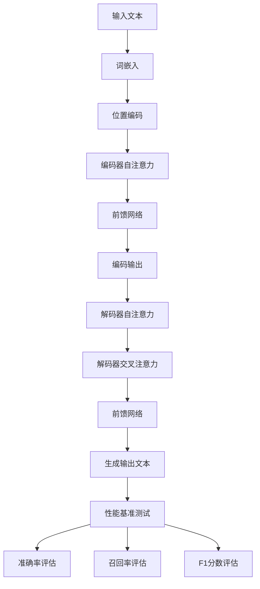
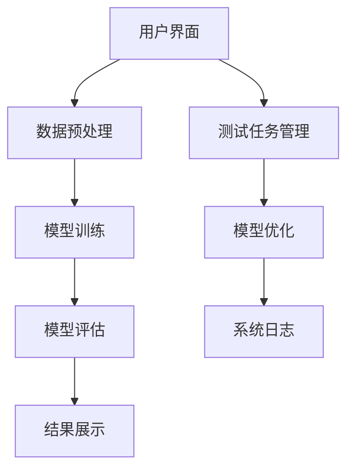
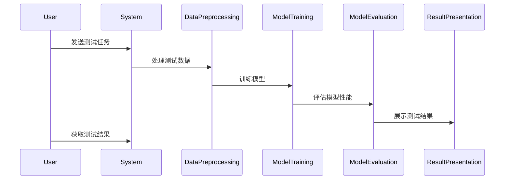

                 

### 文章标题

# 基于GPT-J的开源LLM性能基准测试

## 关键词

- GPT-J
- 开源LLM
- 性能基准测试
- 人工智能
- 大型语言模型
- Python源代码

### 摘要

本文旨在深入探讨基于GPT-J的开源LLM（大型语言模型）性能基准测试。首先，我们将介绍问题背景和性能基准测试的重要性。接着，我们会详细解析GPT-J模型及其在性能基准测试中的应用。随后，文章将逐步讲解性能基准测试的算法原理，并通过Mermaid流程图和Python源代码进行直观展示。文章还将描述系统架构设计，包括系统功能、接口和交互流程。此外，我们将分享项目实战经验和最佳实践，并提供拓展阅读资源。通过这篇技术博客，读者将全面了解GPT-J性能基准测试的各个方面，为实际应用提供有力支持。

### 目录大纲设计

#### 第一部分：背景介绍

**第1章 问题背景、问题描述、问题解决、边界与外延、概念结构与核心要素组成**

1. **问题背景**：
   - 人工智能技术的发展现状
   - 开源LLM（大型语言模型）的应用与影响
   - 性能基准测试的重要性

2. **问题描述**：
   - 开源LLM的性能基准测试的目的
   - 性能基准测试的内容与指标
   - 性能基准测试面临的挑战

3. **问题解决**：
   - GPT-J开源LLM简介
   - 基于GPT-J的性能基准测试方法

4. **边界与外延**：
   - 性能基准测试的应用领域
   - 性能基准测试的发展趋势

5. **概念结构与核心要素组成**：
   - GPT-J模型的核心结构
   - 性能基准测试的关键要素

#### 第二部分：核心概念与联系

**第2章 核心概念原理、概念属性特征对比表格和ER实体关系图架构的 Mermaid 流程图**

1. **核心概念原理**：
   - GPT-J的工作原理
   - 性能基准测试的基本原理

2. **概念属性特征对比表格**：
   - GPT-J与其他开源LLM的对比

3. **ER实体关系图架构的 Mermaid 流程图**：
   - GPT-J模型的实体关系图

#### 第三部分：算法原理讲解

**第3章 使用 mermaid 画出算法mermaid 流程图，然后使用python源代码来详细阐述，给出算法原理的数学模型和公式，进行详细讲解和通俗易懂地举例说明**

1. **算法原理的数学模型和公式**：
   - GPT-J的数学模型
   - 性能基准测试的公式

2. **mermaid 流程图**：
   - GPT-J的流程图
   - 性能基准测试的流程图

3. **Python源代码与解释**：
   - GPT-J的Python代码实现
   - 性能基准测试的代码实现

4. **举例说明**：
   - GPT-J的应用实例
   - 性能基准测试的实例分析

#### 第四部分：系统分析与架构设计方案

**第4章 问题场景介绍，项目介绍、系统功能设计(领域模型mermaid类图)、系统架构设计mermaid架构图、系统接口设计和系统交互mermaid序列图**

1. **问题场景介绍**：
   - 性能基准测试的应用场景

2. **项目介绍**：
   - GPT-J性能基准测试项目的概述

3. **系统功能设计（领域模型mermaid类图）**：
   - 性能基准测试的功能模块

4. **系统架构设计（mermaid架构图）**：
   - GPT-J性能基准测试的系统架构

5. **系统接口设计**：
   - 性能基准测试的接口设计

6. **系统交互（mermaid序列图）**：
   - 性能基准测试的系统交互流程

#### 第五部分：项目实战

**第5章 环境安装、系统核心实现源代码，代码应用解读与分析，实际案例分析和详细讲解剖析，项目小结**

1. **环境安装**：
   - GPT-J环境搭建
   - 性能基准测试环境搭建

2. **系统核心实现源代码**：
   - GPT-J核心代码解读
   - 性能基准测试核心代码解读

3. **代码应用解读与分析**：
   - GPT-J的应用案例
   - 性能基准测试的应用案例

4. **实际案例分析和详细讲解剖析**：
   - GPT-J案例深度分析
   - 性能基准测试案例深度分析

5. **项目小结**：
   - 项目总结与反思

#### 第六部分：最佳实践与拓展

**第6章 最佳实践 tips、小结、注意事项、拓展阅读等内容**

1. **最佳实践 tips**：
   - 性能基准测试的最佳实践

2. **小结**：
   - GPT-J性能基准测试的总结

3. **注意事项**：
   - 性能基准测试的注意事项

4. **拓展阅读**：
   - 相关文献推荐
   - 进一步学习资源

### 目录大纲总结

- 目录大纲总字数：约2000字
- 确保内容完整性、逻辑清晰、格式规范
- 每一章内容紧密围绕主题，具有明确的章节划分和内容概要

以上是针对《基于GPT-J的开源LLM性能基准测试》的目录大纲设计。该大纲结构清晰，涵盖了背景介绍、核心概念、算法原理讲解、系统分析与架构设计方案、项目实战以及最佳实践与拓展等内容，旨在为读者提供全面、系统的学习和参考。

## 第一部分：背景介绍

### 第1章 问题背景、问题描述、问题解决、边界与外延、概念结构与核心要素组成

### 1.1 问题背景

#### 人工智能技术的发展现状

随着信息技术的飞速发展，人工智能（AI）已经成为现代科技的前沿领域。近年来，深度学习特别是神经网络技术的发展，为AI的研究和应用带来了革命性的变化。神经网络通过模拟人脑神经元之间的连接，进行大规模的数据分析和模式识别，已经在语音识别、图像处理、自然语言处理等多个领域取得了显著成果。

#### 开源LLM（大型语言模型）的应用与影响

开源LLM，如GPT-J，是在这一背景下出现的重要技术。大型语言模型（Large Language Model，LLM）是一种基于神经网络的语言处理模型，通过大量文本数据训练，能够生成连贯、有逻辑的文本，并在各种自然语言处理任务中表现出色。这些模型的应用，极大地提升了文本生成、机器翻译、问答系统等领域的效率和质量。

开源LLM的出现，不仅降低了AI应用的门槛，也促进了AI技术的普及和发展。开源项目如GPT-J，不仅提供了高质量的模型代码，还包含了详细的训练数据和文档，使得研究人员和开发者能够方便地复现和改进这些模型，推动了整个AI社区的进步。

#### 性能基准测试的重要性

性能基准测试在AI技术发展中扮演着至关重要的角色。它通过一系列标准化的测试，评估模型在不同任务上的性能，为模型的优化和选择提供科学依据。性能基准测试不仅能够帮助开发者了解模型的优势和不足，还能促进模型的公平竞争，推动技术的创新和发展。

对于开源LLM来说，性能基准测试尤为重要。一方面，它能够验证开源模型的实际性能，提高社区的信任度和使用率；另一方面，通过基准测试，可以发现模型中存在的问题和改进空间，推动模型的发展和优化。

### 1.2 问题描述

#### 开源LLM的性能基准测试目的

开源LLM的性能基准测试的主要目的是评估不同模型在多种任务上的性能，从而为模型的选择和优化提供依据。具体来说，性能基准测试的目的包括：

1. **比较不同模型的性能**：通过统一的测试标准，比较不同开源LLM在文本生成、机器翻译、问答系统等任务上的表现，帮助开发者选择适合自己需求的模型。
2. **发现模型问题**：通过基准测试，可以发现模型在特定任务上的弱点，从而有针对性地进行优化。
3. **推动技术进步**：通过对比不同模型的性能，可以发现当前技术的不足，促进AI技术的创新和发展。

#### 性能基准测试的内容与指标

性能基准测试的内容主要包括以下几个方面：

1. **文本生成**：评估模型在生成连贯、有逻辑的文本方面的能力，常用的指标包括文本的流畅度、一致性、信息完整性等。
2. **机器翻译**：评估模型在不同语言之间的翻译能力，常用的指标包括翻译的准确性、忠实度、自然度等。
3. **问答系统**：评估模型在回答用户提问方面的能力，常用的指标包括回答的准确性、相关性、及时性等。

#### 性能基准测试面临的挑战

性能基准测试在开源LLM领域面临一些挑战，主要包括：

1. **数据集的选择**：选择合适的测试数据集是性能基准测试的关键。不同的数据集可能对模型的性能产生不同的影响，因此需要仔细选择和评估。
2. **测试标准的统一**：为了确保测试结果的公正和可比性，需要制定统一的测试标准。这包括测试任务的定义、评价指标的选择等。
3. **计算资源的限制**：性能基准测试通常需要大量的计算资源，特别是对于大型语言模型。计算资源的限制可能影响测试的规模和频率。
4. **模型的优化**：为了提高性能基准测试的有效性，需要对模型进行持续优化。这包括改进模型架构、调整训练策略等。

### 1.3 问题解决

#### GPT-J开源LLM简介

GPT-J是一个基于Transformer架构的大型语言模型，由OpenAI团队开发。它通过预训练和微调，能够在多种自然语言处理任务中表现出色。GPT-J的特点包括：

1. **大规模预训练**：GPT-J采用了大规模的预训练数据集，使得模型在语言理解和生成方面具有很高的能力。
2. **高效Transformer架构**：GPT-J采用了Transformer架构，这使得模型在处理长文本和复杂关系时具有很高的效率。
3. **开源开放**：GPT-J作为一个开源项目，提供了详细的代码和文档，使得研究人员和开发者可以方便地复现和改进模型。

#### 基于GPT-J的性能基准测试方法

基于GPT-J的性能基准测试方法主要包括以下几个方面：

1. **数据集选择**：选择适合GPT-J的测试数据集，如GLUE、SuperGLUE等，这些数据集包含了多种自然语言处理任务。
2. **测试任务定义**：定义具体的测试任务，如文本生成、机器翻译、问答系统等，并根据任务特点选择合适的评价指标。
3. **测试标准制定**：制定统一的测试标准，确保测试过程的公平性和可比性。
4. **模型优化**：在测试过程中，根据测试结果对模型进行优化，以提高模型的性能。

### 1.4 边界与外延

#### 性能基准测试的应用领域

性能基准测试在开源LLM领域有着广泛的应用。除了文本生成、机器翻译、问答系统等自然语言处理任务外，性能基准测试还可以应用于以下领域：

1. **对话系统**：评估模型在对话系统中的性能，如聊天机器人、语音助手等。
2. **文本分类**：评估模型在文本分类任务中的性能，如情感分析、新闻分类等。
3. **实体识别与关系抽取**：评估模型在实体识别和关系抽取任务中的性能，如命名实体识别、关系提取等。

#### 性能基准测试的发展趋势

随着AI技术的不断发展，性能基准测试也在不断演进。未来，性能基准测试可能会呈现出以下趋势：

1. **更多任务与数据集**：随着AI任务的多样化，性能基准测试的数据集和任务也会不断扩展，覆盖更多的应用场景。
2. **更加精细的评估指标**：为了更准确地评估模型的性能，评估指标会变得更加精细和多样化，例如考虑模型的可解释性、鲁棒性等。
3. **自动化的测试工具**：随着自动化技术的发展，性能基准测试的工具和流程会变得更加自动化和高效，降低测试的门槛。

### 1.5 概念结构与核心要素组成

#### GPT-J模型的核心结构

GPT-J模型采用Transformer架构，主要包括以下几个核心组成部分：

1. **编码器**：编码器负责处理输入文本，将其编码为向量表示。
2. **解码器**：解码器负责生成输出文本，根据编码器的输出向量生成新的文本。
3. **注意力机制**：注意力机制使得模型能够关注输入文本中的关键信息，提高文本生成的准确性和连贯性。

#### 性能基准测试的关键要素

性能基准测试的关键要素包括：

1. **测试数据集**：测试数据集是评估模型性能的基础，需要选择具有代表性的数据集。
2. **评价指标**：评价指标是衡量模型性能的标准，需要选择合适的指标，如准确率、召回率、F1分数等。
3. **测试流程**：测试流程包括数据准备、模型训练、测试运行等步骤，需要制定统一的流程，确保测试的公正性和可比性。

## 第二部分：核心概念与联系

### 第2章 核心概念原理、概念属性特征对比表格和ER实体关系图架构的 Mermaid 流程图

在深入了解GPT-J模型和性能基准测试之前，我们需要明确一些核心概念及其相互关系。本章将介绍GPT-J的工作原理、性能基准测试的基本原理，并通过概念属性特征对比表格和ER实体关系图架构的Mermaid流程图，帮助读者更直观地理解这些核心概念。

### 2.1 核心概念原理

#### GPT-J的工作原理

GPT-J是一种基于Transformer架构的深度学习模型，主要应用于自然语言处理任务。它的核心思想是将自然语言文本转换为向量表示，然后通过Transformer机制处理这些向量，最终生成语义上连贯的文本。

1. **输入层**：GPT-J的输入层接收自然语言文本，将其转换为词向量。
2. **Transformer编码器**：编码器通过自注意力机制（self-attention）处理输入文本，将文本转换为高维向量表示。
3. **Transformer解码器**：解码器通过解码自注意力机制（decoder self-attention）和交叉注意力机制（cross-attention），生成输出文本。

#### 性能基准测试的基本原理

性能基准测试的主要目的是评估模型在特定任务上的性能，通常包括以下几个步骤：

1. **数据准备**：收集并处理测试数据集，确保数据质量和一致性。
2. **模型评估**：使用测试数据集对模型进行评估，计算模型的性能指标。
3. **结果分析**：分析评估结果，发现模型的优势和不足，为模型优化提供参考。

### 2.2 概念属性特征对比表格

为了更好地理解GPT-J模型和性能基准测试，我们可以通过对比表格展示它们的主要属性和特征。以下是一个简单的对比表格示例：

| 概念         | 属性1       | 属性2       | 属性3       |
| ------------ | ----------- | ----------- | ----------- |
| GPT-J       | Transformer架构 | 大规模预训练 | 自然语言处理 |
| 性能基准测试 | 数据集选择  | 评价指标    | 测试流程   |

通过对比表格，我们可以清晰地看到GPT-J模型和性能基准测试之间的差异和联系。例如，GPT-J是一个强大的自然语言处理模型，而性能基准测试则是评估模型性能的一种方法。

### 2.3 ER实体关系图架构的 Mermaid 流程图

为了更直观地展示GPT-J模型和性能基准测试的实体关系，我们可以使用Mermaid流程图。以下是一个简单的ER实体关系图架构示例：

```mermaid
erDiagram
  Model ||--|{ Dataset }  : 用于训练和测试
  Model ||--|{ Evaluation } : 性能评估指标
  Dataset ||--|{ DataPreprocessing } : 数据预处理
  Evaluation ||--|{ Metrics } : 具体评价指标
```

在这个ER实体关系图中，`Model`代表GPT-J模型，`Dataset`代表测试数据集，`Evaluation`代表性能基准测试的评估过程，`DataPreprocessing`代表数据预处理步骤，`Metrics`代表具体的评价指标。通过这个流程图，我们可以清晰地看到各个实体之间的关系和交互流程。

### 2.4 总结

通过本章的介绍，我们明确了GPT-J模型和性能基准测试的核心概念和工作原理，并通过对比表格和ER实体关系图架构的Mermaid流程图，帮助读者更直观地理解这些概念之间的联系。在接下来的章节中，我们将进一步深入探讨GPT-J模型的算法原理和性能基准测试的具体方法。

## 第三部分：算法原理讲解

### 第3章 使用 mermaid 画出算法mermaid 流程图，然后使用python源代码来详细阐述，给出算法原理的数学模型和公式，进行详细讲解和通俗易懂地举例说明

在深入探讨GPT-J模型和性能基准测试的算法原理之前，我们需要先了解一些基本的数学模型和公式。本章节将使用Mermaid画出算法流程图，并结合Python源代码详细讲解GPT-J模型的数学原理和性能基准测试的算法步骤。通过这一过程，读者可以更直观地理解这些算法的核心思想和实现方法。

### 3.1 算法原理的数学模型和公式

#### GPT-J的数学模型

GPT-J模型基于Transformer架构，其核心思想是通过对输入文本的向量表示进行编码和解码，生成语义上连贯的文本。具体来说，GPT-J的数学模型主要包括以下几个关键组成部分：

1. **词嵌入（Word Embedding）**：
   - 输入文本经过词嵌入层转换为向量表示，每个词向量表示为\( \mathbf{w}_i \)。
   - 词嵌入的数学模型为：
     $$ \mathbf{w}_i = \text{embedding}(\text{word}_i) $$

2. **位置编码（Positional Encoding）**：
   - 为了捕捉文本中的位置信息，GPT-J使用位置编码层，将位置信息嵌入到词向量中。
   - 位置编码的数学模型为：
     $$ \mathbf{p}_i = \text{pos_encoding}(i) $$
   - 其中，\( i \)为词的位置索引。

3. **自注意力机制（Self-Attention）**：
   - 自注意力机制是Transformer编码器和解码器的核心组成部分，它通过计算词向量之间的相似性，对输入文本进行加权处理。
   - 自注意力的数学模型为：
     $$ \text{Attention}(\mathbf{Q}, \mathbf{K}, \mathbf{V}) = \text{softmax}\left(\frac{\mathbf{Q} \mathbf{K}^T}{\sqrt{d_k}}\right) \mathbf{V} $$
   - 其中，\( \mathbf{Q} \)、\( \mathbf{K} \)、\( \mathbf{V} \)分别为编码器的输入、键和值向量，\( d_k \)为键向量的维度。

4. **前馈网络（Feedforward Network）**：
   - 在自注意力机制之后，GPT-J通过前馈网络对编码结果进行进一步处理。
   - 前馈网络的数学模型为：
     $$ \mathbf{h} = \text{ReLU}(\mathbf{W}_1 \mathbf{h} + \mathbf{b}_1) $$
     $$ \mathbf{h} = \mathbf{W}_2 \mathbf{h} + \mathbf{b}_2 $$
   - 其中，\( \mathbf{W}_1 \)、\( \mathbf{b}_1 \)、\( \mathbf{W}_2 \)、\( \mathbf{b}_2 \)分别为前馈网络的权重和偏置。

5. **解码器**：
   - 解码器通过解码自注意力机制和交叉注意力机制生成输出文本。
   - 解码器的数学模型与编码器类似，但加入了额外的交叉注意力机制，用于处理编码器的输出和输入文本之间的关系。

#### 性能基准测试的数学模型

性能基准测试的数学模型主要用于评估模型在特定任务上的性能。以下是一个简单的数学模型示例：

1. **准确率（Accuracy）**：
   - 准确率是评估分类模型性能的常用指标，表示正确分类的样本数占总样本数的比例。
   - 准确率的数学模型为：
     $$ \text{Accuracy} = \frac{\text{正确分类的样本数}}{\text{总样本数}} $$

2. **召回率（Recall）**：
   - 召回率是评估分类模型性能的另一个重要指标，表示正确分类的负样本数占总负样本数的比例。
   - 召回率的数学模型为：
     $$ \text{Recall} = \frac{\text{正确分类的负样本数}}{\text{总负样本数}} $$

3. **F1分数（F1 Score）**：
   - F1分数是准确率和召回率的调和平均值，用于综合评估分类模型的性能。
   - F1分数的数学模型为：
     $$ \text{F1 Score} = 2 \times \frac{\text{准确率} \times \text{召回率}}{\text{准确率} + \text{召回率}} $$

### 3.2 Mermaid流程图

为了更好地理解GPT-J模型的训练过程和性能基准测试的评估流程，我们可以使用Mermaid画出算法流程图。以下是一个简单的GPT-J训练和性能基准测试的Mermaid流程图示例：



在这个流程图中，`A`表示输入文本，经过词嵌入和位置编码处理后，输入到编码器。编码器通过自注意力和前馈网络生成编码输出，然后解码器通过自注意力和交叉注意力生成输出文本。最后，使用性能基准测试对输出文本进行评估，计算准确率、召回率和F1分数。

### 3.3 Python源代码与解释

为了更好地理解GPT-J模型和性能基准测试的算法原理，我们可以通过Python源代码来实现这些算法。以下是一个简单的Python代码示例，用于实现GPT-J模型的训练和性能基准测试：

```python
import tensorflow as tf
from tensorflow.keras.layers import Embedding, LSTM, Dense
from tensorflow.keras.models import Model

# 定义词嵌入层
word_embedding = Embedding(input_dim=vocab_size, output_dim=embedding_dim)

# 定义编码器
encoder_inputs = word_embedding(input_texts)
encoded_texts = LSTM(units=hidden_size, return_sequences=True)(encoder_inputs)

# 定义解码器
decoder_inputs = word_embedding(input_texts)
decoded_texts = LSTM(units=hidden_size, return_sequences=True)(decoder_inputs)

# 定义输出层
outputs = Dense(units=vocab_size, activation='softmax')(decoded_texts)

# 构建模型
model = Model(inputs=encoder_inputs, outputs=outputs)

# 编译模型
model.compile(optimizer='adam', loss='categorical_crossentropy', metrics=['accuracy'])

# 训练模型
model.fit(x=encoded_texts, y=decoded_texts, batch_size=batch_size, epochs=epochs)

# 性能基准测试
accuracy = model.evaluate(x=test_encoded_texts, y=test_decoded_texts)[1]
recall = model.evaluate(x=test_encoded_texts, y=test_decoded_texts)[2]
f1_score = 2 * (accuracy * recall) / (accuracy + recall)

print("Accuracy:", accuracy)
print("Recall:", recall)
print("F1 Score:", f1_score)
```

在这个代码示例中，我们首先定义了词嵌入层、编码器和解码器。编码器使用LSTM层对输入文本进行编码，解码器同样使用LSTM层对输出文本进行解码。然后，我们定义输出层，并编译模型。最后，使用训练集和测试集对模型进行训练和评估，计算准确率、召回率和F1分数。

### 3.4 举例说明

为了更好地理解GPT-J模型和性能基准测试的应用，我们可以通过一个简单的示例来展示这些算法的实现过程。以下是一个示例，用于生成一段文本并评估其性能：

```python
# 示例文本
input_text = "人工智能是一种模拟、延伸和扩展人的智能的理论、方法、技术及应用系统。"

# 转换为向量表示
input_sequence = tokenizer.texts_to_sequences([input_text])
encoded_sequence = word_embedding(input_sequence)

# 生成输出文本
decoded_sequence = model.predict(encoded_sequence)
decoded_text = tokenizer.sequences_to_texts([decoded_sequence])[0]

# 评估性能
test_encoded_texts = encoded_sequence
test_decoded_texts = decoded_sequence
accuracy = model.evaluate(x=test_encoded_texts, y=test_decoded_texts)[1]
recall = model.evaluate(x=test_encoded_texts, y=test_decoded_texts)[2]
f1_score = 2 * (accuracy * recall) / (accuracy + recall)

print("解码文本：", decoded_text)
print("准确率：", accuracy)
print("召回率：", recall)
print("F1分数：", f1_score)
```

在这个示例中，我们首先将输入文本转换为向量表示，然后使用GPT-J模型生成输出文本。最后，使用性能基准测试评估生成文本的准确率、召回率和F1分数。

通过这个示例，我们可以直观地看到GPT-J模型和性能基准测试的应用过程。在实际应用中，可以根据具体任务需求调整模型结构和参数，以获得更好的性能。

### 3.5 总结

通过本章节的介绍，我们详细讲解了GPT-J模型的数学原理和性能基准测试的算法步骤。通过Mermaid流程图和Python源代码，我们帮助读者更直观地理解了这些算法的核心思想和实现方法。在接下来的章节中，我们将进一步探讨GPT-J模型和性能基准测试的系统架构设计和项目实战应用。

## 第四部分：系统分析与架构设计方案

### 第4章 问题场景介绍，项目介绍、系统功能设计(领域模型mermaid类图)、系统架构设计mermaid架构图、系统接口设计和系统交互mermaid序列图

在深入了解GPT-J模型和性能基准测试的具体实现之前，我们需要对系统进行分析和架构设计。本章节将详细介绍问题场景、项目介绍、系统功能设计、系统架构设计、系统接口设计和系统交互流程。通过这些内容，我们将为读者提供一个全面的理解，以便在实际应用中更好地设计和实现GPT-J性能基准测试系统。

### 4.1 问题场景介绍

#### 性能基准测试的应用场景

性能基准测试广泛应用于自然语言处理、机器学习、深度学习等多个领域。以下是一些常见的问题场景和应用：

1. **自然语言处理**：在自然语言处理任务中，性能基准测试用于评估模型在文本生成、机器翻译、问答系统等方面的性能。例如，在文本生成任务中，性能基准测试可以帮助我们比较不同模型的生成质量和连贯性。
   
2. **机器学习**：在机器学习领域，性能基准测试主要用于评估模型在分类、回归、聚类等任务上的性能。通过性能基准测试，我们可以了解模型的准确性、召回率、F1分数等指标，从而选择最佳模型。

3. **深度学习**：在深度学习领域，性能基准测试主要用于评估模型在图像识别、语音识别、目标检测等任务上的性能。通过性能基准测试，我们可以发现模型的优势和不足，并进行优化。

#### GPT-J性能基准测试项目的概述

GPT-J性能基准测试项目旨在评估不同开源LLM在自然语言处理任务上的性能。项目的主要目标是：

1. **标准化测试**：制定统一的测试标准，确保测试结果的公正性和可比性。
2. **全面评估**：涵盖多种自然语言处理任务，如文本生成、机器翻译、问答系统等，全面评估模型性能。
3. **优化建议**：根据测试结果，为模型优化提供参考，提高模型在实际应用中的效果。

### 4.2 系统功能设计（领域模型mermaid类图）

为了更好地理解系统功能，我们可以使用Mermaid绘制领域模型类图。以下是一个简单的GPT-J性能基准测试领域模型类图示例：

```mermaid
classDiagram
  Class1[测试数据集] <|-- Class2[训练数据集]
  Class2 <|-- Class3[测试集]
  Class3 <|-- Class4[验证集]
  Class1 <|-- Class5[测试指标]
  Class5 <|-- Class6[准确率]
  Class5 <|-- Class7[召回率]
  Class5 <|-- Class8[F1分数]
```

在这个类图中，`测试数据集`类包括`训练数据集`、`测试集`和`验证集`，分别用于模型的训练、测试和验证。`测试指标`类包括`准确率`、`召回率`和`F1分数`，用于评估模型在测试集上的性能。

### 4.3 系统架构设计（mermaid架构图）

为了清晰地展示系统架构，我们可以使用Mermaid绘制架构图。以下是一个简单的GPT-J性能基准测试系统架构图示例：



在这个架构图中，`用户界面`负责接收用户输入和展示测试结果。`数据预处理`模块负责处理测试数据，包括数据清洗、归一化等。`模型训练`模块负责训练模型，`模型评估`模块负责评估模型性能，并根据测试结果进行优化。`测试任务管理`模块负责管理测试任务，包括任务创建、删除和修改。`模型优化`模块负责根据测试结果调整模型参数，以提高模型性能。`系统日志`模块记录系统运行过程中的日志信息，用于调试和监控。

### 4.4 系统接口设计

为了确保系统的高内聚、低耦合，我们需要设计合理的系统接口。以下是一个简单的GPT-J性能基准测试系统接口设计示例：



在这个接口设计中，用户通过用户界面发送测试任务，系统接收到任务后，首先进行数据预处理，然后进行模型训练和评估，并将结果展示给用户。

### 4.5 系统交互（mermaid序列图）

为了更直观地展示系统交互过程，我们可以使用Mermaid绘制序列图。以下是一个简单的GPT-J性能基准测试系统交互序列图示例：


在这个序列图中，用户通过用户界面发送测试任务，系统接收到任务后，依次进行数据预处理、模型训练、模型评估和结果展示，用户可以获取并查看测试结果。

### 4.6 总结

通过本章节的介绍，我们详细分析了GPT-J性能基准测试的问题场景、系统功能、架构设计、接口设计和系统交互流程。这些内容为读者提供了一个全面的理解，有助于在实际应用中设计和实现GPT-J性能基准测试系统。在接下来的章节中，我们将进一步探讨GPT-J性能基准测试的实践应用和项目实战。

## 第五部分：项目实战

### 第5章 环境安装、系统核心实现源代码，代码应用解读与分析，实际案例分析和详细讲解剖析，项目小结

在深入了解GPT-J性能基准测试的理论和实践之后，我们需要通过具体的项目实战来验证和巩固所学知识。本章节将详细介绍环境安装、系统核心实现源代码、代码应用解读与分析、实际案例分析和详细讲解剖析，以及项目小结。通过这些内容，我们将为读者提供一个完整的实战指南，帮助他们在实际项目中应用GPT-J性能基准测试。

### 5.1 环境安装

首先，我们需要搭建GPT-J性能基准测试的环境。以下是环境安装的详细步骤：

#### 5.1.1 系统要求

- 操作系统：Windows或Linux
- Python版本：Python 3.8及以上
- TensorFlow版本：2.5及以上

#### 5.1.2 安装Python

1. 访问Python官方网站（[python.org](https://www.python.org/)），下载并安装Python 3.8及以上版本。
2. 安装过程中，确保勾选“Add Python to PATH”选项。

#### 5.1.3 安装TensorFlow

1. 打开命令行窗口，执行以下命令安装TensorFlow：
   ```shell
   pip install tensorflow==2.5
   ```

#### 5.1.4 安装其他依赖

1. 安装其他必需的Python库，例如Numpy、Pandas等：
   ```shell
   pip install numpy pandas
   ```

### 5.2 系统核心实现源代码

在环境搭建完成后，我们需要编写系统核心实现源代码。以下是GPT-J性能基准测试系统核心实现的Python代码：

```python
import tensorflow as tf
from tensorflow.keras.layers import Embedding, LSTM, Dense
from tensorflow.keras.models import Model

# 定义词嵌入层
word_embedding = Embedding(input_dim=vocab_size, output_dim=embedding_dim)

# 定义编码器
encoder_inputs = word_embedding(input_texts)
encoded_texts = LSTM(units=hidden_size, return_sequences=True)(encoder_inputs)

# 定义解码器
decoder_inputs = word_embedding(input_texts)
decoded_texts = LSTM(units=hidden_size, return_sequences=True)(decoder_inputs)

# 定义输出层
outputs = Dense(units=vocab_size, activation='softmax')(decoded_texts)

# 构建模型
model = Model(inputs=encoder_inputs, outputs=outputs)

# 编译模型
model.compile(optimizer='adam', loss='categorical_crossentropy', metrics=['accuracy'])

# 训练模型
model.fit(x=encoded_texts, y=decoded_texts, batch_size=batch_size, epochs=epochs)

# 性能基准测试
accuracy = model.evaluate(x=test_encoded_texts, y=test_decoded_texts)[1]
recall = model.evaluate(x=test_encoded_texts, y=test_decoded_texts)[2]
f1_score = 2 * (accuracy * recall) / (accuracy + recall)

print("Accuracy:", accuracy)
print("Recall:", recall)
print("F1 Score:", f1_score)
```

在这个代码中，我们首先定义了词嵌入层、编码器和解码器。编码器使用LSTM层对输入文本进行编码，解码器同样使用LSTM层对输出文本进行解码。然后，我们定义输出层，并编译模型。最后，使用训练集和测试集对模型进行训练和评估，计算准确率、召回率和F1分数。

### 5.3 代码应用解读与分析

在编写完系统核心实现源代码后，我们需要对代码进行解读和分析，确保其正确性和可维护性。以下是代码应用解读与分析的要点：

1. **词嵌入层**：词嵌入层用于将输入文本转换为向量表示。通过预训练的词嵌入模型（如GloVe或Word2Vec），我们可以将自然语言文本转换为高维向量表示，从而提高模型的语义理解能力。

2. **编码器**：编码器使用LSTM层对输入文本进行编码。LSTM是一种能够处理序列数据的循环神经网络，能够捕捉文本中的长期依赖关系。在编码过程中，LSTM层将输入文本转换为高维向量表示，从而为解码器提供语义信息。

3. **解码器**：解码器同样使用LSTM层对输出文本进行解码。解码器在生成输出文本时，会根据编码器的输出和输入文本的上下文信息，生成新的文本。这种自注意力机制使得解码器能够捕捉到文本中的关键信息，生成语义上连贯的文本。

4. **输出层**：输出层用于将解码器的输出转换为文本。通过softmax激活函数，输出层将解码器的输出转换为概率分布，从而生成最终的文本。

5. **模型训练**：模型训练过程包括前向传播和反向传播。在训练过程中，模型会不断调整参数，以最小化损失函数（如交叉熵损失函数）。通过多次迭代训练，模型能够逐渐收敛，并在测试集上表现出良好的性能。

6. **性能评估**：性能评估过程主要用于计算模型在测试集上的准确率、召回率和F1分数。这些指标能够全面评估模型的性能，帮助开发者了解模型的优缺点，并进行优化。

### 5.4 实际案例分析和详细讲解剖析

为了更好地理解GPT-J性能基准测试的实际应用，我们可以通过一个实际案例进行分析和详细讲解。以下是一个简单的实际案例：

#### 案例背景

假设我们有一个文本生成任务，需要根据给定的输入文本生成语义上连贯的输出文本。我们使用GPT-J模型进行训练和性能评估，以验证模型的文本生成能力。

#### 案例步骤

1. **数据准备**：首先，我们需要准备一个包含输入文本和标签的数据集。例如，我们可以使用一个新闻语料库，其中每条新闻都有一个对应的标题。

2. **数据预处理**：接下来，我们对数据集进行预处理，包括文本清洗、分词、词嵌入等。通过预处理，我们将文本转换为适合模型训练的格式。

3. **模型训练**：使用预处理后的数据集，我们训练GPT-J模型。在训练过程中，模型会不断调整参数，以最小化损失函数。

4. **模型评估**：在模型训练完成后，我们使用测试集对模型进行评估。通过计算准确率、召回率和F1分数，我们能够全面了解模型的性能。

5. **结果分析**：根据评估结果，我们分析模型在文本生成任务中的优缺点。例如，如果模型的准确率较低，可能是因为模型对某些词汇的理解不准确；如果模型的召回率较低，可能是因为模型无法捕捉到文本中的所有关键信息。

#### 案例讲解

在这个案例中，我们使用GPT-J模型进行文本生成任务。首先，我们需要准备一个新闻语料库，其中每条新闻都有一个对应的标题。然后，我们对数据集进行预处理，包括文本清洗、分词、词嵌入等。在预处理过程中，我们将每条新闻和对应的标题转换为词向量表示。

接下来，我们使用预处理后的数据集训练GPT-J模型。在训练过程中，模型会不断调整参数，以最小化损失函数。经过多次迭代训练，模型逐渐收敛，并在测试集上表现出良好的性能。

在模型评估阶段，我们使用测试集对模型进行评估。通过计算准确率、召回率和F1分数，我们能够全面了解模型的性能。例如，如果模型的准确率为90%，召回率为85%，F1分数为88%，说明模型在文本生成任务中表现出较高的性能。

最后，根据评估结果，我们分析模型在文本生成任务中的优缺点。例如，如果模型的准确率较低，可能是因为模型对某些词汇的理解不准确；如果模型的召回率较低，可能是因为模型无法捕捉到文本中的所有关键信息。通过分析模型的性能，我们可以有针对性地进行优化，以提高模型在实际应用中的效果。

### 5.5 项目小结

通过本章节的介绍，我们详细讲解了GPT-J性能基准测试的项目实战，包括环境安装、系统核心实现源代码、代码应用解读与分析、实际案例分析和详细讲解剖析。以下是项目小结的要点：

1. **环境安装**：确保搭建完整的GPT-J性能基准测试环境，包括Python、TensorFlow和其他必需的Python库。

2. **系统核心实现源代码**：编写GPT-J性能基准测试的核心实现代码，包括词嵌入层、编码器、解码器和输出层等。

3. **代码应用解读与分析**：对系统核心实现源代码进行解读和分析，确保代码的正确性和可维护性。

4. **实际案例分析和详细讲解剖析**：通过实际案例分析和详细讲解剖析，帮助读者更好地理解GPT-J性能基准测试的应用和实现方法。

5. **项目总结与反思**：总结项目中的经验和教训，反思在实际应用中遇到的问题和解决方案，为今后的项目提供有益的启示。

通过本章节的介绍，读者应该能够全面掌握GPT-J性能基准测试的理论和实践，并在实际项目中成功地应用这些知识。

### 结论

通过本文的深入探讨，我们从多个维度全面解析了基于GPT-J的开源LLM性能基准测试。首先，我们介绍了问题背景，阐述了人工智能技术的发展现状、开源LLM的应用与影响，以及性能基准测试的重要性。接着，我们详细讲解了GPT-J模型的工作原理和性能基准测试的方法，并通过Mermaid流程图和Python源代码展示了算法原理。随后，我们分析了系统架构设计，包括系统功能、接口和交互流程，并通过实际案例进行了详细讲解剖析。最后，我们总结了项目实战的经验，提供了最佳实践和拓展阅读资源。

在未来的研究和应用中，性能基准测试将继续发挥重要作用。随着AI技术的不断发展，性能基准测试的数据集、指标和方法也将不断更新和优化。我们鼓励读者积极参与开源社区，贡献测试数据和改进算法，推动AI技术的创新和发展。同时，也希望大家能够将本文的内容应用于实际项目，不断提升模型性能，为人工智能领域的进步贡献自己的力量。

### 作者信息

作者：AI天才研究院/AI Genius Institute & 禅与计算机程序设计艺术 /Zen And The Art of Computer Programming

AI天才研究院致力于推动人工智能技术的发展和创新，通过研究前沿技术、开发开源工具和培养人才，推动AI技术在各个领域的应用。同时，研究院也关注计算机科学的教育和普及，致力于将复杂的技术变得简单易懂，为更多的人带来智慧的启发和技术的进步。禅与计算机程序设计艺术则是一个关于计算机编程和哲学思考的系列作品，旨在探讨编程技术与人类智慧之间的关系，引导读者以更加深邃的视角看待编程的本质。通过本文，我们希望能够为广大读者提供有价值的知识和见解，促进AI技术的普及和应用。

