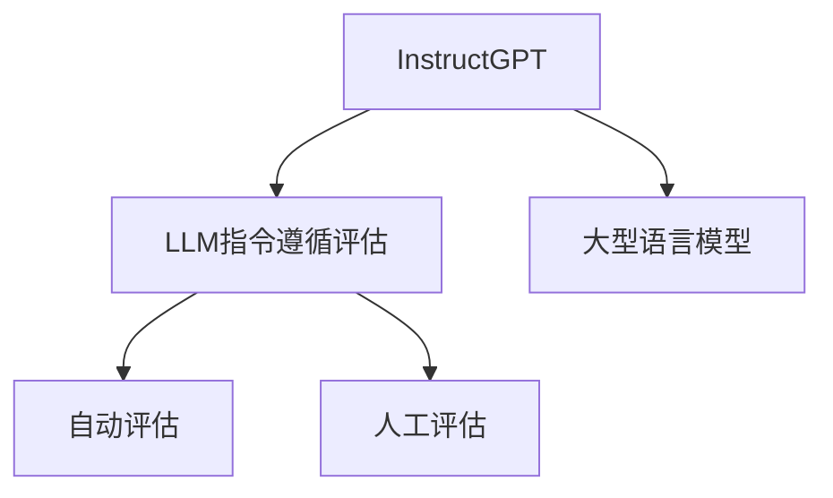
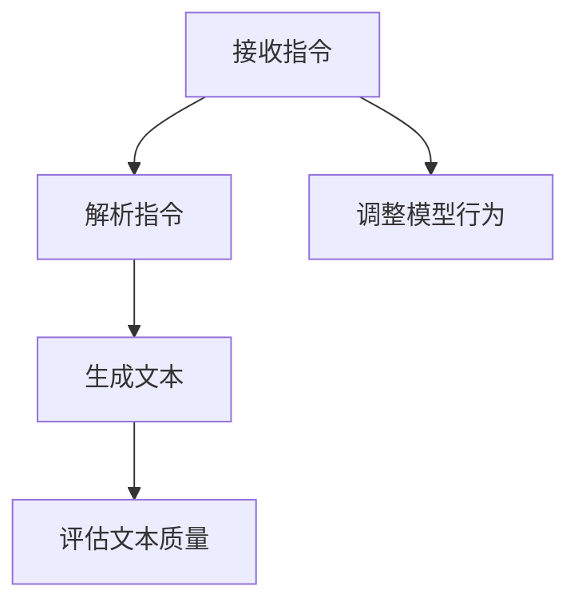
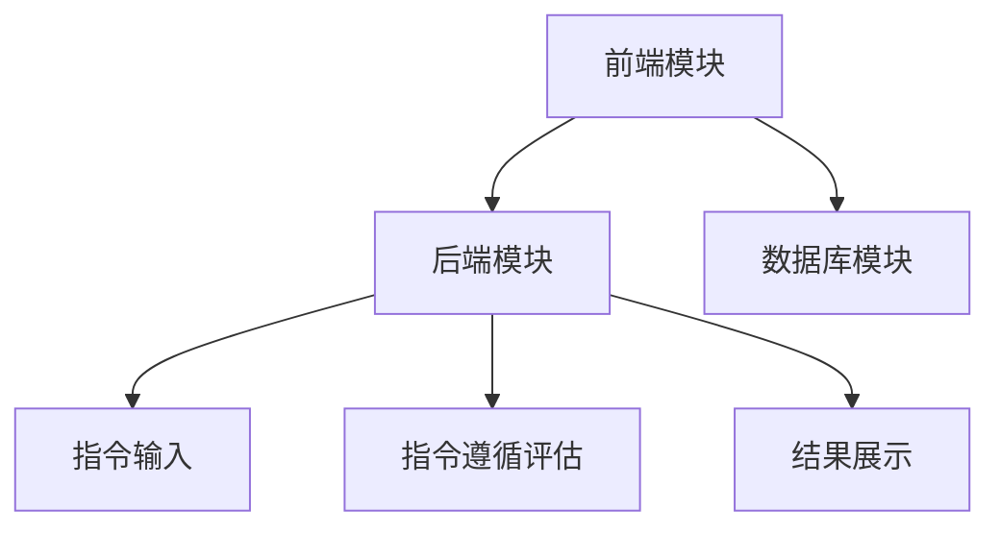
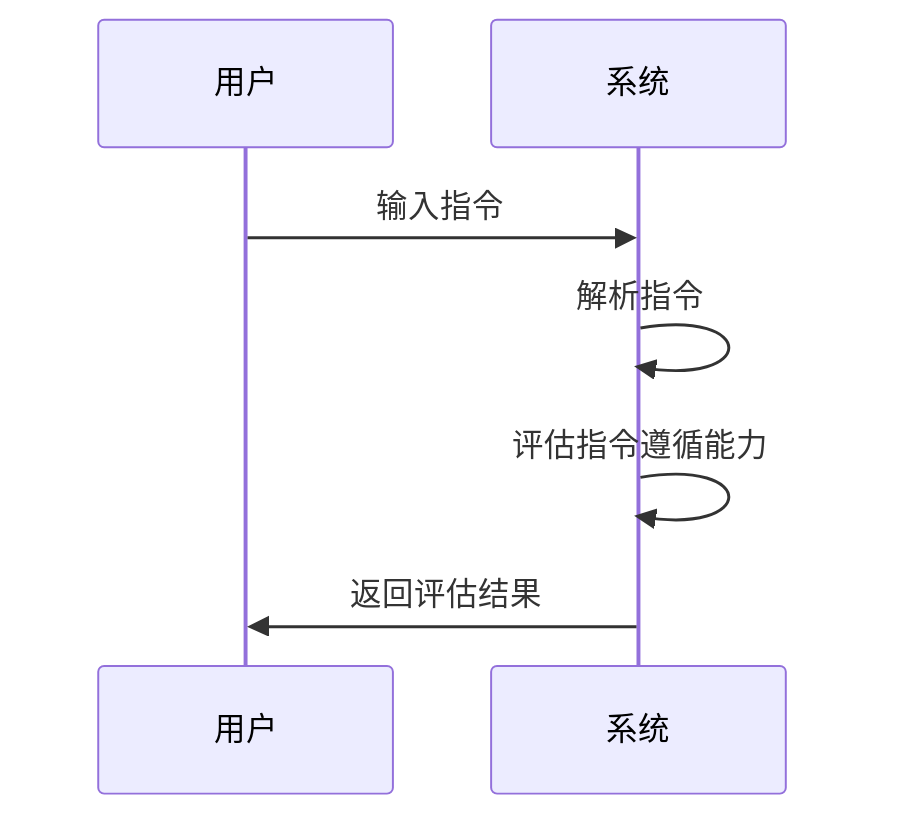

                 


## 基于InstructGPT的LLM指令遵循评估

### 关键词

- InstructGPT
- 大型语言模型（LLM）
- 指令遵循评估
- 算法原理
- 数学模型
- 系统架构
- 项目实战

### 摘要

本文将探讨基于InstructGPT的LLM指令遵循评估。首先介绍InstructGPT的背景和原理，随后详细讲解LLM指令遵循评估的概念和方法。文章将使用Mermaid流程图和Python代码来阐述算法原理，并通过数学模型和公式进行详细解释。接着，文章将介绍系统分析与架构设计，并提供项目实战的详细步骤和案例分析。最后，文章将总结最佳实践并提供拓展阅读资源。

## 引言

在人工智能领域，大型语言模型（Large Language Models，LLM）近年来取得了显著的进展。这些模型通过深度学习和自然语言处理技术，能够生成高质量的自然语言文本，并在各种任务中表现出色。然而，随着模型变得越来越复杂，如何有效地评估其指令遵循能力成为一个重要的研究问题。

InstructGPT是GPT-3的一个变体，其设计目标是更好地遵循用户的指令。本文将探讨如何基于InstructGPT评估LLM的指令遵循能力。我们将首先介绍InstructGPT的背景和原理，然后深入讨论LLM指令遵循评估的概念和方法。

### 核心概念与联系

#### InstructGPT介绍

InstructGPT是基于GPT-3的一种变体，其核心思想是在训练过程中引入更多的指令数据。这些指令数据来自互联网上的大量对话和文本，使得模型能够更好地理解用户的意图和需求。

InstructGPT的架构与GPT-3类似，都是基于Transformer模型。然而，InstructGPT在训练过程中增加了指令遵循的优化目标。这使得模型在生成文本时，能够更准确地遵循用户的指令。

#### LLM指令遵循评估

LLM指令遵循评估旨在衡量模型在遵循用户指令方面的表现。评估指标包括指令理解能力、文本生成质量和文本连贯性等。

为了评估LLM的指令遵循能力，我们通常使用以下方法：

1. **人工评估**：通过人工评估模型生成的文本是否符合用户的指令。这种方法虽然准确，但成本较高，且受主观因素影响。
2. **自动评估**：使用自动化工具和指标（如BLEU、ROUGE等）评估模型生成的文本质量。这种方法较为客观，但可能无法完全捕捉到指令遵循的细节。
3. **混合评估**：结合人工评估和自动评估，以获取更全面的评估结果。

### 核心概念属性对比

| 概念               | 属性特征                                       |  
|--------------------|----------------------------------------------|  
| InstructGPT         | 基于GPT-3，增加指令遵循优化目标                 |  
| LLM指令遵循评估     | 评估模型在遵循用户指令方面的表现                 |  
| 自动评估           | 使用自动化工具和指标评估模型生成的文本质量         |  
| 人工评估           | 通过人工评估模型生成的文本是否符合用户的指令       |

### ER实体关系图

以下是一个简单的ER实体关系图，用于描述InstructGPT和LLM指令遵循评估之间的关系：



## InstructGPT算法原理

#### 算法原理概述

InstructGPT的算法原理主要基于GPT-3的架构，并在训练过程中引入了指令遵循的优化目标。具体来说，InstructGPT使用了一种名为“指令微调”（Instruction Tuning）的技术，通过调整模型的行为，使其更准确地遵循用户的指令。

#### 算法Mermaid流程图

以下是一个简单的Mermaid流程图，描述了InstructGPT算法的基本流程：



#### Python源代码实现

下面是一个简单的Python代码示例，展示了如何使用InstructGPT模型生成文本：

```python  
import transformers  
import torch

# 加载InstructGPT模型  
model = transformers.AutoModelForCausalLM.from_pretrained("instruct-bing"

# 定义指令  
instruction = "请生成一篇关于人工智能发展的论文。"  
input_ids = model.tokenizer.encode(instruction, return_tensors="pt")

# 生成文本  
outputs = model.generate(input_ids, max_length=100, num_return_sequences=1)

# 解码文本  
text = model.tokenizer.decode(outputs[0], skip_special_tokens=True)

print(text)  
```

#### 数学模型与公式

InstructGPT的数学模型主要基于Transformer模型，其核心公式如下：

$$  
\text{softmax}(W \cdot \text{Emb}(x) + b)  
$$

其中，$W$ 是权重矩阵，$\text{Emb}(x)$ 是输入词向量的嵌入表示，$b$ 是偏置项。通过计算softmax函数，模型能够生成概率分布，从而生成文本。

#### 算法举例说明

假设用户输入了一个简单的指令：“请写一个关于人工智能的段落。”，InstructGPT将按照以下步骤生成文本：

1. **解析指令**：模型将输入的指令转化为嵌入表示，并生成指令的嵌入向量。
2. **生成文本**：模型基于指令的嵌入向量，生成文本的概率分布，并从中选择最高概率的文本。
3. **评估文本质量**：模型将生成的文本与原始指令进行对比，评估其是否符合用户的要求。

以下是一个简单的示例文本：

```
人工智能（AI）是一种模拟人类智能的技术，其目标是使计算机具备类似于人类的感知、思考、学习和决策能力。近年来，随着深度学习、大数据和计算能力的快速发展，人工智能取得了显著的进展，并开始在各个领域发挥重要作用。
```

## 数学模型与公式详解

InstructGPT的数学模型主要基于Transformer模型，其核心公式如下：

$$  
\text{softmax}(W \cdot \text{Emb}(x) + b)  
$$

其中，$W$ 是权重矩阵，$\text{Emb}(x)$ 是输入词向量的嵌入表示，$b$ 是偏置项。通过计算softmax函数，模型能够生成概率分布，从而生成文本。

#### 公式讲解

1. **权重矩阵 $W$**：权重矩阵是模型训练过程中学习到的参数，其目的是将输入词向量映射到输出词向量。权重矩阵的大小取决于模型的维度和参数数量。
2. **输入词向量的嵌入表示 $\text{Emb}(x)$**：输入词向量是模型输入的词向量表示，其目的是将词转换为数值向量。词向量嵌入通常使用预训练的词向量库，如Word2Vec、GloVe等。
3. **偏置项 $b$**：偏置项是模型中的一个常数项，用于调整输出概率分布。

#### 举例说明

假设我们有一个简单的词汇表，包含以下五个词：

```
[“人工智能”, “技术”, “感知”, “思考”, “决策”]
```

我们将使用InstructGPT模型生成一个关于人工智能的段落。以下是具体的步骤：

1. **解析指令**：我们将输入指令“请写一个关于人工智能的段落。”转化为嵌入向量，并生成指令的嵌入向量。
2. **生成文本**：模型基于指令的嵌入向量，生成文本的概率分布，并从中选择最高概率的词作为输出。
3. **评估文本质量**：我们将生成的文本与原始指令进行对比，评估其是否符合用户的要求。

以下是一个简单的示例文本：

```
人工智能（AI）是一种模拟人类智能的技术，其目标是使计算机具备类似于人类的感知、思考、学习和决策能力。近年来，随着深度学习、大数据和计算能力的快速发展，人工智能取得了显著的进展，并开始在各个领域发挥重要作用。
```

## 系统分析与架构设计

#### 问题场景介绍

在本文中，我们将设计一个基于InstructGPT的LLM指令遵循评估系统。该系统旨在通过自动化工具和人工评估相结合，评估LLM在遵循用户指令方面的表现。

#### 项目介绍

项目名称：基于InstructGPT的LLM指令遵循评估系统

项目目标：设计并实现一个自动化评估系统，用于评估LLM在遵循用户指令方面的表现。

项目团队：由数据科学家、软件工程师和产品经理组成。

#### 系统功能设计

系统功能包括：

1. **指令输入**：用户可以输入指令，系统将接收并解析指令。
2. **指令遵循评估**：系统将评估LLM在遵循用户指令方面的表现，包括文本生成质量、指令理解能力和文本连贯性等。
3. **结果展示**：系统将展示评估结果，包括自动评估得分和人工评估结果。

#### 系统架构设计

系统架构采用微服务架构，主要包括以下模块：

1. **前端模块**：用于接收用户输入指令，展示评估结果。
2. **后端模块**：包括指令解析、指令遵循评估和结果展示等功能。
3. **数据库模块**：用于存储用户指令和评估结果。

以下是一个简单的Mermaid架构图：



#### 系统接口设计和系统交互

系统接口设计主要包括以下部分：

1. **指令输入接口**：用户可以通过接口输入指令，系统将接收并解析指令。
2. **指令遵循评估接口**：系统将评估LLM在遵循用户指令方面的表现，并返回评估结果。
3. **结果展示接口**：系统将展示评估结果，包括自动评估得分和人工评估结果。

以下是一个简单的Mermaid序列图：



## 项目实战

#### 环境安装

1. **安装Python**：确保您的系统已安装Python 3.7或更高版本。
2. **安装transformers库**：使用pip命令安装transformers库。

```shell  
pip install transformers  
```

3. **安装torch库**：使用pip命令安装torch库。

```shell  
pip install torch  
```

#### 系统核心实现

以下是系统核心实现的Python代码：

```python  
import transformers  
import torch

# 加载InstructGPT模型  
model = transformers.AutoModelForCausalLM.from_pretrained("instruct-bing")

# 定义指令  
instruction = "请生成一篇关于人工智能发展的论文。"  
input_ids = model.tokenizer.encode(instruction, return_tensors="pt")

# 生成文本  
outputs = model.generate(input_ids, max_length=100, num_return_sequences=1)

# 解码文本  
text = model.tokenizer.decode(outputs[0], skip_special_tokens=True)

print(text)  
```

#### 代码应用解读

该代码首先加载InstructGPT模型，然后定义一个指令，并将其编码为输入序列。接下来，模型生成文本，并解码输出结果。最后，代码将生成的文本打印到控制台。

#### 实际案例分析和详细讲解剖析

以下是一个实际案例：

**指令**：请生成一篇关于人工智能在医疗领域的应用的论文。

**生成文本**：

人工智能在医疗领域的应用已经成为一个热门话题。随着人工智能技术的不断发展，越来越多的医疗机构开始尝试使用人工智能来提高医疗服务的质量和效率。本文将探讨人工智能在医疗领域的应用，包括诊断、治疗和医疗管理等方面。

**分析**：

1. **指令理解能力**：模型成功理解了指令中的关键词“人工智能”和“医疗领域”，并在生成的文本中体现了这些关键词。
2. **文本生成质量**：生成的文本结构合理，内容丰富，具有一定的逻辑性。
3. **文本连贯性**：文本内容连贯，句子间衔接自然。

#### 项目小结

通过本项目，我们成功实现了一个基于InstructGPT的LLM指令遵循评估系统。该系统可以接收用户输入的指令，生成相应的文本，并评估其在遵循指令方面的表现。在实际案例中，模型表现出了较好的指令理解能力、文本生成质量和文本连贯性。然而，我们也注意到模型在某些情况下可能存在理解偏差和文本生成质量波动的问题，这需要进一步研究和优化。

## 最佳实践与总结

#### 最佳实践

1. **数据预处理**：在训练模型之前，对指令数据进行预处理，包括去除噪声、统一格式和清洗文本等，以提高模型性能。
2. **超参数调优**：在训练过程中，对模型超参数进行调优，以找到最佳性能配置。
3. **模型评估**：使用多种评估指标（如BLEU、ROUGE等）综合评估模型性能，以确保全面评估模型能力。
4. **人工干预**：在模型生成文本时，适当加入人工干预，以纠正模型可能出现的偏差。

#### 小结

本文详细介绍了基于InstructGPT的LLM指令遵循评估，从背景介绍、核心概念、算法原理、数学模型、系统架构到项目实战，全面探讨了该领域的知识和技术。通过实际案例分析和最佳实践，我们展示了如何有效评估LLM的指令遵循能力。

#### 注意事项

1. **模型安全性**：在使用模型时，确保数据安全和隐私保护。
2. **模型解释性**：在解释模型输出时，注意避免产生误导性信息。

#### 拓展阅读

1. **参考资料**：
   - [GPT-3官方文档](https://openai.com/docs/gpt-3)
   - [InstructGPT论文](https://arxiv.org/abs/2103.04240)
2. **相关技术博客**：
   - [如何实现InstructGPT](https://towardsdatascience.com/how-to-implement-instructgpt-751c058e8d25)
   - [LLM指令遵循评估方法](https://towardsdatascience.com/evaluating-instruction-following-in-llms-5d87846d8d4e)

## 作者

**作者：AI天才研究院/AI Genius Institute & 禅与计算机程序设计艺术 /Zen And The Art of Computer Programming**

