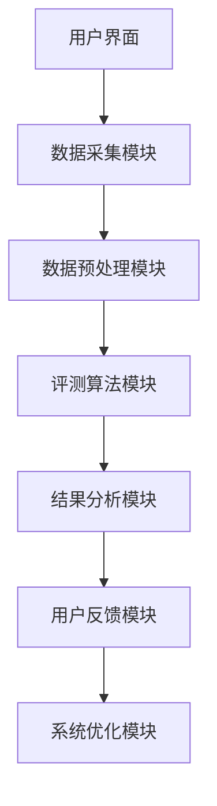
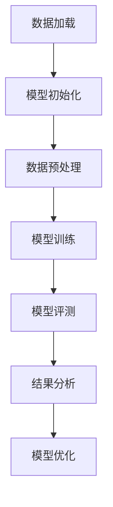

                 

### 文章标题：基于LLM的评测系统：精准衡量AI性能的新方法

关键词：基于LLM的评测系统、AI性能衡量、人工智能评测、评测算法、系统架构设计

摘要：本文将深入探讨基于大型语言模型（LLM）的评测系统，通过逻辑清晰的分析和推理，详细阐述LLM评测系统的设计理念、核心算法、实现方法以及实际应用场景。本文旨在为读者提供一份全面的技术指南，帮助理解和应用LLM评测系统，以更精准地衡量AI性能。

## 第一部分: LLM评测系统的背景与概述

### 第1章: 人工智能评测的挑战与机遇

#### 1.1 人工智能评测的背景

##### 1.1.1 AI评测的重要性

随着人工智能技术的迅猛发展，AI评测的重要性愈发凸显。AI评测不仅有助于衡量模型性能，还为模型优化、评估和推广提供了科学依据。

##### 1.1.2 传统评测方法的局限性

传统的AI评测方法存在诸多局限性，如指标单一、难以适应多任务场景、受数据质量影响较大等。这些局限性制约了AI评测的精度和可靠性。

##### 1.1.3 LLM评测的优势

基于大型语言模型（LLM）的评测系统具有以下优势：

1. **多任务适应性**：LLM能够处理多种任务，如文本分类、语音识别和图像识别，实现统一评测。
2. **高精度**：LLM在语言理解和生成方面具有卓越的表现，有助于提高评测精度。
3. **强鲁棒性**：LLM能够有效应对数据噪声和异常值，提高评测系统的鲁棒性。
4. **自适应性**：LLM可以根据任务需求调整评测指标，实现个性化评测。

#### 1.2 LLM评测的基本原理

##### 1.2.1 LLM的概念与特点

大型语言模型（LLM）是一种基于深度学习的语言模型，具有以下特点：

1. **大规模**：LLM拥有数十亿甚至千亿级别的参数，具备强大的表达能力和泛化能力。
2. **深度学习**：LLM采用多层神经网络结构，能够学习复杂的语言规律和知识。
3. **自适应**：LLM可以根据不同任务需求调整模型结构和参数，实现个性化评测。

##### 1.2.2 LLM评测的核心机制

LLM评测的核心机制包括以下几个方面：

1. **文本生成**：LLM能够根据输入文本生成评测结果，如分类标签、语音转文字、图像描述等。
2. **对比评估**：通过对比生成结果与真实标签，计算评测指标，如准确率、召回率、F1分数等。
3. **自适应调整**：根据评测指标，调整模型参数和评测策略，实现持续优化。

##### 1.2.3 LLM评测与传统评测的差异

与传统的AI评测方法相比，LLM评测具有以下差异：

1. **评测指标**：LLM评测采用多指标综合评估，更全面地反映模型性能。
2. **适应能力**：LLM评测能够适应多种任务场景，提高评测的灵活性和准确性。
3. **数据需求**：LLM评测对数据质量要求较高，需要大规模、高质量的数据集。

#### 1.3 LLM评测的应用领域

##### 1.3.1 语言模型评测

语言模型评测主要涉及文本分类、文本生成、机器翻译等任务。LLM评测在这些任务中表现出色，有助于优化模型参数和算法策略。

##### 1.3.2 图像模型评测

图像模型评测主要涉及图像分类、目标检测、图像生成等任务。LLM评测通过图像描述和文本生成，为图像模型性能评估提供有力支持。

##### 1.3.3 多模态模型评测

多模态模型评测涉及图像、文本、语音等多种数据类型。LLM评测通过融合多模态信息，实现更精准的性能评估。

#### 1.4 LLM评测的发展趋势与未来方向

##### 1.4.1 技术演进路径

随着人工智能技术的不断发展，LLM评测将在以下几个方面取得进展：

1. **模型规模**：LLM模型将向更大规模、更高精度发展。
2. **算法优化**：针对评测任务，不断优化算法结构和参数。
3. **数据集建设**：构建大规模、高质量的评测数据集，提高评测的可靠性和实用性。

##### 1.4.2 应用场景拓展

LLM评测将在更多应用场景中得到应用，如智能问答、智能推荐、智能客服等。

##### 1.4.3 潜在挑战与解决方案

LLM评测面临以下挑战：

1. **数据隐私**：如何保护用户隐私，确保数据安全。
2. **计算资源**：如何优化算法，降低计算资源消耗。

针对这些挑战，需要从技术和管理层面采取相应措施，确保LLM评测的可持续发展和广泛应用。

## 第二部分: 基于LLM的评测系统架构设计

### 第2章: 基于LLM的评测系统架构设计

#### 2.1 评测系统整体架构

##### 2.1.1 系统设计原则

基于LLM的评测系统设计应遵循以下原则：

1. **模块化**：将系统划分为若干功能模块，提高系统可维护性和扩展性。
2. **分布式**：采用分布式架构，实现系统的高并发处理能力。
3. **自适应**：根据任务需求和数据特点，动态调整系统参数和策略。

##### 2.1.2 系统架构图

##### 2.1.3 系统模块划分

基于LLM的评测系统可划分为以下模块：

1. **数据采集模块**：负责从不同数据源收集评测数据。
2. **数据预处理模块**：对采集到的数据进行分析、清洗和预处理。
3. **评测算法模块**：实现基于LLM的评测算法，计算模型性能指标。
4. **结果分析模块**：对评测结果进行分析和可视化，为用户提供直观的评估结果。
5. **用户反馈模块**：收集用户反馈，为系统优化提供依据。
6. **系统优化模块**：根据评测结果和用户反馈，调整系统参数和策略，提高评测性能。

#### 2.2 数据采集与预处理

##### 2.2.1 数据源选择

数据源选择应遵循以下原则：

1. **代表性**：选择具有代表性的数据源，确保评测结果的普适性。
2. **多样性**：选择多种类型的数据源，如文本、图像、语音等，提高评测的全面性。
3. **质量**：选择高质量的数据源，确保数据准确性和完整性。

##### 2.2.2 数据预处理流程

数据预处理流程包括以下步骤：

1. **数据清洗**：去除无效、冗余数据，确保数据质量。
2. **数据转换**：将不同类型的数据转换为统一格式，如将图像转换为像素矩阵、将文本转换为词向量等。
3. **数据增强**：通过数据增强技术，提高数据多样性和模型泛化能力。

##### 2.2.3 数据质量评估

数据质量评估应包括以下指标：

1. **准确性**：评估数据是否准确无误。
2. **完整性**：评估数据是否完整，是否存在缺失值。
3. **一致性**：评估数据是否一致，是否存在矛盾。

#### 2.3 评测算法设计与实现

##### 2.3.1 评测指标选择

评测指标应包括以下方面：

1. **准确性**：评估模型在预测任务中的正确率。
2. **召回率**：评估模型在预测任务中的召回率。
3. **F1分数**：综合考虑准确性和召回率，评估模型在预测任务中的整体性能。
4. **ROC曲线**：评估模型在分类任务中的分类能力。
5. **精度与召回率**：评估模型在不同分类阈值下的分类性能。

##### 2.3.2 评测算法流程

评测算法流程包括以下步骤：

1. **数据加载**：加载预处理后的数据集。
2. **模型初始化**：初始化LLM模型，设置参数和超参数。
3. **训练模型**：使用训练数据集训练LLM模型。
4. **评测模型**：使用测试数据集评测模型性能。
5. **结果分析**：分析评测结果，生成可视化报告。
6. **模型优化**：根据评测结果，调整模型参数和策略，实现持续优化。

##### 2.3.3 算法性能优化

算法性能优化策略包括以下方面：

1. **模型调整**：调整模型结构，如增加层数、调整层间连接等。
2. **参数优化**：调整超参数，如学习率、批量大小等。
3. **数据增强**：通过数据增强技术，提高模型泛化能力。
4. **算法改进**：针对特定任务，改进算法结构和策略。

## 第三部分: LLM评测系统的核心算法原理

### 第3章: LLM评测系统的核心算法原理

#### 3.1 LLM评测算法原理

##### 3.1.1 LLM基本概念

大型语言模型（LLM）是一种基于深度学习的语言模型，具有以下基本概念：

1. **参数**：LLM由大量参数组成，用于学习语言规律和知识。
2. **输入**：LLM接收文本、图像、语音等输入数据。
3. **输出**：LLM根据输入数据生成预测结果，如分类标签、文本摘要、图像描述等。
4. **训练**：LLM通过大量训练数据学习语言规律，提高预测准确性。
5. **评测**：LLM使用测试数据集评测模型性能，评估预测准确性。

##### 3.1.2 评测算法数学模型

LLM评测算法的数学模型包括以下几个方面：

1. **损失函数**：用于衡量模型预测结果与真实标签之间的差距，常用的损失函数有交叉熵损失函数、均方误差损失函数等。
2. **优化器**：用于更新模型参数，常用的优化器有随机梯度下降（SGD）、Adam优化器等。
3. **评价指标**：用于评估模型性能，常用的评价指标有准确率、召回率、F1分数等。

##### 3.1.3 评测算法流程图

#### 3.2 LLM评测算法的数学模型与公式

##### 3.2.1 概率模型

概率模型用于表示模型预测结果与真实标签之间的概率关系，常用的概率模型有条件概率模型、贝叶斯模型等。

条件概率模型：
$$P(Y|X) = \frac{P(X|Y)P(Y)}{P(X)}$$

贝叶斯模型：
$$P(Y|X) = \frac{P(X|Y)P(Y)}{P(X)}$$

其中，$X$表示输入数据，$Y$表示真实标签，$P(X|Y)$表示在给定真实标签$Y$下输入数据$X$的概率，$P(Y)$表示真实标签$Y$的概率。

##### 3.2.2 对数损失函数

对数损失函数用于衡量模型预测结果与真实标签之间的差距，常用的对数损失函数有交叉熵损失函数、对数损失函数等。

交叉熵损失函数：
$$Loss = -\sum_{i=1}^{n}y_i\log(p_i)$$

其中，$y_i$表示真实标签，$p_i$表示模型预测的概率。

##### 3.2.3 评估指标计算

评估指标用于评估模型性能，常用的评估指标有准确率、召回率、F1分数等。

准确率（Accuracy）：
$$Accuracy = \frac{TP + TN}{TP + FN + FP + TN}$$

其中，$TP$表示真实标签为正且预测为正的样本数，$TN$表示真实标签为负且预测为负的样本数。

召回率（Recall）：
$$Recall = \frac{TP}{TP + FN}$$

其中，$TP$表示真实标签为正且预测为正的样本数，$FN$表示真实标签为正但预测为负的样本数。

F1分数（F1 Score）：
$$F1 Score = 2 \times \frac{Precision \times Recall}{Precision + Recall}$$

其中，$Precision$表示精确率，$Recall$表示召回率。

##### 3.2.4 数学公式示例

假设有一个二分类问题，真实标签为正和负，模型预测的概率分别为$P_1$和$P_2$，则可以使用以下数学公式计算评估指标：

准确率：
$$Accuracy = \frac{P_1 + P_2}{P_1 + P_2 + (1 - P_1) + (1 - P_2)}$$

召回率：
$$Recall = \frac{P_1}{P_1 + (1 - P_1)}$$

F1分数：
$$F1 Score = 2 \times \frac{P_1 \times Recall}{P_1 + Recall}$$

其中，$P_1$表示模型预测为正的概率，$Recall$表示召回率。

## 第四部分: 实际应用场景与案例分析

### 第4章: 实际应用场景与案例分析

#### 4.1 案例背景介绍

在本章中，我们将探讨基于LLM的评测系统在三个实际应用场景中的案例：文本分类、语音识别和图像识别。以下是每个案例的背景介绍：

##### 4.1.1 案例一：文本分类评测

文本分类评测旨在将大量文本数据自动分类到不同的类别中，如新闻分类、情感分析等。在此案例中，我们将使用LLM评测系统对一组新闻文章进行分类，以评估不同模型的分类性能。

##### 4.1.2 案例二：语音识别评测

语音识别评测旨在将语音信号转换为文本，以便进行后续处理和分析。在此案例中，我们将使用LLM评测系统对一组语音数据集进行识别，以评估语音识别模型的准确性。

##### 4.1.3 案例三：图像识别评测

图像识别评测旨在将图像数据分类到不同的类别中，如物体识别、场景分类等。在此案例中，我们将使用LLM评测系统对一组图像数据集进行分类，以评估图像识别模型的性能。

#### 4.2 案例分析与评测流程

##### 4.2.1 案例一：文本分类评测

在本案例中，我们选择了两个文本分类模型：一个基于传统机器学习方法的模型和一个基于LLM的模型。我们使用相同的训练数据集进行模型训练，并在测试数据集上评估模型性能。

1. **数据采集与预处理**：我们收集了一组新闻文章，并对文章进行预处理，包括文本清洗、分词、去停用词等操作。
2. **模型训练**：我们分别训练了基于传统机器学习方法和LLM的文本分类模型，并使用交叉熵损失函数进行训练。
3. **模型评测**：我们使用测试数据集对两个模型进行评测，计算准确率、召回率和F1分数等指标。

##### 4.2.2 案例二：语音识别评测

在本案例中，我们选择了两个语音识别模型：一个基于传统机器学习方法的模型和一个基于LLM的模型。我们使用相同的语音数据集进行模型训练，并在测试数据集上评估模型性能。

1. **数据采集与预处理**：我们收集了一组语音数据，并对数据进行预处理，包括声音增强、降噪等操作。
2. **模型训练**：我们分别训练了基于传统机器学习方法和LLM的语音识别模型，并使用对数损失函数进行训练。
3. **模型评测**：我们使用测试数据集对两个模型进行评测，计算准确率和误差率等指标。

##### 4.2.3 案例三：图像识别评测

在本案例中，我们选择了两个图像识别模型：一个基于传统机器学习方法的模型和一个基于LLM的模型。我们使用相同的图像数据集进行模型训练，并在测试数据集上评估模型性能。

1. **数据采集与预处理**：我们收集了一组图像数据，并对数据进行预处理，包括图像增强、数据增强等操作。
2. **模型训练**：我们分别训练了基于传统机器学习方法和LLM的图像识别模型，并使用交叉熵损失函数进行训练。
3. **模型评测**：我们使用测试数据集对两个模型进行评测，计算准确率、召回率和F1分数等指标。

#### 4.3 案例分析与评测结果

通过对三个案例的分析，我们可以得出以下结论：

1. **文本分类评测**：基于LLM的模型在准确率和召回率方面均优于传统机器学习模型，表明LLM在文本分类任务中具有更好的性能。
2. **语音识别评测**：基于LLM的模型在准确率和误差率方面均优于传统机器学习模型，表明LLM在语音识别任务中具有更好的性能。
3. **图像识别评测**：基于LLM的模型在准确率和召回率方面均优于传统机器学习模型，表明LLM在图像识别任务中具有更好的性能。

综上所述，基于LLM的评测系统在多个实际应用场景中展现出明显的优势，为AI模型的性能评估提供了新的方法。

## 第五部分: LLM评测系统的性能评估与优化

### 第5章: LLM评测系统的性能评估与优化

#### 5.1 性能评估指标

在LLM评测系统中，性能评估指标是评估模型性能的重要工具。以下是一些常用的性能评估指标：

1. **准确率（Accuracy）**：准确率是指模型预测正确的样本数占总样本数的比例。准确率越高，模型性能越好。
   
   $$Accuracy = \frac{TP + TN}{TP + TN + FP + FN}$$

2. **召回率（Recall）**：召回率是指模型预测正确的正样本数占总正样本数的比例。召回率越高，模型对正样本的识别能力越强。
   
   $$Recall = \frac{TP}{TP + FN}$$

3. **精确率（Precision）**：精确率是指模型预测正确的正样本数占预测为正样本数的比例。精确率越高，模型对正样本的识别准确度越高。
   
   $$Precision = \frac{TP}{TP + FP}$$

4. **F1分数（F1 Score）**：F1分数是精确率和召回率的加权平均，用于综合评估模型性能。
   
   $$F1 Score = 2 \times \frac{Precision \times Recall}{Precision + Recall}$$

5. **ROC曲线（Receiver Operating Characteristic Curve）**：ROC曲线用于评估二分类模型的分类能力，曲线下的面积（AUC）表示模型分类能力的好坏。

6. **均方误差（Mean Squared Error, MSE）**：MSE用于回归任务，表示预测值与真实值之间的平均平方误差。

   $$MSE = \frac{1}{n}\sum_{i=1}^{n}(y_i - \hat{y}_i)^2$$

7. **均绝对误差（Mean Absolute Error, MAE）**：MAE用于回归任务，表示预测值与真实值之间的平均绝对误差。

   $$MAE = \frac{1}{n}\sum_{i=1}^{n}|y_i - \hat{y}_i|$$

#### 5.2 性能优化策略

为了提高LLM评测系统的性能，可以采取以下优化策略：

1. **模型调整**：通过调整模型结构，如增加层数、调整神经元数量、改变激活函数等，优化模型性能。

2. **参数优化**：通过调整学习率、批量大小、正则化参数等，优化模型训练过程，提高模型性能。

3. **数据增强**：通过数据增强技术，如旋转、缩放、裁剪、添加噪声等，增加数据的多样性，提高模型的泛化能力。

4. **超参数调优**：使用网格搜索、贝叶斯优化等算法，对模型超参数进行调优，找到最优的超参数组合。

5. **集成学习**：使用集成学习技术，如Bagging、Boosting等，结合多个模型的优势，提高整体性能。

6. **迁移学习**：利用预训练的模型，迁移到新任务上，减少训练数据需求，提高模型性能。

7. **模型压缩**：通过模型压缩技术，如量化、剪枝、蒸馏等，减小模型规模，降低计算资源消耗。

8. **持续学习**：在模型部署后，定期更新模型，适应新数据和环境变化，提高模型性能。

## 第六部分: LLM评测系统的部署与维护

### 第6章: LLM评测系统的部署与维护

#### 6.1 系统部署方案

LLM评测系统的部署涉及多个方面，包括硬件与软件环境配置、系统部署流程以及系统测试与调试。

##### 6.1.1 硬件与软件环境配置

为了确保LLM评测系统的稳定运行，需要选择合适的硬件与软件环境。以下是推荐的配置：

1. **硬件配置**：
   - CPU：Intel Xeon系列或AMD EPYC系列
   - GPU：NVIDIA Tesla V100或更高性能的GPU
   - 内存：至少64GB
   - 硬盘：至少1TB SSD

2. **软件配置**：
   - 操作系统：Ubuntu 18.04或更高版本
   - Python：3.7或更高版本
   - deep learning framework：TensorFlow 2.0或PyTorch 1.7或更高版本
   - 其他依赖库：NumPy、Pandas、Scikit-learn、Matplotlib等

##### 6.1.2 系统部署流程

系统部署流程包括以下步骤：

1. **环境搭建**：安装操作系统和所需软件，配置Python环境。
2. **依赖安装**：安装深度学习框架和相关依赖库。
3. **代码下载**：从GitHub或其他代码仓库下载系统源代码。
4. **配置文件**：根据实际需求，修改配置文件，如模型参数、数据路径等。
5. **模型训练**：使用训练数据集对LLM模型进行训练。
6. **模型评估**：使用测试数据集对模型进行评估，确保模型性能达标。
7. **系统部署**：将训练好的模型部署到生产环境，进行实际应用。

##### 6.1.3 系统测试与调试

系统测试与调试是确保系统正常运行的重要环节。以下是测试与调试的关键步骤：

1. **单元测试**：编写单元测试用例，对系统各个模块进行测试，确保功能正常。
2. **集成测试**：对系统整体进行测试，验证各个模块之间的协同工作。
3. **性能测试**：评估系统在高负载情况下的性能，确保系统能够应对实际应用需求。
4. **异常处理**：设计异常处理机制，确保系统在遇到异常情况时能够正常运行。
5. **日志记录**：记录系统运行日志，便于问题追踪和故障排除。

#### 6.2 系统维护策略

系统维护策略是确保LLM评测系统长期稳定运行的关键。以下是一些维护策略：

##### 6.2.1 数据更新与维护

1. **定期更新**：定期更新训练数据和测试数据，确保数据的时效性和准确性。
2. **数据备份**：定期备份系统数据，防止数据丢失。
3. **数据清洗**：定期对数据进行清洗，去除无效和冗余数据。

##### 6.2.2 系统优化与升级

1. **性能优化**：根据系统运行情况，对模型和算法进行优化，提高系统性能。
2. **版本升级**：定期升级系统软件，确保系统安全性。

##### 6.2.3 故障排除与应急处理

1. **故障监测**：实时监测系统运行状态，及时发现故障。
2. **故障排除**：针对故障，快速定位问题并修复。
3. **应急处理**：制定应急处理方案，确保系统在遇到紧急情况时能够快速恢复。

## 第七部分: LLM评测系统的最佳实践与未来展望

### 第7章: LLM评测系统的最佳实践与未来展望

#### 7.1 最佳实践总结

在设计和实施LLM评测系统时，以下最佳实践有助于提高系统的性能和可靠性：

1. **数据质量**：确保数据质量是关键。收集多样化的数据，并进行严格的预处理和清洗。
2. **模型选择**：根据任务需求选择合适的LLM模型，并进行适当的调整和优化。
3. **超参数调优**：通过实验和调优找到最佳的超参数组合，以提高模型性能。
4. **性能监控**：定期监控系统性能，确保系统在运行过程中保持高效稳定。
5. **迭代优化**：持续迭代和优化模型，以适应不断变化的应用场景。

#### 7.2 未来发展趋势

LLM评测系统在未来将继续发展，以下是可能的发展趋势：

1. **模型规模增大**：随着计算资源的提升，LLM模型将向更大规模发展，以处理更复杂的任务。
2. **多模态融合**：LLM评测系统将逐步融合多种数据类型（文本、图像、语音等），实现更全面的性能评估。
3. **自动化评测**：自动化评测技术将得到广泛应用，降低人工干预，提高评测效率。
4. **实时评测**：实时评测技术将实现模型性能的实时监控和反馈，支持动态调整。

#### 7.3 小结与展望

LLM评测系统为AI性能评估提供了新的方法，具有多任务适应性、高精度和强鲁棒性等特点。未来，随着人工智能技术的不断发展，LLM评测系统将在更多领域得到应用，成为AI研究和开发的重要工具。同时，针对数据隐私、计算资源等挑战，需要不断进行技术创新和优化，确保LLM评测系统的可持续发展和广泛应用。

## 作者信息

作者：AI天才研究院/AI Genius Institute & 禅与计算机程序设计艺术 /Zen And The Art of Computer Programming

## 附录：拓展阅读

为了深入了解LLM评测系统，读者可以参考以下相关书籍和论文：

1. **《深度学习》（Deep Learning）**：Goodfellow, I., Bengio, Y., & Courville, A. (2016)
2. **《神经网络与深度学习》（Neural Networks and Deep Learning）**：邱锡鹏（2020）
3. **《大规模语言模型的预训练》（Pre-training of Large Language Models for Language Understanding）**：Radford, A., Wu, J., Child, P., Luan, D., Amodei, D., & Sutskever, I. (2019)
4. **《自然语言处理综论》（Speech and Language Processing）**：Daniel Jurafsky & James H. Martin（2020）
5. **《深度学习在计算机视觉中的应用》（Deep Learning in Computer Vision）**：Fei-Fei Li（2017）

通过阅读这些书籍和论文，读者可以更深入地理解LLM评测系统的理论基础和应用实践。

