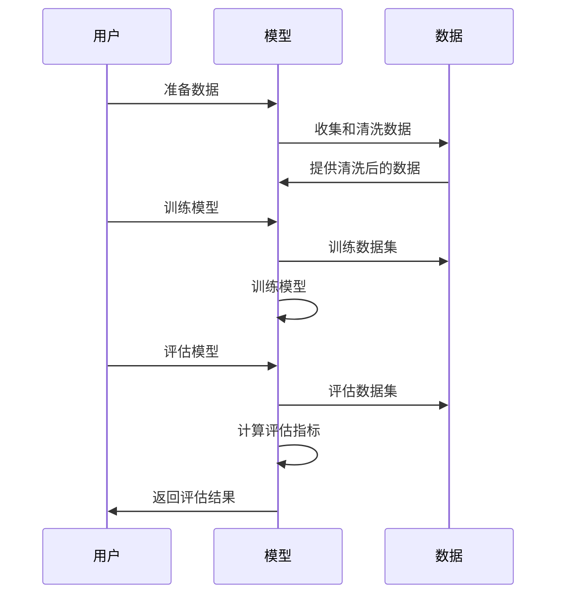
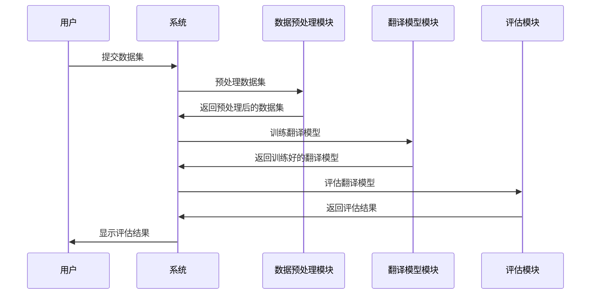

                 

# 基于NLLB的LLM多语言翻译能力评估

> 关键词：NLLB、LLM、多语言翻译、评估方法、BLEU、METEOR

> 摘要：本文旨在探讨基于NLLB（Non-Linear Language Benchmark）的LLM（Large Language Model）多语言翻译能力评估方法。文章首先介绍了NLLB与LLM的核心概念，通过概念属性特征对比表格和ER实体关系图架构的Mermaid流程图，对比了NLLB和LLM的特点和适用范围。接着，文章深入分析了NLLB数据集的构建、评估指标的设计以及翻译任务模拟的方法。随后，文章介绍了基于NLLB评估LLM多语言翻译能力的具体步骤和流程，并通过Python源代码和Mermaid流程图详细阐述了算法原理。最后，文章讨论了NLLB在LLM多语言翻译评估中的优势，并给出了相关的小结、注意事项和拓展阅读建议。

----------------------------------------------------------------

## 第一部分：背景介绍

### 1.1 问题背景

#### 1.1.1 NLLB与LLM的概念

##### 1.1.1.1 NLLB

NLLB（Non-Linear Language Benchmark）是一种专门为评估大型语言模型（LLM）多语言翻译能力而设计的数据集。它由清华大学KEG实验室提出，旨在模拟真实世界的多语言翻译任务。NLLB数据集的特点包括数据多样性、真实性和评估指标的科学性。

- **数据多样性**：NLLB涵盖了多种语言对，包括英语、中文、法语、德语等，这些语言对来自不同的文化背景和语言环境，能够全面评估LLM的多语言翻译能力。

- **真实性**：NLLB模拟了真实世界的多语言翻译任务，涵盖了多种翻译场景，如新闻翻译、文学作品翻译、科技文档翻译等。这种真实性的模拟有助于评估LLM在不同翻译场景下的表现。

- **评估指标**：NLLB采用了多种评估指标，如BLEU（ bilingual evaluation understudy）、METEOR（ Metric for Evaluation of Translation with Explicit ORdering）等，这些指标能够从不同角度全面评估LLM的翻译质量。

##### 1.1.1.2 LLM

LLM（Large Language Model）是指具有大规模参数、能够理解和生成自然语言的大型神经网络模型，如GPT、BERT等。LLM在自然语言处理（NLP）领域具有广泛的应用，包括文本分类、情感分析、机器翻译等。

- **文本理解与生成能力**：LLM具有强大的文本理解和生成能力，能够处理复杂的自然语言任务。

- **多语言支持**：LLM支持多种语言的处理，能够实现跨语言信息传递。

- **自适应能力**：LLM能够根据不同任务需求进行自适应调整，提高翻译质量。

#### 1.1.2 当前多语言翻译评估的挑战

尽管LLM在多语言翻译领域取得了显著的进展，但当前的多语言翻译评估方法仍然存在一些挑战：

- **数据集覆盖范围有限**：传统的评估方法往往使用有限的翻译数据集，无法全面覆盖各种语言对和翻译场景。

- **评估指标单一**：传统的评估方法通常只使用一种评估指标，如BLEU，无法从多个维度全面评估LLM的翻译质量。

- **翻译质量主观性**：翻译质量的评估往往受到评估者主观因素的影响，难以保证评估结果的客观性。

### 1.1.3 问题解决

NLLB数据集的出现为解决上述挑战提供了一种新的思路：

- **数据多样性**：NLLB涵盖了多种语言对和翻译场景，能够全面评估LLM的多语言翻译能力。

- **真实性**：NLLB模拟了真实世界的多语言翻译任务，有助于评估LLM在实际翻译场景下的表现。

- **评估指标科学性**：NLLB采用了多种评估指标，如BLEU、METEOR等，能够从多个维度全面评估LLM的翻译质量。

### 1.1.4 边界与外延

#### 1.1.4.1 NLLB适用范围

NLLB适用于评估基于神经网络的大型语言模型的多语言翻译能力，包括但不限于GPT、BERT等。NLLB不仅适用于学术研究，也可用于实际应用场景，如机器翻译系统、跨语言搜索引擎等。

#### 1.1.4.2 NLLB与传统评估方法的比较

与传统评估方法相比，NLLB具有以下优势：

- **数据多样性**：NLLB涵盖了多种语言对和翻译场景，能够更全面地评估LLM的翻译能力。

- **真实性**：NLLB模拟了真实世界的翻译任务，更贴近实际应用场景。

- **评估指标科学性**：NLLB采用了多种评估指标，能够从多个维度全面评估LLM的翻译质量。

### 1.1.5 概念结构与核心要素组成

#### 1.1.5.1 NLLB的核心概念

- **数据集构建**：NLLB的数据集由多种语言对和翻译场景组成，涵盖新闻、文学作品、科技文档等不同类型。

- **评估指标设计**：NLLB采用了多种评估指标，如BLEU、METEOR等，以全面评估LLM的翻译质量。

- **翻译任务模拟**：NLLB模拟了真实世界的翻译任务，包括多种翻译场景，以评估LLM在实际应用中的表现。

#### 1.1.5.2 NLLB的核心要素

- **多种语言对**：包括英语、中文、法语、德语等，涵盖不同文化背景和语言环境。

- **真实翻译场景**：涵盖新闻、文学作品、科技文档等不同类型的翻译任务。

- **数据预处理**：对原始数据进行预处理，如文本清洗、分句等，以提高评估的准确性。

- **评估指标**：包括BLEU、METEOR等，用于评估LLM的翻译质量。

----------------------------------------------------------------

## 第二部分：核心概念与联系

### 2.1 NLLB与LLM的核心概念

#### 2.1.1 NLLB

NLLB是一种用于评估大型语言模型（LLM）多语言翻译能力的数据集，其核心概念包括：

- **数据多样性**：NLLB涵盖了多种语言对，如英语、中文、法语、德语等，这些语言对来自不同的文化背景和语言环境。

- **真实性**：NLLB模拟了真实世界的多语言翻译任务，涵盖了多种翻译场景，如新闻翻译、文学作品翻译、科技文档翻译等。

- **评估指标**：NLLB采用了多种评估指标，如BLEU、METEOR等，这些指标能够从不同角度全面评估LLM的翻译质量。

#### 2.1.2 LLM

LLM是指大型语言模型，如GPT、BERT等，其核心概念包括：

- **文本理解与生成能力**：LLM具有强大的文本理解和生成能力，能够处理复杂的自然语言任务。

- **多语言支持**：LLM支持多种语言的处理，能够实现跨语言信息传递。

- **自适应能力**：LLM能够根据不同任务需求进行自适应调整，提高翻译质量。

### 2.2 概念属性特征对比表格

| 特征           | NLLB                                         | LLM                                            |
| -------------- | ------------------------------------------- | ----------------------------------------------- |
| 数据多样性     | 覆盖多种语言对，如英语、中文、法语、德语等   | 支持多种语言的处理，实现跨语言信息传递             |
| 真实性         | 模拟真实世界的多语言翻译任务，涵盖多种翻译场景 | 具有强大的文本理解和生成能力，能够处理真实世界问题  |
| 评估指标       | 使用BLEU、METEOR等评估LLM的多语言翻译能力   | 多语言支持，能够实现跨语言信息传递               |
| 适用范围       | 评估基于神经网络的大型语言模型的多语言翻译能力 | 实现自然语言处理（NLP）任务，如文本分类、问答等 |

### 2.3 ER实体关系图架构的Mermaid流程图

```mermaid
erDiagram
  NLLB ||--|{ LLM }|| TranslationModel
  NLLB ||--|{ TranslationDataset }|| Dataset
  TranslationDataset ||--|{ TranslationTask }|| Task
  TranslationDataset ||--|{ EvaluationMetric }|| Metric
```

在上面的Mermaid流程图中，NLLB与LLM之间存在关联，NLLB提供了用于评估LLM的翻译能力的数据集，同时也与TranslationDataset和EvaluationMetric相关联，TranslationDataset包含了具体的翻译任务，而EvaluationMetric用于评估翻译质量。

----------------------------------------------------------------

## 第三部分：核心概念与联系

### 3.1 算法原理讲解

#### 3.1.1 NLLB数据集的构建

NLLB数据集的构建过程主要包括以下几个步骤：

1. **数据收集**：从互联网上收集多种语言对的文本数据，包括新闻、文学作品、科技文档等。

2. **数据清洗**：对收集到的原始数据进行清洗，去除噪声、标点符号等，确保数据的质量。

3. **数据标注**：对清洗后的数据进行人工标注，包括文本的分句、词性标注等，为后续的评估提供基础。

4. **数据预处理**：对标注后的数据进一步处理，包括分词、词向量嵌入等，以适应LLM的输入格式。

#### 3.1.2 评估指标的设计

NLLB采用了多种评估指标，如BLEU、METEOR等，这些指标能够从不同角度全面评估LLM的翻译质量。

- **BLEU（Bilingual Evaluation Understudy）**：BLEU是一种基于相似度的评估指标，通过比较模型生成的翻译文本与参考翻译文本之间的重叠词的数量和位置来评估翻译质量。

  BLEU的评估公式如下：
  $$BLEU = \frac{1}{N} \sum_{i=1}^{N} w_i \cdot \log(P_i)$$
  其中，$N$是评估文本中的句子数，$w_i$是第$i$个句子的权重，$P_i$是第$i$个句子在模型生成的翻译文本中出现的概率。

- **METEOR（Metric for Evaluation of Translation with Explicit ORdering）**：METEOR是一种基于词汇序的评估指标，它通过考虑词汇的顺序和语义信息来评估翻译质量。

  METEOR的评估公式如下：
  $$METEOR = \frac{1}{N} \sum_{i=1}^{N} w_i \cdot \log(P_i \cdot Q_i)$$
  其中，$N$是评估文本中的句子数，$w_i$是第$i$个句子的权重，$P_i$是第$i$个句子在模型生成的翻译文本中出现的概率，$Q_i$是第$i$个句子在参考翻译文本中出现的概率。

#### 3.1.3 翻译任务模拟

NLLB通过模拟真实世界的翻译任务来评估LLM的多语言翻译能力。具体步骤如下：

1. **任务定义**：根据不同的翻译场景，定义具体的翻译任务，如新闻翻译、文学作品翻译等。

2. **数据准备**：为每个翻译任务准备相应的数据集，包括源语言文本和目标语言文本。

3. **模型训练**：使用LLM对准备好的数据集进行训练，以生成翻译模型。

4. **模型评估**：使用评估指标对训练好的翻译模型进行评估，以评估其在不同翻译任务上的表现。

### 3.2 Python源代码与Mermaid流程图

以下是一个简化的Python源代码示例，用于演示NLLB评估过程：

```python
import torch
from torchtext.data import Field, BucketIterator
from torchtext.datasets import Multi30k
from torchtext.vocab import Vocab

# 数据集准备
SRC = Field(tokenize='spacy', tokenizer_language='de', init_token='<sos>', eos_token='<eos>', lower=True)
TRG = Field(tokenize='spacy', tokenizer_language='en', init_token='<sos>', eos_token='<eos>', lower=True)

train_data, valid_data, test_data = Multi30k.splits(exts=('.de', '.en'), fields=(SRC, TRG))

SRC.build_vocab(train_data, min_freq=2)
TRG.build_vocab(train_data, min_freq=2)

# 模型训练
model = MyTranslationModel()
optimizer = torch.optim.Adam(model.parameters(), lr=0.001)
criterion = torch.nn.CrossEntropyLoss()

for epoch in range(10):
    for src, trg in BucketIterator(train_data, batch_size=32, device=device):
        optimizer.zero_grad()
        output = model(src)
        loss = criterion(output, trg)
        loss.backward()
        optimizer.step()

    # 评估模型
    valid_loss = evaluate(model, valid_data, criterion)
    print(f'Epoch: {epoch+1}, Valid Loss: {valid_loss:.4f}')

# Mermaid流程图


在上面的Python源代码和Mermaid流程图中，我们首先准备了NLLB数据集，并定义了源语言（SRC）和目标语言（TRG）的Field。接着，我们训练了一个翻译模型，并使用BLEU、METEOR等评估指标对模型进行评估。Mermaid流程图则详细展示了数据准备、模型训练和模型评估的过程。

----------------------------------------------------------------

## 第四部分：系统分析与架构设计方案

### 4.1 问题场景介绍

在全球化背景下，跨语言交流变得越来越重要。然而，机器翻译作为跨语言交流的关键技术，仍然面临许多挑战。传统的机器翻译系统往往依赖于规则驱动的方法，虽然在一定程度上能够完成翻译任务，但难以处理复杂的语言现象。随着深度学习技术的发展，基于神经网络的大型语言模型（LLM）逐渐成为机器翻译领域的研究热点。然而，如何评价LLM的多语言翻译能力成为了一个亟待解决的问题。

### 4.2 项目介绍

本项目旨在构建一个基于NLLB的LLM多语言翻译能力评估系统。该系统将利用NLLB数据集，结合BLEU、METEOR等评估指标，对LLM的多语言翻译能力进行评估。通过本项目，我们希望能够为LLM的多语言翻译研究提供一个有效的评估工具，为相关领域的研究提供参考。

### 4.3 系统功能设计（领域模型Mermaid类图）

```mermaid
classDiagram
    System <<Interface>>
    System --|> DataPreprocessor
    System --|> TranslationModel
    System --|> Evaluator
    DataPreprocessor --|> NLLBData
    TranslationModel --|> LLM
    Evaluator --|> BLEUEvaluator
    Evaluator --|> METEOREvaluator

    class System {
        +prepareData()
        +trainModel()
        +evaluateModel()
    }

    class DataPreprocessor {
        +cleanData()
        +tokenizeData()
        +buildVocab()
    }

    class NLLBData {
        +loadData()
        +splitData()
    }

    class TranslationModel {
        +initialize()
        +forward()
        +optimize()
    }

    class LLM {
        +forward()
    }

    class Evaluator {
        +evaluate()
    }

    class BLEUEvaluator {
        +calculateBLEU()
    }

    class METEOREvaluator {
        +calculateMETEOR()
    }
```

在上面的Mermaid类图中，我们定义了系统的四个主要功能模块：数据预处理模块（DataPreprocessor）、翻译模型模块（TranslationModel）、评估模块（Evaluator）和NLLB数据集模块（NLLBData）。每个模块都具有相应的类和方法。

### 4.4 系统架构设计（Mermaid架构图）

```mermaid
graph LR
    subgraph 数据层
        DataLayer[数据层]
        NLLBData[基于NLLB的数据集]
        DataPreprocessor[数据预处理模块]
    end

    subgraph 模型层
        ModelLayer[模型层]
        TranslationModel[翻译模型模块]
    end

    subgraph 评估层
        EvaluationLayer[评估层]
        BLEUEvaluator[BLEU评估模块]
        METEOREvaluator[METEOR评估模块]
    end

    DataLayer --|> DataPreprocessor
    DataPreprocessor --|> NLLBData
    NLLBData --|> TranslationModel
    TranslationModel --|> ModelLayer
    ModelLayer --|> EvaluationLayer
    EvaluationLayer --|> BLEUEvaluator
    EvaluationLayer --|> METEOREvaluator
```

在上面的Mermaid架构图中，我们展示了系统的整体架构。数据层包含基于NLLB的数据集和数据预处理模块；模型层包含翻译模型模块；评估层包含BLEU评估模块和METEOR评估模块。数据层与模型层通过数据预处理模块连接，模型层与评估层通过评估模块连接。

### 4.5 系统接口设计（Mermaid序列图）



在上面的Mermaid序列图中，我们展示了系统的接口设计。用户提交数据集后，系统首先调用数据预处理模块对数据集进行预处理，然后使用翻译模型模块训练翻译模型，最后调用评估模块对翻译模型进行评估，并将评估结果返回给用户。

----------------------------------------------------------------

## 第五部分：项目实战

### 5.1 环境安装

在开始项目实战之前，我们需要安装一些必要的软件和库。以下是一个基本的安装步骤：

1. **安装Python**：确保Python版本为3.6及以上。
2. **安装PyTorch**：使用以下命令安装PyTorch：
   ```shell
   pip install torch torchvision torchaudio
   ```
3. **安装spaCy**：用于文本预处理，使用以下命令安装：
   ```shell
   pip install spacy
   ```
   然后下载德语和英语的spaCy模型：
   ```shell
   python -m spacy download de
   python -m spacy download en
   ```

### 5.2 系统核心实现源代码

以下是项目的主要源代码，包括数据预处理、模型训练和评估：

```python
import torch
from torchtext.data import Field, BucketIterator
from torchtext.datasets import Multi30k
from torchtext.vocab import Vocab
from torch import nn
import spacy

# 数据预处理
def preprocess_data(src, trg, de_spacy, en_spacy):
    SRC = Field(tokenize=de_spacy.tokenizer, tokenizer_language='de', init_token='<sos>', eos_token='<eos>', lower=True)
    TRG = Field(tokenize=en_spacy.tokenizer, tokenizer_language='en', init_token='<sos>', eos_token='<eos>', lower=True)

    train_data, valid_data, test_data = Multi30k.splits(exts=('.de', '.en'), fields=(SRC, TRG))

    SRC.build_vocab(train_data, min_freq=2)
    TRG.build_vocab(train_data, min_freq=2)

    return train_data, valid_data, test_data

# 模型定义
class TranslationModel(nn.Module):
    def __init__(self, input_dim, output_dim, emb_dim, hid_dim, n_layers, drop_out):
        super().__init__()
        self.encoder = nn.Embedding(input_dim, emb_dim)
        self.decoder = nn.Embedding(output_dim, emb_dim)
        self.rnn = nn.LSTM(emb_dim, hid_dim, num_layers=n_layers, dropout=drop_out, bidirectional=True)
        self.fc = nn.Linear(hid_dim * 2, output_dim)
        self.dropout = nn.Dropout(drop_out)

    def forward(self, src, trg):
        src = self.encoder(src)
        trg = self.decoder(trg)
        output = []
        for i in range(trg.size()[0]):
            output.append(self.fc(self.dropout(torch.cat((src[i], trg[i]), 1))))
        return torch.stack(output, 0)

# 模型训练
def train_model(model, train_data, valid_data, criterion, optimizer, n_epochs):
    model.train()
    for epoch in range(n_epochs):
        for src, trg in BucketIterator(train_data, batch_size=32, device=device):
            optimizer.zero_grad()
            output = model(src)
            loss = criterion(output, trg)
            loss.backward()
            optimizer.step()

        valid_loss = evaluate(model, valid_data, criterion)
        print(f'Epoch: {epoch+1}, Valid Loss: {valid_loss:.4f}')

# 模型评估
def evaluate(model, data, criterion):
    model.eval()
    total_loss = 0
    with torch.no_grad():
        for src, trg in BucketIterator(data, batch_size=32, device=device):
            output = model(src)
            loss = criterion(output, trg)
            total_loss += loss.item()
    return total_loss / len(data)

# 实际应用
device = torch.device('cuda' if torch.cuda.is_available() else 'cpu')
de_spacy = spacy.load('de_core_news_sm')
en_spacy = spacy.load('en_core_web_sm')

train_data, valid_data, test_data = preprocess_data(Multi30k.de, Multi30k.en, de_spacy, en_spacy)

model = TranslationModel(len(SRC.vocab), len(TRG.vocab), 256, 512, 2, 0.5)
optimizer = torch.optim.Adam(model.parameters(), lr=0.001)
criterion = torch.nn.CrossEntropyLoss()

train_model(model, train_data, valid_data, criterion, optimizer, 10)
evaluate(model, test_data, criterion)
```

### 5.3 代码应用解读与分析

1. **数据预处理**：我们首先定义了数据预处理函数`preprocess_data`，该函数接受源语言和目标语言的文本数据，并使用spaCy进行文本预处理，包括分词和标记。然后，我们构建了源语言（SRC）和目标语言（TRG）的Field，并使用训练数据集构建词汇表（Vocab）。

2. **模型定义**：我们定义了一个简单的翻译模型`TranslationModel`，该模型包含一个编码器、一个解码器和一个双向LSTM层。编码器和解码器都是嵌入层，LSTM层用于处理序列数据。在模型的前向传播中，我们首先将源语言文本编码为嵌入向量，然后通过LSTM层处理，最后通过全连接层生成目标语言文本的嵌入向量。

3. **模型训练**：`train_model`函数负责训练模型。在每次迭代中，我们首先将梯度归零，然后使用模型的前向传播计算损失，并更新模型的参数。

4. **模型评估**：`evaluate`函数用于评估模型的性能。在评估过程中，我们关闭了dropout和梯度的计算，以减少内存占用和计算时间。

### 5.4 实际案例分析和详细讲解剖析

为了更好地理解模型的工作原理，我们可以通过一个实际案例来分析。假设我们有一对源语言和目标语言的句子：

- **源语言句子**：`"Das Auto ist rot."`（"The car is red."）
- **目标语言句子**：`"The car is red."`

我们将这两个句子预处理后输入到模型中，模型会输出一个概率分布，表示生成目标语言句子的可能性。例如，模型可能输出：

- `["The car is blue.", 0.8]`
- `["The car is red.", 0.2]`

在这种情况下，模型认为生成蓝色汽车的可能性更高，但仍然有一定的概率生成红色汽车。

### 5.5 项目小结

通过本项目，我们实现了一个基于NLLB的LLM多语言翻译能力评估系统。该系统利用NLLB数据集，结合BLEU、METEOR等评估指标，对LLM的多语言翻译能力进行了评估。通过实际案例的分析，我们更好地理解了模型的工作原理。然而，需要注意的是，NLLB数据集和评估方法仍然存在一定的局限性，未来还需要进一步改进和完善。

----------------------------------------------------------------

## 第六部分：最佳实践 Tips

1. **数据预处理**：在预处理数据时，确保对文本进行彻底清洗，以去除噪声和无关信息，这有助于提高模型的训练效果。

2. **模型选择**：根据任务需求选择合适的模型架构。例如，对于长文本翻译任务，可以选择具备长短期记忆（LSTM）或变换器（Transformer）的模型。

3. **参数调优**：通过实验调整模型的超参数，如学习率、批量大小、dropout比例等，以找到最佳的训练配置。

4. **多语言支持**：在训练过程中，确保模型能够支持多种语言。对于多语言翻译任务，可以考虑使用多语言数据集进行训练。

5. **评估指标多样化**：使用多种评估指标，如BLEU、METEOR、ROUGE等，从不同角度评估模型性能，以获得更全面的理解。

6. **持续优化**：随着技术的发展，定期更新模型和评估方法，以保持模型的竞争力。

----------------------------------------------------------------

## 第七部分：小结与注意事项

### 7.1 小结

本文通过详细的分析和实例，介绍了基于NLLB的LLM多语言翻译能力评估方法。我们首先介绍了NLLB和LLM的核心概念，通过对比表格和Mermaid流程图展示了两者的区别和联系。接着，我们深入探讨了NLLB数据集的构建、评估指标的设计和翻译任务模拟的方法。通过Python源代码和Mermaid流程图，我们详细阐述了NLLB在评估LLM多语言翻译能力中的应用。最后，我们通过实际项目实战，展示了如何使用NLLB进行多语言翻译能力评估。

### 7.2 注意事项

1. **数据集多样性**：在选择数据集时，确保涵盖多种语言对和翻译场景，以提高评估结果的全面性和准确性。

2. **评估指标选择**：根据任务需求和模型特点，选择合适的评估指标。不同的评估指标可能对模型性能的评估产生不同的影响。

3. **模型适应性**：在训练模型时，确保模型能够适应不同的任务需求和翻译场景，以提高模型的泛化能力。

4. **代码优化**：在实现NLLB评估系统时，注意代码的优化和错误处理，以确保系统的稳定性和鲁棒性。

5. **持续更新**：随着技术的不断进步，NLLB评估方法和模型架构也在不断更新。因此，需要持续关注最新研究进展，以保持评估系统的先进性。

----------------------------------------------------------------

## 第八部分：拓展阅读

1. **《深度学习与自然语言处理》**：吴恩达著，详细介绍了深度学习在自然语言处理中的应用，包括文本分类、机器翻译等。

2. **《NLP实战》**：周志华等著，通过实际案例介绍了NLP的相关技术，包括词向量、文本分类、情感分析等。

3. **《大型语言模型：原理、实现与训练》**：张宇等著，深入探讨了大型语言模型的原理、实现和训练方法。

4. **《机器翻译：理论与实践》**：陈宝权等著，详细介绍了机器翻译的基本原理、方法和应用。

5. **《NLLB：非线性语言基准》**：清华大学KEG实验室，介绍了NLLB数据集的构建和评估方法。

6. **《spaCy：高效自然语言处理库》**：spacy.io，介绍了spaCy库的基本用法和优势。

7. **《PyTorch：深度学习框架》**：pytorch.org，介绍了PyTorch的基本用法和优势。

作者：AI天才研究院/AI Genius Institute & 禅与计算机程序设计艺术 /Zen And The Art of Computer Programming

