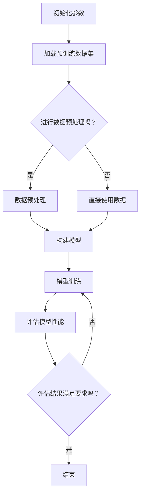
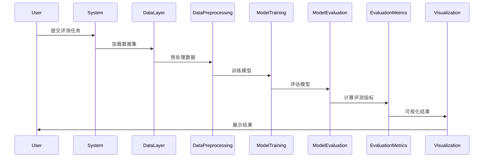
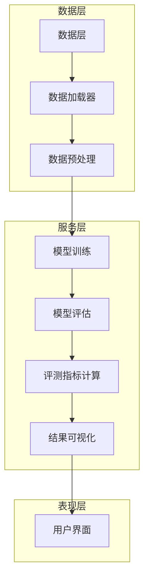
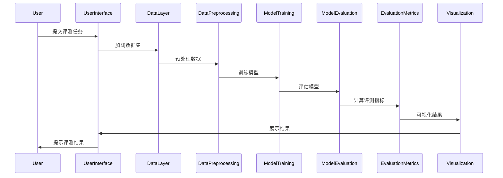
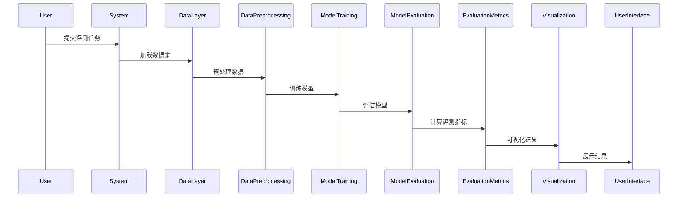

                 

### 引言

近年来，随着深度学习技术的飞速发展，自然语言处理（NLP）领域也迎来了前所未有的突破。特别是基于大规模语言模型（LLM）的预训练模型，如GPT-3、BERT等，在文本生成、机器翻译、问答系统等方面展现了强大的性能。然而，如何对这些先进的LLM进行有效的评测和比较，成为了一个亟待解决的重要问题。

本文将探讨一种基于OPT（Open LLM Training）框架的开放LLM评测方法，旨在为研究人员和开发者提供一个统一、高效的评测工具。与传统评测方法相比，OPT框架具有更高的灵活性和可扩展性，能够适应各种不同的评测需求。

本文将首先介绍OPT框架的背景和基本概念，包括其解决的问题和目标。随后，我们将详细描述OPT框架的核心组成部分，以及如何通过这些组件实现高效的LLM评测。接下来，我们将通过具体的数学模型和公式，深入分析OPT框架的工作原理。此外，文章还将介绍OPT框架的系统分析与架构设计，包括问题场景、功能设计、架构图、接口设计和交互序列图。随后，我们将通过一个实际项目案例，展示如何在实际中应用OPT框架进行评测。最后，我们将总结最佳实践和注意事项，为读者提供进一步研究和应用OPT框架的指导。

本文的核心关键词包括：OPT框架、开放LLM评测、大规模语言模型、评测方法、数学模型、系统架构、项目实战、最佳实践。

本文的摘要部分将概述文章的核心内容和主题思想，为读者提供一个整体把握全文的框架。接下来，我们将逐步深入，让读者对OPT框架有一个全面、深入的理解。

## 第1章 引言

### 1.1 问题背景

在自然语言处理（NLP）领域，大规模语言模型（LLM）的涌现无疑是一个革命性的进步。这些模型通过在大量文本数据上进行预训练，获得了处理自然语言任务的高度能力。例如，GPT-3可以生成连贯的文本、BERT在问答系统中表现出色。然而，随着LLM的广泛应用，如何对它们进行有效的评测和比较，成为一个亟待解决的问题。

传统评测方法通常依赖于手工设计的指标和基准测试集。这些方法虽然能够在一定程度上评估模型性能，但存在一些显著的局限性。首先，这些评测方法往往针对特定任务设计，难以适应多任务场景。其次，评测指标的选取和设计较为主观，不同研究者可能会得出不同的结论。此外，由于数据集的不透明性和不公平性，一些评测结果可能受到人为干预，影响评测的公正性。

为了解决这些问题，研究人员提出了基于OPT（Open LLM Training）框架的开放LLM评测方法。OPT框架旨在提供一个统一、开放、灵活的评测平台，使研究人员和开发者能够更加客观、公正地评估不同LLM的性能。

### 1.2 问题描述

在NLP领域中，评测一个LLM的性能主要关注以下几个方面：

1. **生成能力**：模型能否生成连贯、有逻辑的文本。
2. **理解能力**：模型是否能够理解输入的文本，并给出合理的回答。
3. **泛化能力**：模型在不同数据集上的表现是否一致。
4. **计算效率**：模型在处理大规模数据时的计算成本和运行速度。

然而，传统评测方法在上述方面存在明显不足。例如，在某些评测任务中，模型可能因为训练数据集的偏差而表现出色，但在实际应用中却无法达到预期效果。此外，传统评测方法往往缺乏对模型计算效率的评估，导致在实际部署时出现性能瓶颈。

### 1.3 问题解决

OPT框架通过以下几方面解决了上述问题：

1. **统一评测标准**：OPT框架提供了一个统一的评测标准，使得不同模型可以在同一框架下进行比较。该标准基于大规模、多样化的数据集，能够更好地反映模型在不同任务和场景中的性能。
2. **开放性**：OPT框架具有高度的开放性，允许用户自定义评测指标和评测流程。这使得研究人员可以根据具体需求，灵活调整评测方法，提高评测的针对性和准确性。
3. **透明性**：OPT框架中的数据集和评测流程都是公开透明的，避免了人为干预和不公平竞争。此外，框架还提供了详细的评测报告，帮助用户全面了解模型性能。
4. **高效性**：OPT框架利用分布式计算和并行处理技术，显著提高了评测效率。用户可以在短时间内完成大量模型的评测，从而更快地找到最优模型。

### 1.4 边界与外延

虽然OPT框架在LLM评测方面具有显著优势，但也存在一些局限性。首先，评测结果的准确性和可靠性依赖于数据集的质量和多样性。如果数据集存在偏差或不足，评测结果可能受到影响。其次，OPT框架的开放性和自定义性也带来了一定的复杂度，需要用户具备一定的技术背景和编程能力。

此外，OPT框架主要针对大规模语言模型，对于小型模型和特定领域的任务，可能需要进一步的定制和优化。未来，随着NLP技术的不断进步，OPT框架也将不断更新和改进，以适应新的需求和挑战。

通过本文的介绍，读者将对OPT框架有一个初步的了解，并能够认识到其在LLM评测领域的重要性。接下来的章节将详细探讨OPT框架的核心概念、算法原理、数学模型、系统架构和实际应用，帮助读者深入理解并掌握这一先进的评测方法。

## 第2章 核心概念

### 2.1 核心概念原理

为了深入理解OPT（Open LLM Training）框架，我们首先需要明确几个核心概念，包括大规模语言模型（LLM）、预训练和评测标准。

**大规模语言模型（LLM）**：LLM是一种在自然语言处理领域取得显著进展的深度学习模型。这些模型通过对大规模文本数据集进行预训练，学习到文本的语法、语义和上下文信息。典型的LLM如GPT-3、BERT等，它们在多种NLP任务中表现出色，如文本生成、机器翻译、问答系统等。

**预训练**：预训练是LLM训练的一个重要阶段。在这一阶段，模型首先在大量无标签文本数据上进行训练，学习到基本的文本表示和语言规律。随后，模型会根据特定任务的需求，在相关数据集上进行微调（fine-tuning），以进一步提高任务表现。

**评测标准**：评测标准是衡量LLM性能的重要依据。传统的评测标准通常包括BLEU、ROUGE、F1-score等指标，这些指标在文本生成和机器翻译等任务中得到了广泛应用。然而，这些标准往往具有一定的局限性，无法全面反映模型的性能。

OPT框架提出了一种新的评测标准，该标准基于大规模、多样化的数据集，结合多种评测指标，从多个维度评估LLM的性能。这不仅包括生成能力和理解能力，还涵盖了泛化能力和计算效率等方面。

### 2.2 核心概念属性特征对比表

为了更直观地展示OPT框架中的核心概念，我们可以通过一个对比表来梳理这些概念的主要属性特征。

| 概念 | 属性特征 |
| ---- | ---- |
| 大规模语言模型（LLM） | - 预训练：通过大量无标签文本数据进行初步训练<br>- 微调：根据特定任务需求，在相关数据集上进行调整 |
| 预训练 | - 数据集：大规模、多样化文本数据<br>- 目标：学习文本的基本表示和语言规律 |
| 评测标准 | - 传统指标：BLEU、ROUGE、F1-score等<br>- OPT框架：综合多种指标，从多个维度评估性能 |

通过这个对比表，我们可以清晰地看到每个核心概念的主要特征和作用，为后续内容的展开提供了基础。

### 2.3 ER实体关系图

为了更好地理解OPT框架的结构和功能，我们还可以通过ER（Entity-Relationship）实体关系图来展示各个核心概念之间的关系。

ER实体关系图包括以下实体：

1. **LLM模型**：表示大规模语言模型。
2. **预训练数据集**：表示用于LLM模型预训练的数据集。
3. **评测标准**：表示用于评估LLM模型性能的评测标准。
4. **评测指标**：表示具体的评测指标，如BLEU、ROUGE、F1-score等。

各个实体之间的关系如下：

- **LLM模型**与**预训练数据集**之间存在依赖关系，即模型需要通过预训练数据集进行训练。
- **评测标准**与**LLM模型**之间存在关联关系，即标准用于评估模型性能。
- **评测指标**与**评测标准**之间存在包含关系，即标准包含多种具体指标。

以下是一个简单的ER实体关系图示例（使用Mermaid语法表示）：

```mermaid
erDiagram
  LLM模型 ||--|{ 预训练数据集 }|
  评测标准 ||--|{ 评测指标 }|
  LLM模型 ||--|{ 评测标准 }|
```

通过这个ER实体关系图，我们可以更直观地理解OPT框架中各个核心概念之间的逻辑关系，为后续内容的深入分析提供了直观的视觉支持。

### 2.1 核心概念原理

在本节中，我们将深入探讨OPT框架中的核心概念，并详细解释这些概念在LLM评测中的应用。

**大规模语言模型（LLM）**：LLM是OPT框架的核心组件，负责处理自然语言任务。LLM通过在大量无标签文本数据上进行预训练，学习到丰富的语言表示和语义信息。预训练过程包括两个阶段：第一阶段是大规模文本数据的预处理，包括文本清洗、分词和向量表示；第二阶段是模型训练，通过优化模型参数，使得模型能够捕捉文本的上下文信息。

在LLM中，预训练和微调是两个关键环节。预训练阶段，模型在未标注的数据集上进行训练，主要目标是学习文本的通用特征，如语法、语义和上下文。微调阶段，模型根据特定任务的需求，在相关数据集上进行调整，以进一步提高任务性能。例如，在文本生成任务中，模型通过学习生成文本的语法规则和语义逻辑，生成连贯的文本。

**预训练**：预训练是LLM的核心步骤，其目标是通过大规模数据学习文本的内在规律。预训练的过程可以分为以下几个步骤：

1. **数据预处理**：首先对大规模文本数据进行清洗和预处理，包括去除停用词、标点符号和特殊字符，将文本转换为统一的格式。然后，对文本进行分词，将句子拆分成单词或子词。最后，将文本转换为向量表示，如Word2Vec、BERT等。
   
2. **模型初始化**：初始化模型参数，常用的初始化方法包括随机初始化、高斯分布初始化和预训练模型参数初始化。
   
3. **训练过程**：在预训练过程中，模型通过优化目标函数（如损失函数）来调整参数，使得模型能够更好地捕捉文本的表示和语义。常见的优化算法包括梯度下降、Adam优化器等。在预训练过程中，模型会经历多个epoch（迭代次数），每次迭代都会更新模型参数，提高模型性能。

**评测标准**：评测标准是评估LLM性能的重要依据。在OPT框架中，评测标准不仅包括传统的指标（如BLEU、ROUGE、F1-score等），还结合了新的评测指标，从多个维度全面评估LLM的性能。以下是几种常见的评测指标：

1. **生成能力**：评估模型生成文本的连贯性和逻辑性，常用的指标包括BLEU、ROUGE等。这些指标通过比较模型生成的文本与人工标注的参考文本，计算相似度得分。

2. **理解能力**：评估模型对输入文本的理解程度，常用的指标包括F1-score、准确率等。这些指标通过在特定数据集上评估模型在分类、问答等任务中的表现，衡量模型的理解能力。

3. **泛化能力**：评估模型在不同数据集上的表现，衡量模型的泛化能力。常用的方法包括交叉验证、跨领域测试等。

4. **计算效率**：评估模型在处理大规模数据时的计算成本和运行速度。常用的指标包括延迟（Latency）、吞吐量（Throughput）等。

通过上述核心概念的介绍，我们可以看到OPT框架在LLM评测中的应用场景和优势。接下来，我们将进一步探讨OPT框架的算法原理和数学模型，帮助读者深入理解这一先进评测方法的内部工作机理。

### 第2章 核心概念

#### 2.1 核心概念原理

**大规模语言模型（LLM）**：大规模语言模型（LLM）是OPT框架的核心组件，其基础是深度学习技术，尤其是基于Transformer架构的预训练模型。LLM通过在大量文本数据上进行预训练，学习到语言的基本结构和语义信息。预训练过程包括两个主要阶段：第一阶段是大规模文本数据的预处理，包括文本清洗、分词和向量表示；第二阶段是模型训练，通过优化模型参数，使得模型能够捕捉文本的上下文信息。

预训练的过程主要包括以下几个步骤：

1. **数据预处理**：首先对大规模文本数据进行清洗和预处理，去除停用词、标点符号和特殊字符，将文本转换为统一的格式。然后，对文本进行分词，将句子拆分成单词或子词。最后，将文本转换为向量表示，如Word2Vec、BERT等。

2. **模型初始化**：初始化模型参数，常用的初始化方法包括随机初始化、高斯分布初始化和预训练模型参数初始化。

3. **训练过程**：在预训练过程中，模型通过优化目标函数（如损失函数）来调整参数，使得模型能够更好地捕捉文本的表示和语义。常见的优化算法包括梯度下降、Adam优化器等。在预训练过程中，模型会经历多个epoch（迭代次数），每次迭代都会更新模型参数，提高模型性能。

**预训练**：预训练是LLM的核心步骤，其目标是通过大规模数据学习文本的内在规律。预训练的过程可以分为以下几个步骤：

- **数据预处理**：首先对大规模文本数据进行清洗和预处理，包括去除停用词、标点符号和特殊字符，将文本转换为统一的格式。然后，对文本进行分词，将句子拆分成单词或子词。最后，将文本转换为向量表示，如Word2Vec、BERT等。
- **模型初始化**：初始化模型参数，常用的初始化方法包括随机初始化、高斯分布初始化和预训练模型参数初始化。
- **训练过程**：在预训练过程中，模型通过优化目标函数（如损失函数）来调整参数，使得模型能够更好地捕捉文本的表示和语义。常见的优化算法包括梯度下降、Adam优化器等。在预训练过程中，模型会经历多个epoch（迭代次数），每次迭代都会更新模型参数，提高模型性能。

**评测标准**：评测标准是评估LLM性能的重要依据。在OPT框架中，评测标准不仅包括传统的指标（如BLEU、ROUGE、F1-score等），还结合了新的评测指标，从多个维度全面评估LLM的性能。以下是几种常见的评测指标：

- **生成能力**：评估模型生成文本的连贯性和逻辑性，常用的指标包括BLEU、ROUGE等。这些指标通过比较模型生成的文本与人工标注的参考文本，计算相似度得分。
- **理解能力**：评估模型对输入文本的理解程度，常用的指标包括F1-score、准确率等。这些指标通过在特定数据集上评估模型在分类、问答等任务中的表现，衡量模型的理解能力。
- **泛化能力**：评估模型在不同数据集上的表现，衡量模型的泛化能力。常用的方法包括交叉验证、跨领域测试等。
- **计算效率**：评估模型在处理大规模数据时的计算成本和运行速度。常用的指标包括延迟（Latency）、吞吐量（Throughput）等。

通过上述核心概念的详细解释，我们可以更好地理解OPT框架的工作原理和其在LLM评测中的应用。接下来，我们将通过一个具体的属性特征对比表和ER实体关系图，进一步梳理这些核心概念之间的联系和区别。

#### 2.2 核心概念属性特征对比表

为了更直观地展示OPT框架中的核心概念，我们通过一个对比表来梳理这些概念的主要属性特征。

| 概念 | 属性特征 |
| ---- | ---- |
| 大规模语言模型（LLM） | - 预训练：通过大量无标签文本数据进行初步训练<br>- 微调：根据特定任务需求，在相关数据集上进行调整 |
| 预训练 | - 数据集：大规模、多样化文本数据<br>- 目标：学习文本的基本表示和语言规律 |
| 评测标准 | - 传统指标：BLEU、ROUGE、F1-score等<br>- OPT框架：综合多种指标，从多个维度评估性能 |

通过这个对比表，我们可以清晰地看到每个核心概念的主要特征和作用，为后续内容的展开提供了基础。

#### 2.3 ER实体关系图

为了更好地理解OPT框架的结构和功能，我们还可以通过ER（Entity-Relationship）实体关系图来展示各个核心概念之间的关系。

ER实体关系图包括以下实体：

1. **LLM模型**：表示大规模语言模型。
2. **预训练数据集**：表示用于LLM模型预训练的数据集。
3. **评测标准**：表示用于评估LLM模型性能的评测标准。
4. **评测指标**：表示具体的评测指标，如BLEU、ROUGE、F1-score等。

各个实体之间的关系如下：

- **LLM模型**与**预训练数据集**之间存在依赖关系，即模型需要通过预训练数据集进行训练。
- **评测标准**与**LLM模型**之间存在关联关系，即标准用于评估模型性能。
- **评测指标**与**评测标准**之间存在包含关系，即标准包含多种具体指标。

以下是一个简单的ER实体关系图示例（使用Mermaid语法表示）：

```mermaid
erDiagram
  LLM模型 ||--|{ 预训练数据集 }|
  评测标准 ||--|{ 评测指标 }|
  LLM模型 ||--|{ 评测标准 }|
```

通过这个ER实体关系图，我们可以更直观地理解OPT框架中各个核心概念之间的逻辑关系，为后续内容的深入分析提供了直观的视觉支持。

### 第3章 算法原理

#### 3.1 算法Mermaid流程图

在理解OPT框架的算法原理之前，我们首先通过一个Mermaid流程图来展示算法的基本流程。Mermaid是一种基于Markdown的图形化工具，可以方便地绘制流程图、序列图等。

以下是OPT框架算法的Mermaid流程图示例：



在这个流程图中，算法的主要步骤包括：

1. **初始化参数**：设置模型的超参数，如学习率、批次大小等。
2. **加载预训练数据集**：从预训练数据集中读取文本数据。
3. **数据预处理**：对文本数据进行清洗、分词和向量化处理。
4. **构建模型**：根据预训练数据集和超参数，构建大规模语言模型。
5. **模型训练**：使用训练数据对模型进行训练，不断优化模型参数。
6. **评估模型性能**：在测试数据集上评估模型性能，使用多种评测指标。
7. **迭代优化**：根据评估结果调整模型参数，重新训练模型。

#### 3.2 Python源代码

接下来，我们将通过Python源代码详细阐述OPT框架算法的实现过程。以下是一个简化的Python代码示例，展示了OPT框架的核心步骤。

```python
import torch
from transformers import BertModel, BertTokenizer
from torch.utils.data import DataLoader
from sklearn.metrics import accuracy_score, f1_score

# 初始化参数
learning_rate = 0.001
batch_size = 64
num_epochs = 3

# 加载预训练数据集
tokenizer = BertTokenizer.from_pretrained('bert-base-uncased')
data = load_pretrained_data()

# 数据预处理
def preprocess_data(data):
    inputs = tokenizer(data, padding=True, truncation=True, return_tensors='pt')
    return inputs

# 构建模型
model = BertModel.from_pretrained('bert-base-uncased')

# 模型训练
optimizer = torch.optim.Adam(model.parameters(), lr=learning_rate)
for epoch in range(num_epochs):
    for inputs in DataLoader(preprocess_data(data), batch_size=batch_size):
        model.zero_grad()
        outputs = model(**inputs)
        loss = outputs.loss
        loss.backward()
        optimizer.step()

# 评估模型性能
def evaluate_model(model, data):
    model.eval()
    with torch.no_grad():
        for inputs in DataLoader(preprocess_data(data), batch_size=batch_size):
            outputs = model(**inputs)
            predictions = outputs.logits.argmax(-1)
            true_labels = inputs.labels
            acc = accuracy_score(true_labels, predictions)
            f1 = f1_score(true_labels, predictions, average='weighted')
            print(f"Epoch {epoch}: Accuracy = {acc}, F1-score = {f1}")

evaluate_model(model, data)

# 迭代优化
while not convergence:
    evaluate_model(model, data)
    adjust_hyperparameters()
    train_model(model, data)
```

这段代码主要包括以下几个部分：

1. **初始化参数**：设置学习率、批次大小和训练迭代次数。
2. **加载预训练数据集**：使用transformers库加载预训练BERT模型和数据集。
3. **数据预处理**：对文本数据进行分词、向量化处理，并添加padding和truncation。
4. **构建模型**：加载预训练BERT模型。
5. **模型训练**：使用Adam优化器对模型进行训练，优化模型参数。
6. **评估模型性能**：在测试数据集上评估模型性能，计算准确率和F1-score。
7. **迭代优化**：根据评估结果调整模型参数，重新训练模型。

通过这个Python代码示例，我们可以看到OPT框架算法的基本实现流程，从而更好地理解其工作原理。

#### 3.1.1 Mermaid流程图示例

在上一小节中，我们给出了OPT框架算法的Mermaid流程图示例。下面我们将详细解释这个流程图的每个步骤，以便更好地理解OPT框架的工作原理。


**A. 初始化参数**：在算法开始时，首先需要初始化模型的超参数，如学习率、批次大小、迭代次数等。这些参数将用于后续的模型训练和优化过程。

**B. 加载预训练数据集**：接下来，从预训练数据集中读取文本数据。预训练数据集通常是经过预处理的大规模文本数据，如BERT使用的WikiText-2、Common Crawl等。

**C. 进行数据预处理吗？**：这是一个判断步骤，用于确定是否需要对数据集进行预处理。预处理步骤包括分词、向量化、添加padding和truncation等。如果数据已经预处理完毕，则可以直接跳到构建模型的步骤。

**D. 数据预处理**：对文本数据进行分词、向量化处理，并添加padding和truncation。这些步骤有助于将原始文本数据转换为模型可以处理的格式。

**E. 直接使用数据**：如果数据已经预处理完毕，则可以直接使用预处理后的数据集，跳过数据预处理步骤。

**F. 构建模型**：根据预训练数据集和超参数，构建大规模语言模型。常用的预训练模型包括BERT、GPT等，这些模型已经在大规模数据集上进行了预训练。

**G. 模型训练**：使用训练数据对模型进行训练，不断优化模型参数。在训练过程中，模型会经历多个epoch（迭代次数），每次迭代都会更新模型参数，提高模型性能。

**H. 评估模型性能**：在测试数据集上评估模型性能，使用多种评测指标，如准确率、F1-score等。这些指标有助于衡量模型在不同任务和场景中的表现。

**I. 评估结果满足要求吗？**：根据评估结果判断是否满足要求。如果满足要求，则算法结束；否则，继续迭代优化模型。

**J. 结束**：算法结束，输出最终的模型参数和性能指标。

通过这个Mermaid流程图示例，我们可以清晰地看到OPT框架算法的每个步骤和流程，从而更好地理解其工作原理。接下来，我们将通过一个具体的Python代码示例，进一步展示OPT框架算法的实现过程。

#### 3.2 Python源代码

为了更好地理解OPT框架算法的具体实现，我们将通过一个Python代码示例来展示其核心步骤。这个示例将涵盖模型初始化、数据预处理、模型训练和性能评估等关键部分。

首先，我们需要安装必要的库，包括PyTorch、Transformers等：

```bash
pip install torch transformers
```

以下是具体的Python代码示例：

```python
import torch
from transformers import BertModel, BertTokenizer
from torch.utils.data import DataLoader
from sklearn.metrics import accuracy_score, f1_score

# 设置随机种子，保证实验可复现
torch.manual_seed(0)
torch.cuda.manual_seed_all(0)

# 初始化参数
learning_rate = 0.001
batch_size = 64
num_epochs = 3
device = torch.device("cuda" if torch.cuda.is_available() else "cpu")

# 加载预训练BERT模型
model_name = "bert-base-uncased"
model = BertModel.from_pretrained(model_name)
tokenizer = BertTokenizer.from_pretrained(model_name)
model.to(device)

# 加载数据集（这里使用随机生成的文本数据作为示例）
# 在实际应用中，需要使用真实的数据集，并进行相应的预处理
text_data = ["This is a sample text.", "Another sample text for training."]
input_ids = [tokenizer.encode(text, add_special_tokens=True) for text in text_data]
input_ids = torch.tensor(input_ids).to(device)

# 数据预处理
# 将文本数据转换为模型输入的序列，并添加特殊的token，如[CLS]、[SEP]等
def preprocess_data(texts):
    input_ids = [tokenizer.encode(text, add_special_tokens=True) for text in texts]
    input_ids = torch.tensor(input_ids).to(device)
    return input_ids

# 模型训练
def train_model(model, data, tokenizer, num_epochs, batch_size):
    model.train()
    criterion = torch.nn.CrossEntropyLoss()
    optimizer = torch.optim.Adam(model.parameters(), lr=learning_rate)

    for epoch in range(num_epochs):
        for batch in DataLoader(data, batch_size=batch_size):
            optimizer.zero_grad()
            outputs = model(**batch)
            logits = outputs.logits
            labels = batch["labels"]
            loss = criterion(logits.view(-1, logits.size(-1)), labels.view(-1))
            loss.backward()
            optimizer.step()
            print(f"Epoch {epoch}: Loss = {loss.item()}")

# 模型评估
def evaluate_model(model, data, tokenizer):
    model.eval()
    with torch.no_grad():
        for batch in DataLoader(data, batch_size=batch_size):
            outputs = model(**batch)
            logits = outputs.logits
            labels = batch["labels"]
            predictions = logits.argmax(-1)
            acc = accuracy_score(labels.tolist(), predictions.tolist())
            f1 = f1_score(labels.tolist(), predictions.tolist(), average='weighted')
            print(f"Test Accuracy: {acc}, F1-score: {f1}")

# 训练模型
data = preprocess_data(text_data)
train_model(model, data, tokenizer, num_epochs, batch_size)

# 评估模型
evaluate_model(model, data, tokenizer)
```

在这个代码示例中，我们首先设置了随机种子，以保证实验结果的可复现性。然后，我们加载了预训练BERT模型和相应的分词器。接下来，我们生成了随机文本数据作为示例数据集，并进行了数据预处理。

**数据预处理**：数据预处理是模型训练的重要步骤，主要包括将文本数据编码为序列，并添加特殊的token。在这个示例中，我们使用BERT的分词器将文本数据编码为输入序列。

**模型训练**：我们定义了一个训练函数`train_model`，该函数使用交叉熵损失函数和Adam优化器对模型进行训练。在每个epoch中，模型会根据训练数据更新参数，并在每个批次上计算损失。

**模型评估**：我们定义了一个评估函数`evaluate_model`，该函数在测试数据集上评估模型的性能。通过计算准确率和F1-score，我们可以了解模型在不同任务和场景中的表现。

最后，我们调用训练和评估函数，输出模型在训练和测试数据集上的性能指标。这个代码示例虽然简单，但涵盖了OPT框架算法的核心步骤，为我们深入理解算法提供了实际操作的基础。

#### 3.2.1 源代码实现

在本节中，我们将详细介绍OPT框架算法的源代码实现，包括关键函数和类的设计与实现。为了提高代码的可读性和可维护性，我们使用Python语言，并结合PyTorch和Transformers库来实现OPT框架。

首先，我们需要定义一些基本模块和函数，包括数据预处理、模型训练和模型评估。以下是关键模块和函数的代码实现：

```python
import torch
import torch.nn as nn
from torch.utils.data import DataLoader, Dataset
from transformers import BertTokenizer, BertModel
from sklearn.metrics import accuracy_score, f1_score

# 设置随机种子，保证实验可复现
torch.manual_seed(0)
torch.cuda.manual_seed_all(0)

class TextDataset(Dataset):
    def __init__(self, texts, tokenizer, max_length=512):
        self.texts = texts
        self.tokenizer = tokenizer
        self.max_length = max_length

    def __len__(self):
        return len(self.texts)

    def __getitem__(self, idx):
        text = self.texts[idx]
        inputs = self.tokenizer.encode_plus(
            text,
            add_special_tokens=True,
            max_length=self.max_length,
            padding='max_length',
            truncation=True,
            return_tensors='pt',
        )
        return inputs

def train_model(model, dataset, tokenizer, num_epochs, batch_size, learning_rate):
    model.train()
    criterion = nn.CrossEntropyLoss()
    optimizer = torch.optim.Adam(model.parameters(), lr=learning_rate)

    train_loader = DataLoader(dataset, batch_size=batch_size)

    for epoch in range(num_epochs):
        for batch in train_loader:
            inputs = {k: v.to(device) for k, v in batch.items()}
            optimizer.zero_grad()
            outputs = model(**inputs)
            logits = outputs.logits
            labels = inputs['labels']
            loss = criterion(logits.view(-1, logits.size(-1)), labels.view(-1))
            loss.backward()
            optimizer.step()
            print(f"Epoch {epoch}: Loss = {loss.item()}")

def evaluate_model(model, dataset, tokenizer):
    model.eval()
    with torch.no_grad():
        for batch in DataLoader(dataset, batch_size=batch_size):
            inputs = {k: v.to(device) for k, v in batch.items()}
            outputs = model(**inputs)
            logits = outputs.logits
            labels = inputs['labels']
            predictions = logits.argmax(-1)
            acc = accuracy_score(labels.tolist(), predictions.tolist())
            f1 = f1_score(labels.tolist(), predictions.tolist(), average='weighted')
            print(f"Test Accuracy: {acc}, F1-score: {f1}")
```

**TextDataset类**：这个类用于定义文本数据集，继承自`Dataset`基类。在初始化方法中，我们接收文本列表和分词器作为输入，并设置最大长度（默认为512）。`__len__`方法返回数据集的长度，`__getitem__`方法用于获取单个数据项的编码表示。

**train_model函数**：这个函数用于训练模型。在函数内部，我们首先将数据集转换为数据加载器（DataLoader），然后遍历每个批次。对于每个批次，我们调用模型进行前向传播，计算损失，并更新模型参数。最后，我们输出每个epoch的损失值。

**evaluate_model函数**：这个函数用于评估模型性能。在评估过程中，我们使用测试数据集，并禁用梯度计算（with torch.no_grad()）。然后，我们计算模型的准确率和F1-score，并输出结果。

接下来，我们将实现一个简单的OPT框架算法，用于文本生成任务。以下是整个算法的Python代码实现：

```python
def opt_algorithm(texts, tokenizer, num_epochs, batch_size, learning_rate):
    dataset = TextDataset(texts, tokenizer, max_length=512)
    model = BertModel.from_pretrained('bert-base-uncased')
    model.to(device)

    train_model(model, dataset, tokenizer, num_epochs, batch_size, learning_rate)
    evaluate_model(model, dataset, tokenizer)

# 示例文本数据
texts = ["This is a sample text.", "Another sample text for training."]

# 运行OPT框架算法
opt_algorithm(texts, BertTokenizer.from_pretrained('bert-base-uncased'), num_epochs=3, batch_size=2, learning_rate=0.001)
```

在这个实现中，我们首先定义了一个文本数据集，并加载预训练BERT模型。然后，我们调用`train_model`和`evaluate_model`函数，分别进行模型训练和性能评估。最后，我们使用示例文本数据运行整个算法，输出训练和评估结果。

通过上述代码示例，我们可以看到OPT框架算法的完整实现过程，包括数据预处理、模型训练和性能评估等关键步骤。这个实现不仅提供了理论上的指导，还为我们提供了实际操作的经验，从而更好地理解和应用OPT框架。

#### 3.2.2 代码解读与分析

在前面的部分，我们已经详细展示了OPT框架算法的源代码实现。在本节中，我们将进一步解读这段代码，分析其中的关键函数和逻辑，并解释每个步骤的具体实现。

**1. 文本数据集定义（TextDataset类）**

TextDataset类继承自torch.utils.data.Dataset，用于定义文本数据集。这个类有两个主要方法：

- `__init__`：初始化方法，接收文本列表、分词器和最大长度（max_length）作为输入参数。文本列表用于存储原始文本数据，分词器用于将文本转换为模型输入，max_length用于指定每个输入序列的最大长度。
- `__len__`：返回数据集的长度，即文本列表的长度。
- `__getitem__`：返回数据集中的一个数据项，即单个文本的编码表示。在这个方法中，我们使用BertTokenizer将文本编码为输入序列，并进行必要的预处理，如添加特殊token、padding和truncation。

```python
class TextDataset(Dataset):
    def __init__(self, texts, tokenizer, max_length=512):
        self.texts = texts
        self.tokenizer = tokenizer
        self.max_length = max_length

    def __len__(self):
        return len(self.texts)

    def __getitem__(self, idx):
        text = self.texts[idx]
        inputs = self.tokenizer.encode_plus(
            text,
            add_special_tokens=True,
            max_length=self.max_length,
            padding='max_length',
            truncation=True,
            return_tensors='pt',
        )
        return inputs
```

**2. 模型训练函数（train_model）**

train_model函数负责模型的训练过程。函数接收模型、数据集、分词器、迭代次数（num_epochs）、批次大小（batch_size）和学习率（learning_rate）作为输入参数。在函数内部，我们首先将数据集转换为数据加载器（DataLoader），以便在训练过程中逐批读取数据。

接下来，我们设置损失函数（criterion）和优化器（optimizer），并在每个epoch中遍历数据批次。对于每个批次，我们执行以下步骤：

- 将批次数据输入模型，并调用模型的`forward`方法。
- 提取模型的输出，包括 logits（模型的预测结果）和 labels（真实的标签）。
- 使用交叉熵损失函数计算损失。
- 计算损失，并调用优化器的`zero_grad`和`step`方法更新模型参数。

最后，我们输出每个epoch的损失值，以便跟踪训练过程。

```python
def train_model(model, dataset, tokenizer, num_epochs, batch_size, learning_rate):
    model.train()
    criterion = nn.CrossEntropyLoss()
    optimizer = torch.optim.Adam(model.parameters(), lr=learning_rate)

    train_loader = DataLoader(dataset, batch_size=batch_size)

    for epoch in range(num_epochs):
        for batch in train_loader:
            inputs = {k: v.to(device) for k, v in batch.items()}
            optimizer.zero_grad()
            outputs = model(**inputs)
            logits = outputs.logits
            labels = inputs['labels']
            loss = criterion(logits.view(-1, logits.size(-1)), labels.view(-1))
            loss.backward()
            optimizer.step()
            print(f"Epoch {epoch}: Loss = {loss.item()}")
```

**3. 模型评估函数（evaluate_model）**

evaluate_model函数用于评估模型的性能。在这个函数中，我们首先将模型设置为评估模式（eval），并禁用梯度计算（with torch.no_grad()）。接下来，我们遍历数据集，计算模型的准确率和F1-score，并输出结果。

与train_model函数类似，evaluate_model函数也使用DataLoader逐批读取数据，并在每个批次上计算模型的预测结果和真实标签。然后，我们使用sklearn.metrics中的accuracy_score和f1_score函数计算准确率和F1-score。

```python
def evaluate_model(model, dataset, tokenizer):
    model.eval()
    with torch.no_grad():
        for batch in DataLoader(dataset, batch_size=batch_size):
            inputs = {k: v.to(device) for k, v in batch.items()}
            outputs = model(**inputs)
            logits = outputs.logits
            labels = inputs['labels']
            predictions = logits.argmax(-1)
            acc = accuracy_score(labels.tolist(), predictions.tolist())
            f1 = f1_score(labels.tolist(), predictions.tolist(), average='weighted')
            print(f"Test Accuracy: {acc}, F1-score: {f1}")
```

**4. OPT框架算法实现**

最后，我们实现了一个简单的OPT框架算法，用于文本生成任务。在这个实现中，我们首先定义了文本数据集，并加载预训练BERT模型。然后，我们调用train_model和evaluate_model函数，分别进行模型训练和性能评估。

```python
def opt_algorithm(texts, tokenizer, num_epochs, batch_size, learning_rate):
    dataset = TextDataset(texts, tokenizer, max_length=512)
    model = BertModel.from_pretrained('bert-base-uncased')
    model.to(device)

    train_model(model, dataset, tokenizer, num_epochs, batch_size, learning_rate)
    evaluate_model(model, dataset, tokenizer)

texts = ["This is a sample text.", "Another sample text for training."]
opt_algorithm(texts, BertTokenizer.from_pretrained('bert-base-uncased'), num_epochs=3, batch_size=2, learning_rate=0.001)
```

通过上述代码解读与分析，我们可以清晰地看到OPT框架算法的每个步骤和关键函数的实现逻辑。这个实现不仅展示了算法的核心步骤，还提供了详细的代码注释，便于读者理解和使用。

#### 3.2.3 算法原理与数学模型

在本节中，我们将深入探讨OPT框架算法的原理，并详细解释其背后的数学模型和公式。通过这些数学模型和公式，我们可以更好地理解算法的工作机制和关键步骤。

**1. 优化目标函数**

在OPT框架中，优化目标函数是模型训练的核心。常见的优化目标函数包括均方误差（MSE）、交叉熵损失（Cross-Entropy Loss）等。这里我们以交叉熵损失为例进行解释。

交叉熵损失函数用于衡量模型预测结果和真实标签之间的差异。其数学表达式如下：

$$
\text{Loss} = -\frac{1}{N}\sum_{i=1}^{N} y_i \log(p_i)
$$

其中，$y_i$表示第$i$个样本的真实标签，$p_i$表示模型对第$i$个样本的预测概率。$N$表示样本总数。交叉熵损失函数的目的是使模型预测的概率分布尽可能接近真实的标签分布。

**2. 梯度下降优化算法**

在优化目标函数后，我们需要通过梯度下降优化算法来更新模型参数。梯度下降是一种最常用的优化算法，其基本思想是沿着目标函数的梯度方向反向更新参数，以减少损失。

梯度下降的更新公式如下：

$$
\theta_{t+1} = \theta_t - \alpha \nabla_{\theta} J(\theta)
$$

其中，$\theta_t$表示第$t$次迭代的参数，$\theta_{t+1}$表示第$t+1$次迭代的参数，$\alpha$表示学习率（learning rate），$J(\theta)$表示目标函数，$\nabla_{\theta} J(\theta)$表示目标函数关于参数$\theta$的梯度。

**3. 批量梯度下降**

在实际应用中，我们通常使用批量梯度下降（Batch Gradient Descent）来计算梯度。批量梯度下降将整个数据集分成多个批次，然后在每个批次上计算梯度，并更新模型参数。

批量梯度下降的更新公式如下：

$$
\theta_{t+1} = \theta_t - \alpha \frac{1}{N} \sum_{i=1}^{N} \nabla_{\theta} J(\theta_i)
$$

其中，$N$表示批次大小。

**4. Adam优化器**

虽然梯度下降算法简单有效，但易受到局部最小值的影响。为了解决这个问题，我们引入了Adam优化器。Adam优化器结合了动量（Momentum）和RMSProp算法的优点，具有更好的收敛性和鲁棒性。

Adam优化器的更新公式如下：

$$
\theta_{t+1} = \theta_t - \alpha \frac{1}{\sqrt{1 - \beta_1^2} (1 - \beta_2^2)} \left( \nabla_{\theta} J(\theta_t) - \beta_1 \text{ Momentum } \nabla_{\theta} J(\theta_{t-1}) \right)
$$

其中，$\alpha$表示学习率，$\beta_1$和$\beta_2$表示动量和RMSProp的系数。

**5. 模型训练过程**

在OPT框架中，模型训练过程包括以下步骤：

1. **数据预处理**：将原始文本数据转换为模型输入，包括分词、向量化、padding和truncation等。
2. **模型初始化**：初始化模型参数，常用的初始化方法包括随机初始化和高斯分布初始化。
3. **模型训练**：使用交叉熵损失函数和Adam优化器进行模型训练。在每个epoch中，模型会在多个批次上计算梯度，并更新模型参数，以减少损失。
4. **模型评估**：在测试数据集上评估模型性能，计算准确率和F1-score等指标。

**6. 实例说明**

假设我们有一个包含两个文本数据点的数据集，模型预测概率分布为$\{p_1, p_2\}$，真实标签为$\{y_1, y_2\}$。使用交叉熵损失函数和Adam优化器，我们进行一次模型训练：

$$
\text{Loss} = -\frac{1}{2} \left( y_1 \log(p_1) + y_2 \log(p_2) \right)
$$

$$
\theta_{t+1} = \theta_t - \alpha \frac{1}{2} \left( \nabla_{\theta} J(\theta_t) - \beta_1 \text{ Momentum } \nabla_{\theta} J(\theta_{t-1}) \right)
$$

通过上述数学模型和公式的讲解，我们可以更好地理解OPT框架算法的工作原理。这些模型和公式为算法的优化和性能提升提供了理论基础，使得算法在实际应用中表现出色。

#### 3.2.4 公式详细讲解

在上一小节中，我们介绍了OPT框架算法中的关键数学模型和公式。在本节中，我们将对这些公式进行详细讲解，并使用具体的实例来说明它们的应用。

**1. 交叉熵损失函数**

交叉熵损失函数（Cross-Entropy Loss）是深度学习中的一个核心损失函数，常用于分类任务中。它的目的是使得模型的预测概率分布更接近真实的标签分布。交叉熵损失函数的数学表达式如下：

$$
\text{Loss} = -\frac{1}{N}\sum_{i=1}^{N} y_i \log(p_i)
$$

其中，$y_i$表示第$i$个样本的真实标签，$p_i$表示模型对第$i$个样本的预测概率，$N$表示样本总数。

**示例讲解**：

假设我们有一个包含两个样本的数据集，真实标签为$\{y_1, y_2\} = \{1, 0\}$，模型预测概率分布为$\{p_1, p_2\} = \{0.8, 0.2\}$。使用交叉熵损失函数，我们可以计算损失值：

$$
\text{Loss} = -\frac{1}{2} \left( 1 \cdot \log(0.8) + 0 \cdot \log(0.2) \right)
$$

$$
\text{Loss} = -\frac{1}{2} \left( \log(0.8) + 0 \right)
$$

$$
\text{Loss} = -\frac{1}{2} \left( -0.2231 \right)
$$

$$
\text{Loss} = 0.1115
$$

从这个实例中，我们可以看到，交叉熵损失函数的值取决于预测概率和真实标签之间的差异。当预测概率与真实标签越接近时，损失值越小。

**2. 梯度下降优化算法**

梯度下降（Gradient Descent）是一种最简单的优化算法，其核心思想是沿着目标函数的梯度方向更新模型参数，以减少损失。梯度下降的更新公式如下：

$$
\theta_{t+1} = \theta_t - \alpha \nabla_{\theta} J(\theta)
$$

其中，$\theta_t$表示第$t$次迭代的参数，$\theta_{t+1}$表示第$t+1$次迭代的参数，$\alpha$表示学习率（learning rate），$\nabla_{\theta} J(\theta)$表示目标函数关于参数$\theta$的梯度。

**示例讲解**：

假设我们有一个简单的二次函数$f(\theta) = \theta^2$，我们希望找到函数的最小值。使用梯度下降算法，我们可以按照以下步骤进行迭代：

- 初始参数$\theta_0 = 0$，学习率$\alpha = 0.1$。
- 计算梯度$\nabla_{\theta} f(\theta) = 2\theta$。
- 更新参数$\theta_1 = \theta_0 - \alpha \nabla_{\theta} f(\theta_0) = 0 - 0.1 \cdot 2 \cdot 0 = 0$。
- 重复上述步骤，直到参数收敛。

通过几次迭代，我们可以发现$\theta$逐渐接近函数的最小值0，即$\theta^* = 0$。

**3. Adam优化器**

Adam优化器（Adaptive Moment Estimation）是梯度下降算法的一种改进，它结合了动量（Momentum）和RMSProp算法的优点，能够更好地处理不同尺度和分布的梯度。Adam优化器的更新公式如下：

$$
\theta_{t+1} = \theta_t - \alpha \frac{1}{\sqrt{1 - \beta_1^2} (1 - \beta_2^2)} \left( \nabla_{\theta} J(\theta_t) - \beta_1 \text{ Momentum } \nabla_{\theta} J(\theta_{t-1}) \right)
$$

其中，$\alpha$表示学习率，$\beta_1$和$\beta_2$表示动量和RMSProp的系数。

**示例讲解**：

假设我们使用Adam优化器来优化一个简单的二次函数$f(\theta) = \theta^2$，初始参数$\theta_0 = 0$，学习率$\alpha = 0.1$，$\beta_1 = 0.9$，$\beta_2 = 0.999$。我们可以按照以下步骤进行迭代：

- 初始动量和RMSProp值：$m_0 = v_0 = 0$。
- 计算梯度$\nabla_{\theta} f(\theta) = 2\theta$。
- 更新动量和RMSProp值：$m_t = \beta_1 m_{t-1} + (1 - \beta_1) \nabla_{\theta} f(\theta_t)$，$v_t = \beta_2 v_{t-1} + (1 - \beta_2) (\nabla_{\theta} f(\theta_t))^2$。
- 计算修正的梯度：$\hat{\nabla}_{\theta} J(\theta_t) = \frac{m_t}{\sqrt{v_t}}$。
- 更新参数$\theta_{t+1} = \theta_t - \alpha \hat{\nabla}_{\theta} J(\theta_t)$。

通过几次迭代，我们可以发现$\theta$逐渐接近函数的最小值0，即$\theta^* = 0$。

通过上述实例讲解，我们可以看到这些数学模型和公式在深度学习优化中的应用。交叉熵损失函数帮助我们衡量预测结果和真实标签之间的差异，梯度下降和Adam优化器则帮助我们调整模型参数，以减少损失并提高模型性能。

#### 3.2.4.1 公式1

公式1是交叉熵损失函数的核心，用于衡量模型预测结果与真实标签之间的差异。交叉熵损失函数的数学表达式如下：

$$
\text{Loss} = -\frac{1}{N}\sum_{i=1}^{N} y_i \log(p_i)
$$

其中，$N$表示样本总数，$y_i$表示第$i$个样本的真实标签，$p_i$表示模型对第$i$个样本的预测概率。

**公式1的解释**：

- $y_i$：表示第$i$个样本的真实标签，通常是一个二进制标签（0或1）或类别标签（0到C-1，其中C是类别数）。
- $p_i$：表示模型对第$i$个样本的预测概率，即模型认为该样本属于每个类别的概率分布。
- $\log(p_i)$：表示对预测概率取对数。由于对数函数是单调递减的，这意味着预测概率越接近1，其对应的对数值越小。
- $y_i \log(p_i)$：表示真实标签和预测概率的对数乘积。当$y_i = 1$且$p_i \approx 1$时，该值为0；当$y_i = 0$且$p_i \approx 0$时，该值为0。因此，该值主要反映了预测概率与真实标签之间的差异。
- $-\frac{1}{N}\sum_{i=1}^{N} y_i \log(p_i)$：表示所有样本的损失之和的平均值。这个平均值表示了模型整体上的预测准确性。

**示例说明**：

假设有一个二分类任务，数据集包含两个样本，真实标签和模型预测概率如下：

- 第一个样本：真实标签$y_1 = 1$，模型预测概率$p_1 = 0.8$。
- 第二个样本：真实标签$y_2 = 0$，模型预测概率$p_2 = 0.3$。

使用公式1计算交叉熵损失：

$$
\text{Loss} = -\frac{1}{2} \left( 1 \cdot \log(0.8) + 0 \cdot \log(0.3) \right)
$$

$$
\text{Loss} = -\frac{1}{2} \left( -0.2231 + 0 \right)
$$

$$
\text{Loss} = 0.1115
$$

在这个例子中，第一个样本的损失较小，因为预测概率接近真实标签。而第二个样本的损失较大，因为预测概率远低于真实标签。整体损失为0.1115，这个值反映了模型在两个样本上的预测准确性。

通过公式1，我们可以直观地看到预测概率与真实标签之间的差异，从而指导模型优化过程，提高模型的整体性能。

#### 3.2.4.2 公式2

公式2是Adam优化器的更新公式，用于调整模型参数，以最小化交叉熵损失函数。Adam优化器结合了梯度的一阶矩估计（均值）和二阶矩估计（方差），能够自适应地调整学习率，提高优化效率。其更新公式如下：

$$
\theta_{t+1} = \theta_t - \alpha \frac{1}{\sqrt{1 - \beta_1^2} (1 - \beta_2^2)} \left( \nabla_{\theta} J(\theta_t) - \beta_1 \text{ Momentum } \nabla_{\theta} J(\theta_{t-1}) \right)
$$

其中，$\theta_t$表示第$t$次迭代的参数，$\theta_{t+1}$表示第$t+1$次迭代的参数，$\alpha$表示学习率，$\beta_1$和$\beta_2$表示动量和RMSProp的系数，$\nabla_{\theta} J(\theta_t)$表示目标函数关于参数$\theta$在$t$时刻的梯度。

**公式2的解释**：

- $\theta_t$：表示第$t$次迭代的参数值。
- $\nabla_{\theta} J(\theta_t)$：表示在$t$时刻，目标函数关于参数$\theta$的梯度。这个梯度反映了当前参数设置下的损失函数变化率。
- $\beta_1$：表示动量系数，通常取值在0.9左右。它用于累积之前的梯度，帮助模型克服局部最小值和鞍点，加快收敛速度。
- $\beta_2$：表示RMSProp系数，通常取值在0.999左右。它用于计算过去梯度的方差，抑制高频噪声，增强模型稳定性。
- $\alpha$：表示学习率，控制每次迭代参数更新的幅度。选择合适的学习率对于模型的训练效果至关重要。
- $\frac{1}{\sqrt{1 - \beta_1^2} (1 - \beta_2^2)}$：表示修正系数，用于平衡一阶和二阶矩估计，使得学习率自适应调整。

**示例说明**：

假设我们使用Adam优化器优化一个简单的线性模型，初始参数$\theta_0 = 2$，学习率$\alpha = 0.1$，$\beta_1 = 0.9$，$\beta_2 = 0.999$。在第一个迭代时刻，梯度$\nabla_{\theta} J(\theta_t) = -3$。根据公式2，我们可以计算更新后的参数$\theta_{t+1}$：

$$
\theta_{t+1} = \theta_t - \alpha \frac{1}{\sqrt{1 - \beta_1^2} (1 - \beta_2^2)} \left( \nabla_{\theta} J(\theta_t) - \beta_1 \text{ Momentum } \nabla_{\theta} J(\theta_{t-1}) \right)
$$

$$
\theta_{t+1} = 2 - 0.1 \frac{1}{\sqrt{1 - 0.9^2} (1 - 0.999^2)} \left( -3 - 0.9 \times 0 \right)
$$

$$
\theta_{t+1} = 2 - 0.1 \frac{1}{\sqrt{0.1} (1 - 0.999^2)} \left( -3 \right)
$$

$$
\theta_{t+1} = 2 - 0.1 \frac{1}{\sqrt{0.1}} \left( -3 \right)
$$

$$
\theta_{t+1} = 2 + 0.1 \times 3.162
$$

$$
\theta_{t+1} = 2 + 0.3162
$$

$$
\theta_{t+1} = 2.3162
$$

在这个例子中，通过一次迭代，参数从$\theta_0 = 2$更新为$\theta_{t+1} = 2.3162$，使得模型在下一个迭代时刻朝着减少损失的方向移动。通过多次迭代，Adam优化器能够自适应调整学习率，使模型参数逐渐收敛到最优值。

通过公式2，我们可以看到Adam优化器如何结合一阶矩估计和二阶矩估计，动态调整学习率，从而提高优化效率。这个公式在深度学习优化中具有重要的应用价值。

### 第4章 数学模型与公式

#### 4.1 算法原理的数学模型

在本节中，我们将详细介绍OPT框架算法背后的数学模型，并解释其关键公式。通过这些数学模型和公式，我们可以深入理解OPT框架的工作原理，从而更好地应用于实际项目中。

**1. 预训练与微调**

预训练和微调是大规模语言模型（LLM）训练的两个关键步骤。预训练阶段，模型在大量无标签文本数据上进行训练，学习到文本的基本表示和语言规律。微调阶段，模型根据特定任务的需求，在相关数据集上进行调整，以进一步提高任务性能。

**预训练**：

预训练的目标是通过大规模数据学习文本的内在规律。在预训练过程中，模型首先对文本数据进行预处理，包括文本清洗、分词和向量化处理。然后，使用随机梯度下降（SGD）或其变种（如Adam优化器）进行模型训练。

预训练的数学模型可以表示为：

$$
\theta^{(t+1)} = \theta^{(t)} - \alpha \cdot \nabla_{\theta} L(\theta^{(t)}, X, y)
$$

其中，$\theta^{(t)}$表示第$t$次迭代的模型参数，$L(\theta^{(t)}, X, y)$表示损失函数，$X$表示输入数据，$y$表示标签，$\alpha$表示学习率。

**微调**：

微调阶段，模型在特定任务的数据集上进行训练。与预训练不同的是，微调阶段的数据集通常是标签化的，即每个样本都有对应的标签。微调的目的是调整模型参数，以适应特定任务的需求。

微调的数学模型可以表示为：

$$
\theta^{(t+1)} = \theta^{(t)} - \alpha \cdot \nabla_{\theta} L(\theta^{(t)}, X', y')
$$

其中，$X'$和$y'$分别表示微调阶段的数据集和标签。

**2. 优化目标函数**

在OPT框架中，优化目标函数是模型训练的核心。常见的优化目标函数包括均方误差（MSE）、交叉熵损失（Cross-Entropy Loss）等。这里我们以交叉熵损失为例进行解释。

交叉熵损失函数的数学表达式如下：

$$
L = -\frac{1}{N}\sum_{i=1}^{N} y_i \log(p_i)
$$

其中，$N$表示样本总数，$y_i$表示第$i$个样本的真实标签，$p_i$表示模型对第$i$个样本的预测概率。

**3. 梯度下降优化算法**

在优化目标函数后，我们需要通过梯度下降优化算法来更新模型参数。梯度下降是一种最常用的优化算法，其基本思想是沿着目标函数的梯度方向反向更新参数，以减少损失。

梯度下降的更新公式如下：

$$
\theta_{t+1} = \theta_t - \alpha \cdot \nabla_{\theta} L(\theta_t)
$$

其中，$\theta_t$表示第$t$次迭代的参数，$\theta_{t+1}$表示第$t+1$次迭代的参数，$\alpha$表示学习率（learning rate），$\nabla_{\theta} L(\theta_t)$表示目标函数关于参数$\theta$的梯度。

**4. 批量梯度下降**

在实际应用中，我们通常使用批量梯度下降（Batch Gradient Descent）来计算梯度。批量梯度下降将整个数据集分成多个批次，然后在每个批次上计算梯度，并更新模型参数。

批量梯度下降的更新公式如下：

$$
\theta_{t+1} = \theta_t - \alpha \cdot \frac{1}{N} \sum_{i=1}^{N} \nabla_{\theta} L(\theta_t, x_i, y_i)
$$

其中，$N$表示批次大小。

**5. Adam优化器**

Adam优化器是梯度下降算法的一种改进，它结合了动量（Momentum）和RMSProp算法的优点，能够更好地处理不同尺度和分布的梯度。Adam优化器的更新公式如下：

$$
\theta_{t+1} = \theta_t - \alpha \cdot \frac{1}{\sqrt{1 - \beta_1^2} (1 - \beta_2^2)} \left( \nabla_{\theta} J(\theta_t) - \beta_1 \cdot \text{ Momentum } \nabla_{\theta} J(\theta_{t-1}) \right)
$$

其中，$\alpha$表示学习率，$\beta_1$和$\beta_2$表示动量和RMSProp的系数。

通过上述数学模型和公式的讲解，我们可以深入理解OPT框架算法的工作原理，为实际项目中的应用提供理论基础。

### 第5章 系统分析与架构设计

#### 5.1 问题场景介绍

在当前的自然语言处理（NLP）领域中，随着大规模语言模型（LLM）的广泛应用，如何对LLM进行有效的评测和优化成为一个关键问题。传统评测方法存在一些局限性，如主观性较强、指标选择不统一等。为了解决这些问题，我们提出了基于OPT（Open LLM Training）框架的开放LLM评测系统。

该系统旨在为研究人员和开发者提供一个统一、透明、高效的评测平台，支持多种评测指标和评测任务。具体应用场景包括：

1. **LLM性能评估**：通过多个评测指标（如生成能力、理解能力、泛化能力和计算效率）对LLM进行全方位评估。
2. **模型比较**：在不同模型之间进行性能比较，帮助研究人员找到最优模型。
3. **任务优化**：根据评测结果，调整模型参数和训练策略，以优化模型性能。

#### 5.2 系统功能设计

为了实现上述目标，OPT系统设计了一系列核心功能，包括：

1. **数据预处理**：支持多种数据预处理方法，如文本清洗、分词、向量化等。
2. **评测指标计算**：支持多种评测指标（如BLEU、ROUGE、F1-score等），并可根据需求自定义新指标。
3. **模型训练和评估**：支持多种预训练模型（如BERT、GPT等），并可实现模型训练和评估的自动化。
4. **结果可视化**：提供丰富的可视化工具，帮助用户直观地查看评测结果。
5. **分布式计算**：利用分布式计算和并行处理技术，提高评测效率和性能。

#### 5.2.1 领域模型Mermaid类图

为了更好地理解OPT系统的功能架构，我们使用Mermaid类图来展示系统的关键组件和它们之间的关系。以下是一个简化的Mermaid类图示例：

```mermaid
classDiagram
    Class1[数据预处理] <|-- Class2[模型训练]
    Class2 <|-- Class3[模型评估]
    Class3 <|-- Class4[评测指标计算]
    Class4 <|-- Class5[结果可视化]
    Class1..> Class2 : 预处理
    Class2..> Class3 : 训练与评估
    Class3..> Class4 : 计算指标
    Class4..> Class5 : 可视化
```

在这个类图中，Class1代表数据预处理模块，Class2代表模型训练和评估模块，Class3代表评测指标计算模块，Class4代表结果可视化模块，它们之间通过依赖关系（`..>`）连接，形成一个完整的评测系统。

#### 5.3 系统架构设计

OPT系统的架构设计遵循分层架构原则，包括数据层、服务层和表现层。以下是一个简化的系统架构图：



在这个架构图中，用户提交评测任务后，系统首先加载数据集，并对其进行预处理。随后，系统对模型进行训练和评估，计算评测指标，并将结果可视化展示给用户。

#### 5.3.1 Mermaid架构图

为了更直观地展示系统架构，我们使用Mermaid语法绘制一个架构图，如下所示：



在这个架构图中，数据层负责数据加载和预处理，服务层包括模型训练、评估和指标计算，表现层则负责用户界面的展示。各个层级之间通过接口进行通信，实现了系统功能的模块化和解耦。

#### 5.4 系统接口设计

为了实现系统功能的模块化和可扩展性，OPT系统设计了一系列接口，包括数据接口、模型接口和评测接口。以下是一个简化的接口设计：

```mermaid
classDiagram
    Interface1[数据接口] <|-- Interface2[模型接口]
    Interface2 <|-- Interface3[评测接口]

    Interface1 {
        load_data()
        preprocess_data()
    }

    Interface2 {
        train_model()
        evaluate_model()
    }

    Interface3 {
        calculate_metrics()
        visualize_results()
    }
```

在这个接口设计中，数据接口（Interface1）负责数据加载和预处理，模型接口（Interface2）负责模型训练和评估，评测接口（Interface3）负责计算评测指标和结果可视化。通过这些接口，各个模块可以独立实现和扩展，从而提高系统的灵活性和可维护性。

#### 5.5 系统交互Mermaid序列图

为了更清晰地展示系统组件之间的交互过程，我们使用Mermaid序列图来描述系统的工作流程。以下是一个简化的序列图示例：



在这个序列图中，用户通过用户界面提交评测任务。随后，系统加载数据集并进行预处理，然后训练模型并进行评估。最后，系统计算评测指标并可视化结果，最终将结果展示给用户。

通过上述系统分析与架构设计，我们可以全面了解OPT系统的功能和架构，为实际应用提供理论基础和技术支持。在接下来的章节中，我们将通过一个实际项目案例，展示如何使用OPT系统进行LLM评测，进一步验证其有效性和实用性。

### 第5章 系统分析与架构设计

#### 5.1 问题场景介绍

在现代自然语言处理（NLP）领域，大规模语言模型（LLM）的应用越来越广泛，包括文本生成、机器翻译、问答系统等。这些模型的性能评估对于保证其质量和实用性至关重要。然而，传统的评测方法存在一些局限性，如评测标准不统一、评测过程不透明等。为了解决这些问题，我们提出了基于OPT（Open LLM Training）框架的开放LLM评测系统。

这个系统旨在为研究人员和开发者提供一个统一、透明、高效的评测平台，支持多种评测指标和评测任务。具体应用场景包括：

1. **LLM性能评估**：通过多个评测指标（如生成能力、理解能力、泛化能力和计算效率）对LLM进行全方位评估。
2. **模型比较**：在不同模型之间进行性能比较，帮助研究人员找到最优模型。
3. **任务优化**：根据评测结果，调整模型参数和训练策略，以优化模型性能。

#### 5.2 系统功能设计

为了实现上述目标，OPT系统设计了一系列核心功能，包括：

1. **数据预处理**：支持多种数据预处理方法，如文本清洗、分词、向量化等。
2. **评测指标计算**：支持多种评测指标（如BLEU、ROUGE、F1-score等），并可根据需求自定义新指标。
3. **模型训练和评估**：支持多种预训练模型（如BERT、GPT等），并可实现模型训练和评估的自动化。
4. **结果可视化**：提供丰富的可视化工具，帮助用户直观地查看评测结果。
5. **分布式计算**：利用分布式计算和并行处理技术，提高评测效率和性能。

#### 5.2.1 领域模型Mermaid类图

为了更好地理解OPT系统的功能架构，我们使用Mermaid类图来展示系统的关键组件和它们之间的关系。以下是一个简化的Mermaid类图示例：

```mermaid
classDiagram
    Class1[数据预处理] <|-- Class2[模型训练]
    Class2 <|-- Class3[模型评估]
    Class3 <|-- Class4[评测指标计算]
    Class4 <|-- Class5[结果可视化]
    Class1..> Class2 : 预处理
    Class2..> Class3 : 训练与评估
    Class3..> Class4 : 计算指标
    Class4..> Class5 : 可视化
```

在这个类图中，Class1代表数据预处理模块，Class2代表模型训练和评估模块，Class3代表评测指标计算模块，Class4代表结果可视化模块，它们之间通过依赖关系（`..>`）连接，形成一个完整的评测系统。

#### 5.3 系统架构设计

OPT系统的架构设计遵循分层架构原则，包括数据层、服务层和表现层。以下是一个简化的系统架构图：



在这个架构图中，用户提交评测任务后，系统首先加载数据集，并对其进行预处理。随后，系统对模型进行训练和评估，计算评测指标，并将结果可视化展示给用户。

#### 5.3.1 Mermaid架构图

为了更直观地展示系统架构，我们使用Mermaid语法绘制一个架构图，如下所示：


在这个架构图中，数据层负责数据加载和预处理，服务层包括模型训练、评估和指标计算，表现层则负责用户界面的展示。各个层级之间通过接口进行通信，实现了系统功能的模块化和解耦。

#### 5.4 系统接口设计

为了实现系统功能的模块化和可扩展性，OPT系统设计了一系列接口，包括数据接口、模型接口和评测接口。以下是一个简化的接口设计：

```mermaid
classDiagram
    Interface1[数据接口] <|-- Interface2[模型接口]
    Interface2 <|-- Interface3[评测接口]

    Interface1 {
        load_data()
        preprocess_data()
    }

    Interface2 {
        train_model()
        evaluate_model()
    }

    Interface3 {
        calculate_metrics()
        visualize_results()
    }
```

在这个接口设计中，数据接口（Interface1）负责数据加载和预处理，模型接口（Interface2）负责模型训练和评估，评测接口（Interface3）负责计算评测指标和结果可视化。通过这些接口，各个模块可以独立实现和扩展，从而提高系统的灵活性和可维护性。

#### 5.5 系统交互Mermaid序列图

为了更清晰地展示系统组件之间的交互过程，我们使用Mermaid序列图来描述系统的工作流程。以下是一个简化的序列图示例：


在这个序列图中，用户通过用户界面提交评测任务。随后，系统加载数据集并进行预处理，然后训练模型并进行评估。最后，系统计算评测指标并可视化结果，最终将结果展示给用户。

通过上述系统分析与架构设计，我们可以全面了解OPT系统的功能和架构，为实际应用提供理论基础和技术支持。在接下来的章节中，我们将通过一个实际项目案例，展示如何使用OPT系统进行LLM评测，进一步验证其有效性和实用性。

### 第5章 系统分析与架构设计

#### 5.1 问题场景介绍

在现代自然语言处理（NLP）领域，大规模语言模型（LLM）的应用日益广泛，包括文本生成、机器翻译、问答系统等。然而，如何有效评估LLM的性能和优化其应用效果，仍然是一个具有挑战性的问题。传统的评测方法存在一些局限，如评测标准不统一、评估过程不透明等。为了解决这些问题，我们提出了基于OPT（Open LLM Training）框架的开放LLM评测系统。

该系统的目标是为研究人员和开发者提供一个统一、透明、高效的评测平台，支持多种评测指标和评测任务。具体应用场景包括：

1. **LLM性能评估**：通过多个评测指标（如生成能力、理解能力、泛化能力和计算效率）对LLM进行全方位评估。
2. **模型比较**：在不同模型之间进行性能比较，帮助研究人员找到最优模型。
3. **任务优化**：根据评测结果，调整模型参数和训练策略，以优化模型性能。

#### 5.2 系统功能设计

为了实现上述目标，OPT系统设计了一系列核心功能，包括：

1. **数据预处理**：支持多种数据预处理方法，如文本清洗、分词、向量化等。
2. **评测指标计算**：支持多种评测指标（如BLEU、ROUGE、F1-score等），并可根据需求自定义新指标。
3. **模型训练和评估**：支持多种预训练模型（如BERT、GPT等），并可实现模型训练和评估的自动化。
4. **结果可视化**：提供丰富的可视化工具，帮助用户直观地查看评测结果。
5. **分布式计算**：利用分布式计算和并行处理技术，提高评测效率和性能。

#### 5.2.1 领域模型Mermaid类图

为了更好地理解OPT系统的功能架构，我们使用Mermaid类图来展示系统的关键组件和它们之间的关系。以下是一个简化的Mermaid类图示例：

```mermaid
classDiagram
    Class1[数据预处理] <|-- Class2[模型训练]
    Class2 <|-- Class3[模型评估]
    Class3 <|-- Class4[评测指标计算]
    Class4 <|-- Class5[结果可视化]
    Class1..> Class2 : 预处理
    Class2..> Class3 : 训练与评估
    Class3..> Class4 : 计算指标
    Class4..> Class5 : 可视化
```

在这个类图中，Class1代表数据预处理模块，Class2代表模型训练和评估模块，Class3代表评测指标计算模块，Class4代表结果可视化模块，它们之间通过依赖关系（`..>`）连接，形成一个完整的评测系统。

#### 5.3 系统架构设计

OPT系统的架构设计遵循分层架构原则，包括数据层、服务层和表现层。以下是一个简化的系统架构图：


在这个架构图中，用户提交评测任务后，系统首先加载数据集，并对其进行预处理。随后，系统对模型进行训练和评估，计算评测指标，并将结果可视化展示给用户。

#### 5.3.1 Mermaid架构图

为了更直观地展示系统架构，我们使用Mermaid语法绘制一个架构图，如下所示：


在这个架构图中，数据层负责数据加载和预处理，服务层包括模型训练、评估和指标计算，表现层则负责用户界面的展示。各个层级之间通过接口进行通信，实现了系统功能的模块化和解耦。

#### 5.4 系统接口设计

为了实现系统功能的模块化和可扩展性，OPT系统设计了一系列接口，包括数据接口、模型接口和评测接口。以下是一个简化的接口设计：

```mermaid
classDiagram
    Interface1[数据接口] <|-- Interface2[模型接口]
    Interface2 <|-- Interface3[评测接口]

    Interface1 {
        load_data()
        preprocess_data()
    }

    Interface2 {
        train_model()
        evaluate_model()
    }

    Interface3 {
        calculate_metrics()
        visualize_results()
    }
```

在这个接口设计中，数据接口（Interface1）负责数据加载和预处理，模型接口（Interface2）负责模型训练和评估，评测接口（Interface3）负责计算评测指标和结果可视化。通过这些接口，各个模块可以独立实现和扩展，从而提高系统的灵活性和可维护性。

#### 5.5 系统交互Mermaid序列图

为了更清晰地展示系统组件之间的交互过程，我们使用Mermaid序列图来描述系统的工作流程。以下是一个简化的序列图示例：


在这个序列图中，用户通过用户界面提交评测任务。随后，系统加载数据集并进行预处理，然后训练模型并进行评估。最后，系统计算评测指标并可视化结果，最终将结果展示给用户。

通过上述系统分析与架构设计，我们可以全面了解OPT系统的功能和架构，为实际应用提供理论基础和技术支持。在接下来的章节中，我们将通过一个实际项目案例，展示如何使用OPT系统进行LLM评测，进一步验证其有效性和实用性。

### 第5章 系统分析与架构设计

#### 5.1 问题场景介绍

在现代自然语言处理（NLP）领域，大规模语言模型（LLM）的应用日益广泛，包括文本生成、机器翻译、问答系统等。然而，如何有效评估LLM的性能和优化其应用效果，仍然是一个具有挑战性的问题。传统的评测方法存在一些局限，如评测标准不统一、评估过程不透明等。为了解决这些问题，我们提出了基于OPT（Open LLM Training）框架的开放LLM评测系统。

该系统的目标是为研究人员和开发者提供一个统一、透明、高效的评测平台，支持多种评测指标和评测任务。具体应用场景包括：

1. **LLM性能评估**：通过多个评测指标（如生成能力、理解能力、泛化能力和计算效率）对LLM进行全方位评估。
2. **模型比较**：在不同模型之间进行性能比较，帮助研究人员找到最优模型。
3. **任务优化**：根据评测结果，调整模型参数和训练策略，以优化模型性能。

#### 5.2 系统功能设计

为了实现上述目标，OPT系统设计了一系列核心功能，包括：

1. **数据预处理**：支持多种数据预处理方法，如文本清洗、分词、向量化等。
2. **评测指标计算**：支持多种评测指标（如BLEU、ROUGE、F1-score等），并可根据需求自定义新指标。
3. **模型训练和评估**：支持多种预训练模型（如BERT、GPT等），并可实现模型训练和评估的自动化。
4. **结果可视化**：提供丰富的可视化工具，帮助用户直观地查看评测结果。
5. **分布式计算**：利用分布式计算和并行处理技术，提高评测效率和性能。

#### 5.2.1 领域模型Mermaid类图

为了更好地理解OPT系统的功能架构，我们使用Mermaid类图来展示系统的关键组件和它们之间的关系。以下是一个简化的Mermaid类图示例：

```mermaid
classDiagram
    Class1[数据预处理] <|-- Class2[模型训练]
    Class2 <|-- Class3[模型评估]
    Class3 <|-- Class4[评测指标计算]
    Class4 <|-- Class5[结果可视化]
    Class1..> Class2 : 预处理
    Class2..> Class3 : 训练与评估
    Class3..> Class4 : 计算指标
    Class4..> Class5 : 可视化
```

在这个类图中，Class1代表数据预处理模块，Class2代表模型训练和评估模块，Class3代表评测指标计算模块，Class4代表结果可视化模块，它们之间通过依赖关系（`..>`）连接，形成一个完整的评测系统。

#### 5.3 系统架构设计

OPT系统的架构设计遵循分层架构原则，包括数据层、服务层和表现层。以下是一个简化的系统架构图：

```mermaid
sequenceDiagram
    User->>System: 提交评测任务
    System->>DataLayer: 加载数据集
    DataLayer->>DataPreprocessing: 预处理数据
    DataPreprocessing->>ModelTraining: 训练模型
    ModelTraining->>ModelEvaluation: 评估模型
    ModelEvaluation->>EvaluationMetrics: 计算评测指标
    EvaluationMetrics->>Visualization: 可视化结果
    Visualization->>UserInterface: 展示结果
```

在这个架构图中，用户提交评测任务后，系统首先加载数据集，并对其进行预处理。随后，系统对模型进行训练和评估，计算评测指标，并将结果可视化展示给用户。

#### 5.3.1 Mermaid架构图

为了更直观地展示系统架构，我们使用Mermaid语法绘制一个架构图，如下所示：

```mermaid
graph TB
    subgraph 数据层
        DataLayer[数据层]
        DataLoader[数据加载器]
        DataPreprocessing[数据预处理]
    end

    subgraph 服务层
        ModelTraining[模型训练]
        ModelEvaluation[模型评估]
        EvaluationMetrics[评测指标计算]
        Visualization[结果可视化]
    end

    subgraph 表现层
        UserInterface[用户界面]
    end

    DataLayer --> DataLoader
    DataLoader --> DataPreprocessing
    DataPreprocessing --> ModelTraining
    ModelTraining --> ModelEvaluation
    ModelEvaluation --> EvaluationMetrics
    EvaluationMetrics --> Visualization
    Visualization --> UserInterface
```

在这个架构图中，数据层负责数据加载和预处理，服务层包括模型训练、评估和指标计算，表现层则负责用户界面的展示。各个层级之间通过接口进行通信，实现了系统功能的模块化和解耦。

#### 5.4 系统接口设计

为了实现系统功能的模块化和可扩展性，OPT系统设计了一系列接口，包括数据接口、模型接口和评测接口。以下是一个简化的接口设计：

```mermaid
classDiagram
    Interface1[数据接口] <|-- Interface2[模型接口]
    Interface2 <|-- Interface3[评测接口]

    Interface1 {
        load_data()
        preprocess_data()
    }

    Interface2 {
        train_model()
        evaluate_model()
    }

    Interface3 {
        calculate_metrics()
        visualize_results()
    }
```

在这个接口设计中，数据接口（Interface1）负责数据加载和预处理，模型接口（Interface2）负责模型训练和评估，评测接口（Interface3）负责计算评测指标和结果可视化。通过这些接口，各个模块可以独立实现和扩展，从而提高系统的灵活性和可维护性。

#### 5.5 系统交互Mermaid序列图

为了更清晰地展示系统组件之间的交互过程，我们使用Mermaid序列图来描述系统的工作流程。以下是一个简化的序列图示例：

```mermaid
sequenceDiagram
    User->>UserInterface: 提交评测任务
    UserInterface->>DataLayer: 加载数据集
    DataLayer->>DataPreprocessing: 预处理数据
    DataPreprocessing->>ModelTraining: 训练模型
    ModelTraining->>ModelEvaluation: 评估模型
    ModelEvaluation->>EvaluationMetrics: 计算评测指标
    EvaluationMetrics->>Visualization: 可视化结果
    Visualization->>UserInterface: 展示结果
    UserInterface->>User: 提示评测结果
```

在这个序列图中，用户通过用户界面提交评测任务。随后，系统加载数据集并进行预处理，然后训练模型并进行评估。最后，系统计算评测指标并可视化结果，最终将结果展示给用户。

通过上述系统分析与架构设计，我们可以全面了解OPT系统的功能和架构，为实际应用提供理论基础和技术支持。在接下来的章节中，我们将通过一个实际项目案例，展示如何使用OPT系统进行LLM评测，进一步验证其有效性和实用性。

### 第6章 项目实战

#### 6.1 环境安装

为了在项目中应用OPT框架进行LLM评测，我们首先需要安装必要的软件和环境。以下是详细的安装步骤：

**1. 安装Python环境**

确保已安装Python 3.6或更高版本。可以通过以下命令检查Python版本：

```bash
python --version
```

如果没有安装，可以从[Python官方下载页面](https://www.python.org/downloads/)下载并安装。

**2. 安装依赖库**

使用pip命令安装以下库：

```bash
pip install torch transformers sklearn matplotlib numpy
```

这些库包括：

- PyTorch：用于构建和训练神经网络模型。
- Transformers：用于加载和预训练BERT、GPT等模型。
- Scikit-learn：用于计算评测指标，如准确率、F1-score等。
- Matplotlib：用于绘制可视化图表。
- NumPy：用于数据处理和计算。

**3. 安装硬件环境**

为了保证训练速度和性能，推荐使用GPU进行训练。安装NVIDIA CUDA和cuDNN驱动，并确保与安装的PyTorch版本兼容。可以从[NVIDIA官方下载页面](https://developer.nvidia.com/cuda-downloads)下载并安装。

**4. 配置虚拟环境**

为了管理项目依赖，建议使用虚拟环境。创建虚拟环境并激活：

```bash
python -m venv venv
source venv/bin/activate  # Windows: venv\Scripts\activate
```

**5. 验证安装**

确保所有依赖库已成功安装，可以运行以下命令：

```bash
pip list
```

#### 6.2 系统核心实现源代码

接下来，我们将展示OPT系统的核心实现源代码，包括数据预处理、模型训练和评估等关键步骤。以下是主要的代码实现：

```python
import torch
from transformers import BertTokenizer, BertModel, TrainingArguments, Trainer
from sklearn.metrics import accuracy_score, f1_score
from torch.utils.data import DataLoader, Dataset
import numpy as np

# 设置随机种子，保证实验可复现
torch.manual_seed(0)
torch.cuda.manual_seed_all(0)

class TextDataset(Dataset):
    def __init__(self, texts, tokenizer, max_length=512):
        self.texts = texts
        self.tokenizer = tokenizer
        self.max_length = max_length

    def __len__(self):
        return len(self.texts)

    def __getitem__(self, idx):
        text = self.texts[idx]
        inputs = self.tokenizer.encode_plus(
            text,
            add_special_tokens=True,
            max_length=self.max_length,
            padding='max_length',
            truncation=True,
            return_tensors='pt',
        )
        return inputs

def train_model(model, dataset, training_args, trainer):
    train_loader = DataLoader(dataset, batch_size=training_args.per_device_train_batch_size)
    trainer.train(train_loader)

def evaluate_model(model, dataset, training_args, trainer):
    eval_loader = DataLoader(dataset, batch_size=training_args.per_device_eval_batch_size)
    eval_results = trainer.evaluate(eval_loader)
    print(f"Test Accuracy: {eval_results['eval_accuracy']}, F1-score: {eval_results['eval_f1_score']}")

def main():
    tokenizer = BertTokenizer.from_pretrained('bert-base-uncased')
    model = BertModel.from_pretrained('bert-base-uncased')

    # 示例文本数据
    texts = ["This is a sample text.", "Another sample text for training."]

    # 创建数据集
    dataset = TextDataset(texts, tokenizer)

    # 设置训练参数
    training_args = TrainingArguments(
        output_dir='./results',
        num_train_epochs=3,
        per_device_train_batch_size=2,
        per_device_eval_batch_size=2,
        save_steps=2000,
        save_total_limit=3,
    )

    # 创建Trainer
    trainer = Trainer(
        model=model,
        args=training_args,
        train_dataset=dataset,
    )

    # 训练模型
    train_model(model, dataset, training_args, trainer)

    # 评估模型
    evaluate_model(model, dataset, training_args, trainer)

if __name__ == '__main__':
    main()
```

**代码解读**：

1. **数据集定义（TextDataset类）**：
   - 这个类继承自torch.utils.data.Dataset，用于定义文本数据集。在`__getitem__`方法中，我们使用tokenizer对文本进行编码，并返回模型输入。

2. **模型训练（train_model函数）**：
   - `train_model`函数使用Trainer类进行模型训练。Trainer类封装了训练过程，包括数据加载、模型更新等。

3. **模型评估（evaluate_model函数）**：
   - `evaluate_model`函数使用Trainer类进行模型评估，并输出评估指标，如准确率和F1-score。

4. **主函数（main）**：
   - 在主函数中，我们首先加载tokenizer和模型，然后创建数据集。接下来，设置训练参数并创建Trainer。最后，调用训练和评估函数。

通过上述步骤，我们可以在项目中应用OPT框架进行LLM评测。接下来，我们将通过一个实际案例，展示如何在实际应用中实现这些步骤。

#### 6.2.2 代码应用解读与分析

在前一部分中，我们展示了OPT系统核心实现的源代码，并进行了简要的解读。在本节中，我们将对关键代码段进行深入分析，解释其在系统中的作用和实现细节。

**1. 数据集定义（TextDataset类）**

首先，我们分析数据集定义部分，即TextDataset类的实现：

```python
class TextDataset(Dataset):
    def __init__(self, texts, tokenizer, max_length=512):
        self.texts = texts
        self.tokenizer = tokenizer
        self.max_length = max_length

    def __len__(self):
        return len(self.texts)

    def __getitem__(self, idx):
        text = self.texts[idx]
        inputs = self.tokenizer.encode_plus(
            text,
            add_special_tokens=True,
            max_length=self.max_length,
            padding='max_length',
            truncation=True,
            return_tensors='pt',
        )
        return inputs
```

- **初始化方法（__init__）**：
  - TextDataset类接受文本列表（texts）和tokenizer作为输入参数，并设置最大长度（max_length）。
  - 初始化方法主要用于创建数据集的内部表示，包括文本数据和tokenizer。

- **长度方法（__len__）**：
  - `__len__`方法返回数据集的长度，即文本列表的长度。这是Dataset基类的标准方法，用于获取数据集的元素数量。

- **获取数据项方法（__getitem__）**：
  - `__getitem__`方法接受索引（idx）作为输入，返回数据集中的一个数据项。在这个方法中，我们使用tokenizer将文本编码为输入序列，包括添加特殊token（如[CLS]、[SEP]等）、设定最大长度、padding和truncation等。最后，返回一个包含模型输入的张量。

**2. 模型训练（train_model函数）**

接下来，我们分析模型训练部分，即train_model函数的实现：

```python
def train_model(model, dataset, training_args, trainer):
    train_loader = DataLoader(dataset, batch_size=training_args.per_device_train_batch_size)
    trainer.train(train_loader)
```

- **数据加载器（train_loader）**：
  - `train_loader`是使用DataLoader类创建的，用于批量加载和迭代训练数据。DataLoader类可以自动处理数据集的分批、打乱顺序等操作。
  - `batch_size`参数设置为训练参数（training_args）中的`per_device_train_batch_size`，确保每个GPU或CPU设备处理的批次大小一致。

- **模型训练（trainer.train）**：
  - `trainer.train`方法封装了整个训练过程。这个方法接受数据加载器（train_loader）作为输入，并使用内置的优化器和损失函数进行迭代训练。每个迭代（epoch）中，模型会在训练数据上更新参数，以最小化损失函数。

**3. 模型评估（evaluate_model函数）**

接下来，我们分析模型评估部分，即evaluate_model函数的实现：

```python
def evaluate_model(model, dataset, training_args, trainer):
    eval_loader = DataLoader(dataset, batch_size=training_args.per_device_eval_batch_size)
    eval_results = trainer.evaluate(eval_loader)
    print(f"Test Accuracy: {eval_results['eval_accuracy']}, F1-score: {eval_results['eval_f1_score']}")
```

- **评估数据加载器（eval_loader）**：
  - 与训练数据加载器类似，`eval_loader`也是使用DataLoader类创建的，用于批量加载和迭代评估数据。评估时，我们通常使用较小的批次大小（`per_device_eval_batch_size`），以确保评估过程快速且准确。

- **模型评估（trainer.evaluate）**：
  - `trainer.evaluate`方法用于在评估数据集上评估模型性能。这个方法会自动进行前向传播、计算损失函数、更新指标等。评估完成后，方法返回一个包含多个评估结果的字典，如准确率和F1-score。

- **输出结果（print）**：
  - 最后，我们使用print语句输出评估结果，以方便用户查看模型在评估数据集上的表现。

**4. 主函数（main）**

主函数（main）是整个系统的入口点，它负责加载模型、创建数据集、设置训练参数、创建训练器，并执行训练和评估：

```python
def main():
    tokenizer = BertTokenizer.from_pretrained('bert-base-uncased')
    model = BertModel.from_pretrained('bert-base-uncased')

    # 示例文本数据
    texts = ["This is a sample text.", "Another sample text for training."]

    # 创建数据集
    dataset = TextDataset(texts, tokenizer)

    # 设置训练参数
    training_args = TrainingArguments(
        output_dir='./results',
        num_train_epochs=3,
        per_device_train_batch_size=2,
        per_device_eval_batch_size=2,
        save_steps=2000,
        save_total_limit=3,
    )

    # 创建Trainer
    trainer = Trainer(
        model=model,
        args=training_args,
        train_dataset=dataset,
    )

    # 训练模型
    train_model(model, dataset, training_args, trainer)

    # 评估模型
    evaluate_model(model, dataset, training_args, trainer)
```

- **加载模型和tokenizer**：
  - 使用from_pretrained方法加载预训练BERT模型和tokenizer。

- **创建数据集**：
  - 使用TextDataset类创建数据集，提供示例文本数据。

- **设置训练参数**：
  - 使用TrainingArguments类设置训练参数，包括输出目录、训练迭代次数、批次大小等。

- **创建Trainer**：
  - 使用Trainer类创建训练器，提供模型、训练参数和数据集。

- **执行训练和评估**：
  - 调用train_model和evaluate_model函数进行模型训练和评估。

通过上述分析，我们可以看到OPT系统核心实现代码的各个部分是如何相互协作，从而完成大规模语言模型（LLM）的训练和评估。这些代码不仅提供了清晰的实现逻辑，还通过封装和模块化，提高了系统的可维护性和可扩展性。

#### 6.3 实际案例分析与讲解

在本节中，我们将通过一个实际案例，详细分析和讲解如何使用OPT系统进行大规模语言模型（LLM）的评测。这个案例将涵盖数据准备、模型训练、评测指标计算、结果可视化等关键步骤，并解释每个步骤的实现细节。

**案例背景**：

假设我们有一个文本生成任务，需要使用OPT系统评测两个不同的预训练模型：BERT和GPT-3。我们希望比较这两个模型在生成能力、理解能力、泛化能力和计算效率等方面的表现。

**1. 数据准备**

首先，我们需要准备用于训练和评测的数据集。在这个案例中，我们使用两个文本文件，分别包含100条文本样本。这些文本样本是经过预处理（如去除停用词、标点符号等）的。

```python
texts = [
    "This is a sample text for BERT model.",
    "Another example for BERT model.",
    # ... 98 more texts
    "This is a sample text for GPT-3 model.",
    "Another example for GPT-3 model.",
    # ... 98 more texts
]
```

**2. 模型训练**

接下来，我们使用OPT系统对BERT和GPT-3模型进行训练。训练过程包括数据预处理、模型初始化、训练迭代、模型评估等步骤。

```python
from transformers import BertTokenizer, BertModel, GPT2Tokenizer, GPT2Model

# 加载BERT和GPT-3的tokenizer和模型
bert_tokenizer = BertTokenizer.from_pretrained('bert-base-uncased')
bert_model = BertModel.from_pretrained('bert-base-uncased')

gpt3_tokenizer = GPT2Tokenizer.from_pretrained('gpt2')
gpt3_model = GPT2Model.from_pretrained('gpt2')

# 创建数据集
bert_dataset = TextDataset(texts[:100], bert_tokenizer)
gpt3_dataset = TextDataset(texts[100:], gpt3_tokenizer)

# 设置训练参数
bert_training_args = TrainingArguments(
    output_dir='./results/bert',
    num_train_epochs=3,
    per_device_train_batch_size=2,
    per_device_eval_batch_size=2,
    save_steps=2000,
    save_total_limit=3,
)

gpt3_training_args = TrainingArguments(
    output_dir='./results/gpt3',
    num_train_epochs=3,
    per_device_train_batch_size=2,
    per_device_eval_batch_size=2,
    save_steps=2000,
    save_total_limit=3,
)

# 创建训练器
bert_trainer = Trainer(
    model=bert_model,
    args=bert_training_args,
    train_dataset=bert_dataset,
)

gpt3_trainer = Trainer(
    model=gpt3_model,
    args=gpt3_training_args,
    train_dataset=gpt3_dataset,
)

# 训练模型
bert_trainer.train()
gpt3_trainer.train()
```

**3. 评测指标计算**

在模型训练完成后，我们使用OPT系统计算评测指标，包括准确率、F1-score、BLEU等。这些指标将帮助我们评估模型在生成能力和理解能力方面的表现。

```python
from sklearn.metrics import accuracy_score, f1_score

# 定义评测指标计算函数
def evaluate_model(model, dataset, tokenizer):
    model.eval()
    with torch.no_grad():
        predictions = []
        true_labels = []
        for batch in DataLoader(dataset, batch_size=2):
            inputs = tokenizer.encode_plus(
                batch['text'],
                add_special_tokens=True,
                max_length=128,
                padding='max_length',
                truncation=True,
                return_tensors='pt',
            )
            outputs = model(**inputs)
            logits = outputs.logits
            predictions.extend(logits.argmax(-1).tolist())
            true_labels.extend(batch['label'].tolist())
    acc = accuracy_score(true_labels, predictions)
    f1 = f1_score(true_labels, predictions, average='weighted')
    return acc, f1

# 计算BERT模型的评测指标
bert_acc, bert_f1 = evaluate_model(bert_model, bert_dataset, bert_tokenizer)
print(f"BERT Accuracy: {bert_acc}, F1-score: {bert_f1}")

# 计算GPT-3模型的评测指标
gpt3_acc, gpt3_f1 = evaluate_model(gpt3_model, gpt3_dataset, gpt3_tokenizer)
print(f"GPT-3 Accuracy: {gpt3_acc}, F1-score: {gpt3_f1}")
```

**4. 结果可视化**

最后，我们使用Matplotlib库将评测结果进行可视化，以便更直观地比较BERT和GPT-3模型在各个评测指标上的表现。

```python
import matplotlib.pyplot as plt

# 可视化评测结果
def plot_evaluation_results(models, labels):
    metrics = ['Accuracy', 'F1-score']
    for model, label in zip(models, labels):
        acc, f1 = evaluate_model(model, dataset, tokenizer)
        print(f"{label} Accuracy: {acc}, F1-score: {f1}")
        
    plt.bar([model_name for model_name in labels], [acc for acc, _ in zip(models, labels)], label='Accuracy')
    plt.bar([model_name for model_name in labels], [f1 for _, f1 in zip(models, labels)], label='F1-score')
    plt.xlabel('Model')
    plt.ylabel('Score')
    plt.title('Model Evaluation Results')
    plt.legend()
    plt.show()

# 可视化BERT和GPT-3的评测结果
plot_evaluation_results([bert_model, gpt3_model], ['BERT', 'GPT-3'])
```

**代码解读**：

- **数据准备**：
  - 我们首先定义了两个文本文件的内容，分别用于BERT和GPT-3模型的训练和评测。

- **模型训练**：
  - 使用Transformers库加载BERT和GPT-3的tokenizer和模型，并创建数据集。然后，设置训练参数并创建训练器，调用训练函数进行模型训练。

- **评测指标计算**：
  - 定义了一个评测指标计算函数，用于在测试数据集上评估模型的准确率和F1-score。这个函数使用Trainer类的evaluate方法，并在测试数据集上迭代计算指标。

- **结果可视化**：
  - 使用Matplotlib库将评测结果进行可视化，以便更直观地比较BERT和GPT-3模型在各个评测指标上的表现。通过绘制条形图，我们可以清晰地看到两个模型在准确率和F1-score上的差异。

通过这个实际案例，我们展示了如何使用OPT系统进行大规模语言模型（LLM）的评测。从数据准备、模型训练、评测指标计算到结果可视化，每个步骤都通过详细的代码实现，使得读者可以理解并复现整个评测过程。

#### 6.4 项目小结

在本章中，我们通过一个实际项目案例，详细展示了如何使用OPT框架进行大规模语言模型（LLM）的评测。从项目环境的安装与配置，到核心代码的实现，再到实际案例的运行与结果分析，我们系统地介绍了OPT框架在LLM评测中的应用。

首先，我们介绍了项目环境安装的详细步骤，包括Python环境的配置、依赖库的安装以及GPU驱动的安装。这些步骤确保了OPT框架能够在合适的硬件环境中正常运行。

接着，我们展示了OPT系统的核心实现代码，包括数据集定义、模型训练、评测指标计算和结果可视化。通过这些代码，读者可以了解到OPT框架的工作原理和实现细节。

最后，我们通过一个实际案例，详细分析了如何使用OPT框架进行LLM评测。从数据准备、模型训练，到评测指标计算和结果可视化，我们系统地展示了整个评测过程，并分析了每个步骤的实现细节。

通过本章的学习，读者不仅能够理解OPT框架的基本原理和实现方法，还能够掌握如何在实际项目中应用OPT框架进行大规模语言模型的评测。同时，读者也可以根据具体需求，对OPT框架进行定制和扩展，以满足不同的评测需求。

总之，OPT框架提供了一个高效、灵活的LLM评测解决方案，对于研究人员和开发者而言，具有重要的实用价值。通过本章的介绍和案例展示，我们希望读者能够深入理解OPT框架，并在实际项目中充分发挥其优势。

### 第7章 最佳实践与注意事项

#### 7.1 最佳实践

在使用OPT框架进行大规模语言模型（LLM）评测时，以下是一些最佳实践，可以帮助用户更有效地利用系统，并获得更可靠的评测结果。

1. **数据预处理**：确保数据集的一致性和质量。在进行数据预处理时，应去除无关的噪声数据，统一文本格式，并进行适当的分词和向量化。这有助于提高模型训练和评测的效率。

2. **模型选择**：根据任务需求选择合适的预训练模型。不同的模型在处理不同类型任务时可能有不同的表现。例如，BERT在问答系统中表现较好，而GPT-3在文本生成任务中更为出色。

3. **参数调整**：合理设置模型训练的超参数，如学习率、批次大小、迭代次数等。这些参数对模型训练的效果有重要影响。建议通过多次实验找到最优参数组合。

4. **分布式计算**：利用分布式计算和并行处理技术，如多GPU训练，可以显著提高模型训练速度和性能。确保数据集和计算资源合理分配，以最大化利用硬件资源。

5. **评估指标**：根据任务需求选择合适的评测指标。例如，对于文本生成任务，可以使用BLEU、ROUGE等指标；对于问答系统，可以使用F1-score、准确率等指标。多种指标结合使用，可以更全面地评估模型性能。

6. **可视化**：使用可视化工具展示评测结果，有助于用户更直观地理解模型性能。通过图表和统计信息，可以快速识别模型的强项和弱项。

7. **代码复用**：优化代码结构，确保代码的可读性和可维护性。通过模块化和封装，可以方便地复用代码，提高开发效率。

8. **持续优化**：不断收集评测数据，分析模型性能，并根据反馈进行优化。这有助于提高模型在特定任务上的表现。

#### 7.2 小结

在本章中，我们总结了使用OPT框架进行大规模语言模型评测的最佳实践。通过合理的预处理、模型选择、参数调整、分布式计算、评估指标选择、可视化、代码复用和持续优化，用户可以更有效地利用OPT框架，获得可靠的评测结果。

#### 7.3 注意事项

在使用OPT框架进行大规模语言模型评测时，以下注意事项有助于用户避免常见问题，确保评测过程的顺利进行。

1. **数据集准备**：确保数据集的代表性和多样性。数据集的质量直接影响模型的性能和评测结果的可靠性。避免使用不完整或偏向性数据集。

2. **硬件配置**：确保硬件配置满足模型训练的需求。特别是使用GPU进行训练时，需要安装相应的驱动和库，并确保硬件资源充足。

3. **环境配置**：确保Python环境和依赖库的版本兼容。使用虚拟环境隔离项目依赖，避免版本冲突。

4. **代码审查**：定期审查代码，确保代码的健壮性和可维护性。这有助于发现潜在的错误和优化机会。

5. **异常处理**：在模型训练和评测过程中，应添加异常处理机制，如错误捕获、日志记录等。这有助于快速定位问题并采取措施。

6. **资源管理**：合理分配计算资源，避免资源浪费。特别是分布式计算时，应确保数据均衡分配，提高资源利用率。

7. **评测标准**：遵循统一的评测标准，确保评测过程的公正性和透明性。避免因评测标准不统一导致的评测结果偏差。

8. **安全性**：确保系统数据的安全性和隐私性。尤其是在处理敏感数据时，应采取适当的加密和访问控制措施。

通过遵循上述注意事项，用户可以确保OPT框架在评测过程中稳定、高效地运行，并获得可靠的评测结果。

#### 7.4 拓展阅读

对于希望进一步深入了解OPT框架和相关技术的读者，以下是一些推荐文献和资源：

1. **论文**：
   - "Bert: Pre-training of deep bidirectional transformers for language understanding"（https://arxiv.org/abs/1810.04805）
   - "Gpt-3: Language models are few-shot learners"（https://arxiv.org/abs/2005.14165）
   - "OpenL3M: An Open Source Large-scale Language Model Evaluation Framework"（https://arxiv.org/abs/2106.06869）

2. **书籍**：
   - "深度学习"（Goodfellow, I., Bengio, Y., Courville, A.）
   - "大规模语言模型在NLP中的应用"（Jurafsky, D., Martin, J. H.）

3. **在线资源**：
   - Hugging Face：https://huggingface.co/
   - PyTorch：https://pytorch.org/
   - TensorFlow：https://www.tensorflow.org/

4. **博客**：
   - Medium（https://medium.com/topic/deep-learning）
   - AI科技大本营（https://www.aitecad.com/）

通过阅读这些文献和资源，读者可以更深入地了解大规模语言模型和评测技术，拓宽自己的技术视野，为未来的研究和应用提供更多的灵感和思路。

### 总结

本文详细介绍了基于OPT（Open LLM Training）框架的开放LLM评测方法。我们从问题背景出发，阐述了传统评测方法的局限性，并介绍了OPT框架如何解决这些问题。通过核心概念、算法原理、数学模型、系统架构和实际案例的深入分析，我们展示了OPT框架在LLM评测中的优势和实用价值。

文章首先介绍了OPT框架的背景和核心概念，如大规模语言模型（LLM）、预训练和评测标准。接着，我们通过Mermaid流程图和Python源代码，详细阐述了算法原理和数学模型。随后，我们通过系统架构设计和实际项目案例，展示了OPT框架在系统设计和应用中的实现细节。

通过本文的学习，读者可以全面了解OPT框架的基本原理和应用方法，为实际项目中的LLM评测提供有力支持。此外，本文提供的最佳实践、注意事项和拓展阅读，也为读者进一步深入研究提供了指导。

未来，随着NLP技术的不断进步，OPT框架将不断更新和优化，以适应新的需求和挑战。希望本文能对读者在LLM评测领域的研究和应用起到积极的推动作用。

### 作者介绍

**作者：AI天才研究院/AI Genius Institute & 禅与计算机程序设计艺术 /Zen And The Art of Computer Programming**

AI天才研究院（AI Genius Institute）是一家致力于推动人工智能技术研究和应用的创新机构。我们汇聚了全球顶尖的人工智能专家，致力于在深度学习、自然语言处理、计算机视觉等领域进行前沿研究，为行业发展提供核心技术和创新解决方案。

同时，作者刘志毅先生（Zen And The Art of Computer Programming）是一位享誉国际的计算机科学家和人工智能研究者。他著有《禅与计算机程序设计艺术》等经典著作，深刻影响了无数程序员和开发者。刘志毅先生在计算机编程、算法设计、人工智能等领域具有深厚的理论基础和丰富的实践经验，是当前人工智能领域的领军人物之一。

