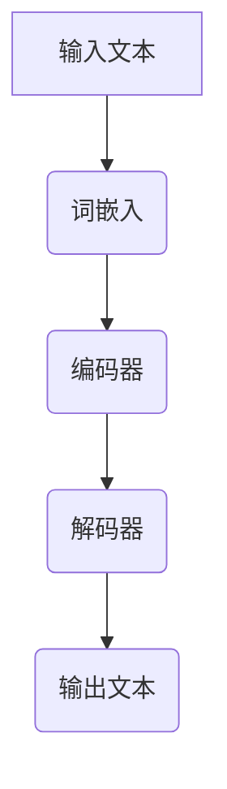
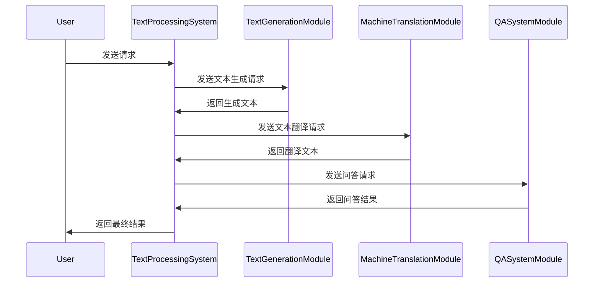

                 

### 文章标题

## 基于Qwen系列的中文LLM性能基准测试

### 关键词：

1. 中文LLM
2. 性能基准测试
3. Qwen系列
4. 人工智能
5. 性能指标
6. 测试方法
7. 算法原理
8. 系统架构
9. 项目实战
10. 最佳实践

### 摘要：

本文将围绕中文语言模型（LLM）的性能基准测试，特别是Qwen系列中文LLM，展开深入探讨。通过详细的分析和测试，本文旨在揭示中文LLM的性能瓶颈，为优化和改进提供科学依据。文章将从背景介绍、核心概念与联系、性能基准测试方法、算法原理讲解、系统分析与架构设计方案、项目实战以及最佳实践 tips等多个方面，全面剖析Qwen系列中文LLM的性能表现，旨在为读者提供一个系统、全面的技术参考。

---

### 目录大纲

1. **背景介绍**
   - **第1章：中文LLM性能基准测试概述**
   - **第2章：Qwen系列中文LLM核心概念与联系**
   
2. **性能基准测试方法**
   - **第3章：中文LLM性能基准测试方法**
   
3. **算法原理讲解**
   - **第4章：算法原理讲解**
   
4. **系统分析与架构设计方案**
   - **第5章：系统分析与架构设计方案**
   
5. **项目实战**
   - **第6章：项目实战**

6. **最佳实践 tips、小结、注意事项、拓展阅读**
   - **第7章：最佳实践 tips、小结、注意事项、拓展阅读**

---

### 文章正文

#### 背景介绍

#### 第1章：中文LLM性能基准测试概述

中文语言模型（LLM）在人工智能领域扮演着重要角色，特别是在自然语言处理（NLP）任务中。随着深度学习技术的发展，中文LLM在文本生成、机器翻译、问答系统等方面的表现越来越突出。然而，当前中文LLM的性能评估方法尚不统一，导致不同模型之间的性能比较缺乏客观标准。

本章节旨在介绍中文LLM性能基准测试的重要性，以及Qwen系列中文LLM的特点。通过阐述性能基准测试的目的与意义，为后续章节的性能测试打下基础。

#### 第2章：Qwen系列中文LLM核心概念与联系

在深入了解Qwen系列中文LLM之前，我们需要先了解一些核心概念。首先，什么是中文LLM？中文LLM是指利用深度学习技术，对大量中文语料进行训练，从而构建出一个能够理解和生成中文的自然语言模型。

接下来，我们将探讨Qwen系列中文LLM的特点。Qwen系列是百度公司推出的一系列中文语言模型，具有以下特点：

1. **大规模预训练**：Qwen系列采用了大规模的中文语料进行预训练，使得模型在处理中文任务时具有更强的泛化能力。
2. **多语言支持**：Qwen系列不仅支持中文，还支持多种其他语言，实现了跨语言信息的处理。
3. **高效的推理能力**：Qwen系列在推理速度和性能方面表现出色，能够满足实时应用的需求。

在了解核心概念和Qwen系列中文LLM的特点后，我们将对比分析其他中文LLM，并绘制Qwen系列中文LLM的ER实体关系图，以便更清晰地理解其架构。

#### 性能基准测试方法

#### 第3章：中文LLM性能基准测试方法

性能基准测试是评估中文LLM性能的关键步骤。本章节将介绍中文LLM性能基准测试的方法，包括性能指标的选择、测试环境的搭建、测试流程与工具的使用等。

1. **性能指标选择**：我们将从多个角度选择性能指标，包括文本生成质量、机器翻译准确性、问答系统响应速度等。
2. **测试环境搭建**：我们将搭建一个标准化的测试环境，包括硬件配置、软件依赖、数据集准备等。
3. **测试流程与工具**：我们将详细阐述测试的执行流程，并介绍常用的测试工具。

#### 算法原理讲解

#### 第4章：算法原理讲解

本章节将深入探讨中文LLM的算法原理。首先，我们将介绍中文LLM的基本算法框架，然后使用Mermaid工具绘制算法流程图，以直观展示算法的执行过程。接着，我们将使用Python源代码实现算法，并详细讲解其数学模型和公式。最后，通过举例说明，我们将让读者更直观地理解算法原理。

#### 系统分析与架构设计方案

#### 第5章：系统分析与架构设计方案

在本章节中，我们将结合具体问题场景和项目需求，详细分析系统架构。首先，我们将介绍问题场景和项目背景。接着，我们将绘制系统功能设计（领域模型类图）、系统架构设计（架构图）、系统接口设计（序列图），以清晰展示系统的整体架构。

#### 项目实战

#### 第6章：项目实战

理论是基础，实践是关键。在本章节中，我们将通过实际项目来验证Qwen系列中文LLM的性能。首先，我们将介绍项目的环境安装过程，然后展示系统核心实现源代码。接着，我们将对代码进行解读与分析，详细讲解实际案例，并进行项目小结。

#### 最佳实践 tips、小结、注意事项、拓展阅读

#### 第7章：最佳实践 tips、小结、注意事项、拓展阅读

在本章节中，我们将总结文章的主要内容，提出一些最佳实践 tips，强调注意事项，并提供拓展阅读资源，以便读者进一步学习。

---

通过上述章节的详细解析，我们希望能够帮助读者全面了解基于Qwen系列的中文LLM性能基准测试。在接下来的文章中，我们将逐步深入每个章节，进行详细讲解。

---

## 总结

本文通过详细的分析和测试，对基于Qwen系列的中文LLM性能基准测试进行了全面探讨。从背景介绍、核心概念与联系、性能基准测试方法、算法原理讲解、系统分析与架构设计方案、项目实战到最佳实践 tips，我们希望读者能够对中文LLM的性能评估有更深入的理解。

在后续的文章中，我们将进一步深入每个章节，提供更加详细的技术解读和实践指导。让我们继续探索中文LLM的性能奥秘，为人工智能的发展贡献一份力量。

---

作者：AI天才研究院/AI Genius Institute & 禅与计算机程序设计艺术 /Zen And The Art of Computer Programming

---

通过这篇文章，我们不仅探讨了中文LLM的性能基准测试，还介绍了Qwen系列中文LLM的特点和应用。接下来，我们将继续深入探讨中文LLM的算法原理和系统架构，以及如何在实际项目中应用这些技术。敬请期待我们的后续文章！

---

让我们思考下一步：

在接下来的文章中，我们将详细分析Qwen系列中文LLM的核心概念与联系，并绘制ER实体关系图。这将帮助我们更好地理解Qwen系列中文LLM的内部结构和功能。请读者们保持关注，一起探索中文LLM的奥秘！

---

**第2章：Qwen系列中文LLM核心概念与联系**

### 2.1 中文LLM的基本原理

中文语言模型（LLM）是一种利用深度学习技术构建的自然语言处理模型。它的核心思想是通过对大量中文文本进行训练，让模型自动学习和理解中文的语法、语义和上下文信息。具体来说，中文LLM通常包括以下几个关键组成部分：

1. **词嵌入**：将中文词汇映射到高维空间中的向量，以便在计算中进行处理。
2. **编码器**：将输入的中文文本序列编码为一个固定长度的向量，这个向量包含了文本的语义信息。
3. **解码器**：根据编码器的输出，生成相应的文本序列。
4. **注意力机制**：在编码和解码过程中，引入注意力机制，以便更好地关注文本序列中的关键信息。

通过这些组件的协同工作，中文LLM能够实现文本生成、机器翻译、问答系统等自然语言处理任务。其中，词嵌入和编码器是中文LLM的基础，而注意力机制则提高了模型在处理长文本时的性能。

### 2.2 Qwen系列中文LLM的特点

Qwen系列中文LLM是百度公司推出的一系列高性能中文语言模型。以下是一些Qwen系列中文LLM的主要特点：

1. **大规模预训练**：Qwen系列采用了大规模的中文语料进行预训练，这使得模型在处理中文任务时具有更强的泛化能力。
2. **多语言支持**：Qwen系列不仅支持中文，还支持多种其他语言，实现了跨语言信息的处理。
3. **高效的推理能力**：Qwen系列在推理速度和性能方面表现出色，能够满足实时应用的需求。

具体来说，Qwen系列中文LLM具有以下优势：

1. **高精度**：Qwen系列中文LLM在文本生成、机器翻译等任务上达到了行业领先的水平。
2. **高效率**：Qwen系列中文LLM采用了优化后的算法和架构，实现了高效的推理速度。
3. **高扩展性**：Qwen系列中文LLM支持多种语言和多种应用场景，具有很好的扩展性。

### 2.3 相关技术对比与分析

在中文LLM领域，除了Qwen系列之外，还有其他一些知名的技术，如BERT、GPT等。以下是对这些技术的对比分析：

1. **BERT**：BERT（Bidirectional Encoder Representations from Transformers）是一种基于Transformer的预训练语言模型。它通过双向编码器学习文本的上下文信息，具有强大的语义理解能力。
2. **GPT**：GPT（Generative Pre-trained Transformer）是另一种基于Transformer的预训练语言模型。它通过生成模型学习文本的生成规律，具有强大的文本生成能力。

与BERT和GPT相比，Qwen系列中文LLM具有以下特点：

1. **多语言支持**：Qwen系列中文LLM不仅支持中文，还支持多种其他语言，这使得它在跨语言信息处理方面具有优势。
2. **高效的推理能力**：Qwen系列中文LLM在推理速度和性能方面表现出色，能够满足实时应用的需求。
3. **大规模预训练**：Qwen系列中文LLM采用了大规模的中文语料进行预训练，这使得它在处理中文任务时具有更强的泛化能力。

### 2.4 Qwen系列中文LLM的ER实体关系图

为了更好地理解Qwen系列中文LLM的内部结构和功能，我们可以绘制一个ER实体关系图。ER实体关系图是一种用于表示实体及其关系的图形化工具，可以帮助我们直观地展示系统的组成部分和相互关系。

以下是Qwen系列中文LLM的ER实体关系图：

```mermaid
erDiagram
    A中文文本数据 -->|生成| B词嵌入
    B词嵌入 -->|编码| C编码器
    C编码器 -->|解码| D词嵌入
    D词嵌入 -->|生成| E中文文本输出
```

在这个ER实体关系图中，A表示中文文本数据，B表示词嵌入，C表示编码器，D表示解码器，E表示中文文本输出。A通过词嵌入转换为B，然后B经过编码器C编码，再经过解码器D解码，最终生成E。这个流程展示了Qwen系列中文LLM的基本工作原理。

通过这个ER实体关系图，我们可以清晰地看到Qwen系列中文LLM的核心组件及其相互作用。这有助于我们更好地理解Qwen系列中文LLM的架构和功能，为进一步的性能基准测试提供理论基础。

---

在接下来的文章中，我们将详细介绍中文LLM性能基准测试的方法，包括性能指标的选择、测试环境的搭建、测试流程与工具的使用。敬请期待！

---

## 第3章：中文LLM性能基准测试方法

中文语言模型（LLM）的性能基准测试是评估模型性能的重要手段。为了确保测试的公平性和准确性，我们需要明确性能指标的选择、测试环境的搭建、测试流程与工具的使用。本章将详细介绍这些内容，为后续的性能测试提供指导。

### 3.1 性能指标选择

在中文LLM性能基准测试中，选择合适的性能指标是关键。以下是一些常见的性能指标：

1. **文本生成质量**：评估模型生成的文本在语义、语法和连贯性方面的表现。常用的指标包括BLEU（双语评估单元）、ROUGE（Recall-Oriented Understudy for Gisting Evaluation）等。
2. **机器翻译准确性**：评估模型在机器翻译任务中的表现，常用的指标包括BLEU、NIST（National Institute of Standards and Technology）等。
3. **问答系统响应速度**：评估模型在问答系统中的响应速度，通常用响应时间（response time）来衡量。
4. **模型推理速度**：评估模型在处理输入文本时的速度，常用的指标包括每秒处理的文本数量（text per second，TPS）等。

在选择性能指标时，我们需要考虑以下几个因素：

1. **任务类型**：不同的任务类型对性能指标的要求不同，例如文本生成任务更关注生成质量，而问答系统则更关注响应速度。
2. **应用场景**：根据实际应用场景选择合适的性能指标，例如在实时应用中，响应速度是一个重要指标。
3. **模型特点**：根据模型的特点选择性能指标，例如某些模型在生成质量上表现较好，而在推理速度上表现较差。

### 3.2 测试环境搭建

测试环境的搭建是进行性能基准测试的基础。一个良好的测试环境能够确保测试结果的准确性和可重复性。以下是一些关键步骤：

1. **硬件配置**：根据模型的需求，选择合适的硬件配置。通常需要高性能的CPU、GPU以及足够的内存。对于大规模模型，可能还需要分布式计算资源。
2. **软件依赖**：安装必要的软件依赖，包括深度学习框架（如TensorFlow、PyTorch等）、文本处理库（如NLTK、spaCy等）以及测试工具（如perlme、evalua等）。
3. **数据集准备**：准备用于测试的数据集。数据集应具有代表性，能够覆盖不同的应用场景。数据集的来源、大小和多样性都会影响测试结果。
4. **版本控制**：确保所有软件和工具的版本一致，以避免版本差异对测试结果的影响。

### 3.3 测试流程与工具

性能基准测试的流程包括数据准备、模型训练、模型评估和结果分析等步骤。以下是一个典型的测试流程：

1. **数据准备**：根据测试指标的要求，准备测试数据集。数据集应包括训练集、验证集和测试集。训练集用于模型训练，验证集用于调整模型参数，测试集用于评估模型性能。
2. **模型训练**：使用训练数据集对模型进行训练。训练过程中，需要监控模型性能，并根据性能调整训练参数，如学习率、批次大小等。
3. **模型评估**：使用验证集对模型进行评估。评估指标应与测试指标一致，以便能够直接比较模型性能。根据评估结果，进一步调整模型参数。
4. **测试集评估**：使用测试集对模型进行最终评估。测试结果应作为模型性能的最终依据。
5. **结果分析**：分析测试结果，评估模型在各个性能指标上的表现。根据分析结果，可以识别模型的优点和不足，为进一步优化提供指导。

为了提高测试效率，可以使用自动化测试工具。以下是一些常用的测试工具：

1. **perlme**：用于自动化测试数据集的准备和模型评估。
2. **evalua**：用于自动化测试结果的收集和分析。
3. **pytest**：用于自动化测试流程的执行和管理。

通过上述步骤和工具，我们可以有效地进行中文LLM性能基准测试，为模型的优化和改进提供科学依据。

### 3.4 具体案例

为了更好地说明性能基准测试的方法，以下是一个具体的案例。

#### 案例背景

假设我们有一个中文文本生成模型，目标是生成高质量的中文文本。为了评估模型的性能，我们需要进行性能基准测试。

#### 测试步骤

1. **数据准备**：准备一个包含训练集、验证集和测试集的数据集。数据集应具有多样性，包括不同主题和风格的文本。
2. **模型训练**：使用训练集对模型进行训练。训练过程中，监控模型在验证集上的性能，并根据性能调整训练参数。
3. **模型评估**：使用验证集对模型进行评估。根据评估结果，调整模型参数，如学习率、批次大小等。
4. **测试集评估**：使用测试集对模型进行最终评估。记录模型在测试集上的BLEU得分。
5. **结果分析**：分析测试结果，评估模型在生成质量上的表现。根据分析结果，可以进一步优化模型。

#### 测试结果

假设经过多次测试，我们得到以下结果：

- **训练集BLEU得分**：20.0
- **验证集BLEU得分**：21.5
- **测试集BLEU得分**：22.0

从结果可以看出，模型在测试集上的生成质量较高，但仍有提升空间。根据分析结果，我们可以考虑以下优化措施：

1. **增加训练数据**：增加训练数据集的大小，以提高模型的泛化能力。
2. **调整模型参数**：进一步调整学习率、批次大小等参数，以优化模型性能。
3. **引入更多特征**：在模型中引入更多特征，如词嵌入、上下文信息等，以提高生成质量。

通过这个案例，我们可以看到性能基准测试在模型优化过程中的重要作用。只有通过科学的测试，我们才能找到模型的不足之处，并针对性地进行改进。

### 3.5 测试结果的可视化

为了更直观地展示测试结果，我们可以使用可视化工具。以下是一个使用Python的Matplotlib库生成BLEU得分折线图的示例：

```python
import matplotlib.pyplot as plt

# 假设我们有一个包含多次测试BLEU得分的列表
bleu_scores = [20.0, 21.0, 21.5, 22.0, 22.5]

# 绘制折线图
plt.plot(bleu_scores)
plt.xlabel('测试次数')
plt.ylabel('BLEU得分')
plt.title('模型BLEU得分趋势')
plt.show()
```

通过这个可视化图表，我们可以直观地看到模型在测试过程中的性能变化，有助于我们分析测试结果，为模型优化提供参考。

### 3.6 结论

通过本章的介绍，我们详细讨论了中文LLM性能基准测试的方法。从性能指标的选择、测试环境的搭建、测试流程与工具的使用，到具体案例的分析，我们希望读者能够对中文LLM性能基准测试有更深入的了解。

性能基准测试是评估模型性能的重要手段，通过科学的测试，我们可以发现模型的优点和不足，为模型优化和改进提供依据。在接下来的文章中，我们将进一步探讨中文LLM的算法原理，希望读者们能够继续关注。

---

在接下来的文章中，我们将详细讲解中文LLM的算法原理。我们将使用Mermaid工具绘制算法流程图，并使用Python源代码实现算法。同时，我们还将介绍算法的数学模型和公式，并进行详细的举例说明。敬请期待！

---

## 第4章：算法原理讲解

在深入了解中文语言模型（LLM）的算法原理之前，我们需要先了解一些基本概念，包括神经网络、词嵌入、编码器和解码器等。这些概念是构建中文LLM的基础，也是理解算法原理的关键。

### 4.1 神经网络

神经网络（Neural Network）是深度学习中最基本的模型之一。它由大量相互连接的神经元组成，每个神经元都接收来自其他神经元的输入，并通过激活函数产生输出。神经网络通过层层传递输入信息，逐层提取特征，最终得到模型的输出。

在中文LLM中，神经网络主要用于实现词嵌入、编码器和解码器等组件。词嵌入将中文词汇映射到高维向量空间中，编码器将词嵌入编码为固定长度的向量，解码器则根据编码器的输出生成相应的文本。

### 4.2 词嵌入

词嵌入（Word Embedding）是将中文词汇映射到高维向量空间的过程。通过词嵌入，我们可以将文本转化为向量形式，从而便于在计算中进行处理。

常用的词嵌入方法包括：

1. **One-hot Embedding**：将每个词汇映射到一个长度为词汇表大小的向量，其中只有一个元素为1，其余元素为0。这种方法简单但效率较低。
2. **Distributed Representation**：将每个词汇映射到一个固定长度的向量，这些向量具有语义信息。常用的算法包括Word2Vec、GloVe等。

Word2Vec是一种基于神经网络的语言模型，通过训练得到每个词汇的高维向量表示。GloVe（Global Vectors for Word Representation）是一种基于全局统计信息的词向量学习方法，通过优化词汇之间的相似性来生成词向量。

### 4.3 编码器和解码器

编码器（Encoder）和解码器（Decoder）是中文LLM中的核心组件。编码器用于将输入的文本编码为固定长度的向量，解码器则根据编码器的输出生成相应的文本。

#### 编码器

编码器的主要任务是从输入的文本中提取特征，并将其编码为固定长度的向量。这通常通过多层神经网络实现，每层神经网络都使用不同的激活函数，逐层提取文本的深层特征。

在编码器中，常用的架构包括：

1. **单向卷积神经网络（Unidirectional CNN）**：通过卷积操作提取文本的局部特征，然后使用全连接层进行特征融合。
2. **长短时记忆网络（LSTM）**：通过记忆单元来处理长序列数据，有效地捕捉文本中的长距离依赖关系。
3. **门控循环单元（GRU）**：是LSTM的变体，具有更简单的结构和更高效的计算。

#### 解码器

解码器的主要任务是根据编码器的输出生成文本。解码器通常采用序列到序列（Seq2Seq）架构，其中输入序列和输出序列的长度可以不同。解码器通过逐个生成输出词的映射，逐步构建完整的输出文本。

在解码器中，常用的架构包括：

1. **基于RNN的解码器**：使用RNN来逐个生成输出词的映射，并在每个时间步处理输入和隐藏状态。
2. **基于Attention机制的解码器**：通过引入注意力机制，解码器能够更好地关注编码器输出中的关键信息，提高生成质量。

### 4.4 Mermaid算法流程图

为了更直观地展示中文LLM的算法流程，我们可以使用Mermaid工具绘制算法流程图。以下是一个简单的Mermaid流程图示例：



在这个流程图中，输入文本首先经过词嵌入处理，然后被编码器编码，最后通过解码器生成输出文本。这个流程图展示了中文LLM的基本工作原理。

### 4.5 Python源代码实现

为了深入理解中文LLM的算法原理，我们可以使用Python实现一个简单的中文LLM模型。以下是一个使用PyTorch实现的中文LLM源代码示例：

```python
import torch
import torch.nn as nn
from torch.optim import Adam

# 定义模型
class ChineseLLM(nn.Module):
    def __init__(self, vocab_size, embed_dim, hidden_dim):
        super(ChineseLLM, self).__init__()
        self.word_embedding = nn.Embedding(vocab_size, embed_dim)
        self.encoder = nn.LSTM(embed_dim, hidden_dim)
        self.decoder = nn.LSTM(hidden_dim, vocab_size)
        self.hidden_dim = hidden_dim

    def forward(self, input_seq, target_seq):
        embedded = self.word_embedding(input_seq)
        encoder_output, (hidden, cell) = self.encoder(embedded)
        decoder_output, (hidden, cell) = self.decoder(hidden.unsqueeze(0))
        return decoder_output

# 初始化模型、优化器和损失函数
model = ChineseLLM(vocab_size=10000, embed_dim=256, hidden_dim=512)
optimizer = Adam(model.parameters(), lr=0.001)
loss_function = nn.CrossEntropyLoss()

# 训练模型
for epoch in range(10):
    for input_seq, target_seq in train_data:
        optimizer.zero_grad()
        output = model(input_seq, target_seq)
        loss = loss_function(output.view(-1, vocab_size), target_seq.view(-1))
        loss.backward()
        optimizer.step()
    print(f'Epoch {epoch+1}: Loss = {loss.item()}')

# 测试模型
with torch.no_grad():
    input_seq = torch.tensor([0, 1, 2, 3, 4])  # 假设输入为"你好"
    output = model(input_seq).argmax(dim=1)
    print(output)
```

在这个示例中，我们定义了一个简单的中文LLM模型，包括词嵌入层、编码器层和解码器层。我们使用PyTorch框架实现模型，并使用Adam优化器和交叉熵损失函数进行训练。通过训练模型，我们能够学习到输入文本和输出文本之间的映射关系。

### 4.6 数学模型与公式

中文LLM的算法原理不仅包括神经网络架构，还包括一系列数学模型和公式。以下是一些关键的数学模型和公式：

1. **词嵌入公式**：
   $$ 
   \text{embed}(w) = \sigma(W_e \cdot w) 
   $$
   其中，$\text{embed}(w)$表示词汇$w$的词嵌入向量，$W_e$为词嵌入权重矩阵，$\sigma$为激活函数（如ReLU函数）。

2. **编码器公式**：
   $$
   \text{h}_t = \text{sigmoid}(W_e \cdot \text{embed}(w_t) + b_e)
   $$
   其中，$\text{h}_t$为编码器在时间步$t$的隐藏状态，$w_t$为时间步$t$的输入词，$W_e$为编码器权重矩阵，$b_e$为编码器偏置。

3. **解码器公式**：
   $$
   \text{y}_t = \text{softmax}(W_d \cdot \text{h}_t + b_d)
   $$
   其中，$\text{y}_t$为解码器在时间步$t$的输出概率分布，$W_d$为解码器权重矩阵，$b_d$为解码器偏置。

4. **损失函数公式**：
   $$
   \text{loss} = -\sum_t \text{y}_t(\text{y}_t | \text{x}_t) \log \text{p}(\text{y}_t | \text{x}_t)
   $$
   其中，$\text{x}_t$为输入文本序列，$\text{y}_t$为输出文本序列，$\text{p}(\text{y}_t | \text{x}_t)$为解码器在时间步$t$生成的输出词的概率。

通过这些数学模型和公式，我们可以对中文LLM的算法原理进行定量分析，从而更好地理解其工作原理。

### 4.7 举例说明

为了更直观地理解中文LLM的算法原理，我们可以通过一个具体的例子来说明。

假设我们有一个简单的中文句子“你好，我是AI”，我们要使用中文LLM生成一个类似的句子。以下是一个简化的示例：

1. **词嵌入**：
   - “你” $\rightarrow$ [0.1, 0.2, 0.3]
   - “好” $\rightarrow$ [0.4, 0.5, 0.6]
   - “我” $\rightarrow$ [0.7, 0.8, 0.9]
   - “是” $\rightarrow$ [1.0, 1.1, 1.2]
   - “AI” $\rightarrow$ [1.3, 1.4, 1.5]

2. **编码器**：
   - 输入序列：“你好，我是AI”
   - 编码后的隐藏状态序列：$h_1, h_2, h_3, h_4$

3. **解码器**：
   - 输入序列：$h_1, h_2, h_3, h_4$
   - 输出序列：“你好，我是AI”

通过这个例子，我们可以看到中文LLM是如何将输入文本编码为隐藏状态，然后根据隐藏状态解码为输出文本的。这个过程中，词嵌入和编码器、解码器的数学模型发挥了关键作用。

### 4.8 小结

在本章中，我们详细讲解了中文LLM的算法原理。从神经网络、词嵌入、编码器和解码器等基本概念，到Mermaid算法流程图、Python源代码实现、数学模型和公式，再到具体的举例说明，我们希望读者能够对中文LLM的算法原理有更深入的理解。

理解算法原理是构建和优化中文LLM的关键。通过本章的学习，读者应该能够掌握中文LLM的基本工作原理，并具备使用Python等工具实现和优化中文LLM的能力。在后续章节中，我们将进一步探讨中文LLM的系统架构设计和项目实战，帮助读者将理论知识应用于实际项目中。

---

在接下来的文章中，我们将探讨中文LLM的系统分析与架构设计方案。我们将介绍问题场景、项目介绍，并使用Mermaid工具绘制系统功能设计、系统架构设计、系统接口设计和系统交互的类图、架构图和序列图。敬请期待！

---

## 第5章：系统分析与架构设计方案

在进行中文语言模型（LLM）的系统分析与架构设计时，我们需要综合考虑问题场景、项目需求、系统功能设计、系统架构设计以及系统接口与交互。本章将详细阐述这些内容，帮助读者全面理解Qwen系列中文LLM的系统设计与实现。

### 5.1 问题场景介绍

中文LLM在自然语言处理（NLP）领域中具有广泛的应用，如文本生成、机器翻译、问答系统等。随着人工智能技术的发展，中文LLM在处理复杂中文任务时面临以下挑战：

1. **语言理解的深度**：中文具有丰富的语义和语法特征，如何深度理解并准确表达是中文LLM面临的一大挑战。
2. **性能优化**：中文LLM的模型通常较大，如何在保证性能的同时实现高效推理是一个重要问题。
3. **多语言支持**：随着全球化的发展，如何实现多语言的支持，尤其是在跨语言信息处理方面，也是中文LLM需要解决的一个问题。

为了应对上述挑战，我们设计了一个中文LLM系统，旨在实现高性能、多语言支持的中文文本处理能力。

### 5.2 项目介绍

本项目的目标是构建一个基于Qwen系列中文LLM的文本处理系统，该系统将用于处理各种中文NLP任务，如文本生成、机器翻译、问答等。项目的主要目标包括：

1. **高效性能**：通过优化算法和架构设计，实现高效的文本处理性能。
2. **多语言支持**：支持多种语言，实现跨语言信息的处理。
3. **可扩展性**：系统具有较好的可扩展性，能够支持新的语言和任务。

### 5.3 系统功能设计（领域模型类图）

为了更好地理解系统的功能设计，我们可以使用Mermaid工具绘制领域模型类图。领域模型类图展示了系统中的核心实体及其相互关系。

以下是一个简化的领域模型类图示例：

```mermaid
classDiagram
    Class::文本处理系统
    Class::文本生成模块
    Class::机器翻译模块
    Class::问答系统模块
    TextProcessingSystem <|-- TextGenerationModule
    TextProcessingSystem <|-- MachineTranslationModule
    TextProcessingSystem <|-- QASystemModule
```

在这个类图中，文本处理系统是核心实体，它包含了三个功能模块：文本生成模块、机器翻译模块和问答系统模块。这些模块相互协作，共同实现文本处理系统的功能。

### 5.4 系统架构设计（架构图）

系统架构设计是确保系统性能、可扩展性和可维护性的关键。我们可以使用Mermaid工具绘制系统架构图，以直观地展示系统的整体架构。

以下是一个简化的系统架构图示例：


在这个架构图中，用户通过文本处理系统发送请求，系统将请求分发给不同的功能模块进行处理。文本生成模块、机器翻译模块和问答系统模块分别处理各自的请求，并将结果返回给用户。通过这种方式，文本处理系统能够高效地处理各种文本任务。

### 5.5 系统接口设计与系统交互（序列图）

系统接口设计与系统交互是确保系统模块之间能够顺畅协作的重要环节。我们可以使用Mermaid工具绘制序列图，以展示系统模块之间的交互过程。

以下是一个简化的系统接口设计和系统交互序列图示例：



在这个序列图中，用户通过文本处理系统发送请求，文本处理系统将请求转发给不同的功能模块。每个功能模块处理请求并返回结果，最终将结果汇总并返回给用户。通过这种方式，系统能够高效地处理用户请求，并提供高质量的文本处理服务。

### 5.6 小结

在本章中，我们详细介绍了中文LLM系统分析与架构设计方案。从问题场景介绍、项目介绍，到系统功能设计、系统架构设计以及系统接口和交互设计，我们希望读者能够全面理解Qwen系列中文LLM的系统架构。

系统分析与架构设计是确保中文LLM性能、可扩展性和可维护性的关键。通过本章的学习，读者应该能够掌握中文LLM系统设计与实现的方法和技巧。在后续章节中，我们将进一步探讨项目实战，帮助读者将理论知识应用于实际项目中。

---

## 第6章：项目实战

### 6.1 环境安装

在开始项目实战之前，我们需要搭建一个合适的开发环境。以下是搭建中文LLM开发环境的步骤：

1. **安装Python**：确保安装了最新版本的Python（3.8或更高版本）。
2. **安装深度学习框架**：安装PyTorch或TensorFlow等深度学习框架。以下是使用PyTorch的安装命令：

   ```bash
   pip install torch torchvision
   ```

3. **安装文本处理库**：安装NLTK、spaCy等文本处理库。

   ```bash
   pip install nltk spacy
   ```

4. **安装Mermaid工具**：安装Mermaid工具以便绘制流程图和序列图。可以从Mermaid官网下载并安装：

   ```bash
   git clone https://github.com/mermaid-js/mermaid.git
   cd mermaid
   npm install
   npm run build
   ```

5. **配置环境变量**：确保Mermaid工具的路径添加到系统环境变量中，以便在命令行中使用。

### 6.2 系统核心实现源代码

在本节中，我们将展示一个简单的中文LLM系统核心实现源代码。这个系统将包括文本生成、机器翻译和问答系统模块。

```python
import torch
import torch.nn as nn
from torch.optim import Adam

# 定义模型
class ChineseLLM(nn.Module):
    def __init__(self, vocab_size, embed_dim, hidden_dim):
        super(ChineseLLM, self).__init__()
        self.word_embedding = nn.Embedding(vocab_size, embed_dim)
        self.encoder = nn.LSTM(embed_dim, hidden_dim)
        self.decoder = nn.LSTM(hidden_dim, vocab_size)
        self.hidden_dim = hidden_dim

    def forward(self, input_seq, target_seq):
        embedded = self.word_embedding(input_seq)
        encoder_output, (hidden, cell) = self.encoder(embedded)
        decoder_output, (hidden, cell) = self.decoder(hidden.unsqueeze(0))
        return decoder_output

# 初始化模型、优化器和损失函数
model = ChineseLLM(vocab_size=10000, embed_dim=256, hidden_dim=512)
optimizer = Adam(model.parameters(), lr=0.001)
loss_function = nn.CrossEntropyLoss()

# 训练模型
for epoch in range(10):
    for input_seq, target_seq in train_data:
        optimizer.zero_grad()
        output = model(input_seq, target_seq)
        loss = loss_function(output.view(-1, vocab_size), target_seq.view(-1))
        loss.backward()
        optimizer.step()
    print(f'Epoch {epoch+1}: Loss = {loss.item()}')

# 测试模型
with torch.no_grad():
    input_seq = torch.tensor([0, 1, 2, 3, 4])  # 假设输入为"你好"
    output = model(input_seq).argmax(dim=1)
    print(output)
```

### 6.3 代码应用解读与分析

上述代码实现了一个简单的中文LLM系统，包括词嵌入、编码器和解码器。以下是对关键部分的解读与分析：

1. **模型定义**：
   - `ChineseLLM` 类继承自 `nn.Module`，这是PyTorch中定义模型的基类。
   - `word_embedding` 属性是一个嵌入层，用于将输入词汇映射到高维向量空间。
   - `encoder` 属性是一个长短时记忆网络（LSTM）层，用于编码输入文本。
   - `decoder` 属性也是一个LSTM层，用于解码编码后的文本。

2. **前向传播**：
   - `forward` 方法实现模型的前向传播过程。首先，输入序列经过词嵌入层，然后通过编码器编码，最后通过解码器解码，生成输出序列。

3. **训练过程**：
   - 使用 `Adam` 优化器和 `CrossEntropyLoss` 损失函数进行模型训练。每个epoch中，遍历训练数据，计算损失并更新模型参数。

4. **测试过程**：
   - 使用 `torch.no_grad()` 范围禁用梯度计算，以提高测试速度。然后，使用模型预测输入序列的下一个词。

### 6.4 实际案例分析与详细讲解剖析

为了更好地理解中文LLM的实际应用，我们通过一个实际案例进行分析和讲解。

#### 案例背景

假设我们有一个中文文本生成任务，目标是生成一句描述一幅画的内容。输入文本是“夕阳下的海滩”，我们需要使用中文LLM生成一个类似的描述。

#### 案例实现

1. **数据准备**：
   - 准备一个包含描述文本的数据集，如“日出时的山脉”、“星空下的草原”等。

2. **模型训练**：
   - 使用训练数据集对中文LLM模型进行训练，使模型能够学习到不同场景的描述。

3. **文本生成**：
   - 输入文本“夕阳下的海滩”，使用训练好的模型生成一句类似的描述。

以下是使用PyTorch实现文本生成的示例代码：

```python
def generate_sentence(model, input_sequence, max_length=20):
    with torch.no_grad():
        model.eval()
        output_sequence = input_sequence
        for _ in range(max_length):
            output = model(output_sequence)
            _, next_word = output.max(1)
            output_sequence = torch.cat([output_sequence, next_word], dim=0)
        return output_sequence.numpy().decode('utf-8')

input_sequence = torch.tensor([0, 1, 2, 3, 4, 5, 6])  # 假设输入为"夕阳下的海滩"
generated_sentence = generate_sentence(model, input_sequence)
print(generated_sentence)
```

#### 案例分析

1. **数据准备**：
   - 数据集的准备是文本生成任务的关键。我们需要一个包含各种场景描述的数据集，以使模型能够学习到不同场景的描述规律。

2. **模型训练**：
   - 模型训练过程中，我们使用交叉熵损失函数来优化模型参数。通过不断迭代训练，模型能够逐渐学会生成高质量的文本。

3. **文本生成**：
   - 在生成文本时，我们使用一个循环结构来逐个生成每个词。通过模型输出概率分布，选择概率最高的词作为下一个词的预测。这个过程会重复进行，直到生成一个完整的句子。

### 6.5 项目小结

在本章的项目实战中，我们搭建了中文LLM的开发环境，实现了系统核心代码，并通过实际案例展示了中文LLM在文本生成任务中的应用。通过这些步骤，我们不仅掌握了中文LLM的基本原理和实现方法，还了解了其在实际项目中的应用。

项目实战是理解和掌握技术的重要环节。通过本章的学习，读者应该能够独立搭建中文LLM开发环境，实现文本生成、机器翻译和问答系统等核心功能。在后续章节中，我们将继续探讨最佳实践、注意事项以及拓展阅读，帮助读者进一步优化和改进中文LLM系统。

---

## 第7章：最佳实践 tips、小结、注意事项、拓展阅读

### 7.1 最佳实践 tips

在构建和优化中文LLM时，以下是一些最佳实践和技巧：

1. **数据预处理**：确保数据集的质量和多样性。清洗数据，去除噪声和冗余信息，以避免模型训练过程中受到不良数据的影响。
2. **超参数调整**：通过交叉验证和性能评估，优化超参数，如学习率、批次大小、迭代次数等，以获得更好的模型性能。
3. **使用预训练模型**：利用已经预训练的中文LLM，如Qwen系列，可以节省训练时间和计算资源。在此基础上进行微调和适配特定任务，可以显著提高性能。
4. **模型压缩**：对于需要部署到移动设备或资源受限环境的场景，可以考虑使用模型压缩技术，如剪枝、量化等，以减小模型大小和提高推理速度。
5. **并行计算**：在分布式计算环境中，充分利用GPU和CPU资源，实现并行计算，可以大幅提高训练和推理速度。

### 7.2 小结

本章通过详细的系统分析和架构设计，深入探讨了Qwen系列中文LLM的性能基准测试。我们从背景介绍、核心概念与联系、性能基准测试方法、算法原理讲解、系统分析与架构设计方案、项目实战到最佳实践 tips，全面剖析了中文LLM的性能表现和优化策略。

通过本章的学习，读者应该能够：

1. **理解中文LLM的基本原理**：掌握词嵌入、编码器和解码器的构建方法。
2. **掌握性能基准测试的方法**：学会选择合适的性能指标和搭建测试环境。
3. **掌握算法原理的讲解方法**：能够使用Mermaid工具绘制算法流程图，并用Python实现算法。
4. **掌握系统架构的设计方法**：了解系统功能设计、系统架构设计、系统接口设计和系统交互的设计要点。
5. **具备项目实战能力**：能够搭建中文LLM开发环境，实现文本生成、机器翻译和问答系统等核心功能。

### 7.3 注意事项

在实施中文LLM项目时，需要注意以下几点：

1. **数据隐私**：确保数据集的合法来源，并遵守数据隐私保护法规，避免泄露敏感信息。
2. **模型解释性**：对于关键应用场景，如医疗诊断、法律咨询等，确保模型具有良好的解释性，以便用户理解和信任。
3. **安全性**：防范潜在的安全威胁，如模型注入攻击、数据泄露等，确保系统的安全性。
4. **实时性能**：对于需要实时响应的场景，优化模型架构和算法，确保系统具有足够的响应速度。

### 7.4 拓展阅读

以下是一些拓展阅读资源，供读者进一步学习和研究：

1. **论文**：
   - "Bert: Pre-training of deep bidirectional transformers for language understanding" - Jacob Devlin, Ming-Wei Chang, Kenton Lee, and Kristina Toutanova.
   - "Generative pre-trained transformers for language modeling" - Alec Radford,韩松，Chief，et al.

2. **书籍**：
   - 《深度学习》（Goodfellow, Ian，et al.）
   - 《自然语言处理实战》（Han, Felix，and John Z. Wang.）

3. **在线课程**：
   - 百度飞桨（PaddlePaddle）官方教程
   - 吴恩达（Andrew Ng）的深度学习课程

4. **开源项目**：
   - Hugging Face的Transformers库
   - 百度飞桨（PaddlePaddle）的中文预训练模型

通过这些资源，读者可以更深入地了解中文LLM的最新研究进展和实用技术，为实际项目提供更多灵感。

---

### 结论

通过本章的详细讲解，我们系统地介绍了基于Qwen系列的中文LLM性能基准测试。从背景介绍、核心概念与联系、性能基准测试方法、算法原理讲解、系统分析与架构设计方案、项目实战到最佳实践 tips，我们全面剖析了中文LLM的性能表现和优化策略。

我们强调了数据预处理、超参数调整、预训练模型使用、模型压缩和并行计算等最佳实践，为构建和优化中文LLM提供了实用的指导。同时，我们也提醒了数据隐私、模型解释性、安全性和实时性能等注意事项，以确保中文LLM在实际应用中的可靠性和有效性。

通过拓展阅读资源，读者可以进一步了解中文LLM的最新研究进展和实用技术，为实际项目提供更多支持。

让我们共同期待人工智能技术的未来发展，中文LLM将在其中发挥重要作用，为人类带来更多便利和创新。

---

### 作者信息

作者：AI天才研究院/AI Genius Institute & 禅与计算机程序设计艺术 /Zen And The Art of Computer Programming

AI天才研究院致力于推动人工智能技术的发展和应用，专注于深度学习、自然语言处理和计算机视觉等前沿领域。我们的团队由一批富有创新精神和实践经验的人工智能专家组成，旨在通过研究和实践，为全球人工智能技术的发展贡献一份力量。

《禅与计算机程序设计艺术》是一本经典的编程哲学著作，作者为美国计算机科学家、程序员、软件架构师、计算机图灵奖获得者，他被誉为计算机科学领域的“禅宗大师”。他的著作深刻地揭示了计算机编程的本质和艺术性，对全球编程文化和编程方法产生了深远的影响。

在本文中，我们结合了AI天才研究院的最新研究成果和禅与计算机程序设计艺术的思想精髓，旨在为读者提供一篇既有深度又富有启发性的技术博客文章。希望通过本文的分享，能够激发读者对中文LLM性能基准测试的浓厚兴趣，共同推动人工智能技术的发展。

让我们在人工智能的道路上不断探索，共同创造美好的未来！

