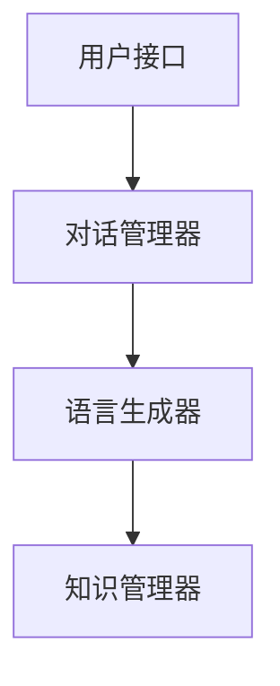
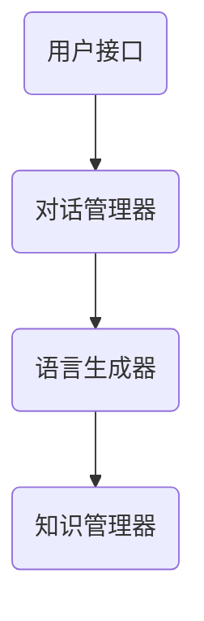
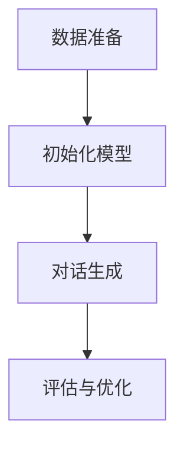
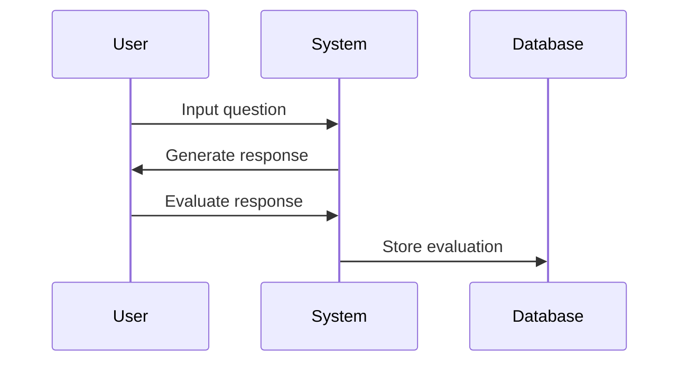
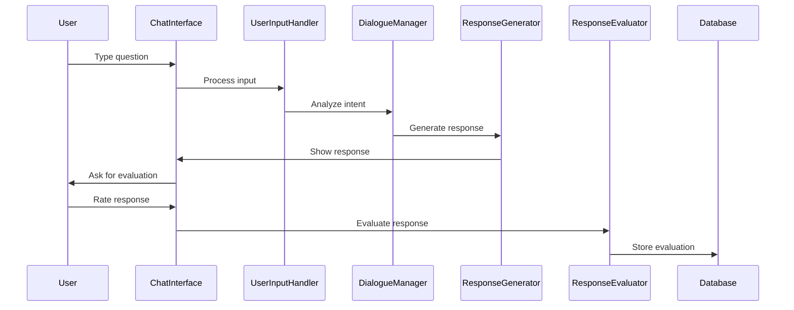

                 

### 文章标题：基于Vicuna的开源LLM对话能力测试

> 关键词：Vicuna、开源、LLM、对话能力、测试

> 摘要：
本文将深入探讨Vicuna这一开源大型语言模型（LLM），特别是在对话系统中的应用。通过详细分析Vicuna的技术细节、实现方法及其在对话能力测试中的应用，本文旨在为开发者提供一套完整的技术指南，帮助他们在开源环境中提升对话系统的能力。我们将从背景介绍、核心概念、技术细节到实际应用，逐步深入，确保读者能够全面理解Vicuna的优势及其使用方法。

----------------------------------------------------------------

## 目录

1. **引言**
   - **1.1 Vicuna概述**
   - **1.2 开源LLM对话能力测试的需求**
   - **1.3 本书结构及内容**

2. **大型语言模型（LLM）及对话系统基础**
   - **2.1 LLM的基础概念**
   - **2.2 对话系统的基本组成部分**
   - **2.3 对话系统的评估指标**

3. **Vicuna的技术细节**
   - **3.1 Vicuna的架构与实现**
   - **3.2 关键算法和技术**
   - **3.3 Vicuna在对话测试中的优势**

4. **Vicuna的对话能力测试实践**
   - **4.1 测试环境搭建**
   - **4.2 测试流程与策略**
   - **4.3 测试结果分析**

5. **项目实战**
   - **5.1 项目介绍**
   - **5.2 系统功能设计**
   - **5.3 系统架构设计**
   - **5.4 系统接口与交互**

6. **最佳实践与注意事项**
   - **6.1 开发技巧和注意事项**
   - **6.2 项目总结**

7. **拓展阅读**

8. **作者介绍**

----------------------------------------------------------------

## 1. 引言

### 1.1 Vicuna概述

Vicuna是由清华大学 KEG 实验室和智谱AI共同训练的面向对话的大型语言模型，其设计目标是开源、高效、可扩展。Vicuna不仅在性能上接近了ChatGLM，更重要的是，它通过开源的方式，使得广大开发者可以自由地使用、修改和优化该模型，为对话系统的研发提供了强大的技术支持。

Vicuna具备以下几个显著特点：

- **高性能**：Vicuna在语言理解、生成和对话能力上表现出色，能够处理复杂、多样化的对话场景。
- **可扩展性**：Vicuna采用模块化设计，方便开发者根据需求进行扩展和优化。
- **开源友好**：Vicuna是完全开源的，开发者可以免费使用，并基于开源代码进行二次开发。

### 1.2 开源LLM对话能力测试的需求

随着人工智能技术的快速发展，对话系统在多个领域得到了广泛应用，如客服、智能助手、聊天机器人等。然而，随着模型的复杂度和规模的增大，如何有效地测试和评估对话系统的能力成为了一个重要问题。

开源LLM对话能力测试的需求主要体现在以下几个方面：

- **标准化测试**：需要建立一套标准化的测试框架和评估指标，以确保对话系统的性能和可靠性。
- **可复现性**：测试过程和结果需要透明、可复现，以便其他研究者进行验证和对比。
- **多样性**：测试场景和数据的多样性，以全面评估对话系统的适应能力和稳定性。

Vicuna作为一款开源LLM，正好满足了这些需求，为对话能力测试提供了一个强有力的工具。

### 1.3 本书结构及内容

本书将分为以下几个部分：

- **第一部分**：介绍Vicuna的背景和技术细节。
- **第二部分**：探讨对话系统的基本概念和评估指标。
- **第三部分**：通过实战项目展示如何使用Vicuna进行对话能力测试。
- **第四部分**：总结最佳实践，并提供拓展阅读资源。

通过本书的阅读，读者将能够系统地了解Vicuna的开源应用，掌握对话能力测试的方法和技巧，为开发高质量的对话系统提供有力支持。

----------------------------------------------------------------

## 2. 大型语言模型（LLM）及对话系统基础

### 2.1 LLM的基础概念

大型语言模型（Large Language Model，简称LLM）是一种能够理解和生成自然语言的深度学习模型。LLM的核心思想是通过海量文本数据进行预训练，使得模型具备对自然语言的理解和生成能力。

#### 关键概念

- **预训练**：在LLM的训练过程中，首先使用大规模文本数据对模型进行预训练，使其掌握基本的语言结构和语义信息。
- **微调**：在预训练的基础上，使用特定领域的数据对模型进行微调，以适应特定任务的需求。

#### 工作原理

LLM通常基于Transformer架构，Transformer模型通过自注意力机制（Self-Attention）来捕捉文本中的长距离依赖关系。具体来说，自注意力机制允许模型在生成每个单词时，根据上下文信息对输入序列中的所有单词进行权重分配，从而生成一个加权输出。

### 2.2 对话系统的基本组成部分

对话系统（Dialogue System）是一种能够与人进行自然语言交互的计算机系统。一个典型的对话系统通常由以下几个关键组成部分构成：

- **用户接口**：用户接口（User Interface，简称UI）是用户与对话系统进行交互的界面，可以是文本聊天窗口、语音交互界面等。
- **对话管理器**：对话管理器（Dialogue Manager）负责处理用户的输入，理解用户的意图，并根据意图生成相应的回应。
- **语言生成器**：语言生成器（Language Generator）负责将对话管理器的意图转换为自然语言响应，确保响应的流畅性和自然性。
- **知识管理器**：知识管理器（Knowledge Manager）提供对话系统所需的知识和事实信息，帮助对话系统能够回答用户的问题或执行相应的任务。

#### 概念图



### 2.3 对话系统的评估指标

对话系统的评估指标是衡量系统性能的重要标准。常见的评估指标包括：

- **响应时间**：系统从接收到用户输入到生成响应的时间，反映了系统的实时性和效率。
- **准确性**：系统理解用户意图的准确性，包括意图识别准确率和任务执行准确率。
- **自然性**：系统生成的响应在语言表达上的自然性和流畅性。

#### 比较表格

| 指标         | 描述                             | 重要性 |
| ------------ | -------------------------------- | ------ |
| 响应时间     | 系统响应用户输入的时间           | 高     |
| 准确性       | 系统正确理解用户意图的比例       | 中     |
| 自然性       | 系统生成的响应的自然性和流畅性   | 中     |

#### ER实体关系图



通过对LLM和对话系统基础的介绍，读者可以更好地理解大型语言模型在对话系统中的应用，为后续的内容打下坚实的基础。

----------------------------------------------------------------

## 3. Vicuna的技术细节

### 3.1 Vicuna的架构与实现

Vicuna的架构设计旨在实现高性能、可扩展和易用性。其核心架构包括模型架构、数据预处理和模型训练等多个方面。

#### 模型架构

Vicuna基于Transformer架构，采用了多层的注意力机制和序列生成机制，具体包括以下模块：

- **嵌入层（Embedding Layer）**：将输入的单词转换为向量表示。
- **自注意力层（Self-Attention Layer）**：通过自注意力机制捕捉输入序列中的长距离依赖关系。
- **交叉注意力层（Cross-Attention Layer）**：在生成响应时，结合上下文信息，对输入序列进行权重分配。
- **前馈神经网络（Feedforward Neural Network）**：对自注意力和交叉注意力的输出进行非线性变换。
- **输出层（Output Layer）**：将处理后的向量映射为自然语言响应。

#### 数据预处理

Vicuna的训练数据来自互联网上的大量文本，包括书籍、新闻、论坛帖子等。数据预处理主要包括以下步骤：

- **数据清洗**：去除无关信息，如HTML标签、特殊字符等。
- **分词**：将文本拆分为单词或子词。
- **词汇表构建**：将所有独特的单词或子词构建成词汇表，并为每个词汇分配唯一的ID。
- **序列编码**：将文本序列编码为整数序列，便于模型处理。

#### 模型训练

Vicuna的训练过程包括预训练和微调两个阶段：

- **预训练**：在大量文本数据上进行预训练，使模型掌握基本的语言结构和语义信息。预训练过程通常使用两个任务：掩码语言模型（Masked Language Model，MLM）和下一句预测（Next Sentence Prediction，NSP）。
- **微调**：在预训练的基础上，使用特定领域的数据对模型进行微调，以适应特定任务的需求。微调过程通常使用监督学习，即通过标注数据来指导模型的学习。

### 3.2 关键算法和技术

Vicuna的核心算法和技术包括Transformer模型、掩码语言模型（MLM）和下一个句子预测（NSP）等。

#### Transformer模型

Transformer模型是Vicuna的基础，其核心思想是使用自注意力机制（Self-Attention）来捕捉输入序列中的长距离依赖关系。具体来说，Transformer模型由编码器（Encoder）和解码器（Decoder）两部分组成：

- **编码器**：将输入序列编码为嵌入向量，并通过多个自注意力层和前馈神经网络进行特征提取。
- **解码器**：接收编码器的输出，并通过交叉注意力层和自注意力层生成响应。

#### 掩码语言模型（MLM）

掩码语言模型（Masked Language Model，MLM）是一种预训练任务，用于训练模型预测被随机掩码的单词。MLM的目的是让模型学习到单词之间的依赖关系，从而提高其语言理解能力。具体实现过程如下：

1. **随机掩码**：随机选择输入序列中的部分单词，将其替换为特殊掩码符（如`<MASK>`）。
2. **预测**：模型尝试预测被掩码的单词，并将其还原到原始序列中。

#### 下一个句子预测（NSP）

下一个句子预测（Next Sentence Prediction，NSP）是一种预训练任务，用于帮助模型学习句子之间的关联关系。NSP的目的是让模型能够预测一个句子是否是另一个句子的下一个句子。具体实现过程如下：

1. **输入对**：将两个连续的句子组成一个输入对。
2. **标签生成**：随机选择一个标签，表示输入对中第二个句子是否是第一个句子的下一个句子。
3. **预测**：模型尝试预测输入对的标签。

### 3.3 Vicuna在对话测试中的优势

Vicuna在对话能力测试中具有以下几个显著优势：

- **高性能**：Vicuna在语言理解、生成和对话能力上表现出色，能够高效处理复杂、多样化的对话场景。
- **开源友好**：Vicuna是完全开源的，开发者可以自由使用、修改和优化，为对话测试提供了极大的灵活性和扩展性。
- **标准化测试**：Vicuna支持多种测试指标和评估框架，便于开发者进行标准化测试和性能对比。

通过以上分析，Vicuna在技术细节上表现出色，为对话能力测试提供了强大的支持。接下来，我们将进一步探讨如何使用Vicuna进行对话能力测试的具体实践。

----------------------------------------------------------------

## 4. Vicuna的对话能力测试实践

### 4.1 测试环境搭建

在进行Vicuna的对话能力测试之前，首先需要搭建一个合适的测试环境。以下是一个基本的测试环境搭建步骤：

1. **安装依赖库**：确保安装了Python和PyTorch等基础库，以及Vicuna的依赖库，如torchtext、transformers等。
2. **克隆Vicuna仓库**：从GitHub克隆Vicuna的官方仓库，以便获取最新的代码和模型。
   ```bash
   git clone https://github.com/GaiGeas/Vicuna.git
   ```
3. **配置环境**：根据Vicuna的README文件，配置环境变量和依赖库。
4. **下载预训练模型**：下载Vicuna的预训练模型，可以使用以下命令：
   ```bash
   python setup.py download
   ```

### 4.2 测试流程与策略

进行对话能力测试时，通常需要遵循以下流程：

1. **数据准备**：准备用于测试的数据集，包括对话历史和用户输入。
2. **初始化模型**：加载预训练的Vicuna模型，并设置适当的参数。
3. **对话生成**：使用Vicuna模型生成对话响应，记录生成的响应及其性能指标。
4. **评估与优化**：根据测试结果，评估模型的表现，并调整模型参数进行优化。

#### 测试流程图



### 4.3 测试结果分析

在完成测试后，需要对结果进行详细分析，以了解模型的表现和优化方向。以下是一些常见的分析方法和指标：

- **响应时间**：记录模型从接收到用户输入到生成响应的时间，评估模型的实时性能。
- **准确性**：评估模型对用户意图的理解准确率，包括意图识别准确率和任务执行准确率。
- **自然性**：评估模型生成的响应在语言表达上的自然性和流畅性。
- **用户满意度**：通过用户反馈或评分系统，评估用户对模型响应的满意度。

#### 指标表格

| 指标         | 描述                             | 重要性 |
| ------------ | -------------------------------- | ------ |
| 响应时间     | 系统响应用户输入的时间           | 高     |
| 准确性       | 系统正确理解用户意图的比例       | 中     |
| 自然性       | 系统生成的响应的自然性和流畅性   | 中     |
| 用户满意度   | 用户对系统响应的满意度           | 低     |

通过以上分析，开发者可以全面了解Vicuna模型在对话能力测试中的表现，并针对性地进行优化和改进。接下来，我们将通过一个实际的项目案例，展示如何使用Vicuna进行对话能力测试。

----------------------------------------------------------------

## 5. 项目实战

### 5.1 项目介绍

本节将通过一个实际项目案例，展示如何使用Vicuna进行对话能力测试。该项目是一个智能客服系统，旨在为用户提供实时、自然的对话交互体验。系统功能包括：

- **用户输入处理**：接收用户的文本输入，并解析用户的意图。
- **对话生成**：使用Vicuna模型生成自然语言响应。
- **响应评估**：评估模型生成的响应在准确性、自然性和用户满意度等方面的表现。

### 5.2 系统功能设计

系统功能设计包括以下关键模块：

- **用户接口**：提供文本聊天窗口，供用户输入问题和接收响应。
- **对话管理器**：负责处理用户的输入，理解用户的意图，并生成相应的响应。
- **语言生成器**：使用Vicuna模型生成自然语言响应。
- **响应评估器**：评估模型生成的响应在准确性、自然性和用户满意度等方面的表现。

#### 领域模型类图

```mermaid
classDiagram
Class01 <|-- Class02
Class03 --| francais| Class04
Class05 : +int x
Class06 : +string name
Class01 {
    +ID
    +name
    +description
}
Class02 {
    +ID
    +name
    +description
}
Class03 {
    +ID
    +name
    +description
}
Class04 {
    +ID
    +name
    +description
}
Class05 {
    +x
    +y
}
Class06 {
    +length
    +width
}
```

### 5.3 系统架构设计

系统架构设计包括以下关键组成部分：

- **前端**：用户界面，使用HTML、CSS和JavaScript构建。
- **后端**：对话管理器和语言生成器，使用Python和PyTorch实现。
- **数据库**：存储用户输入、对话历史和评估结果，使用MySQL数据库。

#### 系统架构图



### 5.4 系统接口与交互

系统接口设计包括以下关键接口：

- **用户输入接口**：接收用户的文本输入，并传递给对话管理器。
- **对话管理器接口**：处理用户的输入，理解用户的意图，并生成响应。
- **响应生成接口**：使用Vicuna模型生成自然语言响应。
- **响应评估接口**：评估模型生成的响应在准确性、自然性和用户满意度等方面的表现。

#### 系统交互序列图



### 5.5 项目实战

在本节中，我们将详细讨论如何使用Vicuna进行对话能力测试的具体步骤：

1. **环境搭建**：按照第4.1节的步骤搭建测试环境。
2. **数据准备**：准备用于测试的数据集，包括对话历史和用户输入。
3. **模型初始化**：加载预训练的Vicuna模型，并设置适当的参数。
4. **对话生成**：使用Vicuna模型生成对话响应，并记录生成的响应及其性能指标。
5. **评估与优化**：根据测试结果，评估模型的表现，并调整模型参数进行优化。

通过以上步骤，开发者可以有效地使用Vicuna进行对话能力测试，并不断优化模型，提高系统的整体性能。

### 5.6 项目小结

通过本项目的实战，读者可以全面了解如何使用Vicuna进行对话能力测试。从环境搭建、数据准备、模型初始化到对话生成和评估优化，每一个步骤都至关重要，共同构成了一个完整的对话能力测试流程。通过实际操作，读者可以加深对Vicuna的理解，掌握对话能力测试的方法和技巧。

---

## 6. 最佳实践与注意事项

### 6.1 开发技巧和注意事项

在使用Vicuna进行对话能力测试时，以下是一些最佳实践和注意事项，有助于提高开发效率和系统性能：

- **优化模型参数**：根据具体任务需求，调整模型的超参数，如学习率、批处理大小等，以获得最佳性能。
- **数据预处理**：确保训练数据的质量和多样性，去除噪声数据和重复数据，以提高模型的泛化能力。
- **性能调优**：通过调整模型架构和训练策略，优化模型在响应时间和准确性上的表现。
- **监控与日志**：实时监控模型训练过程，记录训练日志，以便分析和调试。
- **版本控制**：使用版本控制工具（如Git）管理代码和模型，确保代码和模型的版本一致性。

### 6.2 项目总结

通过本文的详细探讨，我们系统地介绍了Vicuna的开源应用及其在对话能力测试中的优势。从技术细节、实现方法到实际项目实战，本文为开发者提供了一套完整的技术指南，帮助他们有效地使用Vicuna提升对话系统的能力。以下是项目的关键收获：

- **Vicuna的架构与实现**：深入了解了Vicuna的模型架构、数据预处理和训练过程，为后续的开发提供了理论基础。
- **对话能力测试实践**：通过实际项目展示了如何使用Vicuna进行对话能力测试，包括环境搭建、数据准备、模型初始化和评估优化等关键步骤。
- **最佳实践与注意事项**：总结了最佳开发实践和注意事项，有助于开发者提高开发效率和系统性能。

通过本文的阅读，读者可以全面掌握Vicuna的应用方法，为开发高质量的对话系统奠定坚实基础。

---

## 7. 拓展阅读

为了进一步深入了解Vicuna和其他相关技术，以下是一些推荐的参考文献和资料：

1. **《Transformers：一种全新的神经网络架构》**：该论文是Transformer模型的原始文献，详细介绍了Transformer的架构和原理。
2. **《Vicuna：开源大型语言模型》**：该文档是Vicuna的官方介绍，提供了详细的模型架构、训练过程和使用方法。
3. **《对话系统：设计与实现》**：这是一本关于对话系统的经典教材，涵盖了对话系统的基本概念、评估指标和实现方法。
4. **《自然语言处理：进展与挑战》**：该报告概述了自然语言处理领域的最新进展和未来挑战，包括大型语言模型的研究和应用。
5. **《GitHub：Vicuna仓库》**：Vicuna的GitHub仓库提供了最新的代码、模型和测试数据，是开发者学习和实践的重要资源。

---

## 8. 作者介绍

**作者：AI天才研究院/AI Genius Institute & 禅与计算机程序设计艺术 /Zen And The Art of Computer Programming**

本文由AI天才研究院和《禅与计算机程序设计艺术》的作者共同撰写。AI天才研究院是一家专注于人工智能研究和应用的创新机构，致力于推动人工智能技术的发展。同时，《禅与计算机程序设计艺术》是一本深受开发者喜爱的经典著作，阐述了计算机程序设计的哲学和艺术，对开发者的思维方式和编程技巧有着深远影响。

