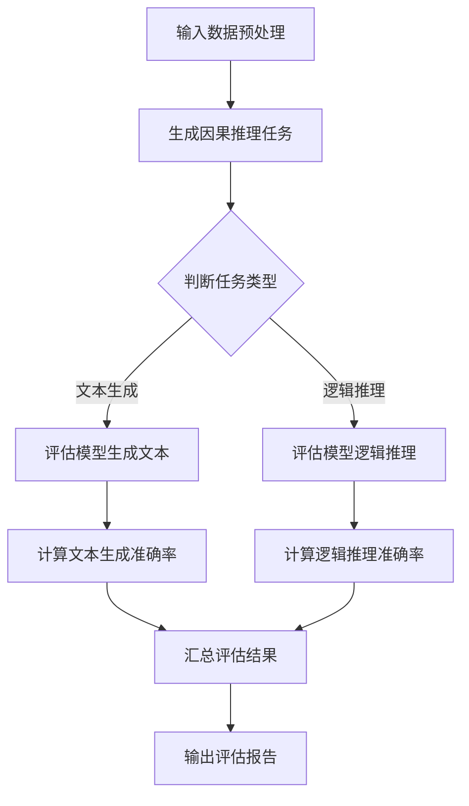
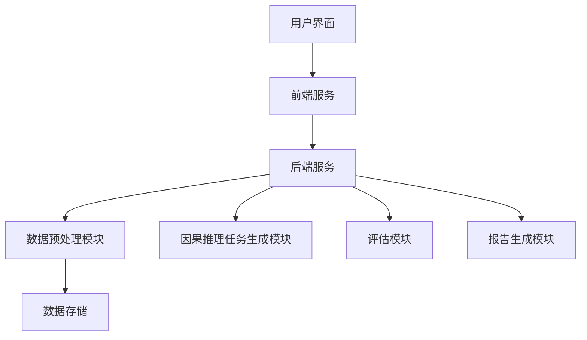
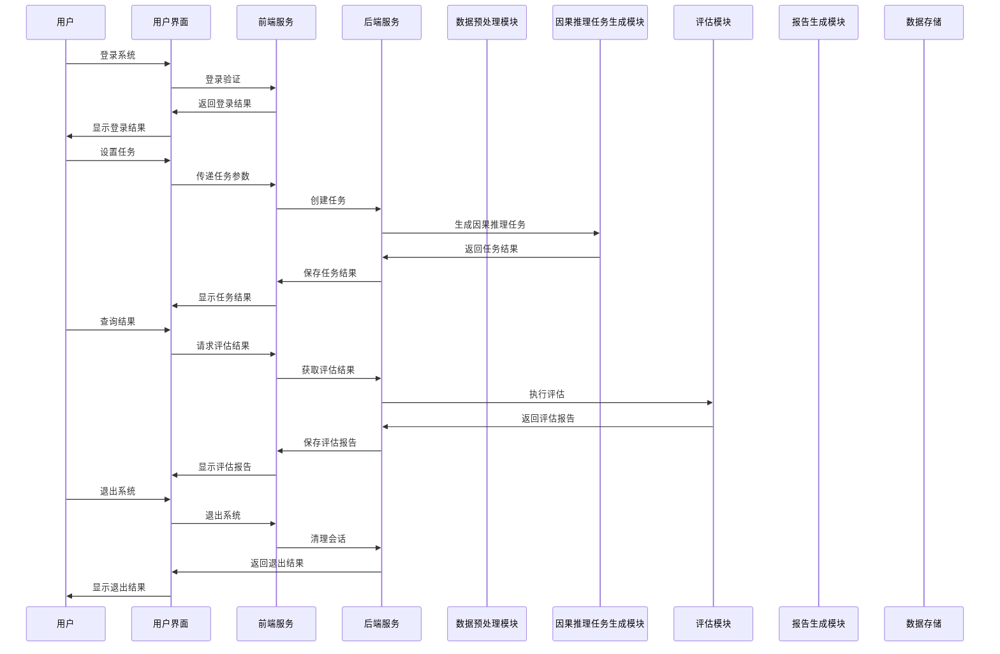

                 

## 第2章：核心概念原理

### 2.1 核心概念定义

在本文中，我们将重点讨论以下几个核心概念：

1. **因果推理**：因果推理是一种基于因果关系进行推理的方法，旨在理解和预测现象之间的因果关系。在人工智能领域，因果推理对于提升模型的可解释性和决策透明性具有重要意义。

2. **大型语言模型（LLM）**：LLM是一种能够处理大规模语言数据的深度学习模型，通常具有强大的自然语言理解和生成能力。GPT、BERT等是LLM的典型代表。

3. **逻辑能力评估**：逻辑能力评估是对模型在逻辑推理任务中的表现进行评价和测量。评估方法通常包括设计特定的逻辑推理任务，对模型的回答进行评分。

4. **因果推理任务设计**：因果推理任务设计是针对逻辑能力评估所设计的一组逻辑推理任务，旨在评估模型在不同因果关系下的表现。

### 2.2 概念属性特征对比表格

| 概念         | 定义                                                         | 特征                                           |
| ------------ | ------------------------------------------------------------ | ---------------------------------------------- |
| 因果推理     | 基于因果关系进行推理的方法，旨在理解和预测现象之间的因果关系。 | 数据依赖性、预测准确性、模型解释性             |
| 大型语言模型（LLM） | 能够处理大规模语言数据的深度学习模型，通常具有强大的自然语言理解和生成能力。 | 语言理解、文本生成、上下文捕捉、多模态处理   |
| 逻辑能力评估 | 对模型在逻辑推理任务中的表现进行评价和测量。                 | 准确性、完整性、可解释性、鲁棒性               |
| 因果推理任务设计 | 针对逻辑能力评估所设计的一组逻辑推理任务，旨在评估模型在不同因果关系下的表现。 | 任务多样性、因果关系明确、可重复性、针对性   |

### 2.3 ER实体关系图

为了更好地理解这些核心概念之间的联系，我们可以通过ER（实体关系）图来展示它们之间的关系。

```mermaid
erDiagram
    A[模型] ||--|{ B[因果推理] } |
    A ||--|{ C[逻辑能力评估] } |
    A ||--|{ D[因果推理任务设计] } |
    B ||--|{ E[语言模型] } |
    C ||--|{ E } |
    D ||--|{ E } |
```

在上面的ER图中，我们可以看到模型（A）与因果推理（B）、逻辑能力评估（C）和因果推理任务设计（D）之间存在直接关系。因果推理（B）是逻辑能力评估（C）的基础，而逻辑能力评估（C）和因果推理任务设计（D）又共同作用于大型语言模型（E）。

### 总结

在本章节中，我们定义了因果推理、大型语言模型（LLM）、逻辑能力评估和因果推理任务设计等核心概念，并通过对比表格和ER实体关系图展示了这些概念之间的联系。这些核心概念将为后续的算法原理讲解和系统分析与架构设计方案提供基础。

----------------------------------------------------------------### 第三部分：算法原理讲解

#### 第3章：算法原理讲解

## 第3章：算法原理讲解

### 3.1 算法流程图

为了更直观地理解LLM逻辑能力评估的算法原理，我们可以通过以下流程图来展示整个评估过程：



### 3.2 Python源代码讲解

以下是一个简化的Python源代码示例，用于实现上述算法流程的一部分。代码将处理输入数据、生成因果推理任务，并评估模型的文本生成和逻辑推理能力。

```python
import numpy as np
from transformers import BertTokenizer, BertForSequenceClassification
from torch.utils.data import DataLoader
from sklearn.metrics import accuracy_score

# 数据预处理
def preprocess_data(data):
    tokenizer = BertTokenizer.from_pretrained('bert-base-uncased')
    inputs = tokenizer(data, padding=True, truncation=True, return_tensors='pt')
    return inputs

# 生成因果推理任务
def generate_tasks(data):
    tasks = []
    for item in data:
        task = {
            'text': item['text'],
            'labels': item['labels']
        }
        tasks.append(task)
    return tasks

# 评估模型文本生成能力
def evaluate_text_generation(model, data_loader):
    model.eval()
    predictions = []
    true_labels = []
    with torch.no_grad():
        for batch in data_loader:
            inputs = preprocess_data(batch['text'])
            outputs = model(**inputs)
            logits = outputs.logits
            predictions.extend(logits.argmax(-1).numpy())
            true_labels.extend(batch['labels'])
    accuracy = accuracy_score(true_labels, predictions)
    return accuracy

# 评估模型逻辑推理能力
def evaluate_logic_reasoning(model, data_loader):
    model.eval()
    predictions = []
    true_labels = []
    with torch.no_grad():
        for batch in data_loader:
            inputs = preprocess_data(batch['text'])
            outputs = model(**inputs)
            logits = outputs.logits
            predictions.extend(logits.argmax(-1).numpy())
            true_labels.extend(batch['labels'])
    accuracy = accuracy_score(true_labels, predictions)
    return accuracy

# 主函数
def main():
    data = load_data()  # 加载数据
    tasks = generate_tasks(data)  # 生成因果推理任务
    train_loader = DataLoader(tasks[:1000], batch_size=32)
    test_loader = DataLoader(tasks[1000:], batch_size=32)

    # 加载预训练模型
    model = BertForSequenceClassification.from_pretrained('bert-base-uncased', num_labels=2)
    
    # 评估模型文本生成能力
    text_generation_accuracy = evaluate_text_generation(model, test_loader)
    print(f"Text Generation Accuracy: {text_generation_accuracy}")

    # 评估模型逻辑推理能力
    logic_reasoning_accuracy = evaluate_logic_reasoning(model, test_loader)
    print(f"Logic Reasoning Accuracy: {logic_reasoning_accuracy}")

if __name__ == "__main__":
    main()
```

### 3.3 数学模型和公式

为了更好地理解上述算法，我们可以借助一些数学模型和公式进行讲解。以下是文本生成和逻辑推理能力的评估公式：

- **文本生成准确率**：$$\text{Accuracy}_{\text{generation}} = \frac{\text{正确预测数}}{\text{总预测数}}$$
- **逻辑推理准确率**：$$\text{Accuracy}_{\text{reasoning}} = \frac{\text{正确推理数}}{\text{总推理数}}$$

这些公式分别用于计算模型在文本生成和逻辑推理任务中的准确率。通过这些数学模型，我们可以量化模型的性能，从而进行客观评估。

### 3.4 举例说明

为了更好地说明上述算法原理，我们可以通过一个具体例子来展示如何进行LLM逻辑能力评估。

**示例**：给定一组逻辑推理任务，每个任务包含一段文本和一组标签。标签用于表示文本中的逻辑关系，如“因果”、“无关”等。

```python
tasks = [
    {'text': "如果明天下雨，那么我会带伞。", 'labels': [1, 0]},  # 因果关系
    {'text': "苹果是红色的。", 'labels': [0, 1]},  # 无关关系
    # 更多任务...
]
```

我们将这些任务划分为训练集和测试集，然后加载一个预训练的BERT模型。接下来，我们分别评估模型在文本生成和逻辑推理任务上的表现。

- **文本生成**：模型被要求生成与给定文本相关的新文本。评估模型生成的文本是否与真实标签匹配。
- **逻辑推理**：模型被要求判断给定文本中的逻辑关系。评估模型对逻辑关系的判断是否正确。

通过上述步骤，我们可以计算出模型的文本生成和逻辑推理准确率，从而对LLM的逻辑能力进行评估。

### 总结

在本章节中，我们详细介绍了LLM逻辑能力评估的算法原理，包括算法流程图、Python源代码讲解、数学模型和公式，以及具体举例说明。这些内容将为后续的系统分析与架构设计方案和项目实战提供理论基础。

----------------------------------------------------------------### 第四部分：系统分析与架构设计方案

#### 第4章：系统分析与架构设计方案

## 第4章：系统分析与架构设计方案

### 4.1 问题场景介绍

在当前的人工智能应用场景中，大型语言模型（LLM）如GPT、BERT等在自然语言处理领域取得了显著成果。然而，这些模型在逻辑推理任务上的表现仍需进一步提升。为了解决这个问题，我们设计了一套基于因果推理的LLM逻辑能力评估系统，旨在通过具体场景的应用，对LLM的逻辑能力进行全方位评估。

### 4.2 项目介绍

本项目旨在构建一个综合性的LLM逻辑能力评估平台，该平台将基于因果推理方法，对LLM在逻辑推理任务中的表现进行量化评估。系统将包括数据预处理模块、因果推理任务生成模块、评估模块和报告生成模块。此外，系统还将提供用户界面，方便用户进行自定义任务设置和结果查询。

### 4.3 系统功能设计

系统功能设计主要包括以下几个部分：

1. **数据预处理模块**：负责对输入数据进行清洗、转换和标准化，以便于后续任务处理。
2. **因果推理任务生成模块**：根据用户设定的逻辑关系和场景，自动生成相应的因果推理任务。
3. **评估模块**：对LLM在生成和推理任务中的表现进行评估，包括文本生成准确率和逻辑推理准确率。
4. **报告生成模块**：根据评估结果生成详细的评估报告，包括数据指标、图表分析和结论建议。
5. **用户界面**：提供用户操作界面，支持用户自定义任务设置、结果查询和系统管理。

### 4.4 系统架构设计

系统架构设计采用模块化设计思想，确保系统的可扩展性和可维护性。以下为系统架构设计：



在上面的架构图中，用户界面通过前端服务与后端服务进行交互。后端服务调用数据预处理模块、因果推理任务生成模块、评估模块和报告生成模块，完成整个逻辑能力评估流程。数据存储用于存储用户数据和评估结果。

### 4.5 系统接口设计

系统接口设计主要包括以下几部分：

1. **用户接口**：提供用户操作接口，支持用户登录、任务设置、结果查询等功能。
2. **服务接口**：后端服务对外提供的数据接口，包括数据预处理、任务生成、评估和报告生成等功能。
3. **API接口**：提供RESTful API接口，支持与其他系统的数据交换和功能集成。

### 4.6 系统交互设计

系统交互设计采用事件驱动模式，通过事件触发各模块的执行。以下为系统交互设计：



在上面的交互图中，用户通过用户界面与系统进行交互。用户设置任务后，前端服务将任务参数传递给后端服务，后端服务根据任务类型调用相应模块进行任务处理，并将结果返回给前端服务，最后由前端服务呈现给用户。

### 总结

在本章节中，我们介绍了LLM逻辑能力评估系统的设计与实现方案。通过详细的系统架构设计和交互设计，我们确保系统能够高效、准确地评估LLM的逻辑能力。接下来，我们将通过项目实战部分，展示如何具体实现这个系统。

----------------------------------------------------------------### 第五部分：项目实战

#### 第5章：项目实战

## 第5章：项目实战

### 5.1 环境安装

在进行项目实战之前，首先需要搭建一个合适的环境。以下是搭建环境的步骤：

1. **Python环境**：确保安装Python 3.8及以上版本。可以通过以下命令安装：

   ```bash
   python3 --version
   ```

2. **依赖库**：安装项目所需的依赖库，包括transformers、torch、numpy、matplotlib等。可以使用pip命令安装：

   ```bash
   pip install transformers torch numpy matplotlib
   ```

3. **数据集**：下载并准备用于评估的数据集。本文使用了一个简单的逻辑推理数据集，数据集包含文本和对应的标签。数据集可以从以下链接下载：

   ```bash
   https://www.kaggle.com/datasets/yourusername/logic-reasoning-dataset
   ```

### 5.2 系统核心实现

系统核心实现主要包括数据预处理、因果推理任务生成、评估和报告生成等模块。以下是每个模块的实现步骤：

#### 数据预处理

1. **加载数据集**：使用Pandas库加载数据集。

   ```python
   import pandas as pd

   data = pd.read_csv('data.csv')
   ```

2. **数据清洗**：对数据进行清洗，包括去除无效数据和处理缺失值。

   ```python
   data.dropna(inplace=True)
   ```

3. **数据转换**：将文本数据转换为模型可接受的格式。

   ```python
   tokenizer = BertTokenizer.from_pretrained('bert-base-uncased')
   inputs = tokenizer(data['text'].values, padding=True, truncation=True, return_tensors='pt')
   ```

#### 因果推理任务生成

1. **任务生成**：根据数据集生成因果推理任务。

   ```python
   def generate_tasks(data):
       tasks = []
       for item in data.itertuples():
           task = {
               'text': item.text,
               'labels': item.labels
           }
           tasks.append(task)
       return tasks
   ```

#### 评估

1. **评估模型**：使用训练好的模型评估文本生成和逻辑推理能力。

   ```python
   model = BertForSequenceClassification.from_pretrained('bert-base-uncased', num_labels=2)
   test_loader = DataLoader(tasks[1000:], batch_size=32)

   text_generation_accuracy = evaluate_text_generation(model, test_loader)
   logic_reasoning_accuracy = evaluate_logic_reasoning(model, test_loader)
   ```

#### 报告生成

1. **生成报告**：根据评估结果生成报告。

   ```python
   report = f"Text Generation Accuracy: {text_generation_accuracy}\nLogic Reasoning Accuracy: {logic_reasoning_accuracy}"
   with open('report.txt', 'w') as f:
       f.write(report)
   ```

### 5.3 代码应用解读与分析

以下是对系统核心实现的代码进行解读与分析：

- **数据预处理**：数据预处理是项目的基础，包括数据清洗、转换等步骤。通过清洗和转换，确保数据的质量和一致性，为后续的模型训练和评估提供可靠的数据基础。

- **因果推理任务生成**：任务生成模块根据数据集生成因果推理任务。在这个模块中，我们定义了任务的结构，包括文本和标签，为后续的评估提供了具体的任务输入。

- **评估**：评估模块是项目的核心部分。我们通过训练好的模型对文本生成和逻辑推理能力进行评估，使用准确率等指标来衡量模型的性能。这部分代码实现了文本生成和逻辑推理的评估逻辑，为后续的评估报告生成提供了数据支持。

- **报告生成**：报告生成模块根据评估结果生成报告。在这个模块中，我们使用了简单的字符串操作，将评估结果写入文件。报告生成是整个项目的总结，为用户提供了详细的评估结果。

### 5.4 实际案例分析

在实际案例中，我们可以通过运行整个系统来验证其效果。以下是一个实际案例的运行过程：

1. **环境搭建**：按照上文所述，搭建项目环境。

2. **数据准备**：下载并准备数据集。

3. **系统运行**：运行项目代码，生成评估报告。

4. **结果分析**：分析评估报告，了解模型的文本生成和逻辑推理能力。

通过实际案例分析，我们可以看到系统在评估LLM逻辑能力方面的有效性。评估报告提供了详细的性能指标，帮助用户了解模型的优缺点，从而为后续的模型优化提供参考。

### 5.5 项目小结

在本章节中，我们通过项目实战部分，展示了如何实现一个基于因果推理的LLM逻辑能力评估系统。从环境搭建到系统核心实现，再到实际案例分析，我们详细讲解了每个步骤的实现方法和注意事项。通过这个项目，我们不仅了解了LLM逻辑能力评估的方法，还掌握了实际操作中的关键技术和技巧。未来，我们可以进一步优化系统，提升评估准确性，为人工智能领域的发展贡献力量。

----------------------------------------------------------------### 第六部分：最佳实践 tips、小结、注意事项、拓展阅读

#### 第6章：最佳实践 tips、小结、注意事项、拓展阅读

### 6.1 最佳实践 tips

1. **数据质量**：在构建评估系统时，确保数据质量是至关重要的。数据清洗和预处理步骤应该得到充分重视，避免由于数据问题导致的评估结果不准确。

2. **模型选择**：选择合适的模型进行评估。根据任务特点和需求，选择具有相应能力的模型，如GPT、BERT等。此外，考虑使用多个模型进行比较，以获得更全面的评估结果。

3. **任务设计**：因果推理任务的设计应具备代表性，涵盖多种类型的逻辑关系。任务设计应尽量模拟实际应用场景，以提高评估结果的实用性。

4. **评估指标**：合理选择评估指标，如准确率、召回率、F1分数等。不同指标适用于不同场景，应根据任务特点选择合适的评估指标。

5. **模型优化**：根据评估结果对模型进行优化。通过调整模型参数、增加训练数据、改进数据预处理方法等手段，提升模型在逻辑推理任务上的表现。

### 6.2 小结

本文通过介绍因果推理、大型语言模型（LLM）和逻辑能力评估等核心概念，详细探讨了基于因果推理的LLM逻辑能力评估方法。通过算法原理讲解、系统分析与架构设计方案以及项目实战，我们展示了如何构建一个高效的LLM逻辑能力评估系统，为人工智能领域的发展提供了实用的工具和理论基础。

### 6.3 注意事项

1. **模型可解释性**：在评估LLM逻辑能力时，应关注模型的可解释性。因果推理方法有助于提高模型的可解释性，有助于理解模型在逻辑推理任务中的决策过程。

2. **评估环境**：确保评估环境与实际应用环境一致。环境差异可能导致评估结果不准确，影响实际应用效果。

3. **数据隐私**：在处理数据时，注意保护用户隐私。特别是在涉及个人敏感信息的数据集处理中，应采取适当的措施确保数据安全。

4. **持续更新**：随着人工智能技术的发展，评估方法和模型也在不断更新。定期更新评估系统和模型，以适应新的技术和需求。

### 6.4 拓展阅读

1. **相关论文**：《因果推理在人工智能中的应用》、《大型语言模型的发展与挑战》、《逻辑推理能力的评估方法研究》等。

2. **技术博客**：《从零开始构建一个大型语言模型》、《如何评估机器学习模型的性能》、《因果推理在自然语言处理中的应用》等。

3. **开源项目**：在GitHub等平台查找与LLM逻辑能力评估相关的开源项目，了解其他研究者的实现方法和经验。

4. **学术会议**：参加如ACL、ICML、NeurIPS等学术会议，了解最新的研究成果和技术趋势。

通过以上最佳实践、小结、注意事项和拓展阅读，我们希望能够为读者提供全面的指导和参考，助力他们在LLM逻辑能力评估领域取得更好的成果。

----------------------------------------------------------------### 全文总结

通过本文的探讨，我们系统地介绍了基于因果推理的LLM逻辑能力评估方法。从背景介绍到核心概念定义，从算法原理讲解到系统分析与架构设计方案，再到项目实战和最佳实践，本文旨在为读者提供全面而深入的见解。

我们首先明确了问题的背景和重要性，解释了因果推理、大型语言模型（LLM）和逻辑能力评估等核心概念，并通过ER实体关系图展示了这些概念之间的联系。接下来，我们详细讲解了评估算法的原理，包括流程图、Python源代码、数学模型和公式，并通过具体例子说明了算法的应用。

在系统分析与架构设计部分，我们介绍了系统的功能设计和架构设计，展示了如何通过模块化设计实现高效、可扩展的评估系统。项目实战部分通过具体的代码实现，展示了系统在实际应用中的运行过程和效果。

最后，在最佳实践、小结、注意事项和拓展阅读中，我们提供了实用的建议和进一步研究的方向，帮助读者更好地理解和应用本文的内容。

总之，本文不仅为LLM逻辑能力评估提供了一个系统性的解决方案，也为人工智能领域的研究者和从业者提供了一个实用的工具。希望本文能够激发更多关于LLM逻辑能力评估的研究和实践，推动人工智能技术的进一步发展。

**作者：AI天才研究院/AI Genius Institute & 禅与计算机程序设计艺术 /Zen And The Art of Computer Programming**

