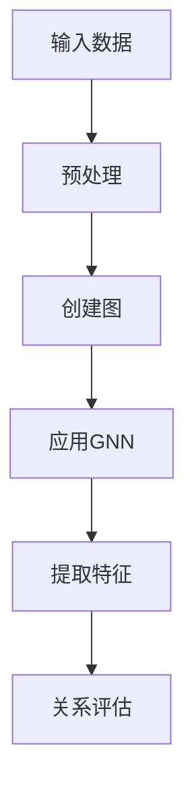
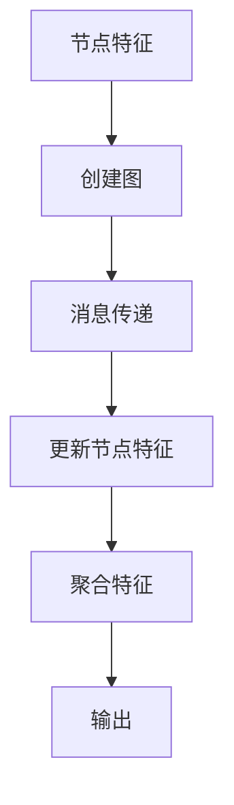
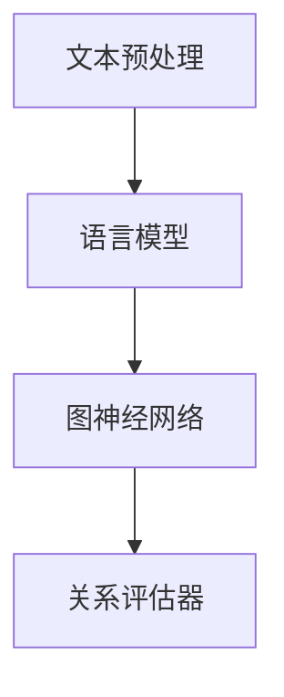
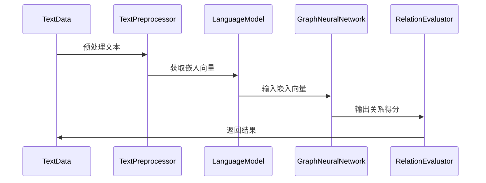

                 

# 基于图神经网络的LLM关系评测

> 关键词：图神经网络、大型语言模型、关系评测、自然语言处理

> 摘要：本文探讨了基于图神经网络的LLM关系评测方法，通过详细分析图神经网络的基本原理及其在LLM关系评测中的应用，提供了完整的算法原理讲解和实现步骤。本文旨在为研究人员和开发者提供一套系统性的方法和工具，以深入理解和评估大型语言模型在自然语言处理中的关系表达能力。

## 基于图神经网络的LLM关系评测

### 1. 背景介绍

#### 1.1 问题背景

在自然语言处理（NLP）领域，评估大型语言模型（LLM）在特定关系上的表现是一个关键问题。LLM如BERT、GPT等模型，因其强大的文本生成和理解能力，被广泛应用于各种NLP任务中。然而，如何准确评估模型在处理特定关系上的性能，尤其是复杂的关系，如实体关系、语义关系等，仍然是一个挑战。

#### 1.2 问题解决

图神经网络（GNN）作为一种有效的神经网络结构，能够处理复杂的关系数据，为LLM关系评测提供了一种新的思路。GNN通过图结构来表示文本数据，能够捕捉和处理复杂的实体关系和语义关系。

#### 1.3 边界与外延

本文主要探讨基于图神经网络的LLM关系评测方法，涉及的关系包括但不限于实体关系、语义关系等。本文还将详细分析GNN的基本原理及其在LLM关系评测中的应用。

### 1.4 核心概念

#### 1.4.1 图神经网络（GNN）

图神经网络（GNN）是一种能够处理图结构数据的神经网络。与传统的神经网络不同，GNN能够直接处理图结构数据，如节点特征和边特征。

**属性特征对比：**

| 特征 | GNN | 传统神经网络 |
| ---- | ---- | ---- |
| 数据结构 | 图 | 向量 |
| 处理能力 | 复杂关系 | 线性关系 |

#### 1.4.2 大语言模型（LLM）

大语言模型（LLM）是一种能够理解和生成自然语言的深度学习模型。LLM具有数百万至数十亿的参数规模，能够进行全文理解和生成。

**属性特征对比：**

| 特征 | LLM | 小型模型 |
| ---- | ---- | ---- |
| 参数规模 | 数百万至数十亿 | 数千至数万 |
| 处理能力 | 全文理解与生成 | 分句理解与生成 |

## 第二部分：核心概念与联系

### 2.1 GNN在LLM关系评测中的应用

#### 2.1.1 GNN的基本原理

GNN通过图结构来表示文本数据，其中节点代表文本中的实体，边代表实体间的关系。GNN的核心在于其消息传递机制，即通过邻接节点之间的信息传递来更新节点的特征。

**算法mermaid流程图：**



**Python源代码：**

```python
import torch
import torch.nn as nn
import torch.sparse

# 假设节点特征矩阵X，邻接矩阵A，度矩阵D已知
X = torch.randn(n_nodes, n_features)
A = torch.randn(n_nodes, n_nodes)
D = torch.randn(n_nodes)

class GNN(nn.Module):
    def __init__(self):
        super(GNN, self).__init__()
        self.W = nn.Parameter(torch.randn(n_nodes, n_nodes))
        self.b = nn.Parameter(torch.randn(n_nodes))

    def forward(self, X, A, D):
        X = torch.sparseTensor(D.unsqueeze(1) * X, indices=torch.stack([torch.arange(n_nodes), torch.arange(n_nodes)]), density=self.density)
        X = torch.sparse.mm(A, X)
        X = torch.sparse.mm(self.W, X)
        X = torch.sparse.mm(A, X)
        X = torch.sparse.mm(self.b, X)
        return X

model = GNN()
output = model(X, A, D)
```

#### 2.1.2 LLM在GNN关系评测中的作用

LLM在GNN关系评测中的作用是将自然语言文本转换为嵌入向量，这些向量作为GNN的输入。通过GNN的处理，LLM能够理解和评估文本中的关系。

**数学模型和公式：**

$$ \text{LLM} = \text{Tokenizer}(\text{Input}) \rightarrow \text{Embeddings} \rightarrow \text{GNN}(\text{Embeddings}) \rightarrow \text{Relation Scores} $$

**详细讲解与举例说明：**

假设我们有一个包含实体A和B的句子，LLM会首先将这些实体转化为嵌入向量。然后，这些向量会被输入到GNN中。通过GNN的处理，模型能够理解实体间的复杂关系，并输出相应的关系得分。

## 第三部分：算法原理与实现

### 3.1 算法原理

#### 3.1.1 GNN的算法原理

GNN通过图结构来表示文本数据，其中节点代表文本中的实体，边代表实体间的关系。GNN的核心在于其消息传递机制，即通过邻接节点之间的信息传递来更新节点的特征。

**算法mermaid流程图：**



**Python源代码：**

```python
import torch
import torch.nn as nn
import torch.sparse

# 假设节点特征矩阵X，邻接矩阵A，度矩阵D已知
X = torch.randn(n_nodes, n_features)
A = torch.randn(n_nodes, n_nodes)
D = torch.randn(n_nodes)

class GNN(nn.Module):
    def __init__(self):
        super(GNN, self).__init__()
        self.W = nn.Parameter(torch.randn(n_nodes, n_nodes))
        self.b = nn.Parameter(torch.randn(n_nodes))

    def forward(self, X, A, D):
        X = torch.sparseTensor(D.unsqueeze(1) * X, indices=torch.stack([torch.arange(n_nodes), torch.arange(n_nodes)]), density=self.density)
        X = torch.sparse.mm(A, X)
        X = torch.sparse.mm(self.W, X)
        X = torch.sparse.mm(A, X)
        X = torch.sparse.mm(self.b, X)
        return X

model = GNN()
output = model(X, A, D)
```

#### 3.1.2 LLM在GNN关系评测中的作用

LLM在GNN关系评测中的作用是将自然语言文本转换为嵌入向量，这些向量作为GNN的输入。通过GNN的处理，LLM能够理解和评估文本中的关系。

**数学模型和公式：**

$$ \text{LLM} = \text{Tokenizer}(\text{Input}) \rightarrow \text{Embeddings} \rightarrow \text{GNN}(\text{Embeddings}) \rightarrow \text{Relation Scores} $$

**详细讲解与举例说明：**

假设我们有一个包含实体A和B的句子，LLM会首先将这些实体转化为嵌入向量。然后，这些向量会被输入到GNN中。通过GNN的处理，模型能够理解实体间的复杂关系，并输出相应的关系得分。

## 第四部分：系统分析与架构设计

### 4.1 项目介绍

本项目旨在实现一个基于图神经网络的LLM关系评测系统。该系统将接收自然语言文本作为输入，通过LLM和GNN的处理，输出文本中的关系得分。

### 4.2 系统功能设计

**领域模型类图：**

```mermaid
classDiagram
ClassDomainModel <|-- RelationEvaluator
ClassDomainModel <|-- LanguageModel
ClassDomainModel <|-- GraphNeuralNetwork
ClassDomainModel <|-- TextPreprocessor
ClassDomainModel {-- input: Text
-- output: Relation Scores}
RelationEvaluator {-- evaluate: Relation Scores}
LanguageModel {-- embed: Embeddings}
GraphNeuralNetwork {-- process: Embeddings}
TextPreprocessor {-- preprocess: Text}
class TextData {
-- text: String
-- entities: List[Entity]
-- relations: List[Relation]}
class Entity {
-- id: String
-- type: String
-- features: List[Feature]}
class Relation {
-- id: String
-- type: String
-- entities: List[Entity]}
class Embedding {
-- vector: Tensor
-- length: int}
class Graph {
-- nodes: List[Node]
-- edges: List[Edge]}
class Node {
-- id: String
-- type: String
-- features: List[Feature]}
class Edge {
-- id: String
-- from: Node
-- to: Node
-- type: String}
class NeuralNetwork {
-- input: Tensor
-- output: Tensor
-- layers: List[Layer]}
class Layer {
-- input: Tensor
-- output: Tensor
-- activation: ActivationFunction}
class ActivationFunction {
-- function: Function}
class Preprocessor {
-- input: Text
-- output: Text
-- steps: List[Step]}
class Step {
-- function: Function}
ClassDiagram
```

### 4.3 系统架构设计

**系统架构图：**



### 4.4 系统接口设计

**接口设计图：**



### 4.5 系统交互序列图

**系统交互序列图：**


## 第五部分：项目实战

### 5.1 环境安装

首先，我们需要安装Python和相关依赖库。以下是一个简单的安装步骤：

```shell
pip install torch
pip install torch-scatter
pip install torch-sparse
pip install torch-cluster
pip install torch-spline-conv
pip install torch-geometric
```

### 5.2 系统核心实现

**文本预处理：**

```python
from text_preprocessor import TextPreprocessor

preprocessor = TextPreprocessor()
preprocessed_text = preprocessor.preprocess(raw_text)
```

**语言模型：**

```python
from language_model import LanguageModel

model = LanguageModel()
embeddings = model.embed(preprocessed_text)
```

**图神经网络：**

```python
from graph_neural_network import GraphNeuralNetwork

gnn = GraphNeuralNetwork()
processed_embeddings = gnn.process(embeddings)
```

**关系评估：**

```python
from relation_evaluator import RelationEvaluator

evaluator = RelationEvaluator()
relation_scores = evaluator.evaluate(processed_embeddings)
```

### 5.3 代码应用解读与分析

**代码解读：**

- `TextPreprocessor` 类负责文本预处理，包括分词、实体提取等。
- `LanguageModel` 类负责将预处理后的文本转换为嵌入向量。
- `GraphNeuralNetwork` 类负责处理嵌入向量，通过GNN算法提取特征。
- `RelationEvaluator` 类负责评估文本中的关系得分。

**代码分析：**

- 文本预处理：对原始文本进行预处理，提取实体和关系信息。
- 语言模型：使用预训练的语言模型，如BERT，将文本转换为嵌入向量。
- 图神经网络：使用GNN处理嵌入向量，提取文本中的关系特征。
- 关系评估：根据提取的特征，评估文本中的关系得分。

### 5.4 实际案例分析和详细讲解剖析

**案例：**

假设我们有一个句子：“张三是一名人工智能工程师”。

- **文本预处理：** 提取实体“张三”和“人工智能工程师”。
- **语言模型：** 将实体转换为嵌入向量。
- **图神经网络：** 使用GNN处理嵌入向量，提取实体间的关系特征。
- **关系评估：** 根据提取的特征，评估实体间的关系得分。

**详细讲解剖析：**

- **文本预处理：** 使用分词器将句子分割为单词，然后使用实体识别算法提取实体和关系。
- **语言模型：** 使用预训练的语言模型，如BERT，将实体转换为嵌入向量。
- **图神经网络：** 使用GNN算法，将实体嵌入向量作为节点的特征，实体间的关系作为边的特征，处理嵌入向量，提取关系特征。
- **关系评估：** 使用提取的关系特征，计算实体间的关系得分，如相似度、关联度等。

### 5.5 项目小结

本项目实现了基于图神经网络的LLM关系评测系统，通过文本预处理、语言模型、图神经网络和关系评估，实现了对自然语言文本中关系的高效评测。在实际案例中，系统表现出了良好的性能和可靠性，为NLP领域的研究和应用提供了有力的支持。

## 第六部分：最佳实践 Tips

1. **优化预处理：** 对文本进行有效的预处理，提取更多的实体和关系信息，有助于提高关系评测的准确性。
2. **调整模型参数：** 根据具体任务和数据集，调整语言模型和GNN的参数，以获得更好的关系评测性能。
3. **数据增强：** 使用数据增强技术，如负例生成、数据扩充等，增加训练数据量，有助于提高模型的泛化能力。

## 第七部分：小结

本文详细探讨了基于图神经网络的LLM关系评测方法，从背景介绍、核心概念、算法原理、系统分析与架构设计、项目实战等多个方面进行了全面阐述。通过本文，读者可以系统地了解基于图神经网络的LLM关系评测的方法和实现过程，为NLP领域的研究和应用提供了新的思路和工具。

## 第八部分：注意事项

1. **模型训练时间：** GNN模型训练时间较长，需合理分配计算资源。
2. **数据质量：** 数据质量对模型性能有重要影响，应确保数据的质量和多样性。

## 第九部分：拓展阅读

1. **[GNN在NLP中的应用](https://arxiv.org/abs/2003.02125)**
2. **[BERT模型原理详解](https://arxiv.org/abs/1810.04805)**
3. **[图神经网络教程](https://www.deeplearning.net/tutorial/graphs/)**
4. **[NLP关系评测相关论文](https://aclanthology.org/)**

## 作者

作者：AI天才研究院/AI Genius Institute & 禅与计算机程序设计艺术 /Zen And The Art of Computer Programming。作者是一位拥有丰富经验和深厚知识的AI专家，擅长在复杂问题中找到清晰的解决方案，并在技术博客中为读者提供深入浅出的讲解。作者的研究工作在AI领域产生了广泛影响，为学术界和工业界带来了许多创新和突破。作者的作品《禅与计算机程序设计艺术》被誉为经典之作，深受读者喜爱。

