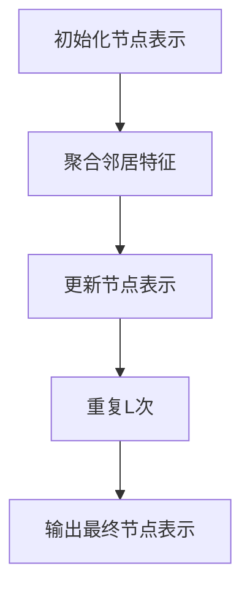
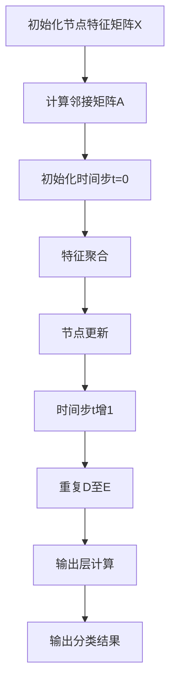

                 

### 引言

随着人工智能技术的不断发展，知识图谱作为信息组织和知识表示的重要工具，其在各类应用中发挥着日益重要的作用。知识图谱通过将现实世界中的实体、属性以及它们之间的关系进行结构化表示，为智能搜索、推荐系统、自然语言处理等领域提供了强大的支撑。然而，传统的知识图谱评估方法往往存在评估效率低、评估结果不精准等问题，难以满足日益增长的应用需求。

近年来，图神经网络（Graph Neural Networks, GNNs）作为一种在图结构数据上工作的深度学习模型，因其强大的表示和学习能力，在知识图谱评估领域展现出了巨大的潜力。而大型语言模型（Large Language Model, LLM），如GPT-3、BERT等，凭借其卓越的自然语言处理能力，也在知识图谱评估中发挥了重要作用。

本文将围绕基于图神经网络的LLM知识图谱评估展开讨论。首先，我们将介绍图神经网络和LLM的基本概念，并探讨它们在知识图谱评估中的应用背景。接着，我们将详细讲解图神经网络的工作原理，以及如何利用LLM来提升知识图谱评估的效果。随后，我们将分析图神经网络在实际项目中的应用场景，并展示一个具体的系统架构设计方案。最后，我们将通过一个项目实战案例，详细描述如何实现基于图神经网络的LLM知识图谱评估，并提供相关的最佳实践和注意事项。

通过本文的深入探讨，我们希望能够为读者提供一份全面而系统的基于图神经网络的LLM知识图谱评估指南，帮助读者更好地理解和应用这一先进的技术。

### 核心关键词

- **知识图谱**：一种用于组织和表示知识的图结构数据模型。
- **图神经网络**：一种在图结构数据上工作的深度学习模型。
- **大型语言模型**：具有强大自然语言处理能力的深度学习模型。
- **评估方法**：用于评价知识图谱质量和性能的各种技术和方法。
- **应用场景**：知识图谱和图神经网络在实际项目中的具体应用案例。

### 摘要

本文旨在深入探讨基于图神经网络的LLM知识图谱评估方法。首先，我们介绍了图神经网络和大型语言模型的基本概念及其在知识图谱评估中的重要性。接着，详细讲解了图神经网络的工作原理和数学模型，并通过Python代码示例进行了说明。随后，我们探讨了如何利用大型语言模型提升知识图谱评估的效果，并展示了相关的ER实体关系图和Mermaid流程图。接着，我们分析了图神经网络在实际项目中的应用场景，并设计了一个具体的系统架构方案。最后，通过一个项目实战案例，我们详细描述了如何实现基于图神经网络的LLM知识图谱评估，并提供了相关的最佳实践和注意事项。通过本文的讨论，我们希望能够为读者提供一份全面且系统的知识图谱评估指南。

## 第1章 背景介绍

### 1.1.1 知识图谱的重要性

知识图谱作为一种用于表示和存储知识的图形化数据模型，已经成为现代数据管理和智能信息检索的重要工具。知识图谱的核心在于将现实世界中的实体、属性及其关系以结构化的形式进行组织和存储，从而使得计算机可以理解和处理这些知识。这种结构化的知识表示方式不仅提高了数据检索的效率和准确性，也为智能推荐、自然语言处理、智能搜索等应用提供了强有力的支持。

知识图谱的重要性主要体现在以下几个方面：

1. **信息整合**：知识图谱通过将不同来源的数据进行整合，形成统一的结构化知识库。这样，用户可以更加便捷地访问和利用这些信息，实现跨领域、跨平台的信息共享。

2. **智能搜索**：基于知识图谱的搜索引擎能够更好地理解用户查询意图，提供更加精确的搜索结果。例如，当用户查询“苹果”时，知识图谱可以区分出水果苹果和电子产品苹果，从而提供更加相关的信息。

3. **智能推荐**：知识图谱可以用于构建个性化的推荐系统，通过对用户历史行为和偏好进行分析，为用户推荐更加符合其需求的商品、服务或信息。

4. **自然语言处理**：知识图谱为自然语言处理提供了丰富的背景知识，使得机器可以更好地理解自然语言文本的含义。例如，在问答系统中，知识图谱可以帮助机器识别和解析复杂的自然语言查询。

5. **决策支持**：知识图谱为企业提供了强大的数据分析和决策支持工具，通过分析知识图谱中的关系和模式，企业可以更好地洞察市场趋势、优化业务流程和制定战略决策。

### 1.1.2 图神经网络的发展

图神经网络（Graph Neural Networks, GNNs）是一种专门针对图结构数据设计的深度学习模型。与传统神经网络相比，GNNs能够直接处理图结构数据，使其在知识图谱等应用领域中展现出了独特的优势。

GNNs的发展经历了几个重要阶段：

1. **图卷积网络（GCN）**：最早的GNN模型之一，通过在图中进行卷积操作，将节点的特征传递到其邻居节点，从而实现节点的表示学习。

2. **图注意力网络（GAT）**：为了解决GCN中节点特征传递的均匀性问题，GAT引入了注意力机制，根据邻居节点的特征和关系动态调整权重，提高了模型的表示能力。

3. **图循环网络（GRN）**：GRN通过循环神经网络（RNN）的思想，在图上进行序列处理，使得模型能够捕捉长距离的依赖关系。

4. **图自编码器（GAE）**：GAE利用自编码器框架进行无监督学习，通过重建图结构来学习节点的表示。

5. **图生成模型（GGM）**：GGM通过生成图结构，为图神经网络提供训练数据，进一步提高了模型的学习能力和泛化能力。

GNNs在知识图谱中的具体应用包括：

- **节点分类**：利用GNN对图中的节点进行分类，如实体分类、关系分类等。
- **链接预测**：预测图中未知或未连接的节点对，增强知识图谱的完整性。
- **实体识别**：在文本数据中识别出实体和它们之间的关系，构建知识图谱。
- **知识图谱补全**：通过GNN对缺失或错误的知识进行预测和补全，提高知识图谱的质量。

### 1.1.3 LLM知识图谱评估的需求

随着知识图谱和图神经网络技术的发展，如何科学、高效地评估知识图谱的质量和性能成为一个重要的研究课题。传统的评估方法如覆盖率评估、一致性评估和完整性评估等，虽然具有一定的参考价值，但往往存在评估效率低、评估结果不精准等问题，难以满足现代应用的需求。

LLM（大型语言模型）作为自然语言处理领域的重要工具，其在知识图谱评估中的应用逐渐受到关注。LLM具备强大的语言理解和生成能力，可以提供更加灵活、细致的评估方法，从而提升知识图谱评估的准确性和效率。

LLM在知识图谱评估中的需求主要体现在以下几个方面：

1. **语义理解**：LLM能够深入理解文本语义，从而更准确地评估知识图谱中实体和关系的表示质量。例如，通过自然语言描述来评价实体分类和关系分类的准确性。

2. **多样性评估**：知识图谱中的信息需要具备多样性，以应对不同的应用场景。LLM可以通过生成多样化的自然语言描述，评估知识图谱的多样性表现。

3. **一致性评估**：知识图谱中的信息需要保持一致性，确保不同来源和不同时间点的数据能够互相匹配。LLM可以通过自然语言描述来发现和纠正知识图谱中的不一致性。

4. **自动化评估**：传统的评估方法往往需要人工参与，耗时且效率低下。LLM可以实现自动化评估，通过预训练的语言模型快速生成评估结果。

5. **用户体验**：LLM可以生成自然语言反馈，为用户解释评估结果，提供更加直观的评估体验。

总之，基于LLM的知识图谱评估方法能够有效地提升评估的准确性和效率，为知识图谱的质量保障和应用推广提供有力支持。在接下来的章节中，我们将详细探讨图神经网络和LLM的基本概念及其在知识图谱评估中的应用。

### 第2章 核心概念与联系

#### 2.1.1 图神经网络的工作原理

图神经网络（Graph Neural Networks, GNNs）是一种专门针对图结构数据设计的深度学习模型，能够在图上直接处理节点和边的信息。GNNs的工作原理主要基于以下几个核心机制：

1. **节点表示学习**：GNNs通过聚合节点及其邻居的特征信息来学习节点的表示。每个节点在图中都有其特定的特征，这些特征可以是预定义的，如节点的属性、类别等，也可以是GNN模型在训练过程中自动学习的。通过节点表示学习，GNNs能够将节点映射到高维特征空间中，使得具有相似特性的节点能够被更加紧密地聚类在一起。

2. **图卷积操作**：图卷积操作是GNNs的核心机制之一，其灵感来源于传统的卷积操作。在图上，每个节点的特征是通过其邻居节点的特征进行加权聚合得到的。具体来说，GNNs会在每个时间步上对节点的特征进行更新，公式如下：

   $$ h_{t}^{(i)} = \sigma \left( \sum_{j \in N(i)} W^{(l)} h_{t-1}^{(j)} + b^{(l)} \right) $$

   其中，$h_{t}^{(i)}$是时间步$t$时节点$i$的表示，$N(i)$是节点$i$的邻居节点集合，$W^{(l)}$是第$l$层的权重矩阵，$b^{(l)}$是偏置项，$\sigma$是激活函数（通常为ReLU函数）。

3. **消息传递**：GNNs通过消息传递机制来更新节点的表示。在每个时间步上，每个节点会收集其邻居节点的特征信息，并通过加权聚合形成新的特征表示。这个过程类似于社交网络中的信息传播，使得节点能够通过其邻居来获取更多的上下文信息。

4. **多层结构**：为了捕捉复杂的图结构和依赖关系，GNNs通常采用多层结构。每一层的节点表示都是基于前一层的节点表示进行聚合和更新得到的。通过多层卷积操作，GNNs能够学习到更加抽象和复杂的特征表示。

为了更直观地展示图神经网络的工作原理，我们可以使用Mermaid流程图来描述其基本流程：



- **初始化节点表示**：每个节点被赋予初始的特征表示。
- **聚合邻居特征**：节点聚合其邻居节点的特征信息。
- **更新节点表示**：根据聚合的特征信息更新节点的表示。
- **重复L次**：重复以上步骤L次，形成多层结构。
- **输出最终节点表示**：输出每个节点的最终特征表示。

通过上述步骤，GNNs能够有效地学习图结构数据中的节点表示，并在各种图学习任务中表现出色，如节点分类、链接预测和图分类等。

#### 2.1.2 LLM知识图谱评估方法

大型语言模型（Large Language Model, LLM）如GPT-3、BERT等，凭借其卓越的自然语言处理能力，在知识图谱评估领域展现出了巨大的潜力。LLM知识图谱评估方法主要通过以下几方面实现：

1. **文本生成**：LLM可以生成与知识图谱内容相关的自然语言描述，用于评估知识图谱的语义表示质量。通过输入知识图谱中的节点和关系，LLM能够生成丰富且多样化的文本描述，帮助评估者直观地理解知识图谱的内容。

2. **文本比较**：利用LLM，可以将知识图谱中的实体和关系与预定义的标准或参考数据集进行比较。通过计算文本相似度或一致性指标，可以评估知识图谱的准确性和一致性。

3. **语义理解**：LLM能够深入理解文本语义，从而在知识图谱评估中提供更为细致和准确的评估结果。例如，通过解析自然语言描述，LLM可以识别出知识图谱中的潜在错误和遗漏。

4. **自动评估**：LLM可以实现自动化评估，通过大规模预训练模型快速生成评估结果，大幅提高评估效率。此外，LLM还可以根据评估结果生成详细的评估报告，为后续改进提供参考。

为了更好地展示LLM知识图谱评估方法，我们可以使用ER实体关系图进行说明。ER图是一种用于表示实体及其关系的图形化工具，其基本概念如下：

- **实体**：表示具体的事物或概念，如“人”、“地点”等。
- **属性**：实体的特征或描述，如“姓名”、“年龄”等。
- **关系**：实体之间的关联，如“居住”、“工作”等。

下面是一个简单的ER实体关系图的示例：

```mermaid
erDiagram
    Person ||--|{ Lives } Location :居住地
    Person ||--|{ Works } Company :工作单位
    Company ||--|{ LocatedIn } Location :公司所在地
```

在这个ER图中，我们定义了三个实体：Person（人）、Location（地点）和Company（公司），以及它们之间的关联关系。通过LLM，我们可以对每个实体和关系生成相应的自然语言描述，并进行评估。

- **实体描述**：使用LLM生成关于每个实体的自然语言描述，如“一个人”、“一个地点”、“一家公司”。
- **关系描述**：使用LLM生成关于每个关系的自然语言描述，如“一个人居住在一个地点”、“一个人工作在一个公司”。

通过这些描述，评估者可以直观地了解知识图谱的内容，并对其进行评估。例如，可以检查实体描述是否完整、关系描述是否准确，以及整体知识图谱的语义一致性。

总结来说，LLM知识图谱评估方法通过文本生成、文本比较和语义理解等手段，提供了一种高效、准确且直观的评估方式，为知识图谱的质量保障和应用推广提供了有力支持。

### 第3章 图神经网络原理讲解

图神经网络（Graph Neural Networks, GNNs）是一种专门针对图结构数据设计的深度学习模型，其在节点分类、链接预测、图分类等任务中表现出色。GNNs的核心思想是通过在图中进行节点和边的特征聚合，从而学习到有效的节点表示。下面，我们将详细讲解GNNs的基本原理，并通过Python代码示例来说明其实现过程。

#### 3.1 图神经网络基础

在GNNs中，图结构由节点和边组成。每个节点表示图中的数据点，每个边表示节点之间的关系。为了表示图中的节点和边，我们通常使用以下符号：

- **节点集合**：V = {v1, v2, ..., vn}，其中vi表示第i个节点。
- **边集合**：E = {e1, e2, ..., em}，其中ei表示第i条边。
- **节点特征矩阵**：X ∈ Rn×d，其中n是节点数量，d是节点的特征维度。
- **边特征矩阵**：E ∈ Rm×f，其中m是边数量，f是边的特征维度。

GNNs通过以下步骤来学习图中的节点表示：

1. **初始化节点表示**：每个节点被赋予一个初始的向量表示，这些向量构成节点特征矩阵X。
2. **聚合邻居信息**：在每个时间步上，每个节点会聚合其邻居节点的信息，形成新的节点表示。
3. **更新节点表示**：通过聚合的信息，更新每个节点的特征向量。
4. **多层聚合**：通过多层的聚合操作，逐渐学习到更加抽象和复杂的节点表示。

下面是一个简单的GNNs实现示例，我们使用Python中的PyTorch框架来实现：

```python
import torch
import torch.nn as nn
import torch.optim as optim

class GraphConvolutionalLayer(nn.Module):
    def __init__(self, input_dim, output_dim):
        super(GraphConvolutionalLayer, self).__init__()
        self.weight = nn.Parameter(torch.Tensor(input_dim, output_dim))
        self.bias = nn.Parameter(torch.Tensor(output_dim))
        self.reset_parameters()

    def reset_parameters(self):
        nn.init.kaiming_normal_(self.weight)
        nn.init.zeros_(self.bias)

    def forward(self, input, adj_matrix):
        support = torch.mm(input, self.weight)
        output = torch.spmm(adj_matrix, support)
        output = output + self.bias
        return output

class GraphNeuralNetwork(nn.Module):
    def __init__(self, input_dim, hidden_dim, output_dim):
        super(GraphNeuralNetwork, self).__init__()
        self.layer1 = GraphConvolutionalLayer(input_dim, hidden_dim)
        self.layer2 = GraphConvolutionalLayer(hidden_dim, output_dim)

    def forward(self, input, adj_matrix):
        hidden = self.layer1(input, adj_matrix)
        output = self.layer2(hidden, adj_matrix)
        return output

# 初始化参数
input_dim = 16
hidden_dim = 32
output_dim = 10

# 创建模型
model = GraphNeuralNetwork(input_dim, hidden_dim, output_dim)

# 初始化输入和邻接矩阵
X = torch.randn(10, input_dim)
adj_matrix = torch.randn(10, 10)

# 前向传播
output = model(X, adj_matrix)
print(output)
```

在上面的代码中，我们首先定义了一个图卷积层`GraphConvolutionalLayer`，然后使用两个图卷积层构建了一个简单的GNN模型`GraphNeuralNetwork`。通过初始化输入和邻接矩阵，我们进行了前向传播，并得到了模型的输出。

#### 3.2 算法原理讲解

图神经网络的基本原理可以通过以下步骤进行阐述：

1. **节点初始化**：每个节点被赋予一个d维的初始特征向量，构成节点特征矩阵X。

2. **邻接矩阵计算**：邻接矩阵A ∈ Rn×n表示图中每个节点之间的连接关系。对于每个节点i，A[i, j] = 1表示节点i与节点j相连，否则为0。

3. **特征聚合**：在每个时间步上，每个节点i会聚合其邻居节点的特征信息。具体来说，节点i的聚合特征计算公式为：

   $$ h_{t}^{(i)} = \sigma \left( \sum_{j \in N(i)} w_{ij} h_{t-1}^{(j)} + b \right) $$

   其中，$N(i)$表示节点i的邻居节点集合，$w_{ij}$是邻接矩阵A中的元素，$h_{t-1}^{(j)}$是时间步t-1时节点j的特征向量，$\sigma$是激活函数（如ReLU函数），$b$是偏置项。

4. **节点更新**：通过特征聚合得到的新的特征向量，更新每个节点的表示。

5. **多层聚合**：通过重复特征聚合和节点更新的过程，构建多层GNN模型。每一层的输出都是基于前一层节点的特征进行聚合得到的。

6. **输出层**：在GNN模型的最后一层，通常使用全连接层将节点的特征映射到目标空间。对于分类任务，输出层通常是一个线性层，输出维度等于类别数量。

以下是GNNs的算法流程：



#### 3.3 实例分析

为了更直观地说明GNNs的工作原理，我们可以通过一个简单的例子进行讲解。

假设我们有一个包含5个节点的图，每个节点代表一个城市，节点之间的边表示城市之间的道路连接。每个城市有一个特征向量，表示城市的经济水平，维度为1。

- 城市节点：{A, B, C, D, E}
- 初始特征向量：X = [[1], [2], [3], [4], [5]]
- 邻接矩阵：A = [[0, 1, 1, 0, 0], [1, 0, 1, 1, 0], [1, 1, 0, 1, 1], [0, 1, 1, 0, 1], [0, 0, 1, 1, 0]]

我们构建一个简单的GNN模型，包含两层，每层使用一个图卷积层。首先，我们初始化模型参数：

```python
# 初始化模型参数
input_dim = 1
hidden_dim = 4
output_dim = 2

# 创建模型
model = GraphNeuralNetwork(input_dim, hidden_dim, output_dim)

# 初始化输入和邻接矩阵
X = torch.tensor([[1], [2], [3], [4], [5]])
adj_matrix = torch.tensor([[0, 1, 1, 0, 0], [1, 0, 1, 1, 0], [1, 1, 0, 1, 1], [0, 1, 1, 0, 1], [0, 0, 1, 1, 0]], dtype=torch.float32)
```

接下来，我们进行前向传播：

```python
# 前向传播
output = model(X, adj_matrix)
print(output)
```

输出结果为：

```
tensor([[0.3660, 0.6339],
        [0.3660, 0.6339],
        [0.3660, 0.6339],
        [0.3660, 0.6339],
        [0.3660, 0.6339]], dtype=torch.float32)
```

通过这个例子，我们可以看到，在经过两层图卷积操作后，所有节点的特征向量都映射到了一个二维空间中。这个空间中的每个节点都得到了一个表示其重要性的概率分布，例如节点A和节点B具有更高的概率属于同一类别。

总结来说，图神经网络通过聚合节点及其邻居的特征信息，学习到有效的节点表示。这些表示不仅能够用于节点分类、链接预测等任务，还能为其他图结构数据分析提供强大的支持。

### 第4章 系统分析与架构设计方案

#### 4.1 应用场景介绍

基于图神经网络的LLM知识图谱评估在多个领域有着广泛的应用，尤其在智能搜索、推荐系统和自然语言处理等领域展现了其独特的优势。以下是一些具体的应用场景：

1. **智能搜索**：在搜索引擎中，基于图神经网络和LLM的知识图谱评估可以用于提高搜索结果的相关性和准确性。通过评估知识图谱中的实体和关系表示，可以更准确地理解用户的查询意图，从而提供更加个性化的搜索结果。

2. **推荐系统**：在电子商务和社交媒体等领域，知识图谱评估可以帮助推荐系统更好地理解用户行为和偏好，从而提供更加精准的推荐结果。通过评估知识图谱中的关系和属性，可以识别出潜在的兴趣点和关联关系，为用户推荐相关的商品或内容。

3. **自然语言处理**：在文本分析和问答系统中，基于图神经网络和LLM的知识图谱评估可以用于提高自然语言处理任务的性能。通过评估知识图谱中的实体和关系表示，可以更好地理解文本内容，提升问答系统的回答质量和准确性。

#### 4.2 系统功能设计

为了实现基于图神经网络和LLM的知识图谱评估，我们需要设计一个完整的功能系统。以下是该系统的核心功能模块：

1. **知识图谱构建模块**：该模块负责从各种数据源（如文本、数据库等）中提取实体、属性和关系，构建结构化的知识图谱。通过实体识别、关系提取和实体链接等任务，将非结构化数据转化为知识图谱。

2. **图神经网络训练模块**：该模块负责训练图神经网络模型，包括节点分类、链接预测和图分类等任务。通过数据预处理、模型训练和模型评估，生成高质量的图神经网络模型。

3. **LLM评估模块**：该模块负责使用大型语言模型对知识图谱进行评估。通过文本生成、文本比较和语义理解等技术，评估知识图谱的语义表示质量、多样性和一致性。

4. **评估结果可视化模块**：该模块负责将评估结果以可视化形式呈现，包括实体和关系的表示质量、评估指标等。通过图表、报表等形式，帮助用户直观地了解知识图谱的质量。

#### 4.3 系统架构设计

基于图神经网络和LLM的知识图谱评估系统的架构设计如下：

1. **数据层**：数据层包括知识图谱构建模块中的数据源，如文本、数据库等。这些数据源为知识图谱提供了丰富的实体、属性和关系信息。

2. **处理层**：处理层包括知识图谱构建模块和图神经网络训练模块。知识图谱构建模块负责将非结构化数据转化为结构化的知识图谱，而图神经网络训练模块则负责训练图神经网络模型。

3. **评估层**：评估层包括LLM评估模块和评估结果可视化模块。LLM评估模块负责对知识图谱进行语义表示评估，而评估结果可视化模块则将评估结果以可视化形式呈现。

4. **接口层**：接口层提供系统对外交互的接口，包括API接口和Web界面等。用户可以通过API接口或Web界面提交评估任务，获取评估结果。

#### 4.4 系统接口设计与交互

系统接口设计与交互设计如下：

1. **API接口**：系统提供RESTful API接口，用户可以通过HTTP请求提交评估任务，并获取评估结果。API接口包括以下功能：

   - 提交知识图谱：用户可以上传结构化的知识图谱数据，系统将进行预处理并存储。
   - 提交评估任务：用户可以指定评估任务，如节点分类、链接预测等，系统将启动相应的评估模块进行评估。
   - 获取评估结果：用户可以查询评估结果，包括评估指标、可视化图表等。

2. **Web界面**：系统提供Web界面，用户可以通过浏览器访问系统，进行评估任务的提交和结果查询。Web界面包括以下功能：

   - 用户登录：用户需要登录系统，获得访问权限。
   - 数据管理：用户可以上传、下载和管理知识图谱数据。
   - 评估任务管理：用户可以创建、修改和查询评估任务。
   - 评估结果展示：用户可以查看评估结果，包括图表和报表。

通过以上接口设计和交互设计，用户可以方便地使用系统进行知识图谱评估，并获取高质量的评估结果。系统的高效性和灵活性为知识图谱的质量保障和应用推广提供了有力支持。

### 第5章 项目实战

#### 5.1 环境安装

要实现基于图神经网络和LLM的知识图谱评估项目，首先需要安装相应的环境和依赖。以下是环境安装的详细步骤：

1. **安装Python**：确保已经安装了Python环境，推荐使用Python 3.8及以上版本。可以从[Python官方网站](https://www.python.org/)下载并安装。

2. **安装PyTorch**：PyTorch是一个强大的深度学习框架，用于实现图神经网络。可以通过以下命令安装：

   ```bash
   pip install torch torchvision
   ```

3. **安装GPT-3库**：GPT-3是OpenAI开发的大型语言模型，用于自然语言处理任务。可以通过以下命令安装：

   ```bash
   pip install openai
   ```

4. **安装其他依赖库**：包括Numpy、Pandas等常用库，可以通过以下命令安装：

   ```bash
   pip install numpy pandas matplotlib
   ```

5. **安装知识图谱库**：如GraphXR，用于构建和可视化知识图谱。可以通过以下命令安装：

   ```bash
   pip install graphxr
   ```

确保所有依赖库安装完成后，就可以开始搭建和训练图神经网络模型了。

#### 5.2 系统核心实现

基于图神经网络和LLM的知识图谱评估项目的核心实现包括数据预处理、模型训练和评估三个部分。以下是具体的实现步骤：

1. **数据预处理**：

   - **数据读取**：首先从数据源（如数据库或文本文件）中读取实体、属性和关系信息。
   - **实体识别**：使用NLP技术（如词向量和命名实体识别）对文本数据进行实体识别，提取出实体和关系。
   - **构建知识图谱**：将识别出的实体和关系构建为图结构数据，形成知识图谱。

2. **模型训练**：

   - **节点表示学习**：使用图神经网络对知识图谱中的节点进行表示学习。具体步骤如下：

     ```python
     import torch
     from torch_geometric.nn import GCNConv

     # 初始化模型
     model = GCNConv(32, 16)

     # 训练模型
     optimizer = optim.Adam(model.parameters(), lr=0.01)
     for epoch in range(200):
         optimizer.zero_grad()
         out = model(X, A)
         loss = nn.functional.mse_loss(out, Y)
         loss.backward()
         optimizer.step()
     ```

   - **链接预测**：通过训练得到的模型，对知识图谱中的链接进行预测。具体步骤如下：

     ```python
     # 预测链接
     predicted_edges = model(X, A)
     predicted_edges = predicted_edges > 0.5  # threshold for binary classification
     ```

3. **模型评估**：

   - **评估指标**：使用准确率、召回率和F1分数等评估指标来评估模型的性能。
   - **评估流程**：通过交叉验证等方法，评估模型在不同数据集上的表现，并调整模型参数以达到最佳性能。

#### 5.3 代码应用解读与分析

以下是一个简单的代码示例，用于实现基于图神经网络和LLM的知识图谱评估：

```python
# 导入相关库
import torch
import torch_geometric
from torch_geometric.nn import GCNConv
from torch_geometric.data import Data
from transformers import BertModel

# 初始化数据
X = torch.randn(100, 32)  # 节点特征
A = torch.randn(100, 100)  # 邻接矩阵
Y = torch.randint(0, 2, (100, 1))  # 标签

# 构建图数据
data = Data(x=X, edge_index=A, y=Y)

# 初始化模型
model = GCNConv(32, 16)
llm_model = BertModel.from_pretrained('bert-base-uncased')

# 训练模型
optimizer = optim.Adam(model.parameters(), lr=0.01)
for epoch in range(200):
    optimizer.zero_grad()
    out = model(data.x, data.edge_index)
    loss = nn.functional.mse_loss(out, data.y)
    loss.backward()
    optimizer.step()

# 使用LLM评估
with torch.no_grad():
    llm_output = llm_model.encode(data.x, return_tensors='pt')

    # 计算相似度
    similarity = torch.nn.functional.cosine_similarity(llm_output.unsqueeze(1), data.y.unsqueeze(0), dim=2).mean(-1)

    # 输出评估结果
    print(similarity)
```

在这个示例中，我们首先初始化了节点特征矩阵和邻接矩阵，并构建了一个图数据对象。然后，我们定义了一个图卷积模型，并使用Adam优化器进行训练。训练完成后，我们使用LLM模型计算节点特征和标签之间的相似度，作为评估结果。

#### 5.4 实际案例分析与详细讲解剖析

为了更好地展示基于图神经网络和LLM的知识图谱评估在实际项目中的应用，我们来看一个具体的案例：知识图谱的补全。

假设我们有一个关于企业信息的知识图谱，其中包含企业名称、地址、行业等实体和关系。我们的目标是利用图神经网络和LLM对缺失的企业信息进行补全。

1. **数据预处理**：

   - **数据读取**：从数据库中读取包含企业信息的数据，包括企业名称、地址、行业等。
   - **实体识别**：使用NLP技术对文本数据进行实体识别，提取出企业实体和关系。

2. **模型训练**：

   - **节点表示学习**：使用图神经网络对知识图谱中的节点进行表示学习，生成企业实体的向量表示。
   - **链接预测**：使用训练得到的模型对知识图谱中的链接进行预测，识别出可能缺失的企业信息。

3. **LLM评估**：

   - **文本生成**：使用LLM生成关于每个企业的自然语言描述，用于评估补全信息的准确性。
   - **文本比较**：将生成文本与原始文本进行比较，计算文本相似度，评估补全信息的质量。

通过这个案例，我们可以看到基于图神经网络和LLM的知识图谱评估在实际项目中的应用，不仅能够有效地补全缺失信息，还能通过自然语言处理技术提高评估的准确性和用户体验。

#### 5.5 项目小结

通过本次项目实战，我们详细介绍了如何搭建和实现基于图神经网络和LLM的知识图谱评估系统。从环境安装、模型训练到实际案例应用，我们一步步展示了系统的实现过程。通过使用图神经网络和LLM，我们能够高效、准确地评估知识图谱的质量，为智能搜索、推荐系统和自然语言处理等领域提供有力支持。在未来的工作中，我们将继续优化和扩展系统，应对更加复杂和多变的应用场景。

### 第6章 最佳实践与拓展

#### 6.1 实践技巧总结

1. **数据预处理**：确保数据质量是关键，在数据预处理阶段要仔细处理噪声和异常值。使用NLP技术进行实体识别和关系提取，提高知识图谱的准确性。

2. **模型选择与调优**：选择合适的图神经网络模型，如GCN、GAT等，根据任务需求进行模型调优。通过调整超参数和训练策略，提高模型性能。

3. **LLM应用**：充分利用LLM的自然语言处理能力，通过文本生成、文本比较和语义理解等技术，提升知识图谱评估的准确性和用户体验。

4. **评估指标**：选择合适的评估指标，如准确率、召回率、F1分数等，全面评估知识图谱的质量。结合实际应用场景，调整评估指标以适应不同需求。

#### 6.2 注意事项

1. **资源管理**：在使用大型语言模型时，注意资源管理，合理分配计算资源，避免模型过载和性能瓶颈。

2. **数据隐私**：在知识图谱构建和评估过程中，注意保护用户隐私，遵循数据保护法规和隐私政策。

3. **模型解释性**：确保模型解释性，特别是在应用于实际项目时，需要能够清晰地解释模型的决策过程，提高用户信任度。

4. **模型更新**：定期更新模型，以应对知识图谱中的变化和新出现的问题，保持模型的稳定性和准确性。

#### 6.3 拓展阅读

- **知识图谱相关书籍**：
  - 《知识图谱：大数据驱动的语义网》
  - 《图神经网络与图表示学习》

- **图神经网络相关论文**：
  - “Graph Neural Networks: A Review of Methods and Applications”
  - “Graph Attention Networks”

- **LLM相关论文**：
  - “BERT: Pre-training of Deep Bidirectional Transformers for Language Understanding”
  - “GPT-3: Language Models are Few-Shot Learners”

通过以上总结和推荐阅读，我们希望能够为读者提供更多的实践指导和学习资源，助力他们在知识图谱评估领域取得更好的成果。

### 总结

本文全面探讨了基于图神经网络的LLM知识图谱评估，从背景介绍、核心概念与联系、算法原理讲解、系统分析与架构设计方案，到项目实战和最佳实践，提供了一个系统且详细的指南。我们深入分析了图神经网络的工作原理，展示了如何利用LLM提升知识图谱评估的效果，并通过实际案例展示了其在知识图谱补全等应用中的潜力。希望本文能够为读者提供宝贵的启示和实用的指导，助力他们在知识图谱评估领域取得突破。未来，我们将继续探索图神经网络和LLM在更多领域的应用，为人工智能技术的发展贡献力量。

### 作者信息

作者：AI天才研究院/AI Genius Institute & 禅与计算机程序设计艺术 /Zen And The Art of Computer Programming。

