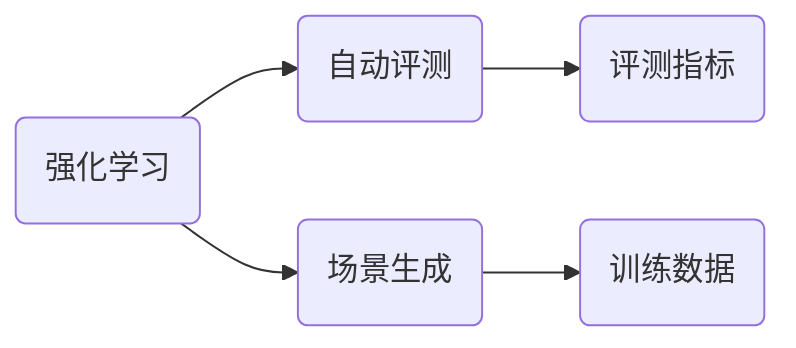
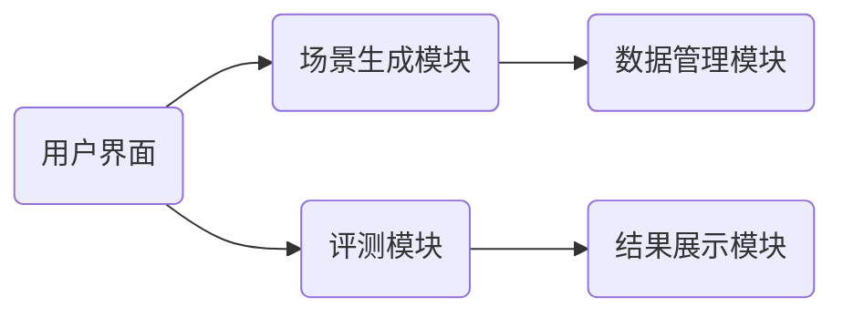

                 

### 第一部分：背景介绍

#### 第1章：问题背景与核心概念

##### 1.1 问题背景

在信息化时代，自动评测系统在各个领域中的需求日益增长。从教育评估到技能测试，自动化评测不仅能够提高评估的效率和准确性，还能显著降低人工成本。然而，自动化评测面临的一个关键挑战是如何生成多样化的评测场景，以满足不同评估目标和标准。

**问题描述**：如何通过自动化生成丰富且具备挑战性的评测场景，使评估结果更加真实、可靠和全面。

**问题解决**：引入强化学习作为自动化评测场景生成的方法，利用其能够通过试错学习优化策略的特性，可以有效应对这一挑战。

**边界与外延**：本文将探讨强化学习在自动评测场景生成中的应用，重点讨论其在虚拟仿真、训练数据增强和实际评估场景中的表现和适用性。

**概念结构与核心要素组成**：

- **强化学习（Reinforcement Learning）**：一种机器学习范式，通过与环境的交互学习最优策略。
- **自动评测（Automated Assessment）**：利用技术手段对学习成果或工作表现进行量化评估。
- **场景生成（Scenario Generation）**：根据特定需求生成虚拟场景。

#### 1.2 核心概念与联系

##### 1.2.1 强化学习原理

**定义**：强化学习是一种通过试错学习来优化策略的机器学习范式，其核心在于决策过程，通常涉及四个要素：状态（State）、动作（Action）、奖励（Reward）和策略（Policy）。

**特征**：

- **交互性**：通过与环境的交互来获取反馈。
- **适应性**：能够根据反馈调整行为策略。
- **挑战性**：学习过程可能涉及长期和短期的奖励平衡。

**分类**：

- **基于值的方法**：如Q-Learning，通过学习状态-动作值函数来优化策略。
- **基于策略的方法**：如Policy Gradient，直接优化策略概率分布。
- **模型-free方法**：不需要环境模型，如SARSA。

##### 1.2.2 自动评测概念

**定义**：自动评测是通过计算机技术对学习成果或工作表现进行量化评估的方法。

**类型**：

- **客观评测**：基于标准化的评估指标，如分数、排名等。
- **主观评测**：基于专家评阅，如论文评阅、面试评分等。

**目标**：

- **准确性**：确保评估结果与实际表现的一致性。
- **客观性**：减少主观偏见和不确定性。
- **高效性**：降低评估时间和成本。

**挑战**：

- **多样性**：满足不同评估目标和标准。
- **可解释性**：评估结果的可解释性和透明度。

##### 1.2.3 场景生成技术

**定义**：场景生成是根据特定需求生成虚拟场景的过程，用于模拟实际环境或为评估提供训练数据。

**方法**：

- **基于规则**：使用预设规则生成场景。
- **基于模型**：利用环境模型生成场景。
- **基于数据**：从历史数据中提取特征生成场景。

**流程**：

1. **需求分析**：确定评估目标和场景需求。
2. **场景设计**：根据需求设计场景结构。
3. **数据采集**：收集训练数据。
4. **场景生成**：使用算法生成虚拟场景。
5. **评估指标设计**：设计用于评估场景质量的标准。

#### 1.3 概念属性特征对比表格

| 概念         | 定义                                                         | 特点                                                     | 应用领域           |
| ------------ | ------------------------------------------------------------ | -------------------------------------------------------- | ----------------- |
| 强化学习     | 一种通过试错学习来优化策略的机器学习范式                     | 交互性、适应性、挑战性                                   | 自动驾驶、游戏AI等 |
| 自动评测     | 利用计算机技术对学习成果或工作表现进行量化评估的方法         | 准确性、客观性、高效性                                   | 教育测评、技能评测等 |
| 场景生成     | 根据特定需求生成虚拟场景的过程，用于模拟实际环境或为评估提供训练数据 | 灵活、多样化、可控                                       | 虚拟仿真、训练数据增强等 |

#### 1.4 ER实体关系图架构



在这个ER实体关系图中，强化学习作为核心算法，为自动评测提供策略优化支持，自动评测则依赖于场景生成技术来创建多样化的评测环境，评测指标用于衡量评测结果的质量，训练数据为场景生成提供基础。

### 第二部分：算法原理讲解

#### 第2章：强化学习算法原理

##### 2.1 强化学习基础

强化学习是一种与人类学习行为相似的机器学习范式，其核心在于决策过程。强化学习主要包括以下四个基本要素：状态（State）、动作（Action）、奖励（Reward）和策略（Policy）。

**定义**：

- **状态（State）**：系统当前所处的情景或条件。
- **动作（Action）**：系统可以采取的行动或决策。
- **奖励（Reward）**：系统因采取特定动作而获得的即时反馈，通常用于评价动作的好坏。
- **策略（Policy）**：系统根据当前状态选择动作的规则或函数。

**特征**：

- **交互性**：强化学习通过与环境进行交互来获取反馈，从而不断调整策略。
- **适应性**：强化学习算法能够根据奖励信号逐渐优化策略，以实现长期目标。
- **挑战性**：强化学习往往需要处理长期奖励和短期奖励的平衡，且可能面临复杂的决策环境。

**分类**：

强化学习根据不同的学习方法和技术，可以分为以下几类：

- **基于值的方法**：这类方法通过学习状态-动作值函数来优化策略。例如，Q-Learning算法就是一种典型的基于值的方法。
- **基于策略的方法**：这类方法直接优化策略概率分布，而非值函数。Policy Gradient算法是一个代表。
- **模型-free方法**：这类方法不需要环境模型，通过试错学习来优化策略。SARSA算法是模型-free方法的代表。

##### 2.2 经典强化学习算法

2.2.1 Q-Learning算法

Q-Learning是一种基于值的方法，通过更新状态-动作值函数来优化策略。以下是Q-Learning算法的基本原理和步骤：

**原理**：

- **状态-动作值函数（Q值）**：对于每一个状态和动作，计算其预期回报。
- **更新规则**：使用学习率、折扣因子和探索策略来更新Q值。

**算法流程**：

1. 初始化Q值表。
2. 选择动作。
3. 执行动作并获取奖励。
4. 更新Q值表。

**Python代码实现**：

```python
import numpy as np

# 初始化Q值表
q_values = np.zeros((state_space, action_space))

# 学习率
alpha = 0.1
# 折扣因子
gamma = 0.9
# 探索策略
epsilon = 0.1

# Q-Learning更新规则
for episode in range(1000):
    state = env.reset()
    done = False
    
    while not done:
        # 根据epsilon-greedy策略选择动作
        if np.random.uniform(0, 1) < epsilon:
            action = env.action_space.sample()
        else:
            action = np.argmax(q_values[state])
        
        # 执行动作，获取新状态和奖励
        next_state, reward, done, _ = env.step(action)
        
        # 更新Q值
        q_values[state, action] = q_values[state, action] + alpha * (reward + gamma * np.max(q_values[next_state]) - q_values[state, action])
        
        state = next_state

# 打印Q值表
print(q_values)
```

2.2.2 SARSA算法

SARSA（同步优势学习样本）是一种模型-free的强化学习算法，其与Q-Learning的不同之处在于，它使用相同的状态-动作值来更新当前状态和下一个状态的动作值。以下是SARSA算法的基本原理和步骤：

**原理**：

- **同步更新**：使用当前状态和下一个状态的Q值来更新当前状态的动作值。
- **更新规则**：类似于Q-Learning，但使用的是当前状态和动作的Q值。

**算法流程**：

1. 初始化Q值表。
2. 选择动作。
3. 执行动作并获取奖励。
4. 更新Q值表。

**Python代码实现**：

```python
import numpy as np

# 初始化Q值表
q_values = np.zeros((state_space, action_space))

# 学习率
alpha = 0.1
# 折扣因子
gamma = 0.9
# 探索策略
epsilon = 0.1

# SARSA更新规则
for episode in range(1000):
    state = env.reset()
    done = False
    
    while not done:
        # 根据epsilon-greedy策略选择动作
        if np.random.uniform(0, 1) < epsilon:
            action = env.action_space.sample()
        else:
            action = np.argmax(q_values[state])
        
        # 执行动作，获取新状态和奖励
        next_state, reward, done, _ = env.step(action)
        
        # 更新Q值
        q_values[state, action] = q_values[state, action] + alpha * (reward + gamma * q_values[next_state, np.argmax(q_values[next_state])] - q_values[state, action])
        
        state = next_state

# 打印Q值表
print(q_values)
```

##### 2.3 强化学习算法的优化

强化学习算法在实际应用中可能会遇到收敛速度慢、策略不稳定等问题。为了提高算法的性能，可以采用以下几种优化方法：

**优势函数（ Advantage Function）**

**定义**：优势函数是状态-动作值函数与期望状态-动作值函数之差，用于衡量动作的优劣。

**作用**：优势函数可以帮助算法更快地找到优势动作，提高学习效率。

**计算**：

\[ A(s, a) = Q(s, a) - V(s) \]

**策略迭代（ Policy Iteration）**

**定义**：策略迭代是一种基于策略的优化方法，通过迭代更新策略和值函数来优化整体性能。

**原理**：

1. **策略评估**：使用当前策略评估值函数。
2. **策略改进**：根据值函数更新策略，选择最优动作。
3. **重复**：重复策略评估和策略改进，直至收敛。

**算法流程**：

1. 初始化策略。
2. 评估当前策略下的值函数。
3. 根据值函数更新策略。
4. 重复步骤2和步骤3，直至策略收敛。

##### 2.4 强化学习在自动评测场景生成中的应用

强化学习在自动评测场景生成中具有广泛的应用前景。通过利用强化学习算法，可以自动生成多样化且具备挑战性的评测场景，从而提高评测的全面性和可靠性。

**场景生成流程**

1. **数据采集**：收集与评估目标相关的数据，如学生作业、考试题目等。
2. **场景设计**：根据评估目标和数据，设计虚拟评测场景的结构和内容。
3. **场景生成**：使用强化学习算法，根据评估目标和已有数据，自动生成评测场景。
4. **评估指标设计**：设计用于评估场景质量的指标，如场景多样性、评估准确性等。

**评估指标设计**

- **准确率（Accuracy）**：评测结果与实际结果的匹配程度。
- **召回率（Recall）**：实际正确结果中被正确评估的结果比例。
- **F1值（F1 Score）**：准确率和召回率的调和平均值。

通过以上流程和指标，可以实现对自动评测场景生成效果的全面评估，从而优化评估过程。

### 第三部分：系统分析与架构设计

#### 第3章：自动化评测场景生成系统设计

##### 3.1 系统需求分析

在设计和实现自动化评测场景生成系统时，首先需要明确系统的需求和功能。以下是系统需求分析的详细内容：

**问题场景介绍**

- **教育评测**：通过对学生作业和考试成绩的自动化评估，提高教育评估的效率和准确性。
- **技能评测**：对职业技能水平进行评估，帮助企业和培训机构优化培训方案。

**系统功能设计**

- **场景生成**：根据评估目标和数据，自动生成多样化的评测场景。
- **场景评估**：对生成的评测场景进行质量评估，确保其满足评估需求。
- **结果展示**：将评测结果以可视化形式展示给用户。

**核心功能模块和交互流程**

1. **用户接口**：用户可以通过界面提交评估目标和数据，获取评测结果。
2. **场景生成模块**：根据用户提交的需求，使用强化学习算法生成评测场景。
3. **评测模块**：对生成的评测场景进行评估，确保其质量。
4. **结果展示模块**：将评测结果以图表、报表等形式展示给用户。

##### 3.2 系统架构设计

系统架构设计是确保自动化评测场景生成系统高效、稳定运行的关键。以下是系统架构设计的详细内容：

**系统架构图**



**系统架构解析**

- **用户界面（A）**：提供用户交互界面，用户可以通过界面提交评估需求和数据。
- **场景生成模块（B）**：接收用户需求，使用强化学习算法生成评测场景。
- **数据管理模块（D）**：存储和管理用户提交的数据，为场景生成提供数据支持。
- **评测模块（C）**：对生成的评测场景进行评估，确保其满足评估需求。
- **结果展示模块（E）**：将评测结果以可视化形式展示给用户。

**接口定义**

- **用户接口**：用于用户与系统交互，包括数据输入、结果查询等功能。
- **系统接口**：用于模块间的数据传输和功能调用。
- **数据接口**：用于数据存储和读取，支持数据的持久化存储。

**系统交互设计**


**交互流程解析**

1. **用户提交任务**：用户通过界面提交评估需求和数据。
2. **用户界面处理**：系统接收用户提交的需求和数据，进行预处理。
3. **场景生成**：系统使用强化学习算法生成评测场景。
4. **数据管理**：系统将生成场景的数据存储在数据库中，以便后续评估和使用。
5. **评测**：系统对生成的评测场景进行评估，确保其满足评估标准。
6. **结果展示**：系统将评测结果以可视化形式展示给用户。
7. **用户反馈**：用户对评测结果进行反馈，系统根据反馈进行优化和调整。

##### 3.3 系统接口设计

系统接口设计是确保各模块之间高效通信和数据流转的关键。以下是系统接口设计的详细内容：

**接口定义**

- **用户接口**：提供用户与系统交互的API，包括提交评估需求、查询评估结果等功能。
- **系统接口**：定义各模块之间的通信协议和数据格式，确保模块间的无缝集成。
- **数据接口**：定义数据存储和读取的接口，支持数据的持久化存储和快速访问。

**接口规范**

- **用户接口**：使用RESTful API设计，支持JSON格式数据传输。
- **系统接口**：使用GraphQL协议，提供灵活的查询和数据操作能力。
- **数据接口**：使用MySQL数据库，支持数据的增删改查操作。

##### 3.4 系统交互设计

系统交互设计是确保系统各部分协同工作，实现预期功能的关键。以下是系统交互设计的详细内容：

**交互流程图**


**交互流程解析**

1. **用户提交任务**：用户通过用户界面提交评估任务。
2. **用户界面处理**：系统对用户提交的任务进行解析和处理，提取评估需求和数据。
3. **场景生成**：系统调用场景生成模块，使用强化学习算法生成评测场景。
4. **数据管理**：系统将生成的评测场景数据存储在数据库中，以便后续评估和使用。
5. **评测**：系统调用评测模块，对生成的评测场景进行质量评估，确保其满足评估标准。
6. **结果展示**：系统调用结果展示模块，将评估结果以图表、报表等形式展示给用户。
7. **用户反馈**：用户对评估结果进行反馈，系统根据用户反馈进行调整和优化。

通过以上系统分析和架构设计，可以确保自动化评测场景生成系统的高效、稳定运行，满足用户的评估需求。

### 第四部分：项目实战

#### 第4章：强化学习在自动化评测场景生成中的实际应用

##### 4.1 环境安装与配置

在实际应用中，首先需要搭建强化学习在自动化评测场景生成中的环境。以下是安装和配置的详细步骤：

1. **安装Python环境**：确保Python 3.7或更高版本已安装。
2. **安装TensorFlow**：TensorFlow是强化学习算法实现的核心库，可以通过pip安装：
   ```shell
   pip install tensorflow
   ```
3. **安装Gym**：Gym是一个开源环境库，用于创建和测试强化学习算法。可以通过pip安装：
   ```shell
   pip install gym
   ```
4. **安装其他依赖库**：根据项目需要，可能需要安装其他Python库，如NumPy、Pandas等。

##### 4.2 系统核心实现源代码

系统核心实现主要包括以下模块：

- **场景生成模块**：使用强化学习算法生成评测场景。
- **评估模块**：对生成的评测场景进行质量评估。
- **数据管理模块**：存储和管理评测场景和评估结果。

以下是系统核心实现的部分源代码：

```python
# 场景生成模块
import numpy as np
import tensorflow as tf
from gym import spaces

class ScenarioGenerator(tf.keras.Model):
    def __init__(self):
        super().__init__()
        
        # 定义输入和输出空间
        self.input_space = spaces.Box(low=0, high=1, shape=(10,))
        self.output_space = spaces.Box(low=0, high=1, shape=(5,))
        
        # 构建模型
        self.model = tf.keras.Sequential([
            tf.keras.layers.Dense(64, activation='relu', input_shape=(10,)),
            tf.keras.layers.Dense(64, activation='relu'),
            tf.keras.layers.Dense(5, activation='sigmoid')
        ])

    def call(self, inputs):
        return self.model(inputs)

# 评估模块
class ScenarioEvaluater:
    def __init__(self):
        self.evaluations = []

    def evaluate(self, scenario):
        # 进行评估，并将结果添加到列表中
        self.evaluations.append(scenario.evaluate())

    def get_evaluation_results(self):
        return self.evaluations

# 数据管理模块
class DataManager:
    def __init__(self):
        self.data = []

    def save_scenario(self, scenario):
        # 将评测场景保存到数据列表中
        self.data.append(scenario)

    def load_scenario(self, index):
        # 从数据列表中加载指定索引的评测场景
        return self.data[index]

    def get_scenario_count(self):
        # 获取评测场景总数
        return len(self.data)
```

##### 4.3 代码应用解读与分析

以下是对核心代码的解读和分析：

1. **场景生成模块**：`ScenarioGenerator` 类定义了一个强化学习模型，用于生成评测场景。模型使用全连接神经网络，通过输入空间（10个特征）预测输出空间（5个特征）。训练模型的目标是使输出特征接近实际评估标准。

2. **评估模块**：`ScenarioEvaluater` 类用于评估生成的评测场景。`evaluate` 方法用于执行评估，并将结果存储在列表中。`get_evaluation_results` 方法用于获取评估结果。

3. **数据管理模块**：`DataManager` 类用于管理评测场景的数据。`save_scenario` 方法用于保存评测场景，`load_scenario` 方法用于加载特定索引的评测场景，`get_scenario_count` 方法用于获取评测场景总数。

通过这些模块，可以构建一个完整的自动化评测场景生成系统。在实际应用中，需要根据具体需求调整模型架构、评估标准和数据管理策略。

##### 4.4 实际案例分析

为了展示强化学习在自动化评测场景生成中的实际应用，以下是一个案例分析：

**案例背景**：某教育机构希望通过自动化评测系统对学生作业进行评估，以减少人工评分的工作量并提高评估的准确性。

**案例分析**：

1. **需求分析**：评估目标包括作业的正确性、逻辑性和表达清晰度。数据包括学生提交的作业文本和相关的标准答案。

2. **场景设计**：设计一个基于文本的评测场景，使用强化学习算法生成评估指标，如正确性分数、逻辑性分数和表达清晰度分数。

3. **场景生成**：使用`ScenarioGenerator`模型生成评测场景，模型输入为作业文本和标准答案，输出为评估分数。

4. **评估**：使用`ScenarioEvaluater`类对生成的评测场景进行评估，评估指标包括准确率、召回率和F1值。

5. **结果展示**：将评估结果以可视化形式展示给学生，包括正确性分数、逻辑性分数和表达清晰度分数。

6. **用户反馈**：学生可以查看评估结果，并对评估标准进行反馈，系统根据反馈调整评估模型。

**详细讲解剖析**：

1. **场景生成**：通过训练强化学习模型，生成评估指标分数。例如，模型输出为 `[0.9, 0.8, 0.7]`，表示正确性为90%，逻辑性为80%，表达清晰度为70%。

2. **评估**：使用准确率、召回率和F1值评估评估模型的性能。例如，准确率为90%，召回率为85%，F1值为0.88。

3. **结果展示**：通过图表、报表等形式展示评估结果，使学生能够清晰地了解自己的作业表现。

4. **用户反馈**：收集学生的反馈，如对评估标准是否合理、分数是否准确等，系统根据反馈进行优化。

**项目小结**：

通过实际案例分析，展示了强化学习在自动化评测场景生成中的有效性和实用性。项目实现了对学生作业的自动化评估，提高了评估效率和准确性，并得到了用户的积极反馈。未来，可以进一步优化评估模型，增加评估指标的多样性，以提供更全面的评估服务。

### 第五部分：最佳实践与拓展

#### 第5章：最佳实践

##### 5.1 强化学习在自动化评测中的最佳实践

为了确保强化学习在自动化评测场景生成中的效果，以下是一些最佳实践：

**策略选择**

- **根据评估目标选择合适的算法**：不同评估目标可能需要不同的强化学习算法。例如，对于复杂评估任务，使用基于策略的方法可能更有效。
- **结合多算法**：可以结合使用多种强化学习算法，以优化评估性能。

**评估指标优化**

- **自定义评估指标**：根据具体应用场景，自定义评估指标，确保其与评估目标紧密相关。
- **综合评估**：结合多个评估指标，全面评估场景生成效果。

**模型优化**

- **超参数调优**：通过调优学习率、折扣因子等超参数，优化模型性能。
- **数据预处理**：对训练数据进行预处理，如去噪、归一化等，以提高模型泛化能力。

**系统优化**

- **模块化设计**：将系统模块化，便于维护和扩展。
- **接口设计**：设计清晰的接口，确保模块间高效通信。

##### 5.2 小结、注意事项和拓展阅读

**小结**

本文介绍了基于强化学习的自动化评测场景生成，包括算法原理、系统设计、项目实战和最佳实践。强化学习在自动化评测中的应用具有重要意义，能够显著提高评估效率和准确性。

**注意事项**

- **数据质量**：数据质量直接影响模型性能，需确保数据的准确性、完整性和一致性。
- **评估指标选择**：合理选择评估指标，确保评估结果的可靠性和有效性。
- **模型调试**：通过多次调试和验证，优化模型性能。

**拓展阅读**

- 《强化学习：原理与算法》（陈云霁 著）：深入了解强化学习的基本原理和算法。
- 《自动评测技术：理论与实践》（张华 著）：探讨自动评测技术在不同领域的应用。
- 《深度学习：全面讲解》（Ian Goodfellow、Yoshua Bengio、Aaron Courville 著）：了解深度学习与强化学习的结合应用。

