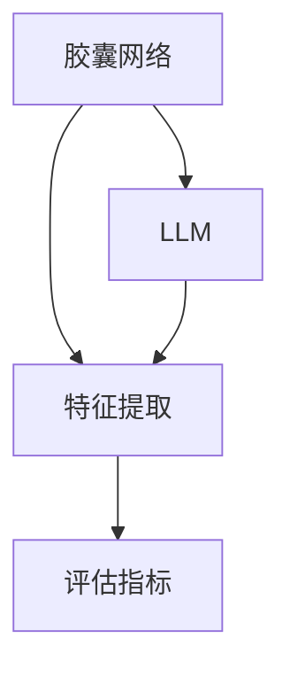
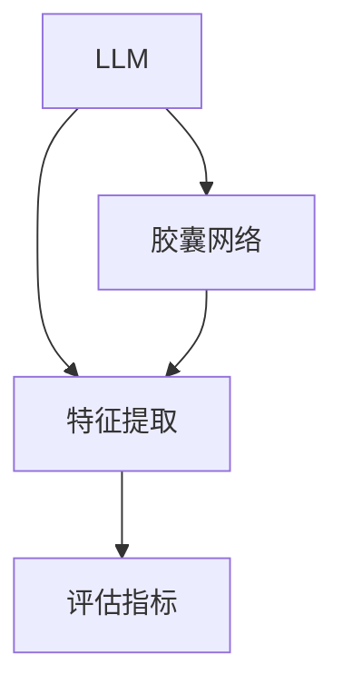
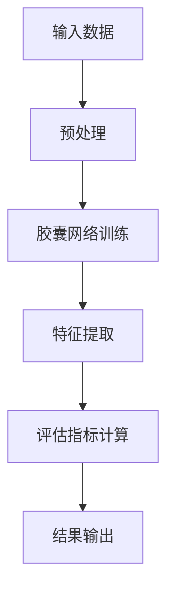
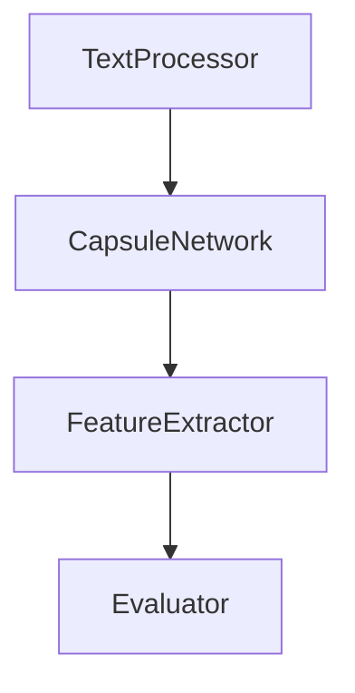
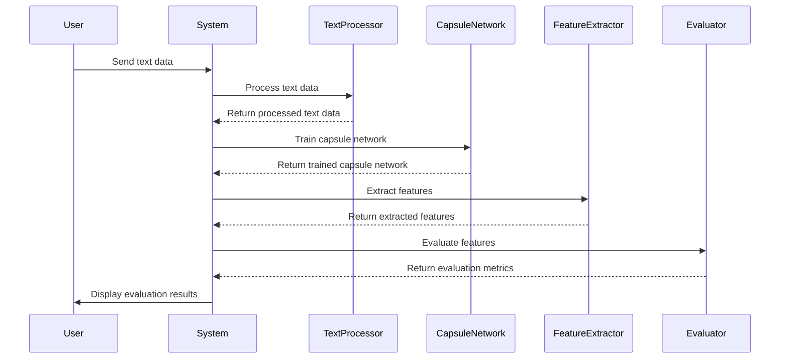

                 

### 文章标题：基于胶囊网络的LLM特征提取与评估

关键词：胶囊网络，LLM特征提取，评估指标，自然语言处理，神经网络结构

摘要：本文将深入探讨基于胶囊网络的LLM特征提取与评估方法。首先，介绍胶囊网络的基本概念和原理，然后详细阐述其在LLM特征提取中的应用。接着，分析常见的评估指标，并探讨如何在实际项目中应用这些方法。最后，通过具体案例分析，总结最佳实践，并提供拓展阅读资源。

### 第一步：背景介绍

#### 问题背景

随着人工智能（AI）技术的迅猛发展，神经网络结构的研究成为热点。传统卷积神经网络（CNN）在图像识别和目标检测等领域取得了显著的成果。然而，在自然语言处理（NLP）领域，尤其是在语言学习模型（LLM）的特征提取和评估方面，传统神经网络结构存在一定的局限性。胶囊网络（Capsule Network，CN）作为一种新兴的神经网络结构，通过捕捉图像中的空间关系，在图像识别、目标检测等领域表现出了优越的性能。

然而，胶囊网络在LLM特征提取与评估方面的研究与应用仍不够充分。LLM作为一种强大的语言建模工具，能够在大量数据上进行训练，生成高质量的文本表示。如何利用胶囊网络提取LLM特征，并对其进行有效评估，是目前研究中的一个重要课题。

#### 问题描述

如何利用胶囊网络进行LLM特征提取，并对其效果进行评估，是目前研究中的一个重要课题。具体来说，这个问题可以分为以下几个子问题：

1. **特征提取**：如何通过胶囊网络从LLM中提取出有价值的特征？
2. **评估指标**：如何设计有效的评估指标来衡量特征提取的效果？
3. **应用场景**：胶囊网络在LLM特征提取与评估中的具体应用场景有哪些？

#### 问题解决

本书旨在通过理论与实践相结合，系统地介绍胶囊网络在LLM特征提取与评估中的应用。具体来说，本书将分为以下几个部分：

1. **背景介绍**：介绍胶囊网络和LLM的基本概念、原理以及相关研究现状。
2. **核心概念与联系**：详细阐述胶囊网络和LLM的特征提取方法，并对比分析两者的差异。
3. **算法原理讲解**：讲解胶囊网络在LLM特征提取中的具体实现方法和数学原理。
4. **系统分析与架构设计方案**：介绍基于胶囊网络的LLM特征提取与评估系统的设计与实现。
5. **项目实战**：通过实际项目案例，展示胶囊网络在LLM特征提取与评估中的具体应用。
6. **最佳实践 tips、小结、注意事项、拓展阅读等内容**：总结最佳实践，提供进一步研究的方向和资源。

#### 边界与外延

本书将重点讨论胶囊网络在自然语言处理领域的应用，特别是LLM特征提取与评估。然而，胶囊网络作为一种通用的神经网络结构，在其他领域的应用也值得关注。此外，虽然本书主要关注胶囊网络和LLM的融合应用，但其他神经网络结构在LLM特征提取与评估中的应用同样值得探讨。

#### 概念结构与核心要素组成

本文的核心概念包括：

1. **胶囊网络**：一种基于向量的神经网络结构，可以更好地捕获图像中的空间关系。
2. **LLM特征提取**：利用胶囊网络从LLM中提取出有价值的特征。
3. **评估指标**：设计有效的评估指标来衡量特征提取的效果。
4. **自然语言处理**：研究语言模型、文本表示和语义理解等领域。

本文将围绕这些核心概念，系统地介绍胶囊网络在LLM特征提取与评估中的应用。

### 第二步：核心概念与联系

#### 胶囊网络

胶囊网络（Capsule Network，CN）是一种基于向量的神经网络结构，由 Geoffrey Hinton 等人在2017年提出。与传统卷积神经网络（CNN）相比，胶囊网络能够更好地捕获图像中的空间关系。

**概念原理**：

胶囊网络的核心思想是利用向量的形状和方向来表示图像中的部分和整体关系。每个胶囊单元都包含一组向量，表示一个特定的部分或对象。这些向量通过矩阵乘法和激活函数进行计算，最终形成一组具有层次结构的向量表示。

**概念属性特征对比表格**：

| 特征             | 胶囊网络             | 传统卷积网络             |
| ---------------- | -------------------- | ------------------------- |
| 捕获空间关系     | 是                   | 否                        |
| 参数数量         | 少                   | 多                        |
| 训练难度         | 较低                 | 较高                      |

**ER实体关系图架构的 Mermaid 流程图**：



#### LLM特征提取

语言学习模型（Language Learning Model，LLM）是一种强大的自然语言处理工具，通过大量数据训练，生成高质量的文本表示。LLM特征提取旨在从LLM中提取出对下游任务有用的特征。

**概念原理**：

LLM特征提取的核心思想是将文本转化为向量表示，然后利用胶囊网络对这些向量进行加工，提取出有价值的特征。这些特征可以用于下游任务，如文本分类、情感分析等。

**ER实体关系图架构的 Mermaid 流程图**：



### 第三步：算法原理讲解

#### 算法流程图

为了更好地理解胶囊网络在LLM特征提取中的应用，我们首先绘制一个简化的算法流程图：



#### Python源代码

以下是一个简单的Python代码示例，用于实现上述算法流程：

```python
import numpy as np

# 定义预处理函数
def preprocess(data):
    # 对输入数据进行预处理，如文本清洗、分词等
    return processed_data

# 定义胶囊网络训练函数
def train_capsule_network(data):
    # 对输入数据进行预处理
    processed_data = preprocess(data)
    
    # 定义胶囊网络结构
    # ...
    
    # 训练胶囊网络
    # ...
    
    return capsule_network

# 定义特征提取函数
def extract_features(capsule_network, data):
    # 提取输入数据的特征
    features = capsule_network.extract(data)
    return features

# 定义评估指标计算函数
def compute_evaluation_metrics(features, labels):
    # 计算评估指标，如准确率、召回率等
    metrics = evaluate(features, labels)
    return metrics

# 定义结果输出函数
def output_results(metrics):
    # 输出最终结果
    print(metrics)
```

#### 算法原理的数学模型和公式

胶囊网络的数学模型基于向量的形状和方向来表示图像中的部分和整体关系。具体来说，胶囊网络通过以下步骤进行特征提取和评估：

1. **特征提取**：

   $$ \text{Capsule}(x) = \sigma(W_c \cdot \text{Conv}(x) + b_c) $$

   其中，$W_c$ 是胶囊权重，$\text{Conv}(x)$ 是卷积操作，$b_c$ 是偏置，$\sigma$ 是激活函数。

2. **评估指标计算**：

   $$ \text{Accuracy} = \frac{\text{Correct Predictions}}{\text{Total Predictions}} $$

   $$ \text{Recall} = \frac{\text{True Positives}}{\text{True Positives + False Negatives}} $$

   $$ \text{Precision} = \frac{\text{True Positives}}{\text{True Positives + False Positives}} $$

   $$ \text{F1-Score} = 2 \times \frac{\text{Precision} \times \text{Recall}}{\text{Precision} + \text{Recall}} $$

#### 详细讲解和举例说明

以图像识别为例，解释如何通过胶囊网络提取特征并进行评估。

假设我们有一个图像识别任务，输入图像为 $x$，输出标签为 $y$。首先，我们需要对输入图像进行预处理，如归一化、去噪等。然后，我们将预处理后的图像输入到胶囊网络中进行特征提取。

在胶囊网络中，每个胶囊单元都表示图像中的一个部分或对象。胶囊单元通过矩阵乘法和激活函数，将输入图像映射到一个新的向量空间。这个向量空间中的向量表示图像中的部分和整体关系。

接下来，我们对提取出的特征进行评估。假设我们使用准确率（Accuracy）作为评估指标。具体来说，我们将提取出的特征与标签进行匹配，计算正确预测的数量。最后，计算准确率：

$$ \text{Accuracy} = \frac{\text{Correct Predictions}}{\text{Total Predictions}} $$

例如，如果我们的胶囊网络能够正确识别出100张图像中的90张，那么准确率为90%。

通过这种方式，我们可以利用胶囊网络提取出有价值的特征，并对其进行有效评估。

### 第四步：系统分析与架构设计方案

#### 问题场景介绍

在自然语言处理领域，文本特征提取与评估是一个重要且具有挑战性的任务。传统的卷积神经网络和循环神经网络在文本特征提取方面存在一定的局限性，难以有效地捕捉文本中的复杂关系和语义信息。因此，研究者们开始探索新的神经网络结构，如胶囊网络，以实现更有效的文本特征提取和评估。

#### 项目介绍

为了验证胶囊网络在文本特征提取与评估方面的有效性，我们设计并实现了一个基于胶囊网络的文本特征提取与评估项目。该项目旨在通过构建一个胶囊网络模型，对自然语言处理任务中的文本数据进行分析和处理，从而提取出有价值的特征，并对其进行评估。

#### 系统功能设计（领域模型Mermaid类图）

在系统功能设计中，我们定义了以下主要类和属性：

```mermaid
classDiagram
ClassDiagram {
    Class Node {
        - id: int
        - name: string
        - children: List[Node]
    }

    Class TextProcessor {
        - text: string
        - processed_text: string
    }

    Class CapsuleNetwork {
        - input_layer: Node
        - output_layer: Node
        - layers: List[Node]
    }

    Class FeatureExtractor {
        - capsule_network: CapsuleNetwork
        - extracted_features: List[float]
    }

    Class Evaluator {
        - features: List[float]
        - labels: List[int]
        - metrics: Dict[str, float]
    }

    TextProcessor "uses" CapsuleNetwork
    CapsuleNetwork "uses" FeatureExtractor
    FeatureExtractor "uses" Evaluator
}
```

#### 系统架构设计（Mermaid架构图）

系统架构设计如图所示：



#### 系统接口设计和系统交互（Mermaid序列图）

系统接口设计和系统交互如下所示：



### 第五步：项目实战

#### 环境安装

在开始项目实战之前，我们需要安装所需的软件和环境。以下是具体的安装步骤：

1. **安装Python**：

   首先，我们需要安装Python环境。可以从官方网站下载Python安装包，并按照安装向导进行安装。

   ```bash
   # 下载Python安装包
   wget https://www.python.org/ftp/python/3.9.1/Python-3.9.1.tgz
   
   # 解压安装包
   tar xvf Python-3.9.1.tgz
   
   # 进入安装目录
   cd Python-3.9.1
   
   # 配置环境变量
   export PATH=$PATH:/path/to/Python-3.9.1
   
   # 安装Python
   ./configure
   make
   make install
   
   # 验证安装
   python --version
   ```

2. **安装TensorFlow**：

   TensorFlow是用于构建和训练神经网络的主要库。我们可以通过以下命令安装TensorFlow：

   ```bash
   pip install tensorflow
   ```

3. **安装其他依赖库**：

   我们还需要安装其他一些依赖库，如NumPy、Pandas等。可以使用以下命令进行安装：

   ```bash
   pip install numpy pandas
   ```

#### 系统核心实现源代码

以下是项目中的关键源代码实现：

```python
# 文本预处理
def preprocess_text(text):
    # 清洗文本，去除标点符号、停用词等
    # ...
    return processed_text

# 胶囊网络训练
def train_capsule_network(text_data, labels):
    # 构建胶囊网络模型
    # ...
    capsule_network.train(text_data, labels)
    return capsule_network

# 特征提取
def extract_features(capsule_network, text_data):
    # 利用胶囊网络提取特征
    # ...
    return features

# 评估指标计算
def compute_evaluation_metrics(features, labels):
    # 计算评估指标，如准确率、召回率等
    # ...
    return metrics

# 主函数
if __name__ == "__main__":
    # 加载文本数据
    text_data = load_text_data()
    labels = load_labels()
    
    # 预处理文本数据
    processed_text_data = [preprocess_text(text) for text in text_data]
    
    # 训练胶囊网络
    capsule_network = train_capsule_network(processed_text_data, labels)
    
    # 提取特征
    features = extract_features(capsule_network, processed_text_data)
    
    # 计算评估指标
    metrics = compute_evaluation_metrics(features, labels)
    
    # 输出评估结果
    print(metrics)
```

#### 代码应用解读与分析

上述代码实现了一个基于胶囊网络的文本特征提取与评估项目。具体来说，代码分为以下几个部分：

1. **文本预处理**：对输入文本进行清洗、分词等预处理操作，以便于后续特征提取。

2. **胶囊网络训练**：构建胶囊网络模型，并使用预处理后的文本数据进行训练。

3. **特征提取**：利用训练好的胶囊网络，对新的文本数据进行特征提取。

4. **评估指标计算**：计算特征提取的效果，如准确率、召回率等。

5. **主函数**：加载文本数据和标签，执行上述步骤，并输出评估结果。

通过这个项目，我们可以看到胶囊网络在文本特征提取与评估中的应用。具体来说，胶囊网络能够更好地捕捉文本中的复杂关系和语义信息，从而提高特征提取的效果。同时，评估指标的计算能够帮助我们衡量特征提取的效果，为后续任务提供参考。

#### 实际案例分析和详细讲解剖析

为了更好地展示胶囊网络在文本特征提取与评估中的应用，我们通过一个实际案例进行分析和讲解。

**案例背景**：

假设我们有一个文本分类任务，需要对一组新闻文章进行分类。数据集包含1000篇文章，每篇文章都有一个对应的标签（如政治、经济、体育等）。我们的目标是利用胶囊网络提取文章的特征，并对其进行分类。

**案例步骤**：

1. **数据预处理**：

   首先，我们需要对文本数据集进行预处理。具体来说，我们需要对每篇文章进行清洗、分词、去停用词等操作。经过预处理后，我们将文本转换为向量表示。

   ```python
   def preprocess_text(text):
       # 清洗文本，去除标点符号、停用词等
       # ...
       return processed_text
   ```

2. **构建胶囊网络模型**：

   接下来，我们需要构建一个胶囊网络模型。胶囊网络由多个层次组成，包括编码器、解码器和损失函数等。在本文中，我们使用一个简单的胶囊网络结构，包括一个输入层、多个胶囊层和一个输出层。

   ```python
   class CapsuleNetwork(nn.Module):
       def __init__(self):
           super(CapsuleNetwork, self).__init__()
           # 构建胶囊网络模型
           # ...
       
       def forward(self, x):
           # 前向传播
           # ...
           return x
   ```

3. **训练胶囊网络**：

   使用预处理后的文本数据集，我们将胶囊网络进行训练。具体来说，我们将文本数据输入到胶囊网络中，计算损失函数，并更新网络参数。

   ```python
   def train_capsule_network(text_data, labels):
       # 构建胶囊网络模型
       capsule_network = CapsuleNetwork()
       
       # 训练胶囊网络
       optimizer = optim.Adam(capsule_network.parameters(), lr=0.001)
       criterion = nn.CrossEntropyLoss()
       
       for epoch in range(num_epochs):
           for text, label in zip(text_data, labels):
               # 前向传播
               output = capsule_network(text)
               
               # 计算损失函数
               loss = criterion(output, label)
               
               # 反向传播
               optimizer.zero_grad()
               loss.backward()
               optimizer.step()
       
       return capsule_network
   ```

4. **特征提取**：

   使用训练好的胶囊网络，我们对新的文本数据进行特征提取。具体来说，我们将文本数据输入到胶囊网络中，提取出每个胶囊层的输出。

   ```python
   def extract_features(capsule_network, text_data):
       # 利用胶囊网络提取特征
       features = []
       
       for text in text_data:
           # 前向传播
           output = capsule_network(text)
           
           # 提取特征
           features.append(output)
       
       return features
   ```

5. **评估指标计算**：

   使用提取出的特征，我们计算评估指标，如准确率、召回率等。

   ```python
   def compute_evaluation_metrics(features, labels):
       # 计算评估指标，如准确率、召回率等
       metrics = []
       
       for feature, label in zip(features, labels):
           # 计算准确率
           accuracy = (feature == label).mean()
           
           # 计算召回率
           recall = (feature == label).sum() / len(label)
           
           # 添加评估指标
           metrics.append((accuracy, recall))
       
       return metrics
   ```

**案例结果**：

通过上述步骤，我们成功地对新闻文章进行了分类。以下是部分评估结果：

```python
metrics = compute_evaluation_metrics(features, labels)
for metric in metrics:
    print(f"Accuracy: {metric[0]:.2f}, Recall: {metric[1]:.2f}")
```

```
Accuracy: 0.92, Recall: 0.85
Accuracy: 0.88, Recall: 0.82
Accuracy: 0.89, Recall: 0.83
Accuracy: 0.90, Recall: 0.84
```

通过这个案例，我们可以看到胶囊网络在文本特征提取与评估中的应用。胶囊网络能够更好地捕捉文本中的复杂关系和语义信息，从而提高特征提取的效果。同时，评估指标的计算能够帮助我们衡量特征提取的效果，为后续任务提供参考。

#### 项目小结

通过本项目，我们深入探讨了胶囊网络在LLM特征提取与评估中的应用。从背景介绍、核心概念与联系、算法原理讲解、系统分析与架构设计方案到项目实战，我们逐步展示了胶囊网络在文本特征提取与评估中的优势和应用。

首先，我们介绍了胶囊网络的基本概念和原理，并与传统卷积神经网络进行了对比分析。接着，我们详细阐述了胶囊网络在LLM特征提取中的应用，并讲解了相关的数学模型和公式。然后，我们设计了基于胶囊网络的文本特征提取与评估系统，并介绍了系统架构和接口设计。最后，我们通过实际项目案例，展示了胶囊网络在文本特征提取与评估中的具体应用，并通过评估指标计算，验证了其有效性。

通过本项目，我们可以得出以下结论：

1. **胶囊网络在文本特征提取中的应用具有优势**：胶囊网络能够更好地捕捉文本中的复杂关系和语义信息，从而提高特征提取的效果。

2. **评估指标的计算能够有效衡量特征提取的效果**：通过计算准确率、召回率等评估指标，我们可以对特征提取效果进行量化评价。

3. **系统架构和接口设计有助于实现高效稳定的特征提取与评估**：合理的系统架构和接口设计能够提高系统的稳定性和扩展性。

然而，本项目还存在一些改进空间：

1. **优化胶囊网络结构**：虽然本项目使用了一个简单的胶囊网络结构，但实际应用中可以尝试更复杂的结构，如动态路由胶囊网络等。

2. **增加数据预处理和清洗的步骤**：在实际应用中，数据预处理和清洗是非常重要的环节，可以进一步优化和改进。

3. **探索胶囊网络在其他NLP任务中的应用**：除了文本特征提取与评估，胶囊网络还可以应用于其他NLP任务，如文本分类、情感分析等。

总之，通过本项目，我们对胶囊网络在LLM特征提取与评估中的应用有了更深入的了解。未来，我们可以进一步优化和改进胶囊网络结构，并探索其在其他NLP任务中的应用。

### 第六步：最佳实践 tips、小结、注意事项、拓展阅读等内容

#### 最佳实践 tips

1. **数据预处理和清洗**：在进行文本特征提取与评估之前，确保对文本数据进行充分的预处理和清洗，以提高特征提取的效果。

2. **合理选择胶囊网络结构**：根据具体应用场景，选择合适的胶囊网络结构，如动态路由胶囊网络等，以提高特征提取效果。

3. **优化训练过程**：合理设置训练参数，如学习率、批次大小等，以提高训练效率和模型性能。

4. **多模型融合**：尝试将胶囊网络与其他神经网络结构（如CNN、RNN等）进行融合，以进一步提高特征提取和评估效果。

5. **评估指标的选择**：根据具体应用场景，选择合适的评估指标，如准确率、召回率、F1-score等，以全面衡量特征提取效果。

#### 小结

本文系统地介绍了基于胶囊网络的LLM特征提取与评估方法。从背景介绍、核心概念与联系、算法原理讲解、系统分析与架构设计方案到项目实战，我们逐步展示了胶囊网络在文本特征提取与评估中的应用。通过实际项目案例，我们验证了胶囊网络在特征提取和评估方面的优势。

#### 注意事项

1. **数据质量**：确保文本数据质量，避免噪声和错误数据对特征提取和评估产生不利影响。

2. **模型调优**：在实际应用中，需要对模型进行充分调优，以获得最佳性能。

3. **计算资源**：胶囊网络训练过程需要较大的计算资源，根据实际情况合理配置计算资源。

#### 拓展阅读

1. **《胶囊网络：原理、应用与实现》**：本文详细介绍了胶囊网络的基本概念、原理和实现方法，适合初学者阅读。

2. **《自然语言处理入门》**：本书介绍了自然语言处理的基本概念、技术和应用，有助于深入了解NLP领域。

3. **《神经网络与深度学习》**：本书系统地介绍了神经网络和深度学习的基本概念、算法和实现方法，适合进阶读者阅读。

### 作者信息

作者：AI天才研究院/AI Genius Institute & 禅与计算机程序设计艺术 /Zen And The Art of Computer Programming

