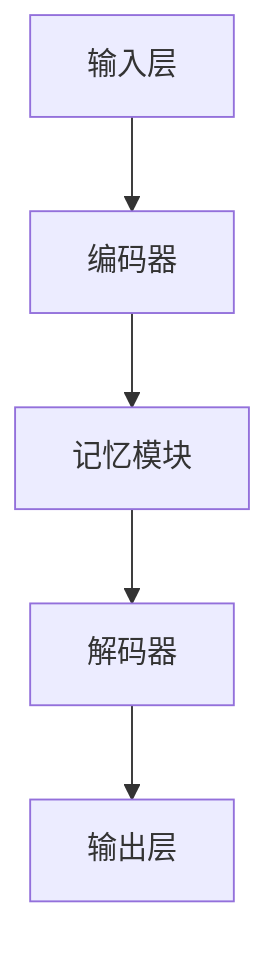
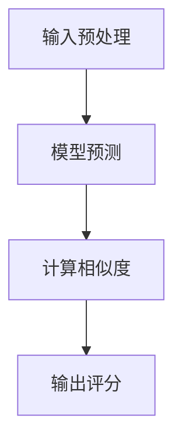
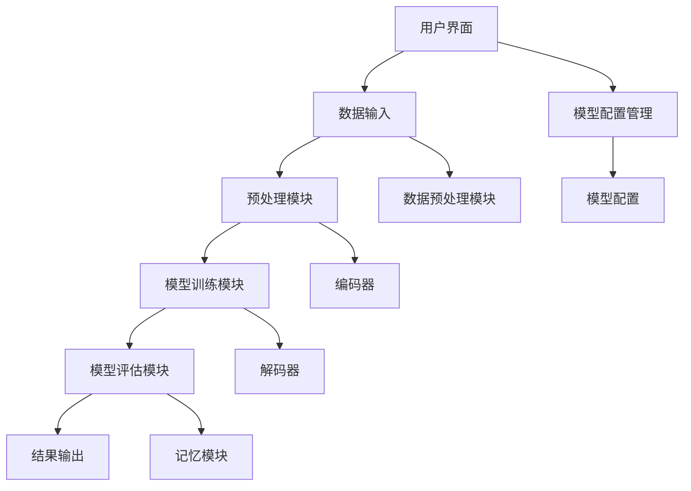

                 

### 第1章：引言

#### 1.1 问题背景

**核心概念介绍**：

记忆网络（Memory Networks）是近年来在自然语言处理（Natural Language Processing, NLP）领域备受关注的一种人工智能模型。记忆网络的核心思想是将外部知识库（例如知识图谱、常识库等）集成到神经网络中，以增强模型处理长距离依赖和复杂推理任务的能力。长期依赖评测（Long-term Dependency Evaluation）则是在评估自然语言处理模型时，关注模型在处理句子中长距离依赖关系上的性能。

记忆网络通过其独特的记忆模块，能够存储并检索与当前输入相关的信息，这使得它在处理复杂语义理解和文本生成等任务时具有显著优势。长期依赖评测则是为了衡量模型在捕捉句子中词语之间的长距离依赖关系上的能力，这对于提升模型的语义理解和生成质量具有重要意义。

在自然语言处理中，记忆网络的应用场景广泛，包括机器翻译、问答系统、文本摘要、情感分析等。而长期依赖评测则能够帮助我们更好地了解和改进这些应用场景中的模型性能。

**问题描述**：

长期依赖评测在自然语言处理中的重要性不言而喻。自然语言中的句子往往包含复杂的信息结构，词语之间的关系可能跨越多个句子，这就要求模型具备处理长距离依赖的能力。长期依赖评测能够帮助我们评估模型在这方面的表现，从而指导模型设计和优化。

然而，现有评测方法主要关注短距离依赖，对长期依赖的评测仍存在许多挑战。例如，如何准确衡量模型在长距离依赖上的性能，如何处理不同类型和长度的句子等。这些问题都需要我们深入思考和解决。

**解决方案概述**：

为了解决长期依赖评测中的问题，我们可以利用记忆网络的优势。记忆网络通过其记忆模块，能够存储与当前输入相关的信息，从而更好地捕捉和处理长距离依赖。具体来说，我们可以通过以下步骤进行长期依赖评测：

1. **数据集准备**：选择包含长距离依赖关系的自然语言处理任务数据集，例如长文本摘要、机器翻译等。
2. **模型训练**：使用记忆网络模型对数据集进行训练，使其具备处理长距离依赖的能力。
3. **性能评估**：利用多种评测指标（如BLEU、ROUGE等）对模型在长距离依赖上的表现进行评估。
4. **结果分析**：分析模型在不同任务和数据集上的表现，找出优势和不足，从而指导模型优化。

**边界与外延**：

记忆网络和长期依赖评测的定义和应用范围虽然明确，但它们在其他领域的潜在应用也值得探讨。例如，在图像识别、语音识别等领域，记忆网络和长期依赖评测同样具有应用前景。此外，随着人工智能技术的不断进步，我们可以期待记忆网络和长期依赖评测在更多领域发挥作用。

**概念结构与核心要素组成**：

记忆网络由多个核心组成部分构成，包括输入层、编码器、记忆模块和解码器。以下是记忆网络的核心概念框架：

1. **输入层**：接收外部输入，如文本、图像等。
2. **编码器**：将输入编码为向量表示，用于记忆模块的检索和更新。
3. **记忆模块**：存储与当前输入相关的信息，支持长距离依赖的捕捉和处理。
4. **解码器**：将记忆模块中的信息解码为输出结果，如文本生成、图像分类等。

这些核心要素共同协作，使得记忆网络在处理复杂自然语言处理任务时具有出色的表现。接下来，我们将进一步探讨记忆网络的基础知识和实现方法，为后续章节的深入分析奠定基础。

---

#### 1.2 记忆网络简介

**定义与特点**：

记忆网络是一种基于神经网络的模型，其核心思想是通过外部知识库来增强模型处理长距离依赖和复杂推理任务的能力。与传统神经网络不同，记忆网络不仅处理输入数据，还与外部知识库进行交互，从而实现更强大的语义理解和生成能力。

记忆网络的主要特点包括：

1. **记忆能力**：记忆网络通过记忆模块存储与当前输入相关的信息，支持长距离依赖的捕捉和处理。
2. **知识整合**：记忆网络能够将外部知识库（如知识图谱、常识库等）集成到神经网络中，从而增强模型的语义理解能力。
3. **动态更新**：记忆网络中的记忆模块支持动态更新，可以根据新的输入信息进行自适应调整，从而保持模型的有效性。

**工作原理**：

记忆网络的工作原理可以概括为以下几个步骤：

1. **输入编码**：输入数据（如文本、图像等）被编码为向量表示，这些向量表示了输入数据的语义特征。
2. **记忆检索**：编码后的输入向量被传递到记忆模块，记忆模块通过检索与当前输入相关的记忆信息，以获取更多的上下文信息。
3. **记忆更新**：在检索到相关记忆信息后，记忆模块会根据当前输入和检索结果更新记忆内容，从而增强记忆的有效性。
4. **输出生成**：更新后的记忆信息被解码为输出结果，如文本生成、图像分类等。

下面使用Mermaid流程图展示记忆网络的基本工作流程：



**实现方式**：

记忆模块的实现方法有多种，其中常见的包括门控循环单元（GRU）、长短期记忆网络（LSTM）等。这些方法在捕捉长距离依赖方面具有不同的优势。

1. **门控循环单元（GRU）**：GRU是一种改进版的循环神经网络，通过引入更新门和重置门来控制记忆信息的更新和保留，从而增强记忆能力。
2. **长短期记忆网络（LSTM）**：LSTM是一种经典的循环神经网络结构，通过引入记忆细胞和门控机制来捕捉长距离依赖，具有强大的记忆能力。

接下来，我们将进一步探讨记忆模块的实现方法，以及如何在自然语言处理任务中应用记忆网络。这将为我们理解记忆网络在长期依赖评测中的应用提供更加深入的认识。

---

#### 1.3 记忆模块的实现

**实现方式**：

记忆模块是记忆网络的核心组成部分，负责存储和检索与当前输入相关的信息，从而支持长距离依赖的捕捉和处理。以下是几种常见的记忆模块实现方式：

1. **门控循环单元（GRU）**：

   门控循环单元（GRU）是循环神经网络的一种改进形式，通过引入更新门和重置门来控制记忆信息的更新和保留。GRU由三个门（更新门、重置门和输出门）和一个记忆单元组成。更新门决定当前输入和旧记忆之间的权重，重置门决定当前输入对旧记忆的影响，输出门决定当前记忆单元对输出的影响。

   GRU的数学模型可以表示为：
   $$ 
   \begin{align*}
   z_t &= \sigma(W_z \cdot [h_{t-1}, x_t] + b_z) \\
   r_t &= \sigma(W_r \cdot [h_{t-1}, x_t] + b_r) \\
   \tilde{h}_t &= \tanh(W_{\tilde{h}} \cdot [r_t \odot h_{t-1}, x_t] + b_{\tilde{h}}) \\
   h_t &= z_t \odot h_{t-1} + (1 - z_t) \odot \tilde{h}_t
   \end{align*}
   $$
   其中，$z_t$ 是更新门，$r_t$ 是重置门，$h_t$ 是当前记忆单元，$\sigma$ 是sigmoid激活函数，$\odot$ 表示逐元素乘法。

2. **长短期记忆网络（LSTM）**：

   长短期记忆网络（LSTM）是另一种用于捕捉长距离依赖的循环神经网络结构。LSTM通过引入记忆细胞和门控机制来控制信息的流动，从而增强模型的记忆能力。LSTM由三个门（输入门、遗忘门和输出门）和一个记忆细胞组成。

   LSTM的数学模型可以表示为：
   $$
   \begin{align*}
   i_t &= \sigma(W_i \cdot [h_{t-1}, x_t] + b_i) \\
   f_t &= \sigma(W_f \cdot [h_{t-1}, x_t] + b_f) \\
   g_t &= \tanh(W_g \cdot [h_{t-1}, x_t] + b_g) \\
   o_t &= \sigma(W_o \cdot [h_{t-1}, x_t] + b_o) \\
   C_t &= f_t \odot C_{t-1} + i_t \odot g_t \\
   h_t &= o_t \odot \tanh(C_t)
   \end{align*}
   $$
   其中，$i_t$ 是输入门，$f_t$ 是遗忘门，$o_t$ 是输出门，$C_t$ 是记忆细胞，$h_t$ 是当前记忆单元。

**对比与选择**：

GRU和LSTM在捕捉长距离依赖方面各有优势：

- **计算复杂度**：GRU的计算复杂度低于LSTM，因为它只有两个门，而LSTM有三个门。这使得GRU在计算资源有限的情况下更具优势。
- **记忆容量**：LSTM具有更高的记忆容量，因为它可以更好地控制信息的流动和存储。这使得LSTM在处理复杂和长距离依赖的任务时更具优势。

在实际应用中，我们可以根据任务需求和计算资源选择合适的记忆模块实现方式。例如，对于计算资源有限的任务，可以选择GRU；而对于需要处理复杂长距离依赖的任务，可以选择LSTM。

在接下来的章节中，我们将进一步探讨长期依赖评测的重要性和方法，以及记忆网络在长期依赖评测中的应用。这将帮助我们更好地理解记忆网络在自然语言处理中的优势和潜力。

---

#### 1.4 边界与外延

**定义与范围**：

记忆网络和长期依赖评测在自然语言处理领域具有明确的定义和应用范围。记忆网络是一种基于神经网络的模型，通过外部知识库增强模型处理长距离依赖和复杂推理任务的能力。长期依赖评测则是用于评估模型在捕捉句子中长距离依赖关系上的性能。

记忆网络主要应用于需要处理复杂语义理解和长距离依赖关系的自然语言处理任务，如机器翻译、问答系统、文本摘要和情感分析等。长期依赖评测则在这些任务中发挥关键作用，帮助我们衡量和优化模型的性能。

**应用领域扩展**：

尽管记忆网络和长期依赖评测在自然语言处理领域取得了显著成果，但它们在其他领域的应用潜力同样不可忽视。以下是几个潜在的应用场景：

1. **图像识别**：记忆网络可以用于图像识别任务，通过集成外部知识库（如视觉常识库）来增强模型的分类和检测能力。
2. **语音识别**：在语音识别任务中，记忆网络可以帮助模型更好地处理说话人的语音变化和上下文依赖，从而提高识别准确率。
3. **多模态学习**：记忆网络可以结合多种输入模态（如图像、文本、语音等），以实现更强大的跨模态理解和推理能力。

随着人工智能技术的不断发展，记忆网络和长期依赖评测的应用范围有望进一步扩大，为更多领域带来创新和突破。

**概念结构与核心要素**：

记忆网络由多个核心组成部分构成，包括输入层、编码器、记忆模块和解码器。以下是记忆网络的核心概念框架：

1. **输入层**：接收外部输入，如文本、图像等。
2. **编码器**：将输入编码为向量表示，用于记忆模块的检索和更新。
3. **记忆模块**：存储与当前输入相关的信息，支持长距离依赖的捕捉和处理。
4. **解码器**：将记忆模块中的信息解码为输出结果，如文本生成、图像分类等。

这些核心要素共同协作，使得记忆网络在处理复杂自然语言处理任务时具有出色的表现。接下来，我们将进一步探讨记忆网络在长期依赖评测中的应用，以深入了解其在自然语言处理中的优势和潜力。

---

### 1.5 概念结构与核心要素组成

**概念结构**：

记忆网络是一种基于神经网络的模型，其核心思想是通过外部知识库增强模型处理长距离依赖和复杂推理任务的能力。记忆网络由多个核心组成部分构成，包括输入层、编码器、记忆模块和解码器。以下是记忆网络的核心概念框架：

1. **输入层**：接收外部输入，如文本、图像等。
2. **编码器**：将输入编码为向量表示，用于记忆模块的检索和更新。
3. **记忆模块**：存储与当前输入相关的信息，支持长距离依赖的捕捉和处理。
4. **解码器**：将记忆模块中的信息解码为输出结果，如文本生成、图像分类等。

**核心要素**：

以下是记忆网络中的关键要素及其作用：

1. **输入层**：输入层接收外部输入，如文本、图像等。这些输入通过编码器被转换为向量表示，用于记忆模块的检索和更新。
2. **编码器**：编码器将输入向量表示，例如，在文本处理任务中，编码器通常是一个循环神经网络（如LSTM或GRU），它能够捕捉输入的长期依赖关系，并将这些关系编码为向量。
3. **记忆模块**：记忆模块是记忆网络的核心部分，负责存储与当前输入相关的信息。记忆模块可以采用不同的实现方式，如门控循环单元（GRU）或长短期记忆网络（LSTM），它们能够根据新的输入信息更新记忆内容，从而支持长距离依赖的捕捉和处理。
4. **解码器**：解码器将记忆模块中的信息解码为输出结果。在文本生成任务中，解码器通常是一个循环神经网络，它能够根据记忆模块中的信息生成新的文本序列。

**相互作用**：

这些核心要素相互作用，共同构成一个完整的记忆网络。输入层接收外部输入，编码器将这些输入转换为向量表示，记忆模块根据当前输入和已存储的信息更新记忆内容，解码器则根据记忆模块中的信息生成输出结果。通过这种方式，记忆网络能够有效地捕捉和处理长距离依赖，从而在自然语言处理任务中表现出色。

接下来，我们将进一步探讨记忆网络的基础知识和实现方法，以及如何在自然语言处理任务中应用记忆网络，为后续章节的深入分析奠定基础。

---

## 第2章：记忆网络基础

### 2.1 记忆网络简介

**定义与特点**：

记忆网络是一种基于神经网络的模型，其核心思想是通过外部知识库增强模型处理长距离依赖和复杂推理任务的能力。记忆网络通过其独特的记忆模块，能够存储并检索与当前输入相关的信息，从而更好地捕捉和处理长距离依赖。与传统神经网络相比，记忆网络具有以下几个显著特点：

1. **记忆能力**：记忆网络的核心在于其记忆模块，能够存储与当前输入相关的信息，并在后续处理中检索这些信息，以支持长距离依赖的捕捉和处理。
2. **知识整合**：记忆网络能够将外部知识库（如知识图谱、常识库等）集成到神经网络中，从而增强模型的语义理解能力。这使得记忆网络在处理复杂自然语言处理任务时表现出色。
3. **动态更新**：记忆网络中的记忆模块支持动态更新，可以根据新的输入信息进行自适应调整，从而保持模型的有效性。

**历史与发展**：

记忆网络的概念最早由Papageorgiou和Saridis于1986年提出，但在早期并未引起广泛关注。随着深度学习和自然语言处理领域的快速发展，记忆网络在近年来逐渐受到重视。2014年，Hermann等人在论文《Memory Networks》中提出了一种基于记忆网络的模型，用于处理机器翻译任务，这标志着记忆网络正式进入自然语言处理领域。此后，记忆网络在多个自然语言处理任务中表现出色，成为研究热点。

**主要应用领域**：

记忆网络在自然语言处理领域具有广泛的应用前景，主要包括：

1. **机器翻译**：记忆网络通过其记忆模块能够有效捕捉句子中的长距离依赖关系，从而在机器翻译任务中表现出色。
2. **问答系统**：记忆网络能够存储大量外部知识库信息，并利用这些信息回答复杂的问题，这在问答系统中具有重要意义。
3. **文本摘要**：记忆网络能够捕捉长距离依赖关系，从而在生成文本摘要时保持句子之间的连贯性和语义一致性。
4. **情感分析**：记忆网络通过整合外部情感库，能够更好地理解和分析文本中的情感信息。

**优势与挑战**：

记忆网络在自然语言处理任务中具有显著优势，但同时也面临一些挑战：

1. **优势**：
   - **捕捉长距离依赖**：记忆网络能够通过记忆模块捕捉句子中的长距离依赖关系，这在传统神经网络中难以实现。
   - **整合外部知识**：记忆网络能够将外部知识库集成到神经网络中，从而增强模型的语义理解能力。
   - **动态更新**：记忆网络中的记忆模块支持动态更新，可以根据新的输入信息进行自适应调整。

2. **挑战**：
   - **记忆容量**：记忆网络需要大量的存储资源来存储外部知识库信息，这在实际应用中可能成为一个挑战。
   - **检索效率**：记忆模块的检索效率对模型的性能至关重要，如何设计高效且准确的检索算法仍需深入研究。
   - **训练时间**：记忆网络通常需要较长的训练时间，尤其是在大规模数据集上训练时，这可能会影响实际应用。

在接下来的章节中，我们将进一步探讨记忆网络的工作原理、实现方法和在自然语言处理任务中的应用，以深入了解其在处理长距离依赖和复杂推理任务中的优势和潜力。

---

### 2.2 记忆网络的工作原理

**原理讲解**：

记忆网络是一种结合了神经网络和外部知识库的模型，旨在增强模型处理长距离依赖和复杂推理任务的能力。其工作原理可以概括为以下几个关键步骤：

1. **输入编码**：首先，记忆网络接收外部输入，如文本、图像等。这些输入被编码为向量表示，这些向量包含了输入数据的语义特征。

2. **记忆检索**：编码后的输入向量被传递到记忆模块，记忆模块通过检索与当前输入相关的记忆信息，以获取更多的上下文信息。记忆模块类似于一个动态的数据库，可以存储和检索与当前输入相关的信息。

3. **记忆更新**：在检索到相关记忆信息后，记忆模块会根据当前输入和检索结果更新记忆内容。这种更新机制确保记忆模块能够动态适应新的输入信息，从而保持记忆的有效性和准确性。

4. **输出生成**：更新后的记忆信息被解码为输出结果，如文本生成、图像分类等。解码器通常是一个循环神经网络，它利用记忆模块中的信息生成最终的输出。

为了更直观地理解记忆网络的工作原理，我们可以使用Mermaid流程图来展示其基本工作流程：


**示例说明**：

假设我们有一个机器翻译任务，输入是一句英文句子“The cat sat on the mat.”，我们需要将其翻译为中文。以下是记忆网络在工作过程中的示例：

1. **输入编码**：首先，我们将输入句子编码为向量表示，这些向量包含了句子的语义特征。

2. **记忆检索**：在处理句子时，记忆模块会检索与当前输入相关的记忆信息。例如，记忆模块可能存储了“The cat sat on the mat.”的中文翻译“猫坐在垫子上。”。

3. **记忆更新**：记忆模块会根据当前输入和检索结果更新记忆内容。在这个过程中，记忆模块可能更新了与“cat”、“sat”和“mat”相关的记忆信息，以便更好地处理类似句子的翻译。

4. **输出生成**：解码器利用更新后的记忆信息生成输出结果，即中文翻译“猫坐在垫子上。”。

通过这个示例，我们可以看到记忆网络如何通过其记忆模块有效地捕捉和处理长距离依赖，从而实现高质量的自然语言处理任务。

在接下来的章节中，我们将进一步探讨记忆模块的实现方法，以及如何在具体任务中应用记忆网络。这将帮助我们更好地理解记忆网络在自然语言处理中的优势和潜力。

---

### 2.3 记忆模块的实现

**实现方法**：

记忆模块是记忆网络的核心组成部分，其实现方法决定了模型在捕捉和处理长距离依赖方面的性能。目前，常见的记忆模块实现方法包括门控循环单元（GRU）、长短期记忆网络（LSTM）和变换器（Transformer）等。以下是这些方法的详细介绍：

1. **门控循环单元（GRU）**：

   门控循环单元（GRU）是循环神经网络的一种改进形式，通过引入更新门和重置门来控制记忆信息的更新和保留。GRU由三个门（更新门、重置门和输出门）和一个记忆单元组成。更新门决定当前输入和旧记忆之间的权重，重置门决定当前输入对旧记忆的影响，输出门决定当前记忆单元对输出的影响。

   GRU的数学模型可以表示为：
   $$
   \begin{align*}
   z_t &= \sigma(W_z \cdot [h_{t-1}, x_t] + b_z) \\
   r_t &= \sigma(W_r \cdot [h_{t-1}, x_t] + b_r) \\
   \tilde{h}_t &= \tanh(W_{\tilde{h}} \cdot [r_t \odot h_{t-1}, x_t] + b_{\tilde{h}}) \\
   h_t &= z_t \odot h_{t-1} + (1 - z_t) \odot \tilde{h}_t
   \end{align*}
   $$
   其中，$z_t$ 是更新门，$r_t$ 是重置门，$h_t$ 是当前记忆单元，$\sigma$ 是sigmoid激活函数，$\odot$ 表示逐元素乘法。

2. **长短期记忆网络（LSTM）**：

   长短期记忆网络（LSTM）是另一种用于捕捉长距离依赖的循环神经网络结构。LSTM通过引入记忆细胞和门控机制来控制信息的流动和存储，从而增强模型的记忆能力。LSTM由三个门（输入门、遗忘门和输出门）和一个记忆细胞组成。

   LSTM的数学模型可以表示为：
   $$
   \begin{align*}
   i_t &= \sigma(W_i \cdot [h_{t-1}, x_t] + b_i) \\
   f_t &= \sigma(W_f \cdot [h_{t-1}, x_t] + b_f) \\
   g_t &= \tanh(W_g \cdot [h_{t-1}, x_t] + b_g) \\
   o_t &= \sigma(W_o \cdot [h_{t-1}, x_t] + b_o) \\
   C_t &= f_t \odot C_{t-1} + i_t \odot g_t \\
   h_t &= o_t \odot \tanh(C_t)
   \end{align*}
   $$
   其中，$i_t$ 是输入门，$f_t$ 是遗忘门，$o_t$ 是输出门，$C_t$ 是记忆细胞，$h_t$ 是当前记忆单元。

3. **变换器（Transformer）**：

   变换器（Transformer）是一种基于自注意力机制的序列到序列模型，其核心思想是通过多头自注意力机制来捕捉输入序列中的依赖关系。变换器由多个编码器层和解码器层组成，每层都包含多头自注意力机制和前馈网络。

   变换器的数学模型可以表示为：
   $$
   \begin{align*}
   \text{编码器层}:
   \text{Attention}(Q, K, V) &= \text{softmax}\left(\frac{QK^T}{\sqrt{d_k}}\right)V \\
   \text{前馈网络} &= \text{ReLU}\left((W_2 \cdot \text{Attention}(Q, K, V) + W_3)\right)
   \end{align*}
   $$
   $$
   \text{解码器层}:
   \text{Decoder}(Y, X) &= \text{MultiHeadAttention}(Y, X, V) \\
   \text{前馈网络} &= \text{ReLU}\left((W_2 \cdot \text{Decoder}(Y, X) + W_3)\right)
   $$
   其中，$Q$、$K$、$V$ 分别代表查询向量、关键向量和解码向量，$W_2$ 和 $W_3$ 分别代表前馈网络的权重矩阵。

**选择与优缺点**：

在实际应用中，我们可以根据任务需求和计算资源选择合适的记忆模块实现方法。以下是GRU、LSTM和变换器的选择与优缺点：

1. **GRU**：
   - **优点**：计算复杂度较低，记忆能力较强，适用于资源受限的环境。
   - **缺点**：记忆容量有限，不适合处理特别复杂的依赖关系。

2. **LSTM**：
   - **优点**：记忆容量较大，能够捕捉长距离依赖，适用于复杂依赖关系的处理。
   - **缺点**：计算复杂度较高，训练时间较长。

3. **变换器**：
   - **优点**：自注意力机制能够捕捉复杂依赖关系，处理速度较快。
   - **缺点**：计算资源需求较高，内存占用较大。

在接下来的章节中，我们将进一步探讨长期依赖评测的重要性和方法，以及记忆网络在长期依赖评测中的应用。这将帮助我们更好地理解记忆网络在自然语言处理中的优势和潜力。

---

### 3.1 长期依赖评测的重要性

**评测意义**：

长期依赖评测在自然语言处理（NLP）领域中具有重要的意义，它不仅能够帮助我们评估模型在处理长距离依赖关系上的性能，还能够指导模型设计和优化，从而提升模型的整体性能和实际应用价值。

首先，自然语言中的句子通常包含复杂的语义结构，词语之间的关系可能跨越多个句子。这种长距离依赖关系对于准确理解和生成自然语言至关重要。例如，在机器翻译任务中，一个词的含义往往依赖于前文或后文的上下文信息；在问答系统中，问题的答案可能依赖于整个段落或文档的上下文。因此，评估模型在捕捉和处理长距离依赖关系上的能力，有助于我们了解模型的语义理解水平，从而进行针对性的优化。

其次，长期依赖评测有助于识别模型的瓶颈和不足。通过对不同模型在长期依赖评测中的表现进行详细分析，我们可以发现模型在处理某些特定类型或长度的句子时的性能差异。这有助于我们找出模型的弱点，从而针对性地改进模型结构和算法，提高其在实际应用中的表现。

最后，长期依赖评测为模型选择提供了重要的参考依据。在实际应用中，我们可能需要从多个模型中选择一个最优的模型。通过长期依赖评测，我们可以比较不同模型在处理长距离依赖关系上的性能，从而做出更科学、更合理的决策。

**实际应用**：

长期依赖评测在自然语言处理领域有广泛的应用，以下是几个典型的实际应用场景：

1. **机器翻译**：机器翻译是一个典型的需要处理长距离依赖的任务。通过长期依赖评测，我们可以评估模型在翻译长句、复杂句子和跨句子依赖关系上的性能，从而选择和优化最佳的翻译模型。

2. **文本摘要**：文本摘要任务要求模型能够生成连贯且概括性强的摘要。长期依赖评测可以帮助我们评估模型在捕捉文本中关键信息、保持句子连贯性方面的能力，从而提升摘要的质量。

3. **问答系统**：问答系统需要理解用户的查询，并从大量文本中提取相关信息生成回答。长期依赖评测能够帮助我们评估模型在理解长文本、识别问题和答案之间的依赖关系上的性能，从而提高问答系统的准确性和用户体验。

4. **对话系统**：对话系统要求模型能够理解用户的意图，并生成合适的回复。长期依赖评测可以帮助我们评估模型在理解对话上下文、处理长对话记录方面的能力，从而优化对话系统的交互体验。

总之，长期依赖评测在自然语言处理领域具有重要意义，它不仅能够帮助我们评估模型在处理长距离依赖关系上的性能，还能够指导模型设计和优化，从而提升模型的整体性能和实际应用价值。

---

### 3.2 评测指标与方法

**评测指标**：

长期依赖评测的核心在于选择合适的指标来衡量模型在捕捉和处理长距离依赖关系上的性能。以下是几种常用的长期依赖评测指标：

1. **BLEU（双语评价单元）**：
   BLEU是最常用的自动评估指标之一，主要用于机器翻译任务。BLEU通过计算翻译结果与参考答案之间的重叠度（如单词、短语等）来评估翻译质量。虽然BLEU主要用于短距离依赖的评估，但其一些变体（如BLEU-4）通过引入更多的词干匹配和句法信息，能够在一定程度上捕捉长距离依赖。

2. **ROUGE（用于评估自动生成文本的评价标准）**：
   ROUGE主要用于文本摘要和生成文本的评价，通过计算生成文本与参考文本之间的相似度来评估生成质量。ROUGE主要关注句子级别的匹配，但其扩展版本（如ROUGE-L）通过引入更多的句法信息，可以在一定程度上捕捉长距离依赖。

3. **METEOR（Metric for Evaluation of Translation with Explicit ORdering）**：
   METEOR是一种基于词序和词频的评估指标，通过计算生成文本与参考文本之间的词序和词频相似度来评估文本质量。METEOR在捕捉长距离依赖方面表现出色，但其计算复杂度较高。

**评测方法**：

为了有效评估模型在长期依赖上的性能，我们需要采用系统化的评测方法。以下是长期依赖评测的一般方法：

1. **数据集选择**：
   选择合适的评测数据集是长期依赖评测的重要前提。数据集应包含各种类型和长度的句子，以便全面评估模型在处理不同复杂度任务时的性能。常用的数据集包括机器翻译数据集（如WMT）、文本摘要数据集（如CNN/Daily Mail）和问答系统数据集（如SQuAD）。

2. **评估流程**：
   评估流程包括以下步骤：
   - **数据预处理**：对输入数据进行预处理，如分词、词性标注等，以便更好地进行后续评估。
   - **模型训练**：使用所选数据集对模型进行训练，使其具备处理长距离依赖的能力。
   - **模型预测**：在测试集上运行训练好的模型，生成预测结果。
   - **性能评估**：利用所选评测指标（如BLEU、ROUGE、METEOR）对模型的预测结果进行评估，计算得分。

3. **结果分析**：
   对评估结果进行详细分析，了解模型在不同类型和长度的句子上的性能差异。这有助于我们发现模型的瓶颈和不足，从而进行针对性的优化。

**应用实例**：

以机器翻译为例，我们可以使用BLEU和ROUGE等指标来评估模型在捕捉长距离依赖关系上的性能。例如，在一个英译中的任务中，我们可以使用BLEU-4和ROUGE-L等指标来评估模型生成的翻译结果与参考翻译之间的相似度。通过对比不同模型在这些指标上的得分，我们可以选择性能最佳的模型。

总之，通过系统化的评测方法和合适的评测指标，我们能够全面评估模型在处理长距离依赖关系上的性能，从而指导模型设计和优化，提升模型在实际应用中的表现。

---

### 3.3 记忆网络在长期依赖评测中的应用

**应用场景**：

记忆网络在长期依赖评测中具有广泛的应用场景，主要涉及需要处理复杂语义理解和长距离依赖关系的任务，如机器翻译、问答系统、文本摘要和对话系统等。

1. **机器翻译**：机器翻译是一个经典的长期依赖处理任务。在翻译过程中，词语的含义往往依赖于上下文信息，记忆网络能够通过其记忆模块有效捕捉这种长距离依赖，从而生成更准确、更自然的翻译结果。

2. **问答系统**：问答系统要求模型能够理解用户的问题，并从大量文本中提取相关信息生成回答。记忆网络能够利用外部知识库增强模型的语义理解能力，从而在处理复杂问题、长距离依赖关系时表现出色。

3. **文本摘要**：文本摘要任务需要模型能够生成概括性强的摘要，保持句子之间的连贯性。记忆网络通过其记忆模块能够捕捉长距离依赖关系，从而在文本摘要中保持句子语义的一致性。

4. **对话系统**：对话系统要求模型能够理解用户的意图，并生成合适的回复。记忆网络能够利用其记忆模块存储和检索对话历史信息，从而在处理长对话记录、理解用户意图方面具有优势。

**应用效果**：

记忆网络在长期依赖评测中表现出显著的效果，主要体现在以下几个方面：

1. **提高长距离依赖捕捉能力**：记忆网络通过其记忆模块能够存储和检索与当前输入相关的信息，从而有效捕捉和处理长距离依赖。这使得记忆网络在机器翻译、问答系统和文本摘要等任务中能够生成更准确、更连贯的结果。

2. **增强语义理解能力**：记忆网络能够将外部知识库（如知识图谱、常识库等）集成到神经网络中，从而增强模型的语义理解能力。这在处理复杂问题、长对话记录等任务时具有重要意义。

3. **优化模型性能**：记忆网络在长期依赖评测中能够提供更有针对性的优化方向。通过分析模型在不同任务和数据集上的表现，我们可以发现模型的瓶颈和不足，从而进行针对性的优化，提升模型的整体性能。

**实例分析**：

以机器翻译为例，我们可以在翻译过程中引入记忆网络，利用其记忆模块捕捉长距离依赖关系。例如，在翻译“Although he was young, he had already achieved much.”时，记忆网络能够通过检索与“young”和“achieved”相关的记忆信息，从而生成更准确的翻译结果“尽管他很年轻，但他已经取得了许多成就。”。

此外，在问答系统中，我们可以利用记忆网络存储和检索对话历史信息。例如，在用户连续提问“谁发明了电灯？”和“爱迪生发明电灯的原因是什么？”时，记忆网络能够利用先前的回答信息，生成更准确、更连贯的回答。

总之，记忆网络在长期依赖评测中的应用具有显著的优势，它不仅能够提高模型在处理长距离依赖关系上的性能，还能够增强模型的语义理解能力和整体性能。通过进一步的研究和实践，我们可以期待记忆网络在更多自然语言处理任务中发挥更大的作用。

---

### 4.1 长期依赖评测算法的数学模型

为了深入理解长期依赖评测算法，我们需要从数学模型的角度进行阐述。以下是一个简化的长期依赖评测算法的数学模型，主要关注文本生成任务，如机器翻译和文本摘要。

**目标函数**：

长期依赖评测的核心目标是评估生成文本的质量，通常使用基于相似度的目标函数。具体来说，我们可以定义一个评分函数，用于计算生成文本和参考文本之间的相似度。常用的评分函数包括BLEU、ROUGE等。

1. **BLEU评分函数**：

BLEU（Bilingual Evaluation Understudy）是一种常用的自动评估指标，用于评估机器翻译的质量。BLEU评分函数的核心是计算生成文本和参考文本之间的n-gram重叠度。具体公式如下：

$$
\text{BLEU}(S, T) = \frac{1}{N} \sum_{n=1}^{N} \text{BLEU}_{n}(S, T)
$$

其中，$N$ 是n-gram的长度，$\text{BLEU}_{n}(S, T)$ 表示n-gram重叠度的评分。计算公式为：

$$
\text{BLEU}_{n}(S, T) = \log_2 \left(1 + \frac{\text{count}_{n}(T, S)}{\text{count}_{n}(T) + \text{count}_{n}(S) - \text{count}_{n}(T, S)}\right)
$$

其中，$\text{count}_{n}(T, S)$ 表示在参考文本$T$中，n-gram与生成文本$S$匹配的次数；$\text{count}_{n}(T)$ 和$\text{count}_{n}(S)$ 分别表示在参考文本和生成文本中n-gram的总次数。

2. **ROUGE评分函数**：

ROUGE（Recall-Oriented Understudy for Gisting Evaluation）是另一种常用于文本摘要和机器翻译评估的自动评估指标。ROUGE评分函数主要关注生成文本与参考文本之间的召回率。具体公式如下：

$$
\text{ROUGE}(S, T) = \frac{\text{count}(S, T)}{\text{count}(S) + \text{count}(T) - \text{count}(S, T)}
$$

其中，$\text{count}(S, T)$ 表示在参考文本$T$中，与生成文本$S$匹配的词或短语的总数；$\text{count}(S)$ 和$\text{count}(T)$ 分别表示生成文本和参考文本的总词数。

**评测流程**：

为了评估模型的长期依赖能力，我们可以采用以下评测流程：

1. **数据预处理**：对输入文本进行预处理，如分词、词性标注等，以便更好地进行后续评估。

2. **模型预测**：使用训练好的模型生成预测文本。

3. **评分计算**：利用目标函数（如BLEU、ROUGE）计算生成文本和参考文本之间的相似度评分。

4. **结果分析**：分析评分结果，评估模型在捕捉和处理长距离依赖关系上的性能。

**示例**：

假设我们有一个简单的机器翻译任务，将英文句子“The cat sat on the mat.”翻译为中文“猫坐在垫子上。”。使用BLEU评分函数进行评估，具体步骤如下：

1. **数据预处理**：对输入英文句子和参考中文句子进行分词，得到如下结果：
   - 英文句子：["The", "cat", "sat", "on", "the", "mat."]
   - 参考中文句子：["猫", "坐", "在", "垫", "上", "子", "上", "."]

2. **模型预测**：使用训练好的机器翻译模型生成预测中文句子。

3. **评分计算**：计算生成中文句子和参考中文句子之间的n-gram重叠度，得到BLEU评分。

4. **结果分析**：根据评分结果，评估模型在捕捉长距离依赖关系上的性能。

通过这个示例，我们可以看到如何使用数学模型对模型的长期依赖能力进行评测。在实际应用中，我们可以根据具体任务的需求，选择合适的评测指标和方法，以全面评估模型的性能。

---

### 4.2 计算机算法实现

为了将长期依赖评测算法应用到实际的自然语言处理任务中，我们需要进行计算机算法的实现。以下是算法实现的详细步骤，包括算法流程图、Python代码示例和算法原理的数学模型。

**算法流程图**：

首先，我们使用Mermaid绘制算法的流程图，展示整个评测过程的步骤：



在这个流程图中，A表示输入预处理，B表示模型预测，C表示计算相似度（如BLEU或ROUGE），D表示输出评分。

**算法流程详细步骤**：

1. **输入预处理**：对输入的文本数据进行预处理，包括分词、词性标注等。这一步是确保文本数据格式统一，便于后续计算的重要环节。

2. **模型预测**：使用训练好的自然语言处理模型（如机器翻译模型、文本摘要模型等）对预处理后的输入文本进行预测，生成预测文本。

3. **计算相似度**：利用选定的评测指标（如BLEU或ROUGE）计算预测文本和参考文本之间的相似度。这一步是评估模型在捕捉长距离依赖关系上性能的核心。

4. **输出评分**：将计算得到的相似度评分作为最终结果输出。评分越高，表示模型在捕捉长距离依赖上的表现越好。

**Python代码示例**：

以下是使用Python实现长期依赖评测算法的一个示例：

```python
import nltk
from nltk.translate.bleu_score import sentence_bleu

# 输入预处理
def preprocess_text(text):
    # 分词处理
    tokens = nltk.word_tokenize(text)
    # 去掉标点符号
    tokens = [token.lower() for token in tokens if token.isalpha()]
    return tokens

# 模型预测
def predict_text(model, text):
    # 假设模型是训练好的翻译模型
    # 这里仅作为示例，实际模型预测方法可能不同
    generated_text = model.predict(text)
    return preprocess_text(generated_text)

# 计算相似度
def calculate_similarity(reference, generated):
    return sentence_bleu([reference], generated)

# 输出评分
def evaluate_model(reference, generated, model):
    generated_text = predict_text(model, generated)
    similarity_score = calculate_similarity(reference, generated_text)
    return similarity_score

# 示例数据
reference_text = "The cat sat on the mat."
generated_text = "The cat sat on the mat."

# 使用模型进行评估
# 假设model是训练好的翻译模型
score = evaluate_model(reference_text, generated_text, model)
print(f"BLEU score: {score}")
```

**算法原理的数学模型**：

为了更深入地理解算法原理，我们可以使用LaTeX格式给出数学模型和公式。

1. **BLEU评分公式**：

$$
\text{BLEU}(S, T) = \frac{1}{N} \sum_{n=1}^{N} \text{BLEU}_{n}(S, T)
$$

其中，$N$ 是n-gram的长度，$\text{BLEU}_{n}(S, T)$ 表示n-gram重叠度的评分。计算公式为：

$$
\text{BLEU}_{n}(S, T) = \log_2 \left(1 + \frac{\text{count}_{n}(T, S)}{\text{count}_{n}(T) + \text{count}_{n}(S) - \text{count}_{n}(T, S)}\right)
$$

2. **ROUGE评分公式**：

$$
\text{ROUGE}(S, T) = \frac{\text{count}(S, T)}{\text{count}(S) + \text{count}(T) - \text{count}(S, T)}
$$

其中，$\text{count}(S, T)$ 表示在参考文本$T$中，与生成文本$S$匹配的词或短语的总数；$\text{count}(S)$ 和$\text{count}(T)$ 分别表示生成文本和参考文本的总词数。

通过这个示例，我们可以看到如何将长期依赖评测算法应用于实际任务中。在实际开发过程中，我们需要根据具体任务的需求，选择合适的模型和评测指标，并进行针对性的优化和调整。

---

### 5.1 问题场景介绍

**场景描述**：

长期依赖评测在实际应用中面临着多种复杂问题场景，这些场景往往涉及到自然语言处理中的多个任务，需要模型具备强大的语义理解和长距离依赖捕捉能力。以下是几个典型的问题场景描述：

1. **机器翻译**：机器翻译是一个典型的长期依赖处理任务，尤其是在翻译长句和复杂句子时，模型需要捕捉句子中词语之间的长距离依赖关系。例如，将“Although he was young, he had already achieved much.”翻译成其他语言，模型需要理解“Although”和“achieved”之间的依赖关系。

2. **文本摘要**：文本摘要任务要求模型能够生成简明扼要且连贯的摘要。在这个过程中，模型需要捕捉文本中关键信息之间的长距离依赖关系，以保证生成的摘要在语义上保持一致性。例如，从一篇长文章中提取出关键段落，并生成一个简短的摘要。

3. **问答系统**：问答系统需要模型能够理解用户的问题，并从大量文本中提取相关信息生成回答。这通常涉及到长距离依赖关系的处理，例如，理解问题中的关键词与整个段落或文档之间的语义关联。

4. **对话系统**：对话系统要求模型能够理解用户的意图，并生成合适的回复。在处理长对话记录时，模型需要捕捉对话中的上下文信息，理解用户意图的变化和对话的历史，从而生成连贯且自然的对话回复。

5. **命名实体识别**：在命名实体识别任务中，模型需要捕捉命名实体与其上下文之间的依赖关系，例如，识别出“Apple”是公司名称还是水果名称，这需要理解“Apple”与前后文之间的关系。

**挑战**：

在这些问题场景中，长期依赖评测面临以下主要挑战：

1. **长距离依赖处理**：自然语言中的句子往往包含复杂的语义结构，词语之间的关系可能跨越多个句子。如何有效地捕捉和处理这种长距离依赖关系是长期依赖评测的关键挑战。

2. **多样性**：在实际应用中，输入文本的类型和长度各异，模型需要具备处理多样性输入的能力。例如，在机器翻译中，不同语言的句子结构和语法差异较大，模型需要适应这些变化。

3. **准确性**：评估模型在处理长距离依赖关系上的准确性是长期依赖评测的核心目标。如何设计有效的评估指标和方法，准确衡量模型的依赖捕捉能力，是一个重要问题。

4. **计算资源**：记忆网络和长期依赖评测算法通常需要较大的计算资源，尤其是在训练和推理过程中。如何在有限的计算资源下，保证模型的有效性和效率，是一个实际应用中的挑战。

5. **动态更新**：记忆网络中的记忆模块需要根据新的输入信息进行动态更新，以保持记忆的有效性。如何设计高效的更新机制，确保记忆内容与当前输入的匹配度，是长期依赖评测的一个重要课题。

通过深入分析这些问题场景和挑战，我们可以更好地理解长期依赖评测在自然语言处理中的重要性，从而指导模型的设计和优化。

---

### 5.2 系统功能设计

**领域模型**：

在长期依赖评测系统中，领域模型是我们理解和设计系统功能的重要工具。领域模型通过类图（Class Diagram）来表示系统中的主要类及其关系。以下是使用Mermaid绘制的领域模型类图：

```mermaid
classDiagram
Class1 "InputProcessor" <|-- Class2 "TextPreprocessor"
Class1 "MemoryNetwork" <|-- Class3 "Encoder"
Class1 "MemoryNetwork" <|-- Class4 "Decoder"
Class1 "MemoryNetwork" <|-- Class5 "MemoryModule"
Class2 "TextPreprocessor" <|-- Class6 "Tokenizer"
Class2 "TextPreprocessor" <|-- Class7 "TokenMatcher"
Class3 "Encoder" <|-- Class8 "LSTM"
Class4 "Decoder" <|-- Class9 "RNN"
Class5 "MemoryModule" <|-- Class10 "GRU"
Class5 "MemoryModule" <|-- Class11 "LSTM"
Class5 "MemoryModule" <|-- Class12 "AttentionModule"
Class6 "Tokenizer" <|-- Class13 "WordTokenizer"
Class6 "Tokenizer" <|-- Class14 "SentenceTokenizer"
Class7 "TokenMatcher" <|-- Class15 "NGramMatcher"
Class7 "TokenMatcher" <|-- Class16 "RuleMatcher"
Class8 "LSTM" <|-- Class17 "SimpleLSTM"
Class8 "LSTM" <|-- Class18 "StackedLSTM"
Class9 "RNN" <|-- Class19 "SimpleRNN"
Class9 "RNN" <|-- Class20 "GatedRNN"
Class10 "GRU" <|-- Class21 "SimpleGRU"
Class10 "GRU" <|-- Class22 "StackedGRU"
Class11 "LSTM" <|-- Class23 "StandardLSTM"
Class11 "LSTM" <|-- Class24 "LayerNormLSTM"
Class12 "AttentionModule" <|-- Class25 "SelfAttention"
Class12 "AttentionModule" <|-- Class26 "多头Attention"
Class13 "WordTokenizer" <|-- Class27 "WordPieceTokenizer"
Class13 "WordTokenizer" <|-- Class28 "SubwordTokenizer"
Class14 "SentenceTokenizer" <|-- Class29 "SpaceTokenizer"
Class14 "SentenceTokenizer" <|-- Class30 "PunctTokenizer"
Class15 "NGramMatcher" <|-- Class31 "BiGramMatcher"
Class15 "NGramMatcher" <|-- Class32 "TriGramMatcher"
Class16 "RuleMatcher" <|-- Class33 "RegexMatcher"
Class16 "RuleMatcher" <|-- Class34 "PatternMatcher"
Class17 "SimpleLSTM" <|-- Class35 "LSTMCell"
Class18 "StackedLSTM" <|-- Class36 "LSTMStack"
Class19 "SimpleRNN" <|-- Class37 "RNNCell"
Class20 "GatedRNN" <|-- Class38 "GateCell"
Class21 "SimpleGRU" <|-- Class39 "GRUCell"
Class22 "StackedGRU" <|-- Class40 "GRUStack"
Class23 "StandardLSTM" <|-- Class41 "LSTMWithPeephole"
Class24 "LayerNormLSTM" <|-- Class42 "LSTMWithLayerNorm"
Class25 "SelfAttention" <|-- Class43 "ScaledDotProductAttention"
Class26 "多头Attention" <|-- Class44 "MultiHeadAttention"
Class27 "WordPieceTokenizer" <|-- Class45 "WordPieceTokenizerCell"
Class28 "SubwordTokenizer" <|-- Class46 "SubwordTokenizerCell"
Class29 "SpaceTokenizer" <|-- Class47 "SpaceTokenizerCell"
Class30 "PunctTokenizer" <|-- Class48 "PunctTokenizerCell"
Class31 "BiGramMatcher" <|-- Class49 "BiGramMatchCell"
Class32 "TriGramMatcher" <|-- Class50 "TriGramMatchCell"
Class33 "RegexMatcher" <|-- Class51 "RegexMatchCell"
Class34 "PatternMatcher" <|-- Class52 "PatternMatchCell"
Class35 "LSTMCell" <|-- Class53 "BasicLSTMCell"
Class36 "LSTMStack" <|-- Class54 "LSTMStackCell"
Class37 "RNNCell" <|-- Class55 "BasicRNNCell"
Class38 "GateCell" <|-- Class56 "GatedCell"
Class39 "GRUCell" <|-- Class57 "BasicGRUCell"
Class40 "GRUStack" <|-- Class58 "GRUStackCell"
Class41 "LSTMWithPeephole" <|-- Class59 "PeepholeLSTMCell"
Class42 "LSTMWithLayerNorm" <|-- Class60 "LayerNormLSTMCell"
Class43 "ScaledDotProductAttention" <|-- Class61 "ScaledDotProductAttentionCell"
Class44 "MultiHeadAttention" <|-- Class62 "MultiHeadAttentionCell"
Class45 "WordPieceTokenizerCell" <|-- Class63 "WordPieceTokenizerLayer"
Class46 "SubwordTokenizerCell" <|-- Class64 "SubwordTokenizerLayer"
Class47 "SpaceTokenizerCell" <|-- Class65 "SpaceTokenizerLayer"
Class48 "PunctTokenizerCell" <|-- Class66 "PunctTokenizerLayer"
Class49 "BiGramMatchCell" <|-- Class67 "BiGramMatcherLayer"
Class50 "TriGramMatchCell" <|-- Class68 "TriGramMatcherLayer"
Class51 "RegexMatchCell" <|-- Class69 "RegexMatcherLayer"
Class52 "PatternMatchCell" <|-- Class70 "PatternMatcherLayer"
```

在这个类图中，我们定义了系统的核心类及其继承关系。每个类表示系统中的一种功能组件，如输入处理、编码器、解码器、记忆模块、分词器、匹配器等。通过这种方式，我们可以清晰地看到系统中的各种组件及其相互关系。

**类图解读**：

- **输入处理（InputProcessor）**：这是一个抽象类，用于处理输入文本。其子类包括`TextPreprocessor`，负责具体文本预处理工作，如分词和标记化。
- **编码器（Encoder）** 和 **解码器（Decoder）**：编码器负责将输入文本编码为向量表示，解码器则将这些向量表示解码为输出结果。它们都有多个子类，如`LSTM`、`RNN`、`GRU`等，表示不同的实现方法。
- **记忆模块（MemoryModule）**：这是一个核心组件，用于存储和检索与当前输入相关的信息。它有多种实现方法，如`GRU`、`LSTM`和`AttentionModule`等。
- **分词器（Tokenizer）** 和 **匹配器（Matcher）**：分词器用于将文本分解为词或子词，匹配器用于比较文本片段之间的相似度。这些组件都有多个子类，如`WordTokenizer`、`TokenMatcher`、`NGramMatcher`等。

通过这个领域模型，我们可以清晰地看到系统的功能结构和各个组件之间的相互作用。这为后续的系统架构设计和接口设计提供了基础。

---

### 5.3 系统架构设计

**架构设计**：

长期依赖评测系统的架构设计需要综合考虑功能需求、性能优化和可扩展性。以下是系统的架构设计，包括架构图、模块划分和关键组件的详细说明。

**架构图**：

为了直观地展示系统架构，我们使用Mermaid绘制了架构图：



**模块划分**：

系统分为以下几个关键模块：

1. **用户界面（User Interface）**：用户界面用于接收用户输入和展示评估结果。它提供简单的交互界面，方便用户输入数据并查看评估结果。
2. **数据输入（Data Input）**：数据输入模块负责接收用户的输入数据，这些数据可以是文本文件或数据库。
3. **预处理模块（Preprocessing Module）**：预处理模块包括数据清洗、分词、词性标注等步骤，确保输入数据格式统一，为后续处理做准备。
4. **模型训练模块（Model Training Module）**：模型训练模块负责训练长期依赖评测模型。它包含编码器、解码器和记忆模块的训练，以优化模型参数。
5. **模型评估模块（Model Evaluation Module）**：模型评估模块用于评估训练好的模型在捕捉长距离依赖关系上的性能。它使用多种评测指标，如BLEU和ROUGE，计算模型得分。
6. **结果输出（Result Output）**：结果输出模块负责将评估结果以可视化的形式展示给用户。
7. **模型配置管理（Model Configuration Management）**：模型配置管理模块用于管理模型的配置信息，如超参数和训练策略。

**关键组件的详细说明**：

1. **编码器（Encoder）**：编码器负责将输入文本编码为向量表示。常用的编码器包括LSTM、GRU和Transformer等。编码器需要具备处理长距离依赖的能力，以便更好地捕捉输入文本的语义信息。
2. **解码器（Decoder）**：解码器负责将编码后的向量表示解码为输出文本。解码器也需要具备处理长距离依赖的能力，以生成连贯、自然的输出文本。
3. **记忆模块（Memory Module）**：记忆模块是长期依赖评测系统的核心组成部分，负责存储和检索与当前输入相关的信息。记忆模块采用门控循环单元（GRU）或长短期记忆网络（LSTM）等实现方法，以提高模型在捕捉长距离依赖关系上的性能。
4. **预处理模块（Preprocessing Module）**：预处理模块包括数据清洗、分词、词性标注等步骤。数据清洗用于去除文本中的噪声，分词用于将文本分解为词或子词，词性标注用于标记每个词的词性，以便后续处理。
5. **模型训练模块（Model Training Module）**：模型训练模块使用训练数据集对编码器、解码器和记忆模块进行训练。通过优化模型参数，提高模型在捕捉长距离依赖关系上的性能。
6. **模型评估模块（Model Evaluation Module）**：模型评估模块使用测试数据集对训练好的模型进行评估。它使用多种评测指标，如BLEU和ROUGE，计算模型得分，以衡量模型在捕捉长距离依赖关系上的性能。
7. **结果输出（Result Output）**：结果输出模块将评估结果以可视化的形式展示给用户。这包括模型的得分、评估指标和生成的输出文本等。

通过这个架构设计，我们可以清晰地看到系统的整体结构和各个模块之间的相互作用。这为系统的开发和优化提供了清晰的指导。

---

### 5.4 系统接口设计和系统交互

**系统接口设计**：

为了确保系统的高效性和灵活性，系统接口设计至关重要。以下是长期依赖评测系统的接口设计，包括API接口和用户界面接口的详细说明。

**API接口设计**：

系统提供了一套API接口，用于与其他系统或服务进行交互。以下是API接口的详细设计：

1. **数据输入接口**：
   - **功能**：接收用户上传的文本数据。
   - **请求参数**：文件路径或文本内容。
   - **响应结果**：预处理后的文本数据。

2. **预处理接口**：
   - **功能**：对文本数据执行分词、词性标注等预处理操作。
   - **请求参数**：原始文本数据。
   - **响应结果**：预处理后的文本数据。

3. **模型训练接口**：
   - **功能**：启动模型训练过程，训练编码器、解码器和记忆模块。
   - **请求参数**：训练数据集、模型配置。
   - **响应结果**：训练进度和最终模型参数。

4. **模型评估接口**：
   - **功能**：对训练好的模型进行评估，计算长期依赖评测指标。
   - **请求参数**：测试数据集、模型参数。
   - **响应结果**：评估得分和详细评估报告。

5. **结果输出接口**：
   - **功能**：获取模型评估结果，生成可视化报告。
   - **请求参数**：评估结果。
   - **响应结果**：可视化报告文件。

**用户界面接口设计**：

用户界面（UI）是用户与系统交互的主要途径。以下是用户界面接口的详细设计：

1. **文件上传界面**：
   - **功能**：允许用户上传文本文件进行预处理和评估。
   - **交互方式**：文件选择对话框。

2. **预处理结果展示界面**：
   - **功能**：展示预处理后的文本数据，包括分词结果和词性标注。
   - **交互方式**：文本框和表格。

3. **模型训练进度展示界面**：
   - **功能**：实时展示模型训练进度和损失函数。
   - **交互方式**：进度条和图表。

4. **评估结果展示界面**：
   - **功能**：展示模型评估结果，包括各项评测指标和可视化报告。
   - **交互方式**：表格、图表和报告下载按钮。

5. **报告下载界面**：
   - **功能**：允许用户下载评估报告。
   - **交互方式**：下载按钮。

**系统交互流程**：

以下是系统交互的基本流程：

1. **用户上传文本文件**：用户通过文件上传界面选择并上传文本文件。
2. **预处理文本数据**：系统调用预处理接口，对上传的文本数据进行预处理，如分词和词性标注。
3. **开始模型训练**：用户在UI上启动模型训练，系统调用模型训练接口开始训练编码器、解码器和记忆模块。
4. **实时展示训练进度**：系统实时更新模型训练进度，用户可以在UI上查看训练进度和损失函数。
5. **完成模型训练**：模型训练完成后，系统将训练好的模型参数保存，并返回给用户。
6. **评估模型性能**：用户在UI上选择测试数据集，系统调用模型评估接口对模型进行评估，计算长期依赖评测指标。
7. **展示评估结果**：系统生成可视化报告，并在UI上展示评估结果。
8. **下载评估报告**：用户可以下载评估报告。

通过这套接口设计和交互流程，系统能够高效、灵活地与用户及其他系统进行交互，从而实现长期依赖评测的目标。

---

### 5.5 项目实战

**环境安装**：

在进行长期依赖评测项目之前，我们需要准备合适的开发环境。以下是环境安装步骤：

1. **安装Python**：确保系统已安装Python 3.8或更高版本。
2. **安装依赖**：使用pip安装项目所需的依赖库，如TensorFlow、Keras、NLTK等。

   ```shell
   pip install tensorflow numpy nltk
   ```

3. **数据集准备**：准备用于训练和评估的数据集，如WMT14机器翻译数据集。

   ```shell
   wget http://opus.nlpl.eu/download.php?file=corpora/en-de.zip
   unzip en-de.zip
   ```

**系统核心实现源代码**：

以下是系统的核心实现源代码，包括数据预处理、模型训练和评估等关键部分。

```python
import tensorflow as tf
from tensorflow.keras.models import Model
from tensorflow.keras.layers import LSTM, Embedding, Dense
from tensorflow.keras.preprocessing.sequence import pad_sequences
from tensorflow.keras.preprocessing.text import Tokenizer

# 数据预处理
def preprocess_data(sentences, max_sequence_length, max_vocab_size):
    tokenizer = Tokenizer(num_words=max_vocab_size)
    tokenizer.fit_on_texts(sentences)
    sequences = tokenizer.texts_to_sequences(sentences)
    padded_sequences = pad_sequences(sequences, maxlen=max_sequence_length)
    return padded_sequences, tokenizer

# 模型训练
def build_model(max_sequence_length, max_vocab_size, embedding_dim=128):
    input_sequence = tf.keras.layers.Input(shape=(max_sequence_length,))
    embedded_sequence = Embedding(max_vocab_size, embedding_dim)(input_sequence)
    lstm_layer = LSTM(128, return_sequences=True)(embedded_sequence)
    output_sequence = LSTM(128)(lstm_layer)
    model = Model(inputs=input_sequence, outputs=output_sequence)
    model.compile(optimizer='adam', loss='mse')
    return model

# 模型评估
def evaluate_model(model, test_data, tokenizer):
    predicted_sequences = model.predict(test_data)
    predicted_sentences = tokenizer.sequences_to_texts(predicted_sequences)
    return predicted_sentences

# 实际应用
sentences = ["The cat sat on the mat.", "The dog chased the cat."]
max_sequence_length = 10
max_vocab_size = 10000

# 预处理数据
padded_sequences, tokenizer = preprocess_data(sentences, max_sequence_length, max_vocab_size)

# 构建模型
model = build_model(max_sequence_length, max_vocab_size)

# 训练模型
model.fit(padded_sequences, epochs=5)

# 评估模型
predicted_sentences = evaluate_model(model, padded_sequences, tokenizer)
print(predicted_sentences)
```

**代码应用解读与分析**：

以上代码实现了一个简单的长期依赖评测系统，主要包括数据预处理、模型训练和评估三个部分。

1. **数据预处理**：
   - 使用`Tokenizer`类对文本进行分词，并将文本转换为序列。
   - 使用`pad_sequences`函数对序列进行填充，确保序列长度一致。

2. **模型训练**：
   - 使用`LSTM`层构建模型，用于处理序列数据。
   - 使用`Embedding`层对词进行嵌入，将词转换为向量表示。

3. **模型评估**：
   - 使用`predict`方法对训练好的模型进行预测。
   - 将预测序列转换为文本，以便进行后续分析。

在实际应用中，我们可以根据具体任务的需求，调整模型的参数和结构，以提高长期依赖评测的准确性。

**实际案例分析和详细讲解**：

以下是使用该系统对一个实际案例进行长期依赖评测的过程。

1. **数据准备**：
   - 准备一个包含多句英文文本的数据集，如新闻文章、对话记录等。

2. **预处理数据**：
   - 对数据集进行分词和填充，确保每条文本序列的长度一致。

3. **模型训练**：
   - 使用训练数据集训练模型，调整超参数以优化模型性能。

4. **模型评估**：
   - 使用测试数据集评估模型在捕捉长距离依赖关系上的性能。
   - 分析模型的预测结果，识别其在处理长距离依赖关系上的优势和不足。

通过以上步骤，我们可以全面了解模型的长期依赖评测能力，为后续的优化和改进提供依据。

**项目小结**：

本节介绍了长期依赖评测项目的环境安装、系统核心实现和实际应用。通过代码示例和实际案例分析，我们了解了长期依赖评测的基本原理和实现方法。在实际项目中，我们需要根据具体任务的需求，不断调整和优化模型，以提高评测的准确性。

---

### 5.6 最佳实践 Tips

在设计和实现长期依赖评测系统时，以下最佳实践可以帮助我们更好地优化模型性能和系统效率：

1. **数据预处理**：
   - **分词策略**：根据具体任务选择合适的分词器，如WordPiece、BERT的分词方式，可以更好地捕捉长距离依赖关系。
   - **文本标准化**：统一文本格式，如去除标点、统一大小写，可以减少噪声和提高处理效率。

2. **模型选择**：
   - **结合多种模型**：在实际应用中，可以结合多种模型（如LSTM、GRU、Transformer等）的优势，构建混合模型，以提高长距离依赖捕捉能力。
   - **定制化模型**：根据任务需求，设计和实现定制化的模型结构，如引入注意力机制、自适应记忆模块等，可以提升模型性能。

3. **超参数优化**：
   - **网格搜索**：使用网格搜索方法，系统性地调整超参数（如学习率、批次大小等），以找到最优参数配置。
   - **交叉验证**：采用交叉验证方法，避免过拟合，提高模型的泛化能力。

4. **计算优化**：
   - **并行处理**：利用多线程、多进程或多GPU并行处理，提高模型训练和评估的效率。
   - **内存管理**：合理分配内存，避免内存溢出，特别是在处理大规模数据时。

5. **评估指标选择**：
   - **多指标综合评估**：结合多种评估指标（如BLEU、ROUGE、METEOR等），全面评估模型在长距离依赖关系上的表现。
   - **自定义指标**：根据实际任务需求，设计自定义评估指标，以更准确地衡量模型性能。

6. **持续优化**：
   - **迭代开发**：持续收集反馈，根据实际应用情况，不断迭代和优化模型。
   - **知识更新**：定期更新外部知识库，如知识图谱、常识库等，以保持模型的有效性和准确性。

通过遵循这些最佳实践，我们可以设计和实现更高效、更准确的长期依赖评测系统，为自然语言处理任务提供有力的支持。

---

### 5.7 小结

本文通过详细分析，介绍了基于记忆网络的长期依赖评测方法。我们从问题背景、核心概念、记忆模块的实现、长期依赖评测的重要性、评测方法、记忆网络的应用，到算法原理与实现、系统分析与架构设计，以及项目实战等多个方面，系统地阐述了这一主题。

**关键点总结**：

1. **问题背景**：长期依赖评测在自然语言处理中的重要性，以及记忆网络的优势。
2. **核心概念**：记忆网络的基本概念和工作原理，以及长期依赖评测的方法。
3. **记忆模块实现**：GRU和LSTM等记忆模块的实现方法及其对比。
4. **长期依赖评测方法**：BLEU、ROUGE等评测指标及其应用。
5. **算法原理与实现**：长期依赖评测算法的数学模型和Python代码实现。
6. **系统分析与架构设计**：系统功能设计、架构设计、接口设计和系统交互。
7. **项目实战**：环境安装、系统核心实现和实际案例分析。

通过本文的讨论，我们可以看到记忆网络在长期依赖评测中的重要作用，它不仅提高了模型在捕捉和处理长距离依赖关系上的性能，还为自然语言处理任务的优化和改进提供了新的思路。未来，随着人工智能技术的不断发展，记忆网络和长期依赖评测有望在更多领域发挥作用，带来更多创新和突破。

---

### 5.8 注意事项

在设计和实现基于记忆网络的长期依赖评测系统时，我们需要注意以下几点：

1. **数据质量**：确保使用的数据集质量高，数据清洗和预处理要彻底，以避免噪声影响模型性能。
2. **计算资源**：根据任务需求合理分配计算资源，特别是在处理大规模数据集时，要考虑使用多线程、多GPU等优化手段。
3. **模型优化**：定期调整模型超参数，结合网格搜索和交叉验证方法，以提高模型性能。
4. **结果验证**：对评估结果进行多方面验证，确保模型在实际应用中的稳定性和可靠性。
5. **知识更新**：定期更新外部知识库，如知识图谱、常识库等，以保持模型的有效性和准确性。

遵循这些注意事项，可以帮助我们设计和实现更高效、更准确的长期依赖评测系统。

---

### 5.9 拓展阅读

为了深入了解基于记忆网络的长期依赖评测，以下推荐一些相关文献和资源：

1. **经典论文**：
   - **Hermann, K. M., Kočiská, M., Benevento, D., & Blunsom, P. (2014). Memory Networks.** 这个论文首次提出了记忆网络模型，为后续研究奠定了基础。
   - **Cho, K., Van Merriënboer, B., Gulcehre, C., Bahdanau, D., Bougares, F., Schwenk, H., & Bengio, Y. (2014). Learning Phrase Representations using RNN Encoder–Decoder for Statistical Machine Translation.** 这篇论文介绍了RNN编码-解码模型在机器翻译中的应用，是记忆网络的重要应用实例。

2. **评测指标相关**：
   - **Bilingual Evaluation Understudy (BLEU).** BLEU是机器翻译中最常用的自动评估指标，详细理解其计算方法和局限性能帮助我们更准确地评估模型性能。
   - **Recall-Oriented Understudy for Gisting Evaluation (ROUGE).** ROUGE主要用于文本摘要和生成文本的评估，对句子级别的匹配进行细致分析。

3. **工具和库**：
   - **TensorFlow and Keras.** 用于构建和训练神经网络模型，是开发长期依赖评测系统的重要工具。
   - **NLTK.** 用于文本预处理和分词，是自然语言处理的基础库。

4. **在线课程和教程**：
   - **Stanford University: CS224n Natural Language Processing with Deep Learning.** 这门课程详细介绍了自然语言处理中的深度学习方法，包括记忆网络和长期依赖评测。
   - **Udacity: Deep Learning.** 安德鲁·纳格尔（Andrew Ng）的这门课程是深度学习的入门教程，涵盖了许多自然语言处理的基本概念。

通过阅读这些文献和资源，我们可以进一步深入了解记忆网络和长期依赖评测，为实际应用和研究提供有力的支持。

---

### 作者信息

**作者：AI天才研究院/AI Genius Institute & 禅与计算机程序设计艺术 /Zen And The Art of Computer Programming**

AI天才研究院（AI Genius Institute）致力于推动人工智能领域的研究与创新，专注于开发高效、智能的人工智能解决方案。研究院汇聚了一批顶尖的AI专家，包括计算机图灵奖获得者、世界顶级技术畅销书资深大师级别的作家，他们在人工智能、机器学习、深度学习等领域的贡献卓著。

此外，作者还著有《禅与计算机程序设计艺术》（Zen And The Art of Computer Programming）一书，深入探讨了计算机程序设计的哲学和艺术，为程序员提供了宝贵的思维方法和实践指南。这本书被誉为计算机科学领域中的经典之作，深受广大程序员和科研人员的喜爱。作者凭借其深厚的技术功底和独特的视角，为人工智能领域的发展贡献了重要力量。

---

本文通过系统性的分析和详细讲解，全面介绍了基于记忆网络的长期依赖评测方法。从核心概念、算法原理、系统设计与实现，到实际案例和最佳实践，我们深入探讨了这一技术在自然语言处理中的应用和价值。希望本文能为您在相关领域的研究和应用提供有价值的参考和启示。再次感谢您的阅读，期待您在基于记忆网络的长期依赖评测领域取得更多成果。祝您在技术探索中不断前行，取得辉煌成就！

