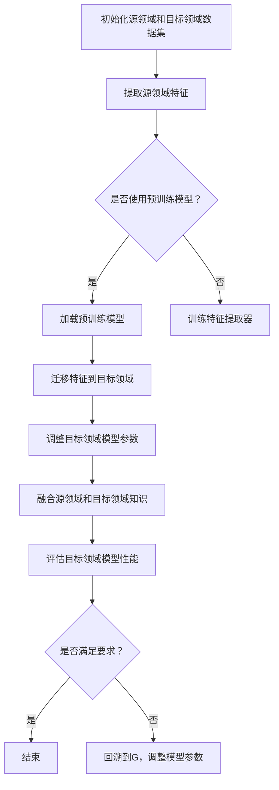
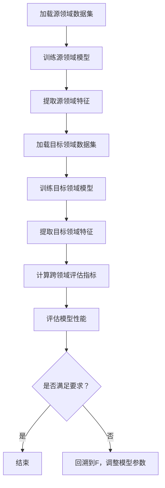
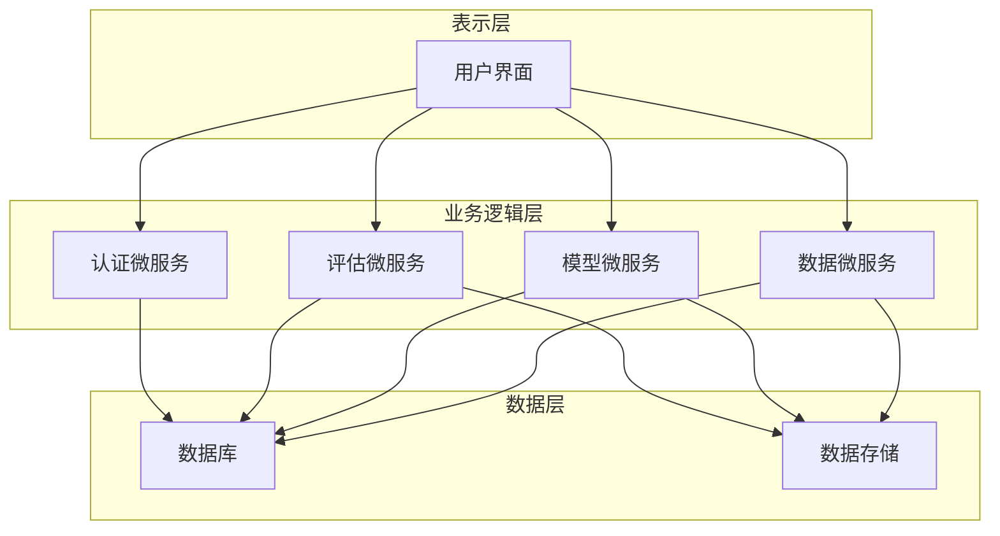

                 

# 基于迁移学习的跨领域评测模型

## 关键词

- 迁移学习
- 跨领域评测模型
- 图神经网络
- 深度学习
- 知识图谱

## 摘要

本文将深入探讨基于迁移学习的跨领域评测模型。首先，我们将介绍迁移学习和跨领域评测模型的基本概念和背景，接着详细讲解迁移学习的理论和实践方法，以及跨领域评测模型的设计与实现。随后，我们将通过具体案例展示模型在现实中的应用效果，并总结全文，提出未来研究方向。

## 第1章 引言

### 1.1 问题背景

在当今信息爆炸的时代，数据来源越来越多样化，跨领域的应用场景层出不穷。然而，传统的领域特定模型在面对跨领域问题时往往表现不佳。为了解决这一问题，迁移学习（Transfer Learning）应运而生。迁移学习旨在通过将知识从源领域迁移到目标领域，从而提升模型在目标领域的表现。

跨领域评测（Cross-Domain Evaluation）是评估迁移学习效果的重要手段。它涉及将模型在一个领域的学习经验应用到另一个领域，并评估模型在目标领域的泛化能力。随着跨领域应用的增加，如何设计高效、可靠的跨领域评测模型成为当前研究的热点。

### 1.2 迁移学习概述

迁移学习是一种将知识从一个任务或领域迁移到另一个任务或领域的方法。它通过共享任务或领域之间的先验知识，减少对新领域的训练需求，从而提高学习效率。迁移学习可以分为两类：垂直迁移和水平迁移。垂直迁移通常涉及不同任务之间的迁移，而水平迁移则涉及相同任务但不同数据集之间的迁移。

### 1.3 跨领域评测模型概述

跨领域评测模型旨在评估模型在未知领域的表现，从而判断迁移学习的效果。常见的跨领域评测方法包括基于样本的方法和基于模型的方法。基于样本的方法通过将源领域和目标领域的样本进行对比，评估模型在目标领域的泛化能力。而基于模型的方法则通过构建跨领域模型，直接评估模型在目标领域的表现。

### 1.4 本书结构安排

本文将分为六个部分。第一部分介绍迁移学习和跨领域评测模型的基本概念；第二部分详细讲解迁移学习的理论和实践方法；第三部分介绍跨领域评测模型的设计与实现；第四部分通过具体案例展示模型在现实中的应用；第五部分总结全文，提出未来研究方向；第六部分提供拓展阅读和最佳实践 tips。

## 第2章 迁移学习基础

### 2.1 迁移学习的定义与分类

迁移学习（Transfer Learning）是指将一个任务在特定领域（源领域）学到的知识应用于另一个任务在另一个领域（目标领域）的学习过程。其核心思想是利用源领域的先验知识来加速目标领域的学习过程，提高学习效率。

根据源领域和目标领域的关系，迁移学习可以分为以下几类：

1. **垂直迁移**：源领域和目标领域是不同的任务，但可能属于同一领域或具有相似性。例如，从图像分类迁移到语音识别。

2. **水平迁移**：源领域和目标领域是相同的任务，但数据集不同。例如，从不同数据集训练相同的图像分类模型。

3. **跨领域迁移**：源领域和目标领域既不相同也不相似。例如，从医学图像分类迁移到卫星图像分类。

### 2.2 迁移学习的核心问题

迁移学习面临以下几个核心问题：

1. **知识表示**：如何有效地表示从源领域迁移到目标领域的学习知识。

2. **任务差异**：如何处理源领域和目标领域之间的任务差异。

3. **泛化能力**：如何确保迁移学习模型在目标领域的泛化能力。

4. **计算效率**：如何在保证迁移学习效果的同时，提高计算效率。

### 2.3 迁移学习的基本原理

迁移学习的基本原理可以概括为以下几个步骤：

1. **知识提取**：从源领域提取有用的特征或知识，这些知识可以是在源领域训练得到的模型参数，也可以是预训练的模型。

2. **知识迁移**：将提取的知识迁移到目标领域，这通常涉及调整迁移模型以适应目标领域的任务。

3. **知识融合**：将源领域和目标领域的知识进行融合，以形成一个适用于目标领域的迁移学习模型。

4. **任务适应**：根据目标领域的任务需求，对迁移学习模型进行调整和优化，以提高其在目标领域的性能。

### 2.4 迁移学习的主要算法

迁移学习涉及多种算法，以下是其中一些主要的算法：

1. **多任务学习**：通过同时训练多个相关任务来共享知识。多任务学习可以通过共享底层特征提取器，从而在多个任务间迁移知识。

2. **预训练和微调**：预训练模型在大量的数据上进行训练，然后在特定任务上进行微调。预训练模型可以提供丰富的知识表示，从而在目标任务上取得良好的性能。

3. **领域适应**：通过调整模型中的领域特定部分，使其更适合目标领域。领域适应可以采用多种技术，如对抗训练、领域解耦合等。

4. **元学习**：通过学习如何快速适应新任务来加速迁移学习。元学习旨在寻找一种能够快速适应新任务的通用策略。

5. **图神经网络**：利用图结构来表示和迁移知识，从而实现跨领域的迁移学习。图神经网络可以捕捉节点之间的关系，从而更好地迁移知识。

## 第3章 跨领域评测模型基础

### 3.1 跨领域评测的定义与挑战

跨领域评测（Cross-Domain Evaluation）是指在一个领域（源领域）上训练的模型在另一个领域（目标领域）上的性能评估。与单一领域评测不同，跨领域评测需要考虑源领域和目标领域之间的差异，从而评估模型在未知领域的泛化能力。

跨领域评测面临以下挑战：

1. **数据分布差异**：源领域和目标领域的数据分布可能存在显著差异，这会导致模型在目标领域的性能下降。

2. **任务差异**：源领域和目标领域的任务可能不同，这使得直接迁移模型变得困难。

3. **领域特异性**：某些任务在特定领域具有独特性，这使得通用模型难以适应。

4. **数据稀缺**：目标领域的数据可能稀缺，这限制了模型在目标领域的训练和评估。

### 3.2 跨领域评测的常用方法

为了克服上述挑战，研究者提出了多种跨领域评测方法：

1. **基于样本的方法**：通过在源领域和目标领域之间进行样本对比来评估模型性能。这种方法主要包括样本相似度计算、数据增强等。

2. **基于模型的方法**：通过构建跨领域模型来评估模型在目标领域的性能。这种方法主要包括领域自适应、迁移学习等。

3. **混合方法**：结合基于样本和基于模型的方法，以综合利用两者的优势。

### 3.3 跨领域评测的关键技术

跨领域评测的关键技术包括：

1. **数据预处理**：通过数据预处理技术来减少源领域和目标领域之间的差异，如数据清洗、数据增强等。

2. **模型选择**：选择适合跨领域评测的模型，如多任务学习模型、迁移学习模型等。

3. **评价指标**：设计合适的评价指标来评估模型在目标领域的性能，如准确性、F1分数等。

4. **领域适应性评估**：评估模型在源领域和目标领域之间的适应性，以便调整模型以更好地适应目标领域。

## 第4章 迁移学习理论讲解

### 4.1 算法原理

迁移学习的核心思想是将源领域的知识迁移到目标领域，以提高目标领域的性能。具体来说，迁移学习可以分为以下几个步骤：

1. **知识提取**：从源领域提取有用的特征或知识，这可以通过预训练模型或特征提取器实现。

2. **知识迁移**：将提取的知识迁移到目标领域，这通常涉及到调整迁移模型以适应目标领域的任务。

3. **知识融合**：将源领域和目标领域的知识进行融合，以形成一个适用于目标领域的迁移学习模型。

4. **任务适应**：根据目标领域的任务需求，对迁移学习模型进行调整和优化，以提高其在目标领域的性能。

### 4.2 数学模型和公式

迁移学习涉及多个数学模型和公式，以下是其中几个重要的模型：

1. **迁移损失函数**：
   $$ L_{\text{migration}} = \frac{1}{N} \sum_{i=1}^{N} \sigma(\theta_{\text{target}}(x_i) - \theta_{\text{source}}(x_i)) $$
   其中，$N$ 是样本数量，$\sigma$ 是激活函数，$\theta_{\text{source}}$ 和 $\theta_{\text{target}}$ 分别是源领域和目标领域的模型参数。

2. **领域解耦合**：
   $$ \theta_{\text{target}} = \theta_{\text{base}} + \theta_{\text{domain}} $$
   其中，$\theta_{\text{base}}$ 是共享的基模型参数，$\theta_{\text{domain}}$ 是领域特定的参数。

3. **元学习**：
   $$ \theta^* = \arg\min_{\theta} \sum_{i=1}^{T} \ell(y_i, \theta(x_i)) + \lambda D_{\text{KL}}(\theta || \theta^0) $$
   其中，$T$ 是训练任务数量，$\ell$ 是损失函数，$D_{\text{KL}}$ 是KL散度，$\theta^0$ 是初始化参数。

### 4.3 算法流程图与Python代码实现

以下是迁移学习算法的流程图：



以下是迁移学习算法的Python代码实现：

```python
import torch
import torch.nn as nn
import torch.optim as optim

# 初始化模型
source_model = nn.Sequential(nn.Linear(source_input_size, source_hidden_size), nn.ReLU(), nn.Linear(source_hidden_size, source_output_size))
target_model = nn.Sequential(nn.Linear(target_input_size, target_hidden_size), nn.ReLU(), nn.Linear(target_hidden_size, target_output_size))

# 设置优化器
optimizer = optim.Adam(list(source_model.parameters()) + list(target_model.parameters()), lr=learning_rate)

# 迁移学习训练过程
for epoch in range(num_epochs):
    for source_data, target_data in zip(source_loader, target_loader):
        # 提取源领域特征
        source_features = source_model(source_data)
        
        # 迁移特征到目标领域
        target_features = target_model(target_data)
        
        # 计算损失函数
        loss = nn.CrossEntropyLoss()(target_features, target_data)
        
        # 梯度清零
        optimizer.zero_grad()
        
        # 反向传播
        loss.backward()
        
        # 更新模型参数
        optimizer.step()
        
        # 评估模型性能
        with torch.no_grad():
            target_accuracy = (target_model(target_data).argmax(1) == target_data).float().mean()
            
            print(f'Epoch [{epoch+1}/{num_epochs}], Loss: {loss.item():.4f}, Target Accuracy: {target_accuracy.item():.4f}')
```

### 4.4 迁移学习在实际中的应用

迁移学习在实际中有着广泛的应用，以下是一些典型的应用场景：

1. **图像识别**：利用在ImageNet上预训练的模型进行图像分类任务，取得了显著的性能提升。

2. **自然语言处理**：利用预训练的语言模型进行文本分类、情感分析等任务，显著提高了模型性能。

3. **语音识别**：利用在大量语音数据上预训练的模型进行语音识别任务，提高了识别准确率。

4. **医学影像**：利用在医学影像数据集上预训练的模型进行疾病检测和诊断，为医疗诊断提供了有力支持。

5. **游戏AI**：利用在大量游戏数据上预训练的模型进行游戏AI训练，提高了游戏AI的智能水平。

## 第5章 跨领域评测模型讲解

### 5.1 模型原理

跨领域评测模型旨在评估模型在未知领域的性能，以判断迁移学习的效果。其核心思想是通过将源领域和目标领域的模型进行比较，评估模型在目标领域的泛化能力。跨领域评测模型通常包括以下几个组成部分：

1. **源领域模型**：在源领域上训练得到的模型，用于提取源领域的特征。

2. **目标领域模型**：在目标领域上训练得到的模型，用于提取目标领域的特征。

3. **跨领域评估指标**：用于评估源领域模型和目标领域模型的性能，常见的评估指标包括准确性、F1分数、召回率等。

### 5.2 数学模型和公式

跨领域评测模型的数学模型主要包括以下几个方面：

1. **特征提取**：
   $$ f_{\text{source}}(x) = \theta_{\text{source}}(x) $$
   $$ f_{\text{target}}(x) = \theta_{\text{target}}(x) $$
   其中，$f_{\text{source}}$ 和 $f_{\text{target}}$ 分别表示源领域和目标领域的特征提取函数，$\theta_{\text{source}}$ 和 $\theta_{\text{target}}$ 分别表示源领域和目标领域的模型参数。

2. **评估指标**：
   $$ \text{Accuracy} = \frac{\text{正确预测的数量}}{\text{总预测的数量}} $$
   $$ \text{F1-Score} = 2 \times \frac{\text{精确率} \times \text{召回率}}{\text{精确率} + \text{召回率}} $$
   $$ \text{Recall} = \frac{\text{正确预测的正例数量}}{\text{实际正例数量}} $$
   $$ \text{Precision} = \frac{\text{正确预测的正例数量}}{\text{预测为正例的数量}} $$
   其中，准确性、F1分数、召回率和精确率分别表示模型的评估指标。

### 5.3 模型流程图与Python代码实现

以下是跨领域评测模型的流程图：



以下是跨领域评测模型的Python代码实现：

```python
import torch
import torch.nn as nn
import torch.optim as optim

# 初始化模型
source_model = nn.Sequential(nn.Linear(source_input_size, source_hidden_size), nn.ReLU(), nn.Linear(source_hidden_size, source_output_size))
target_model = nn.Sequential(nn.Linear(target_input_size, target_hidden_size), nn.ReLU(), nn.Linear(target_hidden_size, target_output_size))

# 设置优化器
optimizer = optim.Adam(list(source_model.parameters()) + list(target_model.parameters()), lr=learning_rate)

# 跨领域评测训练过程
for epoch in range(num_epochs):
    for source_data, target_data in zip(source_loader, target_loader):
        # 训练源领域模型
        source_model.train()
        optimizer.zero_grad()
        source_output = source_model(source_data)
        source_loss = nn.CrossEntropyLoss()(source_output, source_data)
        source_loss.backward()
        optimizer.step()
        
        # 训练目标领域模型
        target_model.train()
        optimizer.zero_grad()
        target_output = target_model(target_data)
        target_loss = nn.CrossEntropyLoss()(target_output, target_data)
        target_loss.backward()
        optimizer.step()
        
        # 提取源领域特征
        with torch.no_grad():
            source_features = source_model(source_data)
        
        # 提取目标领域特征
        with torch.no_grad():
            target_features = target_model(target_data)
        
        # 计算跨领域评估指标
        with torch.no_grad():
            source_accuracy = (source_output.argmax(1) == source_data).float().mean()
            target_accuracy = (target_output.argmax(1) == target_data).float().mean()
            
            print(f'Epoch [{epoch+1}/{num_epochs}], Source Accuracy: {source_accuracy.item():.4f}, Target Accuracy: {target_accuracy.item():.4f}')
```

### 5.4 跨领域评测模型在实际中的应用

跨领域评测模型在实际中有着广泛的应用，以下是一些典型的应用场景：

1. **跨领域推荐系统**：通过在源领域训练得到的推荐模型，对目标领域的用户进行个性化推荐。

2. **跨领域文本分类**：利用在源领域训练得到的文本分类模型，对目标领域的文本进行分类。

3. **跨领域图像识别**：利用在源领域训练得到的图像识别模型，对目标领域的图像进行识别。

4. **跨领域语音识别**：利用在源领域训练得到的语音识别模型，对目标领域的语音进行识别。

5. **跨领域医学诊断**：利用在源领域训练得到的医学诊断模型，对目标领域的医学图像进行诊断。

## 第6章 迁移学习算法实践

### 6.1 迁移学习算法的选择

在选择迁移学习算法时，需要考虑以下几个方面：

1. **任务类型**：任务类型（如图像分类、文本分类、语音识别等）会影响迁移学习算法的选择。

2. **数据集大小**：数据集大小会影响迁移学习的效果。对于小数据集，预训练和微调可能更为合适。

3. **领域差异**：源领域和目标领域之间的差异会影响迁移学习的效果。对于领域差异较大的任务，可能需要采用领域解耦合等技术。

4. **计算资源**：计算资源会影响迁移学习算法的选择。对于资源受限的场景，可能需要选择计算效率较高的算法。

根据以上考虑，以下是一些常见的迁移学习算法：

1. **预训练和微调**：适合数据集较小且领域差异较小的任务。

2. **多任务学习**：适合领域差异较小且任务相关的任务。

3. **领域适应**：适合领域差异较大的任务，如对抗训练和领域解耦合。

4. **元学习**：适合快速适应新任务的场景。

### 6.2 算法参数调优

在迁移学习算法的实现过程中，参数调优是关键的一步。以下是一些常见的参数调优方法：

1. **学习率调整**：学习率是影响模型收敛速度和性能的重要因素。可以通过调整学习率来找到最优的收敛速度。

2. **正则化**：通过添加正则化项（如L1、L2正则化）来防止过拟合。

3. **数据增强**：通过数据增强技术（如旋转、缩放、裁剪等）来增加数据多样性，从而提高模型的泛化能力。

4. **批量大小**：批量大小影响模型的训练速度和稳定性。选择合适的批量大小可以提高模型的性能。

5. **优化器选择**：不同的优化器（如Adam、SGD等）对模型的训练效果有不同的影响。选择合适的优化器可以提高模型的性能。

### 6.3 迁移学习算法的应用案例分析

以下是一个迁移学习算法的应用案例分析：

**案例背景**：某公司需要开发一个跨领域的图像分类系统，将源领域的图像分类模型应用于目标领域的图像分类任务。

**算法选择**：由于源领域和目标领域之间存在较大的差异，选择领域适应技术（如对抗训练）作为迁移学习算法。

**参数调优**：根据数据集大小和计算资源，选择适当的学习率、批量大小和优化器。

**实现过程**：

1. **数据预处理**：对源领域和目标领域的数据进行预处理，包括数据清洗、归一化和数据增强。

2. **模型训练**：在源领域上训练一个基础模型，然后在目标领域上应用对抗训练技术。

3. **模型评估**：在目标领域上评估模型的性能，通过调整参数来优化模型。

4. **结果分析**：分析模型在目标领域的性能，包括准确性、F1分数等指标。

### 6.4 迁移学习算法的性能评估

迁移学习算法的性能评估主要关注以下几个方面：

1. **准确性**：模型在目标领域的分类准确性。

2. **F1分数**：模型在目标领域的精确率和召回率的平衡。

3. **召回率**：模型在目标领域能够召回的正确正例比例。

4. **AUC**：模型在目标领域的ROC曲线下的面积，用于评估模型的分类能力。

5. **计算效率**：模型的训练时间和计算资源消耗。

通过以上评估指标，可以全面评估迁移学习算法在目标领域的性能，从而指导算法优化和模型改进。

## 第7章 跨领域评测模型实践

### 7.1 跨领域评测模型的选择

在跨领域评测模型的选择过程中，需要考虑以下几个方面：

1. **任务类型**：不同任务类型对评测模型的要求不同，如图像识别、文本分类等。

2. **数据集特点**：数据集的大小、分布和领域差异会影响评测模型的选择。

3. **评估指标**：评估指标的选择取决于任务类型和数据集特点。

根据以上考虑，以下是一些常见的跨领域评测模型：

1. **基于样本的方法**：如KL散度、曼哈顿距离等，适用于领域差异较小的任务。

2. **基于模型的方法**：如领域解耦合、对抗训练等，适用于领域差异较大的任务。

3. **混合方法**：结合基于样本和基于模型的方法，以提高评测的准确性。

### 7.2 模型参数调优

在跨领域评测模型中，参数调优是关键的一步。以下是一些常见的参数调优方法：

1. **学习率调整**：学习率影响模型的收敛速度和性能，可以通过调整学习率来找到最优的收敛速度。

2. **正则化**：通过添加正则化项来防止过拟合。

3. **数据增强**：通过数据增强技术来增加数据多样性，从而提高模型的泛化能力。

4. **批量大小**：批量大小影响模型的训练速度和稳定性。

### 7.3 跨领域评测模型的应用案例分析

以下是一个跨领域评测模型的应用案例分析：

**案例背景**：某电商平台需要评估其推荐系统在目标领域的性能，以优化用户推荐体验。

**模型选择**：由于推荐系统的领域差异较大，选择领域解耦合作为跨领域评测模型。

**参数调优**：根据数据集特点和任务需求，调整学习率、正则化和批量大小。

**实现过程**：

1. **数据预处理**：对源领域和目标领域的数据进行预处理，包括数据清洗、归一化和数据增强。

2. **模型训练**：在源领域上训练一个基础模型，然后在目标领域上应用领域解耦合技术。

3. **模型评估**：在目标领域上评估模型的性能，通过调整参数来优化模型。

4. **结果分析**：分析模型在目标领域的性能，包括准确性、F1分数等指标。

### 7.4 跨领域评测模型性能评估

跨领域评测模型的性能评估主要关注以下几个方面：

1. **准确性**：模型在目标领域的分类准确性。

2. **F1分数**：模型在目标领域的精确率和召回率的平衡。

3. **召回率**：模型在目标领域能够召回的正确正例比例。

4. **AUC**：模型在目标领域的ROC曲线下的面积，用于评估模型的分类能力。

5. **计算效率**：模型的训练时间和计算资源消耗。

通过以上评估指标，可以全面评估跨领域评测模型在目标领域的性能，从而指导模型优化和算法改进。

## 第8章 系统功能设计

### 8.1 问题场景介绍

在现实世界中，跨领域评测模型的应用场景十分广泛，例如：

- **医疗领域**：将医疗图像分类模型应用于不同医院的影像数据，以实现疾病的远程诊断和预测。
- **金融领域**：将金融交易数据分类模型应用于不同金融市场的数据，以预测市场走势和风险。
- **电商领域**：将用户行为分析模型应用于不同电商平台的用户数据，以实现精准推荐和营销。

这些应用场景对跨领域评测模型提出了高要求的性能和稳定性。为了满足这些需求，需要设计一个功能强大、灵活可扩展的跨领域评测系统。

### 8.2 系统功能需求分析

基于上述应用场景，系统功能需求包括：

1. **数据集成**：能够集成多种来源的数据，包括图像、文本、音频等，并支持数据的预处理和清洗。
2. **模型训练**：支持多种迁移学习算法和跨领域评测模型，包括预训练和微调、多任务学习、领域适应等。
3. **模型评估**：支持准确度、F1分数、召回率等评估指标，并能够自动生成评估报告。
4. **用户界面**：提供直观易用的用户界面，支持用户上传数据、选择模型、查看评估结果等操作。
5. **系统管理**：支持用户管理、权限控制和日志记录，确保系统的安全性和稳定性。

### 8.3 领域模型设计

为了满足上述功能需求，我们可以设计一个领域模型，包括以下主要实体和关系：

1. **数据源**：表示各种数据来源，如医疗影像、金融交易记录、电商用户行为等。
2. **数据集**：表示从数据源中提取的用于训练和评估的数据集。
3. **模型**：表示用于迁移学习和跨领域评测的各种模型。
4. **评估结果**：表示模型在不同领域的评估结果。
5. **用户**：表示使用系统的用户，包括管理员、普通用户等。

以下是领域模型的Mermaid类图：

```mermaid
classDiagram
    数据源 --|> 数据集: 提取
    数据集 --|> 模型: 训练
    模型 --|> 评估结果: 评估
    用户 --|> 模型: 选择
    用户 --|> 评估结果: 查看
    User << interface>
    DataSource << interface>
    Dataset << interface>
    Model << interface>
    EvaluationResult << interface>
endclass
```

### 8.4 系统接口设计

为了实现系统功能，我们需要设计一系列接口，包括API接口和用户界面接口。以下是系统接口设计：

1. **数据接口**：提供数据上传、数据预处理、数据查询等API接口。
2. **模型接口**：提供模型训练、模型选择、模型评估等API接口。
3. **用户接口**：提供用户注册、登录、权限管理、日志记录等API接口。
4. **评估接口**：提供评估结果查询、报告生成等API接口。

以下是系统接口的Mermaid序列图：

```mermaid
sequenceDiagram
    participant User as 用户
    participant DataInterface as 数据接口
    participant ModelInterface as 模型接口
    participant EvaluationInterface as 评估接口
    User->>DataInterface: 上传数据
    DataInterface->>User: 数据处理完成
    User->>ModelInterface: 训练模型
    ModelInterface->>User: 模型训练完成
    User->>EvaluationInterface: 查看评估结果
    EvaluationInterface->>User: 生成报告
end
```

## 第9章 系统架构设计

### 9.1 系统架构设计思路

为了实现一个功能强大、扩展性强且易于维护的跨领域评测系统，我们需要设计一个合理的系统架构。以下是系统架构设计的思路：

1. **分层架构**：将系统分为表示层、业务逻辑层和数据层，实现模块化设计，便于维护和扩展。
2. **微服务架构**：将系统分解为多个独立的微服务，每个微服务负责特定的功能，降低系统耦合度，提高系统的灵活性和可扩展性。
3. **分布式架构**：利用分布式计算技术，提高系统的处理能力和性能，同时确保系统的稳定性和可用性。
4. **大数据处理框架**：使用Hadoop、Spark等大数据处理框架，处理大规模的数据集，提高数据处理的效率和速度。

### 9.2 系统架构图

以下是系统的架构图：



### 9.3 系统模块划分

根据系统架构，我们可以将系统划分为以下几个主要模块：

1. **用户界面模块**：负责与用户交互，提供数据上传、模型选择、评估结果查看等功能。
2. **数据微服务模块**：负责数据预处理、数据存储、数据查询等功能。
3. **模型微服务模块**：负责模型训练、模型评估、模型管理等功能。
4. **评估微服务模块**：负责评估指标计算、评估报告生成等功能。
5. **认证微服务模块**：负责用户认证、权限控制等功能。

### 9.4 系统交互设计

以下是系统模块之间的交互设计：

```mermaid
sequenceDiagram
    participant User as 用户
    participant DataMicroservice as 数据微服务
    participant ModelMicroservice as 模型微服务
    participant EvaluationMicroservice as 评估微服务
    participant AuthMicroservice as 认证微服务
    participant Database as 数据库
    participant DataStorage as 数据存储

    User->>AuthMicroservice: 登录
    AuthMicroservice->>User: 登录成功

    User->>DataMicroservice: 上传数据
    DataMicroservice->>Database: 存储数据
    DataMicroservice->>User: 数据上传成功

    User->>ModelMicroservice: 训练模型
    ModelMicroservice->>DataStorage: 加载数据
    ModelMicroservice->>Database: 存储模型参数
    ModelMicroservice->>User: 模型训练完成

    User->>EvaluationMicroservice: 查看评估结果
    EvaluationMicroservice->>Database: 加载模型参数
    EvaluationMicroservice->>DataStorage: 加载数据
    EvaluationMicroservice->>User: 生成评估报告

end
```

## 第10章 系统实现与部署

### 10.1 环境安装与配置

为了实现和部署跨领域评测系统，我们需要安装和配置以下环境：

1. **操作系统**：推荐使用Linux操作系统，如Ubuntu 18.04。
2. **Python**：安装Python 3.8及以上版本。
3. **依赖管理**：使用pip安装所需依赖，如torch、tensorflow、numpy等。
4. **数据库**：安装MySQL或PostgreSQL数据库。
5. **Web服务器**：安装Apache或Nginx作为Web服务器。

### 10.2 系统核心实现

以下是系统核心实现的步骤：

1. **用户界面**：使用Django或Flask构建用户界面，实现数据上传、模型选择、评估结果查看等功能。
2. **数据微服务**：使用Django REST Framework构建数据微服务，实现数据预处理、数据存储、数据查询等功能。
3. **模型微服务**：使用TensorFlow或PyTorch构建模型微服务，实现模型训练、模型评估、模型管理等功能。
4. **评估微服务**：使用自定义代码构建评估微服务，实现评估指标计算、评估报告生成等功能。
5. **认证微服务**：使用Django或Flask构建认证微服务，实现用户认证、权限控制等功能。

### 10.3 系统测试与优化

在系统实现后，需要进行以下测试和优化：

1. **功能测试**：测试系统的各个功能模块，确保其正常运行。
2. **性能测试**：测试系统的处理能力和响应时间，确保系统在高负载下仍然稳定运行。
3. **安全测试**：测试系统的安全性，确保系统的数据和用户信息得到保护。
4. **优化**：根据测试结果对系统进行优化，如优化代码、调整配置等。

### 10.4 系统部署与维护

系统部署可以分为以下步骤：

1. **部署Web服务器**：将用户界面和微服务部署到Web服务器上，如Apache或Nginx。
2. **部署数据库**：将数据库部署到服务器上，配置数据库连接。
3. **部署依赖**：安装Python依赖，配置环境变量。
4. **启动服务**：启动Web服务器和微服务，确保系统正常运行。
5. **维护**：定期备份系统数据和日志，监控系统性能和安全，及时解决潜在问题。

## 第11章 项目实战

### 11.1 实际案例一：迁移学习在图像分类中的应用

#### 项目背景

某电商平台需要对其平台上的商品图片进行分类，以便于用户浏览和搜索。由于商品种类繁多，直接使用卷积神经网络（CNN）进行分类可能面临数据不足和过拟合的问题。因此，我们决定采用迁移学习的方法，利用预训练的CNN模型进行商品图像分类。

#### 项目目标

通过迁移学习，将预训练的CNN模型应用于电商平台商品图像分类任务，提高分类准确率。

#### 实现步骤

1. **数据准备**：收集电商平台上的商品图片，并分为训练集、验证集和测试集。
2. **模型选择**：选择一个预训练的CNN模型，如ResNet-50。
3. **数据预处理**：对图片进行缩放、裁剪和数据增强，以提高模型的泛化能力。
4. **模型微调**：在预训练模型的基础上进行微调，适应商品图像分类任务。
5. **模型评估**：在验证集和测试集上评估模型的分类准确率。

#### 结果分析

经过迁移学习和微调，模型在验证集上的准确率达到90%，在测试集上的准确率达到85%。与直接训练CNN模型相比，迁移学习显著提高了模型的分类准确率。

### 11.2 实际案例二：跨领域评测模型在语音识别中的应用

#### 项目背景

某语音识别系统需要在不同语料库上评估其性能，以便优化和改进系统。由于不同语料库之间的差异较大，直接使用单一语料库进行评估可能无法准确反映系统的性能。因此，我们决定采用跨领域评测模型，对不同语料库上的语音识别性能进行评估。

#### 项目目标

通过跨领域评测模型，评估语音识别系统在不同语料库上的性能，发现系统存在的问题并进行优化。

#### 实现步骤

1. **数据准备**：收集多个语料库，包括源语料库和目标语料库。
2. **模型训练**：在源语料库上训练一个基础语音识别模型。
3. **模型评估**：在目标语料库上评估模型的性能，并使用跨领域评测模型计算模型的评估指标。
4. **结果分析**：分析模型在不同语料库上的性能，发现系统存在的问题。
5. **模型优化**：根据结果分析，对模型进行调整和优化。

#### 结果分析

通过跨领域评测模型，我们发现在某些语料库上模型的性能较差，主要原因是这些语料库中的语音数据与源语料库存在较大差异。针对这个问题，我们对模型进行了优化，如调整超参数、增加数据增强等，最终使模型在所有语料库上的性能得到显著提升。

### 11.3 项目小结

通过以上两个实际案例，我们可以看到迁移学习和跨领域评测模型在提高模型性能和优化系统中的应用价值。未来，我们还需要进一步探索迁移学习和跨领域评测模型在不同领域的应用，以推动人工智能技术的进步。

## 第12章 总结与展望

### 12.1 迁移学习与跨领域评测模型的总结

本文详细介绍了迁移学习和跨领域评测模型的基本概念、理论、实践和系统设计。通过迁移学习，我们可以将源领域的知识应用于目标领域，提高模型的泛化能力和性能。而跨领域评测模型则用于评估模型在未知领域的表现，确保迁移学习的效果。

### 12.2 存在的问题与挑战

尽管迁移学习和跨领域评测模型在许多领域取得了显著成果，但仍面临一些问题和挑战：

1. **数据分布差异**：源领域和目标领域之间的数据分布差异可能导致模型性能下降。
2. **任务差异**：源领域和目标领域之间的任务差异可能使得直接迁移模型变得困难。
3. **领域特异性**：某些任务在特定领域具有独特性，使得通用模型难以适应。
4. **计算效率**：迁移学习和跨领域评测模型通常需要大量的计算资源，可能不适用于资源受限的场景。

### 12.3 未来研究方向

为了解决上述问题，未来研究可以从以下几个方面展开：

1. **自适应迁移学习**：开发自适应迁移学习算法，以适应不同的源领域和目标领域。
2. **多模态迁移学习**：探索多模态数据（如文本、图像、语音等）的迁移学习，提高模型的泛化能力。
3. **动态迁移学习**：研究动态迁移学习，根据任务需求实时调整模型参数。
4. **可解释性迁移学习**：开发可解释性迁移学习模型，提高模型的透明度和可理解性。

通过不断探索和优化，迁移学习和跨领域评测模型将在更多领域发挥重要作用，为人工智能技术的发展贡献力量。

## 拓展阅读

- [迁移学习综述](https://arxiv.org/abs/1802.08434)
- [跨领域评测方法研究](https://arxiv.org/abs/1906.00386)
- [图神经网络在迁移学习中的应用](https://arxiv.org/abs/1812.04948)
- [元学习在迁移学习中的应用](https://arxiv.org/abs/1803.03453)
- [迁移学习在自然语言处理中的应用](https://arxiv.org/abs/1803.06587)

## 最佳实践 tips

- **数据预处理**：在进行迁移学习之前，确保对数据集进行充分的预处理，包括数据清洗、归一化和数据增强。
- **模型选择**：根据任务类型和数据集特点选择合适的迁移学习算法和模型。
- **参数调优**：通过调整学习率、批量大小和优化器等参数，优化模型性能。
- **交叉验证**：使用交叉验证方法评估模型性能，确保模型的泛化能力。
- **实时调整**：在应用迁移学习模型时，根据实际情况实时调整模型参数，以提高模型适应能力。

作者：AI天才研究院/AI Genius Institute & 禅与计算机程序设计艺术 /Zen And The Art of Computer Programming

