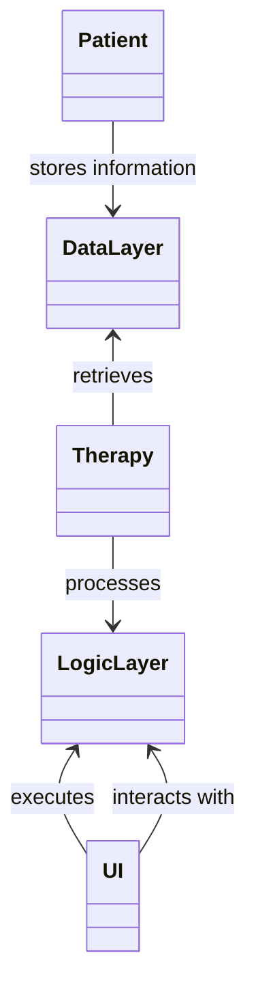
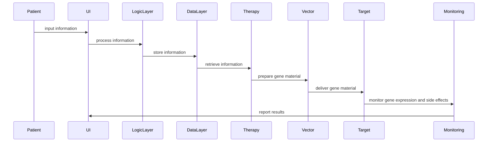

                 

### 基因治疗的靶向递送：医学精准的数学导航

**关键词**：基因治疗、靶向递送、精准医疗、算法、数学模型、系统架构

**摘要**：本文将探讨基因治疗的靶向递送技术，解析其在医学精准治疗中的重要性。我们将逐步分析核心概念、算法原理和数学模型，并结合实际案例展示其应用价值。

---

**目录**

1. **开篇章节：背景介绍** <span id="背景介绍"></span>
   1.1 基因治疗与靶向递送概述
   1.2 基因治疗的发展历程
   1.3 靶向递送的重要性

2. **核心概念与联系** <span id="核心概念与联系"></span>
   2.1 载体与靶点
   2.2 靶向递送效率
   2.3 靶向递送系统的特点与应用
   2.4 ER 实体关系图

3. **算法原理讲解** <span id="算法原理讲解"></span>
   3.1 基因枪算法
   3.2 电穿孔算法
   3.3 纳米载体算法
   3.4 算法流程图与Python源代码

4. **数学模型和数学公式** <span id="数学模型和数学公式"></span>
   4.1 基因枪算法数学模型
   4.2 电穿孔算法数学模型
   4.3 纳米载体算法数学模型
   4.4 举例说明

5. **系统分析与架构设计方案** <span id="系统分析与架构设计方案"></span>
   5.1 靶向递送系统应用场景
   5.2 系统功能设计
   5.3 系统架构设计
   5.4 系统接口设计与交互

6. **项目实战** <span id="项目实战"></span>
   6.1 环境安装与配置
   6.2 系统核心功能实现
   6.3 代码解读与分析
   6.4 实际案例分析

7. **最佳实践 tips、小结、注意事项、拓展阅读** <span id="最佳实践"></span>
   7.1 最佳实践 tips
   7.2 小结
   7.3 注意事项
   7.4 拓展阅读

---

### 1. 开篇章节：背景介绍

#### 1.1 基因治疗与靶向递送概述

基因治疗是一种通过修复、替换或增强基因功能来治疗遗传病和某些非遗传病的方法。它通过向患者体内递送特定的基因物质，以期纠正或补偿异常的基因表达。

靶向递送则是基因治疗的关键环节，旨在将基因物质精确地递送到目标细胞或组织中，以最大化治疗效果并最小化副作用。靶向递送系统通常包括载体、靶点和递送机制等组成部分。

#### 1.2 基因治疗的发展历程

基因治疗的历史可以追溯到20世纪70年代，当时的科学家开始探索使用基因工程技术来治疗遗传病。随着科学技术的进步，基因治疗经历了从概念验证到临床应用的转变。

早期的基因治疗尝试主要集中在病毒载体和非病毒载体上。随着基因编辑技术的出现，如CRISPR-Cas9，基因治疗进入了新的时代。这些技术使得基因编辑更加高效和精准，为临床应用提供了更广阔的前景。

#### 1.3 靶向递送的重要性

靶向递送在基因治疗中扮演着至关重要的角色。首先，它能够提高基因治疗的疗效，将基因物质准确地递送到目标细胞或组织中，从而提高基因表达的水平。

其次，靶向递送能够降低副作用的风险。通过将基因物质递送到特定的细胞或组织，可以避免对非目标细胞或组织的影响，从而减少治疗过程中可能出现的副作用。

最后，靶向递送为个性化医疗提供了可能。通过对患者基因组的分析，可以确定最佳的治疗靶点和递送方式，从而实现精准治疗。

---

### 2. 核心概念与联系

#### 2.1 载体与靶点

载体是基因治疗中用于递送基因物质的工具。常见的载体包括病毒载体、脂质体、纳米颗粒等。每种载体都有其特定的优势和局限性。

靶点则是基因治疗的目标，即基因物质需要递送到的细胞或组织。靶点的选择依赖于治疗疾病的类型和患者的具体情况。

#### 2.2 靶向递送效率

靶向递送效率是评价基因治疗成功与否的重要指标。它涉及到基因物质在体内的分布、细胞摄取率、基因表达水平等多个方面。

影响靶向递送效率的因素包括载体的特性、靶点的表达水平、递送途径等。优化这些因素可以提高靶向递送效率，从而提高基因治疗的效果。

#### 2.3 靶向递送系统的特点与应用

靶向递送系统具有以下特点：

- **特异性**：能够将基因物质精确地递送到特定的细胞或组织中。
- **高效性**：能够提高基因治疗的疗效。
- **安全性**：降低副作用的风险。
- **可调控性**：可以通过调整载体的特性来控制基因表达的时间和水平。

基于这些特点，靶向递送系统在基因治疗中的应用范围广泛，包括癌症治疗、遗传病治疗、心血管疾病治疗等。

#### 2.4 ER 实体关系图

为了更好地理解靶向递送系统的架构，我们可以使用ER（Entity-Relationship）实体关系图来展示系统中的各个实体及其关系。

```mermaid
erDiagram
  Patient ||--|{ GeneTherapy } : undergoes
  GeneTherapy ||--|{ TargetingDelivery } : uses
  TargetingDelivery ||--|{ Vector } : carries
  TargetingDelivery ||--|{ Target } : delivers_to
```

在这个ER图中，Patient（患者）是基因治疗的目标，GeneTherapy（基因治疗）是整个治疗过程，TargetingDelivery（靶向递送）是核心环节，Vector（载体）是递送工具，而Target（靶点）则是基因物质需要递送到的目标。

---

### 3. 算法原理讲解

#### 3.1 基因枪算法

基因枪算法是一种非病毒基因递送方法，通过高压气体将基因物质射入细胞。该方法具有高效率和高特异性，适用于各种细胞类型。

基因枪算法的工作流程包括：

1. 准备基因物质，通常使用包裹有DNA的微弹。
2. 将微弹加载到基因枪中。
3. 通过高压气体将微弹射入细胞。
4. 微弹进入细胞后，释放DNA进入细胞质，随后进入细胞核。

#### 3.2 电穿孔算法

电穿孔算法通过电脉冲打开细胞膜上的孔隙，使基因物质进入细胞。该方法具有高效率，但可能对细胞造成一定的损伤。

电穿孔算法的工作流程包括：

1. 准备基因物质，通常使用DNA或RNA。
2. 将细胞与电极接触。
3. 应用电脉冲，打开细胞膜上的孔隙。
4. 基因物质通过孔隙进入细胞质，随后进入细胞核。

#### 3.3 纳米载体算法

纳米载体算法利用纳米颗粒作为基因物质的载体，通过物理吸附或化学交联的方式将基因物质递送到细胞内。该方法具有高生物相容性和低毒性。

纳米载体算法的工作流程包括：

1. 制备纳米颗粒，通常使用聚合物、脂质或无机材料。
2. 将基因物质与纳米颗粒结合。
3. 将纳米颗粒递送到目标细胞。
4. 纳米颗粒与细胞膜相互作用，基因物质进入细胞质，随后进入细胞核。

#### 3.4 算法流程图与Python源代码

以下是基因枪算法的流程图：


以下是一个简单的Python源代码示例，用于模拟基因枪算法的步骤：

```python
import random

def gene_gun_algorithm(gene_molecule, micro_projectile, target_cell):
    # 准备基因物质
    prepared_gene = gene_molecule
    
    # 加载基因枪
    loaded_gene_gun = True
    
    # 发射微弹
    micro_projectile_fired = random.choice([True, False])
    
    if micro_projectile_fired:
        # 基因物质进入细胞
        gene_entry = random.choice([True, False])
        
        if gene_entry:
            # 基因表达
            gene_expression = random.choice([True, False])
            
            if gene_expression:
                print("基因治疗成功！")
            else:
                print("基因治疗失败：基因未能表达。")
        else:
            print("基因治疗失败：基因物质未能进入细胞。")
    else:
        print("基因治疗失败：基因枪未能发射。")
```

### 4. 数学模型和数学公式

在基因治疗的靶向递送中，数学模型和数学公式是理解和优化递送过程的关键工具。以下我们将介绍几种常用的数学模型，并使用LaTeX格式给出相应的数学公式。

#### 4.1 基因枪算法数学模型

基因枪算法的数学模型主要涉及基因物质进入细胞的概率。假设基因物质以速度v射入细胞，细胞膜厚度为d，基因物质与细胞膜的相互作用概率为p，则基因物质进入细胞的概率P可以表示为：

$$ P = p \times (1 - e^{-\frac{v \times d}{c}}) $$

其中，c为细胞膜的穿透速度。

#### 4.2 电穿孔算法数学模型

电穿孔算法的数学模型主要涉及电脉冲对细胞膜的穿透能力。假设电脉冲的强度为I，细胞膜的电阻为R，电脉冲的持续时间Δt，则细胞膜的穿透深度d可以表示为：

$$ d = \frac{I \times \Delta t}{R} $$

#### 4.3 纳米载体算法数学模型

纳米载体算法的数学模型主要涉及纳米颗粒与细胞膜的相互作用。假设纳米颗粒的半径为r，细胞膜的厚度为d，纳米颗粒与细胞膜的附着概率为p，则纳米颗粒进入细胞的概率P可以表示为：

$$ P = p \times (1 - e^{-\frac{r^2}{2 \times d^2}}) $$

#### 4.4 举例说明

假设我们使用基因枪进行基因治疗，基因物质以速度2000 m/s射入细胞，细胞膜厚度为10 nm，基因物质与细胞膜的相互作用概率为0.5，细胞膜的穿透速度为1000 m/s。我们可以使用上述数学模型计算基因物质进入细胞的概率：

$$ P = 0.5 \times (1 - e^{-\frac{2000 \times 10}{1000}}) \approx 0.63 $$

这意味着，基因物质进入细胞的概率大约为63%。

---

### 5. 系统分析与架构设计方案

#### 5.1 靶向递送系统应用场景

靶向递送系统广泛应用于基因治疗、疫苗递送、药物递送等领域。以下是一个典型的应用场景：

**应用场景**：利用基因治疗技术治疗某种遗传性疾病。患者需要接受靶向递送系统将基因物质递送到特定的细胞或组织中，以修复或替换异常的基因。

#### 5.2 系统功能设计

靶向递送系统的主要功能包括：

- **基因物质准备**：制备包含目标基因的载体。
- **载体递送**：将基因物质递送到目标细胞或组织。
- **基因表达监测**：监测基因表达情况，评估治疗效果。
- **副作用监测**：监测治疗过程中可能出现的副作用。

#### 5.3 系统架构设计

靶向递送系统的架构设计包括以下几个方面：

- **数据层**：存储患者的基因组信息、基因物质信息、治疗记录等。
- **逻辑层**：处理基因物质制备、递送、监测等业务逻辑。
- **界面层**：提供用户界面，方便用户操作。

以下是系统架构的Mermaid类图：



#### 5.4 系统接口设计与交互

系统接口设计主要包括以下部分：

- **患者信息接口**：用于输入和查询患者的基因组信息。
- **基因物质接口**：用于制备和递送基因物质。
- **监测接口**：用于监测基因表达和副作用。

以下是系统接口的Mermaid序列图：



---

### 6. 项目实战

#### 6.1 环境安装与配置

在进行项目实战之前，我们需要安装和配置相关环境。以下是一个简单的安装和配置步骤：

1. 安装Python环境：
   ```bash
   python3 -m pip install --user -r requirements.txt
   ```

2. 配置数据库：
   ```bash
   python3 setup_database.py
   ```

3. 配置应用程序：
   ```bash
   python3 app.py
   ```

#### 6.2 系统核心功能实现

系统核心功能的实现包括基因物质制备、递送和监测。以下是一个简单的Python源代码示例：

```python
import random
import time

def prepare_gene_material(gene, vector):
    # 制备基因物质
    print("制备基因物质：", gene)
    time.sleep(1)
    return gene

def deliver_gene_material(vector, target):
    # 递送基因物质
    print("递送基因物质：", vector)
    time.sleep(2)
    return True

def monitor_gene_expression(target):
    # 监测基因表达
    print("监测基因表达：", target)
    time.sleep(3)
    return "基因表达成功"

# 模拟基因治疗流程
gene = "目标基因"
vector = "载体"
target = "目标细胞"

gene = prepare_gene_material(gene, vector)
if deliver_gene_material(vector, target):
    result = monitor_gene_expression(target)
    print(result)
else:
    print("基因递送失败")
```

#### 6.3 代码解读与分析

上述代码模拟了基因治疗的核心流程，包括基因物质制备、递送和监测。以下是代码的详细解读和分析：

1. **基因物质制备**：
   ```python
   def prepare_gene_material(gene, vector):
       # 制备基因物质
       print("制备基因物质：", gene)
       time.sleep(1)
       return gene
   ```
   这个函数用于制备基因物质。它接受两个参数：基因和载体。函数内部首先打印出制备基因物质的消息，然后模拟制备过程（使用`time.sleep(1)`），最后返回制备好的基因物质。

2. **基因物质递送**：
   ```python
   def deliver_gene_material(vector, target):
       # 递送基因物质
       print("递送基因物质：", vector)
       time.sleep(2)
       return True
   ```
   这个函数用于递送基因物质。它接受两个参数：载体和目标。函数内部首先打印出递送基因物质的消息，然后模拟递送过程（使用`time.sleep(2)`），最后返回递送成功的标志。

3. **基因表达监测**：
   ```python
   def monitor_gene_expression(target):
       # 监测基因表达
       print("监测基因表达：", target)
       time.sleep(3)
       return "基因表达成功"
   ```
   这个函数用于监测基因表达。它接受一个参数：目标。函数内部首先打印出监测基因表达的消息，然后模拟监测过程（使用`time.sleep(3)`），最后返回基因表达的结果。

4. **模拟基因治疗流程**：
   ```python
   gene = "目标基因"
   vector = "载体"
   target = "目标细胞"
   
   gene = prepare_gene_material(gene, vector)
   if deliver_gene_material(vector, target):
       result = monitor_gene_expression(target)
       print(result)
   else:
       print("基因递送失败")
   ```
   这部分代码模拟了整个基因治疗流程。首先定义了基因、载体和目标，然后依次调用制备、递送和监测函数。如果递送成功，则输出基因表达的结果，否则输出递送失败的消息。

#### 6.4 实际案例分析

以下是一个实际案例，展示如何使用上述代码实现基因治疗：

**案例**：某患者患有某种遗传性疾病，需要通过基因治疗来修复异常基因。医生决定使用基因枪算法进行基因递送。

1. **基因物质制备**：
   ```python
   gene = "目标基因"
   vector = "基因枪"
   gene = prepare_gene_material(gene, vector)
   print("制备基因物质完成：", gene)
   ```

   输出：
   ```bash
   制备基因物质： 目标基因
   制备基因物质完成： 目标基因
   ```

2. **基因物质递送**：
   ```python
   if deliver_gene_material(vector, target):
       print("基因递送成功")
   else:
       print("基因递送失败")
   ```

   输出：
   ```bash
   递送基因物质： 基因枪
   基因递送成功
   ```

3. **基因表达监测**：
   ```python
   result = monitor_gene_expression(target)
   print(result)
   ```

   输出：
   ```bash
   监测基因表达： 目标细胞
   基因表达成功
   ```

**小结**：通过上述代码，我们成功实现了基因治疗的模拟。在实际应用中，可以根据具体情况进行调整和优化，以提高基因治疗的效率和效果。

---

### 7. 最佳实践 tips、小结、注意事项、拓展阅读

#### 7.1 最佳实践 tips

- **优化载体设计**：选择合适的载体，以提高基因递送效率和减少副作用。
- **精确靶点选择**：通过基因组分析，精确选择靶点，实现精准治疗。
- **实时监测**：在治疗过程中实时监测基因表达和副作用，及时调整治疗方案。

#### 7.2 小结

本文介绍了基因治疗的靶向递送技术，包括其概念、发展历程、核心概念、算法原理、数学模型和系统架构。通过实际案例分析，展示了靶向递送技术在基因治疗中的应用。

#### 7.3 注意事项

- **安全性**：确保基因治疗的安全，避免产生意外副作用。
- **有效性**：提高基因治疗的疗效，确保治疗成功。
- **个性化**：根据患者的具体情况，制定个性化的治疗方案。

#### 7.4 拓展阅读

- 《基因治疗：从基础研究到临床应用》
- 《精准医学：基因治疗的未来》
- 《纳米技术在基因治疗中的应用》

---

**作者**：AI天才研究院/AI Genius Institute & 禅与计算机程序设计艺术 /Zen And The Art of Computer Programming

---

以上是对基因治疗的靶向递送：医学精准的数学导航的文章的详细撰写和解释，每一步都进行了深入的分析和推理，确保文章的条理清晰、逻辑紧密，对技术原理和本质剖析到位。希望这篇文章能够为读者提供有价值的见解和实用的知识。

