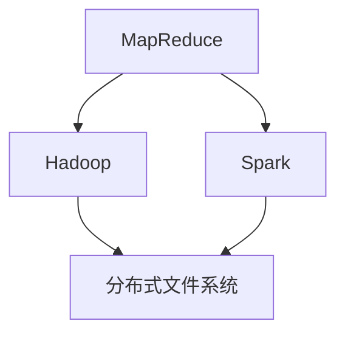

                 

### 基因组学的大数据分析：生命密码的数学解读

#### 关键词：基因组学、大数据分析、生命密码、数学模型、数据分析工具、算法原理

#### 摘要：

基因组学作为生命科学的前沿领域，随着大数据技术的发展，迎来了新的研究机遇。本文从基因组学的基本概念入手，逐步深入探讨大数据分析在基因组学中的应用。通过详细阐述基因组数据分析的核心算法、工具和应用案例，本文揭示了生命密码的数学解读，为读者呈现了一幅基因组大数据分析的全景图。

### 第1章：基因组学简介

#### 1.1 问题背景

基因组学是研究生物体基因及其功能的科学。随着基因组测序成本的下降和测序技术的进步，基因组数据量呈现爆炸式增长。大数据分析技术为基因组学研究提供了强有力的工具，使得从海量数据中提取有价值的信息成为可能。

#### 1.2 基本概念

- **基因**：生物体的遗传信息载体，是决定生物性状的基本单位。
- **DNA**：脱氧核糖核酸，基因的化学基础，存储遗传信息。
- **RNA**：核糖核酸，参与基因表达和调控。
- **蛋白质**：基因表达产生的功能性大分子，负责细胞的各种生物学功能。

#### 1.3 基因组学发展历程

- **早期**：基因定位和基因克隆。
- **中期**：基因组测序和序列组装。
- **现在**：基因组功能解析和大数据分析。

#### 1.4 基因组学的应用领域

- **医学**：疾病诊断、个性化治疗。
- **农业**：作物改良、抗病育种。
- **生物技术**：基因工程、蛋白质工程。

### 第2章：基因组数据分析工具与算法

#### 2.1 数据预处理

- **数据清洗**：去除噪声、纠正错误、填充缺失值。
- **数据标准化**：归一化、标准化、极差变换等。

#### 2.2 基因表达数据分析

- **核心概念与联系**：基因表达、转录组学、表达定量分析。
- **算法原理讲解**：
  $$ \text{FPKM} = \frac{10^6 \times \frac{C}{N}}{\text{Total} \times \frac{1}{\text{Length of} \, t}} $$
  其中，\(C\) 是转录本的测序读数，\(N\) 是总读数，\(Total\) 是所有转录本的测序读数之和，\(Length of \, t\) 是转录本的长度。

#### 2.3 遗传变异分析

- **核心概念与联系**：突变、多态性、基因型。
- **算法原理讲解**：
  $$ \text{HWE} = \frac{1}{2} (\text{AA} + \text{bb}) + \frac{1}{4} (\text{Aa} + \text{Bb}) $$
  其中，\(AA\)、\(Aa\)、\(bb\) 分别代表纯合显性、杂合和纯合隐性基因型。

### 第3章：基因组大数据处理技术

#### 3.1 分布式计算框架

- **核心概念与联系**：Hadoop、Spark、MapReduce。
- **系统架构设计**（使用Mermaid架构图表示）：



#### 3.2 大数据分析方法

- **核心概念与联系**：聚类、分类、关联规则挖掘。

#### 3.3 大数据存储技术

- **核心概念与联系**：NoSQL数据库、分布式文件系统。

### 第4章：基因组大数据应用案例

#### 4.1 疾病相关基因研究

- **问题场景介绍**：研究某疾病与基因之间的关系。
- **系统功能设计**（使用Mermaid类图表示）：

```mermaid
classDiagram
ClassGene <<interface>> {
  + method1(): void
  + method2(): void
}
ClassDisease <<interface>> {
  + method1(): void
  + method2(): void
}
ClassStudy <<ClassGene, ClassDisease>> {
  + studyGeneData(): void
  + studyDiseaseData(): void
}
```

#### 4.2 基因编辑技术

- **问题场景介绍**：使用CRISPR-Cas9技术进行基因编辑。
- **系统功能设计**（使用Mermaid类图表示）：

```mermaid
classDiagram
ClassCRISPR <<interface>> {
  + editGene(): void
}
ClassCas9 <<interface>> {
  + bindToGene(): void
  + cutGene(): void
}
ClassExperiment <<ClassCRISPR, ClassCas9>> {
  + performExperiment(): void
}
```

### 第5章：基因组大数据分析的未来发展趋势

#### 5.1 数据隐私与伦理问题

- **数据隐私**：如何保护个人基因数据不被滥用。
- **伦理问题**：基因编辑技术的道德边界。

#### 5.2 跨学科融合与创新

- **生物信息学**：基因组学与计算机科学的融合。
- **人工智能**：在基因组数据分析中的应用。

#### 5.3 人工智能在基因组学中的应用

- **机器学习**：在基因表达预测、突变检测中的应用。

### 第6章：基因组大数据分析的最佳实践

- **最佳实践 tips**：如何进行高效的数据分析。
- **注意事项**：数据质量和分析方法的重要性。
- **拓展阅读**：推荐进一步学习的文献和资源。

### 第7章：基因组大数据分析的最新进展

- **最新研究动态**：基因组学领域的最新成果。
- **新兴技术应用**：如基因编辑、合成生物学的最新进展。

### 总结

基因组学的大数据分析正在推动生命科学的革命。通过数学模型和大数据分析技术，我们能够更深入地解读生命密码，揭示基因与疾病、环境之间的关系。未来，随着技术的进步和跨学科融合，基因组大数据分析将在医学、农业和生物技术等领域发挥更重要的作用。

### 作者信息

作者：AI天才研究院/AI Genius Institute & 禅与计算机程序设计艺术 /Zen And The Art of Computer Programming

通过上述内容，本文不仅为读者提供了一个基因组大数据分析的全景图，还通过逐步分析和讲解，使复杂的基因组学问题变得清晰易懂。希望本文能为基因组大数据分析的研究者和实践者提供有益的参考。

