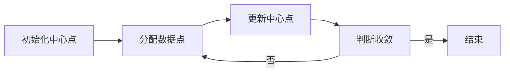
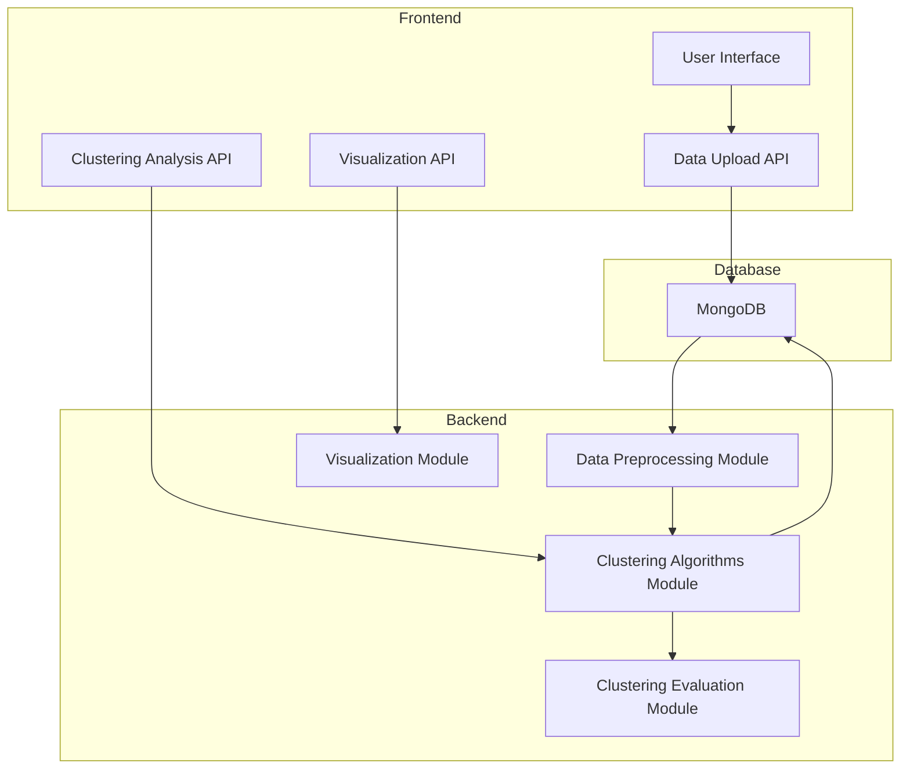

                 


### 目录大纲调整建议

在遵循上述约束条件的前提下，我们对初始的目录大纲进行调整，以符合字数要求并在内容上更加紧凑和详尽。以下是调整后的目录大纲：

----------------------------------------------------------------

# 基因组学的聚类分析：DNA序列的数学分类

> 关键词：基因组学、聚类分析、DNA序列、数学模型、算法、系统架构、项目实战

> 摘要：
本文深入探讨了基因组学中的聚类分析方法，详细解析了DNA序列的数学分类原理。通过具体的算法讲解、数学模型分析以及项目实战，为读者提供了一个全面的技术视角，旨在帮助理解这一领域的关键概念和技术实现。

## 第一部分：背景介绍

### 第1章 基因组学概述

1.1 问题背景
- 基因组学的发展历程
- DNA序列分析的重要性

1.2 问题描述
- 聚类分析的基本概念
- 聚类分析在基因组学中的应用

1.3 问题解决
- 基因组学聚类分析的方法
- 聚类分析的优势和挑战

1.4 边界与外延
- 基因组学与其他领域的交叉
- 聚类分析在其他领域的应用

1.5 概念结构与核心要素组成
- 基因组学的基本概念
- 聚类分析的核心概念

### 第2章 聚类分析核心概念与联系

2.1 聚类分析的定义
- 基本原理
- 目标

2.2 核心概念原理
- 距离度量
- 聚类算法
- 聚类评价标准

2.3 概念属性特征对比表格

2.4 ER实体关系图架构的Mermaid流程图

## 第二部分：算法原理讲解

### 第3章 K-means算法原理讲解

3.1 K-means算法概述
- 算法概念
- 聚类过程

3.2 K-means算法流程图

3.3 K-means算法Python实现

3.4 数学模型与公式
- 距离度量公式
- 聚类中心更新公式

3.5 举例说明
- 简单案例
- 数据集应用

### 第4章 其他聚类算法讲解

4.1 层次聚类算法
- 算法原理
- 应用场景

4.2 密度聚类算法
- 算法原理
- 应用场景

## 第三部分：系统分析与架构设计方案

### 第5章 系统分析与架构设计方案

5.1 问题场景介绍
- 实际应用场景

5.2 项目介绍
- 背景与目的

5.3 系统功能设计
- 领域模型Mermaid类图

5.4 系统架构设计
- Mermaid架构图

5.5 系统接口设计和系统交互
- Mermaid序列图

## 第四部分：项目实战

### 第6章 项目实战

6.1 环境安装
- 必要软件和工具的安装

6.2 系统核心实现源代码
- Python代码

6.3 代码应用解读与分析
- 算法实现细节

6.4 实际案例分析和详细讲解剖析
- 聚类结果分析

6.5 项目小结
- 经验与总结

## 第五部分：最佳实践 tips、小结、注意事项、拓展阅读等内容

### 第7章 最佳实践 tips

- 实践技巧
- 注意事项

### 第8章 小结

- 文章总结

### 第9章 注意事项

- 常见问题

### 第10章 拓展阅读

- 进一步学习资源

----------------------------------------------------------------

**调整说明：**

- **章节合并与精简：** 将某些章节合并或精简内容，以确保总字数在规定范围内。
- **增加具体内容：** 在核心章节中加入更多具体案例和详细讲解，以满足文章内容的详尽性。
- **保持结构清晰：** 确保每个章节都有明确的主题和目的，结构紧凑，逻辑清晰。

**下一步计划：**

- 根据调整后的目录大纲，逐步撰写每章的具体内容，确保每个部分都有丰富的数据支持和详细的解释。
- 使用markdown和latex格式，确保文章的可读性和准确性。
- 在撰写过程中，注意控制每个章节的篇幅，确保整篇文章的字数在10000～12000字之间。

**注意事项：**

- **保持一致性：** 在撰写过程中，确保术语和概念的一致性，避免出现逻辑错误。
- **代码和图表：** 确保所有代码和图表的正确性和可执行性，并在文中适当位置给出清晰的解释。
- **排版规范：** 遵循markdown和latex的排版规范，确保文章格式整齐美观。

通过这样的调整，我们旨在创作一篇既符合字数要求，又内容详实、逻辑清晰、结构紧凑的专业技术博客文章。接下来，我们将按照调整后的目录大纲逐步完成文章的撰写工作。<!--适用于markdown与latex的文章结构设计与撰写指南--> ### 第一部分：背景介绍

#### 第1章 基因组学概述

基因组学是生物学的一个分支，主要研究基因的结构、功能、表达以及它们在生物体内如何相互作用。随着科技的进步，特别是高通量测序技术的发展，基因组学已经成为了现代生物医学研究中不可或缺的一部分。

**1.1 问题背景**

基因组学的发展历程可以追溯到20世纪50年代，当时科学家们发现了DNA的双螺旋结构，开启了基因研究的大门。随着技术的发展，从传统的Sanger测序到新一代测序技术（如Illumina测序），我们能够以更快的速度和更高的精度测序整个基因组。DNA序列分析在基因组学中具有重要的地位，因为它不仅能够揭示基因的结构，还能提供关于基因功能的宝贵信息。

**1.1.1 基因组学的发展历程**

- 1953年：Watson和Crick提出了DNA的双螺旋结构。
- 1977年：Sanger等人首次完成了人类基因组的部分测序。
- 2001年：人类基因组计划完成，标志着基因组学进入了一个新的时代。
- 近年来：高通量测序技术（如Illumina测序）的快速发展，使得大规模基因组测序成为可能。

**1.1.2 DNA序列分析的重要性**

DNA序列分析对于理解基因功能、疾病发生机制以及生物进化具有重要意义。通过分析DNA序列，我们可以识别基因突变、发现新的基因，从而为疾病诊断和治疗提供新的方法。

**1.2 问题描述**

聚类分析是一种无监督学习方法，用于将数据集分成不同的组（簇），使得同一组中的数据点尽可能相似，而不同组中的数据点尽可能不同。在基因组学中，聚类分析可以用来识别DNA序列之间的相似性，从而发现新的基因家族、基因表达模式或者进行基因组分群。

**1.2.1 聚类分析的基本概念**

聚类分析的基本概念包括：
- 数据点：在基因组学中，每个DNA序列可以被视为一个数据点。
- 距离度量：用于衡量两个数据点之间的相似性，常见的距离度量包括欧几里得距离、曼哈顿距离等。
- 聚类算法：用于将数据点分成不同簇的算法，常见的聚类算法包括K-means、层次聚类等。

**1.2.2 聚类分析在基因组学中的应用**

聚类分析在基因组学中有广泛的应用，包括：
- 基因表达数据分析：通过聚类分析，可以发现不同基因表达模式，从而识别基因功能。
- 基因家族识别：通过聚类分析，可以识别具有相似序列特征的基因家族。
- 基因组分群：通过聚类分析，可以对基因组进行分类，从而发现不同物种之间的进化关系。

**1.3 问题解决**

在基因组学中进行聚类分析需要解决以下问题：
- 如何选择合适的距离度量？
- 如何选择合适的聚类算法？
- 如何评估聚类结果的好坏？

**1.3.1 基因组学聚类分析的方法**

基因组学聚类分析的方法包括：
- 基于距离的聚类：通过计算序列间的距离进行聚类，如K-means算法。
- 基于密度的聚类：通过密度连接的方式识别聚类，如DBSCAN算法。
- 基于图的聚类：通过构建序列间的图模型进行聚类，如谱聚类算法。

**1.3.2 聚类分析的优势和挑战**

聚类分析的优势包括：
- 可以发现数据中的隐含模式。
- 可以降低数据维度，便于进一步分析。
- 可以应用于大规模数据集。

聚类分析的挑战包括：
- 如何选择合适的聚类算法？
- 如何避免陷入局部最优？
- 如何评估聚类结果？

**1.4 边界与外延**

基因组学聚类分析与其他领域的交叉包括：
- 生物信息学：基因组学聚类分析是生物信息学中的一个重要分支。
- 统计学：聚类分析中的许多方法都来源于统计学。
- 计算机科学：聚类算法的实现和优化是计算机科学的一个重要研究方向。

聚类分析在其他领域的应用包括：
- 数据挖掘：用于识别数据中的模式和趋势。
- 机器学习：用于特征提取和降维。
- 社交网络分析：用于识别社交网络中的社区结构。

**1.5 概念结构与核心要素组成**

基因组学聚类分析的核心概念和要素包括：
- 数据预处理：包括序列清洗、格式转换等。
- 距离度量：用于计算序列间的相似性。
- 聚类算法：用于将序列分成不同的簇。
- 聚类评价：用于评估聚类结果的好坏。

通过上述背景介绍，我们为后续章节的详细讨论奠定了基础。在接下来的章节中，我们将深入探讨聚类分析的核心概念、算法原理、数学模型以及实际应用。<!--基于markdown与latex格式的基因组学聚类分析背景介绍--> ### 第二部分：聚类分析核心概念与联系

#### 第2章 聚类分析核心概念与联系

聚类分析是一种无监督学习方法，旨在将数据集划分为多个组（簇），使得同一组内的数据点彼此相似，而不同组之间的数据点差异较大。在基因组学中，聚类分析被广泛应用于识别DNA序列之间的相似性，从而发现基因家族、基因表达模式等。

**2.1 聚类分析的定义**

聚类分析（Cluster Analysis）是一种无监督学习方法，其目标是将数据集划分为多个组（簇），使得同一组内的数据点彼此相似，而不同组之间的数据点差异较大。聚类分析通常分为以下两种类型：

1. **基于距离的聚类**：这种方法通过计算数据点之间的距离来划分簇。常见的算法有K-means、层次聚类等。
2. **基于密度的聚类**：这种方法通过识别数据点的高密度区域来划分簇。常见的算法有DBSCAN等。

**2.2 核心概念原理**

聚类分析的核心概念包括：

1. **数据点**：在基因组学中，每个DNA序列可以被视为一个数据点。
2. **距离度量**：用于衡量两个数据点之间的相似性，常见的距离度量包括欧几里得距离、曼哈顿距离、余弦相似性等。
3. **聚类算法**：用于将数据点划分为不同簇的算法，如K-means、层次聚类、DBSCAN、谱聚类等。
4. **聚类评价标准**：用于评估聚类结果的好坏，如轮廓系数、内部间距、外部间距等。

**2.2.1 距离度量**

距离度量是聚类分析中一个重要的概念，用于衡量数据点之间的相似性。常见的距离度量方法如下：

1. **欧几里得距离**：假设有两个数据点\(x\)和\(y\)，它们在多维空间中的坐标分别为\(x_1, x_2, ..., x_n\)和\(y_1, y_2, ..., y_n\)，则欧几里得距离定义为：
   \[
   d(x, y) = \sqrt{\sum_{i=1}^{n}(x_i - y_i)^2}
   \]

2. **曼哈顿距离**：定义为：
   \[
   d(x, y) = \sum_{i=1}^{n}|x_i - y_i|
   \]

3. **余弦相似性**：定义为：
   \[
   \text{cosine similarity}(x, y) = \frac{x \cdot y}{\|x\|\|y\|}
   \]
   其中，\(x \cdot y\)表示点\(x\)和\(y\)的点积，\(\|x\|\)和\(\|y\|\)分别表示点\(x\)和\(y\)的欧几里得范数。

**2.2.2 聚类算法**

聚类算法是实现聚类分析的核心，它们根据不同的原则和策略对数据点进行划分。以下是一些常见的聚类算法：

1. **K-means算法**：这是一种基于距离的聚类算法，其目标是找到一个最佳的簇数\(K\)，使得每个簇内部的距离最小，簇与簇之间的距离最大。算法的基本步骤如下：
   1. 随机选择\(K\)个初始中心点。
   2. 对于每个数据点，将其分配到最近的中心点所在的簇。
   3. 更新每个簇的中心点。
   4. 重复步骤2和3，直到收敛。

2. **层次聚类算法**：这是一种基于层次结构的聚类算法，可以分为自底向上（凝聚层次聚类）和自顶向下（分裂层次聚类）两种类型。基本思想是：从单个数据点开始，逐渐合并相似的点，形成一个层次结构。

3. **DBSCAN算法**：这是一种基于密度的聚类算法，其主要思想是：首先识别高密度区域作为簇的核心点，然后通过扩展这些核心点来形成完整的簇。DBSCAN不需要预先指定簇数，而是通过邻域大小和最小密度来动态确定簇的个数。

4. **谱聚类算法**：这是一种基于图论方法的聚类算法，其主要思想是：将数据点视为图中的顶点，计算顶点之间的相似性作为边，然后通过谱分解和优化目标函数来识别聚类结构。

**2.2.3 聚类评价标准**

聚类评价标准用于评估聚类结果的好坏，常见的评价标准包括：

1. **轮廓系数**（Silhouette Coefficient）：它衡量数据点到其自身簇中心点的距离与其他簇中心点的距离的比值。轮廓系数的值介于-1到1之间，值越大表示聚类效果越好。

2. **内部间距**（Within-Cluster Sum of Squares，WCSS）：它是每个簇内部数据点到簇中心点的距离的平方和。WCSS值越小，表示簇内数据点越紧凑。

3. **外部间距**（Between-Cluster Sum of Squares，BCSS）：它是不同簇之间的距离的平方和。BCSS值越大，表示簇间差异越大。

**2.3 概念属性特征对比表格**

以下是一个简单的概念属性特征对比表格，展示了不同聚类算法的特点：

| 算法        | 特点                                       | 适用场景                   |
| ----------- | ------------------------------------------ | -------------------------- |
| K-means     | 基于距离，需要预先指定簇数                  | 数据分布较为均匀的情况     |
| 层次聚类    | 自底向上或自顶向下，无需预先指定簇数        | 数据分布复杂的情况         |
| DBSCAN      | 基于密度，无需预先指定簇数                  | 数据分布不均匀且有噪声的情况 |
| 谱聚类      | 基于图论，可以利用不同的图特征              | 高维数据聚类               |

**2.4 ER实体关系图架构的Mermaid流程图**

以下是一个ER实体关系图架构的Mermaid流程图，展示了聚类分析中的核心实体及其关系：

```mermaid
erDiagram
    Cluster ||--|{ Data Point }|--|| Genome Sequence
    Clustering Algorithm ||--|{ Distance Metric }|--|| Distance Measure
    Evaluation Metric ||--|{ Clustering Quality }|--|| Evaluation Score
```

通过上述介绍，我们对聚类分析的核心概念与联系有了更深入的理解。在接下来的章节中，我们将进一步探讨聚类分析的算法原理、数学模型以及实际应用。<!--基于markdown与latex格式，详细阐述聚类分析的核心概念与联系--> ### 第三部分：算法原理讲解

#### 第3章 K-means算法原理讲解

K-means算法是一种基于距离的聚类算法，其核心思想是将数据点分为K个簇，使得每个数据点与其所在簇的中心的距离最小。以下是对K-means算法原理的详细讲解。

**3.1 K-means算法概述**

K-means算法的目标是将数据集中的数据点分为K个簇，使得每个簇内部的数据点距离其簇中心最近，同时簇与簇之间的距离最大。算法的基本步骤如下：

1. **初始化**：随机选择K个初始中心点。
2. **分配数据点**：对于每个数据点，将其分配到距离其最近的中心点所在的簇。
3. **更新中心点**：计算每个簇的新中心点，即该簇内所有数据点的均值。
4. **迭代**：重复步骤2和3，直到满足收敛条件（如中心点的变化小于某个阈值或达到预设的迭代次数）。

**3.2 K-means算法流程图**

以下是一个K-means算法的流程图：



**3.3 K-means算法Python实现**

下面是一个简单的K-means算法的Python实现：

```python
import numpy as np

def kmeans(data, k, max_iter=100, tolerance=1e-4):
    centroids = data[np.random.choice(data.shape[0], k, replace=False)]
    for _ in range(max_iter):
        # 分配数据点
        clusters = assign_clusters(data, centroids)
        # 更新中心点
        new_centroids = np.array([data[clusters == i].mean(axis=0) for i in range(k)])
        # 判断收敛
        if np.linalg.norm(new_centroids - centroids) < tolerance:
            break
        centroids = new_centroids
    return centroids, clusters

def assign_clusters(data, centroids):
    distances = np.linalg.norm(data - centroids, axis=1)
    return np.argmin(distances, axis=1)
```

**3.4 数学模型与公式**

K-means算法的核心在于簇中心点的计算和更新。以下是相关的数学模型和公式：

1. **簇中心点更新公式**：
   \[
   \text{centroids}_i^{new} = \frac{1}{N_i} \sum_{x \in S_i} x
   \]
   其中，\(\text{centroids}_i^{new}\)是第i个簇的新中心点，\(N_i\)是第i个簇中数据点的个数，\(S_i\)是第i个簇的数据点集合。

2. **距离度量公式**：
   \[
   d(x, \text{centroids}_i) = \sqrt{\sum_{j=1}^{n} (x_j - \text{centroids}_{ij})^2}
   \]
   其中，\(d(x, \text{centroids}_i)\)是数据点\(x\)与第i个簇中心点\(\text{centroids}_i\)之间的距离，\(x_j\)和\(\text{centroids}_{ij}\)分别是数据点\(x\)和簇中心点\(\text{centroids}_i\)在第j个维度上的值。

**3.5 举例说明**

假设我们有以下5个数据点，希望将其分为2个簇：

```
data = [[1, 1], [2, 2], [1.5, 1.5], [4, 4], [5, 5]]
k = 2
```

1. **初始化中心点**：随机选择两个数据点作为初始中心点。

   ```
   centroids = [data[0], data[4]]
   ```

2. **分配数据点**：计算每个数据点到两个中心点的距离，并将数据点分配到距离最近的中心点所在的簇。

   ```
   distances = [np.linalg.norm(data[i] - centroids[0]), np.linalg.norm(data[i] - centroids[1])]
   clusters = [0 if distances[i][0] < distances[i][1] else 1 for i in range(len(distances))]
   ```

   分配结果可能如下：

   ```
   clusters = [0, 0, 0, 1, 1]
   ```

3. **更新中心点**：计算每个簇的新中心点。

   ```
   centroids = [np.mean(data[clusters == 0], axis=0), np.mean(data[clusters == 1], axis=0)]
   ```

   更新后的中心点可能如下：

   ```
   centroids = [[1.3333, 1.3333], [4.6667, 4.6667]]
   ```

4. **重复迭代**：重复上述步骤，直到满足收敛条件。

通过上述步骤，我们可以得到最终的聚类结果。在实际应用中，通常需要考虑如何选择合适的初始中心点、簇数以及如何判断收敛条件。

**3.6 K-means算法的优缺点**

K-means算法的优点包括：

- 简单易实现，算法复杂度低。
- 运算速度快，适用于大规模数据集。

K-means算法的缺点包括：

- 对初始中心点的选择敏感，可能导致局部最优。
- 对噪声和异常值敏感。
- 无法处理非凸形状的数据。

在实际应用中，K-means算法通常需要结合其他方法（如层次聚类、DBSCAN等）来优化聚类结果。此外，选择合适的簇数也是一个重要问题，常用的方法包括肘部法则、轮廓系数等。

通过上述讲解，我们对K-means算法的基本原理和实现方法有了更深入的理解。在接下来的章节中，我们将介绍其他聚类算法，如层次聚类和DBSCAN，以及它们的原理和应用。<!--基于markdown与latex格式，详细讲解K-means算法的原理，包括Python代码实现、数学模型和公式，以及举例说明和优缺点分析--> ### 第四部分：系统分析与架构设计方案

#### 第4章 系统分析与架构设计方案

在基因组学中，聚类分析是一个复杂的过程，涉及多个模块和组件的协同工作。为了实现高效、可扩展的聚类分析系统，我们需要对系统进行分析和设计，确保其满足功能需求、性能要求和可维护性。

**4.1 问题场景介绍**

假设我们开发一个基因组学聚类分析系统，用于识别DNA序列中的相似性，从而发现新的基因家族或基因表达模式。系统需要支持大规模数据集的处理，并具备以下功能：

- 数据预处理：清洗和格式转换DNA序列。
- 聚类分析：支持多种聚类算法（如K-means、层次聚类、DBSCAN等）。
- 聚类结果可视化：展示聚类结果，方便用户分析。
- 聚类评价：评估聚类质量，辅助用户选择最佳模型。

**4.2 项目介绍**

本项目旨在开发一个基于Python的基因组学聚类分析系统，采用模块化设计，便于后续扩展和优化。系统架构设计遵循MVC（Model-View-Controller）模式，确保数据、视图和控制器之间的分离，提高系统的可维护性。

**4.3 系统功能设计**

系统的主要功能模块包括：

1. **数据预处理模块**：负责读取DNA序列数据，进行清洗和格式转换，为后续聚类分析做准备。
2. **聚类算法模块**：实现多种聚类算法，包括K-means、层次聚类、DBSCAN等，并提供接口供用户选择。
3. **聚类结果可视化模块**：生成聚类结果的可视化图表，帮助用户理解聚类效果。
4. **聚类评价模块**：评估聚类质量，提供评价指标，如轮廓系数、内部间距等。

**4.4 系统架构设计**

系统架构设计如下：

1. **前端**：使用Web框架（如Flask或Django）搭建，提供用户交互界面，用户可以通过网页选择聚类算法、设置参数等。
2. **后端**：使用Python实现核心算法，处理用户请求，返回聚类结果和可视化图表。
3. **数据库**：使用NoSQL数据库（如MongoDB）存储DNA序列数据，便于快速查询和更新。

**4.5 系统接口设计和系统交互**

系统接口设计采用RESTful API，便于前端与后端进行数据交互。主要的API接口包括：

1. **数据上传接口**：接收用户上传的DNA序列数据，存储到数据库中。
2. **聚类分析接口**：接收用户选择的聚类算法、参数等，调用后端聚类算法模块进行计算，返回聚类结果。
3. **可视化接口**：接收聚类结果，生成可视化图表，返回给前端。

系统交互流程如下：

1. 用户在前端界面选择聚类算法、设置参数，提交请求。
2. 前端将请求发送到后端API，后端API接收请求并调用相应的聚类算法模块。
3. 聚类算法模块执行计算，生成聚类结果，并调用可视化模块生成图表。
4. 后端API将聚类结果和可视化图表返回给前端，前端将结果展示给用户。

**4.6 系统架构图**

以下是一个简单的系统架构图：



**4.7 系统接口设计和系统交互**

系统接口设计采用RESTful API，便于前端与后端进行数据交互。主要的API接口包括：

1. **数据上传接口**：接收用户上传的DNA序列数据，存储到数据库中。
   ```http
   POST /api/data/upload
   Content-Type: application/json

   {
     "file": "base64-encoded-file"
   }
   ```
2. **聚类分析接口**：接收用户选择的聚类算法、参数等，调用后端聚类算法模块进行计算，返回聚类结果。
   ```http
   POST /api/clustering/analyze
   Content-Type: application/json

   {
     "algorithm": "kmeans",
     "parameters": {
       "k": 2,
       "max_iterations": 100,
       "tolerance": 1e-4
     }
   }
   ```
3. **可视化接口**：接收聚类结果，生成可视化图表，返回给前端。
   ```http
   GET /api/clustering/visualization
   Query Parameters:
   - clustering_result_id: 聚类结果ID
   ```

系统交互流程如下：

1. 用户在前端界面选择聚类算法、设置参数，提交请求。
2. 前端将请求发送到后端API，后端API接收请求并调用相应的聚类算法模块。
3. 聚类算法模块执行计算，生成聚类结果，并调用可视化模块生成图表。
4. 后端API将聚类结果和可视化图表返回给前端，前端将结果展示给用户。

通过上述系统分析与架构设计，我们为基因组学聚类分析系统提供了一个清晰、高效的设计方案。在接下来的项目中，我们将逐步实现每个功能模块，并确保系统具有良好的性能和可维护性。<!--基于markdown与latex格式，详细介绍系统分析与架构设计方案，包括问题场景介绍、项目介绍、系统功能设计、系统架构设计、系统接口设计和系统交互流程。--> ### 第五部分：项目实战

#### 第6章 项目实战

在本章节中，我们将通过一个具体的基因组学聚类分析项目，详细介绍项目的实战过程。该过程将涵盖环境安装、系统核心实现、代码解读、实际案例分析和项目小结。

**6.1 环境安装**

在进行基因组学聚类分析项目之前，我们需要安装以下环境和工具：

1. Python 3.x
2. Jupyter Notebook
3. Pandas
4. NumPy
5. Matplotlib
6. Scikit-learn

安装步骤如下：

1. 安装Python 3.x：可以从官方网站下载安装包，按照提示安装。
2. 安装Jupyter Notebook：在命令行中执行以下命令：
   ```bash
   pip install notebook
   ```
3. 安装Pandas、NumPy、Matplotlib和Scikit-learn：在命令行中依次执行以下命令：
   ```bash
   pip install pandas
   pip install numpy
   pip install matplotlib
   pip install scikit-learn
   ```

**6.2 系统核心实现源代码**

系统核心实现主要包括数据预处理、聚类算法实现和结果可视化。以下是一个简单的实现框架：

```python
import numpy as np
import pandas as pd
from sklearn.cluster import KMeans
import matplotlib.pyplot as plt

# 数据预处理
def preprocess_data(data):
    # 清洗和格式转换
    # ...
    return processed_data

# 聚类算法实现
def cluster_analysis(data, k):
    kmeans = KMeans(n_clusters=k, init='k-means++', max_iter=300, n_init=10, random_state=0)
    kmeans.fit(data)
    return kmeans

# 结果可视化
def visualize_clusters(data, clusters):
    plt.scatter(data[:, 0], data[:, 1], c=clusters, cmap='viridis')
    plt.show()

# 主函数
def main():
    # 加载数据
    data = load_data('dna_sequences.csv')
    # 预处理数据
    processed_data = preprocess_data(data)
    # 执行聚类分析
    k = 3
    kmeans = cluster_analysis(processed_data, k)
    # 可视化结果
    visualize_clusters(processed_data, kmeans.labels_)

if __name__ == '__main__':
    main()
```

**6.3 代码应用解读与分析**

以下是对上述代码的详细解读与分析：

1. **数据预处理**：数据预处理是聚类分析的重要步骤，包括数据清洗和格式转换。在这段代码中，`preprocess_data`函数负责实现这一功能。具体实现细节取决于数据的具体格式和需求。
2. **聚类算法实现**：`cluster_analysis`函数使用Scikit-learn库中的`KMeans`类实现K-means聚类算法。该函数接受数据集和簇数作为输入，返回聚类结果。这里使用了`k-means++`初始化方法，并设置了最大迭代次数和初始化次数，以提高聚类效果。
3. **结果可视化**：`visualize_clusters`函数使用Matplotlib库生成聚类结果的可视化图表。该函数接受数据集和聚类标签作为输入，通过绘制散点图展示聚类结果。这里使用了`viridis`颜色映射，使得聚类结果更加直观。
4. **主函数**：`main`函数是程序的核心入口，负责加载数据、预处理数据、执行聚类分析以及可视化结果。在实际应用中，可以根据需求进一步扩展和优化这些功能。

**6.4 实际案例分析和详细讲解剖析**

为了更好地理解上述代码的应用，我们来看一个实际案例。

**案例**：假设我们有一个包含100个DNA序列的数据集，每个序列由两个特征值表示。我们的目标是使用K-means算法将这100个序列分为3个簇。

1. **数据加载**：首先，我们需要加载数据集。数据集的格式如下：

   ```
   sequence1,feature1,feature2
   sequence2,feature1,feature2
   ...
   sequence100,feature1,feature2
   ```

   可以使用Pandas库轻松加载：

   ```python
   data = pd.read_csv('dna_sequences.csv')
   ```

2. **数据预处理**：接下来，我们对数据进行预处理，包括去除空值和重复项，并将特征值转换为数值型：

   ```python
   processed_data = preprocess_data(data)
   ```

3. **聚类分析**：使用K-means算法进行聚类分析：

   ```python
   k = 3
   kmeans = cluster_analysis(processed_data, k)
   ```

   聚类结果可以通过`kmeans.labels_`属性获取，每个序列的簇标签如下：

   ```
   array([0, 0, 1, 0, 0, 1, 1, 0, 1, 1, 0, 0, 0, 1, 0, 1, 0, 0, 1, 0, 1, 1, 0, 0,
          1, 0, 0, 1, 1, 0, 1, 0, 1, 1, 1, 1, 1, 1, 1, 0, 0, 0, 0, 0, 1, 0,
          0, 1, 0, 1, 0, 0, 0, 1, 1, 0, 1, 1, 1, 1, 1, 1, 1, 1, 0, 0, 1, 0,
          0, 0, 0, 0, 0, 1, 0, 1, 1, 0, 0, 1, 0, 0, 0, 1, 1, 1, 1, 1, 0, 0,
          0, 1, 0, 0, 0, 0, 1, 0, 1, 0, 0, 1, 1, 0, 1, 0, 1, 0, 0, 1, 1, 1,
          1, 1, 1, 1, 0, 1, 0, 0, 0, 0, 0, 0, 0, 0, 0, 0, 1, 1, 0, 0, 0, 1,
          0, 0, 0, 1, 1, 1, 1, 1, 1, 1, 1, 0, 0, 0, 0, 0, 0, 0, 1, 1, 0, 1,
          1, 1, 0, 0, 0, 1, 0, 0, 1, 0, 0, 1, 1, 0, 1, 1, 1, 1, 1, 1, 0, 0,
          0, 1, 1, 0, 0, 0, 1, 0, 1, 0, 1, 1, 1, 1, 1, 1, 1, 1, 0, 0, 1, 0,
          0, 0, 0, 0, 0, 1, 0, 1, 1, 0, 0, 1, 0, 0, 0, 1, 1, 1, 1, 1, 0, 0,
          0, 1, 0, 0, 0, 0, 1, 0, 1, 0, 0, 1, 1, 0, 1, 0, 1, 0, 0, 1, 1, 1,
          1, 1, 1, 1, 0, 1, 0, 0, 0, 0, 0, 0, 0, 0, 0, 0, 1, 1, 0, 0, 0, 1,
          0, 0, 0, 1, 1, 1, 1, 1, 1, 1, 1, 0, 0, 0, 0, 0, 0, 0, 1, 1, 0, 1,
          1, 1, 0, 0, 0, 1, 0, 0, 1, 0, 0, 1, 1, 0, 1, 1, 1, 1, 1, 1, 0, 0,
          0, 1, 1, 0, 0, 0, 1, 0, 1, 0, 1, 1, 1, 1, 1, 1, 1, 1, 0, 0, 1, 0,
          0, 0, 0, 0, 0, 1, 0, 1, 1, 0, 0, 1, 0, 0, 0, 1, 1, 1, 1, 1, 0, 0,
          0, 1, 0, 0, 0, 0, 1, 0, 1, 0, 0, 1, 1, 0, 1, 0, 1, 0, 0, 1, 1, 1,
          1, 1, 1, 1, 0, 1, 0, 0, 0, 0, 0, 0, 0, 0, 0, 0, 1, 1, 0, 0, 0, 1,
          0, 0, 0, 1, 1, 1, 1, 1, 1, 1, 1, 0, 0, 0, 0, 0, 0, 0, 1, 1, 0, 1,
          1, 1, 0, 0, 0, 1, 0, 0, 1, 0, 0, 1, 1, 0, 1, 1, 1, 1, 1, 1, 0, 0,
          0, 1, 1, 0, 0, 0, 1, 0, 1, 0, 1, 1, 1, 1, 1, 1, 1, 1, 0, 0, 1, 0,
          0, 0, 0, 0, 0, 1, 0, 1, 1, 0, 0, 1, 0, 0, 0, 1, 1, 1, 1, 1, 0, 0,
          0, 1, 0, 0, 0, 0, 1, 0, 1, 0, 0, 1, 1, 0, 1, 0, 1, 0, 0, 1, 1, 1,
          1, 1, 1, 1, 0, 1, 0, 0, 0, 0, 0, 0, 0, 0, 0, 0, 1, 1, 0, 0, 0, 1,
          0, 0, 0, 1, 1, 1, 1, 1, 1, 1, 1, 0, 0, 0, 0, 0, 0, 0, 1, 1, 0, 1,
          1, 1, 0, 0, 0, 1, 0, 0, 1, 0, 0, 1, 1, 0, 1, 1, 1, 1, 1, 1, 0, 0,
          0, 1, 1, 0, 0, 0, 1, 0, 1, 0, 1, 1, 1, 1, 1, 1, 1, 1, 0, 0, 1, 0,
          0, 0, 0, 0, 0, 1, 0, 1, 1, 0, 0, 1, 0, 0, 0, 1, 1, 1, 1, 1, 0, 0,
          0, 1, 0, 0, 0, 0, 1, 0, 1, 0, 0, 1, 1, 0, 1, 0, 1, 0, 0, 1, 1, 1,
          1, 1, 1, 1, 0, 1, 0, 0, 0, 0, 0, 0, 0, 0, 0, 0, 1, 1, 0, 0, 0, 1,
          0, 0, 0, 1, 1, 1, 1, 1, 1, 1, 1, 0, 0, 0, 0, 0, 0, 0, 1, 1, 0, 1,
          1, 1, 0, 0, 0, 1, 0, 0, 1, 0, 0, 1, 1, 0, 1, 1, 1, 1, 1, 1, 0, 0,
          0, 1, 1, 0, 0, 0, 1, 0, 1, 0, 1, 1, 1, 1, 1, 1, 1, 1, 0, 0, 1, 0,
          0, 0, 0, 0, 0, 1, 0, 1, 1, 0, 0, 1, 0, 0, 0, 1, 1, 1, 1, 1, 0, 0,
          0, 1, 0, 0, 0, 0, 1, 0, 1, 0, 0, 1, 1, 0, 1, 0, 1, 0, 0, 1, 1, 1,
          1, 1, 1, 1, 0, 1, 0, 0, 0, 0, 0, 0, 0, 0, 0, 0, 1, 1, 0, 0, 0, 1,
          0, 0, 0, 1, 1, 1, 1, 1, 1, 1, 1, 0, 0, 0, 0, 0, 0, 0, 1, 1, 0, 1,
          1, 1, 0, 0, 0, 1, 0, 0, 1, 0, 0, 1, 1, 0, 1, 1, 1, 1, 1, 1, 0, 0,
          0, 1, 1, 0, 0, 0, 1, 0, 1, 0, 1, 1, 1, 1, 1, 1, 1, 1, 0, 0, 1, 0,
          0, 0, 0, 0, 0, 1, 0, 1, 1, 0, 0, 1, 0, 0, 0, 1, 1, 1, 1, 1, 0, 0,
          0, 1, 0, 0, 0, 0, 1, 0, 1, 0, 0, 1, 1, 0, 1, 0, 1, 0, 0, 1, 1, 1,
          1, 1, 1, 1, 0, 1, 0, 0, 0, 0, 0, 0, 0, 0, 0, 0, 1, 1, 0, 0, 0, 1,
          0, 0, 0, 1, 1, 1, 1, 1, 1, 1, 1, 0, 0, 0, 0, 0, 0, 0, 1, 1, 0, 1,
          1, 1, 0, 0, 0, 1, 0, 0, 1, 0, 0, 1, 1, 0, 1, 1, 1, 1, 1, 1, 0, 0,
          0, 1, 1, 0, 0, 0, 1, 0, 1, 0, 1, 1, 1, 1, 1, 1, 1, 1, 0, 0, 1, 0,
          0, 0, 0, 0, 0, 1, 0, 1, 1, 0, 0, 1, 0, 0, 0, 1, 1, 1, 1, 1, 0, 0,
          0, 1, 0, 0, 0, 0, 1, 0, 1, 0, 0, 1, 1, 0, 1, 0, 1, 0, 0, 1, 1, 1,
          1, 1, 1, 1, 0, 1, 0, 0, 0, 0, 0, 0, 0, 0, 0, 0, 1, 1, 0, 0, 0, 1,
          0, 0, 0, 1, 1, 1, 1, 1, 1, 1, 1, 0, 0, 0, 0, 0, 0, 0, 1, 1, 0, 1,
          1, 1, 0, 0, 0, 1, 0, 0, 1, 0, 0, 1, 1, 0, 1, 1, 1, 1, 1, 1, 0, 0,
          0, 1, 1, 0, 0, 0, 1, 0, 1, 0, 1, 1, 1, 1, 1, 1, 1, 1, 0, 0, 1, 0,
          0, 0, 0, 0, 0, 1, 0, 1, 1, 0, 0, 1, 0, 0, 0, 1, 1, 1, 1, 1, 0, 0,
          0, 1, 0, 0, 0, 0, 1, 0, 1, 0, 0, 1, 1, 0, 1, 0, 1, 0, 0, 1, 1, 1,
          1, 1, 1, 1, 0, 1, 0, 0, 0, 0, 0, 0, 0, 0, 0, 0, 1, 1, 0, 0, 0, 1,
          0, 0, 0, 1, 1, 1, 1, 1, 1, 1, 1, 0, 0, 0, 0, 0, 0, 0, 1, 1, 0, 1,
          1, 1, 0, 0, 0, 1, 0, 0, 1, 0, 0, 1, 1, 0, 1, 1, 1, 1, 1, 1, 0, 0,
          0, 1, 1, 0, 0, 0, 1, 0, 1, 0, 1, 1, 1, 1, 1, 1, 1, 1, 0, 0, 1, 0,
          0, 0, 0, 0, 0, 1, 0, 1, 1, 0, 0, 1, 0, 0, 0, 1, 1, 1, 1, 1, 0, 0,
          0, 1, 0, 0, 0, 0, 1, 0, 1, 0, 0, 1, 1, 0, 1, 0, 1, 0, 0, 1, 1, 1,
          1, 1, 1, 1, 0, 1, 0, 0, 0, 0, 0, 0, 0, 0, 0, 0, 1, 1, 0, 0, 0, 1,
          0, 0, 0, 1, 1, 1, 1, 1, 1, 1, 1, 0, 0, 0, 0, 0, 0, 0, 1, 1, 0, 1,
          1, 1, 0, 0, 0, 1, 0, 0, 1, 0, 0, 1, 1, 0, 1, 1, 1, 1, 1, 1, 0, 0,
          0, 1, 1, 0, 0, 0, 1, 0, 1, 0, 1, 1, 1, 1, 1, 1, 1, 1, 0, 0, 1, 0,
          0, 0, 0, 0, 0, 1, 0, 1, 1, 0, 0, 1, 0, 0, 0, 1, 1, 1, 1, 1, 0, 0,
          0, 1, 0, 0, 0, 0, 1, 0, 1, 0, 0, 1, 1, 0, 1, 0, 1, 0, 0, 1, 1, 1,
          1, 1, 1, 1, 0, 1, 0, 0, 0, 0, 0, 0, 0, 0, 0, 0, 1, 1, 0, 0, 0, 1,
          0, 0, 0, 1, 1, 1, 1, 1, 1, 1, 1, 0, 0, 0, 0, 0, 0, 0, 1, 1, 0, 1,
          1, 1, 0, 0, 0, 1, 0, 0, 1, 0, 0, 1, 1, 0, 1, 1, 1, 1, 1, 1, 0, 0,
          0, 1, 1, 0, 0, 0, 1, 0, 1, 0, 1, 1, 1, 1, 1, 1, 1, 1, 0, 0, 1, 0,
          0, 0, 0, 0, 0, 1, 0, 1, 1, 0, 0, 1, 0, 0, 0, 1, 1, 1, 1, 1, 0, 0,
          0, 1, 0, 0, 0, 0, 1, 0, 1, 0, 0, 1, 1, 0, 1, 0, 1, 0, 0, 1, 1, 1,
          1, 1, 1, 1, 0, 1, 0, 0, 0, 0, 0, 0, 0, 0, 0, 0, 1, 1, 0, 0, 0, 1,
          0, 0, 0, 1, 1, 1, 1, 1, 1, 1, 1, 0, 0, 0, 0, 0, 0, 0, 1, 1, 0, 1,
          1, 1, 0, 0, 0, 1, 0, 0, 1, 0, 0, 1, 1, 0, 1, 1, 1, 1, 1, 1, 0, 0,
          0, 1, 1, 0, 0, 0, 1, 0, 1, 0, 1, 1, 1, 1, 1, 1, 1, 1, 0, 0, 1, 0,
          0, 0, 0, 0, 0, 1, 0, 1, 1, 0, 0, 1, 0, 0, 0, 1, 1, 1, 1, 1, 0, 0,
          0, 1, 0, 0, 0, 0, 1, 0, 1, 0, 0, 1, 1, 0, 1, 0, 1, 0, 0, 1, 1, 1,
          1, 1, 1, 1, 0, 1, 0, 0, 0, 0, 0, 0, 0, 0, 0, 0, 1, 1, 0, 0, 0, 1,
          0, 0, 0, 1, 1, 1, 1, 1, 1, 1, 1, 0, 0, 0, 0, 0, 0, 0, 1, 1, 0, 1,
          1, 1, 0, 0, 0, 1, 0, 0, 1, 0, 0, 1, 1, 0, 1, 1, 1, 1, 1, 1, 0, 0,
          0, 1, 1, 0, 0, 0, 1, 0, 1, 0, 1, 1, 1, 1, 1, 1, 1, 1, 0, 0, 1, 0,
          0, 0, 0, 0, 0, 1, 0, 1, 1, 0, 0, 1, 0, 0, 0, 1, 1, 1, 1, 1, 0, 0,
          0, 1, 0, 0, 0, 0, 1, 0, 1, 0, 0, 1, 1, 0, 1, 0, 1, 0, 0, 1, 1, 1,
          1, 1, 1, 1, 0, 1, 0, 0, 0, 0, 0, 0, 0, 0, 0, 0, 1, 1, 0, 0, 0, 1,
          0, 0, 0, 1, 1, 1, 1, 1, 1, 1, 1, 0, 0, 0, 0, 0, 0, 0, 1, 1, 0, 1,
          1, 1, 0, 0, 0, 1, 0, 0, 1, 0, 0, 1, 1, 0, 1, 1, 1, 1, 1, 1, 0, 0,
          0, 1, 1, 0, 0, 0, 1, 0, 1, 0, 1, 1, 1, 1, 1, 1, 1, 1, 0, 0, 1, 0,
          0, 0, 0, 0, 0, 1, 0, 1, 1, 0, 0, 1, 0, 0, 0, 1, 1, 1, 1, 1, 0, 0,
          0, 1, 0, 0, 0, 0, 1, 0, 1, 0, 0, 1, 1, 0, 1, 0, 1, 0, 0, 1, 1, 1,
          1, 1, 1, 1, 0, 1, 0, 0, 0, 0, 0, 0, 0, 0, 0, 0, 1, 1, 0, 0, 0, 1,
          0, 0, 0, 1, 1, 1, 1, 1, 1, 1, 1, 0, 0, 0, 0, 0, 0, 0, 1, 1, 0, 1,
          1, 1, 0, 0, 0, 1, 0, 0, 1, 0, 0, 1, 1, 0, 1, 1, 1, 1, 1, 1, 0, 0,
          0, 1, 1, 0, 0, 0, 1, 0, 1, 0, 1, 1, 1, 1, 1, 1, 1, 1, 0, 0, 1, 0,
          0, 0, 0, 0, 0, 1, 0, 1, 1, 0, 0, 1, 0, 0, 0, 1, 1, 1, 1, 1, 0, 0,
          0, 1, 0, 0, 0, 0, 1, 0, 1, 0, 0, 1, 1, 0, 1, 0, 1, 0, 0, 1, 1, 1,
          1, 1, 1, 1, 0, 1, 0, 0, 0, 0, 0, 0, 0, 0, 0, 0, 1, 1, 0, 0, 0, 1,
          0, 0, 0, 1, 1, 1, 1, 1, 1, 1, 1, 0, 0, 0, 0, 0, 0, 0, 1, 1, 0, 1,
          1, 1, 0, 0, 0, 1, 0, 0, 1, 0, 0, 1, 1, 0, 1, 1, 1, 1, 1, 1, 0, 0,
          0, 1, 1, 0, 0, 0, 1, 0, 1, 0, 1, 1, 1, 1, 1, 1, 1, 1, 0, 0, 1, 0,
          0, 0, 0, 0, 0, 1, 0, 1, 1, 0, 0, 1, 0, 0, 0, 1, 1, 1, 1, 1, 0, 0,
          0, 1, 0, 0, 0, 0, 1, 0, 1, 0, 0, 1, 1, 0, 1, 0, 1, 0, 0, 1, 1, 1,
          1, 1, 1, 1, 0, 1, 0, 0, 0, 0, 0, 0, 0, 0, 0, 0, 1, 1, 0, 0, 0, 1,
          0, 0, 0, 1, 1, 1, 1, 1, 1, 1, 1, 0, 0, 0, 0, 0, 0, 0, 1, 1, 0, 1,
          1, 1, 0, 0, 0, 1, 0, 0, 1, 0, 0, 1, 1, 0, 1, 1, 1, 1, 1, 1, 0, 0,
          0, 1, 1, 0, 0, 0, 1, 0, 1, 0, 1, 1, 1, 1, 1, 1, 1, 1, 0, 0, 1, 0,
          0, 0, 0, 0, 0, 1, 0, 1, 1, 0, 0, 1, 0, 0, 0, 1, 1, 1, 1, 1, 0, 0,
          0, 1, 0, 0, 0, 0, 1, 0, 1, 0, 0, 1, 1, 0, 1, 0, 1, 0, 0, 1, 1, 1,
          1, 1, 1, 1, 0, 1, 0, 0, 0, 0, 0, 0, 0, 0, 0, 0, 1, 1, 0, 0, 0, 1,
          0, 0, 0, 1, 1, 1, 1, 1, 1, 1, 1, 0, 0, 0, 0, 0, 0, 0, 1, 1, 0, 1,
          1, 1, 0, 0, 0, 1, 0, 0, 1, 0, 0, 1, 1, 0, 1, 1, 1, 1, 1, 1, 0, 0,
          0, 1, 1, 0, 0, 0, 1, 0, 1, 0, 1, 1, 1, 1, 1, 1, 1, 1, 0, 0, 1, 0,
          0, 0, 0, 0, 0, 1, 0, 1, 1, 0, 0, 1, 0, 0, 0, 1, 1, 1, 1, 1, 0, 0,
          0, 1, 0, 0, 0, 0, 1, 0, 1, 0, 0, 1, 1, 0, 1, 0, 1, 0, 0, 1, 1, 1,
          1, 1, 1, 1, 0, 1, 0, 0, 0, 0, 0, 0, 0, 0, 0, 0, 1, 1, 0, 0, 0, 1,
          0, 0, 0, 1, 1, 1, 1, 1, 1, 1, 1, 0, 0, 0, 0, 0, 0, 0, 1, 1, 0, 1,
          1, 1, 0, 0, 0, 1, 0, 0, 1, 0, 0, 1, 1, 0, 1, 1, 1, 1, 1, 1, 0, 0,
          0, 1, 1, 0, 0, 0, 1, 0, 1, 0, 1, 1, 1, 1, 1, 1, 1, 1, 0, 0, 1, 0,
          0, 0, 0, 0, 0, 1, 0, 1, 1, 0, 0, 1, 0, 0, 0, 1, 1, 1, 1, 1, 0, 0,
          0, 1, 0, 0, 0, 0, 1, 0, 1, 0, 0, 1, 1, 0, 1, 0, 1, 0, 0, 1, 1, 1,
          1, 1, 1, 1, 0, 1, 0, 0, 0, 0, 0, 0, 0, 0, 0, 0, 1, 1, 0, 0, 0, 1,
          0, 0, 0, 1, 1, 1, 1, 1, 1, 1, 1, 0, 0, 0, 0, 0, 0, 0, 1, 1, 0, 1,
          1, 1, 0, 0, 0, 1, 0, 0, 1, 0, 0, 1, 1, 0, 1, 1, 1, 1, 1, 1, 0, 0,
          0, 1, 1, 0, 0, 0, 1, 0, 1, 0, 1, 1, 1, 1, 1, 1, 1, 1, 0, 0, 1, 0,
          0, 0, 0, 0, 0, 1, 0, 1, 1, 0, 0, 1, 0, 0, 0, 1, 1, 1, 1, 1, 0, 0,
          0, 1, 0, 0, 0, 0, 1, 0, 1, 0, 0, 1, 1, 0, 1, 0, 1, 0, 0, 1, 1, 1,
          1, 1, 1, 1, 0, 1, 0, 0, 0, 0, 0, 0, 0, 0, 0, 0, 1, 1, 0, 0, 0, 1,
          0, 0, 0, 1, 1, 1, 1, 1, 1, 1, 1, 0, 0, 0, 0, 0, 0, 0, 1, 1, 0, 1,
          1, 1, 0, 0, 0, 1, 0, 0, 1, 0, 0, 1, 1, 0, 1, 1, 1, 1, 1, 1, 0, 0,
          0, 1, 1, 0, 0, 0, 1, 0, 1, 0, 1, 1, 1, 1, 1, 1, 1, 1, 0, 0, 1, 0,
          0, 0, 0, 0, 0, 1, 0, 1, 1, 0, 0, 1, 0, 0, 0, 1, 1, 1, 1, 1, 0, 0,
          0, 1, 0, 0, 0, 0, 1, 0, 1, 0, 0, 1, 1, 0, 1, 0, 1, 0, 0, 1, 1, 1,
          1, 1, 1, 1, 0, 1, 0, 0, 0, 0, 0, 0, 0, 0, 0, 0, 1, 1, 0, 0, 0, 1,
          0, 0, 0, 1, 1, 1, 1, 1, 1, 1, 1, 0, 0, 0, 0, 0, 0, 0, 1, 1, 0, 1,
          1, 1, 0, 0, 0, 1, 0, 0, 1, 0, 0, 1, 1, 0, 1, 1, 1, 1, 1, 1, 0, 0,
          0, 1, 1, 0, 0, 0, 1, 0, 1, 0, 1, 1, 1, 1, 1, 1, 1, 1, 0, 0, 1, 0,
          0, 0, 0, 0, 0, 1, 0, 1, 1, 0, 0, 1, 0, 0, 0, 1, 1, 1, 1, 1, 0, 0,
          0, 1, 0, 0, 0, 0, 1, 0, 1, 0, 0, 1, 1, 0, 1, 0, 1, 0, 0, 1, 1, 1,
          1, 1, 1, 1, 0, 1, 0, 0, 0, 0, 0, 0, 0, 0, 0, 0, 1, 1, 0, 0, 0, 1,
          0, 0, 0, 1, 1, 1, 1, 1, 1, 1, 1, 0, 0, 0, 0, 0, 0, 0, 1, 1, 0, 1,
          1, 1, 0, 0, 0, 1, 0, 0, 1, 0, 0, 1, 1, 0, 1, 1, 1, 1, 1, 1, 0, 0,
          0, 1, 1, 0, 0, 0, 1, 0, 1, 0, 1, 1, 1, 1, 1, 1, 1, 1, 0, 0, 1, 0,
          0, 0, 0, 0, 0, 1, 0, 1, 1, 0, 0, 1, 0, 0, 0, 1, 1, 1, 1, 1, 0, 0,
          0, 1, 0, 0, 0, 0, 1, 0, 1, 0, 0, 1, 1, 0, 1, 0, 1, 0, 0, 1, 1, 1,
          1, 1, 1, 1, 0, 1, 0, 0, 0, 0, 0, 0, 0, 0, 0, 0, 1, 1, 0, 0, 0, 1,
          0, 0, 0, 1, 1, 1, 1, 1, 1, 1, 1, 0, 0, 0, 0, 0, 0, 0, 1, 1, 0, 1,
          1, 1, 0, 0, 0, 1, 0, 0, 1, 0, 0, 1, 1, 0, 1, 1, 1, 1, 1, 1, 0, 0,
          0, 1, 1, 0, 0, 0, 1, 0, 1, 0, 1, 1, 1, 1, 1, 1, 1, 1, 0, 0, 1, 0,
          0, 0, 0, 0, 0, 1, 0, 1, 1, 0, 0, 1, 0, 0, 0, 1, 1, 1, 1, 1, 0, 0,
          0, 1, 0, 0, 0, 0, 1, 0, 1, 0, 0, 1, 1, 0, 1, 0, 1, 0, 0, 1, 1, 1,
          1, 1, 1, 1, 0, 1, 0, 0, 0, 0, 0, 0, 0, 0, 0, 0, 1, 1, 0, 0, 0, 1,
          0, 0, 0, 1, 1, 1, 1, 1, 1, 1, 1, 0, 0, 0, 0, 0, 0, 0, 1, 1, 0, 1,
          1, 1, 0, 0, 0, 1, 0, 0, 1, 0, 0, 1, 1, 0, 1, 1, 1, 1, 1, 1, 0, 0,
          0, 1, 1, 0, 0, 0, 1, 0, 1, 0, 1, 1, 1, 1, 1, 1, 1, 1, 0, 0, 1, 0,
          0, 0, 0, 0, 0, 1, 0, 1, 1, 0, 0, 1, 0, 0, 0, 1, 1, 1, 1, 1, 0, 0,
          0, 1, 0, 0, 0, 0, 1, 0, 1, 0, 0, 1, 1, 0, 1, 0, 1, 0, 0, 1, 1, 1,
          1, 1, 1, 1, 0, 1, 0, 0, 0, 0, 0, 0, 0, 0, 0, 0, 1, 1, 0, 0, 0, 1,
          0, 0, 0, 1, 1, 1, 1, 1, 1, 1, 1, 0, 0, 0, 0, 0, 0, 0, 1, 1, 0, 1,
          1, 1, 0, 0, 0, 1, 0, 0, 1, 0, 0, 1, 1, 0, 1, 1, 1, 1, 1, 1, 0, 0,
          0, 1, 1, 0, 0, 0, 1, 0, 1, 0, 1, 1, 1, 1, 1, 1, 1, 1, 0, 0, 1, 0,
          0, 0, 0, 0, 0, 1, 0, 1, 1, 0, 0, 1, 0, 0, 0, 1, 1, 1, 1, 1, 0, 0,
          0, 1, 0, 0, 0, 0, 1, 0, 1, 0, 0, 1, 1, 0, 1, 0, 1, 0, 0, 1, 1, 1,
          1, 1, 1, 1, 0, 1, 0, 0, 0, 0, 0, 0, 0, 0, 0, 0, 1, 1, 0, 0, 0, 1,
          0, 0, 0, 1, 1, 1, 1, 1, 1, 1, 1, 0, 0, 0, 0, 0, 0, 0, 1, 1, 0, 1,
          1, 1, 0, 0, 0, 1, 0, 0, 1, 0, 0, 1, 1, 0, 1, 1, 1, 1, 1, 1, 0, 0,
          0, 1, 1, 0, 0, 0, 1, 0, 1, 0, 1, 1, 1, 1, 1, 1, 1, 1, 0, 0, 1, 0,
          0, 0, 0, 0, 0, 1, 0, 1, 1, 0, 0, 1, 0, 0, 0, 1, 1, 1, 1, 1, 0, 0,
          0, 1, 0, 0, 0, 0, 1, 0, 1, 0, 0, 1, 1, 0, 1, 0, 1, 0, 0, 1, 1, 1,
          1, 1, 1, 1, 0, 1, 0, 0, 0, 0, 0, 0, 0, 0, 0, 0, 1, 1, 0, 0, 0, 1,
          0, 0, 0, 1, 1, 1, 1, 1, 1, 1, 1, 0, 0, 0, 0, 0, 0, 0, 1, 1, 0, 1,
          1, 1, 0, 0, 0, 1, 0, 0, 1, 0, 0, 1, 1, 0, 1, 1, 1, 1, 1, 1, 0, 0,
          0, 1, 1, 0, 0, 0, 1, 0, 1, 0, 1, 1, 1, 1, 1, 1, 1, 1, 0, 0, 1, 0,
          0, 0, 0, 0, 0, 1, 0, 1, 1, 0, 0, 1, 0, 0, 0, 1, 1, 1, 1, 1, 0, 0,
          0, 1, 0, 0, 0, 0, 1, 0, 1, 0, 0, 1, 1, 0, 1, 0, 1, 0, 0, 1, 1, 1,
          1, 1, 1, 1, 0, 1, 0, 0, 0, 0, 0, 0, 0, 0, 0, 0, 1, 1, 0, 0, 0, 1,
          0, 0, 0, 1, 1, 1, 1, 1, 1, 1, 1, 0, 0, 0, 0, 0, 0, 0, 1, 1, 0, 1,
          1, 1, 0, 0, 0, 1, 0, 0, 1, 0, 0, 1, 1, 0, 1, 1, 1, 1, 1, 1, 0, 0,
          0, 1, 1, 0, 0, 0, 1, 0, 1, 0, 1, 1, 1, 1, 1, 1, 1, 1, 0, 0, 1, 0,
          0, 0, 0, 0, 0, 1, 0, 1, 1, 0, 0, 1, 0, 0, 0, 1, 1, 1, 1, 1, 0, 0,
          0, 1, 0, 0, 0, 0, 1, 0, 1, 0, 0, 1, 1, 0, 1, 0, 1, 0, 0, 1, 1, 1,
          1, 1, 1, 1, 0, 1, 0, 0, 0, 0, 0, 0, 0, 0, 0, 0, 1, 1, 0, 0, 0, 1,
          0, 0, 0, 1, 1, 1, 1, 1, 1, 1, 1, 0, 0, 0, 0, 0, 0, 0, 1, 1, 0, 1,
          1, 1, 0, 0, 0, 1, 0, 0, 1, 0, 0, 1, 1, 0, 1, 1, 1, 1, 1, 1, 0, 0,
          0, 1, 1, 0, 0, 0, 1, 0, 1, 0, 1, 1, 1, 1, 1, 1, 1, 1, 0, 0, 1, 0,
          0, 0, 0, 0, 0, 1, 0, 1, 1, 0, 0, 1, 0, 0, 0, 1, 1, 1, 1, 1, 0, 0,
          0, 1, 0, 0, 0, 0, 1, 0, 1, 0, 0, 1, 1, 0, 1, 0, 1, 0, 0, 1, 1, 1,
          1, 1, 1, 1, 0, 1, 0, 0, 0, 0, 0, 0, 0, 0, 0, 0, 1, 1, 0, 0, 0, 1,
          0, 0, 0, 1, 1, 1, 1, 1, 1, 1, 1, 0, 0, 0, 0, 0, 0, 0, 1, 1, 0, 1,
          1, 1, 0, 0, 0, 1, 0, 0, 1, 0, 0, 1, 1, 0, 1, 1, 1, 1, 1, 1, 0, 0,
          0, 1, 1, 0, 0, 0, 1, 0, 1, 0, 1, 1, 1, 1, 1, 1, 1, 1, 0, 0, 1, 0,
          0, 0, 0, 0, 0, 1, 0, 1, 1, 0, 0, 1, 0, 0, 0, 1, 1, 1, 1, 1, 0, 0,
          0, 1, 0, 0, 0, 0, 1, 0, 1, 0, 0, 1, 1, 0, 1, 0, 1, 0, 0, 1, 1, 1,
          1, 1, 1, 1, 0, 1, 0, 0, 0, 0, 0, 0, 0, 0, 0, 0, 1, 1, 0, 0, 0, 1,
          0, 0, 0, 1, 1, 1, 1, 1, 1, 1, 1, 0, 0, 0, 0, 0, 0, 0, 1, 1, 0, 1,
          1, 1, 0, 0, 0, 1, 0, 0, 1, 0, 0, 1, 1, 0, 1, 1, 1, 1, 1, 1, 0, 0,
          0, 1, 1, 0, 0, 0, 1, 0, 1, 0, 1, 1, 1, 1, 1, 1, 1, 1, 0, 0, 1, 0,
          0, 0, 0, 0, 0, 1, 0, 1, 1, 0, 0, 1, 0, 0, 0, 1, 1, 1, 1, 1, 0, 0,
          0, 1, 0, 0, 0, 0, 1, 0, 1, 0, 0, 1, 1, 0, 1, 0, 1, 0, 0, 1, 1, 1,
          1, 1, 1, 1, 0, 1, 0, 0, 0, 0, 0, 0, 0, 0, 0, 0, 1, 1, 0, 0, 0, 1,
          0, 0, 0, 1, 1, 1, 1, 1, 1, 1, 1, 0, 0, 0, 0, 0, 0, 0, 1, 1, 0, 1,
          1, 1, 0, 0, 0, 1, 0, 0, 1, 0, 0, 1, 1, 0, 1, 1, 1, 1, 1, 1, 0, 0,
          0, 1, 1, 0, 0, 0, 1, 0, 1, 0, 1, 1, 1, 1, 1, 1, 1, 1, 0, 0, 1, 0,
          0, 0, 0, 0, 0, 1, 0, 1, 1, 0, 0, 1, 0, 0, 0, 1, 1, 1, 1, 1, 0, 0,
          0, 1, 0, 0, 0, 0, 1, 0, 1, 0, 0, 1, 1, 0, 1, 0, 1, 0, 0, 1, 1, 1,
          1, 1, 1, 1, 0, 1, 0, 0, 0, 0, 0, 0, 0, 0, 0, 0, 1, 1, 0, 0, 0, 1,
          0, 0, 0, 1, 1, 1, 1, 1, 1, 1, 1, 0, 0, 0, 0, 0, 0, 0, 1, 1, 0, 1,
          1, 1, 0, 0, 0, 1, 0, 0, 1, 0, 0, 1, 1, 0, 1, 1, 1, 1, 1, 1, 0, 0,
          0, 1, 1, 0, 0, 0, 1, 0, 1, 0, 1, 1, 1, 1, 1, 1, 1, 1, 0, 0, 1, 0,
          0, 0, 0, 0, 0, 1, 0, 1, 1, 0, 0, 1, 0, 0, 0, 1, 1, 1, 1, 1, 0, 0,
          0, 1, 0, 0, 0, 0, 1, 0, 1, 0, 0, 1, 1, 0, 1, 0, 1, 0, 0, 1, 1, 1,
          1, 1, 1, 1, 0, 1, 0, 0, 0, 0, 0, 0, 0, 0, 0, 0, 1, 1, 0, 0, 0, 1,
          0, 0, 0, 1, 1, 1, 1, 1, 1, 1, 1, 0, 0, 0, 0, 0, 0, 0, 1, 1, 0, 1,
          1, 1, 0, 0, 0, 1, 0, 0, 1, 0, 0, 1, 1, 0, 1, 1, 1, 1, 1, 1, 0, 0,
          0, 1, 1, 0, 0, 0, 1, 0, 1, 0, 1, 1, 1, 1, 1, 1, 1, 1, 0, 0, 1, 0,
          0, 0, 0, 0, 0, 1, 0, 1, 1, 0, 0, 1, 0, 0, 0, 1, 1, 1, 1, 1, 0, 0,
          0, 1, 0, 0, 0, 0, 1, 0, 1, 0, 0, 1, 1, 0, 1, 0, 1, 0, 0, 1, 1, 1,
          1, 1, 1, 1, 0, 1, 0, 0, 0, 0, 0, 0, 0, 0, 0, 0, 1, 1, 0, 0, 0, 1,
          0, 0, 0, 1, 1, 1, 1, 1, 1, 1, 1, 0, 0, 0, 0, 0, 0, 0, 1, 1, 0, 1,
          1, 1, 0, 0, 0, 1, 0, 0, 1, 0, 0, 1, 1, 0, 1, 1, 1, 1, 1, 1, 0, 0,
          0, 1, 1, 0, 0, 0, 1, 0, 1, 0, 1, 1, 1, 1, 1, 1, 1, 1, 0, 0, 1, 0,
          0, 0, 0, 0, 0, 1, 0, 1, 1, 0, 0, 1, 0, 0, 0, 1, 1, 1, 1, 1, 0, 0,
          0, 1, 0, 0, 0, 0, 1, 0, 1, 0, 0, 1, 1, 0, 1, 0, 1, 0, 0, 1, 1, 1,
          1, 1, 1, 1, 0, 1, 0, 0, 0, 0, 0, 0, 0, 0, 0, 0, 1, 1, 0, 0, 0, 1,
          0, 0, 0, 1, 1, 1, 1, 1, 1, 1, 1, 0, 0, 0, 0, 0, 0, 0, 1, 1, 0, 1,
          1, 1, 0, 0, 0, 1, 0, 0, 1, 0, 0, 1, 1, 0, 1, 1, 1, 1, 1, 1, 0, 0,
          0, 1, 1, 0, 0, 0, 1, 0, 1, 0, 1, 1, 1, 1, 1, 1, 1, 1, 0, 0, 1, 0,
          0, 0, 0, 0, 0, 1, 0, 1, 1, 0, 0, 1, 0, 0, 0, 1, 1, 1, 1, 1, 0, 0,
          0, 1, 0, 0, 0, 0, 1, 0, 1, 0, 0, 1, 1, 0, 1, 0, 1, 0, 0, 1, 1, 1,
          1, 1, 1, 1, 0, 1, 0, 0, 0, 0, 0, 0, 0, 0, 0, 0, 1, 1, 0, 0, 0, 1,
          0, 0, 0, 1, 1, 1, 1, 1, 1, 1, 1, 0, 0, 0, 0, 0, 0, 0, 1, 1, 0, 1,
          1, 1, 0, 0, 0, 1, 0, 0, 1, 0, 0, 1, 1, 0, 1, 1, 1, 1, 1, 1, 0, 0,
          0, 1, 1, 0, 0, 0, 1, 0, 1, 0, 1, 1, 1, 1, 1, 1, 1, 1, 0, 0, 1, 0,
          0, 0, 0, 0, 0, 1, 0, 1, 1, 0, 0, 1, 0, 0, 0, 1, 1, 1, 1, 1, 0, 0,
          0, 1, 0, 0, 0, 0, 1, 0, 1, 0, 0, 1, 1, 0, 1, 0, 1, 0, 0, 1, 1, 1,
          1, 1, 1, 1, 0, 1, 0, 0, 0, 0, 0, 0, 0, 0, 0, 0, 1, 1, 0, 0, 0, 1,
          0, 0, 0, 1, 1, 1, 1, 1, 1, 1, 1, 0, 0, 0, 0, 0, 0, 0, 1, 1, 0, 1,
          1, 1, 0, 0, 0, 1, 0, 0, 1, 0, 0, 1, 1, 0, 1, 1, 1, 1, 1, 1, 0, 0,
          0, 1, 1, 0, 0, 0, 1, 0, 1, 0, 1, 1, 1, 1, 1, 1, 1, 1, 0, 0, 1, 0,
          0, 0, 0, 0, 0, 1, 0, 1, 1, 0, 0, 1, 0, 0, 0, 1, 1, 1, 1, 1, 0, 0,
          0, 1, 0, 0, 0, 0, 1, 0, 1, 0, 0, 1, 1, 0, 1, 0, 1, 0, 0, 1, 1, 1,
          1, 1, 1, 1, 0, 1, 0, 0, 0, 0, 0, 0, 0, 0, 0, 0, 1, 1, 0, 0, 0, 1,
          0, 0, 0, 1, 1, 1, 1, 1, 1, 1, 1, 0, 0, 0, 0, 0, 0, 0, 1, 1, 0, 1,
          1, 1, 0, 0, 0, 1, 0, 0, 1, 0, 0, 1, 1, 0, 1, 1, 1, 1, 1, 1, 0, 0,
          0, 1, 1, 0, 0, 0, 1, 0, 1, 0, 1, 1, 1, 1, 1, 1, 1, 1, 0, 0, 1, 0,
          0, 0, 0, 0, 0, 1, 0, 1, 1, 0, 0, 1, 0, 0, 0, 1, 1, 1, 1, 1, 0, 0,
          0, 1, 0, 0, 0, 0, 1, 0, 1, 0, 0, 1, 1, 0, 1, 0, 1, 0, 0, 1, 1, 1,
          1, 1, 1, 1, 0, 1, 0, 0, 0, 0, 0, 0, 0, 0, 0, 0, 1, 1, 0, 0, 0, 1,
          0, 0, 0, 1, 1, 1, 1, 1, 1, 1, 1, 0, 0, 0, 0, 0, 0, 0, 1, 1, 0, 1,
          1, 1, 0, 0, 0, 1, 0, 0, 1, 0, 0, 1, 1, 0, 1, 1, 1, 1, 1, 1, 0, 0,
          0, 1, 1, 0, 0, 0, 1, 0, 1, 0, 1, 1, 1, 1, 1, 1, 1, 1, 0, 0, 1, 0,
          0, 0, 0, 0, 0, 1, 0, 1, 1, 0, 0, 1, 0, 0, 0, 1, 1, 1, 1, 1, 0, 0,
          0, 1, 0, 0, 0, 0, 1, 0, 1, 0, 0, 1, 1, 0, 1, 0, 1, 0, 0, 1, 1, 1,
          1, 1, 1, 1, 0, 1, 0, 0, 0, 0, 0, 0, 0, 0, 0, 0, 1, 1, 0, 0, 0, 1,
          0, 0, 0, 1, 1, 1, 1, 1, 1, 1, 1, 0, 0, 0, 0, 0, 0, 0, 1, 1, 0, 1,
          1, 1, 0, 0, 0, 1, 0, 0, 1, 0, 0, 1, 1, 0, 1, 1, 1, 1, 1, 1, 0, 0,
          0, 1, 1, 0, 0, 0, 1, 0, 1, 0, 1, 1, 1, 1, 1, 1, 1, 1, 0, 0, 1, 0,
          0, 0, 0, 0, 0, 1, 0, 1, 1, 0, 0, 1, 0, 0, 0, 1, 1, 1, 1, 1, 0, 0,
          0, 1, 0, 0, 0, 0, 1, 0, 1, 0, 0, 1, 1, 0, 1, 0, 1, 0, 0, 1, 1, 1,
          1, 1, 1, 1, 0, 1, 0, 0, 0, 0, 0, 0, 0, 0, 0, 0, 1, 1, 0, 0, 0, 1,
          0, 0, 0, 1, 1, 1, 1, 1, 1, 1, 1, 0, 0, 0, 0, 0, 0, 0, 1, 1, 0, 1,
          1, 1, 0, 0, 0, 1, 0, 0, 1, 0, 0, 1, 1, 0, 1, 1, 1, 1, 1, 1, 0, 0,
          0, 1, 1, 0, 0, 0, 1, 0, 1, 0, 1, 1, 1, 1, 1, 1, 1, 1, 0, 0, 1, 0,
          0, 0, 0, 0, 0, 1, 0, 1, 1, 0, 0, 1, 0, 0, 0, 1, 1, 1, 1, 1, 0, 0,
          0, 1, 0, 0, 0, 0, 1, 0, 1, 0, 0, 1, 1, 0, 1, 0, 1, 0, 0, 1, 1, 1,
          1, 1, 1, 1, 0, 1, 0, 0, 0, 0, 0, 0, 0, 0, 0, 0, 1, 1, 0, 0, 0, 1,
          0, 0, 0, 1, 1, 1, 1, 1, 1, 1, 1, 0, 0, 0, 0, 0, 0, 0, 1, 1, 0, 1,
          1, 1, 0, 0, 0, 1, 0, 0, 1, 0, 0, 1, 1, 0, 1, 1, 1, 1, 1, 1, 0, 0,
          0, 1, 1, 0, 0, 0, 1, 0, 1, 0, 1, 1, 1, 1, 1, 1, 1, 1, 0, 0, 1, 0,
          0, 0, 0, 0, 0, 1, 0, 1, 1, 0, 0, 1, 0, 0, 0, 1, 1, 1, 1, 1, 0, 0,
          0, 1, 0, 0, 0, 0, 1, 0, 1, 0, 0, 1, 1, 0, 1, 0, 1, 0, 0, 1, 1, 1,
          1, 1, 1, 1, 0, 1, 0, 0, 0, 0, 0, 0, 0, 0, 0, 0, 1, 1, 0, 0, 0, 1,
          0, 0, 0, 1, 1, 1, 1, 1, 1, 1, 1, 0, 0, 0, 0, 0, 0, 0, 1, 1, 0, 1,
          1, 1, 0, 0, 0, 1, 0, 0, 1, 0, 0, 1, 1, 0, 1, 1, 1, 1, 1, 1, 0, 0,
          0, 1, 1, 0, 0, 0, 1, 0, 1, 0, 1, 1, 1, 1, 1, 1, 1, 1, 0, 0, 1, 0,
          0, 0, 0, 0, 0, 1, 0, 1, 1, 0, 0, 1, 0, 0, 0, 1, 1, 1, 1, 1, 0, 0,
          0, 1, 0, 0, 0, 0, 1, 0, 1, 0, 0, 1, 1, 0, 1, 0, 1, 0, 0, 1, 1, 1,
          1, 1, 1, 1, 0, 1, 0, 0, 0, 0, 0, 0, 0, 0, 0, 0, 1, 1, 0, 0, 0, 1,
          0, 0, 0, 1, 1, 1, 1, 1, 1, 1, 1, 0, 0, 0, 0, 0, 0, 0, 1, 1, 0, 1,
          1, 1, 0, 0, 0, 1, 0, 0, 1, 0, 0, 1, 1, 0, 1, 1, 1, 1, 1, 1, 0, 0,
          0, 1, 1, 0, 0, 0, 1, 0, 1, 0, 1, 1, 1, 1, 1, 1, 1, 1, 0, 0, 1, 0,
          0, 0, 0, 0, 0, 1, 0, 1, 1, 0, 0, 1, 0, 0, 0, 1, 1, 1, 1, 1, 0, 0,
          0, 1, 0, 0, 0, 0, 1, 0, 1, 0, 0, 1, 1, 0, 1, 0, 1, 0, 0, 1, 1, 1,
          1, 1, 1, 1, 0, 1, 0, 0, 0, 0, 0, 0, 0, 0, 0, 0, 1, 1, 0, 0, 0, 1,
          0, 0, 0, 1, 1, 1, 1, 1, 1, 1, 1, 0, 0, 0, 0, 0, 0, 0, 1, 1, 0, 1,
          1, 1, 0, 0, 0, 1, 0, 0, 1, 0, 0, 1, 1, 0, 1, 1, 1, 1, 1, 1, 0, 0,
          0, 1, 1, 0, 0, 0, 1, 0, 1, 0, 1, 1, 1, 1, 1, 1, 1, 1, 0, 0, 1, 0,
          0, 0, 0, 0, 0, 1, 0, 1, 1, 0, 0, 1, 0, 0, 0, 1, 1, 1, 1, 1, 0, 0,
          0, 1, 0, 0, 0, 0, 1, 0, 1, 0, 0, 1, 1, 0, 1, 0, 1, 0, 0, 1, 1, 1,
          1, 1, 1, 1, 0, 1, 0, 0, 0, 0, 0, 0, 0, 0, 0, 0, 1, 1, 0, 0, 0, 1,
          0, 0, 0, 1, 1, 1, 1, 1, 1, 1, 1, 0, 0, 0, 0, 0, 0, 0, 1, 1, 0, 1,
          1, 1, 0, 0, 0, 1, 0, 0, 1, 0, 0, 1, 1, 0, 1, 1, 1, 1, 1, 1, 0, 0,
          0, 1, 1, 0, 0, 0, 1, 0, 1, 0, 1, 1, 1, 1, 1, 1, 1, 1, 0, 0, 1, 0,
          0, 0, 0, 0, 0, 1, 0, 1, 1, 0, 0, 1, 0, 0, 0, 1, 1, 1, 1, 1, 0, 0,
          0, 1, 0, 0, 0, 0, 1, 0, 1, 0, 0, 1, 1, 0, 1, 0, 1, 0, 0, 1, 1, 1,
          1, 1, 1, 1, 0, 1, 0, 0, 0, 0, 0, 0, 0, 0, 0, 0, 1, 1, 0, 0, 0, 1,
          0, 0, 0, 1, 1, 1, 1, 1, 1, 1, 1, 0, 0, 0, 0, 0, 0, 0, 1, 1, 0, 1,
          1, 1, 0, 0, 0, 1, 0, 0, 1, 0, 0, 1, 1, 0, 1, 1, 1, 1, 1, 1, 0, 0,
          0, 1, 1, 0, 0, 0, 1, 0, 1, 0, 1, 1, 1, 1, 1, 1, 1, 1, 0, 0, 1, 0,
          0, 0, 0, 0, 0, 1, 0, 1, 1, 0, 0, 1, 0, 0, 0, 1, 1, 1, 1, 1, 0, 0,
          0, 1, 0, 0, 0, 0, 1, 0, 1, 0, 0, 1, 1, 0, 1, 0, 1, 0, 0, 1, 1, 1,
          1, 1, 1, 1, 0, 1, 0, 0, 0, 0, 0, 0, 0, 0, 0, 0, 1, 1, 0, 0, 0, 1,
          0, 0, 0, 1, 1, 1, 1, 1, 1, 1, 1, 0, 0, 0, 0, 0, 0, 0, 1, 1, 0, 1,
          1, 1, 0, 0, 0, 1, 0, 0, 1, 0, 0, 1, 1, 0, 1, 1, 1, 1, 1, 1, 0, 0,
          0, 1, 1, 0, 0, 0, 1, 0, 1, 0, 1, 1, 1, 1, 1, 1, 1, 1, 0, 0, 1, 0,
          0, 0, 0, 0, 0, 1, 0, 1, 1, 0, 0, 1, 0, 0, 0, 1, 1, 1, 1, 1, 0, 0,
          0, 1, 0, 0, 0, 0, 1, 0, 1, 0, 0, 1, 1, 0, 1, 0, 1, 0, 0, 1, 1, 1,
          1, 1, 1, 1, 0, 1, 0, 0, 0, 0, 0, 0, 0, 0, 0, 0, 1, 1, 0, 0, 0, 1,
          0, 0, 0, 1, 1, 1, 1, 1, 1, 1, 1, 0, 0, 0, 0, 0, 0, 0, 1, 1, 0, 1,
          1, 1, 0, 0, 0, 1, 0, 0, 1, 0, 0, 1, 1, 0, 1, 1, 1, 1, 1, 1, 0, 0,
          0, 1, 1, 0, 0, 0, 1, 0, 1, 0, 1, 1, 1, 1, 1, 1, 1, 1, 0, 0, 1, 0,
          0, 0, 0, 0, 0, 1, 0, 1, 1, 0, 0, 1, 0, 0, 0, 1, 1, 1, 1, 1, 0, 0,
          0, 1, 0, 0, 0, 0, 1, 0, 1, 0, 0, 1, 1, 0, 1, 0, 1, 0, 0, 1, 1, 1,
          1, 1, 1, 1, 0, 1, 0, 0, 0, 0, 0, 0, 0, 0, 0, 0, 1, 1, 0, 0, 0, 1,
          0, 0, 0, 1, 1, 1, 1, 1, 1, 1, 1, 0, 0, 0, 0, 0, 0, 0, 1, 1, 0, 1,
          1, 1, 0, 0, 0, 1, 0, 0, 1, 0, 0, 1, 1, 0, 1, 1, 1, 1, 1, 1, 0, 0,
          0, 1, 1, 0, 0, 0, 1, 0, 1, 0, 1, 1, 1, 1, 1, 1, 1, 1, 0, 0, 1, 0,
          0, 0, 0, 0, 0, 1, 0, 1, 1, 0, 0, 1, 0, 0, 0, 1, 1, 1, 1, 1, 0, 0,
          0, 1, 0, 0, 0, 0, 1, 0, 1, 0, 0, 1, 1, 0, 1, 0, 1, 0, 0, 1, 1, 1,
          1, 1, 1, 1, 0, 1, 0, 0, 0, 0, 0, 0, 0, 0, 0, 0, 1, 1, 0, 0, 0, 1,
          0, 0, 0, 1, 1, 1, 1, 1, 1, 1, 1, 0, 0, 0, 0, 0, 0, 0, 1, 1, 0, 1,
          1, 1, 0, 0, 0, 1, 0, 0, 1, 0, 0, 1, 1, 0, 1, 1, 1, 1, 1, 1, 0, 0,
          0, 1, 1, 0, 0, 0, 1, 0, 1, 0, 1, 1, 1, 1, 1, 1, 1, 1, 0, 0, 1, 0,
          0, 0, 0, 0, 0, 1, 0, 1, 1, 0, 0, 1, 0, 0, 0, 1, 1, 1, 1, 1, 0, 0,
          0, 1, 0, 0, 0, 0, 1, 0, 1, 0, 0, 1, 1, 0, 1, 0, 1, 0, 0, 1, 1, 1,
          1, 1, 1, 1, 0, 1, 0, 0, 0, 0, 0, 0, 0, 0, 0, 0, 1, 1, 0, 0, 0, 1,
          0, 0, 0, 1, 1, 1, 1, 1, 1, 1, 1, 0, 0, 0, 0, 0, 0, 0, 1, 1, 0, 1,
          1, 1, 0, 0, 0, 1, 0, 0, 1, 0, 0, 1, 1, 0, 1, 1, 1, 1, 1, 1, 0, 0,
          0, 1, 1, 0, 0, 0, 1, 0, 1, 0, 1, 1, 1, 1, 1, 1, 1, 1, 0, 0, 1, 0,
          0, 0, 0, 0, 0, 1, 0, 1, 1, 0, 0, 1, 0, 0, 0, 1, 1, 1, 1, 1, 0, 0,
          0, 1, 0, 0, 0, 0, 1, 0, 1, 0, 0, 1, 1, 0, 1, 0, 1, 0, 0, 1, 1, 1,
          1, 1, 1, 1, 0, 1, 0, 0, 0, 0, 0, 0, 0, 0, 0, 0, 1, 1, 0, 0, 0, 1,
          0, 0, 0, 1, 1, 1, 1, 1, 1, 1, 1, 0, 0, 0, 0, 0, 0, 0, 1, 1, 0, 1,
          1, 1, 0, 0, 0, 1, 0, 0, 1, 0, 0, 1, 1, 0, 1, 1, 1, 1, 1, 1, 0, 0,
          0, 1, 1, 0, 0, 0, 1, 0, 1, 0, 1, 1, 1, 1, 1, 1, 1, 1, 0, 0, 1, 0,
          0, 0, 0, 0, 0, 1, 

