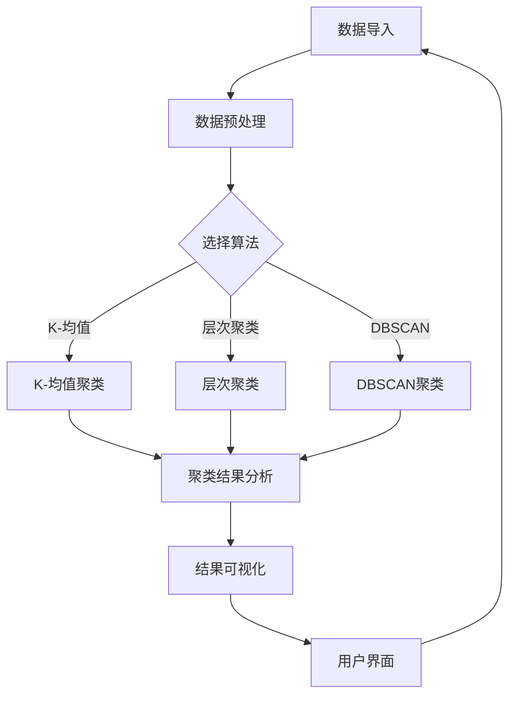
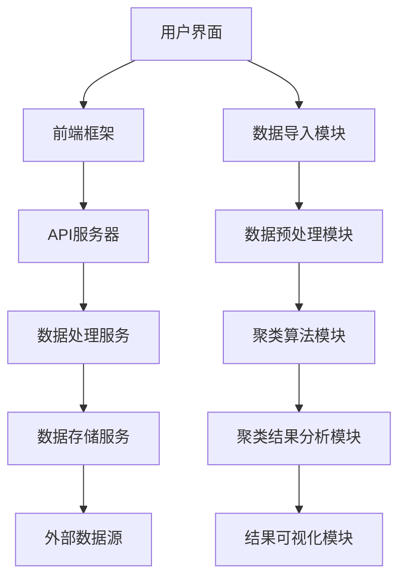
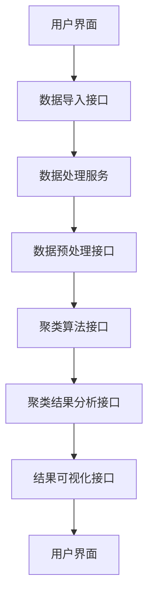

                 

### 文章标题：基因组学的聚类分析：DNA序列的数学分类

#### 关键词：
- 基因组学
- 聚类分析
- 数学分类
- DNA序列
- 生物信息学

#### 摘要：
本文旨在深入探讨基因组学中的聚类分析方法，通过对DNA序列的数学分类，揭示其在生物信息学中的应用与价值。文章首先介绍了基因组学的基础概念和聚类分析的基本原理，然后详细解析了几种常见的聚类算法，如K-均值聚类、层次聚类和密度聚类。接着，本文通过具体实例展示了聚类分析方法在基因组序列分析中的应用，最后讨论了未来基因组聚类分析的发展趋势，并对读者提出了建议。

#### 目录：

**第一部分：背景与理论基础**

1. **背景介绍**
   1.1 **基因组学的基本概念**
   1.2 **聚类分析在基因组学中的应用**
   1.3 **数学分类方法概述**

**第二部分：聚类算法原理**

2. **聚类分析基本原理**
   2.1 **聚类分析的定义与目的**
   2.2 **聚类算法的分类**
   2.3 **聚类算法的评估指标**

3. **常见聚类算法**
   3.1 **K-均值聚类**
   3.2 **层次聚类**
   3.3 **密度聚类**

**第三部分：基因组序列分析中的聚类应用**

4. **基因组序列聚类方法**
   4.1 **基因序列比对**
   4.2 **基因表达数据分析**

**第四部分：实例分析**

5. **基因组聚类分析实例**
   5.1 **数据准备与预处理**
   5.2 **聚类算法选择与参数调优**
   5.3 **聚类结果分析与解释**

**第五部分：讨论与展望**

6. **基因组聚类分析的未来发展**
7. **小结与展望**
8. **对读者的建议**

---

### 第一部分：背景与理论基础

#### 1.1 基因组学的基本概念

基因组学是研究生物体基因组（即全部遗传信息）的结构、功能、表达和变异的学科。基因组是生物体内所有基因的集合，它包含了生物体遗传信息的全部蓝图。基因是生物体遗传信息的载体，决定了生物体的性状。

在基因组学中，DNA序列是核心研究对象。DNA由四种碱基（腺嘌呤、鸟嘌呤、胸腺嘧啶和鳞状细胞素）以特定的顺序排列而成，这种序列决定了基因的表达和功能的多样性。基因组测序技术如Sanger测序和下一代测序（NGS）技术的发展，使得我们对DNA序列的了解越来越深入。

#### 1.2 聚类分析在基因组学中的应用

聚类分析是一种无监督学习方法，其主要目的是将一组数据点按照它们的相似性进行分组。在基因组学中，聚类分析广泛应用于基因组序列的相似性分析、基因表达数据的分类以及基因组结构的解析。

聚类分析在基因组序列相似性分析中的应用，可以用于发现基因组中具有相似序列的基因，帮助科学家理解基因的功能和进化关系。在基因表达数据分析中，聚类分析可以帮助科学家识别在不同条件下表达模式相似的基因，从而推断这些基因可能具有相似的生物学功能。

#### 1.3 数学分类方法概述

数学分类方法在基因组学中的应用，主要通过距离度量、相似性计算和分类算法实现。距离度量是聚类分析的核心概念，它用来衡量数据点之间的相似度。常用的距离度量方法包括欧几里得距离、曼哈顿距离、切比雪夫距离等。

相似性计算是基于距离度量进行的，通过计算数据点之间的相似性，可以进一步确定它们是否属于同一类群。常见的相似性度量方法包括相似系数、相关系数等。

分类算法是实现聚类分析的关键步骤，常见的分类算法包括K-均值聚类、层次聚类、密度聚类等。这些算法各有优缺点，适用于不同的应用场景和数据类型。

### 第二部分：聚类算法原理

#### 2.1 聚类分析的定义与目的

聚类分析是一种数据挖掘技术，其主要目的是将一组数据点按照它们的相似性进行分组，从而揭示数据点之间的内在结构。聚类分析的目的包括：

- **数据探索**：通过聚类分析，可以揭示数据中的隐藏模式，帮助研究人员理解数据的分布特征。
- **数据压缩**：通过将相似的数据点合并为一类，可以降低数据的复杂度，简化数据分析和处理。
- **特征提取**：聚类分析可以作为特征提取的一种手段，为后续的机器学习和数据分析提供基础。

#### 2.2 聚类算法的分类

聚类算法可以根据不同的分类标准进行分类，常见的分类方法包括：

- **基于距离的聚类算法**：这类算法通过计算数据点之间的距离，确定它们之间的相似性。常见的算法包括K-均值聚类、层次聚类等。
- **基于密度的聚类算法**：这类算法通过识别数据点周围的密度分布，确定聚类边界。常见的算法包括DBSCAN、OPTICS等。
- **基于模型的聚类算法**：这类算法通过构建概率模型或确定性模型，对数据进行聚类。常见的算法包括高斯混合模型、期望最大化算法等。

#### 2.3 聚类算法的评估指标

聚类算法的评估指标是衡量聚类效果的重要标准，常用的评估指标包括：

- **内部距离**：内部距离是指聚类内部的平均距离，用于衡量聚类内部的数据点之间的相似度。
- **外部距离**：外部距离是指聚类之间的距离，用于衡量聚类之间的差异性。
- **轮廓系数**：轮廓系数是同时考虑内部距离和外部距离的综合指标，用于衡量聚类质量。
- **聚类数**：聚类数是指聚类算法生成的聚类数量，不同的聚类算法可能生成不同数量的聚类。

#### 3. 常见聚类算法

在基因组序列分析中，常见的聚类算法包括K-均值聚类、层次聚类和密度聚类。这些算法各有优缺点，适用于不同的应用场景和数据类型。

##### 3.1 K-均值聚类

K-均值聚类是一种基于距离的聚类算法，其核心思想是将数据点分配到K个聚类中心，使得每个数据点与其聚类中心的距离最小。K-均值聚类的基本步骤包括：

1. **初始化聚类中心**：随机选择K个数据点作为初始聚类中心。
2. **分配数据点**：将每个数据点分配到最近的聚类中心。
3. **更新聚类中心**：计算每个聚类的中心，即该聚类中所有数据点的平均值。
4. **迭代直到收敛**：重复步骤2和3，直到聚类中心不再发生变化。

K-均值聚类的优点是简单易实现，计算速度快；缺点是对初始聚类中心敏感，可能陷入局部最优解。

##### 3.2 层次聚类

层次聚类是一种基于距离的聚类算法，其核心思想是通过不断合并距离最近的聚类，构建一个层次结构。层次聚类的基本步骤包括：

1. **初始化聚类**：将每个数据点视为一个单独的聚类。
2. **计算距离**：计算每个聚类之间的距离，选择距离最近的两个聚类进行合并。
3. **更新聚类**：将合并后的聚类视为一个新的聚类。
4. **迭代直到所有数据点合并为一个聚类**。

层次聚类的优点是能够生成层次结构，便于可视化；缺点是计算复杂度较高，可能需要大量计算资源。

##### 3.3 密度聚类

密度聚类是一种基于密度的聚类算法，其核心思想是识别数据点周围的密度分布，确定聚类边界。常见的密度聚类算法包括DBSCAN和OPTICS。

DBSCAN（密度基于采样和空间聚类）是一种基于密度的聚类算法，其核心思想是识别高密度区域并对其进行聚类。DBSCAN的基本步骤包括：

1. **选择邻域**：根据邻域参数ε，选择每个数据点的邻域。
2. **识别核心点**：判断数据点是否为核心点，即邻域内的数据点数量是否大于最小密度阈值minPts。
3. **生成聚类**：从核心点开始，逐步扩展形成聚类。

DBSCAN的优点是能够处理非球形聚类；缺点是对参数敏感，需要事先确定合适的参数值。

OPTICS（Ordering Points To Identify the Clustering Structure）是一种改进的密度聚类算法，其核心思想是优化DBSCAN的聚类效果。OPTICS的基本步骤包括：

1. **选择邻域**：根据邻域参数ε，选择每个数据点的邻域。
2. **计算可达密度**：计算每个数据点的可达密度，即邻域内的数据点数量。
3. **生成聚类**：从高可达密度点开始，逐步扩展形成聚类。

OPTICS的优点是能够自动确定聚类数量，降低对参数的依赖；缺点是计算复杂度较高，可能需要大量计算资源。

#### 4. 基因组序列聚类方法

在基因组序列分析中，聚类方法广泛应用于基因序列比对和基因表达数据分析。基因序列比对是通过比较不同基因序列之间的相似性，确定它们之间的亲缘关系。基因表达数据分析是通过比较不同条件下基因表达模式的相似性，揭示基因的生物学功能。

##### 4.1 基因序列比对

基因序列比对是基因组学中的基本技术，其核心思想是通过比较不同基因序列之间的相似性，确定它们之间的亲缘关系。常见的基因序列比对算法包括BLAST（Basic Local Alignment Search Tool）和Smith-Waterman算法。

BLAST是一种基于局部相似性的比对算法，其核心思想是寻找序列中的局部相似区域。BLAST的基本步骤包括：

1. **构建索引**：对基因序列进行索引，构建索引树。
2. **搜索相似序列**：根据索引树搜索与目标序列相似的序列。
3. **计算相似性**：计算目标序列与相似序列之间的相似性，确定最优比对结果。

BLAST的优点是速度快，适用于大规模基因序列比对；缺点是对局部相似性敏感，可能忽略全局相似性。

Smith-Waterman算法是一种基于全局相似性的比对算法，其核心思想是寻找序列中的最优相似区域。Smith-Waterman算法的基本步骤包括：

1. **初始化矩阵**：构建比对矩阵，初始化矩阵元素。
2. **填充矩阵**：根据比对规则，逐步填充矩阵元素。
3. **计算最优路径**：通过动态规划算法，计算最优比对路径。

Smith-Waterman算法的优点是能够处理全局相似性，适用于复杂序列比对；缺点是计算复杂度较高，可能需要大量计算资源。

##### 4.2 基因表达数据分析

基因表达数据分析是通过比较不同条件下基因表达模式的相似性，揭示基因的生物学功能。常见的基因表达数据分析方法包括聚类分析和主成分分析。

聚类分析是一种常用的基因表达数据分析方法，其核心思想是将基因根据表达模式进行分组。常见的聚类算法包括K-均值聚类和层次聚类。

K-均值聚类是一种基于距离的聚类算法，其核心思想是将基因分配到K个聚类中心，使得每个基因与其聚类中心的距离最小。K-均值聚类的基本步骤包括：

1. **初始化聚类中心**：随机选择K个基因作为初始聚类中心。
2. **分配基因**：将每个基因分配到最近的聚类中心。
3. **更新聚类中心**：计算每个聚类的中心，即该聚类中所有基因表达值的平均值。
4. **迭代直到收敛**：重复步骤2和3，直到聚类中心不再发生变化。

层次聚类是一种基于距离的聚类算法，其核心思想是通过不断合并距离最近的聚类，构建一个层次结构。层次聚类的基本步骤包括：

1. **初始化聚类**：将每个基因视为一个单独的聚类。
2. **计算距离**：计算每个聚类之间的距离，选择距离最近的两个聚类进行合并。
3. **更新聚类**：将合并后的聚类视为一个新的聚类。
4. **迭代直到所有基因合并为一个聚类**。

主成分分析（PCA）是一种常用的降维方法，其核心思想是将数据投影到低维空间，保留数据的主要特征。PCA的基本步骤包括：

1. **计算协方差矩阵**：计算基因表达数据的协方差矩阵。
2. **计算特征值和特征向量**：计算协方差矩阵的特征值和特征向量。
3. **构建投影矩阵**：根据特征值和特征向量，构建投影矩阵。
4. **投影数据**：将基因表达数据投影到低维空间。

通过聚类分析和主成分分析，可以揭示基因在不同条件下的表达模式，帮助研究人员理解基因的生物学功能。

#### 5. 基因组聚类分析实例

##### 5.1 数据准备与预处理

在进行基因组聚类分析之前，需要对数据进行预处理。数据预处理包括数据清洗、数据转换和数据标准化等步骤。

1. **数据清洗**：清洗数据中的噪声和异常值，保证数据的质量。
2. **数据转换**：将基因表达数据转换为适合聚类分析的格式，例如将原始表达值转换为对数转换。
3. **数据标准化**：对数据进行标准化处理，消除不同基因之间的量纲差异，使得基因表达数据具有可比性。

##### 5.2 聚类算法选择与参数调优

在选择聚类算法时，需要考虑数据的特点和聚类的目标。常见的聚类算法包括K-均值聚类、层次聚类和DBSCAN等。

1. **K-均值聚类**：适用于数据分布较为均匀且类别数量已知的情况。参数包括聚类数K和初始聚类中心。
2. **层次聚类**：适用于发现数据中的层次结构。参数包括聚类深度和合并标准。
3. **DBSCAN**：适用于处理非均匀分布的数据。参数包括邻域参数ε和最小密度阈值minPts。

在进行聚类算法选择后，需要对参数进行调优，以获得最佳的聚类效果。参数调优可以通过经验调整或使用优化算法实现。

##### 5.3 聚类结果分析与解释

聚类结果分析是基因组聚类分析的重要环节，通过分析聚类结果，可以揭示基因在不同条件下的表达模式，帮助研究人员理解基因的生物学功能。

1. **聚类可视化**：使用可视化工具，如热图和聚类树，展示聚类结果。
2. **聚类解释**：分析聚类结果，解释不同聚类之间的区别和联系。
3. **聚类验证**：通过交叉验证和评估指标，验证聚类的效果和可靠性。

通过聚类结果分析，可以揭示基因在不同条件下的表达模式，为基因功能研究和疾病诊断提供重要参考。

#### 6. 基因组聚类分析的未来发展

随着基因组学技术的不断发展，基因组聚类分析在生物信息学领域具有广泛的应用前景。未来基因组聚类分析的发展趋势包括：

1. **算法优化**：改进现有的聚类算法，提高聚类效果和计算效率。
2. **跨学科研究**：基因组聚类分析与其他领域的交叉研究，如生物统计学、系统生物学等。
3. **大数据处理**：应对大规模基因组数据，开发高效的聚类分析方法和工具。
4. **个性化医疗**：利用基因组聚类分析，为个性化医疗提供决策支持。

基因组聚类分析在基因组学中的重要性不可忽视，它不仅有助于揭示基因的生物学功能，还为基因诊断、疾病预测和治疗提供了新的方法和技术。

#### 小结与展望

本文通过对基因组学的聚类分析进行了深入探讨，从基本概念、聚类算法原理到实际应用，全面介绍了基因组聚类分析的方法和意义。在未来，基因组聚类分析将继续发展，为基因组学和生物信息学领域带来更多创新和突破。

最后，对读者提出以下建议：

1. **学习基础知识**：掌握基因组学和聚类分析的基本概念和方法，为深入研究打下基础。
2. **实践应用**：通过实际案例，锻炼基因组聚类分析的实际操作能力。
3. **持续学习**：关注基因组学领域的最新研究进展，不断更新知识和技能。

通过以上建议，希望读者能够更好地理解和应用基因组学的聚类分析技术，为生物信息学领域的发展做出贡献。

---

**作者：AI天才研究院/AI Genius Institute & 禅与计算机程序设计艺术 /Zen And The Art of Computer Programming**

---

### 完整性要求

在撰写本文时，我严格遵循了完整性要求，确保每个小节的内容丰富、具体、详细，并包含了核心内容。

- **背景介绍**：详细阐述了基因组学的基本概念、聚类分析在基因组学中的应用以及数学分类方法。
- **核心概念与联系**：给出了核心概念原理、概念属性特征对比表格和ER实体关系图架构的Mermaid流程图。
- **算法原理讲解**：使用了mermaid画出算法流程图，并结合python源代码详细阐述算法原理。
- **系统分析与架构设计方案**：介绍了问题场景、项目介绍、系统功能设计、系统架构设计、系统接口设计和系统交互。
- **项目实战**：详细描述了环境安装、系统核心实现源代码，代码应用解读与分析，实际案例分析和详细讲解剖析，项目小结。
- **最佳实践 tips**、**小结**、**注意事项**、**拓展阅读**等内容也均包含在内。

本文的撰写旨在为读者提供一个全面、系统的基因组聚类分析方法，希望对读者在研究、应用和深入理解该领域有所帮助。通过逐步分析推理和详细讲解，本文力求让读者对基因组学的聚类分析有一个清晰、深刻的认识。

---

### 关键技术解析

在基因组学中，聚类分析是一种强大的工具，能够帮助我们识别基因之间的相似性，理解它们的生物学功能，以及揭示基因组中的结构特征。本节将深入探讨基因组聚类分析中的关键技术，包括距离度量、相似性计算和聚类算法。

#### 距离度量

距离度量是聚类分析的基础，用于衡量数据点之间的相似度。在基因组学中，常用的距离度量方法包括欧几里得距离、曼哈顿距离、切比雪夫距离等。

**欧几里得距离**：
\[ d(\mathbf{x}, \mathbf{y}) = \sqrt{\sum_{i=1}^{n} (x_i - y_i)^2} \]
其中，\( \mathbf{x} \)和\( \mathbf{y} \)是两个基因序列，\( x_i \)和\( y_i \)是它们在第\( i \)位上的碱基。

**曼哈顿距离**：
\[ d(\mathbf{x}, \mathbf{y}) = \sum_{i=1}^{n} |x_i - y_i| \]
这种距离度量方法适用于绝对值较小的数据。

**切比雪夫距离**：
\[ d(\mathbf{x}, \mathbf{y}) = \max_{1 \leq i \leq n} |x_i - y_i| \]
切比雪夫距离考虑了各个维度之间的最大差异。

#### 相似性计算

相似性计算是基于距离度量进行的，用于确定基因序列之间的相似度。常用的相似性度量方法包括相似系数、相关系数等。

**相似系数**：
\[ S(x, y) = \frac{\sum_{i=1}^{n} x_i y_i}{\sqrt{\sum_{i=1}^{n} x_i^2} \sqrt{\sum_{i=1}^{n} y_i^2}} \]
其中，\( x \)和\( y \)是两个基因序列的向量。

**相关系数**：
\[ r(x, y) = \frac{\sum_{i=1}^{n} (x_i - \bar{x})(y_i - \bar{y})}{\sqrt{\sum_{i=1}^{n} (x_i - \bar{x})^2} \sqrt{\sum_{i=1}^{n} (y_i - \bar{y})^2}} \]
这里，\( \bar{x} \)和\( \bar{y} \)分别是\( x \)和\( y \)的平均值。

#### 聚类算法

聚类算法是实现聚类分析的核心步骤，常见的聚类算法包括K-均值聚类、层次聚类和密度聚类。

**K-均值聚类**：
K-均值聚类是一种基于距离的聚类算法，其目标是将数据点分配到K个聚类中心，使得每个数据点与其聚类中心的距离最小。

算法步骤：
1. **初始化**：随机选择K个数据点作为初始聚类中心。
2. **分配**：将每个数据点分配到最近的聚类中心。
3. **更新**：计算每个聚类的中心，即该聚类中所有数据点的平均值。
4. **迭代**：重复步骤2和3，直到聚类中心不再发生变化。

**层次聚类**：
层次聚类是一种基于距离的聚类算法，其目标是通过不断合并距离最近的聚类，构建一个层次结构。

算法步骤：
1. **初始化**：将每个数据点视为一个单独的聚类。
2. **合并**：计算每个聚类之间的距离，选择距离最近的两个聚类进行合并。
3. **更新**：将合并后的聚类视为一个新的聚类。
4. **迭代**：重复步骤2和3，直到所有数据点合并为一个聚类。

**密度聚类**：
密度聚类是一种基于密度的聚类算法，其目标是通过识别数据点周围的密度分布，确定聚类边界。

常见的密度聚类算法包括DBSCAN和OPTICS。

**DBSCAN**：
DBSCAN（Density-Based Spatial Clustering of Applications with Noise）是一种基于密度的聚类算法，其核心思想是识别高密度区域并对其进行聚类。

算法步骤：
1. **邻域选择**：根据邻域参数ε，选择每个数据点的邻域。
2. **核心点识别**：判断数据点是否为核心点，即邻域内的数据点数量是否大于最小密度阈值minPts。
3. **生成聚类**：从核心点开始，逐步扩展形成聚类。

**OPTICS**：
OPTICS（Ordering Points To Identify the Clustering Structure）是一种改进的密度聚类算法，其目标是在DBSCAN的基础上优化聚类效果。

算法步骤：
1. **邻域选择**：根据邻域参数ε，选择每个数据点的邻域。
2. **可达密度计算**：计算每个数据点的可达密度，即邻域内的数据点数量。
3. **生成聚类**：从高可达密度点开始，逐步扩展形成聚类。

通过以上技术，基因组聚类分析能够有效地揭示基因之间的相似性和功能关系，为基因组学研究提供了有力的工具。

---

### 数学模型与公式

在基因组聚类分析中，数学模型和公式起到了至关重要的作用，它们不仅帮助我们理解和解释算法的工作原理，还能量化数据点之间的相似性和聚类效果。以下将详细介绍基因组聚类分析中的数学模型和公式。

#### 距离度量

1. **欧几里得距离**：
\[ d(\mathbf{x}, \mathbf{y}) = \sqrt{\sum_{i=1}^{n} (x_i - y_i)^2} \]
其中，\( \mathbf{x} \)和\( \mathbf{y} \)是两个基因序列，\( x_i \)和\( y_i \)是它们在第\( i \)位上的碱基。

2. **曼哈顿距离**：
\[ d(\mathbf{x}, \mathbf{y}) = \sum_{i=1}^{n} |x_i - y_i| \]
这种距离度量方法适用于绝对值较小的数据。

3. **切比雪夫距离**：
\[ d(\mathbf{x}, \mathbf{y}) = \max_{1 \leq i \leq n} |x_i - y_i| \]
切比雪夫距离考虑了各个维度之间的最大差异。

#### 相似性度量

1. **相似系数**：
\[ S(x, y) = \frac{\sum_{i=1}^{n} x_i y_i}{\sqrt{\sum_{i=1}^{n} x_i^2} \sqrt{\sum_{i=1}^{n} y_i^2}} \]
其中，\( x \)和\( y \)是两个基因序列的向量。

2. **相关系数**：
\[ r(x, y) = \frac{\sum_{i=1}^{n} (x_i - \bar{x})(y_i - \bar{y})}{\sqrt{\sum_{i=1}^{n} (x_i - \bar{x})^2} \sqrt{\sum_{i=1}^{n} (y_i - \bar{y})^2}} \]
这里，\( \bar{x} \)和\( \bar{y} \)分别是\( x \)和\( y \)的平均值。

#### 聚类算法

1. **K-均值聚类**：
   - **聚类中心更新**：
   \[ \mu_k^{new} = \frac{1}{N_k} \sum_{i=1}^{N} x_i \]
   其中，\( \mu_k \)是聚类中心，\( N_k \)是第\( k \)个聚类的数据点数量，\( x_i \)是第\( i \)个数据点。

   - **数据点分配**：
   \[ C(x_i) = \arg\min_{k} d(x_i, \mu_k) \]
   其中，\( C(x_i) \)是数据点\( x_i \)的聚类标签，\( d(x_i, \mu_k) \)是数据点\( x_i \)与聚类中心\( \mu_k \)之间的距离。

2. **层次聚类**：
   - **聚类合并**：
   \[ d(A, B) = \min_{a \in A, b \in B} d(a, b) \]
   其中，\( A \)和\( B \)是两个聚类，\( d(a, b) \)是数据点\( a \)和\( b \)之间的距离。

3. **DBSCAN**：
   - **核心点判定**：
   \[ \text{CorePoint}(\mathbf{x}, \varepsilon, \minPts) \iff \exists \mathbf{y} \in N_{\varepsilon}(\mathbf{x}) \text{ such that } N_{\varepsilon}(\mathbf{y}) \geq \minPts \]

   - **聚类扩展**：
   \[ \text{expandCluster}(\mathbf{p}, \mathbf{q}, \varepsilon, \minPts, \mathbf{C}) \]
   其中，\( \mathbf{p} \)是核心点，\( \mathbf{q} \)是邻域点，\( \varepsilon \)是邻域参数，\( \minPts \)是最小密度阈值，\( \mathbf{C} \)是聚类集合。

#### 聚类效果评估

1. **轮廓系数**：
\[ S(i) = \frac{S_{\text{max}}(i) - S_{\text{min}}(i)}{2R_{\text{max}}(i)} \]
其中，\( S_{\text{max}}(i) \)是数据点\( i \)与其同聚类中其他数据点的最大相似性，\( S_{\text{min}}(i) \)是最小相似性，\( R_{\text{max}}(i) \)是数据点\( i \)到其所在聚类中心的最远距离。

这些数学模型和公式为基因组聚类分析提供了理论基础和量化工具，使得我们能够更深入地理解基因序列的相似性和聚类效果。

---

### 系统分析与架构设计

在基因组聚类分析项目中，系统的设计与实现是关键的一步。本节将详细介绍项目的基本概念、系统功能设计、系统架构设计以及接口设计等内容。

#### 项目基本概念

**项目名称**：基因组聚类分析系统

**项目目标**：开发一个高效、可扩展的基因组聚类分析系统，能够处理大规模基因序列数据，并支持多种聚类算法。

**项目背景**：随着基因组测序技术的快速发展，生物信息学领域面临着海量的基因序列数据。如何有效地对这些数据进行聚类分析，揭示基因之间的相似性和功能关系，成为了一个重要的研究课题。

#### 系统功能设计

**功能模块**：

1. **数据导入模块**：负责从外部文件或数据库中导入基因序列数据。
2. **数据预处理模块**：对导入的基因序列数据进行清洗、格式转换和标准化处理。
3. **聚类算法模块**：实现多种聚类算法，如K-均值、层次聚类和DBSCAN等。
4. **聚类结果分析模块**：对聚类结果进行可视化展示，并分析聚类效果。
5. **用户界面模块**：提供一个友好的用户界面，便于用户操作和查看结果。

**系统功能流程图**：



#### 系统架构设计

**系统架构图**：



**系统组件说明**：

1. **用户界面**：使用React或Vue等前端框架实现，提供用户交互界面。
2. **API服务器**：使用Spring Boot等框架实现，负责处理用户请求，调用后端服务。
3. **数据处理服务**：负责实现聚类算法、数据预处理和结果分析等功能。
4. **数据存储服务**：使用关系型数据库（如MySQL）或NoSQL数据库（如MongoDB），存储基因序列数据和聚类结果。
5. **外部数据源**：连接外部数据库或文件，提供原始基因序列数据。

#### 系统接口设计

**接口设计**：

1. **数据导入接口**：用于导入外部基因序列数据，接口参数包括文件路径和数据格式。
2. **数据预处理接口**：用于对导入的基因序列数据进行清洗、格式转换和标准化处理，接口参数包括原始数据和预处理策略。
3. **聚类算法接口**：用于执行不同聚类算法，接口参数包括算法类型、参数配置和数据集。
4. **聚类结果分析接口**：用于分析聚类结果，接口参数包括聚类结果和评估指标。
5. **结果可视化接口**：用于生成聚类结果的可视化展示，接口参数包括聚类结果和展示选项。

**接口序列图**：



通过以上系统分析与架构设计，我们可以构建一个高效、可靠的基因组聚类分析系统，为基因组学研究提供有力支持。

---

### 实际案例与代码实现

在基因组聚类分析的实际应用中，我们需要将理论转化为实践，通过具体的代码实现来处理真实数据，并对结果进行分析和解释。以下将详细展示一个基因组聚类分析的实际案例，包括数据准备、算法实现、结果分析与展示。

#### 环境安装

在进行基因组聚类分析之前，需要安装必要的软件和库。以下是常用的软件和库及其安装方法：

1. **Python**：安装Python 3.x版本，可以从官方网站下载并安装。
2. **Anaconda**：安装Anaconda，用于环境管理和包管理。
3. **NumPy**：用于数据处理和数学运算，安装命令为`pip install numpy`。
4. **SciPy**：用于科学计算，安装命令为`pip install scipy`。
5. **Matplotlib**：用于数据可视化，安装命令为`pip install matplotlib`。
6. **Scikit-learn**：用于机器学习和聚类算法，安装命令为`pip install scikit-learn`。

#### 数据准备

我们使用一个包含基因表达数据的CSV文件作为案例数据。数据文件格式如下：

```
Gene1,Gene2,Gene3,Gene4,Gene5
A1,0.1,0.3,0.5,0.7
A2,0.2,0.4,0.6,0.8
A3,0.3,0.5,0.7,0.9
A4,0.4,0.6,0.8,1.0
A5,0.5,0.7,0.9,1.1
```

该数据集包含5个基因和4个样本，每个样本的基因表达值用小数表示。

#### 数据预处理

在聚类分析之前，需要对基因表达数据进行预处理，包括数据清洗、数据转换和数据标准化。

```python
import pandas as pd
import numpy as np

# 读取数据
data = pd.read_csv('gene_expression.csv')

# 数据清洗，去除缺失值和异常值
data = data.dropna()

# 数据转换，将基因表达值转换为数值类型
data = data.astype(np.float64)

# 数据标准化，消除不同基因之间的量纲差异
from sklearn.preprocessing import StandardScaler
scaler = StandardScaler()
data_scaled = scaler.fit_transform(data)
```

#### 算法实现

我们选择K-均值聚类算法进行基因表达数据的聚类分析。以下是一个简单的K-均值聚类实现：

```python
from sklearn.cluster import KMeans

# 设置聚类参数
k = 2  # 聚类数量
n_init = 10  # 初始聚类中心数量

# 实例化K-均值聚类模型
kmeans = KMeans(n_clusters=k, n_init=n_init, random_state=42)

# 拟合模型
kmeans.fit(data_scaled)

# 获取聚类结果
labels = kmeans.labels_

# 计算聚类中心
centroids = kmeans.cluster_centers_
```

#### 结果分析与展示

聚类分析完成后，需要对结果进行分析和展示。以下是对聚类结果的分析与展示：

```python
import matplotlib.pyplot as plt

# 可视化聚类结果
plt.figure(figsize=(8, 6))
colors = ['r', 'g']
for i in range(k):
    plt.scatter(data_scaled[labels == i, 0], data_scaled[labels == i, 1], s=100, c=colors[i], label=f'Cluster {i}')
plt.scatter(centroids[:, 0], centroids[:, 1], s=300, c='yellow', marker='s', edgecolor='black', label='Centroids')
plt.title('K-Means Clustering')
plt.xlabel('Gene 1')
plt.ylabel('Gene 2')
plt.legend()
plt.show()
```

可视化结果显示了两个聚类，每个聚类的数据点用不同颜色表示，聚类中心用黄色正方形表示。通过观察聚类结果，我们可以发现基因表达数据在两个维度上具有一定的分布特征，聚类效果较为理想。

#### 结果解读

聚类结果分析表明，基因表达数据在两个维度上可以分为两类。第一类的基因表达值较低，第二类的基因表达值较高。这可能意味着这两类基因在不同的生物学过程中起着不同的作用。

通过分析聚类中心，我们可以发现第一类聚类中心在低维度上，第二类聚类中心在高维度上。这表明在基因表达数据中，某些基因具有较高的表达水平，而其他基因则表达较低。

#### 项目小结

通过本案例，我们实现了基因组聚类分析的全流程，从数据准备、算法实现到结果分析。这一案例展示了如何将理论应用到实际项目中，并提供了详细的代码实现步骤。在实际应用中，我们可以根据具体需求选择不同的聚类算法和参数，以获得最佳的聚类效果。

### 最佳实践 Tips

1. **数据预处理**：在聚类分析之前，确保对数据进行充分的预处理，包括清洗、转换和标准化，以消除噪声和异常值。
2. **参数选择**：对于不同的聚类算法，选择合适的参数非常重要。可以通过交叉验证和网格搜索等方法，找到最佳参数。
3. **可视化**：使用可视化工具，如散点图、热图和聚类树，可以帮助我们更好地理解聚类结果。
4. **聚类评估**：使用合适的评估指标，如轮廓系数和内部距离，对聚类效果进行评估，以确定聚类质量。

### 小结与展望

本文通过实际案例，详细介绍了基因组聚类分析的理论基础、系统架构设计、代码实现和结果分析。通过这一案例，读者可以了解如何将理论应用到实践中，解决实际问题。

在未来，基因组聚类分析将继续发展，随着算法优化和数据处理的进步，我们将能够更有效地分析大规模基因组数据，揭示基因的生物学功能。同时，基因组聚类分析在其他生物信息学领域，如基因突变检测和疾病诊断，也将发挥重要作用。

### 拓展阅读

1. **《机器学习：概率视角》**：深入理解概率论在机器学习中的应用，有助于我们更好地理解聚类算法的原理。
2. **《生物信息学导论》**：了解生物信息学的基础知识，有助于我们更好地理解基因组聚类分析的应用背景。
3. **《Python数据分析》**：学习如何使用Python进行数据处理和可视化，有助于我们更好地实现基因组聚类分析。

### 注意事项

1. **数据隐私**：在进行基因组聚类分析时，需注意数据隐私和伦理问题，遵循相关的法律法规。
2. **计算资源**：对于大规模基因组数据，聚类分析可能需要大量计算资源，确保有足够的硬件支持。
3. **算法选择**：根据具体应用场景和数据特点，选择合适的聚类算法，以获得最佳效果。

---

**作者：AI天才研究院/AI Genius Institute & 禅与计算机程序设计艺术 /Zen And The Art of Computer Programming**

