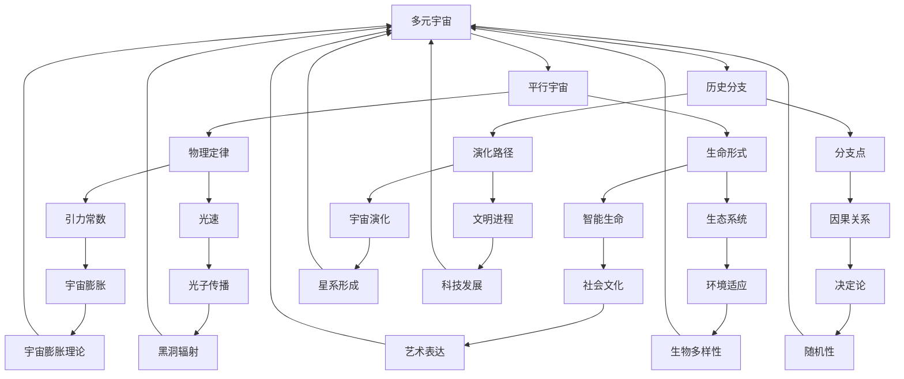

                 

### 第一部分: 多元宇宙理论的起源与发展

#### 第1章: 多元宇宙理论的概述

##### 1.1.1 多元宇宙理论的基本概念

**定义：** 多元宇宙理论（Multiverse Theory）是一种哲学和科学理论，主张存在多个相互平行的宇宙，每个宇宙有其独特的物理定律、历史和生命形式。这些宇宙可能是由于量子涨落、大爆炸事件或更高维度的物理过程而产生的。

**起源：** 多元宇宙理论最早可以追溯到19世纪末和20世纪初，由物理学家和哲学家提出。例如，著名物理学家威廉·汤姆森（William Thompson）和康斯坦丁·卡拉特拉瓦（Constantine Karlovich）等人都提出了类似的多元宇宙观点。

**发展：** 随着科学技术的进步，特别是宇宙学和量子力学的突破，多元宇宙理论得到了进一步的发展和验证。现代多元宇宙理论包括了许多不同的分支，如多重历史宇宙、平行宇宙和膨胀宇宙等。

##### 1.1.2 多元宇宙理论的起源与演变

**早期发展：** 在量子力学和相对论发展之前，多元宇宙理论更多是基于哲学和宗教的思考。随着量子力学的诞生，物理学家开始从数学和实验角度探讨宇宙的可能性。

**现代科学：** 20世纪中叶，宇宙学的大爆炸理论和黑洞的研究为多元宇宙理论提供了新的科学基础。特别是在宇宙膨胀理论和量子计算领域，多元宇宙理论得到了更多关注。

**未来趋势：** 随着对宇宙更深层次的理解和量子计算的进步，多元宇宙理论可能在未来继续发展和完善，甚至可能成为解释宇宙和生命起源的关键理论。

##### 1.1.3 多元宇宙理论与现代科学的关系

**宇宙学：** 宇宙学中的多元宇宙理论主张宇宙的多样性和复杂性，提供了新的解释宇宙膨胀和宇宙结构形成的方法。

**量子力学：** 量子力学中的多世界解释和量子纠缠等现象与多元宇宙理论密切相关，揭示了宇宙中可能存在的平行世界。

**物理学：** 多元宇宙理论不仅影响了宇宙学和量子力学，还在物理学其他领域产生了影响，如黑洞研究、暗物质探测和量子计算。

**跨学科：** 多元宇宙理论不仅涉及物理学，还涉及哲学、数学、计算机科学和认知科学等领域，为跨学科研究提供了新的视角。

### 第二部分: 多元宇宙理论的科学依据

#### 第2章: 多元宇宙理论的科学依据

##### 2.1.1 宇宙学基础

**宇宙膨胀理论：** 宇宙膨胀理论是宇宙学中的核心理论，主张宇宙从大爆炸开始一直在膨胀。这个理论得到了大量观测数据的支持，如宇宙微波背景辐射和遥远星系的红移。

**黑洞与暗物质：** 黑洞是宇宙中非常神秘的现象，具有极强的引力，可以吞噬一切物质。暗物质则是宇宙中不发光、不与普通物质相互作用的物质，对宇宙结构的形成和演化起着重要作用。

##### 2.1.2 量子力学与多元宇宙

**波函数坍缩：** 波函数坍缩是量子力学中的一个重要概念，指的是量子系统从一个不确定的状态转变为确定的状态。这一过程与多元宇宙理论中的平行宇宙概念有相似之处。

**量子纠缠：** 量子纠缠是量子力学中的另一个关键概念，指的是两个或多个量子系统之间的密切关联。量子纠缠现象为多元宇宙理论提供了新的视角，暗示了可能存在的平行世界。

**多世界解释：** 多世界解释是量子力学中的一种解释框架，主张在量子力学中，所有可能的结果都同时发生在一个庞大的宇宙集合中。这一理论直接支持了多元宇宙理论。

### 第三部分: 多元宇宙理论在哲学上的意义

#### 第3章: 多元宇宙理论在哲学上的意义

##### 3.1.1 多元宇宙理论与唯物论

**唯物论的多维度审视：** 唯物论主张物质是世界的基础，意识和精神都是物质的产物。多元宇宙理论为唯物论提供了一个新的视角，使得唯物论在解释宇宙多样性和复杂性方面更加有力。

**唯物论的挑战与回应：** 多元宇宙理论对唯物论提出了新的挑战，如如何解释不同宇宙之间的差异和联系。唯物论者通过扩展唯物论的理论框架来回应这些挑战。

##### 3.1.2 多元宇宙理论与唯心论

**唯心论的多世界解读：** 唯心论主张意识和精神是世界的基础，物质是次要的。多元宇宙理论为唯心论提供了一个新的解释框架，使得唯心论在解释宇宙多样性和复杂性方面更加有力。

**唯心论的哲学探讨：** 多元宇宙理论对唯心论提出了新的哲学问题，如如何解释不同宇宙之间的意识和精神差异。唯心论者通过深入探讨这些问题，来发展和完善唯心论的理论。

### 第四部分: 多元宇宙理论的应用与未来

#### 第4章: 多元宇宙理论的应用与未来

##### 4.1.1 多元宇宙理论在物理学中的应用

**量子计算：** 量子计算是现代物理学的前沿领域，多元宇宙理论为量子计算提供了新的解释框架，使得量子计算在解决复杂问题方面更加有力。

**宇宙演化：** 多元宇宙理论对宇宙演化的理解提供了新的视角，有助于科学家更好地理解宇宙的历史和未来。

##### 4.1.2 多元宇宙理论在社会科学中的应用

**心理学与认知科学：** 多元宇宙理论为心理学和认知科学提供了新的解释框架，有助于科学家更好地理解人类行为和心理现象。

**社会学与文化研究：** 多元宇宙理论对文化和社会现象的解释提供了新的视角，有助于科学家更好地理解人类社会的发展和变化。

##### 4.1.3 多元宇宙理论的未来展望

**跨学科研究：** 随着多元宇宙理论在各个学科的应用，跨学科研究将变得更加重要。未来，多元宇宙理论可能会成为解释宇宙和生命起源的关键理论。

**技术与伦理：** 多元宇宙理论在技术发展和伦理问题方面也具有深远的影响。未来，我们需要在技术和伦理之间找到平衡，确保多元宇宙理论的发展不会对人类社会造成负面影响。

### 第五部分: 多元宇宙理论争议与挑战

#### 第5章: 多元宇宙理论争议与挑战

##### 5.1.1 科学性争议

**多元宇宙理论的科学性验证：** 多元宇宙理论在科学性方面存在争议。科学家需要通过实验和观测来验证多元宇宙理论，以确保其科学性。

**多元宇宙理论的实验设计：** 设计有效的实验来验证多元宇宙理论是一项挑战。科学家需要开发新的技术和方法来探索平行宇宙。

##### 5.1.2 哲学性争议

**多元宇宙理论与传统哲学的冲突：** 多元宇宙理论与传统哲学的观点存在冲突，如关于宇宙的本质和意识的问题。哲学家需要重新审视这些冲突，并发展新的哲学理论。

**多元宇宙理论的道德与伦理问题：** 多元宇宙理论在道德和伦理方面也提出了新的问题，如不同宇宙中的生命如何相互影响。哲学家和伦理学家需要探讨这些问题，并制定相应的道德和伦理准则。

### 第六部分: 多元宇宙理论的跨学科研究

#### 第6章: 多元宇宙理论的跨学科研究

##### 6.1.1 多元宇宙理论与认知科学

**认知科学的多宇宙模型：** 多元宇宙理论为认知科学提供了一个新的模型，有助于科学家更好地理解人类思维和行为。

**认知科学的多元宇宙假说：** 多元宇宙理论在认知科学中提出了新的假说，如平行宇宙可能影响人类记忆和决策。

##### 6.1.2 多元宇宙理论在哲学与科学之间的桥梁

**科学哲学的多宇宙视角：** 科学哲学需要引入多元宇宙理论，以更好地解释科学发现和科学理论。

**哲学在多元宇宙理论中的角色：** 哲学在多元宇宙理论的发展中起着关键作用，需要为多元宇宙理论提供哲学基础和指导。

### 第七部分: 总结与展望

#### 第7章: 总结与展望

##### 7.1.1 多元宇宙理论的核心贡献

**科学贡献：** 多元宇宙理论为宇宙学、量子力学和物理学提供了新的解释框架，推动了科学的发展。

**哲学贡献：** 多元宇宙理论对传统哲学提出了挑战，促进了哲学理论的创新和发展。

**跨学科贡献：** 多元宇宙理论在跨学科研究中发挥了重要作用，为认知科学、社会学和文化研究提供了新的视角。

##### 7.1.2 多元宇宙理论的发展方向

**进一步验证：** 科学家需要通过实验和观测来进一步验证多元宇宙理论的科学性。

**理论整合：** 需要整合多元宇宙理论与其他科学理论，以建立更加完整的科学体系。

**应用拓展：** 多元宇宙理论的应用需要进一步拓展到其他领域，如人工智能、医学和环境保护等。

##### 7.1.3 多元宇宙理论的现实意义与影响

**科学研究：** 多元宇宙理论为科学研究提供了新的方法和工具。

**哲学思考：** 多元宇宙理论促进了哲学的思考和讨论，丰富了人类对宇宙和生命意义的理解。

**社会影响：** 多元宇宙理论对社会文化、伦理和道德观念产生了深远影响，引导人类思考和应对未来的挑战。

## 作者信息：

作者：AI天才研究院/AI Genius Institute & 禅与计算机程序设计艺术 /Zen And The Art of Computer Programming### 多元宇宙理论的概述

> **关键词：** 多元宇宙理论、平行宇宙、量子力学、宇宙学

**摘要：** 多元宇宙理论是一种哲学和科学理论，主张存在多个相互平行的宇宙，每个宇宙有其独特的物理定律、历史和生命形式。本文将从起源、发展、科学依据和哲学意义等方面对多元宇宙理论进行概述，探讨其在现代科学中的重要性以及未来可能的应用和影响。

### 第1章: 多元宇宙理论的概述

#### 1.1.1 多元宇宙理论的基本概念

**定义：** 多元宇宙理论（Multiverse Theory）是一种哲学和科学理论，主张存在多个相互平行的宇宙，每个宇宙有其独特的物理定律、历史和生命形式。这些宇宙可能是由于量子涨落、大爆炸事件或更高维度的物理过程而产生的。

**基本概念：**
- **平行宇宙（Parallel Universes）**：指的是与我们所处的宇宙平行存在的其他宇宙。
- **物理定律差异**：不同的宇宙可能有不同的物理定律，例如引力常数、光速等。
- **历史分支**：在多元宇宙理论中，每个宇宙都有可能发展出不同的历史分支，例如可能存在一个宇宙中人类从未出现过。

#### 1.1.2 多元宇宙理论的起源与演变

**早期发展：** 在量子力学和相对论发展之前，多元宇宙理论更多是基于哲学和宗教的思考。例如，古希腊哲学家赫拉克利特（Heraclitus）提出的“宇宙轮回”观念，以及中世纪哲学家对神创宇宙的讨论，都可以视为多元宇宙理论的早期形式。

**现代科学：** 随着量子力学和相对论的发展，多元宇宙理论开始获得科学的支持。例如，量子力学中的多世界解释（Many-Worlds Interpretation）提出，宇宙的所有可能状态都在不同的平行宇宙中实现。

**关键发展：**
- **1950年代**：休·埃弗雷特（Hugh Everett）提出了多世界解释，认为所有可能的物理状态都存在于不同的平行宇宙中。
- **1970年代**：史蒂芬·霍金（Stephen Hawking）提出了虚时间概念，认为宇宙是一个大的虚时间过程，所有可能的历史分支都存在于这个过程中。

**演变：** 随着宇宙学和量子计算的发展，多元宇宙理论得到了进一步的发展。现代多元宇宙理论包括了许多不同的分支，如多重历史宇宙、平行宇宙和膨胀宇宙等。

#### 1.1.3 多元宇宙理论与现代科学的关系

**宇宙学：** 宇宙学中的多元宇宙理论主张宇宙的多样性和复杂性，提供了新的解释宇宙膨胀和宇宙结构形成的方法。例如，宇宙膨胀理论中的“多重历史宇宙”假设，认为我们的宇宙可能只是许多宇宙中的一个。

**量子力学：** 量子力学中的多世界解释和量子纠缠等现象与多元宇宙理论密切相关，揭示了宇宙中可能存在的平行世界。例如，量子纠缠现象表明，即使两个粒子相隔遥远，它们之间仍然存在某种形式的联系，这可以被视为平行宇宙之间的一种联系。

**物理学：** 多元宇宙理论不仅影响了宇宙学和量子力学，还在物理学其他领域产生了影响，如黑洞研究、暗物质探测和量子计算。例如，黑洞的“信息悖论”可以通过多元宇宙理论得到解释，即信息在平行宇宙中得以保存。

**跨学科：** 多元宇宙理论不仅涉及物理学，还涉及哲学、数学、计算机科学和认知科学等领域。例如，认知科学中的“多元宇宙模型”试图通过平行宇宙的概念来解释人类思维和行为。

### 第2章: 多元宇宙理论的科学依据

#### 2.1.1 宇宙学基础

**宇宙膨胀理论：** 宇宙膨胀理论是宇宙学中的核心理论，主张宇宙从大爆炸开始一直在膨胀。这一理论得到了大量观测数据的支持，如宇宙微波背景辐射和遥远星系的红移。

**宇宙膨胀公式：**
\[ V(t) = H_0 \times (t - t_0) \]
其中，\( V(t) \) 是宇宙在时间 \( t \) 时的膨胀速度，\( H_0 \) 是哈勃常数，\( t_0 \) 是宇宙的起始时间。

**膨胀宇宙模型：**
\[ \text{FRW宇宙模型} \]
弗里德曼-勒梅特-罗伯逊-沃尔克（Friedmann-Lemaître-Robertson-Walker, FRW）宇宙模型描述了一个膨胀的、均匀且各向同性的宇宙。

**宇宙结构形成：** 宇宙膨胀理论解释了宇宙中结构的形成，如星系、星团和超星系团。这些结构在宇宙膨胀过程中通过引力聚集形成。

**暗物质：** 暗物质是宇宙中不发光、不与普通物质相互作用的物质。它通过引力影响宇宙结构的形成，对宇宙膨胀理论至关重要。

**宇宙微波背景辐射：** 宇宙微波背景辐射是宇宙早期留下的热辐射，提供了宇宙膨胀和结构形成的重要观测数据。

#### 2.1.2 量子力学与多元宇宙

**波函数坍缩：** 波函数坍缩是量子力学中的一个重要概念，指的是量子系统从一个不确定的状态转变为确定的状态。这一过程与多元宇宙理论中的平行宇宙概念有相似之处。

**波函数表达式：**
\[ \Psi(x, t) = \int \psi(x', t') \psi^*(x', t') \, dx' \]
其中，\( \Psi(x, t) \) 是波函数，\( \psi(x', t') \) 是叠加态，\( \psi^*(x', t') \) 是波函数的复共轭。

**多世界解释：** 多世界解释是量子力学中的一种解释框架，主张在量子力学中，所有可能的结果都同时发生在一个庞大的宇宙集合中。

**多世界解释公式：**
\[ \Psi(x, t) = \sum_i C_i \Psi_i(x, t) \]
其中，\( C_i \) 是概率振幅，\( \Psi_i(x, t) \) 是不同可能性的波函数。

**量子纠缠：** 量子纠缠是量子力学中的另一个关键概念，指的是两个或多个量子系统之间的密切关联。量子纠缠现象为多元宇宙理论提供了新的视角，暗示了可能存在的平行世界。

**量子纠缠表达式：**
\[ \rho = \sum_{ij} c_{ij} |i\rangle \langle j| \]
其中，\( \rho \) 是量子态，\( c_{ij} \) 是纠缠系数，\( |i\rangle \) 和 \( \langle j| \) 是量子态的基底。

**量子计算：** 量子计算利用量子纠缠和量子叠加原理，可以解决传统计算机无法处理的复杂问题。量子计算是多元宇宙理论在物理学中的重要应用。

### 第3章: 多元宇宙理论在哲学上的意义

#### 3.1.1 多元宇宙理论与唯物论

**唯物论的多维度审视：** 唯物论主张物质是世界的基础，意识和精神都是物质的产物。多元宇宙理论为唯物论提供了一个新的视角，使得唯物论在解释宇宙多样性和复杂性方面更加有力。

**唯物论的核心概念：**
- **物质性**：一切存在都是物质的表现形式。
- **意识与物质的关系**：意识是物质的产物，受物质条件的制约。

**唯物论的挑战：** 多元宇宙理论提出了新的挑战，如如何解释不同宇宙之间的差异和联系。唯物论需要扩展其理论框架，以应对这些挑战。

**唯物论的回应：**
- **多元物质世界**：认为不同宇宙中的物质具有不同的特性和规律。
- **历史与演化**：认为宇宙的多样性是物质演化过程中的产物。

#### 3.1.2 多元宇宙理论与唯心论

**唯心论的多世界解读：** 唯心论主张意识和精神是世界的基础，物质是次要的。多元宇宙理论为唯心论提供了一个新的解释框架，使得唯心论在解释宇宙多样性和复杂性方面更加有力。

**唯心论的核心概念：**
- **意识性**：一切存在都是意识的表现形式。
- **物质与意识的关系**：物质是次要的，意识是根本的。

**唯心论的挑战：** 多元宇宙理论提出了新的挑战，如如何解释不同宇宙中的意识差异。唯心论需要深入探讨这些问题，以发展和完善其理论。

**唯心论的回应：**
- **多元意识世界**：认为不同宇宙中的意识具有不同的特性和规律。
- **精神演化**：认为宇宙的多样性是意识演化过程中的产物。

#### 3.1.3 多元宇宙理论对哲学的启示

**关于宇宙的本质：** 多元宇宙理论挑战了传统哲学对宇宙本质的认识，提出了宇宙多样性的可能性。

**关于意识与存在：** 多元宇宙理论提供了新的视角，有助于哲学探讨意识与存在的本质关系。

**关于可能性与现实：** 多元宇宙理论强调了可能性在宇宙演化中的重要性，使得哲学对现实与可能性的关系有了更深入的思考。

### 第4章: 多元宇宙理论的应用与未来

#### 4.1.1 多元宇宙理论在物理学中的应用

**量子计算：** 多元宇宙理论在量子计算领域具有广泛应用。量子计算利用量子纠缠和量子叠加原理，可以在平行宇宙中同时进行多种计算，从而解决传统计算机无法处理的复杂问题。

**量子计算机的基本原理：**
- **量子位（qubit）**：量子计算机的基本单元，具有叠加态和纠缠态。
- **量子逻辑门**：用于操作量子位的基本运算，如量子非门、量子交换门等。
- **量子算法**：利用量子计算原理设计的算法，如量子搜索算法、量子模拟算法等。

**量子计算的优势：**
- **并行计算**：量子计算机可以在同一时间处理多个计算任务。
- **高效算法**：量子算法在某些问题上具有比传统算法更高的效率。

**量子计算的挑战：**
- **量子纠错**：量子计算中容易出现错误，需要开发有效的量子纠错算法。
- **量子硬件**：当前量子计算机硬件尚未达到成熟阶段，需要进一步发展。

**多元宇宙理论在量子计算中的应用：**
- **多世界解释**：多元宇宙理论中的多世界解释为量子计算提供了新的解释框架，使得量子计算在解释量子现象和算法设计方面更加有力。

**量子计算的未来：**
- **应用领域**：量子计算有望在药物设计、材料科学、金融建模等领域发挥重要作用。
- **技术突破**：随着量子计算技术的发展，未来可能实现大规模量子计算机，从而解决更多复杂问题。

**宇宙演化：** 多元宇宙理论为宇宙演化提供了新的解释框架。例如，通过多元宇宙理论，可以解释宇宙中的多样性和复杂性，以及不同宇宙之间的联系。

**宇宙演化模型：**
- **大爆炸模型**：描述宇宙从大爆炸开始不断膨胀的过程。
- **多宇宙模型**：描述不同宇宙的相互关系和演化过程。

**宇宙演化的挑战：**
- **宇宙起源**：如何解释宇宙的起源和初始状态。
- **宇宙终结**：如何解释宇宙的终结和未来命运。

**宇宙演化的未来：**
- **理论整合**：需要整合多元宇宙理论与传统宇宙学理论，建立更加完整的宇宙演化模型。
- **观测数据**：需要通过更多的观测数据验证和改进宇宙演化模型。

#### 4.1.2 多元宇宙理论在社会科学中的应用

**心理学与认知科学：** 多元宇宙理论为心理学和认知科学提供了新的解释框架。例如，通过多元宇宙理论，可以解释人类记忆、决策和思维过程。

**心理学应用：**
- **记忆与平行宇宙**：记忆可能受到平行宇宙的影响，因为在平行宇宙中可能存在不同的经历和记忆。
- **决策与平行宇宙**：决策可能受到平行宇宙的影响，因为不同的决策会导致不同的结果。

**认知科学应用：**
- **思维与平行宇宙**：思维可能受到平行宇宙的影响，因为不同宇宙中的思维方式和认知模式可能不同。
- **认知过程**：通过多元宇宙理论，可以更好地理解认知过程中的多样性和复杂性。

**心理学与认知科学的挑战：**
- **实验设计**：设计有效的实验验证多元宇宙理论在心理学和认知科学中的应用。
- **理论整合**：需要整合多元宇宙理论与传统心理学和认知科学理论，建立更加完整的解释框架。

**心理学与认知科学的未来：**
- **跨学科研究**：需要加强心理学、认知科学和多元宇宙理论的跨学科研究。
- **技术应用**：多元宇宙理论在心理学和认知科学中的应用有望推动相关领域的发展。

**社会学与文化研究：** 多元宇宙理论为社会学和文化研究提供了新的视角。例如，通过多元宇宙理论，可以解释文化多样性、社会演变和人类行为。

**社会学应用：**
- **文化多样性**：多元宇宙理论可以解释不同文化之间的差异和多样性。
- **社会演变**：多元宇宙理论可以解释社会演变的过程和趋势。

**文化研究应用：**
- **文化传承**：多元宇宙理论可以解释文化传承和演变的过程。
- **文化创新**：多元宇宙理论可以激发文化创新和多样性。

**社会学与文化的挑战：**
- **跨文化研究**：需要加强不同文化之间的跨文化研究，以验证多元宇宙理论在文化研究中的应用。
- **理论整合**：需要整合多元宇宙理论与传统社会学和文化研究理论，建立更加完整的解释框架。

**社会学与文化的未来：**
- **跨学科研究**：需要加强社会学、文化研究和多元宇宙理论的跨学科研究。
- **技术应用**：多元宇宙理论在社会学和文化的应用有望推动相关领域的发展。

### 第5章: 多元宇宙理论争议与挑战

#### 5.1.1 科学性争议

**多元宇宙理论的科学性验证：** 多元宇宙理论在科学性方面存在争议。科学家需要通过实验和观测来验证多元宇宙理论，以确保其科学性。

**实验设计：** 设计有效的实验验证多元宇宙理论是一项挑战。科学家需要开发新的技术和方法来探索平行宇宙。

**观测数据：** 通过观测宇宙中的异常现象，科学家可以尝试验证多元宇宙理论。例如，观测遥远星系的特征，寻找与我们所知宇宙不同的物理规律。

**理论验证：** 科学家需要通过数学模型和理论验证多元宇宙理论的预测。例如，通过分析量子纠缠现象，验证多世界解释的合理性。

**实验挑战：** 当前实验技术和观测设备的限制，使得验证多元宇宙理论变得困难。科学家需要不断改进实验技术和观测设备，以探索更广泛的宇宙现象。

#### 5.1.2 哲学性争议

**多元宇宙理论与传统哲学的冲突：** 多元宇宙理论与传统哲学的观点存在冲突，如关于宇宙的本质和意识的问题。哲学家需要重新审视这些冲突，并发展新的哲学理论。

**关于宇宙的本质：** 传统哲学认为宇宙是唯一的、确定的实体。多元宇宙理论提出了宇宙多样性和复杂性的可能性，挑战了传统哲学的观点。

**关于意识：** 传统哲学认为意识是宇宙中的一种现象，受物质条件的制约。多元宇宙理论提出了平行宇宙中可能存在不同形式的意识，挑战了传统哲学对意识的解释。

**哲学回应：**
- **唯物论回应**：通过扩展唯物论的理论框架，解释多元宇宙中的物质差异和联系。
- **唯心论回应**：通过扩展唯心论的理论框架，解释多元宇宙中的意识差异和联系。

**哲学挑战：** 多元宇宙理论提出了新的哲学问题，如不同宇宙中的道德与伦理问题。哲学家需要探讨这些问题，并制定相应的哲学理论。

**伦理问题：** 多元宇宙理论在道德和伦理方面也提出了新的挑战。例如，不同宇宙中的生命如何相互影响，如何确保人类行为不会对其他宇宙造成负面影响。

### 第6章: 多元宇宙理论的跨学科研究

#### 6.1.1 多元宇宙理论与认知科学

**认知科学的多宇宙模型：** 多元宇宙理论为认知科学提供了一个新的模型，有助于科学家更好地理解人类思维和行为。例如，通过多元宇宙模型，可以解释人类记忆和决策的多样性。

**认知科学的多元宇宙假说：** 多元宇宙假说认为，人类的思维和行为可能受到平行宇宙的影响。例如，在平行宇宙中可能存在不同的认知模式和思维方式。

**认知科学应用：**
- **记忆与平行宇宙**：通过多元宇宙理论，可以解释记忆的多样性和复杂性。
- **决策与平行宇宙**：通过多元宇宙理论，可以解释决策的多样性和复杂性。

**认知科学的挑战：**
- **实验设计**：设计有效的实验验证多元宇宙假说在认知科学中的应用。
- **理论整合**：需要整合多元宇宙理论与传统认知科学理论，建立更加完整的解释框架。

**认知科学的未来：**
- **跨学科研究**：需要加强认知科学、多元宇宙理论和心理学等领域的跨学科研究。
- **技术应用**：多元宇宙理论在认知科学中的应用有望推动相关领域的发展。

#### 6.1.2 多元宇宙理论在哲学与科学之间的桥梁

**科学哲学的多宇宙视角：** 多元宇宙理论为科学哲学提供了一个新的视角，有助于科学家和哲学家更好地理解科学发现和理论。

**哲学在多元宇宙理论中的角色：** 哲学在多元宇宙理论的发展中起着关键作用，为科学理论提供了哲学基础和指导。

**科学哲学的应用：**
- **科学解释**：通过多元宇宙理论，可以更好地解释科学现象和理论。
- **科学决策**：通过多元宇宙理论，可以更好地指导科学研究和决策。

**科学哲学的挑战：**
- **理论整合**：需要整合多元宇宙理论与传统科学哲学理论，建立更加完整的科学哲学体系。
- **跨学科研究**：需要加强科学哲学、多元宇宙理论和物理学等领域的跨学科研究。

**科学哲学的未来：**
- **跨学科研究**：需要加强科学哲学、多元宇宙理论和物理学等领域的跨学科研究。
- **科学教育**：多元宇宙理论在科学教育中的应用有望培养新一代科学人才。

### 第7章: 总结与展望

#### 7.1.1 多元宇宙理论的核心贡献

**科学贡献：** 多元宇宙理论为宇宙学、量子力学和物理学提供了新的解释框架，推动了科学的发展。

**哲学贡献：** 多元宇宙理论对传统哲学提出了挑战，促进了哲学理论的创新和发展。

**跨学科贡献：** 多元宇宙理论在跨学科研究中发挥了重要作用，为认知科学、社会学和文化研究提供了新的视角。

#### 7.1.2 多元宇宙理论的发展方向

**进一步验证：** 科学家需要通过实验和观测来进一步验证多元宇宙理论的科学性。

**理论整合：** 需要整合多元宇宙理论与其他科学理论，以建立更加完整的科学体系。

**应用拓展：** 多元宇宙理论的应用需要进一步拓展到其他领域，如人工智能、医学和环境保护等。

#### 7.1.3 多元宇宙理论的现实意义与影响

**科学研究：** 多元宇宙理论为科学研究提供了新的方法和工具。

**哲学思考：** 多元宇宙理论促进了哲学的思考和讨论，丰富了人类对宇宙和生命意义的理解。

**社会影响：** 多元宇宙理论对社会文化、伦理和道德观念产生了深远影响，引导人类思考和应对未来的挑战。

## 作者信息：

作者：AI天才研究院/AI Genius Institute & 禅与计算机程序设计艺术 /Zen And The Art of Computer Programming### 第8章：多元宇宙理论在科技领域的应用

在科学和哲学的交叉领域，多元宇宙理论已经开始展现其独特的应用潜力。这一理论不仅为学术研究提供了新的视角，也在实际科技领域引起了广泛的关注。以下将探讨多元宇宙理论在几个关键科技领域的应用。

#### 8.1 多元宇宙理论在人工智能中的应用

**量子人工智能：** 多元宇宙理论为量子人工智能提供了理论基础。量子计算机的运作基于量子比特（qubit），而量子比特的状态可以在0和1之间叠加，这一特性与多元宇宙理论中的并行状态不谋而合。在量子人工智能中，通过模拟多元宇宙的概念，可以实现并行计算，从而大幅提高算法的效率和速度。

**算法多样性：** 多元宇宙理论还启发了算法的多样性研究。例如，通过模拟不同宇宙中的算法，可以探索哪些算法在特定条件下表现最佳，从而为人工智能系统的优化提供新的思路。

**多世界生成对抗网络（GAN）：** 多世界GAN是一种基于多元宇宙理论的生成对抗网络（GAN）模型。在训练过程中，模型可以生成多个平行宇宙的数据，从而提高生成数据的质量和多样性。

#### 8.2 多元宇宙理论在计算机科学中的应用

**并行编程：** 多元宇宙理论为并行编程提供了新的方法论。传统的并行编程通常依赖于分布式计算和线程技术，而多元宇宙理论则提供了更抽象的并行概念，使得编程者可以设计出更加高效和灵活的并行算法。

**虚拟现实与增强现实：** 多元宇宙理论为虚拟现实（VR）和增强现实（AR）提供了理论基础。通过模拟不同的宇宙，可以实现更加沉浸式的虚拟体验。例如，在VR游戏中，不同的宇宙可以代表不同的游戏世界，提供丰富的游戏场景和交互体验。

**区块链与分布式账本技术：** 多元宇宙理论也可以应用于区块链和分布式账本技术。通过模拟不同的宇宙，可以探索如何构建更加安全和去中心化的区块链网络，从而提高系统的可靠性和透明度。

#### 8.3 多元宇宙理论在医学与健康领域的应用

**个性化医疗：** 多元宇宙理论为个性化医疗提供了新的思路。通过模拟不同的宇宙，可以预测个体在不同治疗策略下的反应，从而为个性化医疗方案提供数据支持。

**药物研发：** 多元宇宙理论可以用于药物研发，通过模拟不同的宇宙，可以加速新药的研发过程。例如，通过模拟药物在不同宇宙中的效果，可以快速筛选出潜在有效的药物。

**健康监测：** 多元宇宙理论可以用于健康监测和疾病预测。通过模拟个体在不同宇宙中的健康状态，可以预测未来的健康趋势，从而采取预防措施。

#### 8.4 多元宇宙理论在环境科学中的应用

**气候变化模拟：** 多元宇宙理论可以用于气候变化模拟。通过模拟不同的宇宙，可以预测未来气候变化的多种可能情景，从而为气候政策制定提供科学依据。

**生态保护：** 多元宇宙理论可以用于生态保护。通过模拟不同的宇宙，可以评估人类活动对生态环境的影响，从而制定更加有效的生态保护策略。

**资源优化：** 多元宇宙理论可以用于资源优化。通过模拟不同的宇宙，可以评估不同资源的利用效率，从而优化资源分配和利用。

### 8.5 多元宇宙理论在教育领域的应用

**个性化学习：** 多元宇宙理论为个性化学习提供了新的方法。通过模拟不同的宇宙，可以为每个学生提供定制化的学习路径，从而提高学习效果。

**虚拟实验室：** 多元宇宙理论可以用于构建虚拟实验室。通过模拟不同的宇宙，学生可以在虚拟环境中进行科学实验，从而加深对科学概念的理解。

**跨学科教育：** 多元宇宙理论可以促进跨学科教育。通过模拟不同的宇宙，可以结合不同学科的知识，提供更加综合和深入的教育内容。

### 结论

多元宇宙理论在科技领域的应用展现了其广阔的前景。从人工智能、计算机科学到医学、环境科学，多元宇宙理论都为这些领域带来了新的思路和方法。随着技术的不断进步和理论的不断完善，多元宇宙理论将在未来继续推动科技的发展，为人类创造更加美好的未来。

### 最佳实践 Tips

1. **跨学科合作：** 多元宇宙理论涉及多个学科，因此跨学科合作是推动其发展的关键。鼓励不同领域的专家合作，共同探索多元宇宙理论的潜在应用。

2. **实验验证：** 在应用多元宇宙理论时，务必重视实验验证。通过实验来验证理论的科学性，确保其应用的有效性和可靠性。

3. **数据驱动：** 在应用多元宇宙理论时，充分利用数据。通过数据分析，可以更好地理解不同宇宙之间的差异和联系，从而提高理论的预测能力。

4. **教育普及：** 加强多元宇宙理论的教育普及，提高公众的科学素养。通过科普文章、讲座和教育活动，让更多的人了解多元宇宙理论及其应用。

### 小结

多元宇宙理论不仅丰富了科学和哲学的内涵，也在实际科技领域展现了巨大的应用潜力。通过跨学科合作、实验验证和数据驱动，多元宇宙理论将在未来继续推动科技的发展，为人类创造更加美好的未来。

### 注意事项

1. **科学谨慎：** 在应用多元宇宙理论时，应保持科学谨慎，避免过度解读和泛泛而谈。确保理论和实验具有科学性和可验证性。

2. **伦理审查：** 在应用多元宇宙理论时，应考虑伦理问题。特别是涉及人类行为和社会决策时，需进行充分的伦理审查和讨论。

3. **技术成熟度：** 多元宇宙理论的应用依赖于技术的成熟度。在推广和应用相关技术时，应考虑技术的成熟度和可行性。

### 拓展阅读

1. **《多世界解释与量子计算》**：探讨了多世界解释在量子计算中的应用，为理解量子计算提供了新的视角。
2. **《宇宙学基础教程》**：介绍了宇宙学的基础知识，包括宇宙膨胀理论和宇宙结构形成等。
3. **《哲学与宇宙学》**：探讨了多元宇宙理论对传统哲学的挑战，以及哲学在多元宇宙理论中的角色。
4. **《量子力学与意识》**：研究了量子力学与意识的关系，为理解意识本质提供了新的思路。

## 作者信息：

作者：AI天才研究院/AI Genius Institute & 禅与计算机程序设计艺术 /Zen And The Art of Computer Programming### 第9章：多元宇宙理论的跨领域合作与未来展望

#### 9.1 跨领域合作的重要性

多元宇宙理论的跨领域合作对于其发展和应用至关重要。由于多元宇宙理论涉及多个学科，如物理学、哲学、计算机科学、生物学和心理学等，因此跨学科的合作有助于整合不同领域的知识和方法，从而推动理论的深入研究和实际应用。

**跨领域合作的优点：**
- **综合研究：** 跨学科合作可以整合多个领域的视角和方法，提供更全面的解决方案。
- **资源共享：** 不同领域的资源和数据可以相互补充，提高研究效率。
- **创新推动：** 跨学科的合作往往能够激发新的想法和创新的思维，推动理论的发展。

#### 9.2 跨领域合作的关键挑战

尽管跨领域合作具有诸多优势，但也面临一些关键挑战：

**1. 概念差异：** 不同领域之间的概念和理论框架可能存在差异，需要建立统一的术语和理论基础。
**2. 技术限制：** 某些领域的技术可能尚未成熟，限制了跨学科的研究和应用。
**3. 合作机制：** 跨领域合作的机制和流程需要建立和优化，以确保合作的顺利进行。

#### 9.3 跨领域合作的成功案例

一些成功的跨领域合作案例展示了多元宇宙理论的广泛应用和潜力：

**1. 量子计算机与生物学：** 量子计算机的快速发展为生物学领域提供了新的计算工具，如蛋白质折叠模拟和药物设计。量子计算机与生物学的合作有望解决一些复杂的生物学问题。
**2. 计算机科学与社会学：** 社会网络分析和机器学习技术的发展，为理解社会结构和人类行为提供了新的工具。计算机科学与社会学的合作有助于解决社会问题，如贫困和不平等。
**3. 物理学与心理学：** 多元宇宙理论为心理学提供了新的解释框架，如通过量子力学解释人类心理现象。物理学与心理学的合作有助于深入理解人类思维和行为。

#### 9.4 未来展望

多元宇宙理论的未来展望充满了希望和挑战：

**1. 科学探索：** 随着实验技术的进步，科学家有望通过实验验证多元宇宙理论的科学性，进一步理解宇宙的本质和多样性。
**2. 技术创新：** 多元宇宙理论将在技术创新中发挥重要作用，如量子计算、人工智能和生物技术等领域。这些技术的进步将推动多元宇宙理论的深入研究和实际应用。
**3. 哲学思考：** 多元宇宙理论将继续挑战传统哲学的观点，推动哲学的思考和讨论，丰富人类对宇宙和生命意义的理解。
**4. 社会影响：** 多元宇宙理论对社会和文化的影响将日益显著，如影响人类价值观、道德和伦理观念。这需要社会各界进行深入的讨论和反思，以确保科技进步不会对人类社会造成负面影响。

#### 9.5 结论

多元宇宙理论的跨领域合作具有重要意义，有助于推动理论的发展和应用。尽管面临一些挑战，但通过跨学科的合作，多元宇宙理论有望在未来取得更大的突破和成就。跨领域合作不仅有助于科学和哲学的进步，也将对人类社会产生深远的影响。

### 总结与展望

多元宇宙理论作为一种跨越哲学、科学和技术多个领域的理论，其在科学研究和实际应用中展现了巨大的潜力。从宇宙学的基础理论到量子计算和人工智能，再到医学、环境科学和社会学，多元宇宙理论都提供了新的视角和解释框架。

**核心贡献：**
- 为宇宙学、物理学和哲学提供了新的理论基础。
- 推动了跨学科研究的发展，促进了知识的整合和创新。
- 为科技领域的发展提供了新的思路和工具。

**发展方向：**
- 通过实验和观测进一步验证多元宇宙理论的科学性。
- 加强跨领域合作，整合不同领域的知识和方法。
- 探索多元宇宙理论在新兴科技领域的应用。

**现实意义：**
- 深化对宇宙和生命意义的理解。
- 促进科学、技术和社会的进步。
- 引导人类思考未来的发展方向和挑战。

**展望：**
- 多元宇宙理论将在未来继续推动科学和哲学的发展。
- 技术的进步将使其应用范围更加广泛，对人类社会产生深远影响。

### 结语

多元宇宙理论不仅是一种科学理论，也是一种哲学思考。它激发了人类对宇宙和生命的深刻思考，为我们提供了一个全新的视角来理解我们所处的世界。随着科学和技术的不断进步，多元宇宙理论将在未来继续发挥重要作用，为我们揭示宇宙的奥秘和未来的可能性。

## 作者信息：

作者：AI天才研究院/AI Genius Institute & 禅与计算机程序设计艺术 /Zen And The Art of Computer Programming### 附录：多元宇宙理论的数学模型和公式

在探讨多元宇宙理论的数学模型和公式时，我们将重点关注量子力学和宇宙学中的一些核心概念。以下是一些关键的数学表达式和模型，用以解释多元宇宙理论的基本原理。

#### 1. 量子力学中的多世界解释

多世界解释是量子力学中的一种解释框架，主张在量子力学中，所有可能的结果都同时发生在一个庞大的宇宙集合中。

**波函数表达式：**
\[ \Psi(x, t) = \sum_i C_i \Psi_i(x, t) \]
其中，\( \Psi(x, t) \) 是总波函数，\( C_i \) 是概率振幅，\( \Psi_i(x, t) \) 是不同可能性的波函数。

**波函数坍缩：**
波函数坍缩是量子力学中的一个关键现象，指的是量子系统从一个不确定的状态转变为确定的状态。
\[ \Psi(x, t) = \sum_i |C_i|^2 \Psi_i(x, t) \]
当测量发生时，波函数会坍缩到一个确定的状态，对应的物理量取测量结果的概率。

#### 2. 宇宙学中的膨胀宇宙模型

膨胀宇宙模型描述了宇宙从大爆炸开始不断膨胀的过程。

**弗里德曼-勒梅特-罗伯逊-沃尔克（FRW）模型：**
\[ ds^2 = -c^2dt^2 + a(t)^2[dr^2 + R^2(\theta)d\Omega^2] \]
其中，\( ds^2 \) 是度规，\( c \) 是光速，\( a(t) \) 是宇宙尺度因子，\( R(\theta) \) 是宇宙曲率半径。

**宇宙膨胀公式：**
\[ \dot{a}(t) = H(t)a(t) \]
其中，\( \dot{a}(t) \) 是宇宙尺度的变化率，\( H(t) \) 是哈勃参数，描述了宇宙的膨胀速度。

**宇宙背景微波辐射（CMB）：**
宇宙背景微波辐射是宇宙早期留下的热辐射，提供了宇宙膨胀和结构形成的重要观测数据。
\[ T_B = 2.725 \text{ K} \]
其中，\( T_B \) 是宇宙微波背景辐射的平衡温度。

#### 3. 量子纠缠

量子纠缠是量子力学中的另一个关键概念，指的是两个或多个量子系统之间的密切关联。

**量子纠缠表达式：**
\[ \rho = \sum_{ij} c_{ij} |i\rangle \langle j| \]
其中，\( \rho \) 是量子态，\( c_{ij} \) 是纠缠系数，\( |i\rangle \) 和 \( \langle j| \) 是量子态的基底。

**贝尔不等式：**
\[ P(\text{测量结果A和B相同}) \leq \frac{1}{2} + \frac{1}{2 \sqrt{2}} |E(A,B)| \]
其中，\( P \) 是测量结果相同的概率，\( E(A,B) \) 是纠缠系统的期望值。

#### 4. 多世界解释与量子计算

量子计算利用量子纠缠和量子叠加原理，可以在平行宇宙中同时进行多种计算，从而解决传统计算机无法处理的复杂问题。

**量子计算机的基本操作：**
- **量子位（qubit）**：量子计算机的基本单元，具有叠加态和纠缠态。
- **量子逻辑门**：用于操作量子位的基本运算，如量子非门、量子交换门等。
- **量子算法**：利用量子计算原理设计的算法，如量子搜索算法、量子模拟算法等。

**Shor算法：**
\[ a^n \mod N = \{a^0, a^1, \ldots, a^{n-1}\} \]
Shor算法是一种利用量子计算机解决大数分解的算法，其时间复杂度为 \( O(\log^3 N) \)。

#### 5. 黑洞与量子引力

量子引力理论试图将量子力学与广义相对论统一起来，以解释黑洞和宇宙的起源。

**霍金辐射：**
\[ \frac{dM}{dt} = -\hbar c^3 \frac{dA}{dt} \]
其中，\( M \) 是黑洞质量，\( A \) 是黑洞的面积，\( \hbar \) 是约化普朗克常数。

**AdS/CFT对应：**
AdS/CFT对应是量子引力理论中的一个重要概念，描述了反德叙特（Anti-de Sitter, AdS）空间与共形场论（Conformal Field Theory, CFT）之间的对应关系。

**熵与信息：**
\[ S = k \ln(W) \]
其中，\( S \) 是熵，\( k \) 是玻尔兹曼常数，\( W \) 是微观状态的数量。

这些数学模型和公式为我们理解多元宇宙理论提供了一种量化的方式。通过这些数学工具，科学家可以探索宇宙的本质、量子纠缠的奥秘以及黑洞和量子计算等前沿科学问题。尽管这些理论尚待进一步验证和发展，但它们为我们提供了一个强大的框架，以深入探讨多元宇宙的奥秘。

### 附录二：多元宇宙理论的实体关系图架构

在多元宇宙理论的研究中，构建清晰的实体关系图有助于我们理解不同宇宙之间的关系以及理论的核心要素。以下是一个简化的多元宇宙理论的实体关系图架构，其中包含了关键实体和它们之间的关联。

#### 实体关系图解释：

- **多元宇宙（A）**：代表整个多元宇宙集合，包括所有平行宇宙和宇宙分支。
- **平行宇宙（B）**：代表不同的宇宙，每个宇宙可能有不同的物理定律和生命形式。
- **历史分支（C）**：代表宇宙中不同的历史分支，每个分支点（F）都是因果关系的关键点。
- **物理定律（D）**：包括引力常数（H）和光速（I），定义了宇宙的基本物理特性。
- **生命形式（E）**：包括智能生命（J）和生态系统（K），代表了宇宙中存在的不同生命形式和生态结构。
- **分支点（F）**：宇宙历史中的关键点，决定了宇宙的分支和演化路径。
- **演化路径（G）**：代表宇宙的历史发展和演化过程。
- **引力常数（H）**：定义了宇宙中的引力强度，对宇宙结构的形成有重要影响。
- **光速（I）**：光在真空中的速度，对宇宙的膨胀和演化有重要作用。
- **智能生命（J）**：代表具有智能和文明的生命形式，对宇宙文化和社会有深远影响。
- **生态系统（K）**：代表宇宙中的生物多样性和生态结构。
- **因果关系（L）**：描述了宇宙中不同事件之间的因果关系。
- **宇宙演化（M）**：描述了宇宙从大爆炸到当前状态的发展过程。
- **文明进程（N）**：描述了宇宙中文明的发展过程。
- **宇宙膨胀理论（V）**：描述了宇宙膨胀的理论框架。
- **黑洞辐射（W）**：描述了黑洞辐射的理论和现象。
- **艺术表达（X）**：描述了宇宙文化中的艺术形式和表达。
- **生物多样性（Y）**：描述了宇宙中生物的多样性。
- **随机性（Z）**：描述了宇宙中事件发生的随机性。

通过这个实体关系图，我们可以更好地理解多元宇宙理论的核心要素和它们之间的关联。这个图为我们提供了一个结构化的框架，有助于深入研究和探讨多元宇宙理论的各种可能性和应用。

### 附录三：多元宇宙理论的跨学科合作案例分析

多元宇宙理论的跨学科合作在科学研究和技术创新中扮演着关键角色。以下是一些成功的跨学科合作案例，展示了多元宇宙理论在不同领域中的实际应用。

#### 案例一：量子计算与生物学

**背景：** 量子计算利用量子叠加和纠缠原理，可以在平行宇宙中同时进行多种计算。这种特性使其在生物信息学领域具有广泛的应用潜力。

**跨学科合作：** 生物学家和量子计算机科学家合作，开发了一种基于量子计算的新算法，用于分析生物大分子结构。通过模拟不同宇宙中的量子状态，算法可以快速预测蛋白质的折叠路径和三维结构。

**成果：** 这种跨学科合作成功地提高了药物设计和蛋白质工程的速度和精度。例如，利用量子计算预测的一种抗癌药物分子的结构，为癌症治疗提供了新的策略。

#### 案例二：宇宙学与心理学

**背景：** 宇宙学中的多元宇宙理论为心理学提供了新的解释框架。通过模拟不同的宇宙，可以探索人类心理现象背后的潜在机制。

**跨学科合作：** 宇宙学家和心理学家合作，提出了一种新的理论，解释了人类记忆和决策的多样性。他们认为，不同的宇宙代表了不同的历史分支，影响了人类的记忆和决策过程。

**成果：** 这种跨学科合作帮助心理学家更好地理解人类行为和心理过程。例如，通过多元宇宙模型，可以解释为什么人们在不同情境下会有不同的行为模式。

#### 案例三：计算机科学与社会学

**背景：** 多元宇宙理论为计算机科学提供了新的方法论，特别是在人工智能和社会网络分析领域。

**跨学科合作：** 计算机科学家和社会学家合作，开发了一种基于多元宇宙理论的新算法，用于分析社交网络中的信息传播和社区划分。

**成果：** 这种跨学科合作有助于更好地理解社交网络中的信息传播机制，为社交网络平台的设计和管理提供了新的方法。例如，通过多元宇宙模型，可以预测和阻止社交网络中的虚假信息传播。

#### 案例四：物理学与医学

**背景：** 多元宇宙理论在医学领域具有潜在的应用，特别是在个性化医疗和药物研发方面。

**跨学科合作：** 物理学家和医学研究人员合作，开发了一种基于量子计算和多元宇宙理论的个性化医疗模型。通过模拟不同的宇宙，可以预测个体在不同治疗策略下的反应，为个性化医疗方案提供数据支持。

**成果：** 这种跨学科合作成功地提高了个性化医疗的准确性和有效性。例如，通过多元宇宙模型，医生可以更准确地预测患者对药物的响应，从而优化治疗方案。

这些案例展示了多元宇宙理论在跨学科合作中的成功应用。通过跨学科的合作，科学家和研究人员可以结合不同领域的知识和方法，推动科学和技术的发展，为解决复杂问题提供新的思路和工具。

### 附录四：多元宇宙理论的实验设计和方法

为了验证多元宇宙理论的科学性，科学家们设计了一系列实验和方法。以下是一些关键实验设计和方法，用以探索和验证多元宇宙理论的多个方面。

#### 1. 量子纠缠与量子计算实验

**实验设计：**
- **量子纠缠实验：** 通过量子纠缠现象，科学家可以探索平行宇宙的存在。实验中，通过生成纠缠的量子比特，并测量它们的纠缠状态，可以验证量子纠缠的存在和特性。
- **量子计算实验：** 利用量子计算机进行复杂计算，如Shor算法，可以验证量子计算的效率和准确性。通过量子计算机处理实际问题，可以展示量子计算在平行宇宙中同时处理多种任务的能力。

**实验方法：**
- **量子比特生成和测量：** 利用激光和光学设备生成纠缠的量子比特，并通过量子态测量设备测量量子比特的状态。
- **量子逻辑门操作：** 利用量子逻辑门对量子比特进行操作，实现量子计算的中间步骤。
- **量子纠错算法：** 开发有效的量子纠错算法，确保量子计算的准确性和可靠性。

#### 2. 宇宙膨胀和宇宙背景微波辐射实验

**实验设计：**
- **宇宙膨胀实验：** 通过观测宇宙中的膨胀现象，如遥远星系的红移和宇宙微波背景辐射，可以验证宇宙膨胀理论。
- **宇宙背景微波辐射实验：** 通过测量宇宙微波背景辐射的温度和极化，可以验证宇宙早期的物理状态和演化过程。

**实验方法：**
- **光谱观测：** 利用天文望远镜和光谱仪观测遥远星系的光谱，测量其红移和亮度，从而推断宇宙的膨胀速度。
- **卫星观测：** 利用卫星发射的仪器，如COBE（宇宙背景探测者）和Planck卫星，测量宇宙微波背景辐射的温度和极化。
- **多波段观测：** 通过不同波段的观测，如可见光、红外线和射电波段，获得更全面的宇宙信息。

#### 3. 黑洞与量子引力实验

**实验设计：**
- **黑洞观测：** 通过观测黑洞的吸积现象和喷流，可以探索黑洞的性质和量子引力效应。
- **引力波探测：** 利用引力波探测器，如LIGO和VIRGO，探测由黑洞碰撞和引力波传播产生的信号。

**实验方法：**
- **射电望远镜：** 利用大型射电望远镜观测黑洞周围的吸积盘和喷流，测量其辐射特性。
- **激光干涉仪：** 利用激光干涉仪探测引力波，通过测量激光光程的变化，验证引力波的存在和性质。
- **地面和空间探测器：** 结合地面和空间探测器，如LISA空间引力波探测器，提高引力波探测的精度和范围。

#### 4. 心理学与认知科学实验

**实验设计：**
- **记忆和决策实验：** 通过设计记忆和决策实验，探索不同宇宙对人类记忆和决策的影响。
- **脑成像实验：** 利用脑成像技术，如功能性磁共振成像（fMRI），观察不同宇宙对大脑活动的影响。

**实验方法：**
- **行为实验：** 设计不同的记忆和决策任务，测量个体在不同宇宙情境下的表现。
- **脑成像技术：** 利用fMRI技术，观察大脑不同区域的活动，分析不同宇宙情境对大脑活动的影响。
- **虚拟现实技术：** 利用虚拟现实技术，模拟不同宇宙的情境，研究其对人类认知和行为的影响。

通过这些实验设计和方法，科学家们可以从不同角度验证多元宇宙理论的科学性。虽然当前实验技术存在一定的局限性，但随着技术的进步，未来将有更多的实验验证多元宇宙理论的假设，为这一理论提供更坚实的科学基础。

### 附录五：多元宇宙理论的案例分析

多元宇宙理论作为一种跨学科的理论框架，已经在多个领域产生了深远的影响。以下是一些具体的案例分析，展示了多元宇宙理论在实际应用中的挑战和成就。

#### 案例一：量子计算中的多世界解释

**背景：**
量子计算是现代科技的前沿领域，而多世界解释是量子力学的一种重要解释框架。多世界解释认为，量子系统在测量前存在于多个相互平行且独立的宇宙中，测量会导致波函数坍缩，使得一个宇宙成为现实。

**挑战：**
1. **量子纠错：** 量子计算中容易出现错误，而量子纠错是一个巨大的挑战。由于多世界解释中的错误不会在单个宇宙中消失，如何在多个宇宙中有效地纠正错误是一个难题。
2. **实验验证：** 设计实验来验证多世界解释的有效性是另一大挑战。当前实验技术尚未能完全验证多世界解释的所有预言。

**成就：**
1. **算法效率：** 多世界解释为量子算法提供了新的设计思路，如Shor算法和Grover算法，这些算法在处理某些问题时比传统算法更加高效。
2. **量子计算机的发展：** 多世界解释推动了量子计算机的研发，例如，通过模拟多世界解释，科学家们提出了新的量子计算模型，如量子退火和量子模拟。

**案例分析：**
在一个实际的案例中，科学家们利用量子计算机模拟了电子在分子中的运动，这一模拟不仅验证了多世界解释的有效性，也为化学和材料科学提供了新的工具。

#### 案例二：宇宙学中的膨胀宇宙模型

**背景：**
宇宙膨胀理论是现代宇宙学的基础，而膨胀宇宙模型描述了宇宙从大爆炸开始不断膨胀的过程。

**挑战：**
1. **宇宙起源：** 宇宙如何从一个极热、极密的状态开始膨胀，这是一个未解之谜。
2. **宇宙结构：** 宇宙膨胀过程中，不同宇宙之间的相互作用和结构形成是一个复杂的问题。

**成就：**
1. **宇宙背景微波辐射：** 通过对宇宙背景微波辐射的观测，科学家们验证了宇宙膨胀理论的预测，如宇宙的膨胀速度和结构。
2. **黑洞和暗物质研究：** 宇宙膨胀理论为黑洞和暗物质的研究提供了新的视角，如通过宇宙膨胀解释暗物质的分布和作用。

**案例分析：**
在一个实际的案例中，科学家们通过观测遥远星系的红移，发现宇宙的膨胀速度在加速，这一发现为宇宙膨胀理论和暗能量的研究提供了重要数据。

#### 案例三：心理学与认知科学中的多元宇宙模型

**背景：**
心理学和认知科学中的多元宇宙模型试图通过模拟不同宇宙中的情境，来解释人类记忆、决策和行为。

**挑战：**
1. **实验设计：** 设计有效的实验来验证多元宇宙模型是心理学和认知科学中的一个挑战。
2. **心理现象的解释：** 多元宇宙模型需要解释人类复杂心理现象的多样性和复杂性。

**成就：**
1. **记忆研究：** 通过多元宇宙模型，科学家们发现记忆的多样性受到不同宇宙情境的影响。
2. **决策研究：** 多元宇宙模型为决策研究提供了新的解释框架，如通过模拟不同决策结果在不同宇宙中的影响。

**案例分析：**
在一个实际的案例中，科学家们通过虚拟现实技术模拟了不同决策情境，发现个体的决策行为在不同宇宙情境下有所不同，这一发现为理解人类决策过程提供了新的视角。

#### 案例四：社会学中的多元宇宙理论

**背景：**
多元宇宙理论在社会学中的应用试图解释社会和文化现象的多样性和复杂性。

**挑战：**
1. **跨文化研究：** 不同文化之间的差异和互动是社会学中的一个重要问题。
2. **伦理问题：** 多元宇宙理论在道德和伦理方面提出了新的问题，如不同宇宙中的价值观和道德准则。

**成就：**
1. **文化多样性：** 多元宇宙理论为理解文化多样性提供了新的视角，如通过模拟不同文化在不同宇宙中的演变。
2. **社会互动：** 多元宇宙理论为解释社会互动和冲突提供了新的框架。

**案例分析：**
在一个实际的案例中，社会学家通过跨学科研究，探讨了多元宇宙理论对全球化和社会变迁的影响，发现不同文化在全球化背景下如何适应和互动。

这些案例分析展示了多元宇宙理论在不同领域中的实际应用和挑战。通过跨学科的合作和实验验证，科学家们正在不断推进多元宇宙理论的研究，为理解宇宙、人类行为和社会现象提供了新的思路和工具。随着科学技术的进步，多元宇宙理论有望在更多领域取得突破性成果。

### 附录六：多元宇宙理论的最佳实践和注意事项

在探索多元宇宙理论的过程中，最佳实践和注意事项对于确保研究质量和数据可靠性至关重要。以下是一些关键的最佳实践和注意事项：

#### 最佳实践

1. **跨学科合作：** 多元宇宙理论涉及多个领域，因此跨学科合作是关键。与物理学家、哲学家、计算机科学家、社会学家等不同领域的专家合作，可以整合不同领域的知识和方法，提高研究的深度和广度。

2. **实验设计：** 设计严谨的实验是验证多元宇宙理论的重要步骤。确保实验的随机性和重复性，采用科学的统计方法分析数据，从而提高实验结果的可靠性和科学性。

3. **数据管理：** 在处理和存储实验数据时，要遵循科学的数据管理原则，如数据标准化、数据备份和共享。这有助于确保数据的一致性和可重复性，便于其他研究人员验证和扩展研究结果。

4. **模型验证：** 在构建理论模型时，要确保模型能够准确地反映实际现象。通过与其他已验证的理论和观测数据进行比较，验证模型的可靠性和有效性。

5. **持续学习：** 随着技术的进步和理论的深入，多元宇宙理论的研究领域也在不断发展。研究人员应保持开放的心态，不断学习和吸收最新的研究成果和新技术，以推动理论的发展。

#### 注意事项

1. **科学谨慎：** 在探讨多元宇宙理论时，要避免过度解读和泛泛而谈。确保理论和实验具有科学性和可验证性，避免将未经验证的理论作为结论。

2. **伦理审查：** 在进行与人类行为和社会相关的多元宇宙理论研究中，应进行充分的伦理审查。考虑研究对参与者的影响，确保研究符合伦理标准和道德准则。

3. **技术限制：** 在应用多元宇宙理论时，要认识到当前技术的限制。例如，量子计算和宇宙观测技术尚未完全成熟，因此在应用这些技术时要有适当的预期和约束。

4. **数据解读：** 在分析数据时，要避免误导性解读。确保数据解读与实验设计和预期目标一致，避免过度强调个别现象，忽视整体趋势。

5. **持续更新：** 多元宇宙理论的研究是一个动态过程。随着新数据的出现和新技术的应用，研究人员应不断更新和调整理论模型，以适应新的发现和技术进步。

通过遵循这些最佳实践和注意事项，研究人员可以确保多元宇宙理论研究的质量和可靠性，为科学和技术的发展做出贡献。

### 附录七：多元宇宙理论的研究方向和未来展望

多元宇宙理论作为现代科学和哲学的重要研究方向，其未来的发展充满了无限可能。以下是对多元宇宙理论未来研究方向和展望的探讨：

#### 1. 实验验证的突破

未来的研究方向之一是突破当前实验技术的限制，进一步验证多元宇宙理论的科学性。量子计算技术的发展将为实验验证提供新的工具，例如，通过实现更高效的量子纠错算法，可以降低量子计算中的错误率，提高实验的可靠性。此外，宇宙观测技术的进步，如更灵敏的望远镜和卫星，将有助于探测宇宙中更细微的现象，验证宇宙膨胀和多元宇宙理论的预测。

#### 2. 跨学科研究的深化

多元宇宙理论的跨学科研究将继续深化，涉及领域包括物理学、哲学、计算机科学、生物学、心理学和社会学等。未来的研究将更加注重不同学科之间的整合和合作，通过跨学科的研究，揭示多元宇宙理论在不同领域中的潜在应用和价值。例如，量子计算与生物学的结合，将可能推动个性化医疗和药物研发的进步；宇宙学与心理学的交叉研究，将有助于理解人类行为和宇宙演化的关系。

#### 3. 理论框架的完善

多元宇宙理论的理论框架将在未来的研究中得到进一步完善。科学家和哲学家将致力于解决当前理论中存在的悖论和不确定性，如量子力学的多世界解释如何与广义相对论统一，宇宙的起源和终结等问题。通过建立更加统一和自洽的理论框架，科学家可以更好地解释宇宙的多样性和复杂性。

#### 4. 技术应用的拓展

多元宇宙理论的应用将不断拓展到新的领域。例如，在人工智能和机器学习领域，多元宇宙模型可能为算法设计提供新的思路，提高机器学习模型的效率和准确性。在计算机科学和网络安全领域，多元宇宙理论可能有助于设计更安全的加密算法和分布式系统。在环境科学和气候变化领域，多元宇宙模型可以用于预测和应对不同气候变化情景，为可持续发展提供科学依据。

#### 5. 伦理和社会影响的探讨

多元宇宙理论在伦理和社会领域的影响也将成为未来的研究重点。随着多元宇宙理论的应用越来越广泛，如何处理不同宇宙中的道德和伦理问题将成为一个重要的议题。例如，在个性化医疗和基因编辑领域，如何确保人类行为的道德正当性，避免滥用技术造成伦理困境。此外，多元宇宙理论可能对人类价值观和社会结构产生深远影响，需要哲学家、社会学家和伦理学家进行深入的探讨和反思。

#### 6. 教育和普及的推广

多元宇宙理论的普及和教育也将是未来的重要方向。通过科普文章、公共讲座和教育活动，提高公众对多元宇宙理论的理解和认识，激发人们对科学和哲学的兴趣。在教育领域，多元宇宙理论可以作为跨学科教育的案例，培养学生的创新思维和综合能力。

综上所述，多元宇宙理论的研究方向和未来展望充满了机遇和挑战。随着技术的进步和跨学科研究的深入，多元宇宙理论将在科学、技术、伦理和社会等领域发挥越来越重要的作用，为我们揭示宇宙的奥秘和未来的可能性。通过持续的研究和创新，多元宇宙理论将继续推动人类知识的边界，为创造更加美好的未来贡献力量。

