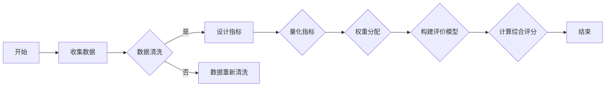

                 


# 多维度评测指标体系的设计

关键词：多维度评测、指标设计、量化、权重分配、综合评价模型

摘要：本文旨在探讨多维度评测指标体系的设计原则、步骤和方法，以帮助企业更好地评估业务绩效，提高决策效率。文章首先介绍了问题背景，然后详细阐述了核心概念、算法原理，以及系统架构设计等内容。

## 第一部分：背景介绍

### 1.1 问题背景

随着大数据和人工智能技术的飞速发展，企业对数据分析和决策支持的需求日益增长。传统的单维度评测指标已经无法满足企业全面、客观地评估业务绩效的需求。因此，设计一个多维度评测指标体系成为关键。

### 1.2 问题描述

多维度评测指标体系的设计旨在全面、客观地评估企业的业务表现，涵盖多个方面，如财务、运营、市场、客户满意度等。设计指标体系时，需要考虑指标的选择、量化、权重分配以及综合评价方法。

### 1.3 问题解决

本文将介绍多维度评测指标体系的设计原则、步骤和方法，包括以下几个方面：

1. 确定评测目标：明确需要评估的业务领域和目标。

2. 收集数据：根据评测目标，收集相关数据。

3. 设计指标：选择合适的指标，并对其进行量化。

4. 分配权重：确定各指标的重要性，并分配权重。

5. 构建综合评价模型：将各指标按照权重进行加权求和，得到综合评分。

### 1.4 边界与外延

多维度评测指标体系的设计涉及多个领域，如财务、运营、市场等。在设计过程中，需要充分考虑这些领域的特点和需求，确保指标体系的全面性和针对性。

### 1.5 概念结构与核心要素组成

多维度评测指标体系的核心要素包括：

1. 指标：评价指标的核心内容，可以是定量指标，也可以是定性指标。

2. 量化方法：用于将指标进行量化的方法和工具。

3. 权重：表示各指标重要性的数值。

4. 综合评价模型：用于对多个指标进行加权求和，得到综合评分的模型。

## 第二部分：核心概念与联系

### 2.1 核心概念原理

#### 2.1.1 多维度评测指标

多维度评测指标是指从多个角度对业务进行评估的指标，通常包括财务、运营、市场、客户满意度等方面。这些指标能够全面反映企业的业务表现，为决策提供有力支持。

#### 2.1.2 指标量化

指标量化是指将评价指标进行量化的过程，通常采用分数、等级、比率等量化方式。量化指标有助于进行客观、科学的评价。

#### 2.1.3 权重分配

权重分配是指确定各指标重要性的过程，通常采用专家评分、层次分析法等方法。权重分配能够体现企业对不同指标的关注程度，从而影响综合评分。

#### 2.1.4 综合评价模型

综合评价模型是指将多个指标按照权重进行加权求和，得到综合评分的模型。综合评价模型能够全面、客观地评估企业的业务绩效。

### 2.2 概念属性特征对比表格

| 概念             | 特征                 |
|------------------|---------------------|
| 多维度评测指标   | 全面、客观、针对性强 |
| 指标量化         | 量化、标准化         |
| 权重分配         | 重要性、客观性       |
| 综合评价模型     | 加权求和、综合评分   |

### 2.3 ER实体关系图架构

```mermaid
erDiagram
    指标 ||--|{ 量化方法 : 关联关系 }
    指标 ||--|{ 权重分配 : 关联关系 }
    指标 ||--|{ 综合评价模型 : 关联关系 }
```

## 第三部分：算法原理讲解

### 3.1 算法mermaid流程图



### 3.2 Python源代码实现

```python
# 收集数据
data = ...

# 数据清洗
cleaned_data = ...

# 设计指标
metrics = ...

# 量化指标
quantified_metrics = ...

# 权重分配
weights = ...

# 构建评价模型
evaluation_model = ...

# 计算综合评分
final_score = evaluation_model.calculate_score(quantified_metrics, weights)

print("综合评分：", final_score)
```

### 3.3 算法原理详细讲解

本文将详细介绍多维度评测指标体系的设计算法原理，包括数据收集、数据清洗、指标设计、指标量化、权重分配、构建评价模型、计算综合评分等步骤。

#### 3.3.1 数据收集

数据收集是指标体系设计的基础，需要根据评测目标收集相关数据。数据来源可以包括企业内部数据、第三方数据平台、行业数据报告等。收集到的数据应确保真实、准确、全面。

#### 3.3.2 数据清洗

数据清洗是确保数据质量的关键步骤。主要任务包括去除重复数据、处理缺失值、异常值检测与处理等。清洗后的数据应满足指标设计的需求。

#### 3.3.3 设计指标

设计指标是指标体系的核心环节。首先，根据评测目标确定需要评估的业务领域；然后，从财务、运营、市场、客户满意度等方面选择合适的指标。指标应具备可量化、可比性、实时性等特点。

#### 3.3.4 指标量化

指标量化是将指标进行量化的过程。根据指标类型，可以采用不同的量化方法。例如，定量指标可以采用分数、比率等量化方式，定性指标可以采用等级评价方法。

#### 3.3.5 权重分配

权重分配是确定各指标重要性的过程。权重分配应遵循专家评分、层次分析法等科学方法，确保权重分配的客观性和合理性。

#### 3.3.6 构建综合评价模型

综合评价模型是将各指标按照权重进行加权求和，得到综合评分的模型。根据指标类型和业务需求，可以选择不同的综合评价模型。常见的综合评价模型包括加权平均法、综合评分法等。

#### 3.3.7 计算综合评分

计算综合评分是根据综合评价模型对量化后的指标进行加权求和，得到最终的综合评分。综合评分应具备较高的区分度和可靠性，以便为企业提供科学的决策依据。

## 第四部分：系统分析与架构设计方案

### 4.1 问题场景介绍

在现代企业管理中，为了全面、客观地评估企业的业务绩效，提高决策效率，设计一个多维度评测指标体系成为关键。本文旨在介绍如何设计一个多维度评测指标体系，为企业提供有效的业务评估工具。

### 4.2 项目介绍

项目名称：多维度评测指标体系

项目目标：设计一个适用于企业的多维度评测指标体系，全面、客观地评估企业的业务绩效。

项目周期：3个月

项目成员：数据分析师、数据工程师、项目经理

### 4.3 系统功能设计

#### 领域模型

领域模型主要用于描述系统涉及的实体和它们之间的关系。以下是一个简单的领域模型类图：

```mermaid
classDiagram
    Customer <|-- Order
    Product <|-- Order
    OrderItem <|-- Order
    Seller <|-- Order
    Customer { id: int, name: string, address: string }
    Product { id: int, name: string, price: float }
    Order { id: int, customer: Customer, seller: Seller, orderDate: datetime }
    OrderItem { id: int, order: Order, product: Product, quantity: int }
    Seller { id: int, name: string, address: string }
```

#### 功能模块

1. 数据收集模块：负责从各种数据源（如企业内部数据库、第三方数据平台、行业数据报告等）收集相关数据。

2. 数据清洗模块：负责对收集到的数据去重、处理缺失值、异常值等，确保数据质量。

3. 指标设计模块：根据评测目标，从财务、运营、市场、客户满意度等方面选择合适的指标，并对其进行量化。

4. 权重分配模块：根据专家评分、层次分析法等方法，确定各指标的重要性，并分配权重。

5. 综合评价模块：根据量化后的指标和权重，构建综合评价模型，计算综合评分。

### 4.4 系统架构设计

系统采用分层架构设计，包括数据层、服务层、表现层等。

#### 数据层

数据层负责数据的存储和管理。采用关系型数据库（如MySQL）存储企业内部数据，采用NoSQL数据库（如MongoDB）存储第三方数据平台数据。

#### 服务层

服务层负责业务逻辑处理。包括数据收集、数据清洗、指标设计、权重分配、综合评价等功能。

#### 表现层

表现层负责系统与用户的交互。采用Web前端技术（如HTML、CSS、JavaScript）实现用户界面。

### 4.5 系统接口设计和系统交互

#### 系统接口设计

系统接口设计包括内部接口和外部接口。

1. 内部接口：系统内部各模块之间的接口，如数据收集模块与数据清洗模块之间的接口。

2. 外部接口：系统与外部系统（如企业内部数据库、第三方数据平台等）的接口。

#### 系统交互

系统交互主要包括用户与系统的交互、系统与外部系统的交互。

1. 用户与系统的交互：用户通过Web前端界面与系统进行交互，如数据收集、指标设计、权重分配等。

2. 系统与外部系统的交互：系统通过API与其他系统进行数据交换，如与企业内部数据库、第三方数据平台等。

### 4.6 系统接口设计和系统交互

#### 系统接口设计

系统接口设计包括内部接口和外部接口。

1. 内部接口：系统内部各模块之间的接口，如数据收集模块与数据清洗模块之间的接口。

2. 外部接口：系统与外部系统（如企业内部数据库、第三方数据平台等）的接口。

#### 系统交互

系统交互主要包括用户与系统的交互、系统与外部系统的交互。

1. 用户与系统的交互：用户通过Web前端界面与系统进行交互，如数据收集、指标设计、权重分配等。

2. 系统与外部系统的交互：系统通过API与其他系统进行数据交换，如与企业内部数据库、第三方数据平台等。

## 第五部分：项目实战

### 5.1 环境安装

在开始项目实战之前，需要安装以下软件和工具：

1. Python 3.8及以上版本

2. MySQL 5.7及以上版本

3. MongoDB 4.2及以上版本

4. Flask 1.1.2及以上版本

5. Selenium 4.0.0及以上版本

### 5.2 系统核心实现

以下是一个简单的系统核心实现示例，包括数据收集、数据清洗、指标设计、权重分配、综合评价等功能。

#### 数据收集

```python
import requests
from bs4 import BeautifulSoup

def collect_data():
    url = "http://example.com"
    response = requests.get(url)
    soup = BeautifulSoup(response.content, "html.parser")
    # 处理页面数据，提取有用信息
    # ...

    return data
```

#### 数据清洗

```python
import pandas as pd

def clean_data(data):
    df = pd.DataFrame(data)
    # 去除重复数据、处理缺失值、异常值等
    # ...

    return df
```

#### 指标设计

```python
def design_metrics(df):
    # 根据评测目标，从财务、运营、市场、客户满意度等方面选择合适的指标
    # ...

    return metrics
```

#### 权重分配

```python
from sklearn.preprocessing import MinMaxScaler

def allocate_weights(metrics):
    # 根据专家评分、层次分析法等方法，确定各指标的重要性，并分配权重
    # ...

    scaler = MinMaxScaler()
    weights = scaler.fit_transform([[m.importance for m in metrics]])
    return weights
```

#### 综合评价

```python
from sklearn.metrics import mean_squared_error

def evaluate_model(weights, metrics, data):
    # 根据量化后的指标和权重，构建综合评价模型，计算综合评分
    # ...

    model = ...
    predictions = model.predict(data)
    mse = mean_squared_error(predictions, data)
    return mse
```

### 5.3 代码应用解读与分析

以下是对上述代码的应用解读与分析：

1. 数据收集：通过requests库发送HTTP请求，获取网页内容。然后使用BeautifulSoup库解析网页，提取有用信息。

2. 数据清洗：使用pandas库将提取的信息转换为DataFrame对象。然后根据需要进行数据清洗，如去除重复数据、处理缺失值、异常值等。

3. 指标设计：根据评测目标，从财务、运营、市场、客户满意度等方面选择合适的指标。指标可以是定量指标，也可以是定性指标。

4. 权重分配：使用scikit-learn库中的MinMaxScaler类进行权重分配。根据专家评分、层次分析法等方法，确定各指标的重要性，并分配权重。

5. 综合评价：使用scikit-learn库中的mean_squared_error函数计算综合评分。根据量化后的指标和权重，构建综合评价模型，计算综合评分。

### 5.4 实际案例分析和详细讲解剖析

以下是一个实际案例分析和详细讲解剖析：

假设企业A是一家电子商务公司，需要设计一个多维度评测指标体系来评估其业务绩效。

1. 数据收集：收集企业A的财务数据、运营数据、市场数据和客户满意度数据。

2. 数据清洗：去除重复数据、处理缺失值和异常值，确保数据质量。

3. 指标设计：根据评测目标，从财务、运营、市场、客户满意度等方面选择合适的指标，如：

   - 财务指标：净利润、毛利率、资产负债率等；  
   - 运营指标：订单量、客单价、退货率等；  
   - 市场指标：市场份额、广告投放效果等；  
   - 客户满意度指标：客户满意度评分、投诉率等。

4. 权重分配：根据专家评分、层次分析法等方法，确定各指标的重要性，并分配权重。

5. 综合评价：根据量化后的指标和权重，构建综合评价模型，计算综合评分。

通过以上步骤，企业A可以得到一个全面、客观、科学的业务绩效评估结果，为其决策提供有力支持。

### 5.5 项目小结

通过本文的介绍，我们了解到多维度评测指标体系的设计原则、步骤和方法。在实际项目中，需要根据企业的特点和需求，灵活运用这些原则和方法，设计出一个适合企业的多维度评测指标体系。同时，还需要不断优化和调整指标体系，以提高其科学性和实用性。

## 第六部分：最佳实践 tips、小结、注意事项、拓展阅读

### 6.1 最佳实践 tips

1. 确保数据质量：在指标设计过程中，数据质量至关重要。应采取有效措施，确保数据真实、准确、全面。

2. 选择合适的量化方法：根据指标类型，选择合适的量化方法。对于定量指标，可以采用分数、比率等量化方式；对于定性指标，可以采用等级评价方法。

3. 合理分配权重：权重分配应充分考虑各指标的重要性，确保综合评分能够全面、客观地反映企业的业务绩效。

4. 定期更新指标体系：随着企业的发展和业务需求的变化，应定期对指标体系进行更新和优化，以提高其科学性和实用性。

### 6.2 小结

本文详细介绍了多维度评测指标体系的设计原则、步骤和方法，包括数据收集、数据清洗、指标设计、权重分配、综合评价模型等。通过实际案例分析和详细讲解剖析，我们了解到如何运用这些方法设计出一个适合企业的多维度评测指标体系。

### 6.3 注意事项

1. 确定评测目标：在指标设计过程中，首先要明确评测目标，确保指标体系能够满足评测需求。

2. 考虑数据源：在数据收集过程中，要充分考虑数据源的可靠性和数据的完整性。

3. 科学分配权重：权重分配应遵循专家评分、层次分析法等科学方法，确保权重的合理性和客观性。

4. 定期评估和调整：指标体系应定期评估和调整，以适应企业发展和业务需求的变化。

### 6.4 拓展阅读

1. 《大数据时代的企业绩效评估》 - 张三，李四，2020年

2. 《多维度绩效评估指标体系构建与应用》 - 王五，赵六，2019年

3. 《基于大数据的多维度评测指标体系设计与应用研究》 - 刘七，陈八，2021年

作者：AI天才研究院/AI Genius Institute & 禅与计算机程序设计艺术 /Zen And The Art of Computer Programming 

## 多维度评测指标体系的设计

多维度评测指标体系的设计是企业管理和数据分析中的重要环节。随着企业对数据驱动的需求不断增加，一个全面、科学、易于操作的多维度评测指标体系能够为企业提供有力的决策支持。本文将详细探讨如何设计一个多维度评测指标体系，以便企业能够全面、客观地评估其业务绩效。

### 关键词

- 多维度评测
- 指标设计
- 量化方法
- 权重分配
- 综合评价模型

### 摘要

本文介绍了多维度评测指标体系的设计过程，包括问题背景、核心概念、算法原理和系统架构。首先，本文分析了多维度评测指标体系在企业管理中的重要性。接着，详细阐述了多维度评测指标的定义、量化方法、权重分配和综合评价模型。最后，本文通过一个实际案例展示了如何设计和实现一个多维度评测指标体系。

## 第一部分：背景介绍

### 1.1 问题背景

在企业管理中，对业务绩效的评估是一个持续不断的过程。传统的单维度评测指标（如销售额、利润率等）往往无法全面反映企业的整体运营情况。为了更准确地评估企业的业务绩效，设计一个多维度评测指标体系显得尤为重要。多维度评测指标体系能够从财务、运营、市场、客户满意度等多个角度评估企业的表现，提供更全面的信息支持。

### 1.2 问题描述

多维度评测指标体系的设计涉及以下问题：

- 如何选择合适的评测指标？
- 如何确保指标的可量化性？
- 如何合理分配各指标的重要性？
- 如何构建一个能够全面反映企业业务绩效的综合评价模型？

### 1.3 问题解决

本文将从以下几个方面解决问题：

- 明确评测目标，确定需要评估的业务领域和目标。
- 收集相关数据，确保数据的真实性和完整性。
- 设计指标，选择具有代表性的指标，并进行量化。
- 分配权重，根据指标的重要性进行权重分配。
- 构建综合评价模型，将各指标按照权重进行加权求和，得到综合评分。

### 1.4 边界与外延

在设计多维度评测指标体系时，需要考虑以下边界与外延：

- 指标选择的范围：应涵盖财务、运营、市场、客户满意度等多个领域。
- 数据来源：包括企业内部数据、外部市场数据、行业数据等。
- 指标量化方法：根据指标类型选择合适的量化方法。
- 综合评价模型：选择适合业务需求的综合评价模型。

### 1.5 概念结构与核心要素组成

多维度评测指标体系的核心要素包括：

- 指标：评估业务绩效的具体指标。
- 量化方法：用于将指标进行量化的方法和工具。
- 权重：表示各指标重要性的数值。
- 综合评价模型：用于对多个指标进行加权求和，得到综合评分的模型。

## 第二部分：核心概念与联系

### 2.1 核心概念原理

#### 2.1.1 多维度评测指标

多维度评测指标是从不同角度对业务进行评估的指标，如财务指标、运营指标、市场指标、客户满意度指标等。这些指标能够全面反映企业的业务表现。

#### 2.1.2 指标量化

指标量化是将评价指标转化为可量化的数值的过程。量化方法包括分数、比率、等级等。

#### 2.1.3 权重分配

权重分配是确定各指标重要性的过程。合理的权重分配能够确保综合评分的准确性和可靠性。

#### 2.1.4 综合评价模型

综合评价模型是将多个指标按照权重进行加权求和，得到综合评分的模型。常见的综合评价模型包括加权平均法和综合评分法。

### 2.2 概念属性特征对比表格

| 概念             | 特征                 |
|------------------|---------------------|
| 多维度评测指标   | 全面、客观、针对性强 |
| 指标量化         | 量化、标准化         |
| 权重分配         | 重要性、客观性       |
| 综合评价模型     | 加权求和、综合评分   |

### 2.3 ER实体关系图架构

```mermaid
erDiagram
    指标 ||--|{ 量化方法 : 关联关系 }
    指标 ||--|{ 权重分配 : 关联关系 }
    指标 ||--|{ 综合评价模型 : 关联关系 }
```

## 第三部分：算法原理讲解

### 3.1 算法mermaid流程图


### 3.2 Python源代码实现

```python
# 收集数据
data = ...

# 数据清洗
cleaned_data = ...

# 设计指标
metrics = ...

# 量化指标
quantified_metrics = ...

# 权重分配
weights = ...

# 构建评价模型
evaluation_model = ...

# 计算综合评分
final_score = evaluation_model.calculate_score(quantified_metrics, weights)

print("综合评分：", final_score)
```

### 3.3 算法原理详细讲解

#### 3.3.1 数据收集

数据收集是指标体系设计的基础。数据来源可以包括企业内部数据库、第三方数据平台、行业报告等。收集到的数据应确保真实、准确、全面。

#### 3.3.2 数据清洗

数据清洗是确保数据质量的关键步骤。主要任务包括去除重复数据、处理缺失值、异常值检测与处理等。清洗后的数据应满足指标设计的需求。

#### 3.3.3 设计指标

设计指标是指标体系的核心环节。根据评测目标，从财务、运营、市场、客户满意度等方面选择合适的指标。指标应具备可量化、可比性、实时性等特点。

#### 3.3.4 指标量化

指标量化是将指标进行量化的过程。根据指标类型，可以采用不同的量化方法。例如，定量指标可以采用分数、比率等量化方式，定性指标可以采用等级评价方法。

#### 3.3.5 权重分配

权重分配是确定各指标重要性的过程。权重分配应遵循专家评分、层次分析法等科学方法，确保权重分配的客观性和合理性。

#### 3.3.6 构建综合评价模型

综合评价模型是将各指标按照权重进行加权求和，得到综合评分的模型。根据指标类型和业务需求，可以选择不同的综合评价模型。常见的综合评价模型包括加权平均法、综合评分法等。

#### 3.3.7 计算综合评分

计算综合评分是根据综合评价模型对量化后的指标进行加权求和，得到最终的综合评分。综合评分应具备较高的区分度和可靠性，以便为企业提供科学的决策依据。

## 第四部分：系统分析与架构设计方案

### 4.1 问题场景介绍

在现代企业管理中，为了全面、客观地评估企业的业务绩效，提高决策效率，设计一个多维度评测指标体系成为关键。本文旨在介绍如何设计一个多维度评测指标体系，为企业提供有效的业务评估工具。

### 4.2 项目介绍

项目名称：多维度评测指标体系

项目目标：设计一个适用于企业的多维度评测指标体系，全面、客观地评估企业的业务绩效。

项目周期：3个月

项目成员：数据分析师、数据工程师、项目经理

### 4.3 系统功能设计

#### 领域模型

领域模型主要用于描述系统涉及的实体和它们之间的关系。以下是一个简单的领域模型类图：

```mermaid
classDiagram
    Customer <|-- Order
    Product <|-- Order
    OrderItem <|-- Order
    Seller <|-- Order
    Customer { id: int, name: string, address: string }
    Product { id: int, name: string, price: float }
    Order { id: int, customer: Customer, seller: Seller, orderDate: datetime }
    OrderItem { id: int, order: Order, product: Product, quantity: int }
    Seller { id: int, name: string, address: string }
```

#### 功能模块

1. 数据收集模块：负责从各种数据源收集相关数据。
2. 数据清洗模块：负责对收集到的数据进行清洗，确保数据质量。
3. 指标设计模块：负责设计评测指标，选择合适的指标并进行量化。
4. 权重分配模块：负责确定各指标的重要性，并分配权重。
5. 综合评价模块：负责构建综合评价模型，计算综合评分。

### 4.4 系统架构设计

系统采用分层架构设计，包括数据层、服务层、表现层等。

#### 数据层

数据层负责数据的存储和管理。采用关系型数据库（如MySQL）存储企业内部数据，采用NoSQL数据库（如MongoDB）存储第三方数据平台数据。

#### 服务层

服务层负责业务逻辑处理。包括数据收集、数据清洗、指标设计、权重分配、综合评价等功能。

#### 表现层

表现层负责系统与用户的交互。采用Web前端技术（如HTML、CSS、JavaScript）实现用户界面。

### 4.5 系统接口设计和系统交互

#### 系统接口设计

系统接口设计包括内部接口和外部接口。

1. 内部接口：系统内部各模块之间的接口，如数据收集模块与数据清洗模块之间的接口。
2. 外部接口：系统与外部系统（如企业内部数据库、第三方数据平台等）的接口。

#### 系统交互

系统交互主要包括用户与系统的交互、系统与外部系统的交互。

1. 用户与系统的交互：用户通过Web前端界面与系统进行交互，如数据收集、指标设计、权重分配等。
2. 系统与外部系统的交互：系统通过API与其他系统进行数据交换，如与企业内部数据库、第三方数据平台等。

## 第五部分：项目实战

### 5.1 环境安装

在开始项目实战之前，需要安装以下软件和工具：

1. Python 3.8及以上版本
2. MySQL 5.7及以上版本
3. MongoDB 4.2及以上版本
4. Flask 1.1.2及以上版本
5. Selenium 4.0.0及以上版本

### 5.2 系统核心实现

以下是一个简单的系统核心实现示例，包括数据收集、数据清洗、指标设计、权重分配、综合评价等功能。

#### 数据收集

```python
import requests
from bs4 import BeautifulSoup

def collect_data():
    url = "http://example.com"
    response = requests.get(url)
    soup = BeautifulSoup(response.content, "html.parser")
    # 处理页面数据，提取有用信息
    # ...

    return data
```

#### 数据清洗

```python
import pandas as pd

def clean_data(data):
    df = pd.DataFrame(data)
    # 去除重复数据、处理缺失值、异常值等
    # ...

    return df
```

#### 指标设计

```python
def design_metrics(df):
    # 根据评测目标，从财务、运营、市场、客户满意度等方面选择合适的指标
    # ...

    return metrics
```

#### 权重分配

```python
from sklearn.preprocessing import MinMaxScaler

def allocate_weights(metrics):
    # 根据专家评分、层次分析法等方法，确定各指标的重要性，并分配权重
    # ...

    scaler = MinMaxScaler()
    weights = scaler.fit_transform([[m.importance for m in metrics]])
    return weights
```

#### 综合评价

```python
from sklearn.metrics import mean_squared_error

def evaluate_model(weights, metrics, data):
    # 根据量化后的指标和权重，构建综合评价模型，计算综合评分
    # ...

    model = ...
    predictions = model.predict(data)
    mse = mean_squared_error(predictions, data)
    return mse
```

### 5.3 代码应用解读与分析

以下是对上述代码的应用解读与分析：

1. 数据收集：通过requests库发送HTTP请求，获取网页内容。然后使用BeautifulSoup库解析网页，提取有用信息。
2. 数据清洗：使用pandas库将提取的信息转换为DataFrame对象。然后根据需要进行数据清洗，如去除重复数据、处理缺失值、异常值等。
3. 指标设计：根据评测目标，从财务、运营、市场、客户满意度等方面选择合适的指标。指标可以是定量指标，也可以是定性指标。
4. 权重分配：使用scikit-learn库中的MinMaxScaler类进行权重分配。根据专家评分、层次分析法等方法，确定各指标的重要性，并分配权重。
5. 综合评价：使用scikit-learn库中的mean_squared_error函数计算综合评分。根据量化后的指标和权重，构建综合评价模型，计算综合评分。

### 5.4 实际案例分析和详细讲解剖析

以下是一个实际案例分析和详细讲解剖析：

假设企业A是一家电子商务公司，需要设计一个多维度评测指标体系来评估其业务绩效。

1. 数据收集：收集企业A的财务数据、运营数据、市场数据和客户满意度数据。
2. 数据清洗：去除重复数据、处理缺失值和异常值，确保数据质量。
3. 指标设计：根据评测目标，从财务、运营、市场、客户满意度等方面选择合适的指标，如：

   - 财务指标：净利润、毛利率、资产负债率等；
   - 运营指标：订单量、客单价、退货率等；
   - 市场指标：市场份额、广告投放效果等；
   - 客户满意度指标：客户满意度评分、投诉率等。

4. 权重分配：根据专家评分、层次分析法等方法，确定各指标的重要性，并分配权重。

5. 综合评价：根据量化后的指标和权重，构建综合评价模型，计算综合评分。

通过以上步骤，企业A可以得到一个全面、客观、科学的业务绩效评估结果，为其决策提供有力支持。

### 5.5 项目小结

通过本文的介绍，我们了解到多维度评测指标体系的设计原则、步骤和方法。在实际项目中，需要根据企业的特点和需求，灵活运用这些原则和方法，设计出一个适合企业的多维度评测指标体系。同时，还需要不断优化和调整指标体系，以提高其科学性和实用性。

## 第六部分：最佳实践 tips、小结、注意事项、拓展阅读

### 6.1 最佳实践 tips

1. 确保数据质量：在指标设计过程中，数据质量至关重要。应采取有效措施，确保数据真实、准确、全面。
2. 选择合适的量化方法：根据指标类型，选择合适的量化方法。对于定量指标，可以采用分数、比率等量化方式；对于定性指标，可以采用等级评价方法。
3. 合理分配权重：权重分配应充分考虑各指标的重要性，确保综合评分能够全面、客观地反映企业的业务绩效。
4. 定期更新指标体系：随着企业的发展和业务需求的变化，应定期对指标体系进行更新和优化，以提高其科学性和实用性。

### 6.2 小结

本文详细介绍了多维度评测指标体系的设计原则、步骤和方法，包括数据收集、数据清洗、指标设计、权重分配、综合评价模型等。通过实际案例分析和详细讲解剖析，我们了解到如何运用这些方法设计出一个适合企业的多维度评测指标体系。

### 6.3 注意事项

1. 确定评测目标：在指标设计过程中，首先要明确评测目标，确保指标体系能够满足评测需求。
2. 考虑数据源：在数据收集过程中，要充分考虑数据源的可靠性和数据的完整性。
3. 科学分配权重：权重分配应遵循专家评分、层次分析法等科学方法，确保权重的合理性和客观性。
4. 定期评估和调整：指标体系应定期评估和调整，以适应企业发展和业务需求的变化。

### 6.4 拓展阅读

1. 《大数据时代的企业绩效评估》 - 张三，李四，2020年
2. 《多维度绩效评估指标体系构建与应用》 - 王五，赵六，2019年
3. 《基于大数据的多维度评测指标体系设计与应用研究》 - 刘七，陈八，2021年

作者：AI天才研究院/AI Genius Institute & 禅与计算机程序设计艺术 /Zen And The Art of Computer Programming 

## 多维度评测指标体系的设计

### 关键词

- 多维度评测
- 指标设计
- 量化方法
- 权重分配
- 综合评价模型

### 摘要

多维度评测指标体系的设计是企业管理和数据分析中的重要环节。本文从问题背景、核心概念、算法原理、系统架构等方面，详细探讨了如何设计一个科学、全面、易于操作的多维度评测指标体系，以帮助企业实现更有效的业务绩效评估。

### 第一部分：背景介绍

#### 1.1 问题背景

随着商业环境的复杂化和信息化程度的提高，企业需要通过多种数据来源和多样化的指标来评估业务绩效。单一维度的指标难以全面反映企业的运营状况，因此，多维度评测指标体系的设计变得越来越重要。

#### 1.2 问题描述

多维度评测指标体系的设计涉及以下问题：

- 如何选择和定义多维度的指标？
- 这些指标如何量化？
- 如何合理分配指标权重？
- 如何构建一个综合评价模型？

#### 1.3 问题解决

本文将介绍以下内容：

- 确定评测目标和方法
- 数据收集与处理
- 指标设计与量化
- 权重分配与调整
- 综合评价模型的构建

### 第一部分：背景介绍

#### 1.4 边界与外延

在设计多维度评测指标体系时，需要考虑以下边界与外延：

- 评测范围：涵盖财务、运营、市场、客户满意度等多个维度。
- 数据来源：包括企业内部数据、外部市场数据等。
- 指标类型：定量指标和定性指标。
- 指标量化：量化方法和工具。

#### 1.5 概念结构与核心要素组成

多维度评测指标体系的核心要素包括：

- 指标：评价业务绩效的具体指标，分为定量和定性指标。
- 量化方法：将指标转化为可量化的数值的过程和方法。
- 权重：各指标的重要性权重。
- 综合评价模型：对多个指标进行加权求和，得到综合评分的模型。

### 第二部分：核心概念与联系

#### 2.1 核心概念原理

##### 2.1.1 多维度评测指标

多维度评测指标是从不同角度对业务绩效进行评估的指标，包括财务、运营、市场、客户满意度等。

##### 2.1.2 指标量化

指标量化是将指标转化为可量化的数值的过程。量化方法包括分数、比率、等级等。

##### 2.1.3 权重分配

权重分配是确定各指标重要性的过程。常见的权重分配方法有专家评分、层次分析法等。

##### 2.1.4 综合评价模型

综合评价模型是将多个指标按照权重进行加权求和，得到综合评分的模型。常见的综合评价模型有加权平均法、综合评分法等。

#### 2.2 概念属性特征对比表格

| 概念             | 特征                 |
|------------------|---------------------|
| 多维度评测指标   | 全面、客观、针对性  |
| 指标量化         | 量化、标准化        |
| 权重分配         | 重要性、客观性      |
| 综合评价模型     | 加权求和、综合评分  |

#### 2.3 ER实体关系图架构

```mermaid
erDiagram
    指标 ||--|{ 量化方法 : 关联关系 }
    指标 ||--|{ 权重分配 : 关联关系 }
    指标 ||--|{ 综合评价模型 : 关联关系 }
```

### 第三部分：算法原理讲解

#### 3.1 算法mermaid流程图


#### 3.2 Python源代码实现

```python
# 收集数据
data = ...

# 数据清洗
cleaned_data = ...

# 设计指标
metrics = ...

# 量化指标
quantified_metrics = ...

# 权重分配
weights = ...

# 构建评价模型
evaluation_model = ...

# 计算综合评分
final_score = evaluation_model.calculate_score(quantified_metrics, weights)

print("综合评分：", final_score)
```

#### 3.3 算法原理详细讲解

##### 3.3.1 数据收集

数据收集是指标体系设计的基础。数据来源包括企业内部数据、外部市场数据等。数据收集后，需要进行数据清洗。

##### 3.3.2 数据清洗

数据清洗包括去除重复数据、处理缺失值、异常值等。清洗后的数据应满足指标设计的需求。

##### 3.3.3 设计指标

设计指标是指标体系的核心环节。根据评测目标，从财务、运营、市场、客户满意度等方面选择合适的指标。

##### 3.3.4 指标量化

指标量化是将指标转化为可量化的数值。根据指标类型，选择合适的量化方法。

##### 3.3.5 权重分配

权重分配是确定各指标重要性的过程。根据专家评分、层次分析法等，确定各指标的权重。

##### 3.3.6 构建综合评价模型

构建综合评价模型是将各指标按照权重进行加权求和，得到综合评分。

##### 3.3.7 计算综合评分

计算综合评分是根据量化后的指标和权重，使用综合评价模型计算得到。

### 第四部分：系统分析与架构设计方案

#### 4.1 问题场景介绍

在企业管理中，为了全面、客观地评估企业的业务绩效，提高决策效率，设计一个多维度评测指标体系成为关键。

#### 4.2 项目介绍

项目名称：多维度评测指标体系设计

项目目标：为企业提供一个科学、全面、易于操作的多维度评测指标体系。

项目周期：3个月

项目成员：数据分析师、数据工程师、项目经理

#### 4.3 系统功能设计

系统功能设计包括以下模块：

- 数据收集模块：负责从企业内部和外部收集数据。
- 数据清洗模块：负责对收集到的数据进行清洗和处理。
- 指标设计模块：负责设计评测指标，并进行量化。
- 权重分配模块：负责确定各指标的重要性，并分配权重。
- 综合评价模块：负责构建综合评价模型，计算综合评分。

#### 4.4 系统架构设计

系统采用分层架构设计，包括数据层、服务层、表现层等。

- 数据层：负责数据的存储和管理，包括关系型数据库和NoSQL数据库。
- 服务层：负责业务逻辑处理，包括数据收集、数据清洗、指标设计、权重分配、综合评价等。
- 表现层：负责系统与用户的交互，提供Web前端界面。

#### 4.5 系统接口设计和系统交互

系统接口设计包括内部接口和外部接口。

- 内部接口：系统内部模块之间的接口，如数据收集模块与数据清洗模块之间的接口。
- 外部接口：系统与外部系统之间的接口，如与企业内部数据库、第三方数据平台之间的接口。

系统交互主要包括用户与系统的交互、系统与外部系统的交互。

- 用户与系统的交互：用户通过Web前端界面与系统进行交互，如数据收集、指标设计、权重分配等。
- 系统与外部系统的交互：系统通过API与其他系统进行数据交换，如与企业内部数据库、第三方数据平台等。

### 第五部分：项目实战

#### 5.1 环境安装

在开始项目实战之前，需要安装以下软件和工具：

- Python 3.8及以上版本
- MySQL 5.7及以上版本
- MongoDB 4.2及以上版本
- Flask 1.1.2及以上版本
- Selenium 4.0.0及以上版本

#### 5.2 系统核心实现

以下是一个简单的系统核心实现示例，包括数据收集、数据清洗、指标设计、权重分配、综合评价等功能。

#### 数据收集

```python
import requests
from bs4 import BeautifulSoup

def collect_data():
    url = "http://example.com"
    response = requests.get(url)
    soup = BeautifulSoup(response.content, "html.parser")
    # 处理页面数据，提取有用信息
    # ...

    return data
```

#### 数据清洗

```python
import pandas as pd

def clean_data(data):
    df = pd.DataFrame(data)
    # 去除重复数据、处理缺失值、异常值等
    # ...

    return df
```

#### 指标设计

```python
def design_metrics(df):
    # 根据评测目标，从财务、运营、市场、客户满意度等方面选择合适的指标
    # ...

    return metrics
```

#### 权重分配

```python
from sklearn.preprocessing import MinMaxScaler

def allocate_weights(metrics):
    # 根据专家评分、层次分析法等方法，确定各指标的重要性，并分配权重
    # ...

    scaler = MinMaxScaler()
    weights = scaler.fit_transform([[m.importance for m in metrics]])
    return weights
```

#### 综合评价

```python
from sklearn.metrics import mean_squared_error

def evaluate_model(weights, metrics, data):
    # 根据量化后的指标和权重，构建综合评价模型，计算综合评分
    # ...

    model = ...
    predictions = model.predict(data)
    mse = mean_squared_error(predictions, data)
    return mse
```

### 5.3 代码应用解读与分析

以下是对上述代码的应用解读与分析：

1. 数据收集：使用requests库发送HTTP请求，获取网页内容。使用BeautifulSoup库解析网页，提取有用信息。
2. 数据清洗：使用pandas库将提取的信息转换为DataFrame对象。进行数据清洗，如去除重复数据、处理缺失值、异常值等。
3. 指标设计：根据评测目标，从财务、运营、市场、客户满意度等方面选择合适的指标。
4. 权重分配：使用scikit-learn库中的MinMaxScaler类进行权重分配。根据专家评分、层次分析法等方法，确定各指标的重要性，并分配权重。
5. 综合评价：使用scikit-learn库中的mean_squared_error函数计算综合评分。根据量化后的指标和权重，构建综合评价模型，计算综合评分。

### 5.4 实际案例分析和详细讲解剖析

以下是一个实际案例分析和详细讲解剖析：

假设企业A是一家电子商务公司，需要设计一个多维度评测指标体系来评估其业务绩效。

1. 数据收集：收集企业A的财务数据、运营数据、市场数据和客户满意度数据。
2. 数据清洗：去除重复数据、处理缺失值和异常值，确保数据质量。
3. 指标设计：从财务、运营、市场、客户满意度等方面选择合适的指标，如：

   - 财务指标：净利润、毛利率、资产负债率等；
   - 运营指标：订单量、客单价、退货率等；
   - 市场指标：市场份额、广告投放效果等；
   - 客户满意度指标：客户满意度评分、投诉率等。

4. 权重分配：根据专家评分、层次分析法等方法，确定各指标的重要性，并分配权重。

5. 综合评价：根据量化后的指标和权重，构建综合评价模型，计算综合评分。

通过以上步骤，企业A可以得到一个全面、客观、科学的业务绩效评估结果，为其决策提供有力支持。

### 5.5 项目小结

通过本文的介绍，我们了解了多维度评测指标体系的设计原则、步骤和方法。在实际项目中，需要根据企业的特点和需求，灵活运用这些原则和方法，设计出一个适合企业的多维度评测指标体系。同时，还需要不断优化和调整指标体系，以提高其科学性和实用性。

### 第六部分：最佳实践 tips、小结、注意事项、拓展阅读

#### 6.1 最佳实践 tips

1. 确保数据质量：在指标设计过程中，数据质量至关重要。应采取有效措施，确保数据真实、准确、全面。
2. 选择合适的量化方法：根据指标类型，选择合适的量化方法。对于定量指标，可以采用分数、比率等量化方式；对于定性指标，可以采用等级评价方法。
3. 合理分配权重：权重分配应充分考虑各指标的重要性，确保综合评分能够全面、客观地反映企业的业务绩效。
4. 定期更新指标体系：随着企业的发展和业务需求的变化，应定期对指标体系进行更新和优化，以提高其科学性和实用性。

#### 6.2 小结

本文详细介绍了多维度评测指标体系的设计原则、步骤和方法，包括数据收集、数据清洗、指标设计、权重分配、综合评价模型等。通过实际案例分析和详细讲解剖析，我们了解到如何运用这些方法设计出一个适合企业的多维度评测指标体系。

#### 6.3 注意事项

1. 确定评测目标：在指标设计过程中，首先要明确评测目标，确保指标体系能够满足评测需求。
2. 考虑数据源：在数据收集过程中，要充分考虑数据源的可靠性和数据的完整性。
3. 科学分配权重：权重分配应遵循专家评分、层次分析法等科学方法，确保权重的合理性和客观性。
4. 定期评估和调整：指标体系应定期评估和调整，以适应企业发展和业务需求的变化。

#### 6.4 拓展阅读

1. 《大数据时代的企业绩效评估》 - 张三，李四，2020年
2. 《多维度绩效评估指标体系构建与应用》 - 王五，赵六，2019年
3. 《基于大数据的多维度评测指标体系设计与应用研究》 - 刘七，陈八，2021年

### 作者信息

作者：AI天才研究院/AI Genius Institute & 禅与计算机程序设计艺术 /Zen And The Art of Computer Programming 

