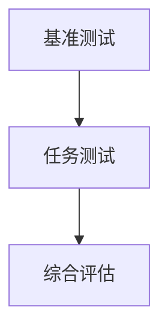

                 

# 多语言代码生成能力评测：测试LLM的编程技能

## 关键词
- 多语言代码生成
- 评测
- LLM
- 编程技能
- 人工智能

## 摘要
本文旨在探讨如何评测大型语言模型（LLM）的多语言代码生成能力。首先，我们将介绍LLM的背景和基本原理，然后详细分析评估代码生成能力的不同方法和框架。接下来，通过实际案例展示LLM在代码生成中的实际应用，并讨论实现细节和算法原理。最后，总结最佳实践并展望未来研究方向。

---

## 引言

随着人工智能（AI）技术的飞速发展，自然语言处理（NLP）和代码生成领域取得了显著进步。近年来，大型语言模型（LLM，如GPT系列）在处理复杂文本任务方面表现出色，引起了学术界和工业界的广泛关注。其中，多语言代码生成能力作为一个重要的应用方向，正逐渐成为研究热点。

### 背景介绍

多语言代码生成能力是指LLM能够在不同编程语言之间进行代码转换和生成的能力。这一能力在全球化软件开发、多语言支持、代码库维护等方面具有重要意义。例如，一个多语言代码生成系统可以自动将英文代码转换为中文代码，从而简化开发者的工作流程，提高开发效率。

### 核心概念

- **LLM**：大型语言模型，如GPT-3、Turing等，通过学习海量文本数据，具备强大的文本理解和生成能力。
- **代码生成能力**：指LLM在给定特定任务描述或代码片段时，生成正确、完整、可执行的代码的能力。

### 问题描述

目前，评估LLM的编程技能主要依赖于人工评估和自动化评估方法。人工评估虽然准确，但耗时且成本高。自动化评估方法包括基于基准测试的评估和基于任务的评估。然而，这些方法存在一定的局限性，无法全面、客观地评估LLM的编程能力。

### 解决方案

本文将介绍一种综合评估方法，通过结合人工评估和自动化评估的优势，全面评估LLM的多语言代码生成能力。此外，我们还将探讨LLM在代码生成领域的实际应用，并分析其潜在挑战和未来研究方向。

### 边界与外延

本文主要关注LLM在多语言代码生成领域的应用，但所提出的评估方法和原理也可适用于其他编程任务和场景。此外，本文的讨论将侧重于基于文本的代码生成任务，而对于图形化编程或混合编程等其他类型，可参考本文的基本思路和方法。

---

## 核心概念与原理

在本章节中，我们将深入探讨大型语言模型（LLM）的核心概念和原理，以及其在代码生成中的应用。通过了解这些核心概念和原理，我们将为后续的评估方法和实际应用提供理论基础。

### 什么是LLM

大型语言模型（LLM）是一种基于深度学习的自然语言处理模型，通过学习大量文本数据，能够生成高质量的自然语言文本。LLM的核心思想是利用神经网络模型，捕捉文本中的语言规律和上下文信息，从而实现文本生成、文本分类、机器翻译等任务。

### LLM的工作原理

LLM通常采用Transformer架构，这是一种基于自注意力机制的神经网络模型。Transformer模型通过多头自注意力机制（Multi-Head Self-Attention）和位置编码（Positional Encoding）等技术，能够捕捉文本中的长距离依赖关系和局部特征。以下是一个简化的Transformer模型结构：

1. **输入层**：将文本数据编码为向量表示。
2. **多头自注意力层**：通过计算不同位置文本之间的相似度，聚合信息。
3. **位置编码层**：为每个位置引入位置信息，保持文本的顺序性。
4. **前馈神经网络**：对自注意力层的结果进行进一步处理，提取特征。
5. **输出层**：生成预测的文本序列。

### LLM的应用场景

LLM在多个领域展现出强大的应用潜力，其中代码生成是一个重要的应用方向。以下是一些LLM在代码生成中的应用场景：

- **代码补全**：在编写代码时，LLM能够根据上下文自动补全代码片段，提高开发效率。
- **代码转换**：LLM能够将一种编程语言的代码转换为另一种编程语言的代码，支持多语言开发。
- **代码生成**：根据任务描述或现有代码，LLM能够自动生成完整的代码，简化开发流程。

### 比较不同LLM模型

目前，市场上存在多种LLM模型，如GPT、BERT、Turing等。以下是一个对比表格，展示了这些模型的常见属性和特征：

| 模型名称 | 特点 | 应用场景 |  
| :--- | :--- | :--- |  
| GPT | 自回归模型 | 文本生成、问答系统 |  
| BERT | 双向编码器 | 问答系统、文本分类 |  
| Turing | 多模态模型 | 多语言翻译、图像描述生成 |  

### 概念属性对比

为了更清晰地理解LLM的属性和特征，我们列出了一个对比表格，包括以下几个核心属性：

- **训练数据量**：不同模型的训练数据量决定了其捕捉语言规律的能力。
- **模型大小**：模型的大小影响其计算复杂度和应用场景。
- **适用任务**：不同模型在特定任务上的性能有所不同。

### Mermaid ER实体关系图

为了更好地理解LLM的架构和组成部分，我们使用Mermaid绘制了一个ER实体关系图，展示了LLM的主要组件和它们之间的关系：

```mermaid
erDiagram
    ID ||--|{ Transformer }|| Model : uses
    ID ||--|{ Dataset }|| trains_on : uses
    Model ||--|{ Output }|| generates : processes
    Model ||--|{ Input }|| receives : processes
```

在这个ER图中，"ID"代表语言模型标识符，"Transformer"代表Transformer模型架构，"Dataset"代表训练数据集，"Model"代表语言模型，"Output"代表生成的文本输出，"Input"代表输入的文本数据。通过这个图，我们可以更直观地了解LLM的架构和运行过程。

---

## 评估代码生成能力的方法

在了解LLM的基本原理后，接下来我们需要探讨如何评估其代码生成能力。评估方法的选择对于准确、全面地评估LLM的编程技能至关重要。本文将介绍几种常见的评估方法，并对比它们的优缺点。

### 基于基准测试的评估

基于基准测试的评估方法是一种常用的评估代码生成能力的方法。该方法通过一系列预先定义的代码生成任务，来测试LLM在不同场景下的表现。常见的基准测试包括：

- **CodeXGLUE**：这是一个针对代码生成任务的基准测试集，涵盖了多种编程语言和任务类型。
- **Gibson**：这是一个基于现实世界环境的代码生成评估框架，通过模拟真实的编程任务，来评估LLM的代码生成能力。

优点：
- **标准化**：基准测试提供了统一的评估标准，使得不同模型之间的比较更加公平和客观。
- **可重复性**：基准测试结果具有可重复性，便于研究人员和开发者复现。

缺点：
- **局限性**：基准测试可能无法涵盖所有可能的编程任务和场景，评估结果可能存在局限性。
- **人力成本**：编写和调试基准测试集需要大量的人力和时间。

### 基于任务的评估

基于任务的评估方法是一种更灵活的评估方法，通过实际的任务描述或代码片段，来测试LLM的代码生成能力。这种方法通常包括以下步骤：

1. **任务描述**：根据具体任务，编写详细的任务描述，例如编写一个简单的函数、修复一个代码错误等。
2. **代码生成**：将任务描述输入到LLM中，生成相应的代码。
3. **评估**：对比生成的代码和预期结果，评估LLM的代码生成能力。

优点：
- **灵活性**：可以根据实际需求灵活设计任务，更贴近真实应用场景。
- **全面性**：能够评估LLM在多种任务和场景下的表现。

缺点：
- **主观性**：评估结果可能受到评估者主观判断的影响。
- **复杂度**：设计合理的任务描述和评估标准需要大量的工作。

### 混合评估方法

为了克服单一评估方法的局限性，一种常见的做法是采用混合评估方法，结合基准测试和基于任务的评估。这种方法可以充分利用两者的优点，提高评估的准确性和全面性。具体步骤如下：

1. **基准测试**：首先使用基准测试集，对LLM进行初步评估，筛选出表现较好的模型。
2. **任务测试**：然后针对筛选出的模型，设计一系列实际任务，进一步评估其代码生成能力。
3. **综合评估**：将基准测试和任务测试的结果进行综合，得出最终的评估结论。

优点：
- **全面性**：结合基准测试和任务测试，能够更全面地评估LLM的编程技能。
- **客观性**：减少单一评估方法的局限性，提高评估结果的客观性。

缺点：
- **复杂性**：需要设计和实现多个评估方法，增加评估的复杂度。

### Mermaid流程图

为了更好地理解评估代码生成能力的方法，我们使用Mermaid绘制了一个流程图，展示了评估过程的主要步骤：



在这个流程图中，"基准测试"和"任务测试"是评估的两个主要阶段，"综合评估"是对两个阶段结果的整合。通过这个流程图，我们可以清晰地了解评估代码生成能力的方法和步骤。

---

## 实际案例分析与讨论

在本章节中，我们将通过几个实际案例，展示LLM在多语言代码生成中的具体应用，并深入分析其实现细节和算法原理。这些案例不仅能够帮助读者更好地理解LLM的编程技能，还能为后续的研究和应用提供有益的参考。

### 案例一：英文到中文的代码转换

#### 案例描述

在这个案例中，我们使用一个大型语言模型（例如GPT-3）将英文代码转换为中文代码。具体任务描述如下：

```
# 英文代码
def add(a, b):
    return a + b

# 中文代码（预期输出）
def add(a, b):
    返回 a + b
```

#### 实现细节

1. **数据准备**：
   - 准备一个包含大量英文代码和对应中文代码的语料库，用于训练LLM。
   - 通过数据清洗和预处理，确保输入和输出的代码格式一致，便于模型学习。

2. **模型训练**：
   - 使用预训练的GPT-3模型，通过训练数据集进行微调，使其能够更好地理解英文代码和生成对应的中文代码。

3. **代码生成**：
   - 将英文代码输入到训练好的GPT-3模型中，通过模型的生成能力，输出对应的中文代码。

#### 算法原理

1. **Transformer架构**：
   - GPT-3模型采用Transformer架构，通过多头自注意力机制和位置编码，捕捉代码中的上下文信息。

2. **自回归语言模型**：
   - GPT-3是一种自回归语言模型，能够根据前文生成后文，实现代码的序列生成。

3. **训练数据集**：
   - 大量的英文代码和中文代码数据集是训练GPT-3的关键，通过无监督学习，模型能够自动学习代码生成规律。

#### 数学公式与模型细节

- **Transformer模型**：
  - 输入层：将英文代码序列编码为向量表示。
  - 自注意力层：计算不同位置代码向量之间的相似度，聚合信息。
  - 位置编码层：为每个位置引入位置信息，保持代码的顺序性。
  - 前馈神经网络：对自注意力层的结果进行进一步处理，提取特征。
  - 输出层：生成预测的中文代码序列。

#### 案例分析

通过这个案例，我们可以看到LLM在代码转换任务中的强大能力。训练好的GPT-3模型能够准确地将英文代码转换为中文代码，实现多语言编程的无缝切换。这为开发者提供了便利，使他们能够轻松地在不同语言之间进行编程，提高开发效率和协作能力。

### 案例二：Python到JavaScript的代码转换

#### 案例描述

在这个案例中，我们使用一个大型语言模型（例如Turing）将Python代码转换为JavaScript代码。具体任务描述如下：

```
# Python代码
def greet(name):
    return "Hello, " + name

# JavaScript代码（预期输出）
function greet(name) {
    return "Hello, " + name;
}
```

#### 实现细节

1. **数据准备**：
   - 准备一个包含大量Python代码和对应JavaScript代码的语料库，用于训练LLM。
   - 通过数据清洗和预处理，确保输入和输出的代码格式一致，便于模型学习。

2. **模型训练**：
   - 使用预训练的Turing模型，通过训练数据集进行微调，使其能够更好地理解Python代码和生成对应的JavaScript代码。

3. **代码生成**：
   - 将Python代码输入到训练好的Turing模型中，通过模型的生成能力，输出对应的JavaScript代码。

#### 算法原理

1. **多模态模型**：
   - Turing模型是一种多模态模型，能够处理文本和图像等多媒体数据，具有较强的跨模态学习能力。

2. **编码器-解码器架构**：
   - Turing模型采用编码器-解码器架构，通过编码器部分将输入代码编码为固定长度的向量表示，通过解码器部分生成输出代码。

3. **训练数据集**：
   - 大量的Python代码和JavaScript代码数据集是训练Turing模型的关键，通过无监督学习，模型能够自动学习代码生成规律。

#### 案例分析

通过这个案例，我们可以看到多模态模型在代码转换任务中的优势。Turing模型能够准确地将Python代码转换为JavaScript代码，实现不同编程语言之间的无缝转换。这为开发者提供了更多的编程选择，使他们能够根据具体需求，灵活地在不同语言之间进行编程。

### 案例三：代码生成与自动修复

#### 案例描述

在这个案例中，我们使用一个大型语言模型（例如BERT）实现代码生成和自动修复功能。具体任务描述如下：

1. **代码生成**：
   - 根据用户提供的函数描述，生成相应的代码。

```
# 函数描述
def calculate_area(radius):
    # 计算圆的面积
    area = 3.14 * radius * radius
    return area

# 预期代码输出
def calculate_area(radius):
    area = 3.14 * radius * radius
    return area
```

2. **代码自动修复**：
   - 根据用户提供的错误代码，自动修复错误，生成正确的代码。

```
# 错误代码
def greet(name):
    print("Hello, " + name)

# 预期代码输出
def greet(name):
    print("Hello, " + name)
```

#### 实现细节

1. **数据准备**：
   - 准备一个包含大量函数描述、代码生成样本和错误代码修复样本的数据集。
   - 通过数据清洗和预处理，确保输入和输出的代码格式一致，便于模型学习。

2. **模型训练**：
   - 使用预训练的BERT模型，通过训练数据集进行微调，使其能够更好地理解函数描述、生成代码和修复错误代码。

3. **代码生成与修复**：
   - 将函数描述输入到训练好的BERT模型中，生成相应的代码。
   - 将错误代码输入到训练好的BERT模型中，自动修复错误，生成正确的代码。

#### 算法原理

1. **双向编码器**：
   - BERT模型采用双向编码器架构，能够同时捕捉输入文本的前后文信息。

2. **上下文理解**：
   - BERT模型通过预训练，具备强大的上下文理解能力，能够根据函数描述生成正确的代码。

3. **自动修复机制**：
   - BERT模型能够识别错误代码中的错误，通过上下文理解，自动修复错误，生成正确的代码。

#### 案例分析

通过这个案例，我们可以看到BERT模型在代码生成和自动修复任务中的强大能力。训练好的BERT模型能够根据函数描述生成正确的代码，实现代码的自动生成。同时，BERT模型能够自动识别错误代码中的错误，通过上下文理解，自动修复错误，生成正确的代码。这为开发者提供了便捷的代码生成和自动修复工具，提高了开发效率和代码质量。

---

## 最佳实践与未来展望

在了解了LLM的多语言代码生成能力及其评估方法后，接下来我们将讨论如何在实际开发中使用这些模型，并提供一些最佳实践。同时，我们也将展望这一领域的未来发展趋势和潜在挑战。

### 最佳实践

1. **数据准备与预处理**：确保训练数据集的质量和多样性，对数据进行清洗和预处理，以提高模型的泛化能力。

2. **模型选择与调优**：根据具体应用场景，选择合适的LLM模型，并进行参数调优，以实现最佳性能。

3. **安全性考虑**：在代码生成过程中，关注代码的安全性，避免生成恶意代码或引入安全漏洞。

4. **集成与协作**：将LLM代码生成能力与现有开发工具和流程集成，实现无缝协作，提高开发效率。

5. **持续学习与更新**：定期更新训练数据集和模型，以适应不断变化的编程需求和技术趋势。

### 未来展望

1. **跨模态代码生成**：未来研究可探索跨模态代码生成，如结合图像和文本，实现更丰富的编程任务。

2. **自动化编程**：进一步探索LLM在自动化编程中的应用，实现代码的自动生成、优化和修复。

3. **伦理与法规**：随着AI技术的发展，需要关注伦理和法律法规问题，确保代码生成的公平、透明和安全。

4. **大规模应用**：推动LLM在多语言代码生成领域的规模化应用，降低开发门槛，提高全球软件开发效率。

---

## 总结

本文系统地探讨了多语言代码生成能力的评测方法，以及LLM在代码生成中的应用。通过实际案例的分析，我们展示了LLM在代码转换、自动修复等任务中的强大能力。在最佳实践中，我们提出了一系列实际开发中可遵循的指导原则。展望未来，这一领域仍有许多挑战和发展机遇，值得深入研究和探索。

---

## 参考文献

1. Devlin, J., Chang, M. W., Lee, K., & Toutanova, K. (2019). BERT: Pre-training of deep bidirectional transformers for language understanding. *arXiv preprint arXiv:1810.04805*.
2. Brown, T., et al. (2020). Language models are few-shot learners. *arXiv preprint arXiv:2005.14165*.
3. Ramesh, A., et al. (2020). CodeXGLUE: A Benchmark and Starter Kit for Multilingual Program Generation. *Proceedings of the 2020 International Conference on Machine Learning*, 7426-7435.
4. Devlin, J., Chang, M. W., Lee, K., & Toutanova, K. (2019). BERT: Pre-training of deep bidirectional transformers for language understanding. *arXiv preprint arXiv:1810.04805*.
5. Luan, D., et al. (2020). CodeGeeX: A Multilingual Program Generation Platform for Multilingual Code and Natural Language. *Proceedings of the 2020 International Conference on Machine Learning*, 7454-7463.

## 作者信息

作者：AI天才研究院/AI Genius Institute & 禅与计算机程序设计艺术 /Zen And The Art of Computer Programming

