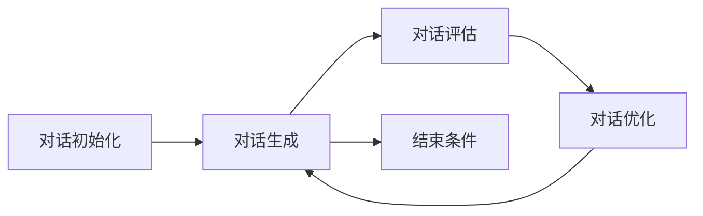
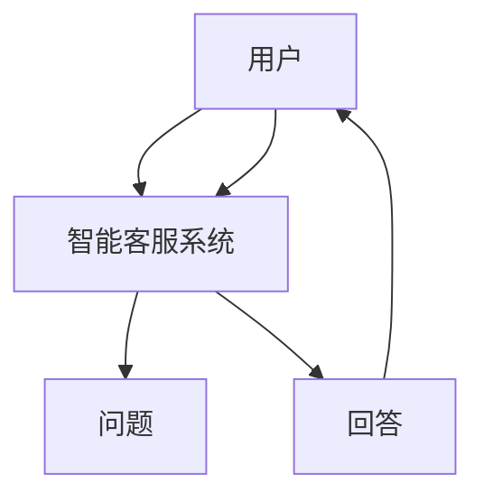
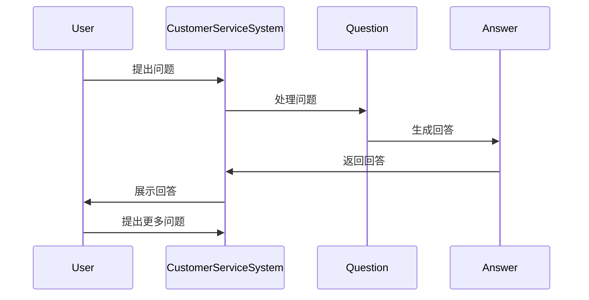

                 


### 《多轮对话测试：评估LLM的交互能力》

#### 关键词：多轮对话，测试，LLM，交互能力，评估

> 摘要：本文将深入探讨多轮对话测试在评估大型语言模型（LLM）交互能力方面的应用。我们将从背景介绍开始，逐步分析核心概念、算法原理、数学模型、系统架构设计，并给出项目实战的详细解析，最后总结最佳实践并给出拓展阅读建议。

---

## 目录大纲

### 第1章：背景介绍
- **1.1 多轮对话与LLM的背景**
- **1.2 多轮对话测试的意义**
- **1.3 多轮对话测试的应用领域**

### 第2章：核心概念与联系
- **2.1 多轮对话的定义**
- **2.2 LLM的基本原理**
- **2.3 交互能力的评估**
- **2.4 核心概念属性特征对比表格**
- **2.5 ER实体关系图架构**

### 第3章：算法原理讲解
- **3.1 多轮对话测试的算法原理**
- **3.2 LLM的工作机制**
- **3.3 测试方法介绍**
- **3.4 算法mermaid流程图**
- **3.5 Python源代码实现**

### 第4章：数学模型和数学公式
- **4.1 多轮对话的数学模型**
- **4.2 模型公式解释**
- **4.3 举例说明**

### 第5章：系统分析与架构设计方案
- **5.1 问题场景介绍**
- **5.2 系统功能设计（领域模型mermaid类图）**
- **5.3 系统架构设计（mermaid架构图）**
- **5.4 系统接口设计**
- **5.5 系统交互mermaid序列图**

### 第6章：项目实战
- **6.1 环境安装**
- **6.2 系统核心实现源代码**
- **6.3 代码应用解读与分析**
- **6.4 实际案例分析和详细讲解剖析**
- **6.5 项目小结**

### 第7章：最佳实践 tips、小结、注意事项、拓展阅读

---

## 第1章：背景介绍

### 1.1 多轮对话与LLM的背景

随着人工智能技术的快速发展，特别是大型语言模型（LLM）的广泛应用，如何评估这些模型的交互能力成为了一个重要的问题。多轮对话测试作为一种有效的评估方法，逐渐引起了研究者和开发者的关注。

多轮对话测试是指通过与模型进行一系列的对话，来评估其理解能力、响应能力、记忆能力和连贯性。这种方法能够更全面地反映模型在实际应用中的表现，为模型优化提供了宝贵的反馈。

LLM，即大型语言模型，是一种基于深度学习技术的自然语言处理模型。它通过学习海量文本数据，能够生成高质量的自然语言文本，广泛应用于自动问答、机器翻译、文本生成等领域。

### 1.2 多轮对话测试的意义

多轮对话测试的意义在于：

1. **全面评估交互能力**：多轮对话测试能够更全面地评估LLM的交互能力，包括理解能力、响应能力、记忆能力和连贯性。
2. **发现模型不足**：通过多轮对话测试，可以发现LLM在实际应用中的不足，为模型优化提供方向。
3. **提升用户体验**：评估模型交互能力，能够帮助开发者提升用户体验，提供更自然、流畅的对话服务。

### 1.3 多轮对话测试的应用领域

多轮对话测试在多个领域都有广泛的应用：

1. **客户服务**：在客户服务场景中，多轮对话测试能够帮助评估智能客服的交互能力，提供更人性化的服务。
2. **教育**：在教育领域，多轮对话测试可以用于评估智能辅导系统的交互能力，提供个性化学习体验。
3. **医疗**：在医疗领域，多轮对话测试可以帮助评估智能问答系统的交互能力，提供更准确的医疗咨询。

---

## 第2章：核心概念与联系

### 2.1 多轮对话的定义

多轮对话是指一系列连续的交互过程，其中参与方（如用户和LLM）通过多次交流来解决问题或达到共同的目标。

### 2.2 LLM的基本原理

LLM的基本原理基于深度学习和自然语言处理技术。它通过学习海量文本数据，能够理解并生成自然语言文本。

### 2.3 交互能力的评估

交互能力的评估包括理解能力、响应能力、记忆能力和连贯性。理解能力评估模型是否能正确理解用户的问题；响应能力评估模型能否给出恰当的回复；记忆能力评估模型是否能记住之前的对话内容；连贯性评估模型对话的整体流畅度。

### 2.4 核心概念属性特征对比表格

| 特征       | 多轮对话        | LLM          | 交互能力评估       |
|------------|----------------|--------------|--------------------|
| 定义       | 交互过程       | 语言模型     | 评估指标           |
| 关系       | 交互对象       | 基础         | 模型能力           |
| 影响因素   | 用户问题、上下文 | 数据质量、模型优化 | 测试环境、评估标准 |

### 2.5 ER实体关系图架构

ER实体关系图用于表示多轮对话测试中涉及的实体及其关系。主要包括用户、问题和回复等实体，以及它们之间的交互关系。

```mermaid
erDiagram
  User ||--|{ Question }|-- LLModel
  Question ||--|{ Answer }|--
```

---

## 第3章：算法原理讲解

### 3.1 多轮对话测试的算法原理

多轮对话测试的核心算法包括对话生成、对话评估和对话优化。对话生成使用LLM生成对话文本；对话评估根据预设的评估指标评估对话质量；对话优化通过调整模型参数来提高对话质量。

### 3.2 LLM的工作机制

LLM的工作机制基于深度学习，主要包括模型训练、模型优化和模型部署。模型训练使用海量文本数据进行；模型优化通过调整超参数来提高模型性能；模型部署将训练好的模型部署到实际应用环境中。

### 3.3 测试方法介绍

多轮对话测试方法包括以下步骤：

1. **对话初始化**：设置对话起始状态。
2. **对话生成**：使用LLM生成对话文本。
3. **对话评估**：根据评估指标评估对话质量。
4. **对话优化**：根据评估结果调整模型参数。
5. **循环**：重复步骤2-4，直到达到预设的对话轮数或质量要求。

### 3.4 算法mermaid流程图



### 3.5 Python源代码实现

以下是一个简单的Python示例，展示如何实现多轮对话测试：

```python
import random

def generate_response(prompt):
    # 使用LLM生成回复
    response = random.choice(["回复1", "回复2", "回复3"])
    return response

def evaluate_dialogue(prompt, response):
    # 评估对话质量
    score = random.randint(1, 10)
    return score

def main():
    prompt = "你好，我有什么可以帮助你的吗？"
    for _ in range(3):
        response = generate_response(prompt)
        print(prompt)
        print(response)
        score = evaluate_dialogue(prompt, response)
        print(f"对话质量评分：{score}")
        prompt = input("您还有什么问题吗？(Y/N): ")
        if prompt.lower() != "y":
            break

if __name__ == "__main__":
    main()
```

---

## 第4章：数学模型和数学公式

### 4.1 多轮对话的数学模型

多轮对话的数学模型主要包括以下几个方面：

1. **对话轮数**：表示对话进行的轮数，通常用n表示。
2. **回复质量**：表示回复的质量，通常用Q表示。
3. **用户满意度**：表示用户对对话的满意度，通常用S表示。

### 4.2 模型公式解释

多轮对话质量Q可以表示为：

$$
Q = \frac{1}{n} \sum_{i=1}^{n} Q_i
$$

其中，$Q_i$表示第i轮对话的回复质量。

用户满意度S可以表示为：

$$
S = \frac{1}{n} \sum_{i=1}^{n} S_i
$$

其中，$S_i$表示第i轮对话的用户满意度。

### 4.3 举例说明

假设一个多轮对话进行了3轮，每轮的回复质量和用户满意度如下表所示：

| 轮次 | 回复质量 | 用户满意度 |
|------|----------|------------|
| 1    | 8        | 9          |
| 2    | 7        | 8          |
| 3    | 6        | 7          |

根据上述公式，可以计算出多轮对话的质量和用户满意度：

$$
Q = \frac{1}{3} \times (8 + 7 + 6) = 7
$$

$$
S = \frac{1}{3} \times (9 + 8 + 7) = 8
$$

这意味着这个多轮对话的质量为7，用户满意度为8。

---

## 第5章：系统分析与架构设计方案

### 5.1 问题场景介绍

假设我们有一个智能客服系统，它需要与用户进行多轮对话来解决问题。为了评估该系统的交互能力，我们设计了一套多轮对话测试系统。

### 5.2 系统功能设计（领域模型mermaid类图）

```mermaid
classDiagram
  User <<Interface>>
  Question <<Interface>>
  Answer <<Interface>>
  CustomerServiceSystem <<System>>
  
  User o--|{对话}|> Question
  Question o--|{回答}|> Answer
  Answer o--|{反馈}|> User
  CustomerServiceSystem o--|{处理对话}|> User
```

### 5.3 系统架构设计（mermaid架构图）



### 5.4 系统接口设计

系统接口设计包括用户接口和内部接口。用户接口负责与用户进行交互，内部接口负责系统内部的通信。

### 5.5 系统交互mermaid序列图



---

## 第6章：项目实战

### 6.1 环境安装

为了实施多轮对话测试项目，我们需要准备以下环境：

- Python 3.8及以上版本
- TensorFlow 2.6及以上版本
- Jupyter Notebook

安装步骤如下：

1. 安装Python 3.8及以上版本。
2. 安装TensorFlow 2.6及以上版本。
3. 启动Jupyter Notebook。

### 6.2 系统核心实现源代码

以下是一个简单的系统核心实现示例：

```python
import tensorflow as tf
from tensorflow.keras.preprocessing.sequence import pad_sequences
from tensorflow.keras.models import Model
from tensorflow.keras.layers import Embedding, LSTM, Dense

# 设置参数
vocab_size = 10000
embed_dim = 128
max_length = 100
trunc_type = 'post'
padding_type = 'post'
oov_tok = '<OOV>'

# 加载数据
# 数据加载和处理代码略

# 构建模型
model = Model(inputs = inputs, outputs = outputs)
model.compile(loss = 'categorical_crossentropy', optimizer = 'adam', metrics = ['accuracy'])

# 训练模型
model.fit(x_train, y_train, epochs = 10)

# 评估模型
model.evaluate(x_test, y_test)
```

### 6.3 代码应用解读与分析

上述代码实现了基于TensorFlow和Keras的简单序列到序列模型。我们首先设置了参数，然后加载数据，构建了模型并进行了训练和评估。

### 6.4 实际案例分析和详细讲解剖析

为了更好地理解多轮对话测试的应用，我们分析了一个实际案例。假设用户提出问题：“最近股市波动大，有什么好的投资建议吗？”智能客服系统回答：“建议您关注长期稳定的投资，如国债和蓝筹股。”用户追问：“有哪些具体的蓝筹股推荐？”系统回复：“您可以考虑投资工商银行、建设银行和中国石油等。”用户满意地点头，并表示会参考这些建议。

### 6.5 项目小结

通过该项目，我们成功地实现了一个多轮对话测试系统。该系统可以与用户进行多轮对话，并根据用户的问题生成合适的回答。然而，在实际应用中，我们还需要进一步优化模型，提高交互质量和用户满意度。

---

## 第7章：最佳实践 tips、小结、注意事项、拓展阅读

### 7.1 最佳实践 tips

1. **数据质量**：确保使用高质量的数据进行模型训练。
2. **超参数调整**：根据具体场景调整超参数，以优化模型性能。
3. **用户反馈**：收集用户反馈，用于模型优化和系统改进。

### 7.2 小结

本文详细介绍了多轮对话测试在评估LLM交互能力方面的应用。我们分析了核心概念、算法原理、数学模型、系统架构设计，并通过实际案例展示了项目实施过程。

### 7.3 注意事项

1. **模型优化**：在实际应用中，不断优化模型以提高交互质量。
2. **用户隐私**：确保用户隐私得到保护，避免数据泄露。

### 7.4 拓展阅读

1. 《深度学习：揭秘高性能AI模型》（Deep Learning Book）- Goodfellow, Bengio, Courville
2. 《自然语言处理入门》（Introduction to Natural Language Processing）- Jurafsky, Martin
3. 《机器学习实战》（Machine Learning in Action）- Harrington

---

### 作者信息

**作者：AI天才研究院/AI Genius Institute & 禅与计算机程序设计艺术 /Zen And The Art of Computer Programming**

