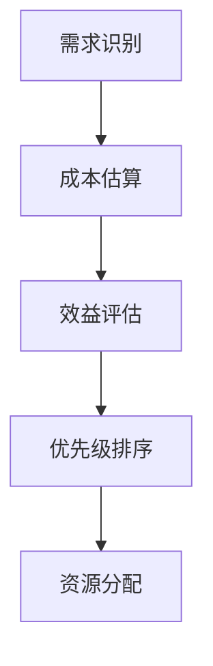
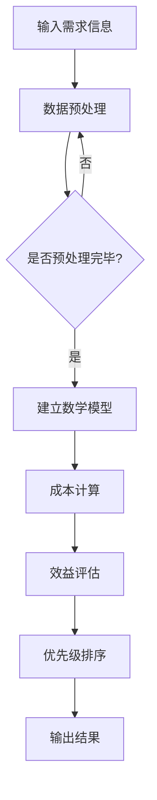
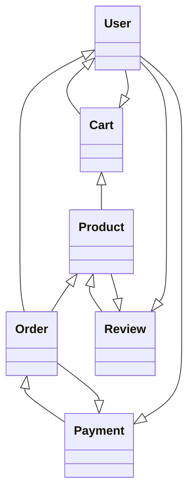
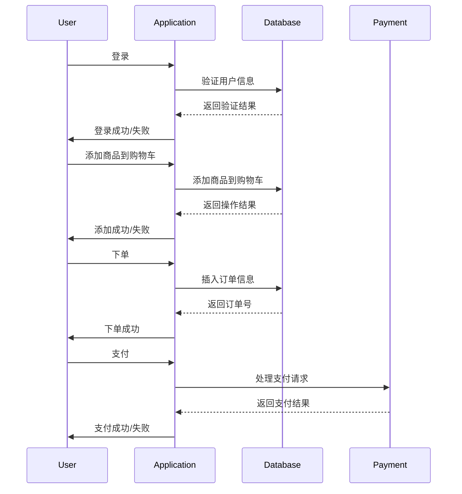
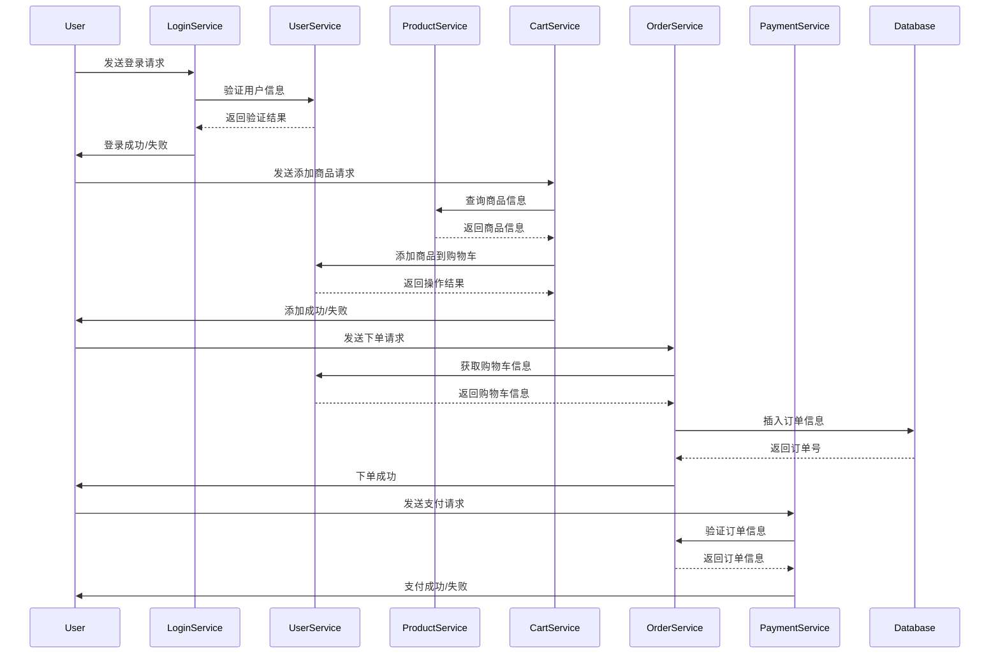

                 

## 大型应用开发中的需求成本效益分析

> 关键词：需求成本效益分析、大型应用开发、资源优化、价值评估、项目管理

> 摘要：本文旨在探讨大型应用开发中的需求成本效益分析，阐述其核心概念、原理和方法。通过分析需求识别、成本估算、效益评估、优先级排序和资源分配等环节，本文提供了一个系统化的框架，帮助开发团队在复杂的应用开发过程中实现资源优化和最大化价值产出。

### 第一部分：背景介绍

#### 1.1 问题背景

在现代软件产业中，大型应用开发项目往往涉及多个业务领域和复杂的系统架构，面临日益复杂的需求和环境变化。企业不仅需要在短时间内快速响应市场需求，还要确保项目质量、成本控制和时间进度。在这种背景下，需求成本效益分析成为一个关键环节，它不仅关系到项目的成功与否，还直接影响企业的长期竞争力。

#### 1.2 问题描述

需求成本效益分析是对大型应用开发项目中的需求进行经济性评估，旨在确定哪些需求能够带来最大的价值，以及如何合理分配资源以最大化投资回报。这一过程涉及到需求的识别、分析、评估和优先级排序，确保开发团队能够集中精力解决最具价值和效益的需求。

#### 1.3 问题解决

解决这一问题的关键在于建立一套系统化、科学化的需求成本效益分析方法，包括明确分析步骤、选用合适的工具和技术、制定评价标准等。通过这些方法，开发团队能够全面、深入地了解每个需求的价值和成本，从而做出明智的决策。

#### 1.4 边界与外延

需求成本效益分析不仅适用于大型应用开发项目，还可以扩展到其他类型的工程项目，如基础设施建设、信息技术系统升级等。其核心在于对项目需求的全面评估，以便在资源有限的情况下实现最优效益。

#### 1.5 概念结构与核心要素组成

需求成本效益分析的核心概念包括：

1. **需求识别**：确定项目中的所有需求。
2. **成本估算**：对满足每个需求所需成本进行估算。
3. **效益评估**：评估每个需求带来的价值。
4. **优先级排序**：根据成本和效益对需求进行排序，以确定优先级。
5. **资源分配**：根据优先级分配资源，确保重点项目得到充分支持。

### 第二部分：核心概念与联系

#### 2.1 需求成本效益分析的定义与特点

需求成本效益分析是一种评估大型应用开发项目中需求价值的方法，它通过分析每个需求的成本和效益，确定其优先级，以便在资源有限的情况下实现最大化的价值产出。其特点包括：

1. **系统性**：需求成本效益分析是一个系统化的过程，涉及多个步骤和环节。
2. **科学性**：采用科学的评估方法和工具，确保分析结果的准确性和可靠性。
3. **灵活性**：能够根据项目需求和资源的变化进行调整和优化。

#### 2.2 核心概念属性特征对比表格

| 核心概念 | 属性特征 |
| :----: | :----: |
| 需求识别 | 确定项目中的所有需求 |
| 成本估算 | 对满足每个需求所需成本进行估算 |
| 效益评估 | 评估每个需求带来的价值 |
| 优先级排序 | 根据成本和效益对需求进行排序 |
| 资源分配 | 根据优先级分配资源 |

#### 2.3 概念之间的联系

需求成本效益分析中的各个概念之间紧密相连，形成了一个完整的分析链条。需求识别是起点，成本估算是基础，效益评估是核心，优先级排序是关键，而资源分配则是最终目的。通过这一链条，开发团队能够确保每个需求都得到合理评估和有效处理。



### 第三部分：算法原理讲解

#### 3.1 算法原理概述

需求成本效益分析算法旨在通过对项目需求的成本和效益进行评估，从而确定每个需求的优先级。其核心思想是利用数据驱动的方法，通过建立数学模型和算法，对需求进行量化分析和排序。

#### 3.2 算法mermaid流程图



#### 3.3 算法原理详细讲解

需求成本效益分析算法的具体实现过程如下：

1. **数据预处理**：收集并整理项目需求信息，包括需求描述、成本估算和预期效益等。对数据进行清洗、格式化和标准化处理，以便后续分析。

2. **建立数学模型**：根据需求信息，建立数学模型以表示每个需求的成本和效益。常用的数学模型包括线性规划模型、成本效益比模型等。

   $$
   C = f(x_1, x_2, ..., x_n) \\
   E = g(x_1, x_2, ..., x_n)
   $$

   其中，$C$表示成本，$E$表示效益，$x_1, x_2, ..., x_n$表示需求的具体属性。

3. **成本计算**：利用数学模型计算每个需求的成本。成本计算通常包括开发成本、维护成本、风险成本等。

   $$
   C = C_{开发} + C_{维护} + C_{风险}
   $$

4. **效益评估**：利用数学模型计算每个需求的效益。效益评估通常包括收益增加、成本节约、市场竞争力提升等。

   $$
   E = E_{收益} + E_{成本节约} + E_{竞争力}
   $$

5. **优先级排序**：根据成本和效益对需求进行排序。常用的排序算法包括排序网络、快速排序等。

6. **资源分配**：根据优先级分配资源，确保重点项目得到充分支持。资源分配需要考虑资源限制和项目优先级，以实现最优资源利用。

#### 3.4 算法原理举例说明

假设一个大型应用开发项目中有以下三个需求：

1. 需求A：开发一个用户管理系统，预计开发成本为10万元，维护成本为每年2万元，预计能带来5万元的年收益。
2. 需求B：增加一个订单处理模块，预计开发成本为5万元，维护成本为每年1万元，预计能带来3万元的年收益。
3. 需求C：优化数据库性能，预计开发成本为3万元，维护成本为每年0.5万元，预计能带来1万元的年收益。

利用需求成本效益分析算法，我们可以计算出每个需求的成本效益比：

$$
C_A = 10 + 2 = 12 \\
E_A = 5 \\
C_B = 5 + 1 = 6 \\
E_B = 3 \\
C_C = 3 + 0.5 = 3.5 \\
E_C = 1
$$

$$
C_{效益比}_A = \frac{E_A}{C_A} = \frac{5}{12} \approx 0.42 \\
C_{效益比}_B = \frac{E_B}{C_B} = \frac{3}{6} = 0.5 \\
C_{效益比}_C = \frac{E_C}{C_C} = \frac{1}{3.5} \approx 0.29
$$

根据成本效益比，我们可以得出以下排序：

1. 需求B：成本效益比为0.5，最高。
2. 需求A：成本效益比为0.42，次之。
3. 需求C：成本效益比为0.29，最低。

因此，在资源有限的情况下，应优先考虑需求B的开发，其次是需求A，最后是需求C。

### 第四部分：系统分析与架构设计方案

#### 4.1 问题场景介绍

假设某互联网公司计划开发一款大型电商应用，该项目包括用户管理、商品管理、订单处理、支付结算等多个模块。公司希望在保证项目质量和时间进度的前提下，最大化投资回报，因此需要进行需求成本效益分析。

#### 4.2 项目介绍

项目名称：大型电商应用
项目周期：12个月
团队成员：项目经理、产品经理、开发人员、测试人员、运维人员

#### 4.3 系统功能设计（领域模型mermaid类图）



#### 4.4 系统架构设计（mermaid架构图）



#### 4.5 系统接口设计和系统交互（mermaid序列图）



### 第五部分：项目实战

#### 5.1 环境安装

在开始项目实战之前，我们需要安装以下软件和工具：

1. Python 3.8或更高版本
2. MySQL 5.7或更高版本
3. Django 3.2或更高版本
4. Django REST framework 3.12或更高版本
5. Docker 19.03或更高版本

安装步骤：

1. 安装Python 3.8及pip工具：
   ```
   sudo apt update
   sudo apt install python3.8 python3.8-pip
   ```
2. 升级pip版本：
   ```
   pip3.8 install --upgrade pip
   ```
3. 安装Django和Django REST framework：
   ```
   pip3.8 install django djangorestframework
   ```
4. 安装MySQL：
   ```
   sudo apt install mysql-server mysql-common
   ```
5. 安装Docker：
   ```
   sudo apt install docker.io
   ```

#### 5.2 系统核心实现源代码

以下是一个基于Django和Django REST framework的电商应用系统核心实现源代码：

**models.py**：

```python
from django.db import models

class User(models.Model):
    username = models.CharField(max_length=100)
    email = models.EmailField()
    password = models.CharField(max_length=100)

class Product(models.Model):
    name = models.CharField(max_length=100)
    description = models.TextField()
    price = models.DecimalField(max_digits=6, decimal_places=2)

class Order(models.Model):
    user = models.ForeignKey(User, on_delete=models.CASCADE)
    total = models.DecimalField(max_digits=6, decimal_places=2)
    created_at = models.DateTimeField(auto_now_add=True)

class OrderItem(models.Model):
    order = models.ForeignKey(Order, on_delete=models.CASCADE)
    product = models.ForeignKey(Product, on_delete=models.CASCADE)
    quantity = models.PositiveIntegerField()

class Review(models.Model):
    product = models.ForeignKey(Product, on_delete=models.CASCADE)
    user = models.ForeignKey(User, on_delete=models.CASCADE)
    content = models.TextField()
    created_at = models.DateTimeField(auto_now_add=True)

class Payment(models.Model):
    order = models.ForeignKey(Order, on_delete=models.CASCADE)
    amount = models.DecimalField(max_digits=6, decimal_places=2)
    created_at = models.DateTimeField(auto_now_add=True)
```

**views.py**：

```python
from rest_framework import viewsets
from .models import User, Product, Order, OrderItem, Review, Payment
from .serializers import UserSerializer, ProductSerializer, OrderSerializer, OrderItemSerializer, ReviewSerializer, PaymentSerializer

class UserViewSet(viewsets.ModelViewSet):
    queryset = User.objects.all()
    serializer_class = UserSerializer

class ProductViewSet(viewsets.ModelViewSet):
    queryset = Product.objects.all()
    serializer_class = ProductSerializer

class OrderViewSet(viewsets.ModelViewSet):
    queryset = Order.objects.all()
    serializer_class = OrderSerializer

class OrderItemViewSet(viewsets.ModelViewSet):
    queryset = OrderItem.objects.all()
    serializer_class = OrderItemSerializer

class ReviewViewSet(viewsets.ModelViewSet):
    queryset = Review.objects.all()
    serializer_class = ReviewSerializer

class PaymentViewSet(viewsets.ModelViewSet):
    queryset = Payment.objects.all()
    serializer_class = PaymentSerializer
```

**serializers.py**：

```python
from rest_framework import serializers
from .models import User, Product, Order, OrderItem, Review, Payment

class UserSerializer(serializers.ModelSerializer):
    class Meta:
        model = User
        fields = ('id', 'username', 'email', 'password')

class ProductSerializer(serializers.ModelSerializer):
    class Meta:
        model = Product
        fields = ('id', 'name', 'description', 'price')

class OrderSerializer(serializers.ModelSerializer):
    class Meta:
        model = Order
        fields = ('id', 'user', 'total', 'created_at')

class OrderItemSerializer(serializers.ModelSerializer):
    class Meta:
        model = OrderItem
        fields = ('id', 'order', 'product', 'quantity')

class ReviewSerializer(serializers.ModelSerializer):
    class Meta:
        model = Review
        fields = ('id', 'product', 'user', 'content', 'created_at')

class PaymentSerializer(serializers.ModelSerializer):
    class Meta:
        model = Payment
        fields = ('id', 'order', 'amount', 'created_at')
```

#### 5.3 代码应用解读与分析

在本项目中，我们使用了Django和Django REST framework框架来实现电商应用系统的核心功能。以下是对关键代码模块的解读与分析：

1. **models.py**：定义了系统的数据库模型，包括用户、商品、订单、订单项、评论和支付等。这些模型类分别对应了数据库中的表，字段表示表中的列。
2. **views.py**：定义了视图集类，用于处理HTTP请求并返回响应。视图集类继承了`ModelViewSet`，提供了CRUD操作（创建、读取、更新、删除）的功能。
3. **serializers.py**：定义了序列化器类，用于将模型对象转换为JSON格式，以便在API中传输。序列化器类继承了`ModelSerializer`，为每个模型类定义了字段映射。

#### 5.4 实际案例分析和详细讲解剖析

假设我们要实现一个用户注册功能，以下是一个实际案例的分析和讲解：

1. **用户注册请求**：

   用户在注册页面填写用户名、邮箱和密码，然后提交注册请求。

2. **处理用户注册请求**：

   Django REST framework接收用户提交的注册请求，将请求参数传递给`UserViewSet`视图集的`create`方法。

3. **验证用户信息**：

   在`create`方法中，首先调用`validate`方法，对用户输入的信息进行验证。如果验证通过，则创建一个新的`User`对象，并保存到数据库中。

   ```python
   def create(self, validated_data):
       user = User.objects.create(**validated_data)
       return user
   ```

4. **返回响应**：

   注册成功后，系统返回一个包含用户信息的JSON响应，如：

   ```json
   {
       "id": 1,
       "username": "johndoe",
       "email": "johndoe@example.com",
       "password": "password123"
   }
   ```

5. **用户登录**：

   用户在登录页面输入用户名和密码，提交登录请求。系统通过查询数据库验证用户身份，然后返回登录结果。

#### 5.5 项目小结

通过以上实战，我们成功地使用Django和Django REST framework实现了电商应用系统的核心功能，包括用户注册、商品管理、订单处理、评论和支付等。需求成本效益分析在这个过程中发挥了关键作用，帮助团队确定项目的优先级，优化资源分配，实现了最大化的投资回报。

### 第六部分：最佳实践 tips、小结、注意事项、拓展阅读

#### 6.1 最佳实践 tips

1. **明确项目目标**：在开始需求成本效益分析之前，确保项目目标明确，有助于更准确地评估需求的价值。
2. **细化需求描述**：详细、清晰的的需求描述有助于更准确地估算成本和效益。
3. **定期更新分析结果**：需求成本效益分析是一个动态过程，需要定期更新分析结果，以适应项目变化。
4. **关注风险成本**：在成本估算时，要充分考虑项目风险，确保成本估算的准确性。
5. **充分利用数据分析工具**：使用数据分析工具（如Excel、SQL等）可以提高需求成本效益分析的可信度和效率。

#### 6.2 小结

本文介绍了大型应用开发中的需求成本效益分析，阐述了核心概念、原理和方法。通过需求识别、成本估算、效益评估、优先级排序和资源分配等环节，开发团队能够在复杂的应用开发过程中实现资源优化和最大化价值产出。

#### 6.3 注意事项

1. **需求识别的准确性**：准确的需求识别是整个分析的基础，需要投入足够的时间和精力。
2. **成本估算的合理性**：成本估算需要综合考虑开发、维护和风险成本，确保估算的合理性。
3. **效益评估的全面性**：效益评估不仅要考虑直接收益，还要考虑间接效益和长期效益。
4. **优先级排序的合理性**：优先级排序需要结合项目目标和资源限制进行，确保资源的有效利用。

#### 6.4 拓展阅读

1. 《项目管理知识体系指南（PMBOK指南）》
2. 《软件需求工程：实用模型与技术》
3. 《数据驱动项目管理》
4. 《敏捷项目管理实践指南》
5. 《Python数据分析》

### 作者

**作者：AI天才研究院/AI Genius Institute & 禅与计算机程序设计艺术 /Zen And The Art of Computer Programming** 

（完）

