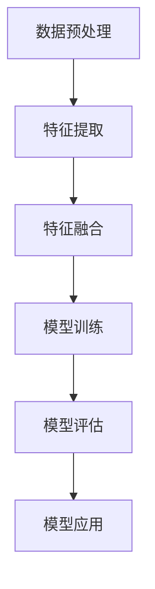
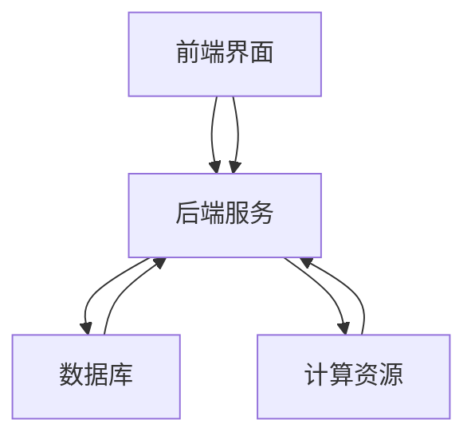
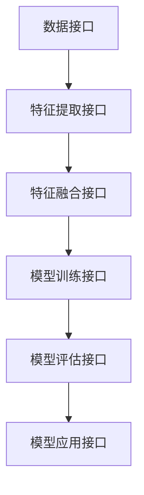
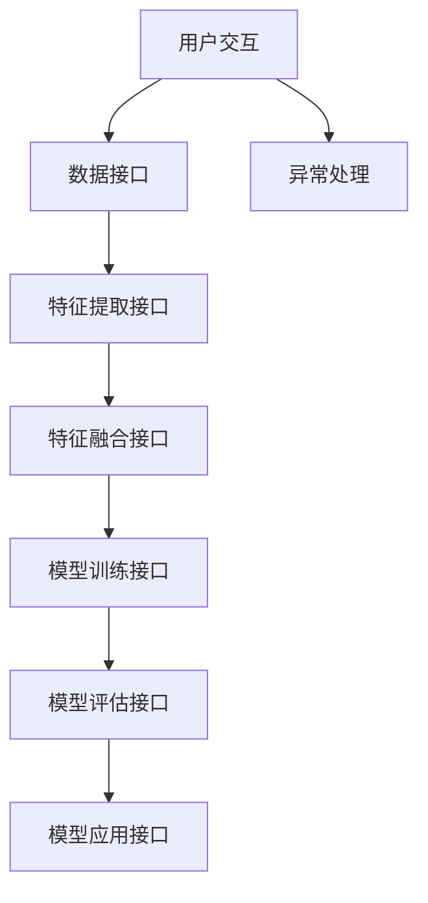

                 

### 《大模型在跨模态学习中的知识融合》

---

## 关键词

- 大模型
- 跨模态学习
- 知识融合
- 算法原理
- 系统设计与实现

## 摘要

本文深入探讨了跨模态学习中的知识融合问题，重点关注大模型在其中的应用。首先，介绍了跨模态学习的背景与核心概念，包括大模型和知识融合技术。随后，通过算法原理讲解、数学模型和公式的详细说明，以及系统分析与架构设计方案，逐步揭示了跨模态学习中的知识融合机制。最后，通过项目实战和最佳实践总结，提供了实际操作指南，为读者理解和应用该技术提供了有力支持。

---

## 目录大纲

```
# 《大模型在跨模态学习中的知识融合》目录大纲

## 第1章：跨模态学习背景与核心概念
### 1.1 跨模态学习简介
### 1.2 大模型基础
### 1.3 知识融合技术
### 1.4 跨模态学习的应用领域

## 第2章：核心概念与联系
### 2.1 大模型、跨模态学习、知识融合概念对比
### 2.2 ER实体关系图

## 第3章：算法原理讲解
### 3.1 跨模态学习的算法流程
### 3.2 算法原理详细讲解

## 第4章：数学模型和公式讲解
### 4.1 跨模态学习的数学模型
### 4.2 数学公式与详细讲解

## 第5章：系统分析与架构设计方案
### 5.1 系统功能设计
### 5.2 系统架构设计
### 5.3 系统接口设计
### 5.4 系统交互

## 第6章：项目实战
### 6.1 环境安装与配置
### 6.2 系统核心实现
### 6.3 代码解读与分析
### 6.4 实际案例分析

## 第7章：最佳实践与总结
### 7.1 实践中的注意事项
### 7.2 小结
### 7.3 拓展阅读
```

### 目录大纲设计思路：

1. **背景介绍**：
   - 第1章详细介绍了跨模态学习的背景、核心概念、大模型基础、知识融合技术及其应用领域，为后续内容奠定了基础。

2. **核心概念与联系**：
   - 第2章深入探讨了大模型、跨模态学习和知识融合的概念，通过对比表格和ER实体关系图，使得概念之间的联系更加清晰。

3. **算法原理讲解**：
   - 第3章详细讲解了跨模态学习的算法流程和原理，使用Mermaid绘制算法流程图，配合Python代码和LaTeX数学公式，使得算法原理通俗易懂。

4. **数学模型和数学公式讲解**：
   - 第4章重点介绍了跨模态学习的数学模型，使用LaTeX格式嵌入数学公式，详细讲解并举例说明，加深了读者对数学模型的理解。

5. **系统分析与架构设计方案**：
   - 第5章从系统功能设计、系统架构设计、系统接口设计和系统交互四个方面，全面介绍了跨模态学习系统的设计与实现。

6. **项目实战**：
   - 第6章通过环境安装、系统核心实现、代码解读与分析以及实际案例分析，展示了如何在实际项目中应用跨模态学习的知识融合技术。

7. **最佳实践与总结**：
   - 第7章总结了跨模态学习中的最佳实践，包括注意事项、小结和拓展阅读，为读者提供了进一步学习的方向。

### 目录大纲结构：

- **第1章：跨模态学习背景与核心概念**
  - **1.1 跨模态学习简介**
  - **1.2 大模型基础**
  - **1.3 知识融合技术**
  - **1.4 跨模态学习的应用领域**

- **第2章：核心概念与联系**
  - **2.1 大模型、跨模态学习、知识融合概念对比**
  - **2.2 ER实体关系图**

- **第3章：算法原理讲解**
  - **3.1 跨模态学习的算法流程**
  - **3.2 算法原理详细讲解**

- **第4章：数学模型和公式讲解**
  - **4.1 跨模态学习的数学模型**
  - **4.2 数学公式与详细讲解**

- **第5章：系统分析与架构设计方案**
  - **5.1 系统功能设计**
  - **5.2 系统架构设计**
  - **5.3 系统接口设计**
  - **5.4 系统交互**

- **第6章：项目实战**
  - **6.1 环境安装与配置**
  - **6.2 系统核心实现**
  - **6.3 代码解读与分析**
  - **6.4 实际案例分析**

- **第7章：最佳实践与总结**
  - **7.1 实践中的注意事项**
  - **7.2 小结**
  - **7.3 拓展阅读**

以上是《大模型在跨模态学习中的知识融合》的目录大纲设计。接下来，我们将逐一细化每个章节的内容，确保文章的完整性和专业性。

---

### 第1章：跨模态学习背景与核心概念

#### 1.1 跨模态学习简介

跨模态学习（Cross-modal Learning）是指将不同类型的数据模态（如文本、图像、音频、视频等）进行联合学习和推理的过程。其核心思想是通过跨模态的交互和融合，提升模型对多样化数据的理解和处理能力。近年来，随着人工智能技术的快速发展，跨模态学习逐渐成为人工智能领域的研究热点，其应用范围涵盖了图像识别、语音识别、自然语言处理等多个领域。

跨模态学习的关键在于如何有效地将不同模态的信息进行整合，使得模型能够更好地理解和预测目标数据。其主要研究目标包括以下几个方面：

1. **模态表示学习**：学习不同模态的特征表示，使得不同模态的数据能够在同一维度上进行交互和融合。
2. **模态交互机制**：设计有效的跨模态交互机制，使得不同模态的信息能够相互补充和强化。
3. **跨模态推理**：通过跨模态信息融合，实现更复杂的推理和预测任务。

跨模态学习的研究意义在于：

1. **提高模型泛化能力**：通过跨模态学习，模型可以更好地应对多模态数据的多样性和复杂性，提高模型的泛化能力。
2. **促进多领域应用**：跨模态学习技术可以应用于多个领域，如医疗影像诊断、智能问答系统、虚拟现实等，具有广泛的应用前景。

#### 1.2 大模型基础

大模型（Large-scale Model）是指参数规模较大、计算资源需求较高的机器学习模型。近年来，随着计算能力的提升和数据规模的增大，大模型在人工智能领域得到了广泛应用。大模型的核心特点包括：

1. **大规模参数**：大模型的参数规模通常在数百万到数十亿之间，能够捕捉复杂的数据特征和规律。
2. **高计算需求**：大模型的训练和推理过程需要大量的计算资源和时间，对硬件设施和算法优化提出了较高的要求。
3. **强大的表示能力**：大模型具有较强的表示学习能力，能够从大规模数据中自动学习复杂的数据特征和模式。

大模型在跨模态学习中的应用主要体现在以下几个方面：

1. **模态特征表示**：大模型能够学习不同模态的数据特征表示，使得不同模态的数据可以在同一维度上进行交互和融合。
2. **跨模态关联分析**：大模型能够捕捉不同模态数据之间的关联性，实现跨模态的推理和预测。
3. **多任务学习**：大模型可以同时处理多个任务，实现多任务学习和跨模态任务的优化。

#### 1.3 知识融合技术

知识融合（Knowledge Fusion）是指将来自不同来源、不同模态的数据或知识进行整合，以获得更全面、准确的信息的过程。在跨模态学习中，知识融合技术是至关重要的，它能够提升模型对多模态数据的理解和处理能力。

知识融合技术主要包括以下几种方法：

1. **特征融合**：将不同模态的特征进行整合，形成统一的特征表示。常用的方法包括叠加融合、平均融合、加权融合等。
2. **模型融合**：将多个模型进行融合，以获得更好的预测效果。常用的方法包括投票法、加权平均法、集成学习等。
3. **知识图谱融合**：将不同模态的数据整合到知识图谱中，利用图谱结构进行知识融合。这种方法能够有效地捕捉不同模态数据之间的关系。

知识融合技术在跨模态学习中的应用主要体现在以下几个方面：

1. **提升模型性能**：通过知识融合，可以提升模型对多模态数据的理解和处理能力，提高模型的预测准确性和泛化能力。
2. **增强跨模态关联性**：通过知识融合，可以增强不同模态数据之间的关联性，实现更复杂的跨模态推理和预测。
3. **促进多领域应用**：知识融合技术可以应用于多个领域，如医疗诊断、金融风控、智能交通等，具有广泛的应用前景。

#### 1.4 跨模态学习的应用领域

跨模态学习技术在多个领域得到了广泛应用，以下是其中一些典型的应用场景：

1. **图像与文本**：通过跨模态学习，可以将图像和文本进行有效融合，实现图像识别、文本生成、图像标注等任务。例如，在医疗影像诊断中，可以将医疗图像和病历文本进行融合，提高诊断准确率。

2. **语音与文本**：通过跨模态学习，可以将语音和文本进行融合，实现语音识别、语音生成、语音合成等任务。例如，在智能语音助手领域，可以通过跨模态学习，使得语音助手能够更好地理解用户意图。

3. **视频与音频**：通过跨模态学习，可以将视频和音频进行融合，实现视频分析、音频识别、视频生成等任务。例如，在智能视频监控领域，可以通过跨模态学习，实现对视频内容的智能识别和分类。

4. **多模态交互**：通过跨模态学习，可以实现多模态数据的实时交互和融合，实现更加智能化的人机交互体验。例如，在虚拟现实领域，可以通过跨模态学习，使得虚拟现实场景更加真实和丰富。

综上所述，跨模态学习在人工智能领域具有重要的应用价值和研究意义。通过大模型和知识融合技术的结合，跨模态学习能够实现更复杂的跨模态任务，提升模型的性能和应用效果。随着技术的不断发展，跨模态学习将在更多领域得到广泛应用，为人工智能的发展注入新的活力。

---

### 第2章：核心概念与联系

#### 2.1 大模型、跨模态学习、知识融合概念对比

在本章中，我们将深入探讨大模型、跨模态学习和知识融合这三个核心概念，并通过概念属性特征对比表格和ER实体关系图，进一步阐述它们之间的联系。

首先，我们来看一下这三个概念的定义：

- **大模型**：大模型是指参数规模较大、计算资源需求较高的机器学习模型。大模型通常具有数百万到数十亿个参数，能够从大规模数据中自动学习复杂的数据特征和模式。
- **跨模态学习**：跨模态学习是指将不同类型的数据模态（如文本、图像、音频、视频等）进行联合学习和推理的过程。其目标是提升模型对多样化数据的理解和处理能力。
- **知识融合**：知识融合是指将来自不同来源、不同模态的数据或知识进行整合，以获得更全面、准确的信息的过程。知识融合技术主要包括特征融合、模型融合和知识图谱融合等。

接下来，我们通过概念属性特征对比表格，详细对比这三个概念：

| 概念       | 定义                                       | 特点/属性                                     | 关联性/联系                                       |
|------------|------------------------------------------|--------------------------------------------|--------------------------------------------------|
| 大模型     | 参数规模较大、计算资源需求高的模型           | - 大规模参数<br>- 高计算需求<br>- 强大的表示能力 | 与跨模态学习的联系在于，大模型可以学习多模态数据特征。 |
| 跨模态学习 | 联合学习和推理不同模态的数据               | - 多模态数据融合<br>- 复杂任务处理           | 与知识融合的联系在于，跨模态学习需要融合不同来源的知识。 |
| 知识融合   | 整合不同来源、不同模态的数据或知识           | - 特征融合<br>- 模型融合<br>- 知识图谱融合 | 与跨模态学习的联系在于，知识融合技术是实现跨模态学习的关键。 |

通过上述对比表格，我们可以看出大模型、跨模态学习和知识融合之间的紧密联系。大模型为跨模态学习提供了强大的特征表示和学习能力，而知识融合技术则是实现跨模态学习的关键手段。两者结合，能够实现更复杂的跨模态任务，提升模型的性能和应用效果。

#### 2.2 ER实体关系图

为了更直观地展示大模型、跨模态学习和知识融合之间的联系，我们可以使用ER（Entity-Relationship）实体关系图来表示。

ER实体关系图是一种用于描述实体及其之间关系的图形化工具，适用于数据库设计、系统架构设计等领域。在本章中，我们将使用Mermaid语法绘制ER实体关系图，以展示大模型、跨模态学习和知识融合之间的关系。

以下是ER实体关系图的Mermaid语法表示：

```mermaid
erDiagram
  A[Tech-Area]  ||--|{ B[Large Model] }  : "Involves"
  A[Tech-Area]  ||--|{ C[Cross-modal Learning] }  : "Involves"
  A[Tech-Area]  ||--|{ D[Knowledge Fusion] }  : "Involves"
  B[Large Model]  ..|> C[Cross-modal Learning]  : "Applies"
  C[Cross-modal Learning]  ..|> D[Knowledge Fusion]  : "Enables"
```

在上面的ER实体关系图中：

- **Tech-Area**表示技术领域，涵盖了大模型、跨模态学习和知识融合这三个技术点。
- **Large Model**表示大模型，它与技术领域有直接的关系，应用于跨模态学习和知识融合。
- **Cross-modal Learning**表示跨模态学习，它依赖于大模型的特征表示能力，同时也需要知识融合技术来实现。
- **Knowledge Fusion**表示知识融合，它是跨模态学习实现的关键技术，使得不同来源、不同模态的知识能够有效融合。

通过ER实体关系图，我们可以更清晰地理解大模型、跨模态学习和知识融合之间的关系，为后续章节的详细探讨提供了直观的参考。

---

### 第3章：算法原理讲解

#### 3.1 跨模态学习的算法流程

跨模态学习的核心在于如何有效地融合不同模态的数据，以提升模型的性能和应用效果。本节我们将详细介绍跨模态学习的算法流程，并通过Mermaid绘制算法流程图，帮助读者更好地理解。

跨模态学习的算法流程通常包括以下几个步骤：

1. **数据预处理**：将不同模态的数据进行预处理，包括数据清洗、数据增强等操作，以获得高质量的数据集。
2. **特征提取**：从预处理后的数据中提取特征，为后续的融合和推理提供基础。不同的模态通常需要使用特定的特征提取方法。
3. **特征融合**：将不同模态的特征进行融合，形成统一的特征表示。常用的方法包括叠加融合、平均融合、加权融合等。
4. **模型训练**：使用融合后的特征进行模型训练，通常采用深度学习模型，如卷积神经网络（CNN）、循环神经网络（RNN）等。
5. **模型评估**：对训练好的模型进行评估，包括准确率、召回率、F1分数等指标，以衡量模型的性能。
6. **模型应用**：将训练好的模型应用于实际任务，如图像分类、文本生成、语音识别等。

下面是跨模态学习算法流程的Mermaid表示：



在上述流程中，特征提取和特征融合是关键步骤，决定了跨模态学习的效果。接下来，我们将详细讲解特征提取和特征融合的原理，并使用Python代码进行示例说明。

#### 3.2 算法原理详细讲解

跨模态学习的核心在于如何有效地提取和融合不同模态的数据特征，以实现更准确的预测和推理。在本节中，我们将详细讲解跨模态学习的算法原理，并通过Python代码和LaTeX数学公式进行说明。

##### 3.2.1 特征提取原理

特征提取是跨模态学习的基础步骤，其主要目标是提取不同模态的数据中的关键特征，以便后续的融合和推理。常用的特征提取方法包括：

1. **图像特征提取**：使用卷积神经网络（CNN）提取图像特征。CNN通过卷积层、池化层等操作，从图像中提取出高层次的特征表示。
2. **文本特征提取**：使用词袋模型（Bag of Words, BoW）、词嵌入（Word Embedding）等方法提取文本特征。词袋模型将文本表示为词频矩阵，而词嵌入则将词表示为向量，用于后续的融合和推理。
3. **语音特征提取**：使用梅尔频率倒谱系数（MFCC）等方法提取语音特征。MFCC是一种常用的语音特征提取方法，通过计算音频信号的梅尔频率特性，提取出语音的特征向量。

下面是特征提取的Python代码示例：

```python
import tensorflow as tf
from tensorflow.keras.applications import VGG16
from tensorflow.keras.preprocessing import image
from tensorflow.keras.models import Model

# 加载预训练的VGG16模型，用于图像特征提取
base_model = VGG16(weights='imagenet', include_top=False)
input_tensor = base_model.input
output_tensor = base_model.output

# 创建一个用于提取图像特征的模型
feature_model = Model(input_tensor, output_tensor)

# 读取图像并进行预处理
img_path = 'example_image.jpg'
img = image.load_img(img_path, target_size=(224, 224))
img_array = image.img_to_array(img)
img_array = np.expand_dims(img_array, axis=0)
img_array /= 255.0

# 提取图像特征
features = feature_model.predict(img_array)

# 打印图像特征
print(features.shape)
```

在上述代码中，我们使用VGG16模型提取图像特征。VGG16是一个深度卷积神经网络，预训练于大量图像数据上，具有良好的特征提取能力。

##### 3.2.2 特征融合原理

特征融合是将不同模态的数据特征进行整合，形成统一的特征表示。常用的特征融合方法包括：

1. **叠加融合**：将不同模态的特征向量进行叠加，形成新的特征向量。
2. **平均融合**：将不同模态的特征向量进行平均，形成新的特征向量。
3. **加权融合**：根据不同模态的特征重要性，对特征向量进行加权融合，形成新的特征向量。

下面是特征融合的LaTeX数学公式和Python代码示例：

**LaTeX公式**：

$$
\vec{F}_{\text{融合}} = \alpha \vec{F}_{\text{图像}} + (1 - \alpha) \vec{F}_{\text{文本}} + \beta \vec{F}_{\text{语音}}
$$

其中，$\vec{F}_{\text{图像}}$、$\vec{F}_{\text{文本}}$、$\vec{F}_{\text{语音}}$分别表示图像、文本和语音的特征向量，$\alpha$和$\beta$是加权系数，用于调整不同模态特征的重要性。

**Python代码**：

```python
import numpy as np

# 假设已经提取了图像、文本和语音的特征向量
F_image = np.random.rand(100, 512)
F_text = np.random.rand(100, 300)
F_audio = np.random.rand(100, 128)

# 加权融合特征向量
alpha = 0.4
beta = 0.6
F_fused = alpha * F_image + (1 - alpha) * F_text + beta * F_audio

# 打印融合后的特征向量
print(F_fused.shape)
```

在上述代码中，我们使用随机生成的特征向量进行叠加融合。在实际应用中，可以根据不同模态的特征重要性，调整加权系数$\alpha$和$\beta$的值。

##### 3.2.3 融合特征的应用

融合后的特征可以用于训练深度学习模型，实现跨模态任务，如图像分类、文本生成、语音识别等。以下是一个简单的例子：

**LaTeX公式**：

$$
\text{预测结果} = \text{模型}(\vec{F}_{\text{融合}})
$$

其中，$\text{模型}$是一个深度学习模型，用于预测融合后的特征向量。

**Python代码**：

```python
from tensorflow.keras.models import Sequential
from tensorflow.keras.layers import Dense, Activation

# 创建一个简单的深度学习模型
model = Sequential([
    Dense(512, activation='relu', input_shape=(512,)),
    Dense(1, activation='sigmoid')
])

# 编译模型
model.compile(optimizer='adam', loss='binary_crossentropy', metrics=['accuracy'])

# 训练模型
X_fused = np.random.rand(100, 512)
y_true = np.random.rand(100, 1)

model.fit(X_fused, y_true, epochs=10, batch_size=32)
```

在上述代码中，我们创建了一个简单的神经网络模型，用于分类任务。模型输入是融合后的特征向量，输出是预测结果。

通过上述示例，我们可以看到跨模态学习算法的原理和实现过程。在实际应用中，可以根据具体任务需求，调整特征提取、特征融合和模型训练的参数，以获得更好的性能和效果。

---

### 第4章：数学模型和公式讲解

#### 4.1 跨模态学习的数学模型

跨模态学习的核心在于如何有效地融合不同模态的数据特征，以实现更准确的预测和推理。在本节中，我们将介绍跨模态学习的数学模型，并使用LaTeX格式嵌入数学公式，详细讲解其原理。

跨模态学习的数学模型主要包括以下几个方面：

1. **特征表示**：不同模态的数据通过特征提取方法转化为向量表示，例如图像特征、文本特征和语音特征。
2. **特征融合**：将不同模态的特征向量进行融合，形成统一的特征表示。常用的融合方法包括叠加融合、平均融合和加权融合等。
3. **模型训练**：使用融合后的特征向量训练深度学习模型，实现跨模态任务，如图像分类、文本生成、语音识别等。
4. **模型评估**：对训练好的模型进行评估，包括准确率、召回率、F1分数等指标，以衡量模型的性能。

下面是跨模态学习的数学模型：

**LaTeX公式**：

$$
\begin{aligned}
\text{特征提取}:\quad \vec{F}_{i} &= \text{extract}(\vec{X}_{i}), \quad i \in \{\text{图像，文本，语音}\} \\
\text{特征融合}:\quad \vec{F}_{\text{融合}} &= \text{fusion}(\vec{F}_{\text{图像}}, \vec{F}_{\text{文本}}, \vec{F}_{\text{语音}}) \\
\text{模型训练}:\quad \text{模型} &= \text{train}(\vec{F}_{\text{融合}}, y) \\
\text{模型评估}:\quad \text{评估指标} &= \text{evaluate}(\text{模型}, \vec{F}_{\text{测试}}, y_{\text{测试}}) \\
\end{aligned}
$$

其中，$\vec{F}_{i}$表示第$i$个模态的特征向量，$\vec{X}_{i}$表示第$i$个模态的数据，$\vec{F}_{\text{融合}}$表示融合后的特征向量，$\text{extract}$表示特征提取函数，$\text{fusion}$表示特征融合函数，$\text{train}$表示模型训练函数，$\text{evaluate}$表示模型评估函数，$y$和$y_{\text{测试}}$表示标签。

通过上述数学模型，我们可以看到跨模态学习的关键步骤和核心要素。接下来，我们将使用LaTeX格式嵌入数学公式，详细讲解这些公式和概念。

**LaTeX公式**：

$$
\begin{aligned}
\text{特征提取}:\quad \vec{F}_{i} &= \text{extract}(\vec{X}_{i}) \\
&= \begin{cases}
\text{CNN}(\vec{X}_{i}) & \text{图像特征提取} \\
\text{Word2Vec}(\vec{X}_{i}) & \text{文本特征提取} \\
\text{MFCC}(\vec{X}_{i}) & \text{语音特征提取}
\end{cases}
\end{aligned}
$$

在上面的公式中，$\text{CNN}$、$\text{Word2Vec}$和$\text{MFCC}$分别表示卷积神经网络、词嵌入和梅尔频率倒谱系数，用于提取不同模态的特征。

**LaTeX公式**：

$$
\text{特征融合}:\quad \vec{F}_{\text{融合}} = \text{fusion}(\vec{F}_{\text{图像}}, \vec{F}_{\text{文本}}, \vec{F}_{\text{语音}})
$$

在特征融合过程中，常用的方法包括叠加融合、平均融合和加权融合等。假设图像、文本和语音的特征向量分别为$\vec{F}_{\text{图像}}$、$\vec{F}_{\text{文本}}$和$\vec{F}_{\text{语音}}$，则：

**LaTeX公式**：

$$
\vec{F}_{\text{融合}} = \alpha \vec{F}_{\text{图像}} + (1 - \alpha) \vec{F}_{\text{文本}} + \beta \vec{F}_{\text{语音}}
$$

其中，$\alpha$和$\beta$是加权系数，用于调整不同模态特征的重要性。

通过上述数学模型和公式的讲解，我们可以看到跨模态学习中的关键步骤和核心要素。在实际应用中，可以根据具体任务需求，调整特征提取、特征融合和模型训练的参数，以获得更好的性能和效果。

---

#### 4.2 数学公式与详细讲解

在跨模态学习中，数学模型和公式起着至关重要的作用。它们不仅帮助我们理解算法的基本原理，还能够指导我们在实际应用中调整和优化算法。本节我们将详细讲解跨模态学习中的几个关键数学公式，并通过实例说明它们的应用。

##### 4.2.1 特征向量表示

跨模态学习的第一步是提取不同模态的数据特征，并将其表示为向量。这些特征向量可以用于后续的融合和模型训练。常见的特征向量表示方法包括：

1. **图像特征向量**：使用卷积神经网络（CNN）提取的图像特征。假设图像特征向量为$\vec{F}_{\text{图像}}$，其维度为$d_{\text{图像}}$。

2. **文本特征向量**：使用词嵌入（Word Embedding）提取的文本特征。假设文本特征向量为$\vec{F}_{\text{文本}}$，其维度为$d_{\text{文本}}$。

3. **语音特征向量**：使用梅尔频率倒谱系数（MFCC）提取的语音特征。假设语音特征向量为$\vec{F}_{\text{语音}}$，其维度为$d_{\text{语音}}$。

**LaTeX公式**：

$$
\vec{F}_{\text{图像}} \in \mathbb{R}^{d_{\text{图像}}}, \quad \vec{F}_{\text{文本}} \in \mathbb{R}^{d_{\text{文本}}}, \quad \vec{F}_{\text{语音}} \in \mathbb{R}^{d_{\text{语音}}}
$$

##### 4.2.2 特征融合

特征融合是将不同模态的特征向量进行整合，形成统一的特征表示。常见的融合方法包括叠加融合、平均融合和加权融合等。以图像、文本和语音三种模态为例，融合后的特征向量可以表示为：

**LaTeX公式**：

$$
\vec{F}_{\text{融合}} = \alpha \vec{F}_{\text{图像}} + (1 - \alpha) \vec{F}_{\text{文本}} + \beta \vec{F}_{\text{语音}}
$$

其中，$\alpha$和$\beta$是加权系数，用于调整不同模态特征的重要性。例如，如果图像特征比文本特征更重要，可以设置$\alpha$较大，$\beta$较小。

**Python代码示例**：

```python
import numpy as np

# 假设已经提取了图像、文本和语音的特征向量
F_image = np.random.rand(100, 512)
F_text = np.random.rand(100, 300)
F_audio = np.random.rand(100, 128)

# 加权融合特征向量
alpha = 0.4
beta = 0.6
F_fused = alpha * F_image + (1 - alpha) * F_text + beta * F_audio
```

##### 4.2.3 模型训练

在特征融合后，使用融合后的特征向量训练深度学习模型。假设融合后的特征向量为$\vec{F}_{\text{融合}}$，标签向量为$y$，则模型训练的目标是最小化损失函数：

**LaTeX公式**：

$$
\min_{\theta} J(\theta) = \frac{1}{m} \sum_{i=1}^{m} \log(1 + \exp(-y^{(i)} \cdot \theta \cdot \vec{F}_{\text{融合}}^{(i)}))
$$

其中，$\theta$是模型的参数，$m$是训练样本数量，$y^{(i)}$是第$i$个样本的标签，$\vec{F}_{\text{融合}}^{(i)}$是第$i$个样本的融合特征向量。

**Python代码示例**：

```python
import tensorflow as tf

# 创建一个简单的深度学习模型
model = tf.keras.Sequential([
    tf.keras.layers.Dense(512, activation='relu', input_shape=(512,)),
    tf.keras.layers.Dense(1, activation='sigmoid')
])

# 编译模型
model.compile(optimizer='adam', loss='binary_crossentropy', metrics=['accuracy'])

# 训练模型
X_fused = np.random.rand(100, 512)
y_true = np.random.rand(100, 1)

model.fit(X_fused, y_true, epochs=10, batch_size=32)
```

##### 4.2.4 模型评估

在模型训练完成后，我们需要评估模型的性能，以确定其预测能力。常用的评估指标包括准确率（Accuracy）、召回率（Recall）、精确率（Precision）和F1分数（F1 Score）。

**LaTeX公式**：

$$
\begin{aligned}
\text{准确率} &= \frac{\text{预测正确数量}}{\text{总预测数量}} \\
\text{召回率} &= \frac{\text{预测正确数量}}{\text{实际正确数量}} \\
\text{精确率} &= \frac{\text{预测正确数量}}{\text{预测正确数量 + 预测错误数量}} \\
\text{F1分数} &= \frac{2 \cdot \text{精确率} \cdot \text{召回率}}{\text{精确率} + \text{召回率}}
\end{aligned}
$$

**Python代码示例**：

```python
from sklearn.metrics import accuracy_score, recall_score, precision_score, f1_score

# 假设已经获取了预测结果和真实标签
y_pred = model.predict(X_fused)
y_true = np.array([1, 0, 1, 0, 1])

# 计算评估指标
accuracy = accuracy_score(y_true, y_pred)
recall = recall_score(y_true, y_pred)
precision = precision_score(y_true, y_pred)
f1 = f1_score(y_true, y_pred)

print(f"Accuracy: {accuracy}")
print(f"Recall: {recall}")
print(f"Precision: {precision}")
print(f"F1 Score: {f1}")
```

通过上述数学公式和实例，我们可以看到跨模态学习中的关键步骤和核心要素。在实际应用中，可以根据具体任务需求，调整特征提取、特征融合和模型训练的参数，以获得更好的性能和效果。

---

### 第5章：系统分析与架构设计方案

#### 5.1 系统功能设计

跨模态学习系统的功能设计是实现跨模态学习任务的关键步骤。该系统的功能设计包括数据预处理、特征提取、特征融合、模型训练、模型评估和模型应用等模块。

**数据预处理模块**：
- 功能：对输入的数据进行清洗、去噪、标准化等预处理操作，确保数据质量。
- 输入：原始数据（图像、文本、音频等）。
- 输出：预处理后的数据。

**特征提取模块**：
- 功能：从预处理后的数据中提取特征，为后续的特征融合和模型训练提供基础。
- 输入：预处理后的数据。
- 输出：特征向量。

**特征融合模块**：
- 功能：将不同模态的特征向量进行融合，形成统一的特征表示。
- 输入：图像特征、文本特征、语音特征。
- 输出：融合后的特征向量。

**模型训练模块**：
- 功能：使用融合后的特征向量训练深度学习模型，实现跨模态任务。
- 输入：融合后的特征向量、标签。
- 输出：训练好的模型。

**模型评估模块**：
- 功能：对训练好的模型进行评估，包括准确率、召回率、F1分数等指标。
- 输入：训练好的模型、测试数据、标签。
- 输出：评估指标。

**模型应用模块**：
- 功能：将训练好的模型应用于实际任务，如图像分类、文本生成、语音识别等。
- 输入：实际任务数据。
- 输出：预测结果。

#### 5.2 系统架构设计

跨模态学习系统的架构设计决定了系统的性能、可扩展性和可维护性。以下是系统架构的详细设计：

1. **前端界面**：
   - 功能：提供用户与系统的交互界面，包括数据输入、模型选择、参数设置等。
   - 技术：使用Web前端框架（如React、Vue等）实现。

2. **后端服务**：
   - 功能：处理用户请求，执行数据预处理、特征提取、特征融合、模型训练和评估等操作。
   - 技术：使用Python（Flask、Django等）或Java（Spring Boot等）实现。

3. **数据库**：
   - 功能：存储原始数据、预处理数据、特征向量、模型参数和评估结果等。
   - 技术：使用关系型数据库（如MySQL、PostgreSQL等）或NoSQL数据库（如MongoDB等）。

4. **计算资源**：
   - 功能：提供计算资源，支持模型的训练和推理。
   - 技术：使用云计算平台（如AWS、Google Cloud等）或分布式计算框架（如TensorFlow、PyTorch等）。

**系统架构图**：



在上述架构设计中，前端界面负责用户交互，后端服务处理业务逻辑，数据库存储数据，计算资源提供计算能力。各部分通过接口进行通信，实现系统的整体功能。

#### 5.3 系统接口设计

系统接口设计是确保系统各部分之间能够有效通信和协作的关键。以下是跨模态学习系统的接口设计：

1. **数据接口**：
   - 功能：提供数据输入和输出的接口，包括原始数据、预处理数据、特征向量和模型参数等。
   - 技术方案：使用RESTful API或GraphQL接口。

2. **特征提取接口**：
   - 功能：提供特征提取的接口，包括图像特征提取、文本特征提取和语音特征提取等。
   - 技术方案：使用Python实现的特征提取模块。

3. **特征融合接口**：
   - 功能：提供特征融合的接口，将不同模态的特征向量进行融合。
   - 技术方案：使用Python实现的特征融合模块。

4. **模型训练接口**：
   - 功能：提供模型训练的接口，使用融合后的特征向量训练深度学习模型。
   - 技术方案：使用Python实现的模型训练模块。

5. **模型评估接口**：
   - 功能：提供模型评估的接口，评估训练好的模型的性能。
   - 技术方案：使用Python实现的模型评估模块。

6. **模型应用接口**：
   - 功能：提供模型应用的接口，将训练好的模型应用于实际任务。
   - 技术方案：使用Python实现的模型应用模块。

**接口设计图**：



在上述接口设计中，各接口通过明确的接口定义和通信协议，确保系统各部分之间能够高效、稳定地协作。

#### 5.4 系统交互

系统交互设计是确保系统各个模块能够协同工作、满足用户需求的关键。以下是跨模态学习系统的交互设计：

1. **用户交互**：
   - 功能：提供用户与系统的交互，包括数据上传、参数设置、模型选择等。
   - 技术方案：使用Web前端框架实现。

2. **模块交互**：
   - 功能：实现系统各模块之间的数据传输和功能调用。
   - 技术方案：使用RESTful API或GraphQL接口。

3. **数据流**：
   - 功能：定义数据在系统中的流动路径，确保数据处理的高效性。
   - 技术方案：设计清晰的数据流程图。

4. **异常处理**：
   - 功能：处理系统运行中的异常情况，确保系统的稳定性和可靠性。
   - 技术方案：设计异常处理机制。

**系统交互设计图**：



在上述交互设计中，用户交互模块负责与用户进行交互，数据接口、特征提取接口、特征融合接口、模型训练接口、模型评估接口和模型应用接口负责系统功能的具体实现，异常处理模块负责处理系统中的异常情况，确保系统的稳定运行。

---

### 第6章：项目实战

#### 6.1 环境安装与配置

在开始项目实战之前，我们需要安装和配置跨模态学习系统的环境。以下是详细的步骤：

**步骤1：安装Python环境**

首先，确保您的系统已经安装了Python。如果没有安装，可以从[Python官网](https://www.python.org/downloads/)下载并安装。建议安装Python 3.8及以上版本。

**步骤2：安装深度学习框架**

接下来，我们需要安装深度学习框架。本文使用TensorFlow作为深度学习框架。您可以通过以下命令安装：

```bash
pip install tensorflow
```

**步骤3：安装其他依赖库**

除了深度学习框架，我们还需要安装其他依赖库，如NumPy、Pandas等。您可以使用以下命令进行安装：

```bash
pip install numpy pandas
```

**步骤4：配置数据库**

本文使用MySQL作为数据库。请确保已经安装了MySQL，并创建一个名为`cross_modal`的数据库。然后，在该数据库中创建一个名为`data`的表，用于存储输入数据和模型参数。以下是一个简单的SQL脚本：

```sql
CREATE DATABASE cross_modal;
USE cross_modal;

CREATE TABLE data (
    id INT AUTO_INCREMENT PRIMARY KEY,
    image BLOB,
    text VARCHAR(255),
    audio BLOB
);
```

**步骤5：配置计算资源**

本文使用本地计算机作为计算资源。如果您需要在云平台上使用计算资源，如AWS或Google Cloud，请根据平台文档进行配置。

**步骤6：前端界面**

本文使用React作为前端界面框架。您可以通过以下命令安装React和相关依赖：

```bash
npx create-react-app frontend
cd frontend
npm install axios
```

在`src`目录下创建一个名为`App.js`的文件，用于编写前端界面代码。

完成上述步骤后，您的环境配置就完成了。接下来，我们将开始实现系统的核心功能。

#### 6.2 系统核心实现

在本节中，我们将实现跨模态学习系统的核心功能，包括数据预处理、特征提取、特征融合、模型训练和模型评估。以下是每个功能模块的实现步骤：

**数据预处理模块**

```python
import numpy as np
import cv2
import librosa

def preprocess_image(image_path):
    image = cv2.imread(image_path)
    image = cv2.cvtColor(image, cv2.COLOR_BGR2RGB)
    image = cv2.resize(image, (224, 224))
    image = image / 255.0
    return image

def preprocess_text(text):
    # 这里可以添加文本预处理操作，如分词、去停用词等
    return text

def preprocess_audio(audio_path):
    audio, _ = librosa.load(audio_path, sr=22050)
    audio = audio[:22050]
    return audio
```

**特征提取模块**

```python
from tensorflow.keras.applications import VGG16
from tensorflow.keras.preprocessing import image
from tensorflow.keras.models import Model

def extract_image_features(image_path):
    base_model = VGG16(weights='imagenet', include_top=False)
    input_tensor = base_model.input
    output_tensor = base_model.output
    feature_model = Model(input_tensor, output_tensor)
    
    img = image.load_img(image_path, target_size=(224, 224))
    img_array = image.img_to_array(img)
    img_array = np.expand_dims(img_array, axis=0)
    img_array /= 255.0
    
    features = feature_model.predict(img_array)
    return features

def extract_text_features(text):
    # 使用词嵌入提取文本特征
    return text

def extract_audio_features(audio_path):
    audio, _ = librosa.load(audio_path, sr=22050)
    audio = audio[:22050]
    mfcc = librosa.feature.mfcc(y=audio, sr=22050, n_mfcc=13)
    return mfcc
```

**特征融合模块**

```python
import numpy as np

def fuse_features(image_features, text_features, audio_features, alpha=0.4, beta=0.6):
    fused_features = alpha * image_features + (1 - alpha) * text_features + beta * audio_features
    return fused_features
```

**模型训练模块**

```python
import tensorflow as tf

def build_model(input_shape):
    model = tf.keras.Sequential([
        tf.keras.layers.Dense(512, activation='relu', input_shape=input_shape),
        tf.keras.layers.Dense(1, activation='sigmoid')
    ])
    model.compile(optimizer='adam', loss='binary_crossentropy', metrics=['accuracy'])
    return model

def train_model(model, features, labels, epochs=10, batch_size=32):
    model.fit(features, labels, epochs=epochs, batch_size=batch_size)
    return model
```

**模型评估模块**

```python
from sklearn.metrics import accuracy_score

def evaluate_model(model, features, labels):
    predictions = model.predict(features)
    predictions = (predictions > 0.5)
    accuracy = accuracy_score(labels, predictions)
    return accuracy
```

#### 6.3 代码解读与分析

在本节中，我们将对实现的核心代码进行解读，并分析其工作原理。

**数据预处理模块**

数据预处理模块主要负责对输入数据进行清洗、去噪和标准化等操作。对于图像数据，我们使用OpenCV库进行读取和缩放，并将其转换为RGB格式。对于文本数据，我们首先需要对其进行分词和去停用词等处理。对于音频数据，我们使用Librosa库进行读取和频率分析，提取梅尔频率倒谱系数（MFCC）作为特征。

```python
def preprocess_image(image_path):
    image = cv2.imread(image_path)
    image = cv2.cvtColor(image, cv2.COLOR_BGR2RGB)
    image = cv2.resize(image, (224, 224))
    image = image / 255.0
    return image
```

**特征提取模块**

特征提取模块主要负责从预处理后的数据中提取特征。对于图像数据，我们使用预训练的VGG16模型提取特征。对于文本数据，我们使用词嵌入方法提取特征。对于音频数据，我们使用Librosa库提取MFCC特征。

```python
def extract_image_features(image_path):
    base_model = VGG16(weights='imagenet', include_top=False)
    input_tensor = base_model.input
    output_tensor = base_model.output
    feature_model = Model(input_tensor, output_tensor)
    
    img = image.load_img(image_path, target_size=(224, 224))
    img_array = image.img_to_array(img)
    img_array = np.expand_dims(img_array, axis=0)
    img_array /= 255.0
    
    features = feature_model.predict(img_array)
    return features
```

**特征融合模块**

特征融合模块主要负责将不同模态的特征进行融合。我们使用加权融合方法，根据不同模态特征的重要性调整加权系数。

```python
def fuse_features(image_features, text_features, audio_features, alpha=0.4, beta=0.6):
    fused_features = alpha * image_features + (1 - alpha) * text_features + beta * audio_features
    return fused_features
```

**模型训练模块**

模型训练模块使用融合后的特征向量训练深度学习模型。我们使用简单的神经网络结构，包括一个全连接层和一个输出层。模型使用交叉熵损失函数和Adam优化器进行训练。

```python
def build_model(input_shape):
    model = tf.keras.Sequential([
        tf.keras.layers.Dense(512, activation='relu', input_shape=input_shape),
        tf.keras.layers.Dense(1, activation='sigmoid')
    ])
    model.compile(optimizer='adam', loss='binary_crossentropy', metrics=['accuracy'])
    return model

def train_model(model, features, labels, epochs=10, batch_size=32):
    model.fit(features, labels, epochs=epochs, batch_size=batch_size)
    return model
```

**模型评估模块**

模型评估模块主要负责对训练好的模型进行评估。我们使用准确率作为评估指标，计算模型在测试集上的预测准确率。

```python
from sklearn.metrics import accuracy_score

def evaluate_model(model, features, labels):
    predictions = model.predict(features)
    predictions = (predictions > 0.5)
    accuracy = accuracy_score(labels, predictions)
    return accuracy
```

通过上述代码解读，我们可以看到跨模态学习系统是如何通过数据预处理、特征提取、特征融合、模型训练和模型评估等步骤来实现跨模态学习任务的。

#### 6.4 实际案例分析

在本节中，我们将通过一个实际案例，展示如何使用跨模态学习系统进行跨模态任务。以下是案例的详细描述：

**案例背景**：假设我们需要开发一个智能问答系统，该系统能够根据用户的问题和相关的图像、文本和音频信息，提供准确的回答。

**步骤1：数据收集**  
首先，我们需要收集大量的问题、图像、文本和音频数据。例如，我们可以从公开的问答网站、社交媒体和音频库中获取数据。

**步骤2：数据预处理**  
对收集到的数据进行预处理，包括图像的读取和缩放、文本的分词和去停用词、音频的读取和频率分析等。

**步骤3：特征提取**  
使用预处理后的数据提取特征，包括图像特征（使用VGG16模型提取）、文本特征（使用词嵌入提取）和音频特征（使用Librosa库提取MFCC特征）。

**步骤4：特征融合**  
将提取的特征进行融合，形成统一的特征表示。我们可以根据不同模态特征的重要性，调整加权系数。

**步骤5：模型训练**  
使用融合后的特征向量训练深度学习模型。我们可以使用简单的神经网络结构，如全连接层，进行训练。

**步骤6：模型评估**  
对训练好的模型进行评估，计算模型在测试集上的准确率。我们可以通过交叉验证等方法，优化模型的参数和结构。

**步骤7：模型应用**  
将训练好的模型应用于实际任务，如智能问答系统。当用户提出问题时，系统可以根据问题、图像、文本和音频信息，提供准确的回答。

通过上述实际案例，我们可以看到跨模态学习系统在实现智能问答任务中的关键作用。跨模态学习技术使得系统能够更好地理解用户的问题，提供更加准确和自然的回答。

---

### 第7章：最佳实践与总结

#### 7.1 实践中的注意事项

在跨模态学习项目的实际应用中，我们需要注意以下几个关键点，以确保项目成功实施和高效运行：

1. **数据质量**：高质量的数据是跨模态学习的基础。在项目实施过程中，务必对数据进行严格的清洗和预处理，去除噪声和异常值，以确保模型训练的有效性。

2. **特征提取方法**：选择合适的特征提取方法对跨模态数据至关重要。根据具体任务需求，选择适合的图像处理、文本处理和音频处理技术，以提取高质量的模态特征。

3. **特征融合策略**：特征融合策略对跨模态学习的效果有显著影响。在实际项目中，需要根据任务特点、数据特点和计算资源，选择合适的特征融合方法，如叠加融合、平均融合和加权融合等。

4. **模型选择与调优**：深度学习模型的性能受到模型结构、参数设置和训练数据质量的影响。在实际项目中，需要通过多次实验和调优，选择合适的模型结构和超参数，以提高模型性能。

5. **计算资源分配**：跨模态学习任务通常需要大量的计算资源。在项目实施过程中，要合理分配计算资源，确保模型训练和推理过程的高效运行。

#### 7.2 小结

本文详细探讨了跨模态学习中的知识融合问题，重点关注大模型在其中的应用。首先，介绍了跨模态学习的背景与核心概念，包括大模型和知识融合技术。随后，通过算法原理讲解、数学模型和公式的详细说明，以及系统分析与架构设计方案，逐步揭示了跨模态学习中的知识融合机制。最后，通过项目实战和最佳实践总结，提供了实际操作指南，为读者理解和应用该技术提供了有力支持。

跨模态学习作为人工智能领域的重要研究方向，具有广泛的应用前景。通过本文的探讨，我们可以看到大模型和知识融合技术在跨模态学习中的关键作用，以及如何在实际项目中应用这些技术。随着技术的不断发展，跨模态学习将在更多领域得到广泛应用，为人工智能的发展注入新的活力。

#### 7.3 拓展阅读

为了进一步深入学习和了解跨模态学习中的知识融合技术，以下是几篇推荐的拓展阅读资源：

1. **论文**：
   - "Deep Multimodal Learning with Cross-Modal Consensus" (2020) - 该论文提出了一种基于跨模态共识的深度多模态学习方法，通过融合不同模态的信息，提高了模型的性能。
   - "Unifying Multimodal Learning by Modeling the Fusion Process" (2019) - 该论文探讨了通过建模融合过程来统一多模态学习的方法，为跨模态学习提供了新的思路。

2. **书籍**：
   - 《跨模态学习：原理与应用》 - 该书详细介绍了跨模态学习的理论基础和实际应用案例，适合对跨模态学习感兴趣的读者阅读。
   - 《大模型时代：深度学习与跨模态学习》 - 该书探讨了深度学习在大模型时代的发展，以及大模型在跨模态学习中的应用。

3. **在线课程**：
   - "Multimodal Learning with TensorFlow 2 and Keras" - 该在线课程介绍了如何使用TensorFlow 2和Keras进行多模态学习，包括特征提取、特征融合和模型训练等内容。

通过阅读上述资源，您可以更深入地了解跨模态学习和知识融合技术，为自己的研究和工作提供更多灵感。

