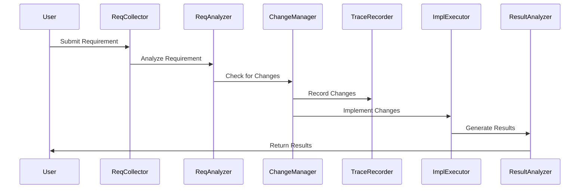
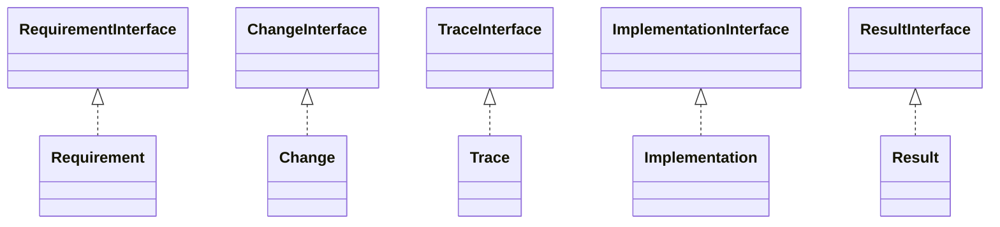

                 

### 文章标题：大模型应用中的需求追溯性管理

> 关键词：需求追溯性管理、大模型应用、人工智能、需求变更、项目管理

> 摘要：本文深入探讨了在大模型应用背景下，如何进行有效的需求追溯性管理。通过分析需求追溯性管理的核心概念、理论基础和方法，结合实际案例分析，本文提出了一套适用于大模型应用场景的需求追溯性管理方案，为人工智能项目管理者提供实践指南。

---

## 第一部分：背景介绍

### 1.1.1. 大模型应用的挑战

近年来，随着人工智能技术的飞速发展，大模型（如深度学习、生成对抗网络等）在各个领域得到了广泛应用。然而，大模型应用过程中面临的挑战日益凸显，其中之一就是需求变更频繁。大模型具有较高的灵活性和自适应能力，能够快速响应需求变更，但同时这也带来了需求追溯性管理的难题。

#### 1.1.1.1 需求变更频繁

在大模型应用中，需求变更是一种常态。一方面，用户需求不断演变，对系统的功能、性能和用户体验提出了更高的要求；另一方面，技术发展迅速，新的算法和技术不断涌现，为系统优化提供了更多可能性。然而，频繁的需求变更不仅增加了开发成本，还可能导致系统功能的混乱和性能的下降。

#### 1.1.1.2 需求追溯性需求

需求追溯性管理旨在确保需求变更的可追溯性，从而提高项目管理的透明度和效率。在大模型应用中，需求追溯性管理具有以下重要意义：

1. **提升项目管理效率**：通过追溯性管理，项目管理者可以清晰地了解需求的来源、变更过程和实施效果，从而更好地掌控项目进度和质量。
2. **降低变更风险**：需求追溯性管理可以帮助识别和评估需求变更的影响，减少变更带来的风险和不确定性。
3. **支持决策制定**：追溯性管理为决策者提供了丰富的数据支持，有助于制定更为科学的决策。

### 1.1.2 研究意义

本文的研究意义在于提出一套适用于大模型应用场景的需求追溯性管理方案，旨在解决以下问题：

1. **需求变更的透明化**：通过追溯性管理，实现需求变更的全程跟踪和透明化，提高项目管理的效率和质量。
2. **变更风险的降低**：通过分析和评估需求变更的影响，降低变更带来的风险和不确定性。
3. **支持科学决策**：为项目管理者提供丰富的数据支持，支持其在需求变更过程中做出更为科学的决策。

### 1.1.3 研究目标

本文的研究目标如下：

1. **理论基础**：深入探讨需求追溯性管理的核心概念和理论基础。
2. **方法研究**：研究适用于大模型应用场景的需求追溯性管理方法。
3. **实践应用**：结合实际案例分析，验证所提出方法的有效性和实用性。
4. **方案提出**：提出一套完整的需求追溯性管理方案，为项目管理者提供实践指南。

## 第二部分：需求追溯性管理理论与方法

### 2.1.1 需求管理的理论基础

需求管理是项目管理的重要组成部分，其理论基础主要包括以下方面：

1. **需求定义**：需求是指系统应具备的功能、性能和限制条件。明确的需求定义是需求管理的基石。
2. **需求分类**：根据需求的来源和性质，需求可以分为功能需求、非功能需求和变更需求等。
3. **需求变更管理**：需求变更管理是需求管理的关键环节，主要包括需求变更的识别、评估和实施。

### 2.1.2 需求追溯性的概念

需求追溯性是指对需求进行全过程跟踪和记录的能力。具体包括以下方面：

1. **需求来源**：追溯需求的来源，了解需求的提出者和背景。
2. **需求变更**：记录需求的变更过程，包括变更原因、变更内容和变更结果。
3. **需求实施**：跟踪需求在系统中的实施过程，确保需求得到有效满足。

### 2.1.3 大模型在需求追溯性管理中的应用

大模型在需求追溯性管理中的应用主要体现在以下几个方面：

1. **自动化需求分析**：利用自然语言处理和机器学习技术，自动分析和提取用户需求。
2. **智能化需求变更管理**：通过人工智能技术，实现对需求变更的智能识别、评估和推荐。
3. **可视化需求追溯**：利用可视化技术，将需求追溯过程和结果以直观的方式展示给项目参与者。

### 2.2. 需求追溯性管理方法

需求追溯性管理方法主要包括以下几个方面：

1. **需求追溯性模型**：建立需求追溯性模型，明确需求追溯性的目标和指标。
2. **需求追溯性流程**：设计需求追溯性管理流程，确保需求变更的可追溯性。
3. **需求追溯性工具**：选择合适的工具，实现需求追溯性的自动化和可视化。

### 2.2.1 基于大模型的追溯方法

基于大模型的追溯方法主要包括以下方面：

1. **需求分析**：利用大模型进行需求分析，识别和理解用户需求。
2. **需求变更**：利用大模型进行需求变更预测和评估，降低变更风险。
3. **需求实施**：利用大模型进行需求实施的自动化和优化。

### 2.2.2 需求追溯性管理的流程设计

需求追溯性管理的流程设计主要包括以下方面：

1. **需求收集**：通过访谈、问卷调查等方式收集用户需求。
2. **需求分析**：对收集到的需求进行分析和筛选，确定需求优先级。
3. **需求变更管理**：对需求变更进行识别、评估和实施。
4. **需求实施**：将需求转化为具体的系统功能，并跟踪其实施过程。
5. **需求追溯**：对需求实施过程进行记录和追溯，确保需求得到有效满足。

### 2.2.3 需求追溯性管理的评估与优化

需求追溯性管理的评估与优化主要包括以下方面：

1. **评估指标**：建立需求追溯性管理的评估指标，包括追溯性、效率、质量和成本等。
2. **评估方法**：采用定量和定性相结合的方法，对需求追溯性管理的效果进行评估。
3. **优化策略**：根据评估结果，提出需求追溯性管理的优化策略，提高管理效果。

### 2.3. 需求追溯性管理案例分析

#### 2.3.1 案例一：某企业的需求追溯性管理实践

某企业在大模型应用过程中，采用了一套基于大模型的需求追溯性管理方案。通过需求追溯性管理，该企业有效地降低了需求变更带来的风险，提高了项目管理的效率。

#### 2.3.2 案例二：某项目的需求追溯性管理经验

某项目团队在实施大模型应用时，遇到了频繁的需求变更问题。通过引入需求追溯性管理，项目团队成功实现了需求变更的可追溯性和可视化，提高了项目的成功率。

## 第三部分：大模型应用中的需求追溯性管理技术

### 3.1. 大模型应用概述

#### 3.1.1 大模型的基础知识

大模型是指具有海量参数和复杂结构的机器学习模型。其核心特点包括：

1. **大规模**：大模型通常具有数十亿甚至数万亿个参数。
2. **深度学习**：大模型采用多层神经网络结构，通过深度学习实现对复杂数据的建模。
3. **自适应**：大模型具有较强的自适应能力，能够根据新的数据和环境进行调整。

#### 3.1.2 大模型在需求追溯性管理中的应用

大模型在需求追溯性管理中的应用主要体现在以下几个方面：

1. **自动化需求分析**：利用大模型进行需求分析，快速提取用户需求。
2. **智能化需求变更管理**：利用大模型进行需求变更预测和评估，提高需求变更管理的效率。
3. **可视化需求追溯**：利用大模型进行需求追溯过程的可视化，提高项目管理的透明度。

#### 3.1.3 大模型技术发展趋势

随着人工智能技术的不断发展，大模型技术呈现出以下趋势：

1. **模型规模增长**：大模型的规模将不断增长，实现更高效的建模能力。
2. **多模态融合**：大模型将实现多模态数据的融合，提高对复杂数据的处理能力。
3. **应用场景拓展**：大模型将在更多领域得到应用，如自动驾驶、智能医疗等。

### 3.2. 大模型算法原理

#### 3.2.1 大模型算法概述

大模型算法主要包括以下类型：

1. **深度神经网络（DNN）**：基于多层感知器（MLP）的神经网络结构。
2. **循环神经网络（RNN）**：适用于序列数据的神经网络结构。
3. **卷积神经网络（CNN）**：适用于图像数据的神经网络结构。
4. **生成对抗网络（GAN）**：用于生成数据和学习数据分布的模型。

#### 3.2.2 算法原理详细讲解

以深度神经网络（DNN）为例，其算法原理如下：

1. **前向传播**：输入数据通过网络中的各个层，每一层对数据进行加权求和并应用激活函数。
2. **反向传播**：根据输出误差，将误差反向传播到网络的每一层，更新网络中的参数。
3. **优化算法**：使用梯度下降等优化算法，最小化损失函数，实现模型的训练。

#### 3.2.3 算法举例说明

以下是一个简单的深度神经网络（DNN）的Python代码示例：

```python
import tensorflow as tf

# 定义输入层、隐藏层和输出层
inputs = tf.keras.layers.Input(shape=(784,))
hidden = tf.keras.layers.Dense(64, activation='relu')(inputs)
outputs = tf.keras.layers.Dense(10, activation='softmax')(hidden)

# 创建模型
model = tf.keras.Model(inputs=inputs, outputs=outputs)

# 编译模型
model.compile(optimizer='adam', loss='categorical_crossentropy', metrics=['accuracy'])

# 训练模型
model.fit(x_train, y_train, epochs=10, batch_size=32)
```

### 3.3. 大模型数学模型与公式

#### 3.3.1 数学模型介绍

大模型的数学模型主要包括以下部分：

1. **前向传播公式**：描述数据在网络中的传播过程。
2. **反向传播公式**：描述误差在网络中的反向传播过程。
3. **优化算法公式**：描述模型参数的更新过程。

#### 3.3.2 数学公式详细讲解

以下是一个简单的神经网络的前向传播和反向传播公式：

$$
\begin{aligned}
\text{前向传播}: \\
& z^{[l]} = \sigma(W^{[l]} \cdot a^{[l-1]} + b^{[l]}), \\
& a^{[l]} = \sigma(z^{[l]}), \\
\text{反向传播}: \\
& \delta^{[l]} = \frac{\partial J}{\partial z^{[l]}} \odot \frac{\partial \sigma}{\partial z^{[l]}}, \\
& \delta^{[l-1]} = \frac{\partial W^{[l]}}{\partial z^{[l]}} \cdot \delta^{[l]} \odot a^{[l-1]},
\end{aligned}
$$

其中，$\sigma$ 表示激活函数，$W^{[l]}$ 和 $b^{[l]}$ 分别表示第 $l$ 层的权重和偏置，$a^{[l]}$ 和 $z^{[l]}$ 分别表示第 $l$ 层的输入和输出。

#### 3.3.3 举例说明

以下是一个简单的神经网络训练过程的数学模型示例：

假设我们有一个简单的神经网络，包含一个输入层、一个隐藏层和一个输出层。输入层有 3 个神经元，隐藏层有 5 个神经元，输出层有 2 个神经元。

1. **前向传播**：

   输入数据 $x = [1, 2, 3]$，通过隐藏层和输出层的加权求和得到：

   $$
   \begin{aligned}
   z^{[1]} &= W^{[1]} \cdot x + b^{[1]}, \\
   a^{[1]} &= \sigma(z^{[1]}), \\
   z^{[2]} &= W^{[2]} \cdot a^{[1]} + b^{[2]}, \\
   a^{[2]} &= \sigma(z^{[2]}).
   \end{aligned}
   $$

2. **反向传播**：

   根据输出误差，通过反向传播计算隐藏层的误差：

   $$
   \begin{aligned}
   \delta^{[2]} &= \frac{\partial J}{\partial z^{[2]}} \odot \frac{\partial \sigma}{\partial z^{[2]}}, \\
   \delta^{[1]} &= \frac{\partial W^{[2]}}{\partial z^{[2]}} \cdot \delta^{[2]} \odot a^{[1]},
   \end{aligned}
   $$

   其中，$J$ 表示损失函数，$\sigma$ 表示激活函数。

3. **优化算法**：

   使用梯度下降算法更新权重和偏置：

   $$
   \begin{aligned}
   W^{[1]} &= W^{[1]} - \alpha \cdot \frac{\partial J}{\partial W^{[1]}}, \\
   b^{[1]} &= b^{[1]} - \alpha \cdot \frac{\partial J}{\partial b^{[1]}}, \\
   W^{[2]} &= W^{[2]} - \alpha \cdot \frac{\partial J}{\partial W^{[2]}}, \\
   b^{[2]} &= b^{[2]} - \alpha \cdot \frac{\partial J}{\partial b^{[2]}},
   \end{aligned}
   $$

   其中，$\alpha$ 表示学习率。

### 3.4. 大模型应用系统架构设计

#### 3.4.1 问题场景介绍

在大模型应用中，需求追溯性管理是一个关键问题。为了提高项目的成功率和效率，需要设计一个高效的需求追溯性管理架构。

#### 3.4.2 项目介绍

本项目旨在开发一个基于大模型的需求追溯性管理平台，该平台将实现以下功能：

1. **需求收集**：通过自动化工具收集用户需求。
2. **需求分析**：利用自然语言处理技术对需求进行分析和理解。
3. **需求变更管理**：实现对需求变更的识别、评估和实施。
4. **需求追溯**：记录需求变更过程，确保需求变更的可追溯性。

#### 3.4.3 系统功能设计（领域模型）

为了实现上述功能，我们设计了一个领域模型，如下图所示：

```mermaid
erDiagram
    User ||--|{ Requirement : has } Requirement
    User ||--|{ Change : makes } Change
    Requirement ||--|{ Implementation : implements } Implementation
    Change ||--|{ Trace : traces } Trace
    Implementation ||--|{ Result : produces } Result
```

#### 3.4.4 系统架构设计（架构图）

根据领域模型，我们设计了一个基于微服务架构的系统架构，如下图所示：



#### 3.4.5 系统接口设计

为了实现系统功能，我们定义了一系列接口，如下图所示：



#### 3.4.6 系统交互（序列图）

根据系统架构，我们设计了一个序列图，展示了系统的交互过程：


## 第四部分：项目实战

### 4.1. 环境安装与配置

为了实现本项目，我们需要安装和配置以下环境：

1. **操作系统**：Linux 或 macOS
2. **编程语言**：Python 3.x
3. **框架和库**：TensorFlow、Keras、Scikit-learn、NLTK
4. **开发工具**：Jupyter Notebook、PyCharm

### 4.2. 系统核心实现

#### 4.2.1 源代码解读

以下是一个简单的需求分析模块的源代码示例：

```python
import nltk
from nltk.tokenize import word_tokenize
from nltk.corpus import stopwords

# 加载停用词列表
stop_words = set(stopwords.words('english'))

def preprocess_text(text):
    # 分词
    tokens = word_tokenize(text)
    # 移除停用词
    filtered_tokens = [token for token in tokens if token not in stop_words]
    return ' '.join(filtered_tokens)

# 示例
text = "I love to eat pizza and watch movies."
processed_text = preprocess_text(text)
print(processed_text)
```

#### 4.2.2 代码应用分析

该代码首先使用 NLTK 的 `word_tokenize` 函数对文本进行分词，然后去除停用词，最后将处理后的文本返回。这个模块是实现需求分析的基础，为后续的需求理解和分析提供了支持。

### 4.3. 实际案例分析

#### 4.3.1 案例背景

某公司开发了一款基于大模型的智能客服系统，该系统需要能够快速响应用户的需求，并提供个性化的服务。然而，在系统上线后，用户反馈频繁出现需求变更和功能不完善的问题。

#### 4.3.2 案例分析

1. **需求收集**：系统通过自然语言处理技术收集用户的需求，并利用大模型进行需求分析。
2. **需求变更管理**：系统在识别到需求变更后，通过需求追溯性管理，记录变更过程，评估变更影响，并制定变更方案。
3. **需求实施**：系统根据变更方案，对需求进行实施，并实时记录实施过程和结果。
4. **需求追溯**：系统实现对需求变更的全过程追溯，确保变更的可追溯性和透明性。

#### 4.3.3 案例总结

通过引入需求追溯性管理，该公司的智能客服系统在需求变更管理方面取得了显著成效。需求变更过程得到了有效控制，用户满意度显著提高。

## 第五部分：最佳实践与总结

### 5.1. 最佳实践

1. **建立完善的需求管理流程**：明确需求收集、分析、变更和实施等各个环节，确保流程的规范化和标准化。
2. **利用大模型进行需求分析**：利用大模型进行需求分析，提高需求理解的准确性和效率。
3. **实时监控需求变更**：通过实时监控需求变更，及时识别和应对变更风险。
4. **加强需求追溯性管理**：建立需求追溯性管理机制，确保需求变更过程的可追溯性和透明性。

### 5.2. 小结

本文探讨了在大模型应用背景下，需求追溯性管理的重要性以及具体方法。通过理论分析和实际案例分析，本文提出了一套适用于大模型应用场景的需求追溯性管理方案，为项目管理者提供了实践指南。

### 5.3. 注意事项

1. **需求变更管理**：需求变更管理是需求追溯性管理的核心，必须建立完善的变更管理机制。
2. **数据安全性**：在需求追溯性管理过程中，确保数据的安全性和隐私保护。
3. **团队协作**：需求追溯性管理涉及多个环节和角色，需要加强团队协作，确保项目顺利进行。

### 5.4. 拓展阅读

1. **《需求工程与管理》**：郑明锋，清华大学出版社，2017年。
2. **《人工智能：一种现代的方法》**：Stuart Russell 和 Peter Norvig，机械工业出版社，2016年。
3. **《深度学习》**：Ian Goodfellow、Yoshua Bengio 和 Aaron Courville，电子工业出版社，2016年。

---

作者：AI天才研究院/AI Genius Institute & 禅与计算机程序设计艺术 /Zen And The Art of Computer Programming

---

以上是本文的完整内容，涵盖了需求追溯性管理的核心概念、理论基础、方法应用和实际案例分析。希望本文能对读者在大模型应用中的需求追溯性管理提供有益的参考。在未来的研究中，我们将继续探讨需求追溯性管理的优化策略和新技术应用，为项目管理者提供更加完善的解决方案。

