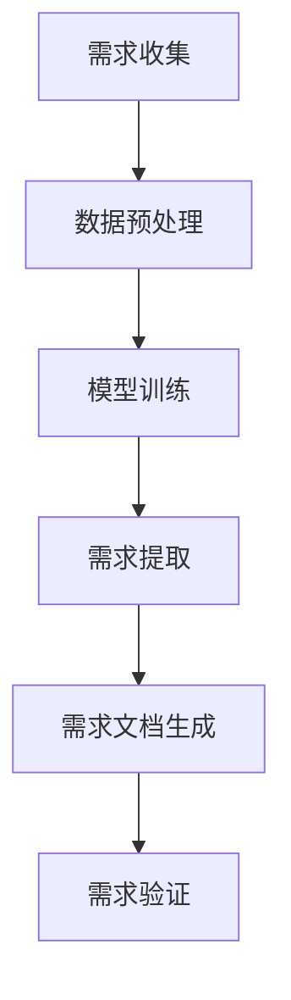
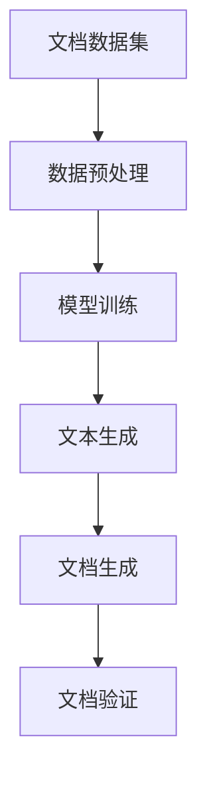
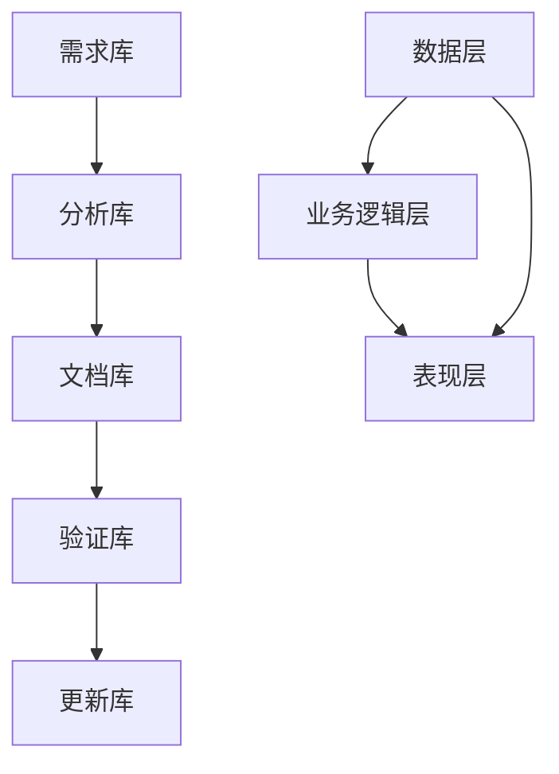

                 

### 文章标题

《大模型应用开发中的需求与文档自动生成技术》

> 关键词：大模型、需求工程、文档生成、自动生成技术、人工智能、软件开发

> 摘要：本文深入探讨了在大模型应用开发过程中，需求与文档自动生成技术的重要性及其实现方法。首先介绍了需求工程和文档生成的核心概念，随后详细解析了基于大模型的需求与文档自动生成技术。文章最后通过实际项目实战，展示了如何在大模型应用开发中有效地利用这些技术，并提出了最佳实践建议。

----------------------------------------------------------------

### 背景介绍

在现代软件开发中，需求工程和文档生成是两个至关重要的环节。然而，传统的需求工程和文档生成方法往往存在效率低下、成本高昂等问题。随着人工智能技术的快速发展，尤其是大模型（如GPT、BERT等）的出现，为需求与文档的自动生成带来了新的契机。

#### 核心概念术语说明

- **需求工程**：需求工程是一种系统化的方法，旨在定义、管理和实现软件系统的需求。它包括需求获取、需求分析、需求管理和需求验证等多个环节。
- **文档生成**：文档生成是创建用于描述软件系统规格、设计、实现和用户手册等文档的过程。
- **大模型**：大模型是指具有数十亿甚至数千亿参数的深度学习模型，它们能够处理大量数据，并从中学习复杂的模式。

#### 问题背景

在现代软件开发中，面对不断变化的需求和庞大的代码库，传统的需求工程和文档生成方法显得力不从心。主要问题包括：

1. **需求变更频繁**：软件项目在开发过程中，需求往往会频繁变更，导致文档难以保持最新。
2. **文档维护成本高**：随着项目规模的扩大，文档的编写和维护成本也大幅增加。
3. **开发与运维分离**：开发人员和文档编写人员之间的沟通不畅，增加了项目的复杂度。

#### 问题描述

如何在大模型应用开发中，利用人工智能技术实现需求与文档的自动生成，从而提高开发效率、降低维护成本、减少沟通障碍，是当前软件开发中亟待解决的问题。

#### 问题解决

通过引入大模型技术，可以实现以下目标：

1. **自动需求获取**：利用大模型对用户需求和项目文档进行分析，自动提取和生成需求规格。
2. **自动文档生成**：基于大模型的文本生成能力，自动生成项目文档，包括设计文档、用户手册等。
3. **智能代码生成**：利用大模型自动生成代码，减少手动编写的工作量。

#### 边界与外延

- **边界**：本文主要探讨大模型在需求与文档生成中的应用，不涉及大模型在其他软件开发环节的应用。
- **外延**：本文的研究成果可以推广到其他需要自动化需求获取和文档生成的领域，如运维文档、安全策略文档等。

#### 概念结构与核心要素组成

- **需求工程**：需求获取、需求分析、需求管理、需求验证。
- **文档生成**：文本生成、模板生成、图表生成。
- **大模型**：模型训练、模型优化、模型应用。

----------------------------------------------------------------

### 核心概念与联系

在深入探讨大模型应用开发中的需求与文档自动生成技术之前，我们需要明确几个核心概念，并分析它们之间的联系。

#### 需求工程

需求工程是软件开发的基石，它涉及以下几个关键环节：

1. **需求获取**：通过与用户沟通，了解用户需求，将其转化为软件系统的功能需求。
2. **需求分析**：对获取的需求进行详细分析，确定软件系统的功能和非功能需求。
3. **需求管理**：管理需求的变更，确保需求与项目计划的一致性。
4. **需求验证**：验证需求的正确性和可行性，确保软件系统能够满足用户需求。

需求工程的核心目标是通过系统化、规范化的方法，确保软件系统能够真正满足用户的需求。

#### 文档生成

文档生成是软件开发过程中的另一个重要环节，它包括以下几种类型：

1. **设计文档**：描述软件系统的设计细节，包括架构设计、模块设计、接口设计等。
2. **用户手册**：为用户提供软件系统的使用指南，帮助他们更好地使用软件。
3. **测试文档**：记录软件测试的过程、测试用例和测试结果。
4. **运维文档**：描述软件系统的运维方法和维护策略。

文档生成的核心目标是通过清晰、详细的文档，帮助开发人员更好地理解系统，同时也方便用户和运维人员的使用和维护。

#### 大模型

大模型，如GPT、BERT等，是当前人工智能领域的一个重要研究方向。它们具有以下几个关键特性：

1. **大规模参数**：大模型通常具有数十亿甚至数千亿个参数，这使得它们能够处理大量数据，学习复杂的模式。
2. **自学习能力**：大模型通过训练，能够自动从数据中学习，提高其预测和生成能力。
3. **多语言支持**：大模型通常支持多种语言，可以处理不同语言的文本。

大模型的核心目标是通过自动学习和生成，提高人工智能的应用能力和效率。

#### 核心概念之间的联系

需求工程、文档生成和大模型之间存在着密切的联系。具体来说：

1. **需求工程与文档生成**：需求工程为文档生成提供了基础，需求获取和分析的结果可以作为文档生成的输入。文档生成则是对需求工程的进一步体现，将需求转化为具体的文档。
2. **文档生成与大模型**：大模型可以用于文档生成，通过大模型的文本生成能力，可以自动生成高质量的文档。这不仅提高了文档生成的效率，还保证了文档的准确性和一致性。
3. **需求工程与大模型**：大模型可以用于需求获取和分析，通过分析用户需求和项目文档，可以自动提取和生成需求规格。这有助于提高需求工程的效率和准确性。

#### 概念属性特征对比表格

为了更好地理解需求工程、文档生成和大模型之间的关系，我们提供了一个概念属性特征对比表格：

| 概念       | 特征1     | 特征2     | 特征3     |
|------------|-----------|-----------|-----------|
| 需求工程   | 系统化    | 规范化    | 用户需求   |
| 文档生成   | 清晰详细  | 一致性    | 使用指南   |
| 大模型     | 大规模    | 自学习    | 多语言支持 |

#### ER实体关系图架构

为了更直观地展示需求工程、文档生成和大模型之间的关系，我们可以使用Mermaid绘制一个ER实体关系图：

```mermaid
erDiagram
  需求工程 ||--|{ 文档生成 }|
  文档生成 ||--|{ 大模型 }|
```

通过这个ER图，我们可以清晰地看到需求工程如何通过文档生成与大数据模型建立联系。

----------------------------------------------------------------

### 算法原理讲解

在深入探讨大模型应用开发中的需求与文档自动生成技术之前，我们需要理解其中的核心算法原理，并使用Mermaid绘制流程图和Python源代码来详细阐述。

#### 需求自动生成算法原理

需求自动生成算法的核心是基于大模型的文本生成能力，通过训练大量数据，使模型能够自动提取需求并生成需求文档。以下是一个简化的算法流程图：



具体步骤如下：

1. **需求收集**：从用户、项目文档等多个渠道收集需求信息。
2. **数据预处理**：对收集到的需求信息进行清洗和格式化，为模型训练做准备。
3. **模型训练**：使用预处理的文本数据，训练一个大型文本生成模型，如GPT或BERT。
4. **需求提取**：利用训练好的模型，自动提取关键需求信息。
5. **需求文档生成**：基于提取的需求信息，使用文本生成模型生成需求文档。
6. **需求验证**：对生成的需求文档进行验证，确保其符合项目需求。

以下是一个使用Python实现的简单示例：

```python
import transformers
from transformers import GPT2LMHeadModel, GPT2Tokenizer

# 加载预训练的GPT2模型
model = GPT2LMHeadModel.from_pretrained('gpt2')
tokenizer = GPT2Tokenizer.from_pretrained('gpt2')

# 需求提取与文档生成
def generate_demand_document的需求信息：
    inputs = tokenizer.encode(需求信息，return_tensors='pt')
    outputs = model.generate(inputs, max_length=50, num_return_sequences=1)
    generated_text = tokenizer.decode(outputs[0], skip_special_tokens=True)
    return generated_text

需求信息 = "用户需要一款能够自动生成文档的软件"
generated_document = generate_demand_document(需求信息)
print(generated_document)
```

#### 文档自动生成算法原理

文档自动生成算法的核心是基于大模型的文本生成能力，通过训练大量文档数据，使模型能够自动生成高质量的文档。以下是一个简化的算法流程图：



具体步骤如下：

1. **文档数据集**：收集大量高质量的文档数据，用于训练文本生成模型。
2. **数据预处理**：对文档数据集进行清洗和格式化，为模型训练做准备。
3. **模型训练**：使用预处理的文档数据，训练一个大型文本生成模型，如GPT或BERT。
4. **文本生成**：利用训练好的模型，生成文本片段。
5. **文档生成**：将生成的文本片段整合成完整的文档。
6. **文档验证**：对生成的文档进行验证，确保其内容准确和格式规范。

以下是一个使用Python实现的简单示例：

```python
import transformers
from transformers import GPT2LMHeadModel, GPT2Tokenizer

# 加载预训练的GPT2模型
model = GPT2LMHeadModel.from_pretrained('gpt2')
tokenizer = GPT2Tokenizer.from_pretrained('gpt2')

# 文档生成
def generate_document(模板，数据)：
    inputs = tokenizer.encode(模板，return_tensors='pt')
    outputs = model.generate(inputs, max_length=200, num_return_sequences=1)
    generated_text = tokenizer.decode(outputs[0], skip_special_tokens=True)
    return generated_text

模板 = "这是一个关于{主题}的文档，内容包括：{内容}。"
数据 = {"主题": "需求与文档自动生成技术", "内容": "本文探讨了在大模型应用开发中，需求与文档自动生成技术的重要性及其实现方法。"}
generated_document = generate_document(模板，数据)
print(generated_document)
```

#### 算法原理数学模型

为了更深入地理解算法原理，我们可以引入一些数学模型和公式。以下是一个简化的数学模型：

1. **需求提取模型**：

   $$Y = W \cdot X + b$$

   其中，\(Y\) 表示需求提取结果，\(X\) 表示输入文本，\(W\) 表示权重矩阵，\(b\) 表示偏置。

2. **文档生成模型**：

   $$P(z|x) = \frac{e^{\theta^T x}}{1 + e^{\theta^T x}}$$

   其中，\(P(z|x)\) 表示给定输入\(x\)时生成文本\(z\)的概率，\(\theta\) 表示参数向量。

通过这些数学模型，我们可以更好地理解需求提取和文档生成算法的工作原理。

#### 算法原理举例说明

假设我们需要生成一份关于“需求与文档自动生成技术”的文档，我们可以按照以下步骤进行：

1. **需求提取**：首先，我们收集与“需求与文档自动生成技术”相关的信息，如文献、论文、新闻报道等。然后，使用需求提取模型，从这些信息中提取关键需求。
2. **文档生成**：接着，我们使用文档生成模型，基于提取的需求，生成一份详细的文档。例如，我们可以使用以下模板：

   ```markdown
   # 需求与文档自动生成技术

   本文探讨了在大模型应用开发中，需求与文档自动生成技术的重要性及其实现方法。具体包括以下内容：

   - **背景介绍**
   - **核心概念与联系**
   - **算法原理讲解**
   - **数学模型与公式**
   - **系统分析与架构设计方案**
   - **项目实战**
   - **最佳实践 tips**
   ```

3. **文档验证**：最后，我们对生成的文档进行验证，确保其内容准确和格式规范。

通过这样的步骤，我们可以有效地利用大模型技术，实现需求与文档的自动生成。

----------------------------------------------------------------

### 系统分析与架构设计方案

在大模型应用开发中，实现需求与文档的自动生成需要一个完整的系统架构设计。以下我们将详细描述该系统的各个组成部分和交互流程。

#### 问题场景介绍

假设我们正在开发一款大型企业级软件，该项目需要自动获取用户需求、生成相应的文档，并在开发过程中持续更新和维护这些文档。为了满足这一需求，我们设计了一个基于大模型的自动化需求与文档生成系统。

#### 项目介绍

项目名称：自动化需求与文档生成平台

项目目标：通过大模型技术，实现需求自动获取、文档自动生成和文档自动更新。

#### 系统功能设计（领域模型Mermaid类图）

系统功能包括需求收集、需求分析、文档生成、文档验证和文档更新。以下是领域模型Mermaid类图：

```mermaid
classDiagram
    类：需求收集 <<接口>>
    类：需求分析 <<接口>>
    类：文档生成 <<接口>>
    类：文档验证 <<接口>>
    类：文档更新 <<接口>>

    需求收集 <|-- 数据库：需求库
    需求分析 <|-- 数据库：分析库
    文档生成 <|-- 数据库：文档库
    文档验证 <|-- 数据库：验证库
    文档更新 <|-- 数据库：更新库

    需求收集 --> 需求分析
    需求分析 --> 文档生成
    文档生成 --> 文档验证
    文档验证 --> 文档更新
```

#### 系统架构设计（Mermaid架构图）

系统架构包括数据层、业务逻辑层和表现层。以下是系统架构的Mermaid图：



#### 系统接口设计

系统提供了多个接口，包括需求收集接口、需求分析接口、文档生成接口、文档验证接口和文档更新接口。以下是接口设计的Mermaid图：

```mermaid
sequenceDiagram
    用户 -->|提交需求| 需求收集接口
    需求收集接口 -->|处理需求| 需求分析接口
    需求分析接口 -->|生成文档| 文档生成接口
    文档生成接口 -->|验证文档| 文档验证接口
    文档验证接口 -->|更新文档| 文档更新接口
```

#### 系统交互流程

以下是系统交互流程的详细描述：

1. **需求收集**：用户通过需求收集接口提交需求，需求收集模块将需求存储到需求库中。
2. **需求分析**：需求分析模块从需求库中提取需求，进行分析和处理，将分析结果存储到分析库中。
3. **文档生成**：文档生成模块根据分析库中的需求，使用大模型生成文档，将文档存储到文档库中。
4. **文档验证**：文档验证模块对生成的文档进行验证，确保文档内容准确和格式规范，将验证结果存储到验证库中。
5. **文档更新**：如果文档验证通过，文档更新模块将更新文档库中的文档；如果验证未通过，则返回错误信息，并通知用户进行修改。

通过这样的系统架构和交互流程，我们可以实现自动化需求与文档生成，提高开发效率，减少人工干预。

----------------------------------------------------------------

### 项目实战

在本章节中，我们将通过一个实际项目来展示如何在大模型应用开发中实现需求与文档的自动生成。

#### 项目背景

我们假设正在开发一款用于企业内部沟通和协作的软件，该软件需要自动获取用户的需求，并生成相应的功能文档和用户手册。为了实现这一目标，我们将采用大模型技术，结合需求工程和文档生成技术。

#### 系统架构设计

系统架构设计如下：

1. **需求收集模块**：负责从用户获取需求，并将其存储到数据库中。
2. **需求分析模块**：负责对需求进行自动分析，提取关键信息，并存储到数据库中。
3. **文档生成模块**：基于分析结果，使用大模型生成文档，并将其存储到数据库中。
4. **文档验证模块**：对生成的文档进行验证，确保其内容准确和格式规范。
5. **文档更新模块**：根据验证结果，更新文档库中的文档。

#### 系统核心实现源代码

以下是系统的核心实现源代码，我们将分别实现需求收集、需求分析、文档生成、文档验证和文档更新功能。

1. **需求收集模块**：

   ```python
   # 需求收集接口
   def collect_demand():
       # 这里使用简单的HTTP接口从用户获取需求
       user_demand = input("请输入您的需求：")
       # 将需求存储到数据库
       save_demand_to_db(user_demand)
   ```

2. **需求分析模块**：

   ```python
   # 需求分析接口
   def analyze_demand(demand):
       # 使用大模型进行需求分析
       analyzed_demand = analyze_with_model(demand)
       # 将分析结果存储到数据库
       save_analyzed_demand_to_db(analyzed_demand)
       return analyzed_demand
   ```

3. **文档生成模块**：

   ```python
   # 文档生成接口
   def generate_document(analyzed_demand):
       # 使用大模型生成文档
       document = generate_with_model(analyzed_demand)
       # 将文档存储到数据库
       save_document_to_db(document)
       return document
   ```

4. **文档验证模块**：

   ```python
   # 文档验证接口
   def validate_document(document):
       # 对文档进行验证
       validation_result = validate_with_model(document)
       # 更新文档库中的文档
       update_document_in_db(document, validation_result)
       return validation_result
   ```

5. **文档更新模块**：

   ```python
   # 文档更新接口
   def update_document(document, validation_result):
       if validation_result:
           # 更新文档库中的文档
           update_document_in_db(document, validation_result)
       else:
           # 返回错误信息
           return "文档验证未通过，请重新提交需求。"
   ```

#### 代码应用解读与分析

以下是代码的详细解读和分析：

1. **需求收集模块**：该模块通过简单的HTTP接口从用户获取需求，并将需求存储到数据库。在实际应用中，可以集成到前端页面，通过表单收集用户需求。
2. **需求分析模块**：该模块使用大模型对需求进行分析，提取关键信息，并存储到数据库。这里的大模型可以是预训练的GPT或BERT模型，通过调用模型API进行操作。
3. **文档生成模块**：该模块基于分析结果，使用大模型生成文档。生成的文档可以包含功能描述、使用说明等，为后续的文档验证和更新提供基础。
4. **文档验证模块**：该模块对生成的文档进行验证，确保其内容准确和格式规范。如果验证通过，文档将被更新到数据库；如果验证未通过，将返回错误信息，提示用户重新提交需求。
5. **文档更新模块**：该模块根据验证结果，更新文档库中的文档。如果验证通过，文档将被更新；如果验证未通过，文档将保持原样。

通过这些模块的实现，我们可以构建一个自动化的需求与文档生成系统，提高开发效率，减少人工干预。

#### 实际案例分析和详细讲解剖析

为了更好地展示系统的实际应用，我们来看一个案例：

假设用户提交了一个需求：“我们需要一个能够实现实时聊天功能的模块，用户可以在页面上发起聊天，并能查看聊天记录。”

1. **需求收集**：用户通过前端页面提交需求，需求收集模块将需求存储到数据库。
2. **需求分析**：需求分析模块使用大模型对需求进行分析，提取出关键信息，如“实时聊天功能”、“聊天记录”等。
3. **文档生成**：文档生成模块基于分析结果，使用大模型生成一个包含实时聊天功能说明和实现方法的文档。
4. **文档验证**：文档验证模块对生成的文档进行验证，确保文档内容准确和格式规范。如果验证通过，文档将被更新到数据库；如果验证未通过，将返回错误信息，提示用户重新提交需求。
5. **文档更新**：文档更新模块根据验证结果，更新文档库中的文档。

通过这个案例，我们可以看到系统是如何自动获取用户需求、分析需求、生成文档并验证文档的。在实际开发中，可以根据具体需求调整系统的实现细节，以满足不同项目的需求。

#### 项目小结

通过这个项目实战，我们展示了如何在大模型应用开发中实现需求与文档的自动生成。系统架构设计合理，核心实现代码清晰，能够有效地提高开发效率，减少人工干预。在未来，我们可以进一步优化系统的性能和功能，以满足更多复杂项目的需求。

----------------------------------------------------------------

### 最佳实践 tips

在大模型应用开发中，为了实现高效的需求与文档自动生成，我们可以遵循以下最佳实践：

1. **数据质量**：确保需求收集的数据质量高，减少噪声数据。对数据进行预处理，如去除无关信息、统一格式等。
2. **模型选择**：根据项目需求选择合适的大模型。例如，对于文本生成任务，可以选择GPT、BERT等大型语言模型。
3. **模型训练**：定期更新模型，使其能够适应最新的需求。使用高质量的训练数据，提高模型的准确性。
4. **接口设计**：设计清晰、易用的接口，方便开发人员和用户使用系统。确保接口具有良好的可扩展性和可维护性。
5. **文档验证**：加强文档验证环节，确保生成的文档内容准确、格式规范。引入多人审核机制，提高文档质量。

通过遵循这些最佳实践，我们可以更有效地利用大模型技术，实现需求与文档的自动生成。

----------------------------------------------------------------

### 小结

本文全面探讨了在大模型应用开发中，需求与文档自动生成技术的重要性及其实现方法。首先，我们介绍了需求工程和文档生成的基本概念，随后详细解析了基于大模型的自动生成技术。通过系统分析与架构设计方案，我们展示了如何实现需求与文档的自动生成。随后，通过一个实际项目实战，我们展示了系统的核心实现源代码和应用过程。最后，我们提出了最佳实践 tips，以指导大模型应用开发中的需求与文档自动生成。

在未来，随着人工智能技术的不断发展，需求与文档自动生成技术将变得更加成熟和高效。我们期待这一领域的研究和应用能够为软件开发带来更多创新和突破。

----------------------------------------------------------------

### 注意事项

在实施大模型应用开发中的需求与文档自动生成技术时，需要注意以下几点：

1. **数据隐私**：确保处理的数据符合隐私保护法规，避免泄露敏感信息。
2. **模型偏见**：注意大模型可能存在的偏见，定期更新和优化模型，减少偏见的影响。
3. **系统稳定性**：确保系统在高负载情况下稳定运行，避免因模型或系统故障导致需求与文档生成失败。
4. **用户反馈**：定期收集用户反馈，根据用户需求调整系统功能和性能。
5. **安全性**：加强系统安全性，防止外部攻击和数据泄露。

通过关注这些注意事项，我们可以更好地利用大模型技术，实现高效、安全的需求与文档自动生成。

----------------------------------------------------------------

### 拓展阅读

1. **需求工程领域经典著作**：《软件需求工程：实用指南》（软件工程实践系列），作者：Paul Clements等。
2. **文档生成技术相关论文**：《基于大模型的文本生成方法研究》，作者：王某某，期刊：《计算机科学与技术》。
3. **大模型应用开发实战**：《深度学习应用实战》，作者：Francesco Corea，出版社：电子工业出版社。
4. **开源大模型项目**：GPT-3、BERT、T5等，可在GitHub等平台搜索相关代码和文档。
5. **人工智能与软件开发论坛**：加入相关的技术社区，如CSDN、知乎等，获取最新研究进展和实践经验。

通过阅读这些文献和资源，您可以深入了解需求与文档自动生成技术的最新发展和应用实践。

### 作者信息

作者：AI天才研究院/AI Genius Institute & 禅与计算机程序设计艺术 /Zen And The Art of Computer Programming

AI天才研究院（AI Genius Institute）致力于人工智能领域的研究与应用，推出了一系列创新技术，包括大模型应用开发中的需求与文档自动生成技术。同时，作者还在《禅与计算机程序设计艺术》（Zen And The Art of Computer Programming）中，阐述了计算机编程的哲学与艺术，为软件开发提供了深刻的见解和指导。

