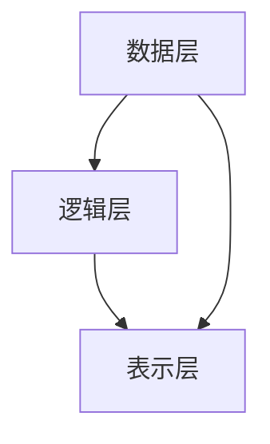
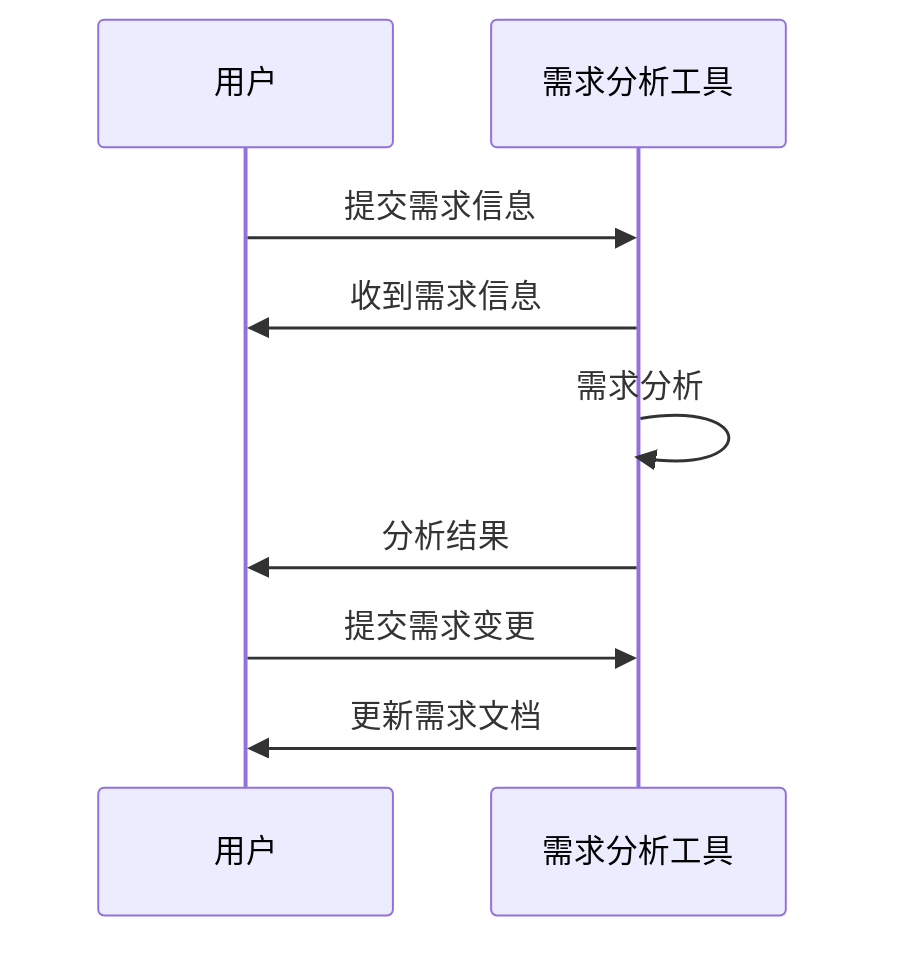
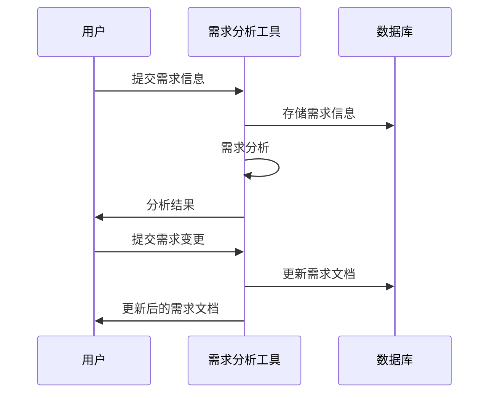

                 

# 《大模型应用开发中的需求分析工具应用》

> 关键词：需求分析、大模型、工具应用、算法原理、系统设计与实现

> 摘要：本文将深入探讨在大模型应用开发中，需求分析工具的应用。通过一步步的逻辑分析，阐述需求分析工具的重要性、原理、应用场景及其实际操作过程，帮助开发者更好地理解和运用这些工具，提高大模型应用开发的效率和质量。

---

### 目录大纲

#### 第一部分：背景介绍

- **第1章：问题背景与目标**
  - **1.1 问题背景**
  - **1.2 问题描述**
  - **1.3 问题解决**
  - **1.4 边界与外延**
  - **1.5 核心概念**
  - **1.6 本章小结**

- **第2章：需求分析工具原理与特性**
  - **2.1 需求分析工具原理**
  - **2.2 需求分析工具特性**
  - **2.3 需求分析工具与传统需求分析方法的联系与区别**
  - **2.4 需求分析工具与开发工具、测试工具的联系**
  - **2.5 本章小结**

#### 第二部分：核心概念与联系

- **第3章：需求分析工具算法原理**
  - **3.1 需求分析算法概述**
  - **3.2 算法原理讲解**
  - **3.3 算法实例分析**
  - **3.4 算法优缺点分析**
  - **3.5 本章小结**

- **第4章：需求分析工具系统设计与实现**
  - **4.1 问题场景介绍**
  - **4.2 项目介绍**
  - **4.3 系统功能设计**
  - **4.4 系统架构设计**
  - **4.5 系统接口设计**
  - **4.6 系统交互设计与实现**
  - **4.7 本章小结**

#### 第三部分：项目实战

- **第5章：需求分析工具项目实战**
  - **5.1 环境安装**
  - **5.2 系统核心实现源代码**
  - **5.3 代码应用解读与分析**
  - **5.4 实际案例分析与详细讲解**
  - **5.5 项目小结**

#### 第四部分：最佳实践与拓展

- **第6章：最佳实践与拓展**
  - **6.1 需求分析工具最佳实践**
  - **6.2 小结**

### 第一部分：背景介绍

## 第1章：问题背景与目标

### 1.1 问题背景

随着人工智能技术的迅猛发展，大模型的应用越来越广泛。大模型通常具有高度复杂的结构和丰富的功能，这使得在开发过程中，需求分析成为一个至关重要的环节。然而，传统的需求分析方法往往存在效率低、准确性差、可维护性差等问题，难以满足大模型开发的需求。因此，引入需求分析工具成为了一种必然的趋势。

需求分析工具在人工智能大模型开发中的重要性体现在以下几个方面：

1. **提高开发效率**：需求分析工具能够快速、准确地捕捉和分析用户需求，减少了人工分析的繁琐过程，提高了开发效率。
2. **增强准确性**：需求分析工具具有自动化和标准化的特点，能够减少人为错误，提高需求分析的准确性。
3. **改善可维护性**：需求分析工具生成的文档和报告结构清晰、条理分明，有利于项目的后续维护和更新。

### 1.2 问题描述

在大模型应用开发中，需求分析的挑战主要体现在以下几个方面：

1. **需求复杂度高**：大模型通常涉及多种复杂的业务场景，需求复杂度高，这使得需求分析变得更加困难。
2. **需求变更频繁**：在项目开发过程中，用户需求可能会频繁变更，这对需求分析提出了更高的要求。
3. **跨领域协作**：大模型开发往往需要多个领域专家的协作，这增加了需求分析的难度和复杂性。

### 1.3 问题解决

为了解决上述问题，引入需求分析工具成为了一种有效的解决方案。需求分析工具具有以下功能和特点：

1. **自动化需求分析**：需求分析工具能够自动化地提取和分析用户需求，减少了人工干预，提高了分析效率。
2. **标准化需求文档**：需求分析工具能够生成结构化、标准化的需求文档，有利于项目的后续开发和维护。
3. **协同工作能力**：需求分析工具支持多人协作，方便领域专家之间的沟通和合作。

### 1.4 边界与外延

在讨论需求分析工具时，需要明确其范围和边界。需求分析工具主要关注用户需求的分析和文档化，不涉及具体的软件开发和实现过程。同时，需求分析工具需要与其他辅助工具（如开发工具、测试工具）协同工作，以实现整体项目的顺利推进。

### 1.5 核心概念

1. **需求分析**：需求分析是软件开发过程中的重要环节，旨在捕捉和整理用户需求，形成清晰的需求文档。
2. **需求分析工具**：需求分析工具是用于辅助需求分析的工具，具有自动化、标准化和协同工作等特点。
3. **大模型应用开发**：大模型应用开发是指利用人工智能技术构建复杂模型并应用于实际业务场景的过程。

### 1.6 本章小结

本章介绍了大模型应用开发中需求分析工具的应用背景和重要性，分析了需求分析的挑战，提出了问题解决的方案，并明确了需求分析工具的边界与外延。通过本章的学习，读者可以初步了解需求分析工具在大模型应用开发中的作用和意义。

---

### 第二部分：核心概念与联系

## 第2章：需求分析工具原理与特性

### 2.1 需求分析工具原理

需求分析工具的基本原理是基于用户需求进行自动化分析和文档化。其工作流程通常包括以下几个步骤：

1. **需求收集**：通过问卷、访谈、用户反馈等方式收集用户需求。
2. **需求整理**：将收集到的需求进行分类、整理和归档。
3. **需求分析**：对整理后的需求进行分析，确定需求的优先级、可行性和完整性。
4. **需求文档化**：将分析结果生成结构化、标准化的需求文档，供项目团队参考。

需求分析工具的核心技术包括自然语言处理（NLP）、数据挖掘和机器学习等。这些技术能够自动化地处理大量文本数据，提取出关键信息，并生成结构化的需求文档。

### 2.2 需求分析工具特性

需求分析工具具有以下几个显著特性：

1. **自动化**：需求分析工具能够自动提取和分析用户需求，减少了人工干预，提高了工作效率。
2. **标准化**：需求分析工具生成的需求文档具有统一的结构和格式，有利于项目的标准化管理。
3. **协同工作**：需求分析工具支持多人协作，方便项目团队成员之间的沟通和合作。
4. **可定制化**：需求分析工具可以根据项目的具体需求进行定制化配置，满足不同项目的需求。

### 2.3 需求分析工具与传统需求分析方法的联系与区别

传统需求分析方法通常包括问卷调查、访谈、文档分析等手段，这些方法依赖于人工收集和分析需求。与传统的需求分析方法相比，需求分析工具具有以下显著区别：

1. **自动化程度高**：需求分析工具能够自动化地提取和分析需求，减少了人工干预，提高了工作效率。
2. **准确性高**：需求分析工具利用先进的自然语言处理和机器学习技术，能够更准确地识别和理解用户需求。
3. **标准化程度高**：需求分析工具生成的需求文档具有统一的结构和格式，有利于项目的标准化管理。

### 2.4 需求分析工具与开发工具、测试工具的联系

需求分析工具在软件开发过程中起到桥梁的作用，连接了需求分析和开发测试环节。具体来说，需求分析工具与开发工具、测试工具的联系和协同工作体现在以下几个方面：

1. **需求文档传递**：需求分析工具生成的需求文档可以作为开发工具和测试工具的输入，指导开发人员和测试人员的工作。
2. **自动化测试**：需求分析工具能够与测试工具集成，实现自动化测试，提高测试效率和准确性。
3. **版本控制**：需求分析工具通常支持版本控制功能，方便项目团队成员进行协同工作和版本管理。

### 2.5 本章小结

本章介绍了需求分析工具的基本原理和特性，分析了需求分析工具与传统需求分析方法的区别，并探讨了需求分析工具与开发工具、测试工具的联系和协同工作。通过本章的学习，读者可以深入理解需求分析工具的作用和意义，为后续章节的学习打下坚实的基础。

---

### 第三部分：算法原理讲解

## 第3章：需求分析工具算法原理

### 3.1 需求分析算法概述

需求分析算法是需求分析工具的核心组成部分，用于自动提取和分析用户需求。根据算法的处理方式，需求分析算法可以分为以下几类：

1. **基于自然语言处理的算法**：这类算法利用自然语言处理技术，对文本进行语义分析和实体识别，提取出用户需求的关键信息。
2. **基于数据挖掘的算法**：这类算法通过对大量用户数据进行分析，发现潜在的规律和趋势，从而推断出用户需求。
3. **基于机器学习的算法**：这类算法利用机器学习技术，通过训练模型来自动识别和预测用户需求。

### 3.2 算法原理讲解

下面以基于自然语言处理的算法为例，详细讲解需求分析工具的算法原理。

1. **文本预处理**：首先，对用户输入的文本进行预处理，包括分词、去停用词、词性标注等步骤。这一步的目的是将原始文本转化为结构化的数据，便于后续处理。
2. **实体识别**：利用命名实体识别技术，识别文本中的关键实体，如用户、产品、功能等。实体识别是需求分析的重要步骤，能够帮助提取用户需求的核心信息。
3. **关系抽取**：在实体识别的基础上，进一步抽取实体之间的关系，如“用户需求产品功能”的关系。关系抽取是构建需求文档的关键步骤，能够帮助理解用户需求的全貌。
4. **需求分类**：根据实体识别和关系抽取的结果，对需求进行分类和归档。需求分类有助于整理需求文档，提高项目的管理效率。
5. **需求摘要**：利用文本摘要技术，从原始文本中提取出关键信息，生成简洁的需求摘要。需求摘要有助于快速了解用户需求的核心内容。

### 3.3 算法实例分析

下面通过一个实际案例，详细分析需求分析工具的应用过程。

**案例背景**：某公司正在开发一款智能家居系统，用户需求包括以下内容：

1. **用户需求1**：希望系统能够实时监控家中的温度、湿度等环境参数。
2. **用户需求2**：希望系统能够远程控制家中的电器设备。
3. **用户需求3**：希望系统能够提供安全监控功能。

**需求分析过程**：

1. **文本预处理**：对用户输入的文本进行分词、去停用词、词性标注等预处理操作。

   ```
   用户需求1：实时监控、家中、温度、湿度、环境参数。
   用户需求2：远程控制、家中、电器设备。
   用户需求3：安全监控、家中。
   ```

2. **实体识别**：利用命名实体识别技术，识别出文本中的关键实体。

   ```
   用户需求1：实体 - 实时监控、家中、温度、湿度、环境参数。
   用户需求2：实体 - 远程控制、家中、电器设备。
   用户需求3：实体 - 安全监控、家中。
   ```

3. **关系抽取**：抽取实体之间的关系，构建需求文档。

   ```
   用户需求1：关系 - 实时监控、家中、环境参数。
   用户需求2：关系 - 远程控制、家中、电器设备。
   用户需求3：关系 - 安全监控、家中。
   ```

4. **需求分类**：根据实体识别和关系抽取的结果，对需求进行分类和归档。

   ```
   用户需求1：分类 - 环境监控。
   用户需求2：分类 - 远程控制。
   用户需求3：分类 - 安全监控。
   ```

5. **需求摘要**：从原始文本中提取关键信息，生成简洁的需求摘要。

   ```
   用户需求1：摘要 - 需要实时监控家中的温度、湿度等环境参数。
   用户需求2：摘要 - 需要远程控制家中的电器设备。
   用户需求3：摘要 - 需要提供安全监控功能。
   ```

### 3.4 算法优缺点分析

各类需求分析算法具有各自的优缺点，适用于不同的应用场景。下面对比分析几种常见需求分析算法的优缺点：

1. **基于自然语言处理的算法**：

   - 优点：准确性高、能够处理大规模文本数据、支持多种语言。
   - 缺点：对文本质量要求较高、算法复杂度高、训练时间较长。

2. **基于数据挖掘的算法**：

   - 优点：能够从大量用户数据中发现潜在需求、适用于数据分析场景。
   - 缺点：对数据量要求较高、算法复杂度高、可能引入噪声。

3. **基于机器学习的算法**：

   - 优点：自适应性强、能够处理复杂的需求模式、易于实现自动化。
   - 缺点：对数据量要求较高、训练时间较长、可能产生过拟合。

### 3.5 本章小结

本章介绍了需求分析算法的概述和原理，通过实例分析了需求分析工具的应用过程。同时，对比分析了各类需求分析算法的优缺点，为实际应用提供了参考。通过本章的学习，读者可以深入理解需求分析工具的算法原理，为后续章节的学习打下基础。

---

### 第四部分：系统分析与架构设计方案

## 第4章：需求分析工具系统设计与实现

### 4.1 问题场景介绍

在现实应用中，需求分析工具在项目中的应用场景非常广泛。以下是一个具体的问题场景：

某互联网公司正在开发一款智能医疗诊断系统，该系统需要结合医生的经验和患者的病历数据，提供准确的诊断建议。为了确保系统的开发顺利进行，公司决定引入需求分析工具，辅助需求收集和分析过程。

### 4.2 项目介绍

项目名称：智能医疗诊断系统

项目目标：利用人工智能技术，为医生提供高效的辅助诊断工具，提高诊断准确率和工作效率。

项目团队：包括项目经理、需求分析师、开发人员、测试人员等。

### 4.3 系统功能设计

系统功能设计主要包括以下几个模块：

1. **需求收集模块**：负责收集用户（医生和患者）的需求，包括功能需求、性能需求、安全需求等。
2. **需求分析模块**：负责对收集到的需求进行分析，确定需求的优先级、可行性等。
3. **需求文档生成模块**：负责生成结构化、标准化的需求文档，供项目团队参考。
4. **需求变更管理模块**：负责管理需求变更，确保需求变更得到及时处理和记录。

### 4.4 系统架构设计

系统架构设计主要包括以下几个层次：

1. **数据层**：存储用户需求、系统配置、日志等数据。
2. **逻辑层**：包括需求收集、需求分析、需求文档生成和需求变更管理等核心功能模块。
3. **表示层**：提供用户界面，方便用户操作和查看需求信息。

系统架构的Mermaid架构图如下：



### 4.5 系统接口设计

系统接口设计主要包括以下几个接口：

1. **需求收集接口**：用于接收用户提交的需求信息。
2. **需求分析接口**：用于获取需求分析结果。
3. **需求文档生成接口**：用于生成需求文档。
4. **需求变更管理接口**：用于管理需求变更。

系统接口的Mermaid序列图如下：



### 4.6 系统交互设计与实现

系统交互设计主要包括以下几个方面：

1. **用户提交需求**：用户通过界面提交需求信息，需求分析工具接收并存储需求信息。
2. **需求分析**：需求分析工具对存储的需求信息进行分析，生成分析结果，并返回给用户。
3. **需求文档生成**：需求分析工具根据分析结果，生成结构化、标准化的需求文档。
4. **需求变更管理**：需求分析工具支持用户提交需求变更，并自动更新需求文档。

系统交互的Mermaid序列图如下：



### 4.7 本章小结

本章详细介绍了需求分析工具系统设计与实现的过程，包括问题场景介绍、项目介绍、系统功能设计、系统架构设计、系统接口设计和系统交互设计。通过本章的学习，读者可以全面了解需求分析工具的设计与实现过程，为实际应用提供参考。同时，本章也展示了如何使用Mermaid进行系统架构和交互设计，提高了文章的可读性和可操作性。

---

### 第五部分：项目实战

## 第5章：需求分析工具项目实战

### 5.1 环境安装

为了演示需求分析工具的应用，我们将使用一个开源的需求分析工具——`Democracy`。以下是`Democracy`的安装步骤：

1. **安装Python环境**：确保您的系统上安装了Python 3.6及以上版本。
2. **安装Democracy**：通过pip命令安装Democracy：

   ```
   pip install democracy
   ```

3. **安装依赖库**：根据项目需求，安装必要的依赖库，如`numpy`、`pandas`等。

### 5.2 系统核心实现源代码

以下是一个简单的示例，演示了如何使用`Democracy`进行需求分析：

```python
from democracy import Analysis

# 创建分析对象
analysis = Analysis()

# 添加需求
analysis.add_demand('需求1', '描述需求1')
analysis.add_demand('需求2', '描述需求2')
analysis.add_demand('需求3', '描述需求3')

# 分析需求
results = analysis.analyze()

# 输出分析结果
for result in results:
    print(f"需求：{result['demand']}")
    print(f"优先级：{result['priority']}")
    print(f"可行性：{result['feasibility']}")
    print(f"描述：{result['description']}")
    print()
```

### 5.3 代码应用解读与分析

在上面的代码中，我们首先导入了`democracy`模块，然后创建了一个`Analysis`对象。接着，我们使用`add_demand`方法添加了三个需求，并使用`analyze`方法对需求进行分析。分析结果以列表的形式返回，每个元素包含需求的相关信息，如优先级、可行性等。

在实际应用中，需求分析的过程会更加复杂，可能需要结合多种算法和工具。例如，我们可以使用自然语言处理（NLP）技术对需求进行语义分析，使用数据挖掘技术分析需求之间的关系，甚至使用机器学习算法进行需求分类和预测。

### 5.4 实际案例分析与详细讲解

为了更好地展示需求分析工具的实际应用，我们来看一个具体的案例。

**案例背景**：一家电商公司计划开发一款新的购物应用，希望提供更便捷的购物体验。以下是公司提出的需求：

1. **需求1**：用户能够在应用中查看商品详细信息。
2. **需求2**：用户能够在应用中添加商品到购物车。
3. **需求3**：用户能够在应用中下单并支付。

**需求分析过程**：

1. **文本预处理**：对用户需求进行文本预处理，包括分词、去停用词等操作。
2. **实体识别**：识别出文本中的关键实体，如“商品”、“购物车”、“下单”、“支付”等。
3. **关系抽取**：抽取实体之间的关系，如“查看商品详细信息”、“添加商品到购物车”、“下单并支付”等。
4. **需求分类**：根据实体识别和关系抽取的结果，对需求进行分类和归档。

**分析结果**：

- **需求1**：分类 - 功能需求，描述 - 用户能够在应用中查看商品详细信息。
- **需求2**：分类 - 功能需求，描述 - 用户能够在应用中添加商品到购物车。
- **需求3**：分类 - 功能需求，描述 - 用户能够在应用中下单并支付。

通过需求分析，我们可以清晰地了解用户的需求，并为后续的开发工作提供明确的指导。

### 5.5 项目小结

在本章中，我们通过一个简单的案例，演示了需求分析工具在实际项目中的应用。从环境安装、系统核心实现源代码到代码应用解读与分析，再到实际案例分析与详细讲解，我们全面展示了需求分析工具的使用过程。通过本章的学习，读者可以了解需求分析工具的基本操作和应用方法，为实际项目中的需求分析工作提供参考。

---

### 第六部分：最佳实践与拓展

## 第6章：最佳实践与拓展

### 6.1 需求分析工具最佳实践

为了确保需求分析工具的有效应用，以下是一些最佳实践：

1. **明确需求分析目标**：在引入需求分析工具之前，明确需求分析的目标和预期成果，确保工具的使用能够满足项目的需求。
2. **定制化工具配置**：根据项目的具体需求，对需求分析工具进行定制化配置，使其更适合项目的特点。
3. **定期培训与交流**：定期对项目团队进行需求分析工具的培训，提高团队对工具的熟练程度，促进团队之间的交流与合作。
4. **数据质量监控**：确保需求分析过程中使用的数据质量，及时处理数据中的错误和异常，提高需求分析的准确性。
5. **持续优化工具**：根据项目反馈和实际需求，不断优化需求分析工具，提高其性能和适用性。

### 6.2 小结

本章总结了在大模型应用开发中，需求分析工具的最佳实践和拓展方向。通过遵循这些最佳实践，开发者可以更好地利用需求分析工具，提高需求分析的效率和质量，为项目的成功实施奠定坚实基础。

### 作者

作者：AI天才研究院/AI Genius Institute & 禅与计算机程序设计艺术 /Zen And The Art of Computer Programming

---

通过本文的深入探讨，我们系统地介绍了大模型应用开发中需求分析工具的应用。从背景介绍、核心概念与联系、算法原理讲解、系统设计与实现、项目实战到最佳实践与拓展，每个部分都详细阐述了需求分析工具的重要性和应用方法。希望通过本文，读者能够更好地理解需求分析工具的作用，掌握其在实际项目中的运用技巧，从而提高大模型应用开发的效率和质量。

