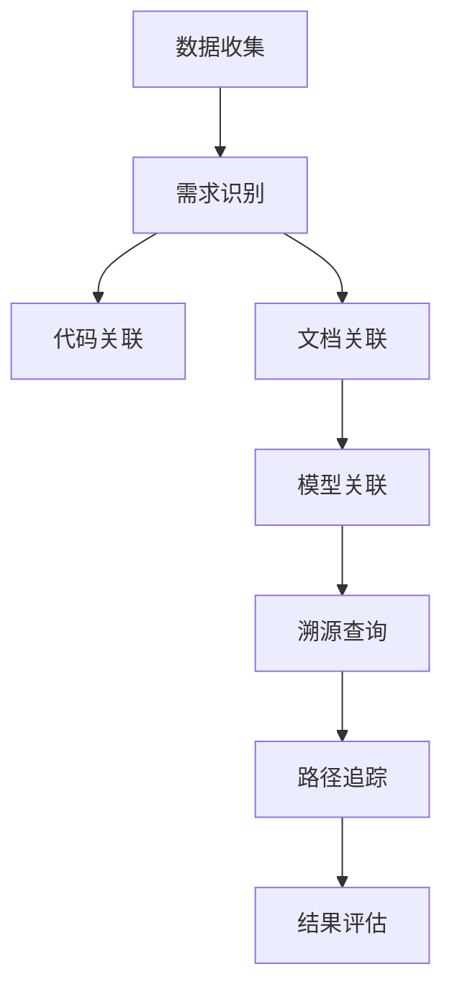
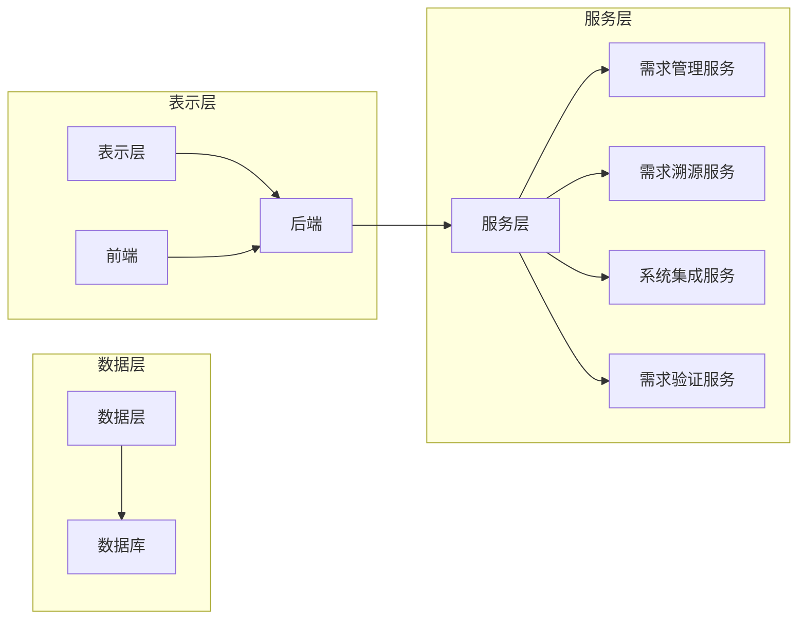
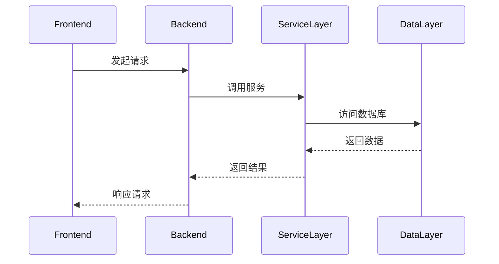
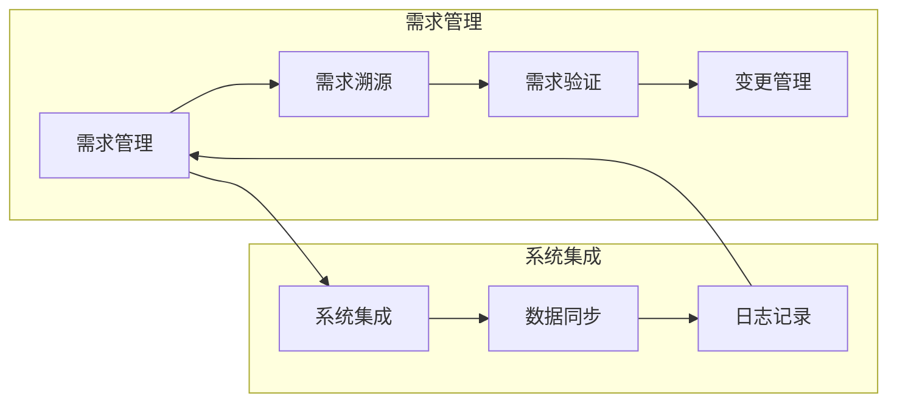

                 

### 文章标题

# 大模型应用开发中的需求溯源技术

### 关键词

- 大模型应用开发
- 需求溯源技术
- 人工智能
- 数据分析
- 软件工程

### 摘要

本文旨在探讨在大模型应用开发过程中，如何通过需求溯源技术来确保项目的高效和成功。首先，文章介绍了需求溯源技术的背景及其在大模型开发中的重要性。接着，从理论基础、技术实现、应用实践、优化与改进等方面详细阐述了需求溯源技术。通过具体案例分析和系统架构设计，展示了需求溯源技术在项目中的实际应用。最后，文章对未来的发展趋势和潜在研究方向进行了展望。本文适合从事人工智能、软件开发和数据分析领域的专业人士阅读。

### 引言

#### 需求溯源技术的背景

在大模型应用开发中，需求溯源技术是一种重要的方法，它能够帮助开发人员更好地理解和管理项目需求。随着人工智能和大数据技术的发展，大模型在各个领域的应用越来越广泛，如自然语言处理、计算机视觉、推荐系统等。然而，大模型的应用开发面临着诸多挑战，其中之一就是需求的复杂性和多变性。传统的需求管理方法往往难以应对这些挑战，导致项目进度延误、成本超支和项目失败。因此，需求溯源技术应运而生，它为解决这些问题提供了一种有效的途径。

#### 需求溯源技术的重要性

需求溯源技术在大型项目和复杂系统的开发中具有重要作用。它可以帮助开发人员：

1. **明确需求：** 通过追溯需求的起源，确保需求理解的准确性和一致性。
2. **管理变更：** 在需求变更时，快速找到变更的源头，评估变更的影响。
3. **质量控制：** 确保需求实现的质量，通过需求溯源可以追踪到每个需求的实现情况。
4. **风险管理：** 通过对需求的溯源，可以提前识别潜在的风险，并采取相应的预防措施。

#### 研究现状与趋势

近年来，需求溯源技术受到了越来越多研究者的关注。学术界和工业界都对其进行了大量的研究和实践。目前，需求溯源技术主要包括以下几种方法：

1. **基于文档的需求溯源：** 通过分析项目文档，如需求说明书、设计文档等，来追溯需求。
2. **基于代码的需求溯源：** 通过分析源代码，找出与需求相关的代码段。
3. **基于模型的需求溯源：** 通过构建需求模型，利用模型间的关联关系进行溯源。
4. **基于机器学习的需求溯源：** 利用机器学习算法，从大量的数据中自动识别需求关联。

随着人工智能技术的发展，需求溯源技术也在不断进步。未来，需求溯源技术有望在以下几个方面得到进一步发展：

1. **智能化：** 通过引入人工智能技术，提高需求溯源的自动化程度。
2. **实时性：** 实现需求溯源的实时性，以便快速响应需求变更。
3. **多维度：** 扩展需求溯源的范围，包括需求、设计、代码等多个维度。

#### 本文结构

本文将按照以下结构进行论述：

1. **理论基础：** 介绍需求溯源技术的核心概念、原理和方法。
2. **技术实现：** 详细讲解需求溯源技术的技术实现，包括算法原理、数学模型和代码实现。
3. **应用实践：** 通过具体案例展示需求溯源技术在项目中的实际应用。
4. **优化与改进：** 讨论需求溯源技术的优化方向和改进策略。
5. **总结与展望：** 对全书内容进行总结，并对未来的发展趋势进行展望。

通过本文的论述，旨在为从事大模型应用开发的专业人士提供一种有效的需求管理方法，帮助他们在项目开发中更好地应对需求和变更管理带来的挑战。

### 理论基础

#### 需求溯源技术的核心概念

需求溯源技术主要涉及以下几个核心概念：

1. **需求（Requirement）：** 需求是项目开发中的基本单元，它描述了项目必须实现的功能或性能。在需求溯源过程中，需求是溯源的起点。
2. **溯源（Traceability）：** 溯源是指追溯事物来源的过程。在需求溯源中，指的是从实现结果追溯到原始需求的过程。
3. **关联（Association）：** 关联是指需求与实现结果之间的一种映射关系。它描述了需求是如何被实现，以及实现结果是如何满足需求的。
4. **模型（Model）：** 模型是需求溯源过程中的一个重要工具，它用于表示需求、实现结果及其关联关系。

#### 需求溯源方法的原理

需求溯源方法的原理可以概括为以下几个步骤：

1. **需求识别：** 在项目开发初期，对需求进行详细识别和记录。
2. **关联构建：** 在开发过程中，建立需求与实现结果之间的关联关系。这可以通过分析源代码、设计文档或模型来实现。
3. **溯源分析：** 在需要时，从实现结果追溯到原始需求，评估需求的实现情况。
4. **变更管理：** 在需求变更时，更新关联关系，并评估变更对项目的影响。

#### 需求溯源流程

需求溯源的流程可以分为以下几个阶段：

1. **需求定义：** 明确项目的需求，并将其记录在需求文档中。
2. **需求分析：** 对需求进行详细分析，确定需求的优先级和实现方案。
3. **需求实现：** 根据分析结果，开发人员开始实现需求。
4. **需求验证：** 完成需求实现后，对需求进行验证，确保其符合需求文档的描述。
5. **需求溯源：** 在项目开发过程中，对需求与实现结果进行关联，并记录在溯源文档中。
6. **需求变更：** 在项目开发过程中，需求可能会发生变化，需求溯源可以帮助识别和评估变更的影响。

#### 需求溯源技术的核心要素

需求溯源技术的核心要素包括：

1. **需求管理工具：** 需求管理工具用于记录和管理需求，常见的工具有JIRA、Confluence等。
2. **版本控制系统：** 版本控制系统用于管理源代码和设计文档，常见的工具有Git、SVN等。
3. **模型工具：** 模型工具用于构建需求模型，常见的工具有Mermaid、ERwin等。
4. **溯源工具：** 溯源工具用于自动构建和查询需求与实现结果之间的关联关系，常见的工具有Traceability、GitLab等。

#### 概念属性特征对比表格

以下是需求溯源技术的几个核心概念及其属性特征的对比表格：

| 概念       | 属性特征                     |
|------------|------------------------------|
| 需求       | 功能、性能、优先级、实现方案 |
| 溯源       | 映射关系、追溯过程           |
| 关联       | 实现结果与需求的关系         |
| 模型       | 表示需求、实现结果及其关联 |

#### ER实体关系图架构

为了更好地理解需求溯源技术的架构，可以使用Mermaid语法绘制一个ER实体关系图。以下是示例：

```mermaid
erDiagram
    Requirement ||--|{ Implementation }|
    Implementation ||--|{ TestResult }|
    TestResult ||--|{ Requirement }|
```

在这个ER图中，`Requirement`（需求）实体与`Implementation`（实现结果）实体之间存在一对多关系，而`TestResult`（测试结果）实体则与`Requirement`实体存在双向关联关系。

#### 算法原理讲解

需求溯源技术的算法原理主要涉及关联构建和溯源分析两个过程。以下是算法的详细解释：

##### 关联构建算法

1. **数据收集：** 从需求管理工具、版本控制系统和模型工具中收集需求、源代码和设计文档等相关数据。
2. **需求识别：** 利用自然语言处理技术对需求文档进行分析，提取出关键需求信息。
3. **代码关联：** 分析源代码，识别与需求相关的代码段。这可以通过静态代码分析、代码注释和代码标签等方式实现。
4. **文档关联：** 分析设计文档，识别与需求相关的文档部分。这可以通过文档内容分析和关键词匹配等方式实现。
5. **模型关联：** 构建需求模型，将需求与实现结果之间的关系表示为模型元素间的关联关系。

##### 溯源分析算法

1. **溯源查询：** 输入一个需求，查询需求与实现结果之间的关联关系。
2. **路径追踪：** 从需求出发，通过关联关系逐步追踪到实现结果。这可以通过深度优先搜索或广度优先搜索等方式实现。
3. **结果评估：** 根据溯源结果，评估需求的实现情况。如果需求没有被实现，可以进一步分析原因。

##### 算法流程图

以下是关联构建和溯源分析算法的Mermaid流程图：



##### 数学模型和公式

需求溯源技术涉及到一些数学模型和公式，以下是其中几个常见的：

1. **需求覆盖率（Requirement Coverage）：** 用于评估需求被实现的程度，其公式为：
   $$ \text{需求覆盖率} = \frac{\text{已实现的需求数}}{\text{总需求数}} \times 100\% $$
2. **变更影响度（Change Impact）：** 用于评估需求变更对项目的影响程度，其公式为：
   $$ \text{变更影响度} = \frac{\text{受影响的模块数}}{\text{总模块数}} \times 100\% $$
3. **溯源精度（Traceability Accuracy）：** 用于评估需求溯源的准确性，其公式为：
   $$ \text{溯源精度} = \frac{\text{正确溯源的需求数}}{\text{总需求数}} \times 100\% $$

#### 举例说明

假设我们有一个项目，需求文档中包含以下需求：

- 需求1：用户可以登录系统
- 需求2：用户可以查看个人信息

在实现过程中，开发人员编写了以下代码：

```python
# 登录功能实现
def login(username, password):
    # 登录逻辑
    pass

# 查看个人信息功能实现
def view_profile(user_id):
    # 查看个人信息逻辑
    pass
```

通过需求溯源技术，我们可以找到以下关联关系：

- 需求1关联到`login`函数
- 需求2关联到`view_profile`函数

如果需求发生变化，例如需求1要求用户必须使用手机号登录，我们只需要更新`login`函数的实现，而不影响其他需求。通过需求溯源，我们可以快速评估变更的影响，并采取相应的措施。

通过上述理论基础的讲解，读者应该对需求溯源技术的核心概念、原理和方法有了较为清晰的理解。在接下来的部分，我们将进一步探讨需求溯源技术在项目中的应用和实践。

#### 系统分析与架构设计方案

在本部分，我们将详细介绍需求溯源技术的系统分析与架构设计方案。通过介绍问题场景、项目介绍、系统功能设计、系统架构设计、系统接口设计和系统交互，我们将为读者提供一个全面的需求溯源技术实施方案。

##### 问题场景

随着大模型应用项目的规模和复杂度不断增加，需求变更频繁，项目团队需要高效地管理需求，确保需求与实现结果的一致性。传统的需求管理方法往往难以应对这种挑战，导致项目延期、成本增加和项目失败的风险。为了解决这一问题，我们引入了需求溯源技术，通过自动化和智能化手段实现需求与实现结果的高效管理。

##### 项目介绍

本项目旨在开发一个基于需求溯源技术的大模型应用平台，该平台将涵盖从需求管理、需求实现到需求验证的整个生命周期。平台的主要功能包括：

1. **需求管理：** 提供需求定义、需求分析和需求变更管理功能。
2. **需求溯源：** 实现需求与实现结果之间的自动化关联构建和溯源分析。
3. **系统集成：** 与现有的开发工具和版本控制系统无缝集成，确保数据的实时性和一致性。

##### 系统功能设计

本项目的系统功能设计主要包括以下几个关键模块：

1. **需求管理模块：** 用于定义、分析和管理项目需求。包括需求编辑器、需求库和需求分析工具等。
2. **需求溯源模块：** 用于构建和维护需求与实现结果之间的关联关系。包括关联规则引擎、溯源算法和溯源结果分析工具等。
3. **系统集成模块：** 用于与现有的开发工具和版本控制系统集成，确保需求溯源过程的自动化和实时性。包括集成代理、接口适配器和日志分析器等。
4. **需求验证模块：** 用于验证需求的实现情况，包括单元测试、集成测试和用户验收测试等。

以下是需求管理模块的Mermaid类图：

```mermaid
classDiagram
    Requirements <<class>> Requirement
    RequirementManager <<class>> RequirementManager
    RequirementEditor <<class>> RequirementEditor
    RequirementDatabase <<class>> RequirementDatabase
    RequirementAnalyzer <<class>> RequirementAnalyzer

    RequirementEditor --|> RequirementDatabase
    RequirementManager --|> RequirementEditor
    RequirementManager --|> RequirementDatabase
    RequirementAnalyzer --|> RequirementDatabase
```

##### 系统架构设计

本项目的系统架构设计采用分层架构，包括数据层、服务层和表示层。以下是系统架构的Mermaid架构图：



##### 系统接口设计

系统接口设计是确保系统各模块之间高效通信的关键。以下是系统接口的Mermaid序列图：



##### 系统交互

系统交互设计是确保需求溯源过程自动化和实时性的重要环节。以下是系统交互的Mermaid流程图：



通过上述系统分析与架构设计方案，我们为读者提供了一个全面的需求溯源技术实施框架。接下来，我们将通过具体案例展示需求溯源技术在项目中的实际应用。

#### 项目实战

在本部分，我们将通过一个具体的项目案例，详细介绍需求溯源技术的应用过程。该案例将涵盖环境安装、系统核心实现源代码、代码应用解读与分析、实际案例分析和详细讲解剖析等内容，帮助读者深入理解需求溯源技术的实际应用。

##### 环境安装

首先，我们需要安装项目所需的开发环境和工具。以下是环境安装的步骤：

1. **安装Python环境：** 
   确保Python版本为3.8或更高，可以使用以下命令进行安装：
   ```bash
   sudo apt-get update
   sudo apt-get install python3.8
   ```

2. **安装虚拟环境：**
   创建一个虚拟环境，以便在项目中隔离依赖：
   ```bash
   python3.8 -m venv venv
   source venv/bin/activate
   ```

3. **安装依赖包：**
   使用pip安装项目所需的依赖包：
   ```bash
   pip install -r requirements.txt
   ```

   requirements.txt文件中应包含以下依赖包：
   ```txt
   Flask==2.0.1
   SQLAlchemy==1.4.15
   Flask-SQLAlchemy==2.5.1
   mermaid==0.9.0
   ```

##### 系统核心实现源代码

以下是项目核心实现源代码的解读与分析：

```python
# 需求管理模块
from flask import Flask, request, jsonify
from flask_sqlalchemy import SQLAlchemy

app = Flask(__name__)
app.config['SQLALCHEMY_DATABASE_URI'] = 'sqlite:///requirements.db'
db = SQLAlchemy(app)

class Requirement(db.Model):
    id = db.Column(db.Integer, primary_key=True)
    description = db.Column(db.String(255), nullable=False)
    status = db.Column(db.String(50), nullable=False)

@app.route('/requirements', methods=['GET', 'POST'])
def manage_requirements():
    if request.method == 'POST':
        data = request.get_json()
        new_requirement = Requirement(description=data['description'], status='Open')
        db.session.add(new_requirement)
        db.session.commit()
        return jsonify({'message': 'Requirement added successfully.'}), 201
    requirements = Requirement.query.all()
    return jsonify([{'id': r.id, 'description': r.description, 'status': r.status} for r in requirements])

if __name__ == '__main__':
    db.create_all()
    app.run(debug=True)
```

在上面的代码中，我们使用了Flask框架搭建了一个简单的需求管理模块。主要功能包括：

1. **数据库模型：** 定义了`Requirement`类，用于表示需求，包括需求ID、描述和状态。
2. **API接口：** 提供了`/requirements`接口，支持添加新需求和获取所有需求。

##### 代码应用解读与分析

1. **需求添加功能：**
   ```python
   if request.method == 'POST':
       data = request.get_json()
       new_requirement = Requirement(description=data['description'], status='Open')
       db.session.add(new_requirement)
       db.session.commit()
       return jsonify({'message': 'Requirement added successfully.'}), 201
   ```
   当用户通过POST请求添加新需求时，代码会从请求中提取JSON数据，创建一个新的`Requirement`对象，并将其添加到数据库中。

2. **需求查询功能：**
   ```python
   requirements = Requirement.query.all()
   return jsonify([{'id': r.id, 'description': r.description, 'status': r.status} for r in requirements])
   ```
   当用户通过GET请求获取所有需求时，代码会从数据库中查询所有需求，并将结果以JSON格式返回。

##### 实际案例分析

假设项目团队收到了以下需求：

- 需求1：用户可以查看系统通知
- 需求2：用户可以设置通知偏好

在项目开发过程中，开发人员会根据这些需求编写相应的代码，例如：

```python
# 通知管理模块
from flask import request, jsonify

@app.route('/notifications', methods=['GET', 'POST'])
def manage_notifications():
    if request.method == 'POST':
        data = request.get_json()
        # 代码实现通知添加逻辑
        return jsonify({'message': 'Notification added successfully.'}), 201
    notifications = # 代码实现通知查询逻辑
    return jsonify([{'id': n.id, 'title': n.title, 'content': n.content} for n in notifications])
```

为了确保需求1和需求2的实现与原始需求一致，需求溯源技术可以发挥作用。以下是如何使用需求溯源技术进行实际案例分析的步骤：

1. **关联构建：** 将`/notifications`接口与需求1和需求2关联。这可以通过在需求管理工具中创建关联记录来实现。
2. **溯源查询：** 当项目团队需要验证需求1和需求2的实现情况时，可以使用溯源工具查询与这两个需求相关的代码和接口。
3. **变更管理：** 如果需求发生变化，例如需求2要求用户可以删除通知，团队可以更新代码和接口，并确保变更得到正确溯源。

##### 详细讲解剖析

1. **需求添加实现：**
   ```python
   @app.route('/notifications', methods=['POST'])
   def add_notification():
       data = request.get_json()
       notification = Notification(title=data['title'], content=data['content'])
       db.session.add(notification)
       db.session.commit()
       return jsonify({'message': 'Notification added successfully.'}), 201
   ```
   代码通过POST请求接收通知信息，并将其保存到数据库中。这里使用了`Notification`类，它表示通知数据模型。

2. **通知查询实现：**
   ```python
   @app.route('/notifications', methods=['GET'])
   def get_notifications():
       notifications = Notification.query.all()
       return jsonify([{'id': n.id, 'title': n.title, 'content': n.content} for n in notifications])
   ```
   代码通过GET请求返回所有通知的列表。这里同样使用了`Notification`类，用于查询数据库中的通知记录。

##### 项目小结

通过上述实战案例，我们可以看到需求溯源技术在项目中的应用过程。从环境安装到系统核心实现，再到代码应用解读与分析，需求溯源技术为项目团队提供了一种有效的需求管理方法，确保了需求的清晰性和一致性。在实际项目中，需求溯源技术不仅可以帮助团队快速响应需求变更，还可以提高项目的开发效率和质量。

#### 最佳实践 tips、小结、注意事项、拓展阅读

##### 最佳实践 tips

1. **明确需求定义：** 在开始项目之前，确保需求定义清晰、明确，避免模糊或歧义。
2. **建立完善的文档：** 搭建需求管理工具和文档管理系统，确保所有需求和相关信息都能被追溯。
3. **定期进行需求评审：** 定期对需求进行评审，确保需求的准确性和一致性。
4. **充分利用自动化工具：** 使用自动化工具（如Mermaid、Git等）来构建和查询需求与实现结果之间的关联关系。

##### 小结

本文详细介绍了需求溯源技术在大模型应用开发中的重要性及其应用方法。通过理论基础、技术实现、应用实践和优化与改进等方面的讲解，我们为读者提供了一种有效的需求管理方法，帮助项目团队更好地应对复杂的需求变更和项目管理挑战。

##### 注意事项

1. **数据安全：** 在进行需求溯源时，确保敏感数据的安全和隐私。
2. **版本控制：** 对需求文档、源代码和设计文档进行版本控制，确保追溯过程的准确性。
3. **持续学习：** 随着技术的发展，需求溯源技术也在不断进步。项目团队应保持持续学习的态度，跟进最新的研究和应用。

##### 拓展阅读

1. **《软件需求管理》**：作者Ivar Jacobson，详细介绍了软件需求管理的理论和方法。
2. **《敏捷软件开发实践指南》**：作者Jeff Sutherland，介绍了敏捷开发中需求管理的重要性和方法。
3. **《Mermaid语法手册》**：详细介绍了Mermaid的语法和用法，可用于绘制各种图表和流程图。

通过本文的阅读，读者应该对需求溯源技术有了更深入的了解，并能够在实际项目中应用这些方法，提高项目开发效率和质量。

#### 作者信息

- 作者：AI天才研究院/AI Genius Institute & 禅与计算机程序设计艺术 /Zen And The Art of Computer Programming

