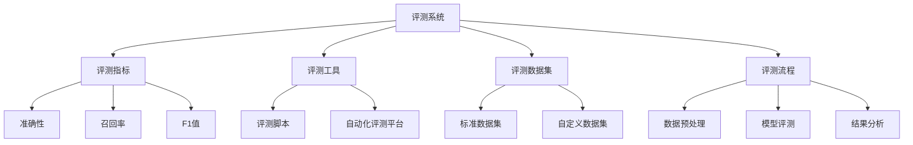

                 

### 第1章: 大模型效果评测的背景与意义

在人工智能（AI）的快速发展中，大型语言模型（LLM）如BERT、GPT等，已经在自然语言处理（NLP）领域取得了显著的成效。然而，如何科学、公正、高效地评估这些大型模型的效果，成为了一个亟待解决的问题。

#### 1.1.1 问题背景

**问题背景**

随着AI技术的进步，LLM在文本生成、文本分类、机器翻译等NLP任务中展现出了卓越的能力。然而，由于LLM模型的复杂性和多样性，如何准确、全面地评估其性能成为了一个技术难题。现有的评估方法，大多基于单一指标，如准确性、召回率等，难以全面反映模型在实际应用中的表现。

**问题描述**

大模型效果评测的目标是全面、客观地评估LLM在各个任务上的性能，包括文本生成、文本分类、机器翻译等。然而，现有的评估方法存在诸多不足，如：

1. **指标单一**：仅依赖准确性等单一指标，无法全面反映模型性能。
2. **标准不统一**：不同研究者使用不同的评测标准，导致结果可比性差。
3. **过程繁琐**：评测过程依赖人为操作，效率低下。

**问题解决**

为了解决上述问题，我们需要从以下几个方面进行革新：

1. **评测指标多样化**：引入多种评测指标，从不同维度评估模型性能。
2. **评测标准统一化**：制定统一的评测标准，确保不同模型之间的可比性。
3. **评测过程自动化**：利用自动化工具提高评测效率，减少人为干预。
4. **评测系统智能化**：结合人工智能技术，提高评测系统的智能化水平。

#### 1.1.2 评测系统的边界与外延

**边界与外延**

大模型效果评测不仅适用于LLM，还可以应用于其他类型的大型人工智能模型，如视觉模型、语音模型等。此外，评测方法还可以扩展到其他领域，如医疗、金融等。这为评测系统的设计和实现提出了更高的要求。

**概念结构与核心要素组成**

为了实现高效、公正的大模型效果评测，我们需要构建一个完整的评测系统。该系统由以下几个核心要素组成：

1. **评测指标**：包括准确性、召回率、F1值等，用于评估模型在不同任务上的性能。
2. **评测工具**：包括评测脚本、自动化评测平台等，用于执行评测任务。
3. **评测数据集**：包括标准数据集和自定义数据集，用于测试模型性能。
4. **评测流程**：包括数据预处理、模型评测、结果分析等，确保评测过程的有序进行。

**图1：大模型效果评测系统结构图**

### 1.1.3 摘要

本文旨在探讨大模型效果评测的革新，通过引入多样化评测指标、统一评测标准、自动化评测过程和智能化评测系统，全面提高评测的准确性和公正性。本文首先分析了大模型效果评测的背景与意义，然后详细阐述了评测系统的核心概念、算法原理、数学模型和实际应用。通过本文的研究，我们期望为AI领域的大模型效果评测提供新的思路和方法。

---

**关键词：**

- 大型语言模型
- 效果评测
- 评测指标
- 自动化评测
- 智能化系统

**摘要：**

本文深入探讨了大型语言模型（LLM）效果评测的问题背景、核心概念、算法原理和实际应用。通过引入多样化评测指标、统一评测标准、自动化评测过程和智能化评测系统，本文提出了一种革新的大模型效果评测方案，旨在提高评测的准确性和公正性。本文的研究为AI领域的大模型效果评测提供了新的思路和方法。

