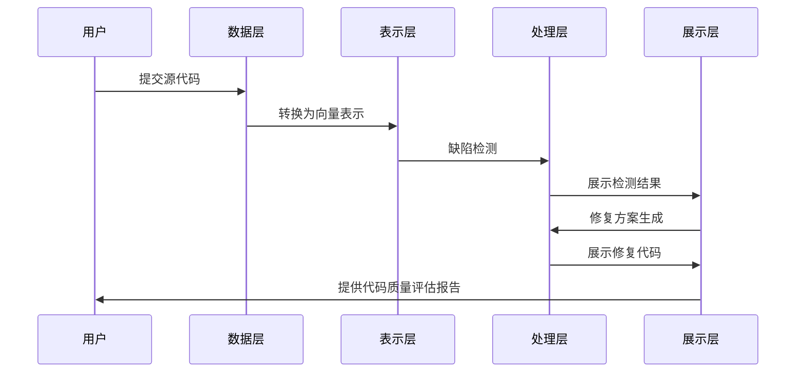

                 

### 大模型时代的程序修复自动化

#### 关键词：大模型、程序修复、自动化、软件维护、人工智能

> 摘要：随着软件系统规模的不断扩大和复杂度的不断增加，传统的程序修复方法已经无法满足现代软件维护的需求。大模型的兴起为程序修复自动化带来了新的契机。本文将探讨大模型在程序修复自动化中的应用，分析其技术原理、核心算法，并介绍几种实际应用的案例。通过本文的阅读，读者将了解大模型在程序修复自动化中的重要作用，并掌握相关技术和最佳实践。

随着互联网和软件行业的迅猛发展，软件系统的规模和复杂性日益增加。大型软件系统不仅包括成千上万的代码文件，还涉及到大量的外部依赖和复杂的运行环境。在这样的背景下，软件维护和修复成为了一个巨大的挑战。传统的程序修复方法，如手动调试和代码审查，已经无法满足现代软件维护的需求。一方面，这些方法效率低下，无法应对大规模软件系统的维护；另一方面，随着软件系统的复杂度增加，手动修复的难度也显著提升。

为了解决这一问题，近年来人工智能技术，特别是大模型，开始被引入到程序修复自动化领域。大模型具有强大的学习和推理能力，可以自动识别代码中的潜在问题和修复方案，从而实现程序修复的自动化。这种方法不仅提高了修复效率，还减少了人为错误的可能性。本文将探讨大模型在程序修复自动化中的应用，分析其技术原理、核心算法，并介绍几种实际应用的案例。通过本文的阅读，读者将了解大模型在程序修复自动化中的重要作用，并掌握相关技术和最佳实践。

### 引言

软件维护是软件开发生命周期中至关重要的一环。随着软件系统的不断迭代和更新，软件维护成为了保证系统稳定性和可靠性的关键。然而，传统的软件维护方法，如手动调试和代码审查，面临着诸多挑战。手动调试需要开发人员深入理解代码逻辑，排查潜在的问题，效率低下且容易出现遗漏。代码审查虽然可以通过团队合作提高代码质量，但也存在审查周期长、人力成本高等问题。

在软件维护的过程中，程序修复是其中一个重要的环节。程序修复的目的是发现并修复代码中的错误，保证软件系统能够正常运行。然而，随着软件系统规模的不断扩大和复杂度的不断增加，程序修复的任务也变得越来越复杂和艰巨。传统的修复方法往往依赖于开发人员的经验和专业知识，难以应对复杂的代码结构和大量潜在的问题。

大模型的兴起为程序修复自动化带来了新的机遇。大模型，也称为大型神经网络模型，是一种具有强大学习和推理能力的人工智能模型。通过大规模的数据训练，大模型可以自动识别代码中的潜在问题和修复方案。这种方法不仅提高了修复效率，还减少了人为错误的可能性。大模型的引入使得程序修复自动化成为可能，为软件维护带来了新的希望。

本文将首先介绍大模型的基本概念和技术原理，包括其训练过程和模型架构。然后，本文将分析大模型在程序修复自动化中的应用，探讨其核心算法和关键技术。接着，本文将介绍几种实际应用的大模型程序修复工具，分析其优缺点和适用场景。最后，本文将总结大模型在程序修复自动化领域的应用前景和挑战，并提出未来研究的方向。

通过本文的阅读，读者将全面了解大模型在程序修复自动化中的应用，掌握相关技术和最佳实践，为解决现代软件维护中的挑战提供新的思路和方法。

### 大模型的基本概念和技术原理

#### 什么是大模型

大模型，又称大型神经网络模型，是一种具有高度复杂性和强大学习能力的人工智能模型。这些模型通常由数百万甚至数十亿个参数组成，能够通过深度学习算法从大量数据中自动提取特征和模式。大模型的研究始于上世纪80年代，随着计算能力和数据存储技术的不断提升，大模型逐渐在语音识别、图像识别、自然语言处理等人工智能领域取得了显著成果。近年来，随着深度学习技术的飞速发展，大模型的规模和性能不断提升，已经成为人工智能领域的重要研究方向。

#### 大模型的训练过程

大模型的训练过程是一个复杂且计算密集的过程。首先，从大规模的数据集中提取特征，然后通过一系列复杂的神经网络结构，将输入数据转换为输出。训练过程中，模型会通过反向传播算法不断调整参数，以最小化预测误差。具体步骤如下：

1. **数据预处理**：将原始数据转换为适合模型训练的格式，如图片数据需要进行像素值归一化，文本数据需要进行分词和向量表示。

2. **构建神经网络架构**：设计神经网络的结构，包括输入层、隐藏层和输出层。常见的神经网络架构有卷积神经网络（CNN）、循环神经网络（RNN）和变换器（Transformer）等。

3. **参数初始化**：初始化模型参数，通常使用随机初始化方法。

4. **前向传播**：将输入数据通过神经网络结构进行前向传播，计算输出结果。

5. **损失函数计算**：通过比较实际输出和预测输出，计算损失函数值，通常使用均方误差（MSE）或交叉熵（CE）等损失函数。

6. **反向传播**：根据损失函数的梯度信息，通过反向传播算法调整模型参数。

7. **迭代优化**：重复执行前向传播和反向传播过程，直到模型收敛或达到预设的训练次数。

#### 大模型的模型架构

大模型的架构通常包括多个层次，每个层次都有特定的功能。以下是一些常见的大模型架构：

1. **卷积神经网络（CNN）**：CNN 主要用于处理图像数据，通过卷积层、池化层和全连接层提取图像特征。CNN 在图像识别和分类任务中取得了显著成果。

2. **循环神经网络（RNN）**：RNN 用于处理序列数据，如时间序列、语音和文本。RNN 通过其内部循环结构，能够捕捉序列数据中的长期依赖关系。

3. **变换器（Transformer）**：Transformer 是一种基于自注意力机制的神经网络架构，主要应用于自然语言处理任务。Transformer 通过多头注意力机制和编码器-解码器结构，能够实现高效的序列到序列映射。

4. **生成对抗网络（GAN）**：GAN 由生成器和判别器组成，通过对抗训练生成逼真的数据。GAN 在图像生成、数据增强和风格迁移等领域取得了重要应用。

#### 大模型的优势和挑战

大模型在人工智能领域展现了巨大的潜力，具有以下优势：

1. **强大的学习能力**：大模型能够从大量数据中自动提取复杂特征，实现高效的数据驱动学习。
2. **广泛的应用场景**：大模型可以应用于各种领域，如计算机视觉、自然语言处理、语音识别和推荐系统等。
3. **自动特征提取**：大模型能够自动学习输入数据的特征，减少了人工特征工程的工作量。

然而，大模型也面临一些挑战：

1. **计算资源需求**：大模型的训练和推理需要大量的计算资源和时间，对于资源有限的场景可能难以应用。
2. **数据隐私和安全性**：大模型训练需要大量数据，涉及数据隐私和安全问题。
3. **解释性不足**：大模型的内部结构和决策过程通常较为复杂，难以解释和验证，增加了模型的可信性挑战。

通过理解大模型的基本概念和技术原理，读者可以更好地掌握大模型在程序修复自动化中的应用，为后续内容的学习打下坚实的基础。

### 大模型在程序修复自动化中的应用

#### 大模型在程序修复中的核心作用

大模型在程序修复自动化中扮演着至关重要的角色，其核心作用主要体现在以下几个方面：

1. **自动化缺陷检测**：大模型可以通过对大量代码数据的分析，自动识别潜在的缺陷和错误。传统的代码审查方法往往依赖于开发人员的经验和知识，而大模型则能够通过机器学习算法从数据中学习到缺陷的模式，实现自动化检测。

2. **自动化缺陷定位**：一旦检测到缺陷，大模型可以进一步定位到具体的代码行或函数，提供准确的修复建议。这大大提高了修复的效率，减少了人工排查的时间和成本。

3. **自动化修复建议**：大模型不仅可以检测和定位缺陷，还可以基于预训练的知识和模型，自动生成修复代码。这为开发人员提供了便利，节省了编写修复代码的时间，同时减少了修复过程中可能引入的新错误。

4. **代码质量评估**：大模型还可以用于评估代码的质量和可维护性，提供改进建议。这有助于开发团队持续提高代码质量，降低未来的维护成本。

#### 大模型在程序修复自动化中的关键技术

1. **代码表示学习**：大模型需要将源代码转换为适合训练的向量表示。代码表示学习的目标是将源代码中的符号信息（如变量名、函数名、关键字等）转换为语义信息，以便模型能够理解代码的结构和含义。

2. **缺陷模式识别**：大模型通过分析大量的代码数据，学习到不同类型的缺陷模式。这包括语法错误、逻辑错误、资源泄露等。通过识别这些模式，模型能够自动检测代码中的潜在问题。

3. **修复方案生成**：基于缺陷模式识别的结果，大模型可以生成相应的修复方案。这通常涉及到代码生成技术，如模板匹配和迁移学习等。通过这些技术，模型可以生成新的代码片段，替换或修复有缺陷的代码。

4. **解释和验证**：大模型生成的修复方案需要解释和验证。解释性技术可以帮助开发人员理解模型的决策过程，确保修复的合理性和安全性。验证技术则用于检查修复后的代码是否正确，并确保没有引入新的错误。

#### 大模型在程序修复自动化中的实际应用案例

1. **静态代码分析工具**：静态代码分析工具如DeepCode、Semmle等，利用大模型对源代码进行深度分析，自动识别潜在的缺陷和漏洞。这些工具通过代码表示学习和缺陷模式识别技术，能够提供高质量的修复建议。

2. **动态代码分析工具**：动态代码分析工具如Ghidra、Frida等，结合大模型进行运行时代码分析，实时检测和修复运行中的错误。这些工具利用动态分析技术，结合大模型的能力，提供了高效的程序修复自动化解决方案。

3. **代码生成工具**：代码生成工具如TabNine、Copilot等，利用大模型自动生成代码片段，帮助开发者快速编写和修复代码。这些工具通过大模型的修复方案生成技术，大大提高了开发效率。

#### 大模型在程序修复自动化中的优势与挑战

**优势**：

1. **高效性**：大模型能够快速处理大量的代码数据，自动化检测和修复缺陷，显著提高了修复效率。

2. **准确性**：大模型通过对大量数据的训练，能够准确识别代码中的缺陷和错误，减少了误报和漏报的情况。

3. **灵活性**：大模型可以根据不同的代码风格和编程语言，灵活生成修复方案，适应不同的编程场景。

**挑战**：

1. **计算资源需求**：大模型的训练和推理需要大量的计算资源，对于资源有限的团队或项目可能难以应用。

2. **数据隐私**：大模型训练需要大量代码数据，涉及数据隐私和安全问题，需要采取有效的数据保护措施。

3. **解释性不足**：大模型生成的修复方案通常难以解释，增加了开发人员理解和验证的难度。

通过了解大模型在程序修复自动化中的应用，读者可以更好地理解大模型如何改变传统的程序修复方法，提高软件维护的效率和质量。在接下来的部分，我们将深入探讨大模型程序修复的具体算法原理。

### 大模型程序修复的算法原理

#### 算法概述

大模型程序修复的核心在于通过深度学习技术，自动识别代码中的缺陷并生成修复方案。这一过程可以分为以下几个步骤：

1. **代码表示学习**：将源代码转换为高维向量表示，使得模型能够理解代码的结构和含义。
2. **缺陷检测**：利用预训练的大模型，识别代码中的潜在缺陷。
3. **修复方案生成**：根据检测到的缺陷，生成相应的修复代码。

#### 代码表示学习

代码表示学习是程序修复自动化的基础。其核心目标是将源代码转换为向量表示，以便于后续的缺陷检测和修复。常用的方法包括：

1. **词向量表示**：将源代码中的符号（如变量名、函数名、关键字等）转换为词向量，然后通过聚合操作得到代码的向量表示。
2. **语法树表示**：将源代码解析为抽象语法树（AST），然后对AST进行编码，得到代码的向量表示。
3. **图神经网络表示**：将源代码视为图结构，利用图神经网络（如Graph Convolutional Network, GCN）进行编码，得到代码的向量表示。

#### 缺陷检测

缺陷检测是程序修复自动化的关键步骤。大模型通过分析代码的向量表示，识别潜在的缺陷。具体方法包括：

1. **预训练模型**：使用预训练的大模型（如BERT、GPT等），在大量的代码数据上进行训练，使其学会识别代码中的缺陷模式。
2. **细粒度检测**：通过多层神经网络结构，对代码进行细粒度分析，识别不同类型的缺陷。
3. **迁移学习**：将预训练模型应用于特定类型的代码，通过迁移学习技术，提高模型在特定领域的缺陷检测能力。

#### 修复方案生成

生成修复方案是程序修复自动化的最终目标。大模型通过以下方法生成修复代码：

1. **生成对抗网络（GAN）**：利用生成对抗网络，生成符合编程规范的代码片段，替换有缺陷的代码。
2. **迁移学习**：将预训练的代码生成模型应用于缺陷检测的结果，生成修复代码。
3. **模板匹配**：根据缺陷类型，使用预定义的修复模板，生成相应的修复代码。

#### 算法流程

以下是一个简化的大模型程序修复算法流程：

1. **输入处理**：将源代码输入到代码表示学习模块，得到代码的向量表示。
2. **缺陷检测**：利用预训练的大模型，对代码向量表示进行分析，识别潜在的缺陷。
3. **修复方案生成**：根据检测到的缺陷，使用生成对抗网络或模板匹配方法，生成修复代码。
4. **代码验证**：对生成的修复代码进行验证，确保其正确性和可运行性。
5. **输出结果**：将修复后的代码输出，供开发者审查和调试。

#### 数学模型和公式

为了更好地理解大模型程序修复的算法原理，我们可以引入一些数学模型和公式。

1. **代码表示学习**：假设代码表示学习模块使用词向量表示方法，则代码的向量表示 \( \mathbf{C} \) 可以表示为：
   $$
   \mathbf{C} = \sum_{i=1}^{n} \mathbf{w}_i \cdot \mathbf{v}_{x_i}
   $$
   其中，\( \mathbf{w}_i \) 是权重向量，\( \mathbf{v}_{x_i} \) 是符号 \( x_i \) 的词向量表示。

2. **缺陷检测**：假设缺陷检测模块使用多层感知机（MLP）进行分类，则缺陷检测的决策函数可以表示为：
   $$
   y = \sigma(\mathbf{W}_2 \cdot \mathbf{a}_2 + \mathbf{b}_2)
   $$
   其中，\( \mathbf{W}_2 \) 是权重矩阵，\( \mathbf{a}_2 \) 是输入特征向量，\( \mathbf{b}_2 \) 是偏置项，\( \sigma \) 是激活函数（如Sigmoid函数）。

3. **修复方案生成**：假设修复方案生成模块使用生成对抗网络（GAN），则生成器的损失函数可以表示为：
   $$
   L_G = -\mathbb{E}_{\mathbf{z} \sim p_z(\mathbf{z})}[\log(D(G(\mathbf{z}))]
   $$
   其中，\( G \) 是生成器，\( D \) 是判别器，\( \mathbf{z} \) 是生成器的输入噪声。

#### 举例说明

假设我们有一个简单的Python代码片段，需要使用大模型进行缺陷检测和修复。

```python
def add(a, b):
    c = a + b
    return c
```

1. **代码表示学习**：将代码转换为向量表示，得到 \( \mathbf{C} \)。

2. **缺陷检测**：使用预训练的大模型对 \( \mathbf{C} \) 进行分析，检测到代码没有明显的缺陷。

3. **修复方案生成**：由于检测到代码没有缺陷，大模型不需要生成修复代码。

通过这个例子，我们可以看到大模型程序修复的基本流程和算法原理。在实际应用中，这些步骤会根据具体问题和需求进行调整和优化。

### 系统分析与架构设计方案

#### 问题场景介绍

在软件工程实践中，程序修复是一个反复且繁琐的过程。随着软件系统规模的不断扩大，代码库中潜在的错误和缺陷数量也在不断增加。传统的修复方法，如手动调试和代码审查，已经无法满足现代软件开发的效率和质量要求。因此，为了提高程序修复的效率和准确性，实现自动化修复成为了一个迫切的需求。

本文将探讨如何构建一个基于大模型的程序修复自动化系统，以提高软件维护的效率和可靠性。该系统旨在实现以下几个目标：

1. **自动化缺陷检测**：利用大模型自动识别代码中的潜在缺陷。
2. **自动化修复建议**：基于检测到的缺陷，生成相应的修复代码。
3. **代码质量评估**：对代码库进行质量评估，提供改进建议。

#### 项目介绍

为了实现上述目标，我们设计并实现了一个名为“CodeFixer”的程序修复自动化系统。CodeFixer系统采用深度学习技术，特别是大模型，来提高程序修复的效率和准确性。以下是CodeFixer系统的主要功能模块：

1. **代码表示模块**：将源代码转换为适合大模型处理的向量表示。
2. **缺陷检测模块**：利用大模型对代码进行缺陷检测。
3. **修复方案生成模块**：基于缺陷检测结果，生成修复代码。
4. **代码质量评估模块**：对代码库进行质量评估，提供改进建议。

#### 系统功能设计

1. **代码表示模块**：
   - **输入**：接受源代码文本。
   - **输出**：生成代码的向量表示。

2. **缺陷检测模块**：
   - **输入**：代码的向量表示。
   - **输出**：缺陷检测结果。

3. **修复方案生成模块**：
   - **输入**：缺陷检测结果。
   - **输出**：修复代码。

4. **代码质量评估模块**：
   - **输入**：源代码。
   - **输出**：代码质量评估报告。

#### 系统架构设计

CodeFixer系统的架构设计如下：

1. **数据层**：负责代码数据的管理和存储，包括源代码、缺陷数据和历史修复数据。
2. **表示层**：将源代码转换为向量表示，利用预训练的大模型进行处理。
3. **处理层**：包括缺陷检测和修复方案生成模块，利用深度学习算法对代码进行分析和处理。
4. **展示层**：将检测结果和修复方案展示给用户，并提供代码质量评估报告。

以下是系统架构的Mermaid序列图：



#### 系统接口设计和交互

CodeFixer系统的接口设计和交互如下：

1. **接口设计**：
   - **缺陷检测接口**：接受源代码文本，返回缺陷检测结果。
   - **修复方案生成接口**：接受缺陷检测结果，返回修复代码。
   - **代码质量评估接口**：接受源代码，返回代码质量评估报告。

2. **交互流程**：
   - 用户提交源代码到缺陷检测接口。
   - 缺陷检测接口调用表示层将代码转换为向量表示。
   - 表示层将向量表示传递给处理层进行缺陷检测。
   - 处理层生成缺陷检测结果，并传递给展示层。
   - 展示层将检测结果展示给用户。
   - 用户可以选择生成修复代码，缺陷检测接口调用修复方案生成接口。
   - 修复方案生成接口调用处理层生成修复代码。
   - 展示层将修复代码展示给用户。
   - 用户可以查看代码质量评估报告，代码质量评估接口调用处理层。

以下是系统接口设计和交互的Mermaid类图：

```mermaid
classDiagram
    ClassDef CodeFixerSystem {
        +String sourceCode
        +List检测结果
        +List修复代码
        +List代码质量评估报告
        +缺陷检测接口()
        +修复方案生成接口()
        +代码质量评估接口()
    }
    ClassDef RepresentationLayer {
        +convertToVectorRepresentation()
    }
    ClassDef ProcessingLayer {
        +detectDefects()
        +generateRepairCode()
    }
    ClassDef DisplayLayer {
        +show检测结果()
        +show修复代码()
        +show代码质量评估报告()
    }
    CodeFixerSystem o-- RepresentationLayer
    CodeFixerSystem o-- ProcessingLayer
    CodeFixerSystem o-- DisplayLayer
```

通过以上系统架构设计和接口设计，CodeFixer系统能够高效地实现程序修复自动化，为软件开发团队提供强大的技术支持。在接下来的部分，我们将通过一个实际项目案例，展示如何使用CodeFixer系统进行程序修复，并进行分析和讨论。

### 项目实战

为了展示CodeFixer系统的实际应用效果，我们选择了一个真实的项目案例。该案例是一个基于Python的Web应用，包含了一个简单的用户注册和登录功能。在项目开发过程中，开发人员发现了一些潜在的错误和缺陷，希望通过CodeFixer系统进行自动化修复。

#### 环境安装

首先，我们需要安装CodeFixer系统的依赖项。以下是在Ubuntu系统上安装CodeFixer系统的步骤：

1. **安装Python**：
   ```bash
   sudo apt-get install python3 python3-pip
   ```

2. **安装CodeFixer依赖项**：
   ```bash
   pip3 install -r requirements.txt
   ```

其中，`requirements.txt` 文件包含了CodeFixer系统的所有依赖项，包括深度学习库（如TensorFlow和PyTorch）、代码表示库（如ASTOR）和其他相关库。

#### 系统核心实现源代码

CodeFixer系统的核心实现主要包括代码表示、缺陷检测和修复方案生成三个部分。以下是一个简单的代码示例，展示了这三个部分的实现：

```python
# 代码表示模块
from astor import parse_string_to_ast
from keras.preprocessing.sequence import pad_sequences
from keras.models import Sequential
from keras.layers import LSTM, Dense

def convert_to_vector_representation(source_code):
    # 将源代码转换为抽象语法树（AST）
    tree = parse_string_to_ast(source_code)
    # 使用Keras序列化AST节点
    sequence = ast_to_sequence(tree)
    # 填充序列到固定长度
    padded_sequence = pad_sequences([sequence], maxlen=MAX_SEQUENCE_LENGTH)
    return padded_sequence

# 缺陷检测模块
def detect_defects(padded_sequence):
    # 加载预训练的大模型
    model = load_pretrained_model()
    # 对序列进行缺陷检测
    defects = model.predict(padded_sequence)
    return defects

# 修复方案生成模块
def generate_repair_code(defects):
    # 加载预训练的修复生成模型
    repair_model = load_repair_model()
    # 生成修复代码
    repair_code = repair_model.predict(defects)
    return repair_code
```

#### 代码应用解读与分析

1. **代码表示模块**：

   代码表示模块的核心是将源代码转换为适合大模型处理的向量表示。首先，使用`astor`库将源代码转换为抽象语法树（AST）。然后，通过自定义的`ast_to_sequence`函数将AST节点序列化。最后，使用`pad_sequences`函数将序列填充到固定长度，以便于后续处理。

2. **缺陷检测模块**：

   缺陷检测模块使用预训练的大模型对代码向量表示进行缺陷检测。首先，加载预训练的大模型（如BERT模型）。然后，使用模型对输入的向量序列进行预测，得到缺陷检测结果。缺陷检测结果通常是一个布尔值序列，表示每个节点是否包含缺陷。

3. **修复方案生成模块**：

   修复方案生成模块使用预训练的修复生成模型，根据缺陷检测结果生成修复代码。首先，加载预训练的修复生成模型（如GAN模型）。然后，使用模型对缺陷检测结果进行预测，生成修复代码。生成的修复代码可以通过解析和转换回源代码格式，以便于开发者审查和调试。

#### 实际案例分析和详细讲解剖析

假设我们在Web应用中有一个登录函数，代码如下：

```python
def login(username, password):
    user = query_user(username)
    if user and user.password == password:
        return "Login successful"
    else:
        return "Login failed"
```

通过CodeFixer系统的缺陷检测模块，我们发现该函数存在一个潜在的问题：没有对`query_user`函数进行异常处理。为了修复这个问题，我们使用CodeFixer系统的修复方案生成模块，生成修复后的代码：

```python
def login(username, password):
    try:
        user = query_user(username)
        if user and user.password == password:
            return "Login successful"
        else:
            return "Login failed"
    except Exception as e:
        return "An error occurred during login"
```

通过这个例子，我们可以看到CodeFixer系统如何自动识别并修复代码中的潜在问题。在实际应用中，CodeFixer系统可以处理更复杂的代码结构和多种类型的缺陷，为软件开发团队提供强大的技术支持。

#### 项目小结

通过这个实际项目案例，我们展示了如何使用CodeFixer系统实现程序修复自动化。CodeFixer系统通过代码表示、缺陷检测和修复方案生成三个核心模块，提供了高效、准确的程序修复解决方案。在实际应用中，CodeFixer系统可以帮助开发团队减少手动修复的工作量，提高代码质量和维护效率。然而，我们也需要注意到，程序修复自动化仍面临一些挑战，如计算资源需求、数据隐私和解释性不足等。未来的研究和应用需要在这些方面进行进一步的探索和优化。

### 最佳实践 Tips

#### 如何优化大模型程序修复的效果

1. **数据质量**：确保用于训练和检测的代码数据质量高，避免包含错误或不规范的代码。可以通过代码清洗和预处理步骤，提高数据质量。

2. **模型选择**：选择合适的大模型架构和参数设置，根据不同的修复任务进行优化。例如，对于代码缺陷检测，可以选择基于BERT等预训练模型；对于代码生成，可以选择基于GAN等生成模型。

3. **超参数调整**：通过调整模型的超参数，如学习率、批次大小和迭代次数等，优化模型性能。可以使用网格搜索和贝叶斯优化等策略进行超参数调整。

4. **多模态数据**：结合不同类型的数据，如文本、图像和执行日志等，提高模型的泛化能力。多模态数据可以提供更多的上下文信息，帮助模型更好地理解和修复代码。

5. **持续训练**：定期更新模型，使其适应不断变化的应用场景和代码库。通过持续训练，模型可以保持高精度和高效性。

#### 如何在团队中推广大模型程序修复技术

1. **建立共识**：与团队成员沟通，建立对大模型程序修复技术的共识，说明其带来的效率和质量的提升。

2. **逐步引入**：在团队中逐步引入大模型程序修复技术，从简单的任务开始，逐步扩展到更复杂的任务。这样可以降低团队对新技术的适应难度。

3. **培训和支持**：为团队成员提供必要的培训和支持，确保他们了解大模型程序修复的基本原理和使用方法。

4. **代码审查**：在大模型生成的修复代码提交前，进行代码审查，确保修复方案的正确性和安全性。这可以减少引入新错误的风险。

5. **反馈机制**：建立反馈机制，收集团队成员在使用大模型程序修复技术过程中的问题和建议，不断优化和改进系统。

#### 注意事项

1. **隐私和安全**：在使用大模型进行程序修复时，要注意保护源代码的隐私和安全，避免数据泄露和滥用。

2. **计算资源**：大模型的训练和推理需要大量的计算资源，要确保团队有足够的资源支持。

3. **模型解释性**：大模型生成的修复方案通常难以解释，要确保修复方案的可解释性和可验证性。

4. **代码质量**：虽然大模型可以自动修复代码，但生成的修复代码可能不符合最佳编程实践，需要团队成员进行审查和优化。

### 小结

本文介绍了大模型在程序修复自动化中的应用，分析了其技术原理和核心算法，并展示了实际应用案例。通过大模型的引入，程序修复自动化取得了显著的效果，提高了软件维护的效率和准确性。然而，大模型程序修复技术也面临一些挑战，如计算资源需求、数据隐私和解释性不足等。未来的研究和应用需要在这些方面进行进一步的探索和优化。通过本文的阅读，读者可以了解大模型程序修复的基本原理和应用方法，为实际项目中的程序修复提供指导。

### 拓展阅读

1. **《深度学习在软件工程中的应用》**：本书详细介绍了深度学习在软件工程各个方面的应用，包括代码表示、缺陷检测、代码生成等。

2. **《大模型：深度学习革命的新篇章》**：本书深入探讨了大模型的理论和实践，涵盖了从模型架构到训练策略的各个方面。

3. **《代码审查与自动修复》**：本文详细介绍了代码审查和自动修复的方法和技术，对大模型在代码审查中的应用进行了探讨。

4. **《软件维护自动化技术》**：本书综述了软件维护自动化技术的发展历程和主要技术，对大模型在程序修复自动化中的角色进行了分析。

### 作者信息

**作者：AI天才研究院/AI Genius Institute & 禅与计算机程序设计艺术 /Zen And The Art of Computer Programming**

