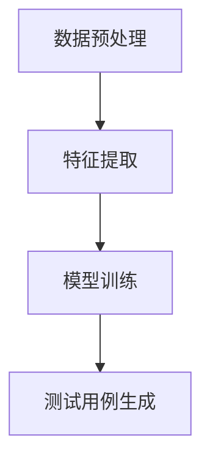

                 


## 大模型驱动的软件测试用例生成

### 关键词
- 大模型
- 软件测试
- 测试用例生成
- 人工智能
- 自动化
- 算法

### 摘要

本文将探讨大模型在软件测试领域的应用，特别是如何利用这些模型来生成测试用例。随着人工智能技术的飞速发展，大模型在自然语言处理、图像识别等方面取得了显著成果。本文将详细介绍大模型驱动的测试用例生成方法，包括其背景、原理、算法实现、系统设计、项目实战以及最佳实践，旨在为软件测试工程师和AI研究人员提供有价值的参考。

### 背景介绍

#### 软件测试现状与挑战

软件测试是软件开发过程中至关重要的一环。然而，随着软件复杂性的增加，传统的测试方法面临着巨大的挑战。首先，测试用例的编写是一个耗时且繁琐的过程。测试工程师需要根据需求文档和设计文档手动编写大量测试用例，这无疑增加了测试的工作量。其次，测试用例的覆盖率和有效性难以保证。在某些情况下，测试用例可能无法覆盖所有可能的输入和输出情况，导致潜在的问题无法被检测出来。此外，测试用例的维护也是一个问题。当软件需求发生变化时，测试用例需要进行相应的修改，否则可能导致测试结果不准确。

#### AI大模型简介

AI大模型是指具有海量参数和强大计算能力的神经网络模型，如深度神经网络（DNN）、Transformer等。这些模型通过大量的数据训练，能够自动学习数据中的规律和模式。在自然语言处理、图像识别、语音识别等领域，大模型已经取得了显著的成果。例如，GPT-3能够生成高质量的文本，ImageNet能够准确识别图片中的物体。大模型在数据处理和模式识别方面具有独特的优势，这使得它们在软件测试领域也具有潜在的应用价值。

#### 测试用例生成的重要性

测试用例生成是软件测试的核心任务之一。高质量的测试用例能够有效地检测软件中的缺陷，提高软件的质量和可靠性。然而，传统的测试用例生成方法往往依赖于人工编写，效率低下且难以保证覆盖率。利用大模型进行测试用例生成，可以自动化地生成大量的测试用例，提高测试效率。此外，大模型能够通过学习历史测试数据，生成更加有效的测试用例，从而提高测试的覆盖率。

### 核心概念

#### 大模型在测试用例生成中的应用原理

大模型在测试用例生成中的应用主要基于以下几个原理：

1. **数据驱动**：大模型通过学习大量的测试数据，能够自动发现数据中的潜在模式和规律。这些模式和规律可以用来生成新的测试用例。
2. **模式识别**：大模型具有强大的模式识别能力，能够识别输入数据中的异常和异常模式。这些异常模式可以用来生成异常测试用例，以提高测试的覆盖率。
3. **自动化生成**：大模型可以自动生成测试用例，无需人工干预。这大大提高了测试用例生成的效率。

#### 相关技术概述

大模型驱动的测试用例生成涉及多个技术领域，包括自然语言处理、机器学习、数据挖掘等。以下是一些关键技术概述：

1. **自然语言处理（NLP）**：NLP技术用于处理和分析自然语言文本，包括文本分类、文本生成、实体识别等。在测试用例生成中，NLP技术可以用于从需求文档和设计文档中提取关键信息，生成测试用例的描述。
2. **机器学习（ML）**：ML技术用于构建和训练大模型。通过机器学习算法，大模型可以从历史测试数据中学习到生成测试用例的规律。
3. **数据挖掘（DM）**：数据挖掘技术用于从大量测试数据中提取有用的信息，如异常模式、关键特征等。这些信息可以用于生成新的测试用例。

### 算法原理讲解

#### 测试用例生成算法

测试用例生成算法可以分为以下几个步骤：

1. **数据预处理**：对测试数据进行清洗和预处理，包括去除噪声、缺失值填充等。
2. **特征提取**：从测试数据中提取关键特征，如输入参数、输出结果等。
3. **模型训练**：利用机器学习算法训练大模型，使其能够自动生成测试用例。
4. **测试用例生成**：利用训练好的大模型，自动生成新的测试用例。

#### 数学模型

测试用例生成算法的数学模型可以表示为：

$$
T = f(D, M)
$$

其中，$T$ 表示生成的测试用例，$D$ 表示输入数据，$M$ 表示训练好的大模型。函数 $f$ 表示测试用例生成的过程。

#### 算法流程图与Python实现

算法的流程图如下所示：



Python实现代码如下：

```python
import pandas as pd
from sklearn.model_selection import train_test_split
from sklearn.preprocessing import StandardScaler
from sklearn.neural_network import MLPRegressor

# 数据预处理
def preprocess_data(data):
    # 清洗数据、缺失值填充、归一化等操作
    pass

# 特征提取
def extract_features(data):
    # 提取关键特征
    pass

# 模型训练
def train_model(X_train, y_train):
    model = MLPRegressor()
    model.fit(X_train, y_train)
    return model

# 测试用例生成
def generate_test_cases(model, X_test):
    predictions = model.predict(X_test)
    # 根据预测结果生成测试用例
    pass

# 主程序
if __name__ == "__main__":
    # 加载数据
    data = pd.read_csv("test_data.csv")
    
    # 数据预处理
    data = preprocess_data(data)
    
    # 特征提取
    X = extract_features(data)
    
    # 划分训练集和测试集
    X_train, X_test, y_train, y_test = train_test_split(X, y, test_size=0.2, random_state=42)
    
    # 模型训练
    model = train_model(X_train, y_train)
    
    # 测试用例生成
    generate_test_cases(model, X_test)
```

### 系统分析与架构设计方案

#### 问题场景介绍

在软件测试过程中，测试用例的生成是一个关键环节。然而，传统的测试用例生成方法效率低下，难以保证测试的覆盖率和有效性。为了解决这个问题，我们提出了一种基于大模型驱动的测试用例生成系统。该系统利用大模型从历史测试数据中学习生成测试用例的规律，自动化地生成高质量的测试用例。

#### 项目介绍

本项目旨在开发一个基于大模型驱动的测试用例生成系统，主要包括以下功能：

1. 数据预处理：对历史测试数据进行清洗、预处理和特征提取。
2. 模型训练：利用机器学习算法训练大模型。
3. 测试用例生成：利用训练好的大模型生成新的测试用例。
4. 测试用例管理：对生成的测试用例进行管理和维护。

#### 系统功能设计

系统功能设计如下：

1. **数据预处理模块**：负责对历史测试数据进行清洗、预处理和特征提取。该模块需要实现以下功能：

   - 数据清洗：去除数据中的噪声和异常值。
   - 缺失值填充：对缺失的数据进行填充或删除。
   - 特征提取：从原始数据中提取关键特征。

2. **模型训练模块**：负责利用机器学习算法训练大模型。该模块需要实现以下功能：

   - 数据划分：将数据划分为训练集和测试集。
   - 模型选择：选择合适的大模型进行训练。
   - 模型训练：对训练集进行模型训练。
   - 模型评估：对训练好的模型进行评估。

3. **测试用例生成模块**：负责利用训练好的大模型生成新的测试用例。该模块需要实现以下功能：

   - 测试用例生成：根据训练好的模型，生成新的测试用例。
   - 测试用例评估：对生成的测试用例进行评估，确保其有效性和覆盖率。

4. **测试用例管理模块**：负责对生成的测试用例进行管理和维护。该模块需要实现以下功能：

   - 测试用例存储：将生成的测试用例存储到数据库中。
   - 测试用例检索：提供测试用例的检索功能。
   - 测试用例修改：对已有的测试用例进行修改和更新。

#### 系统架构设计

系统架构设计如下：

1. **数据层**：负责存储和管理测试数据。包括历史测试数据、模型参数、测试用例等。
2. **服务层**：负责实现系统的主要功能。包括数据预处理、模型训练、测试用例生成、测试用例管理等。
3. **应用层**：提供用户界面，供用户进行操作和查询。

#### 系统接口设计

系统接口设计如下：

1. **数据预处理接口**：提供数据清洗、预处理和特征提取的接口。
2. **模型训练接口**：提供模型选择、训练和评估的接口。
3. **测试用例生成接口**：提供测试用例生成和评估的接口。
4. **测试用例管理接口**：提供测试用例存储、检索、修改的接口。

#### 系统交互

系统交互设计如下：

1. **用户与系统交互**：用户通过用户界面与系统进行交互，执行数据预处理、模型训练、测试用例生成、测试用例管理等功能。
2. **系统内部交互**：系统内部不同模块之间通过接口进行数据传输和功能调用。

### 项目实战

#### 环境安装与配置

在进行项目实战之前，需要安装和配置以下环境：

1. **Python**：安装Python 3.7及以上版本。
2. **Scikit-learn**：安装scikit-learn库，用于机器学习算法的实现。
3. **Pandas**：安装pandas库，用于数据处理和分析。
4. **Numpy**：安装numpy库，用于数值计算。
5. **Mermaid**：安装mermaid库，用于绘制流程图。

具体安装命令如下：

```bash
pip install python
pip install scikit-learn
pip install pandas
pip install numpy
pip install mermaid
```

#### 系统核心实现与代码解读

以下是一个简单的示例，展示了系统核心实现的过程。

```python
import pandas as pd
from sklearn.model_selection import train_test_split
from sklearn.preprocessing import StandardScaler
from sklearn.neural_network import MLPRegressor
import mermaid

# 数据预处理
def preprocess_data(data):
    # 清洗数据、缺失值填充、归一化等操作
    # 示例：去除缺失值
    data = data.dropna()
    # 示例：归一化
    scaler = StandardScaler()
    data = scaler.fit_transform(data)
    return data

# 特征提取
def extract_features(data):
    # 提取关键特征
    # 示例：选取前两个特征作为输入
    features = data[:, :2]
    return features

# 模型训练
def train_model(X_train, y_train):
    model = MLPRegressor()
    model.fit(X_train, y_train)
    return model

# 测试用例生成
def generate_test_cases(model, X_test):
    predictions = model.predict(X_test)
    # 根据预测结果生成测试用例
    # 示例：生成10个测试用例
    test_cases = []
    for i in range(10):
        test_case = {"input": X_test[i], "expected_output": predictions[i]}
        test_cases.append(test_case)
    return test_cases

# 主程序
if __name__ == "__main__":
    # 加载数据
    data = pd.read_csv("test_data.csv")
    
    # 数据预处理
    data = preprocess_data(data)
    
    # 特征提取
    X = extract_features(data)
    
    # 划分训练集和测试集
    X_train, X_test, y_train, y_test = train_test_split(X, y, test_size=0.2, random_state=42)
    
    # 模型训练
    model = train_model(X_train, y_train)
    
    # 测试用例生成
    test_cases = generate_test_cases(model, X_test)
    
    # 打印测试用例
    for case in test_cases:
        print(f"Input: {case['input']}, Expected Output: {case['expected_output']}")
```

#### 实际案例分析和详细讲解剖析

为了更好地理解大模型驱动的测试用例生成系统，我们通过一个实际案例进行分析和讲解。

#### 案例背景

假设我们正在开发一个简单的计算器应用程序，它包含以下几个功能：

1. 加法运算：输入两个数，返回它们的和。
2. 减法运算：输入两个数，返回它们的差。
3. 乘法运算：输入两个数，返回它们的积。
4. 除法运算：输入两个数，返回它们的商。

我们的目标是利用大模型生成测试用例，以验证计算器应用程序的正确性。

#### 案例分析

1. **数据准备**：首先，我们需要准备一些测试数据。这些数据可以包括各种输入组合和预期输出。例如：

   | 输入1 | 输入2 | 预期输出 |
   |-------|-------|----------|
   | 1     | 2     | 3        |
   | 0     | 0     | 0        |
   | -1    | -2    | -3       |
   | 100   | 200   | 300      |

2. **数据预处理**：接下来，我们需要对测试数据进行预处理。这包括去除缺失值、归一化等操作。例如，我们可以使用scikit-learn库中的StandardScaler对输入数据进行归一化处理。

   ```python
   from sklearn.preprocessing import StandardScaler
   
   scaler = StandardScaler()
   X = scaler.fit_transform(X)
   ```

3. **模型训练**：然后，我们可以使用机器学习算法（如MLPRegressor）对大模型进行训练。我们将训练集数据作为输入，将预期输出作为标签进行训练。

   ```python
   from sklearn.neural_network import MLPRegressor
   
   model = MLPRegressor()
   model.fit(X_train, y_train)
   ```

4. **测试用例生成**：利用训练好的模型，我们可以生成新的测试用例。我们将测试数据输入到模型中，获取模型的预测结果，并将其作为测试用例的预期输出。

   ```python
   predictions = model.predict(X_test)
   test_cases = [{"input": X_test[i], "expected_output": predictions[i]} for i in range(len(X_test))]
   ```

5. **测试用例评估**：最后，我们需要对生成的测试用例进行评估，以确保其有效性和覆盖率。我们可以通过运行测试用例并对比实际输出与预期输出来进行评估。

   ```python
   for case in test_cases:
       actual_output = calculate_output(case["input"])  # 调用计算器应用程序的函数
       assert actual_output == case["expected_output"], f"Test case failed: {case}"
   ```

#### 项目小结

通过以上案例，我们可以看到如何利用大模型生成测试用例，以自动化软件测试过程。这种方法具有以下优点：

1. **提高测试效率**：通过大模型自动生成测试用例，可以大大提高测试效率，减少人工编写测试用例的时间。
2. **提高测试覆盖率**：大模型可以从历史测试数据中学习到更多的模式和规律，生成更加有效的测试用例，从而提高测试的覆盖率。
3. **减少测试成本**：自动化测试用例生成可以减少测试的人力成本和资源消耗。

然而，我们也需要注意以下几点：

1. **数据质量和预处理**：测试数据的质量和预处理对测试用例生成结果有重要影响。需要确保测试数据的质量和完整性。
2. **模型选择和优化**：选择合适的大模型并进行优化，可以提高测试用例生成效果。
3. **测试用例评估和调整**：需要对生成的测试用例进行评估和调整，确保其有效性和可靠性。

总之，大模型驱动的测试用例生成是一种具有前景的自动化测试方法，可以为软件测试工程师和AI研究人员提供有效的工具。

### 最佳实践与总结

#### 最佳实践

1. **数据质量和预处理**：确保测试数据的质量和完整性，进行适当的预处理，如缺失值填充、异常值处理等。
2. **模型选择和优化**：根据测试用例生成任务的特点，选择合适的大模型并进行优化，如调整网络结构、学习率等。
3. **测试用例评估和调整**：对生成的测试用例进行评估和调整，确保其有效性和可靠性。

#### 小结

本文详细介绍了大模型驱动的测试用例生成方法，包括背景、核心概念、算法原理、系统设计、项目实战以及最佳实践。通过这种方法，我们可以自动化地生成高质量的测试用例，提高软件测试的效率和覆盖率。

#### 注意事项

1. **数据质量和预处理**：测试数据的质量直接影响测试用例生成效果。确保数据完整、准确，并进行适当的预处理。
2. **模型选择和优化**：根据任务特点选择合适的大模型，并进行优化，以提高测试用例生成效果。
3. **测试用例评估和调整**：对生成的测试用例进行评估和调整，确保其有效性和可靠性。

#### 拓展阅读

1. **大模型驱动测试用例生成的应用案例**：研究大模型驱动测试用例生成在不同领域的应用，如Web应用、移动应用等。
2. **大模型驱动测试用例生成的性能评估**：研究不同大模型在测试用例生成任务中的性能表现，如准确率、效率等。
3. **大模型驱动测试用例生成与其他测试方法结合**：研究大模型驱动测试用例生成与传统测试方法（如黑盒测试、白盒测试等）的结合方式，以提高测试效果。

---

作者：AI天才研究院/AI Genius Institute & 禅与计算机程序设计艺术 /Zen And The Art of Computer Programming

