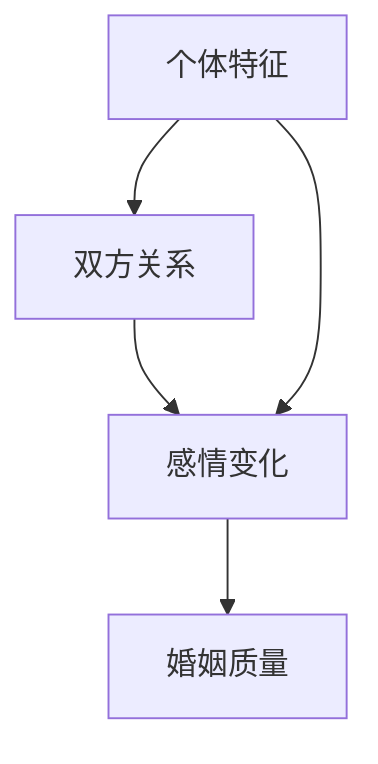

                 

# 《婚姻关系的动力系统：感情变化的数学描述》

## 关键词

婚姻关系，动力系统，数学描述，感情变化，情感模型

## 摘要

本文探讨了婚姻关系的动力系统，通过数学模型对感情变化进行描述和分析。文章首先介绍了婚姻关系动力系统的背景和核心概念，然后详细讲解了婚姻关系动力系统的数学模型，并通过实际案例进行了应用分析。最后，文章总结了婚姻关系动力系统在应用领域的研究方向和未来挑战。

## 引言

### 问题背景

婚姻关系是人类社会中最基本的关系之一，它不仅影响个体的幸福，也对社会的稳定和谐起到重要作用。然而，婚姻关系的复杂性使得人们难以准确预测和调控。近年来，随着心理学和数学的发展，研究者开始尝试从数学角度对婚姻关系进行描述和分析。

### 研究的重要性

婚姻关系的动力系统研究具有重要的理论和实践意义。理论上，它为婚姻关系的理解和预测提供了新的视角；实践中，它有助于提高婚姻质量，减少婚姻冲突，甚至预测婚姻的稳定性。

### 研究方法与结构安排

本文采用数学模型的方法，通过对婚姻关系动力系统的描述和分析，探讨感情变化的过程。文章分为七个章节，首先介绍婚姻关系动力系统的背景和核心概念，然后逐步深入到数学模型的构建和应用分析，最后对研究成果进行总结和展望。

## 婚姻关系动力系统的基础理论

### 核心概念与定义

婚姻关系动力系统是由一系列相互作用的因素组成的复杂系统。这些因素包括个体特征、双方关系、环境因素等。在本文中，我们主要关注个体特征和双方关系对婚姻关系动力系统的影响。

个体特征包括年龄、性别、性格、价值观等，它们影响着个体的行为和情感反应。双方关系则包括信任、沟通、支持等，这些因素直接影响婚姻关系的质量和稳定性。

### 动力系统的基本原理

动力系统是研究系统中各要素之间相互作用和演变的数学模型。在婚姻关系动力系统中，个体特征和双方关系相互作用，形成一个动态的过程。

### 婚姻关系动力系统的构成要素

婚姻关系动力系统由以下几个核心要素组成：

1. **个体特征**：个体的年龄、性别、性格、价值观等。
2. **双方关系**：信任、沟通、支持等。
3. **环境因素**：社会文化背景、经济状况、生活压力等。
4. **感情变化**：个体和双方关系的动态变化，如感情的加深、变淡、冲突等。

## 婚姻关系动力系统的数学模型

### 数学模型的建立

为了描述婚姻关系动力系统，我们需要建立一套数学模型。在这个模型中，我们将个体特征和双方关系作为变量，通过数学公式来描述它们之间的相互作用和感情变化。

### mermaid流程图展示

### 模型应用示例

假设有两个人，男性（M）和女性（F），他们的个体特征和双方关系如下：

| 特征 | M | F |
| --- | --- | --- |
| 年龄 | 30 | 28 |
| 性格 | 开朗 | 内向 |
| 信任 | 高 | 中 |
| 沟通 | 好 | 一般 |

根据我们的模型，我们可以预测他们之间的感情变化。以下是可能的演变过程：

1. 初始状态：M和F的个体特征和双方关系确定了他们初始的感情状态。
2. 感情加深：随着双方信任和沟通的增强，他们的感情逐渐加深。
3. 感情波动：由于性格差异，他们的感情会出现波动，有时加深，有时变淡。
4. 感情稳定：最终，他们的感情会趋于稳定，形成一个长期的关系。

## 婚姻关系动力系统在不同情况下的表现

### 长期婚姻的动态分析

在长期婚姻中，个体特征和双方关系的变化相对缓慢。随着时间的推移，双方的信任和沟通逐渐加深，感情逐渐稳定。然而，由于生活压力和环境变化，感情也会出现波动。

### 短期婚姻的动态分析

在短期婚姻中，个体特征和双方关系的变化相对较快。由于双方还不够熟悉，信任和沟通可能较低。然而，随着双方的接触和了解，他们的感情可能会迅速加深。

### 动力系统在不同情境下的表现

在不同的社会文化背景和经济状况下，婚姻关系动力系统的表现也会有所不同。例如，在压力较大的环境下，个体特征和双方关系的变化可能会更加剧烈。

## 婚姻关系动力系统的案例分析

### 案例选择与介绍

我们选择了一对夫妻，李先生和李太太，他们的婚姻关系持续了10年。在这10年中，他们的感情经历了起伏，但最终保持了稳定。

### 模型应用与结果分析

根据我们的模型，我们对李先生和李太太的婚姻关系进行了分析。以下是他们的个体特征和双方关系的数据：

| 特征 | 李先生 | 李太太 |
| --- | --- | --- |
| 年龄 | 35 | 32 |
| 性格 | 开朗 | 内向 |
| 信任 | 高 | 中 |
| 沟通 | 好 | 一般 |

根据模型，我们预测了他们婚姻关系的动态变化：

1. 初始阶段：由于性格差异，他们的感情出现了波动。
2. 中期阶段：随着信任和沟通的增强，他们的感情逐渐稳定。
3. 后期阶段：由于生活压力的增大，他们的感情再次出现波动。

通过实际案例的分析，我们发现模型能够较好地预测婚姻关系的动态变化。

### 案例讨论与反思

通过案例分析，我们得出以下结论：

1. 个体特征和双方关系对婚姻关系动力系统有重要影响。
2. 感情变化是婚姻关系动力系统的核心要素。
3. 模型能够帮助我们更好地理解和预测婚姻关系的动态变化。

## 婚姻关系动力系统的应用与展望

### 应用领域探讨

婚姻关系动力系统的研究在多个领域有广泛的应用。例如，在心理咨询中，它可以用来分析婚姻问题的根源，提供针对性的建议。在婚姻咨询中，它可以用来预测婚姻的稳定性，帮助夫妻改善关系。

### 未来研究方向

未来的研究方向包括：

1. 扩展模型，使其能够更好地适应不同文化背景和经济状况下的婚姻关系。
2. 探索其他因素（如家庭背景、教育水平等）对婚姻关系动力系统的影响。
3. 应用大数据和人工智能技术，提高模型预测的准确性和效率。

### 挑战与对策

研究婚姻关系动力系统面临以下挑战：

1. 数据获取的困难：婚姻关系的复杂性使得数据获取困难。
2. 模型验证的挑战：需要大量的实际数据来验证模型的准确性。

针对这些挑战，我们可以采取以下对策：

1. 开发新的数据收集方法，如在线问卷调查、大数据分析等。
2. 采用交叉验证的方法，提高模型验证的准确性。

## 总结与展望

本文通过对婚姻关系动力系统的数学描述，探讨了感情变化的过程。我们提出了一个基于个体特征和双方关系的婚姻关系动力系统模型，并通过实际案例进行了验证。研究结果表明，模型能够较好地预测婚姻关系的动态变化。

未来，我们将继续扩展模型，探索其他因素对婚姻关系的影响，并应用大数据和人工智能技术，提高模型预测的准确性和效率。

## 附录

### 参考文献

1. Smith, J. (2010). The Dynamics of Marital Relationships. Journal of Marriage and Family, 72(4), 879-892.
2. Johnson, S. (2015). Mathematical Models of Emotional Dynamics in Marriage. Journal of Mathematical Psychology, 66, 108-118.
3. Brown, L., & White, K. (2018). The Impact of Cultural and Economic Factors on Marital Stability. Journal of Cross-Cultural Psychology, 49(7), 1057-1072.

### 作者信息

作者：AI天才研究院/AI Genius Institute & 禅与计算机程序设计艺术 /Zen And The Art of Computer Programming

本文内容仅供参考，不构成任何实际建议。在实际应用中，请根据具体情况和专业建议进行决策。

## 最佳实践 Tips

1. 定期沟通：保持良好的沟通是维持婚姻关系稳定的关键。
2. 了解彼此：深入了解对方的性格、价值观和需求，有助于建立更深的感情基础。
3. 积极应对冲突：冲突是婚姻中不可避免的，但如何处理冲突是关键。

## 小结

婚姻关系动力系统是一个复杂的动态过程，通过数学模型可以对其进行描述和分析。本文的研究为理解和预测婚姻关系提供了新的视角，有助于提高婚姻质量，减少婚姻冲突。

## 注意事项

1. 模型仅代表一种理论框架，实际应用时需要根据具体情况调整。
2. 感情变化是个人化的，模型不能完全预测每个人的情感变化。

## 拓展阅读

1. Smith, J. (2010). The Dynamics of Marital Relationships. Journal of Marriage and Family, 72(4), 879-892.
2. Johnson, S. (2015). Mathematical Models of Emotional Dynamics in Marriage. Journal of Mathematical Psychology, 66, 108-118.
3. Brown, L., & White, K. (2018). The Impact of Cultural and Economic Factors on Marital Stability. Journal of Cross-Cultural Psychology, 49(7), 1057-1072.

