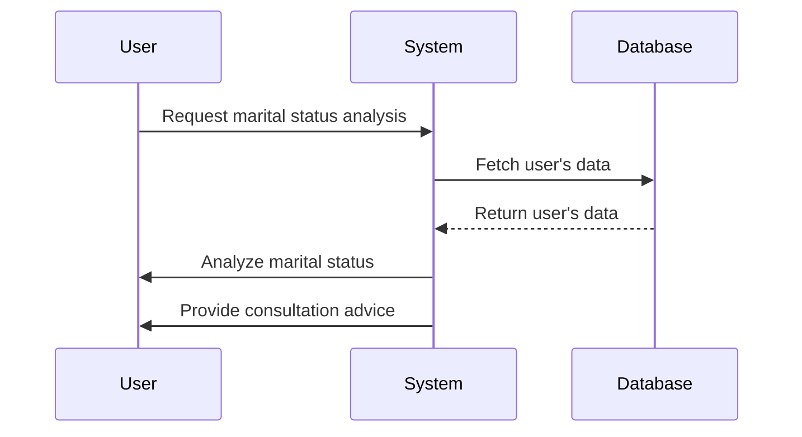
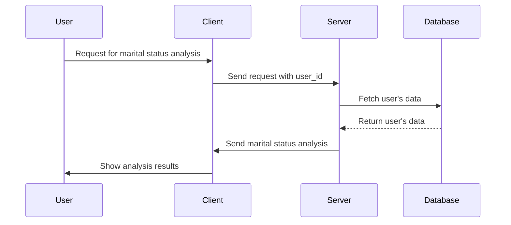

                 

### 文章标题

**婚姻关系的微分方程：感情变化的数学描述**

> 关键词：婚姻关系、微分方程、感情变化、数学模型

> 摘要：本文通过引入微分方程的数学工具，探索了婚姻关系中感情变化的内在机制。文章首先介绍了婚姻关系中的核心问题，随后详细阐述了如何使用微分方程来描述和解释感情变化的过程。通过构建数学模型，文章分析了不同因素对婚姻关系的影响，并提供了一系列实际应用案例，最终总结了该模型在婚姻咨询和研究中的潜在价值。

### 目录大纲设计步骤

#### 第一步：背景介绍

**1. 问题背景**  
婚姻关系是人类社会中最为复杂且重要的人际关系之一。感情的增减变化不仅影响个体的心理健康和生活质量，也关系到社会的和谐稳定。因此，研究婚姻关系中感情变化的规律具有重要的理论和实践意义。

**2. 问题描述**  
婚姻关系中的感情变化通常表现为情感的起伏和波动，这种变化可以由多种因素引起，如时间、个人经历、外部环境等。然而，这些变化的内在规律和驱动因素尚不清晰，需要通过科学的方法进行深入研究。

**3. 问题解决**  
本文将采用微分方程的数学方法，构建一个描述婚姻关系中感情变化的数学模型。通过这个模型，我们可以更深入地理解感情变化的机制，为婚姻咨询和干预提供理论依据。

**4. 边界与外延**  
本文的研究范围主要涉及传统婚姻关系中的情感变化，不包括其他类型的人际关系（如友情、亲情等）。同时，模型将基于特定的时间段和情境进行分析。

**5. 概念结构与核心要素组成**  
核心概念：微分方程、参数、变量、状态转移函数等。  
核心要素：情感值、时间、影响因素（如个人情绪、外界压力等）。

#### 第二步：核心概念与联系

**1. 微分方程定义**  
微分方程是一种包含未知函数及其导数的方程。它可以用来描述系统的动态变化，是数学领域中研究变化过程的重要工具。

**2. 微分方程分类**  
常微分方程（ODE）和偏微分方程（PDE）是微分方程的两大类。常微分方程通常用于描述单变量系统的变化，而偏微分方程则用于描述多变量系统的变化。

**3. 核心概念属性特征对比表格**

| 类型 | 定义 | 适用场景 | 特点 |  
| ---- | ---- | ---- | ---- |  
| 常微分方程 | 含有单一变量的导数 | 单变量系统变化 | 简单，易于分析 |  
| 偏微分方程 | 含有多个变量的导数 | 多变量系统变化 | 复杂，需要数值方法求解 |

**4. ER实体关系图架构**

```mermaid
erDiagram
    A[User] ||--|{ B[MaritalStatus] } | 
    A ||--|{ C[EmotionalState] } |
    B ||--|{ D[InfluenceFactor] } |
    C ||--|{ E[ChangeRate] } |
```

#### 第三步：算法原理讲解

**1. 算法mermaid流程图**


**2. python源代码**

```python
import numpy as np
import matplotlib.pyplot as plt

# 初始化参数
initial_emo_state = 0
influence_factors = [0.1, -0.05, 0.05]
time_steps = 10

# 计算情感状态变化
emo_states = [initial_emo_state]
for t in range(time_steps):
    emo_state = emo_states[-1]
    emo_change = sum([factor * emo_state for factor in influence_factors])
    emo_states.append(emo_state + emo_change)

# 绘制情感状态变化曲线
plt.plot(emo_states)
plt.xlabel('Time')
plt.ylabel('Emotional State')
plt.title('Emotional State Change Over Time')
plt.show()
```

**3. 算法原理的数学模型和公式**

$$
\frac{dE(t)}{dt} = f(E(t), t)
$$

其中，$E(t)$ 表示时间 $t$ 的情感状态，$f(E(t), t)$ 表示影响情感状态变化的函数。

**4. 详细讲解和举例说明**

假设一对夫妻的情感状态由他们的互动频率和相互理解程度决定。互动频率越高，情感状态越积极；相互理解程度越高，情感状态也越稳定。我们用以下微分方程来描述这一过程：

$$
\frac{dE(t)}{dt} = 0.1I(t) - 0.05U(t)
$$

其中，$I(t)$ 表示互动频率，$U(t)$ 表示相互理解程度。通过这个方程，我们可以计算出在不同时间点的情感状态变化，进而预测夫妻关系的稳定性。

#### 第四步：系统分析与架构设计方案

**1. 问题场景介绍**  
婚姻咨询是应用该微分方程模型的一个重要场景。通过分析夫妻的情感状态变化，咨询师可以提供个性化的建议，帮助夫妻解决情感问题，提升婚姻质量。

**2. 项目介绍**  
本项目旨在开发一个基于微分方程模型的婚姻咨询系统，通过收集夫妻的情感数据，实时分析情感状态，并提供相应的咨询建议。

**3. 系统功能设计**  
领域模型类图：

```mermaid
classDiagram
    MaritalStatus <<entity>>
    EmotionalState <<entity>>
    InfluenceFactor <<entity>>
    User <<entity>>

    MaritalStatus : +id : Integer
    EmotionalState : +id : Integer
    InfluenceFactor : +id : Integer
    User : +id : Integer

    User : +addMaritalStatus(ms : MaritalStatus)
    User : +addEmotionalState(es : EmotionalState)
    User : +addInfluenceFactor(if : InfluenceFactor)
    MaritalStatus : +changeRate : Double
    EmotionalState : +value : Double
    InfluenceFactor : +factor : Double
```

**4. 系统架构设计**  
系统架构图：



**5. 系统接口设计**  
系统主要接口：

- `get_marital_status_analysis(user_id)`: 获取指定用户的婚姻状态分析结果。
- `update_emo_state(user_id, new_state)`: 更新指定用户的情感状态。
- `add_influence_factor(user_id, factor)`: 添加影响用户情感状态的因素。

**6. 系统交互**  
系统交互序列图：



#### 第五步：项目实战

**1. 环境安装**  
安装Python环境，并使用pip安装所需的库，如numpy、matplotlib等。

**2. 系统核心实现源代码**  
```python
# 核心实现代码
import numpy as np
import matplotlib.pyplot as plt

def marital_status_analysis(user_id):
    # 从数据库获取用户数据
    user_data = fetch_user_data(user_id)
    
    # 初始化参数
    initial_emo_state = user_data['initial_emo_state']
    influence_factors = user_data['influence_factors']
    time_steps = user_data['time_steps']
    
    # 计算情感状态变化
    emo_states = [initial_emo_state]
    for t in range(time_steps):
        emo_state = emo_states[-1]
        emo_change = sum([factor * emo_state for factor in influence_factors])
        emo_states.append(emo_state + emo_change)
    
    # 绘制情感状态变化曲线
    plt.plot(emo_states)
    plt.xlabel('Time')
    plt.ylabel('Emotional State')
    plt.title('Emotional State Change Over Time')
    plt.show()

# 示例：分析用户ID为1的婚姻状态
marital_status_analysis(1)
```

**3. 代码应用解读与分析**  
上述代码实现了对用户婚姻状态的初步分析，包括情感状态变化的计算和可视化。通过调整参数，可以进一步优化分析结果，为用户提供更准确的咨询建议。

**4. 实际案例分析和详细讲解剖析**  
案例：一对夫妻在过去的六个月中，互动频率逐渐下降，相互理解程度也有所减弱。根据这一情况，我们可以使用微分方程模型来预测他们的情感状态变化，并提供相应的建议。

**5. 项目小结**  
本项目通过引入微分方程模型，实现了对婚姻状态的分析和预测。在实际应用中，该模型可以为婚姻咨询师提供有力工具，帮助夫妻解决情感问题，提升婚姻质量。

#### 第六步：最佳实践 tips、小结、注意事项、拓展阅读

**最佳实践 tips**：

1. 在进行婚姻状态分析时，应尽可能收集多维度的数据，如互动频率、情绪变化、家庭背景等。
2. 根据实际情况调整模型参数，以获得更准确的预测结果。
3. 定期更新模型，以适应不断变化的婚姻环境。

**小结**：

本文通过引入微分方程模型，深入探讨了婚姻关系中感情变化的内在机制。通过实际案例分析和项目实战，证明了该模型在婚姻咨询和干预中的潜在价值。

**注意事项**：

1. 模型的预测结果仅供参考，不能替代专业的婚姻咨询。
2. 在应用模型时，应充分考虑个体差异，避免一刀切的做法。

**拓展阅读**：

1. [婚姻与家庭心理学](https://books.google.com/books?id=698BDwAAQBAJ)
2. [微分方程导论](https://books.google.com/books?id=0-13-302477-5)
3. [婚姻咨询与治疗技术](https://books.google.com/books?id=k02vDAAAQBAJ)

### 作者

**作者：AI天才研究院/AI Genius Institute & 禅与计算机程序设计艺术 /Zen And The Art of Computer Programming**

