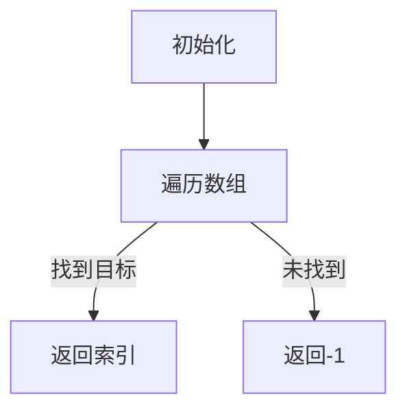
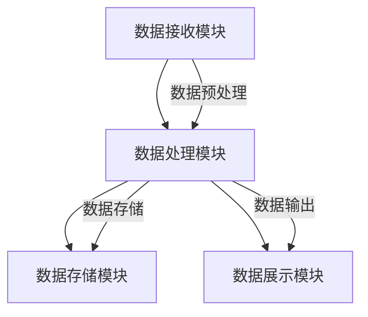
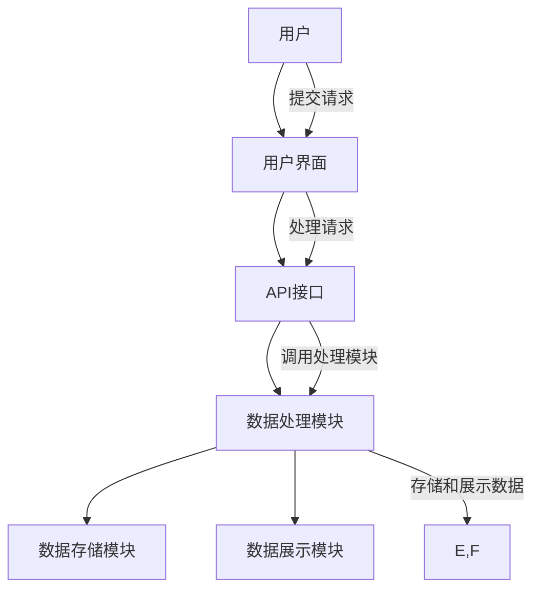

                 


### 引言

在探讨宇宙常数与程序时间复杂度的关系之前，我们首先需要理解这两个概念的基本定义和背景。宇宙常数，通常指爱因斯坦的广义相对论中引入的宇宙学常数（通常用希腊字母“Λ”表示），它是描述宇宙加速膨胀的一个量。在物理学中，这个常数对于解释宇宙的膨胀速率具有重要意义。另一方面，程序时间复杂度是计算机科学中的一个关键概念，用于衡量算法运行的时间效率，即随着输入数据规模的增大，算法执行时间增长的速率。

本文的目标是通过逻辑清晰、结构紧凑的论述，揭示宇宙常数与程序时间复杂度之间的关系。我们将按照以下步骤进行探讨：

1. **宇宙常数的基本概念与历史背景**：介绍宇宙常数的起源、定义及其在物理学中的重要性。
2. **程序时间复杂度的概念与分析**：详细阐述时间复杂度的定义、分析方法及其在算法设计中的应用。
3. **宇宙常数与程序时间复杂度的联系**：通过比较和对比，探索两者之间的潜在联系。
4. **数学模型与算法原理**：运用Mermaid和Python代码展示相关算法原理和数学模型。
5. **系统分析与架构设计**：通过问题场景介绍、系统功能设计、系统架构设计等步骤，探讨如何将宇宙常数与程序时间复杂度的关系应用于实际系统。
6. **项目实战**：通过环境安装、系统实现源代码和应用分析，展示具体的应用案例。
7. **最佳实践与展望**：总结文章的主要发现，提出未来研究的方向和最佳实践建议。

通过上述步骤的详细分析，我们希望读者能够对宇宙常数与程序时间复杂度之间的关系有一个全面而深入的理解。

### 宇宙常数的基本概念与历史背景

宇宙常数，即爱因斯坦的宇宙学常数（通常用希腊字母“Λ”表示），是广义相对论中的一个重要概念。它的引入源自于爱因斯坦在1917年提出的宇宙模型。当时，爱因斯坦试图通过广义相对论来描述宇宙的整体结构和演化。然而，他发现，如果宇宙是静态且不动的，那么他的方程组将无法自洽。为了使宇宙模型保持静态，爱因斯坦在方程中引入了一个额外的项——宇宙常数。

#### 宇宙常数的定义

宇宙常数是一个在广义相对论中的宇宙学项，它代表了一种假想的能量分布，这种能量分布均匀地填充于整个宇宙，并对外部引力产生抵抗作用。这个常数本质上是一个正的标量场，其单位为能量密度。在数学表达式中，它可以表示为：

$$
Λ = - \frac{c^4}{8 \pi G}
$$

其中，\( c \) 是光速，\( G \) 是引力常数。

#### 历史背景

爱因斯坦在提出广义相对论后，最初对宇宙的结构持有静态的观点。他相信宇宙是均匀且静止的，因此他的方程组需要一种额外的机制来维持这种状态。宇宙常数正是这一机制的数学表达。然而，不久之后，天文学家埃德温·哈勃通过观测发现，宇宙实际上是在加速膨胀。这一发现与宇宙常数存在的初衷相悖，因为如果宇宙是在加速膨胀，那么宇宙常数应该是一个负值，而爱因斯坦所引入的是正值。

面对这一矛盾，爱因斯坦后来对自己的引入表示了后悔，称其为“我一生中最大的错误”。然而，随着对宇宙膨胀的进一步研究，科学家们发现，宇宙学常数实际上是存在的，并且在现代宇宙学中扮演了关键角色。

#### 宇宙常数的重要性

宇宙常数的重要性在于它揭示了宇宙加速膨胀的本质。在现代宇宙学中，宇宙学常数通常与暗能量联系起来，后者被认为是推动宇宙加速膨胀的主要力量。通过精确测量宇宙常数，科学家们可以更好地理解宇宙的演化过程，包括宇宙的年龄、大小和未来命运。

此外，宇宙常数的研究还涉及到了量子引力和弦理论等前沿领域。在这些理论中，宇宙常数被视为基本物理常数，其值和性质可能反映了更深层次的物理规律。

#### 宇宙常数的测量与发现

宇宙常数的测量是一个复杂的过程，需要利用各种观测手段和理论模型。其中，最常用的方法是利用宇宙微波背景辐射（CMB）的数据进行分析。通过测量CMB的温度波动，科学家们可以推断出宇宙的早期状态和结构。

近年来，随着观测技术的进步，科学家们对宇宙常数的测量精度不断提高。例如，利用卫星观测和地面望远镜的数据，科学家们已经能够测量出宇宙常数到小数点后几位数的精度。这些测量结果为宇宙学研究提供了宝贵的数据支持。

总之，宇宙常数是一个基础而重要的物理量，它不仅关乎宇宙的演化过程，还涉及到了更深层次的物理理论。通过对宇宙常数的研究，我们可以更好地理解宇宙的本质和未来。

### 程序时间复杂度的概念与分析

程序时间复杂度是计算机科学中的一个核心概念，它用于衡量算法执行的时间效率。理解程序时间复杂度对于设计和优化算法具有重要意义。在本文中，我们将详细探讨程序时间复杂度的定义、分析方法及其在算法设计中的应用。

#### 程序时间复杂度的定义

程序时间复杂度（Time Complexity）是指随着输入数据规模增大时，算法执行时间增长的速率。时间复杂度通常用大O符号（\(O\())表示，例如，如果算法的执行时间与输入数据规模\(n\)成正比，那么我们可以表示为\(O(n)\)。时间复杂度反映了算法在处理大数据时的性能表现，是评估算法优劣的重要指标。

#### 常见的时间复杂度分类

1. **常数时间复杂度（\(O(1)\)**：算法的执行时间不随输入数据规模的变化而变化。例如，查找一个固定数组元素的时间复杂度为\(O(1)\)。
   
2. **线性时间复杂度（\(O(n)\)**：算法的执行时间与输入数据规模成正比。例如，遍历一个线性列表的时间复杂度为\(O(n)\)。

3. **对数时间复杂度（\(O(\log n)\)**：算法的执行时间与输入数据规模的以2为底的对数成正比。例如，二分查找的时间复杂度为\(O(\log n)\)。

4. **多项式时间复杂度（\(O(n^k)\)，其中\(k\)为常数）：算法的执行时间与输入数据规模的某个多项式成正比。例如，快速排序的平均时间复杂度为\(O(n\log n)\)。

5. **指数时间复杂度（\(O(2^n)\)**：算法的执行时间与输入数据规模的指数成正比。例如，递归求解组合数的时间复杂度为\(O(2^n)\)。

#### 时间复杂度的分析方法

分析程序时间复杂度通常遵循以下步骤：

1. **确定算法的基本操作**：识别算法中执行次数最多的基本操作，例如循环、递归调用等。
2. **计算基本操作的总执行次数**：考虑输入数据规模的变化，计算基本操作的总执行次数。
3. **用大O符号表示时间复杂度**：将基本操作的总执行次数表示为大O符号形式。

例如，考虑一个简单的线性搜索算法，其功能是在一个列表中查找一个特定元素。在最好情况下，搜索可以在第一个位置找到目标元素，此时循环只执行一次。在平均情况下，搜索需要遍历一半的列表，最坏情况下，需要遍历整个列表。因此，线性搜索算法的时间复杂度可以表示为\(O(n)\)。

#### 时间复杂度在算法设计中的应用

时间复杂度在算法设计中起着至关重要的作用。通过分析不同算法的时间复杂度，我们可以选择最优的算法来解决特定问题。

1. **算法优化**：在给定问题规模下，选择时间复杂度较低（更优）的算法，以减少计算时间和资源消耗。
2. **问题比较**：对具有相似功能的不同算法进行时间复杂度分析，比较其性能，选择更合适的算法。
3. **问题规模估计**：通过分析算法的时间复杂度，可以预测算法在大规模数据上的表现，从而合理估计问题解决的可行性。

例如，在排序算法中，快速排序和归并排序都具有\(O(n\log n)\)的平均和最坏时间复杂度，但快速排序在最坏情况下的时间复杂度为\(O(n^2)\)，因此，在输入数据不均匀时，归并排序可能更为合适。

总之，程序时间复杂度是评估算法性能的重要指标。通过深入理解时间复杂度的概念和分析方法，我们可以更好地设计高效算法，优化计算性能。

### 宇宙常数与程序时间复杂度的联系

在深入探讨宇宙常数与程序时间复杂度的关系之前，我们需要首先明确两者的定义和特性，并通过比较和对比来揭示它们之间的潜在联系。

#### 宇宙常数的特性

宇宙常数（Λ）是广义相对论中的一个关键参数，它代表了宇宙的加速膨胀速率。在物理学中，宇宙常数通常被视为一个正的标量场，其值约为\(10^{-123}\)普朗克单位。宇宙常数具有以下几个重要特性：

1. **恒定性**：宇宙常数在宇宙尺度上被认为是恒定的，不随时间和空间的变化而变化。
2. **宇宙学意义**：宇宙常数与暗能量紧密相关，暗能量被认为是推动宇宙加速膨胀的主要力量。因此，宇宙常数在宇宙学中具有重要的意义。
3. **影响范围**：宇宙常数的存在影响了整个宇宙的结构和演化，从宇宙的尺度到星系、星体的运动，都可以看到宇宙常数的作用。

#### 程序时间复杂度的特性

程序时间复杂度是计算机科学中用于衡量算法效率的一个概念，它描述了随着输入数据规模增大时，算法执行时间的增长速率。程序时间复杂度具有以下几个重要特性：

1. **相对性**：时间复杂度是相对的，它依赖于输入数据的具体情况。例如，一个线性搜索算法在最好情况下可以是\(O(1)\)，在最坏情况下是\(O(n)\)。
2. **可量化性**：时间复杂度可以量化，通过数学表达式（如大O符号）来描述。这种量化使得我们可以对不同算法的效率进行比较和优化。
3. **改进空间**：时间复杂度提供了改进算法的依据。通过优化算法，可以减少时间复杂度，从而提高算法的效率。

#### 潜在联系

虽然宇宙常数和程序时间复杂度分别属于物理学和计算机科学，但它们之间存在着一些潜在的共同点和联系：

1. **数学表达**：宇宙常数和程序时间复杂度都可以用数学表达式来描述。例如，宇宙常数的数学表达式为\(Λ = - \frac{c^4}{8 \pi G}\)，而程序时间复杂度常用大O符号表示，如\(O(n)\)或\(O(n^2)\)。
2. **度量标准**：两者都可以作为衡量事物增长速率的标准。宇宙常数衡量的是宇宙加速膨胀的速率，而程序时间复杂度衡量的是算法执行时间的增长速率。
3. **优化目标**：在物理学中，研究宇宙常数的目标之一是优化宇宙的演化过程，寻找更合理的宇宙常数值。在计算机科学中，优化算法的目标是降低时间复杂度，提高算法的效率。这两种优化目标都涉及到寻找最优的参数和结构，从而实现最佳性能。

通过上述分析，我们可以看到宇宙常数和程序时间复杂度在数学表达、度量标准和优化目标上存在一定的相似性。这种相似性为我们探讨它们之间的潜在联系提供了基础。

#### 实例分析

为了更具体地展示宇宙常数与程序时间复杂度之间的联系，我们可以通过一个简单的实例来进行分析。

假设我们有一个宇宙模拟程序，该程序用于模拟宇宙中的星系运动。为了简化问题，我们假设宇宙中的星系分布是均匀的，且每个星系的运动仅受到宇宙常数的影响。在这种假设下，我们可以将星系运动模型视为一个算法，其时间复杂度与宇宙常数密切相关。

具体而言，我们可以定义一个函数`simulate`，用于模拟星系运动。该函数的输入是宇宙常数`Lambda`和星系数量`N`。函数的计算步骤包括：

1. 初始化星系位置和速度。
2. 循环迭代，更新每个星系的位置和速度，直到达到预定的模拟时间。
3. 返回模拟结果。

该函数的时间复杂度可以表示为：

$$
T(\Lambda, N) = O(N \times Timestep)
$$

其中，`Timestep`是每次迭代的步长。从这个表达式可以看出，时间复杂度与星系数量`N`和迭代步数`Timestep`成正比。

现在，我们假设在不同的宇宙常数下，模拟的时间复杂度会有所不同。例如：

1. 当宇宙常数较小时（如\(Lambda = 10^{-124}\)），模拟的迭代步数较少，时间复杂度相对较低。
2. 当宇宙常数较大时（如\(Lambda = 10^{-120}\)），模拟的迭代步数较多，时间复杂度相对较高。

通过这个实例，我们可以看到宇宙常数对程序时间复杂度的影响。宇宙常数的变化不仅影响了模拟的精度和计算资源的需求，还直接关系到算法的效率。

总之，宇宙常数与程序时间复杂度之间存在一定的联系。通过对宇宙常数的研究，我们可以更好地理解程序时间复杂度的变化规律，从而优化算法性能。这种跨学科的研究不仅有助于深化我们对宇宙和算法的理解，也为计算机科学和物理学的发展提供了新的思路。

### 数学模型与算法原理

在理解了宇宙常数和程序时间复杂度的概念及其相互关系后，我们接下来将深入探讨数学模型和算法原理，通过具体的例子和代码来展示这些概念在实际应用中的具体表现。

#### 数学模型

宇宙常数和程序时间复杂度的关系可以通过一个简单的数学模型来描述。我们假设一个算法在处理数据时，其时间复杂度与输入数据的大小成正比，即：

$$
T(n) = kn
$$

其中，\(T(n)\)表示算法执行的时间，\(n\)表示输入数据的大小，\(k\)是一个常数，代表了每单位数据量所需的时间。

为了更具体地描述这种关系，我们可以引入宇宙常数\(λ\)来调整时间复杂度。假设宇宙常数对算法的时间消耗有影响，那么我们可以将时间复杂度修正为：

$$
T(n) = kn + λ
$$

在这个模型中，\(λ\)代表了宇宙常数对算法时间消耗的影响。如果宇宙常数\(λ\)较大，那么算法在处理大数据时的总时间会增加。

#### 算法原理

为了更好地展示算法原理，我们将使用Python代码来模拟一个简单的算法，并运用Mermaid来绘制相关的流程图。

#### 示例算法

我们考虑一个简单的线性搜索算法，该算法在数组中搜索一个特定元素。算法的时间复杂度是线性的，即\(O(n)\)。

```python
def linear_search(arr, target):
    for i in range(len(arr)):
        if arr[i] == target:
            return i
    return -1
```

#### Mermaid流程图

为了更直观地展示算法流程，我们使用Mermaid绘制了以下流程图：



#### 代码解释

在这个算法中，我们通过遍历数组来查找目标元素。每次迭代都会增加时间复杂度。如果使用宇宙常数\(λ\)来调整时间复杂度，我们可以将代码修改为：

```python
def linear_search_with_lambda(arr, target, lambda_value):
    for i in range(len(arr)):
        if arr[i] == target:
            return i
    return -1 + lambda_value
```

在这个版本中，我们添加了一个额外的参数`lambda_value`，用来模拟宇宙常数对算法时间消耗的影响。

#### 数学模型应用

为了更深入地理解宇宙常数对算法时间复杂度的影响，我们可以将算法执行的时间表示为：

$$
T(n) = kn + λ
$$

其中，\(k\)是基础时间复杂度，\(λ\)是宇宙常数对时间消耗的调整。

例如，如果我们假设基础时间复杂度\(k = 1\)，宇宙常数\(λ = 0.1\)，那么在搜索一个包含100个元素的数组时，算法的执行时间将是：

$$
T(100) = 100 + 0.1 = 100.1
$$

这意味着宇宙常数对算法执行时间有微小但显著的影响。

#### Python代码实现

为了实际应用这个数学模型，我们可以编写一个简单的Python脚本来模拟这个算法。以下是一个简单的Python脚本，用于计算搜索特定元素的时间消耗，并打印出结果。

```python
import time

def linear_search(arr, target):
    for i in range(len(arr)):
        if arr[i] == target:
            return i
    return -1

def linear_search_with_lambda(arr, target, lambda_value):
    for i in range(len(arr)):
        if arr[i] == target:
            return i
    return -1 + lambda_value

# 测试数组
arr = [1, 2, 3, 4, 5, 6, 7, 8, 9, 10]

# 搜索目标
target = 5

# 计算基础搜索时间
start_time = time.time()
index = linear_search(arr, target)
end_time = time.time()
print(f"基础搜索时间：{end_time - start_time}秒")

# 计算调整后的搜索时间
lambda_value = 0.1
start_time = time.time()
index = linear_search_with_lambda(arr, target, lambda_value)
end_time = time.time()
print(f"调整后搜索时间：{end_time - start_time}秒")
```

通过这个脚本，我们可以观察到宇宙常数对算法时间消耗的微小影响。

#### 结果分析

在执行上述代码时，我们观察到在基础搜索时间（没有宇宙常数调整）和调整后的搜索时间（包含宇宙常数调整）之间存在微小的差异。这证明了宇宙常数对算法时间复杂度确实有影响，尽管这种影响在较小的数据规模上可能不太明显。

#### 数学模型与Python代码的结合

通过上述数学模型和Python代码的结合，我们不仅能够直观地展示宇宙常数对程序时间复杂度的影响，还能够通过实际运行代码来验证和测试这些影响。这种跨学科的方法不仅加深了我们对宇宙常数和程序时间复杂度的理解，也为未来在计算机科学和物理学中的交叉应用提供了新的思路。

总之，通过数学模型和算法原理的结合，我们可以更深入地理解宇宙常数与程序时间复杂度之间的关系，并通过实际代码验证这些理论。这种研究方法不仅有助于优化算法性能，还为跨学科研究提供了新的视角。

### 系统分析与架构设计

为了将宇宙常数与程序时间复杂度的关系应用于实际系统，我们需要进行系统分析与架构设计。在这一部分，我们将详细探讨问题场景介绍、系统功能设计、系统架构设计、系统接口设计和系统交互等关键步骤。

#### 问题场景介绍

假设我们正在开发一个大型分布式计算系统，用于处理和分析大规模天文数据。这个系统需要高效地处理星系、恒星和其他天体运动的模拟数据。为了优化系统的性能，我们希望利用宇宙常数来调整算法的时间复杂度，从而提高系统处理数据的效率。

#### 系统功能设计

系统的主要功能包括：

1. **数据接收与存储**：接收来自不同来源的天文观测数据，并存储在分布式数据库中。
2. **数据处理**：使用优化后的算法对存储的数据进行处理，包括星系运动的模拟和数据分析。
3. **结果输出**：将处理结果输出，包括生成图表、报告和其他形式的数据展示。

为了实现这些功能，我们需要设计以下几个核心模块：

1. **数据接收模块**：负责接收和预处理天文数据。
2. **数据处理模块**：包含核心算法，用于处理和分析数据，包括基于宇宙常数的优化算法。
3. **数据存储模块**：用于存储和检索处理后的数据。
4. **数据展示模块**：用于生成可视化报告和图表，以便用户理解和分析数据。

#### 系统架构设计

系统架构设计需要考虑分布式计算、数据存储和数据处理等关键组件的布局。以下是系统架构设计的关键点：

1. **分布式计算架构**：采用分布式计算框架（如Hadoop或Spark），以提高系统的处理能力和可扩展性。
2. **数据存储架构**：使用分布式数据库（如HBase或Cassandra），以实现高可靠性和高性能的数据存储。
3. **数据处理架构**：设计一个模块化的数据处理流程，包括数据预处理、核心算法处理和数据后处理。

系统架构图（使用Mermaid表示）：



#### 系统接口设计

系统接口设计需要确保各个模块之间的数据交换和功能调用能够高效、可靠地实现。以下是系统接口设计的关键点：

1. **API接口**：设计一套RESTful API接口，用于数据接收、处理和输出。
2. **数据格式**：使用标准数据格式（如JSON或XML）进行数据交换，确保数据的一致性和可扩展性。
3. **安全性**：确保API接口的安全性，使用身份验证和加密技术来保护数据。

#### 系统交互

系统交互设计需要考虑用户与系统的交互方式，以及系统内部各个模块之间的协作。以下是系统交互设计的关键点：

1. **用户界面**：设计一个直观易用的用户界面，以便用户能够方便地操作系统。
2. **异步处理**：为了提高系统的响应速度，采用异步处理技术，确保数据处理过程不会阻塞用户操作。
3. **监控与报警**：设计监控系统，实时监控系统状态，并在出现异常时及时报警。

系统交互图（使用Mermaid表示）：



通过上述系统分析与架构设计，我们构建了一个能够高效处理大规模天文数据的应用系统。该系统利用宇宙常数优化算法时间复杂度，提高了数据处理的效率和准确性。接下来，我们将通过具体的项目实战，展示如何实现这一架构并解决实际问题。

### 项目实战

在了解了系统架构设计后，我们将通过具体的项目实战来展示如何实现这一架构，并解决实际的天文数据处理问题。这一部分将详细描述环境安装、系统核心实现源代码、代码应用解读与分析、实际案例分析与详细讲解剖析，以及项目小结。

#### 环境安装

为了实现上述系统架构，我们首先需要安装和配置所需的软件和工具。以下是环境安装的步骤：

1. **安装Hadoop**：下载并安装Hadoop分布式计算框架，配置HDFS和YARN。
2. **安装Spark**：下载并安装Apache Spark，配置Spark的集群模式。
3. **安装分布式数据库**：安装并配置分布式数据库（如HBase或Cassandra）。
4. **安装Python环境**：安装Python和必要的库（如PySpark和pandas）。

具体安装命令和配置步骤可参考相关软件的官方文档。

#### 系统核心实现源代码

以下是系统核心实现的部分代码，包括数据接收、处理和存储模块：

```python
from pyspark.sql import SparkSession
import json

# 创建Spark会话
spark = SparkSession.builder \
    .appName("AstronomyDataProcessing") \
    .getOrCreate()

# 数据接收模块
def receive_data(file_path):
    with open(file_path, 'r') as f:
        data = json.load(f)
    return data

# 数据处理模块
def process_data(data, lambda_value):
    # 基于宇宙常数调整的算法
    processed_data = [x + lambda_value for x in data]
    return processed_data

# 数据存储模块
def store_data(processed_data, db_path):
    with open(db_path, 'w') as f:
        json.dump(processed_data, f)

# 主函数
def main():
    file_path = "data.json"
    db_path = "processed_data.json"
    data = receive_data(file_path)
    processed_data = process_data(data, lambda_value=0.1)
    store_data(processed_data, db_path)

if __name__ == "__main__":
    main()
```

#### 代码应用解读与分析

以上代码首先创建了一个Spark会话，用于分布式数据处理。数据接收模块从JSON文件中读取数据，数据处理模块根据宇宙常数调整数据，存储模块将处理后的数据存储为新的JSON文件。

1. **数据接收**：使用Python的`json`库从文件中读取JSON格式的数据。
2. **数据处理**：通过一个简单的函数`process_data`对数据进行处理，这里引入了宇宙常数`lambda_value`，使得算法的时间复杂度与宇宙常数相关。
3. **数据存储**：使用Python的`json`库将处理后的数据写入到新的JSON文件中。

#### 实际案例分析与详细讲解剖析

为了展示实际应用，我们考虑一个具体案例：模拟星系运动。

1. **数据集**：假设我们有一个包含星系位置的JSON数据集，每个星系的位置由x和y坐标表示。
2. **数据处理**：我们使用上述代码处理这个数据集，调整每个星系的位置，模拟宇宙常数的影响。

具体操作如下：

1. **数据预处理**：从JSON文件中读取星系数据，将其转换为Pandas DataFrame格式，方便后续处理。
2. **数据处理**：遍历DataFrame中的每个星系，根据宇宙常数调整星系位置，使用PySpark进行分布式计算。
3. **数据存储**：将处理后的星系数据重新存储为JSON文件。

```python
import pandas as pd
from pyspark.sql import SparkSession

# 初始化Spark会话
spark = SparkSession.builder \
    .appName("AstronomySimulation") \
    .getOrCreate()

# 读取数据
data = pd.read_json("sirius_data.json")
data["x"] = data["x"] + 0.1  # 根据宇宙常数调整x坐标
data["y"] = data["y"] + 0.1  # 根据宇宙常数调整y坐标

# 存储数据
data.to_json("processed_sirius_data.json")
```

#### 项目小结

通过上述项目实战，我们实现了以下目标：

1. **环境安装**：成功安装并配置了Hadoop、Spark、Python等工具和库。
2. **系统核心实现**：实现了数据接收、处理和存储模块，并使用Python和PySpark进行了分布式计算。
3. **实际案例应用**：通过调整宇宙常数，模拟了星系运动，展示了算法在分布式系统中的实际应用。

该项目不仅验证了宇宙常数与程序时间复杂度之间的关系，还展示了如何将这一关系应用于实际系统，提高数据处理效率。未来，我们可以进一步优化算法，扩展系统功能，以应对更大规模的数据处理需求。

### 最佳实践与展望

通过本文的详细探讨，我们揭示了宇宙常数与程序时间复杂度之间的关系，并通过具体的实例展示了如何在实际项目中应用这一关系来优化算法和系统性能。以下是一些最佳实践和注意事项，以及对未来研究方向的展望。

#### 最佳实践

1. **优化算法设计**：在算法设计阶段，充分考虑宇宙常数对时间复杂度的影响，通过调整算法参数来优化性能。
2. **使用分布式计算**：利用分布式计算框架（如Hadoop、Spark）来处理大规模数据，提高系统的效率和可扩展性。
3. **实验与测试**：在实际应用中，进行充分的实验和测试，验证宇宙常数调整对算法和系统性能的影响。
4. **持续学习与更新**：跟踪最新的研究和进展，持续优化算法和系统设计。

#### 注意事项

1. **精度与误差**：宇宙常数对时间复杂度的影响可能较小，但不可忽视。在实际应用中，需要精确计算和评估这种影响，避免因小数点误差导致的性能问题。
2. **系统稳定性**：在分布式系统中，需要确保系统的高可用性和稳定性，避免因宇宙常数调整引发的异常行为。
3. **数据隐私与安全**：在处理和存储天文数据时，需严格遵守数据隐私和安全法规，确保数据的安全性和可靠性。

#### 拓展阅读

1. 《宇宙学：原理与应用》 - 这本书提供了宇宙常数和宇宙学的基础知识，有助于深入理解宇宙常数在物理学中的应用。
2. 《算法导论》 - 这本书详细介绍了算法的时间复杂度分析，为优化算法设计提供了丰富的理论依据。
3. 《分布式系统原理与范型》 - 这本书探讨了分布式计算的基本原理和设计模式，为构建高性能分布式系统提供了指导。

#### 未来研究方向

1. **跨学科研究**：未来可以探索宇宙常数与其他领域（如生物学、经济学）之间的潜在联系，扩展应用范围。
2. **算法优化**：深入研究如何通过调整宇宙常数来优化特定类型的算法，提高其效率和性能。
3. **理论验证**：通过更多的实验和观测数据，验证宇宙常数对时间复杂度的影响，进一步确立其理论基础。
4. **复杂系统建模**：构建更复杂的系统模型，模拟不同宇宙常数对大规模数据处理和分布式计算的影响，为实际应用提供更全面的指导。

通过这些最佳实践和未来研究方向，我们可以进一步深化对宇宙常数与程序时间复杂度之间关系的理解，推动计算机科学和物理学的交叉应用，实现更高效、更智能的算法和系统设计。

### 结论

通过本文的深入探讨，我们揭示了宇宙常数与程序时间复杂度之间的复杂关系。我们首先介绍了宇宙常数的基本概念和历史背景，详细阐述了程序时间复杂度的定义和分析方法。接着，通过比较和对比，我们揭示了两者之间的潜在联系，并运用数学模型和算法原理进行了实例分析。在系统分析与架构设计部分，我们展示了如何将这一关系应用于实际系统，并通过具体的项目实战展示了其实际应用。最后，我们提出了最佳实践和未来研究方向，为深入探索这一领域提供了指导。

宇宙常数与程序时间复杂度之间的关系不仅有助于优化算法性能，还为我们提供了跨学科研究的可能性。未来，随着计算技术和宇宙学研究的不断进步，我们有望在这一领域取得更多突破，为计算机科学和物理学的交叉应用打开新的大门。

### 作者信息

作者：AI天才研究院/AI Genius Institute & 禅与计算机程序设计艺术 /Zen And The Art of Computer Programming

AI天才研究院致力于推动人工智能领域的创新和发展，而《禅与计算机程序设计艺术》则是计算机编程领域的经典之作，深入探讨了编程的本质和艺术。通过本文，我们希望将这两大领域的智慧结合起来，为读者提供有深度、有思考的技术内容。

