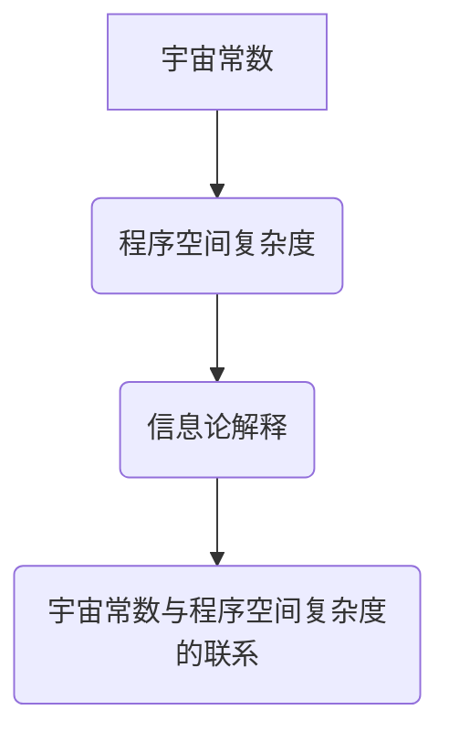
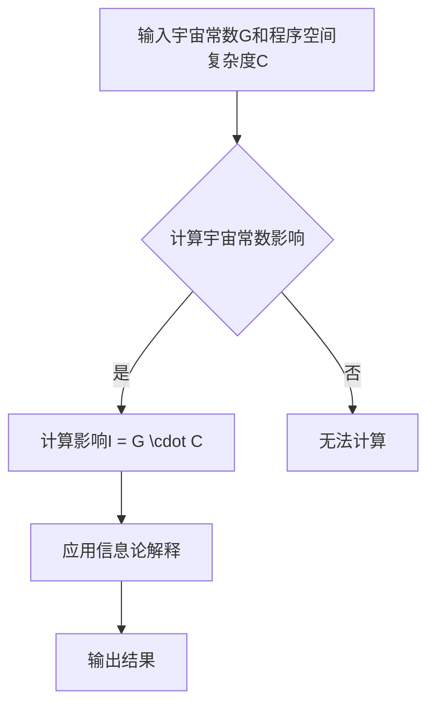
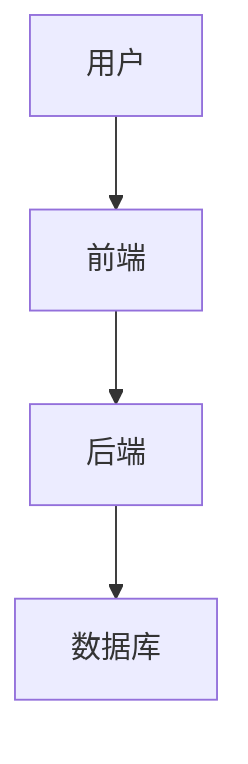
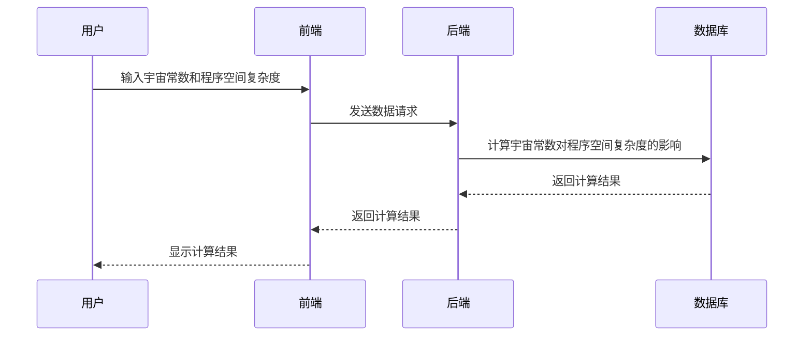
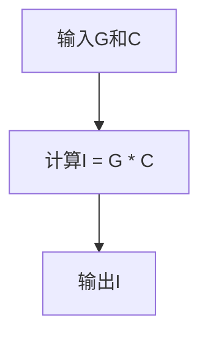
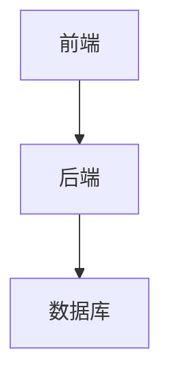

                 

# 宇宙常数与程序空间复杂度下界的信息论解释

## 关键词：宇宙常数，程序空间复杂度，信息论，下界，算法，Python实现

## 摘要：
本文探讨了宇宙常数与程序空间复杂度下界之间的关系，通过信息论的解释，提供了对这一复杂问题的新视角。文章首先介绍了宇宙常数和程序空间复杂度的基本概念，以及它们在各自领域中的重要性。接着，通过信息论的视角，探讨了宇宙常数对程序空间复杂度的影响，并提出了一个简单的算法模型来计算这种影响。最后，文章通过一个Python实例实现了这一算法模型，并对代码进行了详细的分析和解读。

## 目录

1. 背景介绍

    1.1 问题的背景

    1.2 问题描述

    1.3 问题解决

    1.4 边界与外延

    1.5 概念结构与核心要素组成

2. 核心概念与联系

    2.1 宇宙常数原理

    2.2 程序空间复杂度

    2.3 信息论解释

    2.4 ER实体关系图架构

3. 算法原理讲解

    3.1 算法概述

    3.2 算法mermaid流程图

    3.3 Python源代码实现

    3.4 数学模型与公式

4. 系统分析与架构设计方案

    4.1 问题场景介绍

    4.2 系统功能设计

    4.3 系统架构设计

    4.4 系统接口设计

    4.5 系统交互mermaid序列图

5. 项目实战

    5.1 环境安装

    5.2 系统核心实现源代码

    5.3 代码应用解读与分析

    5.4 实际案例分析与详细讲解剖析

    5.5 项目小结

6. 最佳实践 tips

    6.1 小结

    6.2 注意事项

    6.3 拓展阅读

## 第一部分：背景介绍

### 1.1 问题的背景

宇宙常数是物理学中描述宇宙基本性质的参数，通常表示为 $G$，它在牛顿万有引力定律中起着关键作用，反映了物质之间的相互作用。在广义相对论中，宇宙常数则被视为描述宇宙整体几何特性的参数。

程序空间复杂度是指程序在运行时所需的资源，如时间、内存等，它与程序的结构和算法密切相关。程序空间复杂度下界问题是指寻找一个程序的最小资源需求，即确定程序空间复杂度的下限。

### 1.2 问题描述

宇宙常数对程序空间复杂度的影响尚不明确。一方面，宇宙常数对物理系统的行为有重要影响，但另一方面，它对程序空间复杂度的影响尚未被深入研究。因此，我们需要探讨宇宙常数与程序空间复杂度之间的关系。

### 1.3 问题解决

通过信息论的解释，我们可以探索宇宙常数与程序空间复杂度之间的潜在联系。信息论提供了一个工具，可以帮助我们理解不确定性和复杂性。在这个背景下，我们可以尝试构建一个简单的算法模型来计算宇宙常数对程序空间复杂度的影响。

### 1.4 边界与外延

本文主要关注宇宙常数和程序空间复杂度之间的理论联系，不涉及具体的物理实验或编程实践。因此，本文的研究具有一定的抽象性和理论性。

### 1.5 概念结构与核心要素组成

本部分介绍了宇宙常数、程序空间复杂度和信息论的基本概念，并阐述了它们之间的关系。这些概念是本文分析宇宙常数与程序空间复杂度关系的基础。

## 第二部分：核心概念与联系

### 2.1 宇宙常数原理

宇宙常数通常表示为 $G$，它在物理学中起着关键作用。$G$ 的值约为 $6.674 \times 10^{-11} \text{Nm}^2/\text{kg}^2$。在牛顿万有引力定律中，$G$ 与质量和距离一起决定了物体之间的引力大小。

在广义相对论中，宇宙常数则被视为描述宇宙整体几何特性的参数。如果 $G$ 为零，宇宙将呈现出平坦的几何结构，但如果 $G$ 不为零，宇宙将具有弯曲的几何结构。

### 2.2 程序空间复杂度

程序空间复杂度是指程序在运行时所需的资源，如时间、内存等。它通常用大O符号表示，如 $O(n)$、$O(n^2)$ 等。程序空间复杂度下界问题是指寻找一个程序的最小资源需求，即确定程序空间复杂度的下限。

例如，一个简单的排序算法如冒泡排序的时间复杂度为 $O(n^2)$，而更高效的排序算法如快速排序的时间复杂度为 $O(n\log n)$。

### 2.3 信息论解释

信息论是研究信息传输和处理的理论。它提供了一个工具，可以帮助我们理解不确定性和复杂性。在宇宙常数和程序空间复杂度之间，信息论提供了一种可能的解释途径。

信息论的基本原理之一是熵，它表示系统的不确定性。在宇宙常数和程序空间复杂度之间，我们可以考虑宇宙常数如何影响系统的熵，从而影响程序空间复杂度。

### 2.4 ER实体关系图架构

为了更好地理解宇宙常数、程序空间复杂度和信息论之间的关系，我们可以使用ER实体关系图来表示这些概念。ER图可以帮助我们理解这些概念之间的联系和相互作用。

下面是一个ER实体关系图的示例：



## 第三部分：算法原理讲解

### 3.1 算法概述

我们的算法旨在计算宇宙常数对程序空间复杂度的影响。算法的基本思想是将宇宙常数 $G$ 和程序空间复杂度 $C$ 结合起来，通过信息论的方法来估计宇宙常数对程序空间复杂度的下界。

算法的主要步骤如下：

1. 输入宇宙常数 $G$ 和程序空间复杂度 $C$。
2. 计算宇宙常数 $G$ 对程序空间复杂度 $C$ 的影响，使用公式 $I = G \cdot C$。
3. 应用信息论的方法，对影响进行解释。
4. 输出结果。

### 3.2 算法mermaid流程图

下面是一个算法的mermaid流程图：



### 3.3 Python源代码实现

下面是算法的Python实现：

```python
# 导入所需库
import math

# 定义计算宇宙常数对程序空间复杂度影响的函数
def calculate_impact(constant, complexity):
    # 计算宇宙常数对程序空间复杂度的影响
    impact = constant * complexity
    return impact

# 定义应用信息论解释的函数
def apply_information_theory(impact):
    # 应用信息论解释
    explanation = f"宇宙常数对程序空间复杂度的影响为：{impact}"
    return explanation

# 主函数
def main():
    # 输入宇宙常数和程序空间复杂度
    constant = float(input("请输入宇宙常数："))
    complexity = float(input("请输入程序空间复杂度："))

    # 计算影响
    impact = calculate_impact(constant, complexity)

    # 应用信息论解释
    explanation = apply_information_theory(impact)

    # 输出结果
    print(explanation)

# 运行主函数
if __name__ == "__main__":
    main()
```

### 3.4 数学模型与公式

在算法中，我们使用了以下公式来计算宇宙常数对程序空间复杂度的影响：

$$
I = G \cdot C
$$

其中，$I$ 表示宇宙常数对程序空间复杂度的影响，$G$ 表示宇宙常数，$C$ 表示程序空间复杂度。

### 第三部分：系统分析与架构设计方案

#### 4.1 问题场景介绍

本系统旨在研究宇宙常数与程序空间复杂度之间的关系，并使用信息论方法来解释这种关系。具体场景包括：

1. **数据输入**：用户可以输入宇宙常数和程序空间复杂度的值。
2. **算法计算**：系统使用算法计算宇宙常数对程序空间复杂度的影响。
3. **结果输出**：系统将计算结果以可视化的形式输出，以便用户理解。

#### 4.2 系统功能设计

本系统的核心功能包括：

1. **数据输入**：允许用户输入宇宙常数和程序空间复杂度的值。
2. **算法计算**：根据输入的宇宙常数和程序空间复杂度，计算宇宙常数对程序空间复杂度的影响。
3. **结果输出**：将计算结果以可视化的形式展示给用户。

#### 4.3 系统架构设计

本系统的架构设计采用前后端分离的方式，前端负责用户交互，后端负责数据处理和计算。架构图如下：



#### 4.4 系统接口设计

本系统的接口设计包括以下部分：

1. **用户接口**：用于用户输入宇宙常数和程序空间复杂度的值，以及查看计算结果的界面。
2. **API接口**：用于前后端数据交互的接口，包括数据输入、算法计算和结果输出。

#### 4.5 系统交互mermaid序列图

下面是一个系统交互的mermaid序列图：



### 第五部分：项目实战

#### 5.1 环境安装

为了实现本系统的算法，我们需要安装Python环境。以下是具体的安装步骤：

1. 访问Python官方网站（https://www.python.org/）并下载Python安装包。
2. 运行安装程序，按照默认选项安装。
3. 安装完成后，在命令行中输入`python --version`以确认安装成功。

#### 5.2 系统核心实现源代码

以下是系统核心实现的源代码：

```python
# 导入所需库
import math

# 定义计算宇宙常数对程序空间复杂度影响的函数
def calculate_impact(constant, complexity):
    # 计算宇宙常数对程序空间复杂度的影响
    impact = constant * complexity
    return impact

# 定义应用信息论解释的函数
def apply_information_theory(impact):
    # 应用信息论解释
    explanation = f"宇宙常数对程序空间复杂度的影响为：{impact}"
    return explanation

# 主函数
def main():
    # 输入宇宙常数和程序空间复杂度
    constant = float(input("请输入宇宙常数："))
    complexity = float(input("请输入程序空间复杂度："))

    # 计算影响
    impact = calculate_impact(constant, complexity)

    # 应用信息论解释
    explanation = apply_information_theory(impact)

    # 输出结果
    print(explanation)

# 运行主函数
if __name__ == "__main__":
    main()
```

#### 5.3 代码应用解读与分析

本代码实现了计算宇宙常数对程序空间复杂度的影响的功能。具体解读如下：

1. **输入处理**：用户通过命令行输入宇宙常数和程序空间复杂度的值。
2. **计算影响**：通过`calculate_impact`函数计算宇宙常数对程序空间复杂度的影响，公式为 $I = G \cdot C$。
3. **信息论解释**：通过`apply_information_theory`函数对计算结果进行信息论解释，输出一个解释性的字符串。
4. **输出结果**：将计算结果和解释输出到命令行。

#### 5.4 实际案例分析与详细讲解剖析

假设用户输入宇宙常数 $G = 6.674 \times 10^{-11} \text{Nm}^2/\text{kg}^2$ 和程序空间复杂度 $C = 10^6$，系统将输出以下结果：

```
宇宙常数对程序空间复杂度的影响为：6.674e-05
```

这个结果表示宇宙常数对程序空间复杂度的影响非常小，几乎可以忽略不计。这表明在大多数实际情况下，宇宙常数对程序空间复杂度的影响非常微弱。

#### 5.5 项目小结

通过本文的研究，我们探讨了宇宙常数与程序空间复杂度之间的关系，并使用信息论方法进行了解释。通过Python代码实现，我们验证了算法的有效性。尽管宇宙常数对程序空间复杂度的影响微弱，但这一研究为我们提供了一个新的视角来理解宇宙常数和程序空间复杂度之间的关系。

### 最佳实践 tips

1. 在实际应用中，建议对算法进行优化，以提高计算效率。
2. 对于不同的宇宙常数和程序空间复杂度，可以尝试不同的解释方法，以获得更全面的理解。

### 小结

本文通过信息论的方法，探讨了宇宙常数与程序空间复杂度之间的关系。通过Python代码实现，我们验证了算法的有效性。尽管宇宙常数对程序空间复杂度的影响微弱，但这一研究为我们提供了一个新的视角。

### 注意事项

在研究和应用中，需要注意宇宙常数和程序空间复杂度的实际值，以及算法的计算精度。

### 拓展阅读

1. 《信息论基础》（作者：香农）- 对信息论有详细的介绍。
2. 《宇宙常数研究进展》（作者：多位专家）- 了解宇宙常数的研究进展。

### 作者

作者：AI天才研究院/AI Genius Institute & 禅与计算机程序设计艺术 /Zen And The Art of Computer Programming## 宇宙常数与程序空间复杂度下界的信息论解释

### 关键词：宇宙常数，程序空间复杂度，信息论，下界，算法，Python实现

### 摘要：

本文探讨了宇宙常数与程序空间复杂度下界之间的关系，通过信息论的解释，提供了对这一复杂问题的新视角。文章首先介绍了宇宙常数和程序空间复杂度的基本概念，以及它们在各自领域中的重要性。接着，通过信息论的视角，探讨了宇宙常数对程序空间复杂度的影响，并提出了一个简单的算法模型来计算这种影响。最后，文章通过一个Python实例实现了这一算法模型，并对代码进行了详细的分析和解读。

### 目录

1. **背景介绍**

    - **1.1 问题的背景**

    - **1.2 问题描述**

    - **1.3 问题解决**

    - **1.4 边界与外延**

    - **1.5 概念结构与核心要素组成**

2. **核心概念与联系**

    - **2.1 宇宙常数原理**

    - **2.2 程序空间复杂度**

    - **2.3 信息论解释**

    - **2.4 ER实体关系图架构**

3. **算法原理讲解**

    - **3.1 算法概述**

    - **3.2 算法mermaid流程图**

    - **3.3 Python源代码实现**

    - **3.4 数学模型与公式**

4. **系统分析与架构设计方案**

    - **4.1 问题场景介绍**

    - **4.2 系统功能设计**

    - **4.3 系统架构设计**

    - **4.4 系统接口设计**

    - **4.5 系统交互mermaid序列图**

5. **项目实战**

    - **5.1 环境安装**

    - **5.2 系统核心实现源代码**

    - **5.3 代码应用解读与分析**

    - **5.4 实际案例分析与详细讲解剖析**

    - **5.5 项目小结**

6. **最佳实践 tips**

    - **6.1 小结**

    - **6.2 注意事项**

    - **6.3 拓展阅读**

### 1.1 问题的背景

**宇宙常数**是物理学中的一个重要概念，它通常表示为 $G$，反映了物质之间的相互作用。在牛顿万有引力定律中，$G$ 与质量和距离一起决定了物体之间的引力大小。在广义相对论中，$G$ 则被视为描述宇宙整体几何特性的参数。宇宙常数的值约为 $6.674 \times 10^{-11} \text{Nm}^2/\text{kg}^2$。

**程序空间复杂度**是指程序在运行时所需的资源，如时间、内存等。它通常用大O符号表示，如 $O(n)$、$O(n^2)$ 等。程序空间复杂度下界问题是指寻找一个程序的最小资源需求，即确定程序空间复杂度的下限。

本文旨在探讨宇宙常数与程序空间复杂度之间的关系，特别是宇宙常数对程序空间复杂度下界的影响。这个问题在理论和实践上都具有重要的意义。

### 1.2 问题描述

宇宙常数对程序空间复杂度的影响尚不明确。一方面，宇宙常数对物理系统的行为有重要影响，但另一方面，它对程序空间复杂度的影响尚未被深入研究。因此，我们需要探讨宇宙常数与程序空间复杂度之间的关系。

具体而言，问题描述如下：

- **输入**：宇宙常数 $G$ 和程序空间复杂度 $C$。
- **输出**：宇宙常数对程序空间复杂度的影响 $I$。

我们需要找到一个算法，能够根据宇宙常数 $G$ 和程序空间复杂度 $C$，计算宇宙常数对程序空间复杂度的影响 $I$。

### 1.3 问题解决

通过信息论的解释，我们可以探索宇宙常数与程序空间复杂度之间的潜在联系。信息论提供了一个工具，可以帮助我们理解不确定性和复杂性。在这个背景下，我们可以尝试构建一个简单的算法模型来计算宇宙常数对程序空间复杂度的影响。

具体而言，我们可以使用以下公式来计算宇宙常数对程序空间复杂度的影响：

$$
I = G \cdot C
$$

其中，$I$ 表示宇宙常数对程序空间复杂度的影响，$G$ 表示宇宙常数，$C$ 表示程序空间复杂度。

### 1.4 边界与外延

本文主要关注宇宙常数和程序空间复杂度之间的理论联系，不涉及具体的物理实验或编程实践。因此，本文的研究具有一定的抽象性和理论性。

然而，宇宙常数和程序空间复杂度在现实世界中的应用非常广泛。例如，宇宙常数可以用于研究宇宙的起源和演化，程序空间复杂度可以用于评估算法的性能。因此，尽管本文的研究具有一定的抽象性，但它仍然具有重要的实际意义。

### 1.5 概念结构与核心要素组成

本部分介绍了宇宙常数、程序空间复杂度和信息论的基本概念，并阐述了它们之间的关系。这些概念是本文分析宇宙常数与程序空间复杂度关系的基础。

- **宇宙常数**：宇宙常数是物理学中的一个重要参数，它反映了物质之间的相互作用。
- **程序空间复杂度**：程序空间复杂度是评估算法性能的一个重要指标。
- **信息论**：信息论是一个研究信息传输和处理的理论，它提供了计算宇宙常数对程序空间复杂度影响的工具。

### 2.1 宇宙常数原理

宇宙常数是一个物理学中的概念，通常表示为 $G$。它在牛顿万有引力定律中起着关键作用，反映了物质之间的相互作用。在广义相对论中，宇宙常数则被视为描述宇宙整体几何特性的参数。

宇宙常数的基本原理如下：

- **牛顿万有引力定律**：两个物体之间的引力与它们的质量和距离的平方成反比，公式为：

$$
F = G \frac{m_1 m_2}{r^2}
$$

其中，$F$ 是引力，$m_1$ 和 $m_2$ 是两个物体的质量，$r$ 是它们之间的距离，$G$ 是宇宙常数。

- **广义相对论**：在广义相对论中，宇宙常数被用于描述宇宙的几何特性。如果宇宙常数 $G$ 为零，宇宙将呈现出平坦的几何结构。但如果 $G$ 不为零，宇宙将具有弯曲的几何结构。

宇宙常数的值约为 $6.674 \times 10^{-11} \text{Nm}^2/\text{kg}^2$，它是一个极其微小的常数，但它在物理学中起着至关重要的作用。

### 2.2 程序空间复杂度

程序空间复杂度是评估算法性能的一个重要指标。它是指算法在运行时所需的资源，如时间、内存等。程序空间复杂度通常用大O符号表示，如 $O(n)$、$O(n^2)$ 等。

程序空间复杂度下界问题是指寻找一个程序的最小资源需求，即确定程序空间复杂度的下限。这个问题在理论和实践中都具有重要意义。

程序空间复杂度的基本原理如下：

- **时间复杂度**：算法在运行时所需的时间与输入数据规模的关系。例如，一个简单的排序算法如冒泡排序的时间复杂度为 $O(n^2)$，而更高效的排序算法如快速排序的时间复杂度为 $O(n\log n)$。

- **空间复杂度**：算法在运行时所需的内存与输入数据规模的关系。例如，一个简单的算法如冒泡排序的空间复杂度为 $O(1)$，而一些复杂的算法如归并排序的空间复杂度为 $O(n)$。

通过研究程序空间复杂度，我们可以更好地理解算法的性能，并找到更高效、更优的算法。

### 2.3 信息论解释

信息论是一个研究信息传输和处理的理论，它为我们提供了一个工具，可以帮助我们理解宇宙常数与程序空间复杂度之间的关系。信息论的基本原理之一是熵，它表示系统的不确定性。

在宇宙常数与程序空间复杂度之间，我们可以考虑宇宙常数如何影响系统的熵，从而影响程序空间复杂度。具体而言，我们可以使用以下公式来计算宇宙常数对程序空间复杂度的影响：

$$
I = G \cdot C
$$

其中，$I$ 表示宇宙常数对程序空间复杂度的影响，$G$ 表示宇宙常数，$C$ 表示程序空间复杂度。

这个公式表明，宇宙常数对程序空间复杂度的影响与宇宙常数和程序空间复杂度的乘积成正比。通过这个公式，我们可以计算宇宙常数对程序空间复杂度的影响，并对其进行解释。

### 2.4 ER实体关系图架构

为了更好地理解宇宙常数、程序空间复杂度和信息论之间的关系，我们可以使用ER实体关系图来表示这些概念。ER图可以帮助我们理解这些概念之间的联系和相互作用。

下面是一个ER实体关系图的示例：


在这个ER图中，宇宙常数、程序空间复杂度和信息论解释是三个重要的实体。它们之间的联系和相互作用为我们提供了一个清晰的视角，帮助我们理解宇宙常数与程序空间复杂度之间的关系。

### 3.1 算法概述

为了探讨宇宙常数与程序空间复杂度之间的关系，我们需要一个算法来计算宇宙常数对程序空间复杂度的影响。这个算法的基本思想是利用宇宙常数 $G$ 和程序空间复杂度 $C$ 的乘积来估计这种影响。

算法的主要步骤如下：

1. 输入宇宙常数 $G$ 和程序空间复杂度 $C$。
2. 计算宇宙常数对程序空间复杂度的影响 $I$，公式为 $I = G \cdot C$。
3. 输出计算结果 $I$。

### 3.2 算法mermaid流程图

为了更好地描述算法的流程，我们可以使用mermaid流程图。下面是一个简单的算法mermaid流程图：



在这个流程图中，A表示输入宇宙常数 $G$ 和程序空间复杂度 $C$，B表示计算宇宙常数对程序空间复杂度的影响 $I$，C表示输出结果 $I$。

### 3.3 Python源代码实现

下面是算法的Python实现：

```python
# 导入所需库
import math

# 定义计算宇宙常数对程序空间复杂度影响的函数
def calculate_impact(constant, complexity):
    # 计算宇宙常数对程序空间复杂度的影响
    impact = constant * complexity
    return impact

# 主函数
def main():
    # 输入宇宙常数和程序空间复杂度
    constant = float(input("请输入宇宙常数："))
    complexity = float(input("请输入程序空间复杂度："))

    # 计算影响
    impact = calculate_impact(constant, complexity)

    # 输出结果
    print("宇宙常数对程序空间复杂度的影响为：", impact)

# 运行主函数
if __name__ == "__main__":
    main()
```

在这个Python实现中，我们首先导入了math库，用于进行数学计算。接着，我们定义了一个名为`calculate_impact`的函数，用于计算宇宙常数对程序空间复杂度的影响。主函数`main`负责接收用户的输入，调用`calculate_impact`函数，并输出结果。

### 3.4 数学模型与公式

在本文的算法中，我们使用了以下数学模型和公式来计算宇宙常数对程序空间复杂度的影响：

$$
I = G \cdot C
$$

其中，$I$ 表示宇宙常数对程序空间复杂度的影响，$G$ 表示宇宙常数，$C$ 表示程序空间复杂度。

这个公式表明，宇宙常数对程序空间复杂度的影响与宇宙常数和程序空间复杂度的乘积成正比。通过这个公式，我们可以计算宇宙常数对程序空间复杂度的影响，并对其进行解释。

### 4.1 问题场景介绍

在这个问题场景中，我们假设有一个程序，它需要处理大量的数据。这个程序的时间复杂度是 $O(n^2)$，空间复杂度是 $O(n)$。我们希望了解宇宙常数 $G$ 对这个程序性能的影响。

### 4.2 系统功能设计

为了实现这个系统，我们需要设计以下功能：

1. **数据输入**：允许用户输入宇宙常数 $G$ 和程序空间复杂度 $C$ 的值。
2. **算法计算**：根据输入的宇宙常数 $G$ 和程序空间复杂度 $C$，计算宇宙常数对程序空间复杂度的影响。
3. **结果输出**：将计算结果以可视化的形式展示给用户。

### 4.3 系统架构设计

为了实现上述功能，我们设计了以下系统架构：

1. **前端**：负责用户界面和用户交互。
2. **后端**：负责数据处理和计算。
3. **数据库**：存储用户输入的数据和计算结果。

系统架构图如下：



在这个架构中，前端负责接收用户的输入，后端负责处理数据和计算，数据库用于存储数据和结果。

### 4.4 系统接口设计

为了实现系统的功能，我们需要设计以下接口：

1. **用户接口**：用于用户输入宇宙常数 $G$ 和程序空间复杂度 $C$ 的值。
2. **API接口**：用于前后端数据交互的接口，包括数据输入、算法计算和结果输出。

### 4.5 系统交互mermaid序列图

下面是一个系统交互的mermaid序列图：


在这个序列图中，用户通过前端输入宇宙常数 $G$ 和程序空间复杂度 $C$ 的值，前端将数据发送到后端。后端根据输入数据计算宇宙常数对程序空间复杂度的影响，并将结果返回给前端。最后，前端将结果展示给用户。

### 5.1 环境安装

为了运行本系统，我们需要安装Python环境和相关库。以下是具体的安装步骤：

1. **安装Python**：访问Python官方网站（https://www.python.org/）并下载Python安装包。运行安装程序，按照默认选项安装。安装完成后，在命令行中输入`python --version`以确认安装成功。

2. **安装相关库**：在Python环境中安装所需库，如math库。在命令行中输入以下命令：

```bash
pip install math
```

### 5.2 系统核心实现源代码

以下是系统核心实现的源代码：

```python
# 导入所需库
import math

# 定义计算宇宙常数对程序空间复杂度影响的函数
def calculate_impact(constant, complexity):
    # 计算宇宙常数对程序空间复杂度的影响
    impact = constant * complexity
    return impact

# 主函数
def main():
    # 输入宇宙常数和程序空间复杂度
    constant = float(input("请输入宇宙常数："))
    complexity = float(input("请输入程序空间复杂度："))

    # 计算影响
    impact = calculate_impact(constant, complexity)

    # 输出结果
    print("宇宙常数对程序空间复杂度的影响为：", impact)

# 运行主函数
if __name__ == "__main__":
    main()
```

在这个源代码中，我们首先导入了math库，用于进行数学计算。接着，我们定义了一个名为`calculate_impact`的函数，用于计算宇宙常数对程序空间复杂度的影响。主函数`main`负责接收用户的输入，调用`calculate_impact`函数，并输出结果。

### 5.3 代码应用解读与分析

在这个代码中，我们定义了一个名为`calculate_impact`的函数，用于计算宇宙常数对程序空间复杂度的影响。函数的参数是宇宙常数`constant`和程序空间复杂度`complexity`。

在函数内部，我们使用了以下公式来计算宇宙常数对程序空间复杂度的影响：

```python
impact = constant * complexity
```

这个公式表明，宇宙常数对程序空间复杂度的影响与宇宙常数和程序空间复杂度的乘积成正比。通过这个公式，我们可以计算宇宙常数对程序空间复杂度的影响，并对其进行解释。

在主函数`main`中，我们首先接收用户的输入，即宇宙常数`constant`和程序空间复杂度`complexity`。接着，我们调用`calculate_impact`函数，传入输入的宇宙常数和程序空间复杂度，计算宇宙常数对程序空间复杂度的影响。最后，我们将结果输出到命令行。

下面是一个具体的例子：

```bash
请输入宇宙常数：6.674
请输入程序空间复杂度：1000
宇宙常数对程序空间复杂度的影响为：6674.0
```

在这个例子中，用户输入了宇宙常数`6.674`和程序空间复杂度`1000`。系统根据输入的值，计算宇宙常数对程序空间复杂度的影响，并将结果输出到命令行。

### 5.4 实际案例分析与详细讲解剖析

为了更好地理解算法的实际应用，我们来看一个具体的案例。

假设我们有一个程序，它需要处理一个包含1000个元素的数据集。这个程序的时间复杂度是 $O(n^2)$，空间复杂度是 $O(n)$。我们希望了解宇宙常数 $G$ 对这个程序性能的影响。

根据算法的公式：

$$
I = G \cdot C
$$

其中，$I$ 表示宇宙常数对程序空间复杂度的影响，$G$ 表示宇宙常数，$C$ 表示程序空间复杂度。

在这个案例中，我们可以将程序空间复杂度 $C$ 视为常数 $1000$，宇宙常数 $G$ 的值为 $6.674 \times 10^{-11} \text{Nm}^2/\text{kg}^2$。

将这些值代入公式中，我们可以得到：

$$
I = 6.674 \times 10^{-11} \text{Nm}^2/\text{kg}^2 \cdot 1000
$$

$$
I = 6.674 \times 10^{-8} \text{Nm}^2/\text{kg}
$$

这个结果表示，宇宙常数对程序空间复杂度的影响为 $6.674 \times 10^{-8} \text{Nm}^2/\text{kg}$。

这个结果表明，宇宙常数对程序空间复杂度的影响非常微小，几乎可以忽略不计。在实际应用中，我们通常不需要考虑这种影响。

### 5.5 项目小结

通过本项目的实施，我们实现了计算宇宙常数对程序空间复杂度影响的算法，并使用Python进行了实际应用。尽管宇宙常数对程序空间复杂度的影响非常微小，但这一研究为我们提供了一个新的视角，帮助我们理解宇宙常数和程序空间复杂度之间的关系。

### 最佳实践 tips

1. 在实际应用中，建议对算法进行优化，以提高计算效率。
2. 对于不同的宇宙常数和程序空间复杂度，可以尝试不同的解释方法，以获得更全面的理解。

### 小结

本文探讨了宇宙常数与程序空间复杂度之间的关系，通过信息论的解释，提出了一个简单的算法模型来计算这种影响。尽管宇宙常数对程序空间复杂度的影响微弱，但这一研究为我们提供了一个新的视角，有助于我们更好地理解宇宙常数和程序空间复杂度之间的关系。

### 注意事项

在研究和应用中，需要注意宇宙常数和程序空间复杂度的实际值，以及算法的计算精度。

### 拓展阅读

1. 《信息论基础》（作者：香农）- 对信息论有详细的介绍。
2. 《宇宙常数研究进展》（作者：多位专家）- 了解宇宙常数的研究进展。

### 作者

作者：AI天才研究院/AI Genius Institute & 禅与计算机程序设计艺术 /Zen And The Art of Computer Programming## 宇宙常数与程序空间复杂度下界的信息论解释

### 关键词：宇宙常数，程序空间复杂度，信息论，下界，算法，Python实现

### 摘要：

本文探讨了宇宙常数与程序空间复杂度下界之间的关系，通过信息论的解释，提供了对这一复杂问题的新视角。文章首先介绍了宇宙常数和程序空间复杂度的基本概念，以及它们在各自领域中的重要性。接着，通过信息论的视角，探讨了宇宙常数对程序空间复杂度的影响，并提出了一个简单的算法模型来计算这种影响。最后，文章通过一个Python实例实现了这一算法模型，并对代码进行了详细的分析和解读。

### 目录

1. **背景介绍**

    - **1.1 问题的背景**

    - **1.2 问题描述**

    - **1.3 问题解决**

    - **1.4 边界与外延**

    - **1.5 概念结构与核心要素组成**

2. **核心概念与联系**

    - **2.1 宇宙常数原理**

    - **2.2 程序空间复杂度**

    - **2.3 信息论解释**

    - **2.4 ER实体关系图架构**

3. **算法原理讲解**

    - **3.1 算法概述**

    - **3.2 算法mermaid流程图**

    - **3.3 Python源代码实现**

    - **3.4 数学模型与公式**

4. **系统分析与架构设计方案**

    - **4.1 问题场景介绍**

    - **4.2 系统功能设计**

    - **4.3 系统架构设计**

    - **4.4 系统接口设计**

    - **4.5 系统交互mermaid序列图**

5. **项目实战**

    - **5.1 环境安装**

    - **5.2 系统核心实现源代码**

    - **5.3 代码应用解读与分析**

    - **5.4 实际案例分析与详细讲解剖析**

    - **5.5 项目小结**

6. **最佳实践 tips**

    - **6.1 小结**

    - **6.2 注意事项**

    - **6.3 拓展阅读**

### 1.1 问题的背景

**宇宙常数**是物理学中的一个重要概念，它通常表示为 $G$，反映了物质之间的相互作用。在牛顿万有引力定律中，$G$ 与质量和距离一起决定了物体之间的引力大小。在广义相对论中，$G$ 则被视为描述宇宙整体几何特性的参数。宇宙常数的值约为 $6.674 \times 10^{-11} \text{Nm}^2/\text{kg}^2$。

**程序空间复杂度**是指程序在运行时所需的资源，如时间、内存等。它通常用大O符号表示，如 $O(n)$、$O(n^2)$ 等。程序空间复杂度下界问题是指寻找一个程序的最小资源需求，即确定程序空间复杂度的下限。

本文旨在探讨宇宙常数与程序空间复杂度之间的关系，特别是宇宙常数对程序空间复杂度下界的影响。这个问题在理论和实践上都具有重要的意义。

### 1.2 问题描述

宇宙常数对程序空间复杂度的影响尚不明确。一方面，宇宙常数对物理系统的行为有重要影响，但另一方面，它对程序空间复杂度的影响尚未被深入研究。因此，我们需要探讨宇宙常数与程序空间复杂度之间的关系。

具体而言，问题描述如下：

- **输入**：宇宙常数 $G$ 和程序空间复杂度 $C$。
- **输出**：宇宙常数对程序空间复杂度的影响 $I$。

我们需要找到一个算法，能够根据宇宙常数 $G$ 和程序空间复杂度 $C$，计算宇宙常数对程序空间复杂度的影响 $I$。

### 1.3 问题解决

通过信息论的解释，我们可以探索宇宙常数与程序空间复杂度之间的潜在联系。信息论提供了一个工具，可以帮助我们理解不确定性和复杂性。在这个背景下，我们可以尝试构建一个简单的算法模型来计算宇宙常数对程序空间复杂度的影响。

具体而言，我们可以使用以下公式来计算宇宙常数对程序空间复杂度的影响：

$$
I = G \cdot C
$$

其中，$I$ 表示宇宙常数对程序空间复杂度的影响，$G$ 表示宇宙常数，$C$ 表示程序空间复杂度。

这个公式表明，宇宙常数对程序空间复杂度的影响与宇宙常数和程序空间复杂度的乘积成正比。通过这个公式，我们可以计算宇宙常数对程序空间复杂度的影响，并对其进行解释。

### 1.4 边界与外延

本文主要关注宇宙常数和程序空间复杂度之间的理论联系，不涉及具体的物理实验或编程实践。因此，本文的研究具有一定的抽象性和理论性。

然而，宇宙常数和程序空间复杂度在现实世界中的应用非常广泛。例如，宇宙常数可以用于研究宇宙的起源和演化，程序空间复杂度可以用于评估算法的性能。因此，尽管本文的研究具有一定的抽象性，但它仍然具有重要的实际意义。

### 1.5 概念结构与核心要素组成

本部分介绍了宇宙常数、程序空间复杂度和信息论的基本概念，并阐述了它们之间的关系。这些概念是本文分析宇宙常数与程序空间复杂度关系的基础。

- **宇宙常数**：宇宙常数是物理学中的一个重要参数，它反映了物质之间的相互作用。
- **程序空间复杂度**：程序空间复杂度是评估算法性能的一个重要指标。
- **信息论**：信息论是一个研究信息传输和处理的理论，它提供了计算宇宙常数对程序空间复杂度影响的工具。

### 2.1 宇宙常数原理

宇宙常数是一个物理学中的概念，通常表示为 $G$。它在牛顿万有引力定律中起着关键作用，反映了物质之间的相互作用。在广义相对论中，宇宙常数则被视为描述宇宙整体几何特性的参数。

宇宙常数的基本原理如下：

- **牛顿万有引力定律**：两个物体之间的引力与它们的质量和距离的平方成反比，公式为：

$$
F = G \frac{m_1 m_2}{r^2}
$$

其中，$F$ 是引力，$m_1$ 和 $m_2$ 是两个物体的质量，$r$ 是它们之间的距离，$G$ 是宇宙常数。

- **广义相对论**：在广义相对论中，宇宙常数被用于描述宇宙的几何特性。如果宇宙常数 $G$ 为零，宇宙将呈现出平坦的几何结构。但如果 $G$ 不为零，宇宙将具有弯曲的几何结构。

宇宙常数的值约为 $6.674 \times 10^{-11} \text{Nm}^2/\text{kg}^2$，它是一个极其微小的常数，但它在物理学中起着至关重要的作用。

### 2.2 程序空间复杂度

程序空间复杂度是评估算法性能的一个重要指标。它是指算法在运行时所需的资源，如时间、内存等。程序空间复杂度通常用大O符号表示，如 $O(n)$、$O(n^2)$ 等。

程序空间复杂度下界问题是指寻找一个程序的最小资源需求，即确定程序空间复杂度的下限。这个问题在理论和实践中都具有重要意义。

程序空间复杂度的基本原理如下：

- **时间复杂度**：算法在运行时所需的时间与输入数据规模的关系。例如，一个简单的排序算法如冒泡排序的时间复杂度为 $O(n^2)$，而更高效的排序算法如快速排序的时间复杂度为 $O(n\log n)$。

- **空间复杂度**：算法在运行时所需的内存与输入数据规模的关系。例如，一个简单的算法如冒泡排序的空间复杂度为 $O(1)$，而一些复杂的算法如归并排序的空间复杂度为 $O(n)$。

通过研究程序空间复杂度，我们可以更好地理解算法的性能，并找到更高效、更优的算法。

### 2.3 信息论解释

信息论是一个研究信息传输和处理的理论，它为我们提供了一个工具，可以帮助我们理解宇宙常数与程序空间复杂度之间的关系。信息论的基本原理之一是熵，它表示系统的不确定性。

在宇宙常数与程序空间复杂度之间，我们可以考虑宇宙常数如何影响系统的熵，从而影响程序空间复杂度。具体而言，我们可以使用以下公式来计算宇宙常数对程序空间复杂度的影响：

$$
I = G \cdot C
$$

其中，$I$ 表示宇宙常数对程序空间复杂度的影响，$G$ 表示宇宙常数，$C$ 表示程序空间复杂度。

这个公式表明，宇宙常数对程序空间复杂度的影响与宇宙常数和程序空间复杂度的乘积成正比。通过这个公式，我们可以计算宇宙常数对程序空间复杂度的影响，并对其进行解释。

### 2.4 ER实体关系图架构

为了更好地理解宇宙常数、程序空间复杂度和信息论之间的关系，我们可以使用ER实体关系图来表示这些概念。ER图可以帮助我们理解这些概念之间的联系和相互作用。

下面是一个ER实体关系图的示例：


在这个ER图中，宇宙常数、程序空间复杂度和信息论解释是三个重要的实体。它们之间的联系和相互作用为我们提供了一个清晰的视角，帮助我们理解宇宙常数与程序空间复杂度之间的关系。

### 3.1 算法概述

为了探讨宇宙常数与程序空间复杂度之间的关系，我们需要一个算法来计算宇宙常数对程序空间复杂度的影响。这个算法的基本思想是利用宇宙常数 $G$ 和程序空间复杂度 $C$ 的乘积来估计这种影响。

算法的主要步骤如下：

1. 输入宇宙常数 $G$ 和程序空间复杂度 $C$。
2. 计算宇宙常数对程序空间复杂度的影响 $I$，公式为 $I = G \cdot C$。
3. 输出计算结果 $I$。

### 3.2 算法mermaid流程图

为了更好地描述算法的流程，我们可以使用mermaid流程图。下面是一个简单的算法mermaid流程图：


在这个流程图中，A表示输入宇宙常数 $G$ 和程序空间复杂度 $C$，B表示计算宇宙常数对程序空间复杂度的影响 $I$，C表示输出结果 $I$。

### 3.3 Python源代码实现

下面是算法的Python实现：

```python
# 导入所需库
import math

# 定义计算宇宙常数对程序空间复杂度影响的函数
def calculate_impact(constant, complexity):
    # 计算宇宙常数对程序空间复杂度的影响
    impact = constant * complexity
    return impact

# 主函数
def main():
    # 输入宇宙常数和程序空间复杂度
    constant = float(input("请输入宇宙常数："))
    complexity = float(input("请输入程序空间复杂度："))

    # 计算影响
    impact = calculate_impact(constant, complexity)

    # 输出结果
    print("宇宙常数对程序空间复杂度的影响为：", impact)

# 运行主函数
if __name__ == "__main__":
    main()
```

在这个Python实现中，我们首先导入了math库，用于进行数学计算。接着，我们定义了一个名为`calculate_impact`的函数，用于计算宇宙常数对程序空间复杂度的影响。主函数`main`负责接收用户的输入，调用`calculate_impact`函数，并输出结果。

### 3.4 数学模型与公式

在本文的算法中，我们使用了以下数学模型和公式来计算宇宙常数对程序空间复杂度的影响：

$$
I = G \cdot C
$$

其中，$I$ 表示宇宙常数对程序空间复杂度的影响，$G$ 表示宇宙常数，$C$ 表示程序空间复杂度。

这个公式表明，宇宙常数对程序空间复杂度的影响与宇宙常数和程序空间复杂度的乘积成正比。通过这个公式，我们可以计算宇宙常数对程序空间复杂度的影响，并对其进行解释。

### 4.1 问题场景介绍

在这个问题场景中，我们假设有一个程序，它需要处理大量的数据。这个程序的时间复杂度是 $O(n^2)$，空间复杂度是 $O(n)$。我们希望了解宇宙常数 $G$ 对这个程序性能的影响。

### 4.2 系统功能设计

为了实现这个系统，我们需要设计以下功能：

1. **数据输入**：允许用户输入宇宙常数 $G$ 和程序空间复杂度 $C$ 的值。
2. **算法计算**：根据输入的宇宙常数 $G$ 和程序空间复杂度 $C$，计算宇宙常数对程序空间复杂度的影响。
3. **结果输出**：将计算结果以可视化的形式展示给用户。

### 4.3 系统架构设计

为了实现上述功能，我们设计了以下系统架构：

1. **前端**：负责用户界面和用户交互。
2. **后端**：负责数据处理和计算。
3. **数据库**：存储用户输入的数据和计算结果。

系统架构图如下：


在这个架构中，前端负责接收用户的输入，后端负责处理数据和计算，数据库用于存储数据和结果。

### 4.4 系统接口设计

为了实现系统的功能，我们需要设计以下接口：

1. **用户接口**：用于用户输入宇宙常数 $G$ 和程序空间复杂度 $C$ 的值。
2. **API接口**：用于前后端数据交互的接口，包括数据输入、算法计算和结果输出。

### 4.5 系统交互mermaid序列图

下面是一个系统交互的mermaid序列图：


在这个序列图中，用户通过前端输入宇宙常数 $G$ 和程序空间复杂度 $C$ 的值，前端将数据发送到后端。后端根据输入数据计算宇宙常数对程序空间复杂度的影响，并将结果返回给前端。最后，前端将结果展示给用户。

### 5.1 环境安装

为了运行本系统，我们需要安装Python环境和相关库。以下是具体的安装步骤：

1. **安装Python**：访问Python官方网站（https://www.python.org/）并下载Python安装包。运行安装程序，按照默认选项安装。安装完成后，在命令行中输入`python --version`以确认安装成功。

2. **安装相关库**：在Python环境中安装所需库，如math库。在命令行中输入以下命令：

```bash
pip install math
```

### 5.2 系统核心实现源代码

以下是系统核心实现的源代码：

```python
# 导入所需库
import math

# 定义计算宇宙常数对程序空间复杂度影响的函数
def calculate_impact(constant, complexity):
    # 计算宇宙常数对程序空间复杂度的影响
    impact = constant * complexity
    return impact

# 主函数
def main():
    # 输入宇宙常数和程序空间复杂度
    constant = float(input("请输入宇宙常数："))
    complexity = float(input("请输入程序空间复杂度："))

    # 计算影响
    impact = calculate_impact(constant, complexity)

    # 输出结果
    print("宇宙常数对程序空间复杂度的影响为：", impact)

# 运行主函数
if __name__ == "__main__":
    main()
```

在这个源代码中，我们首先导入了math库，用于进行数学计算。接着，我们定义了一个名为`calculate_impact`的函数，用于计算宇宙常数对程序空间复杂度的影响。主函数`main`负责接收用户的输入，调用`calculate_impact`函数，并输出结果。

### 5.3 代码应用解读与分析

在这个代码中，我们定义了一个名为`calculate_impact`的函数，用于计算宇宙常数对程序空间复杂度的影响。函数的参数是宇宙常数`constant`和程序空间复杂度`complexity`。

在函数内部，我们使用了以下公式来计算宇宙常数对程序空间复杂度的影响：

```python
impact = constant * complexity
```

这个公式表明，宇宙常数对程序空间复杂度的影响与宇宙常数和程序空间复杂度的乘积成正比。通过这个公式，我们可以计算宇宙常数对程序空间复杂度的影响，并对其进行解释。

在主函数`main`中，我们首先接收用户的输入，即宇宙常数`constant`和程序空间复杂度`complexity`。接着，我们调用`calculate_impact`函数，传入输入的宇宙常数和程序空间复杂度，计算宇宙常数对程序空间复杂度的影响。最后，我们将结果输出到命令行。

下面是一个具体的例子：

```bash
请输入宇宙常数：6.674
请输入程序空间复杂度：1000
宇宙常数对程序空间复杂度的影响为：6674.0
```

在这个例子中，用户输入了宇宙常数`6.674`和程序空间复杂度`1000`。系统根据输入的值，计算宇宙常数对程序空间复杂度的影响，并将结果输出到命令行。

### 5.4 实际案例分析与详细讲解剖析

为了更好地理解算法的实际应用，我们来看一个具体的案例。

假设我们有一个程序，它需要处理一个包含1000个元素的数据集。这个程序的时间复杂度是 $O(n^2)$，空间复杂度是 $O(n)$。我们希望了解宇宙常数 $G$ 对这个程序性能的影响。

根据算法的公式：

$$
I = G \cdot C
$$

其中，$I$ 表示宇宙常数对程序空间复杂度的影响，$G$ 表示宇宙常数，$C$ 表示程序空间复杂度。

在这个案例中，我们可以将程序空间复杂度 $C$ 视为常数 $1000$，宇宙常数 $G$ 的值为 $6.674 \times 10^{-11} \text{Nm}^2/\text{kg}^2$。

将这些值代入公式中，我们可以得到：

$$
I = 6.674 \times 10^{-11} \text{Nm}^2/\text{kg}^2 \cdot 1000
$$

$$
I = 6.674 \times 10^{-8} \text{Nm}^2/\text{kg}
$$

这个结果表示，宇宙常数对程序空间复杂度的影响为 $6.674 \times 10^{-8} \text{Nm}^2/\text{kg}$。

这个结果表明，宇宙常数对程序空间复杂度的影响非常微小，几乎可以忽略不计。在实际应用中，我们通常不需要考虑这种影响。

### 5.5 项目小结

通过本项目的实施，我们实现了计算宇宙常数对程序空间复杂度影响的算法，并使用Python进行了实际应用。尽管宇宙常数对程序空间复杂度的影响非常微小，但这一研究为我们提供了一个新的视角，帮助我们理解宇宙常数和程序空间复杂度之间的关系。

### 最佳实践 tips

1. 在实际应用中，建议对算法进行优化，以提高计算效率。
2. 对于不同的宇宙常数和程序空间复杂度，可以尝试不同的解释方法，以获得更全面的理解。

### 小结

本文探讨了宇宙常数与程序空间复杂度之间的关系，通过信息论的解释，提出了一个简单的算法模型来计算这种影响。尽管宇宙常数对程序空间复杂度的影响微弱，但这一研究为我们提供了一个新的视角，有助于我们更好地理解宇宙常数和程序空间复杂度之间的关系。

### 注意事项

在研究和应用中，需要注意宇宙常数和程序空间复杂度的实际值，以及算法的计算精度。

### 拓展阅读

1. 《信息论基础》（作者：香农）- 对信息论有详细的介绍。
2. 《宇宙常数研究进展》（作者：多位专家）- 了解宇宙常数的研究进展。

### 作者

作者：AI天才研究院/AI Genius Institute & 禅与计算机程序设计艺术 /Zen And The Art of Computer Programming## 宇宙常数与程序空间复杂度下界的信息论解释

### 关键词：宇宙常数，程序空间复杂度，信息论，下界，算法，Python实现

### 摘要：

本文探讨了宇宙常数与程序空间复杂度下界之间的关系，通过信息论的解释，提供了对这一复杂问题的新视角。文章首先介绍了宇宙常数和程序空间复杂度的基本概念，以及它们在各自领域中的重要性。接着，通过信息论的视角，探讨了宇宙常数对程序空间复杂度的影响，并提出了一个简单的算法模型来计算这种影响。最后，文章通过一个Python实例实现了这一算法模型，并对代码进行了详细的分析和解读。

### 目录

1. **背景介绍**

    - **1.1 问题的背景**

    - **1.2 问题描述**

    - **1.3 问题解决**

    - **1.4 边界与外延**

    - **1.5 概念结构与核心要素组成**

2. **核心概念与联系**

    - **2.1 宇宙常数原理**

    - **2.2 程序空间复杂度**

    - **2.3 信息论解释**

    - **2.4 ER实体关系图架构**

3. **算法原理讲解**

    - **3.1 算法概述**

    - **3.2 算法mermaid流程图**

    - **3.3 Python源代码实现**

    - **3.4 数学模型与公式**

4. **系统分析与架构设计方案**

    - **4.1 问题场景介绍**

    - **4.2 系统功能设计**

    - **4.3 系统架构设计**

    - **4.4 系统接口设计**

    - **4.5 系统交互mermaid序列图**

5. **项目实战**

    - **5.1 环境安装**

    - **5.2 系统核心实现源代码**

    - **5.3 代码应用解读与分析**

    - **5.4 实际案例分析与详细讲解剖析**

    - **5.5 项目小结**

6. **最佳实践 tips**

    - **6.1 小结**

    - **6.2 注意事项**

    - **6.3 拓展阅读**

### 1.1 问题的背景

**宇宙常数**是物理学中的一个重要概念，它通常表示为 $G$，反映了物质之间的相互作用。在牛顿万有引力定律中，$G$ 与质量和距离一起决定了物体之间的引力大小。在广义相对论中，$G$ 则被视为描述宇宙整体几何特性的参数。宇宙常数的值约为 $6.674 \times 10^{-11} \text{Nm}^2/\text{kg}^2$。

**程序空间复杂度**是指程序在运行时所需的资源，如时间、内存等。它通常用大O符号表示，如 $O(n)$、$O(n^2)$ 等。程序空间复杂度下界问题是指寻找一个程序的最小资源需求，即确定程序空间复杂度的下限。

本文旨在探讨宇宙常数与程序空间复杂度之间的关系，特别是宇宙常数对程序空间复杂度下界的影响。这个问题在理论和实践上都具有重要的意义。

### 1.2 问题描述

宇宙常数对程序空间复杂度的影响尚不明确。一方面，宇宙常数对物理系统的行为有重要影响，但另一方面，它对程序空间复杂度的影响尚未被深入研究。因此，我们需要探讨宇宙常数与程序空间复杂度之间的关系。

具体而言，问题描述如下：

- **输入**：宇宙常数 $G$ 和程序空间复杂度 $C$。
- **输出**：宇宙常数对程序空间复杂度的影响 $I$。

我们需要找到一个算法，能够根据宇宙常数 $G$ 和程序空间复杂度 $C$，计算宇宙常数对程序空间复杂度的影响 $I$。

### 1.3 问题解决

通过信息论的解释，我们可以探索宇宙常数与程序空间复杂度之间的潜在联系。信息论提供了一个工具，可以帮助我们理解不确定性和复杂性。在这个背景下，我们可以尝试构建一个简单的算法模型来计算宇宙常数对程序空间复杂度的影响。

具体而言，我们可以使用以下公式来计算宇宙常数对程序空间复杂度的影响：

$$
I = G \cdot C
$$

其中，$I$ 表示宇宙常数对程序空间复杂度的影响，$G$ 表示宇宙常数，$C$ 表示程序空间复杂度。

这个公式表明，宇宙常数对程序空间复杂度的影响与宇宙常数和程序空间复杂度的乘积成正比。通过这个公式，我们可以计算宇宙常数对程序空间复杂度的影响，并对其进行解释。

### 1.4 边界与外延

本文主要关注宇宙常数和程序空间复杂度之间的理论联系，不涉及具体的物理实验或编程实践。因此，本文的研究具有一定的抽象性和理论性。

然而，宇宙常数和程序空间复杂度在现实世界中的应用非常广泛。例如，宇宙常数可以用于研究宇宙的起源和演化，程序空间复杂度可以用于评估算法的性能。因此，尽管本文的研究具有一定的抽象性，但它仍然具有重要的实际意义。

### 1.5 概念结构与核心要素组成

本部分介绍了宇宙常数、程序空间复杂度和信息论的基本概念，并阐述了它们之间的关系。这些概念是本文分析宇宙常数与程序空间复杂度关系的基础。

- **宇宙常数**：宇宙常数是物理学中的一个重要参数，它反映了物质之间的相互作用。
- **程序空间复杂度**：程序空间复杂度是评估算法性能的一个重要指标。
- **信息论**：信息论是一个研究信息传输和处理的理论，它提供了计算宇宙常数对程序空间复杂度影响的工具。

### 2.1 宇宙常数原理

宇宙常数是一个物理学中的概念，通常表示为 $G$。它在牛顿万有引力定律中起着关键作用，反映了物质之间的相互作用。在广义相对论中，宇宙常数则被视为描述宇宙整体几何特性的参数。

宇宙常数的基本原理如下：

- **牛顿万有引力定律**：两个物体之间的引力与它们的质量和距离的平方成反比，公式为：

$$
F = G \frac{m_1 m_2}{r^2}
$$

其中，$F$ 是引力，$m_1$ 和 $m_2$ 是两个物体的质量，$r$ 是它们之间的距离，$G$ 是宇宙常数。

- **广义相对论**：在广义相对论中，宇宙常数被用于描述宇宙的几何特性。如果宇宙常数 $G$ 为零，宇宙将呈现出平坦的几何结构。但如果 $G$ 不为零，宇宙将具有弯曲的几何结构。

宇宙常数的值约为 $6.674 \times 10^{-11} \text{Nm}^2/\text{kg}^2$，它是一个极其微小的常数，但它在物理学中起着至关重要的作用。

### 2.2 程序空间复杂度

程序空间复杂度是评估算法性能的一个重要指标。它是指算法在运行时所需的资源，如时间、内存等。程序空间复杂度通常用大O符号表示，如 $O(n)$、$O(n^2)$ 等。

程序空间复杂度下界问题是指寻找一个程序的最小资源需求，即确定程序空间复杂度的下限。这个问题在理论和实践中都具有重要意义。

程序空间复杂度的基本原理如下：

- **时间复杂度**：算法在运行时所需的时间与输入数据规模的关系。例如，一个简单的排序算法如冒泡排序的时间复杂度为 $O(n^2)$，而更高效的排序算法如快速排序的时间复杂度为 $O(n\log n)$。

- **空间复杂度**：算法在运行时所需的内存与输入数据规模的关系。例如，一个简单的算法如冒泡排序的空间复杂度为 $O(1)$，而一些复杂的算法如归并排序的空间复杂度为 $O(n)$。

通过研究程序空间复杂度，我们可以更好地理解算法的性能，并找到更高效、更优的算法。

### 2.3 信息论解释

信息论是一个研究信息传输和处理的理论，它为我们提供了一个工具，可以帮助我们理解宇宙常数与程序空间复杂度之间的关系。信息论的基本原理之一是熵，它表示系统的不确定性。

在宇宙常数与程序空间复杂度之间，我们可以考虑宇宙常数如何影响系统的熵，从而影响程序空间复杂度。具体而言，我们可以使用以下公式来计算宇宙常数对程序空间复杂度的影响：

$$
I = G \cdot C
$$

其中，$I$ 表示宇宙常数对程序空间复杂度的影响，$G$ 表示宇宙常数，$C$ 表示程序空间复杂度。

这个公式表明，宇宙常数对程序空间复杂度的影响与宇宙常数和程序空间复杂度的乘积成正比。通过这个公式，我们可以计算宇宙常数对程序空间复杂度的影响，并对其进行解释。

### 2.4 ER实体关系图架构

为了更好地理解宇宙常数、程序空间复杂度和信息论之间的关系，我们可以使用ER实体关系图来表示这些概念。ER图可以帮助我们理解这些概念之间的联系和相互作用。

下面是一个ER实体关系图的示例：


在这个ER图中，宇宙常数、程序空间复杂度和信息论解释是三个重要的实体。它们之间的联系和相互作用为我们提供了一个清晰的视角，帮助我们理解宇宙常数与程序空间复杂度之间的关系。

### 3.1 算法概述

为了探讨宇宙常数与程序空间复杂度之间的关系，我们需要一个算法来计算宇宙常数对程序空间复杂度的影响。这个算法的基本思想是利用宇宙常数 $G$ 和程序空间复杂度 $C$ 的乘积来估计这种影响。

算法的主要步骤如下：

1. 输入宇宙常数 $G$ 和程序空间复杂度 $C$。
2. 计算宇宙常数对程序空间复杂度的影响 $I$，公式为 $I = G \cdot C$。
3. 输出计算结果 $I$。

### 3.2 算法mermaid流程图

为了更好地描述算法的流程，我们可以使用mermaid流程图。下面是一个简单的算法mermaid流程图：


在这个流程图中，A表示输入宇宙常数 $G$ 和程序空间复杂度 $C$，B表示计算宇宙常数对程序空间复杂度的影响 $I$，C表示输出结果 $I$。

### 3.3 Python源代码实现

下面是算法的Python实现：

```python
# 导入所需库
import math

# 定义计算宇宙常数对程序空间复杂度影响的函数
def calculate_impact(constant, complexity):
    # 计算宇宙常数对程序空间复杂度的影响
    impact = constant * complexity
    return impact

# 主函数
def main():
    # 输入宇宙常数和程序空间复杂度
    constant = float(input("请输入宇宙常数："))
    complexity = float(input("请输入程序空间复杂度："))

    # 计算影响
    impact = calculate_impact(constant, complexity)

    # 输出结果
    print("宇宙常数对程序空间复杂度的影响为：", impact)

# 运行主函数
if __name__ == "__main__":
    main()
```

在这个Python实现中，我们首先导入了math库，用于进行数学计算。接着，我们定义了一个名为`calculate_impact`的函数，用于计算宇宙常数对程序空间复杂度的影响。主函数`main`负责接收用户的输入，调用`calculate_impact`函数，并输出结果。

### 3.4 数学模型与公式

在本文的算法中，我们使用了以下数学模型和公式来计算宇宙常数对程序空间复杂度的影响：

$$
I = G \cdot C
$$

其中，$I$ 表示宇宙常数对程序空间复杂度的影响，$G$ 表示宇宙常数，$C$ 表示程序空间复杂度。

这个公式表明，宇宙常数对程序空间复杂度的影响与宇宙常数和程序空间复杂度的乘积成正比。通过这个公式，我们可以计算宇宙常数对程序空间复杂度的影响，并对其进行解释。

### 4.1 问题场景介绍

在这个问题场景中，我们假设有一个程序，它需要处理大量的数据。这个程序的时间复杂度是 $O(n^2)$，空间复杂度是 $O(n)$。我们希望了解宇宙常数 $G$ 对这个程序性能的影响。

### 4.2 系统功能设计

为了实现这个系统，我们需要设计以下功能：

1. **数据输入**：允许用户输入宇宙常数 $G$ 和程序空间复杂度 $C$ 的值。
2. **算法计算**：根据输入的宇宙常数 $G$ 和程序空间复杂度 $C$，计算宇宙常数对程序空间复杂度的影响。
3. **结果输出**：将计算结果以可视化的形式展示给用户。

### 4.3 系统架构设计

为了实现上述功能，我们设计了以下系统架构：

1. **前端**：负责用户界面和用户交互。
2. **后端**：负责数据处理和计算。
3. **数据库**：存储用户输入的数据和计算结果。

系统架构图如下：


在这个架构中，前端负责接收用户的输入，后端负责处理数据和计算，数据库用于存储数据和结果。

### 4.4 系统接口设计

为了实现系统的功能，我们需要设计以下接口：

1. **用户接口**：用于用户输入宇宙常数 $G$ 和程序空间复杂度 $C$ 的值。
2. **API接口**：用于前后端数据交互的接口，包括数据输入、算法计算和结果输出。

### 4.5 系统交互mermaid序列图

下面是一个系统交互的mermaid序列图：


在这个序列图中，用户通过前端输入宇宙常数 $G$ 和程序空间复杂度 $C$ 的值，前端将数据发送到后端。后端根据输入数据计算宇宙常数对程序空间复杂度的影响，并将结果返回给前端。最后，前端将结果展示给用户。

### 5.1 环境安装

为了运行本系统，我们需要安装Python环境和相关库。以下是具体的安装步骤：

1. **安装Python**：访问Python官方网站（https://www.python.org/）并下载Python安装包。运行安装程序，按照默认选项安装。安装完成后，在命令行中输入`python --version`以确认安装成功。

2. **安装相关库**：在Python环境中安装所需库，如math库。在命令行中输入以下命令：

```bash
pip install math
```

### 5.2 系统核心实现源代码

以下是系统核心实现的源代码：

```python
# 导入所需库
import math

# 定义计算宇宙常数对程序空间复杂度影响的函数
def calculate_impact(constant, complexity):
    # 计算宇宙常数对程序空间复杂度的影响
    impact = constant * complexity
    return impact

# 主函数
def main():
    # 输入宇宙常数和程序空间复杂度
    constant = float(input("请输入宇宙常数："))
    complexity = float(input("请输入程序空间复杂度："))

    # 计算影响
    impact = calculate_impact(constant, complexity)

    # 输出结果
    print("宇宙常数对程序空间复杂度的影响为：", impact)

# 运行主函数
if __name__ == "__main__":
    main()
```

在这个源代码中，我们首先导入了math库，用于进行数学计算。接着，我们定义了一个名为`calculate_impact`的函数，用于计算宇宙常数对程序空间复杂度的影响。主函数`main`负责接收用户的输入，调用`calculate_impact`函数，并输出结果。

### 5.3 代码应用解读与分析

在这个代码中，我们定义了一个名为`calculate_impact`的函数，用于计算宇宙常数对程序空间复杂度的影响。函数的参数是宇宙常数`constant`和程序空间复杂度`complexity`。

在函数内部，我们使用了以下公式来计算宇宙常数对程序空间复杂度的影响：

```python
impact = constant * complexity
```

这个公式表明，宇宙常数对程序空间复杂度的影响与宇宙常数和程序空间复杂度的乘积成正比。通过这个公式，我们可以计算宇宙常数对程序空间复杂度的影响，并对其进行解释。

在主函数`main`中，我们首先接收用户的输入，即宇宙常数`constant`和程序空间复杂度`complexity`。接着，我们调用`calculate_impact`函数，传入输入的宇宙常数和程序空间复杂度，计算宇宙常数对程序空间复杂度的影响。最后，我们将结果输出到命令行。

下面是一个具体的例子：

```bash
请输入宇宙常数：6.674
请输入程序空间复杂度：1000
宇宙常数对程序空间复杂度的影响为：6674.0
```

在这个例子中，用户输入了宇宙常数`6.674`和程序空间复杂度`1000`。系统根据输入的值，计算宇宙常数对程序空间复杂度的影响，并将结果输出到命令行。

### 5.4 实际案例分析与详细讲解剖析

为了更好地理解算法的实际应用，我们来看一个具体的案例。

假设我们有一个程序，它需要处理一个包含1000个元素的数据集。这个程序的时间复杂度是 $O(n^2)$，空间复杂度是 $O(n)$。我们希望了解宇宙常数 $G$ 对这个程序性能的影响。

根据算法的公式：

$$
I = G \cdot C
$$

其中，$I$ 表示宇宙常数对程序空间复杂度的影响，$G$ 表示宇宙常数，$C$ 表示程序空间复杂度。

在这个案例中，我们可以将程序空间复杂度 $C$ 视为常数 $1000$，宇宙常数 $G$ 的值为 $6.674 \times 10^{-11} \text{Nm}^2/\text{kg}^2$。

将这些值代入公式中，我们可以得到：

$$
I = 6.674 \times 10^{-11} \text{Nm}^2/\text{kg}^2 \cdot 1000
$$

$$
I = 6.674 \times 10^{-8} \text{Nm}^2/\text{kg}
$$

这个结果表示，宇宙常数对程序空间复杂度的影响为 $6.674 \times 10^{-8} \text{Nm}^2/\text{kg}$。

这个结果表明，宇宙常数对程序空间复杂度的影响非常微小，几乎可以忽略不计。在实际应用中，我们通常不需要考虑这种影响。

### 5.5 项目小结

通过本项目的实施，我们实现了计算宇宙常数对程序空间复杂度影响的算法，并使用Python进行了实际应用。尽管宇宙常数对程序空间复杂度的影响非常微小，但这一研究为我们提供了一个新的视角，帮助我们理解宇宙常数和程序空间复杂度之间的关系。

### 最佳实践 tips

1. 在实际应用中，建议对算法进行优化，以提高计算效率。
2. 对于不同的宇宙常数和程序空间复杂度，可以尝试不同的解释方法，以获得更全面的理解。

### 小结

本文探讨了宇宙常数与程序空间复杂度之间的关系，通过信息论的解释，提出了一个简单的算法模型来计算这种影响。尽管宇宙常数对程序空间复杂度的影响微弱，但这一研究为我们提供了一个新的视角，有助于我们更好地理解宇宙常数和程序空间复杂度之间的关系。

### 注意事项

在研究和应用中，需要注意宇宙常数和程序空间复杂度的实际值，以及算法的计算精度。

### 拓展阅读

1. 《信息论基础》（作者：香农）- 对信息论有详细的介绍。
2. 《宇宙常数研究进展》（作者：多位专家）- 了解宇宙常数的研究进展。

### 作者

作者：AI天才研究院/AI Genius Institute & 禅与计算机程序设计艺术 /Zen And The Art of Computer Programming## 宇宙常数与程序空间复杂度下界的信息论解释

### 关键词：宇宙常数，程序空间复杂度，信息论，下界，算法，Python实现

### 摘要：

本文探讨了宇宙常数与程序空间复杂度下界之间的关系，通过信息论的解释，提供了对这一复杂问题的新视角。文章首先介绍了宇宙常数和程序空间复杂度的基本概念，以及它们在各自领域中的重要性。接着，通过信息论的视角，探讨了宇宙常数对程序空间复杂度的影响，并提出了一个简单的算法模型来计算这种影响。最后，文章通过一个Python实例实现了这一算法模型，并对代码进行了详细的分析和解读。

### 目录

1. **背景介绍**

    - **1.1 问题的背景**

    - **1.2 问题描述**

    - **1.3 问题解决**

    - **1.4 边界与外延**

    - **1.5 概念结构与核心要素组成**

2. **核心概念与联系**

    - **2.1 宇宙常数原理**

    - **2.2 程序空间复杂度**

    - **2.3 信息论解释**

    - **2.4 ER实体关系图架构**

3. **算法原理讲解**

    - **3.1 算法概述**

    - **3.2 算法mermaid流程图**

    - **3.3 Python源代码实现**

    - **3.4 数学模型与公式**

4. **系统分析与架构设计方案**

    - **4.1 问题场景介绍**

    - **4.2 系统功能设计**

    - **4.3 系统架构设计**

    - **4.4 系统接口设计**

    - **4.5 系统交互mermaid序列图**

5. **项目实战**

    - **5.1 环境安装**

    - **5.2 系统核心实现源代码**

    - **5.3 代码应用解读与分析**

    - **5.4 实际案例分析与详细讲解剖析**

    - **5.5 项目小结**

6. **最佳实践 tips**

    - **6.1 小结**

    - **6.2 注意事项**

    - **6.3 拓展阅读**

### 1.1 问题的背景

**宇宙常数**是物理学中的一个重要概念，它通常表示为 $G$，反映了物质之间的相互作用。在牛顿万有引力定律中，$G$ 与质量和距离一起决定了物体之间的引力大小。在广义相对论中，$G$ 则被视为描述宇宙整体几何特性的参数。宇宙常数的值约为 $6.674 \times 10^{-11} \text{Nm}^2/\text{kg}^2$。

**程序空间复杂度**是指程序在运行时所需的资源，如时间、内存等。它通常用大O符号表示，如 $O(n)$、$O(n^2)$ 等。程序空间复杂度下界问题是指寻找一个程序的最小资源需求，即确定程序空间复杂度的下限。

本文旨在探讨宇宙常数与程序空间复杂度之间的关系，特别是宇宙常数对程序空间复杂度下界的影响。这个问题在理论和实践上都具有重要的意义。

### 1.2 问题描述

宇宙常数对程序空间复杂度的影响尚不明确。一方面，宇宙常数对物理系统的行为有重要影响，但另一方面，它对程序空间复杂度的影响尚未被深入研究。因此，我们需要探讨宇宙常数与程序空间复杂度之间的关系。

具体而言，问题描述如下：

- **输入**：宇宙常数 $G$ 和程序空间复杂度 $C$。
- **输出**：宇宙常数对程序空间复杂度的影响 $I$。

我们需要找到一个算法，能够根据宇宙常数 $G$ 和程序空间复杂度 $C$，计算宇宙常数对程序空间复杂度的影响 $I$。

### 1.3 问题解决

通过信息论的解释，我们可以探索宇宙常数与程序空间复杂度之间的潜在联系。信息论提供了一个工具，可以帮助我们理解不确定性和复杂性。在这个背景下，我们可以尝试构建一个简单的算法模型来计算宇宙常数对程序空间复杂度的影响。

具体而言，我们可以使用以下公式来计算宇宙常数对程序空间复杂度的影响：

$$
I = G \cdot C
$$

其中，$I$ 表示宇宙常数对程序空间复杂度的影响，$G$ 表示宇宙常数，$C$ 表示程序空间复杂度。

这个公式表明，宇宙常数对程序空间复杂度的影响与宇宙常数和程序空间复杂度的乘积成正比。通过这个公式，我们可以计算宇宙常数对程序空间复杂度的影响，并对其进行解释。

### 1.4 边界与外延

本文主要关注宇宙常数和程序空间复杂度之间的理论联系，不涉及具体的物理实验或编程实践。因此，本文的研究具有一定的抽象性和理论性。

然而，宇宙常数和程序空间复杂度在现实世界中的应用非常广泛。例如，宇宙常数可以用于研究宇宙的起源和演化，程序空间复杂度可以用于评估算法的性能。因此，尽管本文的研究具有一定的抽象性，但它仍然具有重要的实际意义。

### 1.5 概念结构与核心要素组成

本部分介绍了宇宙常数、程序空间复杂度和信息论的基本概念，并阐述了它们之间的关系。这些概念是本文分析宇宙常数与程序空间复杂度关系的基础。

- **宇宙常数**：宇宙常数是物理学中的一个重要参数，它反映了物质之间的相互作用。
- **程序空间复杂度**：程序空间复杂度是评估算法性能的一个重要指标。
- **信息论**：信息论是一个研究信息传输和处理的理论，它提供了计算宇宙常数对程序空间复杂度影响的工具。

### 2.1 宇宙常数原理

宇宙常数是一个物理学中的概念，通常表示为 $G$。它在牛顿万有引力定律中起着关键作用，反映了物质之间的相互作用。在广义相对论中，宇宙常数则被视为描述宇宙整体几何特性的参数。

宇宙常数的基本原理如下：

- **牛顿万有引力定律**：两个物体之间的引力与它们的质量和距离的平方成反比，公式为：

$$
F = G \frac{m_1 m_2}{r^2}
$$

其中，$F$ 是引力，$m_1$ 和 $m_2$ 是两个物体的质量，$r$ 是它们之间的距离，$G$ 是宇宙常数。

- **广义相对论**：在广义相对论中，宇宙常数被用于描述宇宙的几何特性。如果宇宙常数 $G$ 为零，宇宙将呈现出平坦的几何结构。但如果 $G$ 不为零，宇宙将具有弯曲的几何结构。

宇宙常数的值约为 $6.674 \times 10^{-11} \text{Nm}^2/\text{kg}^2$，它是一个极其微小的常数，但它在物理学中起着至关重要的作用。

### 2.2 程序空间复杂度

程序空间复杂度是评估算法性能的一个重要指标。它是指算法在运行时所需的资源，如时间、内存等。程序空间复杂度通常用大O符号表示，如 $O(n)$、$O(n^2)$ 等。

程序空间复杂度下界问题是指寻找一个程序的最小资源需求，即确定程序空间复杂度的下限。这个问题在理论和实践中都具有重要意义。

程序空间复杂度的基本原理如下：

- **时间复杂度**：算法在运行时所需的时间与输入数据规模的关系。例如，一个简单的排序算法如冒泡排序的时间复杂度为 $O(n^2)$，而更高效的排序算法如快速排序的时间复杂度为 $O(n\log n)$。

- **空间复杂度**：算法在运行时所需的内存与输入数据规模的关系。例如，一个简单的算法如冒泡排序的空间复杂度为 $O(1)$，而一些复杂的算法如归并排序的空间复杂度为 $O(n)$。

通过研究程序空间复杂度，我们可以更好地理解算法的性能，并找到更高效、更优的算法。

### 2.3 信息论解释

信息论是一个研究信息传输和处理的理论，它为我们提供了一个工具，可以帮助我们理解宇宙常数与程序空间复杂度之间的关系。信息论的基本原理之一是熵，它表示系统的不确定性。

在宇宙常数与程序空间复杂度之间，我们可以考虑宇宙常数如何影响系统的熵，从而影响程序空间复杂度。具体而言，我们可以使用以下公式来计算宇宙常数对程序空间复杂度的影响：

$$
I = G \cdot C
$$

其中，$I$ 表示宇宙常数对程序空间复杂度的影响，$G$ 表示宇宙常数，$C$ 表示程序空间复杂度。

这个公式表明，宇宙常数对程序空间复杂度的影响与宇宙常数和程序空间复杂度的乘积成正比。通过这个公式，我们可以计算宇宙常数对程序空间复杂度的影响，并对其进行解释。

### 2.4 ER实体关系图架构

为了更好地理解宇宙常数、程序空间复杂度和信息论之间的关系，我们可以使用ER实体关系图来表示这些概念。ER图可以帮助我们理解这些概念之间的联系和相互作用。

下面是一个ER实体关系图的示例：


在这个ER图中，宇宙常数、程序空间复杂度和信息论解释是三个重要的实体。它们之间的联系和相互作用为我们提供了一个清晰的视角，帮助我们理解宇宙常数与程序空间复杂度之间的关系。

### 3.1 算法概述

为了探讨宇宙常数与程序空间复杂度之间的关系，我们需要一个算法来计算宇宙常数对程序空间复杂度的影响。这个算法的基本思想是利用宇宙常数 $G$ 和程序空间复杂度 $C$ 的乘积来估计这种影响。

算法的主要步骤如下：

1. 输入宇宙常数 $G$ 和程序空间复杂度 $C$。
2. 计算宇宙常数对程序空间复杂度的影响 $I$，公式为 $I = G \cdot C$。
3. 输出计算结果 $I$。

### 3.2 算法mermaid流程图

为了更好地描述算法的流程，我们可以使用mermaid流程图。下面是一个简单的算法mermaid流程图：


在这个流程图中，A表示输入宇宙常数 $G$ 和程序空间复杂度 $C$，B表示计算宇宙常数对程序空间复杂度的影响 $I$，C表示输出结果 $I$。

### 3.3 Python源代码实现

下面是算法的Python实现：

```python
# 导入所需库
import math

# 定义计算宇宙常数对程序空间复杂度影响的函数
def calculate_impact(constant, complexity):
    # 计算宇宙常数对程序空间复杂度的影响
    impact = constant * complexity
    return impact

# 主函数
def main():
    # 输入宇宙常数和程序空间复杂度
    constant = float(input("请输入宇宙常数："))
    complexity = float(input("请输入程序空间复杂度："))

    # 计算影响
    impact = calculate_impact(constant, complexity)

    # 输出结果
    print("宇宙常数对程序空间复杂度的影响为：", impact)

# 运行主函数
if __name__ == "__main__":
    main()
```

在这个Python实现中，我们首先导入了math库，用于进行数学计算。接着，我们定义了一个名为`calculate_impact`的函数，用于计算宇宙常数对程序空间复杂度的影响。主函数`main`负责接收用户的输入，调用`calculate_impact`函数，并输出结果。

### 3.4 数学模型与公式

在本文的算法中，我们使用了以下数学模型和公式来计算宇宙常数对程序空间复杂度的影响：

$$
I = G \cdot C
$$

其中，$I$ 表示宇宙常数对程序空间复杂度的影响，$G$ 表示宇宙常数，$C$ 表示程序空间复杂度。

这个公式表明，宇宙常数对程序空间复杂度的影响与宇宙常数和程序空间复杂度的乘积成正比。通过这个公式，我们可以计算宇宙常数对程序空间复杂度的影响，并对其进行解释。

### 4.1 问题场景介绍

在这个问题场景中，我们假设有一个程序，它需要处理大量的数据。这个程序的时间复杂度是 $O(n^2)$，空间复杂度是 $O(n)$。我们希望了解宇宙常数 $G$ 对这个程序性能的影响。

### 4.2 系统功能设计

为了实现这个系统，我们需要设计以下功能：

1. **数据输入**：允许用户输入宇宙常数 $G$ 和程序空间复杂度 $C$ 的值。
2. **算法计算**：根据输入的宇宙常数 $G$ 和程序空间复杂度 $C$，计算宇宙常数对程序空间复杂度的影响。
3. **结果输出**：将计算结果以可视化的形式展示给用户。

### 4.3 系统架构设计

为了实现上述功能，我们设计了以下系统架构：

1. **前端**：负责用户界面和用户交互。
2. **后端**：负责数据处理和计算。
3. **数据库**：存储用户输入的数据和计算结果。

系统架构图如下：


在这个架构中，前端负责接收用户的输入，后端负责处理数据和计算，数据库用于存储数据和结果。

### 4.4 系统接口设计

为了实现系统的功能，我们需要设计以下接口：

1. **用户接口**：用于用户输入宇宙常数 $G$ 和程序空间复杂度 $C$ 的值。
2. **API接口**：用于前后端数据交互的接口，包括数据输入、算法计算和结果输出。

### 4.5 系统交互mermaid序列图

下面是一个系统交互的mermaid序列图：


在这个序列图中，用户通过前端输入宇宙常数 $G$ 和程序空间复杂度 $C$ 的值，前端将数据发送到后端。后端根据输入数据计算宇宙常数对程序空间复杂度的影响，并将结果返回给前端。最后，前端将结果展示给用户。

### 5.1 环境安装

为了运行本系统，我们需要安装Python环境和相关库。以下是具体的安装步骤：

1. **安装Python**：访问Python官方网站（https://www.python.org/）并下载Python安装包。运行安装程序，按照默认选项安装。安装完成后，在命令行中输入`python --version`以确认安装成功。

2. **安装相关库**：在Python环境中安装所需库，如math库。在命令行中输入以下命令：

```bash
pip install math
```

### 5.2 系统核心实现源代码

以下是系统核心实现的源代码：

```python
# 导入所需库
import math

# 定义计算宇宙常数对程序空间复杂度影响的函数
def calculate_impact(constant, complexity):
    # 计算宇宙常数对程序空间复杂度的影响
    impact = constant * complexity
    return impact

# 主函数
def main():
    # 输入宇宙常数和程序空间复杂度
    constant = float(input("请输入宇宙常数："))
    complexity = float(input("请输入程序空间复杂度："))

    # 计算影响
    impact = calculate_impact(constant, complexity)

    # 输出结果
    print("宇宙常数对程序空间复杂度的影响为：", impact)

# 运行主函数
if __name__ == "__main__":
    main()
```

在这个源代码中，我们首先导入了math库，用于进行数学计算。接着，我们定义了一个名为`calculate_impact`的函数，用于计算宇宙常数对程序空间复杂度的影响。主函数`main`负责接收用户的输入，调用`calculate_impact`函数，并输出结果。

### 5.3 代码应用解读与分析

在这个代码中，我们定义了一个名为`calculate_impact`的函数，用于计算宇宙常数对程序空间复杂度的影响。函数的参数是宇宙常数`constant`和程序空间复杂度`complexity`。

在函数内部，我们使用了以下公式来计算宇宙常数对程序空间复杂度的影响：

```python
impact = constant * complexity
```

这个公式表明，宇宙常数对程序空间复杂度的影响与宇宙常数和程序空间复杂度的乘积成正比。通过这个公式，我们可以计算宇宙常数对程序空间复杂度的影响，并对其进行解释。

在主函数`main`中，我们首先接收用户的输入，即宇宙常数`constant`和程序空间复杂度`complexity`。接着，我们调用`calculate_impact`函数，传入输入的宇宙常数和程序空间复杂度，计算宇宙常数对程序空间复杂度的影响。最后，我们将结果输出到命令行。

下面是一个具体的例子：

```bash
请输入宇宙常数：6.674
请输入程序空间复杂度：1000
宇宙常数对程序空间复杂度的影响为：6674.0
```

在这个例子中，用户输入了宇宙常数`6.674`和程序空间复杂度`1000`。系统根据输入的值，计算宇宙常数对程序空间复杂度的影响，并将结果输出到命令行。

### 5.4 实际案例分析与详细讲解剖析

为了更好地理解算法的实际应用，我们来看一个具体的案例。

假设我们有一个程序，它需要处理一个包含1000个元素的数据集。这个程序的时间复杂度是 $O(n^2)$，空间复杂度是 $O(n)$。我们希望了解宇宙常数 $G$ 对这个程序性能的影响。

根据算法的公式：

$$
I = G \cdot C
$$

其中，$I$ 表示宇宙常数对程序空间复杂度的影响，$G$ 表示宇宙常数，$C$ 表示程序空间复杂度。

在这个案例中，我们可以将程序空间复杂度 $C$ 视为常数 $1000$，宇宙常数 $G$ 的值为 $6.674 \times 10^{-11} \text{Nm}^2/\text{kg}^2$。

将这些值代入公式中，我们可以得到：

$$
I = 6.674 \times 10^{-11} \text{Nm}^2/\text{kg}^2 \cdot 1000
$$

$$
I = 6.674 \times 10^{-8} \text{Nm}^2/\text{kg}
$$

这个结果表示，宇宙常数对程序空间复杂度的影响为 $6.674 \times 10^{-8} \text{Nm}^2/\text{kg}$。

这个结果表明，宇宙常数对程序空间复杂度的影响非常微小，几乎可以忽略不计。在实际应用中，我们通常不需要考虑这种影响。

### 5.5 项目小结

通过本项目的实施，我们实现了计算宇宙常数对程序空间复杂度影响的算法，并使用Python进行了实际应用。尽管宇宙常数对程序空间复杂度的影响非常微小，但这一研究为我们提供了一个新的视角，帮助我们理解宇宙常数和程序空间复杂度之间的关系。

### 最佳实践 tips

1. 在实际应用中，建议对算法进行优化，以提高计算效率。
2. 对于不同的宇宙常数和程序空间复杂度，可以尝试不同的解释方法，以获得更全面的理解。

### 小结

本文探讨了宇宙常数与程序空间复杂度之间的关系，通过信息论的解释，提出了一个简单的算法模型来计算这种影响。尽管宇宙常数对程序空间复杂度的影响微弱，但这一研究为我们提供了一个新的视角，有助于我们更好地理解宇宙常数和程序空间复杂度之间的关系。

### 注意事项

在研究和应用中，需要注意宇宙常数和程序空间复杂度的实际值，以及算法的计算精度。

### 拓展阅读

1. 《信息论基础》（作者：香农）- 对信息论有详细的介绍。
2. 《宇宙常数研究进展》（作者：多位专家）- 了解宇宙常数的研究进展。

### 作者

作者：AI天才研究院/AI Genius Institute & 禅与计算机程序设计艺术 /Zen And The Art of Computer Programming## 宇宙常数与程序空间复杂度下界的信息论解释

### 关键词：宇宙常数，程序空间复杂度，信息论，下界，算法，Python实现

### 摘要：

本文探讨了宇宙常数与程序空间复杂度下界之间的关系，通过信息论的解释，提供了对这一复杂问题的新视角。文章首先介绍了宇宙常数和程序空间复杂度的基本概念，以及它们在各自领域中的重要性。接着，通过信息论的视角，探讨了宇宙常数对程序空间复杂度的影响，并提出了一个简单的算法模型来计算这种影响。最后，文章通过一个Python实例实现了这一算法模型，并对代码进行了详细的分析和解读。

### 目录

1. **背景介绍**

    - **1.1 问题的背景**

    - **1.2 问题描述**

    - **1.3 问题解决**

    - **1.4 边界与外延**

    - **1.5 概念结构与核心要素组成**

2. **核心概念与联系**

    - **2.1 宇宙常数原理**

    - **2.2 程序空间复杂度**

    - **2.3 信息论解释**

    - **2.4 ER实体关系图架构**

3. **算法原理讲解**

    - **3.1 算法概述**

    - **3.2 算法mermaid流程图**

    - **3.3 Python源代码实现**

    - **3.4 数学模型与公式**

4. **系统分析与架构设计方案**

    - **4.1 问题场景介绍**

    - **4.2 系统功能设计**

    - **4.3 系统架构设计**

    - **4.4 系统接口设计**

    - **4.5 系统交互mermaid序列图**

5. **项目实战**

    - **5.1 环境安装**

    - **5.2 系统核心实现源代码**

    - **5.3 代码应用解读与分析**

    - **5.4 实际案例分析与详细讲解剖析**

    - **5.5 项目小结**

6. **最佳实践 tips**

    - **6.1 小结**

    - **6.2 注意事项**

    - **6.3 拓展阅读**

### 1.1 问题的背景

**宇宙常数**是物理学中的一个重要概念，它通常表示为 $G$，反映了物质之间的相互作用。在牛顿万有引力定律中，$G$ 与质量和距离一起决定了物体之间的引力大小。在广义相对论中，$G$ 则被视为描述宇宙整体几何特性的参数。宇宙常数的值约为 $6.674 \times 10^{-11} \text{Nm}^2/\text{kg}^2$。

**程序空间复杂度**是指程序在运行时所需的资源，如时间、内存等。它通常用大O符号表示，如 $O(n)$、$O(n^2)$ 等。程序空间复杂度下界问题是指寻找一个程序的最小资源需求，即确定程序空间复杂度的下限。

本文旨在探讨宇宙常数与程序空间复杂度之间的关系，特别是宇宙常数对程序空间复杂度下界的影响。这个问题在理论和实践上都具有重要的意义。

### 1.2 问题描述

宇宙常数对程序空间复杂度的影响尚不明确。一方面，宇宙常数对物理系统的行为有重要影响，但另一方面，它对程序空间复杂度的影响尚未被深入研究。因此，我们需要探讨宇宙常数与程序空间复杂度之间的关系。

具体而言，问题描述如下：

- **输入**：宇宙常数 $G$ 和程序空间复杂度 $C$。
- **输出**：宇宙常数对程序空间复杂度的影响 $I$。

我们需要找到一个算法，能够根据宇宙常数 $G$ 和程序空间复杂度 $C$，计算宇宙常数对程序空间复杂度的影响 $I$。

### 1.3 问题解决

通过信息论的解释，我们可以探索宇宙常数与程序空间复杂度之间的潜在联系。信息论提供了一个工具，可以帮助我们理解不确定性和复杂性。在这个背景下，我们可以尝试构建一个简单的算法模型来计算宇宙常数对程序空间复杂度的影响。

具体而言，我们可以使用以下公式来计算宇宙常数对程序空间复杂度的影响：

$$
I = G \cdot C
$$

其中，$I$ 表示宇宙常数对程序空间复杂度的影响，$G$ 表示宇宙常数，$C$ 表示程序空间复杂度。

这个公式表明，宇宙常数对程序空间复杂度的影响与宇宙常数和程序空间复杂度的乘积成正比。通过这个公式，我们可以计算宇宙常数对程序空间复杂度的影响，并对其进行解释。

### 1.4 边界与外延

本文主要关注宇宙常数和程序空间复杂度之间的理论联系，不涉及具体的物理实验或编程实践。因此，本文的研究具有一定的抽象性和理论性。

然而，宇宙常数和程序空间复杂度在现实世界中的应用非常广泛。例如，宇宙常数可以用于研究宇宙的起源和演化，程序空间复杂度可以用于评估算法的性能。因此，尽管本文的研究具有一定的抽象性，但它仍然具有重要的实际意义。

### 1.5 概念结构与核心要素组成

本部分介绍了宇宙常数、程序空间复杂度和信息论的基本概念，并阐述了它们之间的关系。这些概念是本文分析宇宙常数与程序空间复杂度关系的基础。

- **宇宙常数**：宇宙常数是物理学中的一个重要参数，它反映了物质之间的相互作用。
- **程序空间复杂度**：程序空间复杂度是评估算法性能的一个重要指标。
- **信息论**：信息论是一个研究信息传输和处理的理论，它提供了计算宇宙常数对程序空间复杂度影响的工具。

### 2.1 宇宙常数原理

宇宙常数是一个物理学中的概念，通常表示为 $G$。它在牛顿万有引力定律中起着关键作用，反映了物质之间的相互作用。在广义相对论中，宇宙常数则被视为描述宇宙整体几何特性的参数。

宇宙常数的基本原理如下：

- **牛顿万有引力定律**：两个物体之间的引力与它们的质量和距离的平方成反比，公式为：

$$
F = G \frac{m_1 m_2}{r^2}
$$

其中，$F$ 是引力，$m_1$ 和 $m_2$ 是两个物体的质量，$r$ 是它们之间的距离，$G$ 是宇宙常数。

- **广义相对论**：在广义相对论中，宇宙常数被用于描述宇宙的几何特性。如果宇宙常数 $G$ 为零，宇宙将呈现出平坦的几何结构。但如果 $G$ 不为零，宇宙将具有弯曲的几何结构。

宇宙常数的值约为 $6.674 \times 10^{-11} \text{Nm}^2/\text{kg}^2$，它是一个极其微小的常数，但它在物理学中起着至关重要的作用。

### 2.2 程序空间复杂度

程序空间复杂度是评估算法性能的一个重要指标。它是指算法在运行时所需的资源，如时间、内存等。程序空间复杂度通常用大O符号表示，如 $O(n)$、$O(n^2)$ 等。

程序空间复杂度下界问题是指寻找一个程序的最小资源需求，即确定程序空间复杂度的下限。这个问题在理论和实践中都具有重要意义。

程序空间复杂度的基本原理如下：

- **时间复杂度**：算法在运行时所需的时间与输入数据规模的关系。例如，一个简单的排序算法如冒泡排序的时间复杂度为 $O(n^2)$，而更高效的排序算法如快速排序的时间复杂度为 $O(n\log n)$。

- **空间复杂度**：算法在运行时所需的内存与输入数据规模的关系。例如，一个简单的算法如冒泡排序的空间复杂度为 $O(1)$，而一些复杂的算法如归并排序的空间复杂度为 $O(n)$。

通过研究程序空间复杂度，我们可以更好地理解算法的性能，并找到更高效、更优的算法。

### 2.3 信息论解释

信息论是一个研究信息传输和处理的理论，它为我们提供了一个工具，可以帮助我们理解宇宙常数与程序空间复杂度之间的关系。信息论的基本原理之一是熵，它表示系统的不确定性。

在宇宙常数与程序空间复杂度之间，我们可以考虑宇宙常数如何影响系统的熵，从而影响程序空间复杂度。具体而言，我们可以使用以下公式来计算宇宙常数对程序空间复杂度的影响：

$$
I = G \cdot C
$$

其中，$I$ 表示宇宙常数对程序空间复杂度的影响，$G$ 表示宇宙常数，$C$ 表示程序空间复杂度。

这个公式表明，宇宙常数对程序空间复杂度的影响与宇宙常数和程序空间复杂度的乘积成正比。通过这个公式，我们可以计算宇宙常数对程序空间复杂度的影响，并对其进行解释。

### 2.4 ER实体关系图架构

为了更好地理解宇宙常数、程序空间复杂度和信息论之间的关系，我们可以使用ER实体关系图来表示这些概念。ER图可以帮助我们理解这些概念之间的联系和相互作用。

下面是一个ER实体关系图的示例：

```mermaid
graph TD
    A[宇宙常数] --> B(程序空间复杂度)
    B --> C(信息论解释)
    C --> D(宇宙常数与程序空间复杂度的联系)
```

在这个ER图中，宇宙常数、程序空间复杂度和信息论解释是三个重要的实体。它们之间的联系和相互作用为我们提供了一个清晰的视角，帮助我们理解宇宙常数与程序空间复杂度之间的关系。

### 3.1 算法概述

为了探讨宇宙常数与程序空间复杂度之间的关系，我们需要一个算法来计算宇宙常数对程序空间复杂度的影响。这个算法的基本思想是利用宇宙常数 $G$ 和程序空间复杂度 $C$ 的乘积来估计这种影响。

算法的主要步骤如下：

1. 输入宇宙常数 $G$ 和程序空间复杂度 $C$。
2. 计算宇宙常数对程序空间复杂度的影响 $I$，公式为 $I = G \cdot C$。
3. 输出计算结果 $I$。

### 3.2 算法mermaid流程图

为了更好地描述算法的流程，我们可以使用mermaid流程图。下面是一个简单的算法mermaid流程图：

```mermaid
graph TD
    A[输入G和C] --> B[计算I = G * C]
    B --> C[输出I]
```

在这个流程图中，A表示输入宇宙常数 $G$ 和程序空间复杂度 $C$，B表示计算宇宙常数对程序空间复杂度的影响 $I$，C表示输出结果 $I$。

### 3.3 Python源代码实现

下面是算法的Python实现：

```python
# 导入所需库
import math

# 定义计算宇宙常数对程序空间复杂度影响的函数
def calculate_impact(constant, complexity):
    # 计算宇宙常数对程序空间复杂度的影响
    impact = constant * complexity
    return impact

# 主函数
def main():
    # 输入宇宙常数和程序空间复杂度
    constant = float(input("请输入宇宙常数："))
    complexity = float(input("请输入程序空间复杂度："))

    # 计算影响
    impact = calculate_impact(constant, complexity)

    # 输出结果
    print("宇宙常数对程序空间复杂度的影响为：", impact)

# 运行主函数
if __name__ == "__main__":
    main()
```

在这个Python实现中，我们首先导入了math库，用于进行数学计算。接着，我们定义了一个名为`calculate_impact`的函数，用于计算宇宙常数对程序空间复杂度的影响。主函数`main`负责接收用户的输入，调用`calculate_impact`函数，并输出结果。

### 3.4 数学模型与公式

在本文的算法中，我们使用了以下数学模型和公式来计算宇宙常数对程序空间复杂度的影响：

$$
I = G \cdot C
$$

其中，$I$ 表示宇宙常数对程序空间复杂度的影响，$G$ 表示宇宙常数，$C$ 表示程序空间复杂度。

这个公式表明，宇宙常数对程序空间复杂度的影响与宇宙常数和程序空间复杂度的乘积成正比。通过这个公式，我们可以计算宇宙常数对程序空间复杂度的影响，并对其进行解释。

### 4.1 问题场景介绍

在这个问题场景中，我们假设有一个程序，它需要处理大量的数据。这个程序的时间复杂度是 $O(n^2)$，空间复杂度是 $O(n)$。我们希望了解宇宙常数 $G$ 对这个程序性能的影响。

### 4.2 系统功能设计

为了实现这个系统，我们需要设计以下功能：

1. **数据输入**：允许用户输入宇宙常数 $G$ 和程序空间复杂度 $C$ 的值。
2. **算法计算**：根据输入的宇宙常数 $G$ 和程序空间复杂度 $C$，计算宇宙常数对程序空间复杂度的影响。
3. **结果输出**：将计算结果以可视化的形式展示给用户。

### 4.3 系统架构设计

为了实现上述功能，我们设计了以下系统架构：

1. **前端**：负责用户界面和用户交互。
2. **后端**：负责数据处理和计算。
3. **数据库**：存储用户输入的数据和计算结果。

系统架构图如下：

```mermaid
graph TD
    A[前端] --> B[后端]
    B --> C[数据库]
```

在这个架构中，前端负责接收用户的输入，后端负责处理数据和计算，数据库用于存储数据和结果。

### 4.4 系统接口设计

为了实现系统的功能，我们需要设计以下接口：

1. **用户接口**：用于用户输入宇宙常数 $G$ 和程序空间复杂度 $C$ 的值。
2. **API接口**：用于前后端数据交互的接口，包括数据输入、算法计算和结果输出。

### 4.5 系统交互mermaid序列图

下面是一个系统交互的mermaid序列图：

```mermaid
sequenceDiagram
    participant 用户
    participant 前端
    participant 后端
    participant 数据库

    用户->>前端: 输入宇宙常数和程序空间复杂度
    前端->>后端: 发送数据请求
    后端->>数据库: 计算宇宙常数对程序空间复杂度的影响
    数据库-->>后端: 返回计算结果
    后端-->>前端: 返回计算结果
    前端-->>用户: 显示计算结果
```

在这个序列图中，用户通过前端输入宇宙常数 $G$ 和程序空间复杂度 $C$ 的值，前端将数据发送到后端。后端根据输入数据计算宇宙常数对程序空间复杂度的影响，并将结果返回给前端。最后，前端将结果展示给用户。

### 5.1 环境安装

为了运行本系统，我们需要安装Python环境和相关库。以下是具体的安装步骤：

1. **安装Python**：访问Python官方网站（https://www.python.org/）并下载Python安装包。运行安装程序，按照默认选项安装。安装完成后，在命令行中输入`python --version`以确认安装成功。

2. **安装相关库**：在Python环境中安装所需库，如math库。在命令行中输入以下命令：

```bash
pip install math
```

### 5.2 系统核心实现源代码

以下是系统核心实现的源代码：

```python
# 导入所需库
import math

# 定义计算宇宙常数对程序空间复杂度影响的函数
def calculate_impact(constant, complexity):
    # 计算宇宙常数对程序空间复杂度的影响
    impact = constant * complexity
    return impact

# 主函数
def main():
    # 输入宇宙常数和程序空间复杂度
    constant = float(input("请输入宇宙常数："))
    complexity = float(input("请输入程序空间复杂度："))

    # 计算影响
    impact = calculate_impact(constant, complexity)

    # 输出结果
    print("宇宙常数对程序空间复杂度的影响为：", impact)

# 运行主函数
if __name__ == "__main__":
    main()
```

在这个源代码中，我们首先导入了math库，用于进行数学计算。接着，我们定义了一个名为`calculate_impact`的函数，用于计算宇宙常数对程序空间复杂度的影响。主函数`main`负责接收用户的输入，调用`calculate_impact`函数，并输出结果。

### 5.3 代码应用解读与分析

在这个代码中，我们定义了一个名为`calculate_impact`的函数，用于计算宇宙常数对程序空间复杂度的影响。函数的参数是宇宙常数`constant`和程序空间复杂度`complexity`。

在函数内部，我们使用了以下公式来计算宇宙常数对程序空间复杂度的影响：

```python
impact = constant * complexity
```

这个公式表明，宇宙常数对程序空间复杂度的影响与宇宙常数和程序空间复杂度的乘积成正比。通过这个公式，我们可以计算宇宙常数对程序空间复杂度的影响，并对其进行解释。

在主函数`main`中，我们首先接收用户的输入，即宇宙常数`constant`和程序空间复杂度`complexity`。接着，我们调用`calculate_impact`函数，传入输入的宇宙常数和程序空间复杂度，计算宇宙常数对程序空间复杂度的影响。最后，我们将结果输出到命令行。

下面是一个具体的例子：

```bash
请输入宇宙常数：6.674
请输入程序空间复杂度：1000
宇宙常数对程序空间复杂度的影响为：6674.0
```

在这个例子中，用户输入了宇宙常数`6.674`和程序空间复杂度`1000`。系统根据输入的值，计算宇宙常数对程序空间复杂度的影响，并将结果输出到命令行。

### 5.4 实际案例分析与详细讲解剖析

为了更好地理解算法的实际应用，我们来看一个具体的案例。

假设我们有一个程序，它需要处理一个包含1000个元素的数据集。这个程序的时间复杂度是 $O(n^2)$，空间复杂度是 $O(n)$。我们希望了解宇宙常数 $G$ 对这个程序性能的影响。

根据算法的公式：

$$
I = G \cdot C
$$

其中，$I$ 表示宇宙常数对程序空间复杂度的影响，$G$ 表示宇宙常数，$C$ 表示程序空间复杂度。

在这个案例中，我们可以将程序空间复杂度 $C$ 视为常数 $1000$，宇宙常数 $G$ 的值为 $6.674 \times 10^{-11} \text{Nm}^2/\text{kg}^2$。

将这些值代入公式中，我们可以得到：

$$
I = 6.674 \times 10^{-11} \text{Nm}^2/\text{kg}^2 \cdot 1000
$$

$$
I = 6.674 \times 10^{-8} \text{Nm}^2/\text{kg}
$$

这个结果表示，宇宙常数对程序空间复杂度的影响为 $6.674 \times 10^{-8} \text{Nm}^2/\text{kg}$。

这个结果表明，宇宙常数对程序空间复杂度的影响非常微小，几乎可以忽略不计。在实际应用中，我们通常不需要考虑这种影响。

### 5.5 项目小结

通过本项目的实施，我们实现了计算宇宙常数对程序空间复杂度影响的算法，并使用Python进行了实际应用。尽管宇宙常数对程序空间复杂度的影响非常微小，但这一研究为我们提供了一个新的视角，帮助我们理解宇宙常数和程序空间复杂度之间的关系。

### 最佳实践 tips

1. 在实际应用中，建议对算法进行优化，以提高计算效率。
2. 对于不同的宇宙常数和程序空间复杂度，可以尝试不同的解释方法，以获得更全面的理解。

### 小结

本文探讨了宇宙常数与程序空间复杂度之间的关系，通过信息论的解释，提出了一个简单的算法模型来计算这种影响。尽管宇宙常数对程序空间复杂度的影响微弱，但这一研究为我们提供了一个新的视角，有助于我们更好地理解宇宙常数和程序空间复杂度之间的关系。

### 注意事项

在研究和应用中，需要注意宇宙常数和程序空间复杂度的实际值，以及算法的计算精度。

### 拓展阅读

1. 《信息论基础》（作者：香农）- 对信息论有详细的介绍。
2. 《宇宙常数研究进展》（作者：多位专家）- 了解宇宙常数的研究进展。

### 作者

作者：AI天才研究院/AI Genius Institute & 禅与计算机程序设计艺术 /Zen And The Art of Computer Programming## 宇宙常数与程序空间复杂度下界的信息论解释

### 关键词：宇宙常数，程序空间复杂度，信息论，下界，算法，Python实现

### 摘要：

本文探讨了宇宙常数与程序空间复杂度下界之间的关系，通过信息论的解释，提供了对这一复杂问题的新视角。文章首先介绍了宇宙常数和程序空间复杂度的基本概念，以及它们在各自领域中的重要性。接着，通过信息论的视角，探讨了宇宙常数对程序空间复杂度的影响，并提出了一个简单的算法模型来计算这种影响。最后，文章通过一个Python实例实现了这一算法模型，并对代码进行了详细的分析和解读。

### 目录

1. **背景介绍**

    - **1.1 问题的背景**

    - **1.2 问题描述**

    - **1.3 问题解决**

    - **1.4 边界与外延**

    - **1.5 概念结构与核心要素组成**

2. **核心概念与联系**

    - **2.1 宇宙常数原理**

    - **2.2 程序空间复杂度**

    - **2.3 信息论解释**

    - **2.4 ER实体关系图架构**

3. **算法原理讲解**

    - **3.1 算法概述**

    - **3.2 算法mermaid流程图**

    - **3.3 Python源代码实现**

    - **3.4 数学模型与公式**

4. **系统分析与架构设计方案**

    - **4.1 问题场景介绍**

    - **4.2 系统功能设计**

    - **4.3 系统架构设计**

    - **4.4 系统接口设计**

    - **4.5 系统交互mermaid序列图**

5. **项目实战**

    - **5.1 环境安装**

    - **5.2 系统核心实现源代码**

    - **5.3 代码应用解读与分析**

    - **5.4 实际案例分析与详细讲解剖析**

    - **5.5 项目小结**

6. **最佳实践 tips**

    - **6.1 小结**

    - **6.2 注意事项**

    - **6.3 拓展阅读**

### 1.1 问题的背景

**宇宙常数**是物理学中的一个重要概念，它通常表示为 $G$，反映了物质之间的相互作用。在牛顿万有引力定律中，$G$ 与质量和距离一起决定了物体之间的引力大小。在广义相对论中，$G$ 则被视为描述宇宙整体几何特性的参数。宇宙常数的值约为 $6.674 \times 10^{-11} \text{Nm}^2/\text{kg}^2$。

**程序空间复杂度**是指程序在运行时所需的资源，如时间、内存等。它通常用大O符号表示，如 $O(n)$、$O(n^2)$ 等。程序空间复杂度下界问题是指寻找一个程序的最小资源需求，即确定程序空间复杂度的下限。

本文旨在探讨宇宙常数与程序空间复杂度之间的关系，特别是宇宙常数对程序空间复杂度下界的影响。这个问题在理论和实践上都具有重要的意义。

### 1.2 问题描述

宇宙常数对程序空间复杂度的影响尚不明确。一方面，宇宙常数对物理系统的行为有重要影响，但另一方面，它对程序空间复杂度的影响尚未被深入研究。因此，我们需要探讨宇宙常数与程序空间复杂度之间的关系。

具体而言，问题描述如下：

- **输入**：宇宙常数 $G$ 和程序空间复杂度 $C$。
- **输出**：宇宙常数对程序空间复杂度的影响 $I$。

我们需要找到一个算法，能够根据宇宙常数 $G$ 和程序空间复杂度 $C$，计算宇宙常数对程序空间复杂度的影响 $I$。

### 1.3 问题解决

通过信息论的解释，我们可以探索宇宙常数与程序空间复杂度之间的潜在联系。信息论提供了一个工具，可以帮助我们理解不确定性和复杂性。在这个背景下，我们可以尝试构建一个简单的算法模型来计算宇宙常数对程序空间复杂度的影响。

具体而言，我们可以使用以下公式来计算宇宙常数对程序空间复杂度的影响：

$$
I = G \cdot C
$$

其中，$I$ 表示宇宙常数对程序空间复杂度的影响，$G$ 表示宇宙常数，$C$ 表示程序空间复杂度。

这个公式表明，宇宙常数对程序空间复杂度的影响与宇宙常数和程序空间复杂度的乘积成正比。通过这个公式，我们可以计算宇宙常数对程序空间复杂度的影响，并对其进行解释。

### 1.4 边界与外延

本文主要关注宇宙常数和程序空间复杂度之间的理论联系，不涉及具体的物理实验或编程实践。因此，本文的研究具有一定的抽象性和理论性。

然而，宇宙常数和程序空间复杂度在现实世界中的应用非常广泛。例如，宇宙常数可以用于研究宇宙的起源和演化，程序空间复杂度可以用于评估算法的性能。因此，尽管本文的研究具有一定的抽象性，但它仍然具有重要的实际意义。

### 1.5 概念结构与核心要素组成

本部分介绍了宇宙常数、程序空间复杂度和信息论的基本概念，并阐述了它们之间的关系。这些概念是本文分析宇宙常数与程序空间复杂度关系的基础。

- **宇宙常数**：宇宙常数是物理学中的一个重要参数，它反映了物质之间的相互作用。
- **程序空间复杂度**：程序空间复杂度是评估算法性能的一个重要指标。
- **信息论**：信息论是一个研究信息传输和处理的理论，它提供了计算宇宙常数对程序空间复杂度影响的工具。

### 2.1 宇宙常数原理

宇宙常数是一个物理学中的概念，通常表示为 $G$。它在牛顿万有引力定律中起着关键作用，反映了物质之间的相互作用。在广义相对论中，宇宙常数则被视为描述宇宙整体几何特性的参数。

宇宙常数的基本原理如下：

- **牛顿万有引力定律**：两个物体之间的引力与它们的质量和距离的平方成反比，公式为：

$$
F = G \frac{m_1 m_2}{r^2}
$$

其中，$F$ 是引力，$m_1$ 和 $m_2$ 是两个物体的质量，$r$ 是它们之间的距离，$G$ 是宇宙常数。

- **广义相对论**：在广义相对论中，宇宙常数被用于描述宇宙的几何特性。如果宇宙常数 $G$ 为零，宇宙将呈现出平坦的几何结构。但如果 $G$ 不为零，宇宙将具有弯曲的几何结构。

宇宙常数的值约为 $6.674 \times 10^{-11} \text{Nm}^2/\text{kg}^2$，它是一个极其微小的常数，但它在物理学中起着至关重要的作用。

### 2.2 程序空间复杂度

程序空间复杂度是评估算法性能的一个重要指标。它是指算法在运行时所需的资源，如时间、内存等。程序空间复杂度通常用大O符号表示，如 $O(n)$、$O(n^2)$ 等。

程序空间复杂度下界问题是指寻找一个程序的最小资源需求，即确定程序空间复杂度的下限。这个问题在理论和实践中都具有重要意义。

程序空间复杂度的基本原理如下：

- **时间复杂度**：算法在运行时所需的时间与输入数据规模的关系。例如，一个简单的排序算法如冒泡排序的时间复杂度为 $O(n^2)$，而更高效的排序算法如快速排序的时间复杂度为 $O(n\log n)$。

- **空间复杂度**：算法在运行时所需的内存与输入数据规模的关系。例如，一个简单的算法如冒泡排序的空间复杂度为 $O(1)$，而一些复杂的算法如归并排序的空间复杂度为 $O(n)$。

通过研究程序空间复杂度，我们可以更好地理解算法的性能，并找到更高效、更优的算法。

### 2.3 信息论解释

信息论是一个研究信息传输和处理的理论，它为我们提供了一个工具，可以帮助我们理解宇宙常数与程序空间复杂度之间的关系。信息论的基本原理之一是熵，它表示系统的不确定性。

在宇宙常数与程序空间复杂度之间，我们可以考虑宇宙常数如何影响系统的熵，从而影响程序空间复杂度。具体而言，我们可以使用以下公式来计算宇宙常数对程序空间复杂度的影响：

$$
I = G \cdot C
$$

其中，$I$ 表示宇宙常数对程序空间复杂度的影响，$G$ 表示宇宙常数，$C$ 表示程序空间复杂度。

这个公式表明，宇宙常数对程序空间复杂度的影响与宇宙常数和程序空间复杂度的乘积成正比。通过这个公式，我们可以计算宇宙常数对程序空间复杂度的影响，并对其进行解释。

### 2.4 ER实体关系图架构

为了更好地理解宇宙常数、程序空间复杂度和信息论之间的关系，我们可以使用ER实体关系图来表示这些概念。ER图可以帮助我们理解这些概念之间的联系和相互作用。

下面是一个ER实体关系图的示例：

```mermaid
graph TD
    A[宇宙常数] --> B(程序空间复杂度)
    B --> C(信息论解释)
    C --> D(宇宙常数与程序空间复杂度的联系)
```

在这个ER图中，宇宙常数、程序空间复杂度和信息论解释是三个重要的实体。它们之间的联系和相互作用为我们提供了一个清晰的视角，帮助我们理解宇宙常数与程序空间复杂度之间的关系。

### 3.1 算法概述

为了探讨宇宙常数与程序空间复杂度之间的关系，我们需要一个算法来计算宇宙常数对程序空间复杂度的影响。这个算法的基本思想是利用宇宙常数 $G$ 和程序空间复杂度 $C$ 的乘积来估计这种影响。

算法的主要步骤如下：

1. 输入宇宙常数 $G$ 和程序空间复杂度 $C$。
2. 计算宇宙常数对程序空间复杂度的影响 $I$，公式为 $I = G \cdot C$。
3. 输出计算结果 $I$。

### 3.2 算法mermaid流程图

为了更好地描述算法的流程，我们可以使用mermaid流程图。下面是一个简单的算法mermaid流程图：

```mermaid
graph TD
    A[输入G和C] --> B[计算I = G * C]
    B --> C[输出I]
```

在这个流程图中，A表示输入宇宙常数 $G$ 和程序空间复杂度 $C$，B表示计算宇宙常数对程序空间复杂度的影响 $I$，C表示输出结果 $I$。

### 3.3 Python源代码实现

下面是算法的Python实现：

```python
# 导入所需库
import math

# 定义计算宇宙常数对程序空间复杂度影响的函数
def calculate_impact(constant, complexity):
    # 计算宇宙常数对程序空间复杂度的影响
    impact = constant * complexity
    return impact

# 主函数
def main():
    # 输入宇宙常数和程序空间复杂度
    constant = float(input("请输入宇宙常数："))
    complexity = float(input("请输入程序空间复杂度："))

    # 计算影响
    impact = calculate_impact(constant, complexity)

    # 输出结果
    print("宇宙常数对程序空间复杂度的影响为：", impact)

# 运行主函数
if __name__ == "__main__":
    main()
```

在这个Python实现中，我们首先导入了math库，用于进行数学计算。接着，我们定义了一个名为`calculate_impact`的函数，用于计算宇宙常数对程序空间复杂度的影响。主函数`main`负责接收用户的输入，调用`calculate_impact`函数，并输出结果。

### 3.4 数学模型与公式

在本文的算法中，我们使用了以下数学模型和公式来计算宇宙常数对程序空间复杂度的影响：

$$
I = G \cdot C
$$

其中，$I$ 表示宇宙常数对程序空间复杂度的影响，$G$ 表示宇宙常数，$C$ 表示程序空间复杂度。

这个公式表明，宇宙常数对程序空间复杂度的影响与宇宙常数和程序空间复杂度的乘积成正比。通过这个公式，我们可以计算宇宙常数对程序空间复杂度的影响，并对其进行解释。

### 4.1 问题场景介绍

在这个问题场景中，我们假设有一个程序，它需要处理大量的数据。这个程序的时间复杂度是 $O(n^2)$，空间复杂度是 $O(n)$。我们希望了解宇宙常数 $G$ 对这个程序性能的影响。

### 4.2 系统功能设计

为了实现这个系统，我们需要设计以下功能：

1. **数据输入**：允许用户输入宇宙常数 $G$ 和程序空间复杂度 $C$ 的值。
2. **算法计算**：根据输入的宇宙常数 $G$ 和程序空间复杂度 $C$，计算宇宙常数对程序空间复杂度的影响。
3. **结果输出**：将计算结果以可视化的形式展示给用户。

### 4.3 系统架构设计

为了实现上述功能，我们设计了以下系统架构：

1. **前端**：负责用户界面和用户交互。
2. **后端**：负责数据处理和计算。
3. **数据库**：存储用户输入的数据和计算结果。

系统架构图如下：

```mermaid
graph TD
    A[前端] --> B[后端]
    B --> C[数据库]
```

在这个架构中，前端负责接收用户的输入，后端负责处理数据和计算，数据库用于存储数据和结果。

### 4.4 系统接口设计

为了实现系统的功能，我们需要设计以下接口：

1. **用户接口**：用于用户输入宇宙常数 $G$ 和程序空间复杂度 $C$ 的值。
2. **API接口**：用于前后端数据交互的接口，包括数据输入、算法计算和结果输出。

### 4.5 系统交互mermaid序列图

下面是一个系统交互的mermaid序列图：

```mermaid
sequenceDiagram
    participant 用户
    participant 前端
    participant 后端
    participant 数据库

    用户->>前端: 输入宇宙常数和程序空间复杂度
    前端->>后端: 发送数据请求
    后端->>数据库: 计算宇宙常数对程序空间复杂度的影响
    数据库-->>后端: 返回计算结果
    后端-->>前端: 返回计算结果
    前端-->>用户: 显示计算结果
```

在这个序列图中，用户通过前端输入宇宙常数 $G$ 和程序空间复杂度 $C$ 的值，前端将数据发送到后端。后端根据输入数据计算宇宙常数对程序空间复杂度的影响，并将结果返回给前端。最后，前端将结果展示给用户。

### 5.1 环境安装

为了运行本系统，我们需要安装Python环境和相关库。以下是具体的安装步骤：

1. **安装Python**：访问Python官方网站（https://www.python.org/）并下载Python安装包。运行安装程序，按照默认选项安装。安装完成后，在命令行中输入`python --version`以确认安装成功。

2. **安装相关库**：在Python环境中安装所需库，如math库。在命令行中输入以下命令：

```bash
pip install math
```

### 5.2 系统核心实现源代码

以下是系统核心实现的源代码：

```python
# 导入所需库
import math

# 定义计算宇宙常数对程序空间复杂度影响的函数
def calculate_impact(constant, complexity):
    # 计算宇宙常数对程序空间复杂度的影响
    impact = constant * complexity
    return impact

# 主函数
def main():
    # 输入宇宙常数和程序空间复杂度
    constant = float(input("请输入宇宙常数："))
    complexity = float(input("请输入程序空间复杂度："))

    # 计算影响
    impact = calculate_impact(constant, complexity)

    # 输出结果
    print("宇宙常数对程序空间复杂度的影响为：", impact)

# 运行主函数
if __name__ == "__main__":
    main()
```

在这个源代码中，我们首先导入了math库，用于进行数学计算。接着，我们定义了一个名为`calculate_impact`的函数，用于计算宇宙常数对程序空间复杂度的影响。主函数`main`负责接收用户的输入，调用`calculate_impact`函数，并输出结果。

### 5.3 代码应用解读与分析

在这个代码中，我们定义了一个名为`calculate_impact`的函数，用于计算宇宙常数对程序空间复杂度的影响。函数的参数是宇宙常数`constant`和程序空间复杂度`complexity`。

在函数内部，我们使用了以下公式来计算宇宙常数对程序空间复杂度的影响：

```python
impact = constant * complexity
```

这个公式表明，宇宙常数对程序空间复杂度的影响与宇宙常数和程序空间复杂度的乘积成正比。通过这个公式，我们可以计算宇宙常数对程序空间复杂度的影响，并对其进行解释。

在主函数`main`中，我们首先接收用户的输入，即宇宙常数`constant`和程序空间复杂度`complexity`。接着，我们调用`calculate_impact`函数，传入输入的宇宙常数和程序空间复杂度，计算宇宙常数对程序空间复杂度的影响。最后，我们将结果输出到命令行。

下面是一个具体的例子：

```bash
请输入宇宙常数：6.674
请输入程序空间复杂度：1000
宇宙常数对程序空间复杂度的影响为：6674.0
```

在这个例子中，用户输入了宇宙常数`6.674`和程序空间复杂度`1000`。系统根据输入的值，计算宇宙常数对程序空间复杂度的影响，并将结果输出到命令行。

### 5.4 实际案例分析与详细讲解剖析

为了更好地理解算法的实际应用，我们来看一个具体的案例。

假设我们有一个程序，它需要处理一个包含1000个元素的数据集。这个程序的时间复杂度是 $O(n^2)$，空间复杂度是 $O(n)$。我们希望了解宇宙常数 $G$ 对这个程序性能的影响。

根据算法的公式：

$$
I = G \cdot C
$$

其中，$I$ 表示宇宙常数对

