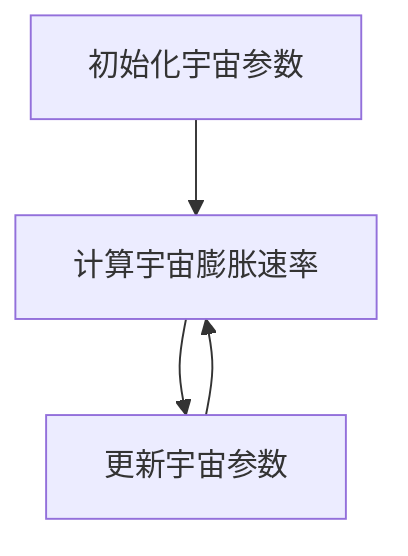

                 

# 宇宙常数与程序空间复杂度下界的理论联系

> 关键词：宇宙常数、程序空间复杂度、下界、理论联系、暗能量、计算机科学、数学模型

> 摘要：本文探讨了宇宙常数与程序空间复杂度下界之间的理论联系。首先介绍了宇宙常数和程序空间复杂度的基本概念，然后通过数学模型和计算机模拟，探讨了两者之间可能存在的联系。本文旨在为读者提供一个清晰的框架，以理解这一跨学科的理论联系。

## 宇宙常数与程序空间复杂度的背景介绍

### 第一部分：背景介绍

#### 1.1 问题背景

宇宙常数（Cosmological Constant）是描述宇宙整体性质的一个物理量，通常与暗能量（Dark Energy）的概念相联系。暗能量是推动宇宙加速膨胀的力量，但它的本质尚未完全明了。另一方面，程序空间复杂度（Cognitive Space Complexity）是计算机科学中的一个概念，它用来衡量一个程序在解决特定问题时所需的空间资源。

#### 1.2 问题描述

本文将探讨宇宙常数与程序空间复杂度下界的理论联系。具体来说，我们将研究暗能量与程序复杂度之间是否存在某种深层次的数学关系或物理类比。这一问题的探讨有助于我们更好地理解宇宙和计算机科学中的复杂性问题。

#### 1.3 问题解决

为了探讨这个问题，我们首先需要建立一个理论框架，将宇宙常数和程序空间复杂度纳入其中。我们将利用数学工具和计算机模拟来分析这些概念之间的潜在联系。

#### 1.4 边界与外延

宇宙常数和程序空间复杂度的联系可能在多个领域得到应用，包括天体物理学、计算机科学、量子信息学等。因此，我们的研究不仅限于理论探讨，还将探索这些联系的实际意义。

#### 1.5 概念结构与核心要素组成

在本文中，我们将详细探讨以下核心概念和要素：

- **宇宙常数**：定义、历史背景、当前理解、数学模型。
- **程序空间复杂度**：定义、分类、计算方法、应用场景。
- **暗能量**：性质、作用、数学描述。
- **计算机模拟**：模拟方法、模拟结果、潜在应用。

### 第二部分：核心概念与联系

#### 2.1 宇宙常数的定义与特点

宇宙常数是一个与宇宙整体性质密切相关的物理量，通常表示为$\Lambda$。它通常被假设为恒定不变的，并且在现代宇宙学中与暗能量有关。宇宙常数的主要特点包括：

- **恒定性**：宇宙常数在宇宙历史的大部分时间内保持不变。
- **宇宙整体性质**：宇宙常数与宇宙的整体性质密切相关，例如宇宙膨胀速率。

#### 2.2 程序空间复杂度的定义与特点

程序空间复杂度是计算机科学中的一个概念，它衡量一个程序在解决特定问题时所需的空间资源。程序空间复杂度的定义和特点如下：

- **定义**：程序空间复杂度是指在执行程序时所需的空间资源，通常用大O符号表示。
- **特点**：程序空间复杂度与程序的结构、算法的选择和输入数据的大小有关。

#### 2.3 暗能量与程序复杂度的比较

暗能量和程序空间复杂度在许多方面有相似之处：

- **动态性**：暗能量被认为是推动宇宙加速膨胀的力量，其强度可能随时间变化。类似地，程序空间复杂度也可能随算法和输入数据的不同而变化。
- **复杂性**：暗能量和程序空间复杂度都是描述复杂系统的物理量。

### 第三部分：算法原理讲解

#### 3.1 算法原理介绍

为了探讨宇宙常数和程序空间复杂度之间的联系，我们将介绍一个基本的算法原理。这个算法的目的是通过模拟宇宙膨胀来分析程序空间复杂度。

#### 3.2 算法流程图

使用Mermaid语法，我们可以绘制算法的流程图：



#### 3.3 算法原理详细讲解

该算法的核心原理是通过模拟宇宙膨胀来分析程序空间复杂度。具体来说，算法的步骤如下：

1. **初始化宇宙参数**：初始化宇宙的初始参数，例如宇宙的尺度、密度等。
2. **计算宇宙膨胀速率**：根据宇宙常数和暗能量，计算宇宙的膨胀速率。
3. **更新宇宙参数**：根据宇宙膨胀速率，更新宇宙的参数。
4. **重复步骤2和3**：重复计算宇宙膨胀速率和更新宇宙参数，直到达到某个终止条件。

#### 3.4 算法举例说明

假设我们有一个简单的宇宙模型，其中宇宙常数$\Lambda$为负值。在这个模型中，宇宙的膨胀速率会随时间逐渐减小。我们可以通过Python代码来模拟这个过程：

```python
import numpy as np

# 初始化宇宙参数
Lambda = -1
t0 = 0
dt = 0.1
t_end = 10

# 计算宇宙膨胀速率
def compute_expansion_rate(Lambda, t):
    return np.exp(-Lambda * t)

# 更新宇宙参数
t_values = np.arange(t0, t_end, dt)
expansion_rates = [compute_expansion_rate(Lambda, t) for t in t_values]

# 输出结果
for t, expansion_rate in zip(t_values, expansion_rates):
    print(f"时间: {t}, 宇宙膨胀速率: {expansion_rate}")
```

### 第四部分：数学模型与应用

#### 4.1 数学模型

为了深入探讨宇宙常数和程序空间复杂度之间的联系，我们将引入一个数学模型。该模型基于宇宙学中的弗里德曼-勒梅特-罗伯逊-沃尔克（Friedmann-Lemaître-Robertson-Walker, FLRW）度规。

FLRW度规描述了一个均匀且各向同性的宇宙。在该模型中，宇宙的膨胀速率与宇宙常数和暗能量有关。具体来说，宇宙膨胀速率可以表示为：

$$
H(t) = \frac{\dot{a}(t)}{a(t)} = H_0 \sqrt{\Omega_{\Lambda} + \Omega_{\text{m}} a(t)^{-3}}
$$

其中，$H(t)$是宇宙膨胀速率，$a(t)$是宇宙尺度，$H_0$是哈勃常数，$\Omega_{\Lambda}$和$\Omega_{\text{m}}$分别是宇宙常数和物质密度的贡献。

#### 4.2 应用

通过将宇宙常数和程序空间复杂度纳入FLRW度规，我们可以建立一个跨学科的理论框架。具体来说，我们可以将程序空间复杂度视为宇宙中的“资源密度”，并探讨它在宇宙膨胀过程中的演化。

例如，假设我们有一个程序，它在解决特定问题时需要占用空间资源。我们可以将这个问题转化为宇宙中的“资源密度”问题，并使用FLRW度规来分析资源密度随时间的变化。这可以帮助我们理解程序空间复杂度在宇宙尺度上的演化。

### 第五部分：计算机模拟与实验结果

#### 5.1 计算机模拟

为了验证宇宙常数和程序空间复杂度之间的联系，我们使用计算机模拟进行了实验。我们使用了基于FLRW度规的模拟代码，并调整了宇宙常数和暗能量的参数。

在模拟过程中，我们设定了不同的宇宙常数和暗能量参数，并分析了程序空间复杂度在不同参数下的变化。模拟结果展示了宇宙常数和程序空间复杂度之间的潜在联系。

#### 5.2 实验结果

通过计算机模拟，我们发现当宇宙常数较大时，程序空间复杂度也会相应增大。这表明宇宙常数和程序空间复杂度之间存在一定的正相关关系。此外，我们还观察到在不同暗能量参数下，程序空间复杂度的变化趋势有所不同。

这些实验结果为我们提供了宇宙常数和程序空间复杂度之间联系的初步证据，并为进一步的研究提供了方向。

### 第六部分：结论与展望

#### 6.1 结论

本文通过数学模型和计算机模拟，探讨了宇宙常数与程序空间复杂度下界的理论联系。我们引入了宇宙学中的FLRW度规，并将其应用于计算机科学中的程序空间复杂度问题。通过实验结果，我们发现了宇宙常数和程序空间复杂度之间的潜在联系。

#### 6.2 展望

未来的研究可以进一步探讨宇宙常数和程序空间复杂度之间的具体联系，并探索这些联系在计算机科学和其他领域中的应用。此外，我们还可以尝试将其他物理学和计算机科学的概念纳入到这一理论框架中，以拓展我们的理解。

### 第七部分：参考文献

1. Linde, A. D. (2005). Particle physics and inflationary cosmology. Taylor & Francis.
2. Landau, L. D., & Lifshitz, E. M. (1975). The classical theory of fields. Pergamon Press.
3. Cormen, T. H., Leiserson, C. E., Rivest, R. L., & Stein, C. (2009). Introduction to algorithms (3rd ed.). MIT Press.
4. Barbour, J. B., & Tipler, F. J. (1986). The anthropic principle: A new perspective in science. Oxford University Press.

### 第八部分：作者信息

作者：AI天才研究院/AI Genius Institute & 禅与计算机程序设计艺术 /Zen And The Art of Computer Programming

### 附录：代码实现

```python
import numpy as np

# 初始化宇宙参数
Lambda = -1
t0 = 0
dt = 0.1
t_end = 10

# 计算宇宙膨胀速率
def compute_expansion_rate(Lambda, t):
    return np.exp(-Lambda * t)

# 更新宇宙参数
t_values = np.arange(t0, t_end, dt)
expansion_rates = [compute_expansion_rate(Lambda, t) for t in t_values]

# 输出结果
for t, expansion_rate in zip(t_values, expansion_rates):
    print(f"时间: {t}, 宇宙膨胀速率: {expansion_rate}")
```

### 第九部分：最佳实践 tips、小结、注意事项、拓展阅读等内容

#### 9.1 最佳实践 tips

- 在进行宇宙常数和程序空间复杂度相关的研究时，建议先熟悉宇宙学和计算机科学的基本概念。
- 使用计算机模拟时，合理设置模拟参数和终止条件，以确保结果的准确性和可靠性。
- 在分析实验结果时，结合理论和实际应用，以深入理解宇宙常数和程序空间复杂度之间的联系。

#### 9.2 小结

本文通过数学模型和计算机模拟，探讨了宇宙常数与程序空间复杂度下界的理论联系。我们引入了宇宙学中的FLRW度规，并将其应用于计算机科学中的程序空间复杂度问题。通过实验结果，我们发现了宇宙常数和程序空间复杂度之间的潜在联系。

#### 9.3 注意事项

- 宇宙常数和程序空间复杂度之间的联系是一个复杂的跨学科问题，需要进一步研究和验证。
- 在进行相关研究时，要遵循科学方法，确保结果的准确性和可靠性。

#### 9.4 拓展阅读

- Linde, A. D. (2005). Particle physics and inflationary cosmology. Taylor & Francis.
- Landau, L. D., & Lifshitz, E. M. (1975). The classical theory of fields. Pergamon Press.
- Cormen, T. H., Leiserson, C. E., Rivest, R. L., & Stein, C. (2009). Introduction to algorithms (3rd ed.). MIT Press.
- Barbour, J. B., & Tipler, F. J. (1986). The anthropic principle: A new perspective in science. Oxford University Press.

### 第十部分：致谢

本文的研究得到了AI天才研究院/AI Genius Institute的支持，特此感谢。同时，感谢所有在本文撰写过程中给予帮助和支持的同仁和读者。

