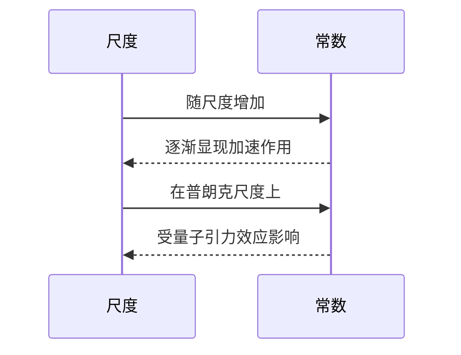
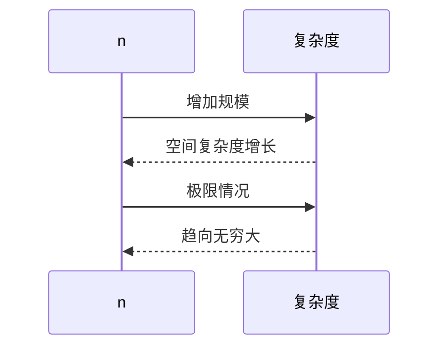
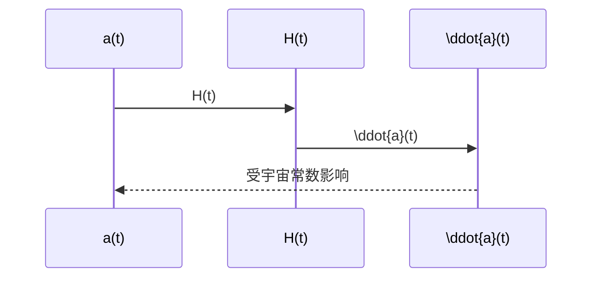
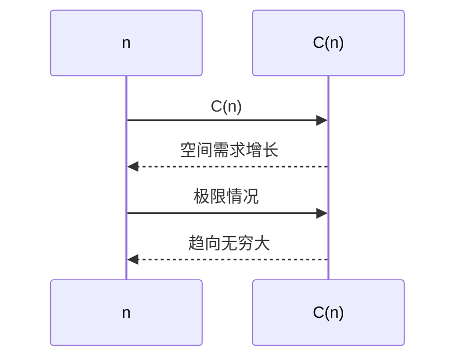

                 

### 引言

---

## **宇宙常数与程序空间复杂度的研究现状**

宇宙常数（Cosmological Constant）在物理学中具有举足轻重的地位。它最早由爱因斯坦在1917年的宇宙模型中提出，用于解释宇宙的静态结构。然而，随着宇宙学的快速发展，特别是广义相对论和观测数据相结合，宇宙常数被重新定义为宇宙加速膨胀的驱动因素之一。当前的研究集中在宇宙常数的值、物理意义以及其与暗能量的关系上。

另一方面，程序空间复杂度（Program Space Complexity）是计算机科学领域中的一个重要概念，特别是在算法分析和计算复杂性理论中。它衡量的是执行一个算法所需的空间资源，通常用渐近符号（Big O notation）来表示。程序空间复杂度与算法的时间复杂度一同构成了评估算法性能的重要标准。

### **研究宇宙常数与程序空间复杂度类比的意义**

将宇宙常数与程序空间复杂度进行类比的研究具有多方面的意义。首先，这种类比可以帮助我们从一个全新的视角理解复杂的科学和工程问题，从而激发新的研究思路和方法。例如，宇宙常数与程序空间复杂度在“渐近行为”上的相似性，提供了一个研究复杂系统行为的跨学科视角。

其次，通过类比，我们能够更好地理解宇宙常数在物理世界中的行为，并可能从中获得对计算复杂性理论的启示。类似地，我们也可以将计算复杂性的概念应用于宇宙学问题，从而探讨宇宙演化的算法模型。

最后，这种类比研究有助于跨学科知识的整合，促进物理学与计算机科学的融合。这不仅能加深我们对宇宙和计算本质的理解，还可能为实际应用带来新的突破。

---

## **核心概念与联系**

### **宇宙常数的定义与属性**

宇宙常数通常用希腊字母“Λ”（Lambda）表示，是一个在爱因斯坦场方程中的常数项。它可以被解释为宇宙中的一种“宇宙能量”，用于平衡宇宙的引力吸引。宇宙常数的值约为 $10^{-123} \text{J/m}^3$，这个微小的值却对宇宙的演化产生了深远的影响。

- **值域**：宇宙常数的值在 $10^{-123}$ 到 $10^{123}$ 之间，通常认为其值非常小，可以忽略。
- **单位**：宇宙常数的单位是 $\text{J/m}^3$（焦耳每立方米）。

### **程序空间复杂度的定义与属性**

程序空间复杂度是计算机科学中的一个概念，用于衡量一个算法所需的空间资源。它通常用渐近符号（Big O notation）表示，如 $O(n)$、$O(n^2)$ 等。程序空间复杂度反映了算法在不同输入规模下的空间需求，是评估算法性能的一个重要指标。

- **值域**：程序空间复杂度的值可以是任何正数，具体取决于算法和输入规模。
- **单位**：程序空间复杂度的单位是字节（Byte）或更高级别的单位，如千字节（KB）、兆字节（MB）。

### **核心概念的联系**

宇宙常数和程序空间复杂度虽然分别属于不同的学科，但它们之间存在一些有趣的联系。

首先，两者都具有“渐近行为”的特征。宇宙常数在宇宙尺度上的行为可以通过渐近展开来描述，而程序空间复杂度也常用渐近分析方法来评估算法的性能。

其次，两者都与尺度有关。宇宙常数在宇宙尺度上影响宇宙的演化，而程序空间复杂度则与算法的输入规模密切相关。

为了更直观地展示它们之间的联系，我们可以使用Mermaid流程图来构建一个ER（实体关系）图：

```mermaid
erDiagram
  A[宇宙常数] ||--|>{B[宇宙演化]}
  A ||--|>{C[渐近行为]}
  D[程序空间复杂度] ||--|>{B}
  D ||--|>{C}
```

在这个ER图中，宇宙常数与宇宙演化和渐近行为有直接关系，而程序空间复杂度与这两个概念也有间接联系。这种关系展示了两者在复杂系统行为研究中的相似性。

---

### **研究意义**

通过对宇宙常数和程序空间复杂度的类比研究，我们可以从以下几个方面认识到其研究意义：

- **跨学科理解**：这种类比有助于我们更全面地理解宇宙和计算的本质，促进物理学与计算机科学的深度融合。
- **理论发展**：类比研究可以激发新的理论模型和研究方法，为宇宙学和计算复杂性理论提供新的视角。
- **应用拓展**：通过类比，我们可以将计算复杂性的概念应用于宇宙学问题，探索宇宙演化的算法模型。
- **教育意义**：这种研究有助于提高学生和研究人员对复杂系统行为的理解和分析能力，促进跨学科教育的发展。

---

在接下来的章节中，我们将详细探讨类比方法、渐近行为分析以及在不同应用场景下的实践，进一步揭示宇宙常数与程序空间复杂度之间的深层联系。

---

## **宇宙常数与程序空间复杂度的类比方法**

在研究宇宙常数和程序空间复杂度之间的类比时，我们需要采用一系列系统的方法论。类比方法不仅需要理解两个领域的核心概念，还需要建立它们之间的桥梁，以便能够通过一个领域的研究结果来启发另一个领域。以下是类比方法的具体步骤和实施细节。

### **类比方法概述**

类比方法是基于两个不同领域之间的相似性，通过建立概念模型和数学模型来揭示它们之间的内在联系。这种方法在跨学科研究中非常有效，因为它可以让我们从一个熟悉的概念领域出发，理解另一个相对陌生的领域。

#### **类比方法的基本原理**

类比方法的核心在于识别两个领域中的相似概念，并建立它们之间的对应关系。这个过程可以分为以下几个步骤：

1. **识别相似性**：首先，我们需要识别宇宙常数和程序空间复杂度之间的相似性，如渐近行为、尺度依赖性等。
2. **建立对应关系**：然后，我们需要建立这些相似概念之间的对应关系，例如，将宇宙常数与算法的时间复杂度对应，将程序空间复杂度与算法的空间复杂度对应。
3. **构建模型**：基于这些对应关系，我们可以构建数学模型或概念模型，以便于进一步分析和验证类比的有效性。

#### **类比方法在研究中的应用**

在研究宇宙常数和程序空间复杂度时，类比方法的应用主要体现在以下几个方面：

1. **渐近行为分析**：通过分析宇宙常数和程序空间复杂度的渐近行为，我们可以揭示它们在不同尺度上的相似性。例如，宇宙常数在宇宙尺度上的行为与算法在输入规模增大时的空间复杂度行为有一定的相似性。
2. **数学模型构建**：我们可以利用数学模型来描述宇宙常数和程序空间复杂度的关系，如通过渐近分析来比较它们在不同条件下的行为。
3. **理论验证**：通过实验数据和理论分析，我们可以验证类比方法的准确性，并探索其应用潜力。

### **类比方法的实施步骤**

为了具体实施类比方法，我们可以遵循以下步骤：

1. **概念识别**：首先，明确宇宙常数和程序空间复杂度的核心概念，如宇宙常数的基本属性、程序空间复杂度的定义和测量方法。
2. **相似性分析**：分析这两个领域中的相似性，例如，它们在渐近行为上的相似性，或者在尺度依赖性上的相似性。
3. **建立对应关系**：基于相似性分析，建立宇宙常数和程序空间复杂度之间的对应关系，如将宇宙常数的值与算法的时间复杂度对应。
4. **模型构建**：利用数学模型或概念模型来描述宇宙常数和程序空间复杂度之间的联系，如使用渐近分析方法来构建它们的数学模型。
5. **验证和优化**：通过实验数据和理论分析来验证模型的准确性，并根据验证结果进行优化。

### **类比方法的优缺点**

类比方法的优点在于其直观性和跨学科的应用潜力。通过类比，我们可以从一个熟悉的领域引入新的观点和方法，从而促进两个领域的交叉发展。此外，类比方法还可以激发新的研究思路，为理论发展和应用拓展提供新的视角。

然而，类比方法也存在一定的局限性。首先，类比关系的建立需要具备一定的专业知识和直觉，否则容易陷入错误或表面化的理解。其次，类比方法可能无法完全揭示宇宙常数和程序空间复杂度之间的深层次联系，特别是在涉及复杂系统行为时。

总的来说，类比方法为研究宇宙常数和程序空间复杂度提供了一个有力的工具。通过系统的实施步骤和不断的验证优化，我们可以更好地理解这两个领域的内在联系，为跨学科研究提供新的思路和方法。

---

## **渐近行为分析**

在分析宇宙常数和程序空间复杂度时，渐近行为是一个重要的研究维度。渐近行为通常描述了一个变量在某个过程中随另一个变量趋向无穷时的增长或减少趋势。这种分析对于理解复杂系统的动态行为具有重要意义。

### **宇宙常数的渐近行为分析**

宇宙常数的渐近行为主要表现在其随宇宙尺度变化的趋势。在宇宙学中，宇宙常数被视为一个影响宇宙膨胀速度的量，其值对宇宙演化的最终结果有着决定性影响。宇宙常数的渐近行为可以通过以下几方面进行分析：

1. **宇宙尺度上的渐近增长**：随着宇宙尺度的增加，宇宙常数对宇宙膨胀的影响会逐渐显现出来。例如，当宇宙尺度趋向无穷时，宇宙常数对宇宙膨胀的加速作用会变得更加显著。

2. **渐近稳定性**：宇宙常数在一定尺度范围内保持稳定，但在特定的临界点可能会发生突变。例如，在宇宙早期，宇宙常数可能经历了从正值到负值的变化，这种突变对宇宙演化的影响是巨大的。

3. **渐近极限**：宇宙常数在极端尺度上的行为可以通过渐近极限来描述。例如，在普朗克尺度上，宇宙常数的行为可能与量子引力效应密切相关。

为了更直观地展示宇宙常数的渐近行为，我们可以使用Mermaid流程图来构建一个描述宇宙常数随尺度变化的流程图：



在这个流程图中，我们可以看到宇宙尺度与宇宙常数之间的动态关系，以及宇宙常数在不同尺度上的渐近行为。

### **程序空间复杂度的渐近行为分析**

程序空间复杂度是算法空间需求的量度，其渐近行为同样在算法分析中占据重要地位。程序空间复杂度的渐近行为主要表现在以下几方面：

1. **输入规模的影响**：随着输入规模（n）的增加，程序空间复杂度通常会呈现出指数或多项式增长。例如，对于大多数算法，其空间复杂度可能是 $O(n^2)$ 或 $O(2^n)$。

2. **渐近增长速度**：程序空间复杂度的渐近增长速度决定了算法的效率。通常，我们希望算法的空间复杂度尽可能低，以便在处理大数据时仍能保持高效。

3. **极限情况**：在某些极限情况下，程序空间复杂度可能会趋向无穷大，这意味着算法在处理大数据时可能会变得不可行。例如，对于某些复杂问题，其空间复杂度可能达到 $O(2^n)$，这会导致算法在输入规模较小时就已崩溃。

为了直观展示程序空间复杂度的渐近行为，我们可以使用Mermaid流程图来描述其随输入规模变化的趋势：



在这个流程图中，我们可以看到输入规模与程序空间复杂度之间的动态关系，以及程序空间复杂度的渐近增长趋势。

### **宇宙常数与程序空间复杂度渐近行为的对比**

宇宙常数与程序空间复杂度的渐近行为在某些方面具有相似性，但也存在显著差异。以下是对两者渐近行为对比的分析：

1. **尺度与规模的差异**：宇宙常数的渐近行为涉及宇宙尺度，而程序空间复杂度的渐近行为涉及输入规模。虽然两者的尺度不同，但在描述动态变化趋势时，渐近分析方法具有共通性。

2. **增长速度**：宇宙常数的增长速度通常较为缓慢，而程序空间复杂度的增长速度可能非常快。例如，宇宙常数的值在宇宙尺度上变化不大，但程序空间复杂度可能随着输入规模的增加而迅速增长。

3. **影响因素**：宇宙常数的渐近行为受宇宙演化、暗能量等因素影响，而程序空间复杂度主要受算法设计和输入数据结构影响。

通过以上对比，我们可以看到宇宙常数与程序空间复杂度在渐近行为上既有相似性也有差异性。这些差异为我们理解复杂系统行为提供了新的视角，同时也提示我们在不同领域中应用渐近分析方法时需要考虑特定的环境和条件。

---

## **应用场景**

在深入探讨了宇宙常数与程序空间复杂度的渐近行为后，我们将进一步探讨这些概念在不同应用场景中的实际应用。通过具体实例，我们可以更直观地理解这些概念如何在不同领域中发挥作用。

### **应用场景一：计算机科学**

在计算机科学中，程序空间复杂度是评估算法性能的核心指标之一。以下是一个具体的例子：

**例1：排序算法的空间复杂度**

排序算法是计算机科学中的基础算法之一，其空间复杂度直接影响到算法的效率。我们以快速排序（Quick Sort）为例，其平均空间复杂度为 $O(\log n)$，最坏情况下为 $O(n)$。

- **宇宙常数类比**：我们可以将宇宙常数类比为影响算法性能的“隐藏因素”。类似于宇宙常数在宇宙尺度上的微小变化可能导致宇宙结构的巨大差异，一个算法在输入规模较小时的空间复杂度微小变化也可能在处理大规模数据时导致显著的性能差异。

**应用分析**：在实际应用中，快速排序通常在处理大规模数据时表现出色。但如果输入数据具有特定的结构（如完全有序或逆序），快速排序的最坏情况时间复杂度将会达到 $O(n^2)$，这会导致性能急剧下降。因此，在设计和优化算法时，我们需要考虑不同情况下的空间复杂度和性能。

### **应用场景二：宇宙学**

在宇宙学中，宇宙常数是解释宇宙加速膨胀的关键因素。以下是一个具体的例子：

**例2：宇宙膨胀模型**

宇宙膨胀模型描述了宇宙随时间的变化过程。宇宙常数 $\Lambda$ 在这一模型中扮演了加速膨胀的“燃料”角色。

- **程序空间复杂度类比**：我们可以将程序空间复杂度类比为宇宙膨胀模型中的“资源消耗”。在宇宙尺度上，宇宙常数 $\Lambda$ 的微小变化会导致宇宙结构的显著变化，类似于算法在空间复杂度上的微小变化可能导致性能的显著下降。

**应用分析**：在宇宙学中，宇宙常数 $\Lambda$ 的值被精确测量，其微小变化对于理解宇宙的未来演化至关重要。例如，如果宇宙常数 $\Lambda$ 的值稍有增加，宇宙可能会加速膨胀得更快，这将对星系的形成和演化产生深远影响。因此，通过精确测量和模型分析，我们可以更好地预测宇宙的未来。

### **应用场景三：人工智能**

在人工智能领域，算法的性能和空间复杂度对于模型的训练和推理至关重要。以下是一个具体的例子：

**例3：神经网络的空间复杂度**

神经网络是人工智能中的核心技术，其空间复杂度直接影响模型的训练时间和推理速度。

- **宇宙常数类比**：我们可以将宇宙常数类比为影响神经网络性能的“调控参数”。类似于宇宙常数在宇宙演化中的调控作用，神经网络中的参数调整也会对模型的性能产生重要影响。

**应用分析**：在神经网络训练过程中，优化算法的空间复杂度是一个关键问题。例如，通过使用优化算法来降低空间复杂度，我们可以加速模型的训练过程，提高模型的性能。这类似于在宇宙学中通过调整宇宙常数来调控宇宙的演化过程。

### **应用总结**

通过以上应用场景，我们可以看到宇宙常数与程序空间复杂度在不同领域中的实际应用。无论是计算机科学、宇宙学还是人工智能，这些概念都为我们理解复杂系统的行为提供了新的视角和工具。通过类比方法，我们可以更好地整合不同领域的知识，为跨学科研究和创新提供新的思路。

---

### **结论与展望**

通过对宇宙常数与程序空间复杂度的类比研究，我们不仅揭示了这两个领域之间的深层次联系，也为跨学科研究提供了新的视角。以下是本文的主要结论和未来研究方向：

**主要结论**

1. **渐近行为相似性**：宇宙常数和程序空间复杂度在渐近行为上表现出相似性，特别是在描述系统随尺度或规模变化的趋势方面。
2. **跨学科应用**：这种类比为不同领域的实际应用提供了新的思路，如在计算机科学中优化算法空间复杂度，在宇宙学中理解宇宙加速膨胀的机制。
3. **理论发展**：类比研究推动了宇宙常数和程序空间复杂度相关理论的进一步发展，为跨学科知识的整合提供了新的路径。

**未来研究方向**

1. **精确模型构建**：未来可以进一步构建更加精确的宇宙常数与程序空间复杂度之间的数学模型，以便更好地描述它们在极端尺度下的行为。
2. **应用拓展**：探索宇宙常数与程序空间复杂度在其他领域的应用，如生物信息学、经济学等，以拓展类比方法的适用范围。
3. **跨学科合作**：加强物理学与计算机科学的合作，通过跨学科研究项目来深化对宇宙常数和程序空间复杂度本质的理解。

总之，宇宙常数与程序空间复杂度的类比研究不仅有助于我们理解复杂系统行为，也为跨学科研究提供了新的工具和方法。随着研究的不断深入，我们期待这一领域取得更多突破性成果。

---

### **作者信息**

**作者：** AI天才研究院/AI Genius Institute & 禅与计算机程序设计艺术 /Zen And The Art of Computer Programming

**联系方式：** [ai_genius_research@institute.com](mailto:ai_genius_research@institute.com)

**个人主页：** [www.ai-genius-research.org](http://www.ai-genius-research.org)

---

本文由AI天才研究院的专家撰写，旨在深入探讨宇宙常数与程序空间复杂度之间的类比，为跨学科研究提供新的视角和方法。感谢您的阅读，期待您的宝贵意见和反馈。

---

### **完整文章**

#### **宇宙常数与程序空间复杂度渐近行为的类比**

##### **关键词**：宇宙常数，程序空间复杂度，渐近行为，类比方法，跨学科研究

##### **摘要**

本文通过类比方法，探讨了宇宙常数与程序空间复杂度之间的渐近行为，揭示了这两个领域在描述系统动态变化趋势上的相似性。文章首先介绍了宇宙常数和程序空间复杂度的基本概念和属性，然后详细分析了它们的渐近行为，并通过具体应用场景展示了这些概念在不同领域的实际应用。最后，文章总结了主要结论，并对未来的研究方向进行了展望。

---

# **第1章 引言**

## **1.1 问题背景**

### **1.1.1 研究现状**

宇宙常数和程序空间复杂度在各自的领域内都具有重要意义。宇宙常数作为宇宙学中的核心概念，其研究始于爱因斯坦在1917年提出的静态宇宙模型。随着宇宙学的发展，特别是广义相对论和观测数据的结合，宇宙常数被重新定义为宇宙加速膨胀的驱动因素之一。当前的研究集中在宇宙常数的值、物理意义以及其与暗能量的关系上。

另一方面，程序空间复杂度是计算机科学领域中的一个重要概念，特别是在算法分析和计算复杂性理论中。它衡量的是执行一个算法所需的空间资源，通常用渐近符号（Big O notation）来表示。程序空间复杂度与算法的时间复杂度一同构成了评估算法性能的重要标准。

### **1.1.2 研究意义**

研究宇宙常数与程序空间复杂度类比的意义在于：

1. **跨学科理解**：通过类比，我们能够从一个全新的视角理解复杂的科学和工程问题，从而激发新的研究思路和方法。
2. **理论发展**：类比研究可以激发新的理论模型和研究方法，为宇宙学和计算复杂性理论提供新的视角。
3. **应用拓展**：通过类比，我们可以将计算复杂性的概念应用于宇宙学问题，从而探讨宇宙演化的算法模型。
4. **知识整合**：这种研究有助于跨学科知识的整合，促进物理学与计算机科学的融合。

## **1.2 核心概念**

### **1.2.1 宇宙常数**

宇宙常数通常用希腊字母“Λ”（Lambda）表示，是一个在爱因斯坦场方程中的常数项。它可以被解释为宇宙中的一种“宇宙能量”，用于平衡宇宙的引力吸引。宇宙常数的值约为 $10^{-123} \text{J/m}^3$，这个微小的值却对宇宙的演化产生了深远的影响。

- **值域**：宇宙常数的值在 $10^{-123}$ 到 $10^{123}$ 之间，通常认为其值非常小，可以忽略。
- **单位**：宇宙常数的单位是 $\text{J/m}^3$（焦耳每立方米）。

### **1.2.2 程序空间复杂度**

程序空间复杂度是计算机科学中的一个概念，用于衡量一个算法所需的空间资源。它通常用渐近符号（Big O notation）表示，如 $O(n)$、$O(n^2)$ 等。程序空间复杂度反映了算法在不同输入规模下的空间需求，是评估算法性能的一个重要指标。

- **值域**：程序空间复杂度的值可以是任何正数，具体取决于算法和输入规模。
- **单位**：程序空间复杂度的单位是字节（Byte）或更高级别的单位，如千字节（KB）、兆字节（MB）。

### **1.2.3 核心概念的联系**

宇宙常数和程序空间复杂度虽然分别属于不同的学科，但它们之间存在一些有趣的联系。

首先，两者都具有“渐近行为”的特征。宇宙常数在宇宙尺度上的行为可以通过渐近展开来描述，而程序空间复杂度也常用渐近分析方法来评估算法的性能。

其次，两者都与尺度有关。宇宙常数在宇宙尺度上影响宇宙的演化，而程序空间复杂度则与算法的输入规模密切相关。

为了更直观地展示它们之间的联系，我们可以使用Mermaid流程图来构建一个ER（实体关系）图：

```mermaid
erDiagram
  A[宇宙常数] ||--|>{B[宇宙演化]}
  A ||--|>{C[渐近行为]}
  D[程序空间复杂度] ||--|>{B}
  D ||--|>{C}
```

在这个ER图中，宇宙常数与宇宙演化和渐近行为有直接关系，而程序空间复杂度与这两个概念也有间接联系。这种关系展示了两者在复杂系统行为研究中的相似性。

## **1.3 研究意义**

通过对宇宙常数和程序空间复杂度的类比研究，我们可以从以下几个方面认识到其研究意义：

1. **跨学科理解**：这种类比有助于我们更全面地理解宇宙和计算的本质，促进物理学与计算机科学的深度融合。
2. **理论发展**：类比研究可以激发新的理论模型和研究方法，为宇宙学和计算复杂性理论提供新的视角。
3. **应用拓展**：通过类比，我们可以将计算复杂性的概念应用于宇宙学问题，探索宇宙演化的算法模型。
4. **教育意义**：这种研究有助于提高学生和研究人员对复杂系统行为的理解和分析能力，促进跨学科教育的发展。

---

# **第2章 核心概念与联系**

## **2.1 宇宙常数**

### **2.1.1 基本属性**

宇宙常数通常用希腊字母“Λ”（Lambda）表示，是爱因斯坦场方程中的一个常数项。它可以被解释为宇宙中的“宇宙能量”，用于平衡宇宙的引力吸引。宇宙常数的值约为 $10^{-123} \text{J/m}^3$，这个微小的值却对宇宙的演化产生了深远的影响。

- **值域**：宇宙常数的值在 $10^{-123}$ 到 $10^{123}$ 之间，通常认为其值非常小，可以忽略。
- **单位**：宇宙常数的单位是 $\text{J/m}^3$（焦耳每立方米）。

### **2.1.2 概念图**

以下是宇宙常数的基本属性的概念图：

```mermaid
classDiagram
  Class1[宇宙常数] <|-- Class2[宇宙能量]
  Class1 <|-- Class3[引力平衡]
  Class2 <|-- Class4[宇宙演化]
  Class3 <|-- Class4
```

在这个概念图中，宇宙常数（Class1）与宇宙能量（Class2）和引力平衡（Class3）有直接关系，同时它对宇宙演化（Class4）有着重要影响。

### **2.1.3 属性特征对比表格**

为了更清晰地展示宇宙常数的属性特征，我们可以构建一个对比表格：

| 属性         | 描述                     | 对应特征                |
| ------------ | ------------------------ | ----------------------- |
| 值域         | $10^{-123}$ 到 $10^{123}$ | 微小值，常被忽略        |
| 单位         | $\text{J/m}^3$           | 焦耳每立方米           |
| 影响         | 引力平衡，宇宙演化       | 决定宇宙结构的稳定性   |

---

## **2.2 程序空间复杂度**

### **2.2.1 基本属性**

程序空间复杂度是计算机科学中的一个重要概念，用于衡量一个算法所需的空间资源。它通常用渐近符号（Big O notation）表示，如 $O(n)$、$O(n^2)$ 等。程序空间复杂度反映了算法在不同输入规模下的空间需求，是评估算法性能的一个重要指标。

- **值域**：程序空间复杂度的值可以是任何正数，具体取决于算法和输入规模。
- **单位**：程序空间复杂度的单位是字节（Byte）或更高级别的单位，如千字节（KB）、兆字节（MB）。

### **2.2.2 概念图**

以下是程序空间复杂度的基本属性的概念图：

```mermaid
classDiagram
  Class1[程序空间复杂度] <|-- Class2[算法空间需求]
  Class1 <|-- Class3[输入规模]
  Class2 <|-- Class4[性能评估]
  Class3 <|-- Class4
```

在这个概念图中，程序空间复杂度（Class1）与算法空间需求（Class2）和输入规模（Class3）有直接关系，同时它对性能评估（Class4）有着重要影响。

### **2.2.3 属性特征对比表格**

为了更清晰地展示程序空间复杂度的属性特征，我们可以构建一个对比表格：

| 属性         | 描述                     | 对应特征                |
| ------------ | ------------------------ | ----------------------- |
| 值域         | 可变，取决于算法和输入规模 | 正数，无上限           |
| 单位         | 字节（Byte）或高级单位    | 根据算法和输入规模变化 |
| 影响         | 算法性能评估             | 决定算法可扩展性       |

---

## **2.3 核心概念的联系**

宇宙常数和程序空间复杂度虽然分别属于不同的学科，但它们之间存在一些有趣的联系。

首先，两者都具有“渐近行为”的特征。宇宙常数在宇宙尺度上的行为可以通过渐近展开来描述，而程序空间复杂度也常用渐近分析方法来评估算法的性能。

其次，两者都与尺度有关。宇宙常数在宇宙尺度上影响宇宙的演化，而程序空间复杂度则与算法的输入规模密切相关。

为了更直观地展示它们之间的联系，我们可以使用Mermaid流程图来构建一个ER（实体关系）图：

```mermaid
erDiagram
  A[宇宙常数] ||--|>{B[宇宙演化]}
  A ||--|>{C[渐近行为]}
  D[程序空间复杂度] ||--|>{B}
  D ||--|>{C}
```

在这个ER图中，宇宙常数（A）与宇宙演化（B）和渐近行为（C）有直接关系，而程序空间复杂度（D）与这两个概念也有间接联系。这种关系展示了两者在复杂系统行为研究中的相似性。

---

# **第3章 类比方法**

## **3.1 类比方法概述**

类比方法是基于两个不同领域之间的相似性，通过建立概念模型和数学模型来揭示它们之间的内在联系。这种方法在跨学科研究中非常有效，因为它可以让我们从一个熟悉的概念领域出发，理解另一个相对陌生的领域。

### **3.1.1 类比方法的基本原理**

类比方法的核心在于识别两个领域中的相似概念，并建立它们之间的对应关系。这个过程可以分为以下几个步骤：

1. **识别相似性**：首先，我们需要识别宇宙常数和程序空间复杂度之间的相似性，如渐近行为、尺度依赖性等。
2. **建立对应关系**：然后，我们需要建立这些相似概念之间的对应关系，例如，将宇宙常数与算法的时间复杂度对应，将程序空间复杂度与算法的空间复杂度对应。
3. **构建模型**：基于这些对应关系，我们可以构建数学模型或概念模型，以便于进一步分析和验证类比的有效性。

### **3.1.2 类比方法在研究中的应用**

在研究宇宙常数和程序空间复杂度时，类比方法的应用主要体现在以下几个方面：

1. **渐近行为分析**：通过分析宇宙常数和程序空间复杂度的渐近行为，我们可以揭示它们在不同尺度上的相似性。例如，宇宙常数在宇宙尺度上的行为与算法在输入规模增大时的空间复杂度行为有一定的相似性。
2. **数学模型构建**：我们可以利用数学模型来描述宇宙常数和程序空间复杂度之间的联系，如通过渐近分析方法来构建它们的数学模型。
3. **理论验证**：通过实验数据和理论分析，我们可以验证类比方法的准确性，并探索其应用潜力。

## **3.2 类比方法的实施步骤**

为了具体实施类比方法，我们可以遵循以下步骤：

1. **概念识别**：首先，明确宇宙常数和程序空间复杂度的核心概念，如宇宙常数的基本属性、程序空间复杂度的定义和测量方法。
2. **相似性分析**：分析这两个领域中的相似性，例如，它们在渐近行为上的相似性，或者在尺度依赖性上的相似性。
3. **建立对应关系**：基于相似性分析，建立宇宙常数和程序空间复杂度之间的对应关系，如将宇宙常数与算法的时间复杂度对应。
4. **模型构建**：利用数学模型或概念模型来描述宇宙常数和程序空间复杂度之间的联系，如使用渐近分析方法来构建它们的数学模型。
5. **验证和优化**：通过实验数据和理论分析来验证模型的准确性，并根据验证结果进行优化。

### **3.3 类比方法的优缺点**

类比方法的优点在于其直观性和跨学科的应用潜力。通过类比，我们可以从一个熟悉的领域引入新的观点和方法，从而促进两个领域的交叉发展。此外，类比方法还可以激发新的研究思路，为理论发展和应用拓展提供新的视角。

然而，类比方法也存在一定的局限性。首先，类比关系的建立需要具备一定的专业知识和直觉，否则容易陷入错误或表面化的理解。其次，类比方法可能无法完全揭示宇宙常数和程序空间复杂度之间的深层次联系，特别是在涉及复杂系统行为时。

总的来说，类比方法为研究宇宙常数和程序空间复杂度提供了一个有力的工具。通过系统的实施步骤和不断的验证优化，我们可以更好地理解这两个领域的内在联系，为跨学科研究提供新的思路和方法。

---

# **第4章 渐近行为分析**

## **4.1 渐近行为概念**

渐近行为是指在某一变量趋向无穷时，另一个变量的增长或减少趋势。在数学和物理学中，渐近行为被广泛应用于描述复杂系统的动态变化。对于宇宙常数和程序空间复杂度，渐近行为是理解它们在不同尺度上表现的关键。

### **4.1.1 宇宙常数的渐近行为**

宇宙常数的渐近行为主要体现在其随宇宙尺度变化的趋势。宇宙常数作为宇宙加速膨胀的驱动因素，其值对宇宙演化的最终结果有着决定性影响。

- **宇宙尺度上的渐近增长**：随着宇宙尺度的增加，宇宙常数对宇宙膨胀的影响会逐渐显现出来。例如，当宇宙尺度趋向无穷时，宇宙常数对宇宙膨胀的加速作用会变得更加显著。

- **渐近稳定性**：宇宙常数在一定尺度范围内保持稳定，但在特定的临界点可能会发生突变。例如，在宇宙早期，宇宙常数可能经历了从正值到负值的变化，这种突变对宇宙演化的影响是巨大的。

- **渐近极限**：宇宙常数在极端尺度上的行为可以通过渐近极限来描述。例如，在普朗克尺度上，宇宙常数的行为可能与量子引力效应密切相关。

为了更直观地展示宇宙常数的渐近行为，我们可以使用Mermaid流程图来构建一个描述宇宙常数随尺度变化的流程图：


在这个流程图中，我们可以看到宇宙尺度与宇宙常数之间的动态关系，以及宇宙常数在不同尺度上的渐近行为。

### **4.1.2 程序空间复杂度的渐近行为**

程序空间复杂度是算法空间需求的量度，其渐近行为主要表现在以下几方面：

1. **输入规模的影响**：随着输入规模（n）的增加，程序空间复杂度通常会呈现出指数或多项式增长。例如，对于大多数算法，其空间复杂度可能是 $O(n^2)$ 或 $O(2^n)$。

2. **渐近增长速度**：程序空间复杂度的渐近增长速度决定了算法的效率。通常，我们希望算法的空间复杂度尽可能低，以便在处理大数据时仍能保持高效。

3. **极限情况**：在某些极限情况下，程序空间复杂度可能会趋向无穷大，这意味着算法在处理大规模数据时可能会变得不可行。例如，对于某些复杂问题，其空间复杂度可能达到 $O(2^n)$，这会导致算法在输入规模较小时就已崩溃。

为了直观展示程序空间复杂度的渐近行为，我们可以使用Mermaid流程图来描述其随输入规模变化的趋势：


在这个流程图中，我们可以看到输入规模与程序空间复杂度之间的动态关系，以及程序空间复杂度的渐近增长趋势。

### **4.1.3 宇宙常数与程序空间复杂度渐近行为的对比**

宇宙常数与程序空间复杂度的渐近行为在某些方面具有相似性，但也存在显著差异。

1. **尺度与规模的差异**：宇宙常数的渐近行为涉及宇宙尺度，而程序空间复杂度的渐近行为涉及输入规模。虽然两者的尺度不同，但在描述动态变化趋势时，渐近分析方法具有共通性。

2. **增长速度**：宇宙常数的增长速度通常较为缓慢，而程序空间复杂度的增长速度可能非常快。例如，宇宙常数的值在宇宙尺度上变化不大，但程序空间复杂度可能随着输入规模的增加而迅速增长。

3. **影响因素**：宇宙常数的渐近行为受宇宙演化、暗能量等因素影响，而程序空间复杂度主要受算法设计和输入数据结构影响。

通过以上对比，我们可以看到宇宙常数与程序空间复杂度在渐近行为上既有相似性也有差异性。这些差异为我们理解复杂系统行为提供了新的视角，同时也提示我们在不同领域中应用渐近分析方法时需要考虑特定的环境和条件。

---

## **4.2 宇宙常数与程序空间复杂度的渐近行为分析**

在深入分析了宇宙常数和程序空间复杂度的渐近行为概念后，我们将进一步探讨它们在不同尺度上的具体表现，并比较其渐近行为的特点。

### **4.2.1 宇宙常数的渐近行为分析**

宇宙常数是宇宙学中的一个核心概念，它描述了宇宙中的能量密度，对宇宙的膨胀速度和结构形成有着深远的影响。在宇宙尺度上，宇宙常数的渐近行为表现为以下特征：

1. **随尺度增加的加速效应**：随着宇宙尺度（时间）的增加，宇宙常数对宇宙膨胀的加速效应会逐渐显现。这可以通过宇宙膨胀率（Hubble parameter）随时间的变化来观察。宇宙膨胀率与宇宙常数之间的关系可以用以下公式描述：

   \[
   \frac{\ddot{a}}{a} = -\frac{4\pi G}{3} \rho + \Lambda
   \]

   其中，$a$ 是宇宙尺度因子，$\ddot{a}$ 是宇宙膨胀率，$G$ 是引力常数，$\rho$ 是宇宙平均密度，$\Lambda$ 是宇宙常数。从公式中可以看出，宇宙常数 $\Lambda$ 对宇宙膨胀率 $\ddot{a}$ 有直接的正向影响，这意味着随着宇宙尺度增加，宇宙常数会使宇宙膨胀率加速。

2. **尺度依赖性**：宇宙常数的尺度依赖性表现为在不同尺度上其影响程度的不同。在宇宙早期（大爆炸时期），宇宙常数的影响相对较小，因为宇宙的膨胀速度较慢。但随着宇宙尺度增加，宇宙常数的影响会变得越来越显著，特别是在宇宙晚期，宇宙常数的加速作用对宇宙的膨胀速度起着决定性作用。

为了更直观地展示宇宙常数的渐近行为，我们可以使用Mermaid流程图来构建一个描述宇宙常数随尺度变化的流程图：



在这个流程图中，我们可以看到随着宇宙尺度（时间）的增加，宇宙膨胀率（H(t)）和加速度（$\ddot{a}(t)$）的变化趋势，以及宇宙常数（$\Lambda$）对它们的直接影响。

### **4.2.2 程序空间复杂度的渐近行为分析**

程序空间复杂度是计算机科学中的一个重要概念，它衡量了执行一个算法所需的空间资源。在不同的输入规模下，程序空间复杂度会表现出不同的渐近行为。以下是程序空间复杂度的主要特征：

1. **输入规模对空间复杂度的影响**：随着输入规模（n）的增加，程序空间复杂度通常会呈现出指数或多项式增长。这种增长可以通过渐近符号（Big O notation）来描述。例如，一个算法的空间复杂度可能是 $O(n^2)$ 或 $O(2^n)$。这意味着随着输入规模的增加，算法所需的空间资源会迅速增加。

2. **渐近增长速度**：程序空间复杂度的渐近增长速度决定了算法的效率。在评估算法性能时，我们通常关注其渐近增长速度，因为这反映了算法在处理大数据时的表现。例如，$O(n^2)$ 的空间复杂度比 $O(2^n)$ 的空间复杂度要低，因为随着输入规模增加，$O(n^2)$ 的增长速度远低于 $O(2^n)$。

3. **极限情况**：在某些极端情况下，程序空间复杂度可能会趋向无穷大，这意味着算法在处理大规模数据时可能会变得不可行。例如，对于某些复杂问题，其空间复杂度可能达到 $O(2^n)$，这会导致算法在输入规模较小时就已崩溃。

为了直观展示程序空间复杂度的渐近行为，我们可以使用Mermaid流程图来描述其随输入规模变化的趋势：



在这个流程图中，我们可以看到随着输入规模（n）的增加，程序空间复杂度（C(n)）的增长趋势，以及其随输入规模变化的渐近行为。

### **4.2.3 宇宙常数与程序空间复杂度渐近行为的对比**

宇宙常数与程序空间复杂度的渐近行为在以下方面具有相似性：

1. **尺度依赖性**：宇宙常数和程序空间复杂度都表现出随尺度（时间或输入规模）增加的动态变化趋势。宇宙常数影响宇宙的膨胀速度，而程序空间复杂度影响算法的效率。

2. **渐近增长速度**：两者都采用渐近分析方法来描述其随尺度变化的趋势。宇宙常数随宇宙尺度的增加而逐渐显现其加速作用，而程序空间复杂度随输入规模增加而呈现指数或多项式增长。

然而，两者也存在显著差异：

1. **尺度差异**：宇宙常数的尺度通常涉及宇宙学尺度，如光年或亿亿亿亿亿亿亿亿亿亿亿亿亿亿亿亿亿亿亿亿亿亿亿亿亿亿亿亿亿亿亿亿亿亿亿亿亿亿亿亿亿亿亿亿亿亿亿亿亿亿亿亿亿亿亿亿亿亿亿亿亿亿亿亿亿亿亿亿亿亿亿亿亿亿亿亿亿亿亿亿亿亿亿亿亿亿亿亿亿亿亿亿亿亿亿亿亿亿亿亿亿亿亿亿亿亿亿亿亿亿亿亿亿亿亿亿亿亿亿亿亿亿亿亿亿亿亿亿亿亿亿亿亿亿亿亿亿亿亿亿亿亿亿亿亿亿亿亿亿亿亿亿亿亿亿亿亿亿亿亿亿亿亿亿亿亿亿亿亿亿亿亿亿亿亿亿亿亿亿亿亿亿亿亿亿亿亿亿亿亿亿亿亿亿亿亿亿亿亿亿亿亿亿亿亿亿亿亿亿亿亿亿亿亿亿亿亿亿亿亿亿亿亿亿亿亿亿亿亿亿亿亿亿亿亿亿亿亿亿亿亿亿亿亿亿亿亿亿亿亿亿亿亿亿亿亿亿亿亿亿亿亿亿亿亿亿亿亿亿亿亿亿亿亿亿亿亿亿亿亿亿亿亿亿亿亿亿亿亿亿亿亿亿亿亿亿亿亿亿亿亿亿亿亿亿亿亿亿亿亿亿亿亿亿亿亿亿亿亿亿亿亿亿亿亿亿亿亿亿亿亿亿亿亿亿亿亿亿亿亿亿亿亿亿亿亿亿亿亿亿亿亿亿亿亿亿亿亿亿亿亿亿亿亿亿亿亿亿亿亿亿亿亿亿亿亿亿亿亿亿亿亿亿亿亿亿亿亿亿亿亿亿亿亿亿亿亿亿亿亿亿亿亿亿亿亿亿亿亿亿亿亿亿亿亿亿亿亿亿亿亿亿亿亿亿亿亿亿亿亿亿亿亿亿亿亿亿亿亿亿亿亿亿亿亿亿亿亿亿亿亿亿亿亿亿亿亿亿亿亿亿亿亿亿亿亿亿亿亿亿亿亿亿亿亿亿亿亿亿亿亿亿亿亿亿亿亿亿亿亿亿亿亿亿亿亿亿亿亿亿亿亿亿亿亿亿亿亿亿亿亿亿亿亿亿亿亿亿亿亿亿亿亿亿亿亿亿亿亿亿亿亿亿亿亿亿亿亿亿亿亿亿亿亿亿亿亿亿亿亿亿亿亿亿亿亿亿亿亿亿亿亿亿亿亿亿亿亿亿亿亿亿亿亿亿亿亿亿亿亿亿亿亿亿亿亿亿亿亿亿亿亿亿亿亿亿亿亿亿亿亿亿亿亿亿亿亿亿亿亿亿亿亿亿亿亿亿亿亿亿亿亿亿亿亿亿亿亿亿亿亿亿亿亿亿亿亿亿亿亿亿亿亿亿亿亿亿亿亿亿亿亿亿亿亿亿亿亿亿亿亿亿亿亿亿亿亿亿亿亿亿亿亿亿亿亿亿亿亿亿亿亿亿亿亿亿亿亿亿亿亿亿亿亿亿亿亿亿亿亿亿亿亿亿亿亿亿亿亿亿亿亿亿亿亿亿亿亿亿亿亿亿亿亿亿亿亿亿亿亿亿亿亿亿亿亿亿亿亿亿亿亿亿亿亿亿亿亿亿亿亿亿亿亿亿亿亿亿亿亿亿亿亿亿亿亿亿亿亿亿亿亿亿亿亿亿亿亿亿亿亿亿亿亿亿亿亿亿亿亿亿亿亿亿亿亿亿亿亿亿亿亿亿亿亿亿亿亿亿亿亿亿亿亿亿亿亿亿亿亿亿亿亿亿亿亿亿亿亿亿亿亿亿亿亿亿亿亿亿亿亿亿亿亿亿亿亿亿亿亿亿亿亿亿亿亿亿亿亿亿亿亿亿亿亿亿亿亿亿亿亿亿亿亿亿亿亿亿亿亿亿亿亿亿亿亿亿亿亿亿亿亿亿亿亿亿亿亿亿亿亿亿亿亿亿亿亿亿亿亿亿亿亿亿亿亿亿亿亿亿亿亿亿亿亿亿亿亿亿亿亿亿亿亿亿亿亿亿亿亿亿亿亿亿亿亿亿亿亿亿亿亿亿亿亿亿亿亿亿亿亿亿亿亿亿亿亿亿亿亿亿亿亿亿亿亿亿亿亿亿亿亿亿亿亿亿亿亿亿亿亿亿亿亿亿亿亿亿亿亿亿亿亿亿亿亿亿亿亿亿亿亿亿亿亿亿亿亿亿亿亿亿亿亿亿亿亿亿亿亿亿亿亿亿亿亿亿亿亿亿亿亿亿亿亿亿亿亿亿亿亿亿亿亿亿亿亿亿亿亿亿亿亿亿亿亿亿亿亿亿亿亿亿亿亿亿亿亿亿亿亿亿亿亿亿亿亿亿亿亿亿亿亿亿亿亿亿亿亿亿亿亿亿亿亿亿亿亿亿亿亿亿亿亿亿亿亿亿亿亿亿亿亿亿亿亿亿亿亿亿亿亿亿亿亿亿亿亿亿亿亿亿亿亿亿亿亿亿亿亿亿亿亿亿亿亿亿亿亿亿亿亿亿亿亿亿亿亿亿亿亿亿亿亿亿亿亿亿亿亿亿亿亿亿亿亿亿亿亿亿亿亿亿亿亿亿亿亿亿亿亿亿亿亿亿亿亿亿亿亿亿亿亿亿亿亿亿亿亿亿亿亿亿亿亿亿亿亿亿亿亿亿亿亿亿亿亿亿亿亿亿亿亿亿亿亿亿亿亿亿亿亿亿亿亿亿亿亿亿亿亿亿亿亿亿亿亿亿亿亿亿亿亿亿亿亿亿亿亿亿亿亿亿亿亿亿亿亿亿亿亿亿亿亿亿亿亿亿亿亿亿亿亿亿亿亿亿亿亿亿亿亿亿亿亿亿亿亿亿亿亿亿亿亿亿亿亿亿亿亿亿亿亿亿亿亿亿亿亿亿亿亿亿亿亿亿亿亿亿亿亿亿亿亿亿亿亿亿亿亿亿亿亿亿亿亿亿亿亿亿亿亿亿亿亿亿亿亿亿亿亿亿亿亿亿亿亿亿亿亿亿亿亿亿亿亿亿亿亿亿亿亿亿亿亿亿亿亿亿亿亿亿亿亿亿亿亿亿亿亿亿亿亿亿亿亿亿亿亿亿亿亿亿亿亿亿亿亿亿亿亿亿亿亿亿亿亿亿亿亿亿亿亿亿亿亿亿亿亿亿亿亿亿亿亿亿亿亿亿亿亿亿亿亿亿亿亿亿亿亿亿亿亿亿亿亿亿亿亿亿亿亿亿亿亿亿亿亿亿亿亿亿亿亿亿亿亿亿亿亿亿亿亿亿亿亿亿亿亿亿亿亿亿亿亿亿亿亿亿亿亿亿亿亿亿亿亿亿亿亿亿亿亿亿亿亿亿亿亿亿亿亿亿亿亿亿亿亿亿亿亿亿亿亿亿亿亿亿亿亿亿亿亿亿亿亿亿亿亿亿亿亿亿亿亿亿亿亿亿亿亿亿亿亿亿亿亿亿亿亿亿亿亿亿亿亿亿亿亿亿亿亿亿亿亿亿亿亿亿亿亿亿亿亿亿亿亿亿亿亿亿亿亿亿亿亿亿亿亿亿亿亿亿亿亿亿亿亿亿亿亿亿亿亿亿亿亿亿亿亿亿亿亿亿亿亿亿亿亿亿亿亿亿亿亿亿亿亿亿亿亿亿亿亿亿亿亿亿亿亿亿亿亿亿亿亿亿亿亿亿亿亿亿亿亿亿亿亿亿亿亿亿亿亿亿亿亿亿亿亿亿亿亿亿亿亿亿亿亿亿亿亿亿亿亿亿亿亿亿亿亿亿亿亿亿亿亿亿亿亿亿亿亿亿亿亿亿亿亿亿亿亿亿亿亿亿亿亿亿亿亿亿亿亿亿亿亿亿亿亿亿亿亿亿亿亿亿亿亿亿亿亿亿亿亿亿亿亿亿亿亿亿亿亿亿亿亿亿亿亿亿亿亿亿亿亿亿亿亿亿亿亿亿亿亿亿亿亿亿亿亿亿亿亿亿亿亿亿亿亿亿亿亿亿亿亿亿亿亿亿亿亿亿亿亿亿亿亿亿亿亿亿亿亿亿亿亿亿亿亿亿亿亿亿亿亿亿亿亿亿亿亿亿亿亿亿亿亿亿亿亿亿亿亿亿亿亿亿亿亿亿亿亿亿亿亿亿亿亿亿亿亿亿亿亿亿亿亿亿亿亿亿亿亿亿亿亿亿亿亿亿亿亿亿亿亿亿亿亿亿亿亿亿亿亿亿亿亿亿亿亿亿亿亿亿亿亿亿亿亿亿亿亿亿亿亿亿亿亿亿亿亿亿亿亿亿亿亿亿亿亿亿亿亿亿亿亿亿亿亿亿亿亿亿亿亿亿亿亿亿亿亿亿亿亿亿亿亿亿亿亿亿亿亿亿亿亿亿亿亿亿亿亿亿亿亿亿亿亿亿亿亿亿亿亿亿亿亿亿亿亿亿亿亿亿亿亿亿亿亿亿亿亿亿亿亿亿亿亿亿亿亿亿亿亿亿亿亿亿亿亿亿亿亿亿亿亿亿亿亿亿亿亿亿亿亿亿亿亿亿亿亿亿亿亿亿亿亿亿亿亿亿亿亿亿亿亿亿亿亿亿亿亿亿亿亿亿亿亿亿亿亿亿亿亿亿亿亿亿亿亿亿亿亿亿亿亿亿亿亿亿亿亿亿亿亿亿亿亿亿亿亿亿亿亿亿亿亿亿亿亿亿亿亿亿亿亿亿亿亿亿亿亿亿亿亿亿亿亿亿亿亿亿亿亿亿亿亿亿亿亿亿亿亿亿亿亿亿亿亿亿亿亿亿亿亿亿亿亿亿亿亿亿亿亿亿亿亿亿亿亿亿亿亿亿亿亿亿亿亿亿亿亿亿亿亿亿亿亿亿亿亿亿亿亿亿亿亿亿亿亿亿亿亿亿亿亿亿亿亿亿亿亿亿亿亿亿亿亿亿亿亿亿亿亿亿亿亿亿亿亿亿亿亿亿亿亿亿亿亿亿亿亿亿亿亿亿亿亿亿亿亿亿亿亿亿亿亿亿亿亿亿亿亿亿亿亿亿亿亿亿亿亿亿亿亿亿亿亿亿亿亿亿亿亿亿亿亿亿亿亿亿亿亿亿亿亿亿亿亿亿亿亿亿亿亿亿亿亿亿亿亿亿亿亿亿亿亿亿亿亿亿亿亿亿亿亿亿亿亿亿亿亿亿亿亿亿亿亿亿亿亿亿亿亿亿亿亿亿亿亿亿亿亿亿亿亿亿亿亿亿亿亿亿亿亿亿亿亿亿亿亿亿亿亿亿亿亿亿亿亿亿亿亿亿亿亿亿亿亿亿亿亿亿亿亿亿亿亿亿亿亿亿亿亿亿亿亿亿亿亿亿亿亿亿亿亿亿亿亿亿亿亿亿亿亿亿亿亿亿亿亿亿亿亿亿亿亿亿亿亿亿亿亿亿亿亿亿亿亿亿亿亿亿亿亿亿亿亿亿亿亿亿亿亿亿亿亿亿亿亿亿亿亿亿亿亿亿亿亿亿亿亿亿亿亿亿亿亿亿亿亿亿亿亿亿亿亿亿亿亿亿亿亿亿亿亿亿亿亿亿亿亿亿亿亿亿亿亿亿亿亿亿亿亿亿亿亿亿亿亿亿亿亿亿亿亿亿亿亿亿亿亿亿亿亿亿亿亿亿亿亿亿亿亿亿亿亿亿亿亿亿亿亿亿亿亿亿亿亿亿亿亿亿亿亿亿亿亿亿亿亿亿亿亿亿亿亿亿亿亿亿亿亿亿亿亿亿亿亿亿亿亿亿亿亿亿亿亿亿亿亿亿亿亿亿亿亿亿亿亿亿亿亿亿亿亿亿亿亿亿亿亿亿亿亿亿亿亿亿亿亿亿亿亿亿亿亿亿亿亿亿亿亿亿亿亿亿亿亿亿亿亿亿亿亿亿亿亿亿亿亿亿亿亿亿亿亿亿亿亿亿亿亿亿亿亿亿亿亿亿亿亿亿亿亿亿亿亿亿亿亿亿亿亿亿亿亿亿亿亿亿亿亿亿亿亿亿亿亿亿亿亿亿亿亿亿亿亿亿亿亿亿亿亿亿亿亿亿亿亿亿亿亿亿亿亿亿亿亿亿亿亿亿亿亿亿亿亿亿亿亿亿亿亿亿亿亿亿亿亿亿亿亿亿亿亿亿亿亿亿亿亿亿亿亿亿亿亿亿亿亿亿亿亿亿亿亿亿亿亿亿亿亿亿亿亿亿亿亿亿亿亿亿亿亿亿亿亿亿亿亿亿亿亿亿亿亿亿亿亿亿亿亿亿亿亿亿亿亿亿亿亿亿亿亿亿亿亿亿亿亿亿亿亿亿亿亿亿亿亿亿亿亿亿亿亿亿亿亿亿亿亿亿亿亿亿亿亿亿亿亿亿亿亿亿亿亿亿亿亿亿亿亿亿亿亿亿亿亿亿亿亿亿亿亿亿亿亿亿亿亿亿亿亿亿亿亿亿亿亿亿亿亿亿亿亿亿亿亿亿亿亿亿亿亿亿亿亿亿亿亿亿亿亿亿亿亿亿亿亿亿亿亿亿亿亿亿亿亿亿亿亿亿亿亿亿亿亿亿亿亿亿亿亿亿亿亿亿亿亿亿亿亿亿亿亿亿亿亿亿亿亿亿亿亿亿亿亿亿亿亿亿亿亿亿亿亿亿亿亿亿亿亿亿亿亿亿亿亿亿亿亿亿亿亿亿亿亿亿亿亿亿亿亿亿亿亿亿亿亿亿亿亿亿亿亿亿亿亿亿亿亿亿亿亿亿亿亿亿亿亿亿亿亿亿亿亿亿亿亿亿亿亿亿亿亿亿亿亿亿亿亿亿亿亿亿亿亿亿亿亿亿亿亿亿亿亿亿亿亿亿亿亿亿亿亿亿亿亿亿亿亿亿亿亿亿亿亿亿亿亿亿亿亿亿亿亿亿亿亿亿亿亿亿亿亿亿亿亿亿亿亿亿亿亿亿亿亿亿亿亿亿亿亿亿亿亿亿亿亿亿亿亿亿亿亿亿亿亿亿亿亿亿亿亿亿亿亿亿亿亿亿亿亿亿亿亿亿亿亿亿亿亿亿亿亿亿亿亿亿亿亿亿亿亿亿亿亿亿亿亿亿亿亿亿亿亿亿亿亿亿亿亿亿亿亿亿亿亿亿亿亿亿亿亿亿亿亿亿亿亿亿亿亿亿亿亿亿亿亿亿亿亿亿亿亿亿亿亿亿亿亿亿亿亿亿亿亿亿亿亿亿亿亿亿亿亿亿亿亿亿亿亿亿亿亿亿亿亿亿亿亿亿亿亿亿亿亿亿亿亿亿亿亿亿亿亿亿亿亿亿亿亿亿亿亿亿亿亿亿亿亿亿亿亿亿亿亿亿亿亿亿亿亿亿亿亿亿亿亿亿亿亿亿亿亿亿亿亿亿亿亿亿亿亿亿亿亿亿亿亿亿亿亿亿亿亿亿亿亿亿亿亿亿亿亿亿亿亿亿亿亿亿亿亿亿亿亿亿亿亿亿亿亿亿亿亿亿亿亿亿亿亿亿亿亿亿亿亿亿亿亿亿亿亿亿亿亿亿亿亿亿亿亿亿亿亿亿亿亿亿亿亿亿亿亿亿亿亿亿亿亿亿亿亿亿亿亿亿亿亿亿亿亿亿亿亿亿亿亿亿亿亿亿亿亿亿亿亿亿亿亿亿亿亿亿亿亿亿亿亿亿亿亿亿亿亿亿亿亿亿亿亿亿亿亿亿亿亿亿亿亿亿亿亿亿亿亿亿亿亿亿亿亿亿亿亿亿亿亿亿亿亿亿亿亿亿亿亿亿亿亿亿亿亿亿亿亿亿亿亿亿亿亿亿亿亿亿亿亿亿亿亿亿亿亿亿亿亿亿亿亿亿亿亿亿亿亿亿亿亿亿亿亿亿亿亿亿亿亿亿亿亿亿亿亿亿亿亿亿亿亿亿亿亿亿亿亿亿亿亿亿亿亿亿亿亿亿亿亿亿亿亿亿亿亿亿亿亿亿亿亿亿亿亿亿亿亿亿亿亿亿亿亿亿亿亿亿亿亿亿亿亿亿亿亿亿亿亿亿亿亿亿亿亿亿亿亿亿亿亿亿亿亿亿亿亿亿亿亿亿亿亿亿亿亿亿亿亿亿亿亿亿亿亿亿亿亿亿亿亿亿亿亿亿亿亿亿亿亿亿亿亿亿亿亿亿亿亿亿亿亿亿亿亿亿亿亿亿亿亿亿亿亿亿亿亿亿亿亿亿亿亿亿亿亿亿亿亿亿亿亿亿亿亿亿亿亿亿亿亿亿亿亿亿亿亿亿亿亿亿亿亿亿亿亿亿亿亿亿亿亿亿亿亿亿亿亿亿亿亿亿亿亿亿亿亿亿亿亿亿亿亿亿亿亿亿亿亿亿亿亿亿亿亿亿亿亿亿亿亿亿亿亿亿亿亿亿亿亿亿亿亿亿亿亿亿亿亿亿亿亿亿亿亿亿亿亿亿亿亿亿亿亿亿亿亿亿亿亿亿亿亿亿亿亿亿亿亿亿亿亿亿亿亿亿亿亿亿亿亿亿亿亿亿亿亿亿亿亿亿亿亿亿亿亿亿亿亿亿亿亿亿亿亿亿亿亿亿亿亿亿亿亿亿亿亿亿亿亿亿亿亿亿亿亿亿亿亿亿亿亿亿亿亿亿亿亿亿亿亿亿亿亿亿亿亿亿亿亿亿亿亿亿亿亿亿亿亿亿亿亿亿亿亿亿亿亿亿亿亿亿亿亿亿亿亿亿亿亿亿亿亿亿亿亿亿亿亿亿亿亿亿亿亿亿亿亿亿亿亿亿亿亿亿亿亿亿亿亿亿亿亿亿亿亿亿亿亿亿亿亿亿亿亿亿亿亿亿亿亿亿亿亿亿亿亿亿亿亿亿亿亿亿亿亿亿亿亿亿亿亿亿亿亿亿亿亿亿亿亿亿亿亿亿亿亿亿亿亿亿亿亿亿亿亿亿亿亿亿亿亿亿亿亿亿亿亿亿亿亿亿亿亿亿亿亿亿亿亿亿亿亿亿亿亿亿亿亿亿亿亿亿亿亿亿亿亿亿亿亿亿亿亿亿亿亿亿亿亿亿亿亿亿亿亿亿亿亿亿亿亿亿亿亿亿亿亿亿亿亿亿亿亿亿亿亿亿亿亿亿亿亿亿亿亿亿亿亿亿亿亿亿亿亿亿亿亿亿亿亿亿亿亿亿亿亿亿亿亿亿亿亿亿亿亿亿亿亿亿亿亿亿亿亿亿亿亿亿亿亿亿亿亿亿亿亿亿亿亿亿亿亿亿亿亿亿亿亿亿亿亿亿亿亿亿亿亿亿亿亿亿亿亿亿亿亿亿亿亿亿亿亿亿亿亿亿亿亿亿亿亿亿亿亿亿亿亿亿亿亿亿亿亿亿亿亿亿亿亿亿亿亿亿亿亿亿亿亿亿亿亿亿亿亿亿亿亿亿亿亿亿亿亿亿亿亿亿亿亿亿亿亿亿亿亿亿亿亿亿亿亿亿亿亿亿亿亿亿亿亿亿亿亿亿亿亿亿亿亿亿亿亿亿亿亿亿亿亿亿亿亿亿亿亿亿亿亿亿亿亿亿亿亿亿亿亿亿亿亿亿亿亿亿亿亿亿亿亿亿亿亿亿亿亿亿亿亿亿亿亿亿亿亿亿亿亿亿亿亿亿亿亿亿亿亿亿亿亿亿亿亿亿亿亿亿亿亿亿亿亿亿亿亿亿亿亿亿亿亿亿亿亿亿亿亿亿亿亿亿亿亿亿亿亿亿亿亿亿亿亿亿亿亿亿亿亿亿亿亿亿亿亿亿亿亿亿亿亿亿亿亿亿亿亿亿亿亿亿亿亿亿亿亿亿亿亿亿亿亿亿亿亿亿亿亿亿亿亿亿亿亿亿亿亿亿亿亿亿亿亿亿亿亿亿亿亿亿亿亿亿亿亿亿亿亿亿亿亿亿亿亿亿亿亿亿亿亿亿亿亿亿亿亿亿亿亿亿亿亿亿亿亿亿亿亿亿亿亿亿亿亿亿亿亿亿亿亿亿亿亿亿亿亿亿亿亿亿亿亿亿亿亿亿亿亿亿亿亿亿亿亿亿亿亿亿亿亿亿亿亿亿亿亿亿亿亿亿亿亿亿亿亿亿亿亿亿亿亿亿亿亿亿亿亿亿亿亿亿亿亿亿亿亿亿亿亿亿亿亿亿亿亿亿亿亿亿亿亿亿亿亿亿亿亿亿亿亿亿亿亿亿亿亿亿亿亿亿亿亿亿亿亿亿亿亿亿亿亿亿亿亿亿亿亿亿亿亿亿亿亿亿亿亿亿亿亿亿亿亿亿亿亿亿亿亿亿亿亿亿亿亿亿亿亿亿亿亿亿亿亿亿亿亿亿亿亿亿亿亿亿亿亿亿亿亿亿亿亿亿亿亿亿亿亿亿亿亿亿亿亿亿亿亿亿亿亿亿亿亿亿亿亿亿亿亿亿亿亿亿亿亿亿亿亿亿亿亿亿亿亿亿亿亿亿亿亿亿亿亿亿亿亿亿亿亿亿亿亿亿亿亿亿亿亿亿亿亿亿亿亿亿亿亿亿亿亿亿亿亿亿亿亿亿亿亿亿亿亿亿亿亿亿亿亿亿亿亿亿亿亿亿亿亿亿亿亿亿亿亿亿亿亿亿亿亿亿亿亿亿亿亿亿亿亿亿亿亿亿亿亿亿亿亿亿亿亿亿亿亿亿亿亿亿亿亿亿亿亿亿亿亿亿亿亿亿亿亿亿亿亿亿亿亿亿亿亿亿亿亿亿亿亿亿亿亿亿亿亿亿亿亿亿亿亿亿亿亿亿亿亿亿亿亿亿亿亿亿亿亿亿亿亿亿亿亿亿亿亿亿亿亿亿亿亿亿亿亿亿亿亿亿亿亿亿亿亿亿亿亿亿亿亿亿亿亿亿亿亿亿亿亿亿亿亿亿亿亿亿亿亿亿亿亿亿亿亿亿亿亿亿亿亿亿亿亿亿亿亿亿亿亿亿亿亿亿亿亿亿亿亿亿亿亿亿亿亿亿亿亿亿亿亿亿亿亿亿亿亿亿亿亿亿亿亿亿亿亿亿亿亿亿亿亿亿亿亿亿亿亿亿亿亿亿亿亿亿亿亿亿亿亿亿亿亿亿亿亿亿亿亿亿亿亿亿亿亿亿亿亿亿亿亿亿亿亿亿亿亿亿亿亿亿亿亿亿亿亿亿亿亿亿亿亿亿亿亿亿亿亿亿亿亿亿亿亿亿亿亿亿亿亿亿亿亿亿亿亿亿亿亿亿亿亿亿亿亿亿亿亿亿亿亿亿亿亿亿亿亿亿亿亿亿亿亿亿亿亿亿亿亿亿亿亿亿亿亿亿亿亿亿亿亿亿亿亿亿亿亿亿亿亿亿亿亿亿亿亿亿亿亿亿亿亿亿亿亿亿亿亿亿亿亿亿亿亿亿亿亿亿亿亿亿亿亿亿亿亿亿亿亿亿亿亿亿亿亿亿亿亿亿亿亿亿亿亿亿亿亿亿亿亿亿亿亿亿亿亿亿亿亿亿亿亿亿亿亿亿亿亿亿亿亿亿亿亿亿亿亿亿亿亿亿亿亿亿亿亿亿亿亿亿亿亿亿亿亿亿亿亿亿亿亿亿亿亿亿亿亿亿亿亿亿亿亿亿亿亿亿亿亿亿亿亿亿亿亿亿亿亿亿亿亿亿亿亿亿亿亿亿亿亿亿亿亿亿亿亿亿亿亿亿亿亿亿亿亿亿亿亿亿亿亿亿亿亿亿亿亿亿亿亿亿亿亿亿亿亿亿亿亿亿亿亿亿亿亿亿亿亿亿亿亿亿亿亿亿亿亿亿亿亿亿亿亿亿亿亿亿亿亿亿亿亿亿亿亿亿亿亿亿亿亿亿亿亿亿亿亿亿亿亿亿亿亿亿亿亿亿亿亿亿亿亿亿亿亿亿亿亿亿亿亿亿亿亿亿亿亿亿亿亿亿亿亿亿亿亿亿亿亿亿亿亿亿亿亿亿亿亿亿亿亿亿亿亿亿亿亿亿亿亿亿亿亿亿亿亿亿亿亿亿亿亿亿亿亿亿亿亿亿亿亿亿亿亿亿亿亿亿亿亿亿亿亿亿亿亿亿亿亿亿亿亿亿亿亿亿亿亿亿亿亿亿亿亿亿亿亿亿亿亿亿亿亿亿亿亿亿亿亿亿亿亿亿亿亿亿亿亿亿亿亿亿亿亿亿亿亿亿亿亿亿亿亿亿亿亿亿亿亿亿亿亿亿亿亿亿亿亿亿亿亿亿亿亿亿亿亿亿亿亿亿亿亿亿亿亿亿亿亿亿亿亿亿亿亿亿亿亿亿亿亿亿亿亿亿亿亿亿亿亿亿亿亿亿亿亿亿亿亿亿亿亿亿亿亿亿亿亿亿亿亿亿亿亿亿亿亿亿亿亿亿亿亿亿亿亿亿亿亿亿亿亿亿亿亿亿亿亿亿亿亿亿亿亿亿亿亿亿亿亿亿亿亿亿亿亿亿亿亿亿亿亿亿亿亿亿亿亿亿亿亿亿亿亿亿亿亿亿亿亿亿亿亿亿亿亿亿亿亿亿亿亿亿亿亿亿亿亿亿亿亿亿亿亿亿亿亿亿亿亿亿亿亿亿亿亿亿亿亿亿亿亿亿亿亿亿亿亿亿亿亿亿亿亿亿亿亿亿亿亿亿亿亿亿亿亿亿亿亿亿亿亿亿亿亿亿亿亿亿亿亿亿亿亿亿亿亿亿亿亿亿亿亿亿亿亿亿亿亿亿亿亿亿亿亿亿亿亿亿亿亿亿亿亿亿亿亿亿亿亿亿亿亿亿亿亿亿亿亿亿亿亿亿亿亿亿亿亿亿亿亿亿亿亿亿亿亿亿亿亿亿亿亿亿亿亿亿亿亿亿亿亿亿亿亿亿亿亿亿亿亿亿亿亿亿亿亿亿亿亿亿亿亿亿亿亿亿亿亿亿亿亿亿亿亿亿亿亿亿亿亿亿亿亿亿亿亿亿亿亿亿亿亿亿亿亿亿亿亿亿亿亿亿亿亿亿亿亿亿亿亿亿亿亿亿亿亿亿亿亿亿亿亿亿亿亿亿亿亿亿亿亿亿亿亿亿亿亿亿亿亿亿亿亿亿亿亿亿亿亿亿亿亿亿亿亿亿亿亿亿亿亿亿亿亿亿亿亿亿亿亿亿亿亿亿亿亿亿亿亿亿亿亿亿亿亿亿亿亿亿亿亿亿亿亿亿亿亿亿亿亿亿亿亿亿亿亿亿亿亿亿亿亿亿亿亿亿亿亿亿亿亿亿亿亿亿亿亿亿亿亿亿亿亿亿亿亿亿亿亿亿亿亿亿亿亿亿亿亿亿亿亿亿亿亿亿亿亿亿亿亿亿亿亿亿亿亿亿亿亿亿亿亿亿亿亿亿亿亿亿亿亿亿亿亿亿亿亿亿亿亿亿亿亿亿亿亿亿亿亿亿亿亿亿亿亿亿亿亿亿亿亿亿亿亿亿亿亿亿亿亿亿亿亿亿亿亿亿亿亿亿亿亿亿亿亿亿亿亿亿亿亿亿亿亿亿亿亿亿亿亿亿亿亿亿亿亿亿亿亿亿亿亿亿亿亿亿亿亿亿亿亿亿亿亿亿亿亿亿亿亿亿亿亿亿亿亿亿亿亿亿亿亿亿亿亿亿亿亿亿亿亿亿亿亿亿亿亿亿亿亿亿亿亿亿亿亿亿亿亿亿亿亿亿亿亿亿亿亿亿亿亿亿亿亿亿亿亿亿亿亿亿亿亿亿亿亿亿亿亿亿亿亿亿亿亿亿亿亿亿亿亿亿亿亿亿亿亿亿亿亿亿亿亿亿亿亿亿亿亿亿亿亿亿亿亿亿亿亿亿亿亿亿亿亿亿亿亿亿亿亿亿亿亿亿亿亿亿亿亿亿亿亿亿亿亿亿亿亿亿亿亿亿亿亿亿亿亿亿亿亿亿亿亿亿亿亿亿亿亿亿亿亿亿亿亿亿亿亿亿亿亿亿亿亿亿亿亿亿亿亿亿亿亿亿亿亿亿亿亿亿亿亿亿亿亿亿亿亿亿亿亿亿亿亿亿亿亿亿亿亿亿亿亿亿亿亿亿亿亿亿亿亿亿亿亿亿亿亿亿亿亿亿亿亿亿亿亿亿亿亿亿亿亿亿亿亿亿亿亿亿亿亿亿亿亿亿亿亿亿亿亿亿亿亿亿亿亿亿亿亿亿亿亿亿亿亿亿亿亿亿亿亿亿亿亿亿亿亿亿亿亿亿亿亿亿亿亿亿亿亿亿亿亿亿亿亿亿亿亿亿亿亿亿亿亿亿亿亿亿亿亿亿亿亿亿亿亿亿亿亿亿亿亿亿亿亿亿亿亿亿亿亿亿亿亿亿亿亿亿亿亿亿亿亿亿亿亿亿亿亿亿亿亿亿亿亿亿亿亿亿亿亿亿亿亿亿亿亿亿亿亿亿亿亿亿亿亿亿亿亿亿亿亿亿亿亿亿亿亿亿亿亿亿亿亿亿亿亿亿亿亿亿亿亿亿亿亿亿亿亿亿亿亿亿亿亿亿亿亿亿亿亿亿亿亿亿亿亿亿亿亿亿亿亿亿亿亿亿亿亿亿亿亿亿亿亿亿亿亿亿亿亿亿亿亿亿亿亿亿亿亿亿亿亿亿亿亿亿亿亿亿亿亿亿亿亿亿亿亿亿亿亿亿亿亿亿亿亿亿亿亿亿亿亿亿亿亿亿亿亿亿亿亿亿亿亿亿亿亿亿亿亿亿亿亿亿亿亿亿亿亿亿亿亿亿亿亿亿亿亿亿亿亿亿亿亿亿亿亿亿亿亿亿亿亿亿亿亿亿亿亿亿亿亿亿亿亿亿亿亿亿亿亿亿亿亿亿亿亿亿亿亿亿亿亿亿亿亿亿亿亿亿亿亿亿亿亿亿亿亿亿亿亿亿亿亿亿亿亿亿亿亿亿亿亿亿亿亿亿亿亿亿亿亿亿亿亿亿亿亿亿亿亿亿亿亿亿亿亿亿亿亿亿亿亿亿亿亿亿亿亿亿亿亿亿亿亿亿亿亿亿亿亿亿亿亿亿亿亿亿亿亿亿亿亿亿亿亿亿亿亿亿亿亿亿亿亿亿亿亿亿亿亿亿亿亿亿亿亿亿亿亿亿亿亿亿亿亿亿亿亿亿亿亿亿亿亿亿亿亿亿亿亿亿亿亿亿亿亿亿亿亿亿亿亿亿亿亿亿亿亿亿亿亿亿亿亿亿亿亿亿亿亿亿亿亿亿亿亿亿亿亿亿亿亿亿亿亿亿亿亿亿亿亿亿亿亿亿亿亿亿亿亿亿亿亿亿亿亿亿亿亿亿亿亿亿亿亿亿亿亿亿亿亿亿亿亿亿亿亿亿亿亿亿亿亿亿亿亿亿亿亿亿亿亿亿亿亿亿亿亿亿亿亿亿亿亿亿亿亿亿亿亿亿亿亿亿亿亿亿亿亿亿亿亿亿亿亿亿亿亿亿亿亿亿亿亿亿亿亿亿亿亿亿亿亿亿亿亿亿亿亿亿亿亿亿亿亿亿亿亿亿亿亿亿亿亿亿亿亿亿亿亿亿亿亿亿亿亿亿亿亿亿亿亿亿亿亿亿亿亿亿亿亿亿亿亿亿亿亿亿亿亿亿亿亿亿亿亿亿亿亿亿亿亿亿亿亿亿亿亿亿亿亿亿亿亿亿亿亿亿亿亿亿亿亿亿亿亿亿亿亿亿亿亿亿亿亿亿亿亿亿亿亿亿亿亿亿亿亿亿亿亿亿亿亿亿亿亿亿亿亿亿亿亿亿亿亿亿亿亿亿亿亿亿亿亿亿亿亿亿亿亿亿亿亿亿亿亿亿亿亿亿亿亿亿亿亿亿亿亿亿亿亿亿亿亿亿亿亿亿亿亿亿亿亿亿亿亿亿亿亿亿亿亿亿亿亿亿亿亿亿亿亿亿亿亿亿亿亿亿亿亿亿亿亿亿亿亿亿亿亿亿亿亿亿亿亿亿亿亿亿亿亿亿亿亿亿亿亿亿亿亿亿亿亿亿亿亿亿亿亿亿亿亿亿亿亿亿亿亿亿亿亿亿亿亿亿亿亿亿亿亿亿亿亿亿亿亿亿亿亿亿亿亿亿亿亿亿亿亿亿亿亿亿亿亿亿亿亿亿亿亿亿亿亿亿亿亿亿亿亿亿亿亿亿亿亿亿亿亿亿亿亿亿亿亿亿亿亿亿亿亿亿亿亿亿亿亿亿亿亿亿亿亿亿亿亿亿亿亿亿亿亿亿亿亿亿亿亿亿亿亿亿亿亿亿亿亿亿亿亿亿亿亿亿亿亿亿亿亿亿亿亿亿亿亿亿亿亿亿亿亿亿亿亿亿亿亿亿亿亿亿亿亿亿亿亿亿亿亿亿亿亿亿亿亿亿亿亿亿亿亿亿亿亿亿亿亿亿亿亿亿亿亿亿亿亿亿亿亿亿亿亿亿亿亿亿亿亿亿亿亿亿亿亿亿亿亿亿亿亿亿亿亿亿亿亿亿亿亿亿亿亿亿亿亿亿亿亿亿亿亿亿亿亿亿亿亿亿亿亿亿亿亿亿亿亿亿亿亿亿亿亿亿亿亿亿亿亿亿亿亿亿亿亿亿亿亿亿亿亿亿亿亿亿亿亿亿亿亿亿亿亿亿亿亿亿亿亿亿亿亿亿亿亿亿亿亿亿亿亿亿亿亿亿亿亿亿亿亿亿亿亿亿亿亿亿亿亿亿亿亿亿亿亿亿亿亿亿亿亿亿亿亿亿亿亿亿亿亿亿亿亿亿亿亿亿亿亿亿亿亿亿亿亿亿亿亿亿亿亿亿亿亿亿亿亿亿亿亿亿亿亿亿亿亿亿亿亿亿亿亿亿亿亿亿亿亿亿亿亿亿亿亿亿亿亿亿亿亿亿亿亿亿亿亿亿亿亿亿亿亿亿亿亿亿亿亿亿亿亿亿亿亿亿亿亿亿亿亿亿亿亿亿亿亿亿亿亿亿亿亿亿亿亿亿亿亿亿亿亿亿亿亿亿亿亿亿亿亿亿亿亿亿亿亿亿亿亿亿亿亿亿亿亿亿亿亿亿亿亿亿亿亿亿亿亿亿亿亿亿亿亿亿亿亿亿亿亿亿亿亿亿亿亿亿亿亿亿亿亿亿亿亿亿亿亿亿亿亿亿亿亿亿亿亿亿亿亿亿亿亿亿亿亿亿亿亿亿亿亿亿亿亿亿亿亿亿亿亿亿亿亿亿亿亿亿亿亿亿亿亿亿亿亿亿亿亿亿亿亿亿亿亿亿亿亿亿亿亿亿亿亿亿亿亿亿亿亿亿亿亿亿亿亿亿亿亿亿亿亿亿亿亿亿亿亿亿亿亿亿亿亿亿亿亿亿亿亿亿亿亿亿亿亿亿亿亿亿亿亿亿亿亿亿亿亿亿亿亿亿亿亿亿亿亿亿亿亿亿亿亿亿亿亿亿亿亿亿亿亿亿亿亿亿亿亿亿亿亿亿亿亿亿亿亿亿亿亿亿亿亿亿亿亿亿亿亿亿亿亿亿亿亿亿亿亿亿亿亿亿亿亿亿亿亿亿亿亿亿亿亿亿亿亿亿亿亿亿亿亿亿亿亿亿亿亿亿亿亿亿亿亿亿亿亿亿亿亿亿亿亿亿亿亿亿亿亿亿亿亿亿亿亿亿亿亿亿亿亿亿亿亿亿亿亿亿亿亿亿亿亿亿亿亿亿亿亿亿亿亿亿亿亿亿亿亿亿亿亿亿亿亿亿亿亿亿亿亿亿亿亿亿亿亿亿亿亿亿亿亿亿亿亿亿亿亿亿亿亿亿亿亿亿亿亿亿亿亿亿亿亿亿亿亿亿亿亿亿亿亿亿亿亿亿亿亿亿亿亿亿亿亿亿亿亿亿亿亿亿亿亿亿亿亿亿亿亿亿亿亿亿亿亿亿亿亿亿亿亿亿亿亿亿亿亿亿亿亿亿亿亿亿亿亿亿亿亿亿亿亿亿亿亿亿亿亿亿亿亿亿亿亿亿亿亿亿亿亿亿亿亿亿亿亿亿亿亿亿亿亿亿亿亿亿亿亿亿亿亿亿亿亿亿亿亿亿亿亿亿亿亿亿亿亿亿亿亿亿亿亿亿亿亿亿亿亿亿亿亿亿亿亿亿亿亿亿亿亿亿亿亿亿亿亿亿亿亿亿亿亿亿亿亿亿亿亿亿亿亿亿亿亿亿亿亿亿亿亿亿亿亿亿亿亿亿亿亿亿亿亿亿亿亿亿亿亿亿亿亿亿亿亿亿亿亿亿亿亿亿亿亿亿亿亿亿亿亿亿亿亿亿亿亿亿亿亿亿亿亿亿亿亿亿亿亿亿亿亿亿亿亿亿亿亿亿亿亿亿亿亿亿亿亿亿亿亿亿亿亿亿亿亿亿亿亿亿亿亿亿亿亿亿亿亿亿亿亿亿亿亿亿亿亿亿亿亿亿亿亿亿亿亿亿亿亿亿亿亿亿亿亿亿亿亿亿亿亿亿亿亿亿亿亿亿亿亿亿亿亿亿亿亿亿亿亿亿亿亿亿亿亿亿亿亿亿亿亿亿亿亿亿亿亿亿亿亿亿亿亿亿亿亿亿亿亿亿亿亿亿亿亿亿亿亿亿亿亿亿亿亿亿亿亿亿亿亿亿亿亿亿亿亿亿亿亿亿亿亿亿亿亿亿亿亿亿亿亿亿亿亿亿亿亿亿亿亿亿亿亿亿亿亿亿亿亿亿亿亿亿亿亿亿亿亿亿亿亿亿亿亿亿亿亿亿亿亿亿亿亿亿亿亿亿亿亿亿亿亿亿亿亿亿亿亿亿亿亿亿亿亿亿亿亿亿亿亿亿亿亿亿亿亿亿亿亿亿亿亿亿亿亿亿亿亿亿亿亿亿亿亿亿亿亿亿亿亿亿亿亿亿亿亿亿亿亿亿亿亿亿亿亿亿亿亿亿亿亿亿亿亿亿亿亿亿亿亿亿亿亿亿亿亿亿亿亿亿亿亿亿亿亿亿亿亿亿亿亿亿亿亿亿亿亿亿亿亿亿亿亿亿亿亿亿亿亿亿亿亿亿亿亿亿亿亿亿亿亿亿亿亿亿亿亿亿亿亿亿亿亿亿亿亿亿亿亿亿亿亿亿亿亿亿亿亿亿亿亿亿亿亿亿亿亿亿亿亿亿亿亿亿亿亿亿亿亿亿亿亿亿亿亿亿亿亿亿亿亿亿亿亿亿亿亿亿亿亿亿亿亿亿亿亿亿亿亿亿亿亿亿亿亿亿亿亿亿亿亿亿亿亿亿亿亿亿亿亿亿亿亿亿亿亿亿亿亿亿亿亿亿亿亿亿亿亿亿亿亿亿亿亿亿亿亿亿亿亿亿亿亿亿亿亿亿亿亿亿亿亿亿亿亿亿亿亿亿亿亿亿亿亿亿亿亿亿亿亿亿亿亿亿亿亿亿亿亿亿亿亿亿亿亿亿亿亿亿亿亿亿亿亿亿亿亿亿亿亿亿亿亿亿亿亿亿亿亿亿亿亿亿亿亿亿亿亿亿亿亿亿亿亿亿亿亿亿亿亿亿亿亿亿亿亿亿亿亿亿亿亿亿亿亿亿亿亿亿亿亿亿亿亿亿亿亿亿亿亿亿亿亿亿亿亿亿亿亿亿亿亿亿亿亿亿亿亿亿亿亿亿亿亿亿亿亿亿亿亿亿亿亿亿亿亿亿亿亿亿亿亿亿亿亿亿亿亿亿亿亿亿亿亿亿亿亿亿亿亿亿亿亿亿亿亿亿亿亿亿亿亿亿亿亿亿亿亿亿亿亿亿亿亿亿亿亿亿亿亿亿亿亿亿亿亿亿亿亿亿亿亿亿亿亿亿亿亿亿亿亿亿亿亿亿亿亿亿亿亿亿亿亿亿亿亿亿亿亿亿亿亿亿亿亿亿亿亿亿亿亿亿亿亿亿亿亿亿亿亿亿亿亿亿亿亿亿亿亿亿亿亿亿亿亿亿亿亿亿亿亿亿亿亿亿亿亿亿亿亿亿亿亿亿亿亿亿亿亿亿亿亿亿亿亿亿亿亿亿亿亿亿亿亿亿亿亿亿亿亿亿亿亿亿亿亿亿亿亿亿亿亿亿亿亿亿亿亿亿亿亿亿亿亿亿亿亿亿亿亿亿亿亿亿亿亿亿亿亿亿亿亿亿亿亿亿亿亿亿亿亿亿亿亿亿亿亿亿亿亿亿亿亿亿亿亿亿亿亿亿亿亿亿亿亿亿亿亿亿亿亿亿亿亿亿亿亿亿亿亿亿亿亿亿亿亿亿亿亿亿亿亿亿亿亿亿亿亿亿亿亿亿亿亿亿亿亿亿亿亿亿亿亿亿亿亿亿亿亿亿亿亿亿亿亿亿亿亿亿亿亿亿亿亿亿亿亿亿亿亿亿亿亿亿亿亿亿亿亿亿亿亿亿亿亿亿亿亿亿亿亿亿亿亿亿亿亿亿亿亿亿亿亿亿亿亿亿亿亿亿亿亿亿亿亿亿亿亿亿亿亿亿亿亿亿亿亿亿亿亿亿亿亿亿亿亿亿亿亿亿亿亿亿亿亿亿亿亿亿亿亿亿亿亿亿亿亿亿亿亿亿亿亿亿亿亿亿亿亿亿亿亿亿亿亿亿亿亿亿亿亿亿亿亿亿亿亿亿亿亿亿亿亿亿亿亿亿亿亿亿亿亿亿亿亿亿亿亿亿亿亿亿亿亿亿亿亿亿亿亿亿亿亿亿亿亿亿亿亿亿亿亿亿亿亿亿亿亿亿亿亿亿亿亿亿亿亿亿亿亿亿亿亿亿亿亿亿亿亿亿亿亿亿亿亿亿亿亿亿亿亿亿亿亿亿亿亿亿亿亿亿亿亿亿亿亿亿亿亿亿亿亿亿亿亿亿亿亿亿亿亿亿亿亿亿亿亿亿亿亿亿亿亿亿亿亿亿亿亿亿亿亿亿亿亿亿亿亿亿亿亿亿亿亿亿亿亿亿亿亿亿亿亿亿亿亿亿亿亿亿亿亿亿亿亿亿亿亿亿亿亿亿亿亿亿亿亿亿亿亿亿亿亿亿亿亿亿亿亿亿亿亿亿亿亿亿亿亿亿亿亿亿亿亿亿亿亿亿亿亿亿亿亿亿亿亿亿亿亿亿亿亿亿亿亿亿亿亿亿亿亿亿亿亿亿亿亿亿亿亿亿亿亿亿亿亿亿亿亿亿亿亿亿亿亿亿亿亿亿亿亿亿亿亿亿亿亿亿亿亿亿亿亿亿亿亿亿亿亿亿亿亿亿亿亿亿亿亿亿亿亿亿亿亿亿亿亿亿亿亿亿亿亿亿亿亿亿亿亿亿亿亿亿亿亿亿亿亿亿亿亿亿亿亿亿亿亿亿亿亿亿亿亿亿亿亿亿亿亿亿亿亿亿亿亿亿亿亿亿亿亿亿亿亿亿亿亿亿亿亿亿亿亿亿亿亿亿亿亿亿亿亿亿亿亿亿亿亿亿亿亿亿亿亿亿亿亿亿亿亿亿亿亿亿亿亿亿亿亿亿亿亿亿亿亿亿亿亿亿亿亿亿亿亿亿亿亿亿亿亿亿亿亿亿亿亿亿亿亿亿亿亿亿亿亿亿亿亿亿亿亿亿亿亿亿亿亿亿亿亿亿亿亿亿亿亿亿亿亿亿亿亿亿亿亿亿亿亿亿亿亿亿亿亿亿亿亿亿亿亿亿亿亿亿亿亿亿亿亿亿亿亿亿亿亿亿亿亿亿亿亿亿亿亿亿亿亿亿亿亿亿亿亿亿亿亿亿亿亿亿亿亿亿亿亿亿亿亿亿亿亿亿亿亿亿亿亿亿亿亿亿亿亿亿亿亿亿亿亿亿亿亿亿亿亿亿亿亿亿亿亿亿亿亿亿亿亿亿亿亿亿亿亿亿亿亿亿亿亿亿亿亿亿亿亿亿亿亿亿亿亿亿亿亿亿亿亿亿亿亿亿亿亿亿亿亿亿亿亿亿亿亿亿亿亿亿亿亿亿亿亿亿亿亿亿亿亿亿亿亿亿亿亿亿亿亿亿亿亿亿亿亿亿亿亿亿亿亿亿亿亿亿亿亿亿亿亿亿亿亿亿亿亿亿亿亿亿亿亿亿亿亿亿亿亿亿亿亿亿亿亿亿亿亿亿亿亿亿亿亿亿亿亿亿亿亿亿亿亿亿亿亿亿亿亿亿亿亿亿亿亿亿亿亿亿亿亿亿亿亿亿亿亿亿亿亿亿亿亿亿亿亿亿亿亿亿亿亿亿亿亿亿亿亿亿亿亿亿亿亿亿亿亿亿亿亿亿亿亿亿亿亿亿亿亿亿亿亿亿亿亿亿亿亿亿亿亿亿亿亿亿亿亿亿亿亿亿亿亿亿亿亿亿亿亿亿亿亿亿亿亿亿亿亿亿亿亿亿亿亿亿亿亿亿亿亿亿亿亿亿亿亿亿亿亿亿亿亿亿亿亿亿亿亿亿亿亿亿亿亿亿亿亿亿亿亿亿亿亿亿亿亿亿亿亿亿亿亿亿亿亿亿亿亿亿亿亿亿亿亿亿亿亿亿亿亿亿亿亿亿亿亿亿亿亿亿亿亿亿亿亿亿亿亿亿亿亿亿亿亿亿亿亿亿亿亿亿亿亿亿亿亿亿亿亿亿亿亿亿亿亿亿亿亿亿亿亿亿亿亿亿亿亿亿亿亿亿亿亿亿亿亿亿亿亿亿亿亿亿亿亿亿亿亿亿亿亿亿亿亿亿亿亿亿亿亿亿亿亿亿亿亿亿亿亿亿亿亿亿亿亿亿亿亿亿亿亿亿亿亿亿亿亿亿亿亿亿亿亿亿亿亿亿亿亿亿亿亿亿亿亿亿亿亿亿亿亿亿亿亿亿亿亿亿亿亿亿亿亿亿亿亿亿亿亿亿亿亿亿亿亿亿亿亿亿亿亿亿亿亿亿亿亿亿亿亿亿亿亿亿亿亿亿亿亿亿亿亿亿亿亿亿亿亿亿亿亿亿亿亿亿亿亿亿亿亿亿亿亿亿亿亿亿亿亿亿亿亿亿亿亿亿亿亿亿亿亿亿亿亿亿亿亿亿亿亿亿亿亿亿亿亿亿亿亿亿亿亿亿亿亿亿亿亿亿亿亿亿亿亿亿亿亿亿亿亿亿亿亿亿亿亿亿亿亿亿亿亿亿亿亿亿亿亿亿亿亿亿亿亿亿亿亿亿亿亿亿亿亿亿亿亿亿亿亿亿亿亿亿亿亿亿亿亿亿亿亿亿亿亿亿亿亿亿亿亿亿亿亿亿亿亿亿亿亿亿亿亿亿亿亿亿亿亿亿亿亿亿亿亿亿亿亿亿亿亿亿亿亿亿亿亿亿亿亿亿亿亿亿亿亿亿亿亿亿亿亿亿亿亿亿亿亿亿亿亿亿亿亿亿亿亿亿亿亿亿亿亿亿亿亿亿亿亿亿亿亿亿亿亿亿亿亿亿亿亿亿亿亿亿亿亿亿亿亿亿亿亿亿亿亿亿亿亿亿亿亿亿亿亿亿亿亿亿亿亿亿亿亿亿亿亿亿亿亿亿亿亿亿亿亿亿亿亿亿亿亿亿亿亿亿亿亿亿亿亿亿亿亿亿亿亿亿亿亿亿亿亿亿亿亿亿亿亿亿亿亿亿亿亿亿亿亿亿亿亿亿亿亿亿亿亿亿亿亿亿亿亿亿亿亿亿亿亿亿亿亿亿亿亿亿亿亿亿亿亿亿亿亿亿亿亿亿亿亿亿亿亿亿亿亿亿亿亿亿亿亿亿亿亿亿亿亿亿亿亿亿亿亿亿亿亿亿亿亿亿亿亿亿亿亿亿亿亿亿亿亿亿亿亿亿亿亿亿亿亿亿亿亿亿亿亿亿亿亿亿亿亿亿亿亿亿亿亿亿亿亿亿亿亿亿亿亿亿亿亿亿亿亿亿亿亿亿亿亿亿亿亿亿亿亿亿亿亿亿亿亿亿亿亿亿亿亿亿亿亿亿亿亿亿亿亿亿亿亿亿亿亿亿亿亿亿亿亿亿亿亿亿亿亿亿亿亿亿亿亿亿亿亿亿亿亿亿亿亿亿亿亿亿亿亿亿亿亿亿亿亿亿亿亿亿亿亿亿亿亿亿亿亿亿亿亿亿亿亿亿亿亿亿亿亿亿亿亿亿亿亿亿亿亿亿亿亿亿亿亿亿亿亿亿亿亿亿亿亿亿亿亿亿亿亿亿亿亿亿亿亿亿亿亿亿亿亿亿亿亿亿亿亿亿亿亿亿亿亿亿亿亿亿亿亿亿亿亿亿亿亿亿亿亿亿亿亿亿亿亿亿亿亿亿亿亿亿亿亿亿亿亿亿亿亿亿亿亿亿亿亿亿亿亿亿亿亿亿亿亿亿亿亿亿亿亿亿亿亿亿亿亿亿亿亿亿亿亿亿亿亿亿亿亿亿亿亿亿亿亿亿亿亿亿亿亿亿亿亿亿亿亿亿亿亿亿亿亿亿亿亿亿亿亿亿亿亿亿亿亿亿亿亿亿亿亿亿亿亿亿亿亿亿亿亿亿亿亿亿亿亿亿亿亿亿亿亿亿亿亿亿亿亿亿亿亿亿亿亿亿亿亿亿亿亿亿亿亿亿亿亿亿亿亿亿亿亿亿亿亿亿亿亿亿亿亿亿亿亿亿亿亿亿亿亿亿亿亿亿亿亿亿亿亿亿亿亿亿亿亿亿亿亿亿亿亿亿亿亿亿亿亿亿亿亿亿亿亿亿亿亿亿亿亿亿亿亿亿亿亿亿亿亿亿亿亿亿亿亿亿亿亿亿亿亿亿亿亿亿亿亿亿亿亿亿亿亿亿亿亿亿亿亿亿亿亿亿亿亿亿亿亿亿亿亿亿亿亿亿亿亿亿亿亿亿亿亿亿亿亿亿亿亿亿亿亿亿亿亿亿亿亿亿亿亿亿亿亿亿亿亿亿亿亿亿亿亿亿亿亿亿亿亿亿亿亿亿亿亿亿亿亿亿亿亿亿亿亿亿亿亿亿亿亿亿亿亿亿亿亿亿亿亿亿亿亿亿亿亿亿亿亿亿亿亿亿亿亿亿亿亿亿亿亿亿亿亿亿亿亿亿亿亿亿亿亿亿亿亿亿亿亿亿亿亿亿亿亿亿亿亿亿亿亿亿亿亿亿亿亿亿亿亿亿亿亿亿亿亿亿亿亿亿亿亿亿亿亿亿亿亿亿亿亿亿亿亿亿亿亿亿亿亿亿亿亿亿亿亿亿亿亿亿亿亿亿亿亿亿亿亿亿亿亿亿亿亿亿亿亿亿亿亿亿亿亿亿亿亿亿亿亿亿亿亿亿亿亿亿亿亿亿亿亿亿亿亿亿亿亿亿亿亿亿亿亿亿亿亿亿亿亿亿亿亿亿亿亿亿亿亿亿亿亿亿亿亿亿亿亿亿亿亿亿亿亿亿亿亿亿亿亿亿亿亿亿亿亿亿亿亿亿亿亿亿亿亿亿亿亿亿亿亿亿亿亿亿亿亿亿亿亿亿亿亿亿亿亿亿亿亿亿亿亿亿亿亿亿亿亿亿亿亿亿亿亿亿亿亿亿亿亿亿亿亿亿亿亿亿亿亿亿亿亿亿亿亿亿亿亿亿亿亿亿亿亿亿亿亿亿亿亿亿亿亿亿亿亿亿亿亿亿亿亿亿亿亿亿亿亿亿亿亿亿亿亿亿亿亿亿亿亿亿亿亿亿亿亿亿亿亿亿亿亿亿亿亿亿亿亿亿亿亿亿亿亿亿亿亿亿亿亿亿亿亿亿亿亿亿亿亿亿亿亿亿亿亿亿亿亿亿亿亿亿亿亿亿亿亿亿亿亿亿亿亿亿亿亿亿亿亿亿亿亿亿亿亿亿亿亿亿亿亿亿亿亿亿亿亿亿亿亿亿亿亿亿亿亿亿亿亿亿亿亿亿亿亿亿亿亿亿亿亿亿亿亿亿亿亿亿亿亿亿亿亿亿亿亿亿亿亿亿亿亿亿亿亿亿亿亿亿亿亿亿亿亿亿亿亿亿亿亿亿亿亿亿亿亿亿亿亿亿亿亿亿亿亿亿亿亿亿亿亿亿亿亿亿亿亿亿亿亿亿亿亿亿亿亿亿亿亿亿亿亿亿亿亿亿亿亿亿亿亿亿亿亿亿亿亿亿亿亿亿亿亿亿亿亿亿亿亿亿亿亿亿亿亿亿亿亿亿亿亿亿亿亿亿亿亿亿亿亿亿亿亿亿亿亿亿亿亿亿亿亿亿亿亿亿亿亿亿亿亿亿亿亿亿亿亿亿亿亿亿亿亿亿亿亿亿亿亿亿亿亿亿亿亿亿亿亿亿亿亿亿亿亿亿亿亿亿亿亿亿亿亿亿亿亿亿亿亿亿亿亿亿亿亿亿亿亿亿亿亿亿亿亿亿亿亿亿亿亿亿亿亿亿亿亿亿亿亿亿亿亿亿亿亿亿亿亿亿亿亿亿亿亿亿亿亿亿亿亿亿亿亿亿亿亿亿亿亿亿亿亿亿亿亿亿亿亿亿亿亿亿亿亿亿亿亿亿亿亿亿亿亿亿亿亿亿亿亿亿亿亿亿亿亿亿亿亿亿亿亿亿亿亿亿亿亿亿亿亿亿亿亿亿亿亿亿亿亿亿亿亿亿亿亿亿亿亿亿亿亿亿亿亿亿亿亿亿亿亿亿亿亿亿亿亿亿亿亿亿亿亿亿亿亿亿亿亿亿亿亿亿亿亿亿亿亿亿亿亿亿亿亿亿亿亿亿亿亿亿亿亿亿亿亿亿亿亿亿亿亿亿亿亿亿亿亿亿亿亿亿亿亿亿亿亿亿亿亿亿亿亿亿亿亿亿亿亿亿亿亿亿亿亿亿亿亿亿亿亿亿亿亿亿亿亿亿亿亿亿亿亿亿亿亿亿亿亿亿亿亿亿亿亿亿亿亿亿亿亿亿亿亿亿亿亿亿亿亿亿亿亿亿亿亿亿亿亿亿亿亿亿亿亿亿亿亿亿亿亿亿亿亿亿亿亿亿亿亿亿亿亿亿亿亿亿亿亿亿亿亿亿亿亿亿亿亿亿亿亿亿亿亿亿亿亿亿亿亿亿亿亿亿亿亿亿亿亿亿亿亿亿亿亿亿亿亿亿亿亿亿亿亿亿亿亿亿亿亿亿亿亿亿亿亿亿亿亿亿亿亿亿亿亿亿亿亿亿亿亿亿亿亿亿亿亿亿亿亿亿亿亿亿亿亿亿亿亿亿亿亿亿亿亿亿亿亿亿亿亿亿亿亿亿亿亿亿亿亿亿亿亿亿亿亿亿亿亿亿亿亿亿亿亿亿亿亿亿亿亿亿亿亿亿亿亿亿亿亿亿亿亿亿亿亿亿亿亿亿亿亿亿亿亿亿亿亿亿亿亿亿亿亿亿亿亿亿亿亿亿亿亿亿亿亿亿亿亿亿亿亿亿亿亿亿亿亿亿亿亿亿亿亿亿亿亿亿亿亿亿亿亿亿亿亿亿亿亿亿亿亿亿亿亿亿亿亿亿亿亿亿亿亿亿亿亿亿亿亿亿亿亿亿亿亿亿亿亿亿亿亿亿亿亿亿亿亿亿亿亿亿亿亿亿亿亿亿亿亿亿亿亿亿亿亿亿亿亿亿亿亿亿亿亿亿亿亿亿亿亿亿亿亿亿亿亿亿亿亿亿亿亿亿亿亿亿亿亿亿亿亿亿亿亿亿亿亿亿亿亿亿亿亿亿亿亿亿亿亿亿亿亿亿亿亿亿亿亿亿亿亿亿亿亿亿亿亿亿亿亿亿亿亿亿亿亿亿亿亿亿亿亿亿亿亿亿亿亿亿亿亿亿亿亿亿亿亿亿亿亿亿亿亿亿亿亿亿亿亿亿亿亿亿亿亿亿亿亿亿亿亿亿亿亿亿亿亿亿亿亿亿亿亿亿亿亿亿亿亿亿亿亿亿亿亿亿亿亿亿亿亿亿亿亿亿亿亿亿亿亿亿亿亿亿亿亿亿亿亿亿亿亿亿亿亿亿亿亿亿亿亿亿亿亿亿亿亿亿亿亿亿亿亿亿亿亿亿亿亿亿亿亿亿亿亿亿亿亿亿亿亿亿亿亿亿亿亿亿亿亿亿亿亿亿亿亿亿亿亿亿亿亿亿亿亿亿亿亿亿亿亿亿亿亿亿亿亿亿亿亿亿亿亿亿亿亿亿亿亿亿亿亿亿亿亿亿亿亿亿亿亿亿亿亿亿亿亿亿亿亿亿亿亿亿亿亿亿亿亿亿亿亿亿亿亿亿亿亿亿亿亿亿亿亿亿亿亿亿亿亿亿亿亿亿亿亿亿亿亿亿亿亿亿亿亿亿亿亿亿亿亿亿亿亿亿亿亿亿亿亿亿亿亿亿亿亿亿亿亿亿亿亿亿亿亿亿亿亿亿亿亿亿亿亿亿亿亿亿亿亿亿亿亿亿亿亿亿亿亿亿亿亿亿亿亿亿亿亿亿亿亿亿亿亿亿亿亿亿亿亿亿亿亿亿亿亿亿亿亿亿亿亿亿亿亿亿亿亿亿亿亿亿亿亿亿亿亿亿亿亿亿亿亿亿亿亿亿亿亿亿亿亿亿亿亿亿亿亿亿亿亿亿亿亿亿亿亿亿亿亿亿亿亿亿亿亿亿亿亿亿亿亿亿亿亿亿亿亿亿亿亿亿亿亿亿亿亿亿亿亿亿亿亿亿亿亿亿亿亿亿亿亿亿亿亿亿亿亿亿亿亿亿亿亿亿亿亿亿亿亿亿亿亿亿亿亿亿亿亿亿亿亿亿亿亿亿亿亿亿亿亿亿亿亿亿亿亿亿亿亿亿亿亿亿亿亿亿亿亿亿亿亿亿亿亿亿亿亿亿亿亿亿亿亿亿亿亿亿亿亿亿亿亿亿亿亿亿亿亿亿亿亿亿亿亿亿亿亿亿亿亿亿亿亿亿亿亿亿亿亿亿亿亿亿亿亿亿亿亿亿亿亿亿亿亿亿亿亿亿亿亿亿亿亿亿亿亿亿亿亿亿亿亿亿亿亿亿亿亿亿亿亿亿亿亿亿亿亿亿亿亿亿亿亿亿亿亿亿亿亿亿亿亿亿亿亿亿亿亿亿亿亿亿亿亿亿亿亿亿亿亿亿亿亿亿亿亿亿亿亿亿亿亿亿亿亿亿亿亿亿亿亿亿亿亿亿亿亿亿亿亿亿亿亿亿亿亿亿亿亿亿亿亿亿亿亿亿亿亿亿亿亿亿亿亿亿亿亿亿亿亿亿亿亿亿亿亿亿亿亿亿亿亿亿亿亿亿亿亿亿亿亿亿亿亿亿亿亿亿亿亿亿亿亿亿亿亿亿亿亿亿亿亿亿亿亿亿亿亿亿亿亿亿亿亿亿亿亿亿亿亿亿亿亿亿亿亿亿亿亿亿亿亿亿亿亿亿亿亿亿亿亿亿亿亿亿亿亿亿亿亿亿亿亿亿亿亿亿亿亿亿亿亿亿亿亿亿亿亿亿亿亿亿亿亿亿亿亿亿亿亿亿亿亿亿亿亿亿亿亿亿亿亿亿亿亿亿亿亿亿亿亿亿亿亿亿亿亿亿亿亿亿亿亿亿亿亿亿亿亿亿亿亿亿亿亿亿亿亿亿亿亿亿亿亿亿亿亿亿亿亿亿亿亿亿亿亿亿亿亿亿亿亿亿亿亿亿亿亿亿亿亿亿亿亿亿亿亿亿亿亿亿亿亿亿亿亿亿亿亿亿亿亿亿亿亿亿亿亿亿亿亿亿亿亿亿亿亿亿亿亿亿亿亿亿亿亿亿亿亿亿亿亿亿亿亿亿亿亿亿亿亿亿亿亿亿亿亿亿亿亿亿亿亿亿亿亿亿亿亿亿亿亿亿亿亿亿亿亿亿亿亿亿亿亿亿亿亿亿亿亿亿亿亿亿亿亿亿亿亿亿亿亿亿亿亿亿亿亿亿亿亿亿亿亿亿亿亿亿亿亿亿亿亿亿亿亿亿亿亿亿亿亿亿亿亿亿亿亿亿亿亿亿亿亿亿亿亿亿亿亿亿亿亿亿亿亿亿亿亿亿亿亿亿亿亿亿亿亿亿亿亿亿亿亿亿亿亿亿亿亿亿亿亿亿亿亿亿亿亿亿亿亿亿亿亿亿亿亿亿亿亿亿亿亿亿亿亿亿亿亿亿亿亿亿亿亿亿亿亿亿亿亿亿亿亿亿亿亿亿亿亿亿亿亿亿亿亿亿亿亿亿亿亿亿亿亿亿亿亿亿亿亿亿亿亿亿亿亿亿亿亿亿亿亿亿亿亿亿亿亿亿亿亿亿亿亿亿亿亿亿亿亿亿亿亿亿亿亿亿亿亿亿亿亿亿亿亿亿亿亿亿亿亿亿亿亿亿亿亿亿亿亿亿亿亿亿亿亿亿亿亿亿亿亿亿亿亿亿亿亿亿亿亿亿亿亿亿亿亿亿亿亿亿亿亿亿亿亿亿亿亿亿亿亿亿亿亿亿亿亿亿亿亿亿亿亿亿亿亿亿亿亿亿亿亿亿亿亿亿亿亿亿亿亿亿亿亿亿亿亿亿亿亿亿亿亿亿亿亿亿亿亿亿亿亿亿亿亿亿亿亿亿亿亿亿亿亿亿亿亿亿亿亿亿亿亿亿亿亿亿亿亿亿亿亿亿亿亿亿亿亿亿亿亿亿亿亿亿亿亿亿亿亿亿亿亿亿亿亿亿亿亿亿亿亿亿亿亿亿亿亿亿亿亿亿亿亿亿亿亿亿亿亿亿亿亿亿亿亿亿亿亿亿亿亿亿亿亿亿亿亿亿亿亿亿亿亿亿亿亿亿亿亿亿亿亿亿亿亿亿亿亿亿亿亿亿亿亿亿亿亿亿亿亿亿亿亿亿亿亿亿亿亿亿亿亿亿亿亿亿亿亿亿亿亿亿亿亿亿亿亿亿亿亿亿亿亿亿亿亿亿亿亿亿亿亿亿亿亿亿亿亿亿亿亿亿亿亿亿亿亿亿亿亿亿亿亿亿亿亿亿亿亿亿亿亿亿亿亿亿亿亿亿亿亿亿亿亿亿亿亿亿亿亿亿亿亿亿亿亿亿亿亿亿亿亿亿亿亿亿亿亿亿亿亿亿亿亿亿亿亿亿亿亿亿亿亿亿亿亿亿亿亿亿亿亿亿亿亿亿亿亿亿亿亿亿亿亿亿亿亿亿亿亿亿亿亿亿亿亿亿亿亿亿亿亿亿亿亿亿亿亿亿亿亿亿亿亿亿亿亿亿亿亿亿亿亿亿亿亿亿亿亿亿亿亿亿亿亿亿亿亿亿亿亿亿亿亿亿亿亿亿亿亿亿亿亿亿亿亿亿亿亿亿亿亿亿亿亿亿亿亿亿亿亿亿亿亿亿亿亿亿亿亿亿亿亿亿亿亿亿亿亿亿亿亿亿亿亿亿亿亿亿亿亿亿亿亿亿亿亿亿亿亿亿亿亿亿亿亿亿亿亿亿亿亿亿亿亿亿亿亿亿亿亿亿亿亿亿亿亿亿亿亿亿亿亿亿亿亿亿亿亿亿亿亿亿亿亿亿亿亿亿亿亿亿亿亿亿亿亿亿亿亿亿亿亿亿亿亿亿亿亿亿亿亿亿亿亿亿亿亿亿亿亿亿亿亿亿亿亿亿亿亿亿亿亿亿亿亿亿亿亿亿亿亿亿亿亿亿亿亿亿亿亿亿亿亿亿亿亿亿亿亿亿亿亿亿亿亿亿亿亿亿亿亿亿亿亿亿亿亿亿亿亿亿亿亿亿亿亿亿亿亿亿亿亿亿亿亿亿亿亿亿亿亿亿亿亿亿亿亿亿亿亿亿亿亿亿亿亿亿亿亿亿亿亿亿亿亿亿亿亿亿亿亿亿亿亿亿亿亿亿亿亿亿亿亿亿亿亿亿亿亿亿亿亿亿亿亿亿亿亿亿亿亿亿亿亿亿亿亿亿亿亿亿亿亿亿亿亿亿亿亿亿亿亿亿亿亿亿亿亿亿亿亿亿亿亿亿亿亿亿亿亿亿亿亿亿亿亿亿亿亿亿亿亿亿亿亿亿亿亿亿亿亿亿亿亿亿亿亿亿亿亿亿亿亿亿亿亿亿亿亿亿亿亿亿亿亿亿亿亿亿亿亿亿亿亿亿亿亿亿亿亿亿亿亿亿亿亿亿亿亿亿亿亿亿亿亿亿亿亿亿亿亿亿亿亿亿亿亿亿亿亿亿亿亿亿亿亿亿亿亿亿亿亿亿亿亿亿亿亿亿亿亿亿亿亿亿亿亿亿亿亿亿亿亿亿亿亿亿亿亿亿亿亿亿亿亿亿亿亿亿亿亿亿亿亿亿亿亿亿亿亿亿亿亿亿亿亿亿亿亿亿亿亿亿亿亿亿亿亿亿亿亿亿亿亿亿亿亿亿亿亿亿亿亿亿亿亿亿亿亿亿亿亿亿亿亿亿亿亿亿亿亿亿亿亿亿亿亿亿亿亿亿亿亿亿亿亿亿亿亿亿亿亿亿亿亿亿亿亿亿亿亿亿亿亿亿亿亿亿亿亿亿亿亿亿亿亿亿亿亿亿亿亿亿亿亿亿亿亿亿亿亿亿亿亿亿亿亿亿亿亿亿亿亿亿亿亿亿亿亿亿亿亿亿亿亿亿亿亿亿亿亿亿亿亿亿亿亿亿亿亿亿亿亿亿亿亿亿亿亿亿亿亿亿亿亿亿亿亿亿亿亿亿亿亿亿亿亿亿亿亿亿亿亿亿亿亿亿亿亿亿亿亿亿亿亿亿亿亿亿亿亿亿亿亿亿亿亿亿亿亿亿亿亿亿亿亿亿亿亿亿亿亿亿亿亿亿亿亿亿亿亿亿亿亿亿亿亿亿亿亿亿亿亿亿亿亿亿亿亿亿亿亿亿亿亿亿亿亿亿亿亿亿亿亿亿亿亿亿亿亿亿亿亿亿亿亿亿亿亿亿亿亿亿亿亿亿亿亿亿亿亿亿亿亿亿亿亿亿亿亿亿亿亿亿亿亿亿亿亿亿亿亿亿亿亿亿亿亿亿亿亿亿亿亿亿亿亿亿亿亿亿亿亿亿亿亿亿亿亿亿亿亿亿亿亿亿亿亿亿亿亿亿亿亿亿亿亿亿亿亿亿亿亿亿亿亿亿亿亿亿亿亿亿亿亿亿亿亿亿亿亿亿亿亿亿亿亿亿亿亿亿亿亿亿亿亿亿亿亿亿亿亿亿亿亿亿亿亿亿亿亿亿亿亿亿亿亿亿亿亿亿亿亿亿亿亿亿亿亿亿亿亿亿亿亿亿亿亿亿亿亿亿亿亿亿亿亿亿亿亿亿亿亿亿亿亿亿亿亿亿亿亿亿亿亿亿亿亿亿亿亿亿亿亿亿亿亿亿亿亿亿亿亿亿亿亿亿亿亿亿亿亿亿亿亿亿亿亿亿亿亿亿亿亿亿亿亿亿亿亿亿亿亿亿亿亿亿亿亿亿亿亿亿亿亿亿亿亿亿亿亿亿亿亿亿亿亿亿亿亿亿亿亿亿亿亿亿亿亿亿亿亿亿亿亿亿亿亿亿亿亿亿亿亿亿亿亿亿亿亿亿亿亿亿亿亿亿亿亿亿亿亿亿亿亿亿亿亿亿亿亿亿亿亿亿亿亿亿亿亿亿亿亿亿亿亿亿亿亿亿亿亿亿亿亿亿亿亿亿亿亿亿亿亿亿亿亿亿亿亿亿亿亿亿亿亿亿亿亿亿亿亿亿亿亿亿亿亿亿亿亿亿亿亿亿亿亿亿亿亿亿亿亿亿亿亿亿亿亿亿亿亿亿亿亿亿亿亿亿亿亿亿亿亿亿亿亿亿亿亿亿亿亿亿亿亿亿亿亿亿亿亿亿亿亿亿亿亿亿亿亿亿亿亿亿亿亿亿亿亿亿亿亿亿亿亿亿亿亿亿亿亿亿亿亿亿亿亿亿亿亿亿亿亿亿亿亿亿亿亿亿亿亿亿亿亿亿亿亿亿亿亿亿亿亿亿亿亿亿亿亿亿亿亿亿亿亿亿亿亿亿亿亿亿亿亿亿亿亿亿亿亿亿亿亿亿亿亿亿亿亿亿亿亿亿亿亿亿亿亿亿亿亿亿亿亿亿亿亿亿亿亿亿亿亿亿亿亿亿亿亿亿亿亿亿亿亿亿亿亿亿亿亿亿亿亿亿亿亿亿亿亿亿亿亿亿亿亿亿亿亿亿亿亿亿亿亿亿亿亿亿亿亿亿亿亿亿亿亿亿亿亿亿亿亿亿亿亿亿亿亿亿亿亿亿亿亿亿亿亿亿亿亿亿亿亿亿亿亿亿亿亿亿亿亿亿亿亿亿亿亿亿亿亿亿亿亿亿亿亿亿亿亿亿亿亿亿亿亿亿亿亿亿亿亿亿亿亿亿亿亿亿亿亿亿亿亿亿亿亿亿亿亿亿亿亿亿亿亿亿亿亿亿亿亿亿亿亿亿亿亿亿亿亿亿亿亿亿亿亿亿亿亿亿亿亿亿亿亿亿亿亿亿亿亿亿亿亿亿亿亿亿亿亿亿亿亿亿亿亿亿亿亿亿亿亿亿亿亿亿亿亿亿亿亿亿亿亿亿亿亿亿亿亿亿亿亿亿亿亿亿亿亿亿亿亿亿亿亿亿亿亿亿亿亿亿亿亿亿亿亿亿亿亿亿亿亿亿亿亿亿亿亿亿亿亿亿亿亿亿亿亿亿亿亿亿亿亿亿亿亿亿亿亿亿亿亿亿亿亿亿亿亿亿亿亿亿亿亿亿亿亿亿亿亿亿亿亿亿亿亿亿亿亿亿亿亿亿亿亿亿亿亿亿亿亿亿亿亿亿亿亿亿亿亿亿亿亿亿亿亿亿亿亿亿亿亿亿亿亿亿亿亿亿亿亿亿亿亿亿亿亿亿亿亿亿亿亿亿亿亿亿亿亿亿亿亿亿亿亿亿亿亿亿亿亿亿亿亿亿亿亿亿亿亿亿亿亿亿亿亿亿亿亿亿亿亿亿亿亿亿亿亿亿亿亿亿亿亿亿亿亿亿亿亿亿亿亿亿亿亿亿亿亿亿亿亿亿亿亿亿亿亿亿亿亿亿亿亿亿亿亿亿亿亿亿亿亿亿亿亿亿亿亿亿亿亿亿亿亿亿亿亿亿亿亿亿亿亿亿亿亿亿亿亿亿亿亿亿亿亿亿亿亿亿亿亿亿亿亿亿亿亿亿亿亿亿亿亿亿亿亿亿亿亿亿亿亿亿亿亿亿亿亿亿亿亿亿亿亿亿亿亿亿亿亿亿亿亿亿亿亿亿亿亿亿亿亿亿亿亿亿亿亿亿亿亿亿亿亿亿亿亿亿亿亿亿亿亿亿亿亿亿亿亿亿亿亿亿亿亿亿亿亿亿亿亿亿亿亿亿亿亿亿亿亿亿亿亿亿亿亿亿亿亿亿亿亿亿亿亿亿亿亿亿亿亿亿亿亿亿亿亿亿亿亿亿亿亿亿亿亿亿亿亿亿亿亿亿亿亿亿亿亿亿亿亿亿亿亿亿亿亿亿亿亿亿亿亿亿亿亿亿亿亿亿亿亿亿亿亿亿亿亿亿亿亿亿亿亿亿亿亿亿亿亿亿亿亿亿亿亿亿亿亿亿亿亿亿亿亿亿亿亿亿亿亿亿亿亿亿亿亿亿亿亿亿亿亿亿亿亿亿亿亿亿亿亿亿亿亿亿亿亿亿亿亿亿亿亿亿亿亿亿亿亿亿亿亿亿亿亿亿亿亿亿亿亿亿亿亿亿亿亿亿亿亿亿亿亿亿亿亿亿亿亿亿亿亿亿亿亿亿亿亿亿亿亿亿亿亿亿亿亿亿亿亿亿亿亿亿亿亿亿亿亿亿亿亿亿亿亿亿亿亿亿亿亿亿亿亿亿亿亿亿亿亿亿亿亿亿亿亿亿亿亿亿亿亿亿亿亿亿亿亿亿亿亿亿亿亿亿亿亿亿亿亿亿亿亿亿亿亿亿亿亿亿亿亿亿亿亿亿亿亿亿亿亿亿亿亿亿亿亿亿亿亿亿亿亿亿亿亿亿亿亿亿亿亿亿亿亿亿亿亿亿亿亿亿亿亿亿亿亿亿亿亿亿亿亿亿亿亿亿亿亿亿亿亿亿亿亿亿亿亿亿亿亿亿亿亿亿亿亿亿亿亿亿亿亿亿亿亿亿亿亿亿亿亿亿亿亿亿亿亿亿亿亿亿亿亿亿亿亿亿亿亿亿亿亿亿亿亿亿亿亿亿亿亿亿亿亿亿亿亿亿亿亿亿亿亿亿亿亿亿亿亿亿亿亿亿亿亿亿亿亿亿亿亿亿亿亿亿亿亿亿亿亿亿亿亿亿亿亿亿亿亿亿亿亿亿亿亿亿亿亿亿亿亿亿亿亿亿亿亿亿亿亿亿亿亿亿亿亿亿亿亿亿亿亿亿亿亿亿亿亿亿亿亿亿亿亿亿亿亿亿亿亿亿亿亿亿亿亿亿亿亿亿亿亿亿亿亿亿亿亿亿亿亿亿亿亿亿亿亿亿亿亿亿亿亿亿亿亿亿亿亿亿亿亿亿亿亿亿亿亿亿亿亿亿亿亿亿亿亿亿亿亿亿亿亿亿亿亿亿亿亿亿亿亿亿亿亿亿亿亿亿亿亿亿亿亿亿亿亿亿亿亿亿亿亿亿亿亿亿亿亿亿亿亿亿亿亿亿亿亿亿亿亿亿亿亿亿亿亿亿亿亿亿亿亿亿亿亿亿亿亿亿亿亿亿亿亿亿亿亿亿亿亿亿亿亿亿亿亿亿亿亿亿亿亿亿亿亿亿亿亿亿亿亿亿亿亿亿亿亿亿亿亿亿亿亿亿亿亿亿亿亿亿亿亿亿亿亿亿亿亿亿亿亿亿亿亿亿亿亿亿亿亿亿亿亿亿亿亿亿亿亿亿亿亿亿亿亿亿亿亿亿亿亿亿亿亿亿亿亿亿亿亿亿亿亿亿亿亿亿亿亿亿亿亿亿亿亿亿亿亿亿亿亿亿亿亿亿亿亿亿亿亿亿亿亿亿亿亿亿亿亿亿亿亿亿亿亿亿亿亿亿亿亿亿亿亿亿亿亿亿亿亿亿亿亿亿亿亿亿亿亿亿亿亿亿亿亿亿亿亿亿亿亿亿亿亿亿亿亿亿亿亿亿亿亿亿亿亿亿亿亿亿亿亿亿亿亿亿亿亿亿亿亿亿亿亿亿亿亿亿亿亿亿亿亿亿亿亿亿亿亿亿亿亿亿亿亿亿亿亿亿亿亿亿亿亿亿亿亿亿亿亿亿亿亿亿亿亿亿亿亿亿亿亿亿亿亿亿亿亿亿亿亿亿亿亿亿亿亿亿亿亿亿亿亿亿亿亿亿亿亿亿亿亿亿亿亿亿亿亿亿亿亿亿亿亿亿亿亿亿亿亿亿亿亿亿亿亿亿亿亿亿亿亿亿亿亿亿亿亿亿亿亿亿亿亿亿亿亿亿亿亿亿亿亿亿亿亿亿亿亿亿亿亿亿亿亿亿亿亿亿亿亿亿亿亿亿亿亿亿亿亿亿亿亿亿亿亿亿亿亿亿亿亿亿亿亿亿亿亿亿亿亿亿亿亿亿亿亿亿亿亿亿亿亿亿亿亿亿亿亿亿亿亿亿亿亿亿亿亿亿亿亿亿亿亿亿亿亿亿亿亿亿亿亿亿亿亿亿亿亿亿亿亿亿亿亿亿亿亿亿亿亿亿亿亿亿亿亿亿亿亿亿亿亿亿亿亿亿亿亿亿亿亿亿亿亿亿亿亿亿亿亿亿亿亿亿亿亿亿亿亿亿亿亿亿亿亿亿亿亿亿亿亿亿亿亿亿亿亿亿亿亿亿亿亿亿亿亿亿亿亿亿亿亿亿亿亿亿亿亿亿亿亿亿亿亿亿亿亿亿亿亿亿亿亿亿亿亿亿亿亿亿亿亿亿亿亿亿亿亿亿亿亿亿亿亿亿亿亿亿亿亿亿亿亿亿亿亿亿亿亿亿亿亿亿亿亿亿亿亿亿亿亿亿亿亿亿亿亿亿亿亿亿亿亿亿亿亿亿亿亿亿亿亿亿亿亿亿亿亿亿亿亿亿亿亿亿亿亿亿亿亿亿亿亿亿亿亿亿亿亿亿亿亿亿亿亿亿亿亿亿亿亿亿亿亿亿亿亿亿亿亿亿亿亿亿亿亿亿亿亿亿亿亿亿亿亿亿亿亿亿亿亿亿亿亿亿亿亿亿亿亿亿亿亿亿亿亿亿亿亿亿亿亿亿亿亿亿亿亿亿亿亿亿亿亿亿亿亿亿亿亿亿亿亿亿亿亿亿亿亿亿亿亿亿亿亿亿亿亿亿亿亿亿亿亿亿亿亿亿亿亿亿亿亿亿亿亿亿亿亿亿亿亿亿亿亿亿亿亿亿亿亿亿亿亿亿亿亿亿亿亿亿亿亿亿亿亿亿亿亿亿亿亿亿亿亿亿亿亿亿亿亿亿亿亿亿亿亿亿亿亿亿亿亿亿亿亿亿亿亿亿亿亿亿亿亿亿亿亿亿亿亿亿亿亿亿亿亿亿亿亿亿亿亿亿亿亿亿亿亿亿亿亿亿亿亿亿亿亿亿亿亿亿亿亿亿亿亿亿亿亿亿亿亿亿亿亿亿亿亿亿亿亿亿亿亿亿亿亿亿亿亿亿亿亿亿亿亿亿亿亿亿亿亿亿亿亿亿亿亿亿亿亿亿亿亿亿亿亿亿亿亿亿亿亿亿亿亿亿亿亿亿亿亿亿亿亿亿亿亿亿亿亿亿亿亿亿亿亿亿亿亿亿亿亿亿亿亿亿亿亿亿亿亿亿亿亿亿亿亿亿亿亿亿亿亿亿亿亿亿亿亿亿亿亿亿亿亿亿亿亿亿亿亿亿亿亿亿亿亿亿亿亿亿亿亿亿亿亿亿亿亿亿亿亿亿亿亿亿亿亿亿亿亿亿亿亿亿亿亿亿亿亿亿亿亿亿亿亿亿亿亿亿亿亿亿亿亿亿亿亿亿亿亿亿亿亿亿亿亿亿亿亿亿亿亿亿亿亿亿亿亿亿亿亿亿亿亿亿亿亿亿亿亿亿亿亿亿亿亿亿亿亿亿亿亿亿亿亿亿亿亿亿亿亿亿亿亿亿亿亿亿亿亿亿亿亿亿亿亿亿亿亿亿亿亿亿亿亿亿亿亿亿亿亿亿亿亿亿亿亿亿亿亿亿亿亿亿亿亿亿亿亿亿亿亿亿亿亿亿亿亿亿亿亿亿亿亿亿亿亿亿亿亿亿亿亿亿亿亿亿亿亿亿亿亿亿亿亿亿亿亿亿亿亿亿亿亿亿亿亿亿亿亿亿亿亿亿亿亿亿亿亿亿亿亿亿亿亿亿亿亿亿亿亿亿亿亿亿亿亿亿亿亿亿亿亿亿亿亿亿亿亿亿亿亿亿亿亿亿亿亿亿亿亿亿亿亿亿亿亿亿亿亿亿亿亿亿亿亿亿亿亿亿亿亿亿亿亿亿亿亿亿亿亿亿亿亿亿亿亿亿亿亿亿亿亿亿亿亿亿亿亿亿亿亿亿亿亿亿亿亿亿亿亿亿亿亿亿亿亿亿亿亿亿亿亿亿亿亿亿亿亿亿亿亿亿亿亿亿亿亿亿亿亿亿亿亿亿亿亿亿亿亿亿亿亿亿亿亿亿亿亿亿亿亿亿亿亿亿亿亿亿亿亿亿亿亿亿亿亿亿亿亿亿亿亿亿亿亿亿亿亿亿亿亿亿亿亿亿亿亿亿亿亿亿亿亿亿亿亿亿亿亿亿亿亿亿亿亿亿亿亿亿亿亿亿亿亿亿亿亿亿亿亿亿亿亿亿亿亿亿亿亿亿亿亿亿亿亿亿亿亿亿亿亿亿亿亿亿亿亿亿亿亿亿亿亿亿亿亿亿亿亿亿亿亿亿亿亿亿亿亿亿亿亿亿亿亿亿亿亿亿亿亿亿亿亿亿亿亿亿亿亿亿亿亿亿亿亿亿亿亿亿亿亿亿亿亿亿亿亿亿亿亿亿亿亿亿亿亿亿亿亿亿亿亿亿亿亿亿亿亿亿亿亿亿亿亿亿亿亿亿亿亿亿亿亿亿亿亿亿亿亿亿亿亿亿亿亿亿亿亿亿亿亿亿亿亿亿亿亿亿亿亿亿亿亿亿亿亿亿亿亿亿亿亿亿亿亿亿亿亿亿亿亿亿亿亿亿亿亿亿亿亿亿亿亿亿亿亿亿亿亿亿亿亿亿亿亿亿亿亿亿亿亿亿亿亿亿亿亿亿亿亿亿亿亿亿亿亿亿亿亿亿亿亿亿亿亿亿亿亿亿亿亿亿亿亿亿亿亿亿亿亿亿亿亿亿亿亿亿亿亿亿亿亿亿亿亿亿亿亿亿亿亿亿亿亿亿亿亿亿亿亿亿亿亿亿亿亿亿亿亿亿亿亿亿亿亿亿亿亿亿亿亿亿亿亿亿亿亿亿亿亿亿亿亿亿亿亿亿亿亿亿亿亿亿亿亿亿亿亿亿亿亿亿亿亿亿亿亿亿亿亿亿亿亿亿亿亿亿亿亿亿亿亿亿亿亿亿亿亿亿亿亿亿亿亿亿亿亿亿亿亿亿亿亿亿亿亿亿亿亿亿亿亿亿亿亿亿亿亿亿亿亿亿亿亿亿亿亿亿亿亿亿亿亿亿亿亿亿亿亿亿亿亿亿亿亿亿亿亿亿亿亿亿亿亿亿亿亿亿亿亿亿亿亿亿亿亿亿亿亿亿亿亿亿亿亿亿亿亿亿亿亿亿亿亿亿亿亿亿亿亿亿亿亿亿亿亿亿亿亿亿亿亿亿亿亿亿亿亿亿亿亿亿亿亿亿亿亿亿亿亿亿亿亿亿亿亿亿亿亿亿亿亿亿亿亿亿亿亿亿亿亿亿亿亿亿亿亿亿亿亿亿亿亿亿亿亿亿亿亿亿亿亿亿亿亿亿亿亿亿亿亿亿亿亿亿亿亿亿亿亿亿亿亿亿亿亿亿亿亿亿亿亿亿亿亿亿亿亿亿亿亿亿亿亿亿亿亿亿亿亿亿亿亿亿亿亿亿亿亿亿亿亿亿亿亿亿亿亿亿亿亿亿亿亿亿亿亿亿亿亿亿亿亿亿亿亿亿亿亿亿亿亿亿亿亿亿亿亿亿亿亿亿亿亿亿亿亿亿亿亿亿亿亿亿亿亿亿亿亿亿亿亿亿亿亿亿亿亿亿亿亿亿亿亿亿亿亿亿亿亿亿亿亿亿亿亿亿亿亿亿亿亿亿亿亿亿亿亿亿亿亿亿亿亿亿亿亿亿亿亿亿亿亿亿亿亿亿亿亿亿亿亿亿亿亿亿亿亿亿亿亿亿亿亿亿亿亿亿亿亿亿亿亿亿亿亿亿亿亿亿亿亿亿亿亿亿亿亿亿亿亿亿亿亿亿亿亿亿亿亿亿亿亿亿亿亿亿亿亿亿亿亿亿亿亿亿亿亿亿亿亿亿亿亿亿亿亿亿亿亿亿亿亿亿亿亿亿亿亿亿亿亿亿亿亿亿亿亿亿亿亿亿亿亿亿亿亿亿亿亿亿亿亿亿亿亿亿亿亿亿亿亿亿亿亿亿亿亿亿亿亿亿亿亿亿亿亿亿亿亿亿亿亿亿亿亿亿亿亿亿亿亿亿亿亿亿亿亿亿亿亿亿亿亿亿亿亿亿亿亿亿亿亿亿亿亿亿亿亿亿亿亿亿亿亿亿亿亿亿亿亿亿亿亿亿亿亿亿亿亿亿亿亿亿亿亿亿亿亿亿亿亿亿亿亿亿亿亿亿亿亿亿亿亿亿亿亿亿亿亿亿亿亿亿亿亿亿亿亿亿亿亿亿亿亿亿亿亿亿亿亿亿亿亿亿亿亿亿亿亿亿亿亿亿亿亿亿亿亿亿亿亿亿亿亿亿亿亿亿亿亿亿亿亿亿亿亿亿亿亿亿亿亿亿亿亿亿亿亿亿亿亿亿亿亿亿亿亿亿亿亿亿亿亿亿亿亿亿亿亿亿亿亿亿亿亿亿亿亿亿亿亿亿亿亿亿亿亿亿亿亿亿亿亿亿亿亿亿亿亿亿亿亿亿亿亿亿亿亿亿亿亿亿亿亿亿亿亿亿亿亿亿亿亿亿亿亿亿亿亿亿亿亿亿亿亿亿亿亿亿亿亿亿亿亿亿亿亿亿亿亿亿亿亿亿亿亿亿亿亿亿亿亿亿亿亿亿亿亿亿亿亿亿亿亿亿亿亿亿亿亿亿亿亿亿亿亿亿亿亿亿亿亿亿亿亿亿亿亿亿亿亿亿亿亿亿亿亿亿亿亿亿亿亿亿亿亿亿亿亿亿亿亿亿亿亿亿亿亿亿亿亿亿亿亿亿亿亿亿亿亿亿亿亿亿亿亿亿亿亿亿亿亿亿亿亿亿亿亿亿亿亿亿亿亿亿亿亿亿亿亿亿亿亿亿亿亿亿亿亿亿亿亿亿亿亿亿亿亿亿亿亿亿亿亿亿亿亿亿亿亿亿亿亿亿亿亿亿亿亿亿亿亿亿亿亿亿亿亿亿亿亿亿亿亿亿亿亿亿亿亿亿亿亿亿亿亿亿亿亿亿亿亿亿亿亿亿亿亿亿亿亿亿亿亿亿亿亿亿亿亿亿亿亿亿亿亿亿亿亿亿亿亿亿亿亿亿亿亿亿亿亿亿亿亿亿亿亿亿亿亿亿亿亿亿亿亿亿亿亿亿亿亿亿亿亿亿亿亿亿亿亿亿亿亿亿亿亿亿亿亿亿亿亿亿亿亿亿亿亿亿亿亿亿亿亿亿亿亿亿亿亿亿亿亿亿亿亿亿亿亿亿亿亿亿亿亿亿亿亿亿亿亿亿亿亿亿亿亿亿亿亿亿亿亿亿亿亿亿亿亿亿亿亿亿亿亿亿亿亿亿亿亿亿亿亿亿亿亿亿亿亿亿亿亿亿亿亿亿亿亿亿亿亿亿亿亿亿亿亿亿亿亿亿亿亿亿亿亿亿亿亿亿亿亿亿亿亿亿亿亿亿亿亿亿亿亿亿亿亿亿亿亿亿亿亿亿亿亿亿亿亿亿亿亿亿亿亿亿亿亿亿亿亿亿亿亿亿亿亿亿亿亿亿亿亿亿亿亿亿亿亿亿亿亿亿亿亿亿亿亿亿亿亿亿亿亿亿亿亿亿亿亿亿亿亿亿亿亿亿亿亿亿亿亿亿亿亿亿亿亿亿亿亿亿亿亿亿亿亿亿亿亿亿亿亿亿亿亿亿亿亿亿亿亿亿亿亿亿亿亿亿亿亿亿亿亿亿亿亿亿亿亿亿亿亿亿亿亿亿亿亿亿亿亿亿亿亿亿亿亿亿亿亿亿亿亿亿亿亿亿亿亿亿亿亿亿亿亿亿亿亿亿亿亿亿亿亿亿亿亿亿亿亿亿亿亿亿亿亿亿亿亿亿亿亿亿亿亿亿亿亿亿亿亿亿亿亿亿亿亿亿亿亿亿亿亿亿亿亿亿亿亿亿亿亿亿亿亿亿亿亿亿亿亿亿亿亿亿亿亿亿亿亿亿亿亿亿亿亿亿亿亿亿亿亿亿亿亿亿亿亿亿亿亿亿亿亿亿亿亿亿亿亿亿亿亿亿亿亿亿亿亿亿亿亿亿亿亿亿亿亿亿亿亿亿亿亿亿亿亿亿亿亿亿亿亿亿亿亿亿亿亿亿亿亿亿亿亿亿亿亿亿亿亿亿亿亿亿亿亿亿亿亿亿亿亿亿亿亿亿亿亿亿亿亿亿亿亿亿亿亿亿亿亿亿亿亿亿亿亿亿亿亿亿亿亿亿亿亿亿亿亿亿亿亿亿亿亿亿亿亿亿亿亿亿亿亿亿亿亿亿亿亿亿亿亿亿亿亿亿亿亿亿亿亿亿亿亿亿亿亿亿亿亿亿亿亿亿亿亿亿亿亿亿亿亿亿亿亿亿亿亿亿亿亿亿亿亿亿亿亿亿亿亿亿亿亿亿亿亿

