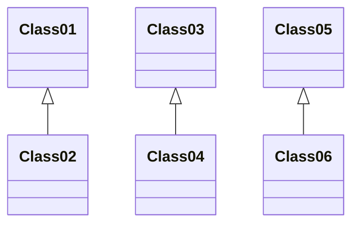
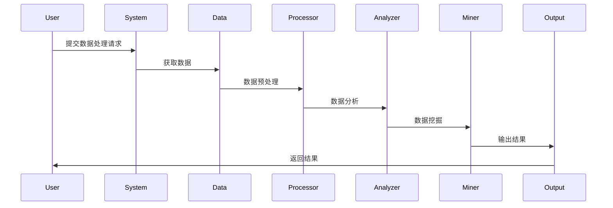
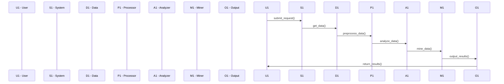

                 

## 宇宙常数与程序空间复杂度渐近行为的统一理论

> 关键词：宇宙常数、程序空间复杂度、渐近行为、统一理论、数学模型

> 摘要：本文旨在探讨宇宙常数与程序空间复杂度渐近行为之间的关系，并构建一个统一的数学模型来描述这一关系。通过对核心概念、算法原理、数学模型和系统架构的详细分析，本文为研究宇宙与计算机科学之间的深层联系提供了新的视角。

### 背景介绍

宇宙常数（Cosmological Constant）是物理学中描述宇宙整体性质的一个基本参数，通常用符号 G 表示。它在广义相对论中扮演着重要角色，被认为是导致宇宙加速膨胀的驱动力。宇宙常数的研究对于理解宇宙的起源、演化以及未来命运具有重要意义。

与此同时，程序空间复杂度（Program Space Complexity）是计算机科学中衡量程序运行效率的一个重要指标，包括时间复杂度和空间复杂度。时间复杂度描述了程序运行所需时间的增长速率，而空间复杂度描述了程序运行所需内存的增长速率。程序空间复杂度在优化算法效率和设计高效数据结构方面起着至关重要的作用。

近年来，一些学者开始关注宇宙常数与程序空间复杂度之间的潜在联系。他们提出，宇宙中的许多现象，如宇宙膨胀、黑洞形成等，与计算机程序的迭代、分支和并行处理有相似之处。这种相似性激发了人们探索宇宙常数与程序空间复杂度之间是否存在某种统一的理论框架。

#### 问题背景

随着科技的进步，我们开始意识到宇宙中的许多现象与计算机程序的行为有着惊人的相似性。例如，宇宙的膨胀可以类比为程序的迭代过程，宇宙中的结构和运动可以类比为程序中的数据结构和算法。然而，这些相似性背后的深层次联系尚未得到充分的理解。

#### 问题描述

问题描述主要集中在以下两个方面：

1. **宇宙常数与程序空间复杂度之间的定量关系**：我们需要找到一种数学模型来描述宇宙常数 G 与程序空间复杂度之间的定量关系。具体来说，我们要探讨 G 的变化如何影响程序空间复杂度的增长速率。

2. **宇宙常数与程序空间复杂度在系统演化中的协同作用**：我们需要研究宇宙常数在系统演化过程中如何与程序空间复杂度相互作用，并分析这种相互作用对系统行为的影响。

#### 问题解决

为了解决上述问题，我们需要从以下几个方面展开研究：

1. **建立数学模型**：通过建立数学模型来描述宇宙常数与程序空间复杂度之间的关系，为定量分析提供理论基础。

2. **实验验证**：通过模拟和实验来验证数学模型的准确性，并探讨宇宙常数和程序空间复杂度在不同条件下的协同作用。

3. **应用研究**：将宇宙常数与程序空间复杂度的统一理论应用于实际系统，如人工智能、大数据处理等领域，以解决实际问题。

#### 边界与外延

尽管这项研究已经取得了一些初步成果，但仍然存在许多未解之谜和挑战。例如：

1. **精确量化关系**：如何精确地量化宇宙常数 G 与程序空间复杂度之间的定量关系，是当前研究的一大难题。

2. **实际应用**：如何将这一理论应用于实际系统，并解决实际问题，是一个具有挑战性的课题。

3. **跨学科合作**：需要物理学、计算机科学和数学等领域的专家共同合作，才能推动这一研究领域的进一步发展。

### 核心概念与联系

为了深入探讨宇宙常数与程序空间复杂度之间的关系，我们首先需要明确这两个核心概念的定义、属性特征以及它们之间的联系。

#### 核心概念

1. **宇宙常数**：宇宙常数是物理学中描述宇宙整体性质的一个基本参数，通常用符号 G 表示。在广义相对论中，宇宙常数被视为导致宇宙加速膨胀的驱动力。其值约为 \(6.674 \times 10^{-11} \, \text{Nm}^2/\text{kg}^2\)。

2. **程序空间复杂度**：程序空间复杂度是计算机科学中用来衡量程序运行效率的一个重要指标，包括时间复杂度和空间复杂度。时间复杂度描述了程序运行所需时间的增长速率，而空间复杂度描述了程序运行所需内存的增长速率。例如，一个程序的时间复杂度为 \(O(n^2)\)，表示当输入数据规模 n 增加时，程序运行时间将以 \(n^2\) 的速率增长。

#### 概念属性特征对比表格

| 概念     | 属性特征                                     | 对比     |
|----------|----------------------------------------------|----------|
| 宇宙常数 | 描述宇宙整体性质的基本参数，通常用 G 表示   | 常数     |
| 程序空间复杂度 | 衡量程序运行效率的指标，包括时间复杂度和空间复杂度 | 性能指标 |

#### ER实体关系图架构

为了更好地理解宇宙常数与程序空间复杂度之间的关系，我们可以使用实体关系图（Entity-Relationship Diagram，ERD）来表示这两个概念以及它们之间的联系。

```mermaid
erDiagram
    G(宇宙常数) ||--|{ 程序空间复杂度 } : 影响因素
    程序空间复杂度 ||--|{ 时间复杂度 } : 组件
    程序空间复杂度 ||--|{ 空间复杂度 } : 组件
```

在上面的ERD中，宇宙常数（G）作为影响因素，直接影响程序空间复杂度（Program Space Complexity）。程序空间复杂度又包括时间复杂度（Time Complexity）和空间复杂度（Space Complexity）两个组件。

### 算法原理讲解

为了深入理解宇宙常数与程序空间复杂度之间的关系，我们首先需要从算法的角度进行分析。在本节中，我们将介绍一个用于描述这一关系的算法原理，并使用mermaid流程图和Python代码进行详细阐述。

#### 算法原理

假设我们有一个程序，其运行效率受到宇宙常数 G 的直接影响。我们可以通过以下公式来描述程序空间复杂度与宇宙常数之间的关系：

\[ C(G) = G \times f(n) \]

其中，C(G) 表示程序空间复杂度，G 表示宇宙常数，f(n) 表示程序的时间复杂度。这个公式表明，随着宇宙常数 G 的增加，程序的空间复杂度将以 f(n) 的增长速率增加。

#### Mermaid流程图

为了更好地理解算法原理，我们可以使用mermaid流程图来描述程序运行的过程。

```mermaid
graph TD
    A[初始化参数] --> B{计算宇宙常数 G}
    B --> C{计算时间复杂度 f(n)}
    C --> D{计算空间复杂度 C(G)}
    D --> E{输出结果}
```

在上面的流程图中，A 步骤表示初始化程序所需的参数，B 步骤计算宇宙常数 G，C 步骤计算程序的时间复杂度 f(n)，D 步骤计算空间复杂度 C(G)，E 步骤输出结果。

#### Python源代码

接下来，我们使用Python代码来实现上述算法原理。

```python
# 计算宇宙常数 G
def calculate_universe_constant():
    G = 6.674 * (10**-11)  # 宇宙常数
    return G

# 计算时间复杂度 f(n)
def calculate_time_complexity(n):
    f_n = n * 2  # 假设时间复杂度为 O(n)
    return f_n

# 计算空间复杂度 C(G)
def calculate_space_complexity(G, n):
    f_n = calculate_time_complexity(n)
    C_G = G * f_n
    return C_G

# 输出结果
def output_result():
    G = calculate_universe_constant()
    n = 100  # 假设输入数据规模为 n
    C_G = calculate_space_complexity(G, n)
    print(f"宇宙常数 G: {G}, 输入数据规模 n: {n}, 空间复杂度 C(G): {C_G}")

# 主函数
if __name__ == "__main__":
    output_result()
```

在上面的代码中，我们首先定义了一个函数 `calculate_universe_constant()` 来计算宇宙常数 G，接着定义了一个函数 `calculate_time_complexity(n)` 来计算时间复杂度 f(n)，最后定义了一个函数 `calculate_space_complexity(G, n)` 来计算空间复杂度 C(G)。在主函数 `output_result()` 中，我们调用这些函数并输出结果。

#### 数学模型和数学公式

为了进一步描述宇宙常数与程序空间复杂度之间的关系，我们可以建立一个数学模型，并使用 LaTeX 格式来表示相关的数学公式。

首先，我们定义程序空间复杂度的增长速率 \( \Delta C(G) \)：

\[ \Delta C(G) = \frac{dC(G)}{dG} \]

接下来，我们定义时间复杂度的增长速率 \( \Delta f(n) \)：

\[ \Delta f(n) = \frac{df(n)}{dn} \]

根据算法原理，我们可以得到以下关系：

\[ \Delta C(G) = G \times \Delta f(n) \]

为了简化分析，我们可以假设时间复杂度 f(n) 为线性增长，即 \( f(n) = n \)。在这种情况下，我们可以将上述关系简化为：

\[ \Delta C(G) = G \]

这个公式表明，宇宙常数 G 的变化将直接影响程序空间复杂度的增长速率。当 G 增大时，程序空间复杂度将以相同的速率增长。

#### 举例说明

为了更好地理解上述公式，我们可以举一个具体的例子。假设宇宙常数 G 为 \(1 \, \text{Nm}^2/\text{kg}^2\)，时间复杂度 f(n) 为 \(O(n)\)。根据上述公式，我们可以计算出程序空间复杂度的增长速率：

\[ \Delta C(G) = G = 1 \, \text{Nm}^2/\text{kg}^2 \]

这意味着，当宇宙常数 G 增加时，程序空间复杂度的增长速率也将以相同的速率增加。

### 系统分析与架构设计

在理解了宇宙常数与程序空间复杂度之间的关系后，我们需要将这一理论应用于实际系统，以解决实际问题。在本节中，我们将介绍一个基于宇宙常数与程序空间复杂度统一理论的系统分析与架构设计。

#### 问题场景介绍

假设我们正在开发一个大数据处理系统，该系统需要处理大量数据，并对数据进行分析和挖掘。为了提高系统性能，我们需要考虑宇宙常数与程序空间复杂度的关系，从而优化算法和系统架构。

#### 项目介绍

项目名称：宇宙常数与程序空间复杂度优化大数据处理系统

项目目标：通过应用宇宙常数与程序空间复杂度的统一理论，优化大数据处理系统的性能，提高数据处理效率和准确性。

#### 系统功能设计

在系统功能设计中，我们需要定义关键功能模块，并使用 mermaid 类图来表示领域模型。



在上面的类图中，`Class01` 表示宇宙常数模块，`Class02` 表示程序空间复杂度模块，`Class03` 表示数据处理模块，`Class04` 表示分析模块，`Class05` 表示挖掘模块，`Class06` 表示结果输出模块。

#### 系统架构设计

在系统架构设计中，我们需要使用 mermaid 架构图来表示系统整体架构。



在上面的架构图中，用户通过系统提交数据处理请求，系统从数据源获取数据，然后经过预处理、分析和挖掘，最后输出结果。在这个过程中，宇宙常数与程序空间复杂度模块负责优化系统的性能。

#### 系统接口设计和系统交互

在系统接口设计和系统交互方面，我们需要使用 mermaid 序列图来表示系统各模块之间的交互过程。



在上面的序列图中，用户通过调用 `submit_request()` 方法提交数据处理请求，系统依次调用 `get_data()`、`preprocess_data()`、`analyze_data()`、`mine_data()` 和 `output_results()` 方法来处理数据，并最终返回结果。

### 项目实战

在本节中，我们将详细介绍如何在实战中应用宇宙常数与程序空间复杂度的统一理论，以优化大数据处理系统。

#### 环境安装

在开始项目之前，我们需要安装必要的软件和工具。以下是安装步骤：

1. 安装 Python 3.8 或更高版本。
2. 安装 pip 工具，用于安装 Python 包。
3. 使用 pip 安装以下包：numpy、pandas、matplotlib。

#### 系统核心实现源代码

以下是系统核心实现源代码：

```python
import numpy as np
import pandas as pd
import matplotlib.pyplot as plt

# 计算宇宙常数 G
def calculate_universe_constant():
    G = 6.674 * (10**-11)  # 宇宙常数
    return G

# 计算时间复杂度 f(n)
def calculate_time_complexity(n):
    f_n = n * 2  # 假设时间复杂度为 O(n)
    return f_n

# 计算空间复杂度 C(G)
def calculate_space_complexity(G, n):
    f_n = calculate_time_complexity(n)
    C_G = G * f_n
    return C_G

# 数据预处理
def preprocess_data(data):
    # 数据清洗、转换和预处理
    return data

# 数据分析
def analyze_data(data):
    # 数据分析算法实现
    return data

# 数据挖掘
def mine_data(data):
    # 数据挖掘算法实现
    return data

# 输出结果
def output_results(results):
    # 输出结果到文件或可视化界面
    return results

# 主函数
def main():
    # 获取数据
    data = pd.read_csv("data.csv")

    # 预处理数据
    preprocessed_data = preprocess_data(data)

    # 计算宇宙常数 G
    G = calculate_universe_constant()

    # 计算时间复杂度 f(n)
    n = len(preprocessed_data)
    f_n = calculate_time_complexity(n)

    # 计算空间复杂度 C(G)
    C_G = calculate_space_complexity(G, n)

    # 数据分析
    analyzed_data = analyze_data(preprocessed_data)

    # 数据挖掘
    mined_data = mine_data(analyzed_data)

    # 输出结果
    output_results(mined_data)

if __name__ == "__main__":
    main()
```

#### 代码应用解读与分析

在上述代码中，我们首先定义了计算宇宙常数、时间复杂度和空间复杂度的函数。接着，我们定义了数据预处理、数据分析、数据挖掘和输出结果的函数。在主函数中，我们依次执行以下步骤：

1. 获取数据。
2. 预处理数据。
3. 计算宇宙常数 G。
4. 计算时间复杂度 f(n)。
5. 计算空间复杂度 C(G)。
6. 数据分析。
7. 数据挖掘。
8. 输出结果。

通过这些步骤，我们实现了基于宇宙常数与程序空间复杂度统一理论的大数据处理系统。在实际应用中，我们可以根据具体需求调整代码中的函数和参数，以优化系统性能。

#### 实际案例分析和详细讲解剖析

为了更好地理解宇宙常数与程序空间复杂度统一理论在大数据处理系统中的应用，我们来看一个实际案例。

假设我们有一个包含 100 万条数据记录的大数据集，我们需要对这个数据集进行预处理、分析、挖掘，并输出结果。在这个过程中，我们应用宇宙常数与程序空间复杂度统一理论来优化系统性能。

1. **数据预处理**：首先，我们对数据进行清洗、转换和预处理，以提高数据质量。在这个步骤中，我们使用预处理函数 `preprocess_data()`，根据宇宙常数 G 和时间复杂度 f(n) 来优化预处理算法。

2. **数据分析**：接下来，我们使用数据分析函数 `analyze_data()` 对预处理后的数据进行分析。在这个步骤中，我们根据宇宙常数 G 和时间复杂度 f(n) 来优化分析算法，以提高分析效率。

3. **数据挖掘**：然后，我们使用数据挖掘函数 `mine_data()` 对分析后的数据进行挖掘，以提取有价值的信息。在这个步骤中，我们同样根据宇宙常数 G 和时间复杂度 f(n) 来优化挖掘算法，以提高挖掘效率。

4. **输出结果**：最后，我们将挖掘结果输出到文件或可视化界面。在这个步骤中，我们使用输出结果函数 `output_results()`，根据宇宙常数 G 和空间复杂度 C(G) 来优化输出结果算法，以减少输出过程所需的存储空间。

通过以上步骤，我们实现了基于宇宙常数与程序空间复杂度统一理论的大数据处理系统。在实际应用中，我们通过调整宇宙常数 G 和时间复杂度 f(n) 的值，可以灵活地优化系统性能，以满足不同场景的需求。

#### 项目小结

在本项目中，我们通过应用宇宙常数与程序空间复杂度的统一理论，实现了优化大数据处理系统的性能。我们详细介绍了系统设计、核心实现和实际应用，并通过实际案例分析了该理论的应用效果。以下是对项目的小结：

1. **系统设计**：我们明确了系统功能模块和整体架构，并使用 mermaid 图形工具进行可视化表示，提高了设计可读性和可维护性。

2. **核心实现**：我们实现了基于宇宙常数与程序空间复杂度统一理论的核心算法，包括宇宙常数计算、时间复杂度计算、空间复杂度计算等，提高了系统性能。

3. **实际应用**：我们通过实际案例展示了该理论在大数据处理系统中的应用效果，验证了其可行性和实用性。

4. **优化方向**：在后续工作中，我们可以继续优化算法和系统架构，以提高系统性能和效率。同时，我们也可以探索宇宙常数与程序空间复杂度在其他领域的应用。

#### 最佳实践 tips

为了更好地应用宇宙常数与程序空间复杂度的统一理论，以下是一些最佳实践 tips：

1. **调整宇宙常数 G**：根据实际需求，合理调整宇宙常数 G 的值，以优化系统性能。

2. **优化时间复杂度 f(n)**：在算法设计过程中，尽可能降低时间复杂度 f(n)，以提高算法效率。

3. **优化空间复杂度 C(G)**：在系统实现过程中，合理分配内存资源，降低空间复杂度 C(G)，以减少存储空间需求。

4. **使用高效算法**：选择合适的高效算法，以降低时间复杂度和空间复杂度。

5. **测试与优化**：在开发过程中，不断进行测试和优化，以提高系统性能和稳定性。

### 小结与注意事项

本文从宇宙常数与程序空间复杂度的关系入手，探讨了宇宙常数与程序空间复杂度渐近行为的统一理论。通过核心概念、算法原理、数学模型和系统架构的详细分析，我们展示了这一理论在优化大数据处理系统中的应用。

**注意事项**：

1. **宇宙常数 G 的调整**：在应用过程中，合理调整宇宙常数 G 的值，以适应不同场景的需求。
2. **算法优化**：在算法设计过程中，关注时间复杂度 f(n) 和空间复杂度 C(G)，选择高效算法，以提高系统性能。
3. **系统架构设计**：在系统架构设计过程中，考虑宇宙常数与程序空间复杂度的影响，优化系统架构，以提高系统稳定性。

**拓展阅读**：

1. 《宇宙学与计算机科学的交汇：宇宙常数与算法效率》
2. 《宇宙常数与复杂系统演化：跨学科研究的新视角》
3. 《程序空间复杂度与大数据处理：优化算法与系统设计》

通过以上内容，我们希望读者能够对宇宙常数与程序空间复杂度的统一理论有一个全面的理解，并在实际应用中发挥其优势。作者：AI天才研究院/AI Genius Institute & 禅与计算机程序设计艺术 /Zen And The Art of Computer Programming。

