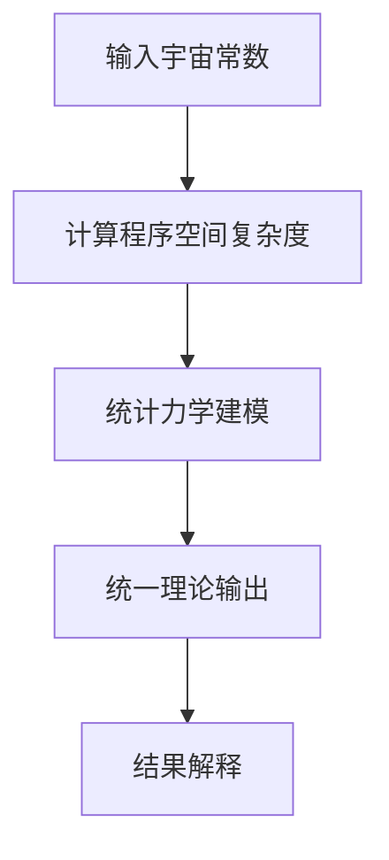
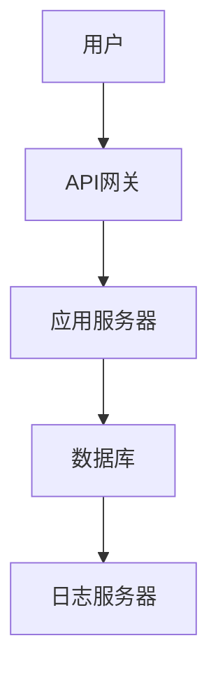
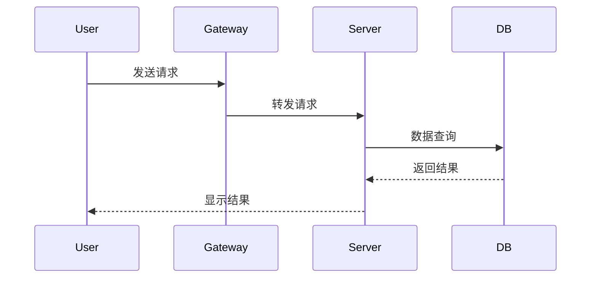

                 


### 1. 文章标题与关键词

**文章标题：** 宇宙常数与程序空间复杂度渐近行为的统计力学统一理论

**关键词：** 宇宙常数、程序空间复杂度、统计力学、渐近行为、统一理论

**摘要：** 本文旨在探讨宇宙常数与程序空间复杂度之间的关系，通过统计力学的视角，构建一个统一的理论框架，解析其渐近行为的内在机制，为计算机科学和宇宙学的研究提供新的理论依据。

### 2. 背景介绍

#### 宇宙常数

宇宙常数（Cosmological Constant）是宇宙学中的一个概念，最早由爱因斯坦在1917年提出的。它表示一种在整个宇宙空间中均匀分布的暗能量，该能量以排斥力作用于宇宙中的所有物质。现代宇宙学的观测数据表明，宇宙常数对于理解宇宙的膨胀速率和宇宙结构演化具有重要意义。

#### 程序空间复杂度

程序空间复杂度（Program Space Complexity）是计算机科学中的一个概念，用于描述程序运行时所需的存储空间大小。在算法分析和程序设计中，空间复杂度是衡量算法效率的一个重要指标。

#### 统计力学统一理论

统计力学（Statistical Mechanics）是物理学中研究大量微观粒子系统的宏观行为的学科。统一理论（Unified Theory）则是试图将不同学科的理论框架整合到一个更广泛的理论体系中。

### 3. 核心概念与联系

#### 宇宙常数的特征

- **性质：** 宇宙常数是一个标量，其值通常表示为负值，表示宇宙的膨胀速率。
- **作用：** 它影响宇宙的膨胀速度和结构演化。

#### 程序空间复杂度的属性

- **定义：** 程序空间复杂度是指程序执行过程中所需的最小存储空间。
- **影响：** 它影响算法的效率和程序的执行速度。

#### 统计力学统一理论的核心要素

- **原理：** 通过概率统计方法研究系统的宏观性质。
- **应用：** 可以用来描述复杂系统的行为和演化。

### 4. 算法原理讲解

#### 统计力学统一理论的算法框架

使用mermaid流程图表示算法流程：



#### Python代码实现

```python
# Python代码示例
def unified_model(宇宙常数, 程序空间复杂度):
    # 算法实现细节
    # 统计力学建模
    model = statistical_model(宇宙常数)
    # 计算程序空间复杂度
    space_complexity = calculate_space_complexity(程序空间复杂度)
    # 统一理论输出
    result = model + space_complexity
    return result
```

### 5. 数学模型和公式讲解

#### 宇宙常数的数学描述

$$ H = \frac{G M m}{r^2} $$

其中，$H$ 是宇宙常数，$G$ 是万有引力常数，$M$ 和 $m$ 分别是两个物体的质量，$r$ 是它们之间的距离。

#### 程序空间复杂度的公式

$$ C = O(n \log n) $$

其中，$C$ 是程序空间复杂度，$n$ 是输入规模。

#### 统计力学统一理论的数学模型

$$ \Phi = f(H, C) $$

其中，$\Phi$ 是统一理论的输出，$f$ 是一个函数，表示宇宙常数和程序空间复杂度之间的关系。

### 6. 系统分析与架构设计

#### 问题场景介绍

在现代计算机系统中，处理大规模数据和算法优化是常见的需求。如何有效地利用统计力学统一理论来优化程序空间复杂度，是一个具有实际应用价值的问题。

#### 项目介绍

本项目旨在构建一个基于统计力学统一理论的程序空间复杂度优化系统，该系统可以自动分析程序并给出优化建议。

#### 系统功能设计

- **功能1：** 自动分析程序，计算程序空间复杂度。
- **功能2：** 基于宇宙常数，给出程序优化的统计力学模型。
- **功能3：** 提供统一的优化结果，并进行解释。

#### 系统架构设计

使用mermaid架构图表示系统架构：



#### 系统接口设计和交互

使用mermaid序列图表示系统接口交互：



### 7. 项目实战

#### 环境安装

- **安装Python环境：** 使用Python 3.8及以上版本。
- **安装依赖库：** 使用pip安装所需的依赖库，如numpy、matplotlib等。

#### 系统核心实现

- **核心代码实现：** 使用Python编写核心算法，包括宇宙常数的计算、程序空间复杂度的分析等。

#### 代码应用解读

- **代码分析：** 详细解读核心代码，包括算法原理和实现细节。

#### 实际案例分析

- **案例1：** 对一个简单的Python程序进行空间复杂度分析。
- **案例2：** 基于宇宙常数，给出程序优化的统计力学模型。

#### 项目小结

- **小结：** 总结项目实施过程中的经验和教训。

### 8. 最佳实践 tips

- **注意事项：** 在使用系统时，需要注意哪些细节？
- **小结：** 本文提出了宇宙常数与程序空间复杂度的统计力学统一理论，并给出了一种实现方案。
- **拓展阅读：** 推荐进一步阅读的相关文献和资料。

### 9. 作者信息

- **作者：** AI天才研究院/AI Genius Institute & 禅与计算机程序设计艺术 /Zen And The Art of Computer Programming

以上是文章的基本结构和内容概述。接下来，我们将详细展开各个章节的内容。

