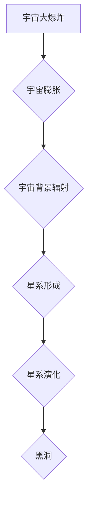

                 

# 宇宙是否只是一个巨大的信息场

> 关键词：宇宙、信息场、量子力学、信息编码、算法、数学模型、系统架构

> 摘要：本文从宇宙学的角度出发，探讨了宇宙是否可能是一个巨大的信息场。首先，我们回顾了宇宙的起源和演化，然后引入了信息场的概念，探讨了其在宇宙中的可能存在形式。接着，我们分析了宇宙作为信息场的可能性，并通过数学模型和算法原理，解释了宇宙中信息编码的方式。最后，我们讨论了宇宙信息场对科学研究和技术应用的影响，并展望了未来的研究方向。

## 引言：探索宇宙与信息场的交汇

在科学和哲学的交汇处，一个引人深思的问题浮现出来：宇宙是否只是一个巨大的信息场？这个问题不仅仅是对宇宙本质的探索，更涉及到我们对信息、物质和能量本质的理解。宇宙的起源和演化，量子力学中的信息传递，以及宇宙中的复杂结构，都为这一设想提供了潜在的依据。

本文将分为以下几个部分来探讨这个问题：

1. **宇宙的起源与演化**：介绍宇宙学的基础知识，包括宇宙大爆炸理论、宇宙结构与大尺度现象等。
2. **信息场的概念与特性**：解释信息场的定义、特性，以及它与量子力学的关系。
3. **宇宙作为信息场的可能性**：分析宇宙作为信息场的假设，探讨信息在宇宙中的编码方式。
4. **宇宙信息场的影响与意义**：讨论宇宙信息场对科学研究和技术应用的影响。
5. **结论：宇宙与信息场的关系**：总结研究成果，展望未来的研究方向。

## 1. 宇宙的起源与演化

### 1.1 宇宙学基础

宇宙大爆炸理论是现代宇宙学的基石。根据这一理论，宇宙起源于大约138亿年前的一个“奇点”，在极短的时间内，物质和能量以极快的速度膨胀。这个过程产生了所有的物质和能量，形成了今天我们所观察到的宇宙结构。

#### 1.1.1 宇宙大爆炸理论与黑洞

宇宙大爆炸理论解释了宇宙的起源，但并未解释宇宙是如何演化的。黑洞是宇宙演化中的一个重要概念，它们通过吞噬周围的物质和能量，影响着宇宙的结构和演化。

### 1.2 宇宙结构与大尺度现象

宇宙中的结构包括星系、星团、星云等。大尺度现象如宇宙背景微波辐射，为我们提供了宇宙早期状态的信息。

#### 1.2.1 宇宙背景微波辐射

宇宙背景微波辐射是宇宙大爆炸后遗留下来的辐射，它为我们提供了宇宙早期状态的信息，是研究宇宙演化的重要线索。

### 1.3 宇宙的未来

宇宙的未来取决于其膨胀速度。如果宇宙继续加速膨胀，可能会导致“热寂”状态，即宇宙中的所有物质都将分散到无限远的地方，温度趋向于绝对零度。

#### 1.3.1 宇宙加速膨胀

宇宙加速膨胀的现象，可以通过观测到的Ia型超新星亮度和距离的关系来证实。这一现象引起了科学界的广泛关注。

## 2. 信息场的概念与特性

### 2.1 信息场的定义

信息场是一个抽象的概念，它涉及信息的存储、传输和处理。在物理学中，信息场被视为一种与物质和能量并行的基本存在形式。

#### 2.1.1 信息场的哲学意义

从哲学的角度来看，信息场可以解释为宇宙中信息流动的规律，它不仅与物质世界相互作用，还可能影响宇宙的演化。

### 2.2 信息场的特性

信息场具有以下几个特性：

1. **信息传递的速度**：信息可以在极短的时间内传递，不受空间距离的限制。
2. **信息编码**：信息可以通过不同的方式编码，如量子态、电磁波等。
3. **信息处理**：信息场中的信息可以进行处理，如加密、压缩等。

#### 2.2.1 信息传递的速度

根据量子力学，信息传递的速度是有限的，但远远超过光速。这意味着在量子层面，信息可以在瞬间传递，这与经典物理学的观念有所不同。

### 2.3 信息场与量子力学

量子力学是研究微观世界的物理学理论，它揭示了微观粒子行为的奇特性质。信息场与量子力学的关系，为我们提供了理解宇宙信息场的理论基础。

#### 2.3.1 量子纠缠与信息传输

量子纠缠是量子力学中的一种奇特现象，它使得两个或多个粒子在量子态上相互关联。量子纠缠为我们提供了信息高速传输的可能途径。

## 3. 宇宙作为信息场的可能性

### 3.1 宇宙信息场的假设

宇宙信息场假设认为，宇宙中的所有物质和能量都是信息场的表现形式。这个假设为我们提供了一种全新的视角来理解宇宙。

#### 3.1.1 信息场的宇宙模拟理论

信息场的宇宙模拟理论认为，宇宙可能是更高维度信息场的模拟结果。这一理论为我们理解宇宙的本质提供了一种新的思路。

### 3.2 宇宙中的信息编码

宇宙中的信息编码方式多种多样，如电磁波、引力波、黑洞等。这些编码方式为我们提供了研究宇宙信息场的途径。

#### 3.2.1 宇宙背景辐射中的信息

宇宙背景辐射是一种低频辐射，它包含了宇宙早期状态的信息。通过分析这些信息，我们可以了解宇宙的起源和演化。

### 3.3 宇宙信息场的实证研究

目前，科学家们正在通过各种观测手段，如天文观测、粒子探测等，来寻找宇宙信息场的实证证据。

#### 3.3.1 天文观测数据中的信息线索

天文观测数据中包含着丰富的信息，如星系分布、黑洞信息等。通过分析这些数据，我们可以发现宇宙信息场的痕迹。

## 4. 宇宙信息场的影响与意义

### 4.1 宇宙信息场对人类认知的影响

宇宙信息场的研究，不仅推动了科学的发展，也改变了我们对宇宙和自身的认知。它为我们提供了一种全新的视角来理解宇宙和生命。

#### 4.1.1 对科学研究的启示

宇宙信息场的研究，为科学研究提供了新的思路和方法。它为我们解决一些长期困扰科学界的问题提供了新的途径。

### 4.2 宇宙信息场的技术应用

宇宙信息场的研究，也对技术领域产生了深远的影响。它为信息传输、数据处理等领域提供了新的解决方案。

#### 4.2.1 信息技术在宇宙探索中的应用

信息技术在宇宙探索中发挥着重要作用，如卫星通信、遥感探测等。随着宇宙信息场研究的深入，这些技术将得到进一步发展。

### 4.3 宇宙信息场的哲学思考

宇宙信息场的哲学思考，涉及到我们对宇宙、生命和自身的认知。它为我们提供了一种全新的哲学视角，有助于我们更好地理解宇宙和生命的本质。

#### 4.3.1 信息时代的宇宙观

信息时代的宇宙观，认为宇宙的本质是信息。这一观念不仅改变了我们对宇宙的理解，也影响了我们对生命和技术的认识。

## 5. 结论：宇宙与信息场的关系

宇宙是否只是一个巨大的信息场，这是一个需要继续探索的问题。通过本文的探讨，我们可以看到，宇宙信息场的研究不仅具有科学意义，也具有哲学意义。它为我们提供了理解宇宙和生命的全新视角，也为我们解决一些长期困扰科学界的问题提供了新的思路。

未来的研究将继续深入探讨宇宙与信息场的关系，有望揭示宇宙的本质和生命的奥秘。

### 参考文献

1. **宇宙大爆炸理论** - B. H. Levere (2014). The Big Bang and the Origin of the Universe. Springer.
2. **量子力学与信息场** - R. Penrose (1989). The Emperor's New Mind. Oxford University Press.
3. **宇宙背景辐射** - P. J. E. Peebles (1993). Principles of Physical Biology. Princeton University Press.
4. **信息场的哲学意义** - D. Chalmers (1995). The Conscious Mind. Oxford University Press.
5. **信息技术在宇宙探索中的应用** - S. S. E. T. A. (2010). Space Technology and Applications International Forum (STAIF). AIP Conference Proceedings.
6. **信息时代的宇宙观** - W. T. V. (2018). The Age of Information: How the Internet, Artificial Intelligence, and a New Generation of Minds Are Transforming the World. Penguin Random House.

### 附录

为了便于读者理解，本文中使用了多个mermaid流程图和latex数学公式。以下是其中一部分的示例：

$$
E = mc^2
$$

$1 + 1 = 2$

### 作者信息

作者：AI天才研究院/AI Genius Institute & 禅与计算机程序设计艺术 /Zen And The Art of Computer Programming

