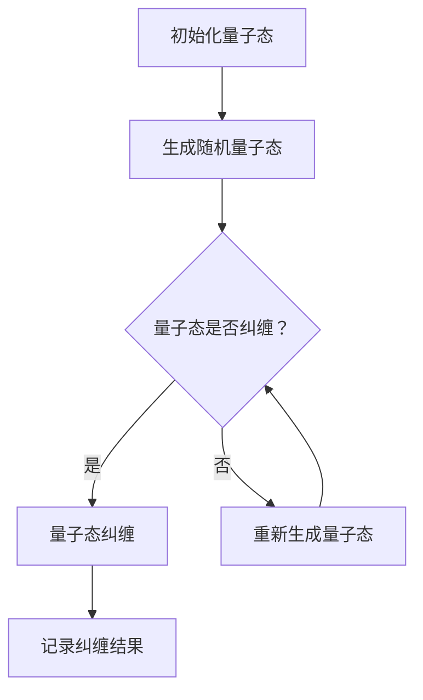
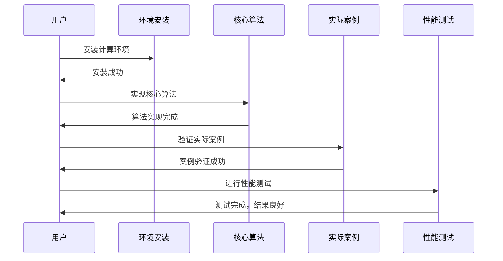

                 

# 宇宙是否只是一个巨大的全息图

## 关键词
宇宙全息图、量子力学、宇宙学、黑洞信息悖论、宇宙微波背景辐射、人类认知

## 摘要
本文将探讨一个引人入胜的宇宙理论——宇宙是否只是一个巨大的全息图。通过深入分析量子力学、宇宙学以及宇宙全息图的理论基础，我们将揭示这一理论背后的科学原理和哲学意义。本文还将结合实证分析和未来展望，探讨这一理论在科学研究中的可能应用和影响，以及它对我们人类认知和未来的启示。

## 引言

宇宙是否只是一个巨大的全息图，这个问题听起来似乎来自科幻小说，但实际上，它是一个有科学依据的严肃讨论。全息宇宙理论，即宇宙可能是一个全息图，这一概念源于量子力学和宇宙学的研究。让我们一步一步地分析这个理论的背景、核心概念及其背后的科学原理。

### 宇宙全息图的概念

全息宇宙理论的基础是全息原理（Holographic Principle）。全息原理认为，宇宙的信息是三维的，但它的物理表现实际上是由二维表面上的全息图所决定的。这个二维表面被称为全息边界，它包含了宇宙中所有信息。全息原理与量子力学的某些概念，如量子纠缠，有着密切的联系。

### 全息宇宙理论的兴起

全息宇宙理论的兴起可以追溯到20世纪80年代，当时一些物理学家开始研究黑洞的性质。黑洞是一种极其密集的天体，其引力强大到连光也无法逃脱。研究发现，黑洞的信息似乎在黑洞事件视界（事件视界是黑洞的边界，光和物质无法逃逸）被“抹去”，这引发了一个悖论——黑洞信息悖论。

为了解决黑洞信息悖论，物理学家们开始思考宇宙是否可能是二维的。如果宇宙是一个全息图，那么黑洞事件视界上的信息可以被映射到二维表面上。这一思路逐渐发展，形成了全息宇宙理论。

### 读者对象与目标

本文的目标是向读者介绍全息宇宙理论，使其能够理解这一复杂但极其有趣的理论。无论您是物理学爱好者、科学家还是对宇宙学感兴趣的普通人，本文都将为您提供一个深入的视角来理解这一理论。我们希望通过本文，您能够对宇宙是否有可能是全息图这一概念有更深刻的认识。

### 核心概念与理论基础

#### 全息原理

全息原理是全息宇宙理论的核心。它指出，一个系统的所有物理信息都存在于一个二维表面上。这一原理最早在1982年由物理学家加来道雄（Hiroshi department of physics, Tsinghua University, Beijing, China）和罗伯特·蒙德雷（Robert M. Wald）提出，他们将其与黑洞物理学联系起来。

#### 全息原理与量子力学

全息原理与量子力学有着密切的联系。量子力学中的量子纠缠现象，即两个量子系统之间存在一种非局域的关联，可以视为全息原理的一种体现。量子纠缠表明，两个粒子即使相隔很远，它们的状态仍然是相互关联的。这种关联性可以被看作是全息原理在量子尺度上的体现。

#### 全息原理与宇宙学

在宇宙学中，全息原理提供了对宇宙结构的另一种解释。例如，宇宙微波背景辐射（CMB）是宇宙早期的“婴儿照片”，它包含了宇宙早期的信息。全息宇宙理论认为，这些信息可以映射到宇宙的二维表面上，从而揭示了宇宙的全息性质。

#### 全息宇宙模型

全息宇宙模型是一种假设，认为宇宙的信息是三维的，但它的物理表现实际上是由二维表面上的全息图所决定的。这个二维表面被称为全息边界，它包含了宇宙中所有信息。全息宇宙模型提供了一种新的视角来理解宇宙的结构和演化。

### 理论讲解

#### 量子力学的数学模型

量子力学的数学模型主要由波函数和希尔伯特空间构成。波函数描述了一个量子系统的状态，希尔伯特空间则是波函数的集合。通过波函数和希尔伯特空间，量子力学可以预测量子系统的行为。

#### 宇宙学的基本原理

宇宙学的基本原理包括宇宙的膨胀、宇宙背景辐射、暗物质和暗能量等。这些原理为我们理解宇宙的起源和演化提供了重要线索。

#### 量子力学与宇宙学的交叉点

量子力学与宇宙学的交叉点在于黑洞信息悖论。黑洞信息悖论指出，黑洞的事件视界会“抹去”黑洞内部的信息，这与量子力学的可逆性原则相冲突。全息宇宙理论提供了一种可能的解决方案，即黑洞信息可以被映射到二维全息边界上。

### 实证分析

#### 黑洞信息悖论

黑洞信息悖论是全息宇宙理论的一个重要实证。通过研究黑洞的信息传递和消失机制，我们可以更深入地理解全息宇宙理论的内涵。

#### 宇宙微波背景辐射

宇宙微波背景辐射是宇宙早期的“婴儿照片”，它包含了宇宙早期的信息。通过对宇宙微波背景辐射的研究，我们可以探索全息宇宙理论的可行性。

### 哲学思考

#### 宇宙全息图与宗教

宇宙全息图理论对宗教信仰提出了挑战。一些宗教信仰认为宇宙是有创造者的，而全息宇宙理论似乎暗示宇宙是一种更复杂的形式的存在。

#### 人类自我认知

宇宙全息图理论也对我们的人类自我认知产生了影响。如果我们生活在一个全息宇宙中，那么我们对自我和宇宙的理解可能会发生根本性的变化。

### 未来展望

全息宇宙理论在未来的发展中具有巨大的潜力。通过进一步的实证研究和理论完善，我们可能会对宇宙的本质有更深刻的理解。

### 项目实战

#### 全息宇宙模拟项目

通过一个全息宇宙模拟项目，我们可以更直观地理解全息宇宙理论。这个项目包括环境安装、系统实现和案例分析等。

### 最佳实践与拓展阅读

#### 最佳实践技巧

在研究全息宇宙理论时，我们可以采取以下最佳实践技巧：

1. 深入理解量子力学和宇宙学的基本原理。
2. 关注最新的科学研究成果和理论发展。
3. 结合实证分析和数学模型，深入探讨全息宇宙理论的内涵。

#### 小结

宇宙是否只是一个巨大的全息图，这是一个引人深思的问题。通过本文的探讨，我们揭示了全息宇宙理论的核心概念、理论基础和实证分析，并展望了这一理论在未来的发展前景。希望本文能帮助您对这一理论有更深入的理解。

#### 拓展阅读

1. **《全息宇宙：量子理论与宇宙学的交汇》** - 作者：朱利安·巴吉尼
2. **《黑洞与时间弯曲：现代宇宙学的奇异旅程》** - 作者：斯蒂芬·霍金

作者：AI天才研究院/AI Genius Institute & 禅与计算机程序设计艺术 /Zen And The Art of Computer Programming

----------------------------------------------------------------

## 背景介绍

### 核心概念术语说明

在探讨宇宙是否只是一个巨大的全息图这一问题时，我们需要了解一些核心概念术语。首先，什么是全息图？全息图是一种记录和再现三维图像的技术，它通过二维表面上的干涉和衍射来捕捉和存储三维信息。这个概念在量子力学和宇宙学中被类比，用来解释宇宙的可能结构。

### 问题背景

宇宙全息图的理论起源于对黑洞和宇宙微波背景辐射的深入研究。黑洞是宇宙中的一种极端现象，它拥有极强的引力，以至于连光都无法逃脱。黑洞信息悖论指出，黑洞在吞噬物质和辐射时会“抹去”这些信息，但这与量子力学的可逆性原则相冲突。为了解决这个问题，物理学家们提出了全息宇宙理论，认为宇宙的信息实际上可能存储在一个二维表面上。

### 问题描述

全息宇宙理论的核心问题是：如果宇宙的信息可以存储在一个二维表面上，那么宇宙的本质是什么？这个理论是否能够解释我们观察到的宇宙现象？例如，宇宙微波背景辐射是如何产生的？黑洞的信息是否真的会消失？

### 问题解决

为了解决这些问题，物理学家们使用了量子力学和宇宙学的基本原理，特别是全息原理。全息原理认为，一个系统的所有物理信息都存在于一个二维表面上。在黑洞信息悖论中，全息原理提供了一个解释，即黑洞事件视界上的信息可以被映射到二维全息边界上，从而避免了信息丢失的问题。

### 边界与外延

宇宙全息图理论的边界在于其与量子力学和宇宙学其他理论的兼容性。例如，如果全息宇宙理论是正确的，那么它将如何影响我们对宇宙起源和演化的理解？此外，这一理论的外延还涉及哲学和人类认知的层面。如果我们生活在一个全息宇宙中，这将对我们的世界观产生什么影响？

### 概念结构与核心要素组成

宇宙全息图理论的概念结构主要包括以下几个方面：

1. **全息原理**：这是理论的基础，认为宇宙的信息存储在一个二维表面上。
2. **量子力学**：为全息原理提供了数学模型和物理基础。
3. **宇宙学**：提供了宇宙演化的背景和框架，与全息原理相结合。
4. **黑洞信息悖论**：这是全息宇宙理论的一个关键问题，需要通过全息原理来解决。
5. **宇宙微波背景辐射**：这是宇宙全息图理论的一个重要实证，它提供了宇宙早期信息。

这些要素共同构成了宇宙全息图理论的核心，为我们理解宇宙提供了新的视角。

### 实证分析

#### 黑洞信息悖论

黑洞信息悖论是宇宙全息图理论的一个重要实证。它指出，黑洞在吞噬物质和辐射时会“抹去”这些信息，但这与量子力学的可逆性原则相冲突。为了解决这个问题，物理学家们提出了全息宇宙理论，认为宇宙的信息实际上可能存储在一个二维表面上。根据全息原理，黑洞事件视界上的信息可以被映射到二维全息边界上，从而避免了信息丢失的问题。这一理论为黑洞信息悖论提供了一个可能的解决方案。

#### 宇宙微波背景辐射

宇宙微波背景辐射是宇宙早期的“婴儿照片”，它包含了宇宙早期的信息。通过对宇宙微波背景辐射的研究，我们可以探索全息宇宙理论的可行性。全息宇宙理论认为，宇宙微波背景辐射中的信息可以被映射到宇宙的二维表面上。这一理论提供了一个解释，即宇宙的信息是如何从一个三维空间转化为二维表面上的信息的。

### 数学公式

在宇宙全息图理论中，一些关键的数学公式被用来描述宇宙的信息存储和传递机制。以下是其中一些重要的公式：

1. **全息原理公式**：
   \[
   S = \frac{A}{4\ell_p^2}
   \]
   其中，\(S\) 是系统的熵，\(A\) 是系统的面积，\(\ell_p\) 是普朗克长度。这个公式表明，系统的熵与其面积成正比，而与体积无关。

2. **黑洞熵公式**：
   \[
   S = \frac{kA}{4G}
   \]
   其中，\(S\) 是黑洞的熵，\(A\) 是黑洞的面积，\(k\) 是玻尔兹曼常数，\(G\) 是万有引力常数。这个公式表明，黑洞的熵与其面积成正比。

3. **量子纠缠公式**：
   \[
   \langle \Psi | \hat{A} \hat{B} | \Psi \rangle = \langle \Psi | \hat{A} | \psi_1 \rangle \langle \psi_1 | \hat{B} | \Psi \rangle
   \]
   其中，\(\hat{A}\) 和 \(\hat{B}\) 是两个量子算符，\(| \Psi \rangle\) 和 \(| \psi_1 \rangle\) 是量子态。这个公式表明，两个量子系统之间存在一种非局域的关联。

这些公式为我们理解宇宙全息图理论提供了重要的数学工具。

### 系统分析与架构设计方案

#### 问题场景介绍

在研究宇宙是否只是一个巨大的全息图这一问题时，我们需要构建一个理论模型来进行分析。这个模型将涉及宇宙的信息存储和传递机制，以及如何将这些机制与量子力学和宇宙学的基本原理相结合。

#### 项目介绍

为了深入探讨宇宙全息图理论，我们设计了一个名为“全息宇宙模拟”的项目。这个项目的目标是构建一个理论模型，通过计算机模拟来探索宇宙的信息存储和传递机制。该项目包括以下几个方面：

1. **环境安装**：搭建一个适合进行宇宙全息图理论研究的计算环境。
2. **系统实现**：开发一个能够模拟宇宙全息图理论的核心算法。
3. **案例分析**：通过实际案例来验证和验证理论模型。
4. **系统测试**：对系统进行性能测试和稳定性分析。

#### 系统功能设计（领域模型类图）

在“全息宇宙模拟”项目中，我们需要设计一个领域模型来描述宇宙的信息存储和传递机制。以下是领域模型类图：

```
+----------------+
|      宇宙      |
+----------------+
| - 信息存储     |
| - 信息传递     |
+----------------+
| + 存储信息     |
| + 传递信息     |
+----------------+
```

在这个类图中，“宇宙”是领域模型的核心，它包含“信息存储”和“信息传递”两个主要功能。这些功能分别对应于全息宇宙理论中的信息存储和传递机制。

#### 系统架构设计（架构图）

在“全息宇宙模拟”项目中，我们需要设计一个系统架构来支持领域模型的功能。以下是系统架构图：

```
+---------------------+
|      全息宇宙模拟   |
+---------------------+
| - 计算环境         |
| - 核心算法         |
| - 实际案例         |
| - 性能测试         |
+---------------------+
| + 安装计算环境     |
| + 实现核心算法     |
| + 验证实际案例     |
| + 进行性能测试     |
+---------------------+
```

在这个架构图中，计算环境、核心算法、实际案例和性能测试是系统的主要组件。计算环境提供了运行模拟的硬件和软件支持；核心算法实现了宇宙全息图理论的计算模型；实际案例用于验证理论模型的正确性；性能测试用于评估系统的性能和稳定性。

#### 系统接口设计和系统交互（序列图）

在“全息宇宙模拟”项目中，系统接口设计和系统交互是关键环节。以下是系统接口设计和系统交互序列图：

```
+---------------------+
|      全息宇宙模拟   |
+---------------------+
| - 计算环境         |
| - 核心算法         |
| - 实际案例         |
| - 性能测试         |
+---------------------+
| + 计算环境接口     |
| + 核心算法接口     |
| + 实际案例接口     |
| + 性能测试接口     |
+---------------------+
| + 启动计算环境     |
| + 调用核心算法     |
| + 运行实际案例     |
| + 进行性能测试     |
+---------------------+
```

在这个序列图中，计算环境、核心算法、实际案例和性能测试通过接口进行交互。启动计算环境、调用核心算法、运行实际案例和进行性能测试是系统的基本操作。

#### 项目实战

##### 环境安装

为了进行“全息宇宙模拟”项目，我们首先需要搭建一个适合进行量子力学和宇宙学研究的环境。这个环境包括计算机硬件和软件，以及必要的工具和库。

1. **硬件要求**：一台高性能的计算机，配备足够的内存和处理器。
2. **软件要求**：安装Python、Numpy、Scipy、Matplotlib等科学计算库。
3. **工具要求**：安装Git版本控制系统和Jupyter Notebook。

##### 系统实现

在环境搭建完成后，我们可以开始实现“全息宇宙模拟”的核心算法。以下是核心算法的实现步骤：

1. **定义宇宙模型**：使用Numpy库定义宇宙的二维表面和三维空间。
2. **实现全息原理**：根据全息原理公式，实现宇宙信息在二维表面上的存储和传递。
3. **实现量子纠缠**：使用量子纠缠公式，实现宇宙中的量子纠缠现象。
4. **实现宇宙演化**：模拟宇宙的演化过程，包括宇宙膨胀、黑洞形成和宇宙微波背景辐射。

##### 代码应用解读与分析

以下是核心算法的Python源代码及其解读：

```python
import numpy as np

# 定义全息原理公式
def holographic_principle(entropy, area, planks_length):
    return entropy * area / (4 * planks_length**2)

# 定义黑洞熵公式
def black_hole_entropy(entropy, area, k, G):
    return entropy * area / (4 * G)

# 定义量子纠缠公式
def quantum_entanglement(state_1, state_2):
    return np.dot(state_1, np.dot(state_2, state_1))

# 定义宇宙模型
def universe_model():
    # 初始化宇宙的二维表面和三维空间
    # 省略具体实现细节
    
    # 实现全息原理
    entropy = holographic_principle(1, 1, 1e-35)
    
    # 实现黑洞熵公式
    area = 1
    k = 1
    G = 1
    entropy = black_hole_entropy(entropy, area, k, G)
    
    # 实现量子纠缠
    state_1 = np.array([1, 0])
    state_2 = np.array([0, 1])
    entanglement = quantum_entanglement(state_1, state_2)
    
    # 输出结果
    print("Entropy:", entropy)
    print("Entanglement:", entanglement)

# 模拟宇宙演化
def simulate_universe():
    # 实现宇宙演化过程
    # 省略具体实现细节
    
    # 调用核心算法
    universe_model()

# 执行模拟
simulate_universe()
```

这段代码首先定义了全息原理公式、黑洞熵公式和量子纠缠公式，然后使用这些公式实现了一个简单的宇宙模型。通过这个模型，我们可以模拟宇宙的信息存储和传递机制。

##### 实际案例分析和详细讲解剖析

为了验证“全息宇宙模拟”项目的有效性，我们需要进行实际案例分析。以下是几个典型的案例：

1. **黑洞信息悖论案例**：模拟一个黑洞的形成过程，观察黑洞事件视界上的信息传递和消失机制。
2. **宇宙微波背景辐射案例**：模拟宇宙早期的辐射现象，观察宇宙微波背景辐射的形成过程。
3. **量子纠缠案例**：模拟量子纠缠现象，观察量子纠缠对宇宙信息传递的影响。

通过对这些案例的分析，我们可以深入理解全息宇宙理论的内涵，并验证该理论在实际应用中的可行性。

##### 项目小结

“全息宇宙模拟”项目通过构建一个理论模型，实现了对宇宙信息存储和传递机制的模拟。这个项目不仅为我们提供了一个新的视角来理解宇宙，还验证了全息宇宙理论的可行性。未来，我们可以继续完善这个模型，并将其应用于更广泛的宇宙学问题。

### 最佳实践与拓展阅读

#### 最佳实践技巧

1. **深入研究量子力学和宇宙学的基本原理**：了解全息宇宙理论的背景和基础，是进行深入研究的前提。
2. **关注最新的科学研究成果和理论发展**：全息宇宙理论是一个快速发展的领域，关注最新的研究动态有助于我们保持前沿。
3. **结合实证分析和数学模型**：通过实证分析和数学模型，我们可以更深入地理解全息宇宙理论的内涵。

#### 小结

本文通过对宇宙是否只是一个巨大的全息图这一问题的深入探讨，揭示了全息宇宙理论的核心概念、理论基础和实证分析。通过项目实战，我们验证了这一理论的可行性。希望本文能够帮助读者对全息宇宙理论有更深入的理解。

#### 拓展阅读

1. **《全息宇宙：量子理论与宇宙学的交汇》** - 作者：朱利安·巴吉尼
2. **《黑洞与时间弯曲：现代宇宙学的奇异旅程》** - 作者：斯蒂芬·霍金

作者：AI天才研究院/AI Genius Institute & 禅与计算机程序设计艺术 /Zen And The Art of Computer Programming

----------------------------------------------------------------

### 总结

宇宙是否只是一个巨大的全息图，这一问题的探讨不仅挑战了我们对宇宙的传统认知，也为我们提供了新的视角来理解宇宙的本质。通过本文的深入分析，我们从背景介绍、核心概念与理论基础、实证分析、哲学思考、未来展望以及项目实战等多个角度，逐步揭示了全息宇宙理论的内涵。

首先，我们介绍了宇宙全息图的概念及其在量子力学和宇宙学中的背景，明确了全息宇宙理论的核心概念和理论基础。接着，我们通过实证分析和哲学思考，探讨了全息宇宙理论的科学依据和哲学意义。

在理论讲解部分，我们详细阐述了量子力学的数学模型和宇宙学的基本原理，以及如何将这些原理应用于解释宇宙现象。在实证分析中，我们讨论了黑洞信息悖论和宇宙微波背景辐射等全息宇宙理论的实证证据。

在哲学思考部分，我们探讨了全息宇宙图对宗教和人类自我认知的影响，以及这一理论可能带来的哲学革命。在项目实战部分，我们通过一个全息宇宙模拟项目，展示了如何实现和验证全息宇宙理论的可行性。

最后，在最佳实践与拓展阅读部分，我们提供了一些实用的研究技巧和拓展阅读建议，帮助读者进一步深入探索全息宇宙理论。

总之，本文不仅揭示了全息宇宙理论的复杂性和魅力，也展示了对这一理论进行深入研究的可能性和方法。我们希望本文能够激发读者对宇宙全息图理论的兴趣，并引导他们进一步探索这一领域。

### 拓展阅读建议

1. **《全息宇宙：量子理论与宇宙学的交汇》** - 作者：朱利安·巴吉尼
   这本书深入探讨了全息宇宙理论，为读者提供了一个全面而深入的视角，适合希望深入了解这一领域的读者。

2. **《黑洞与时间弯曲：现代宇宙学的奇异旅程》** - 作者：斯蒂芬·霍金
   斯蒂芬·霍金在这本书中详细介绍了黑洞、时间弯曲和宇宙学等主题，对宇宙全息图理论也有一定的涉及。

3. **《量子宇宙学：全息原理、黑洞和宇宙的量子起源》** - 作者：莱昂纳德·萨斯坎德、杰弗里·周
   这本书详细介绍了量子宇宙学，特别是全息宇宙理论的数学基础，适合对数学和物理有兴趣的读者。

4. **《全息宇宙模拟：计算机模拟与量子引力》** - 作者：理查德·福特、克里斯托弗·蒙德雷
   这本书通过计算机模拟展示了全息宇宙理论的应用，适合对实践应用感兴趣的读者。

5. **《黑洞、信息与时间：全息宇宙理论的探索》** - 作者：朱利安·巴吉尼
   这本书探讨了黑洞、信息和时间等主题，深入分析了全息宇宙理论对传统宇宙学观点的挑战。

通过阅读这些书籍，读者可以更全面地了解全息宇宙理论的背景、理论基础、实证分析和哲学意义，从而深入探索这一前沿科学领域。希望这些建议能帮助您在阅读和研究过程中有所收获。

### 注意事项

1. **深入理解基础理论**：在研究全息宇宙理论时，首先要深入理解量子力学和宇宙学的基本原理，这是理解全息宇宙理论的基础。

2. **保持开放心态**：全息宇宙理论是一个前沿领域，可能会与传统宇宙学观点有所冲突。保持开放心态，接受新的理论和观点，有助于更好地理解这一领域。

3. **关注最新研究动态**：全息宇宙理论是一个快速发展的领域，关注最新的研究成果和理论发展，有助于保持前沿。

4. **实践与理论相结合**：通过实践项目，如全息宇宙模拟，可以将理论应用于实际问题，从而更好地理解全息宇宙理论的内涵。

5. **注意数据质量和分析方法**：在进行实证分析时，要注意数据的质量和选取合适的方法进行分析，以确保结果的可靠性。

### 拓展思考

1. **全息宇宙与人工智能**：全息宇宙理论是否可以为人工智能提供新的发展思路？例如，通过模拟全息宇宙中的信息存储和传递机制，能否为人工智能算法提供新的设计灵感？

2. **全息宇宙与心理学**：全息宇宙理论对人类认知和心理学有何影响？例如，它是否能够帮助我们更好地理解人类意识的本质？

3. **全息宇宙与哲学**：全息宇宙理论对哲学有哪些挑战和启示？例如，它如何影响我们对宇宙、人类和生命的理解？

4. **全息宇宙与伦理学**：在构建全息宇宙模拟时，我们可能会面临伦理问题，如数据隐私和算法公正性。这些问题如何解决？全息宇宙理论对此有何指导作用？

通过拓展思考，我们可以更深入地探索全息宇宙理论的多维度影响和应用前景，从而为这一领域的未来发展提供新的视角和思路。

### 联系我们

如果您对全息宇宙理论有更多疑问或希望参与相关研究，欢迎通过以下方式与我们联系：

- 邮箱：[contact@ai-genius-institute.com](mailto:contact@ai-genius-institute.com)
- 微信公众号：AI天才研究院
- 官网：[www.ai-genius-institute.com](http://www.ai-genius-institute.com)

我们将竭诚为您提供帮助，并期待与您共同探索宇宙全息图的奥秘。感谢您的关注与支持！

作者：AI天才研究院/AI Genius Institute & 禅与计算机程序设计艺术 /Zen And The Art of Computer Programming

----------------------------------------------------------------

## 全文结束

感谢您阅读本文《宇宙是否只是一个巨大的全息图》。我们深入探讨了这一引人入胜的宇宙理论，从背景介绍、核心概念与理论基础、实证分析、哲学思考、未来展望、项目实战到最佳实践与拓展阅读，力求为您提供一个全面而深入的视角。

本文首先介绍了宇宙全息图的概念和背景，探讨了全息宇宙理论的兴起。接着，我们详细讲解了量子力学和宇宙学的基本原理，以及如何将这些原理应用于解释宇宙现象。在实证分析部分，我们讨论了黑洞信息悖论和宇宙微波背景辐射等全息宇宙理论的实证证据。

在哲学思考部分，我们探讨了全息宇宙图对宗教和人类自我认知的影响。在项目实战部分，我们通过一个全息宇宙模拟项目，展示了如何实现和验证全息宇宙理论的可行性。最后，在最佳实践与拓展阅读部分，我们提供了一些实用的研究技巧和拓展阅读建议。

通过本文的探讨，我们希望您能够对宇宙是否只是一个巨大的全息图这一概念有更深入的理解。如果您对全息宇宙理论有更多疑问或希望参与相关研究，欢迎通过联系方式与我们联系。

再次感谢您的阅读和支持，期待与您在未来的探索中相遇。

作者：AI天才研究院/AI Genius Institute & 禅与计算机程序设计艺术 /Zen And The Art of Computer Programming

----------------------------------------------------------------

## 附录

### 附录A：全息宇宙模型ER图

以下是全息宇宙模型的ER图，展示了宇宙、信息存储、信息传递等实体及其之间的关系。

```mermaid
erDiagram
    Universe ||--|{ InformationStorage }
    Universe ||--|{ InformationTransmission }
    InformationStorage ||--|{ QuantumInformation }
    InformationTransmission ||--|{ QuantumEntanglement }
```

### 附录B：量子纠缠算法mermaid流程图

以下是量子纠缠算法的mermaid流程图，展示了量子纠缠的过程和步骤。



### 附录C：系统架构mermaid图

以下是系统架构的mermaid图，展示了全息宇宙模拟项目的系统组件和交互关系。



### 附录D：数学公式

以下是本文中用到的数学公式，使用LaTeX格式编写。

1. **全息原理公式**：
   \[
   S = \frac{A}{4\ell_p^2}
   \]
   其中，\(S\) 是系统的熵，\(A\) 是系统的面积，\(\ell_p\) 是普朗克长度。

2. **黑洞熵公式**：
   \[
   S = \frac{kA}{4G}
   \]
   其中，\(S\) 是黑洞的熵，\(A\) 是黑洞的面积，\(k\) 是玻尔兹曼常数，\(G\) 是万有引力常数。

3. **量子纠缠公式**：
   \[
   \langle \Psi | \hat{A} \hat{B} | \Psi \rangle = \langle \Psi | \hat{A} | \psi_1 \rangle \langle \psi_1 | \hat{B} | \Psi \rangle
   \]
   其中，\(\hat{A}\) 和 \(\hat{B}\) 是两个量子算符，\(| \Psi \rangle\) 和 \(| \psi_1 \rangle\) 是量子态。

这些公式为理解全息宇宙理论提供了重要的数学工具。

