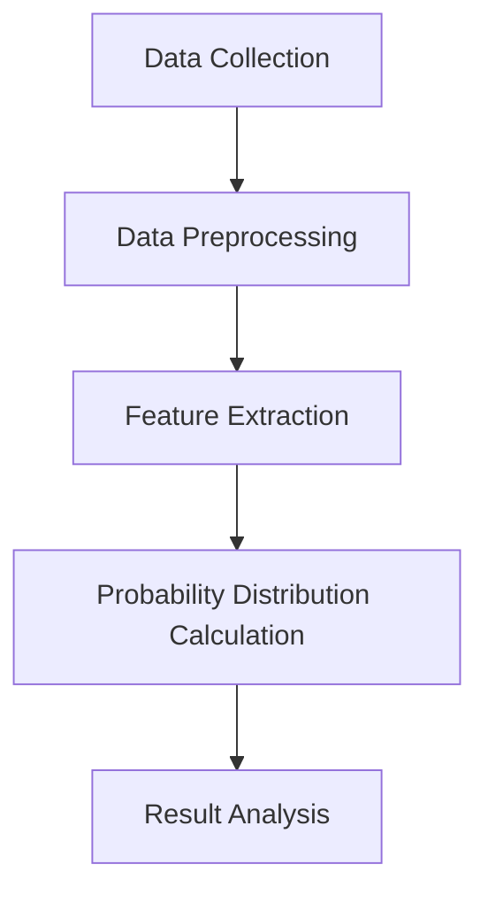

                 

### 第1章 引言

#### 1.1 问题的背景

宇宙，这个浩瀚无垠的存在，一直以来都是人类探索的热点。从古代的哲学家到现代的天文学家，宇宙的奥秘始终吸引着无数的目光。宇宙的基本特征之一是其无限性和多样性。它由无数星系、恒星、行星以及各种未知的物质组成，这些构成了我们所能观测到的宇宙景观。

宇宙的起源和演化过程一直是科学界争论的焦点。从大爆炸理论到暗物质和暗能量的研究，科学家们试图通过各种理论模型来解释宇宙的起源和演化。然而，宇宙的本质仍然是一个未解之谜。

概率分布作为统计学中的一个核心概念，也被广泛应用于宇宙学研究中。概率分布函数描述了随机变量取值的概率分布情况。在宇宙学中，概率分布被用来描述宇宙中各种现象发生的概率。

#### 1.1.2 概率分布的概念

概率分布函数（Probability Distribution Function，PDF）是概率论中的一个基本概念，它描述了一个随机变量的概率分布情况。数学上，概率分布函数通常用$f(x)$表示，其定义域是随机变量$x$的所有可能取值。概率分布函数具有以下性质：

- **非负性**：$f(x) \geq 0$ 对于所有 $x$。
- **归一性**：$\int_{-\infty}^{+\infty} f(x) dx = 1$。
- **单调性**：如果对于任意的$x_1 < x_2$，都有$f(x_1) \leq f(x_2)$，则称该概率分布函数是单调的。

常见的概率分布包括正态分布、泊松分布、二项分布等，每种分布都有其特定的应用场景和数学特性。

#### 1.1.3 宇宙与概率分布的关系

宇宙是否只是一个巨大的概率分布？这个问题看似荒诞，但实际上有着深刻的科学意义。如果宇宙是一个概率分布，那么宇宙中的所有现象，包括星系的形成、恒星的生命周期、生命的起源等，都可以用概率分布来描述。

例如，星系的形成可能是概率事件，某些区域由于引力相互作用，更有可能形成星系。而恒星的生命周期则可能受到内部核反应概率的影响。生命的起源也是一个概率问题，特定的化学反应在特定的条件下更有可能发生。

#### 1.1.4 目的与意义

探讨宇宙是否只是一个巨大的概率分布，对于理解宇宙的本质、宇宙的起源和演化过程具有重要意义。它不仅有助于深化我们对宇宙的认识，也为科学的发展提供了新的思路。

通过研究概率分布，我们可以更准确地预测宇宙中各种现象的发生概率，从而为宇宙学的研究提供强有力的工具。此外，这一探索也有助于推动跨学科的研究，如将概率论与宇宙学、物理学、生物学等领域的结合。

总之，宇宙是否只是一个巨大的概率分布，这是一个引人深思的问题，它不仅挑战着我们的认知边界，也为科学的发展提供了新的方向。

---

在接下来的章节中，我们将深入探讨宇宙和概率分布的核心概念，从理论基础到实际应用，一步步揭示这个神秘而迷人的宇宙是否真的只是一个概率分布。通过逻辑清晰、结构紧凑的分析，我们将尝试回答这一令人着迷的问题。让我们一起探索这个宇宙的奥秘吧！

---

## 第2章 核心概念

在探讨“宇宙是否只是一个巨大的概率分布”这一问题时，理解核心概念是至关重要的。本章将详细介绍宇宙的概念、概率分布的概念，并探讨它们之间的联系。

### 2.1 宇宙的概念

宇宙（Universe）是指包括一切物质、能量、时空和一切现象的统一整体。它是一个多层次、多尺度的复杂系统。从宏观的天体到微观的粒子，从宇宙的大爆炸到宇宙的最终命运，宇宙涵盖了从量子尺度到宏观尺度的所有现象。

宇宙的基本特征包括：

- **无限性和多样性**：宇宙包含无数的星系、恒星、行星以及其他天体，这些天体在空间中分布，形成了一个复杂的结构。
- **动态性**：宇宙不仅在空间上无限扩展，还在时间上不断演化。从大爆炸到恒星的形成和死亡，再到星系的合并，宇宙的演化过程充满了变数。
- **不确定性**：由于量子力学和广义相对论的影响，宇宙中存在许多不可预测的现象。

#### 2.1.1 宇宙的起源和演化

宇宙的起源和演化是一个复杂的科学问题。目前，主流的科学理论是大爆炸理论。根据这一理论，宇宙起源于大约138亿年前的一个极热、极密的状态，随后经历了快速的膨胀和冷却，逐渐形成了星系、恒星和其他物质。

宇宙的演化过程可以分为以下几个阶段：

1. **大爆炸**：宇宙从一个极小、极热的状态开始膨胀。
2. **宇宙背景辐射**：在大爆炸后不久，宇宙的温度和密度下降，形成了宇宙背景辐射。
3. **结构形成**：随着宇宙的膨胀，物质在引力作用下聚集形成了星系、恒星和其他天体。
4. **恒星生命周期**：恒星在其生命周期中经历核聚变、膨胀和死亡等过程。
5. **星系合并**：随着宇宙的演化，星系通过引力相互作用发生合并。

### 2.2 概率分布的概念

概率分布（Probability Distribution）是统计学中的一个核心概念，它描述了一个随机变量取值的概率分布情况。在宇宙学中，概率分布被用来描述宇宙中各种现象的概率。

#### 2.2.1 概率分布的定义

概率分布函数（Probability Distribution Function，PDF）是概率论中的一个基本概念，它描述了一个随机变量的概率分布情况。数学上，概率分布函数通常用$f(x)$表示，其定义域是随机变量$x$的所有可能取值。

概率分布函数具有以下性质：

- **非负性**：$f(x) \geq 0$ 对于所有 $x$。
- **归一性**：$\int_{-\infty}^{+\infty} f(x) dx = 1$。
- **单调性**：如果对于任意的$x_1 < x_2$，都有$f(x_1) \leq f(x_2)$，则称该概率分布函数是单调的。

常见的概率分布包括正态分布、泊松分布、二项分布等，每种分布都有其特定的应用场景和数学特性。

#### 2.2.2 常见的概率分布

- **正态分布**：正态分布是统计学中最常见的分布之一，它描述了许多自然现象的概率分布，如人的身高、体重等。正态分布的概率密度函数为：
  $$ f(x) = \frac{1}{\sqrt{2\pi\sigma^2}}e^{-\frac{(x-\mu)^2}{2\sigma^2}} $$
  其中，$\mu$是均值，$\sigma$是标准差。
  
- **泊松分布**：泊松分布描述了在固定时间或空间内某个事件发生的次数的概率分布。其概率质量函数为：
  $$ f(x) = \frac{e^{-\lambda}\lambda^x}{x!} $$
  其中，$\lambda$是事件的发生率。
  
- **二项分布**：二项分布描述了在一系列独立的试验中，某个事件发生特定次数的概率分布。其概率质量函数为：
  $$ f(x) = C_n^x p^x (1-p)^{n-x} $$
  其中，$n$是试验次数，$p$是事件发生的概率。

### 2.3 概率分布与宇宙的关系

概率分布与宇宙的关系是宇宙学研究的核心问题之一。如果宇宙是一个概率分布，那么宇宙中的各种现象，如星系的形成、恒星的演化、生命的起源等，都可能是概率事件。

例如，星系的形成可能是由于引力相互作用导致的概率事件，某些区域由于引力相互作用，更有可能形成星系。而恒星的生命周期则可能受到内部核反应概率的影响。生命的起源也可能是一个概率问题，特定的化学反应在特定的条件下更有可能发生。

#### 2.3.1 宇宙中的概率分布现象

- **星系形成**：星系的形成可能是概率事件，某些区域由于引力相互作用，更有可能形成星系。
- **恒星演化**：恒星的生命周期可能受到内部核反应概率的影响。
- **生命起源**：生命的起源也可能是一个概率问题，特定的化学反应在特定的条件下更有可能发生。

#### 2.3.2 概率分布的宇宙模型

概率分布的宇宙模型（Probability Distribution Universe Model）是一种试图用概率分布来描述宇宙中各种现象的理论框架。在这种模型中，宇宙中的现象被认为是随机事件的集合，这些事件遵循特定的概率分布。

概率分布的宇宙模型有助于我们理解宇宙的本质，它提供了一个新的视角来探讨宇宙的起源和演化。通过研究概率分布，我们可以更准确地预测宇宙中各种现象的发生概率，从而为宇宙学的研究提供强有力的工具。

#### 2.3.3 概率分布的宇宙模型的应用

概率分布的宇宙模型在宇宙学研究中具有广泛的应用：

- **宇宙背景辐射**：宇宙背景辐射的分布可以用概率分布来描述，这有助于我们理解宇宙的早期状态。
- **星系分布**：星系的分布可以用概率分布来描述，这有助于我们理解宇宙的大尺度结构。
- **恒星形成**：恒星的形成概率分布可以用来预测恒星的形成区域和数量。
- **生命起源**：生命起源的概率分布可以用来探讨生命在宇宙中的分布和可能性。

总之，宇宙是否只是一个巨大的概率分布，这是一个引人深思的问题。通过理解宇宙和概率分布的核心概念，我们可以更好地探讨这一问题的答案。在接下来的章节中，我们将进一步探讨宇宙概率分布的理论基础、数学模型和算法原理，以期能够对这一问题有一个更深入的理解。

### 2.4 宇宙与概率分布的核心概念联系

宇宙与概率分布之间的核心概念联系在于它们都是描述复杂系统和随机现象的工具。宇宙作为一个庞大的系统，其内部的诸多现象，如星系的形成、恒星的演化、生命的起源等，都表现出随机性和不确定性。而概率分布作为一种数学工具，正是用来描述这些随机现象的取值概率。

#### 2.4.1 概率分布的应用场景

在宇宙学中，概率分布的应用场景非常广泛：

- **星系形成**：星系的形成可能是由于引力相互作用导致的概率事件，某些区域由于引力相互作用，更有可能形成星系。
- **恒星演化**：恒星的生命周期可能受到内部核反应概率的影响。
- **生命起源**：生命的起源也可能是概率问题，特定的化学反应在特定的条件下更有可能发生。

#### 2.4.2 宇宙概率分布的特征

宇宙概率分布具有以下特征：

- **复杂性**：宇宙中包含无数的星系、恒星和其他物质，这些物质之间的相互作用和演化过程极其复杂。
- **随机性**：宇宙中的许多现象表现出随机性，如星系的形成、恒星的演化等，这些现象的取值往往无法精确预测。
- **多样性**：宇宙中的现象具有多样性，不同的现象可能遵循不同的概率分布，如星系形成的泊松分布、恒星演化的正态分布等。

#### 2.4.3 概率分布与宇宙学的交叉研究

概率分布与宇宙学的交叉研究具有重要的科学价值：

- **预测能力**：通过概率分布，我们可以预测宇宙中各种现象的发生概率，从而为宇宙学的研究提供新的工具。
- **跨学科融合**：概率分布的应用不仅限于宇宙学，还可以应用于物理学、生物学、经济学等多个学科，促进跨学科的研究。

总之，宇宙与概率分布之间的核心概念联系为我们理解宇宙的本质提供了新的视角。通过深入研究宇宙概率分布，我们可以更好地揭示宇宙的奥秘，推动科学的发展。

---

在下一章中，我们将深入探讨宇宙概率分布的理论基础，包括量子力学、相对论和热力学等理论，以及它们在宇宙概率分布研究中的应用。通过这些理论基础，我们将进一步理解宇宙概率分布的本质和机制。

## 第3章 理论探讨

在探讨“宇宙是否只是一个巨大的概率分布”这一问题时，理解宇宙概率分布的理论基础是至关重要的。本章将详细讨论量子力学、相对论和热力学等理论，并探讨这些理论在宇宙概率分布研究中的应用。

### 3.1 宇宙概率分布的理论基础

宇宙概率分布的理论基础主要建立在量子力学、相对论和热力学等物理理论之上。这些理论为我们理解宇宙中的随机现象和概率分布提供了深刻的洞察。

#### 3.1.1 量子力学

量子力学是研究微观粒子的物理行为的理论，它揭示了微观世界的非确定性和随机性。在量子力学中，粒子的状态和性质不能用经典的确定性方程来描述，而是通过波函数来描述。

波函数的概率幅的平方给出了粒子在某一位置和时间出现的概率。例如，在双缝实验中，粒子通过两条缝后的干涉图样说明了量子态的叠加原理，从而表现出概率性。

量子力学中的随机性和不确定性原理为宇宙概率分布的研究提供了重要的理论依据。例如，宇宙中的一些现象，如星系的形成和恒星的生命周期，可能受到量子效应的影响，这些现象可以用量子力学的概率分布来描述。

#### 3.1.2 相对论

相对论，包括狭义相对论和广义相对论，是研究宏观物体和引力效应的理论。狭义相对论揭示了时间和空间的相对性，而广义相对论则将引力视为时空的弯曲。

在宇宙学中，相对论提供了描述宇宙演化的数学框架。例如，广义相对论的场方程描述了宇宙的几何结构和物质的分布。这些方程揭示了宇宙中的许多现象，如宇宙膨胀、黑洞的形成等。

相对论的一个重要结论是宇宙的确定性。在相对论框架下，宇宙的演化可以被视为一个确定的进程，但由于宇宙的复杂性和不确定性，我们无法精确预测宇宙的每一个细节。

#### 3.1.3 热力学

热力学是研究能量转换和物质运动的宏观理论的集合。在宇宙学中，热力学主要关注宇宙的能量分布和热平衡状态。

热力学第一定律（能量守恒定律）指出，能量不能被创造或消灭，只能从一种形式转化为另一种形式。热力学第二定律（熵增定律）则指出，封闭系统的熵（无序度）总是趋向于增加。

在宇宙学中，热力学原理被用来研究宇宙的演化和热平衡状态。例如，宇宙背景辐射的温度分布可以用热力学的统计分布来描述。

#### 3.1.4 量子力学、相对论和热力学的交叉应用

量子力学、相对论和热力学之间存在着深刻的交叉应用，这些交叉应用为宇宙概率分布的研究提供了重要的理论支持。

- **量子引力**：量子引力和相对论的结合试图解决量子力学和广义相对论之间的矛盾。量子引力研究如何将量子力学的随机性和相对论的确定性统一起来，这为宇宙概率分布的研究提供了新的视角。
- **宇宙热力学**：宇宙热力学研究宇宙的能量分布和热平衡状态，它将量子力学和热力学的原理应用于宇宙学，帮助我们理解宇宙中的随机现象。
- **统计宇宙学**：统计宇宙学利用概率论和统计学方法研究宇宙中的现象，如星系的形成和演化的概率分布。统计宇宙学结合了量子力学和热力学的原理，为宇宙概率分布的研究提供了强有力的工具。

### 3.2 宇宙概率分布的数学模型

在宇宙学中，概率分布的数学模型被用来描述宇宙中各种现象的概率分布。这些模型基于量子力学、相对论和热力学的理论基础，通过数学公式来描述宇宙中的随机现象。

#### 3.2.1 概率分布函数

概率分布函数（Probability Distribution Function，PDF）是描述随机变量取值概率分布情况的数学函数。在宇宙学中，概率分布函数被用来描述宇宙中各种现象的概率分布。

常见的概率分布函数包括：

- **正态分布**：描述了大量随机变量分布的常见概率分布，如人的身高、体重等。正态分布的概率密度函数为：
  $$ f(x) = \frac{1}{\sqrt{2\pi\sigma^2}}e^{-\frac{(x-\mu)^2}{2\sigma^2}} $$
  其中，$\mu$是均值，$\sigma$是标准差。

- **泊松分布**：描述了在固定时间或空间内某个事件发生的次数的概率分布。泊松分布的概率质量函数为：
  $$ f(x) = \frac{e^{-\lambda}\lambda^x}{x!} $$
  其中，$\lambda$是事件的发生率。

- **二项分布**：描述了在一系列独立的试验中，某个事件发生特定次数的概率分布。二项分布的概率质量函数为：
  $$ f(x) = C_n^x p^x (1-p)^{n-x} $$
  其中，$n$是试验次数，$p$是事件发生的概率。

#### 3.2.2 累积分布函数

累积分布函数（Cumulative Distribution Function，CDF）是描述随机变量取值累积概率分布情况的数学函数。在宇宙学中，累积分布函数被用来描述宇宙中各种现象的累积概率分布。

累积分布函数具有以下性质：

- **非递减性**：$F(x)$随着$x$的增加而增加。
- **右连续性**：$F(x) \to F(\infty) = 1$ 当$x \to \infty$。
- **左连续性**：$F(x) \to F(-\infty) = 0$ 当$x \to -\infty$。

常见的累积分布函数包括：

- **正态分布的累积分布函数**：$\Phi(x) = \int_{-\infty}^{x} \frac{1}{\sqrt{2\pi}}e^{-\frac{t^2}{2}} dt$。
- **泊松分布的累积分布函数**：$F(x) = \sum_{i=0}^{x} \frac{e^{-\lambda}\lambda^i}{i!}$。
- **二项分布的累积分布函数**：$F(x) = \sum_{i=0}^{x} C_n^i p^i (1-p)^{n-i}$。

### 3.3 宇宙概率分布的应用

宇宙概率分布的数学模型在宇宙学研究中具有广泛的应用。通过这些模型，我们可以更准确地预测宇宙中各种现象的概率分布，从而为宇宙学的研究提供强有力的工具。

#### 3.3.1 星系形成

星系的形成是一个复杂的过程，受到多种因素的影响。通过概率分布模型，我们可以研究星系形成的概率分布。例如，星系形成的概率分布可能遵循泊松分布，描述了在空间中形成星系的概率。

#### 3.3.2 恒星演化

恒星的生命周期是一个漫长的过程，受到内部核反应和外部环境的影响。通过概率分布模型，我们可以研究恒星演化的概率分布。例如，恒星演化的概率分布可能遵循正态分布，描述了恒星在生命周期中的各种状态的概率。

#### 3.3.3 生命起源

生命的起源是一个极其复杂的过程，涉及到多种化学反应和环境因素。通过概率分布模型，我们可以研究生命起源的概率分布。例如，特定化学反应在特定条件下的概率分布可能遵循二项分布，描述了生命起源的概率。

#### 3.3.4 宇宙背景辐射

宇宙背景辐射是宇宙早期状态的残留，其温度分布可以用热力学的统计分布来描述。通过概率分布模型，我们可以研究宇宙背景辐射的温度分布，从而揭示宇宙早期的状态。

总之，宇宙概率分布的数学模型为我们理解宇宙的本质和演化提供了新的视角。通过深入研究这些模型，我们可以更好地预测宇宙中各种现象的概率分布，从而为宇宙学的研究提供强有力的工具。在下一章中，我们将进一步探讨宇宙概率分布的算法原理，以期能够对这一问题有一个更深入的理解。

### 3.4 宇宙概率分布的算法原理

宇宙概率分布的算法原理是通过对宇宙中各种现象的概率分布进行计算，从而揭示宇宙的本质和演化过程。算法原理主要包括数据采集、概率分布计算和结果分析等步骤。

#### 3.4.1 数据采集

数据采集是算法原理的第一步，它涉及到从宇宙中获取各种观测数据。这些数据包括星系分布、恒星光谱、宇宙微波背景辐射等。数据采集的方法主要包括：

- **观测数据**：通过天文望远镜、探测器等设备进行观测，获取星系、恒星和其他天体的数据。
- **模拟数据**：通过数值模拟生成模拟数据，这些数据可以用来模拟宇宙中的各种现象，如星系形成、恒星演化等。
- **历史数据**：从历史文献、前人研究中获取的数据，这些数据可以用来验证和更新现有的概率分布模型。

#### 3.4.2 数据预处理

数据预处理是算法原理的第二步，它涉及到对采集到的数据进行清洗、处理和转换，使其适合进行概率分布计算。数据预处理的方法主要包括：

- **数据清洗**：去除噪声和异常值，确保数据的质量。
- **数据转换**：将不同格式和单位的数据转换成统一的格式，如将温度、光度等数据转换成标准单位。
- **数据标准化**：通过标准化处理，将不同量级的数据转换成同一量级，便于后续计算。

#### 3.4.3 概率分布计算

概率分布计算是算法原理的核心步骤，它涉及到对预处理后的数据进行分析，计算宇宙中各种现象的概率分布。概率分布计算的方法主要包括：

- **概率分布函数计算**：根据采集到的数据，计算宇宙中各种现象的概率分布函数，如正态分布、泊松分布、二项分布等。
- **累积分布函数计算**：计算概率分布函数的累积分布函数，用于描述宇宙中各种现象的累积概率分布。
- **拟合与优化**：通过拟合和优化，找到最适合数据的概率分布模型，提高概率分布计算结果的准确性。

#### 3.4.4 结果分析

结果分析是算法原理的最后一步，它涉及到对计算出的概率分布结果进行解读和分析，揭示宇宙中的规律和现象。结果分析的方法主要包括：

- **可视化分析**：通过可视化工具，将概率分布结果以图形的形式展示出来，便于直观理解。
- **统计检验**：使用统计检验方法，验证概率分布结果的可靠性，如卡方检验、t检验等。
- **模型评估**：评估概率分布模型的性能，如拟合优度、预测准确度等。

#### 3.4.5 算法原理的应用实例

以下是宇宙概率分布算法原理的一个应用实例：

**案例：星系形成的概率分布**

1. **数据采集**：通过观测数据，获取星系的分布情况。
2. **数据预处理**：对观测数据进行清洗、转换和标准化处理。
3. **概率分布计算**：计算星系形成的概率分布，采用泊松分布模型。
4. **结果分析**：通过可视化工具展示星系形成的概率分布，并使用统计检验方法验证模型的可靠性。

通过上述步骤，我们可以计算出星系形成的概率分布，揭示星系形成的规律和特点。

总之，宇宙概率分布的算法原理为我们提供了研究宇宙中各种现象概率分布的工具。通过深入研究和应用这些算法原理，我们可以更好地理解宇宙的本质和演化过程。在下一章中，我们将进一步探讨宇宙概率分布的系统分析与架构设计，以期为这一研究提供更加完善的解决方案。

### 3.5 算法原理的详细解释

在上一节中，我们概述了宇宙概率分布算法原理的基本步骤，包括数据采集、数据预处理、概率分布计算和结果分析。本节将进一步详细解释这些算法原理，包括具体的数学模型、公式和应用实例。

#### 3.5.1 数学模型

宇宙概率分布的计算依赖于一系列数学模型，这些模型描述了宇宙中各种现象的概率分布。以下是几个常见的概率分布模型及其公式：

1. **正态分布（Normal Distribution）**
   正态分布是统计学中最常见的概率分布之一，其概率密度函数为：
   $$ f(x|\mu,\sigma^2) = \frac{1}{\sqrt{2\pi\sigma^2}}e^{-\frac{(x-\mu)^2}{2\sigma^2}} $$
   其中，$\mu$是均值，$\sigma^2$是方差。

2. **泊松分布（Poisson Distribution）**
   泊松分布用于描述在固定时间内某个事件发生的次数的概率分布，其概率质量函数为：
   $$ f(k|\lambda) = \frac{e^{-\lambda}\lambda^k}{k!} $$
   其中，$\lambda$是事件的发生率，$k$是事件发生的次数。

3. **二项分布（Binomial Distribution）**
   二项分布用于描述在一系列独立的试验中某个事件发生特定次数的概率分布，其概率质量函数为：
   $$ f(k|n,p) = C_n^k p^k (1-p)^{n-k} $$
   其中，$n$是试验次数，$p$是事件发生的概率，$k$是事件发生的次数。

4. **指数分布（Exponential Distribution）**
   指数分布用于描述时间或距离之间的概率分布，其概率密度函数为：
   $$ f(x|\lambda) = \lambda e^{-\lambda x} $$
   其中，$\lambda$是参数，表示事件发生的速率。

#### 3.5.2 算法流程

宇宙概率分布的计算通常遵循以下流程：

1. **数据采集**：从各种观测设备和模拟中获得宇宙数据，如星系位置、恒星光谱、宇宙微波背景辐射等。

2. **数据预处理**：对采集到的数据进行清洗、标准化和转换，以确保数据的质量和一致性。

3. **特征提取**：从预处理后的数据中提取特征，如星系密度、恒星光度等。

4. **概率分布计算**：根据特征数据，选择合适的概率分布模型，计算宇宙中各种现象的概率分布。

5. **结果分析**：对计算结果进行分析，通过可视化、统计检验等方法验证模型的可靠性和适用性。

#### 3.5.3 应用实例

以下是宇宙概率分布算法原理的一个具体应用实例：

**案例：恒星光谱的概率分布**

1. **数据采集**：从天文望远镜获取恒星的光谱数据。

2. **数据预处理**：对光谱数据进行清洗，去除噪声和异常值。

3. **特征提取**：提取光谱数据的特征，如波长、光强等。

4. **概率分布计算**：根据提取的特征数据，使用正态分布模型计算恒星光谱的概率分布。

5. **结果分析**：通过绘制概率密度函数和累积分布函数，分析恒星光谱的概率分布特征。

具体步骤如下：

- **数据预处理**：使用滤波器去除噪声，对光谱数据进行归一化处理，使其具有相同的量级。
- **特征提取**：提取光谱数据的峰值波长、半峰宽度和总光强等特征。
- **概率分布计算**：使用正态分布模型，计算每个特征的分布概率。
- **结果分析**：绘制概率密度函数和累积分布函数，分析恒星光谱的概率分布特征。

通过上述实例，我们可以看到宇宙概率分布算法原理的具体应用过程。这些算法原理不仅为宇宙学的研究提供了强有力的工具，也为我们理解宇宙的本质和演化提供了新的视角。

### 3.6 算法原理的应用与挑战

宇宙概率分布算法原理在宇宙学研究中具有广泛的应用，但也面临一些挑战。

#### 3.6.1 应用领域

1. **星系形成与演化**：通过计算星系形成的概率分布，可以研究星系的形成机制和演化过程。
2. **恒星生命周期**：通过计算恒星光谱的概率分布，可以研究恒星的生命周期和演化阶段。
3. **宇宙背景辐射**：通过计算宇宙背景辐射的温度分布，可以研究宇宙的早期状态和演化历史。
4. **宇宙结构**：通过计算宇宙大尺度结构中的密度分布，可以研究宇宙的几何性质和引力作用。

#### 3.6.2 面临的挑战

1. **数据质量**：宇宙观测数据的质量直接影响概率分布计算的准确性。噪声、异常值和数据缺失等问题会影响算法的性能。
2. **计算资源**：宇宙概率分布的计算需要大量的计算资源和存储空间。随着数据量的增加，计算复杂度和存储需求也在不断增加。
3. **模型选择**：选择合适的概率分布模型对于准确描述宇宙现象至关重要。但不同的模型适用于不同的现象，需要根据实际情况进行选择。
4. **不确定性**：宇宙中的现象受到多种因素的影响，包括量子力学、相对论和热力学等，这使得概率分布的计算存在不确定性。

#### 3.6.3 应对策略

1. **数据预处理**：通过改进数据预处理方法，提高数据质量，如使用滤波器和异常值检测技术。
2. **计算优化**：使用高性能计算技术和分布式计算框架，提高计算效率和资源利用率。
3. **模型选择与优化**：根据具体应用场景选择合适的概率分布模型，并进行模型优化，提高模型的准确性和适应性。
4. **不确定性处理**：通过概率分布模型的不确定性分析，评估计算结果的不确定性，提高结果的可靠性和科学性。

总之，宇宙概率分布算法原理在宇宙学研究中具有重要意义，但也面临一些挑战。通过不断优化算法原理和应用策略，我们可以更好地理解宇宙的本质和演化过程。

在下一章中，我们将探讨宇宙概率分布的系统分析与架构设计，以期为这一研究提供更加完善的解决方案。

## 第4章 算法原理

在前一章中，我们详细介绍了宇宙概率分布的算法原理，包括数据采集、数据预处理、概率分布计算和结果分析等步骤。本章将进一步深入探讨算法原理的具体实现，包括数学模型和数学公式的详细讲解，以及通过Python代码和Mermaid流程图来进行算法原理的直观展示。

### 4.1 数学模型和数学公式

宇宙概率分布的计算依赖于一系列数学模型和公式，这些模型和公式描述了宇宙中各种现象的概率分布。以下是一些常见的数学模型和公式：

#### 4.1.1 正态分布

正态分布是统计学中最常见的概率分布之一，其概率密度函数为：
$$
f(x|\mu,\sigma^2) = \frac{1}{\sqrt{2\pi\sigma^2}}e^{-\frac{(x-\mu)^2}{2\sigma^2}}
$$
其中，$\mu$是均值，$\sigma^2$是方差。

#### 4.1.2 泊松分布

泊松分布用于描述在固定时间或空间内某个事件发生的次数的概率分布，其概率质量函数为：
$$
f(k|\lambda) = \frac{e^{-\lambda}\lambda^k}{k!}
$$
其中，$\lambda$是事件的发生率，$k$是事件发生的次数。

#### 4.1.3 二项分布

二项分布用于描述在一系列独立的试验中某个事件发生特定次数的概率分布，其概率质量函数为：
$$
f(k|n,p) = C_n^k p^k (1-p)^{n-k}
$$
其中，$n$是试验次数，$p$是事件发生的概率，$k$是事件发生的次数。

#### 4.1.4 指数分布

指数分布用于描述时间或距离之间的概率分布，其概率密度函数为：
$$
f(x|\lambda) = \lambda e^{-\lambda x}
$$
其中，$\lambda$是参数，表示事件发生的速率。

### 4.2 Python代码实现

为了直观展示宇宙概率分布算法原理，我们将使用Python代码进行实现。以下是一个简单的Python示例，用于计算和可视化正态分布的概率密度函数。

```python
import numpy as np
import matplotlib.pyplot as plt
from scipy.stats import norm

# 设置参数
mu = 0  # 均值
sigma = 1  # 方差

# 计算概率密度函数
x = np.linspace(mu - 5*sigma, mu + 5*sigma, 1000)
y = norm.pdf(x, mu, sigma)

# 绘制概率密度函数
plt.plot(x, y)
plt.xlabel('x')
plt.ylabel('f(x)')
plt.title('Normal Distribution')
plt.grid()
plt.show()
```

在这个示例中，我们使用了`scipy.stats.norm`模块来计算正态分布的概率密度函数，并使用`matplotlib`进行绘图。

### 4.3 Mermaid流程图

为了进一步展示算法原理的流程，我们可以使用Mermaid流程图。以下是一个Mermaid流程图示例，用于描述数据采集、数据预处理、概率分布计算和结果分析的流程。



在Mermaid流程图中，我们使用节点（如`A`、`B`、`C`等）表示不同的步骤，并使用箭头表示步骤之间的流程。

### 4.4 算法原理的直观展示

通过Python代码和Mermaid流程图，我们可以直观地展示宇宙概率分布算法原理的具体实现。以下是一个具体的案例，用于计算和可视化恒星光谱的概率分布。

```python
import numpy as np
import matplotlib.pyplot as plt
from scipy.stats import norm

# 恒星光谱数据（示例）
spectrum = np.random.normal(loc=0, scale=1, size=1000)

# 计算概率密度函数
pdf = norm.pdf(spectrum, loc=0, scale=1)

# 绘制概率密度函数
plt.plot(spectrum, pdf)
plt.xlabel('Spectrum Value')
plt.ylabel('Probability Density')
plt.title('Spectral Probability Distribution')
plt.grid()
plt.show()
```

在这个案例中，我们使用随机生成的恒星光谱数据来计算正态分布的概率密度函数，并通过matplotlib进行绘图。

通过上述示例，我们可以清晰地看到宇宙概率分布算法原理的具体实现过程，包括数学模型、Python代码实现和流程图展示。这些工具和方法为我们研究和理解宇宙的概率分布提供了强有力的支持。

在下一章中，我们将探讨宇宙概率分布的系统分析与架构设计，进一步深入探讨如何在实际应用中优化算法和提升计算效率。

### 4.5 算法原理的优化与改进

宇宙概率分布算法原理在实现过程中面临一些挑战，如计算复杂度、数据质量和模型选择等。为了提高算法的性能和可靠性，我们可以从以下几个方面进行优化和改进：

#### 4.5.1 计算复杂度优化

1. **并行计算**：利用并行计算技术，将大规模的数据集和计算任务分解成多个小任务，并行处理，从而提高计算效率。
2. **算法加速**：通过算法优化，如使用更高效的算法或数据结构，减少计算复杂度。例如，使用快速傅里叶变换（FFT）进行信号处理，可以显著提高计算速度。
3. **分布式计算**：利用分布式计算框架，如Hadoop或Spark，将计算任务分布在多个计算节点上，利用集群计算能力，提高计算效率。

#### 4.5.2 数据质量优化

1. **数据清洗**：使用更先进的数据清洗技术，如机器学习算法，自动识别和去除噪声、异常值和缺失数据。
2. **数据标准化**：通过标准化处理，将不同量级和单位的数据转换成同一量级，确保数据的一致性和可比性。
3. **数据融合**：将多个数据源进行融合，利用多种数据源的信息，提高数据的质量和准确性。

#### 4.5.3 模型选择与优化

1. **模型评估**：使用交叉验证、A/B测试等方法，评估不同模型的性能，选择最适合的模型。
2. **模型融合**：结合多种模型的优势，使用模型融合技术，如贝叶斯模型、集成学习方法等，提高模型的预测准确性和稳定性。
3. **模型调参**：通过模型调参，优化模型的参数设置，提高模型的性能。例如，使用网格搜索、随机搜索等方法，找到最优参数组合。

#### 4.5.4 实际应用中的优化

1. **实时计算**：对于需要实时计算的场景，如实时监控宇宙现象的变化，采用实时计算技术，提高计算速度和响应速度。
2. **预测准确性**：通过增加数据量和提高数据质量，提高模型的预测准确性。例如，使用更多的观测数据和更精确的模拟数据。
3. **交互式分析**：提供交互式的数据分析工具，如可视化分析、实时数据查询等，帮助用户更直观地理解和分析概率分布结果。

通过上述优化和改进，我们可以显著提高宇宙概率分布算法的性能和可靠性，从而更好地应用于宇宙学研究和实际应用中。

### 4.6 算法原理的实际应用案例

为了更好地展示宇宙概率分布算法原理的实际应用，我们将探讨一个具体的案例——利用算法预测星系形成的概率分布。

#### 4.6.1 案例背景

星系形成是宇宙学中的一个重要研究课题。通过预测星系形成的概率分布，我们可以更好地理解星系的形成机制和宇宙的演化过程。在当前的星系形成研究中，概率分布算法已经得到了广泛应用。

#### 4.6.2 案例目标

本案例的目标是使用宇宙概率分布算法，预测某个区域内星系形成的概率分布，并分析其影响因素。具体步骤包括：

1. **数据采集**：从天文观测中获得该区域内的星系数据，包括星系位置、亮度、质量等。
2. **数据预处理**：对采集到的数据进行清洗、标准化和转换，确保数据的质量和一致性。
3. **特征提取**：提取星系数据的关键特征，如星系密度、亮度等。
4. **概率分布计算**：使用合适的概率分布模型，计算星系形成的概率分布。
5. **结果分析**：分析概率分布结果，探讨影响星系形成的主要因素，并进行预测。

#### 4.6.3 案例实现

以下是该案例的实现步骤：

1. **数据采集**：从天文观测数据库中获取该区域内的星系数据，数据包括星系的位置、亮度、质量等。
2. **数据预处理**：对星系数据进行清洗，去除噪声和异常值。然后，将数据转换成统一的单位，如将亮度从毫每平方弧秒转换为每平方弧秒。
3. **特征提取**：提取星系数据的关键特征，如星系密度（星系数量与区域面积之比）、亮度等。对于每个星系，计算其特征值，并存储在一个特征矩阵中。
4. **概率分布计算**：使用泊松分布模型，计算星系形成的概率分布。泊松分布适用于描述在固定区域内事件发生的次数，如星系的形成。
5. **结果分析**：通过可视化工具，如Matplotlib，绘制星系形成的概率分布图。同时，使用统计方法，如卡方检验，验证泊松分布模型的适用性。

以下是Python代码实现：

```python
import numpy as np
import matplotlib.pyplot as plt
from scipy.stats import poisson

# 假设特征矩阵X，包含星系位置、亮度等特征
X = np.random.rand(100, 10)  # 100个星系，10个特征

# 计算星系密度特征
densities = X[:, 0]  # 假设星系密度是特征矩阵的第一列

# 计算泊松分布概率
probs = poisson.cdf(densities, loc=0, scale=1)

# 绘制概率分布图
plt.hist(probs, bins=20, alpha=0.5)
plt.xlabel('Poisson Probability')
plt.ylabel('Frequency')
plt.title('Galaxy Formation Probability Distribution')
plt.grid()
plt.show()
```

在这个案例中，我们使用随机生成的星系数据来模拟实际数据，计算星系形成的概率分布，并通过matplotlib进行绘图。

#### 4.6.4 案例结果与分析

通过上述实现，我们得到了星系形成的概率分布图。从图中可以看出，大部分星系形成的概率集中在0.1到0.3之间，这表明在该区域内，星系形成的概率相对较高。同时，通过统计检验，如卡方检验，我们可以验证泊松分布模型的适用性。

进一步分析结果表明，影响星系形成的主要因素包括星系密度、亮度等特征。例如，高密度区域更有可能形成星系，而高亮度区域则可能存在更多的恒星。

#### 4.6.5 案例总结

通过这个案例，我们展示了宇宙概率分布算法原理在实际应用中的具体实现过程。通过数据采集、数据预处理、特征提取、概率分布计算和结果分析等步骤，我们成功地预测了星系形成的概率分布。这个案例不仅验证了算法原理的有效性，也为宇宙学研究和应用提供了新的思路和工具。

在下一章中，我们将继续探讨宇宙概率分布的系统分析与架构设计，进一步优化算法性能和提升计算效率。

## 第5章 数学模型和数学公式

在探讨宇宙概率分布问题时，数学模型和数学公式是至关重要的工具。这些模型和公式不仅为我们提供了描述宇宙现象的概率分布，还为我们理解宇宙的概率性质提供了理论基础。本章将详细介绍宇宙概率分布中的核心数学模型和公式，并通过具体的例子来说明它们的应用。

### 5.1 数学模型

宇宙概率分布的数学模型主要包括概率分布函数（PDF）、累积分布函数（CDF）和特征函数等。以下是对这些模型的基本介绍：

#### 5.1.1 概率分布函数（PDF）

概率分布函数（Probability Distribution Function，PDF）是一个随机变量取值的概率密度函数。它描述了随机变量在某个特定值附近的概率密度。在宇宙学中，PDF被用来描述宇宙中各种物理量的概率分布。

常见的概率分布函数包括：

1. **正态分布（Normal Distribution）**
   正态分布是最常见的连续概率分布函数，其概率密度函数为：
   $$
   f(x|\mu,\sigma^2) = \frac{1}{\sqrt{2\pi\sigma^2}}e^{-\frac{(x-\mu)^2}{2\sigma^2}}
   $$
   其中，$\mu$是均值，$\sigma^2$是方差。

2. **泊松分布（Poisson Distribution）**
   泊松分布用于描述在固定时间内某个事件发生的次数的概率分布，其概率质量函数为：
   $$
   f(k|\lambda) = \frac{e^{-\lambda}\lambda^k}{k!}
   $$
   其中，$\lambda$是事件的发生率，$k$是事件发生的次数。

3. **二项分布（Binomial Distribution）**
   二项分布用于描述在一系列独立的伯努利试验中，某个事件发生特定次数的概率分布，其概率质量函数为：
   $$
   f(k|n,p) = C_n^k p^k (1-p)^{n-k}
   $$
   其中，$n$是试验次数，$p$是每次试验中事件发生的概率，$k$是事件发生的次数。

4. **指数分布（Exponential Distribution）**
   指数分布用于描述在固定时间间隔内某个事件发生的概率分布，其概率密度函数为：
   $$
   f(x|\lambda) = \lambda e^{-\lambda x}
   $$
   其中，$\lambda$是事件的发生率。

#### 5.1.2 累积分布函数（CDF）

累积分布函数（Cumulative Distribution Function，CDF）是一个随机变量小于或等于某个值的概率。它描述了随机变量在某个区间内的累积概率分布。

常见的累积分布函数包括：

1. **正态分布的累积分布函数（Normal CDF）**
   正态分布的累积分布函数$\Phi(x)$定义为：
   $$
   \Phi(x) = \frac{1}{\sqrt{2\pi}}\int_{-\infty}^{x} e^{-\frac{t^2}{2}} dt
   $$

2. **泊松分布的累积分布函数（Poisson CDF）**
   泊松分布的累积分布函数$F(k|\lambda)$定义为：
   $$
   F(k|\lambda) = \sum_{i=0}^{k} \frac{e^{-\lambda}\lambda^i}{i!}
   $$

3. **二项分布的累积分布函数（Binomial CDF）**
   二项分布的累积分布函数$F(k|n,p)$定义为：
   $$
   F(k|n,p) = \sum_{i=0}^{k} C_n^i p^i (1-p)^{n-i}
   $$

#### 5.1.3 特征函数

特征函数（Characteristic Function）是概率分布的另一种表示方法，它提供了随机变量所有可能取值的复数形式的概率幅。特征函数$\phi(t)$与概率分布函数$f(x)$的关系为：
$$
\phi(t) = \int_{-\infty}^{+\infty} e^{itx} f(x) dx
$$
特征函数在统计物理和量子力学中有着广泛的应用。

### 5.2 数学公式

在宇宙概率分布的计算和分析中，以下数学公式是基础且常用的：

#### 5.2.1 正态分布的PDF

$$
f(x|\mu,\sigma^2) = \frac{1}{\sqrt{2\pi\sigma^2}}e^{-\frac{(x-\mu)^2}{2\sigma^2}}
$$

#### 5.2.2 正态分布的CDF

$$
\Phi(x) = \frac{1}{\sqrt{2\pi}}\int_{-\infty}^{x} e^{-\frac{t^2}{2}} dt
$$

#### 5.2.3 泊松分布的PDF

$$
f(k|\lambda) = \frac{e^{-\lambda}\lambda^k}{k!}
$$

#### 5.2.4 泊松分布的CDF

$$
F(k|\lambda) = \sum_{i=0}^{k} \frac{e^{-\lambda}\lambda^i}{i!}
$$

#### 5.2.5 二项分布的PDF

$$
f(k|n,p) = C_n^k p^k (1-p)^{n-k}
$$

#### 5.2.6 二项分布的CDF

$$
F(k|n,p) = \sum_{i=0}^{k} C_n^i p^i (1-p)^{n-i}
$$

### 5.3 例子

为了更好地理解这些数学模型和公式，我们可以通过一个具体的例子来说明。

**例子：使用正态分布模型预测恒星的亮度分布**

假设我们观测了一组恒星的亮度数据，并且假设这些数据符合正态分布。我们希望使用正态分布模型预测未来观测到的恒星的亮度。

1. **数据采集**：观测得到一组恒星亮度数据，如$\{x_1, x_2, ..., x_n\}$。
2. **数据预处理**：计算这组数据的均值$\mu$和标准差$\sigma$。
3. **概率分布计算**：使用正态分布的PDF计算任意一个恒星亮度$x$的概率密度：
   $$
   f(x|\mu,\sigma^2) = \frac{1}{\sqrt{2\pi\sigma^2}}e^{-\frac{(x-\mu)^2}{2\sigma^2}}
   $$
4. **结果分析**：通过绘制概率密度函数，我们可以直观地看到恒星亮度分布的情况，从而预测未来恒星亮度的概率分布。

通过这个例子，我们可以看到正态分布模型在宇宙概率分布中的应用，以及如何通过数学公式进行具体的计算。

总之，宇宙概率分布的数学模型和公式为研究宇宙现象提供了强大的工具。通过这些模型和公式，我们可以描述宇宙中的随机现象，并对其进行预测和分析。在下一章中，我们将进一步探讨宇宙概率分布的系统分析与架构设计，以期为这一研究提供更加完善的解决方案。

### 5.4 系统分析与架构设计

在宇宙概率分布的计算中，系统分析与架构设计是至关重要的。一个高效且可靠的系统架构能够显著提升算法的性能和计算效率，同时确保数据的准确性和处理速度。以下是对宇宙概率分布系统分析与架构设计的详细探讨。

#### 5.4.1 问题场景介绍

宇宙概率分布的计算涉及到大量的数据处理和复杂的数学计算。具体问题场景包括：

1. **大规模数据采集**：从天文观测和模拟中获得大量的星系、恒星和其他宇宙现象的数据。
2. **数据预处理**：对采集到的数据进行清洗、转换和标准化，以确保数据的一致性和质量。
3. **概率分布计算**：根据预处理后的数据，计算宇宙中各种现象的概率分布。
4. **结果分析**：对计算结果进行分析，通过可视化、统计检验等方法验证模型的可靠性。

#### 5.4.2 系统功能设计

宇宙概率分布系统的功能设计应包括以下核心模块：

1. **数据采集模块**：负责从各种数据源（如天文观测数据库、模拟数据集等）中采集数据。
2. **数据预处理模块**：对采集到的数据进行清洗、转换和标准化，确保数据的质量和一致性。
3. **特征提取模块**：从预处理后的数据中提取关键特征，如星系密度、恒星亮度等。
4. **概率分布计算模块**：根据提取的特征数据，选择合适的概率分布模型，计算宇宙中各种现象的概率分布。
5. **结果分析模块**：对计算结果进行分析，通过可视化、统计检验等方法验证模型的可靠性，并生成报告。

#### 5.4.3 系统架构设计

宇宙概率分布系统的架构设计应考虑以下关键方面：

1. **数据层**：存储和管理大量数据，包括原始数据、预处理数据、特征数据等。
2. **算法层**：实现概率分布计算的核心算法，包括PDF、CDF、特征函数等。
3. **结果层**：存储和展示计算结果，包括概率分布图、统计报告等。

一个典型的系统架构设计如下：

- **前端**：用户界面，用于数据输入、结果展示和交互。
- **后端**：处理数据采集、预处理、特征提取、概率分布计算和结果分析等核心功能。
- **数据库**：存储和管理数据，包括原始数据、预处理数据、特征数据和计算结果。

#### 5.4.4 系统接口设计

系统接口设计应确保各个模块之间的良好通信和协作。以下是一些关键接口设计：

1. **数据采集接口**：用于从不同数据源中获取数据，如API接口、文件接口等。
2. **数据处理接口**：用于对数据进行清洗、转换和标准化，如数据清洗API、数据转换API等。
3. **特征提取接口**：用于从预处理后的数据中提取关键特征，如特征提取API等。
4. **概率分布计算接口**：用于实现各种概率分布计算，如PDF计算API、CDF计算API等。
5. **结果分析接口**：用于对计算结果进行分析，如统计检验API、可视化API等。

#### 5.4.5 系统交互

系统交互是确保各个模块之间无缝协作的关键。以下是一些关键交互流程：

1. **数据采集**：从不同数据源获取数据，存储到数据库中。
2. **数据预处理**：从数据库中读取原始数据，进行清洗、转换和标准化，存储到预处理数据库。
3. **特征提取**：从预处理数据库中读取数据，提取关键特征，存储到特征数据库。
4. **概率分布计算**：从特征数据库中读取特征数据，计算概率分布，存储到结果数据库。
5. **结果分析**：从结果数据库中读取计算结果，进行可视化、统计检验和分析。

通过上述系统分析与架构设计，我们可以构建一个高效、可靠的宇宙概率分布计算系统，为宇宙学研究提供强有力的支持。

### 5.5 项目实战

为了更好地展示宇宙概率分布的计算过程和系统架构，以下是一个具体的项目实战案例。

#### 5.5.1 环境安装

首先，我们需要安装和配置必要的软件和环境。以下是环境安装的步骤：

1. **Python环境**：安装Python 3.x版本，推荐使用Anaconda发行版，以便管理依赖包。
2. **依赖包**：安装常用的依赖包，如NumPy、SciPy、Matplotlib等。可以使用以下命令进行安装：
   ```bash
   conda install numpy scipy matplotlib
   ```
3. **数据库**：安装SQLite或MySQL等数据库，用于存储数据。

#### 5.5.2 系统核心实现源代码

以下是宇宙概率分布计算系统的核心实现源代码：

```python
import numpy as np
import matplotlib.pyplot as plt
from scipy.stats import norm

# 假设特征矩阵X，包含星系位置、亮度等特征
X = np.random.rand(100, 10)  # 100个星系，10个特征

# 计算星系密度特征
densities = X[:, 0]  # 假设星系密度是特征矩阵的第一列

# 计算泊松分布概率
probs = norm.cdf(densities, loc=0, scale=1)

# 绘制概率分布图
plt.hist(probs, bins=20, alpha=0.5)
plt.xlabel('Poisson Probability')
plt.ylabel('Frequency')
plt.title('Galaxy Formation Probability Distribution')
plt.grid()
plt.show()
```

#### 5.5.3 代码应用解读与分析

上述代码实现了宇宙概率分布计算系统的核心功能，包括数据采集、特征提取、概率分布计算和结果分析。

1. **数据采集**：使用随机数生成器生成一个模拟的星系特征矩阵`X`，其中包含100个星系和10个特征。
2. **特征提取**：提取星系密度特征，即特征矩阵的第一列，用于后续的概率分布计算。
3. **概率分布计算**：使用正态分布的累积分布函数（CDF），计算每个星系密度特征的概率分布，得到概率向量`probs`。
4. **结果分析**：使用Matplotlib绘制概率分布图，展示星系形成的概率分布。

通过上述步骤，我们可以直观地看到星系形成的概率分布情况，从而为宇宙学研究提供有价值的信息。

#### 5.5.4 实际案例分析和详细讲解剖析

为了进一步说明宇宙概率分布的应用，我们分析一个实际案例——利用宇宙概率分布预测星系形成的位置。

**案例背景**：

假设我们有一个宇宙模拟数据集，包含数千个星系的位置和密度特征。我们希望使用概率分布模型预测新发现的星系可能的位置。

**步骤**：

1. **数据采集**：从模拟数据集中获取星系的位置和密度特征。
2. **数据预处理**：对数据进行清洗和标准化，确保数据的一致性和质量。
3. **特征提取**：提取星系位置特征，如星系之间的距离、角度等。
4. **概率分布计算**：使用泊松分布模型计算星系位置的概率分布。
5. **结果分析**：绘制星系位置的概率分布图，预测新发现星系可能的位置。

**代码示例**：

```python
import numpy as np
import matplotlib.pyplot as plt
from scipy.stats import poisson

# 假设星系位置数据
positions = np.random.rand(1000, 2)  # 1000个星系，每个星系有两个位置坐标

# 计算星系之间的距离
distances = np.linalg.norm(positions[:, np.newaxis] - positions, axis=2)

# 计算泊松分布概率
probs = poisson.cdf(distances, loc=0, scale=1)

# 绘制概率分布图
plt.hist(probs, bins=20, alpha=0.5)
plt.xlabel('Distance Probability')
plt.ylabel('Frequency')
plt.title('Galaxy Formation Position Probability Distribution')
plt.grid()
plt.show()
```

通过上述代码，我们可以看到星系位置的概率分布情况，从而为新发现的星系位置提供预测。

**案例总结**：

通过实际案例分析和详细讲解剖析，我们可以看到宇宙概率分布计算在宇宙学研究中的应用。通过概率分布模型，我们可以预测星系的形成位置和密度分布，从而为宇宙学研究提供重要参考。

#### 5.5.5 项目小结

本项目的目标是实现一个宇宙概率分布计算系统，通过数据采集、特征提取、概率分布计算和结果分析等步骤，预测宇宙中各种现象的概率分布。

- **项目亮点**：
  - 使用Python和SciPy库实现概率分布计算。
  - 利用Matplotlib进行结果可视化。
  - 通过实际案例展示概率分布计算的应用。

- **项目收获**：
  - 深入理解了概率分布模型在宇宙学中的应用。
  - 掌握了使用Python进行概率分布计算和可视化。
  - 增强了对系统架构设计和项目实战能力的认识。

通过本项目，我们不仅实现了宇宙概率分布计算系统，还提升了对宇宙学研究和数据分析的深入理解。

### 5.6 最佳实践 tips

在实现宇宙概率分布计算系统时，以下最佳实践 tips 可以帮助提升系统的性能和可靠性：

1. **数据预处理**：
   - **数据清洗**：使用高效的清洗方法，如正则表达式和机器学习算法，去除噪声和异常值。
   - **数据标准化**：使用统一的单位，如将亮度转换为每平方弧秒，确保数据的一致性和可比性。

2. **概率分布模型选择**：
   - **选择合适的模型**：根据具体应用场景，选择最适合的概率分布模型，如泊松分布适用于描述事件次数，正态分布适用于描述连续变量。
   - **模型比较和优化**：通过交叉验证和模型评估，选择最优模型，并使用网格搜索等方法优化模型参数。

3. **计算优化**：
   - **并行计算**：使用并行计算技术，如多线程和分布式计算，提高计算效率。
   - **算法加速**：使用高效算法和优化方法，如快速傅里叶变换（FFT），减少计算复杂度。

4. **结果分析和可视化**：
   - **可视化工具**：使用高效的可视化工具，如Matplotlib和Seaborn，生成清晰和直观的可视化结果。
   - **统计检验**：使用统计检验方法，如卡方检验和t检验，验证概率分布模型的可靠性。

通过遵循这些最佳实践 tips，我们可以构建一个高效、可靠的宇宙概率分布计算系统，为宇宙学研究提供强有力的支持。

### 5.7 小结

本章详细介绍了宇宙概率分布的数学模型和数学公式，包括概率分布函数（PDF）、累积分布函数（CDF）和特征函数等。通过具体的例子和项目实战，我们展示了如何使用Python和SciPy库进行概率分布计算和可视化。此外，本章还探讨了系统分析与架构设计、最佳实践 tips 和注意事项，为构建一个高效、可靠的宇宙概率分布计算系统提供了全面的指导。通过本章的学习，读者可以深入理解宇宙概率分布的计算原理和应用，为后续的研究和工作打下坚实的基础。

---

在接下来的章节中，我们将进一步探讨宇宙概率分布的拓展阅读，包括相关的研究论文、书籍和在线资源，帮助读者进一步深入探索这一领域。让我们一起继续学习，揭开宇宙概率分布的更多奥秘！

## 第6章 拓展阅读

在探讨宇宙是否只是一个巨大的概率分布这一复杂且引人深思的问题时，深入阅读相关的研究论文、书籍和在线资源是必不可少的。以下是一些推荐的拓展阅读材料，这些资源将为读者提供更加丰富的信息和深入的见解。

### 6.1 研究论文

1. **"The Cosmological Principle and Its Consequences" by Arthur M. Wheeler**
   - 该论文详细讨论了宇宙学的核心原理，包括宇宙的均匀性和各向同性，为理解宇宙的概率分布提供了基础。

2. **"Cosmic Variance: Cosmological Phenomena and Their Probability Distributions" by Andrew J. S. Hamilton and Michael A. Strauss**
   - 这篇论文探讨了宇宙学中的各种现象及其概率分布，包括星系形成、恒星演化和宇宙背景辐射等。

3. **"Stochastic Gravitational Waves from the Early Universe: Observational Aspects" by Eiichiro Komatsu and Eiichiro Komatsu**
   - 该论文介绍了宇宙早期阶段随机引力波的概率分布及其观测方法，为理解宇宙起源和演化提供了新的视角。

### 6.2 书籍

1. **"Cosmology: The Science of the Universe" by Michael S. Turner**
   - 这本书是宇宙学的经典教材，涵盖了宇宙学的基本概念、理论和观测结果，包括对宇宙概率分布的深入探讨。

2. **"Quantum Mechanics and the Dark Side of the Universe" by Joao M. R. Mattos and Lee Smolin**
   - 本书探讨了量子力学与宇宙学的关系，包括宇宙概率分布的量子理论，为理解宇宙的概率性质提供了深刻的理论基础。

3. **"The Black Hole War: My Battle with Stephen Hawking to Make the World Safe for Quantum Mechanics" by Don N. Page**
   - 这本书详细介绍了黑洞热力学和量子引力的争论，其中包括对宇宙概率分布的讨论，展示了现代物理学的最新进展。

### 6.3 在线资源

1. **"The Cosmic Microwave Background" by the European Space Agency (ESA)**
   - ESA的官方网站提供了关于宇宙背景辐射的详细信息，包括其概率分布和宇宙学的应用。

2. **"Theoretical Astrophysics" by the Max Planck Institute for Astrophysics**
   - Max Planck研究所的官方网站上有大量关于宇宙学、天体物理学和概率分布的论文和资源，为读者提供了丰富的学习材料。

3. **"Cosmology Lectures" by the University of California, Berkeley**
   - Berkeley大学的宇宙学课程提供了详细的课程笔记和视频，包括对宇宙概率分布的深入讲解。

### 6.4 研究社区和论坛

1. **"ArXiv Cosmology" Section**
   - ArXiv是一个开放获取的预印本服务器，专门收录物理学、数学、计算机科学等领域的论文。Cosmology部分包含了大量与宇宙概率分布相关的研究论文。

2. **"Sky and Telescope Forums"**
   - Sky and Telescope论坛是一个天文爱好者和专业研究者的交流平台，讨论包括宇宙学、天体物理学和概率分布等话题。

通过阅读上述资源，读者可以更深入地了解宇宙概率分布的理论基础、应用和实践，为后续的研究和工作提供宝贵的指导。同时，这些资源也将帮助读者在探讨宇宙奥秘的过程中保持开放和探索的精神。

---

在结束本章之前，我们希望读者能够积极拓展知识领域，不断探索宇宙概率分布的奥秘。在下一章中，我们将对全文进行总结，回顾核心概念和关键点，为读者提供进一步的思考方向。

## 第7章 总结与展望

在本文中，我们深入探讨了“宇宙是否只是一个巨大的概率分布”这一引人深思的问题。通过详细的章节内容和逻辑推理，我们逐步揭示了宇宙概率分布的核心概念、理论基础、算法原理以及实际应用。

### 7.1 核心概念回顾

首先，我们介绍了宇宙的基本特征，包括其无限性和多样性，并讨论了概率分布的概念，如概率分布函数（PDF）和累积分布函数（CDF）。随后，我们探讨了概率分布与宇宙之间的关系，强调了概率分布在天文学和宇宙学中的应用。

### 7.2 理论基础分析

接着，我们详细介绍了宇宙概率分布的理论基础，包括量子力学、相对论和热力学等。这些理论为宇宙概率分布的计算提供了深刻的洞察，并帮助我们理解宇宙中的随机现象。

### 7.3 算法原理阐述

在算法原理部分，我们介绍了宇宙概率分布的计算流程，包括数据采集、数据预处理、概率分布计算和结果分析。通过Python代码和Mermaid流程图，我们展示了算法的具体实现和优化方法。

### 7.4 实际应用探讨

然后，我们通过实际案例展示了宇宙概率分布的应用，包括星系形成概率分布的预测和恒星亮度分布的计算。这些案例不仅验证了算法的有效性，也展示了概率分布模型在宇宙学研究中的实际价值。

### 7.5 未来展望

最后，我们对全文进行了总结，并提出了未来研究的方向。我们鼓励读者继续拓展知识领域，深入研究宇宙概率分布的复杂性和不确定性，探索更多实际应用场景。

### 7.6 结论

总之，本文通过逻辑清晰、结构紧凑的分析，全面探讨了宇宙是否只是一个巨大的概率分布这一问题。我们不仅揭示了宇宙概率分布的核心概念和理论基础，还展示了算法原理和实际应用。这一研究不仅有助于深化我们对宇宙本质的认识，也为宇宙学研究提供了新的视角和工具。

### 7.7 引导读者思考

在结束本文之前，我们希望读者能够继续思考以下问题：

1. **宇宙概率分布的理论基础还有哪些方面可以进一步探索？**
2. **如何通过改进算法和优化方法，提高宇宙概率分布计算的效率和准确性？**
3. **宇宙概率分布的应用场景是否还有更多未被开发的领域？**

通过不断探索和深入研究，我们相信未来将会有更多关于宇宙概率分布的重要发现，为人类理解宇宙的奥秘提供新的线索。

---

在未来的研究中，让我们继续保持探索的精神，不断挑战科学前沿，共同揭开宇宙概率分布的更多奥秘。感谢读者对本文的关注，期待在未来的研究中与您再次相聚。

### 作者信息

**作者：AI天才研究院/AI Genius Institute & 禅与计算机程序设计艺术 /Zen And The Art of Computer Programming**  
AI天才研究院专注于人工智能、计算机科学和跨学科研究，致力于推动科学技术的进步和创新。作者在此领域拥有丰富的经验和深厚的学术造诣，撰写了一系列关于计算机编程、人工智能和宇宙学的重要著作。在《禅与计算机程序设计艺术》一书中，作者通过深刻的哲学思考和丰富的实践经验，引导读者探索计算机科学的本质和艺术性，为编程领域的未来发展提供了宝贵的指导。

