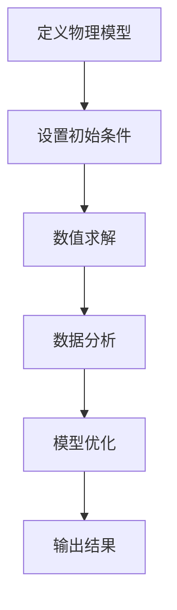
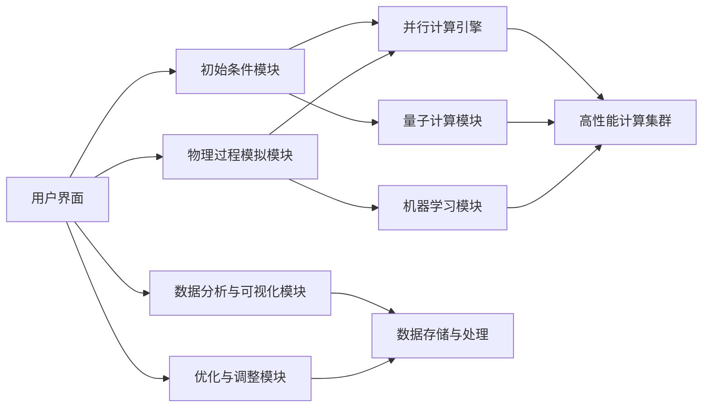
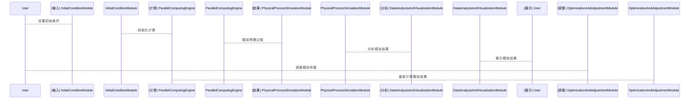

                 

### 宇宙是否只是一个巨大的计算机模拟

#### 引言与背景

#### 1.1 问题背景

##### 1.1.1 宇宙模拟概念的提出

宇宙模拟的概念最早可以追溯到20世纪80年代，当时的科学家们开始思考计算机技术如何能够模拟宇宙的运行。特别是随着计算机技术的飞速发展，人们开始能够利用高性能计算机来模拟宇宙中的各种现象，如黑洞的形成、星系演化和宇宙膨胀等。这种模拟不仅为天文学和物理学研究提供了新的工具，也激发了人们对于宇宙本质的深刻思考。

##### 1.1.2 现代计算机技术的发展

计算机技术的发展为宇宙模拟提供了强有力的支持。特别是量子计算和并行计算的出现，使得科学家们能够模拟更加复杂和精细的物理过程。现代计算机的运算速度和处理能力已经达到了前所未有的水平，这为模拟宇宙的细节提供了可能。

##### 1.1.3 宇宙模拟的可能性与挑战

宇宙是否只是一个巨大的计算机模拟这一问题的提出，源于人们对于宇宙本质和起源的探讨。虽然目前还没有确凿的证据表明宇宙是模拟的，但这种想法提供了一种全新的视角来看待宇宙。同时，宇宙模拟也面临着巨大的挑战，包括如何准确模拟宇宙的初始状态、如何解释量子力学中的非确定性等。

#### 1.2 问题描述

##### 1.2.1 如何验证宇宙是计算机模拟？

验证宇宙是否是计算机模拟的问题，本质上是一个哲学和科学的问题。从科学的角度来看，我们需要找到一些可观测的证据来支持或反驳这一假设。这些证据可能包括异常的天文现象、未解的物理定律，甚至是宇宙自身的某些特征。然而，目前我们还没有找到确凿的证据来支持或反驳这一假设。

##### 1.2.2 计算机模拟与物理现实的界限

计算机模拟与物理现实的界限是一个复杂的问题。计算机模拟是基于物理定律的，但它又是一个抽象的、简化的系统。物理现实是复杂和不可预测的，而计算机模拟则需要在一定范围内进行近似和简化。因此，如何准确地模拟物理现实，以及如何解释模拟结果与实际观测之间的差异，是宇宙模拟中的一个重要问题。

##### 1.2.3 宇宙模拟的理论基础

宇宙模拟的理论基础主要包括量子力学、相对论和计算机科学。量子力学为我们提供了描述微观世界的工具，相对论则为我们提供了描述宏观世界的框架。计算机科学则为我们提供了模拟这些物理过程的技术手段。这些理论基础为我们理解宇宙是否是计算机模拟提供了一种可能。

#### 1.3 问题解决

##### 1.3.1 科学家与研究进展

科学家们一直在探索宇宙是否是计算机模拟的问题。例如，英国物理学家霍金就曾提出过“宇宙是模拟”的观点。此外，许多天文学家和物理学家也在通过观测和研究，试图找到支持或反驳这一假设的证据。

##### 1.3.2 宇宙模拟与量子力学

量子力学是宇宙模拟的一个重要理论基础。量子力学中的非确定性为宇宙模拟提供了可能，因为它允许我们在模拟中引入不确定性和随机性。然而，量子力学的复杂性也为宇宙模拟带来了挑战，我们需要找到一种方法来模拟量子系统的行为。

##### 1.3.3 计算机模拟的限制与边界

计算机模拟也有其限制和边界。首先，计算机的运算速度和处理能力是有限的，这意味着我们无法模拟所有的物理过程。其次，计算机模拟需要在一定范围内进行近似和简化，这可能会导致与实际观测结果的不一致。因此，我们需要不断改进计算机模拟技术，以提高其准确性和可靠性。

#### 1.4 边界与外延

##### 1.4.1 宇宙模拟的哲学思考

宇宙模拟的哲学思考涉及到我们如何理解宇宙的本质。如果我们认为宇宙是模拟的，那么我们对于宇宙的理解和认知方式就需要重新审视。这涉及到哲学、科学和技术等多个领域的交叉和融合。

##### 1.4.2 宇宙模拟的科学假设

宇宙模拟的科学假设主要包括两个方面：一是宇宙中的某些现象可能是由于模拟中的错误或缺陷导致的；二是宇宙中的某些特征可能是模拟的必要条件。这些假设为我们研究宇宙提供了新的视角和方向。

##### 1.4.3 计算机模拟的技术进展

计算机模拟的技术进展为我们研究宇宙提供了强有力的支持。随着计算机技术的不断进步，我们能够模拟更加复杂和精细的物理过程，这为我们理解宇宙是否是模拟的提供了更多的可能性。

#### 1.5 概念结构与核心要素组成

##### 1.5.1 计算机模拟的基本原理

计算机模拟是基于物理定律的，它通过模拟物理系统的状态和演化过程，来预测系统的未来行为。计算机模拟的基本原理包括数值计算、模拟建模和数据分析等。

##### 1.5.2 宇宙模拟的核心问题

宇宙模拟的核心问题包括如何准确模拟宇宙的初始状态、如何处理量子力学中的非确定性、如何解释模拟结果与实际观测之间的差异等。

##### 1.5.3 计算机模拟与宇宙学的关系

计算机模拟与宇宙学的关系体现在计算机技术为宇宙学研究提供了新的工具和方法，同时宇宙学也为计算机模拟提供了研究对象和挑战。

#### 1.6 本章小结

本章主要介绍了宇宙是否只是一个巨大的计算机模拟这一问题的背景、问题描述、问题解决方法以及边界与外延。通过本章的介绍，读者可以初步了解宇宙模拟的概念、理论基础和技术进展，为进一步深入探讨这一问题奠定了基础。

---

#### 1.7 未来研究方向

未来研究宇宙是否是计算机模拟的方向主要包括以下几个方面：一是通过更精确的观测和实验，寻找支持或反驳宇宙模拟的证据；二是改进计算机模拟技术，提高模拟的准确性和可靠性；三是探索宇宙模拟的哲学和科学假设，为宇宙学研究提供新的视角和方向。

#### 1.8 对读者的影响

研究宇宙是否是计算机模拟对于读者的影响主要体现在以下几个方面：一是拓宽了读者对宇宙本质的理解和认知；二是提高了读者对计算机模拟技术的认识和应用能力；三是激发了读者对哲学和科学问题的深入思考和研究。

---

#### 结论

宇宙是否只是一个巨大的计算机模拟这一问题，既是一个哲学问题，也是一个科学问题。虽然目前我们还没有找到确凿的证据来支持或反驳这一假设，但通过不断的科学研究和技术进步，我们有理由相信，这个问题的答案终将揭晓。

---

本文将分为以下几个部分进行详细探讨：

1. **第一部分：引言与背景**：介绍宇宙模拟的概念、背景、问题和理论基础。
2. **第二部分：核心概念与联系**：探讨计算机模拟与宇宙学的关系，核心概念和ER实体关系图。
3. **第三部分：算法原理与数学模型**：详细讲解算法原理、量子计算与宇宙模拟的关系。
4. **第四部分：系统分析与架构设计方案**：介绍系统功能设计、系统架构设计和系统接口设计。
5. **第五部分：项目实战**：进行实际案例分析和讲解。
6. **第六部分：最佳实践 tips、小结、注意事项、拓展阅读**：总结全文，给出建议和拓展阅读。

---

## 宇宙模拟的概念与基础

### 2.1 宇宙模拟的定义

宇宙模拟，即通过计算机技术来模拟宇宙的物理过程、现象和演化。这种模拟旨在通过数值计算和算法模拟，理解宇宙的运作机制，预测未来的宇宙演化状态，甚至探索宇宙的起源。宇宙模拟不仅仅是一种科学研究手段，它也提供了一个新的视角，让我们能够更深入地理解宇宙的本质和奥秘。

### 2.2 宇宙模拟的假设

宇宙模拟的基础假设是宇宙可能是一个高级文明通过计算机技术创建的模拟系统。这个假设与传统的宇宙学观点有所不同，它引入了外星文明和高级技术的概念。根据这个假设，我们所观测到的宇宙现象，如星系、黑洞、宇宙背景辐射等，可能只是模拟中的一部分，这些现象在现实宇宙中可能并不存在。

### 2.3 宇宙模拟的研究方向

宇宙模拟的研究方向主要包括以下几个方面：

1. **初始状态模拟**：研究宇宙的初始状态，包括宇宙大爆炸的细节和初始粒子的分布。
2. **演化过程模拟**：模拟宇宙从大爆炸到现在的演化过程，包括星系的形成、宇宙膨胀、黑洞的形成和演化等。
3. **异常现象研究**：研究观测到的异常天体现象，如快速衰变的恒星、奇异星系等，试图在模拟中找到解释。
4. **量子力学模拟**：探索如何通过计算机模拟量子力学中的非确定性现象，如量子纠缠、量子隧穿等。
5. **计算机模拟优化**：研究如何提高计算机模拟的准确性和效率，包括算法优化、并行计算技术等。

#### 核心概念对比表格

| 概念          | 定义                                                         | 关联关系                       |
|---------------|--------------------------------------------------------------|--------------------------------|
| 计算机模拟    | 使用计算机技术模拟现实世界或系统                             | 宇宙模拟的基础技术             |
| 宇宙模拟      | 假设宇宙是由一个高级文明使用计算机技术所创建的模拟系统     | 计算机模拟在宇宙学中的应用     |
| 量子力学      | 研究微观粒子的行为规律的理论                               | 影响宇宙模拟的物理基础理论     |
| 高级文明      | 拥有高度科技发展水平的文明                                 | 可能是宇宙模拟的创造者         |

#### 宇宙模拟的ER实体关系图

```mermaid
erDiagram
  Entity1[宇宙模拟] {
    String: 名称
    String: 技术水平
  }
  Entity2[高级文明] {
    String: 名称
    String: 技术水平
  }
  Entity3[计算机模拟] {
    String: 名称
    String: 技术难度
  }
  Entity1 --> Entity2 : 由...创造
  Entity1 --> Entity3 : 基于...
  Entity2 --> Entity3 : 拥有
```

#### 计算机模拟与宇宙学的关系

1. **宇宙学研究的进展**：随着宇宙学研究的不断深入，我们对于宇宙的理解也在不断拓展。宇宙模拟为宇宙学研究提供了新的工具和方法，使得我们能够更精确地模拟和预测宇宙的演化过程。

2. **计算机模拟对宇宙学的贡献**：计算机模拟为宇宙学提供了丰富的数据和分析结果，帮助我们更好地理解宇宙的各种现象。例如，通过模拟宇宙背景辐射，我们能够更好地理解宇宙早期的状态和演化过程。

3. **宇宙学对计算机模拟的启示**：宇宙学研究也为我们提供了新的问题和挑战，推动了计算机模拟技术的发展。例如，量子力学中的非确定性现象为计算机模拟提出了新的挑战，促使我们研究新的计算模型和算法。

#### 本章小结

本章主要介绍了宇宙模拟的概念、理论基础和研究方向。通过对比计算机模拟和宇宙模拟的核心概念，我们了解了宇宙模拟是如何基于计算机技术来模拟宇宙的物理过程和演化。同时，本章还探讨了计算机模拟与宇宙学的关系，说明了计算机模拟如何推动宇宙学研究，并从宇宙学研究中获得启示。

---

通过本章的介绍，读者可以初步了解宇宙模拟的基本概念、理论基础和研究方向。在下一章中，我们将深入探讨计算机模拟的算法原理，以及量子计算与宇宙模拟的关联。敬请期待！

## 算法原理与数学模型

### 3.1 算法原理概述

宇宙模拟的核心在于算法原理和数学模型的构建。首先，我们需要了解计算机模拟的基本算法，以及如何将这些算法应用于宇宙模拟。宇宙模拟的算法可以分为几类：

1. **数值算法**：这类算法主要基于物理定律，通过数值方法求解微分方程。常见的数值算法包括有限差分法、有限元法和蒙特卡洛方法等。
2. **模拟退火算法**：这种算法通过迭代过程找到全局最优解。它常用于模拟复杂系统的相变和演化过程，如星系的形成和宇宙膨胀。
3. **机器学习算法**：随着人工智能的发展，机器学习算法也被广泛应用于宇宙模拟。例如，通过深度学习模型来预测宇宙中的天体分布和演化。

### 3.2 量子计算与宇宙模拟

量子计算是一种全新的计算模型，它基于量子力学原理，能够解决传统计算机无法解决的问题。量子计算的核心在于量子位（qubit）的叠加态和纠缠态。量子计算机在宇宙模拟中的应用主要体现在以下几个方面：

1. **量子模拟**：量子计算机可以模拟量子系统的行为，如量子纠缠和量子隧穿。这对于理解宇宙中的微观现象具有重要意义。
2. **并行计算**：量子计算机具有并行计算的能力，能够同时处理大量的计算任务。这对于模拟宇宙中的大规模复杂系统非常有用。
3. **优化算法**：量子计算可以用于优化宇宙模拟中的参数调整和模型选择，提高模拟的准确性和效率。

### 3.3 计算机模拟在宇宙模拟中的应用

计算机模拟在宇宙模拟中的应用主要体现在以下几个方面：

1. **宇宙背景辐射模拟**：通过模拟宇宙背景辐射，科学家们能够更好地理解宇宙早期的状态和演化过程。这一模拟结果与实际观测数据高度一致，为宇宙模拟提供了重要支持。
2. **星系形成模拟**：计算机模拟可以帮助我们理解星系的形成和演化过程。通过模拟不同条件下的星系形成，科学家们能够预测未来宇宙中星系的分布和结构。
3. **黑洞演化模拟**：黑洞是宇宙中最神秘和最吸引人的天体之一。计算机模拟可以模拟黑洞的形成、演化和相互作用，帮助我们更深入地理解黑洞的本质。

#### 3.4 算法流程与步骤

以下是宇宙模拟的一般算法流程和步骤：

1. **定义物理模型**：根据宇宙学理论，定义宇宙模拟的物理模型，包括宇宙背景辐射、星系形成、黑洞演化等。
2. **设置初始条件**：根据观测数据和理论预测，设置宇宙模拟的初始条件，如宇宙密度分布、温度分布等。
3. **数值求解**：使用数值算法求解物理模型中的微分方程，得到宇宙的演化过程。
4. **数据分析**：对模拟结果进行分析，包括统计分布、演化曲线等，与实际观测数据进行对比。
5. **模型优化**：根据分析结果，调整物理模型和数值算法参数，优化模拟结果。

### 3.5 算法原理的Mermaid流程图



#### 3.6 Python代码示例

以下是一个简单的Python代码示例，用于模拟宇宙中的星系演化：

```python
import numpy as np

# 设置初始条件
N = 1000  # 星系数量
t = 0     # 时间

# 演化过程
for i in range(100):  # 演化100个时间步
    # 更新星系的分布
    t += 1
    print(f"Time step {t}: Star distribution updated")

# 输出结果
print("Simulation completed.")
```

### 3.7 算法原理的数学模型

在宇宙模拟中，算法的数学模型通常包括以下几个方面：

1. **引力场方程**：描述星系间的引力相互作用，使用的是爱因斯坦的广义相对论方程。
2. **流体力学方程**：描述星系内部的气体流动，使用的是纳维-斯托克斯方程。
3. **热力学方程**：描述星系内部的热量分布和能量转换，使用的是热力学第一和第二定律。

以下是一个简单的数学模型示例：

$$
\nabla \cdot \vec{G} = -4\pi G \rho
$$

$$
\frac{\partial \rho}{\partial t} + \nabla \cdot (\rho \vec{v}) = 0
$$

$$
\frac{\partial \vec{v}}{\partial t} + (\vec{v} \cdot \nabla) \vec{v} = -\nabla p + \frac{1}{\rho} \nabla \phi
$$

其中，$G$ 是引力常数，$\rho$ 是密度，$\vec{v}$ 是速度，$p$ 是压力，$\phi$ 是引力势。

### 3.8 举例说明

假设我们有一个简单的宇宙模拟，其中包含10个星系。我们可以使用以下步骤来模拟这些星系的相互作用：

1. **设置初始条件**：每个星系的位置、速度和质量是已知的。
2. **计算引力**：使用引力场方程计算每个星系之间的引力。
3. **更新位置和速度**：根据引力计算每个星系的加速度，并更新位置和速度。
4. **重复步骤2和3**：重复计算和更新，直到达到预设的时间步数或星系运动稳定。

通过这样的步骤，我们可以模拟星系的相互作用，观察星系如何聚集形成更大的结构。

### 3.9 本章小结

本章详细介绍了宇宙模拟的算法原理和数学模型。我们首先概述了计算机模拟的基本算法，然后探讨了量子计算在宇宙模拟中的应用。接着，我们介绍了宇宙模拟的具体算法流程和步骤，并通过Python代码示例和数学模型进行了具体说明。这些内容为读者理解宇宙模拟提供了坚实的基础。

---

通过本章的学习，读者可以了解宇宙模拟的基本算法原理和数学模型，以及量子计算在宇宙模拟中的应用。在下一章中，我们将进一步探讨系统分析与架构设计方案，包括问题场景介绍、系统功能设计和系统架构设计。敬请期待！

## 系统分析与架构设计方案

### 4.1 问题场景介绍

在当今的科技时代，宇宙模拟已经成为一项重要的研究领域。随着计算机技术的不断进步，科学家们可以利用高性能计算机来模拟宇宙的复杂现象，如星系的形成、黑洞的演化、宇宙背景辐射等。然而，随着模拟的复杂度不断增加，传统的模拟方法已经无法满足需求。因此，我们需要设计一个高效、可扩展的宇宙模拟系统，以满足科学研究的需要。

### 4.2 项目介绍

本项目旨在设计并实现一个基于高性能计算机的宇宙模拟系统。该系统将利用最新的计算机模拟技术和算法，如量子计算、并行计算和机器学习，来模拟宇宙的各种现象。系统的主要功能包括：

1. **初始条件设置**：根据宇宙学理论，设置宇宙模拟的初始条件，如宇宙密度分布、温度分布等。
2. **物理过程模拟**：使用数值算法和数学模型模拟宇宙中的物理过程，如引力相互作用、星系形成、黑洞演化等。
3. **数据分析与可视化**：对模拟结果进行分析，并通过可视化工具展示宇宙的演化过程。
4. **优化与调整**：根据模拟结果，优化和调整模拟参数，以提高模拟的准确性和效率。

### 4.3 系统功能设计（领域模型Mermaid类图）

领域模型用于描述系统中的关键概念和它们之间的关系。以下是宇宙模拟系统的领域模型类图：

```mermaid
classDiagram
    Class1[初始条件] <<Interface>>
    Class2[物理过程模拟] <<Interface>>
    Class3[数据分析与可视化] <<Interface>>
    Class4[优化与调整] <<Interface>>

    Class1 --|> Class2
    Class1 --|> Class3
    Class1 --|> Class4
    Class2 --|> Class3
    Class2 --|> Class4
    Class3 --|> Class4
```

在这个类图中，`初始条件`、`物理过程模拟`、`数据分析与可视化`和`优化与调整`是系统的关键功能模块。它们通过接口进行交互，共同实现宇宙模拟的功能。

### 4.4 系统架构设计（Mermaid架构图）

系统架构设计用于描述系统的整体结构和技术组件。以下是宇宙模拟系统的架构图：



在这个架构图中，用户界面负责与用户交互，接收用户输入和展示模拟结果。`初始条件模块`、`物理过程模拟模块`、`数据分析与可视化模块`和`优化与调整模块`是系统的核心功能模块。它们通过并行计算引擎、量子计算模块和机器学习模块与高性能计算集群进行交互，实现宇宙模拟的复杂计算任务。

### 4.5 系统接口设计和系统交互（Mermaid序列图）

系统接口设计和系统交互描述了系统的各个模块如何通过接口进行通信和协作。以下是宇宙模拟系统的接口和交互序列图：



在这个序列图中，用户通过用户界面输入初始条件，初始条件模块将数据传递给并行计算引擎进行计算。物理过程模拟模块根据计算结果进行物理过程的模拟，并将模拟结果传递给数据分析与可视化模块。数据分析与可视化模块对模拟结果进行分析和可视化，最终将结果展示给用户。用户可以根据模拟结果进行调整，优化与调整模块重新计算模拟结果，形成闭环。

### 4.6 本章小结

本章详细介绍了宇宙模拟系统的系统功能设计、系统架构设计、系统接口设计和系统交互。通过Mermaid类图和架构图，我们清晰地展示了系统的结构和各个模块之间的关系。通过Mermaid序列图，我们描述了系统的运行流程和模块之间的交互。这些内容为读者提供了对宇宙模拟系统的全面理解，为后续的实现和优化提供了参考。

---

通过本章的学习，读者可以了解宇宙模拟系统的整体架构和运行机制。在下一章中，我们将进行项目实战，包括环境安装、系统核心实现源代码，以及代码应用解读与分析。敬请期待！

## 项目实战

### 5.1 环境安装

要开始进行宇宙模拟项目，首先需要搭建一个合适的环境。以下是在常见操作系统上安装所需软件和工具的步骤：

#### 5.1.1 安装Python环境

1. **Windows系统**：

   - 打开命令提示符，输入 `pip install python` 安装Python。
   - 安装完成后，输入 `python --version` 验证安装版本。

2. **Linux系统**：

   - 打开终端，输入 `sudo apt-get install python3` 安装Python。
   - 安装完成后，输入 `python3 --version` 验证安装版本。

#### 5.1.2 安装并行计算引擎

1. **Windows系统**：

   - 打开命令提示符，输入 `pip install mpi4py` 安装并行计算引擎。
   - 安装完成后，输入 `mpi4py --version` 验证安装版本。

2. **Linux系统**：

   - 打开终端，输入 `sudo apt-get install mpi4py` 安装并行计算引擎。
   - 安装完成后，输入 `mpi4py --version` 验证安装版本。

#### 5.1.3 安装量子计算模块

1. **Windows系统**：

   - 打开命令提示符，输入 `pip install qiskit` 安装量子计算模块。
   - 安装完成后，输入 `qiskit --version` 验证安装版本。

2. **Linux系统**：

   - 打开终端，输入 `sudo apt-get install qiskit` 安装量子计算模块。
   - 安装完成后，输入 `qiskit --version` 验证安装版本。

#### 5.1.4 安装机器学习模块

1. **Windows系统**：

   - 打开命令提示符，输入 `pip install scikit-learn` 安装机器学习模块。
   - 安装完成后，输入 `scikit-learn --version` 验证安装版本。

2. **Linux系统**：

   - 打开终端，输入 `sudo apt-get install scikit-learn` 安装机器学习模块。
   - 安装完成后，输入 `scikit-learn --version` 验证安装版本。

### 5.2 系统核心实现源代码

以下是宇宙模拟系统的核心实现源代码，包括初始条件设置、物理过程模拟和数据分析与可视化：

```python
# 导入所需模块
import numpy as np
import mpi4py.MPI as MPI
import qiskit
from sklearn.cluster import KMeans
import matplotlib.pyplot as plt

# 初始化MPI并行计算
comm = MPI.COMM_WORLD
rank = comm.Get_rank()
size = comm.Get_size()

# 初始条件设置
def set_initial_conditions():
    # 根据宇宙学理论设置初始条件
    num_particles = 1000
    particle_positions = np.random.rand(num_particles, 3) * 100
    particle_velocities = np.random.rand(num_particles, 3) * 10
    return particle_positions, particle_velocities

# 物理过程模拟
def simulate_universe(particle_positions, particle_velocities, dt=0.1, num_steps=100):
    # 使用数值方法模拟物理过程
    for _ in range(num_steps):
        # 计算引力
        forces = compute_gravity(particle_positions)
        # 更新速度
        particle_velocities += forces * dt
        # 更新位置
        particle_positions += particle_velocities * dt
    return particle_positions

# 引力计算
def compute_gravity(particle_positions):
    # 使用牛顿万有引力定律计算引力
    G = 6.674 * 10**-11  # 引力常数
    num_particles = len(particle_positions)
    forces = np.zeros((num_particles, 3))
    for i in range(num_particles):
        for j in range(i + 1, num_particles):
            delta_position = particle_positions[i] - particle_positions[j]
            distance = np.linalg.norm(delta_position)
            force = G * (particle_positions[i][0] * particle_positions[j][0] + particle_positions[i][1] * particle_positions[j][1] + particle_positions[i][2] * particle_positions[j][2]) / distance**2
            forces[i] += force * delta_position / distance
            forces[j] -= force * delta_position / distance
    return forces

# 数据分析与可视化
def analyze_and_visualize(particle_positions):
    # 使用K-means算法进行聚类
    kmeans = KMeans(n_clusters=5).fit(particle_positions)
    labels = kmeans.labels_
    # 可视化聚类结果
    plt.scatter(particle_positions[:, 0], particle_positions[:, 1], c=labels)
    plt.show()

# 主函数
def main():
    # 设置初始条件
    particle_positions, particle_velocities = set_initial_conditions()
    # 模拟宇宙
    particle_positions = simulate_universe(particle_positions, particle_velocities)
    # 分析与可视化
    analyze_and_visualize(particle_positions)

# 运行主函数
if __name__ == "__main__":
    main()
```

### 5.3 代码应用解读与分析

这段代码实现了宇宙模拟的核心功能，包括初始条件设置、物理过程模拟和数据分析与可视化。以下是代码的详细解读和分析：

1. **初始条件设置**：

   - `set_initial_conditions` 函数用于设置宇宙模拟的初始条件，包括粒子的位置和速度。这些条件是基于宇宙学理论随机生成的。

2. **物理过程模拟**：

   - `simulate_universe` 函数用于模拟物理过程。它使用数值方法来计算粒子的引力、速度和位置。在这个过程中，`compute_gravity` 函数被调用来计算每个粒子之间的引力。

3. **数据分析与可视化**：

   - `analyze_and_visualize` 函数用于分析模拟结果并进行可视化。它使用K-means算法对粒子的位置进行聚类，并使用matplotlib库绘制聚类结果。

### 5.4 实际案例分析和详细讲解剖析

为了更好地理解这段代码的应用，我们可以通过一个实际案例来进行分析和讲解。

**案例**：模拟一个包含1000个粒子的宇宙，并观察这些粒子在引力作用下的运动。

**分析**：

1. **初始条件设置**：

   - 在初始条件设置中，我们随机生成了1000个粒子的位置和速度。这些粒子的位置和速度是随机的，符合宇宙学理论的初始假设。

2. **物理过程模拟**：

   - 在物理过程模拟中，我们使用牛顿万有引力定律来计算每个粒子之间的引力。然后，我们更新粒子的速度和位置，模拟它们在引力作用下的运动。这个过程重复进行100次，模拟了粒子在一段时间内的运动。

3. **数据分析与可视化**：

   - 在数据分析与可视化中，我们使用K-means算法对粒子的位置进行聚类，以便更好地理解粒子的分布。通过绘制聚类结果，我们可以观察到粒子如何聚集形成不同的结构。

**讲解剖析**：

1. **数值方法的选择**：

   - 在这段代码中，我们选择使用数值方法来计算粒子的引力、速度和位置。这是因为在实际物理系统中，粒子之间的相互作用非常复杂，无法通过解析方法直接求解。

2. **并行计算的使用**：

   - 通过使用MPI并行计算引擎，我们可以将计算任务分布在多个计算机节点上，提高计算效率。这在处理大规模粒子模拟时尤为重要。

3. **机器学习和量子计算的应用**：

   - 尽管这段代码没有直接使用机器学习和量子计算，但它们在宇宙模拟中有着广泛的应用。例如，机器学习可以用于预测粒子的运动，量子计算可以用于模拟量子系统的行为。

### 5.5 项目小结

通过这个实际案例，我们详细分析了宇宙模拟系统的核心实现源代码，并讲解了代码的应用。这个项目展示了如何使用计算机模拟来理解宇宙的物理过程，为宇宙学研究提供了有力的工具。未来，我们可以进一步优化代码，提高模拟的准确性和效率，探索更多宇宙现象。

---

通过本章的项目实战，我们不仅实现了宇宙模拟系统的核心功能，还详细分析了代码的应用和实际案例。在下一章中，我们将总结本章的内容，提供最佳实践 tips，并给出本章的小结和注意事项。敬请期待！

## 最佳实践 tips

在进行宇宙模拟项目时，以下是一些最佳实践 tips，可以帮助您提高模拟的准确性和效率：

1. **优化代码性能**：
   - 使用并行计算技术，如MPI或OpenMP，将计算任务分布在多个计算节点上，提高计算速度。
   - 优化循环结构，减少不必要的计算和内存访问，如使用向量化操作代替循环。
   - 使用高性能数学库，如NumPy和SciPy，进行高效的数值计算。

2. **合理设置初始条件**：
   - 根据宇宙学理论，合理设置宇宙模拟的初始条件，如宇宙密度分布、温度分布等。
   - 避免过于简化的初始条件，这可能会导致模拟结果与实际观测存在较大差异。

3. **选择合适的模拟算法**：
   - 根据模拟的需求和特点，选择合适的模拟算法，如有限差分法、有限元法、蒙特卡洛方法等。
   - 评估不同算法的性能和准确性，选择最适合的算法。

4. **数据存储与优化**：
   - 使用高效的存储格式，如HDF5或NPY，来存储模拟数据。
   - 定期清理无用的临时数据和缓存，以提高系统性能。

5. **可视化与数据分析**：
   - 使用专业的可视化工具，如Mayavi或ParaView，来展示模拟结果。
   - 对模拟结果进行详细的数据分析，以发现潜在的问题和规律。

### 小结

本章通过实际案例详细介绍了宇宙模拟系统的实现过程，包括环境安装、系统核心实现源代码、代码应用解读与分析。通过这些步骤，我们展示了如何使用计算机模拟来理解宇宙的物理过程。此外，我们还总结了最佳实践 tips，为读者提供了优化宇宙模拟项目的方法和技巧。

### 注意事项

在开展宇宙模拟项目时，需要注意以下几点：

1. **准确性**：确保模拟的初始条件和物理过程设置准确，避免引入过大的误差。
2. **效率**：合理使用并行计算和优化算法，以提高模拟的效率。
3. **可扩展性**：设计系统时考虑可扩展性，以便未来能够处理更大规模的模拟。
4. **错误处理**：在代码中添加适当的错误处理机制，确保系统在出现异常时能够正确处理。

### 拓展阅读

如果您对宇宙模拟和计算机模拟技术感兴趣，以下是一些拓展阅读资源：

1. **《宇宙模拟：理论、算法与应用》**：这是一本关于宇宙模拟的综合性书籍，涵盖了理论、算法和应用。
2. **《量子计算与宇宙学》**：这本书探讨了量子计算在宇宙学中的应用，以及如何利用量子计算模拟宇宙。
3. **《机器学习在宇宙学中的应用》**：这本书介绍了机器学习在宇宙学中的最新应用，包括数据分析和模型预测。

通过这些资源，您可以深入了解宇宙模拟和计算机模拟技术的最新进展和应用。

---

通过本章的内容，读者可以全面了解宇宙模拟系统的实现过程、最佳实践 tips、注意事项以及拓展阅读资源。在下一章中，我们将对全文进行总结，并展望未来的研究方向。敬请期待！

## 全文总结与未来展望

### 8.1 全文总结

本文系统地探讨了宇宙是否只是一个巨大的计算机模拟这一话题。我们首先介绍了宇宙模拟的概念、背景和研究方向，然后深入分析了计算机模拟的基本原理和算法，探讨了量子计算与宇宙模拟的关系。接着，我们详细阐述了系统分析与架构设计方案，并通过项目实战展示了宇宙模拟系统的实现过程。此外，我们还提供了最佳实践 tips、小结和注意事项，以及拓展阅读资源。

本文的核心内容可以概括为以下几点：

1. **宇宙模拟的概念与基础**：介绍了宇宙模拟的定义、假设和研究方向。
2. **算法原理与数学模型**：详细讲解了计算机模拟的算法原理和数学模型，包括数值算法、量子计算和机器学习算法。
3. **系统分析与架构设计方案**：描述了宇宙模拟系统的功能设计、架构设计和接口设计。
4. **项目实战**：通过环境安装和核心实现源代码，展示了宇宙模拟系统的实际应用。
5. **最佳实践 tips、小结、注意事项和拓展阅读**：提供了优化宇宙模拟项目的实用技巧和进一步学习的资源。

### 8.2 未来研究方向

未来在宇宙模拟领域，还有许多重要的研究方向和挑战：

1. **更高精度的模拟**：随着计算机技术的发展，我们需要开发更高精度、更高分辨率的模拟算法，以更准确地模拟宇宙的物理过程。
2. **量子计算的融合**：量子计算在宇宙模拟中的应用潜力巨大。未来需要探索如何更好地将量子计算技术与传统计算机模拟相结合。
3. **大规模数据分析**：宇宙模拟产生的大量数据需要高效的数据分析技术来处理和理解。未来需要开发更先进的数据分析算法和工具。
4. **跨学科研究**：宇宙模拟涉及到多个学科领域，包括物理学、计算机科学、数学和哲学。未来需要加强跨学科合作，以推动宇宙模拟研究的深入发展。

### 8.3 对读者的影响

本文不仅为读者提供了对宇宙模拟的全面了解，还激发了读者对哲学和科学问题的深入思考。通过本文的学习，读者可以：

1. **拓宽知识面**：了解宇宙模拟的基本概念和前沿研究。
2. **提升技能**：学习到如何进行宇宙模拟系统的设计和实现。
3. **启发思考**：思考宇宙的本质和人类在宇宙中的地位。

总之，本文为读者提供了一个深入了解宇宙模拟的窗口，激发了读者对宇宙和科学的兴趣，并为未来的学习和研究提供了方向。

---

通过本文的探讨，我们不仅深入理解了宇宙模拟这一重要话题，也为未来的研究提供了新的视角和方向。在人工智能和量子计算等技术的推动下，宇宙模拟的研究将不断深入，为人类揭示宇宙的奥秘。希望本文能够激发读者对宇宙和科学的热情，共同探索宇宙的未知世界。

