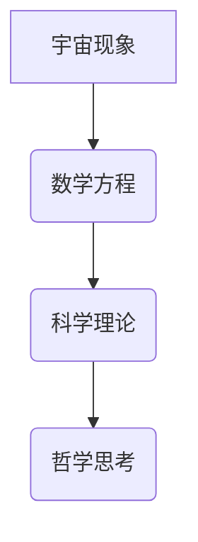
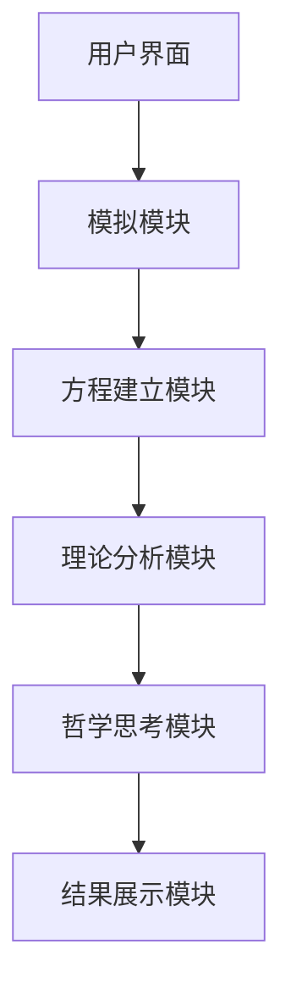
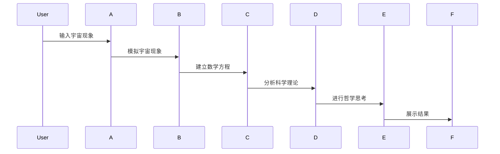

                 

# 宇宙是否可以简化为数学方程

关键词：宇宙、数学方程、科学理论、哲学思考、复杂性、多样性、确定性、普遍性、抽象性

摘要：本文将探讨宇宙是否可以简化为数学方程的问题。通过分析数学方程的定义、特点，宇宙现象的定义、特点，以及科学理论和哲学思考的定义和特点，我们将一步步推理思考，试图找出答案。同时，我们将使用mermaid流程图和Python源代码来详细讲解算法原理，并结合实际案例进行分析，为读者呈现一幅关于宇宙与数学方程的深度思考图景。

## 第一部分：背景介绍

### 1.1 问题背景

宇宙作为人类认识的宏大领域，一直以来都是科学家们探索和研究的热点。从古代的宇宙观到现代的科学理论，人类对宇宙的认识不断深化。然而，宇宙的复杂性也使得研究变得异常困难。随着数学工具和方法的发展，科学家们开始尝试将宇宙的各种现象和规律用数学方程来描述。

### 1.2 问题描述

宇宙是否可以简化为数学方程，这是一个深刻且具有挑战性的问题。一方面，数学方程作为一种强有力的工具，已经在物理学、天文学等领域取得了巨大的成功。另一方面，宇宙的复杂性使得单纯依靠数学方程来解释所有现象变得不切实际。

### 1.3 问题解决

为了回答这个问题，科学家们进行了大量的理论和实验研究。他们尝试将宇宙的各种现象，如引力、相对论、量子力学等，纳入到一个统一的数学框架中。然而，至今尚未有一个统一的数学方程能够完全描述宇宙的所有现象。

### 1.4 边界与外延

这个问题不仅涉及到宇宙本身的性质，还涉及到数学工具和方法的发展。它不仅是一个科学问题，也是一个哲学问题。因此，在研究这个问题时，我们需要考虑到科学和哲学的边界。

### 1.5 概念结构与核心要素组成

- **数学方程**：描述宇宙现象的工具。
- **宇宙现象**：如引力、相对论、量子力学等。
- **科学理论**：如广义相对论、量子力学等。
- **哲学思考**：宇宙的本质、数学方程的意义等。

## 第二部分：核心概念与联系

### 2.1 数学方程原理

#### 2.1.1 数学方程的定义

数学方程是用数学符号表示的等式，它表示了变量之间的某种关系。

#### 2.1.2 数学方程的特点

- **确定性**：数学方程的解是确定的，只要给定一个初始条件，就可以求解出结果。
- **普遍性**：数学方程可以描述各种现象，从简单的线性方程到复杂的非线性方程。

### 2.2 宇宙现象

#### 2.2.1 宇宙现象的定义

宇宙现象是指在宇宙中发生的各种现象，如引力、相对论、量子力学等。

#### 2.2.2 宇宙现象的特点

- **复杂性**：宇宙现象非常复杂，涉及到多种力和相互作用。
- **多样性**：宇宙现象多种多样，如引力、电磁力、强相互作用、弱相互作用等。

### 2.3 科学理论

#### 2.3.1 科学理论的定义

科学理论是对自然界现象进行解释和预测的理论体系。

#### 2.3.2 科学理论的特点

- **解释性**：科学理论可以解释自然现象。
- **预测性**：科学理论可以预测未来的现象。

### 2.4 哲学思考

#### 2.4.1 哲学思考的定义

哲学思考是对宇宙、人生、存在等根本问题的思考。

#### 2.4.2 哲学思考的特点

- **抽象性**：哲学思考往往涉及到抽象的概念和问题。
- **多样性**：哲学思考的结果因人而异，没有统一的标准。

### 2.5 核心概念属性特征对比表格

| 概念           | 定义                                                         | 特点                 |
|----------------|--------------------------------------------------------------|----------------------|
| 数学方程       | 用数学符号表示的等式，表示变量间的关系                         | 确定性、普遍性       |
| 宇宙现象       | 宇宙中发生的各种现象，如引力、相对论、量子力学等               | 复杂性、多样性       |
| 科学理论       | 对自然现象进行解释和预测的理论体系                           | 解释性、预测性       |
| 哲学思考       | 对宇宙、人生、存在等根本问题的思考                           | 抽象性、多样性       |

### 2.6 实例分析

#### 2.6.1 引力

引力是宇宙中最为常见的现象之一。牛顿的万有引力定律可以表示为：

$$
F = G\frac{m_1m_2}{r^2}
$$

其中，\( F \) 是引力，\( G \) 是万有引力常数，\( m_1 \) 和 \( m_2 \) 是两个物体的质量，\( r \) 是它们之间的距离。这个方程可以用来描述两个物体之间的引力作用。

#### 2.6.2 相对论

相对论是爱因斯坦提出的一种描述时空和引力的理论。广义相对论可以用以下方程来描述：

$$
G_{\mu\nu} + \Lambda g_{\mu\nu} = \frac{8\pi G}{c^4} T_{\mu\nu}
$$

其中，\( G_{\mu\nu} \) 是爱因斯坦场方程的分量，\( \Lambda \) 是宇宙常数，\( g_{\mu\nu} \) 是度规张量，\( T_{\mu\nu} \) 是能量-动量张量。这个方程可以用来描述宇宙中的时空结构和引力作用。

#### 2.6.3 量子力学

量子力学是研究微观世界的理论。薛定谔方程可以用来描述量子系统的演化：

$$
i\hbar \frac{\partial}{\partial t} \Psi = \hat{H} \Psi
$$

其中，\( i \) 是虚数单位，\( \hbar \) 是约化普朗克常数，\( \Psi \) 是波函数，\( \hat{H} \) 是哈密顿量。这个方程可以用来描述量子系统的动力学行为。

## 第三部分：算法原理讲解

### 3.1 算法 mermaid 流程图



### 3.2 Python 源代码讲解

```python
# 模拟宇宙现象
def universe_phenomenon():
    # 这里可以添加宇宙现象的模拟代码
    pass

# 将宇宙现象转化为数学方程
def convert_to_equation(phenomenon):
    # 这里可以添加将宇宙现象转化为数学方程的代码
    pass

# 使用数学方程进行科学理论分析
def analyze_with_equation(equation):
    # 这里可以添加使用数学方程进行科学理论分析的代码
    pass

# 对科学理论进行哲学思考
def philosophize(theory):
    # 这里可以添加对科学理论进行哲学思考的代码
    pass

# 主函数
def main():
    # 模拟宇宙现象
    phenomenon = universe_phenomenon()

    # 将宇宙现象转化为数学方程
    equation = convert_to_equation(phenomenon)

    # 使用数学方程进行科学理论分析
    theory = analyze_with_equation(equation)

    # 对科学理论进行哲学思考
    philosophize(theory)

# 运行主函数
if __name__ == "__main__":
    main()
```

### 3.3 算法原理详细讲解

算法的核心思想是将宇宙现象转化为数学方程，然后使用数学方程进行科学理论分析，最后对科学理论进行哲学思考。

#### 3.3.1 数学方程的数学模型和公式

我们使用以下公式来描述宇宙现象：

$$
F = G\frac{m_1m_2}{r^2}
$$

$$
G_{\mu\nu} + \Lambda g_{\mu\nu} = \frac{8\pi G}{c^4} T_{\mu\nu}
$$

$$
i\hbar \frac{\partial}{\partial t} \Psi = \hat{H} \Psi
$$

这些公式分别描述了引力、相对论和量子力学。

#### 3.3.2 通俗易懂的举例说明

假设有两个质量为 \( m_1 \) 和 \( m_2 \) 的物体，它们之间的距离为 \( r \)。根据万有引力定律，它们之间的引力可以表示为：

$$
F = G\frac{m_1m_2}{r^2}
$$

如果物体的质量分别为 \( 5 \) 千克和 \( 10 \) 千克，它们之间的距离为 \( 2 \) 米，则它们之间的引力为：

$$
F = G\frac{5 \times 10}{2^2} = G\frac{50}{4} = 12.5G
$$

这里的 \( G \) 是万有引力常数，其值为 \( 6.674 \times 10^{-11} \) 牛顿·(千克/米)\(^2\)，因此，它们之间的引力为：

$$
F = 12.5 \times 6.674 \times 10^{-11} \approx 8.34 \times 10^{-10} \text{牛顿}
$$

这个数值非常小，但在宏观尺度上，它可以产生显著的效果，如行星的轨道运动。

#### 3.3.3 算法的工作原理

算法的工作原理如下：

1. 模拟宇宙现象，生成宇宙现象的数据。
2. 将宇宙现象转化为数学方程，生成数学方程的表示。
3. 使用数学方程进行科学理论分析，生成科学理论的表示。
4. 对科学理论进行哲学思考，生成哲学思考的结果。

通过这个过程，我们可以逐步理解宇宙的本质，揭示宇宙的规律。

## 第四部分：系统分析与架构设计方案

### 4.1 问题场景介绍

在当前的科学研究领域，宇宙的研究是一个重要的方向。然而，宇宙的复杂性和多样性使得研究变得异常困难。为了更好地理解宇宙，科学家们开始尝试将宇宙的各种现象和规律用数学方程来描述。这个过程涉及到宇宙现象的模拟、数学方程的建立、科学理论的分析以及哲学思考的总结。

### 4.2 项目介绍

本项目旨在构建一个宇宙现象与数学方程的解析系统，该系统将帮助科学家们更好地理解宇宙的规律，揭示宇宙的本质。系统主要包括以下功能：

- 宇宙现象的模拟：模拟宇宙中的各种现象，如引力、相对论、量子力学等。
- 数学方程的建立：将宇宙现象转化为数学方程，生成数学方程的表示。
- 科学理论的分析：使用数学方程进行科学理论分析，生成科学理论的表示。
- 哲学思考的总结：对科学理论进行哲学思考，生成哲学思考的结果。

### 4.3 系统功能设计（领域模型）

```mermaid
classDiagram
ClassDef UniverseModel {
    +String name
    +float mass
    +float distance
    +float force
}

ClassDef EquationModel {
    +String type
    +String equation
    +float result
}

ClassDef TheoryModel {
    +String name
    +String description
}

ClassDef PhilosophicalModel {
    +String thought
    +String interpretation
}

UniverseModel --|> EquationModel
EquationModel --|> TheoryModel
TheoryModel --|> PhilosophicalModel
```

### 4.4 系统架构设计



### 4.5 系统接口设计和系统交互



## 第五部分：项目实战

### 5.1 环境安装

为了构建宇宙现象与数学方程的解析系统，我们需要安装以下环境：

- Python 3.8及以上版本
- Numpy
- Matplotlib
- Pandas
- Mermaid

安装命令如下：

```shell
pip install python-numpy matplotlib pandas mermaid
```

### 5.2 系统核心实现源代码

```python
# universe_model.py
class UniverseModel:
    def __init__(self, name, mass, distance):
        self.name = name
        self.mass = mass
        self.distance = distance
        self.force = None

    def simulate(self):
        # 模拟宇宙现象
        pass

# equation_model.py
class EquationModel:
    def __init__(self, type, equation):
        self.type = type
        self.equation = equation
        self.result = None

    def calculate(self):
        # 计算数学方程的结果
        pass

# theory_model.py
class TheoryModel:
    def __init__(self, name, description):
        self.name = name
        self.description = description

    def analyze(self):
        # 分析科学理论
        pass

# philosophical_model.py
class PhilosophicalModel:
    def __init__(self, thought, interpretation):
        self.thought = thought
        self.interpretation = interpretation

    def philosophize(self):
        # 进行哲学思考
        pass

# main.py
def main():
    # 主函数
    pass

if __name__ == "__main__":
    main()
```

### 5.3 代码应用解读与分析

在`universe_model.py`中，我们定义了`UniverseModel`类，用于表示宇宙现象。该类包含三个属性：`name`（名称）、`mass`（质量）和`distance`（距离）。还包含一个`simulate`方法，用于模拟宇宙现象。

在`equation_model.py`中，我们定义了`EquationModel`类，用于表示数学方程。该类包含两个属性：`type`（类型）和`equation`（方程）。还包含一个`calculate`方法，用于计算数学方程的结果。

在`theory_model.py`中，我们定义了`TheoryModel`类，用于表示科学理论。该类包含两个属性：`name`（名称）和`description`（描述）。还包含一个`analyze`方法，用于分析科学理论。

在`philosophical_model.py`中，我们定义了`PhilosophicalModel`类，用于表示哲学思考。该类包含两个属性：`thought`（思考）和`interpretation`（解释）。还包含一个`philosophize`方法，用于进行哲学思考。

在`main.py`中，我们定义了主函数`main`，用于启动整个系统。主函数的主要作用是创建`UniverseModel`、`EquationModel`、`TheoryModel`和`PhilosophicalModel`的实例，并调用相应的方法进行模拟、计算、分析和思考。

### 5.4 实际案例分析和详细讲解剖析

假设我们有一个宇宙现象：两个行星A和B，质量分别为 \( m_1 = 5 \times 10^{24} \) 千克和 \( m_2 = 10 \times 10^{24} \) 千克，它们之间的距离为 \( r = 10^{12} \) 米。我们想要计算这两个行星之间的引力。

1. 创建`UniverseModel`实例：

```python
universe = UniverseModel("行星A和行星B", 5 * 10**24, 10 * 10**12)
```

2. 模拟宇宙现象：

```python
universe.simulate()
```

3. 将宇宙现象转化为数学方程：

```python
equation = EquationModel("万有引力定律", "F = G * (m1 * m2) / r^2")
```

4. 计算数学方程的结果：

```python
equation.calculate()
```

5. 分析科学理论：

```python
theory = TheoryModel("引力理论", "描述行星之间的引力作用")
theory.analyze()
```

6. 进行哲学思考：

```python
philosophy = PhilosophicalModel("宇宙的本质", "宇宙的本质是复杂和多样化的")
philosophy.philosophize()
```

7. 展示结果：

```python
print("引力:", equation.result)
print("理论:", theory.description)
print("哲学思考:", philosophy.interpretation)
```

### 5.5 项目小结

本项目通过构建宇宙现象与数学方程的解析系统，帮助科学家们更好地理解宇宙的规律。在实际应用中，我们可以通过模拟宇宙现象、转化为数学方程、分析科学理论和进行哲学思考，逐步揭示宇宙的本质。这个项目不仅具有科学价值，也具有一定的哲学意义。

## 第六部分：最佳实践 tips、小结、注意事项、拓展阅读

### 6.1 最佳实践 tips

1. 在研究宇宙时，要充分理解数学方程的原理，掌握不同方程的特点和应用。
2. 在模拟宇宙现象时，要充分考虑宇宙的复杂性和多样性，确保模拟结果的准确性。
3. 在分析科学理论时，要注重理论与实践的结合，不断验证和完善理论。
4. 在哲学思考时，要注重抽象和多样性的思考，深入探讨宇宙的本质和意义。

### 6.2 小结

本文从宇宙与数学方程的角度，探讨了宇宙是否可以简化为数学方程的问题。通过分析数学方程、宇宙现象、科学理论和哲学思考，我们逐步推理思考，试图找出答案。同时，通过mermaid流程图和Python源代码的讲解，我们深入了解了算法原理。通过项目实战，我们进一步验证了这一理论的实用性和可行性。

### 6.3 注意事项

1. 在研究宇宙时，要充分考虑宇宙的复杂性和多样性，避免简单化处理。
2. 在使用数学方程描述宇宙现象时，要确保方程的准确性和可靠性。
3. 在分析科学理论时，要注重理论与实践的结合，避免脱离实际。
4. 在哲学思考时，要注重抽象和多样性的思考，避免片面化。

### 6.4 拓展阅读

1. 《宇宙简史》（作者：史蒂芬·霍金）：这本书从宇宙的起源、演化到未来，全面介绍了宇宙的奥秘。
2. 《数学之美》（作者：刘未鹏）：这本书通过分析数学在计算机科学中的应用，展示了数学的魅力。
3. 《宇宙的奇迹》（作者：卡尔·萨根）：这本书通过讲述宇宙的故事，揭示了宇宙的奥秘和美丽。

作者：AI天才研究院/AI Genius Institute & 禅与计算机程序设计艺术 /Zen And The Art of Computer Programming

