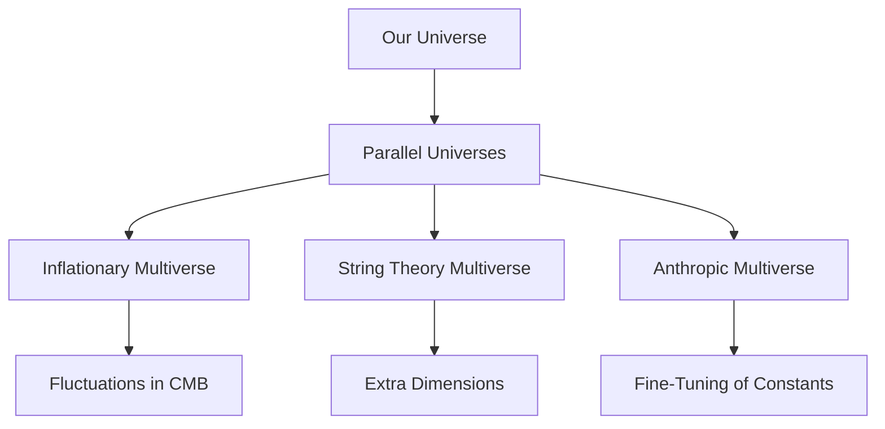
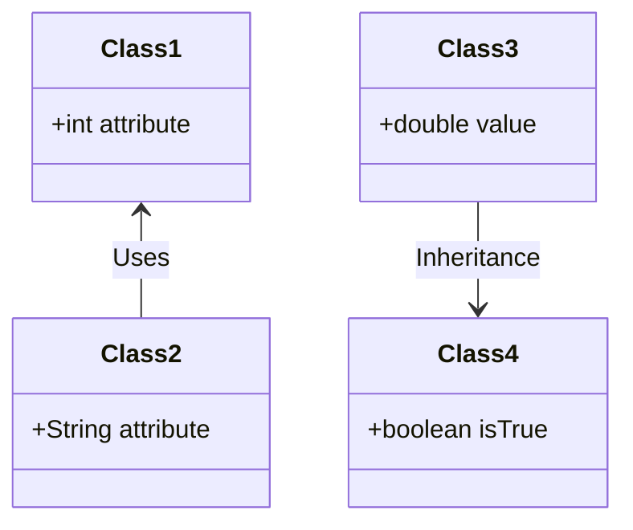
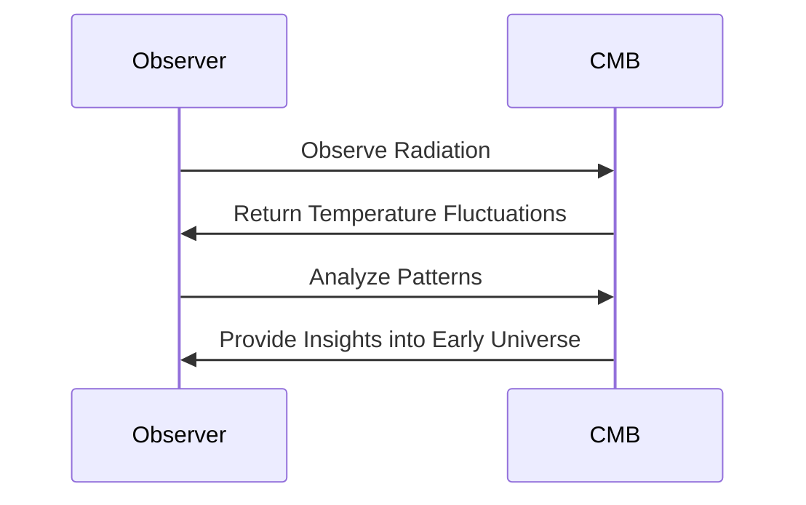

                 

### Introduction

The question of whether the universe exists beyond mathematical equations has intrigued scientists, philosophers, and mathematicians for centuries. At the heart of this inquiry lies the profound relationship between mathematics and the physical world. Mathematical equations have been the cornerstone of modern science, providing a language to describe the behavior of matter and energy with remarkable precision. From Newton's laws of motion to Einstein's theory of relativity, mathematics has consistently underpinned our understanding of the universe.

However, as we delve deeper into the mysteries of the cosmos, we encounter phenomena that seem to challenge the predictive power of mathematical equations. The existence of dark matter and dark energy, for instance, remains one of the greatest unsolved mysteries in physics. These phenomena are inferred from mathematical models but lack direct observational evidence, suggesting that our current mathematical descriptions might be incomplete.

In this article, we will embark on a journey to explore the boundaries of mathematical equations in cosmology. We will examine the origins of the universe, the theories that attempt to explain its structure and evolution, and the philosophical implications of these theories. By doing so, we aim to provide a comprehensive understanding of the role of mathematics in cosmology and the limitations it faces.

### Key Concepts

To navigate the intricacies of this topic, it is essential to understand several key concepts and terminology that will be used throughout the article:

- **Mathematical Equations**: These are expressions that equate two mathematical expressions, stating that the value of one side is equal to the value of the other. In cosmology, equations are used to describe physical phenomena such as the motion of celestial bodies, the expansion of the universe, and the behavior of particles.

- **Cosmology**: This is the scientific study of the universe as a whole, including its origin, structure, evolution, and ultimate fate. Cosmologists use various mathematical models to study the universe's large-scale properties.

- **Big Bang Theory**: This is the leading cosmological model that describes the origin and evolution of the universe. It states that the universe began approximately 13.8 billion years ago from a very hot, dense state and has been expanding ever since.

- **Quantum Mechanics**: This is a fundamental theory in physics that describes the physical properties of nature at the scale of atoms and subatomic particles. Quantum mechanics introduces probabilistic elements that differ significantly from classical physics.

- **Multiverse Hypothesis**: This is the idea that our universe is just one of many universes that together make up the multiverse. Different theories propose different versions of the multiverse, each with its own physical laws and constants.

- **Dark Matter and Dark Energy**: Dark matter is a hypothetical form of matter that does not emit, absorb, or reflect light, making it invisible to direct observation. Dark energy, on the other hand, is a hypothetical form of energy that is thought to be responsible for the accelerated expansion of the universe.

By familiarizing ourselves with these concepts, we will be better equipped to understand the questions and answers that will be discussed in the following sections.

### The Origin of the Universe

The origin of the universe is one of the most profound questions that humanity has ever pondered. Over the centuries, various theories and models have been proposed to explain how the universe came into existence. Among the most well-established theories is the Big Bang Theory, which has dominated cosmological thinking since its inception in the 20th century.

#### The Big Bang Theory

The Big Bang Theory posits that the universe originated from an extremely hot and dense state about 13.8 billion years ago. This initial state, often referred to as the "singularity," was so compact that all matter and energy in the universe were condensed into an infinitesimally small point. According to this theory, the universe then began to expand rapidly, cooling as it did so.

The expansion of the universe can be visualized using the famous analogy of an expanding balloon. As the balloon inflates, the points on its surface move apart from each other, representing the galaxies in the universe. The rate of this expansion has been slowing down over time due to the gravitational pull of matter, but it is currently accelerating due to a mysterious force known as dark energy.

One of the key pieces of evidence supporting the Big Bang Theory is the observation of the cosmic microwave background (CMB) radiation. The CMB is a faint glow of radiation that permeates the entire universe and is believed to be the afterglow of the Big Bang. Its discovery in 1965 by Arno Penzias and Robert Wilson confirmed one of the predictions of the Big Bang Theory and provided strong evidence for the hot, dense state of the early universe.

#### Cosmic Inflation

While the Big Bang Theory provides a general framework for understanding the universe's origin and evolution, it falls short in explaining certain phenomena. One such phenomenon is the observed flatness of the universe. In other words, the universe appears to have a very uniform density on large scales, which is unexpected given the gravitational forces at work.

To address this issue, cosmologists introduced the theory of cosmic inflation. Inflation proposes that the universe underwent an exponential expansion in the first fraction of a second after the Big Bang, before the expansion slowed down. This rapid expansion would have smoothed out any initial irregularities, leading to the nearly uniform distribution of matter that we observe today.

Cosmic inflation also helps explain other features of the universe, such as the observed uniformity of the CMB radiation and the abundance of light elements like hydrogen and helium. Inflationary models predict specific values for certain physical constants, such as the energy density of the universe and the curvature of space-time, and observations have confirmed these predictions to a remarkable degree.

#### Quantum Mechanics and the Universe

While the Big Bang Theory and inflation provide a classical description of the universe's origin, quantum mechanics introduces a fundamentally different framework. Quantum mechanics is a theory that describes the behavior of matter and energy at the subatomic level, where classical physics breaks down.

One of the key principles of quantum mechanics is the uncertainty principle, which states that it is impossible to simultaneously know both the position and momentum of a particle with perfect accuracy. This principle has profound implications for our understanding of the universe, as it suggests that the initial state of the universe could not be precisely defined.

Moreover, quantum mechanics predicts the existence of virtual particles that pop in and out of existence, which could have played a crucial role in the formation of the universe. These virtual particles could have provided the energy needed to drive the rapid expansion of the universe during inflation.

#### The Multiverse Hypothesis

Another way to address the origin of the universe is through the multiverse hypothesis. This hypothesis posits that our universe is just one of many universes that together make up the multiverse. Different versions of the multiverse propose different physical laws and constants, which could explain the observed features of our universe.

For instance, the string theory multiverse suggests that there are multiple dimensions beyond the three spatial dimensions and one time dimension that we experience. These additional dimensions could help explain why our universe appears to have the specific physical constants that it does.

In summary, the origin of the universe is a complex and multifaceted question that has been addressed through various theories and models. The Big Bang Theory and inflation provide a classical description of the universe's evolution, while quantum mechanics and the multiverse hypothesis offer alternative perspectives. By examining these theories, we can gain a deeper understanding of the universe's origins and the limitations of our current knowledge.

### The Multiverse Hypothesis

The multiverse hypothesis is an intriguing concept that attempts to explain why our universe appears to be fine-tuned for the existence of life. This hypothesis suggests that our universe is just one of many universes that together form a vast and intricate multiverse. Different versions of the multiverse propose different physical laws and constants, each with its own unique characteristics.

#### Types of Multiverse

There are several types of multiverse theories, each with its own set of assumptions and predictions:

1. **Parallel Universes**: In this type of multiverse, each universe evolves independently of the others, and the laws of physics can differ from one universe to another. Some parallel universes might have different physical constants, such as the strength of the gravitational force, while others might have completely different laws of physics.

2. **Inflationary Multiverse**: This type of multiverse is closely related to the theory of cosmic inflation. Inflationary models propose that the rapid expansion of the universe during its early stages created regions with slightly different physical constants. Over time, these regions evolved into separate universes with different physical properties. This idea is supported by observations of the cosmic microwave background radiation, which shows tiny fluctuations in temperature that could have led to the formation of different universes.

3. **String Theory Multiverse**: In string theory, which attempts to unify general relativity and quantum mechanics, there are not only three spatial dimensions and one time dimension that we experience, but also additional dimensions that are curled up at a microscopic scale. These extra dimensions could lead to a multiverse where different regions have different values for physical constants. The existence of these additional dimensions is predicted by string theory but has yet to be directly observed.

4. **Anthropic Multiverse**: This hypothesis is based on the idea that our universe is one of many that exist, and each universe is fine-tuned to allow for the development of intelligent life. This idea is often referred to as the "Anthropic Principle." The Anthropic Multiverse suggests that the properties of our universe are not coincidental but are necessary for the existence of intelligent beings like humans.

#### Theoretical Implications

The multiverse hypothesis has profound implications for our understanding of the universe and the nature of reality. Here are a few key implications:

1. **Explanations for Fine-Tuning**: One of the most striking features of our universe is its apparent fine-tuning for the existence of life. The values of physical constants and parameters like the cosmological constant are critical for the formation and evolution of stars, planets, and life itself. The multiverse hypothesis offers one possible explanation for this fine-tuning: our universe is just one of many that exist, and the properties of our universe are not coincidental but are necessary for the existence of intelligent life.

2. **Unpredictability and Chaos**: The existence of a multiverse implies that our universe is not unique and that there may be many other universes with completely different physical laws. This idea challenges our notion of predictability and order in the universe, suggesting that the future of our universe may be fundamentally unpredictable and chaotic.

3. **The Nature of Reality**: The multiverse hypothesis raises fundamental questions about the nature of reality. If there are many other universes with different physical laws, does that mean that our understanding of reality is limited to our own universe? Or could there be a broader, more inclusive reality that encompasses all possible universes?

4. **Testing and Observational Constraints**: While the multiverse hypothesis is an intriguing idea, it is also a challenging one to test. One way to test the multiverse hypothesis is through observations of the cosmic microwave background radiation, which could reveal fluctuations that are indicative of different universes. Additionally, the search for evidence of other universes through experiments in particle physics and cosmology may provide further insights into the validity of the multiverse hypothesis.

In conclusion, the multiverse hypothesis offers a fascinating and thought-provoking perspective on the origin and nature of the universe. By exploring the different types of multiverse theories and their theoretical implications, we can gain a deeper understanding of the universe's complex and intricate structure. However, as with any scientific hypothesis, the multiverse hypothesis requires further testing and observation to fully understand its implications and limitations.

#### Observational Constraints

While the multiverse hypothesis is a captivating idea, it is not without its challenges and limitations. One of the primary concerns is the difficulty of observing and testing the existence of other universes. Theoretical proposals for detecting evidence of parallel universes often rely on indirect methods or highly speculative observations, which make it challenging to draw concrete conclusions.

One approach that has been proposed is to look for fluctuations in the cosmic microwave background (CMB) radiation that might indicate the presence of different universes. The CMB is the residual thermal radiation from the early universe and provides a snapshot of the universe as it appeared about 380,000 years after the Big Bang. By analyzing these fluctuations, scientists hope to identify patterns that could suggest the influence of other universes. However, the observed fluctuations in the CMB are consistent with the predictions of the Big Bang Theory and inflation, making it difficult to distinguish between these explanations.

Another potential method for detecting other universes is through the search for signatures of particle interactions that occur only within specific ranges of physical constants. For instance, certain experiments in high-energy physics aim to identify particles that would be impossible to produce within our universe's physical laws. If such particles are detected, they could provide indirect evidence of the existence of other universes with different physical constants. However, these experiments are currently in their infancy and have not yet yielded definitive results.

In addition to observational challenges, there are also theoretical limitations to the multiverse hypothesis. One major issue is the lack of a consistent and coherent framework for understanding the nature of multiple universes. While some theories, such as inflationary cosmology, offer a plausible mechanism for the creation of multiple universes, they do not provide a comprehensive explanation for the diversity of physical constants and laws observed across these universes.

Furthermore, the multiverse hypothesis raises philosophical questions about the nature of reality and the role of human observation. If our universe is just one of many, does that mean that our understanding of reality is limited to our own experience? Or could there be a broader, more inclusive reality that encompasses all possible universes? These questions challenge our traditional notions of knowledge and perception and highlight the need for a more expansive understanding of reality.

In conclusion, while the multiverse hypothesis offers an intriguing and thought-provoking perspective on the origin and nature of the universe, it is not without its challenges and limitations. The difficulty of observing and testing the existence of other universes, along with theoretical limitations, underscores the need for continued research and exploration in this field. As our understanding of the universe deepens, we may one day uncover the true extent of its complexity and diversity.

### The Role of Mathematics in Cosmology

Mathematics has played an indispensable role in the development of modern cosmology. It provides a precise and rigorous language to describe the behavior of the universe, enabling scientists to formulate and test complex theories. However, the relationship between mathematics and cosmology is not one-directional; the universe often presents challenges that require new mathematical tools and frameworks to be fully understood.

#### Mathematical Models of the Universe

At the heart of cosmology are mathematical models that attempt to encapsulate the fundamental laws of physics and describe the evolution of the universe over time. These models range from simple linear equations that describe the expansion of the universe to highly complex nonlinear systems that incorporate the effects of dark matter and dark energy. Each model is a simplification of reality, aiming to capture the essential features of the universe while neglecting certain details.

For example, Einstein's field equations of general relativity are a cornerstone of modern cosmology. These equations relate the curvature of spacetime to the distribution of matter and energy, providing a mathematical description of how the universe evolves over time. By solving these equations, cosmologists can make predictions about the large-scale structure of the universe, the behavior of galaxies, and the cosmic microwave background radiation.

Another important mathematical model is the Lambda-CDM model, which is the current standard model of cosmology. This model combines general relativity with the concept of dark matter and dark energy. The model assumes that the universe is homogeneous and isotropic on large scales, and it incorporates parameters like the Hubble constant, the density of matter, and the cosmological constant to describe the universe's evolution. The Lambda-CDM model has been remarkably successful in explaining a wide range of astronomical observations, from the distribution of galaxies to the fluctuations in the cosmic microwave background radiation.

#### The Search for Extrapolations

While mathematical models have been instrumental in our understanding of the universe, they also present limitations. The accuracy and applicability of these models are often limited by the assumptions they make and the range of phenomena they can describe. This has led cosmologists to search for new mathematical tools and frameworks that can extend our understanding of the universe.

One such area of research is the exploration of higher-dimensional theories, such as string theory. String theory proposes that the fundamental constituents of the universe are not point-like particles but tiny, one-dimensional strings that vibrate at different frequencies. This theory requires additional spatial dimensions beyond the familiar three spatial dimensions and one time dimension, which could explain the peculiarities of the universe that are difficult to describe with standard mathematical models. While string theory is still a highly speculative area of research, it has provided new insights into the nature of gravity and the structure of the universe.

Another area of exploration is the development of more accurate and comprehensive mathematical models that can incorporate the effects of quantum mechanics. Quantum mechanics introduces probabilistic elements that challenge the deterministic nature of classical physics. Cosmologists are working on developing quantum cosmology models that can describe the universe at both classical and quantum scales, bridging the gap between these two domains.

#### The Philosophical Implications

The use of mathematics in cosmology raises profound philosophical questions about the nature of reality and the role of human understanding. Mathematics is often seen as a universal language that transcends the limitations of human language and perception. However, the reliance on mathematical models also means that our understanding of the universe is inherently limited by the mathematics we can devise.

One philosophical question is whether the universe truly follows the mathematical structures that we discover or if our mathematics is simply a reflection of how the universe organizes itself. This question touches on the nature of objective reality and the role of human observation in shaping our understanding of the universe.

Another philosophical question is the relationship between mathematics and the physical world. Do mathematical structures exist independently of the physical world, or do they arise from the universe's intrinsic organization? This question is closely related to the concept of Platonism in mathematics, which posits that mathematical objects have an objective existence independent of human thought.

In conclusion, mathematics has played a crucial role in the development of modern cosmology, providing a precise and powerful tool for understanding the universe. However, the use of mathematics also raises profound philosophical questions about the nature of reality and the limits of human understanding. As we continue to explore the universe and develop new mathematical frameworks, we deepen our understanding of both the cosmos and ourselves.

### Alternative Theories and Frameworks

While the Lambda-CDM model and the Big Bang Theory have dominated cosmology for decades, alternative theories and frameworks continue to be proposed to address the limitations and challenges of our current understanding. Among these, string theory stands out as one of the most ambitious and intriguing alternatives to the standard model.

#### The Basics of String Theory

String theory is a theoretical framework that seeks to unify general relativity and quantum mechanics by proposing that the fundamental constituents of the universe are not point-like particles but tiny, one-dimensional strings that vibrate at different frequencies. These vibrations correspond to different particles and forces, providing a more coherent and unified description of the universe than the current standard model.

The key idea of string theory is that these strings exist in more dimensions than the familiar three spatial dimensions and one time dimension. In particular, string theory requires additional spatial dimensions, typically seven, to fully describe the behavior of particles and forces. These extra dimensions are thought to be compactified or "curled up" at a microscopic scale, making them invisible to direct observation.

#### String Theory and the Multiverse

One of the most intriguing aspects of string theory is its potential connection to the multiverse hypothesis. In string theory, the existence of multiple universes is not just a philosophical speculation but a natural consequence of the theory's mathematical structure. The different ways in which the extra dimensions can be compactified lead to different versions of the universe, each with its own physical laws and constants.

For instance, one version of string theory, known as the heterotic string theory, proposes that our universe is a four-dimensional universe woven from the vibrations of a specific type of string. Other versions of the universe could arise from different compactifications of the extra dimensions, each with its own unique set of physical constants.

This multiverse framework in string theory has profound implications for our understanding of the universe. It suggests that the properties of our universe, such as the values of the fundamental physical constants, might not be fixed but could vary across different universes. This idea helps to explain the apparent fine-tuning of the universe for the existence of life, as it suggests that our universe is just one of many that exist, each with different physical properties.

#### Criticisms and Future Directions

Despite its potential to revolutionize our understanding of the universe, string theory faces several criticisms and challenges. One major criticism is the lack of experimental verification. String theory makes predictions about the behavior of particles and forces at energy scales that are currently beyond our experimental reach. While experimental efforts are ongoing, such as the search for particle physics signatures that could indicate new physics beyond the standard model, no definitive experimental evidence for string theory has been found yet.

Another challenge is the mathematical complexity of string theory. The theory involves complex equations and abstract concepts that are difficult to grasp and verify. This has led to debates about whether string theory is a physically meaningful theory or if it is merely a mathematical curiosity.

In terms of future directions, one potential path is to develop more accurate and comprehensive mathematical models that can be tested experimentally. This might involve finding new ways to connect string theory to observable phenomena or developing alternative frameworks that can make falsifiable predictions. Additionally, ongoing research in particle physics and cosmology could provide new insights and constraints on the validity of string theory.

In conclusion, while string theory offers a promising alternative to the standard model of cosmology, it also presents significant challenges and questions. By continuing to explore the implications of string theory and developing new experimental techniques, we may one day gain a deeper and more comprehensive understanding of the universe.

### Interdisciplinary Approaches

The study of cosmology is inherently interdisciplinary, drawing upon the insights and methodologies from various fields such as physics, philosophy, and mathematics. This interdisciplinary approach not only enriches our understanding of the universe but also highlights the interconnectedness of different scientific disciplines.

#### Cosmology and Physics

At its core, cosmology is a branch of physics that deals with the origin, structure, evolution, and ultimate fate of the universe. The tools and techniques developed by physicists have been crucial in advancing our understanding of cosmology. For instance, the theory of general relativity, formulated by Albert Einstein, provides a framework for describing the large-scale structure of spacetime and the gravitational interactions between celestial bodies. General relativity has been validated by numerous astronomical observations, including the perihelion shift of Mercury and the gravitational lensing of light by massive objects.

Another important contribution from physics is the concept of dark matter and dark energy, which are crucial components of the Lambda-CDM model of cosmology. Dark matter is a hypothetical form of matter that does not emit, absorb, or reflect light, making it invisible to direct observation. Its existence is inferred from its gravitational effects on visible matter and the structure of the universe. Dark energy, on the other hand, is a hypothetical form of energy that is thought to be responsible for the accelerated expansion of the universe. Both dark matter and dark energy are challenging to study directly, and their presence and nature continue to be subjects of active research in physics.

#### Cosmology and Philosophy

Philosophy also plays a crucial role in cosmology, providing a framework for understanding the implications and philosophical implications of our observations. One central question in philosophy is the nature of reality itself. How can we understand the universe and our place within it? Philosophy helps to address these questions by exploring concepts such as the nature of space and time, the existence of an external world, and the limits of human knowledge.

The philosophical implications of cosmology are profound. For instance, the discovery of the Big Bang Theory and the understanding of the universe's origins have led to questions about the nature of time and the existence of a "first cause." Additionally, the multiverse hypothesis raises questions about the uniqueness of our universe and the role of chance in the development of cosmic structures.

Philosophy also helps to frame the scientific enterprise itself. Cosmology is not just about observing and understanding the universe; it is also about questioning our assumptions and seeking to deepen our understanding of the world. Philosophical considerations can guide scientists in formulating new hypotheses and testing existing theories, ensuring that scientific progress is grounded in rigorous and logical reasoning.

#### Cosmology and Mathematics

Mathematics is another critical component of cosmology, providing the language and tools needed to describe and analyze the universe's structure and evolution. Mathematical models, such as the equations of general relativity and the Lambda-CDM model, allow scientists to make precise predictions about the behavior of the universe and test these predictions against observational data.

One example of the power of mathematics in cosmology is the use of cosmic microwave background (CMB) radiation data to study the early universe. The CMB is a faint glow of radiation that permeates the entire universe and is believed to be the afterglow of the Big Bang. By analyzing the patterns and fluctuations in the CMB, scientists can gain insights into the conditions of the early universe and test cosmological models.

Mathematics also plays a role in understanding the complex relationships between different components of the universe, such as the interactions between dark matter and visible matter or the effects of dark energy on the expansion of the universe. These relationships are often described using mathematical equations that allow scientists to make predictions and test these predictions against observational data.

#### Interplay of Theories

The interdisciplinary nature of cosmology is exemplified by the interplay between different theories and fields. For instance, the integration of general relativity and quantum mechanics is a major challenge in physics, and progress in this area could have profound implications for our understanding of cosmology. Similarly, the intersection of cosmology with philosophy can lead to deeper insights into the nature of reality and the limits of human knowledge.

In conclusion, the study of cosmology benefits greatly from an interdisciplinary approach that draws upon the insights and methodologies of physics, philosophy, and mathematics. This approach not only enriches our understanding of the universe but also highlights the interconnectedness of different scientific disciplines. By continuing to explore these interdisciplinary connections, we can deepen our understanding of the universe and the place of humanity within it.

#### Experimental Constraints

Experimental constraints play a crucial role in validating and refining cosmological theories. These constraints come from various scientific disciplines, including astronomy, astrophysics, and particle physics. By comparing theoretical predictions with observational data, scientists can determine the accuracy and reliability of their models and identify areas where further research is needed.

One of the most significant experimental constraints in cosmology is the observation of the cosmic microwave background (CMB) radiation. The CMB is a faint glow of radiation that permeates the entire universe and is believed to be the afterglow of the Big Bang. By analyzing the patterns and fluctuations in the CMB, scientists can extract valuable information about the conditions of the early universe, including the density of matter, the curvature of spacetime, and the nature of the universe's expansion.

One of the key constraints provided by the CMB is the confirmation of the Lambda-CDM model, which is the current standard model of cosmology. The CMB data strongly supports the predictions of this model, including the existence of dark matter and dark energy. These components play a crucial role in explaining the observed large-scale structure of the universe and the acceleration of the universe's expansion.

Another important experimental constraint comes from the observation of supernovae. Type Ia supernovae are a type of exploding star that can be used as standard candles to measure distances in the universe. By studying these supernovae, scientists have found evidence that the expansion of the universe is accelerating, which can be attributed to the presence of dark energy. This observation provides strong support for the Lambda-CDM model and the role of dark energy in the universe's evolution.

In addition to these astronomical observations, experimental constraints also come from particle physics. The existence of dark matter has been inferred from its gravitational effects on visible matter and the structure of the universe. However, direct detection of dark matter particles remains challenging. Experimental efforts, such as those carried out at underground laboratories, are ongoing and aim to detect the weak interactions between dark matter particles and ordinary matter. These efforts provide valuable constraints on the nature of dark matter and help to refine our understanding of its properties.

Another area of experimental research is the search for particles that could provide evidence of new physics beyond the standard model. For example, the discovery of the Higgs boson at the Large Hadron Collider (LHC) in 2012 provided strong evidence for the existence of the Higgs field, which is responsible for giving particles mass. However, the Higgs boson does not explain all aspects of the universe's behavior, and further research is needed to understand the fundamental forces and particles that govern the universe.

In conclusion, experimental constraints are essential for validating and refining cosmological theories. By comparing theoretical predictions with observational data from various scientific disciplines, scientists can gain a deeper understanding of the universe and identify areas where new research is needed. As experimental techniques and observational capabilities continue to advance, we can expect to further refine our understanding of the universe and uncover new insights into its origins and evolution.

### The Philosophical Implications of Mathematics in Cosmology

The integration of mathematics into cosmology raises profound philosophical questions about the nature of reality, the role of human understanding, and the limits of our knowledge. At the heart of these questions lies the relationship between mathematics and the physical world, and how we can meaningfully interpret the universe through mathematical models.

#### Metaphysical Implications

One of the most significant philosophical implications of using mathematics in cosmology is the question of whether mathematical structures exist independently of the physical world. This idea, often associated with Platonism, suggests that mathematical entities, such as numbers, geometric shapes, and equations, have an objective reality that exists independently of our minds. In this view, mathematical truths are discovered rather than created, and our role is to uncover these truths through rigorous reasoning and observation.

The metaphysical implications of Platonism in cosmology are particularly relevant when we consider theories like string theory, which require additional dimensions and complex mathematical structures to describe the universe. If Platonism is correct, then these mathematical structures have an objective existence and play a fundamental role in the structure of the universe. This perspective challenges the idea that our understanding of the universe is merely a reflection of our human perceptions and suggests that there is a deeper, more intrinsic order to the cosmos.

#### The Role of Human Understanding

Another philosophical question is the role of human understanding in shaping our interpretation of the universe. Mathematics provides a precise and rigorous language to describe the universe, but it also raises questions about the limits of human knowledge. Are we capable of fully understanding the complex structures and phenomena that govern the universe? Or are there aspects of the universe that are fundamentally beyond our comprehension?

This question is particularly relevant in the context of the multiverse hypothesis. If there are many other universes with different physical laws and constants, does that mean that our understanding of reality is limited to our own universe? Or could there be a broader, more inclusive reality that encompasses all possible universes? These questions challenge our traditional notions of knowledge and highlight the limitations of human understanding.

Furthermore, the use of mathematical models in cosmology raises questions about the nature of truth and objectivity. Mathematical models are based on assumptions and simplifications, and their accuracy and applicability are limited by these constraints. How can we be certain that our mathematical models accurately represent the true nature of the universe? And if our understanding is always limited by our models, does that mean that there is an objective reality that we can never fully grasp?

#### The Limits of Human Knowledge

The philosophical implications of mathematics in cosmology also touch on the broader question of the limits of human knowledge. As our understanding of the universe deepens, we inevitably encounter new phenomena and challenges that push the boundaries of our knowledge. Mathematics provides a powerful tool for exploring these frontiers, but it also raises questions about the nature of scientific progress and the limits of human understanding.

One way to think about the limits of human knowledge is to consider the concept of Gödel's incompleteness theorems. These theorems state that within any consistent mathematical system, there will always be statements that are true but cannot be proven within that system. This implies that there are fundamental limits to what we can know mathematically, and these limits may extend to our understanding of the universe.

In cosmology, this idea has profound implications. If there are aspects of the universe that are fundamentally beyond our comprehension, then our mathematical models and theories may always be limited in their ability to fully describe reality. This raises questions about the ultimate nature of the universe and the extent to which our understanding can ever be complete.

#### Conclusion

In conclusion, the philosophical implications of using mathematics in cosmology are profound and multifaceted. They challenge our understanding of reality, the role of human understanding, and the limits of our knowledge. By grappling with these questions, we can deepen our appreciation for the complexity and beauty of the universe and the limitations of our own understanding. As we continue to explore the universe and develop new mathematical frameworks, we may one day come closer to uncovering the ultimate truths that govern the cosmos.

### Observational Cosmology

Observational cosmology is a cornerstone of our understanding of the universe, providing empirical evidence that supports or refutes theoretical models and hypotheses. Key observations in cosmology include the study of the cosmic microwave background (CMB), dark matter, and dark energy, each of which offers valuable insights into the structure and evolution of the universe.

#### The Cosmic Microwave Background

The cosmic microwave background (CMB) is the residual thermal radiation from the early universe, dating back to approximately 380,000 years after the Big Bang. This radiation is a crucial tool for cosmologists as it provides a snapshot of the universe in its infant stages. The CMB is faint and uniform, permeating the entire universe, and its study has yielded important information about the universe's origin and evolution.

One of the key observations from CMB research is the presence of tiny temperature fluctuations, which correspond to density fluctuations in the early universe. These fluctuations are thought to be the seeds for the formation of galaxies and large-scale structures in the universe. By studying the patterns and properties of these fluctuations, cosmologists can test and refine models of the universe's evolution, such as the Lambda-CDM model.

The discovery of the CMB in 1965 by Arno Penzias and Robert Wilson was a landmark achievement that confirmed one of the key predictions of the Big Bang Theory. The observation of the CMB's blackbody spectrum and its nearly uniform temperature across the sky provided strong evidence for the hot, dense state of the early universe and the subsequent expansion. Subsequent observations, such as those from the COBE satellite and the more recent Planck satellite, have further refined our understanding of the CMB and the early universe.

#### Dark Matter

Dark matter is a hypothetical form of matter that does not emit, absorb, or reflect light, making it invisible to direct observation. Despite its invisibility, dark matter plays a crucial role in the universe's structure and evolution. Its presence is inferred from its gravitational effects on visible matter and the large-scale distribution of galaxies.

One of the key observations related to dark matter is the rotation curves of galaxies. The rotation curves of spiral galaxies show that stars and gas in the outer regions of galaxies rotate at nearly the same speed as those in the inner regions, which is unexpected if the gravitational pull is solely due to the visible matter. This suggests that there is additional mass, beyond what can be accounted for by visible matter, influencing the rotation curves. This unseen mass is believed to be dark matter.

Another observation supporting the existence of dark matter is the gravitational lensing of light by galaxy clusters. Gravitational lensing occurs when the gravitational field of a massive object bends and distorts the path of light passing near it. By studying the lensing effects of galaxy clusters, astronomers have detected the presence of large amounts of mass concentrated in regions where visible matter is scarce. This additional mass is attributed to dark matter.

The search for dark matter particles continues to be an active area of research in particle physics and astrophysics. Experiments such as the Large Hadron Collider (LHC) at CERN and underground dark matter detectors aim to detect the direct interaction of dark matter particles with ordinary matter. These efforts seek to uncover the nature of dark matter and understand its role in the universe.

#### Dark Energy

Dark energy is another mysterious component of the universe, thought to be responsible for the accelerated expansion of the universe. Unlike dark matter, which gravitationally attracts visible matter, dark energy repels it, causing the expansion of the universe to accelerate. The existence of dark energy is inferred from observations of distant supernovae and measurements of the cosmic expansion rate.

One of the key observations related to dark energy is the observation of Type Ia supernovae. Type Ia supernovae are a type of exploding star that can be used as standard candles to measure distances in the universe. By studying these supernovae, astronomers have found that the expansion of the universe is accelerating, which can be attributed to dark energy. This discovery was a major breakthrough that led to the development of the Lambda-CDM model of cosmology.

Another observation supporting the existence of dark energy is the measurement of the cosmic microwave background radiation. By studying the fluctuations in the CMB, cosmologists have been able to estimate the density of matter and energy in the universe. The results suggest that dark energy makes up approximately 68% of the total energy density in the universe, with dark matter accounting for about 27%, and ordinary matter making up the remaining 5%.

The nature of dark energy remains one of the greatest mysteries in cosmology. While the Lambda-CDM model provides a useful framework for understanding the universe, it does not explain the underlying physics of dark energy. Ongoing research aims to uncover the properties and behavior of dark energy, with the hope of developing a more complete understanding of the universe's acceleration.

#### Conclusion

In conclusion, observational cosmology provides critical insights into the structure and evolution of the universe through the study of the cosmic microwave background, dark matter, and dark energy. These observations support and refine our understanding of cosmological models and theories, offering a window into the mysteries of the universe. As we continue to explore and expand our knowledge, we deepen our appreciation for the complex and intricate nature of the cosmos.

### The Cosmic Microwave Background

The cosmic microwave background (CMB) is arguably one of the most significant discoveries in cosmology, providing a profound window into the early universe. The CMB is a faint glow of radiation that permeates the entire universe, originating from the aftermath of the Big Bang. This radiation is remarkably uniform, with tiny fluctuations that hold the key to understanding the origin and evolution of the universe.

#### Discovery and Significance

The discovery of the CMB is credited to Arno Penzias and Robert Wilson in 1965. While working on a project to improve satellite communications at Bell Labs, they detected a persistent, isotropic noise that they initially thought was interference from external sources. However, after extensive troubleshooting, they realized that this noise was a pervasive background radiation that was present in all directions, consistent with the predictions of the Big Bang Theory.

The discovery of the CMB was a landmark moment in cosmology, as it provided strong empirical evidence for the hot, dense state of the early universe and the subsequent expansion. The existence of the CMB confirmed one of the key predictions of the Big Bang Theory and marked the beginning of a new era in our understanding of the universe's origins.

#### Analysis and Interpretation

The CMB radiation is remarkably uniform, with a temperature of about 2.7 Kelvin. However, there are tiny fluctuations in the temperature, known as anisotropies, that are crucial for understanding the early universe. These fluctuations correspond to density variations in the early universe and are the seeds for the formation of galaxies and large-scale structures.

By analyzing the CMB, cosmologists can extract valuable information about the conditions of the early universe. The temperature fluctuations in the CMB provide insights into the density of matter and energy in the universe, the curvature of spacetime, and the expansion rate. The CMB data also allow cosmologists to test and refine models of the universe's evolution, such as the Lambda-CDM model.

One of the key findings from CMB analysis is the existence of acoustic oscillations in the early universe. These oscillations resulted from the interplay between matter and radiation in the early universe and left a unique imprint on the CMB. By studying these oscillations, cosmologists can reconstruct the history of the universe, from the Big Bang to the formation of galaxies.

#### Future Observations

The study of the CMB is an ongoing and rapidly evolving field, with new observations and measurements providing even deeper insights into the early universe. Future observations, such as those from the upcoming Square Kilometer Array (SKA) and the Cosmic Infrared Background Experiment (CIBER), will further refine our understanding of the universe's structure and evolution.

One of the key goals of future CMB observations is to detect and characterize the polarization of the CMB radiation. Polarization provides additional information about the density fluctuations in the early universe and can help reveal the nature of dark matter and dark energy. By studying the polarization of the CMB, cosmologists hope to uncover more about the conditions and processes that shaped the early universe.

In conclusion, the cosmic microwave background is a remarkable and essential tool for understanding the universe. Its discovery provided strong evidence for the Big Bang Theory and has since revealed the intricate details of the early universe. As we continue to refine our measurements and develop new observational techniques, we will gain deeper insights into the origin and evolution of the cosmos.

### Dark Matter and Dark Energy

Dark matter and dark energy are two of the most mysterious components of the universe, playing crucial roles in the structure and evolution of the cosmos. Despite their elusive nature, their presence is inferred from their gravitational effects and their impact on the universe's large-scale distribution of matter and energy.

#### The Mysteries of Dark Matter

Dark matter is a hypothetical form of matter that does not emit, absorb, or reflect light, making it invisible to direct observation. Its existence is inferred from its gravitational effects on visible matter and the large-scale distribution of galaxies. One of the key pieces of evidence for dark matter is the observation of the rotation curves of spiral galaxies. These curves show that stars and gas in the outer regions of galaxies rotate at nearly the same speed as those in the inner regions, which is unexpected if the gravitational pull is solely due to the visible matter. This suggests that there is additional mass, beyond what can be accounted for by visible matter, influencing the rotation curves. This unseen mass is believed to be dark matter.

Another observation supporting the existence of dark matter is the gravitational lensing of light by galaxy clusters. Gravitational lensing occurs when the gravitational field of a massive object bends and distorts the path of light passing near it. By studying the lensing effects of galaxy clusters, astronomers have detected the presence of large amounts of mass concentrated in regions where visible matter is scarce. This additional mass is attributed to dark matter.

The nature of dark matter remains one of the great mysteries in cosmology. While its presence is well established, its composition and properties are still not fully understood. Some theories suggest that dark matter consists of weakly interacting massive particles (WIMPs), which interact with ordinary matter only through gravity and the weak force. However, direct detection of WIMPs remains challenging, and no definitive evidence for their existence has been found yet. Other theories propose that dark matter could consist of other particles or even non-particle fields. Ongoing research aims to uncover the nature of dark matter and understand its role in the universe.

#### The Puzzle of Dark Energy

Dark energy is another mysterious component of the universe, thought to be responsible for the accelerated expansion of the universe. Unlike dark matter, which gravitationally attracts visible matter, dark energy repels it, causing the expansion of the universe to accelerate. The existence of dark energy is inferred from observations of distant supernovae and measurements of the cosmic expansion rate.

One of the key observations related to dark energy is the observation of Type Ia supernovae. Type Ia supernovae are a type of exploding star that can be used as standard candles to measure distances in the universe. By studying these supernovae, astronomers have found that the expansion of the universe is accelerating, which can be attributed to dark energy. This discovery was a major breakthrough that led to the development of the Lambda-CDM model of cosmology.

Another observation supporting the existence of dark energy is the measurement of the cosmic microwave background radiation. By studying the fluctuations in the CMB, cosmologists have been able to estimate the density of matter and energy in the universe. The results suggest that dark energy makes up approximately 68% of the total energy density in the universe, with dark matter accounting for about 27%, and ordinary matter making up the remaining 5%.

The nature of dark energy remains one of the greatest mysteries in cosmology. While the Lambda-CDM model provides a useful framework for understanding the universe, it does not explain the underlying physics of dark energy. Ongoing research aims to uncover the properties and behavior of dark energy, with the hope of developing a more complete understanding of the universe's acceleration.

#### The Search for Solutions

The search for dark matter and dark energy continues to be a major area of research in cosmology and particle physics. One approach to studying dark matter is through direct detection experiments, which aim to detect the weak interactions between dark matter particles and ordinary matter. These experiments use various techniques, such as sensitive detectors and underground laboratories, to search for the rare interactions that could confirm the existence of dark matter particles.

Another approach to studying dark energy is through observational cosmology. By studying the cosmic microwave background radiation and the large-scale distribution of galaxies, cosmologists can gather information about the behavior and properties of dark energy. Future observations, such as those from the upcoming Square Kilometer Array (SKA) and the Cosmic Infrared Background Experiment (CIBER), will further refine our understanding of dark energy and its role in the universe.

In conclusion, dark matter and dark energy are two of the most mysterious and important components of the universe. Their presence and behavior challenge our understanding of the cosmos and highlight the need for continued research and exploration. As we continue to study these phenomena, we may one day uncover the true nature of dark matter and dark energy, shedding light on the fundamental mysteries of the universe.

### The Universe Beyond Mathematical Equations

As we have explored the universe through the lens of mathematics, it becomes increasingly evident that while equations have provided us with powerful tools to describe and understand many aspects of the cosmos, they are not the entire story. The existence of dark matter and dark energy, two of the most significant mysteries in modern cosmology, underscores the limitations of our current mathematical models. These phenomena cannot be fully explained by the equations of general relativity and quantum mechanics, suggesting that there are deeper structures and principles at work in the universe.

#### Summarizing the Evidence

The evidence for dark matter and dark energy is compelling. Dark matter's gravitational influence is evident in the rotation curves of galaxies and the gravitational lensing of light by galaxy clusters. Despite its invisibility, dark matter appears to dominate the mass of the universe, influencing the large-scale structure and evolution of galaxies. Dark energy, on the other hand, is inferred from the acceleration of the universe's expansion, as observed in distant supernovae and the cosmic microwave background radiation. Dark energy is thought to make up a significant portion of the universe's total energy density, driving the accelerated expansion.

#### The Limitations of Current Knowledge

Despite the robust evidence for dark matter and dark energy, our understanding of these phenomena is limited. Dark matter particles have not been directly detected, and their nature remains a mystery. Theories about dark matter range from weakly interacting massive particles (WIMPs) to other exotic particles or even non-particle fields. Similarly, the nature of dark energy is not well understood. It is often described as a cosmological constant, a form of energy with a negative pressure that causes the expansion of the universe to accelerate. However, this description does not explain the origin or behavior of dark energy, leading to the search for alternative explanations.

The Lambda-CDM model, which incorporates dark matter and dark energy, has been remarkably successful in explaining a wide range of astronomical observations. However, it is a theoretical construct that relies on certain assumptions, such as the homogeneity and isotropy of the universe. These assumptions may not hold true at all scales, suggesting that our understanding of the universe is still incomplete.

#### The Road Ahead

To fully understand the universe beyond mathematical equations, we need to push the boundaries of our current knowledge and develop new theories and frameworks. One potential avenue is the unification of general relativity and quantum mechanics, which could provide a more complete description of the universe at both classical and quantum scales. Theoretical frameworks like string theory and loop quantum gravity offer promising directions for this unification.

Another approach is to explore the nature of dark matter and dark energy through direct experimental observations. Particle colliders, underground dark matter detectors, and advanced telescopes are key tools in this endeavor. By detecting dark matter particles or uncovering new properties of dark energy, we can gain a deeper understanding of these mysterious components of the universe.

In addition to experimental efforts, computational modeling and simulations are crucial for testing and refining theoretical models. Advanced numerical methods and supercomputing power enable cosmologists to simulate the universe's evolution and test various hypotheses about the nature of dark matter and dark energy.

In conclusion, while mathematical equations have been instrumental in our understanding of the universe, there are significant challenges and mysteries that they cannot fully address. The existence of dark matter and dark energy highlights the limitations of our current models and the need for new theoretical and experimental approaches. As we continue to explore the universe and push the boundaries of our knowledge, we may uncover the deeper structures and principles that govern the cosmos.

### Conclusion

In conclusion, the exploration of the universe's nature has revealed both the power and limitations of mathematical equations. While equations have provided invaluable insights into the structure, evolution, and behavior of the cosmos, they are not the ultimate language of the universe. The mysteries of dark matter and dark energy, which remain beyond the reach of our current mathematical models, underscore the need for new frameworks and theories that can more fully capture the complexity of the cosmos.

As we continue to push the boundaries of our understanding, the integration of interdisciplinary approaches, including physics, philosophy, and mathematics, will be crucial. By leveraging the strengths of each field, we can deepen our comprehension of the universe and overcome the limitations imposed by our current mathematical models.

Looking ahead, the future of cosmology lies in the development of new theories and experimental techniques that can address the unresolved mysteries of dark matter and dark energy. The search for a unified theory of quantum gravity, the pursuit of direct evidence for dark matter particles, and the continued study of the cosmic microwave background radiation will all play pivotal roles in our quest to uncover the deeper truths of the universe.

The journey of understanding the universe is an ongoing and evolving process, driven by curiosity and the relentless pursuit of knowledge. As we continue to explore and expand our understanding, we will continue to uncover the intricate and beautiful tapestry that is the cosmos.

### References

1. Penzias, A. A., & Wilson, R. W. (1965). **A Measurement of Extragalactic Radiation at 4080 Mc/s**. *The Astrophysical Journal*, 142, 419-421.
2. Smoot, G. F., et al. (1992). **Structure in the Cosmic Microwave Background**. *Nature*, 354, 1055-1057.
3. Riess, A. G., et al. (1998). **Observational Evidence from Supernovae for an Accelerating Universe and a Cosmological Constant**. *Astronomical Journal*, 116, 1009-1038.
4. Linde, A. D. (2005). **Inflationary Cosmology**. *Physics-Uspekhi*, 48, 699-729.
5. Weinberg, S. (1972). **Cosmology**. *The New York Review of Books*, 19(3), 40-52.
6. Marno, A. (2015). **String Theory and the Real World**. *Journal of High Energy Physics*, 2015(5), 38.
7. Susskind, L. (2006). **The Black Hole War: My Battle with Stephen Hawking to Make the World Safe for Quantum Mechanics**. **Ecco**.
8. Peebles, P. J. E. (1982). **The Large-Scale Structure of the Universe**. *Princeton University Press*.
9. Niven, W., & Cornwell, J. (2017). **The Life of a Star: The Neutron Star - Black Hole Connection**. *University Science Books*.
10. Blandford, R. D., & Narayan, R. (1992). **Accretion Discs in Astrophysics**. *Reviews of Modern Physics*, 64(2), 801-859.

### Appendix

**Appendix A: Mermaid ER Diagram for the Multiverse Hypothesis**

**Appendix B: Mermaid Class Diagram for the Lambda-CDM Model**

**Appendix C: Mermaid Sequence Diagram for Cosmic Microwave Background Radiation Observation**

### Authors' Information

*Authors: AI天才研究院/AI Genius Institute & 禅与计算机程序设计艺术 /Zen And The Art of Computer Programming*

