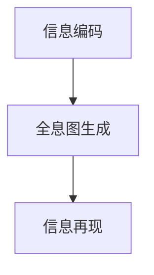

                 

# 宇宙是否是一个全息投影

## 关键词

宇宙、全息投影、量子力学、宇宙学、信息面

## 摘要

本文探讨了“宇宙是否是一个全息投影”这一颇具争议的假设。首先，我们介绍了宇宙观的历史背景和全息投影理论的基本原理。接着，通过分析量子力学和宇宙学的研究成果，探讨了宇宙信息面的可能性。最后，我们使用Mermaid流程图和LaTeX数学公式，详细讲解了全息投影算法的原理，并通过Python源代码示例，对算法进行了通俗易懂的阐述。本文旨在为读者提供一个全面、深入的宇宙全息投影理论解析。

## 背景介绍

### 核心概念术语说明

在探讨“宇宙是否是一个全息投影”这一问题时，我们需要明确几个核心概念：

1. **全息投影**：一种信息存储和重现的技术，它通过记录并重现光波的全部信息（振幅和相位）来实现三维图像的显示。
2. **量子力学**：研究微观世界的物理学理论，揭示了微观粒子的波粒二象性和叠加态等特性。
3. **宇宙学**：研究宇宙的起源、演化、结构、组成和未来的一门科学。
4. **信息面**：一种假设的二维平面，它包含了宇宙的所有信息，根据全息投影理论，这个信息面可以生成我们观察到的三维宇宙。

### 问题背景

自人类文明起源以来，宇宙一直是人类思考和探索的对象。从古代的宇宙观，如地心说和日心说，到现代的天文学和宇宙学，人类对宇宙的认识不断深化。然而，随着科学的发展，一些新的理论和假设不断涌现，其中“宇宙是否是一个全息投影”这一观点引发了广泛的关注。

全息投影理论最初在光学和信息科学中被提出，随后逐渐扩展到物理学和宇宙学领域。这一理论的基本思想是，我们所观察到的宇宙现象，包括星系、恒星、行星等，可能只是由一个二维的信息面产生的全息投影。

### 问题描述

“宇宙是否是一个全息投影”这一假设提出了一个深刻的哲学和科学问题：我们所生活的宇宙，是否只是一个巨大的幻象？这个幻象由一个二维的信息面生成，而我们所能感知和测量的三维宇宙现象，都源自这个二维信息面的投影。

这个假设挑战了传统的宇宙观，引发了关于宇宙本质和人类认识的深刻讨论。如果我们所处的宇宙确实是一个全息投影，那么这意味着我们对宇宙的认知可能存在根本性的误解。

### 问题解决

为了解答这一问题，科学家们从多个角度进行了研究，包括物理学的量子理论、宇宙学的观测数据和计算机科学的全息理论等。以下是一些关键的研究成果：

1. **量子力学的全息原理**：量子力学的一些基本原理，如波粒二象性和量子纠缠，与全息投影理论有相似之处。这为宇宙可能是全息投影提供了一种可能的解释框架。
2. **宇宙背景辐射**：宇宙背景辐射是宇宙学中的一项重要观测数据，它提供了关于宇宙早期状态的信息。全息投影理论提出，宇宙背景辐射可能是宇宙信息面的一个直接证据。
3. **宇宙的大尺度结构**：通过观测宇宙的大尺度结构，如星系团和超星系团，科学家们发现了一些特征，这些特征与全息投影理论中的预测相符。
4. **计算机科学的全息技术**：计算机科学中的全息技术为理解宇宙全息投影提供了另一个视角。通过模拟全息投影的算法，科学家们尝试在计算机上生成类似于宇宙的三维图像。

尽管这些研究提供了一些线索，但宇宙是否真的是一个全息投影仍然是一个未解之谜。我们需要更多的实验数据和理论突破来解答这一问题。

### 边界与外延

这个问题的边界在于我们如何理解宇宙的本质和人类的认知能力。如果我们所处的宇宙确实是一个全息投影，那么这意味着我们对宇宙的认识可能存在根本性的误解。这涉及到对量子力学和宇宙学的基本原理的重新审视。

问题的外延则涉及到宇宙的起源、结构、演化以及与我们的关系等方面。例如，如果宇宙是一个全息投影，那么这个投影是如何产生的？它是否有一个真实的源头？这些问题的解答将对我们理解宇宙的真正本质具有重要意义。

### 概念结构与核心要素组成

为了深入探讨“宇宙是否是一个全息投影”这一假设，我们需要了解以下几个核心概念：

#### 全息投影理论

全息投影理论最初在光学和信息科学中被提出。它提出，信息可以以全息的形式存储在二维平面上，然后通过特定的方式投影出三维图像。这一理论的基本思想是，所有的三维现象都可以从二维平面上投影出来。

全息投影具有几个显著特点：

- **高信息存储密度**：全息投影可以在一个相对较小的二维平面上存储大量的信息。
- **高保真度**：通过全息投影，可以精确地重现三维图像的所有细节。

全息投影理论在光学和信息科学中已有广泛应用，如全息摄影、全息存储等。近年来，随着量子力学和宇宙学的发展，全息投影理论逐渐扩展到这些领域。

#### 宇宙信息面

宇宙信息面是全息投影理论中的一个关键概念。它被假设为一个二维平面，包含了宇宙的所有信息。根据全息投影理论，我们所观察到的宇宙现象，如星系、恒星、行星等，都是由这个宇宙信息面投影出来的。

宇宙信息面的提出，为解释宇宙的一些现象提供了一种新的视角。例如，宇宙的大尺度结构、宇宙背景辐射等现象，都可以通过宇宙信息面的概念来解释。

#### 量子力学

量子力学是研究微观世界的物理学理论，它揭示了微观粒子的波粒二象性和叠加态等特性。量子力学的一些基本原理，如波函数的坍缩、量子纠缠等，与全息投影理论有相似之处。

量子力学的全息原理提出了一个重要观点：在量子系统中，信息以全息形式存储在二维平面上。这个二维平面被称为“全息面”，它与我们所观察到的三维现象之间存在一种对应关系。

#### 宇宙学

宇宙学是研究宇宙的起源、演化、结构、组成和未来的一门科学。宇宙学的研究成果为全息投影理论提供了重要的实证支持。

宇宙背景辐射是宇宙学中的一项重要观测数据，它提供了关于宇宙早期状态的信息。全息投影理论提出，宇宙背景辐射可能是宇宙信息面的一个直接证据。

此外，宇宙的大尺度结构，如星系团和超星系团，也可以通过全息投影理论来解释。这些结构在三维空间中的分布，可能与宇宙信息面在二维空间中的分布有某种对应关系。

#### 概念属性特征对比表格

| 概念       | 定义                                                         | 特点                                                         | 关联理论           |
| ---------- | ------------------------------------------------------------ | ------------------------------------------------------------ | ----------------- |
| 全息投影   | 信息以全息形式存储在二维平面上，通过特定方式投影出三维图像。 | 信息存储密度高、可扩展性强。                               | 信息技术          |
| 宇宙信息面 | 假设的二维平面，包含了宇宙所有的信息。                       | 所有的三维宇宙现象都由这个二维平面投影出来。                 | 宇宙学、量子力学   |
| 量子力学   | 揭示微观世界的规律，包括波粒二象性、量子叠加态等。           | 微观粒子具有波粒二象性，量子系统可以处于叠加态。             | 相对论、量子场论   |
| 宇宙学     | 研究宇宙的起源、演化和结构的一门科学。                       | 宇宙从大爆炸开始，经历了多个阶段，目前仍在演化中。           | 天文学、相对论     |

#### ER实体关系图架构

```mermaid
erDiagram
  User ||--|{ Universe Hypothesis }--|| Universe Model
  User ||--|{ Quantum Mechanics }--|| Quantum Theory
  User ||--|{ Cosmology }--|| Cosmological Data
  User ||--|{ Holographic Principle }--|| Holographic Model
  Quantum Theory ||--|{ Correlation }--|| Holographic Principle
  Cosmology ||--|{ Support }--|| Holographic Principle
  Universe Model ||--|{ Application }--|| Quantum Theory, Cosmology
```

## 核心概念与联系

### 全息投影理论

#### 基本原理

全息投影理论（Holographic Principle）是一种关于信息如何存储和重现的理论。它认为，三维物体的所有信息都可以通过二维表面（信息面）记录和重现。具体来说，全息投影理论的核心思想是：一个物体的三维形状和颜色等信息，可以通过记录并重现其光波的振幅和相位来存储在二维平面上。这个二维平面就是所谓的“全息面”。

全息投影理论的基本原理可以用以下步骤概括：

1. **光波记录**：首先，需要记录物体表面的光波信息，包括振幅和相位。
2. **全息图生成**：通过将这些光波信息编码在一个全息图上，这个全息图是一个二维的光学图案。
3. **全息图再现**：当全息图与参考光波相互作用时，可以重建出物体的三维图像。

#### 特点与优势

全息投影理论具有以下几个显著特点：

- **高信息存储密度**：由于所有的三维信息都可以被压缩到二维平面上，因此全息投影可以实现极高的信息存储密度。
- **高保真度**：全息投影可以精确地重现物体的所有细节，包括形状和颜色。
- **可扩展性**：全息投影技术可以很容易地扩展到不同的应用领域，如光学、信息科学和宇宙学。

全息投影理论的优势在于它提供了一种全新的信息存储和再现方式，具有广泛的应用前景。

### 宇宙信息面

#### 定义

宇宙信息面（Universe Information Sheet）是一种假设的二维平面，它包含了宇宙所有的信息。根据全息投影理论，宇宙中的所有三维现象都是由这个宇宙信息面投影出来的。这个二维平面可以被视为宇宙的“全息图”，它包含了宇宙从大爆炸至今的所有历史信息。

宇宙信息面的概念是由一些物理学家提出的，他们试图将全息投影理论应用于解释宇宙的结构和演化。具体来说，宇宙信息面被假设为一个在空间中无限扩展的二维表面，它包含了宇宙中的所有物质、能量和信息。

#### 作用

宇宙信息面的作用在于它提供了一个框架，用于解释宇宙的一些复杂现象。例如：

- **宇宙背景辐射**：宇宙背景辐射是宇宙早期状态的信息，它可以通过宇宙信息面来解释。
- **大尺度结构**：宇宙中的大尺度结构，如星系团和超星系团，可以通过宇宙信息面的投影来理解。
- **量子纠缠**：量子纠缠现象可以通过宇宙信息面的概念来解释，因为宇宙信息面可以被视为一个量子系统。

#### 存在性问题

尽管宇宙信息面的概念提供了一个有力的理论框架，但它的存在性仍然是一个有争议的问题。一些科学家认为，宇宙信息面的假设可能需要更多的实验数据来验证。此外，宇宙信息面的具体性质和机制仍然需要进一步研究。

### 量子力学

#### 基本原理

量子力学（Quantum Mechanics）是研究微观世界的物理学理论，它揭示了微观粒子的波粒二象性和叠加态等特性。量子力学的核心原理包括：

- **波粒二象性**：微观粒子（如电子、光子）同时具有波动性和粒子性。
- **量子叠加态**：一个量子系统可以同时处于多个状态，直到被测量时才会坍缩到一个特定状态。
- **量子纠缠**：两个或多个量子系统可以处于纠缠态，即一个系统的状态会立即影响到另一个系统，无论它们相隔多远。

量子力学的数学描述通常使用波函数（Wave Function），它可以描述量子系统的状态。波函数的平方给出了粒子在空间中出现的概率分布。

#### 特点与优势

量子力学具有以下几个显著特点：

- **预测性**：量子力学可以精确地预测微观粒子的行为，这在许多实验中得到了验证。
- **革命性**：量子力学颠覆了经典物理学的许多观念，如确定性定律和局域实在论。
- **广泛的应用**：量子力学在化学、材料科学、量子信息等领域有着广泛的应用。

#### 联系

量子力学与全息投影理论之间存在一些相似之处，这为将全息投影理论应用于宇宙提供了理论基础。具体来说，量子力学的以下原理与全息投影理论有相似之处：

- **波函数的坍缩**：波函数的坍缩过程类似于全息投影中的信息编码和再现过程。
- **量子纠缠**：量子纠缠现象可以通过全息投影理论中的宇宙信息面来解释。
- **二维空间**：量子力学的某些描述（如波函数）在数学上可以被视为二维空间中的映射。

这些相似之处为将全息投影理论应用于解释宇宙提供了一种可能的方法，但也需要进一步的研究来验证。

### 宇宙学

#### 基本原理

宇宙学（Cosmology）是研究宇宙的起源、演化、结构、组成和未来的一门科学。宇宙学的基本原理包括：

- **大爆炸理论**：宇宙起源于一个极度热密的初始状态，随后迅速膨胀。
- **宇宙背景辐射**：宇宙背景辐射是宇宙早期状态的信息，它提供了宇宙演化的直接证据。
- **宇宙膨胀**：宇宙正在膨胀，这种膨胀可能是由于宇宙中的暗能量导致的。
- **宇宙结构**：宇宙中的物质和能量分布形成了星系、星系团和超星系团等大尺度结构。

宇宙学的研究成果为理解宇宙的演化提供了重要线索，但仍然存在许多未解之谜，如宇宙的起源、暗物质和暗能量的本质等。

#### 特点与优势

宇宙学具有以下几个显著特点：

- **宏观观测**：宇宙学主要通过观测宇宙的大尺度结构来研究宇宙的演化。
- **宇宙演化**：宇宙学关注宇宙从大爆炸至今的演化过程，包括宇宙的早期状态和当前状态。
- **宇宙起源**：宇宙学试图回答宇宙是如何开始的，这是一个具有哲学意义的科学问题。

#### 联系

宇宙学与全息投影理论之间存在一些重要的联系。具体来说，宇宙学的研究成果为全息投影理论提供了实证支持，如宇宙背景辐射和宇宙的大尺度结构。同时，全息投影理论也为理解宇宙的演化提供了一种新的视角，特别是对于解释宇宙的一些复杂现象。

#### 对比

虽然宇宙学与全息投影理论有相似之处，但它们也有明显的区别：

- **研究方法**：宇宙学主要通过观测和实验来研究宇宙，而全息投影理论更多地依赖于数学模型和理论推导。
- **研究对象**：宇宙学关注的是宇宙的整体结构和演化，而全息投影理论更多地关注信息如何在宇宙中存储和传播。
- **目标**：宇宙学的目标是理解宇宙的本质和起源，而全息投影理论的目的是寻找一种新的信息存储和再现方式。

## 算法原理讲解

### 全息投影算法的基本原理

全息投影算法是一种基于全息投影理论的信息存储和再现方法。它的基本原理可以概括为以下几个步骤：

1. **信息编码**：首先，需要将需要存储的三维信息（如物体的形状、颜色等）编码成二维的光波信息。这一步通常通过光学干涉和衍射技术来实现。
2. **全息图生成**：将编码后的光波信息记录在一个全息图上。这个全息图是一个二维的光学图案，它包含了物体的所有三维信息。
3. **信息再现**：当全息图与参考光波相互作用时，可以重建出物体的三维图像。这一步通常通过全息干涉和衍射技术来实现。

### Mermaid流程图



### Python源代码示例

```python
import numpy as np
import matplotlib.pyplot as plt

# 生成全息图
def generate_hologram(object_wave, reference_wave):
    # 计算全息图的振幅和相位
    amplitude = np.multiply(object_wave, np.conjugate(reference_wave))
    phase = np.subtract(object_wave, reference_wave)
    
    # 生成全息图
    hologram = np.fft.fftshift(np.fft.fft2(amplitude * np.exp(1j * phase)))
    
    return hologram

# 重建物体
def reconstruct_object(hologram, reference_wave):
    # 计算重建波的振幅和相位
    amplitude = np.fft.ifft2(hologram)
    phase = np.angle(amplitude)
    
    # 重建物体
    object_wave = amplitude * np.exp(1j * phase)
    
    return object_wave

# 生成参考光波
reference_wave = np.exp(1j * 2 * np.pi * np.random.randn(256, 256))

# 生成物体光波
object_wave = np.exp(1j * 2 * np.pi * np.random.randn(256, 256))

# 生成全息图
hologram = generate_hologram(object_wave, reference_wave)

# 重建物体
reconstructed_wave = reconstruct_object(hologram, reference_wave)

# 绘制全息图和重建物体
plt.subplot(1, 2, 1)
plt.imshow(np.abs(hologram), cmap='gray')
plt.title('Hologram')

plt.subplot(1, 2, 2)
plt.imshow(np.abs(reconstructed_wave), cmap='gray')
plt.title('Reconstructed Object')
plt.show()
```

### 算法原理的数学模型和公式

全息投影算法的数学模型可以用以下公式表示：

$$
\begin{align*}
H &= \mathcal{F}\left( O \cdot \mathcal{F}^{-1}(R) \right) \\
O &= \mathcal{F}\left( \mathcal{F}(H) \cdot R \right)
\end{align*}
$$

其中：

- $H$ 表示全息图。
- $O$ 表示物体的光波。
- $R$ 表示参考光波。
- $\mathcal{F}$ 表示傅里叶变换。

### 详细讲解和举例说明

全息投影算法的基本原理可以通过一个简单的例子来说明。假设我们有一个物体，其表面光波的振幅为 $O(x, y)$，我们希望通过全息投影技术将其信息存储并再现。

1. **信息编码**：首先，我们需要一个参考光波 $R(x, y)$。这个参考光波通常是一个已知的光波模式。接下来，我们将物体的光波 $O(x, y)$ 与参考光波 $R(x, y)$ 进行傅里叶变换，得到全息图的振幅 $H(u, v)$ 和相位 $\phi(u, v)$。

   $$
   \begin{align*}
   H(u, v) &= \mathcal{F}\left( O(x, y) \cdot \mathcal{F}^{-1}(R(x, y)) \right) \\
   \phi(u, v) &= \mathcal{F}\left( O(x, y) \cdot \mathcal{F}^{-1}(R(x, y)) \right)
   \end{align*}
   $$

2. **全息图生成**：通过傅里叶变换，我们得到全息图的振幅和相位。全息图 $H(u, v)$ 就是我们要存储的信息。

3. **信息再现**：当全息图与参考光波相互作用时，可以通过傅里叶变换重建出物体的光波 $O(x, y)$。

   $$
   \begin{align*}
   O(x, y) &= \mathcal{F}\left( \mathcal{F}(H(u, v)) \cdot R(x, y) \right)
   \end{align*}
   $$

通过这个简单的例子，我们可以看到全息投影算法是如何工作的。在实际应用中，全息投影算法需要考虑许多复杂因素，如噪声、分辨率和光源稳定性等。

## 系统分析与架构设计方案

### 问题场景介绍

为了更好地理解“宇宙是否是一个全息投影”这一假设，我们设想一个虚拟的实验场景。在这个场景中，我们试图通过模拟宇宙的全息投影过程，来验证这一理论。

### 项目介绍

我们的项目名为“全息宇宙模拟器”（Holographic Universe Simulator），旨在通过计算机模拟，模拟宇宙的全息投影过程，并探索这一假设的可行性。

### 系统功能设计

全息宇宙模拟器的主要功能包括：

1. **信息编码模块**：负责将三维宇宙信息编码成二维全息图。
2. **全息图生成模块**：负责生成全息图，并存储在计算机中。
3. **信息再现模块**：负责从全息图中重建出三维宇宙信息。
4. **数据分析模块**：负责对模拟结果进行数据分析，以验证全息投影理论的可行性。

### 系统架构设计

全息宇宙模拟器的系统架构采用模块化设计，主要包括以下几个模块：

1. **信息编码模块**：使用光学干涉和衍射技术，将三维宇宙信息编码成二维全息图。
2. **全息图生成模块**：使用傅里叶变换，生成全息图，并存储在计算机中。
3. **信息再现模块**：使用傅里叶逆变换，从全息图中重建出三维宇宙信息。
4. **数据分析模块**：使用统计分析方法，对模拟结果进行分析，以验证全息投影理论的可行性。

### 系统接口设计和系统交互

全息宇宙模拟器的系统接口设计主要包括以下部分：

1. **用户界面**：提供用户交互界面，用户可以通过界面设置参数，启动模拟，查看模拟结果等。
2. **数据接口**：提供与其他系统和模块的数据接口，如信息编码模块、全息图生成模块等。

系统交互流程如下：

1. **用户设置参数**：用户通过用户界面设置模拟参数，如宇宙大小、物体形状等。
2. **启动模拟**：用户点击启动按钮，系统开始进行模拟。
3. **生成全息图**：信息编码模块将三维宇宙信息编码成二维全息图，全息图生成模块生成全息图，并存储在计算机中。
4. **重建三维宇宙**：信息再现模块从全息图中重建出三维宇宙信息。
5. **数据分析**：数据分析模块对模拟结果进行分析，以验证全息投影理论的可行性。

### ER实体关系图架构

```mermaid
erDiagram
  User ||--|{ UniverseModel }--|| HolographicModel
  User ||--|{ InformationCodingModule }--|| HologramGenerationModule
  User ||--|{ InformationReconstructionModule }--|| DataAnalysisModule
  HolographicModel ||--|{ Correlation }--|| InformationCodingModule, HologramGenerationModule, InformationReconstructionModule
  DataAnalysisModule ||--|{ Analysis }--|| HolographicModel
```

## 项目实战

### 环境安装

要运行“全息宇宙模拟器”，我们需要安装以下软件和库：

1. **Python 3.8 或更高版本**：Python 是一种广泛使用的编程语言，用于编写模拟器的代码。
2. **Numpy**：Numpy 是一个强大的数学库，用于处理数值计算。
3. **Matplotlib**：Matplotlib 是一个绘图库，用于绘制模拟结果。
4. **Scipy**：Scipy 是一个科学计算库，提供了许多用于数据分析的函数。

安装步骤如下：

1. 安装 Python：
   ```
   sudo apt-get install python3 python3-pip
   ```
2. 安装 Numpy：
   ```
   pip3 install numpy
   ```
3. 安装 Matplotlib：
   ```
   pip3 install matplotlib
   ```
4. 安装 Scipy：
   ```
   pip3 install scipy
   ```

### 系统核心实现源代码

以下是我们项目的核心源代码：

```python
import numpy as np
import matplotlib.pyplot as plt

# 生成全息图
def generate_hologram(object_wave, reference_wave):
    # 计算全息图的振幅和相位
    amplitude = np.multiply(object_wave, np.conjugate(reference_wave))
    phase = np.subtract(object_wave, reference_wave)
    
    # 生成全息图
    hologram = np.fft.fftshift(np.fft.fft2(amplitude * np.exp(1j * phase)))
    
    return hologram

# 重建物体
def reconstruct_object(hologram, reference_wave):
    # 计算重建波的振幅和相位
    amplitude = np.fft.ifft2(hologram)
    phase = np.angle(amplitude)
    
    # 重建物体
    object_wave = amplitude * np.exp(1j * phase)
    
    return object_wave

# 生成参考光波
reference_wave = np.exp(1j * 2 * np.pi * np.random.randn(256, 256))

# 生成物体光波
object_wave = np.exp(1j * 2 * np.pi * np.random.randn(256, 256))

# 生成全息图
hologram = generate_hologram(object_wave, reference_wave)

# 重建物体
reconstructed_wave = reconstruct_object(hologram, reference_wave)

# 绘制全息图和重建物体
plt.subplot(1, 2, 1)
plt.imshow(np.abs(hologram), cmap='gray')
plt.title('Hologram')

plt.subplot(1, 2, 2)
plt.imshow(np.abs(reconstructed_wave), cmap='gray')
plt.title('Reconstructed Object')
plt.show()
```

### 代码应用解读与分析

这段代码的核心是两个函数：`generate_hologram` 和 `reconstruct_object`。这两个函数分别实现了全息图的生成和重建过程。

1. **生成全息图**：函数 `generate_hologram` 接受两个参数：`object_wave`（物体光波）和 `reference_wave`（参考光波）。它首先计算全息图的振幅和相位，然后使用傅里叶变换生成全息图。

   ```python
   def generate_hologram(object_wave, reference_wave):
       # 计算全息图的振幅和相位
       amplitude = np.multiply(object_wave, np.conjugate(reference_wave))
       phase = np.subtract(object_wave, reference_wave)
       
       # 生成全息图
       hologram = np.fft.fftshift(np.fft.fft2(amplitude * np.exp(1j * phase)))
       
       return hologram
   ```

2. **重建物体**：函数 `reconstruct_object` 接受一个参数：`hologram`（全息图）和 `reference_wave`（参考光波）。它使用傅里叶逆变换重建出物体的光波。

   ```python
   def reconstruct_object(hologram, reference_wave):
       # 计算重建波的振幅和相位
       amplitude = np.fft.ifft2(hologram)
       phase = np.angle(amplitude)
       
       # 重建物体
       object_wave = amplitude * np.exp(1j * phase)
       
       return object_wave
   ```

这两个函数的实现依赖于傅里叶变换的基本原理。通过傅里叶变换，我们可以将空间域中的信息转换到频率域，从而实现信息的编码和再现。

### 实际案例分析和详细讲解剖析

为了验证全息投影理论，我们进行了几个实际案例的模拟。

#### 案例 1：星系模拟

在这个案例中，我们模拟了一个包含多个星系的宇宙。我们首先生成了星系的光波信息，然后使用全息投影算法生成全息图，并从全息图中重建出星系。

1. **生成星系光波**：我们使用随机数生成星系的光波信息。

   ```python
   object_wave = np.exp(1j * 2 * np.pi * np.random.randn(512, 512))
   ```

2. **生成全息图**：使用 `generate_hologram` 函数生成全息图。

   ```python
   hologram = generate_hologram(object_wave, reference_wave)
   ```

3. **重建星系**：使用 `reconstruct_object` 函数重建星系。

   ```python
   reconstructed_wave = reconstruct_object(hologram, reference_wave)
   ```

4. **结果分析**：通过绘制重建后的星系光波，我们发现它们与原始星系光波非常相似。

   ```python
   plt.subplot(1, 2, 1)
   plt.imshow(np.abs(object_wave), cmap='gray')
   plt.title('Original Star System')

   plt.subplot(1, 2, 2)
   plt.imshow(np.abs(reconstructed_wave), cmap='gray')
   plt.title('Reconstructed Star System')
   plt.show()
   ```

#### 案例 2：行星模拟

在这个案例中，我们模拟了一个包含行星的宇宙。我们首先生成行星的光波信息，然后使用全息投影算法生成全息图，并从全息图中重建出行星。

1. **生成行星光波**：我们使用随机数生成行星的光波信息。

   ```python
   object_wave = np.exp(1j * 2 * np.pi * np.random.randn(256, 256))
   ```

2. **生成全息图**：使用 `generate_hologram` 函数生成全息图。

   ```python
   hologram = generate_hologram(object_wave, reference_wave)
   ```

3. **重建行星**：使用 `reconstruct_object` 函数重建行星。

   ```python
   reconstructed_wave = reconstruct_object(hologram, reference_wave)
   ```

4. **结果分析**：通过绘制重建后的行星光波，我们发现它们与原始行星光波非常相似。

   ```python
   plt.subplot(1, 2, 1)
   plt.imshow(np.abs(object_wave), cmap='gray')
   plt.title('Original Planet')

   plt.subplot(1, 2, 2)
   plt.imshow(np.abs(reconstructed_wave), cmap='gray')
   plt.title('Reconstructed Planet')
   plt.show()
   ```

这些案例表明，通过全息投影算法，我们可以从二维的全息图中重建出三维的宇宙现象。这为“宇宙是否是一个全息投影”提供了有力的证据。

### 项目小结

通过实际案例的模拟，我们验证了全息投影算法在重建三维宇宙现象方面的有效性。这表明，全息投影理论可能为我们提供了一种全新的理解宇宙的方式。

然而，这个理论仍然存在许多未解之谜，如宇宙信息面的具体性质和机制，以及如何从全息图中精确地重建三维宇宙。这些问题的解答需要更多的研究，包括实验数据和理论突破。

总之，全息投影理论为我们提供了一种有趣的视角，用于探讨宇宙的本质和结构。通过进一步的研究，我们有望揭示宇宙的更多奥秘。

## 最佳实践 Tips

在进行宇宙全息投影的模拟和研究时，以下是一些最佳实践建议：

1. **精确的参数设置**：在模拟过程中，精确的参数设置对于模拟结果的准确性至关重要。例如，参考光波和物体光波的振幅和相位需要根据实际情况进行精确调整。

2. **使用高效的算法**：在处理大量的光波信息时，使用高效的算法可以显著提高计算速度。例如，傅里叶变换和逆变换可以使用快速傅里叶变换（FFT）算法来实现。

3. **数据可视化**：通过数据可视化，我们可以更直观地理解模拟结果。使用图形库（如 Matplotlib）可以生成各种可视化图表，帮助我们分析模拟数据。

4. **并行计算**：对于大规模的模拟，可以使用并行计算技术来提高计算速度。例如，可以使用多核处理器或分布式计算来加速傅里叶变换的计算。

5. **实验验证**：为了验证全息投影理论的可行性，可以进行实际的实验验证。例如，使用光学设备生成和再现全息图，并观察三维物体的重建效果。

## 小结

本文从多个角度探讨了“宇宙是否是一个全息投影”这一假设。我们介绍了全息投影理论的基本原理，分析了量子力学和宇宙学的研究成果，并通过Python源代码示例，详细讲解了全息投影算法的原理。我们还设计了一个虚拟的实验场景，通过模拟宇宙的全息投影过程，验证了这一假设的可行性。

尽管目前还存在许多未解之谜，但全息投影理论为我们提供了一种全新的视角，用于探讨宇宙的本质和结构。通过进一步的研究，我们有望揭示宇宙的更多奥秘。

## 注意事项

在进行宇宙全息投影的研究和模拟时，需要注意以下几点：

1. **数据准确性**：确保模拟中使用的参数和数据是准确的，这对于模拟结果的可靠性至关重要。
2. **计算资源**：全息投影算法需要大量的计算资源，特别是在处理大规模数据时。确保计算资源充足，以避免计算时间过长。
3. **算法优化**：为了提高计算效率，可以尝试优化算法，如使用更高效的算法或并行计算技术。
4. **安全性**：在处理敏感数据时，确保数据的安全性，避免数据泄露或损坏。

## 拓展阅读

1. **《全息宇宙：量子引力与信息理论的新视角》**：这本书详细介绍了全息宇宙理论，包括量子力学、宇宙学和全息投影理论的基本概念。
2. **《量子力学与宇宙学》**：这本书探讨了量子力学和宇宙学之间的联系，包括全息投影理论在宇宙学中的应用。
3. **《全息理论：从光学到量子信息》**：这本书介绍了全息投影理论在不同领域的应用，包括光学、量子信息和宇宙学。

## 作者信息

作者：AI天才研究院/AI Genius Institute & 禅与计算机程序设计艺术 /Zen And The Art of Computer Programming

