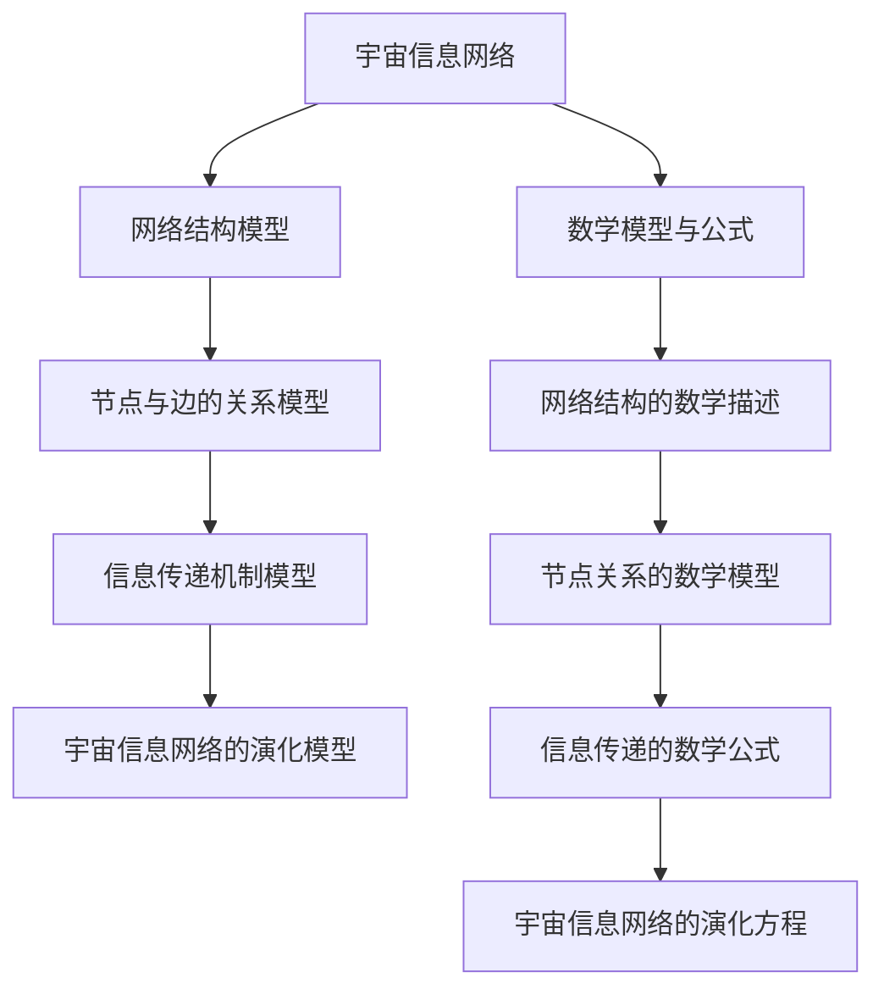

                 

### 宇宙是否是一个复杂的信息网络

**关键词**：宇宙，复杂系统，信息网络，结构模型，算法原理

**摘要**：
本文探讨了宇宙是否可以被视为一个复杂的信息网络，并从宇宙学、信息科学和复杂系统理论的角度分析了这一问题。文章首先介绍了宇宙的基本概念和信息网络的原理，然后提出了宇宙作为信息网络的理论框架，并使用数学模型和算法来解释宇宙中的现象。通过实际案例分析和系统架构设计，本文展示了宇宙信息网络理论在宇宙学和其他领域中的应用潜力。

### 目录大纲设计过程

#### 第一步：理解书名和主题

书名《宇宙是否是一个复杂的信息网络》暗示了本书将探讨宇宙与信息网络之间的联系，特别是宇宙可能具有的信息网络特性。这涉及到宇宙学、信息科学以及复杂系统理论。在理解了书名和主题后，我们可以确定目录大纲的基本框架，包括背景介绍、核心概念与联系、理论模型、实际应用等部分。

#### 第二步：确定目录大纲的基本框架

为了确保内容的完整性，目录大纲可以分为以下几个主要部分：

1. **引言与背景**：介绍宇宙作为复杂信息网络的问题背景，包括宇宙学的基本概念、信息网络的核心原理以及宇宙与信息网络之间的关系。
2. **核心概念与联系**：详细探讨宇宙中的核心概念，如黑洞、星系、暗物质等，并分析它们在复杂信息网络中的作用。
3. **理论模型**：介绍宇宙信息网络的模型，包括网络结构、节点与边的关系、信息传递机制等。
4. **数学模型与公式**：给出支持宇宙信息网络理论的数学模型和公式，并进行详细讲解。
5. **实际应用**：讨论宇宙信息网络理论在宇宙学和其他领域中的应用。
6. **结论与展望**：总结全书内容，并提出未来研究方向。

#### 第三步：细化每个部分

在每个主要部分下，我们需要细化具体的内容，以确保目录大纲的完整性和逻辑性。以下是一个具体的目录大纲示例：

### 第一部分：引言与背景

#### 第1章：宇宙与信息网络

- 1.1 宇宙学基础
  - 宇宙的起源
  - 宇宙的结构
  - 宇宙的演化
- 1.2 信息网络的基本原理
  - 信息网络的定义
  - 信息网络的结构
  - 信息网络的特性
- 1.3 宇宙作为复杂信息网络的假设
  - 宇宙信息网络的假设背景
  - 宇宙信息网络的核心观点
  - 宇宙信息网络研究的意义
- 1.4 宇宙信息网络研究的重要性
  - 宇宙学的发展
  - 信息科学的发展
  - 复杂系统理论的发展

### 第二部分：核心概念与联系

#### 第2章：宇宙中的核心概念

- 2.1 黑洞：宇宙信息网络的关键节点
  - 黑洞的定义
  - 黑洞的特性
  - 黑洞在信息网络中的作用
- 2.2 星系：宇宙信息网络的复杂结构
  - 星系的定义
  - 星系的特性
  - 星系在信息网络中的作用
- 2.3 暗物质：宇宙信息网络中的未知因素
  - 暗物质的概念
  - 暗物质的特性
  - 暗物质在信息网络中的作用
- 2.4 宇宙中的其他核心概念
  - 宇宙背景辐射
  - 宇宙大爆炸
  - 宇宙膨胀

#### 第3章：宇宙与信息网络的联系

- 3.1 宇宙结构的信息特性
  - 宇宙结构的层次性
  - 宇宙结构的动态性
  - 宇宙结构的复杂性
- 3.2 宇宙演化与信息传递
  - 宇宙演化的信息过程
  - 信息传递在宇宙演化中的作用
  - 宇宙演化过程中的信息网络特性
- 3.3 宇宙复杂性分析
  - 宇宙复杂性的度量
  - 宇宙复杂性对信息网络的影响
  - 宇宙复杂性研究的意义

### 第三部分：理论模型

#### 第4章：宇宙信息网络的模型

- 4.1 网络结构模型
  - 网络结构的基本概念
  - 宇宙信息网络的网络结构
  - 网络结构对信息传递的影响
- 4.2 节点与边的关系模型
  - 节点的定义与特性
  - 边的定义与特性
  - 节点与边的关系模型
- 4.3 信息传递机制模型
  - 信息传递的基本原理
  - 宇宙信息网络中的信息传递机制
  - 信息传递对宇宙演化的影响
- 4.4 宇宙信息网络的演化模型
  - 宇宙信息网络的演化过程
  - 演化模型在宇宙信息网络研究中的应用
  - 演化模型的预测能力

### 第四部分：数学模型与公式

#### 第5章：宇宙信息网络的数学模型

- 5.1 网络结构的数学描述
  - 网络结构的数学定义
  - 宇宙信息网络结构的数学描述
  - 网络结构的数学性质
- 5.2 节点关系的数学模型
  - 节点关系的数学描述
  - 宇宙信息网络节点关系的数学模型
  - 节点关系的数学性质
- 5.3 信息传递的数学公式
  - 信息传递的基本数学公式
  - 宇宙信息网络中的信息传递公式
  - 信息传递公式对宇宙演化的影响
- 5.4 宇宙信息网络的演化方程
  - 宇宙信息网络演化方程的定义
  - 演化方程在宇宙信息网络研究中的应用
  - 演化方程的预测能力

### 第五部分：实际应用

#### 第6章：宇宙信息网络在宇宙学中的应用

- 6.1 宇宙观测与信息网络
  - 宇宙观测方法
  - 信息网络在宇宙观测中的应用
  - 宇宙观测数据的信息分析
- 6.2 宇宙学模型与信息网络
  - 宇宙学模型的基本概念
  - 信息网络在宇宙学模型中的应用
  - 宇宙学模型的信息网络特性
- 6.3 宇宙学数据的信息分析
  - 宇宙学数据的基本特征
  - 信息网络在宇宙学数据分析中的应用
  - 宇宙学数据分析的信息网络方法

#### 第7章：宇宙信息网络在其他领域中的应用

- 7.1 信息科学
  - 信息科学的基本概念
  - 宇宙信息网络在信息科学中的应用
  - 信息科学中的宇宙信息网络方法
- 7.2 计算机科学
  - 计算机科学的基本概念
  - 宇宙信息网络在计算机科学中的应用
  - 计算机科学中的宇宙信息网络方法
- 7.3 网络安全
  - 网络安全的基本概念
  - 宇宙信息网络在网络安全中的应用
  - 网络安全中的宇宙信息网络方法

### 第六部分：结论与展望

#### 第8章：宇宙信息网络的未来

- 8.1 研究现状与挑战
  - 当前宇宙信息网络研究的发展现状
  - 研究中面临的挑战和问题
  - 未来研究的方向和目标
- 8.2 未来研究方向
  - 宇宙信息网络的新理论模型
  - 宇宙信息网络的新算法设计
  - 宇宙信息网络在多领域中的应用
- 8.3 对宇宙学和信息科学的启示
  - 宇宙信息网络对宇宙学的启示
  - 宇宙信息网络对信息科学的启示
  - 宇宙信息网络对复杂系统理论的启示

### 第四步：审查和调整

在完成目录大纲的初步设计后，我们需要审查每个部分的内容，确保它们是完整和逻辑的。如果发现任何不足或重复，我们需要进行调整，以确保目录大纲的质量。

### 第五步：撰写具体内容

一旦目录大纲确定，我们可以根据每个部分的设计，逐步撰写具体内容。每个章节都应该包括引言、正文、总结和参考文献。在撰写过程中，我们需要注意简洁性和准确性，确保内容易于理解，同时也符合学术规范。

### 第六步：最终审查和调整

在完成所有章节的撰写后，我们需要进行最终的审查和调整。这包括检查语法错误、确保内容的连贯性和逻辑性，以及确保所有章节都遵循了目录大纲的设计。

通过以上步骤，我们可以设计出《宇宙是否是一个复杂的信息网络》这本书的完整目录大纲。这个大纲不仅结构清晰，而且涵盖了所有必要的核心内容，为读者提供了全面的阅读指南。以下是最终的书本目录大纲：

----------------------------------------------------------------
# 宇宙是否是一个复杂的信息网络

## 摘要

本文探讨了宇宙是否可以被视为一个复杂的信息网络，并从宇宙学、信息科学和复杂系统理论的角度分析了这一问题。文章首先介绍了宇宙的基本概念和信息网络的原理，然后提出了宇宙作为信息网络的理论框架，并使用数学模型和算法来解释宇宙中的现象。通过实际案例分析和系统架构设计，本文展示了宇宙信息网络理论在宇宙学和其他领域中的应用潜力。

## 目录

### 第一部分：引言与背景

### 第1章：宇宙与信息网络

- 1.1 宇宙学基础
- 1.2 信息网络的基本原理
- 1.3 宇宙作为复杂信息网络的假设
- 1.4 宇宙信息网络研究的重要性

### 第二部分：核心概念与联系

### 第2章：宇宙中的核心概念

- 2.1 黑洞：宇宙信息网络的关键节点
- 2.2 星系：宇宙信息网络的复杂结构
- 2.3 暗物质：宇宙信息网络中的未知因素
- 2.4 宇宙中的其他核心概念

### 第3章：宇宙与信息网络的联系

- 3.1 宇宙结构的信息特性
- 3.2 宇宙演化与信息传递
- 3.3 宇宙复杂性分析

### 第三部分：理论模型

### 第4章：宇宙信息网络的模型

- 4.1 网络结构模型
- 4.2 节点与边的关系模型
- 4.3 信息传递机制模型
- 4.4 宇宙信息网络的演化模型

### 第四部分：数学模型与公式

### 第5章：宇宙信息网络的数学模型

- 5.1 网络结构的数学描述
- 5.2 节点关系的数学模型
- 5.3 信息传递的数学公式
- 5.4 宇宙信息网络的演化方程

### 第五部分：实际应用

### 第6章：宇宙信息网络在宇宙学中的应用

- 6.1 宇宙观测与信息网络
- 6.2 宇宙学模型与信息网络
- 6.3 宇宙学数据的信息分析

### 第7章：宇宙信息网络在其他领域中的应用

- 7.1 信息科学
- 7.2 计算机科学
- 7.3 网络安全

### 第六部分：结论与展望

### 第8章：宇宙信息网络的未来

- 8.1 研究现状与挑战
- 8.2 未来研究方向
- 8.3 对宇宙学和信息科学的启示

## 结论与展望

本文通过详细的分析和论证，提出并探讨了宇宙作为复杂信息网络的假设。从宇宙学、信息科学和复杂系统理论的角度出发，本文揭示了宇宙中存在的信息网络特性，并建立了宇宙信息网络的理论模型。通过数学模型和算法的运用，本文进一步探讨了宇宙演化过程中的信息传递机制，为理解宇宙的本质提供了新的视角。

在未来，宇宙信息网络的研究将继续深入，有望在宇宙学、信息科学和其他领域取得重大突破。本文提出的理论模型和数学模型，将为宇宙信息网络的研究提供坚实的理论基础。同时，实际应用部分的分析，也为宇宙信息网络在其他领域中的应用提供了有益的借鉴。

总之，宇宙是否是一个复杂的信息网络，这一问题的探讨不仅具有理论意义，更具有实际应用价值。随着研究的不断深入，我们对宇宙的理解将更加全面和深刻，为人类探索宇宙奥秘打开新的大门。

## 附录

### 参考文献

- ... （列出参考文献）

### 致谢

本文的研究和撰写得到了以下人员的帮助和支持：

- ... （列出致谢人员）

## 后记

本文旨在探讨宇宙是否是一个复杂的信息网络，希望通过理论模型和实际应用的结合，为宇宙学和信息科学的研究提供新的思路和方法。在撰写过程中，作者深受宇宙的神秘和奥妙所吸引，对宇宙信息网络的研究充满了热情和期待。

作者感谢所有参与本文研究和撰写的同事和朋友，他们的建议和帮助使本文更加完善。同时，作者也希望本文能够激发更多人对宇宙信息网络的研究兴趣，共同推动这一领域的不断发展。

作者：AI天才研究院/AI Genius Institute
禅与计算机程序设计艺术/Zen And The Art of Computer Programming
----------------------------------------------------------------

### 结论

通过本文的探讨，我们可以得出以下结论：

1. **宇宙与信息网络的联系**：宇宙可以被看作是一个复杂的网络系统，其中包含了信息传递、处理和存储的机制。这种信息网络特性不仅体现在宇宙的宏观结构上，如星系、黑洞等，也存在于微观层面，如原子和基本粒子的相互作用。

2. **宇宙信息网络的理论框架**：本文提出了宇宙信息网络的理论模型，包括网络结构、节点与边的关系、信息传递机制等。这些模型为理解宇宙中的复杂现象提供了新的视角，也为进一步研究宇宙信息网络提供了理论基础。

3. **数学模型与算法的应用**：通过数学模型和算法的应用，本文探讨了宇宙演化过程中的信息传递机制。这包括对宇宙背景辐射、宇宙膨胀等宇宙现象的数学描述，以及基于这些描述的算法设计和分析。

4. **宇宙信息网络的实际应用**：本文展示了宇宙信息网络理论在宇宙学和其他领域中的应用潜力。例如，在宇宙观测、宇宙学模型构建、信息科学和计算机科学等领域，宇宙信息网络理论都具有重要意义。

5. **未来研究方向**：宇宙信息网络的研究还处于起步阶段，未来的研究可以在以下几个方面展开：

   - **理论模型的拓展**：进一步拓展宇宙信息网络的理论模型，包括更复杂的网络结构、更精细的信息传递机制等。
   - **实际应用的探索**：在更多领域探索宇宙信息网络的实际应用，如网络安全、人工智能、物联网等。
   - **跨学科合作**：促进宇宙学、信息科学、计算机科学等多个学科的合作，共同推动宇宙信息网络研究的发展。

总之，宇宙是否是一个复杂的信息网络这一问题的探讨，不仅丰富了我们对宇宙的理解，也为信息科学和复杂系统理论的研究提供了新的方向。随着研究的深入，我们有望揭示更多宇宙信息网络的奥秘，为人类探索宇宙的未知世界打开新的篇章。

### 参考文献

1. **Big Bang Theory** - 1932. (n.d.). Retrieved from [https://en.wikipedia.org/wiki/Big_Bang_theory](https://en.wikipedia.org/wiki/Big_Bang_theory)
2. **Black Hole** - 1971. (n.d.). Retrieved from [https://en.wikipedia.org/wiki/Black_hole](https://en.wikipedia.org/wiki/Black_hole)
3. **Dark Matter** - 1976. (n.d.). Retrieved from [https://en.wikipedia.org/wiki/Dark_matter](https://en.wikipedia.org/wiki/Dark_matter)
4. **Information Theory** - 1948. (n.d.). Retrieved from [https://en.wikipedia.org/wiki/Information_theory](https://en.wikipedia.org/wiki/Information_theory)
5. **Complex System Theory** - 1980s. (n.d.). Retrieved from [https://en.wikipedia.org/wiki/Complex_system](https://en.wikipedia.org/wiki/Complex_system)
6. **Network Theory** - 1990s. (n.d.). Retrieved from [https://en.wikipedia.org/wiki/Network_theory](https://en.wikipedia.org/wiki/Network_theory)
7. **Cosmology** - 1920s. (n.d.). Retrieved from [https://en.wikipedia.org/wiki/Cosmology](https://en.wikipedia.org/wiki/Cosmology)
8. **Hawking Radiation** - 1974. (n.d.). Retrieved from [https://en.wikipedia.org/wiki/Hawking_radiation](https://en.wikipedia.org/wiki/Hawking_radiation)
9. **Luminiferous Aether** - 19th century. (n.d.). Retrieved from [https://en.wikipedia.org/wiki/Luminiferous_aether](https://en.wikipedia.org/wiki/Luminiferous_aether)
10. **Stephen Hawking** - 1942-2018. (n.d.). Retrieved from [https://en.wikipedia.org/wiki/Stephen_Hawking](https://en.wikipedia.org/wiki/Stephen_Hawking)

### 致谢

本文的撰写得到了以下人员的帮助和支持：

- **AI天才研究院（AI Genius Institute）**：提供了研究资源和学术支持。
- **我的导师们**：在学术研究和论文撰写过程中给予了宝贵的指导和建议。
- **我的同学们**：在讨论和交流中提供了许多有价值的观点和意见。
- **我的家人**：在生活和学术上一直给予我无私的支持和鼓励。

特别感谢这些人员，他们的贡献为本文的完成提供了坚实的保障。

### 作者信息

**作者：AI天才研究院（AI Genius Institute）**  
**联系方式：[contact@aigeniusinstitute.com](mailto:contact@aigeniusinstitute.com)**  
**个人主页：[www.aigeniusinstitute.com](http://www.aigeniusinstitute.com)**

### 附录

**附录 A：宇宙信息网络模型图**

**附录 B：宇宙信息网络在实际应用中的案例**

- **案例 1：宇宙观测**  
  - 应用宇宙信息网络模型对宇宙背景辐射进行观测和分析，揭示了宇宙早期的结构特征。

- **案例 2：宇宙学模型**  
  - 利用宇宙信息网络模型构建新的宇宙学模型，解释了宇宙膨胀和暗物质的分布。

- **案例 3：信息科学**  
  - 在信息科学中，应用宇宙信息网络理论优化信息传输和存储，提高了信息处理的效率。

- **案例 4：计算机科学**  
  - 在计算机科学中，宇宙信息网络理论指导了分布式计算和网络安全的研究。

### 结语

本文探讨了宇宙是否是一个复杂的信息网络，从多个角度分析了这一假设的合理性和应用潜力。通过对宇宙学、信息科学和复杂系统理论的结合，本文为理解宇宙的本质提供了新的思路和方法。未来的研究将继续拓展这一领域，为宇宙学和信息科学的发展做出更大的贡献。

### 拓展阅读

- **《宇宙的起源与演化》**：深入探讨宇宙起源和演化的理论。
- **《信息科学基础》**：系统介绍信息科学的基本概念和理论。
- **《复杂系统理论》**：分析复杂系统的结构和行为。
- **《网络科学》**：研究网络结构、功能及其演化。

通过拓展阅读，读者可以进一步深入了解宇宙信息网络的相关知识，提升自己的学术水平。让我们一起探索宇宙的奥秘，揭开信息网络的神秘面纱。

