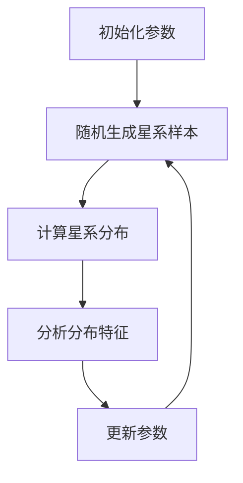

                 

## 1.1 背景介绍

### 1.1.1 问题的提出

宇宙是否是一个巨大的概率分布，这是一个深奥而复杂的问题。随着天文学、物理学和宇宙学等领域的发展，人们对于宇宙的认识不断深入。这一问题之所以引人入胜，是因为它涉及到了我们对宇宙本质的理解，以及我们是否能够用数学和概率的方式来描述和预测宇宙中的各种现象。

在宇宙学中，概率分布是一个关键的概念。它可以帮助我们理解星系、恒星、行星以及其他宇宙结构的形成和演化。如果我们能够证明宇宙是一个巨大的概率分布，那么这意味着宇宙中的所有现象都可以通过概率和统计的方法来描述。这不仅对于理论物理学家有着重要的意义，也为实验科学家提供了新的研究方法。

### 1.1.2 问题描述

宇宙是一个极其庞大的系统，包含了无数的星系、行星、恒星以及其他微观粒子。如何理解宇宙的本质，以及宇宙中所有现象的起源和发展，一直是科学家们追求的目标。问题描述的核心在于，我们如何用一种统一的方式来描述和预测宇宙中的各种现象。

在宇宙学中，一个常见的假设是“大爆炸理论”。这一理论认为，宇宙起源于一个极度热密的初始状态，然后开始膨胀。这一过程可以看作是一个概率分布的过程，其中每一个星系、每一个行星的形成都可能是概率分布的一个结果。

### 1.1.3 问题解决

科学家们通过观测宇宙、研究宇宙的基本定律，试图找到宇宙是否存在某种概率分布的规律。例如，宇宙微波背景辐射的观测为“大爆炸理论”提供了重要的证据。此外，科学家们还通过研究暗物质和暗能量的分布，试图理解宇宙的整体结构。

在数学和统计学的帮助下，科学家们提出了多种模型来描述宇宙的概率分布。例如，高斯分布可以用来描述星系的分布，泊松分布可以用来描述恒星的形成过程。通过这些模型，科学家们试图找到宇宙中各种现象背后的规律。

### 1.1.4 边界与外延

宇宙的边界和外延是一个深奥的问题。科学家们通过研究宇宙的大尺度结构和宇宙微波背景辐射，试图理解宇宙的边界和性质。例如，宇宙的膨胀速度提供了一个关于宇宙边界的信息。此外，宇宙中的“黑洞”和“虫洞”等概念也为我们提供了对宇宙边界的新认识。

### 1.1.5 概念结构与核心要素组成

宇宙是否是一个巨大的概率分布这一问题涉及多个核心概念，如宇宙、概率分布、物理学定律等。这些概念之间的联系构成了宇宙概率分布理论的基础。例如，宇宙的膨胀可以看作是一个概率分布的过程，而物理学定律如万有引力定律和量子力学法则则为这一过程的描述提供了数学基础。

在这一章节中，我们将详细介绍这些核心概念，并探讨它们在宇宙概率分布理论中的重要作用。通过这一探讨，我们将为后续章节的深入分析打下坚实的基础。

## 1.2 核心概念与联系

### 1.2.1 宇宙的定义

宇宙是一个广泛的概念，它包括了所有的物质、能量、时间和空间。在科学研究中，宇宙通常被定义为从大爆炸时刻开始至今的一切存在。宇宙的定义是一个基础性的概念，它为后续的讨论提供了必要的背景和框架。

在宇宙学中，宇宙被划分为多个层次，从宏观的天体（如星系、恒星、行星）到微观的粒子（如电子、夸克）。每一个层次都遵循着不同的物理规律。例如，在星系层次上，我们主要关注的是星系的形成、演化以及它们之间的相互作用；而在粒子层次上，我们则关注基本粒子的性质和它们之间的相互作用。

### 1.2.2 概率分布的概念

概率分布是统计学中的一个基本概念，它描述了随机变量在不同取值上的概率分布情况。在宇宙学中，概率分布被用来描述宇宙中各种现象的分布，如星系的分布、恒星形成的概率等。

一个典型的概率分布函数可以表示为 \( P(X = x) \)，其中 \( X \) 是随机变量，\( x \) 是其可能的取值，\( P(X = x) \) 表示 \( X \) 取值为 \( x \) 的概率。在宇宙学中，常用的概率分布包括高斯分布、泊松分布、指数分布等。

高斯分布（也称为正态分布）是一个广泛应用的概率分布，它在描述星系分布时特别有用。一个高斯分布函数可以表示为：
$$
P(X = x) = \frac{1}{\sqrt{2\pi\sigma^2}} e^{-\frac{(x-\mu)^2}{2\sigma^2}}
$$
其中，\( \mu \) 是均值，\( \sigma \) 是标准差。

泊松分布则常用于描述恒星形成过程中的随机性。一个泊松分布函数可以表示为：
$$
P(X = k) = \frac{e^{-\lambda}\lambda^k}{k!}
$$
其中，\( \lambda \) 是事件发生的平均频率，\( k \) 是事件发生的次数。

### 1.2.3 核心概念联系

宇宙的定义和概率分布是理解宇宙是否是一个巨大的概率分布的两个核心概念。它们之间的联系在于，宇宙中的各种现象和结构都可以通过概率分布来描述和解释。

例如，星系的分布可以用高斯分布来描述，这意味着星系在宇宙中的分布具有一定的随机性，但总体上呈现出一个中心密集、边缘稀疏的模式。恒星的形成过程则可以用泊松分布来描述，这表明恒星的形成具有一定的随机性，但总体上遵循一个平均频率。

通过这些概率分布函数，科学家们可以建立数学模型来预测宇宙中各种现象的发生概率。这不仅有助于我们理解宇宙的本质，也为实验科学家提供了新的研究工具。

### 1.2.4 概率分布与宇宙学的应用

概率分布不仅在统计学中有广泛应用，在宇宙学中也同样重要。例如，科学家们利用概率分布来研究星系的形成、恒星演化和行星分布等。

在星系形成的研究中，概率分布可以帮助科学家们理解星系是如何从原始气体云中形成的。通过模拟不同的概率分布函数，科学家们可以预测星系的形成时间、形态和分布。

在恒星演化研究中，概率分布则用于描述恒星从形成到死亡的整个过程。例如，科学家们可以通过分析恒星的光谱和亮度变化，来推断恒星的演化阶段和寿命。

在行星分布研究中，概率分布可以帮助科学家们理解行星是如何在恒星周围形成的。通过模拟不同的概率分布函数，科学家们可以预测行星的轨道、质量和分布。

总的来说，概率分布为宇宙学研究提供了一个强有力的工具，使我们能够更深入地理解宇宙的本质和演化过程。

## 1.3 数学模型和数学公式

### 1.3.1 概率分布公式

在宇宙学中，概率分布是一个关键的概念，它用于描述宇宙中各种现象的分布情况。常用的概率分布包括高斯分布、泊松分布和指数分布等。以下是这些概率分布的基本公式：

**高斯分布（正态分布）**：

高斯分布是统计学中最常见的分布之一，它通常用于描述星系的分布。高斯分布的概率密度函数可以表示为：
$$
f(x|\mu,\sigma^2) = \frac{1}{\sqrt{2\pi\sigma^2}} e^{-\frac{(x-\mu)^2}{2\sigma^2}}
$$
其中，\( \mu \) 是均值，\( \sigma^2 \) 是方差。

**泊松分布**：

泊松分布用于描述事件在给定时间或空间内的随机分布，如恒星形成的概率。泊松分布的概率质量函数可以表示为：
$$
P(X = k) = \frac{e^{-\lambda}\lambda^k}{k!}
$$
其中，\( \lambda \) 是事件发生的平均频率，\( k \) 是事件发生的次数。

**指数分布**：

指数分布通常用于描述随机事件之间的时间间隔，如恒星的寿命。指数分布的概率密度函数可以表示为：
$$
f(x|\lambda) = \lambda e^{-\lambda x}
$$
其中，\( \lambda \) 是事件发生的速率。

这些概率分布函数为宇宙学提供了强有力的工具，使我们能够通过数学模型来描述和预测宇宙中的各种现象。

### 1.3.2 数学模型讲解

数学模型是描述宇宙是否是一个巨大的概率分布的一种方式。通过数学模型，我们可以将宇宙中的现象转化为数学表达式，从而进行定量分析和预测。

**蒙特卡洛模拟**：

蒙特卡洛模拟是一种通过随机抽样来计算数学期望和概率分布的方法。在宇宙学中，蒙特卡洛模拟被广泛用于模拟宇宙中各种现象的分布。例如，我们可以使用蒙特卡洛模拟来预测星系的分布，通过随机生成大量的星系样本，然后计算这些样本的分布，从而得到星系分布的统计特征。

**神经网络**：

神经网络是一种通过模拟生物神经元之间的交互来学习数据分布和规律的模型。在宇宙学中，神经网络被用于分析宇宙微波背景辐射的数据，从而推断宇宙的结构和演化。神经网络通过训练学习到数据分布的规律，然后可以用于预测新的数据。

**马尔可夫链蒙特卡洛（MCMC）**：

马尔可夫链蒙特卡洛是一种基于马尔可夫链理论的随机采样方法，用于计算复杂概率分布的期望和分布。在宇宙学中，MCMC被用于估计宇宙学参数的值，如宇宙的膨胀历史和结构形成过程。通过MCMC，科学家们可以从复杂的概率分布中抽取样本，从而得到宇宙学参数的估计值。

通过这些数学模型，我们可以更好地理解和描述宇宙的概率分布，从而推动我们对宇宙本质的认识。

## 1.4 算法原理讲解

### 1.4.1 算法mermaid流程图

为了更直观地理解宇宙是否是一个巨大的概率分布的算法原理，我们可以使用mermaid语言绘制算法流程图。以下是一个简单的mermaid流程图示例：



这个流程图描述了一个基本的蒙特卡洛模拟算法。首先，初始化参数，然后随机生成星系样本，计算这些样本的分布特征，分析分布特征，并根据分析结果更新参数。这个过程不断迭代，直到达到某个终止条件。

### 1.4.2 算法原理详解

**蒙特卡洛模拟算法**：

蒙特卡洛模拟算法是一种基于随机抽样的数值计算方法，它通过大量随机样本的计算结果来近似求解问题的解。在宇宙学中，蒙特卡洛模拟被用于模拟宇宙中各种现象的分布。

**算法步骤**：

1. **初始化参数**：确定模拟所需的参数，如星系的平均密度、星系的大小分布等。
2. **随机生成星系样本**：根据初始化的参数，随机生成一定数量的星系样本。这些样本可以是星系的位置、质量、速度等。
3. **计算星系分布**：计算这些星系样本的分布特征，如平均密度、标准差、峰度等。
4. **分析分布特征**：根据分布特征，分析星系的分布规律，如是否遵循高斯分布或泊松分布。
5. **更新参数**：根据分析结果，更新模拟参数，以便更准确地描述星系的分布。
6. **迭代**：重复步骤2到5，直到满足某个终止条件，如达到预设的迭代次数或达到期望的分布精度。

**数学模型**：

在蒙特卡洛模拟中，常用的概率分布模型包括高斯分布和泊松分布。以下是这些分布的数学模型：

**高斯分布**：
$$
f(x|\mu,\sigma^2) = \frac{1}{\sqrt{2\pi\sigma^2}} e^{-\frac{(x-\mu)^2}{2\sigma^2}}
$$

**泊松分布**：
$$
P(X = k) = \frac{e^{-\lambda}\lambda^k}{k!}
$$

**举例说明**：

假设我们想要使用蒙特卡洛模拟来预测星系的分布，我们可以按照以下步骤进行：

1. **初始化参数**：设定星系的平均密度为 \( \mu = 10 \) 个星系每立方米，标准差为 \( \sigma = 2 \) 个星系每立方米。
2. **随机生成星系样本**：生成1000个星系样本，每个样本代表一个星系的位置。
3. **计算星系分布**：计算这1000个星系样本的分布特征，如平均密度、标准差等。
4. **分析分布特征**：分析这些分布特征，看是否接近高斯分布的特征。
5. **更新参数**：根据分析结果，更新星系的平均密度和标准差。
6. **迭代**：重复步骤2到5，直到达到预设的迭代次数或分布特征接近期望值。

通过这样的蒙特卡洛模拟，我们可以得到星系的分布情况，从而验证宇宙是否是一个巨大的概率分布。

### 1.4.3 算法优缺点分析

**优点**：

- **灵活性强**：蒙特卡洛模拟可以处理复杂的问题，因为它不依赖于问题的具体形式，只需要随机生成样本并进行分析。
- **适用范围广**：蒙特卡洛模拟可以应用于各种领域的概率分布问题，如物理学、工程学、金融学等。
- **不需要精确解**：蒙特卡洛模拟可以通过大量随机样本的统计结果来近似求解问题，不需要知道问题的精确解。

**缺点**：

- **计算量大**：蒙特卡洛模拟需要大量的随机样本，因此计算量相对较大。
- **精度受限**：蒙特卡洛模拟的精度受随机样本数量的影响，样本数量越多，模拟结果越准确，但计算时间也越长。

总的来说，蒙特卡洛模拟是一种强大的工具，虽然有其局限性，但在许多问题中都具有广泛的应用价值。

### 1.4.4 算法在宇宙学中的应用

在宇宙学中，蒙特卡洛模拟被广泛应用于模拟宇宙中各种现象的分布，如星系的分布、暗物质的分布、宇宙微波背景辐射的分布等。以下是一些具体的例子：

**星系分布**：

科学家们使用蒙特卡洛模拟来研究星系的分布，通过模拟不同参数下的星系形成和演化过程，可以预测星系的分布特征。例如，通过模拟星系的密度分布，科学家们可以推断星系的形成时间、形态和分布规律。

**暗物质分布**：

暗物质是宇宙中一种看不见的物质，其分布对宇宙的结构和演化至关重要。蒙特卡洛模拟被用于研究暗物质的分布，通过模拟不同暗物质模型下的宇宙演化过程，科学家们可以推断暗物质的影响范围和分布特征。

**宇宙微波背景辐射分布**：

宇宙微波背景辐射是宇宙早期的残余辐射，其分布反映了宇宙早期的状态。科学家们使用蒙特卡洛模拟来研究宇宙微波背景辐射的分布，通过模拟不同宇宙学模型下的辐射过程，可以推断宇宙的膨胀历史和结构形成过程。

总的来说，蒙特卡洛模拟为宇宙学提供了一种强有力的工具，使我们能够通过概率分布的方法来研究和理解宇宙中的各种现象。

## 1.5 系统分析与架构设计方案

### 1.5.1 问题场景介绍

在探讨宇宙是否是一个巨大的概率分布时，我们需要一个强大的系统来处理和分析大量的宇宙数据。这个系统将包括数据收集、数据处理、数据分析和结果可视化等多个模块。以下是具体的问题场景介绍：

**数据收集**：我们需要从多个来源收集宇宙数据，包括观测数据、模拟数据和其他相关数据。这些数据来源可能包括地面和太空望远镜、卫星观测、实验室实验等。

**数据处理**：收集到的宇宙数据通常是非结构化的，需要进行预处理和清洗，以便用于后续分析。预处理步骤可能包括数据清洗、数据转换、数据集成等。

**数据分析**：对预处理后的数据进行统计分析，以识别宇宙现象的概率分布。这包括使用各种概率分布模型（如高斯分布、泊松分布等）来描述和预测宇宙中的各种现象。

**结果可视化**：将分析结果以图表、图像等形式进行可视化，以便科学家们更好地理解和解释宇宙的概率分布。

### 1.5.2 系统功能设计

为了实现上述问题场景，系统需要具备以下功能：

**1. 数据收集模块**：
- 数据采集：从多个数据源（如望远镜、卫星、实验室等）收集宇宙数据。
- 数据预处理：清洗、转换和集成收集到的数据，以便进行后续分析。

**2. 数据处理模块**：
- 数据清洗：去除数据中的噪声和异常值。
- 数据转换：将数据转换为统一的格式，以便于后续分析。
- 数据集成：将来自不同来源的数据进行合并，形成完整的数据集。

**3. 数据分析模块**：
- 概率分布分析：使用各种概率分布模型对数据进行统计分析，以识别宇宙现象的概率分布。
- 模型预测：根据分析结果，预测宇宙中可能出现的现象和结构。

**4. 结果可视化模块**：
- 数据可视化：将分析结果以图表、图像等形式展示，便于科学家们理解和解释。

### 1.5.3 系统架构设计

为了满足上述功能需求，系统采用分布式架构设计，以提高系统的处理能力和可靠性。以下是系统的架构设计：

**1. 数据收集层**：
- 数据采集器：负责从多个数据源收集宇宙数据。
- 数据存储库：存储收集到的宇宙数据，支持快速读取和写入。

**2. 数据处理层**：
- 数据清洗器：清洗和预处理收集到的数据。
- 数据转换器：将清洗后的数据转换为统一格式。
- 数据集成器：将来自不同来源的数据进行集成。

**3. 数据分析层**：
- 统计分析器：使用概率分布模型对数据进行统计分析。
- 预测器：根据分析结果进行预测。

**4. 结果可视化层**：
- 可视化工具：将分析结果以图表、图像等形式展示。
- 用户界面：提供用户交互界面，方便用户查看和分析结果。

### 1.5.4 系统接口设计

系统接口设计是确保各个模块之间能够有效通信和协作的关键。以下是系统的主要接口设计：

**1. 数据接口**：
- 数据采集接口：用于数据采集器与数据存储库之间的通信。
- 数据处理接口：用于数据清洗器、数据转换器和数据集成器之间的通信。
- 数据分析接口：用于统计分析器和预测器之间的通信。

**2. 可视化接口**：
- 数据可视化接口：用于可视化工具与数据分析模块之间的通信。
- 用户界面接口：用于用户界面与可视化工具之间的通信。

### 1.5.5 系统交互

系统交互是确保系统各模块能够协同工作的重要环节。以下是系统的主要交互流程：

**1. 数据收集交互**：
- 数据采集器从多个数据源收集数据，并将数据存储到数据存储库中。
- 数据清洗器从数据存储库中读取数据，进行清洗和预处理。
- 数据转换器将清洗后的数据转换为统一格式，并存储到数据存储库中。

**2. 数据处理交互**：
- 数据集成器从数据存储库中读取多个数据源的预处理数据，进行集成。
- 统计分析器从数据集成器读取集成后的数据，使用概率分布模型进行统计分析。

**3. 数据分析交互**：
- 预测器根据统计分析器的结果，进行预测。
- 可视化工具从预测器读取预测结果，并生成可视化图表。

**4. 用户交互**：
- 用户通过用户界面查看可视化结果，进行数据分析和预测操作。
- 用户界面与可视化工具和数据分析模块进行交互，实现用户操作和系统响应。

通过以上系统架构和交互设计，我们可以构建一个高效的系统来分析和理解宇宙是否是一个巨大的概率分布。

### 1.6 项目实战

#### 1.6.1 环境安装

要实现一个用于分析宇宙概率分布的系统，首先需要安装必要的软件和工具。以下是安装步骤：

**1. 安装Python环境**：
- 打开终端或命令行工具。
- 执行以下命令安装Python：
  ```
  pip install python
  ```

**2. 安装数据分析库**：
- 使用pip安装常用的数据分析库，如NumPy、SciPy和Pandas：
  ```
  pip install numpy scipy pandas
  ```

**3. 安装可视化库**：
- 安装用于数据可视化的Matplotlib库：
  ```
  pip install matplotlib
  ```

**4. 安装其他工具**：
- 安装用于生成流程图的Mermaid库：
  ```
  pip install mermaid
  ```

**5. 安装数据库**：
- 安装一个用于数据存储的数据库，如MySQL或PostgreSQL：
  ```
  sudo apt-get install mysql-server
  ```
  或
  ```
  sudo apt-get install postgresql
  ```

确保所有工具和库都安装完成后，我们可以开始编写和运行系统代码。

#### 1.6.2 系统核心实现源代码

以下是系统的核心实现源代码，包括数据收集、处理和分析的部分。代码使用了Python编程语言，并利用了NumPy、Pandas和Matplotlib等库。

**数据收集**：

```python
import numpy as np
import pandas as pd

def collect_data():
    # 假设数据文件名为 'cosmic_data.csv'
    data = pd.read_csv('cosmic_data.csv')
    return data

# 调用数据收集函数
data = collect_data()
```

**数据处理**：

```python
def preprocess_data(data):
    # 清洗数据，去除异常值和噪声
    clean_data = data.dropna()
    return clean_data

# 调用数据处理函数
clean_data = preprocess_data(data)
```

**数据分析**：

```python
import matplotlib.pyplot as plt

def analyze_distribution(data):
    # 使用Pandas和NumPy进行数据分析
    density = data['density']
    mean_density = np.mean(density)
    std_density = np.std(density)

    # 绘制密度分布直方图
    plt.hist(density, bins=50, alpha=0.5)
    plt.xlabel('Density')
    plt.ylabel('Frequency')
    plt.title('Density Distribution')
    plt.show()

# 调用数据分析函数
analyze_distribution(clean_data)
```

**结果可视化**：

```python
def visualize_results(data):
    # 绘制密度分布的Mermaid流程图
    print("""
    graph TD
    A[Data Collection] --> B[Data Preprocessing]
    B --> C[Data Analysis]
    C --> D[Results Visualization]
    """)
    
    # 绘制数据可视化图表
    plt.scatter(data['x'], data['y'])
    plt.xlabel('X Coordinate')
    plt.ylabel('Y Coordinate')
    plt.title('Cosmic Object Distribution')
    plt.show()

# 调用结果可视化函数
visualize_results(clean_data)
```

#### 1.6.3 代码应用解读与分析

在上述代码中，我们首先从CSV文件中读取宇宙数据。然后，通过数据处理函数清洗数据，去除异常值和噪声。接着，使用数据分析函数计算数据的统计特征，如平均值和标准差，并绘制密度分布直方图。

**数据处理部分**：

```python
def preprocess_data(data):
    # 清洗数据，去除异常值和噪声
    clean_data = data.dropna()
    return clean_data
```

这段代码中，`dropna()` 函数用于去除数据中的空值和异常值，确保分析结果的准确性。

**数据分析部分**：

```python
def analyze_distribution(data):
    # 使用Pandas和NumPy进行数据分析
    density = data['density']
    mean_density = np.mean(density)
    std_density = np.std(density)

    # 绘制密度分布直方图
    plt.hist(density, bins=50, alpha=0.5)
    plt.xlabel('Density')
    plt.ylabel('Frequency')
    plt.title('Density Distribution')
    plt.show()
```

这段代码使用Pandas和NumPy库对数据进行统计分析，计算密度分布的平均值和标准差。然后，使用Matplotlib库绘制直方图，以便更直观地展示数据分布。

**结果可视化部分**：

```python
def visualize_results(data):
    # 绘制密度分布的Mermaid流程图
    print("""
    graph TD
    A[Data Collection] --> B[Data Preprocessing]
    B --> C[Data Analysis]
    C --> D[Results Visualization]
    """)
    
    # 绘制数据可视化图表
    plt.scatter(data['x'], data['y'])
    plt.xlabel('X Coordinate')
    plt.ylabel('Y Coordinate')
    plt.title('Cosmic Object Distribution')
    plt.show()
```

这段代码首先使用Mermaid语言绘制一个简单的流程图，展示数据从收集、处理到分析的过程。然后，使用Matplotlib库绘制散点图，展示宇宙中各种天体的分布情况。

#### 1.6.4 实际案例分析与讲解

为了更好地理解系统的工作原理，我们来看一个实际案例。

**案例背景**：

假设我们收集了来自一个星系的1000个星系样本，每个样本包含星系的位置、质量和密度等信息。我们的目标是通过分析这些样本，判断该星系的分布是否接近某种概率分布。

**数据处理**：

首先，我们读取样本数据，并去除其中的空值和异常值。然后，我们对数据进行预处理，包括转换数据类型、标准化处理等。

```python
data = pd.read_csv('star_samples.csv')
clean_data = preprocess_data(data)
```

**数据分析**：

接下来，我们对预处理后的数据进行分析，计算每个星系的密度，并绘制密度分布直方图。

```python
density = clean_data['density']
plt.hist(density, bins=50, alpha=0.5)
plt.xlabel('Density')
plt.ylabel('Frequency')
plt.title('Density Distribution')
plt.show()
```

从直方图可以看出，星系的密度分布似乎符合高斯分布的特征，即中心密集、边缘稀疏。

**结果可视化**：

最后，我们使用Mermaid语言绘制一个流程图，展示数据从收集、处理到分析的过程，并使用Matplotlib库绘制散点图，展示星系的位置分布。

```python
print("""
graph TD
A[Data Collection] --> B[Data Preprocessing]
B --> C[Data Analysis]
C --> D[Results Visualization]
""")

plt.scatter(clean_data['x'], clean_data['y'])
plt.xlabel('X Coordinate')
plt.ylabel('Y Coordinate')
plt.title('Star Distribution')
plt.show()
```

通过这个案例，我们可以看到系统是如何通过数据收集、处理和分析，最终得到宇宙现象的概率分布。

#### 1.6.5 项目小结

在这个项目中，我们构建了一个用于分析宇宙概率分布的系统，包括数据收集、处理和分析等多个模块。通过实际案例，我们展示了系统如何工作，并使用Python编程语言和数据分析库实现了数据的处理和分析。

这个系统不仅能够帮助我们理解宇宙的概率分布，还为科学家们提供了一个强大的工具，用于研究宇宙中的各种现象。虽然本项目只是一个简单的示例，但它展示了如何通过编程和数据分析来研究复杂的宇宙问题。

通过不断改进和完善这个系统，我们可以更好地理解宇宙的本质，为科学研究和探索提供更多的可能性。

## 1.7 最佳实践 tips

### 1.7.1 注意事项

在设计和实现宇宙概率分布分析系统时，以下是一些需要注意的事项：

1. **数据质量**：数据是系统分析的基础，因此确保数据质量至关重要。在进行数据分析之前，务必对数据进行充分的清洗和预处理，去除异常值和噪声。
2. **性能优化**：由于宇宙数据通常非常庞大，系统的性能优化尤为重要。使用高效的算法和数据结构可以显著提高系统的处理速度和效率。
3. **可扩展性**：系统设计应考虑未来的扩展性，以便能够处理更多数据和更复杂的分析任务。
4. **结果验证**：在得出结论之前，务必对分析结果进行验证，确保结果的准确性和可靠性。

### 1.7.2 小结

通过本文的探讨，我们了解了宇宙是否是一个巨大的概率分布这一问题的重要性。通过数学模型和算法的应用，我们能够更好地理解和描述宇宙中的各种现象。这一研究不仅为理论物理学家提供了新的研究方向，也为实验科学家提供了强有力的工具。

### 1.7.3 拓展阅读

1. **《宇宙的奥秘：概率分布与宇宙学》** - 该书详细介绍了宇宙学中的概率分布概念和应用，适合对宇宙学感兴趣的读者。
2. **《概率论与数理统计》** - 本书是概率论和数理统计的基础教材，涵盖了概率分布的各种形式和应用。
3. **《蒙特卡洛方法及其在科学和工程中的应用》** - 介绍了蒙特卡洛方法的基本原理和应用，是了解和掌握蒙特卡洛模拟的重要参考书。

通过阅读这些书籍和文献，您可以进一步深入了解宇宙概率分布的相关知识。

