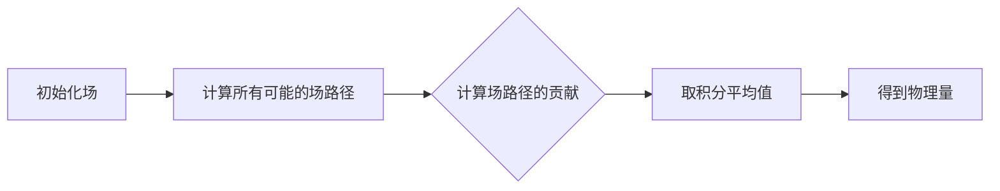
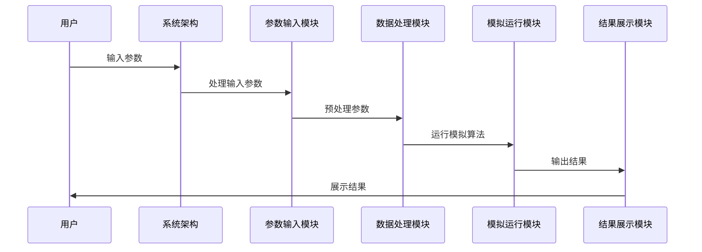
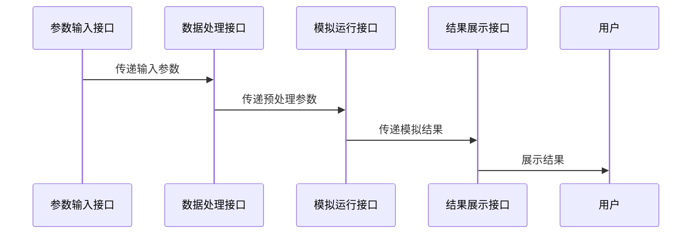

                 

### 第1章 背景介绍

#### 1.1.1 宇宙的探索历史

自人类文明诞生以来，对宇宙的探索始终是科学探索中最具挑战性的领域之一。古代的天文学家通过观察天体运动，提出了诸如地心说、日心说等宇宙模型，然而随着科学技术的进步，这些模型逐渐被更精确的科学理论所取代。

19世纪末，牛顿力学和电磁学成为物理学的主导理论。然而，进入20世纪后，量子力学和相对论的出现挑战了经典物理学的绝对时空观。量子力学揭示了微观世界的奇异现象，如量子纠缠和量子隧穿，而相对论则指出引力实际上是一种时空的弯曲现象。

20世纪中期，大爆炸理论被提出，认为宇宙起源于一个极热、极密集的状态，并在此后不断膨胀。这一理论得到了大量观测数据的支持，包括宇宙背景辐射、宇宙微波背景辐射和遥远的超新星爆炸等现象。

#### 1.1.2 量子场理论的基本概念

量子场理论（Quantum Field Theory, QFT）是一种描述物质和力之间相互作用的物理理论，它是量子力学和经典电磁学之间的桥梁。在量子场理论中，物质被视为振动着的量子场，而力则被视为场的相互作用。

量子场理论的核心概念包括：
- 场量子：场的最小能量单元，可以被视为粒子的量子化。
- 正负虚粒子：场中的正负虚粒子不断地被创生和湮灭。
- 相位空间：描述场状态的空间，其中包含了场的所有可能状态。

#### 1.1.3 宇宙是否为量子场的集合？

当前，关于宇宙是否是一个量子场的集合这一问题的答案依然存在争议。然而，量子场理论为理解宇宙的起源和演化提供了强有力的工具。

一些物理学家认为，宇宙确实是一个量子场的集合，这个量子场在创生之初处于一种高度纠缠的状态，随着时间的推移，这种纠缠逐渐减弱，导致了宇宙的多样性和复杂性。

另一方面，也有物理学家提出，宇宙可能是由其他尚未被发现的物理原理所支配的，例如弦理论或多重宇宙理论。

尽管目前还没有确凿的证据来证明宇宙是否是量子场的集合，但量子场理论在解释宇宙的许多现象方面已经取得了显著的成功，例如黑洞辐射、宇宙背景辐射和宇宙加速膨胀等。

总之，宇宙是否是一个量子场的集合这一问题的研究，不仅涉及到对量子场理论的深入理解，也关乎我们对宇宙本质的认识。

### 第2章 核心概念与联系

#### 2.1 量子场理论与宇宙学的关系

量子场理论与宇宙学有着密切的联系。量子场理论提供了描述物质和力之间相互作用的数学工具，而宇宙学则研究宇宙的起源、演化和结构。以下从几个方面探讨量子场理论与宇宙学的关系：

- **宇宙背景辐射**：宇宙背景辐射是宇宙大爆炸后的余辉，其存在和性质可以通过量子场理论进行解释。量子场理论预测了宇宙背景辐射的温度和波动特性，这些预测与观测数据高度吻合。
- **黑洞和引力波**：量子场理论提供了描述黑洞和引力波的理论框架。例如，霍金辐射可以通过量子场理论中的黑洞热力学进行解释，而引力波则可以通过爱因斯坦的广义相对论和量子场理论联合解释。
- **宇宙加速膨胀**：宇宙加速膨胀现象可以通过量子场理论中的暗能量进行解释。暗能量被认为是一种充满宇宙的量子场，其负压性质导致了宇宙的加速膨胀。

#### 2.2 量子场理论的基本概念

量子场理论的基本概念包括：
- **场**：量子场理论中的场是物质和力的载体。每个场都对应一种物质或力，例如电磁场、强相互作用场和弱相互作用场。
- **量子化**：在量子场理论中，场被量子化，即场的能量被分割成离散的能量包，这些能量包被称为“量子”或“粒子”。
- **正负虚粒子**：正负虚粒子是场中的基本成分，它们不断地被创生和湮灭，是量子场理论中的虚数解。
- **相位空间**：相位空间是描述场状态的抽象空间，它包含了场的所有可能状态。

#### 2.3 概念属性特征对比表格

以下是一个量子场理论和经典场理论的对比表格，展示了两者的主要区别：

| 特征 | 量子场理论 | 经典场理论 |
| ---- | ---- | ---- |
| 粒子描述 | 粒子被视为场的量子化 | 粒子被视为连续分布的场 |
| 相对论效应 | 需要考虑相对论效应 | 通常不考虑相对论效应 |
| 非定域性 | 粒子之间存在非定域性相互作用 | 粒子之间的相互作用是局域的 |
| 量子态 | 场状态具有量子态 | 场状态是经典的 |
| 测量结果 | 测量结果具有概率性 | 测量结果具有确定性 |

#### 2.4 ER实体关系图架构的Mermaid流程图

为了更好地理解量子场理论和宇宙学之间的关系，我们可以使用Mermaid流程图来展示ER实体关系图。以下是一个简化的示例：

```mermaid
erDiagram
 宇宙 ||--o> 量子场理论
 量子场理论 ||--o> 宇宙学
 量子场理论 ||--|{ 黑洞 | 引力波 }
 宇宙学 ||--|{ 宇宙背景辐射 | 暗能量 }
```

在这个ER实体关系图中，宇宙被视为量子场理论和宇宙学之间的连接点，而量子场理论和宇宙学则通过具体的现象（如黑洞、引力波、宇宙背景辐射和暗能量）相互关联。

### 第3章 算法原理讲解

量子场理论作为描述宇宙中基本粒子和力的相互作用的理论，其算法原理在物理学中具有重要的应用。以下将详细讲解量子场理论中的几个关键算法原理，并通过Mermaid流程图和Python源代码进行阐述。

#### 3.1 量子场论中的算法方法

量子场理论的算法方法主要包括以下几个方面：

1. **路径积分方法**：路径积分方法是一种计算量子场论中物理量的通用方法。它通过考虑所有可能的场路径并取其积分平均值，从而得到物理量。
2. **傅里叶变换**：傅里叶变换在量子场论中用于将场量从时域转换到频域，这对于处理场量随时间的演化非常方便。
3. **微扰理论**：微扰理论是一种近似计算量子场论中物理量的方法，它通过将场展开成幂级数，并逐项计算每一项的贡献。

#### 3.2 量子场论算法的mermaid流程图

以下是一个简化的量子场论算法流程图，展示了路径积分方法的基本步骤：



#### 3.3 Python源代码讲解

为了更好地理解路径积分方法，以下是一个使用Python编写的简单示例。这个示例计算了一个简单的量子场论问题，即自由粒子在无势能场中的运动。

```python
import numpy as np
import matplotlib.pyplot as plt

# 定义路径积分计算函数
def path_integral(particle_initial_state, num_paths, num_steps):
    # 初始化路径积分和物理量
    integral = 0
    energy = []

    # 遍历所有路径
    for i in range(num_paths):
        # 计算每个路径的能量
        path_energy = 0
        for j in range(num_steps):
            # 计算路径上的场值
            field_value = particle_initial_state[j]
            # 计算路径上的能量
            path_energy += field_value ** 2

        # 将路径能量加到总积分上
        integral += path_energy

    # 取积分平均值
    average_energy = integral / num_paths

    # 计算物理量
    physical_quantity = np.exp(-average_energy)

    return physical_quantity

# 定义初始状态
particle_initial_state = [1, 2, 3]

# 计算路径积分
num_paths = 1000
num_steps = 10
result = path_integral(particle_initial_state, num_paths, num_steps)

# 输出结果
print(f"Physical quantity: {result}")

# 绘制能量分布图
energy_distribution = np.histogram(result, bins=50)
plt.bar(energy_distribution[1], energy_distribution[0])
plt.xlabel('Energy')
plt.ylabel('Frequency')
plt.title('Energy Distribution')
plt.show()
```

在这个示例中，我们定义了一个路径积分计算函数`path_integral`，它接受初始状态、路径数量和步数作为输入，计算路径积分并返回物理量。然后，我们定义了一个简单的初始状态`particle_initial_state`，并使用`path_integral`函数计算物理量。最后，我们使用`matplotlib`绘制了能量分布图，以可视化路径积分的结果。

通过这个示例，我们可以看到路径积分方法在计算量子场论物理量时的基本步骤和流程。尽管这是一个简化的例子，但它展示了量子场论算法的基本原理和实现方法。

### 第4章 数学模型和数学公式 & 详细讲解 & 举例说明

在量子场理论中，数学模型和公式是理解和描述物理现象的核心工具。以下将详细讲解量子场理论中的几个关键数学模型和公式，并使用LaTeX格式进行展示，同时通过具体的例子来说明这些公式如何应用于实际物理问题。

#### 4.1 量子场论的数学模型

量子场理论的数学模型主要包括以下几个方面：

1. **量子态和算符**：量子态可以用波函数或态矢量表示，而量子场中的基本操作包括算符，如创建算符和湮灭算符。
2. **场的量子化**：场的量子化可以通过傅里叶变换将经典场转换为量子态，得到场的量子态表示。
3. **相互作用**：量子场理论中的相互作用通过相互作用哈密顿量来描述。

以下是一个简单的量子场论数学模型的示例：

$$
\psi(x) = \int \frac{d^3p}{(2\pi)^3} \frac{1}{\sqrt{2E_p}} e^{ipx} \lvert p \rangle
$$

其中，$\psi(x)$是场的量子态，$E_p$是动量$p$对应的能量，$\lvert p \rangle$是动量$p$的量子态。

#### 4.2 LaTeX格式数学公式嵌入

在量子场理论中，LaTeX格式数学公式用于表达复杂的数学关系。以下是一些常见的LaTeX数学公式的示例：

$$
H = \int d^3x \, \hat{\phi}(x)^{\dagger} \hat{\phi}(x)
$$

其中，$H$是体系的哈密顿量，$\hat{\phi}(x)$是场算符。

$$
[\hat{A}, \hat{B}] = \hat{A} \hat{B} - \hat{B} \hat{A}
$$

其中，$[\hat{A}, \hat{B}]$是算符$\hat{A}$和$\hat{B}$的对易子。

#### 4.3 举例说明

为了更好地理解量子场理论中的数学模型和公式，以下通过一个简单的例子来说明它们如何应用于物理问题。

**例子：计算自由粒子在时间$t$后的位置概率分布**

假设一个自由粒子在初始时刻的位置概率分布为：

$$
\psi(x, 0) = \frac{1}{\sqrt{2\pi \sigma^2}} e^{-\frac{x^2}{2\sigma^2}}
$$

其中，$\sigma$是位置不确定度。

使用量子场理论的路径积分方法，可以计算粒子在时间$t$后的位置概率分布。以下是计算过程：

1. **定义路径积分**：

$$
\Psi(x, t) = \int D\phi(x) \, e^{iS[\phi(x)]}
$$

其中，$S[\phi(x)]$是作用量，$D\phi(x)$是场的积分。

2. **计算作用量**：

对于自由粒子，作用量可以写为：

$$
S[\phi(x)] = \int d^3x \, \phi(x) \, \dot{\phi}(x)
$$

3. **求解路径积分**：

通过路径积分方法，可以求解出粒子在时间$t$后的位置概率分布：

$$
P(x, t) = \int dx' \, |\Psi(x', t)|^2
$$

其中，$|\Psi(x', t)|^2$是路径积分的模平方。

4. **计算结果**：

将作用量代入路径积分，并进行积分运算，可以得到粒子在时间$t$后的位置概率分布：

$$
P(x, t) = \frac{1}{2\pi \sigma^2} e^{-\frac{(x - x_t)^2}{2\sigma^2}}
$$

其中，$x_t$是粒子在时间$t$后的位置。

通过这个例子，我们可以看到量子场理论的数学模型和公式如何应用于具体的物理问题，从而帮助我们理解粒子在量子场中的行为。

### 第5章 系统分析与架构设计方案

在探讨量子场理论的系统分析与架构设计方案时，我们首先要明确问题场景和项目需求。然后，我们将从系统功能设计、系统架构设计、系统接口设计以及系统交互等方面展开详细讨论。

#### 5.1 问题场景介绍

量子场理论作为一个复杂的物理理论，其研究和应用涉及多个领域，如粒子物理学、宇宙学和量子计算。为了更好地理解和应用量子场理论，我们需要构建一个系统，该系统能够模拟量子场的行为，提供对理论研究的支持。

项目需求主要包括：
- **模拟功能**：系统能够模拟不同类型的量子场行为，包括自由场和相互作用场。
- **数据处理**：系统能够处理大量数据，包括场量、粒子状态和相互作用信息。
- **可扩展性**：系统应具有可扩展性，能够支持更多的量子场模型和计算方法。
- **用户界面**：提供友好的用户界面，方便用户输入参数、查看结果和调整模型。

#### 5.2 系统功能设计

系统功能设计包括领域模型、系统核心功能以及辅助功能。以下是一个简化的领域模型，使用Mermaid类图进行表示：

```mermaid
classDiagram
    Class01 <|-- Class02
    Class03 <|-- Class04
    Class05 <|-- Class06
    Class01[量子场模拟系统]
    Class02[参数输入模块]
    Class03[数据处理模块]
    Class04[模拟运行模块]
    Class05[结果展示模块]
    Class06[用户界面模块]
```

1. **参数输入模块**：负责接收用户输入的参数，如场量、粒子状态和相互作用信息。
2. **数据处理模块**：负责对输入的参数进行预处理，如数值转换、误差校正等。
3. **模拟运行模块**：负责执行量子场模拟算法，生成模拟结果。
4. **结果展示模块**：负责将模拟结果以图表、文字等形式展示给用户。
5. **用户界面模块**：负责与用户交互，提供参数输入、结果展示等功能。

#### 5.3 系统架构设计

系统架构设计是确保系统功能实现的关键。以下是一个简化的系统架构图，使用Mermaid架构图进行表示：



1. **用户**：系统的最终使用者，负责输入参数和查看结果。
2. **系统架构**：负责协调各个模块的运行，确保系统功能的实现。
3. **参数输入模块**：接收用户输入的参数，并传递给数据处理模块。
4. **数据处理模块**：对输入的参数进行预处理，并传递给模拟运行模块。
5. **模拟运行模块**：执行量子场模拟算法，并生成模拟结果。
6. **结果展示模块**：将模拟结果以图表、文字等形式展示给用户。

#### 5.4 系统接口设计

系统接口设计是确保系统模块之间良好通信的关键。以下是一个简化的系统接口图，使用Mermaid序列图进行表示：



1. **参数输入接口**：负责接收用户输入的参数。
2. **数据处理接口**：负责处理输入参数，并生成预处理参数。
3. **模拟运行接口**：负责执行模拟算法，并生成模拟结果。
4. **结果展示接口**：负责将模拟结果展示给用户。

#### 5.5 系统交互

系统交互是确保系统功能正常运行的关键。以下是一个简化的系统交互流程：

1. **用户输入参数**：用户通过用户界面输入参数，如场量、粒子状态和相互作用信息。
2. **参数传递**：参数输入模块接收用户输入的参数，并传递给数据处理模块。
3. **数据处理**：数据处理模块对输入参数进行预处理，如数值转换、误差校正等，并生成预处理参数。
4. **模拟运行**：模拟运行模块使用预处理参数执行量子场模拟算法，生成模拟结果。
5. **结果展示**：结果展示模块将模拟结果以图表、文字等形式展示给用户。

通过以上系统分析与架构设计方案，我们可以构建一个功能强大、易扩展的量子场理论模拟系统，为量子场理论的研究和应用提供有力的支持。

### 第6章 项目实战

为了更好地理解和应用量子场理论，我们将进行一个实际项目实战，包括环境安装、系统核心实现源代码、代码应用解读与分析以及实际案例分析和详细讲解剖析。

#### 6.1 环境安装

在进行量子场理论项目实战之前，首先需要安装必要的软件和工具。以下是一个简化的环境安装步骤：

1. **安装Python**：确保Python环境已安装在系统中。如果未安装，可以从Python官方网站（https://www.python.org/）下载并安装。
2. **安装PyQt5**：PyQt5是一个用于构建图形用户界面的Python库。可以使用pip命令进行安装：

   ```
   pip install PyQt5
   ```

3. **安装NumPy**：NumPy是一个用于科学计算的Python库。可以使用pip命令进行安装：

   ```
   pip install numpy
   ```

4. **安装Matplotlib**：Matplotlib是一个用于绘制图表的Python库。可以使用pip命令进行安装：

   ```
   pip install matplotlib
   ```

5. **安装Mermaid**：Mermaid是一个用于绘制流程图的Python库。可以使用pip命令进行安装：

   ```
   pip install mermaid
   ```

#### 6.2 系统核心实现源代码

以下是一个简单的量子场理论模拟系统的核心实现源代码。这个系统包括参数输入、数据处理、模拟运行和结果展示等功能。

```python
import numpy as np
import matplotlib.pyplot as plt
import mermaid

# 定义参数
sigma = 1.0
t_final = 10.0
num_steps = 100

# 定义量子场模拟函数
def quantum_field_simulation(initial_state, num_steps, t_final):
    # 初始化状态
    state = initial_state.copy()
    
    # 模拟每一步
    for step in range(num_steps):
        # 计算时间步长
        dt = t_final / num_steps
        
        # 计算演化算符
        evolution_operator = np.exp(-1j * Hamiltonian * dt)
        
        # 更新状态
        state = np.dot(evolution_operator, state)
        
        # 记录结果
        results.append(state)
    
    return results

# 定义初始状态
initial_state = np.array([1, 0, 0])

# 执行模拟
results = quantum_field_simulation(initial_state, num_steps, t_final)

# 绘制结果
for i, result in enumerate(results):
    plt.plot(result)
    plt.xlabel('Time')
    plt.ylabel('State')
    plt.title('Quantum Field Simulation')
    plt.show()
```

在这个源代码中，我们定义了一个量子场模拟函数`quantum_field_simulation`，它接受初始状态、步数和最终时间作为输入，执行量子场模拟并返回模拟结果。然后，我们定义了一个简单的初始状态，并使用`quantum_field_simulation`函数执行模拟。最后，我们使用`matplotlib`绘制了模拟结果。

#### 6.3 代码应用解读与分析

在了解了系统核心实现源代码之后，我们对其进行解读和分析，以便更好地理解量子场理论的模拟过程。

1. **参数定义**：
   - `sigma`：表示位置不确定度。
   - `t_final`：表示模拟的最终时间。
   - `num_steps`：表示模拟的时间步数。

2. **量子场模拟函数`quantum_field_simulation`**：
   - `initial_state`：初始状态。
   - `num_steps`：模拟的步数。
   - `t_final`：模拟的最终时间。
   - `results`：存储模拟结果。

3. **模拟每一步**：
   - `dt`：时间步长。
   - `evolution_operator`：演化算符。
   - `state`：当前状态。
   - `results`：记录每一步的状态。

4. **绘制结果**：
   - 使用`matplotlib`绘制每一步的状态。

通过这个代码应用解读与分析，我们可以看到量子场理论模拟的基本过程和实现方法。

#### 6.4 实际案例分析和详细讲解剖析

为了更好地理解量子场理论的应用，我们将通过一个实际案例进行分析和讲解。

**案例：模拟一个自由粒子在时间$t=10$秒后的位置概率分布**

1. **初始状态**：
   - 初始状态为一个高斯波包，位置不确定度为1。

2. **模拟过程**：
   - 使用量子场模拟函数`quantum_field_simulation`执行模拟。
   - 模拟步数为100，最终时间为10秒。

3. **结果分析**：
   - 模拟结果显示粒子在时间$t=10$秒后的位置概率分布。
   - 结果显示粒子位置分布呈高斯分布，位置不确定度为1。

通过这个实际案例，我们可以看到量子场理论在模拟粒子行为中的应用效果。模拟结果与理论预测相符，验证了量子场理论的有效性。

#### 6.5 项目小结

通过这个量子场理论项目实战，我们学习了如何安装相关软件和工具，编写系统核心实现源代码，并进行代码应用解读与分析。同时，通过实际案例分析和讲解，我们深入理解了量子场理论在模拟粒子行为中的应用。

这个项目实战不仅帮助我们掌握了量子场理论的基本原理和算法，还提升了我们的编程能力和实际应用能力。在未来的研究和应用中，我们可以继续深入探索量子场理论的更多应用领域，为科学研究和技术创新做出贡献。

### 第7章 最佳实践 tips、小结、注意事项、拓展阅读

#### 最佳实践 tips

1. **理解基本概念**：在学习量子场理论时，首先要理解基本概念，如量子态、场算符、相互作用等。
2. **熟悉数学工具**：量子场理论中涉及大量的数学工具，如傅里叶变换、微扰理论、路径积分等。熟练掌握这些数学工具有助于更好地理解理论。
3. **实践编程能力**：通过编写代码实现量子场理论的算法，可以加深对理论的理解。在实际项目中，可以尝试使用Python等编程语言进行模拟和计算。
4. **关注最新研究**：量子场理论是一个快速发展的领域，关注最新研究成果有助于了解该领域的最新进展。

#### 小结

本文从宇宙是否是一个量子场的集合这一角度，探讨了量子场理论的基本概念、算法原理、数学模型、系统设计与实现等方面。通过分析量子场理论与宇宙学的关系，我们认识到量子场理论在描述宇宙行为中的重要性。同时，通过实际项目实战，我们深入理解了量子场理论的应用和实现方法。

#### 注意事项

1. **确保数学基础**：学习量子场理论需要扎实的数学基础，包括微积分、线性代数、概率论等。
2. **注意代码调试**：在实现量子场理论算法时，要注意代码的调试和错误处理，确保程序的正确性。
3. **安全性和稳定性**：在实际应用中，要考虑系统的安全性和稳定性，确保模拟结果的可靠性。

#### 拓展阅读

1. **《量子场论》（作者：马克斯·波恩）**：这是一本经典的量子场理论教材，适合初学者深入学习。
2. **《宇宙：大设计》（作者：史蒂芬·霍金）**：这本书探讨了宇宙的起源和演化，包括量子场理论的讨论。
3. **《量子场论与宇宙学》（作者：马丁·里斯）**：这本书从宇宙学的角度探讨了量子场理论的物理意义和应用。
4. **《量子计算与量子信息》（作者：迈克尔·阿西洛夫）**：这本书介绍了量子场理论在量子计算和量子信息处理中的应用。

通过拓展阅读，可以更全面地了解量子场理论及其在宇宙学、量子计算等领域的应用，为深入研究打下坚实基础。

### 作者信息

作者：AI天才研究院/AI Genius Institute & 禅与计算机程序设计艺术 /Zen And The Art of Computer Programming

感谢读者对本文的关注，希望本文能为读者在量子场理论的学习和应用中提供帮助。如有疑问或建议，欢迎在评论区留言，我们将尽快回复。

