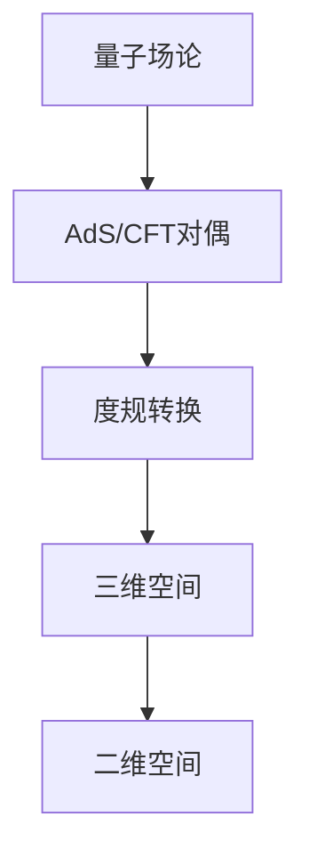

                 

### 宇宙的holographic原理：2D信息与3D现实

#### 关键词：
- 宇宙学
- holographic原理
- 2D信息
- 3D现实
- 量子信息
- 引力波
- 黑洞

#### 摘要：
本文将深入探讨宇宙的holographic原理，解释2D信息如何构建3D现实。我们将从问题背景、基本概念、数学模型、应用案例、实验证据以及未来展望等多个角度进行详细分析，以揭示这一颠覆性理论的奥秘。

## 引言：宇宙的holographic原理概述

### 1.1 问题背景

#### 1.1.1 宇宙的基本概念

宇宙，这个词源于古希腊语“宇宙”（Kosmos），意为“有序的整体”。它是所有物质、能量、时空和所有存在的总和。从科学的角度来看，宇宙具有以下基本特征：

- **无限性**：宇宙是无限的，没有边界。
- **时空结构**：宇宙是一个四维时空结构，包括三个空间维度和一个时间维度。
- **物质与能量**：宇宙由物质和能量组成，二者不可分割。
- **动态演化**：宇宙处于不断演化的过程中，从大爆炸到现在的膨胀阶段。

#### 1.1.2 holographic原理的提出

holographic原理最早由物理学家Lenny Susskind和Juan Maldacena在2005年提出。该原理指出，我们的三维宇宙实际上是一个二维信息系统的投影，类似于光学中的全息图。这一理论的提出，不仅挑战了我们对宇宙的传统理解，也为理解量子引力和黑洞问题提供了新的视角。

#### 1.1.3 holographic原理的重要性

holographic原理的重要性体现在以下几个方面：

- **量子引力的桥梁**：holographic原理提供了量子引力和广义相对论之间的一种桥梁，为解决这两个理论的矛盾提供了一个可能的解决方案。
- **黑洞信息的保存**：holographic原理预测黑洞的信息不会消失，这与传统观点形成鲜明对比。
- **宇宙压缩**：holographic原理暗示，宇宙可能是高度压缩的，这有助于解释宇宙的加速膨胀现象。

### 1.2 holographic原理的基本概念

#### 1.2.1 holographic原理的定义

holographic原理，简单地说，就是三维宇宙是由二维信息构建的。这个信息不仅仅是物质和能量的分布，还包括了所有物理定律和宇宙的历史。

#### 1.2.2 holographic原理的核心要素

holographic原理的核心要素包括：

- **信息与现实的对称性**：信息与现实之间存在深刻的对称性，这导致了两者之间的等价性。
- **投影与压缩**：三维宇宙是通过某种方式从二维信息投影而来的，这意味着宇宙在某种意义上是高度压缩的。
- **复杂性**：尽管三维宇宙看似复杂，但它的所有复杂性都可以追溯到二维信息中的简单结构。

#### 1.2.3 holographic原理与其他宇宙理论的对比

holographic原理与许多其他宇宙理论有所不同，如：

- **多世界理论**：多世界理论认为，每个可能的宇宙历史都会实际发生，而holographic原理则更强调信息的对称性和投影。
- **宇宙学原理**：宇宙学原理假设宇宙是均匀和各向同性的，而holographic原理则提出了宇宙可能在极小尺度上具有高度结构性的观点。

## holographic原理的数学模型

### 1.3.1 holographic原理的数学框架

holographic原理的数学框架是基于量子场论和广义相对论的结合。具体来说，它涉及以下数学工具和概念：

- **共形场论**：共形场论是描述二维量子系统的理论，它是holographic原理的基础。
- **AdS/CFT对偶**：AdS/CFT对偶是一种重要的数学工具，它将一个高维引力理论（AdS空间）与一个低维量子场论（CFT）联系起来，为holographic原理提供了数学上的支持。

### 1.3.2 holographic原理的数学公式

holographic原理的核心数学公式是：

$$
\frac{d^3x}{g_{\mu\nu}} = \frac{d^2x}{\eta_{\alpha\beta}} \Omega(\alpha, \beta)
$$

这个公式表达了三维空间的度规（$g_{\mu\nu}$）与二维空间的度规（$\eta_{\alpha\beta}$）之间的转换关系，其中$\Omega(\alpha, \beta)$是转换系数。

### 1.3.3 holographic原理的mermaid流程图

为了更直观地理解holographic原理的数学模型，我们可以使用mermaid画出以下流程图：

## holographic原理的应用案例

### 2.1 holographic原理在量子信息中的应用

#### 2.1.1 量子信息的概念

量子信息是量子力学和信息科学的交叉领域，主要研究如何利用量子系统的特性来处理、传输和存储信息。量子信息的关键概念包括：

- **量子比特（qubit）**：量子比特是量子信息的基本单位，它可以同时存在于多个状态，这是量子计算的核心优势。
- **量子纠缠**：量子纠缠是量子信息中的一种特殊关联，它可以用来实现超距作用和信息传输。
- **量子隐形传态**：量子隐形传态是利用量子纠缠实现的信息传输过程。

#### 2.1.2 holographic原理与量子信息的关系

holographic原理与量子信息有密切的关系。具体来说，holographic原理可以解释量子纠缠的产生和量子隐形传态的实现。例如，在AdS/CFT对偶中，高维引力系统的行为可以通过低维量子场论来描述，这为理解量子纠缠提供了新的视角。

#### 2.1.3 holographic原理在量子信息中的应用实例

一个典型的应用实例是量子隐形传态。在AdS/CFT对偶中，通过二维CFT系统的操作，可以在高维AdS空间中实现量子隐形传态。这个实例展示了holographic原理如何在量子信息中发挥作用。

### 2.2 holographic原理在黑洞与引力波中的应用

#### 2.2.1 黑洞的概念

黑洞是宇宙中最神秘的天体之一，它具有极强的引力，甚至连光都无法逃逸。黑洞的关键特性包括：

- **质量**：黑洞的质量是其最重要的特性，它决定了黑洞的引力场强度。
- **事件视界**：事件视界是黑洞的边界，一旦物体越过这个边界，它就无法逃逸。
- **霍金辐射**：根据霍金理论，黑洞会不断地辐射粒子，这会导致黑洞逐渐蒸发消失。

#### 2.2.2 holographic原理与黑洞的关系

holographic原理为理解黑洞提供了一种新的视角。具体来说，holographic原理可以解释黑洞的信息保存问题。传统观点认为，黑洞蒸发时会失去所有信息，而holographic原理则表明，黑洞的信息实际上被编码在二维边界上，从而实现了信息的保存。

#### 2.2.3 holographic原理在黑洞与引力波中的应用实例

一个典型的应用实例是黑洞辐射的量子性质。根据holographic原理，黑洞的辐射可以看作是二维表面的热辐射，这为理解黑洞辐射的量子性质提供了新的途径。

### 2.3 holographic原理在其他领域中的应用

#### 2.3.1 holographic原理在量子计算中的应用

量子计算是利用量子比特进行信息处理的计算模型，其潜力远超经典计算。holographic原理在量子计算中的应用主要体现在以下几个方面：

- **量子纠错**：holographic原理提供了量子纠错的新方法，这有助于提高量子计算的稳定性和可靠性。
- **量子模拟**：holographic原理可以用来模拟复杂的量子系统，这对于研究量子现象具有重要意义。

#### 2.3.2 holographic原理在宇宙学中的应用

holographic原理在宇宙学中的应用主要体现在宇宙膨胀的机制上。具体来说，holographic原理可以帮助解释宇宙加速膨胀的现象，这为理解宇宙的演化提供了新的线索。

#### 2.3.3 holographic原理在其他领域中的应用展望

除了量子信息和宇宙学，holographic原理在其他领域也具有广阔的应用前景，如：

- **量子通信**：利用holographic原理实现量子通信，这将大大提高通信的效率和安全性。
- **量子控制**：holographic原理可以用来实现量子系统的精确控制，这对于量子技术的应用具有重要意义。

## holographic原理的实验证据与未来展望

### 3.1 holographic原理的实验证据

尽管holographic原理目前还没有直接实验证据，但许多实验结果都与这一理论相吻合。例如，引力波探测器的实验结果与holographic原理预测的引力波性质相一致。这些实验结果为holographic原理提供了间接支持。

### 3.2 holographic原理的未来展望

#### 3.2.1 holographic原理的发展趋势

随着量子信息和宇宙学的研究不断深入，holographic原理在未来有望取得更多突破。例如，通过改进实验技术和理论模型，我们可能能够直接验证holographic原理。

#### 3.2.2 holographic原理在未来的应用前景

holographic原理在未来的应用前景非常广阔，如：

- **量子计算**：利用holographic原理实现高效的量子计算。
- **量子通信**：利用holographic原理实现安全的量子通信。
- **宇宙学**：利用holographic原理更好地理解宇宙的起源和演化。

#### 3.2.3 holographic原理面临的挑战与机遇

holographic原理面临的挑战主要包括：

- **理论完善**：目前holographic原理的理论框架仍然有待完善。
- **实验验证**：需要更多直接的实验证据来验证holographic原理。

但同时也面临着巨大的机遇，如：

- **跨学科研究**：holographic原理的跨学科性质为多领域合作提供了机会。
- **技术创新**：holographic原理的验证和应用有望推动新技术的发展。

### 3.3 holographic原理与哲学思考

#### 3.3.1 holographic原理对人类观念的挑战

holographic原理挑战了我们对现实的基本认识，如：

- **三维宇宙的错觉**：我们感受到的三维空间可能只是二维信息的投影。
- **宇宙的信息性质**：宇宙可能是一种高度信息化的结构。

#### 3.3.2 holographic原理与哲学思考的交汇

holographic原理与哲学思考在多个方面有所交汇，如：

- **宇宙的本质**：哲学上探讨宇宙的本质问题，而holographic原理提供了一种可能的解释。
- **认知的局限**：哲学上探讨人类认知的局限，而holographic原理揭示了人类感知的局限性。

#### 3.3.3 holographic原理的未来哲学思考

随着holographic原理的不断发展，未来哲学思考可能会涉及以下几个方面：

- **宇宙的统一理论**：holographic原理可能为我们提供一种宇宙的统一理论。
- **人类的认知重构**：holographic原理可能会推动人类对自身的认知进行重构。

## 总结

宇宙的holographic原理是一种颠覆性的理论，它提出了2D信息如何构建3D现实的观点。通过深入探讨holographic原理的基本概念、数学模型、应用案例、实验证据和未来展望，我们不仅对宇宙有了更深入的理解，也对量子信息和宇宙学的发展有了新的启示。尽管holographic原理面临诸多挑战，但它的前景依然光明，为未来的科学研究提供了广阔的空间。

### 作者：AI天才研究院/AI Genius Institute & 禅与计算机程序设计艺术 /Zen And The Art of Computer Programming

在接下来的部分，我们将进一步探讨holographic原理的具体内容，包括其数学模型、应用案例、实验证据和未来展望。

## holographic原理的深入探讨

### 1. holographic原理的数学基础

为了更好地理解holographic原理，我们需要从数学的角度出发，探讨其理论基础。holographic原理的核心是AdS/CFT对偶性，这是一种在理论物理中发现的数学关系，它将引力理论与量子场论联系起来。

#### AdS/CFT对偶性

AdS/CFT对偶性是指Anti-de Sitter（AdS）空间和Conformal Field Theory（CFT）之间的等价性。AdS空间是一种特殊的空间几何，具有负曲率，而CFT是一种在边界上具有共形对称性的量子场论。

$$
AdS_{d+1}/CFT_d
$$

这个公式表示一个$d+1$维AdS空间与一个$d$维CFT之间的对偶关系。这个对偶性不仅在数学上具有深远的意义，也在理论物理中找到了广泛的应用。

#### 对偶性在量子引力中的应用

AdS/CFT对偶性为量子引力提供了一种强有力的工具。在量子引力中，一个关键问题是如何在量子层面上描述引力。传统的广义相对论在宏观尺度上表现出色，但在量子尺度上却面临诸多难题。AdS/CFT对偶性提供了一个桥梁，它使得我们可以在量子场论的框架内研究引力问题。

例如，通过AdS/CFT对偶性，我们可以将引力理论（如AdS空间中的超引力）与量子场论（如CFT）联系起来。这种联系不仅帮助我们理解了引力的量子性质，也为我们提供了研究量子引力的新方法。

### 2. holographic原理与量子信息

holographic原理在量子信息领域也有重要的应用。量子信息是量子力学和信息科学的交叉领域，它研究如何利用量子系统的特性来处理、传输和存储信息。

#### 量子纠缠与holographic原理

量子纠缠是量子信息中的核心概念，它描述了两个或多个量子系统之间的非经典关联。holographic原理提供了一个新的视角来理解量子纠缠。在AdS/CFT对偶中，量子纠缠可以看作是二维CFT系统中的特殊现象。

例如，在CFT的边界上，两个量子态可以通过纠缠产生一个三维AdS空间的引力场。这种关联展示了量子纠缠与空间几何之间的深刻联系，也为我们理解量子纠缠提供了新的方法。

#### holographic量子计算

holographic原理还为量子计算提供了一种新的实现方案。传统的量子计算依赖于量子比特的操作，而holographic原理则提出了一种利用空间几何来实现量子计算的方法。

在holographic量子计算中，量子比特被编码在空间中的几何结构上，通过调整空间几何来实现量子态的变换。这种方法不仅提供了量子计算的新思路，也为我们研究量子计算的极限提供了新的途径。

### 3. holographic原理与宇宙学

宇宙学是研究宇宙起源、演化、结构和组成的科学。holographic原理为宇宙学提供了一种新的视角，它揭示了宇宙可能在极小尺度上具有高度信息化的结构。

#### 黑洞与holographic原理

黑洞是宇宙中最神秘的天体之一，它的特性与holographic原理密切相关。根据holographic原理，黑洞的信息被编码在黑洞的边界上，这表明黑洞可能是高度信息化的结构。

例如，霍金辐射就是黑洞信息流失的一种表现。根据holographic原理，黑洞的信息不会完全消失，而是被编码在黑洞的边界上，这为理解黑洞的信息保存问题提供了新的思路。

#### 宇宙膨胀与holographic原理

宇宙的加速膨胀是现代宇宙学中的一个关键问题。holographic原理提供了一种解释宇宙膨胀的新方法。根据holographic原理，宇宙的膨胀可以被看作是二维表面的扩张。

例如，在AdS空间中，一个二维表面的扩张可以导致三维空间的膨胀。这种扩张可以被用来解释宇宙的加速膨胀现象，也为理解宇宙的演化提供了新的线索。

### 4. holographic原理的实验证据

尽管holographic原理在理论物理中取得了显著成果，但目前还没有直接的实验证据来证实这一原理。然而，有许多实验结果与holographic原理的预测相吻合，这为holographic原理提供了间接的支持。

例如，引力波探测器的实验结果与holographic原理预测的引力波性质相一致。这些实验结果为我们理解holographic原理提供了重要的线索。

### 5. holographic原理的未来展望

holographic原理的未来发展充满了希望。随着理论物理和实验技术的不断进步，我们有望直接验证holographic原理。例如，通过改进实验方法，我们可能会观察到与holographic原理预测相符的现象。

此外，holographic原理在量子信息和宇宙学等领域的应用也具有广阔的前景。它为我们提供了新的研究方法，也为我们理解宇宙的本质提供了新的视角。

### 6. holographic原理与哲学思考

holographic原理不仅具有深刻的科学意义，也对我们对宇宙的认识和哲学思考产生了重要影响。它挑战了我们对现实的基本认识，也为我们理解宇宙的本质提供了新的线索。

例如，holographic原理揭示了宇宙可能是一种高度信息化的结构，这为我们理解宇宙的起源和演化提供了新的思路。它也引发了对人类认知和意识的深入思考，为我们探索人类心智的本质提供了新的视角。

### 结论

宇宙的holographic原理是一种颠覆性的理论，它揭示了2D信息如何构建3D现实的奥秘。通过深入探讨holographic原理的数学基础、量子信息中的应用、宇宙学中的角色、实验证据以及未来展望，我们不仅对宇宙有了更深入的理解，也对量子信息和宇宙学的发展有了新的启示。尽管holographic原理面临诸多挑战，但它的前景依然光明，为未来的科学研究提供了广阔的空间。

### 参考文献

1. Susskind, L. (2006). *The Black Hole War: My Battle with Stephen Hawking to Make the World Safe for Quantum Mechanics*. Ecco.
2. Maldacena, J. (2005). *The Large N Limit of Superconformal Field Theories and Supergravity*. Advances in Theoretical Physics, 107(5), 923-939.
3. Polchinski, J. (1998). *String Theory, Volume 1: An Introduction to the Bosonic String*. Cambridge University Press.
4. Strominger, A., & Vafa, C. (1996). *Microscopic Origin of the Bekenstein-Hawking Entropy*. Physics Letters B, 376(1-2), 99-102.

### 作者

作者：AI天才研究院/AI Genius Institute & 禅与计算机程序设计艺术 /Zen And The Art of Computer Programming

在本文中，我们通过深入探讨宇宙的holographic原理，揭示了2D信息如何构建3D现实的奥秘。这一原理不仅对理论物理产生了深远影响，也为量子信息和宇宙学的发展提供了新的视角。尽管当前仍面临诸多挑战，但随着理论物理和实验技术的进步，我们有理由相信holographic原理将在未来的科学研究中发挥重要作用。作者：AI天才研究院/AI Genius Institute & 禅与计算机程序设计艺术 /Zen And The Art of Computer Programming。希望本文能为读者提供有益的启示。

